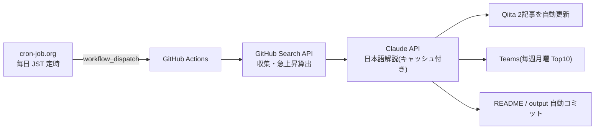

# Claude Code向けMCPツール候補ランキング

GitHub Search APIを使って、Claude Code周辺で活用候補になりそうなMCP関連リポジトリを定期収集するリポジトリです。

> 注意: この一覧は「Claude Codeでの動作」を保証するものではありません。  
> GitHub上のリポジトリ名・説明文・READMEなどに含まれる情報をもとに、MCP関連ツール候補を探すための入口として利用します。

## 仕組み(定常自律運転)

このランキングは cron-job.org → GitHub Actions → Claude API → Qiita / Teams のパイプラインで、毎日無人更新されています。



- 仕組みの詳細と**ライブ稼働ステータス**: [定常自律運転ページ](https://takanobusano.github.io/mcp-github-ranking/)
- 作り方の解説記事: [パイプライン編](https://qiita.com/4q_sano/items/913e93ee5cc2731561fc) / [cron-job.org 完全自動化編](https://qiita.com/4q_sano/items/1bc5e0669a8f0166936c)
<!-- MCP_REPOS_START -->
最終更新: **2026-07-23 08:17:14 JST**

MCP関連リポジトリに加え、Claude Code周辺で活用候補になりそうな関連ツールをGitHub Search APIで毎日自動収集してランキング化しています。

Stars / Forks の差分は、UTC基準の前日データ（2026-07-21）との差分です。
CSVには最大500件を保存し、本文では上位100件を表示しています。

> 注意: この一覧はClaude Codeでの動作を保証するものではありません。  
> MCP関連ツールまたはClaude Code関連ツール候補を探すための入口として利用してください。

# 注目MCP・関連ツール候補ランキング

## 1位 [public-apis/public-apis](https://github.com/public-apis/public-apis)

A collective list of free APIs

⭐ **452,017 Stars**（+184）　🍴 **49,760 Forks**（+30）　/　🟢 **1,588 Open Issues**　/　Python

Topics: `api` / `apis` / `dataset` / `development` / `free` / `list` / `lists` / `open-source`

## 2位 [obra/superpowers](https://github.com/obra/superpowers)

An agentic skills framework & software development methodology that works.

⭐ **259,417 Stars**（+665）　🍴 **23,125 Forks**（+61）　/　🟢 **332 Open Issues**　/　Shell

Topics: `ai` / `brainstorming` / `coding` / `obra` / `sdlc` / `skills` / `subagent-driven-development` / `superpowers`

## 3位 [affaan-m/ECC](https://github.com/affaan-m/ECC)

The agent harness performance optimization system. Skills, instincts, memory, security, and research-first development for Claude Code, Codex, Opencode, Cursor and beyond.

⭐ **232,214 Stars**（+324）　🍴 **35,410 Forks**（+32）　/　🟢 **100 Open Issues**　/　JavaScript

Topics: `ai-agents` / `anthropic` / `claude` / `claude-code` / `developer-tools` / `llm` / `mcp` / `productivity`

## 4位 [NousResearch/hermes-agent](https://github.com/NousResearch/hermes-agent)

The agent that grows with you

⭐ **218,954 Stars**（+576）　🍴 **41,481 Forks**（+189）　/　🟢 **24,750 Open Issues**　/　Python

Topics: `ai` / `ai-agent` / `ai-agents` / `anthropic` / `chatgpt` / `claude` / `claude-code` / `clawdbot`

## 5位 [multica-ai/andrej-karpathy-skills](https://github.com/multica-ai/andrej-karpathy-skills)

A single CLAUDE.md file to improve Claude Code behavior, derived from Andrej Karpathy's observations on LLM coding pitfalls.

⭐ **195,416 Stars**（+339）　🍴 **20,113 Forks**（+25）　/　🟢 **124 Open Issues**　/　不明

Topics: `topicなし`

## 6位 [ultraworkers/claw-code](https://github.com/ultraworkers/claw-code)

An agent-managed museum exhibit, built in Rust with Gajae-Code / LazyCodex — developed and maintained with no human intervention.

⭐ **194,852 Stars**（+4）　🍴 **109,538 Forks**（-29）　/　🟢 **32 Open Issues**　/　Rust

Topics: `topicなし`

## 7位 [mattpocock/skills](https://github.com/mattpocock/skills)

Skills for Real Engineers. Straight from my .agents directory.

⭐ **182,265 Stars**（+1,889）　🍴 **15,560 Forks**（+144）　/　🟢 **212 Open Issues**　/　Shell

Topics: `topicなし`

## 8位 [ollama/ollama](https://github.com/ollama/ollama)

Get up and running with Kimi-K2.6, GLM-5.2, MiniMax, DeepSeek, gpt-oss, Qwen, Gemma and other models.

⭐ **176,662 Stars**（+62）　🍴 **17,064 Forks**（+9）　/　🟢 **3,509 Open Issues**　/　Go

Topics: `deepseek` / `gemma` / `gemma3` / `glm` / `go` / `golang` / `gpt-oss` / `llama`

## 9位 [anthropics/skills](https://github.com/anthropics/skills)

Public repository for Agent Skills

⭐ **163,423 Stars**（+238）　🍴 **19,386 Forks**（+32）　/　🟢 **1,042 Open Issues**　/　Python

Topics: `agent-skills`

## 10位 [firecrawl/firecrawl](https://github.com/firecrawl/firecrawl)

The API to search, scrape, and interact with the web at scale. 🔥

⭐ **154,525 Stars**（+489）　🍴 **8,801 Forks**（+15）　/　🟢 **439 Open Issues**　/　TypeScript

Topics: `ai` / `ai-agents` / `ai-crawler` / `ai-scraping` / `ai-search` / `crawler` / `data-extraction` / `html-to-markdown`

## 11位 [langflow-ai/langflow](https://github.com/langflow-ai/langflow)

Langflow is a powerful tool for building and deploying AI-powered agents and workflows.

⭐ **152,227 Stars**（+56）　🍴 **9,626 Forks**（+7）　/　🟢 **975 Open Issues**　/　Python

Topics: `agents` / `chatgpt` / `generative-ai` / `large-language-models` / `multiagent` / `react-flow`

## 12位 [x1xhlol/system-prompts-and-models-of-ai-tools](https://github.com/x1xhlol/system-prompts-and-models-of-ai-tools)

FULL Augment Code, Claude Code, Cluely, CodeBuddy, Comet, Cursor, Devin AI, Junie, Kiro, Leap.new, Lovable, Manus, NotionAI, Orchids.app, Perplexity, Poke, Qoder, Replit, Same.dev, Trae, Traycer AI, VSCode Agent, Warp.dev, Windsurf, Xcode, Z.ai Code, Dia & v0. (And other Open Sourced) System Prompts, Internal Tools & AI Models

⭐ **142,185 Stars**（+38）　🍴 **34,822 Forks**（+4）　/　🟢 **158 Open Issues**　/　不明

Topics: `ai` / `bolt` / `cluely` / `copilot` / `cursor` / `cursorai` / `devin` / `github-copilot`

## 13位 [anthropics/claude-code](https://github.com/anthropics/claude-code)

Claude Code is an agentic coding tool that lives in your terminal, understands your codebase, and helps you code faster by executing routine tasks, explaining complex code, and handling git workflows - all through natural language commands.

⭐ **138,730 Stars**（+134）　🍴 **22,258 Forks**（+18）　/　🟢 **12,854 Open Issues**　/　Python

Topics: `topicなし`

## 14位 [msitarzewski/agency-agents](https://github.com/msitarzewski/agency-agents)

A complete AI agency at your fingertips - From frontend wizards to Reddit community ninjas, from whimsy injectors to reality checkers. Each agent is a specialized expert with personality, processes, and proven deliverables.

⭐ **135,862 Stars**（+481）　🍴 **22,119 Forks**（+70）　/　🟢 **102 Open Issues**　/　Shell

Topics: `topicなし`

## 15位 [garrytan/gstack](https://github.com/garrytan/gstack)

Use Garry Tan's exact Claude Code setup: 23 opinionated tools that serve as CEO, Designer, Eng Manager, Release Manager, Doc Engineer, and QA

⭐ **123,727 Stars**（+298）　🍴 **18,533 Forks**（+48）　/　🟢 **775 Open Issues**　/　TypeScript

Topics: `topicなし`

## 16位 [farion1231/cc-switch](https://github.com/farion1231/cc-switch)

A cross-platform desktop All-in-One assistant for Claude Code, Codex, OpenCode, OpenClaw, Grok Build & Hermes Agent. Only official website: ccswitch.io

⭐ **120,147 Stars**（+394）　🍴 **8,063 Forks**（+24）　/　🟢 **2,047 Open Issues**　/　Rust

Topics: `ai-tools` / `claude-code` / `codex` / `desktop-app` / `grok` / `grokbuild` / `hermes` / `hermes-agent`

## 17位 [nextlevelbuilder/ui-ux-pro-max-skill](https://github.com/nextlevelbuilder/ui-ux-pro-max-skill)

An AI SKILL that provide design intelligence for building professional UI/UX multiple platforms

⭐ **108,957 Stars**（+416）　🍴 **11,598 Forks**（+50）　/　🟢 **123 Open Issues**　/　Python

Topics: `ai-skills` / `antigravity` / `claude` / `claude-code` / `codex` / `command-line` / `copilot` / `cursor-ai`

## 18位 [google-gemini/gemini-cli](https://github.com/google-gemini/gemini-cli)

An open-source AI agent that brings the power of Gemini directly into your terminal.

⭐ **106,134 Stars**（+23）　🍴 **14,295 Forks**（+4）　/　🟢 **1,403 Open Issues**　/　TypeScript

Topics: `ai` / `ai-agents` / `cli` / `gemini` / `gemini-api` / `mcp-client` / `mcp-server`

## 19位 [browser-use/browser-use](https://github.com/browser-use/browser-use)

🌐 Make websites accessible for AI agents. Automate tasks online with ease.

⭐ **106,131 Stars**（+198）　🍴 **11,671 Forks**（+10）　/　🟢 **319 Open Issues**　/　Python

Topics: `ai-agents` / `ai-tools` / `browser-automation` / `browser-use` / `llm` / `playwright` / `python`

## 20位 [harry0703/MoneyPrinterTurbo](https://github.com/harry0703/MoneyPrinterTurbo)

利用 AI 大模型和自动化工作流，根据主题或关键词一键生成高清短视频。Generate HD short videos from a topic or keyword with an automated AI workflow.

⭐ **98,666 Stars**（+170）　🍴 **14,595 Forks**（+35）　/　🟢 **2 Open Issues**　/　Python

Topics: `ai-video-generator` / `content-creation` / `ffmpeg` / `instagram-reels` / `llm` / `python` / `short-video` / `subtitles`

## 21位 [puppeteer/puppeteer](https://github.com/puppeteer/puppeteer)

JavaScript API for Chrome and Firefox

⭐ **95,331 Stars**（±0）　🍴 **9,540 Forks**（±0）　/　🟢 **282 Open Issues**　/　TypeScript

Topics: `automation` / `chrome` / `chromium` / `developer-tools` / `firefox` / `headless-chrome` / `node-module` / `testing`

## 22位 [TauricResearch/TradingAgents](https://github.com/TauricResearch/TradingAgents)

TradingAgents: Multi-Agents LLM Financial Trading Framework

⭐ **94,108 Stars**（+136）　🍴 **18,180 Forks**（+22）　/　🟢 **300 Open Issues**　/　Python

Topics: `agent` / `finance` / `llm` / `multiagent` / `trading`

## 23位 [Graphify-Labs/graphify](https://github.com/Graphify-Labs/graphify)

Turn any codebase, with its docs, SQL schemas, configs, and PDFs, into a queryable knowledge graph. A /graphify skill for Claude Code, Cursor, Codex, and Gemini CLI: local deterministic AST parsing, every edge explained, no vector store.

⭐ **93,886 Stars**（+771）　🍴 **9,095 Forks**（+57）　/　🟢 **602 Open Issues**　/　Python

Topics: `ai-agents` / `antigravity` / `ast` / `claude-code` / `code-analysis` / `code-search` / `codex` / `cursor`

## 24位 [microsoft/playwright](https://github.com/microsoft/playwright)

Playwright is a framework for Web Testing and Automation. It allows testing Chromium, Firefox and WebKit with a single API.

⭐ **93,277 Stars**（+47）　🍴 **6,135 Forks**（+10）　/　🟢 **163 Open Issues**　/　TypeScript

Topics: `automation` / `chrome` / `chromium` / `e2e-testing` / `electron` / `end-to-end-testing` / `firefox` / `javascript`

## 25位 [JuliusBrussee/caveman](https://github.com/JuliusBrussee/caveman)

🪨 why use many token when few token do trick — Claude Code skill that cuts 65% of tokens by talking like caveman

⭐ **92,085 Stars**（+343）　🍴 **5,223 Forks**（+17）　/　🟢 **414 Open Issues**　/　JavaScript

Topics: `ai` / `anthropic` / `caveman` / `claude` / `claude-code` / `llm` / `meme` / `prompt-engineering`

## 26位 [modelcontextprotocol/servers](https://github.com/modelcontextprotocol/servers)

Model Context Protocol Servers

⭐ **88,790 Stars**（+60）　🍴 **11,275 Forks**（+7）　/　🟢 **679 Open Issues**　/　TypeScript

Topics: `topicなし`

## 27位 [ChatGPTNextWeb/NextChat](https://github.com/ChatGPTNextWeb/NextChat)

✨ Light and Fast AI Assistant. Support: Web \| iOS \| MacOS \| Android \|  Linux \| Windows

⭐ **88,529 Stars**（+2）　🍴 **59,380 Forks**（-5）　/　🟢 **844 Open Issues**　/　TypeScript

Topics: `calclaude` / `chatgpt` / `claude` / `cross-platform` / `desktop` / `fe` / `gemini` / `gemini-pro`

## 28位 [thedotmack/claude-mem](https://github.com/thedotmack/claude-mem)

Persistent Context Across Sessions for Every Agent –  Captures everything your agent does during sessions, compresses it with AI, and injects relevant context back into future sessions. Works with Claude Code, OpenClaw, Codex, Gemini, Hermes, Copilot, OpenCode + More

⭐ **88,257 Stars**（+112）　🍴 **7,660 Forks**（+8）　/　🟢 **356 Open Issues**　/　JavaScript

Topics: `ai` / `ai-agents` / `ai-memory` / `anthropic` / `artificial-intelligence` / `chromadb` / `claude` / `claude-agent-sdk`

## 29位 [DietrichGebert/ponytail](https://github.com/DietrichGebert/ponytail)

Makes your AI agent think like the laziest senior dev in the room. The best code is the code you never wrote.

⭐ **87,871 Stars**（+603）　🍴 **4,809 Forks**（+40）　/　🟢 **99 Open Issues**　/　JavaScript

Topics: `agent-skills` / `ai-agents` / `claude` / `claude-code` / `claude-code-plugin` / `cursor-rules` / `developer-tools` / `llm`

## 30位 [laravel/laravel](https://github.com/laravel/laravel)

Laravel is a web application framework with expressive, elegant syntax. We’ve already laid the foundation for your next big idea — freeing you to create without sweating the small things.

⭐ **84,655 Stars**（+9）　🍴 **24,796 Forks**（+5）　/　🟢 **31 Open Issues**　/　Blade

Topics: `framework` / `laravel` / `php`

## 31位 [OpenHands/OpenHands](https://github.com/OpenHands/OpenHands)

🙌 OpenHands: AI-Driven Development

⭐ **81,729 Stars**（+148）　🍴 **10,449 Forks**（+16）　/　🟢 **369 Open Issues**　/　Python

Topics: `agent` / `artificial-intelligence` / `chatgpt` / `claude-ai` / `cli` / `developer-tools` / `gpt` / `llm`

## 32位 [nexu-io/open-design](https://github.com/nexu-io/open-design)

🎨 The open-source Claude Design alternative. 🖥️ Local-first desktop app. 🖼️ Your coding agent becomes the design engine: prototypes, landing pages, dashboards,...

⭐ **80,728 Stars**（+328）　🍴 **9,317 Forks**（+45）　/　🟢 **634 Open Issues**　/　TypeScript

Topics: `agent-skills` / `ai-agents` / `ai-design` / `byok` / `claude-code-for-design` / `claude-design` / `codex-design` / `coding-agents`

## 33位 [addyosmani/agent-skills](https://github.com/addyosmani/agent-skills)

Production-grade engineering skills for AI coding agents.

⭐ **79,868 Stars**（+190）　🍴 **8,598 Forks**（+23）　/　🟢 **126 Open Issues**　/　JavaScript

Topics: `agent-skills` / `antigravity` / `claude-code` / `codex` / `cursor` / `skills`

## 34位 [bytedance/deer-flow](https://github.com/bytedance/deer-flow)

An open-source long-horizon SuperAgent harness that researches, codes, and creates. With the help of sandboxes, memories, tools, skill, subagents and message gateway, it handles different levels of tasks that could take minutes to hours.

⭐ **77,613 Stars**（+70）　🍴 **10,566 Forks**（+14）　/　🟢 **982 Open Issues**　/　Python

Topics: `agent` / `agentic` / `agentic-framework` / `agentic-workflow` / `ai` / `ai-agents` / `deep-research` / `harness`

## 35位 [OpenCut-app/OpenCut](https://github.com/OpenCut-app/OpenCut)

The open-source CapCut alternative

⭐ **77,553 Stars**（+598）　🍴 **7,759 Forks**（+47）　/　🟢 **357 Open Issues**　/　TypeScript

Topics: `editor` / `oss` / `videoeditor`

## 36位 [Egonex-AI/Understand-Anything](https://github.com/Egonex-AI/Understand-Anything)

Graphs that teach > graphs that impress. Turn any code into an interactive knowledge graph you can explore, search, and ask questions about. Works with Claude Code, Codex, Cursor, Copilot, Gemini CLI, and more.

⭐ **75,651 Stars**（+164）　🍴 **6,295 Forks**（+7）　/　🟢 **259 Open Issues**　/　TypeScript

Topics: `antigravity-skills` / `business-knowledge` / `claude-code` / `claude-skills` / `codebase-analysis` / `codex` / `codex-skills` / `developer-tools-ai-agent`

## 37位 [opendatalab/MinerU](https://github.com/opendatalab/MinerU)

Transforms complex documents like PDFs and Office docs into LLM-ready markdown/JSON for your Agentic workflows.

⭐ **75,464 Stars**（+138）　🍴 **6,336 Forks**（+8）　/　🟢 **63 Open Issues**　/　Python

Topics: `ai4science` / `document-analysis` / `docx` / `extract-data` / `layout-analysis` / `ocr` / `parser` / `pdf`

## 38位 [paperclipai/paperclip](https://github.com/paperclipai/paperclip)

The open-source app everyone uses to manage agents at work

⭐ **74,499 Stars**（+108）　🍴 **13,870 Forks**（+26）　/　🟢 **4,864 Open Issues**　/　TypeScript

Topics: `topicなし`

## 39位 [unclecode/crawl4ai](https://github.com/unclecode/crawl4ai)

🚀🤖 Crawl4AI: Open-source LLM Friendly Web Crawler & Scraper. Don't be shy, join here:

⭐ **74,174 Stars**（+298）　🍴 **7,627 Forks**（+30）　/　🟢 **117 Open Issues**　/　Python

Topics: `topicなし`

## 40位 [Eugeny/tabby](https://github.com/Eugeny/tabby)

A terminal for a more modern age

⭐ **73,421 Stars**（+28）　🍴 **4,168 Forks**（+2）　/　🟢 **2,790 Open Issues**　/　TypeScript

Topics: `serial` / `ssh-client` / `telnet-client` / `terminal` / `terminal-emulators`

## 41位 [abi/screenshot-to-code](https://github.com/abi/screenshot-to-code)

Drop in a screenshot and convert it to clean code (HTML/Tailwind/React/Vue)

⭐ **73,421 Stars**（+13）　🍴 **9,030 Forks**（±0）　/　🟢 **122 Open Issues**　/　Python

Topics: `topicなし`

## 42位 [thedaviddias/Front-End-Checklist](https://github.com/thedaviddias/Front-End-Checklist)

🗂 The essential checklist for modern web development, for humans and AI agents

⭐ **73,278 Stars**（+10）　🍴 **6,654 Forks**（+2）　/　🟢 **4 Open Issues**　/　MDX

Topics: `ai-agent` / `ai-agents` / `checklist` / `css` / `front-end-developer-tool` / `front-end-development` / `frontend` / `guidelines`

## 43位 [rtk-ai/rtk](https://github.com/rtk-ai/rtk)

CLI proxy that reduces LLM token consumption by 60-90% on common dev commands. Single Rust binary, zero dependencies

⭐ **72,635 Stars**（+258）　🍴 **4,525 Forks**（+18）　/　🟢 **1,700 Open Issues**　/　Rust

Topics: `agentic-coding` / `ai-coding` / `anthropic` / `claude-code` / `cli` / `command-line-tool` / `cost-reduction` / `developer-tools`

## 44位 [daytonaio/daytona](https://github.com/daytonaio/daytona)

Daytona is a Secure and Elastic Infrastructure for Running AI-Generated Code

⭐ **72,204 Stars**（±0）　🍴 **5,669 Forks**（+1）　/　🟢 **443 Open Issues**　/　不明

Topics: `agentic-workflow` / `ai` / `ai-agents` / `ai-runtime` / `ai-sandboxes` / `code-execution` / `code-interpreter` / `developer-tools`

## 45位 [shareAI-lab/learn-claude-code](https://github.com/shareAI-lab/learn-claude-code)

Bash is all you need -  A nano claude code–like 「agent harness」, built from 0 to 1

⭐ **71,946 Stars**（+119）　🍴 **11,668 Forks**（+11）　/　🟢 **70 Open Issues**　/　Python

Topics: `agent` / `agent-development` / `ai-agent` / `claude` / `claude-code` / `educational` / `llm` / `python`

## 46位 [OpenBB-finance/OpenBB](https://github.com/OpenBB-finance/OpenBB)

Open Data Platform for analysts, quants and AI agents.

⭐ **70,884 Stars**（+37）　🍴 **7,207 Forks**（+4）　/　🟢 **80 Open Issues**　/　Python

Topics: `ai` / `crypto` / `derivatives` / `economics` / `equity` / `finance` / `fixed-income` / `machine-learning`

## 47位 [D4Vinci/Scrapling](https://github.com/D4Vinci/Scrapling)

🕷️ An adaptive Web Scraping framework that handles everything from a single request to a full-scale crawl!

⭐ **70,761 Stars**（+211）　🍴 **7,018 Forks**（+15）　/　🟢 **5 Open Issues**　/　Python

Topics: `ai` / `ai-scraping` / `automation` / `crawler` / `crawling` / `crawling-python` / `data` / `data-extraction`

## 48位 [koala73/worldmonitor](https://github.com/koala73/worldmonitor)

Real-time global intelligence dashboard. AI-powered news aggregation, geopolitical monitoring, and infrastructure tracking in a unified situational awareness interface

⭐ **68,829 Stars**（+3,604）　🍴 **10,524 Forks**（+351）　/　🟢 **252 Open Issues**　/　TypeScript

Topics: `agent` / `ai` / `dashboard` / `geopolitics` / `mcp` / `mcp-server` / `monitoring` / `news`

## 49位 [unslothai/unsloth](https://github.com/unslothai/unsloth)

Unsloth is a local UI for training and running Gemma 4, Qwen3.6, DeepSeek, Kimi, GLM and other models.

⭐ **68,746 Stars**（+61）　🍴 **6,177 Forks**（+3）　/　🟢 **987 Open Issues**　/　Python

Topics: `agent` / `deepseek` / `fine-tuning` / `gemma` / `gemma3` / `gpt-oss` / `llama` / `llama3`

## 50位 [openinterpreter/openinterpreter](https://github.com/openinterpreter/openinterpreter)

A coding agent for open models like Kimi K3

⭐ **67,137 Stars**（+84）　🍴 **5,767 Forks**（+9）　/　🟢 **291 Open Issues**　/　Rust

Topics: `acp` / `coding-agent` / `deepseek` / `kimi` / `qwen` / `rust`

## 51位 [xtekky/gpt4free](https://github.com/xtekky/gpt4free)

The official gpt4free repository \| various collection of powerful language models \| opus 4.6 gpt 5.3 kimi 2.5 deepseek v3.2 gemini 3

⭐ **66,477 Stars**（±0）　🍴 **13,531 Forks**（+2）　/　🟢 **8 Open Issues**　/　Python

Topics: `chatbot` / `chatbots` / `chatgpt` / `chatgpt-4` / `chatgpt-api` / `chatgpt-free` / `chatgpt4` / `deepseek`

## 52位 [bradtraversy/design-resources-for-developers](https://github.com/bradtraversy/design-resources-for-developers)

Curated list of design and UI resources from stock photos, web templates, CSS frameworks, UI libraries, tools and much more

⭐ **66,474 Stars**（+12）　🍴 **12,117 Forks**（+3）　/　🟢 **62 Open Issues**　/　不明

Topics: `topicなし`

## 53位 [code-yeongyu/oh-my-openagent](https://github.com/code-yeongyu/oh-my-openagent)

omo/lazycodex: The coding agent for tokenmaxxers;the one and only agent harness for complex codebases. For your Codex, for your OpenCode

⭐ **66,400 Stars**（+53）　🍴 **5,410 Forks**（+7）　/　🟢 **903 Open Issues**　/　TypeScript

Topics: `ai` / `ai-agents` / `anthropic` / `chatgpt` / `claude` / `claude-skills` / `codex` / `cursor`

## 54位 [Leonxlnx/taste-skill](https://github.com/Leonxlnx/taste-skill)

Taste-Skill - gives your AI good taste. stops the AI from generating boring, generic slop

⭐ **66,393 Stars**（+376）　🍴 **4,582 Forks**（+22）　/　🟢 **50 Open Issues**　/　JavaScript

Topics: `agent` / `ai` / `claude` / `claude-code` / `codex` / `coding` / `design` / `frontend`

## 55位 [ruvnet/ruflo](https://github.com/ruvnet/ruflo)

🌊 The leading agent meta-harness. Deploy intelligent multi-player swarms, coordinate autonomous workflows, and build conversational AI systems. Features adaptiv...

⭐ **65,567 Stars**（+134）　🍴 **7,785 Forks**（+15）　/　🟢 **815 Open Issues**　/　TypeScript

Topics: `agentic-ai` / `agentic-framework` / `agentic-workflow` / `agents` / `ai-agents` / `ai-assistant` / `ai-coding` / `ai-skills`

## 56位 [cline/cline](https://github.com/cline/cline)

Autonomous coding agent as an SDK, IDE extension, or CLI assistant.

⭐ **64,938 Stars**（+37）　🍴 **6,969 Forks**（+9）　/　🟢 **1,151 Open Issues**　/　TypeScript

Topics: `topicなし`

## 57位 [docling-project/docling](https://github.com/docling-project/docling)

Get your documents ready for gen AI

⭐ **63,626 Stars**（+56）　🍴 **4,504 Forks**（+8）　/　🟢 **940 Open Issues**　/　Python

Topics: `ai` / `convert` / `document-parser` / `document-parsing` / `documents` / `docx` / `html` / `markdown`

## 58位 [warpdotdev/warp](https://github.com/warpdotdev/warp)

Warp is an agentic development environment, born out of the terminal.

⭐ **63,565 Stars**（+39）　🍴 **5,313 Forks**（+8）　/　🟢 **4,683 Open Issues**　/　Rust

Topics: `bash` / `linux` / `macos` / `rust` / `shell` / `terminal` / `wasm` / `zsh`

## 59位 [shanraisshan/claude-code-best-practice](https://github.com/shanraisshan/claude-code-best-practice)

from vibe coding to agentic engineering - practice makes claude perfect

⭐ **63,303 Stars**（+68）　🍴 **6,321 Forks**（+8）　/　🟢 **16 Open Issues**　/　HTML

Topics: `agentic-ai` / `agentic-coding` / `agentic-engineering` / `agentic-workflow` / `ai` / `ai-agents` / `anthropic` / `best-practices`

## 60位 [Fission-AI/OpenSpec](https://github.com/Fission-AI/OpenSpec)

Spec-driven development (SDD) for AI coding assistants.

⭐ **62,136 Stars**（+201）　🍴 **4,303 Forks**（+18）　/　🟢 **391 Open Issues**　/　TypeScript

Topics: `ai` / `context-engineering` / `engineering` / `planning` / `prd` / `sdd` / `sdlc` / `spec`

## 61位 [colbymchenry/codegraph](https://github.com/colbymchenry/codegraph)

Pre-indexed code knowledge graph, auto syncs on code changes, for Claude Code, Codex, Gemini, Cursor, OpenCode, AntiGravity, Kiro, and Hermes Agent — fewer tokens, fewer tool calls, 100% local

⭐ **61,704 Stars**（+258）　🍴 **3,860 Forks**（+15）　/　🟢 **337 Open Issues**　/　C

Topics: `topicなし`

## 62位 [mem0ai/mem0](https://github.com/mem0ai/mem0)

Universal memory layer for AI Agents

⭐ **61,485 Stars**（+86）　🍴 **7,159 Forks**（+15）　/　🟢 **681 Open Issues**　/　TypeScript

Topics: `agents` / `ai` / `ai-agents` / `application` / `chatbots` / `chatgpt` / `genai` / `llm`

## 63位 [headroomlabs-ai/headroom](https://github.com/headroomlabs-ai/headroom)

Compress tool outputs, logs, files, and RAG chunks before they reach the LLM. 20% fewer tokens for coding agents, 60-95% fewer tokens for JSON, same answers. Library, proxy, MCP server.

⭐ **61,239 Stars**（+235）　🍴 **4,607 Forks**（+22）　/　🟢 **498 Open Issues**　/　Python

Topics: `agent` / `ai` / `anthropic` / `claude-code` / `compression` / `context-engineering` / `context-window` / `cursor`

## 64位 [sansan0/TrendRadar](https://github.com/sansan0/TrendRadar)

⭐AI-driven public opinion & trend monitor with multi-platform aggregation, RSS, and smart alerts.🎯 告别信息过载，你的 AI 舆情监控助手与热点筛选工具！聚合多平台热点 +  RSS 订阅，支持关键词精准筛选。AI 智能筛...

⭐ **60,793 Stars**（+43）　🍴 **24,802 Forks**（+6）　/　🟢 **50 Open Issues**　/　Python

Topics: `ai` / `bark` / `data-analysis` / `docker` / `hot-news` / `llm` / `mail` / `mcp`

## 65位 [tw93/Pake](https://github.com/tw93/Pake)

🤱🏻 Turn any webpage into a desktop app with one command.

⭐ **60,126 Stars**（+43）　🍴 **12,176 Forks**（+10）　/　🟢 **4 Open Issues**　/　Rust

Topics: `chatgpt` / `claude` / `desktop` / `gemini` / `hight-performance` / `linux` / `macos` / `no-electron`

## 66位 [microsoft/autogen](https://github.com/microsoft/autogen)

A programming framework for agentic AI

⭐ **59,903 Stars**（+24）　🍴 **9,018 Forks**（+5）　/　🟢 **969 Open Issues**　/　Python

Topics: `agentic` / `agentic-agi` / `agents` / `ai` / `autogen` / `autogen-ecosystem` / `chatgpt` / `framework`

## 67位 [asgeirtj/system_prompts_leaks](https://github.com/asgeirtj/system_prompts_leaks)

Extracted system prompts from Anthropic - Claude Fable 5, Opus 4.8, Claude Code, Claude Design. OpenAI - ChatGPT GPT-5.6, Codex GPT-5.6, GPT-5.5. Google - Gemini 3.5 Flash, 3.1 Pro, Antigravity. xAI - Grok, Cursor, Copilot, VS Code, Perplexity, and more. Updated regularly.

⭐ **59,741 Stars**（+202）　🍴 **9,734 Forks**（+26）　/　🟢 **41 Open Issues**　/　JavaScript

Topics: `ai` / `ai-agents` / `ai-prompts` / `anthropic` / `chatbot` / `chatgpt` / `claude` / `claude-code`

## 68位 [Panniantong/Agent-Reach](https://github.com/Panniantong/Agent-Reach)

Give your AI agent eyes to see the entire internet. Read & search Twitter, Reddit, YouTube, GitHub, Bilibili, XiaoHongShu — one CLI, zero API fees.

⭐ **59,688 Stars**（+552）　🍴 **4,785 Forks**（+50）　/　🟢 **166 Open Issues**　/　Python

Topics: `agent-infrastructure` / `ai-agent` / `ai-search` / `automation` / `bilibili` / `claude-code` / `cli` / `cursor`

## 69位 [upstash/context7](https://github.com/upstash/context7)

Context7 Platform -- Up-to-date code documentation for LLMs and AI code editors

⭐ **59,607 Stars**（+60）　🍴 **2,855 Forks**（+3）　/　🟢 **23 Open Issues**　/　TypeScript

Topics: `llm` / `mcp` / `mcp-server` / `vibe-coding`

## 70位 [1c7/chinese-independent-developer](https://github.com/1c7/chinese-independent-developer)

👩🏿‍💻👨🏾‍💻👩🏼‍💻👨🏽‍💻👩🏻‍💻中国独立开发者项目列表 -- 分享大家都在做什么

⭐ **59,327 Stars**（+166）　🍴 **5,115 Forks**（+16）　/　🟢 **2 Open Issues**　/　Python

Topics: `china` / `indie` / `indie-developer`

## 71位 [coollabsio/coolify](https://github.com/coollabsio/coolify)

An open-source, self-hostable PaaS alternative to Vercel, Heroku & Netlify that lets you easily deploy static sites, databases, full-stack applications and 280+ one-click services on your own servers.

⭐ **59,288 Stars**（+93）　🍴 **5,115 Forks**（+7）　/　🟢 **799 Open Issues**　/　PHP

Topics: `coolify` / `databases` / `deployment` / `docker` / `docker-compose` / `inertiajs` / `laravel` / `mariadb`

## 72位 [meilisearch/meilisearch](https://github.com/meilisearch/meilisearch)

A lightning-fast search engine API bringing AI-powered hybrid search to your sites and applications.

⭐ **58,697 Stars**（+6）　🍴 **2,633 Forks**（+3）　/　🟢 **302 Open Issues**　/　Rust

Topics: `ai` / `api` / `app-search` / `database` / `enterprise-search` / `faceting` / `full-text-search` / `fuzzy-search`

## 73位 [MemPalace/mempalace](https://github.com/MemPalace/mempalace)

The best-benchmarked open-source AI memory system. And it's free.

⭐ **57,614 Stars**（+47）　🍴 **7,422 Forks**（±0）　/　🟢 **642 Open Issues**　/　Python

Topics: `ai` / `chromadb` / `llm` / `mcp` / `memory` / `python`

## 74位 [zylon-ai/private-gpt](https://github.com/zylon-ai/private-gpt)

Complete API layer for private AI applications on local models: RAG, skills, tools, MCP, text-to-sql, and more. Works with any OpenAI-compatible inference server.

⭐ **57,355 Stars**（±0）　🍴 **7,606 Forks**（+4）　/　🟢 **7 Open Issues**　/　Python

Topics: `ai` / `ai-tools` / `on-premise`

## 75位 [penpot/penpot](https://github.com/penpot/penpot)

Penpot: The open-source design platform for Product teams that need scalable collaboration.

⭐ **57,179 Stars**（+72）　🍴 **3,780 Forks**（+7）　/　🟢 **721 Open Issues**　/　Clojure

Topics: `clojure` / `clojurescript` / `design` / `prototyping` / `ui` / `ux-design` / `ux-experience`

## 76位 [NanmiCoder/MediaCrawler](https://github.com/NanmiCoder/MediaCrawler)

小红书笔记 \| 评论爬虫、抖音视频 \| 评论爬虫、快手视频 \| 评论爬虫、B 站视频 ｜ 评论爬虫、微博帖子 ｜ 评论爬虫、百度贴吧帖子 ｜ 百度贴吧评论回复爬虫  \| 知乎问答文章｜评论爬虫

⭐ **57,116 Stars**（+71）　🍴 **11,424 Forks**（+10）　/　🟢 **180 Open Issues**　/　Python

Topics: `topicなし`

## 77位 [crewAIInc/crewAI](https://github.com/crewAIInc/crewAI)

Framework for orchestrating role-playing, autonomous AI agents. By fostering collaborative intelligence, CrewAI empowers agents to work together seamlessly, tackling complex tasks.

⭐ **55,970 Stars**（+57）　🍴 **7,920 Forks**（+13）　/　🟢 **658 Open Issues**　/　Python

Topics: `agents` / `ai` / `ai-agents` / `aiagentframework` / `llms`

## 78位 [BerriAI/litellm](https://github.com/BerriAI/litellm)

The fastest, litest AI Gateway. Rust core with Python SDK. Call 100+ LLM APIs in OpenAI (or native) format with cost tracking, guardrails, load balancing, and logging [Bedrock, Azure, OpenAI, Anthropic, OpenAI, VertexAI, vLLM, Nvidia NIM]

⭐ **54,393 Stars**（+127）　🍴 **9,981 Forks**（+27）　/　🟢 **4,168 Open Issues**　/　Python

Topics: `ai-gateway` / `anthropic` / `azure-openai` / `bedrock` / `gateway` / `langchain` / `litellm` / `llm`

## 79位 [mvanhorn/last30days-skill](https://github.com/mvanhorn/last30days-skill)

AI agent skill that researches any topic across Reddit, X, YouTube, HN, Polymarket, and the web - then synthesizes a grounded summary

⭐ **53,144 Stars**（+142）　🍴 **4,602 Forks**（+13）　/　🟢 **83 Open Issues**　/　Python

Topics: `ai-prompts` / `ai-skill` / `bluesky` / `claude` / `claude-code` / `clawhub` / `deep-research` / `hackernews`

## 80位 [aaif-goose/goose](https://github.com/aaif-goose/goose)

an open source, extensible AI agent that goes beyond code suggestions - install, execute, edit, and test with any LLM

⭐ **51,493 Stars**（+74）　🍴 **5,662 Forks**（+10）　/　🟢 **357 Open Issues**　/　Rust

Topics: `acp` / `ai` / `ai-agents` / `mcp`

## 81位 [charlax/professional-programming](https://github.com/charlax/professional-programming)

A collection of learning resources for curious software engineers

⭐ **51,284 Stars**（+3）　🍴 **4,004 Forks**（±0）　/　🟢 **5 Open Issues**　/　Python

Topics: `architecture` / `computer-science` / `concepts` / `documentation` / `engineer` / `learning` / `lessons-learned` / `professional`

## 82位 [bmad-code-org/BMAD-METHOD](https://github.com/bmad-code-org/BMAD-METHOD)

Breakthrough Method for Agile Ai Driven Development

⭐ **50,974 Stars**（+57）　🍴 **5,857 Forks**（+9）　/　🟢 **103 Open Issues**　/　JavaScript

Topics: `topicなし`

## 83位 [pbakaus/impeccable](https://github.com/pbakaus/impeccable)

The design language that makes your AI harness better at design.

⭐ **48,781 Stars**（+247）　🍴 **2,844 Forks**（+13）　/　🟢 **36 Open Issues**　/　JavaScript

Topics: `topicなし`

## 84位 [mudler/LocalAI](https://github.com/mudler/LocalAI)

LocalAI is the open-source AI engine. Run any model - LLMs, vision, voice, image, video - on any hardware. No GPU required.

⭐ **47,752 Stars**（+22）　🍴 **4,273 Forks**（+2）　/　🟢 **187 Open Issues**　/　Go

Topics: `agents` / `ai` / `api` / `audio-generation` / `decentralized` / `distributed` / `image-generation` / `libp2p`

## 85位 [oobabooga/textgen](https://github.com/oobabooga/textgen)

Open-source desktop app for local LLMs. Text, vision, tool-calling, OpenAI/Anthropic-compatible API. 100% private.

⭐ **47,482 Stars**（+7）　🍴 **5,979 Forks**（±0）　/　🟢 **836 Open Issues**　/　Python

Topics: `topicなし`

## 86位 [ChromeDevTools/chrome-devtools-mcp](https://github.com/ChromeDevTools/chrome-devtools-mcp)

Chrome DevTools for coding agents

⭐ **47,409 Stars**（+82）　🍴 **3,167 Forks**（+2）　/　🟢 **108 Open Issues**　/　TypeScript

Topics: `browser` / `chrome` / `chrome-devtools` / `debugging` / `devtools` / `mcp` / `mcp-server` / `puppeteer`

## 87位 [prisma/prisma](https://github.com/prisma/prisma)

Next-generation ORM for Node.js & TypeScript \| PostgreSQL, MySQL, MariaDB, SQL Server, SQLite, MongoDB and CockroachDB

⭐ **47,370 Stars**（+7）　🍴 **2,401 Forks**（+2）　/　🟢 **2,535 Open Issues**　/　TypeScript

Topics: `cockroachdb` / `database` / `javascript` / `mariadb` / `mongo` / `mongodb` / `mongodb-orm` / `mssql`

## 88位 [GitHubDaily/GitHubDaily](https://github.com/GitHubDaily/GitHubDaily)

坚持分享 GitHub 上高质量、有趣实用的开源技术教程、开发者工具、编程网站、技术资讯。A list cool, interesting projects of GitHub.

⭐ **47,166 Stars**（+22）　🍴 **4,652 Forks**（+1）　/　🟢 **721 Open Issues**　/　不明

Topics: `ai` / `algorithms-and-data-structures` / `backend` / `developer-tools` / `development` / `frontend` / `github` / `java`

## 89位 [jeecgboot/JeecgBoot](https://github.com/jeecgboot/JeecgBoot)

【低代码 V2.0】AI低代码平台，AI Skills 一句话生成整个系统；一键生成前后端代码甚至整个模块。 AI Skills 一句话画流程、设计表单、生成报表、大屏。内置 AI应用平台涵盖：AI聊天、知识库、流程编排、MCP插件等，兼容主流大模型。引领AI低代码「Skills 生成 → 在线配置 → 代码生成 →...

⭐ **47,152 Stars**（+7）　🍴 **16,108 Forks**（±0）　/　🟢 **40 Open Issues**　/　Java

Topics: `activiti` / `agent` / `ai` / `antd` / `claude-code` / `cli` / `codegenerator` / `codex`

## 90位 [serverless/serverless](https://github.com/serverless/serverless)

⚡ Serverless Framework – Effortlessly build apps that auto-scale, incur zero costs when idle, and require minimal maintenance using AWS Lambda and other managed...

⭐ **46,922 Stars**（+2）　🍴 **5,728 Forks**（±0）　/　🟢 **1,222 Open Issues**　/　JavaScript

Topics: `aws` / `aws-dynamodb` / `aws-lambda` / `azure-functions` / `google-cloud-functions` / `microservice` / `serverless` / `serverless-architectures`

## 91位 [exo-explore/exo](https://github.com/exo-explore/exo)

Run frontier AI locally.

⭐ **46,421 Stars**（+20）　🍴 **3,374 Forks**（+3）　/　🟢 **316 Open Issues**　/　Python

Topics: `topicなし`

## 92位 [apache/airflow](https://github.com/apache/airflow)

Apache Airflow - A platform to programmatically author, schedule, and monitor workflows

⭐ **46,213 Stars**（+10）　🍴 **17,423 Forks**（+10）　/　🟢 **1,754 Open Issues**　/　Python

Topics: `airflow` / `apache` / `apache-airflow` / `automation` / `dag` / `data-engineering` / `data-integration` / `data-orchestrator`

## 93位 [zhayujie/CowAgent](https://github.com/zhayujie/CowAgent)

Open-source super AI assistant & Agent Harness. Plans tasks, runs tools and skills, self-evolves with memory and knowledge. Multi-model, multi-channel. Lightweight, extensible, one-line install. (formerly chatgpt-on-wechat)

⭐ **46,084 Stars**（+9）　🍴 **10,269 Forks**（±0）　/　🟢 **35 Open Issues**　/　Python

Topics: `ai` / `ai-agent` / `ai-agents` / `chatgpt-on-wechat` / `claude` / `claude-code` / `codex` / `cowagent`

## 94位 [KeygraphHQ/shannon](https://github.com/KeygraphHQ/shannon)

Shannon is an autonomous, white-box AI pentester for web applications and APIs. It analyzes your source code, identifies attack vectors, and executes real exploits to prove vulnerabilities before they reach production.

⭐ **46,068 Stars**（+74）　🍴 **5,330 Forks**（+4）　/　🟢 **23 Open Issues**　/　TypeScript

Topics: `penetration-testing` / `pentesting` / `security-audit` / `security-automation` / `security-tools`

## 95位 [HKUDS/CLI-Anything](https://github.com/HKUDS/CLI-Anything)

"CLI-Anything: Making ALL Software Agent-Native" -- CLI-Hub:

⭐ **45,783 Stars**（+81）　🍴 **4,283 Forks**（+7）　/　🟢 **88 Open Issues**　/　Python

Topics: `topicなし`

## 96位 [jamiepine/voicebox](https://github.com/jamiepine/voicebox)

The open-source AI voice studio. Clone, dictate, create.

⭐ **45,723 Stars**（+581）　🍴 **5,583 Forks**（+83）　/　🟢 **579 Open Issues**　/　TypeScript

Topics: `ai` / `cuda` / `mlx` / `qwen3-tts` / `qwen3-tts-ui` / `voice-ai` / `voice-clone` / `whisper`

## 97位 [abhigyanpatwari/GitNexus](https://github.com/abhigyanpatwari/GitNexus)

GitNexus: The Zero-Server Code Intelligence Engine -       GitNexus is a client-side knowledge graph creator that runs entirely in your browser. Drop in a git repository (Github, Gitlab, Azure, Local) or ZIP file, and get an interactive knowledge graph with a built in Graph RAG Agent. Perfect for code exploration

⭐ **44,524 Stars**（+58）　🍴 **4,935 Forks**（+2）　/　🟢 **270 Open Issues**　/　TypeScript

Topics: `topicなし`

## 98位 [router-for-me/CLIProxyAPI](https://github.com/router-for-me/CLIProxyAPI)

Wrap Antigravity, ChatGPT Codex, Claude Code, Grok Build as an OpenAI/Gemini/Claude/Codex compatible API service, allowing you to enjoy the free Gemini 3.1 Pro, GPT 5.5, Grok 4.3, Claude model through API

⭐ **44,305 Stars**（+207）　🍴 **6,946 Forks**（+28）　/　🟢 **357 Open Issues**　/　Go

Topics: `antigravity` / `claude-code` / `cluade` / `codex` / `gemini` / `openai`

## 99位 [janhq/jan](https://github.com/janhq/jan)

Jan is an open source alternative to ChatGPT that runs 100% offline on your computer.

⭐ **43,676 Stars**（+11）　🍴 **2,913 Forks**（+3）　/　🟢 **411 Open Issues**　/　TypeScript

Topics: `chatgpt` / `gpt` / `llamacpp` / `llm` / `localai` / `open-source` / `self-hosted` / `tauri`

## 100位 [ccxt/ccxt](https://github.com/ccxt/ccxt)

A unified trading API with more than 100 crypto exchanges and prediction markets in JavaScript / TypeScript / Python / C# / PHP / Go / Java

⭐ **43,375 Stars**（+8）　🍴 **8,753 Forks**（+1）　/　🟢 **1,208 Open Issues**　/　Python

Topics: `altcoin` / `api` / `arbitrage` / `bitcoin` / `bot` / `btc` / `crypto` / `cryptocurrencies`

# 最近プッシュされたMCP・関連ツール候補

スター数ランキングとは別に、最近コードがプッシュされたリポジトリを表示します。古いスター数だけではなく、現在も開発が動いていそうな候補を探すための一覧です。

## プッシュ順 1位 [Gitlawb/openclaude](https://github.com/Gitlawb/openclaude)

runs anywhere. uses anything

⭐ **30,271 Stars**（+38）　🍴 **8,885 Forks**（+5）　/　TypeScript　/　最終プッシュ: 2026-07-22

Topics: `ai` / `ai-agent` / `ai-tools` / `cli` / `coding`

## プッシュ順 2位 [windmill-labs/windmill](https://github.com/windmill-labs/windmill)

Open-source developer platform to power your entire infra and turn scripts into webhooks, workflows and UIs. Fastest workflow engine (13x vs Airflow). Open-source alternative to Retool and Temporal.

⭐ **17,216 Stars**（+8）　🍴 **1,038 Forks**（+2）　/　Rust　/　最終プッシュ: 2026-07-22

Topics: `low-code` / `open-source` / `platform` / `postgresql` / `python` / `self-hostable` / `typescript`

## プッシュ順 3位 [abhigyanpatwari/GitNexus](https://github.com/abhigyanpatwari/GitNexus)

GitNexus: The Zero-Server Code Intelligence Engine -       GitNexus is a client-side knowledge graph creator that runs entirely in your browser. Drop in a git repository (Github, Gitlab, Azure, Local) or ZIP file, and get an interactive knowledge graph with a built in Graph RAG Agent. Perfect for code exploration

⭐ **44,524 Stars**（+58）　🍴 **4,935 Forks**（+2）　/　TypeScript　/　最終プッシュ: 2026-07-22

Topics: `topicなし`

## プッシュ順 4位 [paperclipai/paperclip](https://github.com/paperclipai/paperclip)

The open-source app everyone uses to manage agents at work

⭐ **74,499 Stars**（+108）　🍴 **13,870 Forks**（+26）　/　TypeScript　/　最終プッシュ: 2026-07-22

Topics: `topicなし`

## プッシュ順 5位 [stablyai/orca](https://github.com/stablyai/orca)

Orca is the ADE for working with a fleet of parallel agents. Run any coding agent with your own subscription. Available on desktop, mobile and VPS.

⭐ **26,048 Stars**（+1,169）　🍴 **1,878 Forks**（+87）　/　TypeScript　/　最終プッシュ: 2026-07-22

Topics: `ade` / `agent-ide` / `ai-agents` / `claude-code` / `cli` / `codex` / `cursor-agent` / `devtools`

## プッシュ順 6位 [ComposioHQ/composio](https://github.com/ComposioHQ/composio)

Composio powers 1000+ toolkits, tool search, context management, authentication, and a sandboxed workbench to help you build AI agents that turn intent into action.

⭐ **29,329 Stars**（+17）　🍴 **4,666 Forks**（-1）　/　TypeScript　/　最終プッシュ: 2026-07-22

Topics: `agentic-ai` / `agents` / `ai` / `ai-agents` / `aiagents` / `developer-tools` / `function-calling` / `gpt-4`

## プッシュ順 7位 [pydantic/pydantic-ai](https://github.com/pydantic/pydantic-ai)

AI Agent Framework, the Pydantic way

⭐ **18,738 Stars**（+25）　🍴 **2,399 Forks**（-1）　/　Python　/　最終プッシュ: 2026-07-22

Topics: `agent-framework` / `genai` / `llm` / `pydantic` / `python`

## プッシュ順 8位 [sgl-project/sglang](https://github.com/sgl-project/sglang)

SGLang is a high-performance serving framework for large language models and multimodal models.

⭐ **30,641 Stars**（+52）　🍴 **7,335 Forks**（+18）　/　Python　/　最終プッシュ: 2026-07-22

Topics: `attention` / `blackwell` / `cuda` / `deepseek` / `diffusion` / `glm` / `gpt-oss` / `inference`

## プッシュ順 9位 [modelscope/FunASR](https://github.com/modelscope/FunASR)

Open-source speech recognition toolkit for training, inference, streaming ASR, VAD, punctuation, speaker diarization pipelines, and OpenAI-compatible/MCP serving.

⭐ **19,407 Stars**（+17）　🍴 **1,952 Forks**（+3）　/　Python　/　最終プッシュ: 2026-07-22

Topics: `asr` / `audio` / `chinese` / `emotion-recognition` / `funasr` / `mcp-server` / `multilingual-asr` / `openai-compatible-api`

## プッシュ順 10位 [pingdotgg/t3code](https://github.com/pingdotgg/t3code)

説明なし

⭐ **14,362 Stars**（+123）　🍴 **3,132 Forks**（+30）　/　TypeScript　/　最終プッシュ: 2026-07-22

Topics: `topicなし`

## プッシュ順 11位 [headroomlabs-ai/headroom](https://github.com/headroomlabs-ai/headroom)

Compress tool outputs, logs, files, and RAG chunks before they reach the LLM. 20% fewer tokens for coding agents, 60-95% fewer tokens for JSON, same answers. Library, proxy, MCP server.

⭐ **61,239 Stars**（+235）　🍴 **4,607 Forks**（+22）　/　Python　/　最終プッシュ: 2026-07-22

Topics: `agent` / `ai` / `anthropic` / `claude-code` / `compression` / `context-engineering` / `context-window` / `cursor`

## プッシュ順 12位 [manaflow-ai/cmux](https://github.com/manaflow-ai/cmux)

Open source Ghostty-based macOS terminal with vertical tabs and notifications for AI coding agents. Built for multitasking, organization, and programmability.

⭐ **24,972 Stars**（+69）　🍴 **2,056 Forks**（+14）　/　Swift　/　最終プッシュ: 2026-07-22

Topics: `amp` / `claude-code` / `cli` / `codex` / `coding-agents` / `gemini` / `ghostty` / `macos`

## プッシュ順 13位 [garrytan/gbrain](https://github.com/garrytan/gbrain)

Garry's Opinionated OpenClaw/Hermes Agent Brain

⭐ **26,863 Stars**（+96）　🍴 **3,913 Forks**（+20）　/　TypeScript　/　最終プッシュ: 2026-07-22

Topics: `topicなし`

## プッシュ順 14位 [BerriAI/litellm](https://github.com/BerriAI/litellm)

The fastest, litest AI Gateway. Rust core with Python SDK. Call 100+ LLM APIs in OpenAI (or native) format with cost tracking, guardrails, load balancing, and logging [Bedrock, Azure, OpenAI, Anthropic, OpenAI, VertexAI, vLLM, Nvidia NIM]

⭐ **54,393 Stars**（+127）　🍴 **9,981 Forks**（+27）　/　Python　/　最終プッシュ: 2026-07-22

Topics: `ai-gateway` / `anthropic` / `azure-openai` / `bedrock` / `gateway` / `langchain` / `litellm` / `llm`

## プッシュ順 15位 [Arize-ai/phoenix](https://github.com/Arize-ai/phoenix)

AI Observability & Evaluation

⭐ **10,683 Stars**（+22）　🍴 **1,003 Forks**（+2）　/　Python　/　最終プッシュ: 2026-07-22

Topics: `agents` / `ai-monitoring` / `ai-observability` / `aiengineering` / `anthropic` / `datasets` / `evals` / `langchain`

## プッシュ順 16位 [NVIDIA/NemoClaw](https://github.com/NVIDIA/NemoClaw)

Run agents like Hermes, LangChain Deep Agents, and OpenClaw more securely inside NVIDIA OpenShell with managed inference

⭐ **21,886 Stars**（+12）　🍴 **2,963 Forks**（±0）　/　TypeScript　/　最終プッシュ: 2026-07-22

Topics: `ai-agents` / `hermes` / `nvidia` / `openclaw` / `openshell` / `sandboxing` / `typescript`

## プッシュ順 17位 [nexu-io/open-design](https://github.com/nexu-io/open-design)

🎨 The open-source Claude Design alternative. 🖥️ Local-first desktop app. 🖼️ Your coding agent becomes the design engine: prototypes, landing pages, dashboards,...

⭐ **80,728 Stars**（+328）　🍴 **9,317 Forks**（+45）　/　TypeScript　/　最終プッシュ: 2026-07-22

Topics: `agent-skills` / `ai-agents` / `ai-design` / `byok` / `claude-code-for-design` / `claude-design` / `codex-design` / `coding-agents`

## プッシュ順 18位 [PostHog/posthog](https://github.com/PostHog/posthog)

:hedgehog: PostHog is the leading platform for building self-driving products. Our developer tools – AI observability, analytics, session replay, flags, experiments, error tracking, logs, and more – capture all the context agents need to diagnose problems, uncover opportunities, and ship fixes. Steer it all from Slack, web, desktop, or the MCP.

⭐ **37,235 Stars**（+36）　🍴 **3,079 Forks**（+4）　/　Python　/　最終プッシュ: 2026-07-22

Topics: `ab-testing` / `ai-analytics` / `analytics` / `cdp` / `data-warehouse` / `experiments` / `feature-flags` / `javascript`

## プッシュ順 19位 [nukeop/nuclear](https://github.com/nukeop/nuclear)

Streaming music player that finds free music for you

⭐ **18,078 Stars**（+3）　🍴 **1,300 Forks**（±0）　/　TypeScript　/　最終プッシュ: 2026-07-22

Topics: `agent` / `ai` / `desktop-app` / `linux` / `mac` / `mcp` / `mcp-server` / `music`

## プッシュ順 20位 [mastra-ai/mastra](https://github.com/mastra-ai/mastra)

Mastra is the modern TypeScript framework for AI-powered applications and agents.

⭐ **26,452 Stars**（+48）　🍴 **2,494 Forks**（+7）　/　TypeScript　/　最終プッシュ: 2026-07-22

Topics: `agents` / `ai` / `chatbots` / `evals` / `javascript` / `llm` / `mcp` / `nextjs`

## プッシュ順 21位 [PrefectHQ/fastmcp](https://github.com/PrefectHQ/fastmcp)

🚀 The fast, Pythonic way to build MCP servers and clients.

⭐ **26,771 Stars**（+46）　🍴 **2,176 Forks**（+4）　/　Python　/　最終プッシュ: 2026-07-22

Topics: `agents` / `fastmcp` / `llms` / `mcp` / `mcp-clients` / `mcp-servers` / `mcp-tools` / `model-context-protocol`

## プッシュ順 22位 [NousResearch/hermes-agent](https://github.com/NousResearch/hermes-agent)

The agent that grows with you

⭐ **218,954 Stars**（+576）　🍴 **41,481 Forks**（+189）　/　Python　/　最終プッシュ: 2026-07-22

Topics: `ai` / `ai-agent` / `ai-agents` / `anthropic` / `chatgpt` / `claude` / `claude-code` / `clawdbot`

## プッシュ順 23位 [trycua/cua](https://github.com/trycua/cua)

Scale computer-use 2.0 with open-source drivers, cross-OS fleets, and benchmarks for training, evaluation, and data generation.

⭐ **20,485 Stars**（+47）　🍴 **1,364 Forks**（+1）　/　HTML　/　最終プッシュ: 2026-07-22

Topics: `agent` / `ai-agent` / `apple` / `computer-use` / `computer-use-agent` / `containerization` / `cua` / `desktop-automation`

## プッシュ順 24位 [datahub-project/datahub](https://github.com/datahub-project/datahub)

The Context Platform for your Data and AI Stack

⭐ **12,320 Stars**（+5）　🍴 **3,567 Forks**（+2）　/　Python　/　最終プッシュ: 2026-07-22

Topics: `agent-platform` / `context-management` / `data-catalog` / `data-discovery` / `data-governance` / `data-observability` / `datahub` / `metadata`

## プッシュ順 25位 [kortix-ai/suna](https://github.com/kortix-ai/suna)

The Company AI Command Center

⭐ **20,020 Stars**（+8）　🍴 **3,429 Forks**（+3）　/　TypeScript　/　最終プッシュ: 2026-07-22

Topics: `ai` / `ai-agents` / `llm`

## プッシュ順 26位 [gravitational/teleport](https://github.com/gravitational/teleport)

The easiest, and most secure way to access and protect all of your infrastructure.

⭐ **20,682 Stars**（+3）　🍴 **2,122 Forks**（+1）　/　Go　/　最終プッシュ: 2026-07-22

Topics: `audit` / `bastion` / `certificate` / `cluster` / `database-access` / `firewall` / `firewalls` / `go`

## プッシュ順 27位 [millionco/react-doctor](https://github.com/millionco/react-doctor)

Your agent writes bad React. This catches it

⭐ **14,061 Stars**（+20）　🍴 **453 Forks**（+3）　/　TypeScript　/　最終プッシュ: 2026-07-22

Topics: `agents` / `code-review` / `doctor` / `react` / `skill`

## プッシュ順 28位 [BasedHardware/omi](https://github.com/BasedHardware/omi)

AI that sees your screen, listens to your conversations and tells you what to do

⭐ **13,045 Stars**（+6）　🍴 **2,132 Forks**（+4）　/　Dart　/　最終プッシュ: 2026-07-22

Topics: `ai` / `app` / `bci` / `c` / `flutter` / `friend` / `mobile` / `necklace`

## プッシュ順 29位 [vercel/ai](https://github.com/vercel/ai)

The AI Toolkit for TypeScript. From the creators of Next.js, the AI SDK is a free open-source library for building AI-powered applications and agents

⭐ **25,730 Stars**（+25）　🍴 **4,838 Forks**（+9）　/　TypeScript　/　最終プッシュ: 2026-07-22

Topics: `anthropic` / `artificial-intelligence` / `gemini` / `generative-ai` / `generative-ui` / `javascript` / `language-model` / `llm`

## プッシュ順 30位 [conductor-oss/conductor](https://github.com/conductor-oss/conductor)

Conductor is an event driven agentic workflow engine providing durable and highly resilient execution engine for applications and AI Agents

⭐ **32,032 Stars**（+2）　🍴 **965 Forks**（+2）　/　Java　/　最終プッシュ: 2026-07-22

Topics: `distributed-systems` / `durable-execution` / `grpc` / `java` / `javascript` / `microservice-orchestration` / `orchestration-engine` / `orchestrator`

# 検索条件

以下の検索条件でGitHubリポジトリを収集しています。

- "model context protocol" in:name,description,readme stars:>10
- "mcp server" in:name,description,readme stars:>10
- "mcp" "claude" in:name,description,readme stars:>10
- "claude" "mcp" in:name,description,readme stars:>10
- "modelcontextprotocol" in:name,description,readme stars:>10
- "claude code" in:name,description,readme stars:>10
- "claude" "plugin" in:name,description,readme stars:>10
- "claude" "memory" in:name,description,readme stars:>10

<!-- MCP_REPOS_END -->

## 仕組み

```text
GitHub Search API
  ↓
MCP / Claude Code / Model Context Protocol 関連リポジトリを検索
  ↓
スター数・更新日・Fork数・説明文を取得
  ↓
Markdown / CSV を生成
  ↓
GitHub Actionsで毎日自動実行
  ↓
READMEを自動更新
