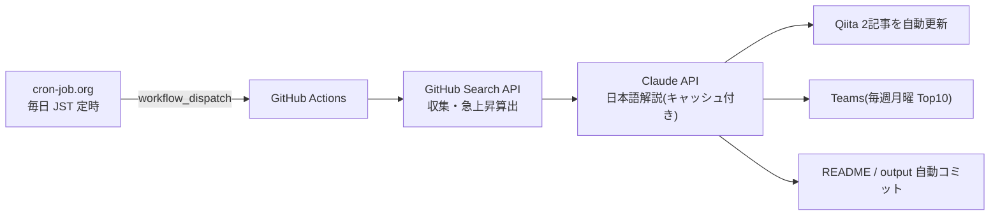

# Claude Code向けMCPツール候補ランキング

GitHub Search APIを使って、Claude Code周辺で活用候補になりそうなMCP関連リポジトリを定期収集するリポジトリです。

> 注意: この一覧は「Claude Codeでの動作」を保証するものではありません。  
> GitHub上のリポジトリ名・説明文・READMEなどに含まれる情報をもとに、MCP関連ツール候補を探すための入口として利用します。

## 仕組み(定常自律運転)

このランキングは cron-job.org → GitHub Actions → Claude API → Qiita / Teams のパイプラインで、毎日無人更新されています。



- 仕組みの詳細と**ライブ稼働ステータス**: [定常自律運転ページ](https://takanobusano.github.io/mcp-github-ranking/)
- 作り方の解説記事: [パイプライン編](https://qiita.com/4q_sano/items/913e93ee5cc2731561fc) / [cron-job.org 完全自動化編](https://qiita.com/4q_sano/items/1bc5e0669a8f0166936c)
<!-- MCP_REPOS_START -->
最終更新: **2026-07-13 08:17:10 JST**

MCP関連リポジトリに加え、Claude Code周辺で活用候補になりそうな関連ツールをGitHub Search APIで毎日自動収集してランキング化しています。

Stars / Forks の差分は、UTC基準の前日データ（2026-07-11）との差分です。
CSVには最大500件を保存し、本文では上位100件を表示しています。

> 注意: この一覧はClaude Codeでの動作を保証するものではありません。  
> MCP関連ツールまたはClaude Code関連ツール候補を探すための入口として利用してください。

# 注目MCP・関連ツール候補ランキング

## 1位 [public-apis/public-apis](https://github.com/public-apis/public-apis)

A collective list of free APIs

⭐ **449,376 Stars**（+338）　🍴 **49,386 Forks**（+47）　/　🟢 **1,540 Open Issues**　/　Python

Topics: `api` / `apis` / `dataset` / `development` / `free` / `list` / `lists` / `open-source`

## 2位 [obra/superpowers](https://github.com/obra/superpowers)

An agentic skills framework & software development methodology that works.

⭐ **253,002 Stars**（+579）　🍴 **22,595 Forks**（+65）　/　🟢 **323 Open Issues**　/　Shell

Topics: `ai` / `brainstorming` / `coding` / `obra` / `sdlc` / `skills` / `subagent-driven-development` / `superpowers`

## 3位 [affaan-m/ECC](https://github.com/affaan-m/ECC)

The agent harness performance optimization system. Skills, instincts, memory, security, and research-first development for Claude Code, Codex, Opencode, Cursor and beyond.

⭐ **228,936 Stars**（+340）　🍴 **35,096 Forks**（+32）　/　🟢 **98 Open Issues**　/　JavaScript

Topics: `ai-agents` / `anthropic` / `claude` / `claude-code` / `developer-tools` / `llm` / `mcp` / `productivity`

## 4位 [NousResearch/hermes-agent](https://github.com/NousResearch/hermes-agent)

The agent that grows with you

⭐ **213,724 Stars**（+449）　🍴 **39,623 Forks**（+185）　/　🟢 **26,829 Open Issues**　/　Python

Topics: `ai` / `ai-agent` / `ai-agents` / `anthropic` / `chatgpt` / `claude` / `claude-code` / `clawdbot`

## 5位 [ultraworkers/claw-code](https://github.com/ultraworkers/claw-code)

An agent-managed museum exhibit, built in Rust with Gajae-Code / LazyCodex — developed and maintained with no human intervention.

⭐ **194,738 Stars**（+19）　🍴 **109,734 Forks**（-13）　/　🟢 **31 Open Issues**　/　Rust

Topics: `topicなし`

## 6位 [multica-ai/andrej-karpathy-skills](https://github.com/multica-ai/andrej-karpathy-skills)

A single CLAUDE.md file to improve Claude Code behavior, derived from Andrej Karpathy's observations on LLM coding pitfalls.

⭐ **191,210 Stars**（+292）　🍴 **19,624 Forks**（+33）　/　🟢 **125 Open Issues**　/　不明

Topics: `topicなし`

## 7位 [ollama/ollama](https://github.com/ollama/ollama)

Get up and running with Kimi-K2.6, GLM-5.1, MiniMax, DeepSeek, gpt-oss, Qwen, Gemma and other models.

⭐ **175,998 Stars**（+62）　🍴 **16,959 Forks**（+20）　/　🟢 **3,425 Open Issues**　/　Go

Topics: `deepseek` / `gemma` / `gemma3` / `glm` / `go` / `golang` / `gpt-oss` / `llama`

## 8位 [mattpocock/skills](https://github.com/mattpocock/skills)

Skills for Real Engineers. Straight from my .claude directory.

⭐ **166,750 Stars**（+1,054）　🍴 **14,372 Forks**（+124）　/　🟢 **146 Open Issues**　/　Shell

Topics: `topicなし`

## 9位 [anthropics/skills](https://github.com/anthropics/skills)

Public repository for Agent Skills

⭐ **160,571 Stars**（+224）　🍴 **18,954 Forks**（+29）　/　🟢 **1,021 Open Issues**　/　Python

Topics: `agent-skills`

## 10位 [langflow-ai/langflow](https://github.com/langflow-ai/langflow)

Langflow is a powerful tool for building and deploying AI-powered agents and workflows.

⭐ **151,778 Stars**（+81）　🍴 **9,665 Forks**（+11）　/　🟢 **978 Open Issues**　/　Python

Topics: `agents` / `chatgpt` / `generative-ai` / `large-language-models` / `multiagent` / `react-flow`

## 11位 [firecrawl/firecrawl](https://github.com/firecrawl/firecrawl)

The API to search, scrape, and interact with the web at scale. 🔥

⭐ **149,874 Stars**（+515）　🍴 **8,573 Forks**（+26）　/　🟢 **402 Open Issues**　/　TypeScript

Topics: `ai` / `ai-agents` / `ai-crawler` / `ai-scraping` / `ai-search` / `crawler` / `data-extraction` / `html-to-markdown`

## 12位 [x1xhlol/system-prompts-and-models-of-ai-tools](https://github.com/x1xhlol/system-prompts-and-models-of-ai-tools)

FULL Augment Code, Claude Code, Cluely, CodeBuddy, Comet, Cursor, Devin AI, Junie, Kiro, Leap.new, Lovable, Manus, NotionAI, Orchids.app, Perplexity, Poke, Qoder, Replit, Same.dev, Trae, Traycer AI, VSCode Agent, Warp.dev, Windsurf, Xcode, Z.ai Code, Dia & v0. (And other Open Sourced) System Prompts, Internal Tools & AI Models

⭐ **141,839 Stars**（+29）　🍴 **34,809 Forks**（+1）　/　🟢 **156 Open Issues**　/　不明

Topics: `ai` / `bolt` / `cluely` / `copilot` / `cursor` / `cursorai` / `devin` / `github-copilot`

## 13位 [anthropics/claude-code](https://github.com/anthropics/claude-code)

Claude Code is an agentic coding tool that lives in your terminal, understands your codebase, and helps you code faster by executing routine tasks, explaining complex code, and handling git workflows - all through natural language commands.

⭐ **137,569 Stars**（+112）　🍴 **22,215 Forks**（+14）　/　🟢 **11,164 Open Issues**　/　Python

Topics: `topicなし`

## 14位 [msitarzewski/agency-agents](https://github.com/msitarzewski/agency-agents)

A complete AI agency at your fingertips - From frontend wizards to Reddit community ninjas, from whimsy injectors to reality checkers. Each agent is a specialized expert with personality, processes, and proven deliverables.

⭐ **130,780 Stars**（+314）　🍴 **21,460 Forks**（+75）　/　🟢 **99 Open Issues**　/　Shell

Topics: `topicなし`

## 15位 [garrytan/gstack](https://github.com/garrytan/gstack)

Use Garry Tan's exact Claude Code setup: 23 opinionated tools that serve as CEO, Designer, Eng Manager, Release Manager, Doc Engineer, and QA

⭐ **121,474 Stars**（+192）　🍴 **18,180 Forks**（+45）　/　🟢 **836 Open Issues**　/　TypeScript

Topics: `topicなし`

## 16位 [github/spec-kit](https://github.com/github/spec-kit)

💫 Toolkit to help you get started with Spec-Driven Development

⭐ **119,968 Stars**（+394）　🍴 **10,651 Forks**（+49）　/　🟢 **382 Open Issues**　/　Python

Topics: `ai` / `copilot` / `development` / `engineering` / `prd` / `spec` / `spec-driven`

## 17位 [farion1231/cc-switch](https://github.com/farion1231/cc-switch)

A cross-platform desktop All-in-One assistant for Claude Code, Codex, OpenCode, OpenClaw, Gemini CLI & Hermes Agent. Only official website: ccswitch.io

⭐ **116,310 Stars**（+341）　🍴 **7,800 Forks**（+31）　/　🟢 **1,892 Open Issues**　/　Rust

Topics: `ai-tools` / `claude-code` / `codex` / `desktop-app` / `hermes` / `hermes-agent` / `mcp` / `minimax`

## 18位 [google-gemini/gemini-cli](https://github.com/google-gemini/gemini-cli)

An open-source AI agent that brings the power of Gemini directly into your terminal.

⭐ **105,936 Stars**（+14）　🍴 **14,254 Forks**（+6）　/　🟢 **1,372 Open Issues**　/　TypeScript

Topics: `ai` / `ai-agents` / `cli` / `gemini` / `gemini-api` / `mcp-client` / `mcp-server`

## 19位 [nextlevelbuilder/ui-ux-pro-max-skill](https://github.com/nextlevelbuilder/ui-ux-pro-max-skill)

An AI SKILL that provide design intelligence for building professional UI/UX multiple platforms

⭐ **104,751 Stars**（+370）　🍴 **11,096 Forks**（+50）　/　🟢 **131 Open Issues**　/　Python

Topics: `ai-skills` / `antigravity` / `claude` / `claude-code` / `codex` / `command-line` / `copilot` / `cursor-ai`

## 20位 [browser-use/browser-use](https://github.com/browser-use/browser-use)

🌐 Make websites accessible for AI agents. Automate tasks online with ease.

⭐ **104,399 Stars**（+137）　🍴 **11,504 Forks**（+10）　/　🟢 **304 Open Issues**　/　Python

Topics: `ai-agents` / `ai-tools` / `browser-automation` / `browser-use` / `llm` / `playwright` / `python`

## 21位 [harry0703/MoneyPrinterTurbo](https://github.com/harry0703/MoneyPrinterTurbo)

利用AI大模型，一键生成高清短视频 Generate short videos with one click using AI LLM.

⭐ **96,936 Stars**（+91）　🍴 **14,313 Forks**（+28）　/　🟢 **60 Open Issues**　/　Python

Topics: `ai` / `automation` / `chatgpt` / `moviepy` / `python` / `shortvideo` / `tiktok`

## 22位 [puppeteer/puppeteer](https://github.com/puppeteer/puppeteer)

JavaScript API for Chrome and Firefox

⭐ **95,417 Stars**（+4）　🍴 **9,648 Forks**（+4）　/　🟢 **272 Open Issues**　/　TypeScript

Topics: `automation` / `chrome` / `chromium` / `developer-tools` / `firefox` / `headless-chrome` / `node-module` / `testing`

## 23位 [microsoft/playwright](https://github.com/microsoft/playwright)

Playwright is a framework for Web Testing and Automation. It allows testing Chromium, Firefox and WebKit with a single API.

⭐ **92,686 Stars**（+46）　🍴 **6,082 Forks**（+8）　/　🟢 **171 Open Issues**　/　TypeScript

Topics: `automation` / `chrome` / `chromium` / `e2e-testing` / `electron` / `end-to-end-testing` / `firefox` / `javascript`

## 24位 [TauricResearch/TradingAgents](https://github.com/TauricResearch/TradingAgents)

TradingAgents: Multi-Agents LLM Financial Trading Framework

⭐ **92,597 Stars**（+232）　🍴 **17,911 Forks**（+59）　/　🟢 **295 Open Issues**　/　Python

Topics: `agent` / `finance` / `llm` / `multiagent` / `trading`

## 25位 [JuliusBrussee/caveman](https://github.com/JuliusBrussee/caveman)

🪨 why use many token when few token do trick — Claude Code skill that cuts 65% of tokens by talking like caveman

⭐ **88,517 Stars**（+380）　🍴 **5,087 Forks**（+23）　/　🟢 **398 Open Issues**　/　JavaScript

Topics: `ai` / `anthropic` / `caveman` / `claude` / `claude-code` / `llm` / `meme` / `prompt-engineering`

## 26位 [ChatGPTNextWeb/NextChat](https://github.com/ChatGPTNextWeb/NextChat)

✨ Light and Fast AI Assistant. Support: Web \| iOS \| MacOS \| Android \|  Linux \| Windows

⭐ **88,455 Stars**（+8）　🍴 **59,459 Forks**（±0）　/　🟢 **844 Open Issues**　/　TypeScript

Topics: `calclaude` / `chatgpt` / `claude` / `cross-platform` / `desktop` / `fe` / `gemini` / `gemini-pro`

## 27位 [modelcontextprotocol/servers](https://github.com/modelcontextprotocol/servers)

Model Context Protocol Servers

⭐ **88,378 Stars**（+30）　🍴 **11,220 Forks**（+5）　/　🟢 **665 Open Issues**　/　TypeScript

Topics: `topicなし`

## 28位 [thedotmack/claude-mem](https://github.com/thedotmack/claude-mem)

Persistent Context Across Sessions for Every Agent –  Captures everything your agent does during sessions, compresses it with AI, and injects relevant context back into future sessions. Works with Claude Code, OpenClaw, Codex, Gemini, Hermes, Copilot, OpenCode + More

⭐ **86,970 Stars**（+102）　🍴 **7,514 Forks**（+10）　/　🟢 **264 Open Issues**　/　JavaScript

Topics: `ai` / `ai-agents` / `ai-memory` / `anthropic` / `artificial-intelligence` / `chromadb` / `claude` / `claude-agent-sdk`

## 29位 [laravel/laravel](https://github.com/laravel/laravel)

Laravel is a web application framework with expressive, elegant syntax. We’ve already laid the foundation for your next big idea — freeing you to create without sweating the small things.

⭐ **84,726 Stars**（+9）　🍴 **24,895 Forks**（+3）　/　🟢 **31 Open Issues**　/　Blade

Topics: `framework` / `laravel` / `php`

## 30位 [Graphify-Labs/graphify](https://github.com/Graphify-Labs/graphify)

AI coding assistant skill (Claude Code, Codex, OpenCode, Cursor, Gemini CLI, and more). Turn any folder of code, SQL schemas, R scripts, shell scripts, docs, papers, images, or videos into a queryable knowledge graph. App code + database schema + infrastructure in one graph.

⭐ **83,233 Stars**（+818）　🍴 **8,210 Forks**（+92）　/　🟢 **483 Open Issues**　/　Python

Topics: `antigravity` / `claude-code` / `codex` / `gemini` / `graphrag` / `knowledge-graph` / `leiden` / `openclaw`

## 31位 [DietrichGebert/ponytail](https://github.com/DietrichGebert/ponytail)

Makes your AI agent think like the laziest senior dev in the room. The best code is the code you never wrote.

⭐ **81,323 Stars**（+575）　🍴 **4,390 Forks**（+35）　/　🟢 **63 Open Issues**　/　JavaScript

Topics: `agent-skills` / `ai-agents` / `claude` / `claude-code` / `claude-code-plugin` / `cursor-rules` / `developer-tools` / `llm`

## 32位 [OpenHands/OpenHands](https://github.com/OpenHands/OpenHands)

🙌 OpenHands: AI-Driven Development

⭐ **80,572 Stars**（+90）　🍴 **10,283 Forks**（+17）　/　🟢 **360 Open Issues**　/　Python

Topics: `agent` / `artificial-intelligence` / `chatgpt` / `claude-ai` / `cli` / `developer-tools` / `gpt` / `llm`

## 33位 [addyosmani/agent-skills](https://github.com/addyosmani/agent-skills)

Production-grade engineering skills for AI coding agents.

⭐ **77,582 Stars**（+255）　🍴 **8,330 Forks**（+33）　/　🟢 **133 Open Issues**　/　JavaScript

Topics: `agent-skills` / `antigravity` / `claude-code` / `codex` / `cursor` / `skills`

## 34位 [nexu-io/open-design](https://github.com/nexu-io/open-design)

🎨 The open-source Claude Design alternative. 🖥️ Local-first desktop app. 🖼️ Your coding agent becomes the design engine: prototypes, landing pages, dashboards,...

⭐ **77,557 Stars**（+206）　🍴 **8,880 Forks**（+46）　/　🟢 **652 Open Issues**　/　TypeScript

Topics: `agent-skills` / `ai-agents` / `ai-design` / `byok` / `claude-code-for-design` / `claude-design` / `codex-design` / `coding-agents`

## 35位 [bytedance/deer-flow](https://github.com/bytedance/deer-flow)

An open-source long-horizon SuperAgent harness that researches, codes, and creates. With the help of sandboxes, memories, tools, skill, subagents and message gateway, it handles different levels of tasks that could take minutes to hours.

⭐ **76,849 Stars**（+60）　🍴 **10,443 Forks**（+14）　/　🟢 **968 Open Issues**　/　Python

Topics: `agent` / `agentic` / `agentic-framework` / `agentic-workflow` / `ai` / `ai-agents` / `deep-research` / `harness`

## 36位 [opendatalab/MinerU](https://github.com/opendatalab/MinerU)

Transforms complex documents like PDFs and Office docs into LLM-ready markdown/JSON for your Agentic workflows.

⭐ **74,354 Stars**（+79）　🍴 **6,244 Forks**（+4）　/　🟢 **31 Open Issues**　/　Python

Topics: `ai4science` / `document-analysis` / `docx` / `extract-data` / `layout-analysis` / `ocr` / `parser` / `pdf`

## 37位 [Egonex-AI/Understand-Anything](https://github.com/Egonex-AI/Understand-Anything)

Graphs that teach > graphs that impress. Turn any code into an interactive knowledge graph you can explore, search, and ask questions about. Works with Claude Code, Codex, Cursor, Copilot, Gemini CLI, and more.

⭐ **73,605 Stars**（+490）　🍴 **6,135 Forks**（+43）　/　🟢 **254 Open Issues**　/　TypeScript

Topics: `antigravity-skills` / `business-knowledge` / `claude-code` / `claude-skills` / `codebase-analysis` / `codex` / `codex-skills` / `developer-tools-ai-agent`

## 38位 [paperclipai/paperclip](https://github.com/paperclipai/paperclip)

The open-source app everyone uses to manage agents at work

⭐ **73,455 Stars**（+75）　🍴 **13,690 Forks**（+14）　/　🟢 **5,000 Open Issues**　/　TypeScript

Topics: `topicなし`

## 39位 [abi/screenshot-to-code](https://github.com/abi/screenshot-to-code)

Drop in a screenshot and convert it to clean code (HTML/Tailwind/React/Vue)

⭐ **73,257 Stars**（+6）　🍴 **9,017 Forks**（±0）　/　🟢 **124 Open Issues**　/　Python

Topics: `topicなし`

## 40位 [Eugeny/tabby](https://github.com/Eugeny/tabby)

A terminal for a more modern age

⭐ **73,196 Stars**（+16）　🍴 **4,149 Forks**（+2）　/　🟢 **2,741 Open Issues**　/　TypeScript

Topics: `serial` / `ssh-client` / `telnet-client` / `terminal` / `terminal-emulators`

## 41位 [thedaviddias/Front-End-Checklist](https://github.com/thedaviddias/Front-End-Checklist)

🗂 The essential checklist for modern web development, for humans and AI agents

⭐ **73,193 Stars**（+9）　🍴 **6,650 Forks**（-1）　/　🟢 **3 Open Issues**　/　MDX

Topics: `ai-agent` / `ai-agents` / `checklist` / `css` / `front-end-developer-tool` / `front-end-development` / `frontend` / `guidelines`

## 42位 [unclecode/crawl4ai](https://github.com/unclecode/crawl4ai)

🚀🤖 Crawl4AI: Open-source LLM Friendly Web Crawler & Scraper. Don't be shy, join here:

⭐ **72,448 Stars**（+89）　🍴 **7,424 Forks**（+8）　/　🟢 **105 Open Issues**　/　Python

Topics: `topicなし`

## 43位 [daytonaio/daytona](https://github.com/daytonaio/daytona)

Daytona is a Secure and Elastic Infrastructure for Running AI-Generated Code

⭐ **72,203 Stars**（-17）　🍴 **5,663 Forks**（-1）　/　🟢 **444 Open Issues**　/　不明

Topics: `agentic-workflow` / `ai` / `ai-agents` / `ai-runtime` / `ai-sandboxes` / `code-execution` / `code-interpreter` / `developer-tools`

## 44位 [shareAI-lab/learn-claude-code](https://github.com/shareAI-lab/learn-claude-code)

Bash is all you need -  A nano claude code–like 「agent harness」, built from 0 to 1

⭐ **70,755 Stars**（+72）　🍴 **11,519 Forks**（+11）　/　🟢 **64 Open Issues**　/　Python

Topics: `agent` / `agent-development` / `ai-agent` / `claude` / `claude-code` / `educational` / `llm` / `python`

## 45位 [rtk-ai/rtk](https://github.com/rtk-ai/rtk)

CLI proxy that reduces LLM token consumption by 60-90% on common dev commands. Single Rust binary, zero dependencies

⭐ **70,552 Stars**（+175）　🍴 **4,388 Forks**（+8）　/　🟢 **1,576 Open Issues**　/　Rust

Topics: `agentic-coding` / `ai-coding` / `anthropic` / `claude-code` / `cli` / `command-line-tool` / `cost-reduction` / `developer-tools`

## 46位 [OpenBB-finance/OpenBB](https://github.com/OpenBB-finance/OpenBB)

Open Data Platform for analysts, quants and AI agents.

⭐ **70,492 Stars**（+42）　🍴 **7,155 Forks**（+10）　/　🟢 **72 Open Issues**　/　Python

Topics: `ai` / `crypto` / `derivatives` / `economics` / `equity` / `finance` / `fixed-income` / `machine-learning`

## 47位 [D4Vinci/Scrapling](https://github.com/D4Vinci/Scrapling)

🕷️ An adaptive Web Scraping framework that handles everything from a single request to a full-scale crawl!

⭐ **69,289 Stars**（+132）　🍴 **6,858 Forks**（+19）　/　🟢 **1 Open Issues**　/　Python

Topics: `ai` / `ai-scraping` / `automation` / `crawler` / `crawling` / `crawling-python` / `data` / `data-extraction`

## 48位 [unslothai/unsloth](https://github.com/unslothai/unsloth)

Unsloth Studio is a web UI for training and running open models like Gemma 4, Qwen3.6, DeepSeek, gpt-oss locally.

⭐ **68,062 Stars**（+33）　🍴 **6,127 Forks**（+2）　/　🟢 **1,058 Open Issues**　/　Python

Topics: `agent` / `deepseek` / `fine-tuning` / `gemma` / `gemma3` / `gpt-oss` / `llama` / `llama3`

## 49位 [xtekky/gpt4free](https://github.com/xtekky/gpt4free)

The official gpt4free repository \| various collection of powerful language models \| opus 4.6 gpt 5.3 kimi 2.5 deepseek v3.2 gemini 3

⭐ **66,467 Stars**（+1）　🍴 **13,548 Forks**（-6）　/　🟢 **5 Open Issues**　/　Python

Topics: `chatbot` / `chatbots` / `chatgpt` / `chatgpt-4` / `chatgpt-api` / `chatgpt-free` / `chatgpt4` / `deepseek`

## 50位 [bradtraversy/design-resources-for-developers](https://github.com/bradtraversy/design-resources-for-developers)

Curated list of design and UI resources from stock photos, web templates, CSS frameworks, UI libraries, tools and much more

⭐ **66,383 Stars**（+4）　🍴 **12,109 Forks**（+1）　/　🟢 **50 Open Issues**　/　不明

Topics: `topicなし`

## 51位 [code-yeongyu/oh-my-openagent](https://github.com/code-yeongyu/oh-my-openagent)

omo/lazycodex: The coding agent for tokenmaxxers;the one and only agent harness for complex codebases. For your Codex, for your OpenCode

⭐ **65,628 Stars**（+67）　🍴 **5,348 Forks**（+4）　/　🟢 **885 Open Issues**　/　TypeScript

Topics: `ai` / `ai-agents` / `anthropic` / `chatgpt` / `claude` / `claude-skills` / `codex` / `cursor`

## 52位 [cline/cline](https://github.com/cline/cline)

Autonomous coding agent as an SDK, IDE extension, or CLI assistant.

⭐ **64,578 Stars**（+27）　🍴 **6,901 Forks**（+8）　/　🟢 **1,250 Open Issues**　/　TypeScript

Topics: `topicなし`

## 53位 [openinterpreter/openinterpreter](https://github.com/openinterpreter/openinterpreter)

A lightweight coding agent for open models like Deepseek, Kimi, and Qwen

⭐ **64,356 Stars**（+19）　🍴 **5,608 Forks**（+1）　/　🟢 **275 Open Issues**　/　Rust

Topics: `coding-agent` / `deepseek` / `interpreter` / `kimi` / `qwen` / `rust` / `tui`

## 54位 [ruvnet/ruflo](https://github.com/ruvnet/ruflo)

🌊 The leading agent meta-harness. Deploy intelligent multi-player swarms, coordinate autonomous workflows, and build conversational AI systems. Features adaptiv...

⭐ **64,178 Stars**（+135）　🍴 **7,600 Forks**（+30）　/　🟢 **773 Open Issues**　/　TypeScript

Topics: `agentic-ai` / `agentic-framework` / `agentic-workflow` / `agents` / `ai-agents` / `ai-assistant` / `ai-coding` / `ai-skills`

## 55位 [OpenCut-app/OpenCut](https://github.com/OpenCut-app/OpenCut)

The open-source CapCut alternative

⭐ **63,718 Stars**（+1,560）　🍴 **6,830 Forks**（+139）　/　🟢 **333 Open Issues**　/　TypeScript

Topics: `editor` / `oss` / `videoeditor`

## 56位 [warpdotdev/warp](https://github.com/warpdotdev/warp)

Warp is an agentic development environment, born out of the terminal.

⭐ **63,089 Stars**（+31）　🍴 **5,232 Forks**（+2）　/　🟢 **4,559 Open Issues**　/　Rust

Topics: `bash` / `linux` / `macos` / `rust` / `shell` / `terminal` / `wasm` / `zsh`

## 57位 [docling-project/docling](https://github.com/docling-project/docling)

Get your documents ready for gen AI

⭐ **63,044 Stars**（+30）　🍴 **4,445 Forks**（+4）　/　🟢 **938 Open Issues**　/　Python

Topics: `ai` / `convert` / `document-parser` / `document-parsing` / `documents` / `docx` / `html` / `markdown`

## 58位 [shanraisshan/claude-code-best-practice](https://github.com/shanraisshan/claude-code-best-practice)

from vibe coding to agentic engineering - practice makes claude perfect

⭐ **62,485 Stars**（+39）　🍴 **6,249 Forks**（+2）　/　🟢 **14 Open Issues**　/　HTML

Topics: `agentic-ai` / `agentic-coding` / `agentic-engineering` / `agentic-workflow` / `ai` / `ai-agents` / `anthropic` / `best-practices`

## 59位 [Leonxlnx/taste-skill](https://github.com/Leonxlnx/taste-skill)

Taste-Skill - gives your AI good taste. stops the AI from generating boring, generic slop

⭐ **62,473 Stars**（+356）　🍴 **4,411 Forks**（+33）　/　🟢 **44 Open Issues**　/　JavaScript

Topics: `agent` / `ai` / `claude` / `claude-code` / `codex` / `coding` / `design` / `frontend`

## 60位 [koala73/worldmonitor](https://github.com/koala73/worldmonitor)

Real-time global intelligence dashboard. AI-powered news aggregation, geopolitical monitoring, and infrastructure tracking in a unified situational awareness interface

⭐ **61,767 Stars**（+38）　🍴 **9,633 Forks**（+8）　/　🟢 **202 Open Issues**　/　TypeScript

Topics: `agent` / `ai` / `dashboard` / `geopolitics` / `mcp` / `mcp-server` / `monitoring` / `news`

## 61位 [mem0ai/mem0](https://github.com/mem0ai/mem0)

Universal memory layer for AI Agents

⭐ **60,670 Stars**（+44）　🍴 **7,063 Forks**（+12）　/　🟢 **565 Open Issues**　/　TypeScript

Topics: `agents` / `ai` / `ai-agents` / `application` / `chatbots` / `chatgpt` / `genai` / `llm`

## 62位 [sansan0/TrendRadar](https://github.com/sansan0/TrendRadar)

⭐AI-driven public opinion & trend monitor with multi-platform aggregation, RSS, and smart alerts.🎯 告别信息过载，你的 AI 舆情监控助手与热点筛选工具！聚合多平台热点 +  RSS 订阅，支持关键词精准筛选。AI 智能筛...

⭐ **60,488 Stars**（+19）　🍴 **24,795 Forks**（+10）　/　🟢 **50 Open Issues**　/　Python

Topics: `ai` / `bark` / `data-analysis` / `docker` / `hot-news` / `llm` / `mail` / `mcp`

## 63位 [Fission-AI/OpenSpec](https://github.com/Fission-AI/OpenSpec)

Spec-driven development (SDD) for AI coding assistants.

⭐ **60,333 Stars**（+157）　🍴 **4,189 Forks**（+11）　/　🟢 **460 Open Issues**　/　TypeScript

Topics: `ai` / `context-engineering` / `engineering` / `planning` / `prd` / `sdd` / `sdlc` / `spec`

## 64位 [microsoft/autogen](https://github.com/microsoft/autogen)

A programming framework for agentic AI

⭐ **59,680 Stars**（+16）　🍴 **8,985 Forks**（+3）　/　🟢 **947 Open Issues**　/　Python

Topics: `agentic` / `agentic-agi` / `agents` / `ai` / `autogen` / `autogen-ecosystem` / `chatgpt` / `framework`

## 65位 [colbymchenry/codegraph](https://github.com/colbymchenry/codegraph)

Pre-indexed code knowledge graph, auto syncs on code changes, for Claude Code, Codex, Gemini, Cursor, OpenCode, AntiGravity, Kiro, and Hermes Agent — fewer tokens, fewer tool calls, 100% local

⭐ **59,418 Stars**（+149）　🍴 **3,697 Forks**（+14）　/　🟢 **312 Open Issues**　/　TypeScript

Topics: `topicなし`

## 66位 [upstash/context7](https://github.com/upstash/context7)

Context7 Platform -- Up-to-date code documentation for LLMs and AI code editors

⭐ **58,987 Stars**（+48）　🍴 **2,776 Forks**（+12）　/　🟢 **29 Open Issues**　/　TypeScript

Topics: `llm` / `mcp` / `mcp-server` / `vibe-coding`

## 67位 [headroomlabs-ai/headroom](https://github.com/headroomlabs-ai/headroom)

Compress tool outputs, logs, files, and RAG chunks before they reach the LLM. 60-95% fewer tokens, same answers. Library, proxy, MCP server.

⭐ **58,738 Stars**（+170）　🍴 **4,341 Forks**（+12）　/　🟢 **520 Open Issues**　/　Python

Topics: `agent` / `ai` / `anthropic` / `claude-code` / `compression` / `context-engineering` / `context-window` / `cursor`

## 68位 [meilisearch/meilisearch](https://github.com/meilisearch/meilisearch)

A lightning-fast search engine API bringing AI-powered hybrid search to your sites and applications.

⭐ **58,529 Stars**（+22）　🍴 **2,612 Forks**（+3）　/　🟢 **310 Open Issues**　/　Rust

Topics: `ai` / `api` / `app-search` / `database` / `enterprise-search` / `faceting` / `full-text-search` / `fuzzy-search`

## 69位 [coollabsio/coolify](https://github.com/coollabsio/coolify)

An open-source, self-hostable PaaS alternative to Vercel, Heroku & Netlify that lets you easily deploy static sites, databases, full-stack applications and 280+ one-click services on your own servers.

⭐ **58,359 Stars**（+54）　🍴 **5,012 Forks**（+16）　/　🟢 **814 Open Issues**　/　PHP

Topics: `coolify` / `databases` / `deployment` / `docker` / `docker-compose` / `inertiajs` / `laravel` / `mariadb`

## 70位 [zylon-ai/private-gpt](https://github.com/zylon-ai/private-gpt)

Complete API layer for private AI applications on local models: RAG, skills, tools, MCP, text-to-sql, and more. Works with any OpenAI-compatible inference server.

⭐ **57,330 Stars**（+1）　🍴 **7,597 Forks**（-2）　/　🟢 **5 Open Issues**　/　Python

Topics: `ai` / `ai-tools` / `on-premise`

## 71位 [MemPalace/mempalace](https://github.com/MemPalace/mempalace)

The best-benchmarked open-source AI memory system. And it's free.

⭐ **57,263 Stars**（+28）　🍴 **7,391 Forks**（+2）　/　🟢 **619 Open Issues**　/　Python

Topics: `ai` / `chromadb` / `llm` / `mcp` / `memory` / `python`

## 72位 [NanmiCoder/MediaCrawler](https://github.com/NanmiCoder/MediaCrawler)

小红书笔记 \| 评论爬虫、抖音视频 \| 评论爬虫、快手视频 \| 评论爬虫、B 站视频 ｜ 评论爬虫、微博帖子 ｜ 评论爬虫、百度贴吧帖子 ｜ 百度贴吧评论回复爬虫  \| 知乎问答文章｜评论爬虫

⭐ **56,145 Stars**（+73）　🍴 **11,312 Forks**（+10）　/　🟢 **178 Open Issues**　/　Python

Topics: `topicなし`

## 73位 [penpot/penpot](https://github.com/penpot/penpot)

Penpot: The open-source design platform for Product teams that need scalable collaboration.

⭐ **55,493 Stars**（+48）　🍴 **3,643 Forks**（+8）　/　🟢 **699 Open Issues**　/　Clojure

Topics: `clojure` / `clojurescript` / `design` / `prototyping` / `ui` / `ux-design` / `ux-experience`

## 74位 [crewAIInc/crewAI](https://github.com/crewAIInc/crewAI)

Framework for orchestrating role-playing, autonomous AI agents. By fostering collaborative intelligence, CrewAI empowers agents to work together seamlessly, tackling complex tasks.

⭐ **55,391 Stars**（+29）　🍴 **7,814 Forks**（+11）　/　🟢 **639 Open Issues**　/　Python

Topics: `agents` / `ai` / `ai-agents` / `aiagentframework` / `llms`

## 75位 [Panniantong/Agent-Reach](https://github.com/Panniantong/Agent-Reach)

Give your AI agent eyes to see the entire internet. Read & search Twitter, Reddit, YouTube, GitHub, Bilibili, XiaoHongShu — one CLI, zero API fees.

⭐ **55,318 Stars**（+401）　🍴 **4,560 Forks**（+36）　/　🟢 **146 Open Issues**　/　Python

Topics: `agent-infrastructure` / `ai-agent` / `ai-search` / `automation` / `bilibili` / `claude-code` / `cli` / `cursor`

## 76位 [BerriAI/litellm](https://github.com/BerriAI/litellm)

Python SDK, Proxy Server (AI Gateway) to call 100+ LLM APIs in OpenAI (or native) format, with cost tracking, guardrails, loadbalancing and logging. [Bedrock, Azure, OpenAI, VertexAI, Cohere, Anthropic, Sagemaker, HuggingFace, VLLM, NVIDIA NIM]

⭐ **53,351 Stars**（+66）　🍴 **9,689 Forks**（+14）　/　🟢 **3,945 Open Issues**　/　Python

Topics: `ai-gateway` / `anthropic` / `azure-openai` / `bedrock` / `gateway` / `langchain` / `litellm` / `llm`

## 77位 [mvanhorn/last30days-skill](https://github.com/mvanhorn/last30days-skill)

AI agent skill that researches any topic across Reddit, X, YouTube, HN, Polymarket, and the web - then synthesizes a grounded summary

⭐ **51,717 Stars**（+129）　🍴 **4,482 Forks**（+13）　/　🟢 **84 Open Issues**　/　Python

Topics: `ai-prompts` / `ai-skill` / `bluesky` / `claude` / `claude-code` / `clawhub` / `deep-research` / `hackernews`

## 78位 [charlax/professional-programming](https://github.com/charlax/professional-programming)

A collection of learning resources for curious software engineers

⭐ **51,254 Stars**（+2）　🍴 **4,001 Forks**（±0）　/　🟢 **4 Open Issues**　/　Python

Topics: `architecture` / `computer-science` / `concepts` / `documentation` / `engineer` / `learning` / `lessons-learned` / `professional`

## 79位 [aaif-goose/goose](https://github.com/aaif-goose/goose)

an open source, extensible AI agent that goes beyond code suggestions - install, execute, edit, and test with any LLM

⭐ **51,119 Stars**（+32）　🍴 **5,683 Forks**（+6）　/　🟢 **311 Open Issues**　/　Rust

Topics: `acp` / `ai` / `ai-agents` / `mcp`

## 80位 [bmad-code-org/BMAD-METHOD](https://github.com/bmad-code-org/BMAD-METHOD)

Breakthrough Method for Agile Ai Driven Development

⭐ **50,406 Stars**（+46）　🍴 **5,804 Forks**（+12）　/　🟢 **93 Open Issues**　/　JavaScript

Topics: `topicなし`

## 81位 [1c7/chinese-independent-developer](https://github.com/1c7/chinese-independent-developer)

👩🏿‍💻👨🏾‍💻👩🏼‍💻👨🏽‍💻👩🏻‍💻中国独立开发者项目列表 -- 分享大家都在做什么

⭐ **49,956 Stars**（+819）　🍴 **4,334 Forks**（+101）　/　🟢 **1 Open Issues**　/　不明

Topics: `china` / `indie` / `indie-developer`

## 82位 [mudler/LocalAI](https://github.com/mudler/LocalAI)

LocalAI is the open-source AI engine. Run any model - LLMs, vision, voice, image, video - on any hardware. No GPU required.

⭐ **47,507 Stars**（+22）　🍴 **4,230 Forks**（+5）　/　🟢 **208 Open Issues**　/　Go

Topics: `agents` / `ai` / `api` / `audio-generation` / `decentralized` / `distributed` / `image-generation` / `libp2p`

## 83位 [oobabooga/textgen](https://github.com/oobabooga/textgen)

Open-source desktop app for local LLMs. Text, vision, tool-calling, OpenAI/Anthropic-compatible API. 100% private.

⭐ **47,445 Stars**（+4）　🍴 **5,988 Forks**（-1）　/　🟢 **828 Open Issues**　/　Python

Topics: `topicなし`

## 84位 [prisma/prisma](https://github.com/prisma/prisma)

Next-generation ORM for Node.js & TypeScript \| PostgreSQL, MySQL, MariaDB, SQL Server, SQLite, MongoDB and CockroachDB

⭐ **47,330 Stars**（+103）　🍴 **2,478 Forks**（+4）　/　🟢 **2,659 Open Issues**　/　TypeScript

Topics: `cockroachdb` / `database` / `javascript` / `mariadb` / `mongo` / `mongodb` / `mongodb-orm` / `mssql`

## 85位 [GitHubDaily/GitHubDaily](https://github.com/GitHubDaily/GitHubDaily)

坚持分享 GitHub 上高质量、有趣实用的开源技术教程、开发者工具、编程网站、技术资讯。A list cool, interesting projects of GitHub.

⭐ **47,045 Stars**（+5）　🍴 **4,653 Forks**（+1）　/　🟢 **698 Open Issues**　/　不明

Topics: `ai` / `algorithms-and-data-structures` / `backend` / `developer-tools` / `development` / `frontend` / `github` / `java`

## 86位 [jeecgboot/JeecgBoot](https://github.com/jeecgboot/JeecgBoot)

【低代码迈入 v2.0】AI低代码平台，AI Skills 一句话生成整个系统；一键生成前后端代码甚至整个模块。 AI Skills 一句话画流程、设计表单、生成报表、大屏。内置 AI应用平台涵盖：AI聊天、知识库、流程编排、MCP插件等，兼容主流大模型。引领AI低代码「Skills 生成 → 在线配置 → 代码生成...

⭐ **47,028 Stars**（+13）　🍴 **16,089 Forks**（+1）　/　🟢 **50 Open Issues**　/　Java

Topics: `activiti` / `agent` / `ai` / `antd` / `claude-code` / `cli` / `codegenerator` / `codex`

## 87位 [serverless/serverless](https://github.com/serverless/serverless)

⚡ Serverless Framework – Effortlessly build apps that auto-scale, incur zero costs when idle, and require minimal maintenance using AWS Lambda and other managed...

⭐ **46,917 Stars**（-2）　🍴 **5,730 Forks**（±0）　/　🟢 **1,221 Open Issues**　/　JavaScript

Topics: `aws` / `aws-dynamodb` / `aws-lambda` / `azure-functions` / `google-cloud-functions` / `microservice` / `serverless` / `serverless-architectures`

## 88位 [ChromeDevTools/chrome-devtools-mcp](https://github.com/ChromeDevTools/chrome-devtools-mcp)

Chrome DevTools for coding agents

⭐ **46,765 Stars**（+71）　🍴 **3,201 Forks**（+10）　/　🟢 **96 Open Issues**　/　TypeScript

Topics: `browser` / `chrome` / `chrome-devtools` / `debugging` / `devtools` / `mcp` / `mcp-server` / `puppeteer`

## 89位 [exo-explore/exo](https://github.com/exo-explore/exo)

Run frontier AI locally.

⭐ **46,206 Stars**（+19）　🍴 **3,345 Forks**（+5）　/　🟢 **305 Open Issues**　/　Python

Topics: `topicなし`

## 90位 [apache/airflow](https://github.com/apache/airflow)

Apache Airflow - A platform to programmatically author, schedule, and monitor workflows

⭐ **46,099 Stars**（+6）　🍴 **17,386 Forks**（+8）　/　🟢 **1,691 Open Issues**　/　Python

Topics: `airflow` / `apache` / `apache-airflow` / `automation` / `dag` / `data-engineering` / `data-integration` / `data-orchestrator`

## 91位 [pbakaus/impeccable](https://github.com/pbakaus/impeccable)

The design language that makes your AI harness better at design.

⭐ **45,960 Stars**（+271）　🍴 **2,784 Forks**（+22）　/　🟢 **27 Open Issues**　/　JavaScript

Topics: `topicなし`

## 92位 [zhayujie/CowAgent](https://github.com/zhayujie/CowAgent)

Open-source super AI assistant & Agent Harness. Plans tasks, runs tools and skills, self-evolves with memory and knowledge. Multi-model, multi-channel. Lightweight, extensible, one-line install. (formerly chatgpt-on-wechat)

⭐ **45,946 Stars**（+19）　🍴 **10,261 Forks**（+2）　/　🟢 **24 Open Issues**　/　Python

Topics: `ai` / `ai-agent` / `ai-agents` / `chatgpt-on-wechat` / `claude` / `claude-code` / `codex` / `cowagent`

## 93位 [KeygraphHQ/shannon](https://github.com/KeygraphHQ/shannon)

Shannon is an autonomous, white-box AI pentester for web applications and APIs. It analyzes your source code, identifies attack vectors, and executes real exploits to prove vulnerabilities before they reach production.

⭐ **45,622 Stars**（+14）　🍴 **5,294 Forks**（-1）　/　🟢 **23 Open Issues**　/　TypeScript

Topics: `penetration-testing` / `pentesting` / `security-audit` / `security-automation` / `security-tools`

## 94位 [HKUDS/CLI-Anything](https://github.com/HKUDS/CLI-Anything)

"CLI-Anything: Making ALL Software Agent-Native" -- CLI-Hub:

⭐ **45,202 Stars**（+47）　🍴 **4,225 Forks**（+4）　/　🟢 **72 Open Issues**　/　Python

Topics: `topicなし`

## 95位 [abhigyanpatwari/GitNexus](https://github.com/abhigyanpatwari/GitNexus)

GitNexus: The Zero-Server Code Intelligence Engine -       GitNexus is a client-side knowledge graph creator that runs entirely in your browser. Drop in a git repository (Github, Gitlab, Azure, Local) or ZIP file, and get an interactive knowledge graph with a built in Graph RAG Agent. Perfect for code exploration

⭐ **44,022 Stars**（+19）　🍴 **4,902 Forks**（+2）　/　🟢 **260 Open Issues**　/　TypeScript

Topics: `topicなし`

## 96位 [janhq/jan](https://github.com/janhq/jan)

Jan is an open source alternative to ChatGPT that runs 100% offline on your computer.

⭐ **43,523 Stars**（+11）　🍴 **2,900 Forks**（+3）　/　🟢 **393 Open Issues**　/　TypeScript

Topics: `chatgpt` / `gpt` / `llamacpp` / `llm` / `localai` / `open-source` / `self-hosted` / `tauri`

## 97位 [ccxt/ccxt](https://github.com/ccxt/ccxt)

A cryptocurrency trading API with more than 100 exchanges in JavaScript / TypeScript / Python / C# / PHP / Go / Java

⭐ **43,293 Stars**（+11）　🍴 **8,736 Forks**（±0）　/　🟢 **1,298 Open Issues**　/　Python

Topics: `altcoin` / `api` / `arbitrage` / `bitcoin` / `bot` / `btc` / `crypto` / `cryptocurrencies`

## 98位 [gradio-app/gradio](https://github.com/gradio-app/gradio)

Build and share delightful machine learning apps, all in Python. 🌟 Star to support our work!

⭐ **43,121 Stars**（+3）　🍴 **3,549 Forks**（+2）　/　🟢 **230 Open Issues**　/　Python

Topics: `data-analysis` / `data-science` / `data-visualization` / `deep-learning` / `deploy` / `gradio` / `gradio-interface` / `interface`

## 99位 [danielmiessler/Fabric](https://github.com/danielmiessler/Fabric)

Fabric is an open-source framework for augmenting humans using AI. It provides a modular system for solving specific problems using a crowdsourced set of AI prompts that can be used anywhere.

⭐ **43,010 Stars**（+45）　🍴 **4,201 Forks**（±0）　/　🟢 **68 Open Issues**　/　Go

Topics: `ai` / `augmentation` / `flourishing` / `life` / `work`

## 100位 [QuantumNous/new-api](https://github.com/QuantumNous/new-api)

A unified AI model hub for aggregation & distribution. It supports cross-converting various LLMs into OpenAI-compatible, Claude-compatible, or Gemini-compatible...

⭐ **41,961 Stars**（+82）　🍴 **9,742 Forks**（+29）　/　🟢 **997 Open Issues**　/　Go

Topics: `ai-gateway` / `claude` / `deepseek` / `gemini` / `newapi` / `openai` / `rerank`

# 最近プッシュされたMCP・関連ツール候補

スター数ランキングとは別に、最近コードがプッシュされたリポジトリを表示します。古いスター数だけではなく、現在も開発が動いていそうな候補を探すための一覧です。

## プッシュ順 1位 [superset-sh/superset](https://github.com/superset-sh/superset)

Code Editor for the AI Agents Era - Run an army of Claude Code, Codex, etc. on your machine

⭐ **12,384 Stars**（+6）　🍴 **1,072 Forks**（+2）　/　TypeScript　/　最終プッシュ: 2026-07-12

Topics: `agentic-ai` / `ai-agents` / `claude-code` / `cli` / `codex` / `coding-agents` / `cursor-agent` / `desktop-app`

## プッシュ順 2位 [trycua/cua](https://github.com/trycua/cua)

Open-source infrastructure for Computer-Use Agents. Sandboxes, SDKs, and benchmarks to train and evaluate AI agents that can control full desktops (macOS, Linux, Windows).

⭐ **19,587 Stars**（+9）　🍴 **1,288 Forks**（+1）　/　HTML　/　最終プッシュ: 2026-07-12

Topics: `agent` / `ai-agent` / `apple` / `computer-use` / `computer-use-agent` / `containerization` / `cua` / `desktop-automation`

## プッシュ順 3位 [mlflow/mlflow](https://github.com/mlflow/mlflow)

The open source AI engineering platform for agents, LLMs, and ML models. MLflow enables teams of all sizes to debug, evaluate, monitor, and optimize production-quality AI applications while controlling costs and managing access to models and data.

⭐ **26,992 Stars**（+10）　🍴 **5,986 Forks**（+1）　/　Python　/　最終プッシュ: 2026-07-12

Topics: `agentops` / `agents` / `ai` / `ai-governance` / `apache-spark` / `evaluation` / `langchain` / `llm-evaluation`

## プッシュ順 4位 [lfnovo/open-notebook](https://github.com/lfnovo/open-notebook)

An Open Source implementation of Notebook LM with more flexibility and features

⭐ **35,524 Stars**（+52）　🍴 **4,110 Forks**（+9）　/　TypeScript　/　最終プッシュ: 2026-07-12

Topics: `assistant` / `learning` / `note-taking` / `notebook` / `notes-app` / `self-learning`

## プッシュ順 5位 [sgl-project/sglang](https://github.com/sgl-project/sglang)

SGLang is a high-performance serving framework for large language models and multimodal models.

⭐ **30,219 Stars**（+27）　🍴 **7,094 Forks**（+8）　/　Python　/　最終プッシュ: 2026-07-12

Topics: `attention` / `blackwell` / `cuda` / `deepseek` / `diffusion` / `glm` / `gpt-oss` / `inference`

## プッシュ順 6位 [nearai/ironclaw](https://github.com/nearai/ironclaw)

IronClaw is an Agent OS focused on privacy, security and extensibility

⭐ **12,518 Stars**（±0）　🍴 **1,467 Forks**（-1）　/　Rust　/　最終プッシュ: 2026-07-12

Topics: `codeact` / `openclaw` / `rlm` / `rust` / `wasm`

## プッシュ順 7位 [MetaMask/metamask-extension](https://github.com/MetaMask/metamask-extension)

:globe_with_meridians: :electric_plug: The MetaMask browser extension enables browsing Ethereum blockchain enabled websites

⭐ **13,178 Stars**（+2）　🍴 **5,557 Forks**（+2）　/　TypeScript　/　最終プッシュ: 2026-07-12

Topics: `brave` / `chrome` / `dapp` / `dapp-developers` / `edge` / `ethereum` / `extension` / `firefox`

## プッシュ順 8位 [heygen-com/hyperframes](https://github.com/heygen-com/hyperframes)

Write HTML. Render video. Built for agents.

⭐ **34,472 Stars**（+153）　🍴 **3,234 Forks**（+17）　/　TypeScript　/　最終プッシュ: 2026-07-12

Topics: `ai` / `animation` / `ffmpeg` / `framework` / `gsap` / `html` / `mcp` / `puppeteer`

## プッシュ順 9位 [stablyai/orca](https://github.com/stablyai/orca)

Orca is the ADE for working with a fleet of parallel agents. Run any coding agent with your own subscription. Available on desktop and mobile.

⭐ **16,884 Stars**（+529）　🍴 **1,321 Forks**（+42）　/　TypeScript　/　最終プッシュ: 2026-07-12

Topics: `ade` / `agent-ide` / `ai-agents` / `claude-code` / `cli` / `codex` / `cursor-agent` / `devtools`

## プッシュ順 10位 [livekit/agents](https://github.com/livekit/agents)

A framework for building realtime voice AI agents 🤖🎙️📹

⭐ **11,334 Stars**（+8）　🍴 **3,311 Forks**（+2）　/　Python　/　最終プッシュ: 2026-07-12

Topics: `agents` / `ai` / `openai` / `real-time` / `video` / `voice`

## プッシュ順 11位 [aaif-goose/goose](https://github.com/aaif-goose/goose)

an open source, extensible AI agent that goes beyond code suggestions - install, execute, edit, and test with any LLM

⭐ **51,119 Stars**（+32）　🍴 **5,683 Forks**（+6）　/　Rust　/　最終プッシュ: 2026-07-12

Topics: `acp` / `ai` / `ai-agents` / `mcp`

## プッシュ順 12位 [thedotmack/claude-mem](https://github.com/thedotmack/claude-mem)

Persistent Context Across Sessions for Every Agent –  Captures everything your agent does during sessions, compresses it with AI, and injects relevant context back into future sessions. Works with Claude Code, OpenClaw, Codex, Gemini, Hermes, Copilot, OpenCode + More

⭐ **86,970 Stars**（+102）　🍴 **7,514 Forks**（+10）　/　JavaScript　/　最終プッシュ: 2026-07-12

Topics: `ai` / `ai-agents` / `ai-memory` / `anthropic` / `artificial-intelligence` / `chromadb` / `claude` / `claude-agent-sdk`

## プッシュ順 13位 [jamiepine/voicebox](https://github.com/jamiepine/voicebox)

The open-source AI voice studio. Clone, dictate, create.

⭐ **40,850 Stars**（+171）　🍴 **4,934 Forks**（+26）　/　TypeScript　/　最終プッシュ: 2026-07-12

Topics: `ai` / `cuda` / `mlx` / `qwen3-tts` / `qwen3-tts-ui` / `voice-ai` / `voice-clone` / `whisper`

## プッシュ順 14位 [manaflow-ai/cmux](https://github.com/manaflow-ai/cmux)

Open source Ghostty-based macOS terminal with vertical tabs and notifications for AI coding agents. Built for multitasking, organization, and programmability.

⭐ **24,324 Stars**（+62）　🍴 **1,957 Forks**（+10）　/　Swift　/　最終プッシュ: 2026-07-12

Topics: `amp` / `claude-code` / `cli` / `codex` / `coding-agents` / `gemini` / `ghostty` / `macos`

## プッシュ順 15位 [datahub-project/datahub](https://github.com/datahub-project/datahub)

The Context Platform for your Data and AI Stack

⭐ **12,260 Stars**（+7）　🍴 **3,546 Forks**（+1）　/　Python　/　最終プッシュ: 2026-07-12

Topics: `agent-platform` / `context-management` / `data-catalog` / `data-discovery` / `data-governance` / `data-observability` / `datahub` / `metadata`

## プッシュ順 16位 [TanStack/table](https://github.com/TanStack/table)

🤖 Headless UI for building powerful tables & datagrids for TS/JS -  React-Table, Vue-Table, Solid-Table, Svelte-Table

⭐ **28,176 Stars**（±0）　🍴 **3,539 Forks**（±0）　/　TypeScript　/　最終プッシュ: 2026-07-12

Topics: `datagrid` / `datagrids` / `datatable` / `filtering` / `grid` / `grouping` / `hooks` / `javascript`

## プッシュ順 17位 [mudler/LocalAI](https://github.com/mudler/LocalAI)

LocalAI is the open-source AI engine. Run any model - LLMs, vision, voice, image, video - on any hardware. No GPU required.

⭐ **47,507 Stars**（+22）　🍴 **4,230 Forks**（+5）　/　Go　/　最終プッシュ: 2026-07-12

Topics: `agents` / `ai` / `api` / `audio-generation` / `decentralized` / `distributed` / `image-generation` / `libp2p`

## プッシュ順 18位 [langchain-ai/openwiki](https://github.com/langchain-ai/openwiki)

OpenWiki is a CLI that writes and maintains agent documentation for your codebase.

⭐ **10,748 Stars**（+183）　🍴 **732 Forks**（+15）　/　TypeScript　/　最終プッシュ: 2026-07-12

Topics: `topicなし`

## プッシュ順 19位 [langchain-ai/deepagents](https://github.com/langchain-ai/deepagents)

The batteries-included agent harness.

⭐ **26,138 Stars**（+36）　🍴 **3,657 Forks**（+3）　/　Python　/　最終プッシュ: 2026-07-12

Topics: `ai` / `deepagents` / `langchain` / `langgraph` / `python` / `typescript`

## プッシュ順 20位 [emdash-cms/emdash](https://github.com/emdash-cms/emdash)

EmDash is a full-stack TypeScript CMS based on Astro; the spiritual successor to WordPress

⭐ **11,129 Stars**（+9）　🍴 **1,034 Forks**（+3）　/　TypeScript　/　最終プッシュ: 2026-07-12

Topics: `astro` / `cms` / `emdash` / `typescript`

## プッシュ順 21位 [xtekky/gpt4free](https://github.com/xtekky/gpt4free)

The official gpt4free repository \| various collection of powerful language models \| opus 4.6 gpt 5.3 kimi 2.5 deepseek v3.2 gemini 3

⭐ **66,467 Stars**（+1）　🍴 **13,548 Forks**（-6）　/　Python　/　最終プッシュ: 2026-07-12

Topics: `chatbot` / `chatbots` / `chatgpt` / `chatgpt-4` / `chatgpt-api` / `chatgpt-free` / `chatgpt4` / `deepseek`

## プッシュ順 22位 [warpdotdev/warp](https://github.com/warpdotdev/warp)

Warp is an agentic development environment, born out of the terminal.

⭐ **63,089 Stars**（+31）　🍴 **5,232 Forks**（+2）　/　Rust　/　最終プッシュ: 2026-07-12

Topics: `bash` / `linux` / `macos` / `rust` / `shell` / `terminal` / `wasm` / `zsh`

## プッシュ順 23位 [nukeop/nuclear](https://github.com/nukeop/nuclear)

Streaming music player that finds free music for you

⭐ **18,033 Stars**（+1）　🍴 **1,298 Forks**（±0）　/　TypeScript　/　最終プッシュ: 2026-07-12

Topics: `agent` / `ai` / `desktop-app` / `linux` / `mac` / `mcp` / `mcp-server` / `music`

## プッシュ順 24位 [getpaseo/paseo](https://github.com/getpaseo/paseo)

Orchestrate multiple coding agents from desktop and mobile

⭐ **10,274 Stars**（+47）　🍴 **987 Forks**（+6）　/　TypeScript　/　最終プッシュ: 2026-07-12

Topics: `ade` / `agents` / `android` / `claude-code` / `codex` / `copilot` / `developer-tools` / `hermes`

## プッシュ順 25位 [Hmbown/CodeWhale](https://github.com/Hmbown/CodeWhale)

Open-source, community-driven agent harness

⭐ **39,716 Stars**（+21）　🍴 **3,423 Forks**（+3）　/　Rust　/　最終プッシュ: 2026-07-12

Topics: `cli` / `deepseek` / `llm` / `rust` / `terminal` / `tui`

## プッシュ順 26位 [millionco/react-doctor](https://github.com/millionco/react-doctor)

Your agent writes bad React. This catches it

⭐ **13,545 Stars**（+25）　🍴 **432 Forks**（±0）　/　TypeScript　/　最終プッシュ: 2026-07-12

Topics: `agents` / `code-review` / `doctor` / `react` / `skill`

## プッシュ順 27位 [nexu-io/open-design](https://github.com/nexu-io/open-design)

🎨 The open-source Claude Design alternative. 🖥️ Local-first desktop app. 🖼️ Your coding agent becomes the design engine: prototypes, landing pages, dashboards,...

⭐ **77,557 Stars**（+206）　🍴 **8,880 Forks**（+46）　/　TypeScript　/　最終プッシュ: 2026-07-12

Topics: `agent-skills` / `ai-agents` / `ai-design` / `byok` / `claude-code-for-design` / `claude-design` / `codex-design` / `coding-agents`

## プッシュ順 28位 [SimplifyJobs/New-Grad-Positions](https://github.com/SimplifyJobs/New-Grad-Positions)

A collection of full time roles in SWE, Quant, and PM for new grads.

⭐ **17,351 Stars**（+12）　🍴 **1,299 Forks**（-1）　/　不明　/　最終プッシュ: 2026-07-12

Topics: `applications` / `coderquad` / `college` / `fulltime` / `hacktoberfest` / `jobs` / `newgrad` / `position`

## プッシュ順 29位 [unslothai/unsloth](https://github.com/unslothai/unsloth)

Unsloth Studio is a web UI for training and running open models like Gemma 4, Qwen3.6, DeepSeek, gpt-oss locally.

⭐ **68,062 Stars**（+33）　🍴 **6,127 Forks**（+2）　/　Python　/　最終プッシュ: 2026-07-12

Topics: `agent` / `deepseek` / `fine-tuning` / `gemma` / `gemma3` / `gpt-oss` / `llama` / `llama3`

## プッシュ順 30位 [NVIDIA/NemoClaw](https://github.com/NVIDIA/NemoClaw)

Run agents like Hermes, LangChain Deep Agents, and OpenClaw more securely inside NVIDIA OpenShell with managed inference

⭐ **21,754 Stars**（+24）　🍴 **2,939 Forks**（+7）　/　TypeScript　/　最終プッシュ: 2026-07-12

Topics: `ai-agents` / `hermes` / `nvidia` / `openclaw` / `openshell` / `sandboxing` / `typescript`

# 検索条件

以下の検索条件でGitHubリポジトリを収集しています。

- "model context protocol" in:name,description,readme stars:>10
- "mcp server" in:name,description,readme stars:>10
- "mcp" "claude" in:name,description,readme stars:>10
- "claude" "mcp" in:name,description,readme stars:>10
- "modelcontextprotocol" in:name,description,readme stars:>10
- "claude code" in:name,description,readme stars:>10
- "claude" "plugin" in:name,description,readme stars:>10
- "claude" "memory" in:name,description,readme stars:>10

<!-- MCP_REPOS_END -->

## 仕組み

```text
GitHub Search API
  ↓
MCP / Claude Code / Model Context Protocol 関連リポジトリを検索
  ↓
スター数・更新日・Fork数・説明文を取得
  ↓
Markdown / CSV を生成
  ↓
GitHub Actionsで毎日自動実行
  ↓
READMEを自動更新
