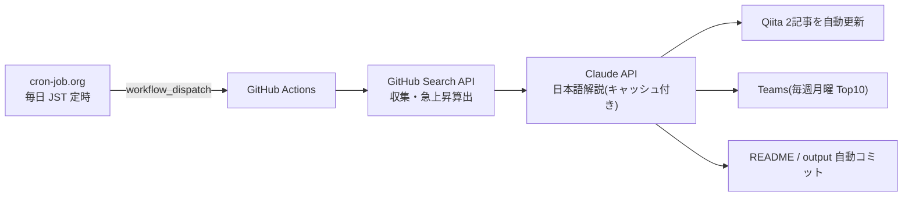

# Claude Code向けMCPツール候補ランキング

GitHub Search APIを使って、Claude Code周辺で活用候補になりそうなMCP関連リポジトリを定期収集するリポジトリです。

> 注意: この一覧は「Claude Codeでの動作」を保証するものではありません。  
> GitHub上のリポジトリ名・説明文・READMEなどに含まれる情報をもとに、MCP関連ツール候補を探すための入口として利用します。

## 仕組み(定常自律運転)

このランキングは cron-job.org → GitHub Actions → Claude API → Qiita / Teams のパイプラインで、毎日無人更新されています。



- 仕組みの詳細と**ライブ稼働ステータス**: [定常自律運転ページ](https://takanobusano.github.io/mcp-github-ranking/)
- 作り方の解説記事: [パイプライン編](https://qiita.com/4q_sano/items/913e93ee5cc2731561fc) / [cron-job.org 完全自動化編](https://qiita.com/4q_sano/items/1bc5e0669a8f0166936c)
<!-- MCP_REPOS_START -->
最終更新: **2026-07-16 08:17:12 JST**

MCP関連リポジトリに加え、Claude Code周辺で活用候補になりそうな関連ツールをGitHub Search APIで毎日自動収集してランキング化しています。

Stars / Forks の差分は、UTC基準の前日データ（2026-07-14）との差分です。
CSVには最大500件を保存し、本文では上位100件を表示しています。

> 注意: この一覧はClaude Codeでの動作を保証するものではありません。  
> MCP関連ツールまたはClaude Code関連ツール候補を探すための入口として利用してください。

# 注目MCP・関連ツール候補ランキング

## 1位 [public-apis/public-apis](https://github.com/public-apis/public-apis)

A collective list of free APIs

⭐ **450,459 Stars**（+380）　🍴 **49,533 Forks**（+48）　/　🟢 **1,536 Open Issues**　/　Python

Topics: `api` / `apis` / `dataset` / `development` / `free` / `list` / `lists` / `open-source`

## 2位 [obra/superpowers](https://github.com/obra/superpowers)

An agentic skills framework & software development methodology that works.

⭐ **255,385 Stars**（+711）　🍴 **22,831 Forks**（+74）　/　🟢 **312 Open Issues**　/　Shell

Topics: `ai` / `brainstorming` / `coding` / `obra` / `sdlc` / `skills` / `subagent-driven-development` / `superpowers`

## 3位 [affaan-m/ECC](https://github.com/affaan-m/ECC)

The agent harness performance optimization system. Skills, instincts, memory, security, and research-first development for Claude Code, Codex, Opencode, Cursor and beyond.

⭐ **230,107 Stars**（+396）　🍴 **35,220 Forks**（+57）　/　🟢 **109 Open Issues**　/　JavaScript

Topics: `ai-agents` / `anthropic` / `claude` / `claude-code` / `developer-tools` / `llm` / `mcp` / `productivity`

## 4位 [NousResearch/hermes-agent](https://github.com/NousResearch/hermes-agent)

The agent that grows with you

⭐ **215,445 Stars**（+579）　🍴 **40,179 Forks**（+202）　/　🟢 **23,061 Open Issues**　/　Python

Topics: `ai` / `ai-agent` / `ai-agents` / `anthropic` / `chatgpt` / `claude` / `claude-code` / `clawdbot`

## 5位 [ultraworkers/claw-code](https://github.com/ultraworkers/claw-code)

An agent-managed museum exhibit, built in Rust with Gajae-Code / LazyCodex — developed and maintained with no human intervention.

⭐ **194,772 Stars**（+12）　🍴 **109,642 Forks**（-22）　/　🟢 **31 Open Issues**　/　Rust

Topics: `topicなし`

## 6位 [multica-ai/andrej-karpathy-skills](https://github.com/multica-ai/andrej-karpathy-skills)

A single CLAUDE.md file to improve Claude Code behavior, derived from Andrej Karpathy's observations on LLM coding pitfalls.

⭐ **192,781 Stars**（+575）　🍴 **19,815 Forks**（+79）　/　🟢 **125 Open Issues**　/　不明

Topics: `topicなし`

## 7位 [ollama/ollama](https://github.com/ollama/ollama)

Get up and running with Kimi-K2.6, GLM-5.1, MiniMax, DeepSeek, gpt-oss, Qwen, Gemma and other models.

⭐ **176,195 Stars**（+80）　🍴 **16,970 Forks**（+6）　/　🟢 **3,451 Open Issues**　/　Go

Topics: `deepseek` / `gemma` / `gemma3` / `glm` / `go` / `golang` / `gpt-oss` / `llama`

## 8位 [mattpocock/skills](https://github.com/mattpocock/skills)

Skills for Real Engineers. Straight from my .claude directory.

⭐ **172,205 Stars**（+2,053）　🍴 **14,786 Forks**（+146）　/　🟢 **168 Open Issues**　/　Shell

Topics: `topicなし`

## 9位 [anthropics/skills](https://github.com/anthropics/skills)

Public repository for Agent Skills

⭐ **161,430 Stars**（+292）　🍴 **19,075 Forks**（+46）　/　🟢 **1,031 Open Issues**　/　Python

Topics: `agent-skills`

## 10位 [langflow-ai/langflow](https://github.com/langflow-ai/langflow)

Langflow is a powerful tool for building and deploying AI-powered agents and workflows.

⭐ **151,918 Stars**（+40）　🍴 **9,678 Forks**（+4）　/　🟢 **978 Open Issues**　/　Python

Topics: `agents` / `chatgpt` / `generative-ai` / `large-language-models` / `multiagent` / `react-flow`

## 11位 [firecrawl/firecrawl](https://github.com/firecrawl/firecrawl)

The API to search, scrape, and interact with the web at scale. 🔥

⭐ **151,517 Stars**（+492）　🍴 **8,657 Forks**（+31）　/　🟢 **401 Open Issues**　/　TypeScript

Topics: `ai` / `ai-agents` / `ai-crawler` / `ai-scraping` / `ai-search` / `crawler` / `data-extraction` / `html-to-markdown`

## 12位 [x1xhlol/system-prompts-and-models-of-ai-tools](https://github.com/x1xhlol/system-prompts-and-models-of-ai-tools)

FULL Augment Code, Claude Code, Cluely, CodeBuddy, Comet, Cursor, Devin AI, Junie, Kiro, Leap.new, Lovable, Manus, NotionAI, Orchids.app, Perplexity, Poke, Qoder, Replit, Same.dev, Trae, Traycer AI, VSCode Agent, Warp.dev, Windsurf, Xcode, Z.ai Code, Dia & v0. (And other Open Sourced) System Prompts, Internal Tools & AI Models

⭐ **141,955 Stars**（+34）　🍴 **34,800 Forks**（-4）　/　🟢 **156 Open Issues**　/　不明

Topics: `ai` / `bolt` / `cluely` / `copilot` / `cursor` / `cursorai` / `devin` / `github-copilot`

## 13位 [anthropics/claude-code](https://github.com/anthropics/claude-code)

Claude Code is an agentic coding tool that lives in your terminal, understands your codebase, and helps you code faster by executing routine tasks, explaining complex code, and handling git workflows - all through natural language commands.

⭐ **137,982 Stars**（+103）　🍴 **22,248 Forks**（+18）　/　🟢 **11,605 Open Issues**　/　Python

Topics: `topicなし`

## 14位 [msitarzewski/agency-agents](https://github.com/msitarzewski/agency-agents)

A complete AI agency at your fingertips - From frontend wizards to Reddit community ninjas, from whimsy injectors to reality checkers. Each agent is a specialized expert with personality, processes, and proven deliverables.

⭐ **131,764 Stars**（+308）　🍴 **21,657 Forks**（+73）　/　🟢 **105 Open Issues**　/　Shell

Topics: `topicなし`

## 15位 [garrytan/gstack](https://github.com/garrytan/gstack)

Use Garry Tan's exact Claude Code setup: 23 opinionated tools that serve as CEO, Designer, Eng Manager, Release Manager, Doc Engineer, and QA

⭐ **122,099 Stars**（+198）　🍴 **18,252 Forks**（+31）　/　🟢 **747 Open Issues**　/　TypeScript

Topics: `topicなし`

## 16位 [github/spec-kit](https://github.com/github/spec-kit)

💫 Toolkit to help you get started with Spec-Driven Development

⭐ **121,588 Stars**（+349）　🍴 **10,818 Forks**（+40）　/　🟢 **325 Open Issues**　/　Python

Topics: `ai` / `copilot` / `development` / `engineering` / `prd` / `spec` / `spec-driven`

## 17位 [farion1231/cc-switch](https://github.com/farion1231/cc-switch)

A cross-platform desktop All-in-One assistant for Claude Code, Codex, OpenCode, OpenClaw, Gemini CLI & Hermes Agent. Only official website: ccswitch.io

⭐ **117,571 Stars**（+379）　🍴 **7,869 Forks**（+27）　/　🟢 **1,915 Open Issues**　/　Rust

Topics: `ai-tools` / `claude-code` / `codex` / `desktop-app` / `hermes` / `hermes-agent` / `mcp` / `minimax`

## 18位 [nextlevelbuilder/ui-ux-pro-max-skill](https://github.com/nextlevelbuilder/ui-ux-pro-max-skill)

An AI SKILL that provide design intelligence for building professional UI/UX multiple platforms

⭐ **106,109 Stars**（+517）　🍴 **11,256 Forks**（+54）　/　🟢 **123 Open Issues**　/　Python

Topics: `ai-skills` / `antigravity` / `claude` / `claude-code` / `codex` / `command-line` / `copilot` / `cursor-ai`

## 19位 [google-gemini/gemini-cli](https://github.com/google-gemini/gemini-cli)

An open-source AI agent that brings the power of Gemini directly into your terminal.

⭐ **106,010 Stars**（+23）　🍴 **14,269 Forks**（+14）　/　🟢 **1,381 Open Issues**　/　TypeScript

Topics: `ai` / `ai-agents` / `cli` / `gemini` / `gemini-api` / `mcp-client` / `mcp-server`

## 20位 [browser-use/browser-use](https://github.com/browser-use/browser-use)

🌐 Make websites accessible for AI agents. Automate tasks online with ease.

⭐ **104,910 Stars**（+154）　🍴 **11,556 Forks**（+15）　/　🟢 **323 Open Issues**　/　Python

Topics: `ai-agents` / `ai-tools` / `browser-automation` / `browser-use` / `llm` / `playwright` / `python`

## 21位 [harry0703/MoneyPrinterTurbo](https://github.com/harry0703/MoneyPrinterTurbo)

利用AI大模型，一键生成高清短视频 Generate short videos with one click using AI LLM.

⭐ **97,658 Stars**（+234）　🍴 **14,445 Forks**（+56）　/　🟢 **2 Open Issues**　/　Python

Topics: `ai` / `automation` / `chatgpt` / `moviepy` / `python` / `shortvideo` / `tiktok`

## 22位 [puppeteer/puppeteer](https://github.com/puppeteer/puppeteer)

JavaScript API for Chrome and Firefox

⭐ **95,455 Stars**（+17）　🍴 **9,648 Forks**（+5）　/　🟢 **274 Open Issues**　/　TypeScript

Topics: `automation` / `chrome` / `chromium` / `developer-tools` / `firefox` / `headless-chrome` / `node-module` / `testing`

## 23位 [TauricResearch/TradingAgents](https://github.com/TauricResearch/TradingAgents)

TradingAgents: Multi-Agents LLM Financial Trading Framework

⭐ **93,162 Stars**（+171）　🍴 **17,990 Forks**（+24）　/　🟢 **301 Open Issues**　/　Python

Topics: `agent` / `finance` / `llm` / `multiagent` / `trading`

## 24位 [microsoft/playwright](https://github.com/microsoft/playwright)

Playwright is a framework for Web Testing and Automation. It allows testing Chromium, Firefox and WebKit with a single API.

⭐ **92,911 Stars**（+68）　🍴 **6,099 Forks**（+4）　/　🟢 **171 Open Issues**　/　TypeScript

Topics: `automation` / `chrome` / `chromium` / `e2e-testing` / `electron` / `end-to-end-testing` / `firefox` / `javascript`

## 25位 [JuliusBrussee/caveman](https://github.com/JuliusBrussee/caveman)

🪨 why use many token when few token do trick — Claude Code skill that cuts 65% of tokens by talking like caveman

⭐ **89,859 Stars**（+388）　🍴 **5,168 Forks**（+30）　/　🟢 **398 Open Issues**　/　JavaScript

Topics: `ai` / `anthropic` / `caveman` / `claude` / `claude-code` / `llm` / `meme` / `prompt-engineering`

## 26位 [modelcontextprotocol/servers](https://github.com/modelcontextprotocol/servers)

Model Context Protocol Servers

⭐ **88,514 Stars**（+34）　🍴 **11,226 Forks**（+8）　/　🟢 **668 Open Issues**　/　TypeScript

Topics: `topicなし`

## 27位 [ChatGPTNextWeb/NextChat](https://github.com/ChatGPTNextWeb/NextChat)

✨ Light and Fast AI Assistant. Support: Web \| iOS \| MacOS \| Android \|  Linux \| Windows

⭐ **88,465 Stars**（+7）　🍴 **59,430 Forks**（-9）　/　🟢 **841 Open Issues**　/　TypeScript

Topics: `calclaude` / `chatgpt` / `claude` / `cross-platform` / `desktop` / `fe` / `gemini` / `gemini-pro`

## 28位 [Graphify-Labs/graphify](https://github.com/Graphify-Labs/graphify)

AI coding assistant skill (Claude Code, Codex, OpenCode, Cursor, Gemini CLI, and more). Turn any folder of code, SQL schemas, R scripts, shell scripts, docs, papers, images, or videos into a queryable knowledge graph. App code + database schema + infrastructure in one graph.

⭐ **87,707 Stars**（+1,403）　🍴 **8,599 Forks**（+106）　/　🟢 **511 Open Issues**　/　Python

Topics: `antigravity` / `claude-code` / `codex` / `gemini` / `graphrag` / `knowledge-graph` / `leiden` / `openclaw`

## 29位 [thedotmack/claude-mem](https://github.com/thedotmack/claude-mem)

Persistent Context Across Sessions for Every Agent –  Captures everything your agent does during sessions, compresses it with AI, and injects relevant context back into future sessions. Works with Claude Code, OpenClaw, Codex, Gemini, Hermes, Copilot, OpenCode + More

⭐ **87,395 Stars**（+141）　🍴 **7,571 Forks**（+18）　/　🟢 **270 Open Issues**　/　JavaScript

Topics: `ai` / `ai-agents` / `ai-memory` / `anthropic` / `artificial-intelligence` / `chromadb` / `claude` / `claude-agent-sdk`

## 30位 [laravel/laravel](https://github.com/laravel/laravel)

Laravel is a web application framework with expressive, elegant syntax. We’ve already laid the foundation for your next big idea — freeing you to create without sweating the small things.

⭐ **84,745 Stars**（+11）　🍴 **24,907 Forks**（+4）　/　🟢 **32 Open Issues**　/　Blade

Topics: `framework` / `laravel` / `php`

## 31位 [DietrichGebert/ponytail](https://github.com/DietrichGebert/ponytail)

Makes your AI agent think like the laziest senior dev in the room. The best code is the code you never wrote.

⭐ **84,007 Stars**（+924）　🍴 **4,570 Forks**（+59）　/　🟢 **70 Open Issues**　/　JavaScript

Topics: `agent-skills` / `ai-agents` / `claude` / `claude-code` / `claude-code-plugin` / `cursor-rules` / `developer-tools` / `llm`

## 32位 [OpenHands/OpenHands](https://github.com/OpenHands/OpenHands)

🙌 OpenHands: AI-Driven Development

⭐ **80,899 Stars**（+115）　🍴 **10,338 Forks**（+29）　/　🟢 **372 Open Issues**　/　Python

Topics: `agent` / `artificial-intelligence` / `chatgpt` / `claude-ai` / `cli` / `developer-tools` / `gpt` / `llm`

## 33位 [nexu-io/open-design](https://github.com/nexu-io/open-design)

🎨 The open-source Claude Design alternative. 🖥️ Local-first desktop app. 🖼️ Your coding agent becomes the design engine: prototypes, landing pages, dashboards,...

⭐ **78,600 Stars**（+431）　🍴 **9,045 Forks**（+63）　/　🟢 **644 Open Issues**　/　TypeScript

Topics: `agent-skills` / `ai-agents` / `ai-design` / `byok` / `claude-code-for-design` / `claude-design` / `codex-design` / `coding-agents`

## 34位 [addyosmani/agent-skills](https://github.com/addyosmani/agent-skills)

Production-grade engineering skills for AI coding agents.

⭐ **78,556 Stars**（+255）　🍴 **8,434 Forks**（+28）　/　🟢 **127 Open Issues**　/　JavaScript

Topics: `agent-skills` / `antigravity` / `claude-code` / `codex` / `cursor` / `skills`

## 35位 [bytedance/deer-flow](https://github.com/bytedance/deer-flow)

An open-source long-horizon SuperAgent harness that researches, codes, and creates. With the help of sandboxes, memories, tools, skill, subagents and message gateway, it handles different levels of tasks that could take minutes to hours.

⭐ **77,124 Stars**（+82）　🍴 **10,483 Forks**（+15）　/　🟢 **977 Open Issues**　/　Python

Topics: `agent` / `agentic` / `agentic-framework` / `agentic-workflow` / `ai` / `ai-agents` / `deep-research` / `harness`

## 36位 [opendatalab/MinerU](https://github.com/opendatalab/MinerU)

Transforms complex documents like PDFs and Office docs into LLM-ready markdown/JSON for your Agentic workflows.

⭐ **74,723 Stars**（+112）　🍴 **6,283 Forks**（+13）　/　🟢 **42 Open Issues**　/　Python

Topics: `ai4science` / `document-analysis` / `docx` / `extract-data` / `layout-analysis` / `ocr` / `parser` / `pdf`

## 37位 [Egonex-AI/Understand-Anything](https://github.com/Egonex-AI/Understand-Anything)

Graphs that teach > graphs that impress. Turn any code into an interactive knowledge graph you can explore, search, and ask questions about. Works with Claude Code, Codex, Cursor, Copilot, Gemini CLI, and more.

⭐ **74,304 Stars**（+272）　🍴 **6,188 Forks**（+27）　/　🟢 **255 Open Issues**　/　TypeScript

Topics: `antigravity-skills` / `business-knowledge` / `claude-code` / `claude-skills` / `codebase-analysis` / `codex` / `codex-skills` / `developer-tools-ai-agent`

## 38位 [paperclipai/paperclip](https://github.com/paperclipai/paperclip)

The open-source app everyone uses to manage agents at work

⭐ **73,818 Stars**（+154）　🍴 **13,736 Forks**（+17）　/　🟢 **4,850 Open Issues**　/　TypeScript

Topics: `topicなし`

## 39位 [abi/screenshot-to-code](https://github.com/abi/screenshot-to-code)

Drop in a screenshot and convert it to clean code (HTML/Tailwind/React/Vue)

⭐ **73,292 Stars**（+14）　🍴 **9,020 Forks**（+2）　/　🟢 **123 Open Issues**　/　Python

Topics: `topicなし`

## 40位 [Eugeny/tabby](https://github.com/Eugeny/tabby)

A terminal for a more modern age

⭐ **73,266 Stars**（+19）　🍴 **4,156 Forks**（+3）　/　🟢 **2,780 Open Issues**　/　TypeScript

Topics: `serial` / `ssh-client` / `telnet-client` / `terminal` / `terminal-emulators`

## 41位 [thedaviddias/Front-End-Checklist](https://github.com/thedaviddias/Front-End-Checklist)

🗂 The essential checklist for modern web development, for humans and AI agents

⭐ **73,217 Stars**（+6）　🍴 **6,650 Forks**（-1）　/　🟢 **3 Open Issues**　/　MDX

Topics: `ai-agent` / `ai-agents` / `checklist` / `css` / `front-end-developer-tool` / `front-end-development` / `frontend` / `guidelines`

## 42位 [unclecode/crawl4ai](https://github.com/unclecode/crawl4ai)

🚀🤖 Crawl4AI: Open-source LLM Friendly Web Crawler & Scraper. Don't be shy, join here:

⭐ **72,797 Stars**（+164）　🍴 **7,466 Forks**（+13）　/　🟢 **106 Open Issues**　/　Python

Topics: `topicなし`

## 43位 [daytonaio/daytona](https://github.com/daytonaio/daytona)

Daytona is a Secure and Elastic Infrastructure for Running AI-Generated Code

⭐ **72,263 Stars**（+39）　🍴 **5,661 Forks**（±0）　/　🟢 **442 Open Issues**　/　不明

Topics: `agentic-workflow` / `ai` / `ai-agents` / `ai-runtime` / `ai-sandboxes` / `code-execution` / `code-interpreter` / `developer-tools`

## 44位 [OpenCut-app/OpenCut](https://github.com/OpenCut-app/OpenCut)

The open-source CapCut alternative

⭐ **71,539 Stars**（+2,424）　🍴 **7,336 Forks**（+132）　/　🟢 **347 Open Issues**　/　TypeScript

Topics: `editor` / `oss` / `videoeditor`

## 45位 [rtk-ai/rtk](https://github.com/rtk-ai/rtk)

CLI proxy that reduces LLM token consumption by 60-90% on common dev commands. Single Rust binary, zero dependencies

⭐ **71,242 Stars**（+217）　🍴 **4,429 Forks**（+19）　/　🟢 **1,607 Open Issues**　/　Rust

Topics: `agentic-coding` / `ai-coding` / `anthropic` / `claude-code` / `cli` / `command-line-tool` / `cost-reduction` / `developer-tools`

## 46位 [shareAI-lab/learn-claude-code](https://github.com/shareAI-lab/learn-claude-code)

Bash is all you need -  A nano claude code–like 「agent harness」, built from 0 to 1

⭐ **71,125 Stars**（+140）　🍴 **11,564 Forks**（+15）　/　🟢 **65 Open Issues**　/　Python

Topics: `agent` / `agent-development` / `ai-agent` / `claude` / `claude-code` / `educational` / `llm` / `python`

## 47位 [OpenBB-finance/OpenBB](https://github.com/OpenBB-finance/OpenBB)

Open Data Platform for analysts, quants and AI agents.

⭐ **70,624 Stars**（+46）　🍴 **7,175 Forks**（+8）　/　🟢 **78 Open Issues**　/　Python

Topics: `ai` / `crypto` / `derivatives` / `economics` / `equity` / `finance` / `fixed-income` / `machine-learning`

## 48位 [D4Vinci/Scrapling](https://github.com/D4Vinci/Scrapling)

🕷️ An adaptive Web Scraping framework that handles everything from a single request to a full-scale crawl!

⭐ **69,671 Stars**（+128）　🍴 **6,897 Forks**（+15）　/　🟢 **4 Open Issues**　/　Python

Topics: `ai` / `ai-scraping` / `automation` / `crawler` / `crawling` / `crawling-python` / `data` / `data-extraction`

## 49位 [unslothai/unsloth](https://github.com/unslothai/unsloth)

Unsloth Studio is a web UI for training and running open models like Gemma 4, Qwen3.6, DeepSeek, gpt-oss locally.

⭐ **68,266 Stars**（+46）　🍴 **6,142 Forks**（+6）　/　🟢 **952 Open Issues**　/　Python

Topics: `agent` / `deepseek` / `fine-tuning` / `gemma` / `gemma3` / `gpt-oss` / `llama` / `llama3`

## 50位 [xtekky/gpt4free](https://github.com/xtekky/gpt4free)

The official gpt4free repository \| various collection of powerful language models \| opus 4.6 gpt 5.3 kimi 2.5 deepseek v3.2 gemini 3

⭐ **66,465 Stars**（-6）　🍴 **13,534 Forks**（+2）　/　🟢 **7 Open Issues**　/　Python

Topics: `chatbot` / `chatbots` / `chatgpt` / `chatgpt-4` / `chatgpt-api` / `chatgpt-free` / `chatgpt4` / `deepseek`

## 51位 [bradtraversy/design-resources-for-developers](https://github.com/bradtraversy/design-resources-for-developers)

Curated list of design and UI resources from stock photos, web templates, CSS frameworks, UI libraries, tools and much more

⭐ **66,421 Stars**（+15）　🍴 **12,109 Forks**（±0）　/　🟢 **53 Open Issues**　/　不明

Topics: `topicなし`

## 52位 [code-yeongyu/oh-my-openagent](https://github.com/code-yeongyu/oh-my-openagent)

omo/lazycodex: The coding agent for tokenmaxxers;the one and only agent harness for complex codebases. For your Codex, for your OpenCode

⭐ **65,892 Stars**（+90）　🍴 **5,375 Forks**（+9）　/　🟢 **910 Open Issues**　/　TypeScript

Topics: `ai` / `ai-agents` / `anthropic` / `chatgpt` / `claude` / `claude-skills` / `codex` / `cursor`

## 53位 [openinterpreter/openinterpreter](https://github.com/openinterpreter/openinterpreter)

A coding agent for low-cost models

⭐ **65,441 Stars**（+448）　🍴 **5,651 Forks**（+23）　/　🟢 **274 Open Issues**　/　Rust

Topics: `acp` / `coding-agent` / `deepseek` / `kimi` / `qwen` / `rust`

## 54位 [cline/cline](https://github.com/cline/cline)

Autonomous coding agent as an SDK, IDE extension, or CLI assistant.

⭐ **64,696 Stars**（+38）　🍴 **6,917 Forks**（+4）　/　🟢 **1,257 Open Issues**　/　TypeScript

Topics: `topicなし`

## 55位 [ruvnet/ruflo](https://github.com/ruvnet/ruflo)

🌊 The leading agent meta-harness. Deploy intelligent multi-player swarms, coordinate autonomous workflows, and build conversational AI systems. Features adaptiv...

⭐ **64,547 Stars**（+122）　🍴 **7,672 Forks**（+21）　/　🟢 **793 Open Issues**　/　TypeScript

Topics: `agentic-ai` / `agentic-framework` / `agentic-workflow` / `agents` / `ai-agents` / `ai-assistant` / `ai-coding` / `ai-skills`

## 56位 [Leonxlnx/taste-skill](https://github.com/Leonxlnx/taste-skill)

Taste-Skill - gives your AI good taste. stops the AI from generating boring, generic slop

⭐ **63,874 Stars**（+402）　🍴 **4,514 Forks**（+33）　/　🟢 **46 Open Issues**　/　JavaScript

Topics: `agent` / `ai` / `claude` / `claude-code` / `codex` / `coding` / `design` / `frontend`

## 57位 [docling-project/docling](https://github.com/docling-project/docling)

Get your documents ready for gen AI

⭐ **63,221 Stars**（+70）　🍴 **4,461 Forks**（+8）　/　🟢 **930 Open Issues**　/　Python

Topics: `ai` / `convert` / `document-parser` / `document-parsing` / `documents` / `docx` / `html` / `markdown`

## 58位 [warpdotdev/warp](https://github.com/warpdotdev/warp)

Warp is an agentic development environment, born out of the terminal.

⭐ **63,210 Stars**（+27）　🍴 **5,238 Forks**（+15）　/　🟢 **4,625 Open Issues**　/　Rust

Topics: `bash` / `linux` / `macos` / `rust` / `shell` / `terminal` / `wasm` / `zsh`

## 59位 [shanraisshan/claude-code-best-practice](https://github.com/shanraisshan/claude-code-best-practice)

from vibe coding to agentic engineering - practice makes claude perfect

⭐ **62,690 Stars**（+84）　🍴 **6,264 Forks**（+2）　/　🟢 **15 Open Issues**　/　HTML

Topics: `agentic-ai` / `agentic-coding` / `agentic-engineering` / `agentic-workflow` / `ai` / `ai-agents` / `anthropic` / `best-practices`

## 60位 [koala73/worldmonitor](https://github.com/koala73/worldmonitor)

Real-time global intelligence dashboard. AI-powered news aggregation, geopolitical monitoring, and infrastructure tracking in a unified situational awareness interface

⭐ **61,903 Stars**（+48）　🍴 **9,642 Forks**（+10）　/　🟢 **183 Open Issues**　/　TypeScript

Topics: `agent` / `ai` / `dashboard` / `geopolitics` / `mcp` / `mcp-server` / `monitoring` / `news`

## 61位 [Fission-AI/OpenSpec](https://github.com/Fission-AI/OpenSpec)

Spec-driven development (SDD) for AI coding assistants.

⭐ **61,057 Stars**（+189）　🍴 **4,235 Forks**（+15）　/　🟢 **476 Open Issues**　/　TypeScript

Topics: `ai` / `context-engineering` / `engineering` / `planning` / `prd` / `sdd` / `sdlc` / `spec`

## 62位 [mem0ai/mem0](https://github.com/mem0ai/mem0)

Universal memory layer for AI Agents

⭐ **60,920 Stars**（+90）　🍴 **7,096 Forks**（+9）　/　🟢 **608 Open Issues**　/　TypeScript

Topics: `agents` / `ai` / `ai-agents` / `application` / `chatbots` / `chatgpt` / `genai` / `llm`

## 63位 [sansan0/TrendRadar](https://github.com/sansan0/TrendRadar)

⭐AI-driven public opinion & trend monitor with multi-platform aggregation, RSS, and smart alerts.🎯 告别信息过载，你的 AI 舆情监控助手与热点筛选工具！聚合多平台热点 +  RSS 订阅，支持关键词精准筛选。AI 智能筛...

⭐ **60,578 Stars**（+20）　🍴 **24,795 Forks**（+1）　/　🟢 **49 Open Issues**　/　Python

Topics: `ai` / `bark` / `data-analysis` / `docker` / `hot-news` / `llm` / `mail` / `mcp`

## 64位 [colbymchenry/codegraph](https://github.com/colbymchenry/codegraph)

Pre-indexed code knowledge graph, auto syncs on code changes, for Claude Code, Codex, Gemini, Cursor, OpenCode, AntiGravity, Kiro, and Hermes Agent — fewer tokens, fewer tool calls, 100% local

⭐ **60,188 Stars**（+224）　🍴 **3,765 Forks**（+21）　/　🟢 **324 Open Issues**　/　TypeScript

Topics: `topicなし`

## 65位 [microsoft/autogen](https://github.com/microsoft/autogen)

A programming framework for agentic AI

⭐ **59,755 Stars**（+21）　🍴 **8,996 Forks**（+5）　/　🟢 **955 Open Issues**　/　Python

Topics: `agentic` / `agentic-agi` / `agents` / `ai` / `autogen` / `autogen-ecosystem` / `chatgpt` / `framework`

## 66位 [headroomlabs-ai/headroom](https://github.com/headroomlabs-ai/headroom)

Compress tool outputs, logs, files, and RAG chunks before they reach the LLM. 20% fewer tokens for coding agents, 60-95% fewer tokens for JSON, same answers. Library, proxy, MCP server.

⭐ **59,355 Stars**（+191）　🍴 **4,406 Forks**（+19）　/　🟢 **407 Open Issues**　/　Python

Topics: `agent` / `ai` / `anthropic` / `claude-code` / `compression` / `context-engineering` / `context-window` / `cursor`

## 67位 [upstash/context7](https://github.com/upstash/context7)

Context7 Platform -- Up-to-date code documentation for LLMs and AI code editors

⭐ **59,160 Stars**（+49）　🍴 **2,796 Forks**（+9）　/　🟢 **20 Open Issues**　/　TypeScript

Topics: `llm` / `mcp` / `mcp-server` / `vibe-coding`

## 68位 [coollabsio/coolify](https://github.com/coollabsio/coolify)

An open-source, self-hostable PaaS alternative to Vercel, Heroku & Netlify that lets you easily deploy static sites, databases, full-stack applications and 280+ one-click services on your own servers.

⭐ **58,622 Stars**（+92）　🍴 **5,037 Forks**（+13）　/　🟢 **825 Open Issues**　/　PHP

Topics: `coolify` / `databases` / `deployment` / `docker` / `docker-compose` / `inertiajs` / `laravel` / `mariadb`

## 69位 [meilisearch/meilisearch](https://github.com/meilisearch/meilisearch)

A lightning-fast search engine API bringing AI-powered hybrid search to your sites and applications.

⭐ **58,605 Stars**（+15）　🍴 **2,624 Forks**（+2）　/　🟢 **320 Open Issues**　/　Rust

Topics: `ai` / `api` / `app-search` / `database` / `enterprise-search` / `faceting` / `full-text-search` / `fuzzy-search`

## 70位 [MemPalace/mempalace](https://github.com/MemPalace/mempalace)

The best-benchmarked open-source AI memory system. And it's free.

⭐ **57,362 Stars**（+39）　🍴 **7,402 Forks**（+5）　/　🟢 **632 Open Issues**　/　Python

Topics: `ai` / `chromadb` / `llm` / `mcp` / `memory` / `python`

## 71位 [zylon-ai/private-gpt](https://github.com/zylon-ai/private-gpt)

Complete API layer for private AI applications on local models: RAG, skills, tools, MCP, text-to-sql, and more. Works with any OpenAI-compatible inference server.

⭐ **57,334 Stars**（+2）　🍴 **7,597 Forks**（-1）　/　🟢 **6 Open Issues**　/　Python

Topics: `ai` / `ai-tools` / `on-premise`

## 72位 [Panniantong/Agent-Reach](https://github.com/Panniantong/Agent-Reach)

Give your AI agent eyes to see the entire internet. Read & search Twitter, Reddit, YouTube, GitHub, Bilibili, XiaoHongShu — one CLI, zero API fees.

⭐ **56,784 Stars**（+544）　🍴 **4,666 Forks**（+38）　/　🟢 **156 Open Issues**　/　Python

Topics: `agent-infrastructure` / `ai-agent` / `ai-search` / `automation` / `bilibili` / `claude-code` / `cli` / `cursor`

## 73位 [NanmiCoder/MediaCrawler](https://github.com/NanmiCoder/MediaCrawler)

小红书笔记 \| 评论爬虫、抖音视频 \| 评论爬虫、快手视频 \| 评论爬虫、B 站视频 ｜ 评论爬虫、微博帖子 ｜ 评论爬虫、百度贴吧帖子 ｜ 百度贴吧评论回复爬虫  \| 知乎问答文章｜评论爬虫

⭐ **56,648 Stars**（+148）　🍴 **11,363 Forks**（+12）　/　🟢 **177 Open Issues**　/　Python

Topics: `topicなし`

## 74位 [penpot/penpot](https://github.com/penpot/penpot)

Penpot: The open-source design platform for Product teams that need scalable collaboration.

⭐ **56,496 Stars**（+356）　🍴 **3,710 Forks**（+17）　/　🟢 **727 Open Issues**　/　Clojure

Topics: `clojure` / `clojurescript` / `design` / `prototyping` / `ui` / `ux-design` / `ux-experience`

## 75位 [1c7/chinese-independent-developer](https://github.com/1c7/chinese-independent-developer)

👩🏿‍💻👨🏾‍💻👩🏼‍💻👨🏽‍💻👩🏻‍💻中国独立开发者项目列表 -- 分享大家都在做什么

⭐ **55,871 Stars**（+2,489）　🍴 **4,851 Forks**（+163）　/　🟢 **1 Open Issues**　/　Python

Topics: `china` / `indie` / `indie-developer`

## 76位 [crewAIInc/crewAI](https://github.com/crewAIInc/crewAI)

Framework for orchestrating role-playing, autonomous AI agents. By fostering collaborative intelligence, CrewAI empowers agents to work together seamlessly, tackling complex tasks.

⭐ **55,589 Stars**（+57）　🍴 **7,841 Forks**（+11）　/　🟢 **651 Open Issues**　/　Python

Topics: `agents` / `ai` / `ai-agents` / `aiagentframework` / `llms`

## 77位 [BerriAI/litellm](https://github.com/BerriAI/litellm)

Python SDK, Proxy Server (AI Gateway) to call 100+ LLM APIs in OpenAI (or native) format, with cost tracking, guardrails, loadbalancing and logging. [Bedrock, Azure, OpenAI, VertexAI, Cohere, Anthropic, Sagemaker, HuggingFace, VLLM, NVIDIA NIM]

⭐ **53,711 Stars**（+123）　🍴 **9,799 Forks**（+34）　/　🟢 **3,982 Open Issues**　/　Python

Topics: `ai-gateway` / `anthropic` / `azure-openai` / `bedrock` / `gateway` / `langchain` / `litellm` / `llm`

## 78位 [mvanhorn/last30days-skill](https://github.com/mvanhorn/last30days-skill)

AI agent skill that researches any topic across Reddit, X, YouTube, HN, Polymarket, and the web - then synthesizes a grounded summary

⭐ **52,340 Stars**（+139）　🍴 **4,572 Forks**（+31）　/　🟢 **95 Open Issues**　/　Python

Topics: `ai-prompts` / `ai-skill` / `bluesky` / `claude` / `claude-code` / `clawhub` / `deep-research` / `hackernews`

## 79位 [aaif-goose/goose](https://github.com/aaif-goose/goose)

an open source, extensible AI agent that goes beyond code suggestions - install, execute, edit, and test with any LLM

⭐ **51,256 Stars**（+42）　🍴 **5,693 Forks**（+12）　/　🟢 **307 Open Issues**　/　Rust

Topics: `acp` / `ai` / `ai-agents` / `mcp`

## 80位 [charlax/professional-programming](https://github.com/charlax/professional-programming)

A collection of learning resources for curious software engineers

⭐ **51,256 Stars**（-2）　🍴 **4,001 Forks**（+1）　/　🟢 **4 Open Issues**　/　Python

Topics: `architecture` / `computer-science` / `concepts` / `documentation` / `engineer` / `learning` / `lessons-learned` / `professional`

## 81位 [bmad-code-org/BMAD-METHOD](https://github.com/bmad-code-org/BMAD-METHOD)

Breakthrough Method for Agile Ai Driven Development

⭐ **50,647 Stars**（+50）　🍴 **5,826 Forks**（+7）　/　🟢 **100 Open Issues**　/　JavaScript

Topics: `topicなし`

## 82位 [mudler/LocalAI](https://github.com/mudler/LocalAI)

LocalAI is the open-source AI engine. Run any model - LLMs, vision, voice, image, video - on any hardware. No GPU required.

⭐ **47,552 Stars**（+10）　🍴 **4,238 Forks**（+2）　/　🟢 **228 Open Issues**　/　Go

Topics: `agents` / `ai` / `api` / `audio-generation` / `decentralized` / `distributed` / `image-generation` / `libp2p`

## 83位 [oobabooga/textgen](https://github.com/oobabooga/textgen)

Open-source desktop app for local LLMs. Text, vision, tool-calling, OpenAI/Anthropic-compatible API. 100% private.

⭐ **47,450 Stars**（+1）　🍴 **5,983 Forks**（+1）　/　🟢 **828 Open Issues**　/　Python

Topics: `topicなし`

## 84位 [prisma/prisma](https://github.com/prisma/prisma)

Next-generation ORM for Node.js & TypeScript \| PostgreSQL, MySQL, MariaDB, SQL Server, SQLite, MongoDB and CockroachDB

⭐ **47,362 Stars**（+16）　🍴 **2,476 Forks**（-2）　/　🟢 **2,649 Open Issues**　/　TypeScript

Topics: `cockroachdb` / `database` / `javascript` / `mariadb` / `mongo` / `mongodb` / `mongodb-orm` / `mssql`

## 85位 [jeecgboot/JeecgBoot](https://github.com/jeecgboot/JeecgBoot)

【低代码 V2.0】AI低代码平台，AI Skills 一句话生成整个系统；一键生成前后端代码甚至整个模块。 AI Skills 一句话画流程、设计表单、生成报表、大屏。内置 AI应用平台涵盖：AI聊天、知识库、流程编排、MCP插件等，兼容主流大模型。引领AI低代码「Skills 生成 → 在线配置 → 代码生成 →...

⭐ **47,089 Stars**（+20）　🍴 **16,088 Forks**（+5）　/　🟢 **50 Open Issues**　/　Java

Topics: `activiti` / `agent` / `ai` / `antd` / `claude-code` / `cli` / `codegenerator` / `codex`

## 86位 [GitHubDaily/GitHubDaily](https://github.com/GitHubDaily/GitHubDaily)

坚持分享 GitHub 上高质量、有趣实用的开源技术教程、开发者工具、编程网站、技术资讯。A list cool, interesting projects of GitHub.

⭐ **47,084 Stars**（+12）　🍴 **4,655 Forks**（±0）　/　🟢 **706 Open Issues**　/　不明

Topics: `ai` / `algorithms-and-data-structures` / `backend` / `developer-tools` / `development` / `frontend` / `github` / `java`

## 87位 [pbakaus/impeccable](https://github.com/pbakaus/impeccable)

The design language that makes your AI harness better at design.

⭐ **47,035 Stars**（+337）　🍴 **2,826 Forks**（+12）　/　🟢 **29 Open Issues**　/　JavaScript

Topics: `topicなし`

## 88位 [ChromeDevTools/chrome-devtools-mcp](https://github.com/ChromeDevTools/chrome-devtools-mcp)

Chrome DevTools for coding agents

⭐ **47,022 Stars**（+93）　🍴 **3,229 Forks**（+12）　/　🟢 **100 Open Issues**　/　TypeScript

Topics: `browser` / `chrome` / `chrome-devtools` / `debugging` / `devtools` / `mcp` / `mcp-server` / `puppeteer`

## 89位 [serverless/serverless](https://github.com/serverless/serverless)

⚡ Serverless Framework – Effortlessly build apps that auto-scale, incur zero costs when idle, and require minimal maintenance using AWS Lambda and other managed...

⭐ **46,921 Stars**（±0）　🍴 **5,731 Forks**（+1）　/　🟢 **1,223 Open Issues**　/　JavaScript

Topics: `aws` / `aws-dynamodb` / `aws-lambda` / `azure-functions` / `google-cloud-functions` / `microservice` / `serverless` / `serverless-architectures`

## 90位 [exo-explore/exo](https://github.com/exo-explore/exo)

Run frontier AI locally.

⭐ **46,289 Stars**（+26）　🍴 **3,356 Forks**（+1）　/　🟢 **305 Open Issues**　/　Python

Topics: `topicなし`

## 91位 [apache/airflow](https://github.com/apache/airflow)

Apache Airflow - A platform to programmatically author, schedule, and monitor workflows

⭐ **46,130 Stars**（+9）　🍴 **17,388 Forks**（+3）　/　🟢 **1,725 Open Issues**　/　Python

Topics: `airflow` / `apache` / `apache-airflow` / `automation` / `dag` / `data-engineering` / `data-integration` / `data-orchestrator`

## 92位 [zhayujie/CowAgent](https://github.com/zhayujie/CowAgent)

Open-source super AI assistant & Agent Harness. Plans tasks, runs tools and skills, self-evolves with memory and knowledge. Multi-model, multi-channel. Lightweight, extensible, one-line install. (formerly chatgpt-on-wechat)

⭐ **45,992 Stars**（+12）　🍴 **10,267 Forks**（+2）　/　🟢 **26 Open Issues**　/　Python

Topics: `ai` / `ai-agent` / `ai-agents` / `chatgpt-on-wechat` / `claude` / `claude-code` / `codex` / `cowagent`

## 93位 [KeygraphHQ/shannon](https://github.com/KeygraphHQ/shannon)

Shannon is an autonomous, white-box AI pentester for web applications and APIs. It analyzes your source code, identifies attack vectors, and executes real exploits to prove vulnerabilities before they reach production.

⭐ **45,728 Stars**（+33）　🍴 **5,309 Forks**（+5）　/　🟢 **24 Open Issues**　/　TypeScript

Topics: `penetration-testing` / `pentesting` / `security-audit` / `security-automation` / `security-tools`

## 94位 [HKUDS/CLI-Anything](https://github.com/HKUDS/CLI-Anything)

"CLI-Anything: Making ALL Software Agent-Native" -- CLI-Hub:

⭐ **45,368 Stars**（+45）　🍴 **4,245 Forks**（+11）　/　🟢 **73 Open Issues**　/　Python

Topics: `topicなし`

## 95位 [abhigyanpatwari/GitNexus](https://github.com/abhigyanpatwari/GitNexus)

GitNexus: The Zero-Server Code Intelligence Engine -       GitNexus is a client-side knowledge graph creator that runs entirely in your browser. Drop in a git repository (Github, Gitlab, Azure, Local) or ZIP file, and get an interactive knowledge graph with a built in Graph RAG Agent. Perfect for code exploration

⭐ **44,172 Stars**（+61）　🍴 **4,910 Forks**（+1）　/　🟢 **307 Open Issues**　/　TypeScript

Topics: `topicなし`

## 96位 [janhq/jan](https://github.com/janhq/jan)

Jan is an open source alternative to ChatGPT that runs 100% offline on your computer.

⭐ **43,587 Stars**（+15）　🍴 **2,903 Forks**（+1）　/　🟢 **387 Open Issues**　/　TypeScript

Topics: `chatgpt` / `gpt` / `llamacpp` / `llm` / `localai` / `open-source` / `self-hosted` / `tauri`

## 97位 [ccxt/ccxt](https://github.com/ccxt/ccxt)

A cryptocurrency trading API with more than 100 crypto and prediction exchanges in JavaScript / TypeScript / Python / C# / PHP / Go / Java

⭐ **43,303 Stars**（+2）　🍴 **8,742 Forks**（+3）　/　🟢 **1,282 Open Issues**　/　Python

Topics: `altcoin` / `api` / `arbitrage` / `bitcoin` / `bot` / `btc` / `crypto` / `cryptocurrencies`

## 98位 [gradio-app/gradio](https://github.com/gradio-app/gradio)

Build and share delightful machine learning apps, all in Python. 🌟 Star to support our work!

⭐ **43,141 Stars**（+9）　🍴 **3,548 Forks**（±0）　/　🟢 **216 Open Issues**　/　Python

Topics: `data-analysis` / `data-science` / `data-visualization` / `deep-learning` / `deploy` / `gradio` / `gradio-interface` / `interface`

## 99位 [danielmiessler/Fabric](https://github.com/danielmiessler/Fabric)

Fabric is an open-source framework for augmenting humans using AI. It provides a modular system for solving specific problems using a crowdsourced set of AI prompts that can be used anywhere.

⭐ **43,094 Stars**（+19）　🍴 **4,202 Forks**（-1）　/　🟢 **67 Open Issues**　/　Go

Topics: `ai` / `augmentation` / `flourishing` / `life` / `work`

## 100位 [QuantumNous/new-api](https://github.com/QuantumNous/new-api)

A unified AI model hub for aggregation & distribution. It supports cross-converting various LLMs into OpenAI-compatible, Claude-compatible, or Gemini-compatible...

⭐ **42,339 Stars**（+112）　🍴 **9,828 Forks**（+40）　/　🟢 **1,031 Open Issues**　/　Go

Topics: `ai-gateway` / `claude` / `deepseek` / `gemini` / `newapi` / `openai` / `rerank`

# 最近プッシュされたMCP・関連ツール候補

スター数ランキングとは別に、最近コードがプッシュされたリポジトリを表示します。古いスター数だけではなく、現在も開発が動いていそうな候補を探すための一覧です。

## プッシュ順 1位 [paperclipai/paperclip](https://github.com/paperclipai/paperclip)

The open-source app everyone uses to manage agents at work

⭐ **73,818 Stars**（+154）　🍴 **13,736 Forks**（+17）　/　TypeScript　/　最終プッシュ: 2026-07-15

Topics: `topicなし`

## プッシュ順 2位 [manaflow-ai/cmux](https://github.com/manaflow-ai/cmux)

Open source Ghostty-based macOS terminal with vertical tabs and notifications for AI coding agents. Built for multitasking, organization, and programmability.

⭐ **24,548 Stars**（+64）　🍴 **1,990 Forks**（+4）　/　Swift　/　最終プッシュ: 2026-07-15

Topics: `amp` / `claude-code` / `cli` / `codex` / `coding-agents` / `gemini` / `ghostty` / `macos`

## プッシュ順 3位 [langchain-ai/openwiki](https://github.com/langchain-ai/openwiki)

OpenWiki is a CLI that writes and maintains agent documentation for your codebase.

⭐ **11,576 Stars**（+368）　🍴 **800 Forks**（+30）　/　TypeScript　/　最終プッシュ: 2026-07-15

Topics: `topicなし`

## プッシュ順 4位 [zeroclaw-labs/zeroclaw](https://github.com/zeroclaw-labs/zeroclaw)

Fast, small, and fully autonomous AI personal assistant infrastructure, any OS, any platform — deploy anywhere, swap anything 🦀

⭐ **32,275 Stars**（+10）　🍴 **4,802 Forks**（+3）　/　Rust　/　最終プッシュ: 2026-07-15

Topics: `agent` / `agentic` / `ai` / `infra` / `ml` / `openclaw` / `os` / `zeroclaw`

## プッシュ順 5位 [OpenHands/OpenHands](https://github.com/OpenHands/OpenHands)

🙌 OpenHands: AI-Driven Development

⭐ **80,899 Stars**（+115）　🍴 **10,338 Forks**（+29）　/　Python　/　最終プッシュ: 2026-07-15

Topics: `agent` / `artificial-intelligence` / `chatgpt` / `claude-ai` / `cli` / `developer-tools` / `gpt` / `llm`

## プッシュ順 6位 [gravitational/teleport](https://github.com/gravitational/teleport)

The easiest, and most secure way to access and protect all of your infrastructure.

⭐ **20,643 Stars**（+1）　🍴 **2,110 Forks**（+1）　/　Go　/　最終プッシュ: 2026-07-15

Topics: `audit` / `bastion` / `certificate` / `cluster` / `database-access` / `firewall` / `firewalls` / `go`

## プッシュ順 7位 [langflow-ai/langflow](https://github.com/langflow-ai/langflow)

Langflow is a powerful tool for building and deploying AI-powered agents and workflows.

⭐ **151,918 Stars**（+40）　🍴 **9,678 Forks**（+4）　/　Python　/　最終プッシュ: 2026-07-15

Topics: `agents` / `chatgpt` / `generative-ai` / `large-language-models` / `multiagent` / `react-flow`

## プッシュ順 8位 [warpdotdev/warp](https://github.com/warpdotdev/warp)

Warp is an agentic development environment, born out of the terminal.

⭐ **63,210 Stars**（+27）　🍴 **5,238 Forks**（+15）　/　Rust　/　最終プッシュ: 2026-07-15

Topics: `bash` / `linux` / `macos` / `rust` / `shell` / `terminal` / `wasm` / `zsh`

## プッシュ順 9位 [NVIDIA/NemoClaw](https://github.com/NVIDIA/NemoClaw)

Run agents like Hermes, LangChain Deep Agents, and OpenClaw more securely inside NVIDIA OpenShell with managed inference

⭐ **21,796 Stars**（+6）　🍴 **2,945 Forks**（+4）　/　TypeScript　/　最終プッシュ: 2026-07-15

Topics: `ai-agents` / `hermes` / `nvidia` / `openclaw` / `openshell` / `sandboxing` / `typescript`

## プッシュ順 10位 [mastra-ai/mastra](https://github.com/mastra-ai/mastra)

Mastra is the modern TypeScript framework for AI-powered applications and agents.

⭐ **26,194 Stars**（+25）　🍴 **2,428 Forks**（+9）　/　TypeScript　/　最終プッシュ: 2026-07-15

Topics: `agents` / `ai` / `chatbots` / `evals` / `javascript` / `llm` / `mcp` / `nextjs`

## プッシュ順 11位 [diegosouzapw/OmniRoute](https://github.com/diegosouzapw/OmniRoute)

Never stop coding. Free AI gateway: one endpoint, 231+ providers (50+ free), connect Claude Code, Codex, Cursor, Cline & Copilot to FREE Claude/GPT/Gemini. RTK+Caveman stacked compression saves 15-95% tokens, smart auto-fallback, MCP/A2A, multimodal APIs, Desktop/PWA.

⭐ **17,730 Stars**（+422）　🍴 **2,645 Forks**（+44）　/　TypeScript　/　最終プッシュ: 2026-07-15

Topics: `a2a` / `ai-agents` / `ai-gateway` / `anthropic` / `claude` / `claude-code` / `cline` / `codex`

## プッシュ順 12位 [pydantic/pydantic-ai](https://github.com/pydantic/pydantic-ai)

AI Agent Framework, the Pydantic way

⭐ **18,555 Stars**（+26）　🍴 **2,365 Forks**（±0）　/　Python　/　最終プッシュ: 2026-07-15

Topics: `agent-framework` / `genai` / `llm` / `pydantic` / `python`

## プッシュ順 13位 [heygen-com/hyperframes](https://github.com/heygen-com/hyperframes)

Write HTML. Render video. Built for agents.

⭐ **35,443 Stars**（+292）　🍴 **3,324 Forks**（+33）　/　TypeScript　/　最終プッシュ: 2026-07-15

Topics: `ai` / `animation` / `ffmpeg` / `framework` / `gsap` / `html` / `mcp` / `puppeteer`

## プッシュ順 14位 [datahub-project/datahub](https://github.com/datahub-project/datahub)

The Context Platform for your Data and AI Stack

⭐ **12,281 Stars**（+8）　🍴 **3,551 Forks**（+1）　/　Python　/　最終プッシュ: 2026-07-15

Topics: `agent-platform` / `context-management` / `data-catalog` / `data-discovery` / `data-governance` / `data-observability` / `datahub` / `metadata`

## プッシュ順 15位 [stablyai/orca](https://github.com/stablyai/orca)

Orca is the ADE for working with a fleet of parallel agents. Run any coding agent with your own subscription. Available on desktop and mobile.

⭐ **19,834 Stars**（+757）　🍴 **1,547 Forks**（+52）　/　TypeScript　/　最終プッシュ: 2026-07-15

Topics: `ade` / `agent-ide` / `ai-agents` / `claude-code` / `cli` / `codex` / `cursor-agent` / `devtools`

## プッシュ順 16位 [sgl-project/sglang](https://github.com/sgl-project/sglang)

SGLang is a high-performance serving framework for large language models and multimodal models.

⭐ **30,345 Stars**（+37）　🍴 **7,181 Forks**（+28）　/　Python　/　最終プッシュ: 2026-07-15

Topics: `attention` / `blackwell` / `cuda` / `deepseek` / `diffusion` / `glm` / `gpt-oss` / `inference`

## プッシュ順 17位 [DeusData/codebase-memory-mcp](https://github.com/DeusData/codebase-memory-mcp)

High-performance code intelligence MCP server. Indexes codebases into a persistent knowledge graph — average repo in milliseconds. 158 languages, sub-ms queries, 99% fewer tokens. Single static binary, zero dependencies.

⭐ **31,844 Stars**（+333）　🍴 **2,543 Forks**（+34）　/　C　/　最終プッシュ: 2026-07-15

Topics: `aider` / `ast` / `claude-code` / `code-analysis` / `code-intelligence` / `codex` / `cursor` / `cypher`

## プッシュ順 18位 [superset-sh/superset](https://github.com/superset-sh/superset)

Code Editor for the AI Agents Era - Run an army of Claude Code, Codex, etc. on your machine

⭐ **12,439 Stars**（+20）　🍴 **1,085 Forks**（+5）　/　TypeScript　/　最終プッシュ: 2026-07-15

Topics: `agentic-ai` / `ai-agents` / `claude-code` / `cli` / `codex` / `coding-agents` / `cursor-agent` / `desktop-app`

## プッシュ順 19位 [can1357/oh-my-pi](https://github.com/can1357/oh-my-pi)

⌥  AI Coding agent for the terminal — hash-anchored edits, optimized tool harness, LSP, Python, browser, subagents, and more

⭐ **17,942 Stars**（+168）　🍴 **1,642 Forks**（+27）　/　TypeScript　/　最終プッシュ: 2026-07-15

Topics: `ai-agent` / `ai-coding-agent` / `anthropic` / `bun` / `claude` / `cli` / `coding-assistant` / `llm`

## プッシュ順 20位 [weaviate/weaviate](https://github.com/weaviate/weaviate)

Weaviate is an open-source vector database that stores both objects and vectors, allowing for the combination of vector search with structured filtering with the fault tolerance and scalability of a cloud-native database​.

⭐ **16,601 Stars**（+3）　🍴 **1,345 Forks**（±0）　/　Go　/　最終プッシュ: 2026-07-15

Topics: `approximate-nearest-neighbor-search` / `generative-search` / `grpc` / `hnsw` / `hybrid-search` / `image-search` / `information-retrieval` / `mlops`

## プッシュ順 21位 [trycua/cua](https://github.com/trycua/cua)

Open-source infrastructure for Computer-Use Agents. Sandboxes, SDKs, and benchmarks to train and evaluate AI agents that can control full desktops (macOS, Linux, Windows).

⭐ **19,790 Stars**（+123）　🍴 **1,299 Forks**（+6）　/　HTML　/　最終プッシュ: 2026-07-15

Topics: `agent` / `ai-agent` / `apple` / `computer-use` / `computer-use-agent` / `containerization` / `cua` / `desktop-automation`

## プッシュ順 22位 [agno-agi/agno](https://github.com/agno-agi/agno)

Build, run, and manage agent platforms.

⭐ **41,173 Stars**（+8）　🍴 **5,639 Forks**（+4）　/　Python　/　最終プッシュ: 2026-07-15

Topics: `agents` / `ai` / `ai-agents` / `developer-tools` / `python`

## プッシュ順 23位 [BerriAI/litellm](https://github.com/BerriAI/litellm)

Python SDK, Proxy Server (AI Gateway) to call 100+ LLM APIs in OpenAI (or native) format, with cost tracking, guardrails, loadbalancing and logging. [Bedrock, Azure, OpenAI, VertexAI, Cohere, Anthropic, Sagemaker, HuggingFace, VLLM, NVIDIA NIM]

⭐ **53,711 Stars**（+123）　🍴 **9,799 Forks**（+34）　/　Python　/　最終プッシュ: 2026-07-15

Topics: `ai-gateway` / `anthropic` / `azure-openai` / `bedrock` / `gateway` / `langchain` / `litellm` / `llm`

## プッシュ順 24位 [different-ai/openwork](https://github.com/different-ai/openwork)

The open-source alternative to Claude Cowork (powered by opencode)

⭐ **16,890 Stars**（+22）　🍴 **1,737 Forks**（+4）　/　TypeScript　/　最終プッシュ: 2026-07-15

Topics: `topicなし`

## プッシュ順 25位 [InsForge/InsForge](https://github.com/InsForge/InsForge)

The all-in-one, open-source backend platform for agentic coding. InsForge gives your coding agent database, auth, storage, compute, hosting, and AI gateway to ship full-stack apps end-to-end.

⭐ **12,296 Stars**（+25）　🍴 **1,071 Forks**（+4）　/　TypeScript　/　最終プッシュ: 2026-07-15

Topics: `ai` / `ai-agents` / `coding` / `deno` / `embeddings` / `insforge` / `nextjs` / `oauth2`

## プッシュ順 26位 [Arize-ai/phoenix](https://github.com/Arize-ai/phoenix)

AI Observability & Evaluation

⭐ **10,577 Stars**（+19）　🍴 **986 Forks**（+1）　/　Python　/　最終プッシュ: 2026-07-15

Topics: `agents` / `ai-monitoring` / `ai-observability` / `aiengineering` / `anthropic` / `datasets` / `evals` / `langchain`

## プッシュ順 27位 [nukeop/nuclear](https://github.com/nukeop/nuclear)

Streaming music player that finds free music for you

⭐ **18,046 Stars**（-1）　🍴 **1,300 Forks**（+2）　/　TypeScript　/　最終プッシュ: 2026-07-15

Topics: `agent` / `ai` / `desktop-app` / `linux` / `mac` / `mcp` / `mcp-server` / `music`

## プッシュ順 28位 [nearai/ironclaw](https://github.com/nearai/ironclaw)

IronClaw is an Agent OS focused on privacy, security and extensibility

⭐ **12,523 Stars**（±0）　🍴 **1,471 Forks**（±0）　/　Rust　/　最終プッシュ: 2026-07-15

Topics: `codeact` / `openclaw` / `rlm` / `rust` / `wasm`

## プッシュ順 29位 [refactoringhq/tolaria](https://github.com/refactoringhq/tolaria)

Desktop app to manage markdown knowledge bases

⭐ **18,680 Stars**（+29）　🍴 **1,274 Forks**（+3）　/　TypeScript　/　最終プッシュ: 2026-07-15

Topics: `topicなし`

## プッシュ順 30位 [nesquena/hermes-webui](https://github.com/nesquena/hermes-webui)

Hermes WebUI: The best way to use Hermes Agent from the web or from your phone!

⭐ **16,101 Stars**（+55）　🍴 **2,151 Forks**（+9）　/　Python　/　最終プッシュ: 2026-07-15

Topics: `agent` / `ai-agents` / `hermes` / `hermes-agent` / `nous-research`

# 検索条件

以下の検索条件でGitHubリポジトリを収集しています。

- "model context protocol" in:name,description,readme stars:>10
- "mcp server" in:name,description,readme stars:>10
- "mcp" "claude" in:name,description,readme stars:>10
- "claude" "mcp" in:name,description,readme stars:>10
- "modelcontextprotocol" in:name,description,readme stars:>10
- "claude code" in:name,description,readme stars:>10
- "claude" "plugin" in:name,description,readme stars:>10
- "claude" "memory" in:name,description,readme stars:>10

<!-- MCP_REPOS_END -->

## 仕組み

```text
GitHub Search API
  ↓
MCP / Claude Code / Model Context Protocol 関連リポジトリを検索
  ↓
スター数・更新日・Fork数・説明文を取得
  ↓
Markdown / CSV を生成
  ↓
GitHub Actionsで毎日自動実行
  ↓
READMEを自動更新
