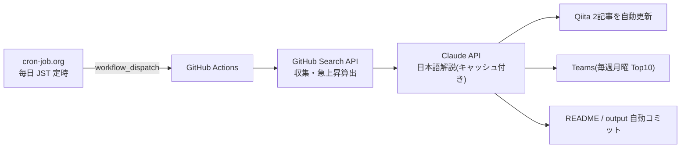

# Claude Code向けMCPツール候補ランキング

GitHub Search APIを使って、Claude Code周辺で活用候補になりそうなMCP関連リポジトリを定期収集するリポジトリです。

> 注意: この一覧は「Claude Codeでの動作」を保証するものではありません。  
> GitHub上のリポジトリ名・説明文・READMEなどに含まれる情報をもとに、MCP関連ツール候補を探すための入口として利用します。

## 仕組み(定常自律運転)

このランキングは cron-job.org → GitHub Actions → Claude API → Qiita / Teams のパイプラインで、毎日無人更新されています。



- 仕組みの詳細と**ライブ稼働ステータス**: [定常自律運転ページ](https://takanobusano.github.io/mcp-github-ranking/)
- 作り方の解説記事: [パイプライン編](https://qiita.com/4q_sano/items/913e93ee5cc2731561fc) / [cron-job.org 完全自動化編](https://qiita.com/4q_sano/items/1bc5e0669a8f0166936c)
<!-- MCP_REPOS_START -->
最終更新: **2026-07-11 08:17:10 JST**

MCP関連リポジトリに加え、Claude Code周辺で活用候補になりそうな関連ツールをGitHub Search APIで毎日自動収集してランキング化しています。

Stars / Forks の差分は、UTC基準の前日データ（2026-07-09）との差分です。
CSVには最大500件を保存し、本文では上位100件を表示しています。

> 注意: この一覧はClaude Codeでの動作を保証するものではありません。  
> MCP関連ツールまたはClaude Code関連ツール候補を探すための入口として利用してください。

# 注目MCP・関連ツール候補ランキング

## 1位 [public-apis/public-apis](https://github.com/public-apis/public-apis)

A collective list of free APIs

⭐ **448,646 Stars**（+272）　🍴 **49,292 Forks**（+31）　/　🟢 **1,524 Open Issues**　/　Python

Topics: `api` / `apis` / `dataset` / `development` / `free` / `list` / `lists` / `open-source`

## 2位 [obra/superpowers](https://github.com/obra/superpowers)

An agentic skills framework & software development methodology that works.

⭐ **251,750 Stars**（+923）　🍴 **22,462 Forks**（+182）　/　🟢 **311 Open Issues**　/　Shell

Topics: `ai` / `brainstorming` / `coding` / `obra` / `sdlc` / `skills` / `subagent-driven-development` / `superpowers`

## 3位 [affaan-m/ECC](https://github.com/affaan-m/ECC)

The agent harness performance optimization system. Skills, instincts, memory, security, and research-first development for Claude Code, Codex, Opencode, Cursor and beyond.

⭐ **228,257 Stars**（+407）　🍴 **35,008 Forks**（+163）　/　🟢 **90 Open Issues**　/　JavaScript

Topics: `ai-agents` / `anthropic` / `claude` / `claude-code` / `developer-tools` / `llm` / `mcp` / `productivity`

## 4位 [NousResearch/hermes-agent](https://github.com/NousResearch/hermes-agent)

The agent that grows with you

⭐ **212,748 Stars**（+567）　🍴 **39,274 Forks**（+180）　/　🟢 **27,529 Open Issues**　/　Python

Topics: `ai` / `ai-agent` / `ai-agents` / `anthropic` / `chatgpt` / `claude` / `claude-code` / `clawdbot`

## 5位 [ultraworkers/claw-code](https://github.com/ultraworkers/claw-code)

An agent-managed museum exhibit, built in Rust with Gajae-Code / LazyCodex — developed and maintained with no human intervention.

⭐ **194,695 Stars**（+21）　🍴 **109,763 Forks**（-8）　/　🟢 **26 Open Issues**　/　Rust

Topics: `topicなし`

## 6位 [multica-ai/andrej-karpathy-skills](https://github.com/multica-ai/andrej-karpathy-skills)

A single CLAUDE.md file to improve Claude Code behavior, derived from Andrej Karpathy's observations on LLM coding pitfalls.

⭐ **190,591 Stars**（+549）　🍴 **19,567 Forks**（+50）　/　🟢 **126 Open Issues**　/　不明

Topics: `topicなし`

## 7位 [ollama/ollama](https://github.com/ollama/ollama)

Get up and running with Kimi-K2.6, GLM-5.1, MiniMax, DeepSeek, gpt-oss, Qwen, Gemma and other models.

⭐ **175,892 Stars**（+66）　🍴 **16,922 Forks**（+16）　/　🟢 **3,407 Open Issues**　/　Go

Topics: `deepseek` / `gemma` / `gemma3` / `glm` / `go` / `golang` / `gpt-oss` / `llama`

## 8位 [mattpocock/skills](https://github.com/mattpocock/skills)

Skills for Real Engineers. Straight from my .claude directory.

⭐ **164,559 Stars**（+1,615）　🍴 **14,161 Forks**（+141）　/　🟢 **138 Open Issues**　/　Shell

Topics: `topicなし`

## 9位 [anthropics/skills](https://github.com/anthropics/skills)

Public repository for Agent Skills

⭐ **160,115 Stars**（+307）　🍴 **18,896 Forks**（+24）　/　🟢 **1,021 Open Issues**　/　Python

Topics: `agent-skills`

## 10位 [langflow-ai/langflow](https://github.com/langflow-ai/langflow)

Langflow is a powerful tool for building and deploying AI-powered agents and workflows.

⭐ **151,575 Stars**（+120）　🍴 **9,643 Forks**（+122）　/　🟢 **973 Open Issues**　/　Python

Topics: `agents` / `chatgpt` / `generative-ai` / `large-language-models` / `multiagent` / `react-flow`

## 11位 [firecrawl/firecrawl](https://github.com/firecrawl/firecrawl)

The API to search, scrape, and interact with the web at scale. 🔥

⭐ **148,902 Stars**（+500）　🍴 **8,513 Forks**（+15）　/　🟢 **397 Open Issues**　/　TypeScript

Topics: `ai` / `ai-agents` / `ai-crawler` / `ai-scraping` / `ai-search` / `crawler` / `data-extraction` / `html-to-markdown`

## 12位 [x1xhlol/system-prompts-and-models-of-ai-tools](https://github.com/x1xhlol/system-prompts-and-models-of-ai-tools)

FULL Augment Code, Claude Code, Cluely, CodeBuddy, Comet, Cursor, Devin AI, Junie, Kiro, Leap.new, Lovable, Manus, NotionAI, Orchids.app, Perplexity, Poke, Qoder, Replit, Same.dev, Trae, Traycer AI, VSCode Agent, Warp.dev, Windsurf, Xcode, Z.ai Code, Dia & v0. (And other Open Sourced) System Prompts, Internal Tools & AI Models

⭐ **141,786 Stars**（+38）　🍴 **34,804 Forks**（+2）　/　🟢 **155 Open Issues**　/　不明

Topics: `ai` / `bolt` / `cluely` / `copilot` / `cursor` / `cursorai` / `devin` / `github-copilot`

## 13位 [anthropics/claude-code](https://github.com/anthropics/claude-code)

Claude Code is an agentic coding tool that lives in your terminal, understands your codebase, and helps you code faster by executing routine tasks, explaining complex code, and handling git workflows - all through natural language commands.

⭐ **137,307 Stars**（+235）　🍴 **22,166 Forks**（+124）　/　🟢 **10,992 Open Issues**　/　Python

Topics: `topicなし`

## 14位 [msitarzewski/agency-agents](https://github.com/msitarzewski/agency-agents)

A complete AI agency at your fingertips - From frontend wizards to Reddit community ninjas, from whimsy injectors to reality checkers. Each agent is a specialized expert with personality, processes, and proven deliverables.

⭐ **130,098 Stars**（+350）　🍴 **21,295 Forks**（+180）　/　🟢 **96 Open Issues**　/　Shell

Topics: `topicなし`

## 15位 [garrytan/gstack](https://github.com/garrytan/gstack)

Use Garry Tan's exact Claude Code setup: 23 opinionated tools that serve as CEO, Designer, Eng Manager, Release Manager, Doc Engineer, and QA

⭐ **121,053 Stars**（+259）　🍴 **18,092 Forks**（+45）　/　🟢 **819 Open Issues**　/　TypeScript

Topics: `topicなし`

## 16位 [github/spec-kit](https://github.com/github/spec-kit)

💫 Toolkit to help you get started with Spec-Driven Development

⭐ **119,313 Stars**（+224）　🍴 **10,570 Forks**（+15）　/　🟢 **365 Open Issues**　/　Python

Topics: `ai` / `copilot` / `development` / `engineering` / `prd` / `spec` / `spec-driven`

## 17位 [farion1231/cc-switch](https://github.com/farion1231/cc-switch)

A cross-platform desktop All-in-One assistant for Claude Code, Codex, OpenCode, OpenClaw, Gemini CLI & Hermes Agent. Only official website: ccswitch.io

⭐ **115,666 Stars**（+408）　🍴 **7,737 Forks**（+34）　/　🟢 **1,855 Open Issues**　/　Rust

Topics: `ai-tools` / `claude-code` / `codex` / `desktop-app` / `hermes` / `hermes-agent` / `mcp` / `minimax`

## 18位 [google-gemini/gemini-cli](https://github.com/google-gemini/gemini-cli)

An open-source AI agent that brings the power of Gemini directly into your terminal.

⭐ **105,898 Stars**（+29）　🍴 **14,235 Forks**（+8）　/　🟢 **1,373 Open Issues**　/　TypeScript

Topics: `ai` / `ai-agents` / `cli` / `gemini` / `gemini-api` / `mcp-client` / `mcp-server`

## 19位 [browser-use/browser-use](https://github.com/browser-use/browser-use)

🌐 Make websites accessible for AI agents. Automate tasks online with ease.

⭐ **104,129 Stars**（+161）　🍴 **11,482 Forks**（+6）　/　🟢 **296 Open Issues**　/　Python

Topics: `ai-agents` / `ai-tools` / `browser-automation` / `browser-use` / `llm` / `playwright` / `python`

## 20位 [nextlevelbuilder/ui-ux-pro-max-skill](https://github.com/nextlevelbuilder/ui-ux-pro-max-skill)

An AI SKILL that provide design intelligence for building professional UI/UX multiple platforms

⭐ **104,012 Stars**（+537）　🍴 **10,988 Forks**（+53）　/　🟢 **127 Open Issues**　/　Python

Topics: `ai-skills` / `antigravity` / `claude` / `claude-code` / `codex` / `command-line` / `copilot` / `cursor-ai`

## 21位 [harry0703/MoneyPrinterTurbo](https://github.com/harry0703/MoneyPrinterTurbo)

利用AI大模型，一键生成高清短视频 Generate short videos with one click using AI LLM.

⭐ **96,736 Stars**（+227）　🍴 **14,269 Forks**（+136）　/　🟢 **58 Open Issues**　/　Python

Topics: `ai` / `automation` / `chatgpt` / `moviepy` / `python` / `shortvideo` / `tiktok`

## 22位 [puppeteer/puppeteer](https://github.com/puppeteer/puppeteer)

JavaScript API for Chrome and Firefox

⭐ **95,401 Stars**（+72）　🍴 **9,635 Forks**（+110）　/　🟢 **268 Open Issues**　/　TypeScript

Topics: `automation` / `chrome` / `chromium` / `developer-tools` / `firefox` / `headless-chrome` / `node-module` / `testing`

## 23位 [microsoft/playwright](https://github.com/microsoft/playwright)

Playwright is a framework for Web Testing and Automation. It allows testing Chromium, Firefox and WebKit with a single API.

⭐ **92,603 Stars**（+72）　🍴 **6,069 Forks**（+4）　/　🟢 **166 Open Issues**　/　TypeScript

Topics: `automation` / `chrome` / `chromium` / `e2e-testing` / `electron` / `end-to-end-testing` / `firefox` / `javascript`

## 24位 [TauricResearch/TradingAgents](https://github.com/TauricResearch/TradingAgents)

TradingAgents: Multi-Agents LLM Financial Trading Framework

⭐ **92,220 Stars**（+171）　🍴 **17,818 Forks**（+35）　/　🟢 **284 Open Issues**　/　Python

Topics: `agent` / `finance` / `llm` / `multiagent` / `trading`

## 25位 [ChatGPTNextWeb/NextChat](https://github.com/ChatGPTNextWeb/NextChat)

✨ Light and Fast AI Assistant. Support: Web \| iOS \| MacOS \| Android \|  Linux \| Windows

⭐ **88,437 Stars**（+10）　🍴 **59,471 Forks**（-1）　/　🟢 **843 Open Issues**　/　TypeScript

Topics: `calclaude` / `chatgpt` / `claude` / `cross-platform` / `desktop` / `fe` / `gemini` / `gemini-pro`

## 26位 [modelcontextprotocol/servers](https://github.com/modelcontextprotocol/servers)

Model Context Protocol Servers

⭐ **88,310 Stars**（+34）　🍴 **11,205 Forks**（+15）　/　🟢 **661 Open Issues**　/　TypeScript

Topics: `topicなし`

## 27位 [JuliusBrussee/caveman](https://github.com/JuliusBrussee/caveman)

🪨 why use many token when few token do trick — Claude Code skill that cuts 65% of tokens by talking like caveman

⭐ **87,756 Stars**（+473）　🍴 **5,035 Forks**（+127）　/　🟢 **390 Open Issues**　/　JavaScript

Topics: `ai` / `anthropic` / `caveman` / `claude` / `claude-code` / `llm` / `meme` / `prompt-engineering`

## 28位 [thedotmack/claude-mem](https://github.com/thedotmack/claude-mem)

Persistent Context Across Sessions for Every Agent –  Captures everything your agent does during sessions, compresses it with AI, and injects relevant context back into future sessions. Works with Claude Code, OpenClaw, Codex, Gemini, Hermes, Copilot, OpenCode + More

⭐ **86,765 Stars**（+155）　🍴 **7,494 Forks**（+9）　/　🟢 **248 Open Issues**　/　JavaScript

Topics: `ai` / `ai-agents` / `ai-memory` / `anthropic` / `artificial-intelligence` / `chromadb` / `claude` / `claude-agent-sdk`

## 29位 [laravel/laravel](https://github.com/laravel/laravel)

Laravel is a web application framework with expressive, elegant syntax. We’ve already laid the foundation for your next big idea — freeing you to create without sweating the small things.

⭐ **84,706 Stars**（+85）　🍴 **24,883 Forks**（+109）　/　🟢 **31 Open Issues**　/　Blade

Topics: `framework` / `laravel` / `php`

## 30位 [Graphify-Labs/graphify](https://github.com/Graphify-Labs/graphify)

AI coding assistant skill (Claude Code, Codex, OpenCode, Cursor, Gemini CLI, and more). Turn any folder of code, SQL schemas, R scripts, shell scripts, docs, papers, images, or videos into a queryable knowledge graph. App code + database schema + infrastructure in one graph.

⭐ **81,929 Stars**（+676）　🍴 **8,058 Forks**（+60）　/　🟢 **454 Open Issues**　/　Python

Topics: `antigravity` / `claude-code` / `codex` / `gemini` / `graphrag` / `knowledge-graph` / `leiden` / `openclaw`

## 31位 [OpenHands/OpenHands](https://github.com/OpenHands/OpenHands)

🙌 OpenHands: AI-Driven Development

⭐ **80,370 Stars**（+128）　🍴 **10,253 Forks**（+18）　/　🟢 **361 Open Issues**　/　Python

Topics: `agent` / `artificial-intelligence` / `chatgpt` / `claude-ai` / `cli` / `developer-tools` / `gpt` / `llm`

## 32位 [DietrichGebert/ponytail](https://github.com/DietrichGebert/ponytail)

Makes your AI agent think like the laziest senior dev in the room. The best code is the code you never wrote.

⭐ **80,136 Stars**（+962）　🍴 **4,310 Forks**（+59）　/　🟢 **61 Open Issues**　/　JavaScript

Topics: `agent-skills` / `ai-agents` / `claude` / `claude-code` / `claude-code-plugin` / `cursor-rules` / `developer-tools` / `llm`

## 33位 [nexu-io/open-design](https://github.com/nexu-io/open-design)

🎨 The open-source Claude Design alternative. 🖥️ Local-first desktop app. 🖼️ Your coding agent becomes the design engine: prototypes, landing pages, dashboards,...

⭐ **77,124 Stars**（+316）　🍴 **8,808 Forks**（+50）　/　🟢 **520 Open Issues**　/　TypeScript

Topics: `agent-skills` / `ai-agents` / `ai-design` / `byok` / `claude-code-for-design` / `claude-design` / `codex-design` / `coding-agents`

## 34位 [addyosmani/agent-skills](https://github.com/addyosmani/agent-skills)

Production-grade engineering skills for AI coding agents.

⭐ **76,791 Stars**（+966）　🍴 **8,246 Forks**（+92）　/　🟢 **130 Open Issues**　/　JavaScript

Topics: `agent-skills` / `antigravity` / `claude-code` / `codex` / `cursor` / `skills`

## 35位 [bytedance/deer-flow](https://github.com/bytedance/deer-flow)

An open-source long-horizon SuperAgent harness that researches, codes, and creates. With the help of sandboxes, memories, tools, skill, subagents and message gateway, it handles different levels of tasks that could take minutes to hours.

⭐ **76,735 Stars**（+98）　🍴 **10,416 Forks**（+13）　/　🟢 **948 Open Issues**　/　Python

Topics: `agent` / `agentic` / `agentic-framework` / `agentic-workflow` / `ai` / `ai-agents` / `deep-research` / `harness`

## 36位 [opendatalab/MinerU](https://github.com/opendatalab/MinerU)

Transforms complex documents like PDFs and Office docs into LLM-ready markdown/JSON for your Agentic workflows.

⭐ **74,196 Stars**（+124）　🍴 **6,233 Forks**（+6）　/　🟢 **31 Open Issues**　/　Python

Topics: `ai4science` / `document-analysis` / `docx` / `extract-data` / `layout-analysis` / `ocr` / `parser` / `pdf`

## 37位 [paperclipai/paperclip](https://github.com/paperclipai/paperclip)

The open-source app everyone uses to manage agents at work

⭐ **73,328 Stars**（+139）　🍴 **13,674 Forks**（+30）　/　🟢 **4,970 Open Issues**　/　TypeScript

Topics: `topicなし`

## 38位 [abi/screenshot-to-code](https://github.com/abi/screenshot-to-code)

Drop in a screenshot and convert it to clean code (HTML/Tailwind/React/Vue)

⭐ **73,232 Stars**（+12）　🍴 **9,015 Forks**（±0）　/　🟢 **124 Open Issues**　/　Python

Topics: `topicなし`

## 39位 [thedaviddias/Front-End-Checklist](https://github.com/thedaviddias/Front-End-Checklist)

🗂 The essential checklist for modern web development, for humans and AI agents

⭐ **73,179 Stars**（+16）　🍴 **6,650 Forks**（±0）　/　🟢 **3 Open Issues**　/　MDX

Topics: `ai-agent` / `ai-agents` / `checklist` / `css` / `front-end-developer-tool` / `front-end-development` / `frontend` / `guidelines`

## 40位 [Eugeny/tabby](https://github.com/Eugeny/tabby)

A terminal for a more modern age

⭐ **73,164 Stars**（+29）　🍴 **4,144 Forks**（+2）　/　🟢 **2,759 Open Issues**　/　TypeScript

Topics: `serial` / `ssh-client` / `telnet-client` / `terminal` / `terminal-emulators`

## 41位 [Egonex-AI/Understand-Anything](https://github.com/Egonex-AI/Understand-Anything)

Graphs that teach > graphs that impress. Turn any code into an interactive knowledge graph you can explore, search, and ask questions about. Works with Claude Code, Codex, Cursor, Copilot, Gemini CLI, and more.

⭐ **72,591 Stars**（+251）　🍴 **6,050 Forks**（+16）　/　🟢 **257 Open Issues**　/　TypeScript

Topics: `antigravity-skills` / `business-knowledge` / `claude-code` / `claude-skills` / `codebase-analysis` / `codex` / `codex-skills` / `developer-tools-ai-agent`

## 42位 [daytonaio/daytona](https://github.com/daytonaio/daytona)

Daytona is a Secure and Elastic Infrastructure for Running AI-Generated Code

⭐ **72,233 Stars**（-10）　🍴 **5,662 Forks**（-4）　/　🟢 **444 Open Issues**　/　不明

Topics: `agentic-workflow` / `ai` / `ai-agents` / `ai-runtime` / `ai-sandboxes` / `code-execution` / `code-interpreter` / `developer-tools`

## 43位 [unclecode/crawl4ai](https://github.com/unclecode/crawl4ai)

🚀🤖 Crawl4AI: Open-source LLM Friendly Web Crawler & Scraper. Don't be shy, join here:

⭐ **72,233 Stars**（+439）　🍴 **7,401 Forks**（+25）　/　🟢 **106 Open Issues**　/　Python

Topics: `topicなし`

## 44位 [shareAI-lab/learn-claude-code](https://github.com/shareAI-lab/learn-claude-code)

Bash is all you need -  A nano claude code–like 「agent harness」, built from 0 to 1

⭐ **70,599 Stars**（+121）　🍴 **11,499 Forks**（+17）　/　🟢 **60 Open Issues**　/　Python

Topics: `agent` / `agent-development` / `ai-agent` / `claude` / `claude-code` / `educational` / `llm` / `python`

## 45位 [OpenBB-finance/OpenBB](https://github.com/OpenBB-finance/OpenBB)

Open Data Platform for analysts, quants and AI agents.

⭐ **70,421 Stars**（+33）　🍴 **7,142 Forks**（+9）　/　🟢 **70 Open Issues**　/　Python

Topics: `ai` / `crypto` / `derivatives` / `economics` / `equity` / `finance` / `fixed-income` / `machine-learning`

## 46位 [rtk-ai/rtk](https://github.com/rtk-ai/rtk)

CLI proxy that reduces LLM token consumption by 60-90% on common dev commands. Single Rust binary, zero dependencies

⭐ **70,111 Stars**（+270）　🍴 **4,358 Forks**（+18）　/　🟢 **1,557 Open Issues**　/　Rust

Topics: `agentic-coding` / `ai-coding` / `anthropic` / `claude-code` / `cli` / `command-line-tool` / `cost-reduction` / `developer-tools`

## 47位 [D4Vinci/Scrapling](https://github.com/D4Vinci/Scrapling)

🕷️ An adaptive Web Scraping framework that handles everything from a single request to a full-scale crawl!

⭐ **69,037 Stars**（+139）　🍴 **6,832 Forks**（+15）　/　🟢 **3 Open Issues**　/　Python

Topics: `ai` / `ai-scraping` / `automation` / `crawler` / `crawling` / `crawling-python` / `data` / `data-extraction`

## 48位 [unslothai/unsloth](https://github.com/unslothai/unsloth)

Unsloth Studio is a web UI for training and running open models like Gemma 4, Qwen3.6, DeepSeek, gpt-oss locally.

⭐ **68,002 Stars**（+32）　🍴 **6,121 Forks**（+2）　/　🟢 **1,046 Open Issues**　/　Python

Topics: `agent` / `deepseek` / `fine-tuning` / `gemma` / `gemma3` / `gpt-oss` / `llama` / `llama3`

## 49位 [xtekky/gpt4free](https://github.com/xtekky/gpt4free)

The official gpt4free repository \| various collection of powerful language models \| opus 4.6 gpt 5.3 kimi 2.5 deepseek v3.2 gemini 3

⭐ **66,461 Stars**（+4）　🍴 **13,554 Forks**（-1）　/　🟢 **3 Open Issues**　/　Python

Topics: `chatbot` / `chatbots` / `chatgpt` / `chatgpt-4` / `chatgpt-api` / `chatgpt-free` / `chatgpt4` / `deepseek`

## 50位 [bradtraversy/design-resources-for-developers](https://github.com/bradtraversy/design-resources-for-developers)

Curated list of design and UI resources from stock photos, web templates, CSS frameworks, UI libraries, tools and much more

⭐ **66,367 Stars**（+15）　🍴 **12,106 Forks**（+2）　/　🟢 **49 Open Issues**　/　不明

Topics: `topicなし`

## 51位 [code-yeongyu/oh-my-openagent](https://github.com/code-yeongyu/oh-my-openagent)

omo/lazycodex: The coding agent for tokenmaxxers;the one and only agent harness for complex codebases. For your Codex, for your OpenCode

⭐ **65,494 Stars**（+80）　🍴 **5,342 Forks**（+10）　/　🟢 **876 Open Issues**　/　TypeScript

Topics: `ai` / `ai-agents` / `anthropic` / `chatgpt` / `claude` / `claude-skills` / `codex` / `cursor`

## 52位 [cline/cline](https://github.com/cline/cline)

Autonomous coding agent as an SDK, IDE extension, or CLI assistant.

⭐ **64,531 Stars**（+33）　🍴 **6,888 Forks**（+8）　/　🟢 **1,248 Open Issues**　/　TypeScript

Topics: `topicなし`

## 53位 [openinterpreter/openinterpreter](https://github.com/openinterpreter/openinterpreter)

A lightweight coding agent for open models like Deepseek, Kimi, and Qwen

⭐ **64,330 Stars**（+16）　🍴 **5,605 Forks**（+4）　/　🟢 **274 Open Issues**　/　Rust

Topics: `coding-agent` / `deepseek` / `interpreter` / `kimi` / `qwen` / `rust` / `tui`

## 54位 [ruvnet/ruflo](https://github.com/ruvnet/ruflo)

🌊 The leading agent meta-harness. Deploy intelligent multi-player swarms, coordinate autonomous workflows, and build conversational AI systems. Features adaptiv...

⭐ **63,891 Stars**（+175）　🍴 **7,549 Forks**（+28）　/　🟢 **752 Open Issues**　/　TypeScript

Topics: `agentic-ai` / `agentic-framework` / `agentic-workflow` / `agents` / `ai-agents` / `ai-assistant` / `ai-coding` / `ai-skills`

## 55位 [warpdotdev/warp](https://github.com/warpdotdev/warp)

Warp is an agentic development environment, born out of the terminal.

⭐ **63,037 Stars**（+35）　🍴 **5,219 Forks**（+9）　/　🟢 **4,548 Open Issues**　/　Rust

Topics: `bash` / `linux` / `macos` / `rust` / `shell` / `terminal` / `wasm` / `zsh`

## 56位 [docling-project/docling](https://github.com/docling-project/docling)

Get your documents ready for gen AI

⭐ **62,982 Stars**（+52）　🍴 **4,438 Forks**（+6）　/　🟢 **936 Open Issues**　/　Python

Topics: `ai` / `convert` / `document-parser` / `document-parsing` / `documents` / `docx` / `html` / `markdown`

## 57位 [shanraisshan/claude-code-best-practice](https://github.com/shanraisshan/claude-code-best-practice)

from vibe coding to agentic engineering - practice makes claude perfect

⭐ **62,409 Stars**（+55）　🍴 **6,243 Forks**（+4）　/　🟢 **14 Open Issues**　/　HTML

Topics: `agentic-ai` / `agentic-coding` / `agentic-engineering` / `agentic-workflow` / `ai` / `ai-agents` / `anthropic` / `best-practices`

## 58位 [OpenCut-app/OpenCut](https://github.com/OpenCut-app/OpenCut)

The open-source CapCut alternative

⭐ **62,076 Stars**（+99）　🍴 **6,685 Forks**（+9）　/　🟢 **332 Open Issues**　/　TypeScript

Topics: `editor` / `oss` / `videoeditor`

## 59位 [Leonxlnx/taste-skill](https://github.com/Leonxlnx/taste-skill)

Taste-Skill - gives your AI good taste. stops the AI from generating boring, generic slop

⭐ **61,770 Stars**（+539）　🍴 **4,346 Forks**（+155）　/　🟢 **41 Open Issues**　/　JavaScript

Topics: `agent` / `ai` / `claude` / `claude-code` / `codex` / `coding` / `design` / `frontend`

## 60位 [koala73/worldmonitor](https://github.com/koala73/worldmonitor)

Real-time global intelligence dashboard. AI-powered news aggregation, geopolitical monitoring, and infrastructure tracking in a unified situational awareness interface

⭐ **61,696 Stars**（+55）　🍴 **9,613 Forks**（+10）　/　🟢 **195 Open Issues**　/　TypeScript

Topics: `agent` / `ai` / `dashboard` / `geopolitics` / `mcp` / `mcp-server` / `monitoring` / `news`

## 61位 [mem0ai/mem0](https://github.com/mem0ai/mem0)

Universal memory layer for AI Agents

⭐ **60,569 Stars**（+74）　🍴 **7,040 Forks**（+10）　/　🟢 **526 Open Issues**　/　Python

Topics: `agents` / `ai` / `ai-agents` / `application` / `chatbots` / `chatgpt` / `genai` / `llm`

## 62位 [sansan0/TrendRadar](https://github.com/sansan0/TrendRadar)

⭐AI-driven public opinion & trend monitor with multi-platform aggregation, RSS, and smart alerts.🎯 告别信息过载，你的 AI 舆情监控助手与热点筛选工具！聚合多平台热点 +  RSS 订阅，支持关键词精准筛选。AI 智能筛...

⭐ **60,445 Stars**（+37）　🍴 **24,782 Forks**（+10）　/　🟢 **50 Open Issues**　/　Python

Topics: `ai` / `bark` / `data-analysis` / `docker` / `hot-news` / `llm` / `mail` / `mcp`

## 63位 [Fission-AI/OpenSpec](https://github.com/Fission-AI/OpenSpec)

Spec-driven development (SDD) for AI coding assistants.

⭐ **59,916 Stars**（+327）　🍴 **4,161 Forks**（+11）　/　🟢 **455 Open Issues**　/　TypeScript

Topics: `ai` / `context-engineering` / `engineering` / `planning` / `prd` / `sdd` / `sdlc` / `spec`

## 64位 [microsoft/autogen](https://github.com/microsoft/autogen)

A programming framework for agentic AI

⭐ **59,644 Stars**（+36）　🍴 **8,978 Forks**（+2）　/　🟢 **942 Open Issues**　/　Python

Topics: `agentic` / `agentic-agi` / `agents` / `ai` / `autogen` / `autogen-ecosystem` / `chatgpt` / `framework`

## 65位 [colbymchenry/codegraph](https://github.com/colbymchenry/codegraph)

Pre-indexed code knowledge graph, auto syncs on code changes, for Claude Code, Codex, Gemini, Cursor, OpenCode, AntiGravity, Kiro, and Hermes Agent — fewer tokens, fewer tool calls, 100% local

⭐ **59,082 Stars**（+213）　🍴 **3,667 Forks**（+18）　/　🟢 **301 Open Issues**　/　TypeScript

Topics: `topicなし`

## 66位 [upstash/context7](https://github.com/upstash/context7)

Context7 Platform -- Up-to-date code documentation for LLMs and AI code editors

⭐ **58,887 Stars**（+53）　🍴 **2,760 Forks**（+1）　/　🟢 **25 Open Issues**　/　TypeScript

Topics: `llm` / `mcp` / `mcp-server` / `vibe-coding`

## 67位 [meilisearch/meilisearch](https://github.com/meilisearch/meilisearch)

A lightning-fast search engine API bringing AI-powered hybrid search to your sites and applications.

⭐ **58,488 Stars**（+11）　🍴 **2,607 Forks**（+1）　/　🟢 **310 Open Issues**　/　Rust

Topics: `ai` / `api` / `app-search` / `database` / `enterprise-search` / `faceting` / `full-text-search` / `fuzzy-search`

## 68位 [headroomlabs-ai/headroom](https://github.com/headroomlabs-ai/headroom)

Compress tool outputs, logs, files, and RAG chunks before they reach the LLM. 60-95% fewer tokens, same answers. Library, proxy, MCP server.

⭐ **58,394 Stars**（+230）　🍴 **4,314 Forks**（+18）　/　🟢 **537 Open Issues**　/　Python

Topics: `agent` / `ai` / `anthropic` / `claude-code` / `compression` / `context-engineering` / `context-window` / `cursor`

## 69位 [coollabsio/coolify](https://github.com/coollabsio/coolify)

An open-source, self-hostable PaaS alternative to Vercel, Heroku & Netlify that lets you easily deploy static sites, databases, full-stack applications and 280+ one-click services on your own servers.

⭐ **58,258 Stars**（+58）　🍴 **4,988 Forks**（+8）　/　🟢 **811 Open Issues**　/　PHP

Topics: `coolify` / `databases` / `deployment` / `docker` / `docker-compose` / `inertiajs` / `laravel` / `mariadb`

## 70位 [zylon-ai/private-gpt](https://github.com/zylon-ai/private-gpt)

Complete API layer for private AI applications on local models: RAG, skills, tools, MCP, text-to-sql, and more. Works with any OpenAI-compatible inference server.

⭐ **57,330 Stars**（+3）　🍴 **7,597 Forks**（-2）　/　🟢 **5 Open Issues**　/　Python

Topics: `ai` / `ai-tools` / `on-premise`

## 71位 [MemPalace/mempalace](https://github.com/MemPalace/mempalace)

The best-benchmarked open-source AI memory system. And it's free.

⭐ **57,207 Stars**（+34）　🍴 **7,386 Forks**（+5）　/　🟢 **613 Open Issues**　/　Python

Topics: `ai` / `chromadb` / `llm` / `mcp` / `memory` / `python`

## 72位 [NanmiCoder/MediaCrawler](https://github.com/NanmiCoder/MediaCrawler)

小红书笔记 \| 评论爬虫、抖音视频 \| 评论爬虫、快手视频 \| 评论爬虫、B 站视频 ｜ 评论爬虫、微博帖子 ｜ 评论爬虫、百度贴吧帖子 ｜ 百度贴吧评论回复爬虫  \| 知乎问答文章｜评论爬虫

⭐ **56,009 Stars**（+78）　🍴 **11,294 Forks**（+8）　/　🟢 **178 Open Issues**　/　Python

Topics: `topicなし`

## 73位 [penpot/penpot](https://github.com/penpot/penpot)

Penpot: The open-source design platform for Product teams that need scalable collaboration.

⭐ **55,410 Stars**（+56）　🍴 **3,633 Forks**（+7）　/　🟢 **687 Open Issues**　/　Clojure

Topics: `clojure` / `clojurescript` / `design` / `prototyping` / `ui` / `ux-design` / `ux-experience`

## 74位 [crewAIInc/crewAI](https://github.com/crewAIInc/crewAI)

Framework for orchestrating role-playing, autonomous AI agents. By fostering collaborative intelligence, CrewAI empowers agents to work together seamlessly, tackling complex tasks.

⭐ **55,312 Stars**（+61）　🍴 **7,789 Forks**（+16）　/　🟢 **637 Open Issues**　/　Python

Topics: `agents` / `ai` / `ai-agents` / `aiagentframework` / `llms`

## 75位 [Panniantong/Agent-Reach](https://github.com/Panniantong/Agent-Reach)

Give your AI agent eyes to see the entire internet. Read & search Twitter, Reddit, YouTube, GitHub, Bilibili, XiaoHongShu — one CLI, zero API fees.

⭐ **54,448 Stars**（+596）　🍴 **4,489 Forks**（+141）　/　🟢 **141 Open Issues**　/　Python

Topics: `agent-infrastructure` / `ai-agent` / `ai-search` / `automation` / `bilibili` / `claude-code` / `cli` / `cursor`

## 76位 [BerriAI/litellm](https://github.com/BerriAI/litellm)

Python SDK, Proxy Server (AI Gateway) to call 100+ LLM APIs in OpenAI (or native) format, with cost tracking, guardrails, loadbalancing and logging. [Bedrock, Azure, OpenAI, VertexAI, Cohere, Anthropic, Sagemaker, HuggingFace, VLLM, NVIDIA NIM]

⭐ **53,222 Stars**（+104）　🍴 **9,650 Forks**（+24）　/　🟢 **3,889 Open Issues**　/　Python

Topics: `ai-gateway` / `anthropic` / `azure-openai` / `bedrock` / `gateway` / `langchain` / `litellm` / `llm`

## 77位 [mvanhorn/last30days-skill](https://github.com/mvanhorn/last30days-skill)

AI agent skill that researches any topic across Reddit, X, YouTube, HN, Polymarket, and the web - then synthesizes a grounded summary

⭐ **51,465 Stars**（+265）　🍴 **4,441 Forks**（+131）　/　🟢 **88 Open Issues**　/　Python

Topics: `ai-prompts` / `ai-skill` / `bluesky` / `claude` / `claude-code` / `clawhub` / `deep-research` / `hackernews`

## 78位 [charlax/professional-programming](https://github.com/charlax/professional-programming)

A collection of learning resources for curious software engineers

⭐ **51,250 Stars**（+1）　🍴 **4,001 Forks**（±0）　/　🟢 **4 Open Issues**　/　Python

Topics: `architecture` / `computer-science` / `concepts` / `documentation` / `engineer` / `learning` / `lessons-learned` / `professional`

## 79位 [aaif-goose/goose](https://github.com/aaif-goose/goose)

an open source, extensible AI agent that goes beyond code suggestions - install, execute, edit, and test with any LLM

⭐ **51,043 Stars**（+113）　🍴 **5,652 Forks**（+124）　/　🟢 **296 Open Issues**　/　Rust

Topics: `acp` / `ai` / `ai-agents` / `mcp`

## 80位 [bmad-code-org/BMAD-METHOD](https://github.com/bmad-code-org/BMAD-METHOD)

Breakthrough Method for Agile Ai Driven Development

⭐ **50,333 Stars**（+51）　🍴 **5,790 Forks**（+6）　/　🟢 **84 Open Issues**　/　JavaScript

Topics: `topicなし`

## 81位 [1c7/chinese-independent-developer](https://github.com/1c7/chinese-independent-developer)

👩🏿‍💻👨🏾‍💻👩🏼‍💻👨🏽‍💻👩🏻‍💻中国独立开发者项目列表 -- 分享大家都在做什么

⭐ **49,132 Stars**（+10）　🍴 **4,232 Forks**（+2）　/　🟢 **2 Open Issues**　/　不明

Topics: `china` / `indie` / `indie-developer`

## 82位 [mudler/LocalAI](https://github.com/mudler/LocalAI)

LocalAI is the open-source AI engine. Run any model - LLMs, vision, voice, image, video - on any hardware. No GPU required.

⭐ **47,467 Stars**（+20）　🍴 **4,220 Forks**（+3）　/　🟢 **214 Open Issues**　/　Go

Topics: `agents` / `ai` / `api` / `audio-generation` / `decentralized` / `distributed` / `image-generation` / `libp2p`

## 83位 [oobabooga/textgen](https://github.com/oobabooga/textgen)

Open-source desktop app for local LLMs. Text, vision, tool-calling, OpenAI/Anthropic-compatible API. 100% private.

⭐ **47,438 Stars**（+2）　🍴 **5,988 Forks**（+1）　/　🟢 **827 Open Issues**　/　Python

Topics: `topicなし`

## 84位 [prisma/prisma](https://github.com/prisma/prisma)

Next-generation ORM for Node.js & TypeScript \| PostgreSQL, MySQL, MariaDB, SQL Server, SQLite, MongoDB and CockroachDB

⭐ **47,089 Stars**（+206）　🍴 **2,457 Forks**（+128）　/　🟢 **2,657 Open Issues**　/　TypeScript

Topics: `cockroachdb` / `database` / `javascript` / `mariadb` / `mongo` / `mongodb` / `mongodb-orm` / `mssql`

## 85位 [GitHubDaily/GitHubDaily](https://github.com/GitHubDaily/GitHubDaily)

坚持分享 GitHub 上高质量、有趣实用的开源技术教程、开发者工具、编程网站、技术资讯。A list cool, interesting projects of GitHub.

⭐ **47,031 Stars**（+15）　🍴 **4,651 Forks**（+1）　/　🟢 **694 Open Issues**　/　不明

Topics: `ai` / `algorithms-and-data-structures` / `backend` / `developer-tools` / `development` / `frontend` / `github` / `java`

## 86位 [jeecgboot/JeecgBoot](https://github.com/jeecgboot/JeecgBoot)

【低代码迈入 v2.0】AI低代码平台，AI Skills 一句话生成整个系统；一键生成前后端代码甚至整个模块。 AI Skills 一句话画流程、设计表单、生成报表、大屏。内置 AI应用平台涵盖：AI聊天、知识库、流程编排、MCP插件等，兼容主流大模型。引领AI低代码「Skills 生成 → 在线配置 → 代码生成...

⭐ **47,006 Stars**（+21）　🍴 **16,085 Forks**（+6）　/　🟢 **49 Open Issues**　/　Java

Topics: `activiti` / `agent` / `ai` / `antd` / `claude-code` / `cli` / `codegenerator` / `codex`

## 87位 [serverless/serverless](https://github.com/serverless/serverless)

⚡ Serverless Framework – Effortlessly build apps that auto-scale, incur zero costs when idle, and require minimal maintenance using AWS Lambda and other managed...

⭐ **46,920 Stars**（+1）　🍴 **5,728 Forks**（±0）　/　🟢 **1,219 Open Issues**　/　JavaScript

Topics: `aws` / `aws-dynamodb` / `aws-lambda` / `azure-functions` / `google-cloud-functions` / `microservice` / `serverless` / `serverless-architectures`

## 88位 [ChromeDevTools/chrome-devtools-mcp](https://github.com/ChromeDevTools/chrome-devtools-mcp)

Chrome DevTools for coding agents

⭐ **46,628 Stars**（+129）　🍴 **3,182 Forks**（+116）　/　🟢 **90 Open Issues**　/　TypeScript

Topics: `browser` / `chrome` / `chrome-devtools` / `debugging` / `devtools` / `mcp` / `mcp-server` / `puppeteer`

## 89位 [exo-explore/exo](https://github.com/exo-explore/exo)

Run frontier AI locally.

⭐ **46,160 Stars**（+34）　🍴 **3,337 Forks**（+3）　/　🟢 **304 Open Issues**　/　Python

Topics: `topicなし`

## 90位 [apache/airflow](https://github.com/apache/airflow)

Apache Airflow - A platform to programmatically author, schedule, and monitor workflows

⭐ **46,091 Stars**（+11）　🍴 **17,377 Forks**（+6）　/　🟢 **1,686 Open Issues**　/　Python

Topics: `airflow` / `apache` / `apache-airflow` / `automation` / `dag` / `data-engineering` / `data-integration` / `data-orchestrator`

## 91位 [zhayujie/CowAgent](https://github.com/zhayujie/CowAgent)

Open-source super AI assistant & Agent Harness. Plans tasks, runs tools and skills, self-evolves with memory and knowledge. Multi-model, multi-channel. Lightweight, extensible, one-line install. (formerly chatgpt-on-wechat)

⭐ **45,913 Stars**（+15）　🍴 **10,260 Forks**（-1）　/　🟢 **25 Open Issues**　/　Python

Topics: `ai` / `ai-agent` / `ai-agents` / `chatgpt-on-wechat` / `claude` / `claude-code` / `codex` / `cowagent`

## 92位 [KeygraphHQ/shannon](https://github.com/KeygraphHQ/shannon)

Shannon is an autonomous, white-box AI pentester for web applications and APIs. It analyzes your source code, identifies attack vectors, and executes real exploits to prove vulnerabilities before they reach production.

⭐ **45,583 Stars**（+26）　🍴 **5,294 Forks**（+1）　/　🟢 **23 Open Issues**　/　TypeScript

Topics: `penetration-testing` / `pentesting` / `security-audit` / `security-automation` / `security-tools`

## 93位 [pbakaus/impeccable](https://github.com/pbakaus/impeccable)

The design language that makes your AI harness better at design.

⭐ **45,412 Stars**（+345）　🍴 **2,727 Forks**（+119）　/　🟢 **29 Open Issues**　/　JavaScript

Topics: `topicなし`

## 94位 [HKUDS/CLI-Anything](https://github.com/HKUDS/CLI-Anything)

"CLI-Anything: Making ALL Software Agent-Native" -- CLI-Hub:

⭐ **45,101 Stars**（+43）　🍴 **4,217 Forks**（+8）　/　🟢 **69 Open Issues**　/　Python

Topics: `topicなし`

## 95位 [abhigyanpatwari/GitNexus](https://github.com/abhigyanpatwari/GitNexus)

GitNexus: The Zero-Server Code Intelligence Engine -       GitNexus is a client-side knowledge graph creator that runs entirely in your browser. Drop in a git repository (Github, Gitlab, Azure, Local) or ZIP file, and get an interactive knowledge graph with a built in Graph RAG Agent. Perfect for code exploration

⭐ **43,962 Stars**（+45）　🍴 **4,889 Forks**（+7）　/　🟢 **255 Open Issues**　/　TypeScript

Topics: `topicなし`

## 96位 [janhq/jan](https://github.com/janhq/jan)

Jan is an open source alternative to ChatGPT that runs 100% offline on your computer.

⭐ **43,488 Stars**（+17）　🍴 **2,896 Forks**（+1）　/　🟢 **385 Open Issues**　/　TypeScript

Topics: `chatgpt` / `gpt` / `llamacpp` / `llm` / `localai` / `open-source` / `self-hosted` / `tauri`

## 97位 [ccxt/ccxt](https://github.com/ccxt/ccxt)

A cryptocurrency trading API with more than 100 exchanges in JavaScript / TypeScript / Python / C# / PHP / Go / Java

⭐ **43,278 Stars**（+5）　🍴 **8,737 Forks**（+3）　/　🟢 **1,301 Open Issues**　/　Python

Topics: `altcoin` / `api` / `arbitrage` / `bitcoin` / `bot` / `btc` / `crypto` / `cryptocurrencies`

## 98位 [gradio-app/gradio](https://github.com/gradio-app/gradio)

Build and share delightful machine learning apps, all in Python. 🌟 Star to support our work!

⭐ **43,115 Stars**（+11）　🍴 **3,546 Forks**（±0）　/　🟢 **229 Open Issues**　/　Python

Topics: `data-analysis` / `data-science` / `data-visualization` / `deep-learning` / `deploy` / `gradio` / `gradio-interface` / `interface`

## 99位 [danielmiessler/Fabric](https://github.com/danielmiessler/Fabric)

Fabric is an open-source framework for augmenting humans using AI. It provides a modular system for solving specific problems using a crowdsourced set of AI prompts that can be used anywhere.

⭐ **42,928 Stars**（+18）　🍴 **4,201 Forks**（+1）　/　🟢 **73 Open Issues**　/　Go

Topics: `ai` / `augmentation` / `flourishing` / `life` / `work`

## 100位 [QuantumNous/new-api](https://github.com/QuantumNous/new-api)

A unified AI model hub for aggregation & distribution. It supports cross-converting various LLMs into OpenAI-compatible, Claude-compatible, or Gemini-compatible...

⭐ **41,801 Stars**（+120）　🍴 **9,685 Forks**（+28）　/　🟢 **988 Open Issues**　/　Go

Topics: `ai-gateway` / `claude` / `deepseek` / `gemini` / `newapi` / `openai` / `rerank`

# 最近プッシュされたMCP・関連ツール候補

スター数ランキングとは別に、最近コードがプッシュされたリポジトリを表示します。古いスター数だけではなく、現在も開発が動いていそうな候補を探すための一覧です。

## プッシュ順 1位 [manaflow-ai/cmux](https://github.com/manaflow-ai/cmux)

Open source Ghostty-based macOS terminal with vertical tabs and notifications for AI coding agents. Built for multitasking, organization, and programmability.

⭐ **24,164 Stars**（+109）　🍴 **1,939 Forks**（+17）　/　Swift　/　最終プッシュ: 2026-07-10

Topics: `amp` / `claude-code` / `cli` / `codex` / `coding-agents` / `gemini` / `ghostty` / `macos`

## プッシュ順 2位 [langchain-ai/deepagents](https://github.com/langchain-ai/deepagents)

The batteries-included agent harness.

⭐ **26,062 Stars**（+52）　🍴 **3,652 Forks**（+8）　/　Python　/　最終プッシュ: 2026-07-10

Topics: `ai` / `deepagents` / `langchain` / `langgraph` / `python` / `typescript`

## プッシュ順 3位 [windmill-labs/windmill](https://github.com/windmill-labs/windmill)

Open-source developer platform to power your entire infra and turn scripts into webhooks, workflows and UIs. Fastest workflow engine (13x vs Airflow). Open-source alternative to Retool and Temporal.

⭐ **17,127 Stars**（+6）　🍴 **1,022 Forks**（±0）　/　Rust　/　最終プッシュ: 2026-07-10

Topics: `low-code` / `open-source` / `platform` / `postgresql` / `python` / `self-hostable` / `typescript`

## プッシュ順 4位 [ccusage/ccusage](https://github.com/ccusage/ccusage)

npx ccusage

⭐ **17,056 Stars**（+29）　🍴 **715 Forks**（+2）　/　Rust　/　最終プッシュ: 2026-07-10

Topics: `topicなし`

## プッシュ順 5位 [NVIDIA/NemoClaw](https://github.com/NVIDIA/NemoClaw)

Run agents like Hermes, LangChain Deep Agents, and OpenClaw more securely inside NVIDIA OpenShell with managed inference

⭐ **21,708 Stars**（+14）　🍴 **2,932 Forks**（+4）　/　TypeScript　/　最終プッシュ: 2026-07-10

Topics: `ai-agents` / `hermes` / `nvidia` / `openclaw` / `openshell` / `sandboxing` / `typescript`

## プッシュ順 6位 [sgl-project/sglang](https://github.com/sgl-project/sglang)

SGLang is a high-performance serving framework for large language models and multimodal models.

⭐ **30,163 Stars**（+46）　🍴 **7,076 Forks**（+28）　/　Python　/　最終プッシュ: 2026-07-10

Topics: `attention` / `blackwell` / `cuda` / `deepseek` / `diffusion` / `glm` / `gpt-oss` / `inference`

## プッシュ順 7位 [crewAIInc/crewAI](https://github.com/crewAIInc/crewAI)

Framework for orchestrating role-playing, autonomous AI agents. By fostering collaborative intelligence, CrewAI empowers agents to work together seamlessly, tackling complex tasks.

⭐ **55,312 Stars**（+61）　🍴 **7,789 Forks**（+16）　/　Python　/　最終プッシュ: 2026-07-10

Topics: `agents` / `ai` / `ai-agents` / `aiagentframework` / `llms`

## プッシュ順 8位 [Tencent/WeKnora](https://github.com/Tencent/WeKnora)

Open-source LLM knowledge platform: turn raw documents into a queryable RAG, an autonomous reasoning agent, and a self-maintaining Wiki.

⭐ **18,108 Stars**（+70）　🍴 **2,476 Forks**（+16）　/　Go　/　最終プッシュ: 2026-07-10

Topics: `agent` / `agentic` / `ai` / `chatbot` / `embeddings` / `evaluation` / `generative-ai` / `golang`

## プッシュ順 9位 [nearai/ironclaw](https://github.com/nearai/ironclaw)

IronClaw is an Agent OS focused on privacy, security and extensibility

⭐ **12,519 Stars**（+5）　🍴 **1,468 Forks**（+1）　/　Rust　/　最終プッシュ: 2026-07-10

Topics: `codeact` / `openclaw` / `rlm` / `rust` / `wasm`

## プッシュ順 10位 [headroomlabs-ai/headroom](https://github.com/headroomlabs-ai/headroom)

Compress tool outputs, logs, files, and RAG chunks before they reach the LLM. 60-95% fewer tokens, same answers. Library, proxy, MCP server.

⭐ **58,394 Stars**（+230）　🍴 **4,314 Forks**（+18）　/　Python　/　最終プッシュ: 2026-07-10

Topics: `agent` / `ai` / `anthropic` / `claude-code` / `compression` / `context-engineering` / `context-window` / `cursor`

## プッシュ順 11位 [BerriAI/litellm](https://github.com/BerriAI/litellm)

Python SDK, Proxy Server (AI Gateway) to call 100+ LLM APIs in OpenAI (or native) format, with cost tracking, guardrails, loadbalancing and logging. [Bedrock, Azure, OpenAI, VertexAI, Cohere, Anthropic, Sagemaker, HuggingFace, VLLM, NVIDIA NIM]

⭐ **53,222 Stars**（+104）　🍴 **9,650 Forks**（+24）　/　Python　/　最終プッシュ: 2026-07-10

Topics: `ai-gateway` / `anthropic` / `azure-openai` / `bedrock` / `gateway` / `langchain` / `litellm` / `llm`

## プッシュ順 12位 [OpenHands/OpenHands](https://github.com/OpenHands/OpenHands)

🙌 OpenHands: AI-Driven Development

⭐ **80,370 Stars**（+128）　🍴 **10,253 Forks**（+18）　/　Python　/　最終プッシュ: 2026-07-10

Topics: `agent` / `artificial-intelligence` / `chatgpt` / `claude-ai` / `cli` / `developer-tools` / `gpt` / `llm`

## プッシュ順 13位 [DayuanJiang/next-ai-draw-io](https://github.com/DayuanJiang/next-ai-draw-io)

A next.js web application that integrates AI capabilities with draw.io diagrams. This app allows you to create, modify, and enhance diagrams through natural language commands and AI-assisted visualization.

⭐ **33,119 Stars**（+128）　🍴 **3,592 Forks**（+122）　/　TypeScript　/　最終プッシュ: 2026-07-10

Topics: `ai` / `diagrams` / `productivity`

## プッシュ順 14位 [Arize-ai/phoenix](https://github.com/Arize-ai/phoenix)

AI Observability & Evaluation

⭐ **10,501 Stars**（+22）　🍴 **976 Forks**（+3）　/　Python　/　最終プッシュ: 2026-07-10

Topics: `agents` / `ai-monitoring` / `ai-observability` / `aiengineering` / `anthropic` / `datasets` / `evals` / `langchain`

## プッシュ順 15位 [datahub-project/datahub](https://github.com/datahub-project/datahub)

The Context Platform for your Data and AI Stack

⭐ **12,248 Stars**（+9）　🍴 **3,542 Forks**（+3）　/　Python　/　最終プッシュ: 2026-07-10

Topics: `agent-platform` / `context-management` / `data-catalog` / `data-discovery` / `data-governance` / `data-observability` / `datahub` / `metadata`

## プッシュ順 16位 [agno-agi/agno](https://github.com/agno-agi/agno)

Build, run, and manage your own agent platform.

⭐ **41,087 Stars**（+14）　🍴 **5,625 Forks**（+11）　/　Python　/　最終プッシュ: 2026-07-10

Topics: `agents` / `ai` / `ai-agents` / `developer-tools` / `python`

## プッシュ順 17位 [screenpipe/screenpipe](https://github.com/screenpipe/screenpipe)

YC (S26) \| AI that knows what you've seen, said, or heard. Records everything you do, say, hear 24/7, local, private, secure. Connect to OpenClaw, Hermes agent and 100+ apps

⭐ **19,745 Stars**（+18）　🍴 **1,921 Forks**（+5）　/　Rust　/　最終プッシュ: 2026-07-10

Topics: `agents` / `agi` / `ai` / `ai-memory` / `audio-recording` / `computer-vision` / `hermes` / `hermes-agent`

## プッシュ順 18位 [cline/cline](https://github.com/cline/cline)

Autonomous coding agent as an SDK, IDE extension, or CLI assistant.

⭐ **64,531 Stars**（+33）　🍴 **6,888 Forks**（+8）　/　TypeScript　/　最終プッシュ: 2026-07-10

Topics: `topicなし`

## プッシュ順 19位 [warpdotdev/warp](https://github.com/warpdotdev/warp)

Warp is an agentic development environment, born out of the terminal.

⭐ **63,037 Stars**（+35）　🍴 **5,219 Forks**（+9）　/　Rust　/　最終プッシュ: 2026-07-10

Topics: `bash` / `linux` / `macos` / `rust` / `shell` / `terminal` / `wasm` / `zsh`

## プッシュ順 20位 [can1357/oh-my-pi](https://github.com/can1357/oh-my-pi)

⌥  AI Coding agent for the terminal — hash-anchored edits, optimized tool harness, LSP, Python, browser, subagents, and more

⭐ **17,184 Stars**（+164）　🍴 **1,538 Forks**（+25）　/　TypeScript　/　最終プッシュ: 2026-07-10

Topics: `ai-agent` / `ai-coding-agent` / `anthropic` / `bun` / `claude` / `cli` / `coding-assistant` / `llm`

## プッシュ順 21位 [0xJacky/nginx-ui](https://github.com/0xJacky/nginx-ui)

Yet another WebUI for Nginx

⭐ **11,285 Stars**（-2）　🍴 **842 Forks**（+1）　/　Go　/　最終プッシュ: 2026-07-10

Topics: `code-completion` / `copilot` / `cron` / `docker` / `go` / `letsencrypt` / `linux` / `macos`

## プッシュ順 22位 [stablyai/orca](https://github.com/stablyai/orca)

Orca is the ADE for working with a fleet of parallel agents. Run any coding agent with your own subscription. Available on desktop and mobile.

⭐ **15,926 Stars**（+904）　🍴 **1,242 Forks**（+194）　/　TypeScript　/　最終プッシュ: 2026-07-10

Topics: `ade` / `agent-ide` / `ai-agents` / `claude-code` / `cli` / `codex` / `cursor-agent` / `devtools`

## プッシュ順 23位 [CopilotKit/CopilotKit](https://github.com/CopilotKit/CopilotKit)

The Frontend Stack for Agents & Generative UI. React, Angular, Mobile, Slack, and more.  Makers of the AG-UI Protocol

⭐ **35,910 Stars**（+31）　🍴 **4,438 Forks**（+1）　/　TypeScript　/　最終プッシュ: 2026-07-10

Topics: `agent` / `agent-native` / `agentic-ai` / `agents` / `ai` / `ai-agent` / `ai-assistant` / `assistant`

## プッシュ順 24位 [heygen-com/hyperframes](https://github.com/heygen-com/hyperframes)

Write HTML. Render video. Built for agents.

⭐ **34,159 Stars**（+166）　🍴 **3,194 Forks**（+22）　/　TypeScript　/　最終プッシュ: 2026-07-10

Topics: `ai` / `animation` / `ffmpeg` / `framework` / `gsap` / `html` / `mcp` / `puppeteer`

## プッシュ順 25位 [pydantic/pydantic-ai](https://github.com/pydantic/pydantic-ai)

AI Agent Framework, the Pydantic way

⭐ **18,355 Stars**（+58）　🍴 **2,338 Forks**（+10）　/　Python　/　最終プッシュ: 2026-07-10

Topics: `agent-framework` / `genai` / `llm` / `pydantic` / `python`

## プッシュ順 26位 [Skyvern-AI/skyvern](https://github.com/Skyvern-AI/skyvern)

Automate browser based workflows with AI

⭐ **22,186 Stars**（+19）　🍴 **2,079 Forks**（+5）　/　Python　/　最終プッシュ: 2026-07-10

Topics: `ai` / `api` / `automation` / `browser` / `browser-automation` / `computer` / `gpt` / `llm`

## プッシュ順 27位 [unslothai/unsloth](https://github.com/unslothai/unsloth)

Unsloth Studio is a web UI for training and running open models like Gemma 4, Qwen3.6, DeepSeek, gpt-oss locally.

⭐ **68,002 Stars**（+32）　🍴 **6,121 Forks**（+2）　/　Python　/　最終プッシュ: 2026-07-10

Topics: `agent` / `deepseek` / `fine-tuning` / `gemma` / `gemma3` / `gpt-oss` / `llama` / `llama3`

## プッシュ順 28位 [millionco/react-doctor](https://github.com/millionco/react-doctor)

Your agent writes bad React. This catches it

⭐ **13,512 Stars**（+25）　🍴 **431 Forks**（±0）　/　TypeScript　/　最終プッシュ: 2026-07-10

Topics: `agents` / `code-review` / `doctor` / `react` / `skill`

## プッシュ順 29位 [mastra-ai/mastra](https://github.com/mastra-ai/mastra)

Mastra is the modern TypeScript framework for AI-powered applications and agents.

⭐ **26,027 Stars**（+30）　🍴 **2,394 Forks**（+7）　/　TypeScript　/　最終プッシュ: 2026-07-10

Topics: `agents` / `ai` / `chatbots` / `evals` / `javascript` / `llm` / `mcp` / `nextjs`

## プッシュ順 30位 [modelcontextprotocol/inspector](https://github.com/modelcontextprotocol/inspector)

Visual testing tool for MCP servers

⭐ **10,340 Stars**（+14）　🍴 **1,406 Forks**（+3）　/　TypeScript　/　最終プッシュ: 2026-07-10

Topics: `topicなし`

# 検索条件

以下の検索条件でGitHubリポジトリを収集しています。

- "model context protocol" in:name,description,readme stars:>10
- "mcp server" in:name,description,readme stars:>10
- "mcp" "claude" in:name,description,readme stars:>10
- "claude" "mcp" in:name,description,readme stars:>10
- "modelcontextprotocol" in:name,description,readme stars:>10
- "claude code" in:name,description,readme stars:>10
- "claude" "plugin" in:name,description,readme stars:>10
- "claude" "memory" in:name,description,readme stars:>10

<!-- MCP_REPOS_END -->

## 仕組み

```text
GitHub Search API
  ↓
MCP / Claude Code / Model Context Protocol 関連リポジトリを検索
  ↓
スター数・更新日・Fork数・説明文を取得
  ↓
Markdown / CSV を生成
  ↓
GitHub Actionsで毎日自動実行
  ↓
READMEを自動更新
