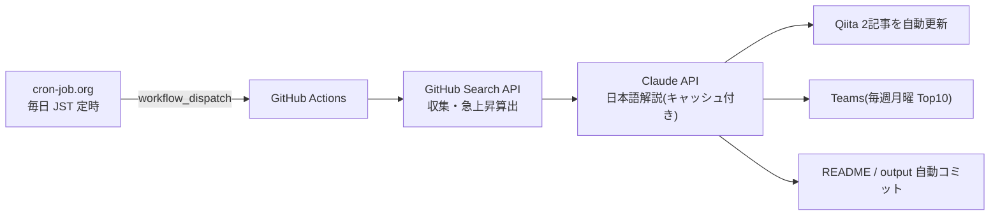

# Claude Code向けMCPツール候補ランキング

GitHub Search APIを使って、Claude Code周辺で活用候補になりそうなMCP関連リポジトリを定期収集するリポジトリです。

> 注意: この一覧は「Claude Codeでの動作」を保証するものではありません。  
> GitHub上のリポジトリ名・説明文・READMEなどに含まれる情報をもとに、MCP関連ツール候補を探すための入口として利用します。

## 仕組み(定常自律運転)

このランキングは cron-job.org → GitHub Actions → Claude API → Qiita / Teams のパイプラインで、毎日無人更新されています。



- 仕組みの詳細と**ライブ稼働ステータス**: [定常自律運転ページ](https://takanobusano.github.io/mcp-github-ranking/)
- 作り方の解説記事: [パイプライン編](https://qiita.com/4q_sano/items/913e93ee5cc2731561fc) / [cron-job.org 完全自動化編](https://qiita.com/4q_sano/items/1bc5e0669a8f0166936c)
<!-- MCP_REPOS_START -->
最終更新: **2026-07-24 08:17:16 JST**

MCP関連リポジトリに加え、Claude Code周辺で活用候補になりそうな関連ツールをGitHub Search APIで毎日自動収集してランキング化しています。

Stars / Forks の差分は、UTC基準の前日データ（2026-07-22）との差分です。
CSVには最大500件を保存し、本文では上位100件を表示しています。

> 注意: この一覧はClaude Codeでの動作を保証するものではありません。  
> MCP関連ツールまたはClaude Code関連ツール候補を探すための入口として利用してください。

# 注目MCP・関連ツール候補ランキング

## 1位 [public-apis/public-apis](https://github.com/public-apis/public-apis)

A collective list of free APIs

⭐ **452,205 Stars**（+188）　🍴 **49,789 Forks**（+29）　/　🟢 **1,597 Open Issues**　/　Python

Topics: `api` / `apis` / `dataset` / `development` / `free` / `list` / `lists` / `open-source`

## 2位 [obra/superpowers](https://github.com/obra/superpowers)

An agentic skills framework & software development methodology that works.

⭐ **260,037 Stars**（+620）　🍴 **23,183 Forks**（+58）　/　🟢 **317 Open Issues**　/　Shell

Topics: `ai` / `brainstorming` / `coding` / `obra` / `sdlc` / `skills` / `subagent-driven-development` / `superpowers`

## 3位 [affaan-m/ECC](https://github.com/affaan-m/ECC)

The agent harness performance optimization system. Skills, instincts, memory, security, and research-first development for Claude Code, Codex, Opencode, Cursor and beyond.

⭐ **232,568 Stars**（+354）　🍴 **35,443 Forks**（+33）　/　🟢 **99 Open Issues**　/　JavaScript

Topics: `ai-agents` / `anthropic` / `claude` / `claude-code` / `developer-tools` / `llm` / `mcp` / `productivity`

## 4位 [NousResearch/hermes-agent](https://github.com/NousResearch/hermes-agent)

The agent that grows with you

⭐ **219,497 Stars**（+543）　🍴 **41,655 Forks**（+174）　/　🟢 **24,802 Open Issues**　/　Python

Topics: `ai` / `ai-agent` / `ai-agents` / `anthropic` / `chatgpt` / `claude` / `claude-code` / `clawdbot`

## 5位 [multica-ai/andrej-karpathy-skills](https://github.com/multica-ai/andrej-karpathy-skills)

A single CLAUDE.md file to improve Claude Code behavior, derived from Andrej Karpathy's observations on LLM coding pitfalls.

⭐ **195,705 Stars**（+289）　🍴 **20,147 Forks**（+34）　/　🟢 **124 Open Issues**　/　不明

Topics: `topicなし`

## 6位 [ultraworkers/claw-code](https://github.com/ultraworkers/claw-code)

An agent-managed museum exhibit, built in Rust with Gajae-Code / LazyCodex — developed and maintained with no human intervention.

⭐ **194,880 Stars**（+28）　🍴 **109,514 Forks**（-24）　/　🟢 **33 Open Issues**　/　Rust

Topics: `topicなし`

## 7位 [mattpocock/skills](https://github.com/mattpocock/skills)

Skills for Real Engineers. Straight from my .agents directory.

⭐ **184,449 Stars**（+2,184）　🍴 **15,790 Forks**（+230）　/　🟢 **219 Open Issues**　/　Shell

Topics: `topicなし`

## 8位 [ollama/ollama](https://github.com/ollama/ollama)

Get up and running with Kimi-K2.6, GLM-5.2, MiniMax, DeepSeek, gpt-oss, Qwen, Gemma and other models.

⭐ **176,733 Stars**（+71）　🍴 **17,078 Forks**（+14）　/　🟢 **3,527 Open Issues**　/　Go

Topics: `deepseek` / `gemma` / `gemma3` / `glm` / `go` / `golang` / `gpt-oss` / `llama`

## 9位 [anthropics/skills](https://github.com/anthropics/skills)

Public repository for Agent Skills

⭐ **163,719 Stars**（+296）　🍴 **19,426 Forks**（+40）　/　🟢 **1,043 Open Issues**　/　Python

Topics: `agent-skills`

## 10位 [firecrawl/firecrawl](https://github.com/firecrawl/firecrawl)

The API to search, scrape, and interact with the web at scale. 🔥

⭐ **155,100 Stars**（+575）　🍴 **8,832 Forks**（+31）　/　🟢 **439 Open Issues**　/　TypeScript

Topics: `ai` / `ai-agents` / `ai-crawler` / `ai-scraping` / `ai-search` / `crawler` / `data-extraction` / `html-to-markdown`

## 11位 [langflow-ai/langflow](https://github.com/langflow-ai/langflow)

Langflow is a powerful tool for building and deploying AI-powered agents and workflows.

⭐ **152,289 Stars**（+62）　🍴 **9,636 Forks**（+10）　/　🟢 **984 Open Issues**　/　Python

Topics: `agents` / `chatgpt` / `generative-ai` / `large-language-models` / `multiagent` / `react-flow`

## 12位 [x1xhlol/system-prompts-and-models-of-ai-tools](https://github.com/x1xhlol/system-prompts-and-models-of-ai-tools)

FULL Augment Code, Claude Code, Cluely, CodeBuddy, Comet, Cursor, Devin AI, Junie, Kiro, Leap.new, Lovable, Manus, NotionAI, Orchids.app, Perplexity, Poke, Qoder, Replit, Same.dev, Trae, Traycer AI, VSCode Agent, Warp.dev, Windsurf, Xcode, Z.ai Code, Dia & v0. (And other Open Sourced) System Prompts, Internal Tools & AI Models

⭐ **142,229 Stars**（+44）　🍴 **34,821 Forks**（-1）　/　🟢 **158 Open Issues**　/　不明

Topics: `ai` / `bolt` / `cluely` / `copilot` / `cursor` / `cursorai` / `devin` / `github-copilot`

## 13位 [anthropics/claude-code](https://github.com/anthropics/claude-code)

Claude Code is an agentic coding tool that lives in your terminal, understands your codebase, and helps you code faster by executing routine tasks, explaining complex code, and handling git workflows - all through natural language commands.

⭐ **138,854 Stars**（+124）　🍴 **22,281 Forks**（+23）　/　🟢 **13,166 Open Issues**　/　Python

Topics: `topicなし`

## 14位 [msitarzewski/agency-agents](https://github.com/msitarzewski/agency-agents)

A complete AI agency at your fingertips - From frontend wizards to Reddit community ninjas, from whimsy injectors to reality checkers. Each agent is a specialized expert with personality, processes, and proven deliverables.

⭐ **136,169 Stars**（+307）　🍴 **22,167 Forks**（+48）　/　🟢 **99 Open Issues**　/　Shell

Topics: `topicなし`

## 15位 [garrytan/gstack](https://github.com/garrytan/gstack)

Use Garry Tan's exact Claude Code setup: 23 opinionated tools that serve as CEO, Designer, Eng Manager, Release Manager, Doc Engineer, and QA

⭐ **123,943 Stars**（+216）　🍴 **18,563 Forks**（+30）　/　🟢 **780 Open Issues**　/　TypeScript

Topics: `topicなし`

## 16位 [farion1231/cc-switch](https://github.com/farion1231/cc-switch)

A cross-platform desktop All-in-One assistant for Claude Code, Codex, OpenCode, OpenClaw, Grok Build & Hermes Agent. Only official website: ccswitch.io

⭐ **120,517 Stars**（+370）　🍴 **8,089 Forks**（+26）　/　🟢 **2,066 Open Issues**　/　Rust

Topics: `ai-tools` / `claude-code` / `codex` / `desktop-app` / `grok` / `grokbuild` / `hermes` / `hermes-agent`

## 17位 [nextlevelbuilder/ui-ux-pro-max-skill](https://github.com/nextlevelbuilder/ui-ux-pro-max-skill)

An AI SKILL that provide design intelligence for building professional UI/UX multiple platforms

⭐ **109,418 Stars**（+461）　🍴 **11,667 Forks**（+69）　/　🟢 **123 Open Issues**　/　Python

Topics: `ai-skills` / `antigravity` / `claude` / `claude-code` / `codex` / `command-line` / `copilot` / `cursor-ai`

## 18位 [browser-use/browser-use](https://github.com/browser-use/browser-use)

🌐 Make websites accessible for AI agents. Automate tasks online with ease.

⭐ **106,380 Stars**（+249）　🍴 **11,699 Forks**（+28）　/　🟢 **329 Open Issues**　/　Python

Topics: `ai-agents` / `ai-tools` / `browser-automation` / `browser-use` / `llm` / `playwright` / `python`

## 19位 [google-gemini/gemini-cli](https://github.com/google-gemini/gemini-cli)

An open-source AI agent that brings the power of Gemini directly into your terminal.

⭐ **106,145 Stars**（+11）　🍴 **14,304 Forks**（+9）　/　🟢 **1,234 Open Issues**　/　TypeScript

Topics: `ai` / `ai-agents` / `cli` / `gemini` / `gemini-api` / `mcp-client` / `mcp-server`

## 20位 [harry0703/MoneyPrinterTurbo](https://github.com/harry0703/MoneyPrinterTurbo)

利用 AI 大模型和自动化工作流，根据主题或关键词一键生成高清短视频。Generate HD short videos from a topic or keyword with an automated AI workflow.

⭐ **98,908 Stars**（+242）　🍴 **14,638 Forks**（+43）　/　🟢 **5 Open Issues**　/　Python

Topics: `ai-video-generator` / `content-creation` / `ffmpeg` / `instagram-reels` / `llm` / `python` / `short-video` / `subtitles`

## 21位 [puppeteer/puppeteer](https://github.com/puppeteer/puppeteer)

JavaScript API for Chrome and Firefox

⭐ **95,336 Stars**（+5）　🍴 **9,541 Forks**（+1）　/　🟢 **276 Open Issues**　/　TypeScript

Topics: `automation` / `chrome` / `chromium` / `developer-tools` / `firefox` / `headless-chrome` / `node-module` / `testing`

## 22位 [Graphify-Labs/graphify](https://github.com/Graphify-Labs/graphify)

Turn any codebase, with its docs, SQL schemas, configs, and PDFs, into a queryable knowledge graph. A /graphify skill for Claude Code, Cursor, Codex, and Gemini CLI: local deterministic AST parsing, every edge explained, no vector store.

⭐ **94,587 Stars**（+701）　🍴 **9,158 Forks**（+63）　/　🟢 **624 Open Issues**　/　Python

Topics: `ai-agents` / `antigravity` / `ast` / `claude-code` / `code-analysis` / `code-search` / `codex` / `cursor`

## 23位 [TauricResearch/TradingAgents](https://github.com/TauricResearch/TradingAgents)

TradingAgents: Multi-Agents LLM Financial Trading Framework

⭐ **94,305 Stars**（+197）　🍴 **18,218 Forks**（+38）　/　🟢 **302 Open Issues**　/　Python

Topics: `agent` / `finance` / `llm` / `multiagent` / `trading`

## 24位 [microsoft/playwright](https://github.com/microsoft/playwright)

Playwright is a framework for Web Testing and Automation. It allows testing Chromium, Firefox and WebKit with a single API.

⭐ **93,337 Stars**（+60）　🍴 **6,139 Forks**（+4）　/　🟢 **163 Open Issues**　/　TypeScript

Topics: `automation` / `chrome` / `chromium` / `e2e-testing` / `electron` / `end-to-end-testing` / `firefox` / `javascript`

## 25位 [JuliusBrussee/caveman](https://github.com/JuliusBrussee/caveman)

🪨 why use many token when few token do trick — Claude Code skill that cuts 65% of tokens by talking like caveman

⭐ **92,425 Stars**（+340）　🍴 **5,240 Forks**（+17）　/　🟢 **422 Open Issues**　/　JavaScript

Topics: `ai` / `anthropic` / `caveman` / `claude` / `claude-code` / `llm` / `meme` / `prompt-engineering`

## 26位 [modelcontextprotocol/servers](https://github.com/modelcontextprotocol/servers)

Model Context Protocol Servers

⭐ **88,816 Stars**（+26）　🍴 **11,277 Forks**（+2）　/　🟢 **680 Open Issues**　/　TypeScript

Topics: `topicなし`

## 27位 [ChatGPTNextWeb/NextChat](https://github.com/ChatGPTNextWeb/NextChat)

✨ Light and Fast AI Assistant. Support: Web \| iOS \| MacOS \| Android \|  Linux \| Windows

⭐ **88,538 Stars**（+9）　🍴 **59,379 Forks**（-1）　/　🟢 **845 Open Issues**　/　TypeScript

Topics: `calclaude` / `chatgpt` / `claude` / `cross-platform` / `desktop` / `fe` / `gemini` / `gemini-pro`

## 28位 [DietrichGebert/ponytail](https://github.com/DietrichGebert/ponytail)

Makes your AI agent think like the laziest senior dev in the room. The best code is the code you never wrote.

⭐ **88,397 Stars**（+526）　🍴 **4,837 Forks**（+28）　/　🟢 **101 Open Issues**　/　JavaScript

Topics: `agent-skills` / `ai-agents` / `claude` / `claude-code` / `claude-code-plugin` / `cursor-rules` / `developer-tools` / `llm`

## 29位 [thedotmack/claude-mem](https://github.com/thedotmack/claude-mem)

Persistent Context Across Sessions for Every Agent –  Captures everything your agent does during sessions, compresses it with AI, and injects relevant context back into future sessions. Works with Claude Code, OpenClaw, Codex, Gemini, Hermes, Copilot, OpenCode + More

⭐ **88,366 Stars**（+109）　🍴 **7,673 Forks**（+13）　/　🟢 **269 Open Issues**　/　JavaScript

Topics: `ai` / `ai-agents` / `ai-memory` / `anthropic` / `artificial-intelligence` / `chromadb` / `claude` / `claude-agent-sdk`

## 30位 [laravel/laravel](https://github.com/laravel/laravel)

Laravel is a web application framework with expressive, elegant syntax. We’ve already laid the foundation for your next big idea — freeing you to create without sweating the small things.

⭐ **84,663 Stars**（+8）　🍴 **24,791 Forks**（-5）　/　🟢 **31 Open Issues**　/　Blade

Topics: `framework` / `laravel` / `php`

## 31位 [OpenHands/OpenHands](https://github.com/OpenHands/OpenHands)

🙌 OpenHands: AI-Driven Development

⭐ **81,867 Stars**（+138）　🍴 **10,466 Forks**（+17）　/　🟢 **370 Open Issues**　/　Python

Topics: `agent` / `artificial-intelligence` / `chatgpt` / `claude-ai` / `cli` / `developer-tools` / `gpt` / `llm`

## 32位 [nexu-io/open-design](https://github.com/nexu-io/open-design)

🎨 The open-source Claude Design alternative. 🖥️ Local-first desktop app. 🖼️ Your coding agent becomes the design engine: prototypes, landing pages, dashboards,...

⭐ **81,020 Stars**（+292）　🍴 **9,362 Forks**（+45）　/　🟢 **658 Open Issues**　/　TypeScript

Topics: `agent-skills` / `ai-agents` / `ai-design` / `byok` / `claude-code-for-design` / `claude-design` / `codex-design` / `coding-agents`

## 33位 [addyosmani/agent-skills](https://github.com/addyosmani/agent-skills)

Production-grade engineering skills for AI coding agents.

⭐ **80,053 Stars**（+185）　🍴 **8,625 Forks**（+27）　/　🟢 **126 Open Issues**　/　JavaScript

Topics: `agent-skills` / `antigravity` / `claude-code` / `codex` / `cursor` / `skills`

## 34位 [OpenCut-app/OpenCut](https://github.com/OpenCut-app/OpenCut)

The open-source CapCut alternative

⭐ **78,087 Stars**（+534）　🍴 **7,796 Forks**（+37）　/　🟢 **361 Open Issues**　/　TypeScript

Topics: `editor` / `oss` / `videoeditor`

## 35位 [bytedance/deer-flow](https://github.com/bytedance/deer-flow)

An open-source long-horizon SuperAgent harness that researches, codes, and creates. With the help of sandboxes, memories, tools, skill, subagents and message gateway, it handles different levels of tasks that could take minutes to hours.

⭐ **77,705 Stars**（+92）　🍴 **10,587 Forks**（+21）　/　🟢 **1,002 Open Issues**　/　Python

Topics: `agent` / `agentic` / `agentic-framework` / `agentic-workflow` / `ai` / `ai-agents` / `deep-research` / `harness`

## 36位 [Egonex-AI/Understand-Anything](https://github.com/Egonex-AI/Understand-Anything)

Graphs that teach > graphs that impress. Turn any code into an interactive knowledge graph you can explore, search, and ask questions about. Works with Claude Code, Codex, Cursor, Copilot, Gemini CLI, and more.

⭐ **75,816 Stars**（+165）　🍴 **6,319 Forks**（+24）　/　🟢 **261 Open Issues**　/　TypeScript

Topics: `antigravity-skills` / `business-knowledge` / `claude-code` / `claude-skills` / `codebase-analysis` / `codex` / `codex-skills` / `developer-tools-ai-agent`

## 37位 [opendatalab/MinerU](https://github.com/opendatalab/MinerU)

Transforms complex documents like PDFs and Office docs into LLM-ready markdown/JSON for your Agentic workflows.

⭐ **75,558 Stars**（+94）　🍴 **6,348 Forks**（+12）　/　🟢 **65 Open Issues**　/　Python

Topics: `ai4science` / `document-analysis` / `docx` / `extract-data` / `layout-analysis` / `ocr` / `parser` / `pdf`

## 38位 [unclecode/crawl4ai](https://github.com/unclecode/crawl4ai)

🚀🤖 Crawl4AI: Open-source LLM Friendly Web Crawler & Scraper. Don't be shy, join here:

⭐ **74,621 Stars**（+447）　🍴 **7,685 Forks**（+58）　/　🟢 **117 Open Issues**　/　Python

Topics: `topicなし`

## 39位 [paperclipai/paperclip](https://github.com/paperclipai/paperclip)

The open-source app everyone uses to manage agents at work

⭐ **74,600 Stars**（+101）　🍴 **13,887 Forks**（+17）　/　🟢 **4,897 Open Issues**　/　TypeScript

Topics: `topicなし`

## 40位 [Eugeny/tabby](https://github.com/Eugeny/tabby)

A terminal for a more modern age

⭐ **73,442 Stars**（+21）　🍴 **4,167 Forks**（-1）　/　🟢 **2,791 Open Issues**　/　TypeScript

Topics: `serial` / `ssh-client` / `telnet-client` / `terminal` / `terminal-emulators`

## 41位 [abi/screenshot-to-code](https://github.com/abi/screenshot-to-code)

Drop in a screenshot and convert it to clean code (HTML/Tailwind/React/Vue)

⭐ **73,428 Stars**（+7）　🍴 **9,031 Forks**（+1）　/　🟢 **122 Open Issues**　/　Python

Topics: `topicなし`

## 42位 [thedaviddias/Front-End-Checklist](https://github.com/thedaviddias/Front-End-Checklist)

🗂 The essential checklist for modern web development, for humans and AI agents

⭐ **73,288 Stars**（+10）　🍴 **6,654 Forks**（±0）　/　🟢 **4 Open Issues**　/　MDX

Topics: `ai-agent` / `ai-agents` / `checklist` / `css` / `front-end-developer-tool` / `front-end-development` / `frontend` / `guidelines`

## 43位 [rtk-ai/rtk](https://github.com/rtk-ai/rtk)

CLI proxy that reduces LLM token consumption by 60-90% on common dev commands. Single Rust binary, zero dependencies

⭐ **72,848 Stars**（+213）　🍴 **4,545 Forks**（+20）　/　🟢 **1,714 Open Issues**　/　Rust

Topics: `agentic-coding` / `ai-coding` / `anthropic` / `claude-code` / `cli` / `command-line-tool` / `cost-reduction` / `developer-tools`

## 44位 [daytonaio/daytona](https://github.com/daytonaio/daytona)

Daytona is a Secure and Elastic Infrastructure for Running AI-Generated Code

⭐ **72,178 Stars**（-26）　🍴 **5,669 Forks**（±0）　/　🟢 **443 Open Issues**　/　不明

Topics: `agentic-workflow` / `ai` / `ai-agents` / `ai-runtime` / `ai-sandboxes` / `code-execution` / `code-interpreter` / `developer-tools`

## 45位 [shareAI-lab/learn-claude-code](https://github.com/shareAI-lab/learn-claude-code)

Bash is all you need -  A nano claude code–like 「agent harness」, built from 0 to 1

⭐ **72,075 Stars**（+129）　🍴 **11,681 Forks**（+13）　/　🟢 **71 Open Issues**　/　Python

Topics: `agent` / `agent-development` / `ai-agent` / `claude` / `claude-code` / `educational` / `llm` / `python`

## 46位 [koala73/worldmonitor](https://github.com/koala73/worldmonitor)

Real-time global intelligence dashboard. AI-powered news aggregation, geopolitical monitoring, and infrastructure tracking in a unified situational awareness interface

⭐ **71,496 Stars**（+2,667）　🍴 **10,792 Forks**（+268）　/　🟢 **258 Open Issues**　/　TypeScript

Topics: `agent` / `ai` / `dashboard` / `geopolitics` / `mcp` / `mcp-server` / `monitoring` / `news`

## 47位 [D4Vinci/Scrapling](https://github.com/D4Vinci/Scrapling)

🕷️ An adaptive Web Scraping framework that handles everything from a single request to a full-scale crawl!

⭐ **70,975 Stars**（+214）　🍴 **7,041 Forks**（+23）　/　🟢 **3 Open Issues**　/　Python

Topics: `ai` / `ai-scraping` / `automation` / `crawler` / `crawling` / `crawling-python` / `data` / `data-extraction`

## 48位 [OpenBB-finance/OpenBB](https://github.com/OpenBB-finance/OpenBB)

Open Data Platform for analysts, quants and AI agents.

⭐ **70,934 Stars**（+50）　🍴 **7,214 Forks**（+7）　/　🟢 **80 Open Issues**　/　Python

Topics: `ai` / `crypto` / `derivatives` / `economics` / `equity` / `finance` / `fixed-income` / `machine-learning`

## 49位 [unslothai/unsloth](https://github.com/unslothai/unsloth)

Unsloth is a local UI for training and running Gemma 4, Qwen3.6, DeepSeek, Kimi, GLM and other models.

⭐ **68,801 Stars**（+55）　🍴 **6,187 Forks**（+10）　/　🟢 **986 Open Issues**　/　Python

Topics: `agent` / `deepseek` / `fine-tuning` / `gemma` / `gemma3` / `gpt-oss` / `llama` / `llama3`

## 50位 [openinterpreter/openinterpreter](https://github.com/openinterpreter/openinterpreter)

A coding agent for open models like Kimi K3

⭐ **67,207 Stars**（+70）　🍴 **5,771 Forks**（+4）　/　🟢 **292 Open Issues**　/　Rust

Topics: `acp` / `coding-agent` / `deepseek` / `kimi` / `qwen` / `rust`

## 51位 [Leonxlnx/taste-skill](https://github.com/Leonxlnx/taste-skill)

Taste-Skill - gives your AI good taste. stops the AI from generating boring, generic slop

⭐ **66,837 Stars**（+444）　🍴 **4,599 Forks**（+17）　/　🟢 **51 Open Issues**　/　JavaScript

Topics: `agent` / `ai` / `claude` / `claude-code` / `codex` / `coding` / `design` / `frontend`

## 52位 [bradtraversy/design-resources-for-developers](https://github.com/bradtraversy/design-resources-for-developers)

Curated list of design and UI resources from stock photos, web templates, CSS frameworks, UI libraries, tools and much more

⭐ **66,485 Stars**（+11）　🍴 **12,119 Forks**（+2）　/　🟢 **62 Open Issues**　/　不明

Topics: `topicなし`

## 53位 [xtekky/gpt4free](https://github.com/xtekky/gpt4free)

The official gpt4free repository \| various collection of powerful language models \| opus 4.6 gpt 5.3 kimi 2.5 deepseek v3.2 gemini 3

⭐ **66,480 Stars**（+3）　🍴 **13,530 Forks**（-1）　/　🟢 **7 Open Issues**　/　Python

Topics: `chatbot` / `chatbots` / `chatgpt` / `chatgpt-4` / `chatgpt-api` / `chatgpt-free` / `chatgpt4` / `deepseek`

## 54位 [code-yeongyu/oh-my-openagent](https://github.com/code-yeongyu/oh-my-openagent)

omo/lazycodex: The coding agent for tokenmaxxers;the one and only agent harness for complex codebases. For your Codex, for your OpenCode

⭐ **66,469 Stars**（+69）　🍴 **5,417 Forks**（+7）　/　🟢 **903 Open Issues**　/　TypeScript

Topics: `ai` / `ai-agents` / `anthropic` / `chatgpt` / `claude` / `claude-skills` / `codex` / `cursor`

## 55位 [ruvnet/ruflo](https://github.com/ruvnet/ruflo)

🌊 The leading agent meta-harness. Deploy intelligent multi-player swarms, coordinate autonomous workflows, and build conversational AI systems. Features adaptiv...

⭐ **65,714 Stars**（+147）　🍴 **7,806 Forks**（+21）　/　🟢 **818 Open Issues**　/　TypeScript

Topics: `agentic-ai` / `agentic-framework` / `agentic-workflow` / `agents` / `ai-agents` / `ai-assistant` / `ai-coding` / `ai-skills`

## 56位 [cline/cline](https://github.com/cline/cline)

Autonomous coding agent as an SDK, IDE extension, or CLI assistant.

⭐ **64,979 Stars**（+41）　🍴 **6,976 Forks**（+7）　/　🟢 **1,126 Open Issues**　/　TypeScript

Topics: `topicなし`

## 57位 [docling-project/docling](https://github.com/docling-project/docling)

Get your documents ready for gen AI

⭐ **63,686 Stars**（+60）　🍴 **4,514 Forks**（+10）　/　🟢 **936 Open Issues**　/　Python

Topics: `ai` / `convert` / `document-parser` / `document-parsing` / `documents` / `docx` / `html` / `markdown`

## 58位 [warpdotdev/warp](https://github.com/warpdotdev/warp)

Warp is an agentic development environment, born out of the terminal.

⭐ **63,602 Stars**（+37）　🍴 **5,323 Forks**（+10）　/　🟢 **4,688 Open Issues**　/　Rust

Topics: `bash` / `linux` / `macos` / `rust` / `shell` / `terminal` / `wasm` / `zsh`

## 59位 [shanraisshan/claude-code-best-practice](https://github.com/shanraisshan/claude-code-best-practice)

from vibe coding to agentic engineering - practice makes claude perfect

⭐ **63,385 Stars**（+82）　🍴 **6,325 Forks**（+4）　/　🟢 **17 Open Issues**　/　HTML

Topics: `agentic-ai` / `agentic-coding` / `agentic-engineering` / `agentic-workflow` / `ai` / `ai-agents` / `anthropic` / `best-practices`

## 60位 [Fission-AI/OpenSpec](https://github.com/Fission-AI/OpenSpec)

Spec-driven development (SDD) for AI coding assistants.

⭐ **62,315 Stars**（+179）　🍴 **4,315 Forks**（+12）　/　🟢 **372 Open Issues**　/　TypeScript

Topics: `ai` / `context-engineering` / `engineering` / `planning` / `prd` / `sdd` / `sdlc` / `spec`

## 61位 [colbymchenry/codegraph](https://github.com/colbymchenry/codegraph)

Pre-indexed code knowledge graph, auto syncs on code changes, for Claude Code, Codex, Gemini, Cursor, OpenCode, AntiGravity, Kiro, and Hermes Agent — fewer tokens, fewer tool calls, 100% local

⭐ **61,960 Stars**（+256）　🍴 **3,883 Forks**（+23）　/　🟢 **342 Open Issues**　/　C

Topics: `topicなし`

## 62位 [headroomlabs-ai/headroom](https://github.com/headroomlabs-ai/headroom)

Compress tool outputs, logs, files, and RAG chunks before they reach the LLM. 20% fewer tokens for coding agents, 60-95% fewer tokens for JSON, same answers. Library, proxy, MCP server.

⭐ **61,714 Stars**（+475）　🍴 **4,649 Forks**（+42）　/　🟢 **508 Open Issues**　/　Python

Topics: `agent` / `ai` / `anthropic` / `claude-code` / `compression` / `context-engineering` / `context-window` / `cursor`

## 63位 [mem0ai/mem0](https://github.com/mem0ai/mem0)

Universal memory layer for AI Agents

⭐ **61,553 Stars**（+68）　🍴 **7,173 Forks**（+14）　/　🟢 **676 Open Issues**　/　TypeScript

Topics: `agents` / `ai` / `ai-agents` / `application` / `chatbots` / `chatgpt` / `genai` / `llm`

## 64位 [sansan0/TrendRadar](https://github.com/sansan0/TrendRadar)

⭐AI-driven public opinion & trend monitor with multi-platform aggregation, RSS, and smart alerts.🎯 告别信息过载，你的 AI 舆情监控助手与热点筛选工具！聚合多平台热点 +  RSS 订阅，支持关键词精准筛选。AI 智能筛...

⭐ **60,832 Stars**（+39）　🍴 **24,809 Forks**（+7）　/　🟢 **50 Open Issues**　/　Python

Topics: `ai` / `bark` / `data-analysis` / `docker` / `hot-news` / `llm` / `mail` / `mcp`

## 65位 [Panniantong/Agent-Reach](https://github.com/Panniantong/Agent-Reach)

Give your AI agent eyes to see the entire internet. Read & search Twitter, Reddit, YouTube, GitHub, Bilibili, XiaoHongShu — one CLI, zero API fees.

⭐ **60,161 Stars**（+473）　🍴 **4,832 Forks**（+47）　/　🟢 **169 Open Issues**　/　Python

Topics: `agent-infrastructure` / `ai-agent` / `ai-search` / `automation` / `bilibili` / `claude-code` / `cli` / `cursor`

## 66位 [tw93/Pake](https://github.com/tw93/Pake)

🤱🏻 Turn any webpage into a desktop app with one command.

⭐ **60,160 Stars**（+34）　🍴 **12,183 Forks**（+7）　/　🟢 **5 Open Issues**　/　Rust

Topics: `chatgpt` / `claude` / `desktop` / `gemini` / `hight-performance` / `linux` / `macos` / `no-electron`

## 67位 [asgeirtj/system_prompts_leaks](https://github.com/asgeirtj/system_prompts_leaks)

Extracted system prompts from Anthropic - Claude Fable 5, Opus 4.8, Claude Code, Claude Design. OpenAI - ChatGPT GPT-5.6, Codex GPT-5.6, GPT-5.5. Google - Gemini 3.5 Flash, 3.1 Pro, Antigravity. xAI - Grok, Cursor, Copilot, VS Code, Perplexity, and more. Updated regularly.

⭐ **60,014 Stars**（+273）　🍴 **9,778 Forks**（+44）　/　🟢 **41 Open Issues**　/　JavaScript

Topics: `ai` / `ai-agents` / `ai-prompts` / `anthropic` / `chatbot` / `chatgpt` / `claude` / `claude-code`

## 68位 [microsoft/autogen](https://github.com/microsoft/autogen)

A programming framework for agentic AI

⭐ **59,922 Stars**（+19）　🍴 **9,020 Forks**（+2）　/　🟢 **968 Open Issues**　/　Python

Topics: `agentic` / `agentic-agi` / `agents` / `ai` / `autogen` / `autogen-ecosystem` / `chatgpt` / `framework`

## 69位 [upstash/context7](https://github.com/upstash/context7)

Context7 Platform -- Up-to-date code documentation for LLMs and AI code editors

⭐ **59,654 Stars**（+47）　🍴 **2,857 Forks**（+2）　/　🟢 **24 Open Issues**　/　TypeScript

Topics: `llm` / `mcp` / `mcp-server` / `vibe-coding`

## 70位 [1c7/chinese-independent-developer](https://github.com/1c7/chinese-independent-developer)

👩🏿‍💻👨🏾‍💻👩🏼‍💻👨🏽‍💻👩🏻‍💻中国独立开发者项目列表 -- 分享大家都在做什么

⭐ **59,517 Stars**（+190）　🍴 **5,135 Forks**（+20）　/　🟢 **1 Open Issues**　/　Python

Topics: `china` / `indie` / `indie-developer`

## 71位 [coollabsio/coolify](https://github.com/coollabsio/coolify)

An open-source, self-hostable PaaS alternative to Vercel, Heroku & Netlify that lets you easily deploy static sites, databases, full-stack applications and 280+ one-click services on your own servers.

⭐ **59,375 Stars**（+87）　🍴 **5,126 Forks**（+11）　/　🟢 **803 Open Issues**　/　PHP

Topics: `coolify` / `databases` / `deployment` / `docker` / `docker-compose` / `inertiajs` / `laravel` / `mariadb`

## 72位 [meilisearch/meilisearch](https://github.com/meilisearch/meilisearch)

A lightning-fast search engine API bringing AI-powered hybrid search to your sites and applications.

⭐ **58,706 Stars**（+9）　🍴 **2,635 Forks**（+2）　/　🟢 **302 Open Issues**　/　Rust

Topics: `ai` / `api` / `app-search` / `database` / `enterprise-search` / `faceting` / `full-text-search` / `fuzzy-search`

## 73位 [MemPalace/mempalace](https://github.com/MemPalace/mempalace)

The best-benchmarked open-source AI memory system. And it's free.

⭐ **57,660 Stars**（+46）　🍴 **7,429 Forks**（+7）　/　🟢 **647 Open Issues**　/　Python

Topics: `ai` / `chromadb` / `llm` / `mcp` / `memory` / `python`

## 74位 [zylon-ai/private-gpt](https://github.com/zylon-ai/private-gpt)

Complete API layer for private AI applications on local models: RAG, skills, tools, MCP, text-to-sql, and more. Works with any OpenAI-compatible inference server.

⭐ **57,355 Stars**（±0）　🍴 **7,606 Forks**（±0）　/　🟢 **7 Open Issues**　/　Python

Topics: `ai` / `ai-tools` / `on-premise`

## 75位 [penpot/penpot](https://github.com/penpot/penpot)

Penpot: The open-source design platform for Product teams that need scalable collaboration.

⭐ **57,248 Stars**（+69）　🍴 **3,791 Forks**（+11）　/　🟢 **717 Open Issues**　/　Clojure

Topics: `clojure` / `clojurescript` / `design` / `prototyping` / `ui` / `ux-design` / `ux-experience`

## 76位 [NanmiCoder/MediaCrawler](https://github.com/NanmiCoder/MediaCrawler)

小红书笔记 \| 评论爬虫、抖音视频 \| 评论爬虫、快手视频 \| 评论爬虫、B 站视频 ｜ 评论爬虫、微博帖子 ｜ 评论爬虫、百度贴吧帖子 ｜ 百度贴吧评论回复爬虫  \| 知乎问答文章｜评论爬虫

⭐ **57,185 Stars**（+69）　🍴 **11,431 Forks**（+7）　/　🟢 **181 Open Issues**　/　Python

Topics: `topicなし`

## 77位 [crewAIInc/crewAI](https://github.com/crewAIInc/crewAI)

Framework for orchestrating role-playing, autonomous AI agents. By fostering collaborative intelligence, CrewAI empowers agents to work together seamlessly, tackling complex tasks.

⭐ **56,036 Stars**（+66）　🍴 **7,927 Forks**（+7）　/　🟢 **661 Open Issues**　/　Python

Topics: `agents` / `ai` / `ai-agents` / `aiagentframework` / `llms`

## 78位 [BerriAI/litellm](https://github.com/BerriAI/litellm)

The fastest, litest AI Gateway. Rust core with Python SDK. Call 100+ LLM APIs in OpenAI (or native) format with cost tracking, guardrails, load balancing, and logging [Bedrock, Azure, OpenAI, Anthropic, OpenAI, VertexAI, vLLM, Nvidia NIM]

⭐ **54,511 Stars**（+118）　🍴 **10,020 Forks**（+39）　/　🟢 **4,168 Open Issues**　/　Python

Topics: `ai-gateway` / `anthropic` / `azure-openai` / `bedrock` / `gateway` / `langchain` / `litellm` / `llm`

## 79位 [mvanhorn/last30days-skill](https://github.com/mvanhorn/last30days-skill)

AI agent skill that researches any topic across Reddit, X, YouTube, HN, Polymarket, and the web - then synthesizes a grounded summary

⭐ **53,268 Stars**（+124）　🍴 **4,610 Forks**（+8）　/　🟢 **85 Open Issues**　/　Python

Topics: `ai-prompts` / `ai-skill` / `bluesky` / `claude` / `claude-code` / `clawhub` / `deep-research` / `hackernews`

## 80位 [aaif-goose/goose](https://github.com/aaif-goose/goose)

an open source, extensible AI agent that goes beyond code suggestions - install, execute, edit, and test with any LLM

⭐ **51,546 Stars**（+53）　🍴 **5,674 Forks**（+12）　/　🟢 **366 Open Issues**　/　Rust

Topics: `acp` / `ai` / `ai-agents` / `mcp`

## 81位 [charlax/professional-programming](https://github.com/charlax/professional-programming)

A collection of learning resources for curious software engineers

⭐ **51,289 Stars**（+5）　🍴 **4,006 Forks**（+2）　/　🟢 **5 Open Issues**　/　Python

Topics: `architecture` / `computer-science` / `concepts` / `documentation` / `engineer` / `learning` / `lessons-learned` / `professional`

## 82位 [bmad-code-org/BMAD-METHOD](https://github.com/bmad-code-org/BMAD-METHOD)

Breakthrough Method for Agile Ai Driven Development

⭐ **51,033 Stars**（+59）　🍴 **5,862 Forks**（+5）　/　🟢 **104 Open Issues**　/　JavaScript

Topics: `topicなし`

## 83位 [pbakaus/impeccable](https://github.com/pbakaus/impeccable)

The design language that makes your AI harness better at design.

⭐ **49,119 Stars**（+338）　🍴 **2,862 Forks**（+18）　/　🟢 **40 Open Issues**　/　JavaScript

Topics: `topicなし`

## 84位 [mudler/LocalAI](https://github.com/mudler/LocalAI)

LocalAI is the open-source AI engine. Run any model - LLMs, vision, voice, image, video - on any hardware. No GPU required.

⭐ **47,778 Stars**（+26）　🍴 **4,277 Forks**（+4）　/　🟢 **198 Open Issues**　/　Go

Topics: `agents` / `ai` / `api` / `audio-generation` / `decentralized` / `distributed` / `image-generation` / `libp2p`

## 85位 [oobabooga/textgen](https://github.com/oobabooga/textgen)

Open-source desktop app for local LLMs. Text, vision, tool-calling, OpenAI/Anthropic-compatible API. 100% private.

⭐ **47,483 Stars**（+1）　🍴 **5,981 Forks**（+2）　/　🟢 **836 Open Issues**　/　Python

Topics: `topicなし`

## 86位 [ChromeDevTools/chrome-devtools-mcp](https://github.com/ChromeDevTools/chrome-devtools-mcp)

Chrome DevTools for coding agents

⭐ **47,480 Stars**（+71）　🍴 **3,178 Forks**（+11）　/　🟢 **110 Open Issues**　/　TypeScript

Topics: `browser` / `chrome` / `chrome-devtools` / `debugging` / `devtools` / `mcp` / `mcp-server` / `puppeteer`

## 87位 [prisma/prisma](https://github.com/prisma/prisma)

Next-generation ORM for Node.js & TypeScript \| PostgreSQL, MySQL, MariaDB, SQL Server, SQLite, MongoDB and CockroachDB

⭐ **47,378 Stars**（+8）　🍴 **2,403 Forks**（+2）　/　🟢 **2,515 Open Issues**　/　TypeScript

Topics: `cockroachdb` / `database` / `javascript` / `mariadb` / `mongo` / `mongodb` / `mongodb-orm` / `mssql`

## 88位 [GitHubDaily/GitHubDaily](https://github.com/GitHubDaily/GitHubDaily)

坚持分享 GitHub 上高质量、有趣实用的开源技术教程、开发者工具、编程网站、技术资讯。A list cool, interesting projects of GitHub.

⭐ **47,198 Stars**（+32）　🍴 **4,653 Forks**（+1）　/　🟢 **723 Open Issues**　/　不明

Topics: `ai` / `algorithms-and-data-structures` / `backend` / `developer-tools` / `development` / `frontend` / `github` / `java`

## 89位 [jeecgboot/JeecgBoot](https://github.com/jeecgboot/JeecgBoot)

【低代码迈入v2.0时代，一句话即可生成整个系统】企业级AI低代码平台，一键生成前后端代码甚至整个系统。 AI Skills 一句话画流程、设计表单、生成报表、大屏。内置 AI应用平台涵盖：AI聊天、知识库、流程编排、MCP插件等，兼容主流大模型。引领AI低代码「Skills 生成 → 在线配置 → 代码生成 → 手工...

⭐ **47,169 Stars**（+17）　🍴 **16,112 Forks**（+4）　/　🟢 **37 Open Issues**　/　Java

Topics: `activiti` / `agent` / `ai` / `antd` / `claude-code` / `cli` / `codegenerator` / `codex`

## 90位 [exo-explore/exo](https://github.com/exo-explore/exo)

Run frontier AI locally.

⭐ **46,444 Stars**（+23）　🍴 **3,377 Forks**（+3）　/　🟢 **319 Open Issues**　/　Python

Topics: `topicなし`

## 91位 [jamiepine/voicebox](https://github.com/jamiepine/voicebox)

The open-source AI voice studio. Clone, dictate, create.

⭐ **46,271 Stars**（+548）　🍴 **5,661 Forks**（+78）　/　🟢 **587 Open Issues**　/　TypeScript

Topics: `ai` / `cuda` / `mlx` / `qwen3-tts` / `qwen3-tts-ui` / `voice-ai` / `voice-clone` / `whisper`

## 92位 [apache/airflow](https://github.com/apache/airflow)

Apache Airflow - A platform to programmatically author, schedule, and monitor workflows

⭐ **46,224 Stars**（+11）　🍴 **17,431 Forks**（+8）　/　🟢 **1,784 Open Issues**　/　Python

Topics: `airflow` / `apache` / `apache-airflow` / `automation` / `dag` / `data-engineering` / `data-integration` / `data-orchestrator`

## 93位 [KeygraphHQ/shannon](https://github.com/KeygraphHQ/shannon)

Shannon is an autonomous, white-box AI pentester for web applications and APIs. It analyzes your source code, identifies attack vectors, and executes real exploits to prove vulnerabilities before they reach production.

⭐ **46,102 Stars**（+34）　🍴 **5,331 Forks**（+1）　/　🟢 **23 Open Issues**　/　TypeScript

Topics: `penetration-testing` / `pentesting` / `security-audit` / `security-automation` / `security-tools`

## 94位 [zhayujie/CowAgent](https://github.com/zhayujie/CowAgent)

Open-source super AI assistant & Agent Harness. Plans tasks, runs tools and skills, self-evolves with memory and knowledge. Multi-model, multi-channel. Lightweight, extensible, one-line install. (formerly chatgpt-on-wechat)

⭐ **46,098 Stars**（+14）　🍴 **10,272 Forks**（+3）　/　🟢 **37 Open Issues**　/　Python

Topics: `ai` / `ai-agent` / `ai-agents` / `chatgpt-on-wechat` / `claude` / `claude-code` / `codex` / `cowagent`

## 95位 [HKUDS/CLI-Anything](https://github.com/HKUDS/CLI-Anything)

"CLI-Anything: Making ALL Software Agent-Native" -- CLI-Hub:

⭐ **45,952 Stars**（+169）　🍴 **4,293 Forks**（+10）　/　🟢 **88 Open Issues**　/　Python

Topics: `topicなし`

## 96位 [abhigyanpatwari/GitNexus](https://github.com/abhigyanpatwari/GitNexus)

GitNexus: The Zero-Server Code Intelligence Engine -       GitNexus is a client-side knowledge graph creator that runs entirely in your browser. Drop in a git repository (Github, Gitlab, Azure, Local) or ZIP file, and get an interactive knowledge graph with a built in Graph RAG Agent. Perfect for code exploration

⭐ **44,566 Stars**（+42）　🍴 **4,946 Forks**（+11）　/　🟢 **277 Open Issues**　/　TypeScript

Topics: `topicなし`

## 97位 [router-for-me/CLIProxyAPI](https://github.com/router-for-me/CLIProxyAPI)

Wrap Antigravity, ChatGPT Codex, Claude Code, Grok Build as an OpenAI/Gemini/Claude/Codex compatible API service, allowing you to enjoy the free Gemini 3.1 Pro, GPT 5.5, Grok 4.3, Claude model through API

⭐ **44,491 Stars**（+186）　🍴 **6,966 Forks**（+20）　/　🟢 **364 Open Issues**　/　Go

Topics: `antigravity` / `claude-code` / `cluade` / `codex` / `gemini` / `openai`

## 98位 [janhq/jan](https://github.com/janhq/jan)

Jan is an open source alternative to ChatGPT that runs 100% offline on your computer.

⭐ **43,682 Stars**（+6）　🍴 **2,914 Forks**（+1）　/　🟢 **413 Open Issues**　/　TypeScript

Topics: `chatgpt` / `gpt` / `llamacpp` / `llm` / `localai` / `open-source` / `self-hosted` / `tauri`

## 99位 [ccxt/ccxt](https://github.com/ccxt/ccxt)

A unified trading API with more than 100 crypto exchanges and prediction markets in JavaScript / TypeScript / Python / C# / PHP / Go / Java

⭐ **43,380 Stars**（+5）　🍴 **8,754 Forks**（+1）　/　🟢 **1,209 Open Issues**　/　Python

Topics: `altcoin` / `api` / `arbitrage` / `bitcoin` / `bot` / `btc` / `crypto` / `cryptocurrencies`

## 100位 [QuantumNous/new-api](https://github.com/QuantumNous/new-api)

A unified AI model hub for aggregation & distribution. It supports cross-converting various LLMs into OpenAI-compatible, Claude-compatible, or Gemini-compatible...

⭐ **43,226 Stars**（+139）　🍴 **10,082 Forks**（+28）　/　🟢 **1,092 Open Issues**　/　TypeScript

Topics: `ai-gateway` / `claude` / `deepseek` / `gemini` / `newapi` / `openai` / `rerank`

# 最近プッシュされたMCP・関連ツール候補

スター数ランキングとは別に、最近コードがプッシュされたリポジトリを表示します。古いスター数だけではなく、現在も開発が動いていそうな候補を探すための一覧です。

## プッシュ順 1位 [manaflow-ai/cmux](https://github.com/manaflow-ai/cmux)

Open source Ghostty-based macOS terminal with vertical tabs and notifications for AI coding agents. Built for multitasking, organization, and programmability.

⭐ **25,021 Stars**（+49）　🍴 **2,061 Forks**（+5）　/　Swift　/　最終プッシュ: 2026-07-23

Topics: `amp` / `claude-code` / `cli` / `codex` / `coding-agents` / `gemini` / `ghostty` / `macos`

## プッシュ順 2位 [NVIDIA/NemoClaw](https://github.com/NVIDIA/NemoClaw)

Run agents like Hermes, LangChain Deep Agents, and OpenClaw more securely inside NVIDIA OpenShell with managed inference

⭐ **21,896 Stars**（+10）　🍴 **2,967 Forks**（+4）　/　TypeScript　/　最終プッシュ: 2026-07-23

Topics: `ai-agents` / `hermes` / `nvidia` / `openclaw` / `openshell` / `sandboxing` / `typescript`

## プッシュ順 3位 [PostHog/posthog](https://github.com/PostHog/posthog)

:hedgehog: PostHog is the leading platform for building self-driving products. Our developer tools – AI observability, analytics, session replay, flags, experiments, error tracking, logs, and more – capture all the context agents need to diagnose problems, uncover opportunities, and ship fixes. Steer it all from Slack, web, desktop, or the MCP.

⭐ **37,264 Stars**（+29）　🍴 **3,086 Forks**（+7）　/　Python　/　最終プッシュ: 2026-07-23

Topics: `ab-testing` / `ai-analytics` / `analytics` / `cdp` / `data-warehouse` / `experiments` / `feature-flags` / `javascript`

## プッシュ順 4位 [MetaMask/metamask-extension](https://github.com/MetaMask/metamask-extension)

:globe_with_meridians: :electric_plug: The MetaMask browser extension enables browsing Ethereum blockchain enabled websites

⭐ **13,183 Stars**（+3）　🍴 **5,562 Forks**（+1）　/　TypeScript　/　最終プッシュ: 2026-07-23

Topics: `brave` / `chrome` / `dapp` / `dapp-developers` / `edge` / `ethereum` / `extension` / `firefox`

## プッシュ順 5位 [Arize-ai/phoenix](https://github.com/Arize-ai/phoenix)

AI Observability & Evaluation

⭐ **10,703 Stars**（+20）　🍴 **1,005 Forks**（+2）　/　Python　/　最終プッシュ: 2026-07-23

Topics: `agents` / `ai-monitoring` / `ai-observability` / `aiengineering` / `anthropic` / `datasets` / `evals` / `langchain`

## プッシュ順 6位 [NousResearch/hermes-agent](https://github.com/NousResearch/hermes-agent)

The agent that grows with you

⭐ **219,497 Stars**（+543）　🍴 **41,655 Forks**（+174）　/　Python　/　最終プッシュ: 2026-07-23

Topics: `ai` / `ai-agent` / `ai-agents` / `anthropic` / `chatgpt` / `claude` / `claude-code` / `clawdbot`

## プッシュ順 7位 [sgl-project/sglang](https://github.com/sgl-project/sglang)

SGLang is a high-performance serving framework for large language models and multimodal models.

⭐ **30,676 Stars**（+35）　🍴 **7,360 Forks**（+25）　/　Python　/　最終プッシュ: 2026-07-23

Topics: `attention` / `blackwell` / `cuda` / `deepseek` / `diffusion` / `glm` / `gpt-oss` / `inference`

## プッシュ順 8位 [CopilotKit/CopilotKit](https://github.com/CopilotKit/CopilotKit)

The Frontend Stack for Agents & Generative UI. React, Angular, Mobile, Slack, and more.  Makers of the AG-UI Protocol

⭐ **36,237 Stars**（+18）　🍴 **4,473 Forks**（+6）　/　TypeScript　/　最終プッシュ: 2026-07-23

Topics: `agent` / `agent-native` / `agentic-ai` / `agents` / `ai` / `ai-agent` / `ai-assistant` / `assistant`

## プッシュ順 9位 [browseros-ai/BrowserOS](https://github.com/browseros-ai/BrowserOS)

🌐 The open-source Agentic browser; alternative to ChatGPT Atlas, Perplexity Comet, Dia.

⭐ **12,558 Stars**（+22）　🍴 **1,320 Forks**（+3）　/　TypeScript　/　最終プッシュ: 2026-07-23

Topics: `agent` / `browser` / `browseros` / `chromium` / `hacktoberfest` / `linux` / `llm` / `lmstudio`

## プッシュ順 10位 [langflow-ai/langflow](https://github.com/langflow-ai/langflow)

Langflow is a powerful tool for building and deploying AI-powered agents and workflows.

⭐ **152,289 Stars**（+62）　🍴 **9,636 Forks**（+10）　/　Python　/　最終プッシュ: 2026-07-23

Topics: `agents` / `chatgpt` / `generative-ai` / `large-language-models` / `multiagent` / `react-flow`

## プッシュ順 11位 [gravitational/teleport](https://github.com/gravitational/teleport)

The easiest, and most secure way to access and protect all of your infrastructure.

⭐ **20,691 Stars**（+9）　🍴 **2,124 Forks**（+2）　/　Go　/　最終プッシュ: 2026-07-23

Topics: `audit` / `bastion` / `certificate` / `cluster` / `database-access` / `firewall` / `firewalls` / `go`

## プッシュ順 12位 [obra/superpowers](https://github.com/obra/superpowers)

An agentic skills framework & software development methodology that works.

⭐ **260,037 Stars**（+620）　🍴 **23,183 Forks**（+58）　/　Shell　/　最終プッシュ: 2026-07-23

Topics: `ai` / `brainstorming` / `coding` / `obra` / `sdlc` / `skills` / `subagent-driven-development` / `superpowers`

## プッシュ順 13位 [PrefectHQ/fastmcp](https://github.com/PrefectHQ/fastmcp)

🚀 The fast, Pythonic way to build MCP servers and clients.

⭐ **26,797 Stars**（+26）　🍴 **2,179 Forks**（+3）　/　Python　/　最終プッシュ: 2026-07-23

Topics: `agents` / `fastmcp` / `llms` / `mcp` / `mcp-clients` / `mcp-servers` / `mcp-tools` / `model-context-protocol`

## プッシュ順 14位 [gastownhall/beads](https://github.com/gastownhall/beads)

Beads - A memory upgrade for your coding agent

⭐ **25,601 Stars**（+88）　🍴 **1,726 Forks**（+5）　/　Go　/　最終プッシュ: 2026-07-23

Topics: `agents` / `claude-code` / `coding`

## プッシュ順 15位 [nearai/ironclaw](https://github.com/nearai/ironclaw)

IronClaw is an Agent OS focused on privacy, security and extensibility

⭐ **12,551 Stars**（+4）　🍴 **1,487 Forks**（+2）　/　Rust　/　最終プッシュ: 2026-07-23

Topics: `codeact` / `openclaw` / `rlm` / `rust` / `wasm`

## プッシュ順 16位 [datahub-project/datahub](https://github.com/datahub-project/datahub)

The Context Platform for your Data and AI Stack

⭐ **12,329 Stars**（+9）　🍴 **3,571 Forks**（+4）　/　Python　/　最終プッシュ: 2026-07-23

Topics: `agent-platform` / `context-management` / `data-catalog` / `data-discovery` / `data-governance` / `data-observability` / `datahub` / `metadata`

## プッシュ順 17位 [skypilot-org/skypilot](https://github.com/skypilot-org/skypilot)

The AI Compute Platform for frontier teams. SkyPilot turns fragmented AI compute into one AI supercomputer, so frontier AI teams build custom intelligence faster.

⭐ **10,367 Stars**（+16）　🍴 **1,150 Forks**（+4）　/　Python　/　最終プッシュ: 2026-07-23

Topics: `cloud-computing` / `cloud-management` / `cost-optimization` / `deep-learning` / `distributed-training` / `gpu` / `hyperparameter-tuning` / `job-queue`

## プッシュ順 18位 [kortix-ai/suna](https://github.com/kortix-ai/suna)

The Company AI Command Center

⭐ **20,025 Stars**（+5）　🍴 **3,431 Forks**（+2）　/　TypeScript　/　最終プッシュ: 2026-07-23

Topics: `ai` / `ai-agents` / `llm`

## プッシュ順 19位 [semaphoreui/semaphore](https://github.com/semaphoreui/semaphore)

Modern UI and powerful API for Ansible, Terraform/OpenTofu/Terragrunt, PowerShell and other DevOps tools.

⭐ **13,906 Stars**（+4）　🍴 **1,277 Forks**（±0）　/　Go　/　最終プッシュ: 2026-07-23

Topics: `ansible` / `awx` / `ci` / `cicd` / `devops` / `docker` / `docker-ui` / `go`

## プッシュ順 20位 [windmill-labs/windmill](https://github.com/windmill-labs/windmill)

Open-source developer platform to power your entire infra and turn scripts into webhooks, workflows and UIs. Fastest workflow engine (13x vs Airflow). Open-source alternative to Retool and Temporal.

⭐ **17,240 Stars**（+24）　🍴 **1,042 Forks**（+4）　/　Rust　/　最終プッシュ: 2026-07-23

Topics: `low-code` / `open-source` / `platform` / `postgresql` / `python` / `self-hostable` / `typescript`

## プッシュ順 21位 [mcp-use/mcp-use](https://github.com/mcp-use/mcp-use)

The fullstack MCP framework to develop MCP Apps for ChatGPT / Claude & MCP Servers for AI Agents.

⭐ **10,347 Stars**（+8）　🍴 **1,378 Forks**（+3）　/　TypeScript　/　最終プッシュ: 2026-07-23

Topics: `agentic-framework` / `ai` / `apps-sdk` / `chatgpt` / `claude-code` / `claude-connectors` / `llms` / `mcp`

## プッシュ順 22位 [langchain-ai/deepagents](https://github.com/langchain-ai/deepagents)

The batteries-included agent harness.

⭐ **26,734 Stars**（+51）　🍴 **3,742 Forks**（+7）　/　Python　/　最終プッシュ: 2026-07-23

Topics: `ai` / `deepagents` / `langchain` / `langgraph` / `python` / `typescript`

## プッシュ順 23位 [diegosouzapw/OmniRoute](https://github.com/diegosouzapw/OmniRoute)

Never stop coding. Free MIT AI gateway: one endpoint, 290+ providers (90+ free), 500+ models — Kimi, Claude, GPT, OpenAI, Gemini, GLM, DeepSeek, MiniMax. Works with Claude Code, Codex, Cursor, OpenCode, Cline & Copilot. Quota-aware auto-fallback, RTK+Caveman compression saves 15-95% tokens, MCP/A2A, Desktop/PWA. Built by 500+ contributors

⭐ **27,096 Stars**（+1,920）　🍴 **3,552 Forks**（+204）　/　TypeScript　/　最終プッシュ: 2026-07-23

Topics: `a2a` / `ai-agents` / `ai-gateway` / `anthropic` / `claude` / `claude-code` / `cline` / `codex`

## プッシュ順 24位 [Skyvern-AI/skyvern](https://github.com/Skyvern-AI/skyvern)

Automate browser based workflows with AI

⭐ **22,572 Stars**（+19）　🍴 **2,112 Forks**（-1）　/　Python　/　最終プッシュ: 2026-07-23

Topics: `ai` / `api` / `automation` / `browser` / `browser-automation` / `computer` / `gpt` / `llm`

## プッシュ順 25位 [garrytan/gbrain](https://github.com/garrytan/gbrain)

Garry's Opinionated OpenClaw/Hermes Agent Brain

⭐ **26,935 Stars**（+72）　🍴 **3,929 Forks**（+16）　/　TypeScript　/　最終プッシュ: 2026-07-23

Topics: `topicなし`

## プッシュ順 26位 [modelcontextprotocol/inspector](https://github.com/modelcontextprotocol/inspector)

Visual testing tool for MCP servers

⭐ **10,450 Stars**（+13）　🍴 **1,437 Forks**（+3）　/　TypeScript　/　最終プッシュ: 2026-07-23

Topics: `topicなし`

## プッシュ順 27位 [pydantic/pydantic-ai](https://github.com/pydantic/pydantic-ai)

AI Agent Framework, the Pydantic way

⭐ **18,770 Stars**（+32）　🍴 **2,407 Forks**（+8）　/　Python　/　最終プッシュ: 2026-07-23

Topics: `agent-framework` / `genai` / `llm` / `pydantic` / `python`

## プッシュ順 28位 [Kilo-Org/kilocode](https://github.com/Kilo-Org/kilocode)

Kilo is the all-in-one agentic engineering platform. Build, ship, and iterate faster with the most popular open source coding agent.

⭐ **26,485 Stars**（+36）　🍴 **2,964 Forks**（+4）　/　TypeScript　/　最終プッシュ: 2026-07-23

Topics: `ai` / `ai-age` / `ai-coding` / `ai-developer-tools` / `chatgpt` / `claude` / `cli` / `gemini`

## プッシュ順 29位 [DayuanJiang/next-ai-draw-io](https://github.com/DayuanJiang/next-ai-draw-io)

A next.js web application that integrates AI capabilities with draw.io diagrams. This app allows you to create, modify, and enhance diagrams through natural language commands and AI-assisted visualization.

⭐ **33,782 Stars**（+26）　🍴 **3,548 Forks**（+2）　/　TypeScript　/　最終プッシュ: 2026-07-23

Topics: `ai` / `diagrams` / `productivity`

## プッシュ順 30位 [pingdotgg/t3code](https://github.com/pingdotgg/t3code)

説明なし

⭐ **14,451 Stars**（+89）　🍴 **3,173 Forks**（+41）　/　TypeScript　/　最終プッシュ: 2026-07-23

Topics: `topicなし`

# 検索条件

以下の検索条件でGitHubリポジトリを収集しています。

- "model context protocol" in:name,description,readme stars:>10
- "mcp server" in:name,description,readme stars:>10
- "mcp" "claude" in:name,description,readme stars:>10
- "claude" "mcp" in:name,description,readme stars:>10
- "modelcontextprotocol" in:name,description,readme stars:>10
- "claude code" in:name,description,readme stars:>10
- "claude" "plugin" in:name,description,readme stars:>10
- "claude" "memory" in:name,description,readme stars:>10

<!-- MCP_REPOS_END -->

## 仕組み

```text
GitHub Search API
  ↓
MCP / Claude Code / Model Context Protocol 関連リポジトリを検索
  ↓
スター数・更新日・Fork数・説明文を取得
  ↓
Markdown / CSV を生成
  ↓
GitHub Actionsで毎日自動実行
  ↓
READMEを自動更新
