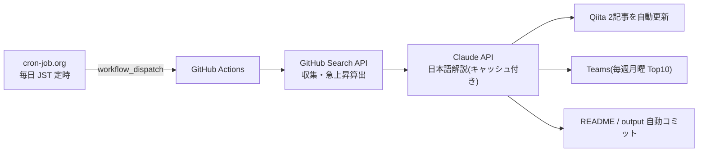

# Claude Code向けMCPツール候補ランキング

GitHub Search APIを使って、Claude Code周辺で活用候補になりそうなMCP関連リポジトリを定期収集するリポジトリです。

> 注意: この一覧は「Claude Codeでの動作」を保証するものではありません。  
> GitHub上のリポジトリ名・説明文・READMEなどに含まれる情報をもとに、MCP関連ツール候補を探すための入口として利用します。

## 仕組み(定常自律運転)

このランキングは cron-job.org → GitHub Actions → Claude API → Qiita / Teams のパイプラインで、毎日無人更新されています。



- 仕組みの詳細と**ライブ稼働ステータス**: [定常自律運転ページ](https://takanobusano.github.io/mcp-github-ranking/)
- 作り方の解説記事: [パイプライン編](https://qiita.com/4q_sano/items/913e93ee5cc2731561fc) / [cron-job.org 完全自動化編](https://qiita.com/4q_sano/items/1bc5e0669a8f0166936c)
<!-- MCP_REPOS_START -->
最終更新: **2026-07-14 08:17:10 JST**

MCP関連リポジトリに加え、Claude Code周辺で活用候補になりそうな関連ツールをGitHub Search APIで毎日自動収集してランキング化しています。

Stars / Forks の差分は、UTC基準の前日データ（2026-07-12）との差分です。
CSVには最大500件を保存し、本文では上位100件を表示しています。

> 注意: この一覧はClaude Codeでの動作を保証するものではありません。  
> MCP関連ツールまたはClaude Code関連ツール候補を探すための入口として利用してください。

# 注目MCP・関連ツール候補ランキング

## 1位 [public-apis/public-apis](https://github.com/public-apis/public-apis)

A collective list of free APIs

⭐ **449,719 Stars**（+343）　🍴 **49,423 Forks**（+37）　/　🟢 **1,547 Open Issues**　/　Python

Topics: `api` / `apis` / `dataset` / `development` / `free` / `list` / `lists` / `open-source`

## 2位 [obra/superpowers](https://github.com/obra/superpowers)

An agentic skills framework & software development methodology that works.

⭐ **253,853 Stars**（+851）　🍴 **22,681 Forks**（+86）　/　🟢 **329 Open Issues**　/　Shell

Topics: `ai` / `brainstorming` / `coding` / `obra` / `sdlc` / `skills` / `subagent-driven-development` / `superpowers`

## 3位 [affaan-m/ECC](https://github.com/affaan-m/ECC)

The agent harness performance optimization system. Skills, instincts, memory, security, and research-first development for Claude Code, Codex, Opencode, Cursor and beyond.

⭐ **229,250 Stars**（+314）　🍴 **35,119 Forks**（+23）　/　🟢 **98 Open Issues**　/　JavaScript

Topics: `ai-agents` / `anthropic` / `claude` / `claude-code` / `developer-tools` / `llm` / `mcp` / `productivity`

## 4位 [NousResearch/hermes-agent](https://github.com/NousResearch/hermes-agent)

The agent that grows with you

⭐ **214,248 Stars**（+524）　🍴 **39,797 Forks**（+174）　/　🟢 **25,621 Open Issues**　/　Python

Topics: `ai` / `ai-agent` / `ai-agents` / `anthropic` / `chatgpt` / `claude` / `claude-code` / `clawdbot`

## 5位 [ultraworkers/claw-code](https://github.com/ultraworkers/claw-code)

An agent-managed museum exhibit, built in Rust with Gajae-Code / LazyCodex — developed and maintained with no human intervention.

⭐ **194,755 Stars**（+17）　🍴 **109,700 Forks**（-34）　/　🟢 **31 Open Issues**　/　Rust

Topics: `topicなし`

## 6位 [multica-ai/andrej-karpathy-skills](https://github.com/multica-ai/andrej-karpathy-skills)

A single CLAUDE.md file to improve Claude Code behavior, derived from Andrej Karpathy's observations on LLM coding pitfalls.

⭐ **191,619 Stars**（+409）　🍴 **19,669 Forks**（+45）　/　🟢 **125 Open Issues**　/　不明

Topics: `topicなし`

## 7位 [ollama/ollama](https://github.com/ollama/ollama)

Get up and running with Kimi-K2.6, GLM-5.1, MiniMax, DeepSeek, gpt-oss, Qwen, Gemma and other models.

⭐ **176,060 Stars**（+62）　🍴 **16,954 Forks**（-5）　/　🟢 **3,427 Open Issues**　/　Go

Topics: `deepseek` / `gemma` / `gemma3` / `glm` / `go` / `golang` / `gpt-oss` / `llama`

## 8位 [mattpocock/skills](https://github.com/mattpocock/skills)

Skills for Real Engineers. Straight from my .claude directory.

⭐ **168,295 Stars**（+1,545）　🍴 **14,494 Forks**（+122）　/　🟢 **151 Open Issues**　/　Shell

Topics: `topicなし`

## 9位 [anthropics/skills](https://github.com/anthropics/skills)

Public repository for Agent Skills

⭐ **160,863 Stars**（+292）　🍴 **18,979 Forks**（+25）　/　🟢 **1,020 Open Issues**　/　Python

Topics: `agent-skills`

## 10位 [langflow-ai/langflow](https://github.com/langflow-ai/langflow)

Langflow is a powerful tool for building and deploying AI-powered agents and workflows.

⭐ **151,826 Stars**（+48）　🍴 **9,672 Forks**（+7）　/　🟢 **976 Open Issues**　/　Python

Topics: `agents` / `chatgpt` / `generative-ai` / `large-language-models` / `multiagent` / `react-flow`

## 11位 [firecrawl/firecrawl](https://github.com/firecrawl/firecrawl)

The API to search, scrape, and interact with the web at scale. 🔥

⭐ **150,409 Stars**（+535）　🍴 **8,594 Forks**（+21）　/　🟢 **395 Open Issues**　/　TypeScript

Topics: `ai` / `ai-agents` / `ai-crawler` / `ai-scraping` / `ai-search` / `crawler` / `data-extraction` / `html-to-markdown`

## 12位 [x1xhlol/system-prompts-and-models-of-ai-tools](https://github.com/x1xhlol/system-prompts-and-models-of-ai-tools)

FULL Augment Code, Claude Code, Cluely, CodeBuddy, Comet, Cursor, Devin AI, Junie, Kiro, Leap.new, Lovable, Manus, NotionAI, Orchids.app, Perplexity, Poke, Qoder, Replit, Same.dev, Trae, Traycer AI, VSCode Agent, Warp.dev, Windsurf, Xcode, Z.ai Code, Dia & v0. (And other Open Sourced) System Prompts, Internal Tools & AI Models

⭐ **141,887 Stars**（+48）　🍴 **34,806 Forks**（-3）　/　🟢 **156 Open Issues**　/　不明

Topics: `ai` / `bolt` / `cluely` / `copilot` / `cursor` / `cursorai` / `devin` / `github-copilot`

## 13位 [anthropics/claude-code](https://github.com/anthropics/claude-code)

Claude Code is an agentic coding tool that lives in your terminal, understands your codebase, and helps you code faster by executing routine tasks, explaining complex code, and handling git workflows - all through natural language commands.

⭐ **137,725 Stars**（+156）　🍴 **22,215 Forks**（±0）　/　🟢 **11,309 Open Issues**　/　Python

Topics: `topicなし`

## 14位 [msitarzewski/agency-agents](https://github.com/msitarzewski/agency-agents)

A complete AI agency at your fingertips - From frontend wizards to Reddit community ninjas, from whimsy injectors to reality checkers. Each agent is a specialized expert with personality, processes, and proven deliverables.

⭐ **131,120 Stars**（+340）　🍴 **21,520 Forks**（+60）　/　🟢 **100 Open Issues**　/　Shell

Topics: `topicなし`

## 15位 [garrytan/gstack](https://github.com/garrytan/gstack)

Use Garry Tan's exact Claude Code setup: 23 opinionated tools that serve as CEO, Designer, Eng Manager, Release Manager, Doc Engineer, and QA

⭐ **121,683 Stars**（+209）　🍴 **18,188 Forks**（+8）　/　🟢 **839 Open Issues**　/　TypeScript

Topics: `topicなし`

## 16位 [github/spec-kit](https://github.com/github/spec-kit)

💫 Toolkit to help you get started with Spec-Driven Development

⭐ **120,560 Stars**（+592）　🍴 **10,690 Forks**（+39）　/　🟢 **350 Open Issues**　/　Python

Topics: `ai` / `copilot` / `development` / `engineering` / `prd` / `spec` / `spec-driven`

## 17位 [farion1231/cc-switch](https://github.com/farion1231/cc-switch)

A cross-platform desktop All-in-One assistant for Claude Code, Codex, OpenCode, OpenClaw, Gemini CLI & Hermes Agent. Only official website: ccswitch.io

⭐ **116,792 Stars**（+482）　🍴 **7,811 Forks**（+11）　/　🟢 **1,928 Open Issues**　/　Rust

Topics: `ai-tools` / `claude-code` / `codex` / `desktop-app` / `hermes` / `hermes-agent` / `mcp` / `minimax`

## 18位 [google-gemini/gemini-cli](https://github.com/google-gemini/gemini-cli)

An open-source AI agent that brings the power of Gemini directly into your terminal.

⭐ **105,968 Stars**（+32）　🍴 **14,247 Forks**（-7）　/　🟢 **1,380 Open Issues**　/　TypeScript

Topics: `ai` / `ai-agents` / `cli` / `gemini` / `gemini-api` / `mcp-client` / `mcp-server`

## 19位 [nextlevelbuilder/ui-ux-pro-max-skill](https://github.com/nextlevelbuilder/ui-ux-pro-max-skill)

An AI SKILL that provide design intelligence for building professional UI/UX multiple platforms

⭐ **105,155 Stars**（+404）　🍴 **11,147 Forks**（+51）　/　🟢 **128 Open Issues**　/　Python

Topics: `ai-skills` / `antigravity` / `claude` / `claude-code` / `codex` / `command-line` / `copilot` / `cursor-ai`

## 20位 [browser-use/browser-use](https://github.com/browser-use/browser-use)

🌐 Make websites accessible for AI agents. Automate tasks online with ease.

⭐ **104,580 Stars**（+181）　🍴 **11,525 Forks**（+21）　/　🟢 **310 Open Issues**　/　Python

Topics: `ai-agents` / `ai-tools` / `browser-automation` / `browser-use` / `llm` / `playwright` / `python`

## 21位 [harry0703/MoneyPrinterTurbo](https://github.com/harry0703/MoneyPrinterTurbo)

利用AI大模型，一键生成高清短视频 Generate short videos with one click using AI LLM.

⭐ **97,192 Stars**（+256）　🍴 **14,348 Forks**（+35）　/　🟢 **40 Open Issues**　/　Python

Topics: `ai` / `automation` / `chatgpt` / `moviepy` / `python` / `shortvideo` / `tiktok`

## 22位 [puppeteer/puppeteer](https://github.com/puppeteer/puppeteer)

JavaScript API for Chrome and Firefox

⭐ **95,418 Stars**（+1）　🍴 **9,640 Forks**（-8）　/　🟢 **267 Open Issues**　/　TypeScript

Topics: `automation` / `chrome` / `chromium` / `developer-tools` / `firefox` / `headless-chrome` / `node-module` / `testing`

## 23位 [TauricResearch/TradingAgents](https://github.com/TauricResearch/TradingAgents)

TradingAgents: Multi-Agents LLM Financial Trading Framework

⭐ **92,816 Stars**（+219）　🍴 **17,928 Forks**（+17）　/　🟢 **299 Open Issues**　/　Python

Topics: `agent` / `finance` / `llm` / `multiagent` / `trading`

## 24位 [microsoft/playwright](https://github.com/microsoft/playwright)

Playwright is a framework for Web Testing and Automation. It allows testing Chromium, Firefox and WebKit with a single API.

⭐ **92,757 Stars**（+71）　🍴 **6,081 Forks**（-1）　/　🟢 **172 Open Issues**　/　TypeScript

Topics: `automation` / `chrome` / `chromium` / `e2e-testing` / `electron` / `end-to-end-testing` / `firefox` / `javascript`

## 25位 [JuliusBrussee/caveman](https://github.com/JuliusBrussee/caveman)

🪨 why use many token when few token do trick — Claude Code skill that cuts 65% of tokens by talking like caveman

⭐ **89,039 Stars**（+522）　🍴 **5,114 Forks**（+27）　/　🟢 **393 Open Issues**　/　JavaScript

Topics: `ai` / `anthropic` / `caveman` / `claude` / `claude-code` / `llm` / `meme` / `prompt-engineering`

## 26位 [ChatGPTNextWeb/NextChat](https://github.com/ChatGPTNextWeb/NextChat)

✨ Light and Fast AI Assistant. Support: Web \| iOS \| MacOS \| Android \|  Linux \| Windows

⭐ **88,462 Stars**（+7）　🍴 **59,443 Forks**（-16）　/　🟢 **841 Open Issues**　/　TypeScript

Topics: `calclaude` / `chatgpt` / `claude` / `cross-platform` / `desktop` / `fe` / `gemini` / `gemini-pro`

## 27位 [modelcontextprotocol/servers](https://github.com/modelcontextprotocol/servers)

Model Context Protocol Servers

⭐ **88,419 Stars**（+41）　🍴 **11,206 Forks**（-14）　/　🟢 **666 Open Issues**　/　TypeScript

Topics: `topicなし`

## 28位 [thedotmack/claude-mem](https://github.com/thedotmack/claude-mem)

Persistent Context Across Sessions for Every Agent –  Captures everything your agent does during sessions, compresses it with AI, and injects relevant context back into future sessions. Works with Claude Code, OpenClaw, Codex, Gemini, Hermes, Copilot, OpenCode + More

⭐ **87,109 Stars**（+139）　🍴 **7,536 Forks**（+22）　/　🟢 **235 Open Issues**　/　JavaScript

Topics: `ai` / `ai-agents` / `ai-memory` / `anthropic` / `artificial-intelligence` / `chromadb` / `claude` / `claude-agent-sdk`

## 29位 [laravel/laravel](https://github.com/laravel/laravel)

Laravel is a web application framework with expressive, elegant syntax. We’ve already laid the foundation for your next big idea — freeing you to create without sweating the small things.

⭐ **84,721 Stars**（-5）　🍴 **24,888 Forks**（-7）　/　🟢 **31 Open Issues**　/　Blade

Topics: `framework` / `laravel` / `php`

## 30位 [Graphify-Labs/graphify](https://github.com/Graphify-Labs/graphify)

AI coding assistant skill (Claude Code, Codex, OpenCode, Cursor, Gemini CLI, and more). Turn any folder of code, SQL schemas, R scripts, shell scripts, docs, papers, images, or videos into a queryable knowledge graph. App code + database schema + infrastructure in one graph.

⭐ **84,621 Stars**（+1,388）　🍴 **8,339 Forks**（+129）　/　🟢 **506 Open Issues**　/　Python

Topics: `antigravity` / `claude-code` / `codex` / `gemini` / `graphrag` / `knowledge-graph` / `leiden` / `openclaw`

## 31位 [DietrichGebert/ponytail](https://github.com/DietrichGebert/ponytail)

Makes your AI agent think like the laziest senior dev in the room. The best code is the code you never wrote.

⭐ **82,281 Stars**（+958）　🍴 **4,457 Forks**（+67）　/　🟢 **66 Open Issues**　/　JavaScript

Topics: `agent-skills` / `ai-agents` / `claude` / `claude-code` / `claude-code-plugin` / `cursor-rules` / `developer-tools` / `llm`

## 32位 [OpenHands/OpenHands](https://github.com/OpenHands/OpenHands)

🙌 OpenHands: AI-Driven Development

⭐ **80,671 Stars**（+99）　🍴 **10,295 Forks**（+12）　/　🟢 **357 Open Issues**　/　Python

Topics: `agent` / `artificial-intelligence` / `chatgpt` / `claude-ai` / `cli` / `developer-tools` / `gpt` / `llm`

## 33位 [addyosmani/agent-skills](https://github.com/addyosmani/agent-skills)

Production-grade engineering skills for AI coding agents.

⭐ **77,913 Stars**（+331）　🍴 **8,366 Forks**（+36）　/　🟢 **133 Open Issues**　/　JavaScript

Topics: `agent-skills` / `antigravity` / `claude-code` / `codex` / `cursor` / `skills`

## 34位 [nexu-io/open-design](https://github.com/nexu-io/open-design)

🎨 The open-source Claude Design alternative. 🖥️ Local-first desktop app. 🖼️ Your coding agent becomes the design engine: prototypes, landing pages, dashboards,...

⭐ **77,845 Stars**（+288）　🍴 **8,924 Forks**（+44）　/　🟢 **653 Open Issues**　/　TypeScript

Topics: `agent-skills` / `ai-agents` / `ai-design` / `byok` / `claude-code-for-design` / `claude-design` / `codex-design` / `coding-agents`

## 35位 [bytedance/deer-flow](https://github.com/bytedance/deer-flow)

An open-source long-horizon SuperAgent harness that researches, codes, and creates. With the help of sandboxes, memories, tools, skill, subagents and message gateway, it handles different levels of tasks that could take minutes to hours.

⭐ **76,939 Stars**（+90）　🍴 **10,448 Forks**（+5）　/　🟢 **970 Open Issues**　/　Python

Topics: `agent` / `agentic` / `agentic-framework` / `agentic-workflow` / `ai` / `ai-agents` / `deep-research` / `harness`

## 36位 [opendatalab/MinerU](https://github.com/opendatalab/MinerU)

Transforms complex documents like PDFs and Office docs into LLM-ready markdown/JSON for your Agentic workflows.

⭐ **74,463 Stars**（+109）　🍴 **6,250 Forks**（+6）　/　🟢 **33 Open Issues**　/　Python

Topics: `ai4science` / `document-analysis` / `docx` / `extract-data` / `layout-analysis` / `ocr` / `parser` / `pdf`

## 37位 [Egonex-AI/Understand-Anything](https://github.com/Egonex-AI/Understand-Anything)

Graphs that teach > graphs that impress. Turn any code into an interactive knowledge graph you can explore, search, and ask questions about. Works with Claude Code, Codex, Cursor, Copilot, Gemini CLI, and more.

⭐ **73,808 Stars**（+203）　🍴 **6,149 Forks**（+14）　/　🟢 **254 Open Issues**　/　TypeScript

Topics: `antigravity-skills` / `business-knowledge` / `claude-code` / `claude-skills` / `codebase-analysis` / `codex` / `codex-skills` / `developer-tools-ai-agent`

## 38位 [paperclipai/paperclip](https://github.com/paperclipai/paperclip)

The open-source app everyone uses to manage agents at work

⭐ **73,561 Stars**（+106）　🍴 **13,700 Forks**（+10）　/　🟢 **5,003 Open Issues**　/　TypeScript

Topics: `topicなし`

## 39位 [abi/screenshot-to-code](https://github.com/abi/screenshot-to-code)

Drop in a screenshot and convert it to clean code (HTML/Tailwind/React/Vue)

⭐ **73,266 Stars**（+9）　🍴 **9,018 Forks**（+1）　/　🟢 **123 Open Issues**　/　Python

Topics: `topicなし`

## 40位 [Eugeny/tabby](https://github.com/Eugeny/tabby)

A terminal for a more modern age

⭐ **73,221 Stars**（+25）　🍴 **4,154 Forks**（+5）　/　🟢 **2,774 Open Issues**　/　TypeScript

Topics: `serial` / `ssh-client` / `telnet-client` / `terminal` / `terminal-emulators`

## 41位 [thedaviddias/Front-End-Checklist](https://github.com/thedaviddias/Front-End-Checklist)

🗂 The essential checklist for modern web development, for humans and AI agents

⭐ **73,205 Stars**（+12）　🍴 **6,651 Forks**（+1）　/　🟢 **3 Open Issues**　/　MDX

Topics: `ai-agent` / `ai-agents` / `checklist` / `css` / `front-end-developer-tool` / `front-end-development` / `frontend` / `guidelines`

## 42位 [unclecode/crawl4ai](https://github.com/unclecode/crawl4ai)

🚀🤖 Crawl4AI: Open-source LLM Friendly Web Crawler & Scraper. Don't be shy, join here:

⭐ **72,544 Stars**（+96）　🍴 **7,441 Forks**（+17）　/　🟢 **103 Open Issues**　/　Python

Topics: `topicなし`

## 43位 [daytonaio/daytona](https://github.com/daytonaio/daytona)

Daytona is a Secure and Elastic Infrastructure for Running AI-Generated Code

⭐ **72,199 Stars**（-4）　🍴 **5,660 Forks**（-3）　/　🟢 **443 Open Issues**　/　不明

Topics: `agentic-workflow` / `ai` / `ai-agents` / `ai-runtime` / `ai-sandboxes` / `code-execution` / `code-interpreter` / `developer-tools`

## 44位 [shareAI-lab/learn-claude-code](https://github.com/shareAI-lab/learn-claude-code)

Bash is all you need -  A nano claude code–like 「agent harness」, built from 0 to 1

⭐ **70,885 Stars**（+130）　🍴 **11,532 Forks**（+13）　/　🟢 **63 Open Issues**　/　Python

Topics: `agent` / `agent-development` / `ai-agent` / `claude` / `claude-code` / `educational` / `llm` / `python`

## 45位 [rtk-ai/rtk](https://github.com/rtk-ai/rtk)

CLI proxy that reduces LLM token consumption by 60-90% on common dev commands. Single Rust binary, zero dependencies

⭐ **70,805 Stars**（+253）　🍴 **4,388 Forks**（±0）　/　🟢 **1,580 Open Issues**　/　Rust

Topics: `agentic-coding` / `ai-coding` / `anthropic` / `claude-code` / `cli` / `command-line-tool` / `cost-reduction` / `developer-tools`

## 46位 [OpenBB-finance/OpenBB](https://github.com/OpenBB-finance/OpenBB)

Open Data Platform for analysts, quants and AI agents.

⭐ **70,531 Stars**（+39）　🍴 **7,161 Forks**（+6）　/　🟢 **75 Open Issues**　/　Python

Topics: `ai` / `crypto` / `derivatives` / `economics` / `equity` / `finance` / `fixed-income` / `machine-learning`

## 47位 [D4Vinci/Scrapling](https://github.com/D4Vinci/Scrapling)

🕷️ An adaptive Web Scraping framework that handles everything from a single request to a full-scale crawl!

⭐ **69,400 Stars**（+111）　🍴 **6,870 Forks**（+12）　/　🟢 **3 Open Issues**　/　Python

Topics: `ai` / `ai-scraping` / `automation` / `crawler` / `crawling` / `crawling-python` / `data` / `data-extraction`

## 48位 [unslothai/unsloth](https://github.com/unslothai/unsloth)

Unsloth Studio is a web UI for training and running open models like Gemma 4, Qwen3.6, DeepSeek, gpt-oss locally.

⭐ **68,135 Stars**（+73）　🍴 **6,129 Forks**（+2）　/　🟢 **1,063 Open Issues**　/　Python

Topics: `agent` / `deepseek` / `fine-tuning` / `gemma` / `gemma3` / `gpt-oss` / `llama` / `llama3`

## 49位 [xtekky/gpt4free](https://github.com/xtekky/gpt4free)

The official gpt4free repository \| various collection of powerful language models \| opus 4.6 gpt 5.3 kimi 2.5 deepseek v3.2 gemini 3

⭐ **66,471 Stars**（+4）　🍴 **13,538 Forks**（-10）　/　🟢 **5 Open Issues**　/　Python

Topics: `chatbot` / `chatbots` / `chatgpt` / `chatgpt-4` / `chatgpt-api` / `chatgpt-free` / `chatgpt4` / `deepseek`

## 50位 [bradtraversy/design-resources-for-developers](https://github.com/bradtraversy/design-resources-for-developers)

Curated list of design and UI resources from stock photos, web templates, CSS frameworks, UI libraries, tools and much more

⭐ **66,390 Stars**（+7）　🍴 **12,108 Forks**（-1）　/　🟢 **51 Open Issues**　/　不明

Topics: `topicなし`

## 51位 [OpenCut-app/OpenCut](https://github.com/OpenCut-app/OpenCut)

The open-source CapCut alternative

⭐ **66,144 Stars**（+2,426）　🍴 **6,976 Forks**（+146）　/　🟢 **333 Open Issues**　/　TypeScript

Topics: `editor` / `oss` / `videoeditor`

## 52位 [code-yeongyu/oh-my-openagent](https://github.com/code-yeongyu/oh-my-openagent)

omo/lazycodex: The coding agent for tokenmaxxers;the one and only agent harness for complex codebases. For your Codex, for your OpenCode

⭐ **65,695 Stars**（+67）　🍴 **5,359 Forks**（+11）　/　🟢 **897 Open Issues**　/　TypeScript

Topics: `ai` / `ai-agents` / `anthropic` / `chatgpt` / `claude` / `claude-skills` / `codex` / `cursor`

## 53位 [openinterpreter/openinterpreter](https://github.com/openinterpreter/openinterpreter)

A lightweight coding agent, optimized for open models like GLM, Deepseek, and Kimi

⭐ **64,652 Stars**（+296）　🍴 **5,615 Forks**（+7）　/　🟢 **276 Open Issues**　/　Rust

Topics: `coding-agent` / `deepseek` / `interpreter` / `kimi` / `qwen` / `rust` / `tui`

## 54位 [cline/cline](https://github.com/cline/cline)

Autonomous coding agent as an SDK, IDE extension, or CLI assistant.

⭐ **64,624 Stars**（+46）　🍴 **6,907 Forks**（+6）　/　🟢 **1,250 Open Issues**　/　TypeScript

Topics: `topicなし`

## 55位 [ruvnet/ruflo](https://github.com/ruvnet/ruflo)

🌊 The leading agent meta-harness. Deploy intelligent multi-player swarms, coordinate autonomous workflows, and build conversational AI systems. Features adaptiv...

⭐ **64,322 Stars**（+144）　🍴 **7,620 Forks**（+20）　/　🟢 **778 Open Issues**　/　TypeScript

Topics: `agentic-ai` / `agentic-framework` / `agentic-workflow` / `agents` / `ai-agents` / `ai-assistant` / `ai-coding` / `ai-skills`

## 56位 [warpdotdev/warp](https://github.com/warpdotdev/warp)

Warp is an agentic development environment, born out of the terminal.

⭐ **63,134 Stars**（+45）　🍴 **5,219 Forks**（-13）　/　🟢 **4,590 Open Issues**　/　Rust

Topics: `bash` / `linux` / `macos` / `rust` / `shell` / `terminal` / `wasm` / `zsh`

## 57位 [docling-project/docling](https://github.com/docling-project/docling)

Get your documents ready for gen AI

⭐ **63,089 Stars**（+45）　🍴 **4,448 Forks**（+3）　/　🟢 **936 Open Issues**　/　Python

Topics: `ai` / `convert` / `document-parser` / `document-parsing` / `documents` / `docx` / `html` / `markdown`

## 58位 [Leonxlnx/taste-skill](https://github.com/Leonxlnx/taste-skill)

Taste-Skill - gives your AI good taste. stops the AI from generating boring, generic slop

⭐ **62,930 Stars**（+457）　🍴 **4,443 Forks**（+32）　/　🟢 **45 Open Issues**　/　JavaScript

Topics: `agent` / `ai` / `claude` / `claude-code` / `codex` / `coding` / `design` / `frontend`

## 59位 [shanraisshan/claude-code-best-practice](https://github.com/shanraisshan/claude-code-best-practice)

from vibe coding to agentic engineering - practice makes claude perfect

⭐ **62,535 Stars**（+50）　🍴 **6,255 Forks**（+6）　/　🟢 **14 Open Issues**　/　HTML

Topics: `agentic-ai` / `agentic-coding` / `agentic-engineering` / `agentic-workflow` / `ai` / `ai-agents` / `anthropic` / `best-practices`

## 60位 [koala73/worldmonitor](https://github.com/koala73/worldmonitor)

Real-time global intelligence dashboard. AI-powered news aggregation, geopolitical monitoring, and infrastructure tracking in a unified situational awareness interface

⭐ **61,820 Stars**（+53）　🍴 **9,626 Forks**（-7）　/　🟢 **207 Open Issues**　/　TypeScript

Topics: `agent` / `ai` / `dashboard` / `geopolitics` / `mcp` / `mcp-server` / `monitoring` / `news`

## 61位 [mem0ai/mem0](https://github.com/mem0ai/mem0)

Universal memory layer for AI Agents

⭐ **60,749 Stars**（+79）　🍴 **7,074 Forks**（+11）　/　🟢 **586 Open Issues**　/　TypeScript

Topics: `agents` / `ai` / `ai-agents` / `application` / `chatbots` / `chatgpt` / `genai` / `llm`

## 62位 [Fission-AI/OpenSpec](https://github.com/Fission-AI/OpenSpec)

Spec-driven development (SDD) for AI coding assistants.

⭐ **60,608 Stars**（+275）　🍴 **4,201 Forks**（+12）　/　🟢 **464 Open Issues**　/　TypeScript

Topics: `ai` / `context-engineering` / `engineering` / `planning` / `prd` / `sdd` / `sdlc` / `spec`

## 63位 [sansan0/TrendRadar](https://github.com/sansan0/TrendRadar)

⭐AI-driven public opinion & trend monitor with multi-platform aggregation, RSS, and smart alerts.🎯 告别信息过载，你的 AI 舆情监控助手与热点筛选工具！聚合多平台热点 +  RSS 订阅，支持关键词精准筛选。AI 智能筛...

⭐ **60,527 Stars**（+39）　🍴 **24,790 Forks**（-5）　/　🟢 **49 Open Issues**　/　Python

Topics: `ai` / `bark` / `data-analysis` / `docker` / `hot-news` / `llm` / `mail` / `mcp`

## 64位 [microsoft/autogen](https://github.com/microsoft/autogen)

A programming framework for agentic AI

⭐ **59,710 Stars**（+30）　🍴 **8,986 Forks**（+1）　/　🟢 **948 Open Issues**　/　Python

Topics: `agentic` / `agentic-agi` / `agents` / `ai` / `autogen` / `autogen-ecosystem` / `chatgpt` / `framework`

## 65位 [colbymchenry/codegraph](https://github.com/colbymchenry/codegraph)

Pre-indexed code knowledge graph, auto syncs on code changes, for Claude Code, Codex, Gemini, Cursor, OpenCode, AntiGravity, Kiro, and Hermes Agent — fewer tokens, fewer tool calls, 100% local

⭐ **59,681 Stars**（+263）　🍴 **3,720 Forks**（+23）　/　🟢 **318 Open Issues**　/　TypeScript

Topics: `topicなし`

## 66位 [upstash/context7](https://github.com/upstash/context7)

Context7 Platform -- Up-to-date code documentation for LLMs and AI code editors

⭐ **59,054 Stars**（+67）　🍴 **2,784 Forks**（+8）　/　🟢 **22 Open Issues**　/　TypeScript

Topics: `llm` / `mcp` / `mcp-server` / `vibe-coding`

## 67位 [headroomlabs-ai/headroom](https://github.com/headroomlabs-ai/headroom)

Compress tool outputs, logs, files, and RAG chunks before they reach the LLM. 60-95% fewer tokens, same answers. Library, proxy, MCP server.

⭐ **58,959 Stars**（+221）　🍴 **4,366 Forks**（+25）　/　🟢 **518 Open Issues**　/　Python

Topics: `agent` / `ai` / `anthropic` / `claude-code` / `compression` / `context-engineering` / `context-window` / `cursor`

## 68位 [meilisearch/meilisearch](https://github.com/meilisearch/meilisearch)

A lightning-fast search engine API bringing AI-powered hybrid search to your sites and applications.

⭐ **58,560 Stars**（+31）　🍴 **2,617 Forks**（+5）　/　🟢 **312 Open Issues**　/　Rust

Topics: `ai` / `api` / `app-search` / `database` / `enterprise-search` / `faceting` / `full-text-search` / `fuzzy-search`

## 69位 [coollabsio/coolify](https://github.com/coollabsio/coolify)

An open-source, self-hostable PaaS alternative to Vercel, Heroku & Netlify that lets you easily deploy static sites, databases, full-stack applications and 280+ one-click services on your own servers.

⭐ **58,439 Stars**（+80）　🍴 **5,009 Forks**（-3）　/　🟢 **817 Open Issues**　/　PHP

Topics: `coolify` / `databases` / `deployment` / `docker` / `docker-compose` / `inertiajs` / `laravel` / `mariadb`

## 70位 [zylon-ai/private-gpt](https://github.com/zylon-ai/private-gpt)

Complete API layer for private AI applications on local models: RAG, skills, tools, MCP, text-to-sql, and more. Works with any OpenAI-compatible inference server.

⭐ **57,332 Stars**（+2）　🍴 **7,597 Forks**（±0）　/　🟢 **5 Open Issues**　/　Python

Topics: `ai` / `ai-tools` / `on-premise`

## 71位 [MemPalace/mempalace](https://github.com/MemPalace/mempalace)

The best-benchmarked open-source AI memory system. And it's free.

⭐ **57,298 Stars**（+35）　🍴 **7,391 Forks**（±0）　/　🟢 **619 Open Issues**　/　Python

Topics: `ai` / `chromadb` / `llm` / `mcp` / `memory` / `python`

## 72位 [NanmiCoder/MediaCrawler](https://github.com/NanmiCoder/MediaCrawler)

小红书笔记 \| 评论爬虫、抖音视频 \| 评论爬虫、快手视频 \| 评论爬虫、B 站视频 ｜ 评论爬虫、微博帖子 ｜ 评论爬虫、百度贴吧帖子 ｜ 百度贴吧评论回复爬虫  \| 知乎问答文章｜评论爬虫

⭐ **56,289 Stars**（+144）　🍴 **11,332 Forks**（+20）　/　🟢 **176 Open Issues**　/　Python

Topics: `topicなし`

## 73位 [Panniantong/Agent-Reach](https://github.com/Panniantong/Agent-Reach)

Give your AI agent eyes to see the entire internet. Read & search Twitter, Reddit, YouTube, GitHub, Bilibili, XiaoHongShu — one CLI, zero API fees.

⭐ **55,758 Stars**（+440）　🍴 **4,604 Forks**（+44）　/　🟢 **150 Open Issues**　/　Python

Topics: `agent-infrastructure` / `ai-agent` / `ai-search` / `automation` / `bilibili` / `claude-code` / `cli` / `cursor`

## 74位 [penpot/penpot](https://github.com/penpot/penpot)

Penpot: The open-source design platform for Product teams that need scalable collaboration.

⭐ **55,741 Stars**（+248）　🍴 **3,665 Forks**（+22）　/　🟢 **713 Open Issues**　/　Clojure

Topics: `clojure` / `clojurescript` / `design` / `prototyping` / `ui` / `ux-design` / `ux-experience`

## 75位 [crewAIInc/crewAI](https://github.com/crewAIInc/crewAI)

Framework for orchestrating role-playing, autonomous AI agents. By fostering collaborative intelligence, CrewAI empowers agents to work together seamlessly, tackling complex tasks.

⭐ **55,456 Stars**（+65）　🍴 **7,818 Forks**（+4）　/　🟢 **642 Open Issues**　/　Python

Topics: `agents` / `ai` / `ai-agents` / `aiagentframework` / `llms`

## 76位 [BerriAI/litellm](https://github.com/BerriAI/litellm)

Python SDK, Proxy Server (AI Gateway) to call 100+ LLM APIs in OpenAI (or native) format, with cost tracking, guardrails, loadbalancing and logging. [Bedrock, Azure, OpenAI, VertexAI, Cohere, Anthropic, Sagemaker, HuggingFace, VLLM, NVIDIA NIM]

⭐ **53,476 Stars**（+125）　🍴 **9,735 Forks**（+46）　/　🟢 **3,879 Open Issues**　/　Python

Topics: `ai-gateway` / `anthropic` / `azure-openai` / `bedrock` / `gateway` / `langchain` / `litellm` / `llm`

## 77位 [mvanhorn/last30days-skill](https://github.com/mvanhorn/last30days-skill)

AI agent skill that researches any topic across Reddit, X, YouTube, HN, Polymarket, and the web - then synthesizes a grounded summary

⭐ **51,951 Stars**（+234）　🍴 **4,510 Forks**（+28）　/　🟢 **86 Open Issues**　/　Python

Topics: `ai-prompts` / `ai-skill` / `bluesky` / `claude` / `claude-code` / `clawhub` / `deep-research` / `hackernews`

## 78位 [1c7/chinese-independent-developer](https://github.com/1c7/chinese-independent-developer)

👩🏿‍💻👨🏾‍💻👩🏼‍💻👨🏽‍💻👩🏻‍💻中国独立开发者项目列表 -- 分享大家都在做什么

⭐ **51,916 Stars**（+1,960）　🍴 **4,556 Forks**（+222）　/　🟢 **2 Open Issues**　/　不明

Topics: `china` / `indie` / `indie-developer`

## 79位 [charlax/professional-programming](https://github.com/charlax/professional-programming)

A collection of learning resources for curious software engineers

⭐ **51,255 Stars**（+1）　🍴 **4,000 Forks**（-1）　/　🟢 **4 Open Issues**　/　Python

Topics: `architecture` / `computer-science` / `concepts` / `documentation` / `engineer` / `learning` / `lessons-learned` / `professional`

## 80位 [aaif-goose/goose](https://github.com/aaif-goose/goose)

an open source, extensible AI agent that goes beyond code suggestions - install, execute, edit, and test with any LLM

⭐ **51,170 Stars**（+51）　🍴 **5,680 Forks**（-3）　/　🟢 **313 Open Issues**　/　Rust

Topics: `acp` / `ai` / `ai-agents` / `mcp`

## 81位 [bmad-code-org/BMAD-METHOD](https://github.com/bmad-code-org/BMAD-METHOD)

Breakthrough Method for Agile Ai Driven Development

⭐ **50,528 Stars**（+122）　🍴 **5,814 Forks**（+10）　/　🟢 **90 Open Issues**　/　JavaScript

Topics: `topicなし`

## 82位 [mudler/LocalAI](https://github.com/mudler/LocalAI)

LocalAI is the open-source AI engine. Run any model - LLMs, vision, voice, image, video - on any hardware. No GPU required.

⭐ **47,525 Stars**（+18）　🍴 **4,230 Forks**（±0）　/　🟢 **215 Open Issues**　/　Go

Topics: `agents` / `ai` / `api` / `audio-generation` / `decentralized` / `distributed` / `image-generation` / `libp2p`

## 83位 [oobabooga/textgen](https://github.com/oobabooga/textgen)

Open-source desktop app for local LLMs. Text, vision, tool-calling, OpenAI/Anthropic-compatible API. 100% private.

⭐ **47,446 Stars**（+1）　🍴 **5,983 Forks**（-5）　/　🟢 **826 Open Issues**　/　Python

Topics: `topicなし`

## 84位 [prisma/prisma](https://github.com/prisma/prisma)

Next-generation ORM for Node.js & TypeScript \| PostgreSQL, MySQL, MariaDB, SQL Server, SQLite, MongoDB and CockroachDB

⭐ **47,340 Stars**（+10）　🍴 **2,479 Forks**（+1）　/　🟢 **2,658 Open Issues**　/　TypeScript

Topics: `cockroachdb` / `database` / `javascript` / `mariadb` / `mongo` / `mongodb` / `mongodb-orm` / `mssql`

## 85位 [GitHubDaily/GitHubDaily](https://github.com/GitHubDaily/GitHubDaily)

坚持分享 GitHub 上高质量、有趣实用的开源技术教程、开发者工具、编程网站、技术资讯。A list cool, interesting projects of GitHub.

⭐ **47,062 Stars**（+17）　🍴 **4,655 Forks**（+2）　/　🟢 **700 Open Issues**　/　不明

Topics: `ai` / `algorithms-and-data-structures` / `backend` / `developer-tools` / `development` / `frontend` / `github` / `java`

## 86位 [jeecgboot/JeecgBoot](https://github.com/jeecgboot/JeecgBoot)

【低代码迈入 v2.0】AI低代码平台，AI Skills 一句话生成整个系统；一键生成前后端代码甚至整个模块。 AI Skills 一句话画流程、设计表单、生成报表、大屏。内置 AI应用平台涵盖：AI聊天、知识库、流程编排、MCP插件等，兼容主流大模型。引领AI低代码「Skills 生成 → 在线配置 → 代码生成...

⭐ **47,048 Stars**（+20）　🍴 **16,078 Forks**（-11）　/　🟢 **50 Open Issues**　/　Java

Topics: `activiti` / `agent` / `ai` / `antd` / `claude-code` / `cli` / `codegenerator` / `codex`

## 87位 [serverless/serverless](https://github.com/serverless/serverless)

⚡ Serverless Framework – Effortlessly build apps that auto-scale, incur zero costs when idle, and require minimal maintenance using AWS Lambda and other managed...

⭐ **46,916 Stars**（-1）　🍴 **5,730 Forks**（±0）　/　🟢 **1,221 Open Issues**　/　JavaScript

Topics: `aws` / `aws-dynamodb` / `aws-lambda` / `azure-functions` / `google-cloud-functions` / `microservice` / `serverless` / `serverless-architectures`

## 88位 [ChromeDevTools/chrome-devtools-mcp](https://github.com/ChromeDevTools/chrome-devtools-mcp)

Chrome DevTools for coding agents

⭐ **46,853 Stars**（+88）　🍴 **3,214 Forks**（+13）　/　🟢 **94 Open Issues**　/　TypeScript

Topics: `browser` / `chrome` / `chrome-devtools` / `debugging` / `devtools` / `mcp` / `mcp-server` / `puppeteer`

## 89位 [pbakaus/impeccable](https://github.com/pbakaus/impeccable)

The design language that makes your AI harness better at design.

⭐ **46,336 Stars**（+376）　🍴 **2,804 Forks**（+20）　/　🟢 **28 Open Issues**　/　JavaScript

Topics: `topicなし`

## 90位 [exo-explore/exo](https://github.com/exo-explore/exo)

Run frontier AI locally.

⭐ **46,237 Stars**（+31）　🍴 **3,350 Forks**（+5）　/　🟢 **304 Open Issues**　/　Python

Topics: `topicなし`

## 91位 [apache/airflow](https://github.com/apache/airflow)

Apache Airflow - A platform to programmatically author, schedule, and monitor workflows

⭐ **46,108 Stars**（+9）　🍴 **17,383 Forks**（-3）　/　🟢 **1,694 Open Issues**　/　Python

Topics: `airflow` / `apache` / `apache-airflow` / `automation` / `dag` / `data-engineering` / `data-integration` / `data-orchestrator`

## 92位 [zhayujie/CowAgent](https://github.com/zhayujie/CowAgent)

Open-source super AI assistant & Agent Harness. Plans tasks, runs tools and skills, self-evolves with memory and knowledge. Multi-model, multi-channel. Lightweight, extensible, one-line install. (formerly chatgpt-on-wechat)

⭐ **45,960 Stars**（+14）　🍴 **10,260 Forks**（-1）　/　🟢 **22 Open Issues**　/　Python

Topics: `ai` / `ai-agent` / `ai-agents` / `chatgpt-on-wechat` / `claude` / `claude-code` / `codex` / `cowagent`

## 93位 [KeygraphHQ/shannon](https://github.com/KeygraphHQ/shannon)

Shannon is an autonomous, white-box AI pentester for web applications and APIs. It analyzes your source code, identifies attack vectors, and executes real exploits to prove vulnerabilities before they reach production.

⭐ **45,664 Stars**（+42）　🍴 **5,302 Forks**（+8）　/　🟢 **23 Open Issues**　/　TypeScript

Topics: `penetration-testing` / `pentesting` / `security-audit` / `security-automation` / `security-tools`

## 94位 [HKUDS/CLI-Anything](https://github.com/HKUDS/CLI-Anything)

"CLI-Anything: Making ALL Software Agent-Native" -- CLI-Hub:

⭐ **45,263 Stars**（+61）　🍴 **4,229 Forks**（+4）　/　🟢 **71 Open Issues**　/　Python

Topics: `topicなし`

## 95位 [abhigyanpatwari/GitNexus](https://github.com/abhigyanpatwari/GitNexus)

GitNexus: The Zero-Server Code Intelligence Engine -       GitNexus is a client-side knowledge graph creator that runs entirely in your browser. Drop in a git repository (Github, Gitlab, Azure, Local) or ZIP file, and get an interactive knowledge graph with a built in Graph RAG Agent. Perfect for code exploration

⭐ **44,073 Stars**（+51）　🍴 **4,907 Forks**（+5）　/　🟢 **295 Open Issues**　/　TypeScript

Topics: `topicなし`

## 96位 [janhq/jan](https://github.com/janhq/jan)

Jan is an open source alternative to ChatGPT that runs 100% offline on your computer.

⭐ **43,554 Stars**（+31）　🍴 **2,902 Forks**（+2）　/　🟢 **387 Open Issues**　/　TypeScript

Topics: `chatgpt` / `gpt` / `llamacpp` / `llm` / `localai` / `open-source` / `self-hosted` / `tauri`

## 97位 [ccxt/ccxt](https://github.com/ccxt/ccxt)

A cryptocurrency trading API with more than 100 exchanges in JavaScript / TypeScript / Python / C# / PHP / Go / Java

⭐ **43,294 Stars**（+1）　🍴 **8,734 Forks**（-2）　/　🟢 **1,295 Open Issues**　/　Python

Topics: `altcoin` / `api` / `arbitrage` / `bitcoin` / `bot` / `btc` / `crypto` / `cryptocurrencies`

## 98位 [gradio-app/gradio](https://github.com/gradio-app/gradio)

Build and share delightful machine learning apps, all in Python. 🌟 Star to support our work!

⭐ **43,125 Stars**（+4）　🍴 **3,545 Forks**（-4）　/　🟢 **224 Open Issues**　/　Python

Topics: `data-analysis` / `data-science` / `data-visualization` / `deep-learning` / `deploy` / `gradio` / `gradio-interface` / `interface`

## 99位 [danielmiessler/Fabric](https://github.com/danielmiessler/Fabric)

Fabric is an open-source framework for augmenting humans using AI. It provides a modular system for solving specific problems using a crowdsourced set of AI prompts that can be used anywhere.

⭐ **43,057 Stars**（+47）　🍴 **4,202 Forks**（+1）　/　🟢 **67 Open Issues**　/　Go

Topics: `ai` / `augmentation` / `flourishing` / `life` / `work`

## 100位 [QuantumNous/new-api](https://github.com/QuantumNous/new-api)

A unified AI model hub for aggregation & distribution. It supports cross-converting various LLMs into OpenAI-compatible, Claude-compatible, or Gemini-compatible...

⭐ **42,100 Stars**（+139）　🍴 **9,749 Forks**（+7）　/　🟢 **1,012 Open Issues**　/　Go

Topics: `ai-gateway` / `claude` / `deepseek` / `gemini` / `newapi` / `openai` / `rerank`

# 最近プッシュされたMCP・関連ツール候補

スター数ランキングとは別に、最近コードがプッシュされたリポジトリを表示します。古いスター数だけではなく、現在も開発が動いていそうな候補を探すための一覧です。

## プッシュ順 1位 [NVIDIA/NemoClaw](https://github.com/NVIDIA/NemoClaw)

Run agents like Hermes, LangChain Deep Agents, and OpenClaw more securely inside NVIDIA OpenShell with managed inference

⭐ **21,769 Stars**（+15）　🍴 **2,939 Forks**（±0）　/　TypeScript　/　最終プッシュ: 2026-07-13

Topics: `ai-agents` / `hermes` / `nvidia` / `openclaw` / `openshell` / `sandboxing` / `typescript`

## プッシュ順 2位 [manaflow-ai/cmux](https://github.com/manaflow-ai/cmux)

Open source Ghostty-based macOS terminal with vertical tabs and notifications for AI coding agents. Built for multitasking, organization, and programmability.

⭐ **24,409 Stars**（+85）　🍴 **1,966 Forks**（+9）　/　Swift　/　最終プッシュ: 2026-07-13

Topics: `amp` / `claude-code` / `cli` / `codex` / `coding-agents` / `gemini` / `ghostty` / `macos`

## プッシュ順 3位 [superset-sh/superset](https://github.com/superset-sh/superset)

Code Editor for the AI Agents Era - Run an army of Claude Code, Codex, etc. on your machine

⭐ **12,398 Stars**（+14）　🍴 **1,075 Forks**（+3）　/　TypeScript　/　最終プッシュ: 2026-07-13

Topics: `agentic-ai` / `ai-agents` / `claude-code` / `cli` / `codex` / `coding-agents` / `cursor-agent` / `desktop-app`

## プッシュ順 4位 [palmier-io/palmier-pro](https://github.com/palmier-io/palmier-pro)

macOS video editor built for AI

⭐ **10,429 Stars**（+106）　🍴 **786 Forks**（+12）　/　Swift　/　最終プッシュ: 2026-07-13

Topics: `ai-video` / `claude` / `macos` / `mcp` / `seedance2` / `swift` / `video-editor`

## プッシュ順 5位 [pingdotgg/t3code](https://github.com/pingdotgg/t3code)

説明なし

⭐ **13,915 Stars**（+180）　🍴 **2,924 Forks**（+36）　/　TypeScript　/　最終プッシュ: 2026-07-13

Topics: `topicなし`

## プッシュ順 6位 [langchain-ai/deepagents](https://github.com/langchain-ai/deepagents)

The batteries-included agent harness.

⭐ **26,195 Stars**（+57）　🍴 **3,665 Forks**（+8）　/　Python　/　最終プッシュ: 2026-07-13

Topics: `ai` / `deepagents` / `langchain` / `langgraph` / `python` / `typescript`

## プッシュ順 7位 [openinterpreter/openinterpreter](https://github.com/openinterpreter/openinterpreter)

A lightweight coding agent, optimized for open models like GLM, Deepseek, and Kimi

⭐ **64,652 Stars**（+296）　🍴 **5,615 Forks**（+7）　/　Rust　/　最終プッシュ: 2026-07-13

Topics: `coding-agent` / `deepseek` / `interpreter` / `kimi` / `qwen` / `rust` / `tui`

## プッシュ順 8位 [browseros-ai/BrowserOS](https://github.com/browseros-ai/BrowserOS)

🌐 The open-source Agentic browser; alternative to ChatGPT Atlas, Perplexity Comet, Dia.

⭐ **11,890 Stars**（+63）　🍴 **1,229 Forks**（+10）　/　TypeScript　/　最終プッシュ: 2026-07-13

Topics: `agent` / `browser` / `browseros` / `chromium` / `hacktoberfest` / `linux` / `llm` / `lmstudio`

## プッシュ順 9位 [jarrodwatts/claude-hud](https://github.com/jarrodwatts/claude-hud)

A Claude Code plugin that shows what's happening - context usage, active tools, running agents, and todo progress

⭐ **26,381 Stars**（+27）　🍴 **1,212 Forks**（+1）　/　JavaScript　/　最終プッシュ: 2026-07-13

Topics: `anthropic` / `claude` / `claude-code` / `cli` / `plugin` / `statusline` / `typescript`

## プッシュ順 10位 [wasp-lang/wasp](https://github.com/wasp-lang/wasp)

The batteries-included full-stack framework for the AI era. Develop JS/TS web apps (React, Node.js, and Prisma) using declarative code that abstracts away complex full-stack features like auth, background jobs, RPC, email sending, end-to-end type safety, single-command deployment, and more.

⭐ **18,578 Stars**（+3）　🍴 **1,463 Forks**（-1）　/　TypeScript　/　最終プッシュ: 2026-07-13

Topics: `javascript` / `node` / `open-source` / `prisma` / `react` / `wasp` / `web-app`

## プッシュ順 11位 [Arize-ai/phoenix](https://github.com/Arize-ai/phoenix)

AI Observability & Evaluation

⭐ **10,536 Stars**（+12）　🍴 **983 Forks**（+5）　/　Python　/　最終プッシュ: 2026-07-13

Topics: `agents` / `ai-monitoring` / `ai-observability` / `aiengineering` / `anthropic` / `datasets` / `evals` / `langchain`

## プッシュ順 12位 [CopilotKit/CopilotKit](https://github.com/CopilotKit/CopilotKit)

The Frontend Stack for Agents & Generative UI. React, Angular, Mobile, Slack, and more.  Makers of the AG-UI Protocol

⭐ **35,999 Stars**（+40）　🍴 **4,442 Forks**（+3）　/　TypeScript　/　最終プッシュ: 2026-07-13

Topics: `agent` / `agent-native` / `agentic-ai` / `agents` / `ai` / `ai-agent` / `ai-assistant` / `assistant`

## プッシュ順 13位 [datahub-project/datahub](https://github.com/datahub-project/datahub)

The Context Platform for your Data and AI Stack

⭐ **12,265 Stars**（+5）　🍴 **3,548 Forks**（+2）　/　Python　/　最終プッシュ: 2026-07-13

Topics: `agent-platform` / `context-management` / `data-catalog` / `data-discovery` / `data-governance` / `data-observability` / `datahub` / `metadata`

## プッシュ順 14位 [pydantic/pydantic-ai](https://github.com/pydantic/pydantic-ai)

AI Agent Framework, the Pydantic way

⭐ **18,495 Stars**（+44）　🍴 **2,357 Forks**（+8）　/　Python　/　最終プッシュ: 2026-07-13

Topics: `agent-framework` / `genai` / `llm` / `pydantic` / `python`

## プッシュ順 15位 [heygen-com/hyperframes](https://github.com/heygen-com/hyperframes)

Write HTML. Render video. Built for agents.

⭐ **34,774 Stars**（+302）　🍴 **3,265 Forks**（+31）　/　TypeScript　/　最終プッシュ: 2026-07-13

Topics: `ai` / `animation` / `ffmpeg` / `framework` / `gsap` / `html` / `mcp` / `puppeteer`

## プッシュ順 16位 [langflow-ai/langflow](https://github.com/langflow-ai/langflow)

Langflow is a powerful tool for building and deploying AI-powered agents and workflows.

⭐ **151,826 Stars**（+48）　🍴 **9,672 Forks**（+7）　/　Python　/　最終プッシュ: 2026-07-13

Topics: `agents` / `chatgpt` / `generative-ai` / `large-language-models` / `multiagent` / `react-flow`

## プッシュ順 17位 [Kilo-Org/kilocode](https://github.com/Kilo-Org/kilocode)

Kilo is the all-in-one agentic engineering platform. Build, ship, and iterate faster with the most popular open source coding agent.

⭐ **26,139 Stars**（+63）　🍴 **2,894 Forks**（+6）　/　TypeScript　/　最終プッシュ: 2026-07-13

Topics: `ai` / `ai-age` / `ai-coding` / `ai-developer-tools` / `chatgpt` / `claude` / `cli` / `gemini`

## プッシュ順 18位 [unoplatform/uno](https://github.com/unoplatform/uno)

Open-source platform for building cross-platform native Mobile, Web, Desktop, and Embedded apps from a single C#/XAML codebase. Work from any IDE/CLI with Hot Reload, Visual Designer, MCPs, and Skills built for modern .NET workflows. 200M+ NuGet downloads.

⭐ **9,981 Stars**（+2）　🍴 **869 Forks**（±0）　/　C#　/　最終プッシュ: 2026-07-13

Topics: `android` / `c-sharp` / `cross-platform` / `csharp` / `dotnet` / `hacktoberfest` / `linux` / `macos`

## プッシュ順 19位 [stablyai/orca](https://github.com/stablyai/orca)

Orca is the ADE for working with a fleet of parallel agents. Run any coding agent with your own subscription. Available on desktop and mobile.

⭐ **18,184 Stars**（+1,300）　🍴 **1,439 Forks**（+118）　/　TypeScript　/　最終プッシュ: 2026-07-13

Topics: `ade` / `agent-ide` / `ai-agents` / `claude-code` / `cli` / `codex` / `cursor-agent` / `devtools`

## プッシュ順 20位 [mcp-use/mcp-use](https://github.com/mcp-use/mcp-use)

The fullstack MCP framework to develop MCP Apps for ChatGPT / Claude & MCP Servers for AI Agents.

⭐ **10,285 Stars**（+2）　🍴 **1,360 Forks**（+1）　/　TypeScript　/　最終プッシュ: 2026-07-13

Topics: `agentic-framework` / `ai` / `apps-sdk` / `chatgpt` / `claude-code` / `claude-connectors` / `llms` / `mcp`

## プッシュ順 21位 [BerriAI/litellm](https://github.com/BerriAI/litellm)

Python SDK, Proxy Server (AI Gateway) to call 100+ LLM APIs in OpenAI (or native) format, with cost tracking, guardrails, loadbalancing and logging. [Bedrock, Azure, OpenAI, VertexAI, Cohere, Anthropic, Sagemaker, HuggingFace, VLLM, NVIDIA NIM]

⭐ **53,476 Stars**（+125）　🍴 **9,735 Forks**（+46）　/　Python　/　最終プッシュ: 2026-07-13

Topics: `ai-gateway` / `anthropic` / `azure-openai` / `bedrock` / `gateway` / `langchain` / `litellm` / `llm`

## プッシュ順 22位 [kortix-ai/suna](https://github.com/kortix-ai/suna)

The Company AI Command Center

⭐ **19,965 Stars**（+4）　🍴 **3,420 Forks**（-1）　/　TypeScript　/　最終プッシュ: 2026-07-13

Topics: `ai` / `ai-agents` / `llm`

## プッシュ順 23位 [EveryInc/compound-engineering-plugin](https://github.com/EveryInc/compound-engineering-plugin)

Official Compound Engineering plugin for Claude Code, Codex, Cursor, and more

⭐ **23,143 Stars**（+48）　🍴 **1,855 Forks**（+4）　/　TypeScript　/　最終プッシュ: 2026-07-13

Topics: `compound` / `engineering`

## プッシュ順 24位 [Skyvern-AI/skyvern](https://github.com/Skyvern-AI/skyvern)

Automate browser based workflows with AI

⭐ **22,219 Stars**（+10）　🍴 **2,082 Forks**（±0）　/　Python　/　最終プッシュ: 2026-07-13

Topics: `ai` / `api` / `automation` / `browser` / `browser-automation` / `computer` / `gpt` / `llm`

## プッシュ順 25位 [sgl-project/sglang](https://github.com/sgl-project/sglang)

SGLang is a high-performance serving framework for large language models and multimodal models.

⭐ **30,263 Stars**（+44）　🍴 **7,118 Forks**（+24）　/　Python　/　最終プッシュ: 2026-07-13

Topics: `attention` / `blackwell` / `cuda` / `deepseek` / `diffusion` / `glm` / `gpt-oss` / `inference`

## プッシュ順 26位 [emdash-cms/emdash](https://github.com/emdash-cms/emdash)

EmDash is a full-stack TypeScript CMS based on Astro; the spiritual successor to WordPress

⭐ **11,138 Stars**（+9）　🍴 **1,034 Forks**（±0）　/　TypeScript　/　最終プッシュ: 2026-07-13

Topics: `astro` / `cms` / `emdash` / `typescript`

## プッシュ順 27位 [apollographql/apollo-client](https://github.com/apollographql/apollo-client)

The industry-leading GraphQL client for TypeScript, JavaScript, React, Vue, Angular, and more. Apollo Client delivers powerful caching, intuitive APIs, and comprehensive developer tools to accelerate your app development.

⭐ **19,876 Stars**（±0）　🍴 **2,835 Forks**（-4）　/　TypeScript　/　最終プッシュ: 2026-07-13

Topics: `apollo-client` / `apollographql` / `graphql` / `graphql-client` / `typescript`

## プッシュ順 28位 [grokability/snipe-it](https://github.com/grokability/snipe-it)

A free open source IT asset/license management system

⭐ **14,045 Stars**（+2）　🍴 **3,873 Forks**（-1）　/　PHP　/　最終プッシュ: 2026-07-13

Topics: `asset-management` / `asset-manager` / `assets-management` / `itam` / `license-management`

## プッシュ順 29位 [aaif-goose/goose](https://github.com/aaif-goose/goose)

an open source, extensible AI agent that goes beyond code suggestions - install, execute, edit, and test with any LLM

⭐ **51,170 Stars**（+51）　🍴 **5,680 Forks**（-3）　/　Rust　/　最終プッシュ: 2026-07-13

Topics: `acp` / `ai` / `ai-agents` / `mcp`

## プッシュ順 30位 [QwenLM/qwen-code](https://github.com/QwenLM/qwen-code)

An open-source AI coding agent that lives in your terminal.

⭐ **26,004 Stars**（+30）　🍴 **2,642 Forks**（+4）　/　TypeScript　/　最終プッシュ: 2026-07-13

Topics: `topicなし`

# 検索条件

以下の検索条件でGitHubリポジトリを収集しています。

- "model context protocol" in:name,description,readme stars:>10
- "mcp server" in:name,description,readme stars:>10
- "mcp" "claude" in:name,description,readme stars:>10
- "claude" "mcp" in:name,description,readme stars:>10
- "modelcontextprotocol" in:name,description,readme stars:>10
- "claude code" in:name,description,readme stars:>10
- "claude" "plugin" in:name,description,readme stars:>10
- "claude" "memory" in:name,description,readme stars:>10

<!-- MCP_REPOS_END -->

## 仕組み

```text
GitHub Search API
  ↓
MCP / Claude Code / Model Context Protocol 関連リポジトリを検索
  ↓
スター数・更新日・Fork数・説明文を取得
  ↓
Markdown / CSV を生成
  ↓
GitHub Actionsで毎日自動実行
  ↓
READMEを自動更新
