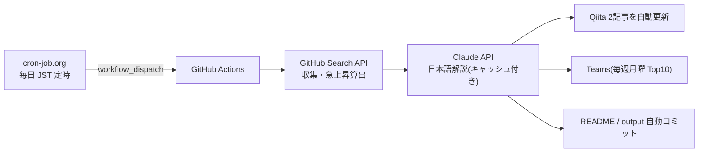

# Claude Code向けMCPツール候補ランキング

GitHub Search APIを使って、Claude Code周辺で活用候補になりそうなMCP関連リポジトリを定期収集するリポジトリです。

> 注意: この一覧は「Claude Codeでの動作」を保証するものではありません。  
> GitHub上のリポジトリ名・説明文・READMEなどに含まれる情報をもとに、MCP関連ツール候補を探すための入口として利用します。

## 仕組み(定常自律運転)

このランキングは cron-job.org → GitHub Actions → Claude API → Qiita / Teams のパイプラインで、毎日無人更新されています。


```mermaid
flowchart LR
    A["cron-job.org<br>毎日 JST 定時"] -->|workflow_dispatch| B["GitHub Actions"]
    B --> C["GitHub Search API<br>収集・急上昇算出"]
    C --> D["Claude API<br>日本語解説(キャッシュ付き)"]
    D --> E["Qiita 2記事を自動更新"]
    D --> F["Teams(毎週月曜 Top10)"]
    D --> G["README / output 自動コミット"]
```

- 仕組みの詳細と**ライブ稼働ステータス**: [定常自律運転ページ](https://takanobusano.github.io/mcp-github-ranking/)
- 作り方の解説記事: [パイプライン編](https://qiita.com/4q_sano/items/913e93ee5cc2731561fc) / [cron-job.org 完全自動化編](https://qiita.com/4q_sano/items/1bc5e0669a8f0166936c)
<!-- MCP_REPOS_START -->
最終更新: **2026-09-10 08:17:13 JST**

MCP関連リポジトリに加え、Claude Code周辺で活用候補になりそうな関連ツールをGitHub Search APIで毎日自動収集してランキング化しています。

Stars / Forks の差分は、UTC基準の前日データ（2026-09-08）との差分です。
CSVには最大500件を保存し、本文では上位100件を表示しています。

> 注意: この一覧はClaude Codeでの動作を保証するものではありません。  
> MCP関連ツールまたはClaude Code関連ツール候補を探すための入口として利用してください。

# 注目MCP・関連ツール候補ランキング

## 1位 [public-apis/public-apis](https://github.com/public-apis/public-apis)

A collective list of free APIs

⭐ **478,116 Stars**（+519）　🍴 **52,773 Forks**（+48）　/　🟢 **1,926 Open Issues**　/　Python

Topics: `api` / `apis` / `dataset` / `development` / `free` / `list` / `lists` / `open-source`

## 2位 [openclaw/openclaw](https://github.com/openclaw/openclaw)

The AI that really does things. Any OS. Any Platform. The lobster way. 🦞

⭐ **389,310 Stars**（+69）　🍴 **81,819 Forks**（+22）　/　🟢 **6,512 Open Issues**　/　TypeScript

Topics: `ai` / `assistant` / `crustacean` / `molty` / `openclaw` / `own-your-data` / `personal`

## 3位 [obra/superpowers](https://github.com/obra/superpowers)

An agentic skills framework & software development methodology that works.

⭐ **283,995 Stars**（+666）　🍴 **25,413 Forks**（+46）　/　🟢 **345 Open Issues**　/　Shell

Topics: `ai` / `brainstorming` / `coding` / `obra` / `sdlc` / `skills` / `subagent-driven-development` / `superpowers`

## 4位 [mattpocock/skills](https://github.com/mattpocock/skills)

Skills for Real Engineers. Straight from my .agents directory.

⭐ **257,846 Stars**（+904）　🍴 **21,721 Forks**（+76）　/　🟢 **483 Open Issues**　/　Shell

Topics: `topicなし`

## 5位 [affaan-m/ECC](https://github.com/affaan-m/ECC)

The agent harness performance optimization system. Skills, instincts, memory, security, and research-first development for Claude Code, Codex, Opencode, Cursor and beyond.

⭐ **255,137 Stars**（+881）　🍴 **38,221 Forks**（+117）　/　🟢 **182 Open Issues**　/　JavaScript

Topics: `ai-agents` / `anthropic` / `claude` / `claude-code` / `developer-tools` / `llm` / `mcp` / `productivity`

## 6位 [NousResearch/hermes-agent](https://github.com/NousResearch/hermes-agent)

The agent that grows with you

⭐ **243,847 Stars**（+412）　🍴 **50,336 Forks**（+133）　/　🟢 **41,257 Open Issues**　/　Python

Topics: `ai` / `ai-agent` / `ai-agents` / `anthropic` / `chatgpt` / `claude` / `claude-code` / `codex`

## 7位 [multica-ai/andrej-karpathy-skills](https://github.com/multica-ai/andrej-karpathy-skills)

A single CLAUDE.md file to improve Claude Code behavior, derived from Andrej Karpathy's observations on LLM coding pitfalls.

⭐ **211,877 Stars**（+455）　🍴 **21,492 Forks**（+23）　/　🟢 **129 Open Issues**　/　不明

Topics: `topicなし`

## 8位 [ultraworkers/claw-code](https://github.com/ultraworkers/claw-code)

An agent-managed museum exhibit, built in Rust with Gajae-Code / LazyCodex — developed and maintained with no human intervention.

⭐ **195,196 Stars**（-4）　🍴 **108,621 Forks**（-14）　/　🟢 **42 Open Issues**　/　Rust

Topics: `topicなし`

## 9位 [ollama/ollama](https://github.com/ollama/ollama)

Get up and running with Kimi-K2.6, GLM-5.2, MiniMax, DeepSeek, gpt-oss, Qwen, Gemma and other models.

⭐ **180,531 Stars**（+51）　🍴 **17,781 Forks**（+7）　/　🟢 **3,950 Open Issues**　/　Go

Topics: `deepseek` / `gemma` / `gemma3` / `glm` / `go` / `golang` / `gpt-oss` / `llama`

## 10位 [firecrawl/firecrawl](https://github.com/firecrawl/firecrawl)

The context API to search, scrape, and interact with the web at scale. 🔥

⭐ **178,388 Stars**（+372）　🍴 **9,714 Forks**（+9）　/　🟢 **608 Open Issues**　/　TypeScript

Topics: `ai` / `ai-agents` / `ai-crawler` / `ai-scraping` / `ai-search` / `crawler` / `data-extraction` / `html-to-markdown`

## 11位 [anthropics/skills](https://github.com/anthropics/skills)

Public repository for Agent Skills

⭐ **175,422 Stars**（+184）　🍴 **20,768 Forks**（+19）　/　🟢 **1,221 Open Issues**　/　Python

Topics: `agent-skills`

## 12位 [langflow-ai/langflow](https://github.com/langflow-ai/langflow)

Langflow is a powerful tool for building and deploying AI-powered agents and workflows.

⭐ **154,517 Stars**（+51）　🍴 **10,056 Forks**（+12）　/　🟢 **1,067 Open Issues**　/　Python

Topics: `agents` / `chatgpt` / `generative-ai` / `large-language-models` / `multiagent` / `react-flow`

## 13位 [msitarzewski/agency-agents](https://github.com/msitarzewski/agency-agents)

A complete AI agency at your fingertips - From frontend wizards to Reddit community ninjas, from whimsy injectors to reality checkers. Each agent is a specialized expert with personality, processes, and proven deliverables.

⭐ **151,301 Stars**（+282）　🍴 **24,346 Forks**（+38）　/　🟢 **142 Open Issues**　/　Shell

Topics: `topicなし`

## 14位 [anthropics/claude-code](https://github.com/anthropics/claude-code)

Claude Code is an agentic coding tool that lives in your terminal, understands your codebase, and helps you code faster by executing routine tasks, explaining complex code, and handling git workflows - all through natural language commands.

⭐ **144,572 Stars**（+108）　🍴 **23,078 Forks**（+11）　/　🟢 **12,523 Open Issues**　/　Python

Topics: `topicなし`

## 15位 [x1xhlol/system-prompts-and-models-of-ai-tools](https://github.com/x1xhlol/system-prompts-and-models-of-ai-tools)

FULL Augment Code, Claude Code, Cluely, CodeBuddy, Comet, Cursor, Devin AI, Junie, Kiro, Leap.new, Lovable, Manus, NotionAI, Orchids.app, Perplexity, Poke, Qoder, Replit, Same.dev, Trae, Traycer AI, VSCode Agent, Warp.dev, Windsurf, Xcode, Z.ai Code, Dia & v0. (And other Open Sourced) System Prompts, Internal Tools & AI Models

⭐ **143,485 Stars**（+20）　🍴 **34,814 Forks**（-2）　/　🟢 **160 Open Issues**　/　不明

Topics: `ai` / `bolt` / `cluely` / `copilot` / `cursor` / `cursorai` / `devin` / `github-copilot`

## 16位 [DietrichGebert/ponytail](https://github.com/DietrichGebert/ponytail)

Makes your AI agent think like the laziest senior dev in the room. The best code is the code you never wrote.

⭐ **133,350 Stars**（+1,205）　🍴 **7,136 Forks**（+64）　/　🟢 **245 Open Issues**　/　JavaScript

Topics: `agent-skills` / `ai-agents` / `claude` / `claude-code` / `claude-code-plugin` / `cursor-rules` / `developer-tools` / `llm`

## 17位 [garrytan/gstack](https://github.com/garrytan/gstack)

Use Garry Tan's exact Claude Code setup: 23 opinionated tools that serve as CEO, Designer, Eng Manager, Release Manager, Doc Engineer, and QA

⭐ **132,314 Stars**（+164）　🍴 **19,793 Forks**（+13）　/　🟢 **872 Open Issues**　/　TypeScript

Topics: `topicなし`

## 18位 [farion1231/cc-switch](https://github.com/farion1231/cc-switch)

A cross-platform desktop All-in-One assistant for Claude Code, Codex, OpenCode, OpenClaw, Grok Build & Hermes Agent. Only official website: ccswitch.io

⭐ **131,962 Stars**（+207）　🍴 **9,084 Forks**（+13）　/　🟢 **2,645 Open Issues**　/　Rust

Topics: `ai-tools` / `claude-code` / `codex` / `desktop-app` / `grok` / `grokbuild` / `hermes` / `hermes-agent`

## 19位 [nextlevelbuilder/ui-ux-pro-max-skill](https://github.com/nextlevelbuilder/ui-ux-pro-max-skill)

An AI skill that provides design intelligence for building professional UI/UX across multiple platforms.

⭐ **126,408 Stars**（+284）　🍴 **13,504 Forks**（+19）　/　🟢 **84 Open Issues**　/　Python

Topics: `ai-skills` / `antigravity` / `claude` / `claude-code` / `codex` / `command-line` / `copilot` / `cursor-ai`

## 20位 [harry0703/MoneyPrinterTurbo](https://github.com/harry0703/MoneyPrinterTurbo)

利用 AI 大模型和自动化工作流，根据主题或关键词一键生成高清短视频。Generate HD short videos from a topic or keyword with an automated AI workflow.

⭐ **121,978 Stars**（+391）　🍴 **18,827 Forks**（+68）　/　🟢 **27 Open Issues**　/　Python

Topics: `ai-video-generator` / `content-creation` / `ffmpeg` / `instagram-reels` / `llm` / `python` / `short-video` / `subtitles`

## 21位 [Graphify-Labs/graphify](https://github.com/Graphify-Labs/graphify)

Turn any codebase, with its docs, SQL schemas, configs, and PDFs, into a queryable knowledge graph. A /graphify skill for Claude Code, Cursor, Codex, and Gemini CLI: local deterministic AST parsing, every edge explained, no vector store.

⭐ **116,388 Stars**（+329）　🍴 **11,288 Forks**（+26）　/　🟢 **1,310 Open Issues**　/　Python

Topics: `ai-agents` / `antigravity` / `ast` / `claude-code` / `code-analysis` / `code-search` / `codex` / `cursor`

## 22位 [browser-use/browser-use](https://github.com/browser-use/browser-use)

Agents that use the browser.

⭐ **113,955 Stars**（+499）　🍴 **12,515 Forks**（+29）　/　🟢 **418 Open Issues**　/　Python

Topics: `ai-agents` / `ai-tools` / `browser-automation` / `browser-use` / `llm` / `playwright` / `python`

## 23位 [google-gemini/gemini-cli](https://github.com/google-gemini/gemini-cli)

An open-source AI agent that brings the power of Gemini directly into your terminal.

⭐ **106,879 Stars**（+7）　🍴 **14,542 Forks**（±0）　/　🟢 **825 Open Issues**　/　TypeScript

Topics: `ai` / `ai-agents` / `cli` / `gemini` / `gemini-api` / `mcp-client` / `mcp-server`

## 24位 [JuliusBrussee/caveman](https://github.com/JuliusBrussee/caveman)

🪨 why use many token when few token do trick — Claude Code skill that cuts 65% of tokens by talking like caveman

⭐ **104,550 Stars**（+203）　🍴 **6,063 Forks**（+10）　/　🟢 **117 Open Issues**　/　Go

Topics: `ai` / `anthropic` / `caveman` / `claude` / `claude-code` / `llm` / `meme` / `prompt-engineering`

## 25位 [TauricResearch/TradingAgents](https://github.com/TauricResearch/TradingAgents)

TradingAgents: Multi-Agents LLM Financial Trading Framework

⭐ **103,911 Stars**（+497）　🍴 **19,969 Forks**（+64）　/　🟢 **365 Open Issues**　/　Python

Topics: `agent` / `finance` / `llm` / `multiagent` / `trading`

## 26位 [microsoft/playwright](https://github.com/microsoft/playwright)

Playwright is a framework for Web Testing and Automation. It allows testing Chromium, Firefox and WebKit with a single API.

⭐ **95,874 Stars**（+50）　🍴 **6,410 Forks**（+7）　/　🟢 **166 Open Issues**　/　TypeScript

Topics: `automation` / `chrome` / `chromium` / `e2e-testing` / `electron` / `end-to-end-testing` / `firefox` / `javascript`

## 27位 [puppeteer/puppeteer](https://github.com/puppeteer/puppeteer)

JavaScript API for Chrome and Firefox

⭐ **95,563 Stars**（±0）　🍴 **9,571 Forks**（-2）　/　🟢 **257 Open Issues**　/　TypeScript

Topics: `automation` / `chrome` / `chromium` / `developer-tools` / `firefox` / `headless-chrome` / `node-module` / `testing`

## 28位 [nexu-io/open-design](https://github.com/nexu-io/open-design)

🎨 Best DeepSeek Harness Design Plugin. The open-source Claude Design alternative. 🖥️ Local-first desktop app. 🖼️ Your coding agent becomes the design engine: pr...

⭐ **95,153 Stars**（+229）　🍴 **11,017 Forks**（+37）　/　🟢 **969 Open Issues**　/　TypeScript

Topics: `agent-skills` / `ai-design` / `byok` / `claude-code-for-design` / `claude-design` / `codex-design` / `coding-agents` / `cursor-design`

## 29位 [thedotmack/claude-mem](https://github.com/thedotmack/claude-mem)

Persistent Context Across Sessions for Every Agent –  Captures everything your agent does during sessions, compresses it with AI, and injects relevant context back into future sessions. Works with Claude Code, OpenClaw, Codex, Gemini, Hermes, Copilot, OpenCode + More

⭐ **93,578 Stars**（+87）　🍴 **8,229 Forks**（+11）　/　🟢 **370 Open Issues**　/　JavaScript

Topics: `ai` / `ai-agents` / `ai-memory` / `anthropic` / `artificial-intelligence` / `chromadb` / `claude` / `claude-agent-sdk`

## 30位 [addyosmani/agent-skills](https://github.com/addyosmani/agent-skills)

Production-grade engineering skills for AI coding agents.

⭐ **93,210 Stars**（+203）　🍴 **9,920 Forks**（+17）　/　🟢 **133 Open Issues**　/　JavaScript

Topics: `agent-skills` / `antigravity` / `claude-code` / `codex` / `cursor` / `skills`

## 31位 [modelcontextprotocol/servers](https://github.com/modelcontextprotocol/servers)

Model Context Protocol Servers

⭐ **90,190 Stars**（+25）　🍴 **11,609 Forks**（+13）　/　🟢 **506 Open Issues**　/　TypeScript

Topics: `topicなし`

## 32位 [OpenCut-app/OpenCut](https://github.com/OpenCut-app/OpenCut)

The open-source CapCut alternative

⭐ **89,112 Stars**（+97）　🍴 **8,798 Forks**（+14）　/　🟢 **378 Open Issues**　/　TypeScript

Topics: `editor` / `oss` / `videoeditor`

## 33位 [ChatGPTNextWeb/NextChat](https://github.com/ChatGPTNextWeb/NextChat)

✨ Zero-config AI chat assistant. No API key needed — sign up and instantly chat with GPT-5, Claude 4, Gemini 2.5, DeepSeek & 100+ top models. Pay-as-you-go save...

⭐ **88,717 Stars**（±0）　🍴 **59,104 Forks**（-12）　/　🟢 **858 Open Issues**　/　TypeScript

Topics: `calclaude` / `chatgpt` / `claude` / `cross-platform` / `desktop` / `fe` / `gemini` / `gemini-pro`

## 34位 [OpenHands/OpenHands](https://github.com/OpenHands/OpenHands)

🙌 OpenHands: AI-Driven Development

⭐ **87,108 Stars**（+188）　🍴 **11,416 Forks**（+28）　/　🟢 **704 Open Issues**　/　TypeScript

Topics: `agent` / `artificial-intelligence` / `chatgpt` / `claude-ai` / `cli` / `developer-tools` / `gpt` / `llm`

## 35位 [koala73/worldmonitor](https://github.com/koala73/worldmonitor)

Real-time global intelligence dashboard. AI-powered news aggregation, geopolitical monitoring, and infrastructure tracking in a unified situational awareness interface

⭐ **85,911 Stars**（+66）　🍴 **12,993 Forks**（+21）　/　🟢 **285 Open Issues**　/　TypeScript

Topics: `agent` / `ai` / `dashboard` / `geopolitics` / `mcp` / `mcp-server` / `monitoring` / `news`

## 36位 [Leonxlnx/taste-skill](https://github.com/Leonxlnx/taste-skill)

Taste-Skill - gives your AI good taste. stops the AI from generating boring, generic slop

⭐ **85,751 Stars**（+295）　🍴 **5,861 Forks**（+18）　/　🟢 **62 Open Issues**　/　JavaScript

Topics: `agent` / `ai` / `claude` / `claude-code` / `codex` / `coding` / `design` / `frontend`

## 37位 [laravel/laravel](https://github.com/laravel/laravel)

Laravel is a web application framework with expressive, elegant syntax. We’ve already laid the foundation for your next big idea — freeing you to create without sweating the small things.

⭐ **84,936 Stars**（±0）　🍴 **24,873 Forks**（-6）　/　🟢 **31 Open Issues**　/　Blade

Topics: `framework` / `laravel` / `php`

## 38位 [lobehub/lobehub](https://github.com/lobehub/lobehub)

🤯 LobeHub is your Chief Agent Operator, organizing your agents into 7×24 operations by hiring, scheduling, and reporting on your entire AI team.

⭐ **82,360 Stars**（+26）　🍴 **15,862 Forks**（-2）　/　🟢 **913 Open Issues**　/　TypeScript

Topics: `agent` / `agent-collaboration` / `agent-harness` / `ai` / `cao` / `chatgpt` / `chief-agent-operator` / `claude`

## 39位 [bytedance/deer-flow](https://github.com/bytedance/deer-flow)

An open-source long-horizon SuperAgent harness that researches, codes, and creates. With the help of sandboxes, memories, tools, skill, subagents and message gateway, it handles different levels of tasks that could take minutes to hours.

⭐ **82,139 Stars**（+60）　🍴 **11,321 Forks**（+15）　/　🟢 **919 Open Issues**　/　Python

Topics: `agent` / `agentic` / `agentic-framework` / `agentic-workflow` / `ai` / `ai-agents` / `deep-research` / `harness`

## 40位 [unclecode/crawl4ai](https://github.com/unclecode/crawl4ai)

🚀🤖 Crawl4AI: Open-source LLM Friendly Web Crawler & Scraper. Don't be shy, join here:

⭐ **82,051 Stars**（+64）　🍴 **8,453 Forks**（+4）　/　🟢 **188 Open Issues**　/　Python

Topics: `topicなし`

## 41位 [Egonex-AI/Understand-Anything](https://github.com/Egonex-AI/Understand-Anything)

Graphs that teach > graphs that impress. Turn any code into an interactive knowledge graph you can explore, search, and ask questions about. Works with Claude Code, Codex, Cursor, Copilot, Gemini CLI, and more.

⭐ **81,905 Stars**（+79）　🍴 **6,889 Forks**（+6）　/　🟢 **302 Open Issues**　/　TypeScript

Topics: `antigravity-skills` / `business-knowledge` / `claude-code` / `claude-skills` / `codebase-analysis` / `codex` / `codex-skills` / `developer-tools-ai-agent`

## 42位 [paperclipai/paperclip](https://github.com/paperclipai/paperclip)

The open-source app everyone uses to manage agents at work

⭐ **80,340 Stars**（+75）　🍴 **14,745 Forks**（+15）　/　🟢 **5,424 Open Issues**　/　TypeScript

Topics: `topicなし`

## 43位 [rtk-ai/rtk](https://github.com/rtk-ai/rtk)

CLI proxy that reduces LLM token consumption by 60-90% on common dev commands. Single Rust binary, zero dependencies

⭐ **79,708 Stars**（+178）　🍴 **5,041 Forks**（+14）　/　🟢 **1,864 Open Issues**　/　Rust

Topics: `agentic-coding` / `ai-coding` / `anthropic` / `claude-code` / `cli` / `command-line-tool` / `cost-reduction` / `developer-tools`

## 44位 [D4Vinci/Scrapling](https://github.com/D4Vinci/Scrapling)

🕷️ An adaptive Web Scraping framework that handles everything from a single request to a full-scale crawl!

⭐ **79,672 Stars**（+273）　🍴 **8,013 Forks**（+33）　/　🟢 **15 Open Issues**　/　Python

Topics: `ai` / `ai-scraping` / `automation` / `crawler` / `crawling` / `crawling-python` / `data` / `data-extraction`

## 45位 [opendatalab/MinerU](https://github.com/opendatalab/MinerU)

Transforms complex documents like PDFs and Office docs into LLM-ready markdown/JSON for your Agentic workflows.

⭐ **79,581 Stars**（+92）　🍴 **6,661 Forks**（+11）　/　🟢 **109 Open Issues**　/　Python

Topics: `ai4science` / `document-analysis` / `docx` / `extract-data` / `layout-analysis` / `ocr` / `parser` / `pdf`

## 46位 [Panniantong/Agent-Reach](https://github.com/Panniantong/Agent-Reach)

Give your AI agent eyes to see the entire internet. Read & search Twitter, Reddit, YouTube, GitHub, Bilibili, XiaoHongShu — one CLI, zero API fees.

⭐ **79,061 Stars**（+208）　🍴 **6,801 Forks**（+8）　/　🟢 **130 Open Issues**　/　Python

Topics: `agent-infrastructure` / `ai-agent` / `ai-search` / `automation` / `bilibili` / `claude-code` / `cli` / `cursor`

## 47位 [abi/screenshot-to-code](https://github.com/abi/screenshot-to-code)

Drop in a screenshot and convert it to clean code (HTML/Tailwind/React/Vue)

⭐ **78,403 Stars**（+104）　🍴 **9,544 Forks**（+28）　/　🟢 **144 Open Issues**　/　Python

Topics: `topicなし`

## 48位 [shareAI-lab/learn-claude-code](https://github.com/shareAI-lab/learn-claude-code)

Bash is all you need -  A nano claude code–like 「agent harness」, built from 0 to 1

⭐ **76,422 Stars**（+75）　🍴 **12,298 Forks**（+14）　/　🟢 **40 Open Issues**　/　Python

Topics: `agent` / `agent-development` / `ai-agent` / `claude` / `claude-code` / `educational` / `llm` / `python`

## 49位 [unslothai/unsloth](https://github.com/unslothai/unsloth)

Local UI to run and train LLMs and diffusion models. Supports GGUF, MLX, Qwen3.8, DeepSeek-V4, MiniMax-H3, Gemma 4, FLUX and more.

⭐ **75,950 Stars**（+88）　🍴 **6,911 Forks**（+11）　/　🟢 **1,314 Open Issues**　/　Python

Topics: `agent` / `ai` / `chatgpt` / `deepseek` / `fine-tuning` / `gemma` / `image-generation` / `llama`

## 50位 [Eugeny/tabby](https://github.com/Eugeny/tabby)

A terminal for a more modern age

⭐ **74,407 Stars**（+10）　🍴 **4,246 Forks**（+3）　/　🟢 **2,889 Open Issues**　/　TypeScript

Topics: `serial` / `ssh-client` / `telnet-client` / `terminal` / `terminal-emulators`

## 51位 [thedaviddias/Front-End-Checklist](https://github.com/thedaviddias/Front-End-Checklist)

🗂 The essential checklist for modern web development, for humans and AI agents

⭐ **74,085 Stars**（+9）　🍴 **6,733 Forks**（+1）　/　🟢 **11 Open Issues**　/　MDX

Topics: `ai-agent` / `ai-agents` / `checklist` / `css` / `front-end-developer-tool` / `front-end-development` / `frontend` / `guidelines`

## 52位 [OpenBB-finance/OpenBB](https://github.com/OpenBB-finance/OpenBB)

Open Data Platform for analysts, quants and AI agents.

⭐ **72,841 Stars**（+39）　🍴 **7,532 Forks**（+5）　/　🟢 **117 Open Issues**　/　Python

Topics: `ai` / `crypto` / `derivatives` / `economics` / `equity` / `finance` / `fixed-income` / `machine-learning`

## 53位 [ruvnet/ruflo](https://github.com/ruvnet/ruflo)

🌊 The original agent meta-harness. Deploy intelligent multi-player swarms, coordinate autonomous workflows, and build conversational AI systems. Features adapti...

⭐ **71,810 Stars**（+135）　🍴 **8,500 Forks**（+18）　/　🟢 **959 Open Issues**　/　TypeScript

Topics: `agentic-ai` / `agentic-framework` / `agentic-workflow` / `agents` / `ai-agents` / `ai-assistant` / `ai-skills` / `autonomous-agents`

## 54位 [daytonaio/daytona](https://github.com/daytonaio/daytona)

Daytona is a Secure and Elastic Infrastructure for Running AI-Generated Code

⭐ **71,745 Stars**（-10）　🍴 **5,640 Forks**（-3）　/　🟢 **455 Open Issues**　/　不明

Topics: `agentic-workflow` / `ai` / `ai-agents` / `ai-runtime` / `ai-sandboxes` / `code-execution` / `code-interpreter` / `developer-tools`

## 55位 [headroomlabs-ai/headroom](https://github.com/headroomlabs-ai/headroom)

Compress tool outputs, logs, files, and RAG chunks before they reach the LLM. 20% fewer tokens for coding agents, 60-95% fewer tokens for JSON, same answers. Library, proxy, MCP server.

⭐ **71,076 Stars**（+291）　🍴 **5,450 Forks**（+19）　/　🟢 **660 Open Issues**　/　Python

Topics: `agent` / `ai` / `anthropic` / `claude-code` / `compression` / `context-engineering` / `context-window` / `cursor`

## 56位 [colbymchenry/codegraph](https://github.com/colbymchenry/codegraph)

Pre-indexed code knowledge graph, auto syncs on code changes, for Claude Code, Codex, Gemini, Cursor, OpenCode, AntiGravity, Kiro, CoPilot, and Hermes Agent — fewer tokens, fewer tool calls, 100% local

⭐ **70,263 Stars**（+145）　🍴 **4,493 Forks**（+11）　/　🟢 **473 Open Issues**　/　C

Topics: `topicなし`

## 57位 [code-yeongyu/oh-my-openagent](https://github.com/code-yeongyu/oh-my-openagent)

OmO: Just type "mass ulw" keyword with your prompt. Now you are the master of graph engineering.

⭐ **68,858 Stars**（+32）　🍴 **5,657 Forks**（+4）　/　🟢 **981 Open Issues**　/　TypeScript

Topics: `ai` / `ai-agents` / `anthropic` / `chatgpt` / `claude` / `claude-skills` / `codex` / `cursor`

## 58位 [openinterpreter/openinterpreter](https://github.com/openinterpreter/openinterpreter)

A coding agent for open models like Kimi K3 and GLM 5.3

⭐ **68,276 Stars**（+5）　🍴 **5,884 Forks**（+1）　/　🟢 **1 Open Issues**　/　Rust

Topics: `acp` / `coding-agent` / `deepseek` / `kimi` / `qwen` / `rust`

## 59位 [cline/cline](https://github.com/cline/cline)

Autonomous coding agent as an SDK, IDE extension, or CLI assistant.

⭐ **67,742 Stars**（+65）　🍴 **7,318 Forks**（+6）　/　🟢 **1,289 Open Issues**　/　TypeScript

Topics: `topicなし`

## 60位 [bradtraversy/design-resources-for-developers](https://github.com/bradtraversy/design-resources-for-developers)

Curated list of design and UI resources from stock photos, web templates, CSS frameworks, UI libraries, tools and much more

⭐ **66,881 Stars**（+12）　🍴 **12,180 Forks**（+2）　/　🟢 **116 Open Issues**　/　不明

Topics: `topicなし`

## 61位 [pbakaus/impeccable](https://github.com/pbakaus/impeccable)

The design language that makes your AI harness better at design.

⭐ **66,877 Stars**（+290）　🍴 **4,095 Forks**（+11）　/　🟢 **24 Open Issues**　/　JavaScript

Topics: `topicなし`

## 62位 [xtekky/gpt4free](https://github.com/xtekky/gpt4free)

The official gpt4free repository \| various collection of powerful language models \| opus 4.6 gpt 5.3 kimi 2.5 deepseek v3.2 gemini 3

⭐ **66,672 Stars**（+7）　🍴 **13,510 Forks**（±0）　/　🟢 **2 Open Issues**　/　Python

Topics: `chatbot` / `chatbots` / `chatgpt` / `chatgpt-4` / `chatgpt-api` / `chatgpt-free` / `chatgpt4` / `deepseek`

## 63位 [docling-project/docling](https://github.com/docling-project/docling)

Get your documents ready for gen AI

⭐ **66,219 Stars**（+46）　🍴 **4,759 Forks**（+3）　/　🟢 **896 Open Issues**　/　Python

Topics: `ai` / `convert` / `document-parser` / `document-parsing` / `documents` / `docx` / `html` / `markdown`

## 64位 [shanraisshan/claude-code-best-practice](https://github.com/shanraisshan/claude-code-best-practice)

from vibe coding to agentic engineering - practice makes claude perfect

⭐ **65,797 Stars**（+20）　🍴 **6,535 Forks**（+4）　/　🟢 **26 Open Issues**　/　HTML

Topics: `agentic-ai` / `agentic-coding` / `agentic-engineering` / `agentic-workflow` / `ai` / `ai-agents` / `anthropic` / `best-practices`

## 65位 [stablyai/orca](https://github.com/stablyai/orca)

Orca is the ADE for working with a fleet of parallel agents. Run any coding agent with your own subscription. Available on desktop, mobile and remote runtime.

⭐ **65,094 Stars**（+802）　🍴 **4,296 Forks**（+38）　/　🟢 **5,689 Open Issues**　/　TypeScript

Topics: `ade` / `agent-ide` / `ai-agents` / `claude-code` / `cli` / `codex` / `cursor-agent` / `devtools`

## 66位 [mem0ai/mem0](https://github.com/mem0ai/mem0)

The Memory Layer for AI Agents - Drop-in memory infrastructure for AI agents and apps. Context that persists. Built for production.

⭐ **65,008 Stars**（+81）　🍴 **7,609 Forks**（+4）　/　🟢 **737 Open Issues**　/　Python

Topics: `agentic-memory` / `agentic-memory-system` / `agents` / `ai` / `ai-agents` / `chatgpt` / `genai` / `llm`

## 67位 [warpdotdev/warp](https://github.com/warpdotdev/warp)

Warp is an agentic development environment, born out of the terminal.

⭐ **64,910 Stars**（+25）　🍴 **5,519 Forks**（+4）　/　🟢 **5,207 Open Issues**　/　Rust

Topics: `bash` / `linux` / `macos` / `rust` / `shell` / `terminal` / `wasm` / `zsh`

## 68位 [NanmiCoder/MediaCrawler](https://github.com/NanmiCoder/MediaCrawler)

小红书笔记 \| 评论爬虫、抖音视频 \| 评论爬虫、快手视频 \| 评论爬虫、B 站视频 ｜ 评论爬虫、微博帖子 ｜ 评论爬虫、百度贴吧帖子 ｜ 百度贴吧评论回复爬虫  \| 知乎问答文章｜评论爬虫

⭐ **64,715 Stars**（+80）　🍴 **12,559 Forks**（+13）　/　🟢 **202 Open Issues**　/　Python

Topics: `topicなし`

## 69位 [asgeirtj/system_prompts_leaks](https://github.com/asgeirtj/system_prompts_leaks)

Extracted system prompts from Anthropic - Claude Fable 5.1, Opus 5, Claude Design, Claude Code. OpenAI - ChatGPT GPT-6-Astra, Codex. Google - Gemini 3.8 Flash, 3.1 Pro, Antigravity. xAI - Grok, Grok Bot, Cursor, Kimi and more! Updated regularly.

⭐ **64,569 Stars**（+98）　🍴 **10,577 Forks**（+4）　/　🟢 **51 Open Issues**　/　JavaScript

Topics: `ai` / `ai-agents` / `ai-prompts` / `anthropic` / `chatbot` / `chatgpt` / `claude` / `claude-code`

## 70位 [diegosouzapw/OmniRoute](https://github.com/diegosouzapw/OmniRoute)

Never stop coding. Free MIT AI gateway: one endpoint, 352 providers (150+ free), 1200+ models Kimi, Claude, GPT, Gemini, GLM, DeepSeek, MiniMax. Works with Claude Code, Codex, Cursor, OpenCode, Cline & Copilot. Quota-aware auto-fallback, RTK+Caveman compression saves 15-95% tokens, MCP/A2A, Desktop/PWA. Built by 550+ contributors

⭐ **63,498 Stars**（+517）　🍴 **8,882 Forks**（+91）　/　🟢 **609 Open Issues**　/　TypeScript

Topics: `a2a` / `ai-agents` / `ai-gateway` / `anthropic` / `claude` / `claude-code` / `cline` / `codex`

## 71位 [sansan0/TrendRadar](https://github.com/sansan0/TrendRadar)

⭐AI-driven public opinion & trend monitor with multi-platform aggregation, RSS, and smart alerts.🎯 告别信息过载，你的 AI 舆情监控助手与热点筛选工具！聚合多平台热点 +  RSS 订阅，支持关键词精准筛选。AI 智能筛...

⭐ **62,148 Stars**（+17）　🍴 **24,884 Forks**（-4）　/　🟢 **59 Open Issues**　/　Python

Topics: `ai` / `bark` / `data-analysis` / `docker` / `hot-news` / `llm` / `mail` / `mcp`

## 72位 [upstash/context7](https://github.com/upstash/context7)

Context7 Platform -- Up-to-date code documentation for LLMs and AI code editors

⭐ **61,816 Stars**（+26）　🍴 **2,976 Forks**（-3）　/　🟢 **54 Open Issues**　/　TypeScript

Topics: `llm` / `mcp` / `mcp-server` / `vibe-coding`

## 73位 [mvanhorn/last30days-skill](https://github.com/mvanhorn/last30days-skill)

AI agent skill that researches any topic across Reddit, X, YouTube, HN, Polymarket, and the web - then synthesizes a grounded summary

⭐ **61,667 Stars**（+50）　🍴 **5,373 Forks**（+2）　/　🟢 **159 Open Issues**　/　Python

Topics: `ai-prompts` / `ai-skill` / `bluesky` / `claude` / `claude-code` / `clawhub` / `deep-research` / `hackernews`

## 74位 [coollabsio/coolify](https://github.com/coollabsio/coolify)

An open-source, self-hostable PaaS alternative to Vercel, Heroku & Netlify that lets you easily deploy static sites, databases, full-stack applications and 280+ one-click services on your own servers.

⭐ **61,620 Stars**（+48）　🍴 **5,434 Forks**（+7）　/　🟢 **654 Open Issues**　/　PHP

Topics: `coolify` / `databases` / `deployment` / `docker` / `docker-compose` / `inertiajs` / `laravel` / `mariadb`

## 75位 [usestrix/strix](https://github.com/usestrix/strix)

Open-source AI penetration testing tool to find and fix your app’s vulnerabilities.

⭐ **61,545 Stars**（+210）　🍴 **6,740 Forks**（+34）　/　🟢 **366 Open Issues**　/　Python

Topics: `agents` / `ai-hacking` / `ai-penetration-testing` / `ai-pentesting` / `ai-security` / `artificial-intelligence` / `bug-bounty` / `code-quality`

## 76位 [tw93/Pake](https://github.com/tw93/Pake)

🤱🏻 Turn any webpage into a desktop app with one command.

⭐ **61,364 Stars**（+16）　🍴 **12,636 Forks**（+4）　/　🟢 **4 Open Issues**　/　Rust

Topics: `chatgpt` / `claude` / `desktop` / `gemini` / `hight-performance` / `linux` / `macos` / `no-electron`

## 77位 [1c7/chinese-independent-developer](https://github.com/1c7/chinese-independent-developer)

👩🏿‍💻👨🏾‍💻👩🏼‍💻👨🏽‍💻👩🏻‍💻中国独立开发者项目列表 -- 分享大家都在做什么

⭐ **61,352 Stars**（+45）　🍴 **5,374 Forks**（+8）　/　🟢 **2 Open Issues**　/　Python

Topics: `china` / `indie` / `indie-developer`

## 78位 [microsoft/autogen](https://github.com/microsoft/autogen)

A programming framework for agentic AI

⭐ **60,900 Stars**（+22）　🍴 **9,203 Forks**（+2）　/　🟢 **1,064 Open Issues**　/　Python

Topics: `agentic` / `agentic-agi` / `agents` / `ai` / `autogen` / `autogen-ecosystem` / `chatgpt` / `framework`

## 79位 [penpot/penpot](https://github.com/penpot/penpot)

Penpot: The open-source design platform for Product teams that need scalable collaboration.

⭐ **59,803 Stars**（+35）　🍴 **4,082 Forks**（+6）　/　🟢 **771 Open Issues**　/　Clojure

Topics: `clojure` / `clojurescript` / `design` / `prototyping` / `ui` / `ux-design` / `ux-experience`

## 80位 [meilisearch/meilisearch](https://github.com/meilisearch/meilisearch)

A lightning-fast search engine API bringing AI-powered hybrid search to your sites and applications.

⭐ **59,238 Stars**（+13）　🍴 **2,704 Forks**（±0）　/　🟢 **319 Open Issues**　/　Rust

Topics: `ai` / `api` / `app-search` / `database` / `enterprise-search` / `faceting` / `full-text-search` / `fuzzy-search`

## 81位 [MemPalace/mempalace](https://github.com/MemPalace/mempalace)

The best-benchmarked open-source AI memory system. And it's free.

⭐ **58,969 Stars**（+22）　🍴 **7,560 Forks**（+8）　/　🟢 **783 Open Issues**　/　Python

Topics: `ai` / `chromadb` / `llm` / `mcp` / `memory` / `python`

## 82位 [BerriAI/litellm](https://github.com/BerriAI/litellm)

The fastest, litest AI Gateway. Rust core with Python SDK. Call 100+ LLM APIs in OpenAI (or native) format with cost tracking, guardrails, load balancing, and logging [Bedrock, Azure, OpenAI, Anthropic, OpenAI, VertexAI, vLLM, Nvidia NIM]

⭐ **58,391 Stars**（+91）　🍴 **11,311 Forks**（+31）　/　🟢 **5,037 Open Issues**　/　Python

Topics: `ai-gateway` / `anthropic` / `azure-openai` / `bedrock` / `gateway` / `langchain` / `litellm` / `llm`

## 83位 [crewAIInc/crewAI](https://github.com/crewAIInc/crewAI)

Framework for orchestrating role-playing, autonomous AI agents. By fostering collaborative intelligence, CrewAI empowers agents to work together seamlessly, tackling complex tasks.

⭐ **58,296 Stars**（+43）　🍴 **8,394 Forks**（+9）　/　🟢 **752 Open Issues**　/　Python

Topics: `agents` / `ai` / `ai-agents` / `aiagentframework` / `llms`

## 84位 [FoundationAgents/OpenManus](https://github.com/FoundationAgents/OpenManus)

No fortress, purely open ground.  OpenManus is Coming.

⭐ **58,268 Stars**（+14）　🍴 **10,110 Forks**（+1）　/　🟢 **462 Open Issues**　/　Python

Topics: `topicなし`

## 85位 [zylon-ai/private-gpt](https://github.com/zylon-ai/private-gpt)

Complete API layer for private AI applications on local models: RAG, skills, tools, MCP, text-to-sql, and more. Works with any OpenAI-compatible inference server.

⭐ **57,502 Stars**（+5）　🍴 **7,613 Forks**（±0）　/　🟢 **6 Open Issues**　/　Python

Topics: `ai` / `ai-tools` / `on-premise`

## 86位 [calesthio/OpenMontage](https://github.com/calesthio/OpenMontage)

World's first open-source, agentic video production system. 12 production pipelines, 100+ tools, 700+ agent skill and production-knowledge files. Turn your AI coding assistant into a full video production studio.

⭐ **56,847 Stars**（+162）　🍴 **7,157 Forks**（+26）　/　🟢 **317 Open Issues**　/　Python

Topics: `agent` / `agentic-ai` / `ai` / `claude` / `copilot` / `cursor` / `elevenlabs` / `ffmpeg`

## 87位 [tt-a1i/archify](https://github.com/tt-a1i/archify)

Agent skill for beautiful, verifiable architecture, workflow, sequence, data-flow, and lifecycle diagrams—self-contained HTML with motion and crisp export.

⭐ **56,030 Stars**（+1,379）　🍴 **3,655 Forks**（+75）　/　🟢 **146 Open Issues**　/　JavaScript

Topics: `agent-skills` / `architecture-as-code` / `architecture-diagram` / `claude-skill` / `code-visualization` / `codex` / `coding-agents` / `data-flow-diagram`

## 88位 [Alishahryar1/free-claude-code](https://github.com/Alishahryar1/free-claude-code)

Use Claude Code, Codex, Pi, and OpenCode and more for free (1.3B+ free tokens) from your terminal, app, IDE, or phone like OpenClaw (voice supported + ToS friendly)

⭐ **54,198 Stars**（+167）　🍴 **8,678 Forks**（+17）　/　🟢 **381 Open Issues**　/　Python

Topics: `topicなし`

## 89位 [aaif-goose/goose](https://github.com/aaif-goose/goose)

an open source, extensible AI agent that goes beyond code suggestions - install, execute, edit, and test with any LLM

⭐ **54,066 Stars**（+30）　🍴 **6,204 Forks**（+1）　/　🟢 **296 Open Issues**　/　Rust

Topics: `acp` / `ai` / `ai-agents` / `mcp`

## 90位 [rohitg00/ai-engineering-from-scratch](https://github.com/rohitg00/ai-engineering-from-scratch)

Learn it. Build it. Ship it for others.

⭐ **53,657 Stars**（+475）　🍴 **9,369 Forks**（+56）　/　🟢 **105 Open Issues**　/　Python

Topics: `agents` / `ai` / `ai-agents` / `ai-engineering` / `computer-vision` / `course` / `deep-learning` / `from-scratch`

## 91位 [hugohe3/ppt-master](https://github.com/hugohe3/ppt-master)

AI turns documents or topics into real, native PowerPoint decks—with native shapes, transitions and animations, data-backed charts and tables on demand, audio narration from speaker notes, and support for your own .pptx templates. · by Hugo He

⭐ **53,331 Stars**（+255）　🍴 **4,259 Forks**（+21）　/　🟢 **3 Open Issues**　/　Python

Topics: `ai-agent` / `aippt` / `office` / `powerpoint` / `powerpoint-generation` / `ppt` / `pptx` / `presentation`

## 92位 [bmad-code-org/BMAD-METHOD](https://github.com/bmad-code-org/BMAD-METHOD)

Breakthrough Method for Agile Ai Driven Development

⭐ **52,834 Stars**（+36）　🍴 **5,981 Forks**（±0）　/　🟢 **32 Open Issues**　/　Python

Topics: `topicなし`

## 93位 [jamiepine/voicebox](https://github.com/jamiepine/voicebox)

The open-source AI voice studio. Clone, dictate, create.

⭐ **52,815 Stars**（+129）　🍴 **6,587 Forks**（+12）　/　🟢 **683 Open Issues**　/　TypeScript

Topics: `ai` / `cuda` / `mlx` / `qwen3-tts` / `qwen3-tts-ui` / `voice-ai` / `voice-clone` / `whisper`

## 94位 [CherryHQ/cherry-studio](https://github.com/CherryHQ/cherry-studio)

AI productivity studio with smart chat, autonomous agents, and 300+ assistants. Unified access to frontier LLMs

⭐ **51,613 Stars**（+36）　🍴 **4,945 Forks**（+6）　/　🟢 **1,505 Open Issues**　/　TypeScript

Topics: `agent-skills` / `ai-agent` / `claude-code` / `codex` / `deepseek` / `deepseek-harness` / `hermes-agent` / `skills`

## 95位 [charlax/professional-programming](https://github.com/charlax/professional-programming)

A collection of learning resources for curious software engineers

⭐ **51,500 Stars**（+4）　🍴 **4,019 Forks**（+1）　/　🟢 **7 Open Issues**　/　Python

Topics: `architecture` / `computer-science` / `concepts` / `documentation` / `engineer` / `learning` / `lessons-learned` / `professional`

## 96位 [ChromeDevTools/chrome-devtools-mcp](https://github.com/ChromeDevTools/chrome-devtools-mcp)

Chrome DevTools for coding agents

⭐ **51,469 Stars**（+104）　🍴 **3,614 Forks**（+6）　/　🟢 **106 Open Issues**　/　TypeScript

Topics: `browser` / `chrome` / `chrome-devtools` / `debugging` / `devtools` / `mcp` / `mcp-server` / `puppeteer`

## 97位 [router-for-me/CLIProxyAPI](https://github.com/router-for-me/CLIProxyAPI)

Wrap Antigravity, ChatGPT Codex, Claude Code, Grok Build as an OpenAI/Gemini/Claude/Codex compatible API service, allowing you to enjoy the free Gemini 3.1 Pro, GPT 5.6 Series, Grok 4.5, Claude model through API

⭐ **51,152 Stars**（+154）　🍴 **7,760 Forks**（+22）　/　🟢 **628 Open Issues**　/　Go

Topics: `antigravity` / `claude-code` / `cluade` / `codex` / `gemini` / `openai`

## 98位 [multica-ai/multica](https://github.com/multica-ai/multica)

Make humans and AI agents work as one team — open-source and self-hostable.

⭐ **49,383 Stars**（+103）　🍴 **6,376 Forks**（+5）　/　🟢 **1,537 Open Issues**　/　Go

Topics: `topicなし`

## 99位 [coreyhaines31/marketingskills](https://github.com/coreyhaines31/marketingskills)

Marketing skills for Claude Code and AI agents. CRO, copywriting, SEO, analytics, and growth engineering.

⭐ **49,234 Stars**（+453）　🍴 **7,521 Forks**（+27）　/　🟢 **108 Open Issues**　/　JavaScript

Topics: `claude` / `codex` / `marketing`

## 100位 [HKUDS/CLI-Anything](https://github.com/HKUDS/CLI-Anything)

"CLI-Anything: Making ALL Software Agent-Native" -- CLI-Hub:

⭐ **49,180 Stars**（+26）　🍴 **4,552 Forks**（+4）　/　🟢 **89 Open Issues**　/　Python

Topics: `topicなし`

# 最近プッシュされたMCP・関連ツール候補

スター数ランキングとは別に、最近コードがプッシュされたリポジトリを表示します。古いスター数だけではなく、現在も開発が動いていそうな候補を探すための一覧です。

## プッシュ順 1位 [unslothai/unsloth](https://github.com/unslothai/unsloth)

Local UI to run and train LLMs and diffusion models. Supports GGUF, MLX, Qwen3.8, DeepSeek-V4, MiniMax-H3, Gemma 4, FLUX and more.

⭐ **75,950 Stars**（+88）　🍴 **6,911 Forks**（+11）　/　Python　/　最終プッシュ: 2026-09-09

Topics: `agent` / `ai` / `chatgpt` / `deepseek` / `fine-tuning` / `gemma` / `image-generation` / `llama`

## プッシュ順 2位 [apache/airflow](https://github.com/apache/airflow)

Apache Airflow - A platform to programmatically author, schedule, and monitor workflows

⭐ **46,793 Stars**（+10）　🍴 **17,806 Forks**（+13）　/　Python　/　最終プッシュ: 2026-09-09

Topics: `airflow` / `apache` / `apache-airflow` / `automation` / `dag` / `data-engineering` / `data-integration` / `data-orchestrator`

## プッシュ順 3位 [openclaw/openclaw](https://github.com/openclaw/openclaw)

The AI that really does things. Any OS. Any Platform. The lobster way. 🦞

⭐ **389,310 Stars**（+69）　🍴 **81,819 Forks**（+22）　/　TypeScript　/　最終プッシュ: 2026-09-09

Topics: `ai` / `assistant` / `crustacean` / `molty` / `openclaw` / `own-your-data` / `personal`

## プッシュ順 4位 [elizaOS/eliza](https://github.com/elizaOS/eliza)

Open source agentic operating system

⭐ **19,309 Stars**（+9）　🍴 **5,709 Forks**（±0）　/　TypeScript　/　最終プッシュ: 2026-09-09

Topics: `agent` / `agentic` / `ai` / `autonomous` / `chatbot` / `crypto` / `discord` / `eliza`

## プッシュ順 5位 [QwenLM/qwen-code](https://github.com/QwenLM/qwen-code)

An open-source AI coding agent that lives in your terminal.

⭐ **27,728 Stars**（+15）　🍴 **3,012 Forks**（+6）　/　TypeScript　/　最終プッシュ: 2026-09-09

Topics: `agentic` / `ai` / `ai-agent` / `ai-coding` / `cli` / `coding-agent` / `developer-tools` / `llm`

## プッシュ順 6位 [PostHog/posthog](https://github.com/PostHog/posthog)

:hedgehog: PostHog is the leading platform for building self-driving products. Our developer tools – AI observability, analytics, session replay, flags, experiments, error tracking, logs, and more – capture all the context agents need to diagnose problems, uncover opportunities, and ship fixes. Steer it all from Slack, web, desktop, or the MCP.

⭐ **39,723 Stars**（+47）　🍴 **3,363 Forks**（+3）　/　Python　/　最終プッシュ: 2026-09-09

Topics: `ab-testing` / `ai-analytics` / `analytics` / `cdp` / `data-warehouse` / `experiments` / `feature-flags` / `javascript`

## プッシュ順 7位 [comet-ml/opik](https://github.com/comet-ml/opik)

Debug, evaluate, and monitor your LLM applications, RAG systems, and agentic workflows with comprehensive tracing, automated evaluations, and production-ready dashboards.

⭐ **21,901 Stars**（+17）　🍴 **1,763 Forks**（+1）　/　Python　/　最終プッシュ: 2026-09-09

Topics: `evaluation` / `hacktoberfest` / `hacktoberfest2025` / `langchain` / `llama-index` / `llm` / `llm-evaluation` / `llm-observability`

## プッシュ順 8位 [paperclipai/paperclip](https://github.com/paperclipai/paperclip)

The open-source app everyone uses to manage agents at work

⭐ **80,340 Stars**（+75）　🍴 **14,745 Forks**（+15）　/　TypeScript　/　最終プッシュ: 2026-09-09

Topics: `topicなし`

## プッシュ順 9位 [BerriAI/litellm](https://github.com/BerriAI/litellm)

The fastest, litest AI Gateway. Rust core with Python SDK. Call 100+ LLM APIs in OpenAI (or native) format with cost tracking, guardrails, load balancing, and logging [Bedrock, Azure, OpenAI, Anthropic, OpenAI, VertexAI, vLLM, Nvidia NIM]

⭐ **58,391 Stars**（+91）　🍴 **11,311 Forks**（+31）　/　Python　/　最終プッシュ: 2026-09-09

Topics: `ai-gateway` / `anthropic` / `azure-openai` / `bedrock` / `gateway` / `langchain` / `litellm` / `llm`

## プッシュ順 10位 [danny-avila/LibreChat](https://github.com/danny-avila/LibreChat)

Enhanced ChatGPT Clone: Features Agents, MCP, Skills, DeepSeek, Anthropic, AWS, OpenAI, Responses API, Azure, Groq, o1, GPT-5, Mistral, OpenRouter, Vertex AI, Gemini, Artifacts, AI model switching, message search, Code Interpreter, langchain, DALL-E-3, OpenAPI Actions, Functions, Secure Multi-User Auth, Presets, open-source for self-hosting. Active

⭐ **42,970 Stars**（+34）　🍴 **8,909 Forks**（+8）　/　TypeScript　/　最終プッシュ: 2026-09-09

Topics: `ai` / `anthropic` / `artifacts` / `aws` / `azure` / `chatgpt` / `chatgpt-clone` / `claude`

## プッシュ順 11位 [MetaMask/metamask-extension](https://github.com/MetaMask/metamask-extension)

:globe_with_meridians: :electric_plug: The MetaMask browser extension enables browsing Ethereum blockchain enabled websites

⭐ **13,208 Stars**（-1）　🍴 **5,582 Forks**（+2）　/　TypeScript　/　最終プッシュ: 2026-09-09

Topics: `brave` / `chrome` / `dapp` / `dapp-developers` / `edge` / `ethereum` / `extension` / `firefox`

## プッシュ順 12位 [open-metadata/OpenMetadata](https://github.com/open-metadata/OpenMetadata)

The Open Context Layer for Data and AI ,  OpenMetadata is the open platform for building trusted data context and business semantics for humans, AI assistants, and agents.

⭐ **15,158 Stars**（+14）　🍴 **2,372 Forks**（+3）　/　TypeScript　/　最終プッシュ: 2026-09-09

Topics: `context` / `context-layer` / `data-catalog` / `data-collaboration` / `data-contracts` / `data-discovery` / `data-governance` / `data-lineage`

## プッシュ順 13位 [NVIDIA/NemoClaw](https://github.com/NVIDIA/NemoClaw)

Run agents like Hermes, LangChain Deep Agents, and OpenClaw more securely inside NVIDIA OpenShell with managed inference

⭐ **22,424 Stars**（+13）　🍴 **3,072 Forks**（+4）　/　TypeScript　/　最終プッシュ: 2026-09-09

Topics: `ai-agents` / `deep-agents` / `hermes` / `nvidia` / `openclaw` / `openshell` / `sandboxing` / `typescript`

## プッシュ順 14位 [ruvnet/ruflo](https://github.com/ruvnet/ruflo)

🌊 The original agent meta-harness. Deploy intelligent multi-player swarms, coordinate autonomous workflows, and build conversational AI systems. Features adapti...

⭐ **71,810 Stars**（+135）　🍴 **8,500 Forks**（+18）　/　TypeScript　/　最終プッシュ: 2026-09-09

Topics: `agentic-ai` / `agentic-framework` / `agentic-workflow` / `agents` / `ai-agents` / `ai-assistant` / `ai-skills` / `autonomous-agents`

## プッシュ順 15位 [BasedHardware/omi](https://github.com/BasedHardware/omi)

AI that sees your screen, listens to your conversations and tells you what to do

⭐ **13,441 Stars**（+12）　🍴 **2,319 Forks**（+23）　/　Python　/　最終プッシュ: 2026-09-09

Topics: `ai` / `app` / `bci` / `c` / `flutter` / `friend` / `mobile` / `necklace`

## プッシュ順 16位 [mastra-ai/mastra](https://github.com/mastra-ai/mastra)

Mastra is the modern TypeScript framework for AI-powered applications and agents.

⭐ **27,876 Stars**（+65）　🍴 **2,752 Forks**（+8）　/　TypeScript　/　最終プッシュ: 2026-09-09

Topics: `agents` / `ai` / `chatbots` / `evals` / `javascript` / `llm` / `mcp` / `nextjs`

## プッシュ順 17位 [different-ai/openwork](https://github.com/different-ai/openwork)

The open-source alternative to Claude Cowork (powered by opencode)

⭐ **23,437 Stars**（+24）　🍴 **2,343 Forks**（+3）　/　TypeScript　/　最終プッシュ: 2026-09-09

Topics: `topicなし`

## プッシュ順 18位 [ComposioHQ/composio](https://github.com/ComposioHQ/composio)

Composio powers 1000+ toolkits, tool search, context management, authentication, and a sandboxed workbench to help you build AI agents that turn intent into action.

⭐ **30,110 Stars**（+15）　🍴 **4,785 Forks**（+2）　/　TypeScript　/　最終プッシュ: 2026-09-09

Topics: `agentic-ai` / `agents` / `ai` / `ai-agents` / `aiagents` / `developer-tools` / `function-calling` / `gpt-4`

## プッシュ順 19位 [kortix-ai/suna](https://github.com/kortix-ai/suna)

The open-source AI Management System

⭐ **20,190 Stars**（+7）　🍴 **3,433 Forks**（-2）　/　TypeScript　/　最終プッシュ: 2026-09-09

Topics: `ai` / `ai-agents` / `llm`

## プッシュ順 20位 [yc-software/qm](https://github.com/yc-software/qm)

Multiplayer agent harness for work.

⭐ **14,776 Stars**（+41）　🍴 **1,796 Forks**（+4）　/　TypeScript　/　最終プッシュ: 2026-09-09

Topics: `ai` / `assistant` / `harness` / `qm`

## プッシュ順 21位 [lidge-jun/opencodex](https://github.com/lidge-jun/opencodex)

Universal provider proxy for OpenAI Codex & Claude Code — use any LLM (Claude, Gemini, Grok, DeepSeek, Ollama…) with Codex CLI, App, SDK, and Claude Code

⭐ **14,093 Stars**（+130）　🍴 **1,058 Forks**（+7）　/　TypeScript　/　最終プッシュ: 2026-09-09

Topics: `ai-gateway` / `ai-tools` / `anthropic` / `chatgpt` / `claude` / `claude-code` / `codex` / `codex-cli`

## プッシュ順 22位 [block/buzz](https://github.com/block/buzz)

A hive mind communication platform

⭐ **32,471 Stars**（+60）　🍴 **4,244 Forks**（+10）　/　Rust　/　最終プッシュ: 2026-09-09

Topics: `topicなし`

## プッシュ順 23位 [debpalash/VoiceStudio](https://github.com/debpalash/VoiceStudio)

VoiceStudio is the open-source, fully-local ElevenLabs alternative — voice cloning, voice design, video dubbing, dictation, transcription & audiobook creation in 646 languages.

⭐ **21,820 Stars**（+521）　🍴 **2,688 Forks**（+47）　/　Python　/　最終プッシュ: 2026-09-09

Topics: `ai` / `audiobook` / `cuda` / `dubbing` / `elevenlabs-alternative` / `huggingface` / `local-first` / `mlx`

## プッシュ順 24位 [stablyai/orca](https://github.com/stablyai/orca)

Orca is the ADE for working with a fleet of parallel agents. Run any coding agent with your own subscription. Available on desktop, mobile and remote runtime.

⭐ **65,094 Stars**（+802）　🍴 **4,296 Forks**（+38）　/　TypeScript　/　最終プッシュ: 2026-09-09

Topics: `ade` / `agent-ide` / `ai-agents` / `claude-code` / `cli` / `codex` / `cursor-agent` / `devtools`

## プッシュ順 25位 [DeusData/codebase-memory-mcp](https://github.com/DeusData/codebase-memory-mcp)

High-performance code intelligence MCP server. Indexes codebases into a persistent knowledge graph — average repo in milliseconds. 158 languages, sub-ms queries, 99% fewer tokens. Single static binary, zero dependencies.

⭐ **42,780 Stars**（+100）　🍴 **3,482 Forks**（+3）　/　C　/　最終プッシュ: 2026-09-09

Topics: `aider` / `ast` / `claude-code` / `code-analysis` / `code-intelligence` / `codex` / `cursor` / `cypher`

## プッシュ順 26位 [heygen-com/hyperframes](https://github.com/heygen-com/hyperframes)

Write HTML. Render video. Built for agents.

⭐ **48,386 Stars**（+669）　🍴 **4,432 Forks**（+41）　/　TypeScript　/　最終プッシュ: 2026-09-09

Topics: `ai` / `animation` / `ffmpeg` / `framework` / `gsap` / `html` / `mcp` / `puppeteer`

## プッシュ順 27位 [manaflow-ai/cmux](https://github.com/manaflow-ai/cmux)

Open source Ghostty-based macOS terminal with vertical tabs and notifications for AI coding agents. Built for multitasking, organization, and programmability.

⭐ **26,956 Stars**（+47）　🍴 **2,341 Forks**（+11）　/　Swift　/　最終プッシュ: 2026-09-09

Topics: `amp` / `claude-code` / `cli` / `codex` / `coding-agents` / `gemini` / `ghostty` / `macos`

## プッシュ順 28位 [gradio-app/gradio](https://github.com/gradio-app/gradio)

Build and share delightful machine learning apps, all in Python. 🌟 Star to support our work!

⭐ **43,502 Stars**（+8）　🍴 **3,591 Forks**（±0）　/　Python　/　最終プッシュ: 2026-09-09

Topics: `data-analysis` / `data-science` / `data-visualization` / `deep-learning` / `deploy` / `gradio` / `gradio-interface` / `interface`

## プッシュ順 29位 [EveryInc/compound-engineering-plugin](https://github.com/EveryInc/compound-engineering-plugin)

Official Compound Engineering plugin for Claude Code, Codex, Cursor, and more

⭐ **24,990 Stars**（+21）　🍴 **2,039 Forks**（-4）　/　TypeScript　/　最終プッシュ: 2026-09-09

Topics: `compound` / `engineering`

## プッシュ順 30位 [microsoft/mcp-for-beginners](https://github.com/microsoft/mcp-for-beginners)

This open-source curriculum introduces the fundamentals of Model Context Protocol (MCP) through real-world, cross-language examples in .NET, Java, TypeScript, JavaScript, Rust and Python. Designed for developers, it focuses on practical techniques for building modular, scalable, and secure AI workflows from session setup to service orchestration.

⭐ **17,181 Stars**（+12）　🍴 **5,592 Forks**（+2）　/　Jupyter Notebook　/　最終プッシュ: 2026-09-09

Topics: `csharp` / `java` / `javascript` / `javascript-applications` / `mcp` / `mcp-client` / `mcp-security` / `mcp-server`

# 検索条件

以下の検索条件でGitHubリポジトリを収集しています。

- "model context protocol" in:name,description,readme stars:>10
- "mcp server" in:name,description,readme stars:>10
- "mcp" "claude" in:name,description,readme stars:>10
- "claude" "mcp" in:name,description,readme stars:>10
- "modelcontextprotocol" in:name,description,readme stars:>10
- "claude code" in:name,description,readme stars:>10
- "claude" "plugin" in:name,description,readme stars:>10
- "claude" "memory" in:name,description,readme stars:>10

<!-- MCP_REPOS_END -->

## 仕組み

```text
GitHub Search API
  ↓
MCP / Claude Code / Model Context Protocol 関連リポジトリを検索
  ↓
スター数・更新日・Fork数・説明文を取得
  ↓
Markdown / CSV を生成
  ↓
GitHub Actionsで毎日自動実行
  ↓
READMEを自動更新
