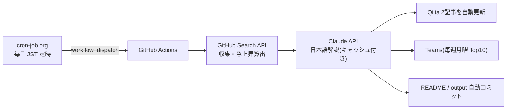

# Claude Code向けMCPツール候補ランキング

GitHub Search APIを使って、Claude Code周辺で活用候補になりそうなMCP関連リポジトリを定期収集するリポジトリです。

> 注意: この一覧は「Claude Codeでの動作」を保証するものではありません。  
> GitHub上のリポジトリ名・説明文・READMEなどに含まれる情報をもとに、MCP関連ツール候補を探すための入口として利用します。

## 仕組み(定常自律運転)

このランキングは cron-job.org → GitHub Actions → Claude API → Qiita / Teams のパイプラインで、毎日無人更新されています。


```mermaid
flowchart LR
    A["cron-job.org<br>毎日 JST 定時"] -->|workflow_dispatch| B["GitHub Actions"]
    B --> C["GitHub Search API<br>収集・急上昇算出"]
    C --> D["Claude API<br>日本語解説(キャッシュ付き)"]
    D --> E["Qiita 2記事を自動更新"]
    D --> F["Teams(毎週月曜 Top10)"]
    D --> G["README / output 自動コミット"]
```

- 仕組みの詳細と**ライブ稼働ステータス**: [定常自律運転ページ](https://takanobusano.github.io/mcp-github-ranking/)
- 作り方の解説記事: [パイプライン編](https://qiita.com/4q_sano/items/913e93ee5cc2731561fc) / [cron-job.org 完全自動化編](https://qiita.com/4q_sano/items/1bc5e0669a8f0166936c)
<!-- MCP_REPOS_START -->
最終更新: **2026-09-15 08:17:11 JST**

MCP関連リポジトリに加え、Claude Code周辺で活用候補になりそうな関連ツールをGitHub Search APIで毎日自動収集してランキング化しています。

Stars / Forks の差分は、UTC基準の前日データ（2026-09-13）との差分です。
CSVには最大500件を保存し、本文では上位100件を表示しています。

> 注意: この一覧はClaude Codeでの動作を保証するものではありません。  
> MCP関連ツールまたはClaude Code関連ツール候補を探すための入口として利用してください。

# 注目MCP・関連ツール候補ランキング

## 1位 [public-apis/public-apis](https://github.com/public-apis/public-apis)

A collective list of free APIs

⭐ **480,173 Stars**（+418）　🍴 **52,966 Forks**（+43）　/　🟢 **1,930 Open Issues**　/　Python

Topics: `api` / `apis` / `dataset` / `development` / `free` / `list` / `lists` / `open-source`

## 2位 [openclaw/openclaw](https://github.com/openclaw/openclaw)

The AI that really does things. Any OS. Any Platform. The lobster way. 🦞

⭐ **389,707 Stars**（+89）　🍴 **81,926 Forks**（+28）　/　🟢 **7,345 Open Issues**　/　TypeScript

Topics: `ai` / `assistant` / `crustacean` / `molty` / `openclaw` / `own-your-data` / `personal`

## 3位 [obra/superpowers](https://github.com/obra/superpowers)

An agentic skills framework & software development methodology that works.

⭐ **286,676 Stars**（+501）　🍴 **25,646 Forks**（+46）　/　🟢 **366 Open Issues**　/　Shell

Topics: `ai` / `brainstorming` / `coding` / `obra` / `sdlc` / `skills` / `subagent-driven-development` / `superpowers`

## 4位 [mattpocock/skills](https://github.com/mattpocock/skills)

Skills for Real Engineers. Straight from my .agents directory.

⭐ **262,044 Stars**（+821）　🍴 **22,104 Forks**（+57）　/　🟢 **496 Open Issues**　/　Shell

Topics: `topicなし`

## 5位 [affaan-m/ECC](https://github.com/affaan-m/ECC)

The agent harness performance optimization system. Skills, instincts, memory, security, and research-first development for Claude Code, Codex, Opencode, Cursor and beyond.

⭐ **258,375 Stars**（+646）　🍴 **38,640 Forks**（+94）　/　🟢 **207 Open Issues**　/　JavaScript

Topics: `ai-agents` / `anthropic` / `claude` / `claude-code` / `developer-tools` / `llm` / `mcp` / `productivity`

## 6位 [NousResearch/hermes-agent](https://github.com/NousResearch/hermes-agent)

The agent that grows with you

⭐ **245,503 Stars**（+347）　🍴 **51,135 Forks**（+139）　/　🟢 **43,148 Open Issues**　/　Python

Topics: `ai` / `ai-agent` / `ai-agents` / `anthropic` / `chatgpt` / `claude` / `claude-code` / `codex`

## 7位 [multica-ai/andrej-karpathy-skills](https://github.com/multica-ai/andrej-karpathy-skills)

A single CLAUDE.md file to improve Claude Code behavior, derived from Andrej Karpathy's observations on LLM coding pitfalls.

⭐ **212,999 Stars**（+226）　🍴 **21,577 Forks**（+13）　/　🟢 **130 Open Issues**　/　不明

Topics: `topicなし`

## 8位 [ultraworkers/claw-code](https://github.com/ultraworkers/claw-code)

An agent-managed museum exhibit, built in Rust with Gajae-Code / LazyCodex — developed and maintained with no human intervention.

⭐ **195,246 Stars**（+19）　🍴 **108,551 Forks**（-13）　/　🟢 **45 Open Issues**　/　Rust

Topics: `topicなし`

## 9位 [ollama/ollama](https://github.com/ollama/ollama)

Get up and running with Kimi, GLM, MiniMax, DeepSeek, gpt-oss, Qwen, Gemma and other models.

⭐ **180,956 Stars**（+124）　🍴 **17,865 Forks**（+25）　/　🟢 **4,001 Open Issues**　/　Go

Topics: `deepseek` / `gemma` / `gemma3` / `glm` / `go` / `golang` / `gpt-oss` / `llama`

## 10位 [firecrawl/firecrawl](https://github.com/firecrawl/firecrawl)

The context API to search, scrape, and interact with the web at scale. 🔥

⭐ **180,424 Stars**（+466）　🍴 **9,789 Forks**（+15）　/　🟢 **628 Open Issues**　/　TypeScript

Topics: `ai` / `ai-agents` / `ai-crawler` / `ai-scraping` / `ai-search` / `crawler` / `data-extraction` / `html-to-markdown`

## 11位 [anthropics/skills](https://github.com/anthropics/skills)

Public repository for Agent Skills

⭐ **176,313 Stars**（+193）　🍴 **20,870 Forks**（+30）　/　🟢 **1,234 Open Issues**　/　Python

Topics: `agent-skills`

## 12位 [langflow-ai/langflow](https://github.com/langflow-ai/langflow)

Langflow is a powerful tool for building and deploying AI-powered agents and workflows.

⭐ **154,804 Stars**（+69）　🍴 **10,087 Forks**（+4）　/　🟢 **1,052 Open Issues**　/　Python

Topics: `agents` / `chatgpt` / `generative-ai` / `large-language-models` / `multiagent` / `react-flow`

## 13位 [msitarzewski/agency-agents](https://github.com/msitarzewski/agency-agents)

A complete AI agency at your fingertips - From frontend wizards to Reddit community ninjas, from whimsy injectors to reality checkers. Each agent is a specialized expert with personality, processes, and proven deliverables.

⭐ **152,324 Stars**（+191）　🍴 **24,547 Forks**（+36）　/　🟢 **144 Open Issues**　/　Shell

Topics: `topicなし`

## 14位 [anthropics/claude-code](https://github.com/anthropics/claude-code)

Claude Code is an agentic coding tool that lives in your terminal, understands your codebase, and helps you code faster by executing routine tasks, explaining complex code, and handling git workflows - all through natural language commands.

⭐ **145,056 Stars**（+127）　🍴 **23,150 Forks**（+14）　/　🟢 **12,511 Open Issues**　/　TypeScript

Topics: `topicなし`

## 15位 [x1xhlol/system-prompts-and-models-of-ai-tools](https://github.com/x1xhlol/system-prompts-and-models-of-ai-tools)

FULL Augment Code, Claude Code, Cluely, CodeBuddy, Comet, Cursor, Devin AI, Junie, Kiro, Leap.new, Lovable, Manus, NotionAI, Orchids.app, Perplexity, Poke, Qoder, Replit, Same.dev, Trae, Traycer AI, VSCode Agent, Warp.dev, Windsurf, Xcode, Z.ai Code, Dia & v0. (And other Open Sourced) System Prompts, Internal Tools & AI Models

⭐ **143,632 Stars**（+36）　🍴 **34,810 Forks**（-2）　/　🟢 **161 Open Issues**　/　不明

Topics: `ai` / `bolt` / `cluely` / `copilot` / `cursor` / `cursorai` / `devin` / `github-copilot`

## 16位 [DietrichGebert/ponytail](https://github.com/DietrichGebert/ponytail)

Makes your AI agent think like the laziest senior dev in the room. The best code is the code you never wrote.

⭐ **138,372 Stars**（+1,094）　🍴 **7,426 Forks**（+54）　/　🟢 **269 Open Issues**　/　JavaScript

Topics: `agent-skills` / `ai-agents` / `claude` / `claude-code` / `claude-code-plugin` / `cursor-rules` / `developer-tools` / `llm`

## 17位 [garrytan/gstack](https://github.com/garrytan/gstack)

Use Garry Tan's exact Claude Code setup: 23 opinionated tools that serve as CEO, Designer, Eng Manager, Release Manager, Doc Engineer, and QA

⭐ **133,058 Stars**（+176）　🍴 **19,851 Forks**（+11）　/　🟢 **889 Open Issues**　/　TypeScript

Topics: `topicなし`

## 18位 [farion1231/cc-switch](https://github.com/farion1231/cc-switch)

A cross-platform desktop All-in-One assistant for Claude Code, Codex, OpenCode, OpenClaw, Grok Build & Hermes Agent. Only official website: ccswitch.io

⭐ **132,847 Stars**（+191）　🍴 **9,155 Forks**（+9）　/　🟢 **2,703 Open Issues**　/　Rust

Topics: `ai-tools` / `claude-code` / `codex` / `desktop-app` / `grok` / `grokbuild` / `hermes` / `hermes-agent`

## 19位 [nextlevelbuilder/ui-ux-pro-max-skill](https://github.com/nextlevelbuilder/ui-ux-pro-max-skill)

An AI skill that provides design intelligence for building professional UI/UX across multiple platforms.

⭐ **127,622 Stars**（+253）　🍴 **13,623 Forks**（+22）　/　🟢 **86 Open Issues**　/　Python

Topics: `ai-skills` / `antigravity` / `claude` / `claude-code` / `codex` / `command-line` / `copilot` / `cursor-ai`

## 20位 [harry0703/MoneyPrinterTurbo](https://github.com/harry0703/MoneyPrinterTurbo)

利用 AI 大模型和自动化工作流，根据主题或关键词一键生成高清短视频。Generate HD short videos from a topic or keyword with an automated AI workflow.

⭐ **123,654 Stars**（+417）　🍴 **19,131 Forks**（+65）　/　🟢 **29 Open Issues**　/　Python

Topics: `ai-video-generator` / `content-creation` / `ffmpeg` / `instagram-reels` / `llm` / `python` / `short-video` / `subtitles`

## 21位 [Graphify-Labs/graphify](https://github.com/Graphify-Labs/graphify)

Turn any codebase, with its docs, SQL schemas, configs, and PDFs, into a queryable knowledge graph. A /graphify skill for Claude Code, Cursor, Codex, and Gemini CLI: local deterministic AST parsing, every edge explained, no vector store.

⭐ **116,737 Stars**（+316）　🍴 **11,396 Forks**（+20）　/　🟢 **1,346 Open Issues**　/　Python

Topics: `ai-agents` / `antigravity` / `ast` / `claude-code` / `code-analysis` / `code-search` / `codex` / `cursor`

## 22位 [browser-use/browser-use](https://github.com/browser-use/browser-use)

Agents that use the browser.

⭐ **114,626 Stars**（+116）　🍴 **12,596 Forks**（+14）　/　🟢 **411 Open Issues**　/　Python

Topics: `ai-agents` / `ai-tools` / `browser-automation` / `browser-use` / `llm` / `playwright` / `python`

## 23位 [google-gemini/gemini-cli](https://github.com/google-gemini/gemini-cli)

An open-source AI agent that brings the power of Gemini directly into your terminal.

⭐ **106,983 Stars**（+17）　🍴 **14,580 Forks**（+18）　/　🟢 **841 Open Issues**　/　TypeScript

Topics: `ai` / `ai-agents` / `cli` / `gemini` / `gemini-api` / `mcp-client` / `mcp-server`

## 24位 [TauricResearch/TradingAgents](https://github.com/TauricResearch/TradingAgents)

TradingAgents: Multi-Agents LLM Financial Trading Framework

⭐ **106,080 Stars**（+722）　🍴 **20,302 Forks**（+101）　/　🟢 **387 Open Issues**　/　Python

Topics: `agent` / `finance` / `llm` / `multiagent` / `trading`

## 25位 [JuliusBrussee/caveman](https://github.com/JuliusBrussee/caveman)

🪨 why use many token when few token do trick — Claude Code skill that cuts 65% of tokens by talking like caveman

⭐ **105,581 Stars**（+222）　🍴 **6,114 Forks**（+13）　/　🟢 **120 Open Issues**　/　Go

Topics: `ai` / `anthropic` / `caveman` / `claude` / `claude-code` / `llm` / `meme` / `prompt-engineering`

## 26位 [nexu-io/open-design](https://github.com/nexu-io/open-design)

🎨 Best DeepSeek Harness Design Plugin. The open-source Claude Design alternative. 🖥️ Local-first desktop app. 🖼️ Your coding agent becomes the design engine: pr...

⭐ **96,171 Stars**（+235）　🍴 **11,140 Forks**（+14）　/　🟢 **1,069 Open Issues**　/　TypeScript

Topics: `agent-skills` / `ai-design` / `byok` / `claude-code-for-design` / `claude-design` / `codex-design` / `coding-agents` / `cursor-design`

## 27位 [microsoft/playwright](https://github.com/microsoft/playwright)

Playwright is a framework for Web Testing and Automation. It allows testing Chromium, Firefox and WebKit with a single API.

⭐ **96,129 Stars**（+60）　🍴 **6,435 Forks**（+5）　/　🟢 **175 Open Issues**　/　TypeScript

Topics: `automation` / `chrome` / `chromium` / `e2e-testing` / `electron` / `end-to-end-testing` / `firefox` / `javascript`

## 28位 [puppeteer/puppeteer](https://github.com/puppeteer/puppeteer)

JavaScript API for Chrome and Firefox

⭐ **95,579 Stars**（+1）　🍴 **9,578 Forks**（+4）　/　🟢 **259 Open Issues**　/　TypeScript

Topics: `automation` / `chrome` / `chromium` / `developer-tools` / `firefox` / `headless-chrome` / `node-module` / `testing`

## 29位 [addyosmani/agent-skills](https://github.com/addyosmani/agent-skills)

Production-grade engineering skills for AI coding agents.

⭐ **94,329 Stars**（+314）　🍴 **10,031 Forks**（+35）　/　🟢 **121 Open Issues**　/　JavaScript

Topics: `agent-skills` / `antigravity` / `claude-code` / `codex` / `cursor` / `skills`

## 30位 [thedotmack/claude-mem](https://github.com/thedotmack/claude-mem)

Persistent Context Across Sessions for Every Agent –  Captures everything your agent does during sessions, compresses it with AI, and injects relevant context back into future sessions. Works with Claude Code, OpenClaw, Codex, Gemini, Hermes, Copilot, OpenCode + More

⭐ **93,882 Stars**（+74）　🍴 **8,260 Forks**（+6）　/　🟢 **184 Open Issues**　/　TypeScript

Topics: `ai` / `ai-agents` / `ai-memory` / `anthropic` / `artificial-intelligence` / `chromadb` / `claude` / `claude-agent-sdk`

## 31位 [modelcontextprotocol/servers](https://github.com/modelcontextprotocol/servers)

Model Context Protocol Servers

⭐ **90,333 Stars**（+39）　🍴 **11,630 Forks**（±0）　/　🟢 **522 Open Issues**　/　TypeScript

Topics: `topicなし`

## 32位 [OpenCut-app/OpenCut](https://github.com/OpenCut-app/OpenCut)

The open-source CapCut alternative

⭐ **89,413 Stars**（+67）　🍴 **8,826 Forks**（+6）　/　🟢 **378 Open Issues**　/　TypeScript

Topics: `editor` / `oss` / `videoeditor`

## 33位 [ChatGPTNextWeb/NextChat](https://github.com/ChatGPTNextWeb/NextChat)

✨ Zero-config AI chat assistant. No API key needed — sign up and instantly chat with GPT-5, Claude 4, Gemini 2.5, DeepSeek & 100+ top models. Pay-as-you-go save...

⭐ **88,764 Stars**（+9）　🍴 **59,081 Forks**（-7）　/　🟢 **864 Open Issues**　/　TypeScript

Topics: `calclaude` / `chatgpt` / `claude` / `cross-platform` / `desktop` / `fe` / `gemini` / `gemini-pro`

## 34位 [OpenHands/OpenHands](https://github.com/OpenHands/OpenHands)

🙌 OpenHands: AI-Driven Development

⭐ **87,911 Stars**（+135）　🍴 **11,522 Forks**（+25）　/　🟢 **789 Open Issues**　/　TypeScript

Topics: `agent` / `artificial-intelligence` / `chatgpt` / `claude-ai` / `cli` / `developer-tools` / `gpt` / `llm`

## 35位 [Leonxlnx/taste-skill](https://github.com/Leonxlnx/taste-skill)

Taste-Skill - gives your AI good taste. stops the AI from generating boring, generic slop

⭐ **87,128 Stars**（+277）　🍴 **5,937 Forks**（+14）　/　🟢 **66 Open Issues**　/　JavaScript

Topics: `agent` / `ai` / `claude` / `claude-code` / `codex` / `coding` / `design` / `frontend`

## 36位 [koala73/worldmonitor](https://github.com/koala73/worldmonitor)

Real-time global intelligence dashboard. AI-powered news aggregation, geopolitical monitoring, and infrastructure tracking in a unified situational awareness interface

⭐ **86,263 Stars**（+72）　🍴 **13,085 Forks**（+13）　/　🟢 **298 Open Issues**　/　TypeScript

Topics: `agent` / `ai` / `dashboard` / `geopolitics` / `mcp` / `mcp-server` / `monitoring` / `news`

## 37位 [laravel/laravel](https://github.com/laravel/laravel)

Laravel is a web application framework with expressive, elegant syntax. We’ve already laid the foundation for your next big idea — freeing you to create without sweating the small things.

⭐ **84,954 Stars**（+3）　🍴 **24,874 Forks**（+3）　/　🟢 **31 Open Issues**　/　Blade

Topics: `framework` / `laravel` / `php`

## 38位 [unclecode/crawl4ai](https://github.com/unclecode/crawl4ai)

🚀🤖 Crawl4AI: Open-source LLM Friendly Web Crawler & Scraper. Don't be shy, join here:

⭐ **83,481 Stars**（+301）　🍴 **8,626 Forks**（+37）　/　🟢 **194 Open Issues**　/　Python

Topics: `topicなし`

## 39位 [Egonex-AI/Understand-Anything](https://github.com/Egonex-AI/Understand-Anything)

Graphs that teach > graphs that impress. Turn any code into an interactive knowledge graph you can explore, search, and ask questions about. Works with Claude Code, Codex, Cursor, Copilot, Gemini CLI, and more.

⭐ **82,772 Stars**（+242）　🍴 **6,968 Forks**（+25）　/　🟢 **303 Open Issues**　/　TypeScript

Topics: `antigravity-skills` / `business-knowledge` / `claude-code` / `claude-skills` / `codebase-analysis` / `codex` / `codex-skills` / `developer-tools-ai-agent`

## 40位 [lobehub/lobehub](https://github.com/lobehub/lobehub)

🤯 LobeHub is your Chief Agent Operator, organizing your agents into 7×24 operations by hiring, scheduling, and reporting on your entire AI team.

⭐ **82,474 Stars**（+26）　🍴 **15,880 Forks**（+4）　/　🟢 **938 Open Issues**　/　TypeScript

Topics: `agent` / `agent-collaboration` / `agent-harness` / `ai` / `cao` / `chatgpt` / `chief-agent-operator` / `claude`

## 41位 [bytedance/deer-flow](https://github.com/bytedance/deer-flow)

An open-source long-horizon SuperAgent harness that researches, codes, and creates. With the help of sandboxes, memories, tools, skill, subagents and message gateway, it handles different levels of tasks that could take minutes to hours.

⭐ **82,437 Stars**（+75）　🍴 **11,368 Forks**（+12）　/　🟢 **896 Open Issues**　/　Python

Topics: `agent` / `agentic` / `agentic-framework` / `agentic-workflow` / `ai` / `ai-agents` / `deep-research` / `harness`

## 42位 [Panniantong/Agent-Reach](https://github.com/Panniantong/Agent-Reach)

Give your AI agent eyes to see the entire internet. Read & search Twitter, Reddit, YouTube, GitHub, Bilibili, XiaoHongShu — one CLI, zero API fees.

⭐ **81,202 Stars**（+748）　🍴 **7,071 Forks**（+69）　/　🟢 **135 Open Issues**　/　Python

Topics: `agent-infrastructure` / `ai-agent` / `ai-search` / `automation` / `bilibili` / `claude-code` / `cli` / `cursor`

## 43位 [D4Vinci/Scrapling](https://github.com/D4Vinci/Scrapling)

🕷️ An adaptive Web Scraping framework that handles everything from a single request to a full-scale crawl! Don't be shy, join here:

⭐ **80,946 Stars**（+212）　🍴 **8,171 Forks**（+21）　/　🟢 **6 Open Issues**　/　Python

Topics: `ai` / `ai-scraping` / `automation` / `crawler` / `crawling` / `crawling-python` / `data` / `data-extraction`

## 44位 [paperclipai/paperclip](https://github.com/paperclipai/paperclip)

The open-source app everyone uses to manage agents at work

⭐ **80,696 Stars**（+96）　🍴 **14,819 Forks**（+18）　/　🟢 **5,471 Open Issues**　/　TypeScript

Topics: `topicなし`

## 45位 [rtk-ai/rtk](https://github.com/rtk-ai/rtk)

CLI proxy that reduces LLM token consumption by 60-90% on common dev commands. Single Rust binary, zero dependencies

⭐ **80,386 Stars**（+202）　🍴 **5,100 Forks**（+21）　/　🟢 **1,612 Open Issues**　/　Rust

Topics: `agentic-coding` / `ai-coding` / `anthropic` / `claude-code` / `cli` / `command-line-tool` / `cost-reduction` / `developer-tools`

## 46位 [opendatalab/MinerU](https://github.com/opendatalab/MinerU)

Transforms complex documents like PDFs and Office docs into LLM-ready markdown/JSON for your Agentic workflows.

⭐ **79,906 Stars**（+84）　🍴 **6,682 Forks**（+4）　/　🟢 **112 Open Issues**　/　Python

Topics: `ai4science` / `document-analysis` / `docx` / `extract-data` / `layout-analysis` / `ocr` / `parser` / `pdf`

## 47位 [abi/screenshot-to-code](https://github.com/abi/screenshot-to-code)

Drop in a screenshot and convert it to clean code (HTML/Tailwind/React/Vue)

⭐ **78,831 Stars**（+104）　🍴 **9,619 Forks**（+12）　/　🟢 **145 Open Issues**　/　Python

Topics: `topicなし`

## 48位 [shareAI-lab/learn-claude-code](https://github.com/shareAI-lab/learn-claude-code)

Bash is all you need -  A nano claude code–like 「agent harness」, built from 0 to 1

⭐ **76,775 Stars**（+98）　🍴 **12,343 Forks**（+10）　/　🟢 **48 Open Issues**　/　Python

Topics: `agent` / `agent-development` / `ai-agent` / `claude` / `claude-code` / `educational` / `llm` / `python`

## 49位 [unslothai/unsloth](https://github.com/unslothai/unsloth)

Local UI to run and train LLMs and diffusion models. Supports GGUF, MLX, Qwen3.8, DeepSeek-V4, MiniMax-H3, Gemma 4, FLUX and more.

⭐ **76,167 Stars**（+52）　🍴 **6,942 Forks**（+8）　/　🟢 **1,370 Open Issues**　/　Python

Topics: `agent` / `ai` / `chatgpt` / `deepseek` / `fine-tuning` / `gemma` / `image-generation` / `llama`

## 50位 [Eugeny/tabby](https://github.com/Eugeny/tabby)

A terminal for a more modern age

⭐ **74,479 Stars**（+16）　🍴 **4,253 Forks**（+4）　/　🟢 **2,828 Open Issues**　/　TypeScript

Topics: `serial` / `ssh-client` / `telnet-client` / `terminal` / `terminal-emulators`

## 51位 [thedaviddias/Front-End-Checklist](https://github.com/thedaviddias/Front-End-Checklist)

🗂 The essential checklist for modern web development, for humans and AI agents

⭐ **74,136 Stars**（+5）　🍴 **6,737 Forks**（+1）　/　🟢 **10 Open Issues**　/　MDX

Topics: `ai-agent` / `ai-agents` / `checklist` / `css` / `front-end-developer-tool` / `front-end-development` / `frontend` / `guidelines`

## 52位 [OpenBB-finance/OpenBB](https://github.com/OpenBB-finance/OpenBB)

Open Data Platform for analysts, quants and AI agents.

⭐ **73,009 Stars**（+48）　🍴 **7,554 Forks**（+9）　/　🟢 **116 Open Issues**　/　Python

Topics: `ai` / `crypto` / `derivatives` / `economics` / `equity` / `finance` / `fixed-income` / `machine-learning`

## 53位 [ruvnet/ruflo](https://github.com/ruvnet/ruflo)

🌊 The original agent harness. Deploy intelligent multi-player swarms, coordinate autonomous workflows, and build conversational AI systems. Features adaptive me...

⭐ **72,441 Stars**（+119）　🍴 **8,576 Forks**（+16）　/　🟢 **985 Open Issues**　/　TypeScript

Topics: `agentic-ai` / `agentic-framework` / `agentic-workflow` / `agents` / `ai-agents` / `ai-assistant` / `ai-skills` / `autonomous-agents`

## 54位 [headroomlabs-ai/headroom](https://github.com/headroomlabs-ai/headroom)

Compress tool outputs, logs, files, and RAG chunks before they reach the LLM. 20% fewer tokens for coding agents, 60-95% fewer tokens for JSON, same answers. Library, proxy, MCP server.

⭐ **72,134 Stars**（+224）　🍴 **5,525 Forks**（+20）　/　🟢 **642 Open Issues**　/　Python

Topics: `agent` / `ai` / `anthropic` / `claude-code` / `compression` / `context-engineering` / `context-window` / `cursor`

## 55位 [daytonaio/daytona](https://github.com/daytonaio/daytona)

Daytona is a Secure and Elastic Infrastructure for Running AI-Generated Code

⭐ **71,717 Stars**（+3）　🍴 **5,643 Forks**（-1）　/　🟢 **455 Open Issues**　/　不明

Topics: `agentic-workflow` / `ai` / `ai-agents` / `ai-runtime` / `ai-sandboxes` / `code-execution` / `code-interpreter` / `developer-tools`

## 56位 [colbymchenry/codegraph](https://github.com/colbymchenry/codegraph)

Pre-indexed code knowledge graph, auto syncs on code changes, for Claude Code, Codex, Gemini, Cursor, OpenCode, AntiGravity, Kiro, CoPilot, and Hermes Agent — fewer tokens, fewer tool calls, 100% local

⭐ **70,837 Stars**（+154）　🍴 **4,547 Forks**（+18）　/　🟢 **513 Open Issues**　/　C

Topics: `topicなし`

## 57位 [code-yeongyu/oh-my-openagent](https://github.com/code-yeongyu/oh-my-openagent)

OmO: Just type "mass ulw" keyword with your prompt. Now you are the master of graph engineering.

⭐ **69,043 Stars**（+32）　🍴 **5,685 Forks**（+10）　/　🟢 **1,009 Open Issues**　/　TypeScript

Topics: `ai` / `ai-agents` / `anthropic` / `chatgpt` / `claude` / `claude-skills` / `codex` / `cursor`

## 58位 [stablyai/orca](https://github.com/stablyai/orca)

Orca is the ADE for working with a fleet of parallel agents. Run any coding agent with your own subscription. Available on desktop, mobile and remote runtime.

⭐ **68,695 Stars**（+925）　🍴 **4,483 Forks**（+43）　/　🟢 **6,003 Open Issues**　/　TypeScript

Topics: `ade` / `agent-ide` / `ai-agents` / `claude-code` / `cli` / `codex` / `cursor-agent` / `devtools`

## 59位 [openinterpreter/openinterpreter](https://github.com/openinterpreter/openinterpreter)

A coding agent for open models like Kimi K3 and GLM 5.3

⭐ **68,321 Stars**（+9）　🍴 **5,883 Forks**（-2）　/　🟢 **1 Open Issues**　/　Rust

Topics: `acp` / `coding-agent` / `deepseek` / `kimi` / `python` / `qwen` / `rust`

## 60位 [pbakaus/impeccable](https://github.com/pbakaus/impeccable)

The design language that makes your AI harness better at design.

⭐ **68,059 Stars**（+257）　🍴 **4,169 Forks**（+15）　/　🟢 **31 Open Issues**　/　JavaScript

Topics: `topicなし`

## 61位 [cline/cline](https://github.com/cline/cline)

Autonomous coding agent as an SDK, IDE extension, or CLI assistant.

⭐ **68,014 Stars**（+64）　🍴 **7,349 Forks**（+8）　/　🟢 **1,315 Open Issues**　/　TypeScript

Topics: `topicなし`

## 62位 [bradtraversy/design-resources-for-developers](https://github.com/bradtraversy/design-resources-for-developers)

Curated list of design and UI resources from stock photos, web templates, CSS frameworks, UI libraries, tools and much more

⭐ **66,940 Stars**（+9）　🍴 **12,185 Forks**（+1）　/　🟢 **125 Open Issues**　/　不明

Topics: `topicなし`

## 63位 [asgeirtj/system_prompts_leaks](https://github.com/asgeirtj/system_prompts_leaks)

Extracted system prompts from Anthropic - Claude Fable 5.1, Opus 5, Claude Design, Claude Code. OpenAI - ChatGPT GPT-6-Astra, Codex. Google - Gemini 3.8 Flash, 3.1 Pro, Antigravity. xAI - Grok, Grok Bot, Cursor, Kimi and more! Updated regularly.

⭐ **66,734 Stars**（+739）　🍴 **10,866 Forks**（+69）　/　🟢 **58 Open Issues**　/　JavaScript

Topics: `ai` / `ai-agents` / `ai-prompts` / `anthropic` / `chatbot` / `chatgpt` / `claude` / `claude-code`

## 64位 [xtekky/gpt4free](https://github.com/xtekky/gpt4free)

The official gpt4free repository \| various collection of powerful language models \| opus 4.6 gpt 5.3 kimi 2.5 deepseek v3.2 gemini 3

⭐ **66,685 Stars**（+1）　🍴 **13,511 Forks**（-2）　/　🟢 **3 Open Issues**　/　Python

Topics: `chatbot` / `chatbots` / `chatgpt` / `chatgpt-4` / `chatgpt-api` / `chatgpt-free` / `chatgpt4` / `deepseek`

## 65位 [docling-project/docling](https://github.com/docling-project/docling)

Get your documents ready for gen AI

⭐ **66,413 Stars**（+60）　🍴 **4,785 Forks**（+5）　/　🟢 **913 Open Issues**　/　Python

Topics: `ai` / `convert` / `document-parser` / `document-parsing` / `documents` / `docx` / `html` / `markdown`

## 66位 [diegosouzapw/OmniRoute](https://github.com/diegosouzapw/OmniRoute)

Never stop coding. Free MIT AI gateway: one endpoint, 352 providers (150+ free), 1200+ models Kimi, Claude, GPT, Gemini, GLM, DeepSeek, MiniMax. Works with Claude Code, Codex, Cursor, OpenCode, Cline & Copilot. Quota-aware auto-fallback, RTK+Caveman compression saves 15-95% tokens, MCP/A2A, Desktop/PWA. Built by 550+ contributors

⭐ **66,167 Stars**（+443）　🍴 **9,280 Forks**（+85）　/　🟢 **765 Open Issues**　/　TypeScript

Topics: `a2a` / `ai-agents` / `ai-gateway` / `anthropic` / `claude` / `claude-code` / `cline` / `codex`

## 67位 [shanraisshan/claude-code-best-practice](https://github.com/shanraisshan/claude-code-best-practice)

from vibe coding to agentic engineering - practice makes claude perfect

⭐ **65,927 Stars**（+27）　🍴 **6,541 Forks**（-3）　/　🟢 **31 Open Issues**　/　HTML

Topics: `agentic-ai` / `agentic-coding` / `agentic-engineering` / `agentic-workflow` / `ai` / `ai-agents` / `anthropic` / `best-practices`

## 68位 [mem0ai/mem0](https://github.com/mem0ai/mem0)

The Memory Layer for AI Agents - Drop-in memory infrastructure for AI agents and apps. Context that persists. Built for production.

⭐ **65,289 Stars**（+48）　🍴 **7,653 Forks**（+11）　/　🟢 **749 Open Issues**　/　Python

Topics: `agentic-memory` / `agentic-memory-system` / `agents` / `ai` / `ai-agents` / `chatgpt` / `genai` / `llm`

## 69位 [warpdotdev/warp](https://github.com/warpdotdev/warp)

Warp is an agentic development environment, born out of the terminal.

⭐ **65,021 Stars**（+18）　🍴 **5,542 Forks**（+3）　/　🟢 **5,250 Open Issues**　/　Rust

Topics: `bash` / `linux` / `macos` / `rust` / `shell` / `terminal` / `wasm` / `zsh`

## 70位 [NanmiCoder/MediaCrawler](https://github.com/NanmiCoder/MediaCrawler)

小红书笔记 \| 评论爬虫、抖音视频 \| 评论爬虫、快手视频 \| 评论爬虫、B 站视频 ｜ 评论爬虫、微博帖子 ｜ 评论爬虫、百度贴吧帖子 ｜ 百度贴吧评论回复爬虫  \| 知乎问答文章｜评论爬虫

⭐ **64,979 Stars**（+61）　🍴 **12,599 Forks**（+10）　/　🟢 **206 Open Issues**　/　Python

Topics: `topicなし`

## 71位 [usestrix/strix](https://github.com/usestrix/strix)

Open-source AI penetration testing tool to find and fix your app’s vulnerabilities.

⭐ **62,445 Stars**（+191）　🍴 **6,842 Forks**（+23）　/　🟢 **383 Open Issues**　/　Python

Topics: `agents` / `ai-hacking` / `ai-penetration-testing` / `ai-pentesting` / `ai-security` / `artificial-intelligence` / `bug-bounty` / `code-quality`

## 72位 [sansan0/TrendRadar](https://github.com/sansan0/TrendRadar)

⭐AI-driven public opinion & trend monitor with multi-platform aggregation, RSS, and smart alerts.🎯 告别信息过载，你的 AI 舆情监控助手与热点筛选工具！聚合多平台热点 +  RSS 订阅，支持关键词精准筛选。AI 智能筛...

⭐ **62,254 Stars**（+32）　🍴 **24,887 Forks**（+6）　/　🟢 **58 Open Issues**　/　Python

Topics: `ai` / `bark` / `data-analysis` / `docker` / `hot-news` / `llm` / `mail` / `mcp`

## 73位 [tt-a1i/archify](https://github.com/tt-a1i/archify)

Agent skill for beautiful, verifiable architecture, workflow, sequence, data-flow, and lifecycle diagrams—self-contained HTML with motion and crisp export.

⭐ **62,180 Stars**（+1,492）　🍴 **4,106 Forks**（+124）　/　🟢 **167 Open Issues**　/　JavaScript

Topics: `agent-skills` / `architecture-as-code` / `architecture-diagram` / `claude-skill` / `code-visualization` / `codex` / `coding-agents` / `data-flow-diagram`

## 74位 [mvanhorn/last30days-skill](https://github.com/mvanhorn/last30days-skill)

AI agent skill that researches any topic across Reddit, X, YouTube, HN, Polymarket, and the web - then synthesizes a grounded summary

⭐ **62,037 Stars**（+63）　🍴 **5,411 Forks**（+2）　/　🟢 **127 Open Issues**　/　Python

Topics: `ai-prompts` / `ai-skill` / `bluesky` / `claude` / `claude-code` / `clawhub` / `deep-research` / `hackernews`

## 75位 [upstash/context7](https://github.com/upstash/context7)

Context7 Platform -- Up-to-date code documentation for LLMs and AI code editors

⭐ **62,021 Stars**（+56）　🍴 **2,993 Forks**（+8）　/　🟢 **62 Open Issues**　/　TypeScript

Topics: `llm` / `mcp` / `mcp-server` / `vibe-coding`

## 76位 [coollabsio/coolify](https://github.com/coollabsio/coolify)

An open-source, self-hostable PaaS alternative to Vercel, Heroku & Netlify that lets you easily deploy static sites, databases, full-stack applications and 280+ one-click services on your own servers.

⭐ **61,782 Stars**（+34）　🍴 **5,457 Forks**（±0）　/　🟢 **684 Open Issues**　/　PHP

Topics: `coolify` / `databases` / `deployment` / `docker` / `docker-compose` / `inertiajs` / `laravel` / `mariadb`

## 77位 [1c7/chinese-independent-developer](https://github.com/1c7/chinese-independent-developer)

👩🏿‍💻👨🏾‍💻👩🏼‍💻👨🏽‍💻👩🏻‍💻中国独立开发者项目列表 -- 分享大家都在做什么

⭐ **61,438 Stars**（+22）　🍴 **5,392 Forks**（+9）　/　🟢 **1 Open Issues**　/　不明

Topics: `china` / `indie` / `indie-developer`

## 78位 [tw93/Pake](https://github.com/tw93/Pake)

🤱🏻 Turn any webpage into a desktop app with one command.

⭐ **61,420 Stars**（+12）　🍴 **12,645 Forks**（+5）　/　🟢 **1 Open Issues**　/　Rust

Topics: `chatgpt` / `claude` / `desktop` / `gemini` / `hight-performance` / `linux` / `macos` / `no-electron`

## 79位 [microsoft/autogen](https://github.com/microsoft/autogen)

A programming framework for agentic AI

⭐ **60,984 Stars**（+15）　🍴 **9,208 Forks**（+1）　/　🟢 **1,066 Open Issues**　/　Python

Topics: `agentic` / `agentic-agi` / `agents` / `ai` / `autogen` / `autogen-ecosystem` / `chatgpt` / `framework`

## 80位 [penpot/penpot](https://github.com/penpot/penpot)

Penpot: The open-source design platform for Product teams that need scalable collaboration.

⭐ **59,996 Stars**（+43）　🍴 **4,099 Forks**（+3）　/　🟢 **793 Open Issues**　/　Clojure

Topics: `clojure` / `clojurescript` / `design` / `prototyping` / `ui` / `ux-design` / `ux-experience`

## 81位 [meilisearch/meilisearch](https://github.com/meilisearch/meilisearch)

A lightning-fast search engine API bringing AI-powered hybrid search to your sites and applications.

⭐ **59,291 Stars**（+7）　🍴 **2,707 Forks**（±0）　/　🟢 **323 Open Issues**　/　Rust

Topics: `ai` / `api` / `app-search` / `database` / `enterprise-search` / `faceting` / `full-text-search` / `fuzzy-search`

## 82位 [calesthio/OpenMontage](https://github.com/calesthio/OpenMontage)

World's first open-source, agentic video production system. 12 production pipelines, 100+ tools, 700+ agent skill and production-knowledge files. Turn your AI coding assistant into a full video production studio.

⭐ **59,068 Stars**（+674）　🍴 **7,412 Forks**（+62）　/　🟢 **320 Open Issues**　/　Python

Topics: `agent` / `agentic-ai` / `ai` / `claude` / `copilot` / `cursor` / `elevenlabs` / `ffmpeg`

## 83位 [MemPalace/mempalace](https://github.com/MemPalace/mempalace)

The best-benchmarked open-source AI memory system. And it's free.

⭐ **59,055 Stars**（+18）　🍴 **7,556 Forks**（-7）　/　🟢 **737 Open Issues**　/　Python

Topics: `ai` / `chromadb` / `llm` / `mcp` / `memory` / `python`

## 84位 [BerriAI/litellm](https://github.com/BerriAI/litellm)

The fastest, litest AI Gateway. Rust core with Python SDK. Call 100+ LLM APIs in OpenAI (or native) format with cost tracking, guardrails, load balancing, and logging [Bedrock, Azure, OpenAI, Anthropic, OpenAI, VertexAI, vLLM, Nvidia NIM]

⭐ **58,731 Stars**（+83）　🍴 **11,438 Forks**（+29）　/　🟢 **5,049 Open Issues**　/　Python

Topics: `ai-gateway` / `anthropic` / `azure-openai` / `bedrock` / `gateway` / `langchain` / `litellm` / `llm`

## 85位 [crewAIInc/crewAI](https://github.com/crewAIInc/crewAI)

Framework for orchestrating role-playing, autonomous AI agents. By fostering collaborative intelligence, CrewAI empowers agents to work together seamlessly, tackling complex tasks.

⭐ **58,548 Stars**（+70）　🍴 **8,447 Forks**（+13）　/　🟢 **797 Open Issues**　/　Python

Topics: `agents` / `ai` / `ai-agents` / `aiagentframework` / `llms`

## 86位 [FoundationAgents/OpenManus](https://github.com/FoundationAgents/OpenManus)

No fortress, purely open ground.  OpenManus is Coming.

⭐ **58,307 Stars**（+7）　🍴 **10,118 Forks**（+3）　/　🟢 **457 Open Issues**　/　Python

Topics: `topicなし`

## 87位 [zylon-ai/private-gpt](https://github.com/zylon-ai/private-gpt)

Complete API layer for private AI applications on local models: RAG, skills, tools, MCP, text-to-sql, and more. Works with any OpenAI-compatible inference server.

⭐ **57,508 Stars**（+5）　🍴 **7,618 Forks**（+1）　/　🟢 **9 Open Issues**　/　Python

Topics: `ai` / `ai-tools` / `on-premise`

## 88位 [Alishahryar1/free-claude-code](https://github.com/Alishahryar1/free-claude-code)

Use Claude Code, Codex, Pi, and OpenCode (and 6 other harnesses) for free (1.3B+ free tokens) from your terminal, app, IDE, or phone, and now from the browser with native browser sessions (multi-harness + multi-model) like OpenClaw (voice supported + ToS friendly)

⭐ **54,936 Stars**（+121）　🍴 **8,767 Forks**（+8）　/　🟢 **394 Open Issues**　/　Python

Topics: `topicなし`

## 89位 [rohitg00/ai-engineering-from-scratch](https://github.com/rohitg00/ai-engineering-from-scratch)

Learn it. Build it. Ship it for others.

⭐ **54,580 Stars**（+129）　🍴 **9,548 Forks**（+23）　/　🟢 **113 Open Issues**　/　Python

Topics: `agents` / `ai` / `ai-agents` / `ai-engineering` / `computer-vision` / `course` / `deep-learning` / `from-scratch`

## 90位 [hugohe3/ppt-master](https://github.com/hugohe3/ppt-master)

AI turns documents or topics into real, native PowerPoint decks—with native shapes, transitions and animations, data-backed charts and tables on demand, audio narration from speaker notes, and support for your own .pptx templates. · by Hugo He

⭐ **54,326 Stars**（+236）　🍴 **4,321 Forks**（+9）　/　🟢 **1 Open Issues**　/　Python

Topics: `ai-agent` / `aippt` / `office` / `powerpoint` / `powerpoint-generation` / `ppt` / `pptx` / `presentation`

## 91位 [aaif-goose/goose](https://github.com/aaif-goose/goose)

an open source, extensible AI agent that goes beyond code suggestions - install, execute, edit, and test with any LLM

⭐ **54,266 Stars**（+45）　🍴 **6,234 Forks**（+10）　/　🟢 **325 Open Issues**　/　Rust

Topics: `acp` / `ai` / `ai-agents` / `mcp`

## 92位 [jamiepine/voicebox](https://github.com/jamiepine/voicebox)

The open-source AI voice studio. Clone, dictate, create.

⭐ **53,268 Stars**（+143）　🍴 **6,655 Forks**（+16）　/　🟢 **688 Open Issues**　/　TypeScript

Topics: `ai` / `cuda` / `mlx` / `qwen3-tts` / `qwen3-tts-ui` / `voice-ai` / `voice-clone` / `whisper`

## 93位 [bmad-code-org/BMAD-METHOD](https://github.com/bmad-code-org/BMAD-METHOD)

Breakthrough Method for Agile Ai Driven Development

⭐ **53,011 Stars**（+36）　🍴 **5,990 Forks**（+4）　/　🟢 **39 Open Issues**　/　Python

Topics: `topicなし`

## 94位 [ChromeDevTools/chrome-devtools-mcp](https://github.com/ChromeDevTools/chrome-devtools-mcp)

Chrome DevTools for coding agents

⭐ **51,954 Stars**（+122）　🍴 **3,648 Forks**（+6）　/　🟢 **106 Open Issues**　/　TypeScript

Topics: `browser` / `chrome` / `chrome-devtools` / `debugging` / `devtools` / `mcp` / `mcp-server` / `puppeteer`

## 95位 [CherryHQ/cherry-studio](https://github.com/CherryHQ/cherry-studio)

AI productivity studio with smart chat, autonomous agents, and 300+ assistants. Unified access to frontier LLMs

⭐ **51,791 Stars**（+33）　🍴 **4,962 Forks**（+4）　/　🟢 **1,556 Open Issues**　/　TypeScript

Topics: `agent-skills` / `ai-agent` / `claude-code` / `codex` / `deepseek` / `deepseek-harness` / `hermes-agent` / `skills`

## 96位 [router-for-me/CLIProxyAPI](https://github.com/router-for-me/CLIProxyAPI)

Wrap Antigravity, ChatGPT Codex, Claude Code, Grok Build as an OpenAI/Gemini/Claude/Codex compatible API service, allowing you to enjoy the free Gemini 3.1 Pro, GPT 5.6 Series, Grok 4.5, Claude model through API

⭐ **51,766 Stars**（+118）　🍴 **7,840 Forks**（+6）　/　🟢 **627 Open Issues**　/　Go

Topics: `antigravity` / `claude-code` / `cluade` / `codex` / `gemini` / `openai`

## 97位 [charlax/professional-programming](https://github.com/charlax/professional-programming)

A collection of learning resources for curious software engineers

⭐ **51,512 Stars**（+2）　🍴 **4,021 Forks**（±0）　/　🟢 **9 Open Issues**　/　Python

Topics: `architecture` / `computer-science` / `concepts` / `documentation` / `engineer` / `learning` / `lessons-learned` / `professional`

## 98位 [coreyhaines31/marketingskills](https://github.com/coreyhaines31/marketingskills)

Marketing skills for Claude Code and AI agents. CRO, copywriting, SEO, analytics, and growth engineering.

⭐ **50,239 Stars**（+259）　🍴 **7,609 Forks**（+23）　/　🟢 **112 Open Issues**　/　JavaScript

Topics: `claude` / `codex` / `marketing`

## 99位 [heygen-com/hyperframes](https://github.com/heygen-com/hyperframes)

Write HTML. Render video. Built for agents.

⭐ **50,017 Stars**（+448）　🍴 **4,566 Forks**（+41）　/　🟢 **139 Open Issues**　/　TypeScript

Topics: `ai` / `animation` / `ffmpeg` / `framework` / `gsap` / `html` / `mcp` / `puppeteer`

## 100位 [multica-ai/multica](https://github.com/multica-ai/multica)

Make humans and AI agents work as one team — open-source and self-hostable.

⭐ **49,843 Stars**（+130）　🍴 **6,435 Forks**（+14）　/　🟢 **1,585 Open Issues**　/　Go

Topics: `topicなし`

# 最近プッシュされたMCP・関連ツール候補

スター数ランキングとは別に、最近コードがプッシュされたリポジトリを表示します。古いスター数だけではなく、現在も開発が動いていそうな候補を探すための一覧です。

## プッシュ順 1位 [superset-sh/superset](https://github.com/superset-sh/superset)

Superset is an agentic IDE to orchestrate 100+ coding agents in parallel. Run any agent with your own subscription.

⭐ **14,201 Stars**（+49）　🍴 **1,269 Forks**（+5）　/　TypeScript　/　最終プッシュ: 2026-09-14

Topics: `ade` / `agent` / `agent-orchestration` / `ai-agents` / `ai-coding` / `claude-code` / `cli` / `codex`

## プッシュ順 2位 [openclaw/openclaw](https://github.com/openclaw/openclaw)

The AI that really does things. Any OS. Any Platform. The lobster way. 🦞

⭐ **389,707 Stars**（+89）　🍴 **81,926 Forks**（+28）　/　TypeScript　/　最終プッシュ: 2026-09-14

Topics: `ai` / `assistant` / `crustacean` / `molty` / `openclaw` / `own-your-data` / `personal`

## プッシュ順 3位 [paperclipai/paperclip](https://github.com/paperclipai/paperclip)

The open-source app everyone uses to manage agents at work

⭐ **80,696 Stars**（+96）　🍴 **14,819 Forks**（+18）　/　TypeScript　/　最終プッシュ: 2026-09-14

Topics: `topicなし`

## プッシュ順 4位 [EveryInc/compound-engineering-plugin](https://github.com/EveryInc/compound-engineering-plugin)

Official Compound Engineering plugin for Claude Code, Codex, Cursor, and more

⭐ **25,078 Stars**（+17）　🍴 **2,048 Forks**（+4）　/　TypeScript　/　最終プッシュ: 2026-09-14

Topics: `compound` / `engineering`

## プッシュ順 5位 [screenpipe/screenpipe](https://github.com/screenpipe/screenpipe)

YC (S26) \| Open Computer History \| Record your screen continuously locally and provide context to your agents (Claude, Codex, Openclaw, Hermes, Runner...)

⭐ **21,575 Stars**（+14）　🍴 **2,196 Forks**（+1）　/　Rust　/　最終プッシュ: 2026-09-14

Topics: `agents` / `agi` / `ai` / `ai-memory` / `audio-recording` / `computer-vision` / `hermes` / `hermes-agent`

## プッシュ順 6位 [NVIDIA/NemoClaw](https://github.com/NVIDIA/NemoClaw)

Run agents like Hermes, LangChain Deep Agents, and OpenClaw more securely inside NVIDIA OpenShell with managed inference

⭐ **22,458 Stars**（+10）　🍴 **3,086 Forks**（+2）　/　TypeScript　/　最終プッシュ: 2026-09-14

Topics: `ai-agents` / `deep-agents` / `hermes` / `nvidia` / `openclaw` / `openshell` / `sandboxing` / `typescript`

## プッシュ順 7位 [QwenLM/qwen-code](https://github.com/QwenLM/qwen-code)

An open-source AI coding agent that lives in your terminal.

⭐ **27,841 Stars**（+16）　🍴 **3,041 Forks**（+6）　/　TypeScript　/　最終プッシュ: 2026-09-14

Topics: `agentic` / `ai` / `ai-agent` / `ai-coding` / `cli` / `coding-agent` / `developer-tools` / `llm`

## プッシュ順 8位 [manaflow-ai/cmux](https://github.com/manaflow-ai/cmux)

Open source Ghostty-based macOS terminal with vertical tabs and notifications for AI coding agents. Built for multitasking, organization, and programmability.

⭐ **27,098 Stars**（+23）　🍴 **2,355 Forks**（+8）　/　Swift　/　最終プッシュ: 2026-09-14

Topics: `amp` / `claude-code` / `cli` / `codex` / `coding-agents` / `gemini` / `ghostty` / `macos`

## プッシュ順 9位 [cline/cline](https://github.com/cline/cline)

Autonomous coding agent as an SDK, IDE extension, or CLI assistant.

⭐ **68,014 Stars**（+64）　🍴 **7,349 Forks**（+8）　/　TypeScript　/　最終プッシュ: 2026-09-14

Topics: `topicなし`

## プッシュ順 10位 [NousResearch/hermes-agent](https://github.com/NousResearch/hermes-agent)

The agent that grows with you

⭐ **245,503 Stars**（+347）　🍴 **51,135 Forks**（+139）　/　Python　/　最終プッシュ: 2026-09-14

Topics: `ai` / `ai-agent` / `ai-agents` / `anthropic` / `chatgpt` / `claude` / `claude-code` / `codex`

## プッシュ順 11位 [BerriAI/litellm](https://github.com/BerriAI/litellm)

The fastest, litest AI Gateway. Rust core with Python SDK. Call 100+ LLM APIs in OpenAI (or native) format with cost tracking, guardrails, load balancing, and logging [Bedrock, Azure, OpenAI, Anthropic, OpenAI, VertexAI, vLLM, Nvidia NIM]

⭐ **58,731 Stars**（+83）　🍴 **11,438 Forks**（+29）　/　Python　/　最終プッシュ: 2026-09-14

Topics: `ai-gateway` / `anthropic` / `azure-openai` / `bedrock` / `gateway` / `langchain` / `litellm` / `llm`

## プッシュ順 12位 [BasedHardware/omi](https://github.com/BasedHardware/omi)

AI that sees your screen, listens to your conversations and tells you what to do

⭐ **13,483 Stars**（+9）　🍴 **2,373 Forks**（+19）　/　Python　/　最終プッシュ: 2026-09-14

Topics: `ai` / `app` / `bci` / `c` / `flutter` / `friend` / `mobile` / `necklace`

## プッシュ順 13位 [CopilotKit/CopilotKit](https://github.com/CopilotKit/CopilotKit)

The Frontend Stack for Agents & Generative UI. React, Angular, Mobile, Slack, and more.  Makers of the AG-UI Protocol

⭐ **37,354 Stars**（+18）　🍴 **4,629 Forks**（+2）　/　TypeScript　/　最終プッシュ: 2026-09-14

Topics: `agent` / `agent-native` / `agentic-ai` / `agents` / `ai` / `ai-agent` / `ai-assistant` / `assistant`

## プッシュ順 14位 [PostHog/posthog](https://github.com/PostHog/posthog)

:hedgehog: PostHog is the leading platform for building self-driving products. Our developer tools – AI observability, analytics, session replay, flags, experiments, error tracking, logs, and more – capture all the context agents need to diagnose problems, uncover opportunities, and ship fixes. Steer it all from Slack, web, desktop, or the MCP.

⭐ **39,792 Stars**（+16）　🍴 **3,377 Forks**（+4）　/　Python　/　最終プッシュ: 2026-09-14

Topics: `ab-testing` / `ai-analytics` / `analytics` / `cdp` / `data-warehouse` / `experiments` / `feature-flags` / `javascript`

## プッシュ順 15位 [MetaMask/metamask-extension](https://github.com/MetaMask/metamask-extension)

:globe_with_meridians: :electric_plug: The MetaMask browser extension enables browsing Ethereum blockchain enabled websites

⭐ **13,217 Stars**（+1）　🍴 **5,591 Forks**（-1）　/　TypeScript　/　最終プッシュ: 2026-09-14

Topics: `brave` / `chrome` / `dapp` / `dapp-developers` / `edge` / `ethereum` / `extension` / `firefox`

## プッシュ順 16位 [coder/coder](https://github.com/coder/coder)

Secure environments for developers and their agents

⭐ **14,462 Stars**（+11）　🍴 **1,470 Forks**（+5）　/　Go　/　最終プッシュ: 2026-09-14

Topics: `agents` / `dev-tools` / `development-environment` / `go` / `golang` / `ide` / `jetbrains` / `remote-development`

## プッシュ順 17位 [stablyai/orca](https://github.com/stablyai/orca)

Orca is the ADE for working with a fleet of parallel agents. Run any coding agent with your own subscription. Available on desktop, mobile and remote runtime.

⭐ **68,695 Stars**（+925）　🍴 **4,483 Forks**（+43）　/　TypeScript　/　最終プッシュ: 2026-09-14

Topics: `ade` / `agent-ide` / `ai-agents` / `claude-code` / `cli` / `codex` / `cursor-agent` / `devtools`

## プッシュ順 18位 [vercel/ai](https://github.com/vercel/ai)

The AI Toolkit for TypeScript. From the creators of Next.js, the AI SDK is a free open-source library for building AI-powered applications and agents

⭐ **26,739 Stars**（+19）　🍴 **5,132 Forks**（+9）　/　TypeScript　/　最終プッシュ: 2026-09-14

Topics: `anthropic` / `artificial-intelligence` / `gemini` / `generative-ai` / `generative-ui` / `javascript` / `language-model` / `llm`

## プッシュ順 19位 [ruvnet/ruflo](https://github.com/ruvnet/ruflo)

🌊 The original agent harness. Deploy intelligent multi-player swarms, coordinate autonomous workflows, and build conversational AI systems. Features adaptive me...

⭐ **72,441 Stars**（+119）　🍴 **8,576 Forks**（+16）　/　TypeScript　/　最終プッシュ: 2026-09-14

Topics: `agentic-ai` / `agentic-framework` / `agentic-workflow` / `agents` / `ai-agents` / `ai-assistant` / `ai-skills` / `autonomous-agents`

## プッシュ順 20位 [windmill-labs/windmill](https://github.com/windmill-labs/windmill)

Open-source developer platform to power your entire infra and turn scripts into webhooks, workflows and UIs. Fastest workflow engine (13x vs Airflow). Open-source alternative to Retool and Temporal.

⭐ **17,925 Stars**（+8）　🍴 **1,096 Forks**（-1）　/　Rust　/　最終プッシュ: 2026-09-14

Topics: `low-code` / `open-source` / `platform` / `postgresql` / `python` / `self-hostable` / `typescript`

## プッシュ順 21位 [Skyvern-AI/skyvern](https://github.com/Skyvern-AI/skyvern)

Automate browser based workflows with AI

⭐ **23,002 Stars**（+10）　🍴 **2,160 Forks**（±0）　/　Python　/　最終プッシュ: 2026-09-14

Topics: `ai` / `api` / `automation` / `browser` / `browser-automation` / `computer` / `gpt` / `llm`

## プッシュ順 22位 [danny-avila/LibreChat](https://github.com/danny-avila/LibreChat)

Enhanced ChatGPT Clone: Features Agents, MCP, Skills, DeepSeek, Anthropic, AWS, OpenAI, Responses API, Azure, Groq, o1, GPT-5, Mistral, OpenRouter, Vertex AI, Gemini, Artifacts, AI model switching, message search, Code Interpreter, langchain, DALL-E-3, OpenAPI Actions, Functions, Secure Multi-User Auth, Presets, open-source for self-hosting. Active

⭐ **43,530 Stars**（+278）　🍴 **9,005 Forks**（+37）　/　TypeScript　/　最終プッシュ: 2026-09-14

Topics: `ai` / `anthropic` / `artifacts` / `aws` / `azure` / `chatgpt` / `chatgpt-clone` / `claude`

## プッシュ順 23位 [bytedance/deer-flow](https://github.com/bytedance/deer-flow)

An open-source long-horizon SuperAgent harness that researches, codes, and creates. With the help of sandboxes, memories, tools, skill, subagents and message gateway, it handles different levels of tasks that could take minutes to hours.

⭐ **82,437 Stars**（+75）　🍴 **11,368 Forks**（+12）　/　Python　/　最終プッシュ: 2026-09-14

Topics: `agent` / `agentic` / `agentic-framework` / `agentic-workflow` / `ai` / `ai-agents` / `deep-research` / `harness`

## プッシュ順 24位 [pingdotgg/t3code](https://github.com/pingdotgg/t3code)

説明なし

⭐ **22,695 Stars**（+87）　🍴 **5,705 Forks**（+39）　/　TypeScript　/　最終プッシュ: 2026-09-14

Topics: `topicなし`

## プッシュ順 25位 [open-metadata/OpenMetadata](https://github.com/open-metadata/OpenMetadata)

The Open Context Layer for Data and AI ,  OpenMetadata is the open platform for building trusted data context and business semantics for humans, AI assistants, and agents.

⭐ **15,198 Stars**（+13）　🍴 **2,378 Forks**（+2）　/　TypeScript　/　最終プッシュ: 2026-09-14

Topics: `context` / `context-layer` / `data-catalog` / `data-collaboration` / `data-contracts` / `data-discovery` / `data-governance` / `data-lineage`

## プッシュ順 26位 [mastra-ai/mastra](https://github.com/mastra-ai/mastra)

Mastra is the modern TypeScript framework for AI-powered applications and agents.

⭐ **28,039 Stars**（+32）　🍴 **2,785 Forks**（+3）　/　TypeScript　/　最終プッシュ: 2026-09-14

Topics: `agents` / `ai` / `chatbots` / `evals` / `javascript` / `llm` / `mcp` / `nextjs`

## プッシュ順 27位 [different-ai/openwork](https://github.com/different-ai/openwork)

The open-source alternative to Claude Cowork (powered by opencode)

⭐ **23,537 Stars**（+19）　🍴 **2,361 Forks**（+2）　/　TypeScript　/　最終プッシュ: 2026-09-14

Topics: `topicなし`

## プッシュ順 28位 [kortix-ai/suna](https://github.com/kortix-ai/suna)

The open-source AI Management System

⭐ **20,205 Stars**（+3）　🍴 **3,436 Forks**（+1）　/　TypeScript　/　最終プッシュ: 2026-09-14

Topics: `ai` / `ai-agents` / `llm`

## プッシュ順 29位 [elizaOS/eliza](https://github.com/elizaOS/eliza)

Open source agentic operating system

⭐ **19,334 Stars**（+5）　🍴 **5,728 Forks**（+3）　/　TypeScript　/　最終プッシュ: 2026-09-14

Topics: `agent` / `agentic` / `ai` / `autonomous` / `chatbot` / `crypto` / `discord` / `eliza`

## プッシュ順 30位 [unslothai/unsloth](https://github.com/unslothai/unsloth)

Local UI to run and train LLMs and diffusion models. Supports GGUF, MLX, Qwen3.8, DeepSeek-V4, MiniMax-H3, Gemma 4, FLUX and more.

⭐ **76,167 Stars**（+52）　🍴 **6,942 Forks**（+8）　/　Python　/　最終プッシュ: 2026-09-14

Topics: `agent` / `ai` / `chatgpt` / `deepseek` / `fine-tuning` / `gemma` / `image-generation` / `llama`

# 検索条件

以下の検索条件でGitHubリポジトリを収集しています。

- "model context protocol" in:name,description,readme stars:>10
- "mcp server" in:name,description,readme stars:>10
- "mcp" "claude" in:name,description,readme stars:>10
- "claude" "mcp" in:name,description,readme stars:>10
- "modelcontextprotocol" in:name,description,readme stars:>10
- "claude code" in:name,description,readme stars:>10
- "claude" "plugin" in:name,description,readme stars:>10
- "claude" "memory" in:name,description,readme stars:>10

<!-- MCP_REPOS_END -->

## 仕組み

```text
GitHub Search API
  ↓
MCP / Claude Code / Model Context Protocol 関連リポジトリを検索
  ↓
スター数・更新日・Fork数・説明文を取得
  ↓
Markdown / CSV を生成
  ↓
GitHub Actionsで毎日自動実行
  ↓
READMEを自動更新
