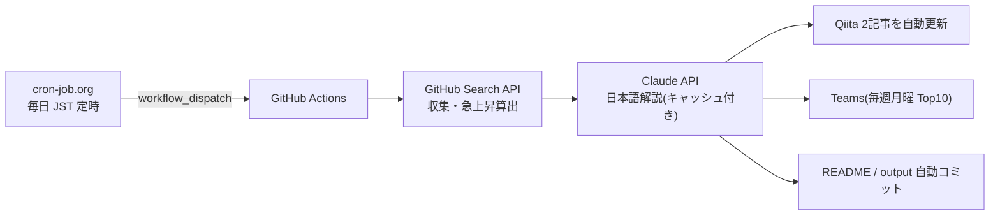

# Claude Code向けMCPツール候補ランキング

GitHub Search APIを使って、Claude Code周辺で活用候補になりそうなMCP関連リポジトリを定期収集するリポジトリです。

> 注意: この一覧は「Claude Codeでの動作」を保証するものではありません。  
> GitHub上のリポジトリ名・説明文・READMEなどに含まれる情報をもとに、MCP関連ツール候補を探すための入口として利用します。

## 仕組み(定常自律運転)

このランキングは cron-job.org → GitHub Actions → Claude API → Qiita / Teams のパイプラインで、毎日無人更新されています。


```mermaid
flowchart LR
    A["cron-job.org<br>毎日 JST 定時"] -->|workflow_dispatch| B["GitHub Actions"]
    B --> C["GitHub Search API<br>収集・急上昇算出"]
    C --> D["Claude API<br>日本語解説(キャッシュ付き)"]
    D --> E["Qiita 2記事を自動更新"]
    D --> F["Teams(毎週月曜 Top10)"]
    D --> G["README / output 自動コミット"]
```

- 仕組みの詳細と**ライブ稼働ステータス**: [定常自律運転ページ](https://takanobusano.github.io/mcp-github-ranking/)
- 作り方の解説記事: [パイプライン編](https://qiita.com/4q_sano/items/913e93ee5cc2731561fc) / [cron-job.org 完全自動化編](https://qiita.com/4q_sano/items/1bc5e0669a8f0166936c)
<!-- MCP_REPOS_START -->
最終更新: **2026-09-13 08:17:13 JST**

MCP関連リポジトリに加え、Claude Code周辺で活用候補になりそうな関連ツールをGitHub Search APIで毎日自動収集してランキング化しています。

Stars / Forks の差分は、UTC基準の前日データ（2026-09-11）との差分です。
CSVには最大500件を保存し、本文では上位100件を表示しています。

> 注意: この一覧はClaude Codeでの動作を保証するものではありません。  
> MCP関連ツールまたはClaude Code関連ツール候補を探すための入口として利用してください。

# 注目MCP・関連ツール候補ランキング

## 1位 [public-apis/public-apis](https://github.com/public-apis/public-apis)

A collective list of free APIs

⭐ **479,398 Stars**（+385）　🍴 **52,890 Forks**（+36）　/　🟢 **1,950 Open Issues**　/　Python

Topics: `api` / `apis` / `dataset` / `development` / `free` / `list` / `lists` / `open-source`

## 2位 [openclaw/openclaw](https://github.com/openclaw/openclaw)

The AI that really does things. Any OS. Any Platform. The lobster way. 🦞

⭐ **389,524 Stars**（+68）　🍴 **81,877 Forks**（+10）　/　🟢 **7,107 Open Issues**　/　TypeScript

Topics: `ai` / `assistant` / `crustacean` / `molty` / `openclaw` / `own-your-data` / `personal`

## 3位 [obra/superpowers](https://github.com/obra/superpowers)

An agentic skills framework & software development methodology that works.

⭐ **285,794 Stars**（+442）　🍴 **25,570 Forks**（+54）　/　🟢 **359 Open Issues**　/　Shell

Topics: `ai` / `brainstorming` / `coding` / `obra` / `sdlc` / `skills` / `subagent-driven-development` / `superpowers`

## 4位 [mattpocock/skills](https://github.com/mattpocock/skills)

Skills for Real Engineers. Straight from my .agents directory.

⭐ **260,464 Stars**（+704）　🍴 **21,966 Forks**（+65）　/　🟢 **491 Open Issues**　/　Shell

Topics: `topicなし`

## 5位 [affaan-m/ECC](https://github.com/affaan-m/ECC)

The agent harness performance optimization system. Skills, instincts, memory, security, and research-first development for Claude Code, Codex, Opencode, Cursor and beyond.

⭐ **257,079 Stars**（+574）　🍴 **38,466 Forks**（+85）　/　🟢 **188 Open Issues**　/　JavaScript

Topics: `ai-agents` / `anthropic` / `claude` / `claude-code` / `developer-tools` / `llm` / `mcp` / `productivity`

## 6位 [NousResearch/hermes-agent](https://github.com/NousResearch/hermes-agent)

The agent that grows with you

⭐ **244,895 Stars**（+301）　🍴 **50,814 Forks**（+115）　/　🟢 **42,320 Open Issues**　/　Python

Topics: `ai` / `ai-agent` / `ai-agents` / `anthropic` / `chatgpt` / `claude` / `claude-code` / `codex`

## 7位 [multica-ai/andrej-karpathy-skills](https://github.com/multica-ai/andrej-karpathy-skills)

A single CLAUDE.md file to improve Claude Code behavior, derived from Andrej Karpathy's observations on LLM coding pitfalls.

⭐ **212,605 Stars**（+235）　🍴 **21,550 Forks**（+13）　/　🟢 **130 Open Issues**　/　不明

Topics: `topicなし`

## 8位 [ultraworkers/claw-code](https://github.com/ultraworkers/claw-code)

An agent-managed museum exhibit, built in Rust with Gajae-Code / LazyCodex — developed and maintained with no human intervention.

⭐ **195,215 Stars**（+7）　🍴 **108,573 Forks**（-15）　/　🟢 **44 Open Issues**　/　Rust

Topics: `topicなし`

## 9位 [ollama/ollama](https://github.com/ollama/ollama)

Get up and running with Kimi-K2.6, GLM-5.2, MiniMax, DeepSeek, gpt-oss, Qwen, Gemma and other models.

⭐ **180,758 Stars**（+61）　🍴 **17,833 Forks**（+16）　/　🟢 **3,979 Open Issues**　/　Go

Topics: `deepseek` / `gemma` / `gemma3` / `glm` / `go` / `golang` / `gpt-oss` / `llama`

## 10位 [firecrawl/firecrawl](https://github.com/firecrawl/firecrawl)

The context API to search, scrape, and interact with the web at scale. 🔥

⭐ **179,574 Stars**（+369）　🍴 **9,765 Forks**（+15）　/　🟢 **627 Open Issues**　/　TypeScript

Topics: `ai` / `ai-agents` / `ai-crawler` / `ai-scraping` / `ai-search` / `crawler` / `data-extraction` / `html-to-markdown`

## 11位 [anthropics/skills](https://github.com/anthropics/skills)

Public repository for Agent Skills

⭐ **175,993 Stars**（+150）　🍴 **20,828 Forks**（+19）　/　🟢 **1,227 Open Issues**　/　Python

Topics: `agent-skills`

## 12位 [langflow-ai/langflow](https://github.com/langflow-ai/langflow)

Langflow is a powerful tool for building and deploying AI-powered agents and workflows.

⭐ **154,673 Stars**（+73）　🍴 **10,081 Forks**（+13）　/　🟢 **1,052 Open Issues**　/　Python

Topics: `agents` / `chatgpt` / `generative-ai` / `large-language-models` / `multiagent` / `react-flow`

## 13位 [msitarzewski/agency-agents](https://github.com/msitarzewski/agency-agents)

A complete AI agency at your fingertips - From frontend wizards to Reddit community ninjas, from whimsy injectors to reality checkers. Each agent is a specialized expert with personality, processes, and proven deliverables.

⭐ **151,924 Stars**（+194）　🍴 **24,473 Forks**（+43）　/　🟢 **141 Open Issues**　/　Shell

Topics: `topicなし`

## 14位 [anthropics/claude-code](https://github.com/anthropics/claude-code)

Claude Code is an agentic coding tool that lives in your terminal, understands your codebase, and helps you code faster by executing routine tasks, explaining complex code, and handling git workflows - all through natural language commands.

⭐ **144,861 Stars**（+80）　🍴 **23,134 Forks**（+19）　/　🟢 **12,489 Open Issues**　/　Python

Topics: `topicなし`

## 15位 [x1xhlol/system-prompts-and-models-of-ai-tools](https://github.com/x1xhlol/system-prompts-and-models-of-ai-tools)

FULL Augment Code, Claude Code, Cluely, CodeBuddy, Comet, Cursor, Devin AI, Junie, Kiro, Leap.new, Lovable, Manus, NotionAI, Orchids.app, Perplexity, Poke, Qoder, Replit, Same.dev, Trae, Traycer AI, VSCode Agent, Warp.dev, Windsurf, Xcode, Z.ai Code, Dia & v0. (And other Open Sourced) System Prompts, Internal Tools & AI Models

⭐ **143,568 Stars**（+19）　🍴 **34,811 Forks**（-1）　/　🟢 **161 Open Issues**　/　不明

Topics: `ai` / `bolt` / `cluely` / `copilot` / `cursor` / `cursorai` / `devin` / `github-copilot`

## 16位 [DietrichGebert/ponytail](https://github.com/DietrichGebert/ponytail)

Makes your AI agent think like the laziest senior dev in the room. The best code is the code you never wrote.

⭐ **136,594 Stars**（+791）　🍴 **7,324 Forks**（+49）　/　🟢 **256 Open Issues**　/　JavaScript

Topics: `agent-skills` / `ai-agents` / `claude` / `claude-code` / `claude-code-plugin` / `cursor-rules` / `developer-tools` / `llm`

## 17位 [garrytan/gstack](https://github.com/garrytan/gstack)

Use Garry Tan's exact Claude Code setup: 23 opinionated tools that serve as CEO, Designer, Eng Manager, Release Manager, Doc Engineer, and QA

⭐ **132,772 Stars**（+145）　🍴 **19,828 Forks**（+5）　/　🟢 **883 Open Issues**　/　TypeScript

Topics: `topicなし`

## 18位 [farion1231/cc-switch](https://github.com/farion1231/cc-switch)

A cross-platform desktop All-in-One assistant for Claude Code, Codex, OpenCode, OpenClaw, Grok Build & Hermes Agent. Only official website: ccswitch.io

⭐ **132,529 Stars**（+161）　🍴 **9,137 Forks**（+9）　/　🟢 **2,684 Open Issues**　/　Rust

Topics: `ai-tools` / `claude-code` / `codex` / `desktop-app` / `grok` / `grokbuild` / `hermes` / `hermes-agent`

## 19位 [nextlevelbuilder/ui-ux-pro-max-skill](https://github.com/nextlevelbuilder/ui-ux-pro-max-skill)

An AI skill that provides design intelligence for building professional UI/UX across multiple platforms.

⭐ **127,148 Stars**（+232）　🍴 **13,570 Forks**（+20）　/　🟢 **84 Open Issues**　/　Python

Topics: `ai-skills` / `antigravity` / `claude` / `claude-code` / `codex` / `command-line` / `copilot` / `cursor-ai`

## 20位 [harry0703/MoneyPrinterTurbo](https://github.com/harry0703/MoneyPrinterTurbo)

利用 AI 大模型和自动化工作流，根据主题或关键词一键生成高清短视频。Generate HD short videos from a topic or keyword with an automated AI workflow.

⭐ **122,827 Stars**（+315）　🍴 **18,987 Forks**（+58）　/　🟢 **27 Open Issues**　/　Python

Topics: `ai-video-generator` / `content-creation` / `ffmpeg` / `instagram-reels` / `llm` / `python` / `short-video` / `subtitles`

## 21位 [Graphify-Labs/graphify](https://github.com/Graphify-Labs/graphify)

Turn any codebase, with its docs, SQL schemas, configs, and PDFs, into a queryable knowledge graph. A /graphify skill for Claude Code, Cursor, Codex, and Gemini CLI: local deterministic AST parsing, every edge explained, no vector store.

⭐ **116,245 Stars**（-771）　🍴 **11,359 Forks**（+33）　/　🟢 **1,309 Open Issues**　/　Python

Topics: `ai-agents` / `antigravity` / `ast` / `claude-code` / `code-analysis` / `code-search` / `codex` / `cursor`

## 22位 [browser-use/browser-use](https://github.com/browser-use/browser-use)

Agents that use the browser.

⭐ **114,375 Stars**（+119）　🍴 **12,568 Forks**（+8）　/　🟢 **406 Open Issues**　/　Python

Topics: `ai-agents` / `ai-tools` / `browser-automation` / `browser-use` / `llm` / `playwright` / `python`

## 23位 [google-gemini/gemini-cli](https://github.com/google-gemini/gemini-cli)

An open-source AI agent that brings the power of Gemini directly into your terminal.

⭐ **106,947 Stars**（+21）　🍴 **14,558 Forks**（+3）　/　🟢 **821 Open Issues**　/　TypeScript

Topics: `ai` / `ai-agents` / `cli` / `gemini` / `gemini-api` / `mcp-client` / `mcp-server`

## 24位 [JuliusBrussee/caveman](https://github.com/JuliusBrussee/caveman)

🪨 why use many token when few token do trick — Claude Code skill that cuts 65% of tokens by talking like caveman

⭐ **105,237 Stars**（+199）　🍴 **6,095 Forks**（+12）　/　🟢 **126 Open Issues**　/　Go

Topics: `ai` / `anthropic` / `caveman` / `claude` / `claude-code` / `llm` / `meme` / `prompt-engineering`

## 25位 [TauricResearch/TradingAgents](https://github.com/TauricResearch/TradingAgents)

TradingAgents: Multi-Agents LLM Financial Trading Framework

⭐ **104,805 Stars**（+117）　🍴 **20,110 Forks**（+36）　/　🟢 **379 Open Issues**　/　Python

Topics: `agent` / `finance` / `llm` / `multiagent` / `trading`

## 26位 [microsoft/playwright](https://github.com/microsoft/playwright)

Playwright is a framework for Web Testing and Automation. It allows testing Chromium, Firefox and WebKit with a single API.

⭐ **96,027 Stars**（+42）　🍴 **6,421 Forks**（+3）　/　🟢 **179 Open Issues**　/　TypeScript

Topics: `automation` / `chrome` / `chromium` / `e2e-testing` / `electron` / `end-to-end-testing` / `firefox` / `javascript`

## 27位 [nexu-io/open-design](https://github.com/nexu-io/open-design)

🎨 Best DeepSeek Harness Design Plugin. The open-source Claude Design alternative. 🖥️ Local-first desktop app. 🖼️ Your coding agent becomes the design engine: pr...

⭐ **95,786 Stars**（+168）　🍴 **11,102 Forks**（+20）　/　🟢 **1,018 Open Issues**　/　TypeScript

Topics: `agent-skills` / `ai-design` / `byok` / `claude-code-for-design` / `claude-design` / `codex-design` / `coding-agents` / `cursor-design`

## 28位 [puppeteer/puppeteer](https://github.com/puppeteer/puppeteer)

JavaScript API for Chrome and Firefox

⭐ **95,580 Stars**（+3）　🍴 **9,571 Forks**（±0）　/　🟢 **258 Open Issues**　/　TypeScript

Topics: `automation` / `chrome` / `chromium` / `developer-tools` / `firefox` / `headless-chrome` / `node-module` / `testing`

## 29位 [thedotmack/claude-mem](https://github.com/thedotmack/claude-mem)

Persistent Context Across Sessions for Every Agent –  Captures everything your agent does during sessions, compresses it with AI, and injects relevant context back into future sessions. Works with Claude Code, OpenClaw, Codex, Gemini, Hermes, Copilot, OpenCode + More

⭐ **93,745 Stars**（+52）　🍴 **8,251 Forks**（+8）　/　🟢 **169 Open Issues**　/　TypeScript

Topics: `ai` / `ai-agents` / `ai-memory` / `anthropic` / `artificial-intelligence` / `chromadb` / `claude` / `claude-agent-sdk`

## 30位 [addyosmani/agent-skills](https://github.com/addyosmani/agent-skills)

Production-grade engineering skills for AI coding agents.

⭐ **93,742 Stars**（+178）　🍴 **9,969 Forks**（+16）　/　🟢 **117 Open Issues**　/　JavaScript

Topics: `agent-skills` / `antigravity` / `claude-code` / `codex` / `cursor` / `skills`

## 31位 [modelcontextprotocol/servers](https://github.com/modelcontextprotocol/servers)

Model Context Protocol Servers

⭐ **90,281 Stars**（+28）　🍴 **11,627 Forks**（+5）　/　🟢 **518 Open Issues**　/　TypeScript

Topics: `topicなし`

## 32位 [OpenCut-app/OpenCut](https://github.com/OpenCut-app/OpenCut)

The open-source CapCut alternative

⭐ **89,292 Stars**（+55）　🍴 **8,817 Forks**（+2）　/　🟢 **378 Open Issues**　/　TypeScript

Topics: `editor` / `oss` / `videoeditor`

## 33位 [ChatGPTNextWeb/NextChat](https://github.com/ChatGPTNextWeb/NextChat)

✨ Zero-config AI chat assistant. No API key needed — sign up and instantly chat with GPT-5, Claude 4, Gemini 2.5, DeepSeek & 100+ top models. Pay-as-you-go save...

⭐ **88,752 Stars**（+6）　🍴 **59,094 Forks**（-3）　/　🟢 **863 Open Issues**　/　TypeScript

Topics: `calclaude` / `chatgpt` / `claude` / `cross-platform` / `desktop` / `fe` / `gemini` / `gemini-pro`

## 34位 [OpenHands/OpenHands](https://github.com/OpenHands/OpenHands)

🙌 OpenHands: AI-Driven Development

⭐ **87,681 Stars**（+156）　🍴 **11,489 Forks**（+26）　/　🟢 **817 Open Issues**　/　TypeScript

Topics: `agent` / `artificial-intelligence` / `chatgpt` / `claude-ai` / `cli` / `developer-tools` / `gpt` / `llm`

## 35位 [Leonxlnx/taste-skill](https://github.com/Leonxlnx/taste-skill)

Taste-Skill - gives your AI good taste. stops the AI from generating boring, generic slop

⭐ **86,571 Stars**（+294）　🍴 **5,906 Forks**（+17）　/　🟢 **66 Open Issues**　/　JavaScript

Topics: `agent` / `ai` / `claude` / `claude-code` / `codex` / `coding` / `design` / `frontend`

## 36位 [koala73/worldmonitor](https://github.com/koala73/worldmonitor)

Real-time global intelligence dashboard. AI-powered news aggregation, geopolitical monitoring, and infrastructure tracking in a unified situational awareness interface

⭐ **86,137 Stars**（+56）　🍴 **13,065 Forks**（+16）　/　🟢 **289 Open Issues**　/　TypeScript

Topics: `agent` / `ai` / `dashboard` / `geopolitics` / `mcp` / `mcp-server` / `monitoring` / `news`

## 37位 [laravel/laravel](https://github.com/laravel/laravel)

Laravel is a web application framework with expressive, elegant syntax. We’ve already laid the foundation for your next big idea — freeing you to create without sweating the small things.

⭐ **84,948 Stars**（+6）　🍴 **24,871 Forks**（+1）　/　🟢 **31 Open Issues**　/　Blade

Topics: `framework` / `laravel` / `php`

## 38位 [unclecode/crawl4ai](https://github.com/unclecode/crawl4ai)

🚀🤖 Crawl4AI: Open-source LLM Friendly Web Crawler & Scraper. Don't be shy, join here:

⭐ **82,581 Stars**（+397）　🍴 **8,515 Forks**（+49）　/　🟢 **193 Open Issues**　/　Python

Topics: `topicなし`

## 39位 [lobehub/lobehub](https://github.com/lobehub/lobehub)

🤯 LobeHub is your Chief Agent Operator, organizing your agents into 7×24 operations by hiring, scheduling, and reporting on your entire AI team.

⭐ **82,436 Stars**（+26）　🍴 **15,876 Forks**（-3）　/　🟢 **919 Open Issues**　/　TypeScript

Topics: `agent` / `agent-collaboration` / `agent-harness` / `ai` / `cao` / `chatgpt` / `chief-agent-operator` / `claude`

## 40位 [bytedance/deer-flow](https://github.com/bytedance/deer-flow)

An open-source long-horizon SuperAgent harness that researches, codes, and creates. With the help of sandboxes, memories, tools, skill, subagents and message gateway, it handles different levels of tasks that could take minutes to hours.

⭐ **82,325 Stars**（+36）　🍴 **11,356 Forks**（+11）　/　🟢 **894 Open Issues**　/　Python

Topics: `agent` / `agentic` / `agentic-framework` / `agentic-workflow` / `ai` / `ai-agents` / `deep-research` / `harness`

## 41位 [Egonex-AI/Understand-Anything](https://github.com/Egonex-AI/Understand-Anything)

Graphs that teach > graphs that impress. Turn any code into an interactive knowledge graph you can explore, search, and ask questions about. Works with Claude Code, Codex, Cursor, Copilot, Gemini CLI, and more.

⭐ **82,288 Stars**（+224）　🍴 **6,916 Forks**（+18）　/　🟢 **301 Open Issues**　/　TypeScript

Topics: `antigravity-skills` / `business-knowledge` / `claude-code` / `claude-skills` / `codebase-analysis` / `codex` / `codex-skills` / `developer-tools-ai-agent`

## 42位 [paperclipai/paperclip](https://github.com/paperclipai/paperclip)

The open-source app everyone uses to manage agents at work

⭐ **80,551 Stars**（+52）　🍴 **14,790 Forks**（+8）　/　🟢 **5,458 Open Issues**　/　TypeScript

Topics: `topicなし`

## 43位 [D4Vinci/Scrapling](https://github.com/D4Vinci/Scrapling)

🕷️ An adaptive Web Scraping framework that handles everything from a single request to a full-scale crawl!

⭐ **80,528 Stars**（+229）　🍴 **8,129 Forks**（+22）　/　🟢 **6 Open Issues**　/　Python

Topics: `ai` / `ai-scraping` / `automation` / `crawler` / `crawling` / `crawling-python` / `data` / `data-extraction`

## 44位 [rtk-ai/rtk](https://github.com/rtk-ai/rtk)

CLI proxy that reduces LLM token consumption by 60-90% on common dev commands. Single Rust binary, zero dependencies

⭐ **80,099 Stars**（+102）　🍴 **5,072 Forks**（+8）　/　🟢 **1,882 Open Issues**　/　Rust

Topics: `agentic-coding` / `ai-coding` / `anthropic` / `claude-code` / `cli` / `command-line-tool` / `cost-reduction` / `developer-tools`

## 45位 [opendatalab/MinerU](https://github.com/opendatalab/MinerU)

Transforms complex documents like PDFs and Office docs into LLM-ready markdown/JSON for your Agentic workflows.

⭐ **79,771 Stars**（+50）　🍴 **6,674 Forks**（+6）　/　🟢 **108 Open Issues**　/　Python

Topics: `ai4science` / `document-analysis` / `docx` / `extract-data` / `layout-analysis` / `ocr` / `parser` / `pdf`

## 46位 [Panniantong/Agent-Reach](https://github.com/Panniantong/Agent-Reach)

Give your AI agent eyes to see the entire internet. Read & search Twitter, Reddit, YouTube, GitHub, Bilibili, XiaoHongShu — one CLI, zero API fees.

⭐ **79,730 Stars**（+252）　🍴 **6,884 Forks**（+29）　/　🟢 **133 Open Issues**　/　Python

Topics: `agent-infrastructure` / `ai-agent` / `ai-search` / `automation` / `bilibili` / `claude-code` / `cli` / `cursor`

## 47位 [abi/screenshot-to-code](https://github.com/abi/screenshot-to-code)

Drop in a screenshot and convert it to clean code (HTML/Tailwind/React/Vue)

⭐ **78,652 Stars**（+75）　🍴 **9,593 Forks**（+14）　/　🟢 **145 Open Issues**　/　Python

Topics: `topicなし`

## 48位 [shareAI-lab/learn-claude-code](https://github.com/shareAI-lab/learn-claude-code)

Bash is all you need -  A nano claude code–like 「agent harness」, built from 0 to 1

⭐ **76,635 Stars**（+67）　🍴 **12,326 Forks**（+4）　/　🟢 **45 Open Issues**　/　Python

Topics: `agent` / `agent-development` / `ai-agent` / `claude` / `claude-code` / `educational` / `llm` / `python`

## 49位 [unslothai/unsloth](https://github.com/unslothai/unsloth)

Local UI to run and train LLMs and diffusion models. Supports GGUF, MLX, Qwen3.8, DeepSeek-V4, MiniMax-H3, Gemma 4, FLUX and more.

⭐ **76,073 Stars**（+35）　🍴 **6,931 Forks**（±0）　/　🟢 **1,380 Open Issues**　/　Python

Topics: `agent` / `ai` / `chatgpt` / `deepseek` / `fine-tuning` / `gemma` / `image-generation` / `llama`

## 50位 [Eugeny/tabby](https://github.com/Eugeny/tabby)

A terminal for a more modern age

⭐ **74,455 Stars**（+8）　🍴 **4,249 Forks**（-1）　/　🟢 **2,825 Open Issues**　/　TypeScript

Topics: `serial` / `ssh-client` / `telnet-client` / `terminal` / `terminal-emulators`

## 51位 [thedaviddias/Front-End-Checklist](https://github.com/thedaviddias/Front-End-Checklist)

🗂 The essential checklist for modern web development, for humans and AI agents

⭐ **74,117 Stars**（+12）　🍴 **6,735 Forks**（+2）　/　🟢 **11 Open Issues**　/　MDX

Topics: `ai-agent` / `ai-agents` / `checklist` / `css` / `front-end-developer-tool` / `front-end-development` / `frontend` / `guidelines`

## 52位 [OpenBB-finance/OpenBB](https://github.com/OpenBB-finance/OpenBB)

Open Data Platform for analysts, quants and AI agents.

⭐ **72,918 Stars**（+27）　🍴 **7,543 Forks**（+6）　/　🟢 **117 Open Issues**　/　Python

Topics: `ai` / `crypto` / `derivatives` / `economics` / `equity` / `finance` / `fixed-income` / `machine-learning`

## 53位 [ruvnet/ruflo](https://github.com/ruvnet/ruflo)

🌊 The original agent harness. Deploy intelligent multi-player swarms, coordinate autonomous workflows, and build conversational AI systems. Features adaptive me...

⭐ **72,234 Stars**（+102）　🍴 **8,550 Forks**（+16）　/　🟢 **995 Open Issues**　/　TypeScript

Topics: `agentic-ai` / `agentic-framework` / `agentic-workflow` / `agents` / `ai-agents` / `ai-assistant` / `ai-skills` / `autonomous-agents`

## 54位 [headroomlabs-ai/headroom](https://github.com/headroomlabs-ai/headroom)

Compress tool outputs, logs, files, and RAG chunks before they reach the LLM. 20% fewer tokens for coding agents, 60-95% fewer tokens for JSON, same answers. Library, proxy, MCP server.

⭐ **71,750 Stars**（+156）　🍴 **5,498 Forks**（+15）　/　🟢 **632 Open Issues**　/　Python

Topics: `agent` / `ai` / `anthropic` / `claude-code` / `compression` / `context-engineering` / `context-window` / `cursor`

## 55位 [daytonaio/daytona](https://github.com/daytonaio/daytona)

Daytona is a Secure and Elastic Infrastructure for Running AI-Generated Code

⭐ **71,722 Stars**（-2）　🍴 **5,644 Forks**（-3）　/　🟢 **455 Open Issues**　/　不明

Topics: `agentic-workflow` / `ai` / `ai-agents` / `ai-runtime` / `ai-sandboxes` / `code-execution` / `code-interpreter` / `developer-tools`

## 56位 [colbymchenry/codegraph](https://github.com/colbymchenry/codegraph)

Pre-indexed code knowledge graph, auto syncs on code changes, for Claude Code, Codex, Gemini, Cursor, OpenCode, AntiGravity, Kiro, CoPilot, and Hermes Agent — fewer tokens, fewer tool calls, 100% local

⭐ **70,599 Stars**（+81）　🍴 **4,518 Forks**（+10）　/　🟢 **497 Open Issues**　/　C

Topics: `topicなし`

## 57位 [code-yeongyu/oh-my-openagent](https://github.com/code-yeongyu/oh-my-openagent)

OmO: Just type "mass ulw" keyword with your prompt. Now you are the master of graph engineering.

⭐ **68,980 Stars**（+29）　🍴 **5,671 Forks**（+2）　/　🟢 **992 Open Issues**　/　TypeScript

Topics: `ai` / `ai-agents` / `anthropic` / `chatgpt` / `claude` / `claude-skills` / `codex` / `cursor`

## 58位 [openinterpreter/openinterpreter](https://github.com/openinterpreter/openinterpreter)

A coding agent for open models like Kimi K3 and GLM 5.3

⭐ **68,307 Stars**（+11）　🍴 **5,886 Forks**（+2）　/　🟢 **3 Open Issues**　/　Rust

Topics: `acp` / `coding-agent` / `deepseek` / `kimi` / `qwen` / `rust`

## 59位 [cline/cline](https://github.com/cline/cline)

Autonomous coding agent as an SDK, IDE extension, or CLI assistant.

⭐ **67,896 Stars**（+42）　🍴 **7,336 Forks**（+6）　/　🟢 **1,295 Open Issues**　/　TypeScript

Topics: `topicなし`

## 60位 [pbakaus/impeccable](https://github.com/pbakaus/impeccable)

The design language that makes your AI harness better at design.

⭐ **67,596 Stars**（+257）　🍴 **4,145 Forks**（+19）　/　🟢 **28 Open Issues**　/　JavaScript

Topics: `topicなし`

## 61位 [stablyai/orca](https://github.com/stablyai/orca)

Orca is the ADE for working with a fleet of parallel agents. Run any coding agent with your own subscription. Available on desktop, mobile and remote runtime.

⭐ **67,290 Stars**（+510）　🍴 **4,406 Forks**（+19）　/　🟢 **6,014 Open Issues**　/　TypeScript

Topics: `ade` / `agent-ide` / `ai-agents` / `claude-code` / `cli` / `codex` / `cursor-agent` / `devtools`

## 62位 [bradtraversy/design-resources-for-developers](https://github.com/bradtraversy/design-resources-for-developers)

Curated list of design and UI resources from stock photos, web templates, CSS frameworks, UI libraries, tools and much more

⭐ **66,924 Stars**（+16）　🍴 **12,185 Forks**（+3）　/　🟢 **121 Open Issues**　/　不明

Topics: `topicなし`

## 63位 [xtekky/gpt4free](https://github.com/xtekky/gpt4free)

The official gpt4free repository \| various collection of powerful language models \| opus 4.6 gpt 5.3 kimi 2.5 deepseek v3.2 gemini 3

⭐ **66,686 Stars**（-2）　🍴 **13,513 Forks**（+1）　/　🟢 **3 Open Issues**　/　Python

Topics: `chatbot` / `chatbots` / `chatgpt` / `chatgpt-4` / `chatgpt-api` / `chatgpt-free` / `chatgpt4` / `deepseek`

## 64位 [docling-project/docling](https://github.com/docling-project/docling)

Get your documents ready for gen AI

⭐ **66,314 Stars**（+33）　🍴 **4,774 Forks**（+5）　/　🟢 **910 Open Issues**　/　Python

Topics: `ai` / `convert` / `document-parser` / `document-parsing` / `documents` / `docx` / `html` / `markdown`

## 65位 [shanraisshan/claude-code-best-practice](https://github.com/shanraisshan/claude-code-best-practice)

from vibe coding to agentic engineering - practice makes claude perfect

⭐ **65,872 Stars**（+28）　🍴 **6,545 Forks**（+2）　/　🟢 **29 Open Issues**　/　HTML

Topics: `agentic-ai` / `agentic-coding` / `agentic-engineering` / `agentic-workflow` / `ai` / `ai-agents` / `anthropic` / `best-practices`

## 66位 [asgeirtj/system_prompts_leaks](https://github.com/asgeirtj/system_prompts_leaks)

Extracted system prompts from Anthropic - Claude Fable 5.1, Opus 5, Claude Design, Claude Code. OpenAI - ChatGPT GPT-6-Astra, Codex. Google - Gemini 3.8 Flash, 3.1 Pro, Antigravity. xAI - Grok, Grok Bot, Cursor, Kimi and more! Updated regularly.

⭐ **65,376 Stars**（+494）　🍴 **10,734 Forks**（+69）　/　🟢 **54 Open Issues**　/　JavaScript

Topics: `ai` / `ai-agents` / `ai-prompts` / `anthropic` / `chatbot` / `chatgpt` / `claude` / `claude-code`

## 67位 [diegosouzapw/OmniRoute](https://github.com/diegosouzapw/OmniRoute)

Never stop coding. Free MIT AI gateway: one endpoint, 352 providers (150+ free), 1200+ models Kimi, Claude, GPT, Gemini, GLM, DeepSeek, MiniMax. Works with Claude Code, Codex, Cursor, OpenCode, Cline & Copilot. Quota-aware auto-fallback, RTK+Caveman compression saves 15-95% tokens, MCP/A2A, Desktop/PWA. Built by 550+ contributors

⭐ **65,296 Stars**（+426）　🍴 **9,135 Forks**（+65）　/　🟢 **612 Open Issues**　/　TypeScript

Topics: `a2a` / `ai-agents` / `ai-gateway` / `anthropic` / `claude` / `claude-code` / `cline` / `codex`

## 68位 [mem0ai/mem0](https://github.com/mem0ai/mem0)

The Memory Layer for AI Agents - Drop-in memory infrastructure for AI agents and apps. Context that persists. Built for production.

⭐ **65,193 Stars**（+54）　🍴 **7,631 Forks**（+5）　/　🟢 **744 Open Issues**　/　Python

Topics: `agentic-memory` / `agentic-memory-system` / `agents` / `ai` / `ai-agents` / `chatgpt` / `genai` / `llm`

## 69位 [warpdotdev/warp](https://github.com/warpdotdev/warp)

Warp is an agentic development environment, born out of the terminal.

⭐ **64,991 Stars**（+33）　🍴 **5,537 Forks**（+10）　/　🟢 **5,230 Open Issues**　/　Rust

Topics: `bash` / `linux` / `macos` / `rust` / `shell` / `terminal` / `wasm` / `zsh`

## 70位 [NanmiCoder/MediaCrawler](https://github.com/NanmiCoder/MediaCrawler)

小红书笔记 \| 评论爬虫、抖音视频 \| 评论爬虫、快手视频 \| 评论爬虫、B 站视频 ｜ 评论爬虫、微博帖子 ｜ 评论爬虫、百度贴吧帖子 ｜ 百度贴吧评论回复爬虫  \| 知乎问答文章｜评论爬虫

⭐ **64,875 Stars**（+33）　🍴 **12,585 Forks**（+6）　/　🟢 **206 Open Issues**　/　Python

Topics: `topicなし`

## 71位 [sansan0/TrendRadar](https://github.com/sansan0/TrendRadar)

⭐AI-driven public opinion & trend monitor with multi-platform aggregation, RSS, and smart alerts.🎯 告别信息过载，你的 AI 舆情监控助手与热点筛选工具！聚合多平台热点 +  RSS 订阅，支持关键词精准筛选。AI 智能筛...

⭐ **62,202 Stars**（+15）　🍴 **24,882 Forks**（-3）　/　🟢 **58 Open Issues**　/　Python

Topics: `ai` / `bark` / `data-analysis` / `docker` / `hot-news` / `llm` / `mail` / `mcp`

## 72位 [usestrix/strix](https://github.com/usestrix/strix)

Open-source AI penetration testing tool to find and fix your app’s vulnerabilities.

⭐ **62,095 Stars**（+160）　🍴 **6,794 Forks**（+16）　/　🟢 **377 Open Issues**　/　Python

Topics: `agents` / `ai-hacking` / `ai-penetration-testing` / `ai-pentesting` / `ai-security` / `artificial-intelligence` / `bug-bounty` / `code-quality`

## 73位 [upstash/context7](https://github.com/upstash/context7)

Context7 Platform -- Up-to-date code documentation for LLMs and AI code editors

⭐ **61,931 Stars**（+37）　🍴 **2,981 Forks**（-1）　/　🟢 **62 Open Issues**　/　TypeScript

Topics: `llm` / `mcp` / `mcp-server` / `vibe-coding`

## 74位 [mvanhorn/last30days-skill](https://github.com/mvanhorn/last30days-skill)

AI agent skill that researches any topic across Reddit, X, YouTube, HN, Polymarket, and the web - then synthesizes a grounded summary

⭐ **61,903 Stars**（+52）　🍴 **5,402 Forks**（+7）　/　🟢 **126 Open Issues**　/　Python

Topics: `ai-prompts` / `ai-skill` / `bluesky` / `claude` / `claude-code` / `clawhub` / `deep-research` / `hackernews`

## 75位 [coollabsio/coolify](https://github.com/coollabsio/coolify)

An open-source, self-hostable PaaS alternative to Vercel, Heroku & Netlify that lets you easily deploy static sites, databases, full-stack applications and 280+ one-click services on your own servers.

⭐ **61,711 Stars**（+24）　🍴 **5,450 Forks**（+7）　/　🟢 **668 Open Issues**　/　PHP

Topics: `coolify` / `databases` / `deployment` / `docker` / `docker-compose` / `inertiajs` / `laravel` / `mariadb`

## 76位 [1c7/chinese-independent-developer](https://github.com/1c7/chinese-independent-developer)

👩🏿‍💻👨🏾‍💻👩🏼‍💻👨🏽‍💻👩🏻‍💻中国独立开发者项目列表 -- 分享大家都在做什么

⭐ **61,409 Stars**（+5）　🍴 **5,382 Forks**（+2）　/　🟢 **1 Open Issues**　/　不明

Topics: `china` / `indie` / `indie-developer`

## 77位 [tw93/Pake](https://github.com/tw93/Pake)

🤱🏻 Turn any webpage into a desktop app with one command.

⭐ **61,396 Stars**（+8）　🍴 **12,638 Forks**（+8）　/　🟢 **3 Open Issues**　/　Rust

Topics: `chatgpt` / `claude` / `desktop` / `gemini` / `hight-performance` / `linux` / `macos` / `no-electron`

## 78位 [microsoft/autogen](https://github.com/microsoft/autogen)

A programming framework for agentic AI

⭐ **60,948 Stars**（+9）　🍴 **9,207 Forks**（+3）　/　🟢 **1,066 Open Issues**　/　Python

Topics: `agentic` / `agentic-agi` / `agents` / `ai` / `autogen` / `autogen-ecosystem` / `chatgpt` / `framework`

## 79位 [penpot/penpot](https://github.com/penpot/penpot)

Penpot: The open-source design platform for Product teams that need scalable collaboration.

⭐ **59,927 Stars**（+27）　🍴 **4,096 Forks**（+3）　/　🟢 **772 Open Issues**　/　Clojure

Topics: `clojure` / `clojurescript` / `design` / `prototyping` / `ui` / `ux-design` / `ux-experience`

## 80位 [tt-a1i/archify](https://github.com/tt-a1i/archify)

Agent skill for beautiful, verifiable architecture, workflow, sequence, data-flow, and lifecycle diagrams—self-contained HTML with motion and crisp export.

⭐ **59,614 Stars**（+1,097）　🍴 **3,901 Forks**（+86）　/　🟢 **160 Open Issues**　/　JavaScript

Topics: `agent-skills` / `architecture-as-code` / `architecture-diagram` / `claude-skill` / `code-visualization` / `codex` / `coding-agents` / `data-flow-diagram`

## 81位 [meilisearch/meilisearch](https://github.com/meilisearch/meilisearch)

A lightning-fast search engine API bringing AI-powered hybrid search to your sites and applications.

⭐ **59,272 Stars**（+2）　🍴 **2,707 Forks**（+2）　/　🟢 **321 Open Issues**　/　Rust

Topics: `ai` / `api` / `app-search` / `database` / `enterprise-search` / `faceting` / `full-text-search` / `fuzzy-search`

## 82位 [MemPalace/mempalace](https://github.com/MemPalace/mempalace)

The best-benchmarked open-source AI memory system. And it's free.

⭐ **59,022 Stars**（+15）　🍴 **7,567 Forks**（±0）　/　🟢 **753 Open Issues**　/　Python

Topics: `ai` / `chromadb` / `llm` / `mcp` / `memory` / `python`

## 83位 [BerriAI/litellm](https://github.com/BerriAI/litellm)

The fastest, litest AI Gateway. Rust core with Python SDK. Call 100+ LLM APIs in OpenAI (or native) format with cost tracking, guardrails, load balancing, and logging [Bedrock, Azure, OpenAI, Anthropic, OpenAI, VertexAI, vLLM, Nvidia NIM]

⭐ **58,591 Stars**（+56）　🍴 **11,388 Forks**（+20）　/　🟢 **5,050 Open Issues**　/　Python

Topics: `ai-gateway` / `anthropic` / `azure-openai` / `bedrock` / `gateway` / `langchain` / `litellm` / `llm`

## 84位 [crewAIInc/crewAI](https://github.com/crewAIInc/crewAI)

Framework for orchestrating role-playing, autonomous AI agents. By fostering collaborative intelligence, CrewAI empowers agents to work together seamlessly, tackling complex tasks.

⭐ **58,415 Stars**（+40）　🍴 **8,421 Forks**（+16）　/　🟢 **777 Open Issues**　/　Python

Topics: `agents` / `ai` / `ai-agents` / `aiagentframework` / `llms`

## 85位 [FoundationAgents/OpenManus](https://github.com/FoundationAgents/OpenManus)

No fortress, purely open ground.  OpenManus is Coming.

⭐ **58,292 Stars**（+6）　🍴 **10,117 Forks**（+2）　/　🟢 **456 Open Issues**　/　Python

Topics: `topicなし`

## 86位 [calesthio/OpenMontage](https://github.com/calesthio/OpenMontage)

World's first open-source, agentic video production system. 12 production pipelines, 100+ tools, 700+ agent skill and production-knowledge files. Turn your AI coding assistant into a full video production studio.

⭐ **57,909 Stars**（+598）　🍴 **7,291 Forks**（+81）　/　🟢 **318 Open Issues**　/　Python

Topics: `agent` / `agentic-ai` / `ai` / `claude` / `copilot` / `cursor` / `elevenlabs` / `ffmpeg`

## 87位 [zylon-ai/private-gpt](https://github.com/zylon-ai/private-gpt)

Complete API layer for private AI applications on local models: RAG, skills, tools, MCP, text-to-sql, and more. Works with any OpenAI-compatible inference server.

⭐ **57,501 Stars**（-2）　🍴 **7,615 Forks**（-2）　/　🟢 **7 Open Issues**　/　Python

Topics: `ai` / `ai-tools` / `on-premise`

## 88位 [Alishahryar1/free-claude-code](https://github.com/Alishahryar1/free-claude-code)

Use Claude Code, Codex, Pi, and OpenCode and more for free (1.3B+ free tokens) from your terminal, app, IDE, or phone like OpenClaw (voice supported + ToS friendly)

⭐ **54,688 Stars**（+160）　🍴 **8,732 Forks**（+13）　/　🟢 **394 Open Issues**　/　Python

Topics: `topicなし`

## 89位 [rohitg00/ai-engineering-from-scratch](https://github.com/rohitg00/ai-engineering-from-scratch)

Learn it. Build it. Ship it for others.

⭐ **54,364 Stars**（+96）　🍴 **9,492 Forks**（+28）　/　🟢 **114 Open Issues**　/　Python

Topics: `agents` / `ai` / `ai-agents` / `ai-engineering` / `computer-vision` / `course` / `deep-learning` / `from-scratch`

## 90位 [aaif-goose/goose](https://github.com/aaif-goose/goose)

an open source, extensible AI agent that goes beyond code suggestions - install, execute, edit, and test with any LLM

⭐ **54,173 Stars**（+37）　🍴 **6,222 Forks**（+3）　/　🟢 **328 Open Issues**　/　Rust

Topics: `acp` / `ai` / `ai-agents` / `mcp`

## 91位 [hugohe3/ppt-master](https://github.com/hugohe3/ppt-master)

AI turns documents or topics into real, native PowerPoint decks—with native shapes, transitions and animations, data-backed charts and tables on demand, audio narration from speaker notes, and support for your own .pptx templates. · by Hugo He

⭐ **53,885 Stars**（+157）　🍴 **4,300 Forks**（+8）　/　🟢 **3 Open Issues**　/　Python

Topics: `ai-agent` / `aippt` / `office` / `powerpoint` / `powerpoint-generation` / `ppt` / `pptx` / `presentation`

## 92位 [jamiepine/voicebox](https://github.com/jamiepine/voicebox)

The open-source AI voice studio. Clone, dictate, create.

⭐ **53,062 Stars**（+52）　🍴 **6,632 Forks**（+9）　/　🟢 **687 Open Issues**　/　TypeScript

Topics: `ai` / `cuda` / `mlx` / `qwen3-tts` / `qwen3-tts-ui` / `voice-ai` / `voice-clone` / `whisper`

## 93位 [bmad-code-org/BMAD-METHOD](https://github.com/bmad-code-org/BMAD-METHOD)

Breakthrough Method for Agile Ai Driven Development

⭐ **52,945 Stars**（+24）　🍴 **5,984 Forks**（-1）　/　🟢 **34 Open Issues**　/　Python

Topics: `topicなし`

## 94位 [ChromeDevTools/chrome-devtools-mcp](https://github.com/ChromeDevTools/chrome-devtools-mcp)

Chrome DevTools for coding agents

⭐ **51,762 Stars**（+84）　🍴 **3,636 Forks**（+4）　/　🟢 **105 Open Issues**　/　TypeScript

Topics: `browser` / `chrome` / `chrome-devtools` / `debugging` / `devtools` / `mcp` / `mcp-server` / `puppeteer`

## 95位 [CherryHQ/cherry-studio](https://github.com/CherryHQ/cherry-studio)

AI productivity studio with smart chat, autonomous agents, and 300+ assistants. Unified access to frontier LLMs

⭐ **51,731 Stars**（+41）　🍴 **4,956 Forks**（+2）　/　🟢 **1,573 Open Issues**　/　TypeScript

Topics: `agent-skills` / `ai-agent` / `claude-code` / `codex` / `deepseek` / `deepseek-harness` / `hermes-agent` / `skills`

## 96位 [router-for-me/CLIProxyAPI](https://github.com/router-for-me/CLIProxyAPI)

Wrap Antigravity, ChatGPT Codex, Claude Code, Grok Build as an OpenAI/Gemini/Claude/Codex compatible API service, allowing you to enjoy the free Gemini 3.1 Pro, GPT 5.6 Series, Grok 4.5, Claude model through API

⭐ **51,570 Stars**（+118）　🍴 **7,819 Forks**（+18）　/　🟢 **614 Open Issues**　/　Go

Topics: `antigravity` / `claude-code` / `cluade` / `codex` / `gemini` / `openai`

## 97位 [charlax/professional-programming](https://github.com/charlax/professional-programming)

A collection of learning resources for curious software engineers

⭐ **51,510 Stars**（+2）　🍴 **4,022 Forks**（±0）　/　🟢 **9 Open Issues**　/　Python

Topics: `architecture` / `computer-science` / `concepts` / `documentation` / `engineer` / `learning` / `lessons-learned` / `professional`

## 98位 [coreyhaines31/marketingskills](https://github.com/coreyhaines31/marketingskills)

Marketing skills for Claude Code and AI agents. CRO, copywriting, SEO, analytics, and growth engineering.

⭐ **49,817 Stars**（+191）　🍴 **7,567 Forks**（+20）　/　🟢 **112 Open Issues**　/　JavaScript

Topics: `claude` / `codex` / `marketing`

## 99位 [multica-ai/multica](https://github.com/multica-ai/multica)

Make humans and AI agents work as one team — open-source and self-hostable.

⭐ **49,674 Stars**（+68）　🍴 **6,413 Forks**（+7）　/　🟢 **1,569 Open Issues**　/　Go

Topics: `topicなし`

## 100位 [HKUDS/CLI-Anything](https://github.com/HKUDS/CLI-Anything)

"CLI-Anything: Making ALL Software Agent-Native" -- CLI-Hub:

⭐ **49,316 Stars**（+37）　🍴 **4,561 Forks**（-1）　/　🟢 **94 Open Issues**　/　Python

Topics: `topicなし`

# 最近プッシュされたMCP・関連ツール候補

スター数ランキングとは別に、最近コードがプッシュされたリポジトリを表示します。古いスター数だけではなく、現在も開発が動いていそうな候補を探すための一覧です。

## プッシュ順 1位 [openclaw/openclaw](https://github.com/openclaw/openclaw)

The AI that really does things. Any OS. Any Platform. The lobster way. 🦞

⭐ **389,524 Stars**（+68）　🍴 **81,877 Forks**（+10）　/　TypeScript　/　最終プッシュ: 2026-09-12

Topics: `ai` / `assistant` / `crustacean` / `molty` / `openclaw` / `own-your-data` / `personal`

## プッシュ順 2位 [ccusage/ccusage](https://github.com/ccusage/ccusage)

npx ccusage

⭐ **18,517 Stars**（+18）　🍴 **827 Forks**（+3）　/　Rust　/　最終プッシュ: 2026-09-12

Topics: `topicなし`

## プッシュ順 3位 [superset-sh/superset](https://github.com/superset-sh/superset)

Superset is an agentic IDE to orchestrate 100+ coding agents in parallel. Run any agent with your own subscription.

⭐ **14,127 Stars**（+31）　🍴 **1,263 Forks**（+3）　/　TypeScript　/　最終プッシュ: 2026-09-12

Topics: `ade` / `agent` / `agent-orchestration` / `ai-agents` / `ai-coding` / `claude-code` / `cli` / `codex`

## プッシュ順 4位 [trpc/trpc](https://github.com/trpc/trpc)

🧙‍♀️  Move Fast and Break Nothing. End-to-end typesafe APIs made easy.

⭐ **40,603 Stars**（+1）　🍴 **1,668 Forks**（+2）　/　TypeScript　/　最終プッシュ: 2026-09-12

Topics: `api` / `next` / `nextjs` / `prisma` / `react` / `typescript`

## プッシュ順 5位 [can1357/oh-my-pi](https://github.com/can1357/oh-my-pi)

⌥ Coding agent with the IDE wired in

⭐ **30,844 Stars**（+135）　🍴 **3,205 Forks**（+33）　/　TypeScript　/　最終プッシュ: 2026-09-12

Topics: `ai-agent` / `ai-coding-agent` / `anthropic` / `bun` / `claude` / `cli` / `coding-assistant` / `llm`

## プッシュ順 6位 [kortix-ai/suna](https://github.com/kortix-ai/suna)

The open-source AI Management System

⭐ **20,202 Stars**（+2）　🍴 **3,433 Forks**（-1）　/　TypeScript　/　最終プッシュ: 2026-09-12

Topics: `ai` / `ai-agents` / `llm`

## プッシュ順 7位 [EveryInc/compound-engineering-plugin](https://github.com/EveryInc/compound-engineering-plugin)

Official Compound Engineering plugin for Claude Code, Codex, Cursor, and more

⭐ **25,048 Stars**（+22）　🍴 **2,044 Forks**（+2）　/　TypeScript　/　最終プッシュ: 2026-09-12

Topics: `compound` / `engineering`

## プッシュ順 8位 [NVIDIA/NemoClaw](https://github.com/NVIDIA/NemoClaw)

Run agents like Hermes, LangChain Deep Agents, and OpenClaw more securely inside NVIDIA OpenShell with managed inference

⭐ **22,447 Stars**（+4）　🍴 **3,082 Forks**（+1）　/　TypeScript　/　最終プッシュ: 2026-09-12

Topics: `ai-agents` / `deep-agents` / `hermes` / `nvidia` / `openclaw` / `openshell` / `sandboxing` / `typescript`

## プッシュ順 9位 [NousResearch/hermes-agent](https://github.com/NousResearch/hermes-agent)

The agent that grows with you

⭐ **244,895 Stars**（+301）　🍴 **50,814 Forks**（+115）　/　Python　/　最終プッシュ: 2026-09-12

Topics: `ai` / `ai-agent` / `ai-agents` / `anthropic` / `chatgpt` / `claude` / `claude-code` / `codex`

## プッシュ順 10位 [Alishahryar1/free-claude-code](https://github.com/Alishahryar1/free-claude-code)

Use Claude Code, Codex, Pi, and OpenCode and more for free (1.3B+ free tokens) from your terminal, app, IDE, or phone like OpenClaw (voice supported + ToS friendly)

⭐ **54,688 Stars**（+160）　🍴 **8,732 Forks**（+13）　/　Python　/　最終プッシュ: 2026-09-12

Topics: `topicなし`

## プッシュ順 11位 [pingdotgg/t3code](https://github.com/pingdotgg/t3code)

説明なし

⭐ **22,508 Stars**（+79）　🍴 **5,620 Forks**（+31）　/　TypeScript　/　最終プッシュ: 2026-09-12

Topics: `topicなし`

## プッシュ順 12位 [liketrek/TREK](https://github.com/liketrek/TREK)

A self-hosted travel/trip planner with real-time collaboration, interactive maps, PWA support, SSO, budgets, packing lists, and more.

⭐ **13,663 Stars**（+68）　🍴 **1,190 Forks**（+7）　/　TypeScript　/　最終プッシュ: 2026-09-12

Topics: `budget-tracker` / `collaborative` / `open-source` / `opensource` / `packing-list` / `poi` / `real-time` / `routes`

## プッシュ順 13位 [bytebase/bytebase](https://github.com/bytebase/bytebase)

Database governance built for humans and agents — controlling changes and access across every major database.

⭐ **14,480 Stars**（+2）　🍴 **981 Forks**（±0）　/　Go　/　最終プッシュ: 2026-09-12

Topics: `cicd` / `data-governance` / `data-masking` / `data-security` / `database-access` / `database-governance` / `devops` / `devsecops`

## プッシュ順 14位 [BerriAI/litellm](https://github.com/BerriAI/litellm)

The fastest, litest AI Gateway. Rust core with Python SDK. Call 100+ LLM APIs in OpenAI (or native) format with cost tracking, guardrails, load balancing, and logging [Bedrock, Azure, OpenAI, Anthropic, OpenAI, VertexAI, vLLM, Nvidia NIM]

⭐ **58,591 Stars**（+56）　🍴 **11,388 Forks**（+20）　/　Python　/　最終プッシュ: 2026-09-12

Topics: `ai-gateway` / `anthropic` / `azure-openai` / `bedrock` / `gateway` / `langchain` / `litellm` / `llm`

## プッシュ順 15位 [elizaOS/eliza](https://github.com/elizaOS/eliza)

Open source agentic operating system

⭐ **19,326 Stars**（-1）　🍴 **5,723 Forks**（+7）　/　TypeScript　/　最終プッシュ: 2026-09-12

Topics: `agent` / `agentic` / `ai` / `autonomous` / `chatbot` / `crypto` / `discord` / `eliza`

## プッシュ順 16位 [paperclipai/paperclip](https://github.com/paperclipai/paperclip)

The open-source app everyone uses to manage agents at work

⭐ **80,551 Stars**（+52）　🍴 **14,790 Forks**（+8）　/　TypeScript　/　最終プッシュ: 2026-09-12

Topics: `topicなし`

## プッシュ順 17位 [danny-avila/LibreChat](https://github.com/danny-avila/LibreChat)

Enhanced ChatGPT Clone: Features Agents, MCP, Skills, DeepSeek, Anthropic, AWS, OpenAI, Responses API, Azure, Groq, o1, GPT-5, Mistral, OpenRouter, Vertex AI, Gemini, Artifacts, AI model switching, message search, Code Interpreter, langchain, DALL-E-3, OpenAPI Actions, Functions, Secure Multi-User Auth, Presets, open-source for self-hosting. Active

⭐ **43,074 Stars**（+28）　🍴 **8,937 Forks**（+4）　/　TypeScript　/　最終プッシュ: 2026-09-12

Topics: `ai` / `anthropic` / `artifacts` / `aws` / `azure` / `chatgpt` / `chatgpt-clone` / `claude`

## プッシュ順 18位 [lfnovo/open-notebook](https://github.com/lfnovo/open-notebook)

An Open Source implementation of Notebook LM with more flexibility and features

⭐ **38,657 Stars**（+62）　🍴 **4,465 Forks**（+6）　/　TypeScript　/　最終プッシュ: 2026-09-12

Topics: `assistant` / `learning` / `note-taking` / `notebook` / `notes-app` / `self-learning`

## プッシュ順 19位 [firecrawl/firecrawl](https://github.com/firecrawl/firecrawl)

The context API to search, scrape, and interact with the web at scale. 🔥

⭐ **179,574 Stars**（+369）　🍴 **9,765 Forks**（+15）　/　TypeScript　/　最終プッシュ: 2026-09-12

Topics: `ai` / `ai-agents` / `ai-crawler` / `ai-scraping` / `ai-search` / `crawler` / `data-extraction` / `html-to-markdown`

## プッシュ順 20位 [QwenLM/qwen-code](https://github.com/QwenLM/qwen-code)

An open-source AI coding agent that lives in your terminal.

⭐ **27,806 Stars**（+29）　🍴 **3,028 Forks**（+4）　/　TypeScript　/　最終プッシュ: 2026-09-12

Topics: `agentic` / `ai` / `ai-agent` / `ai-coding` / `cli` / `coding-agent` / `developer-tools` / `llm`

## プッシュ順 21位 [open-metadata/OpenMetadata](https://github.com/open-metadata/OpenMetadata)

The Open Context Layer for Data and AI ,  OpenMetadata is the open platform for building trusted data context and business semantics for humans, AI assistants, and agents.

⭐ **15,181 Stars**（+9）　🍴 **2,376 Forks**（-1）　/　TypeScript　/　最終プッシュ: 2026-09-12

Topics: `context` / `context-layer` / `data-catalog` / `data-collaboration` / `data-contracts` / `data-discovery` / `data-governance` / `data-lineage`

## プッシュ順 22位 [BasedHardware/omi](https://github.com/BasedHardware/omi)

AI that sees your screen, listens to your conversations and tells you what to do

⭐ **13,463 Stars**（+1）　🍴 **2,347 Forks**（+8）　/　Python　/　最終プッシュ: 2026-09-12

Topics: `ai` / `app` / `bci` / `c` / `flutter` / `friend` / `mobile` / `necklace`

## プッシュ順 23位 [electerm/electerm](https://github.com/electerm/electerm)

📻Free and open-sourced terminal/ssh/sftp/ftp/telnet/serialport/RDP/VNC/Spice client(Linux, Mac, Windows, Android, HarmonyOS, iOS)

⭐ **15,099 Stars**（+12）　🍴 **1,216 Forks**（±0）　/　JavaScript　/　最終プッシュ: 2026-09-12

Topics: `ai` / `android` / `electerm` / `electron` / `ftp` / `harmonyos` / `linux-app` / `macos-app`

## プッシュ順 24位 [CherryHQ/cherry-studio](https://github.com/CherryHQ/cherry-studio)

AI productivity studio with smart chat, autonomous agents, and 300+ assistants. Unified access to frontier LLMs

⭐ **51,731 Stars**（+41）　🍴 **4,956 Forks**（+2）　/　TypeScript　/　最終プッシュ: 2026-09-12

Topics: `agent-skills` / `ai-agent` / `claude-code` / `codex` / `deepseek` / `deepseek-harness` / `hermes-agent` / `skills`

## プッシュ順 25位 [different-ai/openwork](https://github.com/different-ai/openwork)

The open-source alternative to Claude Cowork (powered by opencode)

⭐ **23,500 Stars**（+23）　🍴 **2,355 Forks**（+4）　/　TypeScript　/　最終プッシュ: 2026-09-12

Topics: `topicなし`

## プッシュ順 26位 [DeusData/codebase-memory-mcp](https://github.com/DeusData/codebase-memory-mcp)

High-performance code intelligence MCP server. Indexes codebases into a persistent knowledge graph — average repo in milliseconds. 158 languages, sub-ms queries, 99% fewer tokens. Single static binary, zero dependencies.

⭐ **43,047 Stars**（+64）　🍴 **3,507 Forks**（+4）　/　C　/　最終プッシュ: 2026-09-12

Topics: `aider` / `ast` / `claude-code` / `code-analysis` / `code-intelligence` / `codex` / `cursor` / `cypher`

## プッシュ順 27位 [stefan-jansen/machine-learning-for-trading](https://github.com/stefan-jansen/machine-learning-for-trading)

Code for Machine Learning for Trading, 3rd edition — from data sourcing to live execution.

⭐ **20,874 Stars**（+7）　🍴 **5,606 Forks**（+2）　/　Jupyter Notebook　/　最終プッシュ: 2026-09-12

Topics: `algorithmic-trading` / `artificial-intelligence` / `backtesting` / `data-science` / `deep-learning` / `finance` / `investment` / `investment-strategies`

## プッシュ順 28位 [bmad-code-org/BMAD-METHOD](https://github.com/bmad-code-org/BMAD-METHOD)

Breakthrough Method for Agile Ai Driven Development

⭐ **52,945 Stars**（+24）　🍴 **5,984 Forks**（-1）　/　Python　/　最終プッシュ: 2026-09-12

Topics: `topicなし`

## プッシュ順 29位 [steipete/CodexBar](https://github.com/steipete/CodexBar)

Show usage stats for OpenAI Codex and Claude Code, without having to login.

⭐ **21,306 Stars**（+39）　🍴 **1,895 Forks**（+9）　/　Swift　/　最終プッシュ: 2026-09-12

Topics: `ai` / `claude-code` / `codex` / `swift`

## プッシュ順 30位 [PostHog/posthog](https://github.com/PostHog/posthog)

:hedgehog: PostHog is the leading platform for building self-driving products. Our developer tools – AI observability, analytics, session replay, flags, experiments, error tracking, logs, and more – capture all the context agents need to diagnose problems, uncover opportunities, and ship fixes. Steer it all from Slack, web, desktop, or the MCP.

⭐ **39,759 Stars**（+8）　🍴 **3,376 Forks**（+4）　/　Python　/　最終プッシュ: 2026-09-12

Topics: `ab-testing` / `ai-analytics` / `analytics` / `cdp` / `data-warehouse` / `experiments` / `feature-flags` / `javascript`

# 検索条件

以下の検索条件でGitHubリポジトリを収集しています。

- "model context protocol" in:name,description,readme stars:>10
- "mcp server" in:name,description,readme stars:>10
- "mcp" "claude" in:name,description,readme stars:>10
- "claude" "mcp" in:name,description,readme stars:>10
- "modelcontextprotocol" in:name,description,readme stars:>10
- "claude code" in:name,description,readme stars:>10
- "claude" "plugin" in:name,description,readme stars:>10
- "claude" "memory" in:name,description,readme stars:>10

<!-- MCP_REPOS_END -->

## 仕組み

```text
GitHub Search API
  ↓
MCP / Claude Code / Model Context Protocol 関連リポジトリを検索
  ↓
スター数・更新日・Fork数・説明文を取得
  ↓
Markdown / CSV を生成
  ↓
GitHub Actionsで毎日自動実行
  ↓
READMEを自動更新
