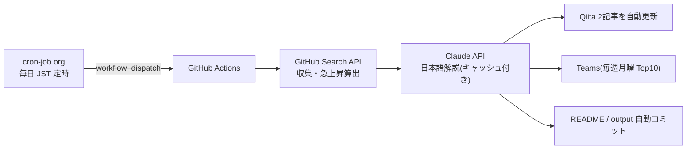

# Claude Code向けMCPツール候補ランキング

GitHub Search APIを使って、Claude Code周辺で活用候補になりそうなMCP関連リポジトリを定期収集するリポジトリです。

> 注意: この一覧は「Claude Codeでの動作」を保証するものではありません。  
> GitHub上のリポジトリ名・説明文・READMEなどに含まれる情報をもとに、MCP関連ツール候補を探すための入口として利用します。

## 仕組み(定常自律運転)

このランキングは cron-job.org → GitHub Actions → Claude API → Qiita / Teams のパイプラインで、毎日無人更新されています。


```mermaid
flowchart LR
    A["cron-job.org<br>毎日 JST 定時"] -->|workflow_dispatch| B["GitHub Actions"]
    B --> C["GitHub Search API<br>収集・急上昇算出"]
    C --> D["Claude API<br>日本語解説(キャッシュ付き)"]
    D --> E["Qiita 2記事を自動更新"]
    D --> F["Teams(毎週月曜 Top10)"]
    D --> G["README / output 自動コミット"]
```

- 仕組みの詳細と**ライブ稼働ステータス**: [定常自律運転ページ](https://takanobusano.github.io/mcp-github-ranking/)
- 作り方の解説記事: [パイプライン編](https://qiita.com/4q_sano/items/913e93ee5cc2731561fc) / [cron-job.org 完全自動化編](https://qiita.com/4q_sano/items/1bc5e0669a8f0166936c)
<!-- MCP_REPOS_START -->
最終更新: **2026-08-07 08:17:17 JST**

MCP関連リポジトリに加え、Claude Code周辺で活用候補になりそうな関連ツールをGitHub Search APIで毎日自動収集してランキング化しています。

Stars / Forks の差分は、UTC基準の前日データ（2026-08-05）との差分です。
CSVには最大500件を保存し、本文では上位100件を表示しています。

> 注意: この一覧はClaude Codeでの動作を保証するものではありません。  
> MCP関連ツールまたはClaude Code関連ツール候補を探すための入口として利用してください。

# 注目MCP・関連ツール候補ランキング

## 1位 [public-apis/public-apis](https://github.com/public-apis/public-apis)

A collective list of free APIs

⭐ **454,745 Stars**（+216）　🍴 **50,180 Forks**（+25）　/　🟢 **1,636 Open Issues**　/　Python

Topics: `api` / `apis` / `dataset` / `development` / `free` / `list` / `lists` / `open-source`

## 2位 [obra/superpowers](https://github.com/obra/superpowers)

An agentic skills framework & software development methodology that works.

⭐ **268,061 Stars**（+787）　🍴 **23,962 Forks**（+84）　/　🟢 **321 Open Issues**　/　Shell

Topics: `ai` / `brainstorming` / `coding` / `obra` / `sdlc` / `skills` / `subagent-driven-development` / `superpowers`

## 3位 [affaan-m/ECC](https://github.com/affaan-m/ECC)

The agent harness performance optimization system. Skills, instincts, memory, security, and research-first development for Claude Code, Codex, Opencode, Cursor and beyond.

⭐ **238,295 Stars**（+286）　🍴 **36,194 Forks**（+48）　/　🟢 **115 Open Issues**　/　JavaScript

Topics: `ai-agents` / `anthropic` / `claude` / `claude-code` / `developer-tools` / `llm` / `mcp` / `productivity`

## 4位 [NousResearch/hermes-agent](https://github.com/NousResearch/hermes-agent)

The agent that grows with you

⭐ **226,575 Stars**（+529）　🍴 **44,206 Forks**（+214）　/　🟢 **29,071 Open Issues**　/　Python

Topics: `ai` / `ai-agent` / `ai-agents` / `anthropic` / `chatgpt` / `claude` / `claude-code` / `clawdbot`

## 5位 [mattpocock/skills](https://github.com/mattpocock/skills)

Skills for Real Engineers. Straight from my .agents directory.

⭐ **206,940 Stars**（+2,042）　🍴 **17,871 Forks**（+188）　/　🟢 **293 Open Issues**　/　Shell

Topics: `topicなし`

## 6位 [multica-ai/andrej-karpathy-skills](https://github.com/multica-ai/andrej-karpathy-skills)

A single CLAUDE.md file to improve Claude Code behavior, derived from Andrej Karpathy's observations on LLM coding pitfalls.

⭐ **200,245 Stars**（+331）　🍴 **20,595 Forks**（+30）　/　🟢 **126 Open Issues**　/　不明

Topics: `topicなし`

## 7位 [ultraworkers/claw-code](https://github.com/ultraworkers/claw-code)

An agent-managed museum exhibit, built in Rust with Gajae-Code / LazyCodex — developed and maintained with no human intervention.

⭐ **194,995 Stars**（+21）　🍴 **109,273 Forks**（-24）　/　🟢 **35 Open Issues**　/　Rust

Topics: `topicなし`

## 8位 [ollama/ollama](https://github.com/ollama/ollama)

Get up and running with Kimi-K2.6, GLM-5.2, MiniMax, DeepSeek, gpt-oss, Qwen, Gemma and other models.

⭐ **177,944 Stars**（+72）　🍴 **17,290 Forks**（+10）　/　🟢 **3,623 Open Issues**　/　Go

Topics: `deepseek` / `gemma` / `gemma3` / `glm` / `go` / `golang` / `gpt-oss` / `llama`

## 9位 [anthropics/skills](https://github.com/anthropics/skills)

Public repository for Agent Skills

⭐ **166,692 Stars**（+211）　🍴 **19,853 Forks**（+29）　/　🟢 **1,067 Open Issues**　/　Python

Topics: `agent-skills`

## 10位 [firecrawl/firecrawl](https://github.com/firecrawl/firecrawl)

The context API to search, scrape, and interact with the web at scale. 🔥

⭐ **162,341 Stars**（+622）　🍴 **9,144 Forks**（+26）　/　🟢 **486 Open Issues**　/　TypeScript

Topics: `ai` / `ai-agents` / `ai-crawler` / `ai-scraping` / `ai-search` / `crawler` / `data-extraction` / `html-to-markdown`

## 11位 [langflow-ai/langflow](https://github.com/langflow-ai/langflow)

Langflow is a powerful tool for building and deploying AI-powered agents and workflows.

⭐ **152,898 Stars**（+33）　🍴 **9,824 Forks**（+17）　/　🟢 **999 Open Issues**　/　Python

Topics: `agents` / `chatgpt` / `generative-ai` / `large-language-models` / `multiagent` / `react-flow`

## 12位 [x1xhlol/system-prompts-and-models-of-ai-tools](https://github.com/x1xhlol/system-prompts-and-models-of-ai-tools)

FULL Augment Code, Claude Code, Cluely, CodeBuddy, Comet, Cursor, Devin AI, Junie, Kiro, Leap.new, Lovable, Manus, NotionAI, Orchids.app, Perplexity, Poke, Qoder, Replit, Same.dev, Trae, Traycer AI, VSCode Agent, Warp.dev, Windsurf, Xcode, Z.ai Code, Dia & v0. (And other Open Sourced) System Prompts, Internal Tools & AI Models

⭐ **142,627 Stars**（+30）　🍴 **34,834 Forks**（+8）　/　🟢 **159 Open Issues**　/　不明

Topics: `ai` / `bolt` / `cluely` / `copilot` / `cursor` / `cursorai` / `devin` / `github-copilot`

## 13位 [anthropics/claude-code](https://github.com/anthropics/claude-code)

Claude Code is an agentic coding tool that lives in your terminal, understands your codebase, and helps you code faster by executing routine tasks, explaining complex code, and handling git workflows - all through natural language commands.

⭐ **140,500 Stars**（+124）　🍴 **22,606 Forks**（+30）　/　🟢 **15,129 Open Issues**　/　Python

Topics: `topicなし`

## 14位 [msitarzewski/agency-agents](https://github.com/msitarzewski/agency-agents)

A complete AI agency at your fingertips - From frontend wizards to Reddit community ninjas, from whimsy injectors to reality checkers. Each agent is a specialized expert with personality, processes, and proven deliverables.

⭐ **138,938 Stars**（+195）　🍴 **22,692 Forks**（+22）　/　🟢 **102 Open Issues**　/　Shell

Topics: `topicなし`

## 15位 [garrytan/gstack](https://github.com/garrytan/gstack)

Use Garry Tan's exact Claude Code setup: 23 opinionated tools that serve as CEO, Designer, Eng Manager, Release Manager, Doc Engineer, and QA

⭐ **126,633 Stars**（+169）　🍴 **19,043 Forks**（+25）　/　🟢 **893 Open Issues**　/　TypeScript

Topics: `topicなし`

## 16位 [farion1231/cc-switch](https://github.com/farion1231/cc-switch)

A cross-platform desktop All-in-One assistant for Claude Code, Codex, OpenCode, OpenClaw, Grok Build & Hermes Agent. Only official website: ccswitch.io

⭐ **125,130 Stars**（+350）　🍴 **8,503 Forks**（+33）　/　🟢 **2,064 Open Issues**　/　Rust

Topics: `ai-tools` / `claude-code` / `codex` / `desktop-app` / `grok` / `grokbuild` / `hermes` / `hermes-agent`

## 17位 [nextlevelbuilder/ui-ux-pro-max-skill](https://github.com/nextlevelbuilder/ui-ux-pro-max-skill)

An AI SKILL that provide design intelligence for building professional UI/UX multiple platforms

⭐ **114,161 Stars**（+348）　🍴 **12,225 Forks**（+52）　/　🟢 **119 Open Issues**　/　Python

Topics: `ai-skills` / `antigravity` / `claude` / `claude-code` / `codex` / `command-line` / `copilot` / `cursor-ai`

## 18位 [browser-use/browser-use](https://github.com/browser-use/browser-use)

🌐 Make websites accessible for AI agents. Automate tasks online with ease.

⭐ **108,091 Stars**（+101）　🍴 **11,879 Forks**（+11）　/　🟢 **347 Open Issues**　/　Python

Topics: `ai-agents` / `ai-tools` / `browser-automation` / `browser-use` / `llm` / `playwright` / `python`

## 19位 [google-gemini/gemini-cli](https://github.com/google-gemini/gemini-cli)

An open-source AI agent that brings the power of Gemini directly into your terminal.

⭐ **106,398 Stars**（+19）　🍴 **14,403 Forks**（+15）　/　🟢 **869 Open Issues**　/　TypeScript

Topics: `ai` / `ai-agents` / `cli` / `gemini` / `gemini-api` / `mcp-client` / `mcp-server`

## 20位 [Graphify-Labs/graphify](https://github.com/Graphify-Labs/graphify)

Turn any codebase, with its docs, SQL schemas, configs, and PDFs, into a queryable knowledge graph. A /graphify skill for Claude Code, Cursor, Codex, and Gemini CLI: local deterministic AST parsing, every edge explained, no vector store.

⭐ **103,493 Stars**（+478）　🍴 **10,061 Forks**（+50）　/　🟢 **845 Open Issues**　/　Python

Topics: `ai-agents` / `antigravity` / `ast` / `claude-code` / `code-analysis` / `code-search` / `codex` / `cursor`

## 21位 [harry0703/MoneyPrinterTurbo](https://github.com/harry0703/MoneyPrinterTurbo)

利用 AI 大模型和自动化工作流，根据主题或关键词一键生成高清短视频。Generate HD short videos from a topic or keyword with an automated AI workflow.

⭐ **101,910 Stars**（+148）　🍴 **15,344 Forks**（+42）　/　🟢 **16 Open Issues**　/　Python

Topics: `ai-video-generator` / `content-creation` / `ffmpeg` / `instagram-reels` / `llm` / `python` / `short-video` / `subtitles`

## 22位 [DietrichGebert/ponytail](https://github.com/DietrichGebert/ponytail)

Makes your AI agent think like the laziest senior dev in the room. The best code is the code you never wrote.

⭐ **97,409 Stars**（+728）　🍴 **5,348 Forks**（+40）　/　🟢 **157 Open Issues**　/　JavaScript

Topics: `agent-skills` / `ai-agents` / `claude` / `claude-code` / `claude-code-plugin` / `cursor-rules` / `developer-tools` / `llm`

## 23位 [JuliusBrussee/caveman](https://github.com/JuliusBrussee/caveman)

🪨 why use many token when few token do trick — Claude Code skill that cuts 65% of tokens by talking like caveman

⭐ **96,467 Stars**（+345）　🍴 **5,547 Forks**（+27）　/　🟢 **468 Open Issues**　/　JavaScript

Topics: `ai` / `anthropic` / `caveman` / `claude` / `claude-code` / `llm` / `meme` / `prompt-engineering`

## 24位 [TauricResearch/TradingAgents](https://github.com/TauricResearch/TradingAgents)

TradingAgents: Multi-Agents LLM Financial Trading Framework

⭐ **95,910 Stars**（+148）　🍴 **18,553 Forks**（+37）　/　🟢 **338 Open Issues**　/　Python

Topics: `agent` / `finance` / `llm` / `multiagent` / `trading`

## 25位 [puppeteer/puppeteer](https://github.com/puppeteer/puppeteer)

JavaScript API for Chrome and Firefox

⭐ **95,416 Stars**（-4）　🍴 **9,563 Forks**（+1）　/　🟢 **264 Open Issues**　/　TypeScript

Topics: `automation` / `chrome` / `chromium` / `developer-tools` / `firefox` / `headless-chrome` / `node-module` / `testing`

## 26位 [microsoft/playwright](https://github.com/microsoft/playwright)

Playwright is a framework for Web Testing and Automation. It allows testing Chromium, Firefox and WebKit with a single API.

⭐ **94,103 Stars**（+60）　🍴 **6,230 Forks**（+8）　/　🟢 **162 Open Issues**　/　TypeScript

Topics: `automation` / `chrome` / `chromium` / `e2e-testing` / `electron` / `end-to-end-testing` / `firefox` / `javascript`

## 27位 [thedotmack/claude-mem](https://github.com/thedotmack/claude-mem)

Persistent Context Across Sessions for Every Agent –  Captures everything your agent does during sessions, compresses it with AI, and injects relevant context back into future sessions. Works with Claude Code, OpenClaw, Codex, Gemini, Hermes, Copilot, OpenCode + More

⭐ **89,871 Stars**（+131）　🍴 **7,827 Forks**（+21）　/　🟢 **368 Open Issues**　/　JavaScript

Topics: `ai` / `ai-agents` / `ai-memory` / `anthropic` / `artificial-intelligence` / `chromadb` / `claude` / `claude-agent-sdk`

## 28位 [modelcontextprotocol/servers](https://github.com/modelcontextprotocol/servers)

Model Context Protocol Servers

⭐ **89,289 Stars**（+47）　🍴 **11,394 Forks**（+5）　/　🟢 **491 Open Issues**　/　TypeScript

Topics: `topicなし`

## 29位 [ChatGPTNextWeb/NextChat](https://github.com/ChatGPTNextWeb/NextChat)

✨ Light and Fast AI Assistant. Support: Web \| iOS \| MacOS \| Android \|  Linux \| Windows

⭐ **88,589 Stars**（+2）　🍴 **59,331 Forks**（-3）　/　🟢 **847 Open Issues**　/　TypeScript

Topics: `calclaude` / `chatgpt` / `claude` / `cross-platform` / `desktop` / `fe` / `gemini` / `gemini-pro`

## 30位 [laravel/laravel](https://github.com/laravel/laravel)

Laravel is a web application framework with expressive, elegant syntax. We’ve already laid the foundation for your next big idea — freeing you to create without sweating the small things.

⭐ **84,773 Stars**（+5）　🍴 **24,902 Forks**（+3）　/　🟢 **31 Open Issues**　/　Blade

Topics: `framework` / `laravel` / `php`

## 31位 [nexu-io/open-design](https://github.com/nexu-io/open-design)

🎨 The open-source Claude Design alternative. 🖥️ Local-first desktop app. 🖼️ Your coding agent becomes the design engine: prototypes, landing pages, dashboards,...

⭐ **84,187 Stars**（+233）　🍴 **9,804 Forks**（+43）　/　🟢 **800 Open Issues**　/　TypeScript

Topics: `agent-skills` / `ai-agents` / `ai-design` / `byok` / `claude-code-for-design` / `claude-design` / `codex-design` / `coding-agents`

## 32位 [OpenHands/OpenHands](https://github.com/OpenHands/OpenHands)

🙌 OpenHands: AI-Driven Development

⭐ **83,290 Stars**（+74）　🍴 **10,744 Forks**（+12）　/　🟢 **353 Open Issues**　/　TypeScript

Topics: `agent` / `artificial-intelligence` / `chatgpt` / `claude-ai` / `cli` / `developer-tools` / `gpt` / `llm`

## 33位 [addyosmani/agent-skills](https://github.com/addyosmani/agent-skills)

Production-grade engineering skills for AI coding agents.

⭐ **82,885 Stars**（+925）　🍴 **8,885 Forks**（+65）　/　🟢 **132 Open Issues**　/　JavaScript

Topics: `agent-skills` / `antigravity` / `claude-code` / `codex` / `cursor` / `skills`

## 34位 [lobehub/lobehub](https://github.com/lobehub/lobehub)

🤯 LobeHub is your Chief Agent Operator, organizing your agents into 7×24 operations by hiring, scheduling, and reporting on your entire AI team.

⭐ **81,339 Stars**（+27）　🍴 **15,778 Forks**（+4）　/　🟢 **681 Open Issues**　/　TypeScript

Topics: `agent` / `agent-collaboration` / `agent-harness` / `ai` / `cao` / `chatgpt` / `chief-agent-operator` / `claude`

## 35位 [OpenCut-app/OpenCut](https://github.com/OpenCut-app/OpenCut)

The open-source CapCut alternative

⭐ **81,307 Stars**（+166）　🍴 **8,059 Forks**（+16）　/　🟢 **366 Open Issues**　/　TypeScript

Topics: `editor` / `oss` / `videoeditor`

## 36位 [bytedance/deer-flow](https://github.com/bytedance/deer-flow)

An open-source long-horizon SuperAgent harness that researches, codes, and creates. With the help of sandboxes, memories, tools, skill, subagents and message gateway, it handles different levels of tasks that could take minutes to hours.

⭐ **79,424 Stars**（+58）　🍴 **10,853 Forks**（+17）　/　🟢 **972 Open Issues**　/　Python

Topics: `agent` / `agentic` / `agentic-framework` / `agentic-workflow` / `ai` / `ai-agents` / `deep-research` / `harness`

## 37位 [koala73/worldmonitor](https://github.com/koala73/worldmonitor)

Real-time global intelligence dashboard. AI-powered news aggregation, geopolitical monitoring, and infrastructure tracking in a unified situational awareness interface

⭐ **79,388 Stars**（+270）　🍴 **11,872 Forks**（+56）　/　🟢 **352 Open Issues**　/　TypeScript

Topics: `agent` / `ai` / `dashboard` / `geopolitics` / `mcp` / `mcp-server` / `monitoring` / `news`

## 38位 [Egonex-AI/Understand-Anything](https://github.com/Egonex-AI/Understand-Anything)

Graphs that teach > graphs that impress. Turn any code into an interactive knowledge graph you can explore, search, and ask questions about. Works with Claude Code, Codex, Cursor, Copilot, Gemini CLI, and more.

⭐ **77,773 Stars**（+113）　🍴 **6,531 Forks**（+12）　/　🟢 **266 Open Issues**　/　TypeScript

Topics: `antigravity-skills` / `business-knowledge` / `claude-code` / `claude-skills` / `codebase-analysis` / `codex` / `codex-skills` / `developer-tools-ai-agent`

## 39位 [unclecode/crawl4ai](https://github.com/unclecode/crawl4ai)

🚀🤖 Crawl4AI: Open-source LLM Friendly Web Crawler & Scraper. Don't be shy, join here:

⭐ **76,996 Stars**（+782）　🍴 **7,955 Forks**（+74）　/　🟢 **140 Open Issues**　/　Python

Topics: `topicなし`

## 40位 [opendatalab/MinerU](https://github.com/opendatalab/MinerU)

Transforms complex documents like PDFs and Office docs into LLM-ready markdown/JSON for your Agentic workflows.

⭐ **76,979 Stars**（+96）　🍴 **6,472 Forks**（+9）　/　🟢 **86 Open Issues**　/　Python

Topics: `ai4science` / `document-analysis` / `docx` / `extract-data` / `layout-analysis` / `ocr` / `parser` / `pdf`

## 41位 [paperclipai/paperclip](https://github.com/paperclipai/paperclip)

The open-source app everyone uses to manage agents at work

⭐ **75,759 Stars**（+57）　🍴 **14,104 Forks**（+11）　/　🟢 **5,067 Open Issues**　/　TypeScript

Topics: `topicなし`

## 42位 [rtk-ai/rtk](https://github.com/rtk-ai/rtk)

CLI proxy that reduces LLM token consumption by 60-90% on common dev commands. Single Rust binary, zero dependencies

⭐ **75,054 Stars**（+149）　🍴 **4,725 Forks**（+11）　/　🟢 **1,889 Open Issues**　/　Rust

Topics: `agentic-coding` / `ai-coding` / `anthropic` / `claude-code` / `cli` / `command-line-tool` / `cost-reduction` / `developer-tools`

## 43位 [abi/screenshot-to-code](https://github.com/abi/screenshot-to-code)

Drop in a screenshot and convert it to clean code (HTML/Tailwind/React/Vue)

⭐ **73,874 Stars**（+16）　🍴 **9,075 Forks**（+1）　/　🟢 **126 Open Issues**　/　Python

Topics: `topicなし`

## 44位 [Eugeny/tabby](https://github.com/Eugeny/tabby)

A terminal for a more modern age

⭐ **73,778 Stars**（+26）　🍴 **4,198 Forks**（+3）　/　🟢 **2,833 Open Issues**　/　TypeScript

Topics: `serial` / `ssh-client` / `telnet-client` / `terminal` / `terminal-emulators`

## 45位 [thedaviddias/Front-End-Checklist](https://github.com/thedaviddias/Front-End-Checklist)

🗂 The essential checklist for modern web development, for humans and AI agents

⭐ **73,449 Stars**（+14）　🍴 **6,662 Forks**（±0）　/　🟢 **4 Open Issues**　/　MDX

Topics: `ai-agent` / `ai-agents` / `checklist` / `css` / `front-end-developer-tool` / `front-end-development` / `frontend` / `guidelines`

## 46位 [shareAI-lab/learn-claude-code](https://github.com/shareAI-lab/learn-claude-code)

Bash is all you need -  A nano claude code–like 「agent harness」, built from 0 to 1

⭐ **73,428 Stars**（+97）　🍴 **11,913 Forks**（+17）　/　🟢 **67 Open Issues**　/　Python

Topics: `agent` / `agent-development` / `ai-agent` / `claude` / `claude-code` / `educational` / `llm` / `python`

## 47位 [Leonxlnx/taste-skill](https://github.com/Leonxlnx/taste-skill)

Taste-Skill - gives your AI good taste. stops the AI from generating boring, generic slop

⭐ **73,175 Stars**（+681）　🍴 **5,031 Forks**（+49）　/　🟢 **53 Open Issues**　/　JavaScript

Topics: `agent` / `ai` / `claude` / `claude-code` / `codex` / `coding` / `design` / `frontend`

## 48位 [D4Vinci/Scrapling](https://github.com/D4Vinci/Scrapling)

🕷️ An adaptive Web Scraping framework that handles everything from a single request to a full-scale crawl!

⭐ **72,881 Stars**（+161）　🍴 **7,258 Forks**（+27）　/　🟢 **10 Open Issues**　/　Python

Topics: `ai` / `ai-scraping` / `automation` / `crawler` / `crawling` / `crawling-python` / `data` / `data-extraction`

## 49位 [daytonaio/daytona](https://github.com/daytonaio/daytona)

Daytona is a Secure and Elastic Infrastructure for Running AI-Generated Code

⭐ **72,039 Stars**（-14）　🍴 **5,655 Forks**（±0）　/　🟢 **440 Open Issues**　/　不明

Topics: `agentic-workflow` / `ai` / `ai-agents` / `ai-runtime` / `ai-sandboxes` / `code-execution` / `code-interpreter` / `developer-tools`

## 50位 [OpenBB-finance/OpenBB](https://github.com/OpenBB-finance/OpenBB)

Open Data Platform for analysts, quants and AI agents.

⭐ **71,489 Stars**（+45）　🍴 **7,319 Forks**（+8）　/　🟢 **102 Open Issues**　/　Python

Topics: `ai` / `crypto` / `derivatives` / `economics` / `equity` / `finance` / `fixed-income` / `machine-learning`

## 51位 [unslothai/unsloth](https://github.com/unslothai/unsloth)

Unsloth is a local UI for training and running Kimi K3, Gemma 4, Qwen3.6, DeepSeek-V4, GLM and other models.

⭐ **69,652 Stars**（+38）　🍴 **6,286 Forks**（+2）　/　🟢 **1,037 Open Issues**　/　Python

Topics: `agent` / `deepseek` / `fine-tuning` / `gemma` / `gemma3` / `gpt-oss` / `llama` / `llama3`

## 52位 [openinterpreter/openinterpreter](https://github.com/openinterpreter/openinterpreter)

A coding agent for open models like Kimi K3

⭐ **67,787 Stars**（+76）　🍴 **5,825 Forks**（+6）　/　🟢 **2 Open Issues**　/　Rust

Topics: `acp` / `coding-agent` / `deepseek` / `kimi` / `qwen` / `rust`

## 53位 [Panniantong/Agent-Reach](https://github.com/Panniantong/Agent-Reach)

Give your AI agent eyes to see the entire internet. Read & search Twitter, Reddit, YouTube, GitHub, Bilibili, XiaoHongShu — one CLI, zero API fees.

⭐ **67,574 Stars**（+557）　🍴 **5,652 Forks**（+74）　/　🟢 **48 Open Issues**　/　Python

Topics: `agent-infrastructure` / `ai-agent` / `ai-search` / `automation` / `bilibili` / `claude-code` / `cli` / `cursor`

## 54位 [code-yeongyu/oh-my-openagent](https://github.com/code-yeongyu/oh-my-openagent)

omo/lazycodex: The coding agent for tokenmaxxers;the one and only agent harness for complex codebases. For your Codex, for your OpenCode

⭐ **67,372 Stars**（+70）　🍴 **5,500 Forks**（+6）　/　🟢 **639 Open Issues**　/　TypeScript

Topics: `ai` / `ai-agents` / `anthropic` / `chatgpt` / `claude` / `claude-skills` / `codex` / `cursor`

## 55位 [ruvnet/ruflo](https://github.com/ruvnet/ruflo)

🌊 The original agent meta-harness. Deploy intelligent multi-player swarms, coordinate autonomous workflows, and build conversational AI systems. Features adapti...

⭐ **67,200 Stars**（+80）　🍴 **8,035 Forks**（+26）　/　🟢 **793 Open Issues**　/　TypeScript

Topics: `agentic-ai` / `agentic-framework` / `agentic-workflow` / `agents` / `ai-agents` / `ai-assistant` / `ai-coding` / `ai-skills`

## 56位 [bradtraversy/design-resources-for-developers](https://github.com/bradtraversy/design-resources-for-developers)

Curated list of design and UI resources from stock photos, web templates, CSS frameworks, UI libraries, tools and much more

⭐ **66,595 Stars**（+10）　🍴 **12,125 Forks**（+1）　/　🟢 **77 Open Issues**　/　不明

Topics: `topicなし`

## 57位 [xtekky/gpt4free](https://github.com/xtekky/gpt4free)

The official gpt4free repository \| various collection of powerful language models \| opus 4.6 gpt 5.3 kimi 2.5 deepseek v3.2 gemini 3

⭐ **66,531 Stars**（-1）　🍴 **13,530 Forks**（-3）　/　🟢 **2 Open Issues**　/　Python

Topics: `chatbot` / `chatbots` / `chatgpt` / `chatgpt-4` / `chatgpt-api` / `chatgpt-free` / `chatgpt4` / `deepseek`

## 58位 [cline/cline](https://github.com/cline/cline)

Autonomous coding agent as an SDK, IDE extension, or CLI assistant.

⭐ **65,775 Stars**（+64）　🍴 **7,060 Forks**（+5）　/　🟢 **933 Open Issues**　/　TypeScript

Topics: `topicなし`

## 59位 [headroomlabs-ai/headroom](https://github.com/headroomlabs-ai/headroom)

Compress tool outputs, logs, files, and RAG chunks before they reach the LLM. 20% fewer tokens for coding agents, 60-95% fewer tokens for JSON, same answers. Library, proxy, MCP server.

⭐ **65,232 Stars**（+194）　🍴 **4,963 Forks**（+18）　/　🟢 **627 Open Issues**　/　Python

Topics: `agent` / `ai` / `anthropic` / `claude-code` / `compression` / `context-engineering` / `context-window` / `cursor`

## 60位 [colbymchenry/codegraph](https://github.com/colbymchenry/codegraph)

Pre-indexed code knowledge graph, auto syncs on code changes, for Claude Code, Codex, Gemini, Cursor, OpenCode, AntiGravity, Kiro, and Hermes Agent — fewer tokens, fewer tool calls, 100% local

⭐ **65,034 Stars**（+246）　🍴 **4,088 Forks**（+20）　/　🟢 **403 Open Issues**　/　C

Topics: `topicなし`

## 61位 [docling-project/docling](https://github.com/docling-project/docling)

Get your documents ready for gen AI

⭐ **64,349 Stars**（+51）　🍴 **4,572 Forks**（+4）　/　🟢 **961 Open Issues**　/　Python

Topics: `ai` / `convert` / `document-parser` / `document-parsing` / `documents` / `docx` / `html` / `markdown`

## 62位 [shanraisshan/claude-code-best-practice](https://github.com/shanraisshan/claude-code-best-practice)

from vibe coding to agentic engineering - practice makes claude perfect

⭐ **64,095 Stars**（+46）　🍴 **6,374 Forks**（±0）　/　🟢 **15 Open Issues**　/　HTML

Topics: `agentic-ai` / `agentic-coding` / `agentic-engineering` / `agentic-workflow` / `ai` / `ai-agents` / `anthropic` / `best-practices`

## 63位 [Fission-AI/OpenSpec](https://github.com/Fission-AI/OpenSpec)

Spec-driven development (SDD) for AI coding assistants.

⭐ **64,085 Stars**（+151）　🍴 **4,420 Forks**（+11）　/　🟢 **179 Open Issues**　/　TypeScript

Topics: `ai` / `context-engineering` / `engineering` / `planning` / `prd` / `sdd` / `sdlc` / `spec`

## 64位 [warpdotdev/warp](https://github.com/warpdotdev/warp)

Warp is an agentic development environment, born out of the terminal.

⭐ **64,017 Stars**（+35）　🍴 **5,391 Forks**（+2）　/　🟢 **4,821 Open Issues**　/　Rust

Topics: `bash` / `linux` / `macos` / `rust` / `shell` / `terminal` / `wasm` / `zsh`

## 65位 [mem0ai/mem0](https://github.com/mem0ai/mem0)

Universal memory layer for AI Agents

⭐ **62,699 Stars**（+89）　🍴 **7,313 Forks**（+12）　/　🟢 **690 Open Issues**　/　Python

Topics: `agents` / `ai` / `ai-agents` / `application` / `chatbots` / `chatgpt` / `genai` / `llm`

## 66位 [asgeirtj/system_prompts_leaks](https://github.com/asgeirtj/system_prompts_leaks)

Extracted system prompts from Anthropic - Claude Fable 5, Opus 5, Claude Design, Claude Code. OpenAI - ChatGPT GPT-5.6-Sol, Codex. Google - Gemini 3.5 Flash, 3.1 Pro, Antigravity. xAI - Grok, Cursor, Copilot, VS Code, Perplexity, and more. Updated regularly.

⭐ **62,466 Stars**（+70）　🍴 **10,264 Forks**（+22）　/　🟢 **49 Open Issues**　/　JavaScript

Topics: `ai` / `ai-agents` / `ai-prompts` / `anthropic` / `chatbot` / `chatgpt` / `claude` / `claude-code`

## 67位 [sansan0/TrendRadar](https://github.com/sansan0/TrendRadar)

⭐AI-driven public opinion & trend monitor with multi-platform aggregation, RSS, and smart alerts.🎯 告别信息过载，你的 AI 舆情监控助手与热点筛选工具！聚合多平台热点 +  RSS 订阅，支持关键词精准筛选。AI 智能筛...

⭐ **61,223 Stars**（+42）　🍴 **24,857 Forks**（+8）　/　🟢 **55 Open Issues**　/　Python

Topics: `ai` / `bark` / `data-analysis` / `docker` / `hot-news` / `llm` / `mail` / `mcp`

## 68位 [1c7/chinese-independent-developer](https://github.com/1c7/chinese-independent-developer)

👩🏿‍💻👨🏾‍💻👩🏼‍💻👨🏽‍💻👩🏻‍💻中国独立开发者项目列表 -- 分享大家都在做什么

⭐ **60,562 Stars**（+44）　🍴 **5,263 Forks**（+8）　/　🟢 **4 Open Issues**　/　Python

Topics: `china` / `indie` / `indie-developer`

## 69位 [tw93/Pake](https://github.com/tw93/Pake)

🤱🏻 Turn any webpage into a desktop app with one command.

⭐ **60,488 Stars**（+17）　🍴 **12,327 Forks**（+7）　/　🟢 **2 Open Issues**　/　Rust

Topics: `chatgpt` / `claude` / `desktop` / `gemini` / `hight-performance` / `linux` / `macos` / `no-electron`

## 70位 [upstash/context7](https://github.com/upstash/context7)

Context7 Platform -- Up-to-date code documentation for LLMs and AI code editors

⭐ **60,355 Stars**（+42）　🍴 **2,899 Forks**（+11）　/　🟢 **34 Open Issues**　/　TypeScript

Topics: `llm` / `mcp` / `mcp-server` / `vibe-coding`

## 71位 [microsoft/autogen](https://github.com/microsoft/autogen)

A programming framework for agentic AI

⭐ **60,271 Stars**（+18）　🍴 **9,081 Forks**（-1）　/　🟢 **977 Open Issues**　/　Python

Topics: `agentic` / `agentic-agi` / `agents` / `ai` / `autogen` / `autogen-ecosystem` / `chatgpt` / `framework`

## 72位 [coollabsio/coolify](https://github.com/coollabsio/coolify)

An open-source, self-hostable PaaS alternative to Vercel, Heroku & Netlify that lets you easily deploy static sites, databases, full-stack applications and 280+ one-click services on your own servers.

⭐ **60,183 Stars**（+34）　🍴 **5,223 Forks**（+8）　/　🟢 **836 Open Issues**　/　PHP

Topics: `coolify` / `databases` / `deployment` / `docker` / `docker-compose` / `inertiajs` / `laravel` / `mariadb`

## 73位 [NanmiCoder/MediaCrawler](https://github.com/NanmiCoder/MediaCrawler)

小红书笔记 \| 评论爬虫、抖音视频 \| 评论爬虫、快手视频 \| 评论爬虫、B 站视频 ｜ 评论爬虫、微博帖子 ｜ 评论爬虫、百度贴吧帖子 ｜ 百度贴吧评论回复爬虫  \| 知乎问答文章｜评论爬虫

⭐ **60,171 Stars**（+107）　🍴 **11,811 Forks**（+7）　/　🟢 **185 Open Issues**　/　Python

Topics: `topicなし`

## 74位 [meilisearch/meilisearch](https://github.com/meilisearch/meilisearch)

A lightning-fast search engine API bringing AI-powered hybrid search to your sites and applications.

⭐ **58,892 Stars**（+24）　🍴 **2,655 Forks**（+1）　/　🟢 **300 Open Issues**　/　Rust

Topics: `ai` / `api` / `app-search` / `database` / `enterprise-search` / `faceting` / `full-text-search` / `fuzzy-search`

## 75位 [penpot/penpot](https://github.com/penpot/penpot)

Penpot: The open-source design platform for Product teams that need scalable collaboration.

⭐ **58,187 Stars**（+33）　🍴 **3,902 Forks**（+5）　/　🟢 **761 Open Issues**　/　Clojure

Topics: `clojure` / `clojurescript` / `design` / `prototyping` / `ui` / `ux-design` / `ux-experience`

## 76位 [MemPalace/mempalace](https://github.com/MemPalace/mempalace)

The best-benchmarked open-source AI memory system. And it's free.

⭐ **58,149 Stars**（+46）　🍴 **7,477 Forks**（+6）　/　🟢 **699 Open Issues**　/　Python

Topics: `ai` / `chromadb` / `llm` / `mcp` / `memory` / `python`

## 77位 [mvanhorn/last30days-skill](https://github.com/mvanhorn/last30days-skill)

AI agent skill that researches any topic across Reddit, X, YouTube, HN, Polymarket, and the web - then synthesizes a grounded summary

⭐ **57,499 Stars**（+126）　🍴 **4,978 Forks**（+20）　/　🟢 **104 Open Issues**　/　Python

Topics: `ai-prompts` / `ai-skill` / `bluesky` / `claude` / `claude-code` / `clawhub` / `deep-research` / `hackernews`

## 78位 [zylon-ai/private-gpt](https://github.com/zylon-ai/private-gpt)

Complete API layer for private AI applications on local models: RAG, skills, tools, MCP, text-to-sql, and more. Works with any OpenAI-compatible inference server.

⭐ **57,413 Stars**（+5）　🍴 **7,608 Forks**（+4）　/　🟢 **3 Open Issues**　/　Python

Topics: `ai` / `ai-tools` / `on-premise`

## 79位 [crewAIInc/crewAI](https://github.com/crewAIInc/crewAI)

Framework for orchestrating role-playing, autonomous AI agents. By fostering collaborative intelligence, CrewAI empowers agents to work together seamlessly, tackling complex tasks.

⭐ **56,705 Stars**（+46）　🍴 **8,086 Forks**（+7）　/　🟢 **771 Open Issues**　/　Python

Topics: `agents` / `ai` / `ai-agents` / `aiagentframework` / `llms`

## 80位 [pbakaus/impeccable](https://github.com/pbakaus/impeccable)

The design language that makes your AI harness better at design.

⭐ **56,278 Stars**（+493）　🍴 **3,425 Forks**（+44）　/　🟢 **47 Open Issues**　/　JavaScript

Topics: `topicなし`

## 81位 [BerriAI/litellm](https://github.com/BerriAI/litellm)

The fastest, litest AI Gateway. Rust core with Python SDK. Call 100+ LLM APIs in OpenAI (or native) format with cost tracking, guardrails, load balancing, and logging [Bedrock, Azure, OpenAI, Anthropic, OpenAI, VertexAI, vLLM, Nvidia NIM]

⭐ **55,750 Stars**（+107）　🍴 **10,382 Forks**（+27）　/　🟢 **4,808 Open Issues**　/　Python

Topics: `ai-gateway` / `anthropic` / `azure-openai` / `bedrock` / `gateway` / `langchain` / `litellm` / `llm`

## 82位 [aaif-goose/goose](https://github.com/aaif-goose/goose)

an open source, extensible AI agent that goes beyond code suggestions - install, execute, edit, and test with any LLM

⭐ **52,466 Stars**（+59）　🍴 **5,941 Forks**（+21）　/　🟢 **310 Open Issues**　/　Rust

Topics: `acp` / `ai` / `ai-agents` / `mcp`

## 83位 [charlax/professional-programming](https://github.com/charlax/professional-programming)

A collection of learning resources for curious software engineers

⭐ **51,333 Stars**（-1）　🍴 **4,009 Forks**（±0）　/　🟢 **6 Open Issues**　/　Python

Topics: `architecture` / `computer-science` / `concepts` / `documentation` / `engineer` / `learning` / `lessons-learned` / `professional`

## 84位 [jamiepine/voicebox](https://github.com/jamiepine/voicebox)

The open-source AI voice studio. Clone, dictate, create.

⭐ **49,583 Stars**（+183）　🍴 **6,113 Forks**（+32）　/　🟢 **588 Open Issues**　/　TypeScript

Topics: `ai` / `cuda` / `mlx` / `qwen3-tts` / `qwen3-tts-ui` / `voice-ai` / `voice-clone` / `whisper`

## 85位 [usestrix/strix](https://github.com/usestrix/strix)

Open-source AI penetration testing tool to find and fix your app’s vulnerabilities.

⭐ **49,364 Stars**（前日なし）　🍴 **5,240 Forks**（前日なし）　/　🟢 **246 Open Issues**　/　Python

Topics: `agents` / `ai-hacking` / `ai-penetration-testing` / `ai-pentesting` / `ai-security` / `artificial-intelligence` / `bug-bounty` / `code-quality`

## 86位 [ChromeDevTools/chrome-devtools-mcp](https://github.com/ChromeDevTools/chrome-devtools-mcp)

Chrome DevTools for coding agents

⭐ **48,646 Stars**（+63）　🍴 **3,377 Forks**（+20）　/　🟢 **119 Open Issues**　/　TypeScript

Topics: `browser` / `chrome` / `chrome-devtools` / `debugging` / `devtools` / `mcp` / `mcp-server` / `puppeteer`

## 87位 [mudler/LocalAI](https://github.com/mudler/LocalAI)

LocalAI is the open-source AI engine. Run any model - LLMs, vision, voice, image, video - on any hardware. No GPU required.

⭐ **48,298 Stars**（+35）　🍴 **4,350 Forks**（+2）　/　🟢 **151 Open Issues**　/　Go

Topics: `agents` / `ai` / `api` / `audio-generation` / `decentralized` / `distributed` / `image-generation` / `libp2p`

## 88位 [prisma/prisma](https://github.com/prisma/prisma)

Next-generation ORM for Node.js & TypeScript \| PostgreSQL, MySQL, MariaDB, SQL Server, SQLite, MongoDB and CockroachDB

⭐ **47,542 Stars**（+6）　🍴 **2,521 Forks**（+3）　/　🟢 **2,508 Open Issues**　/　TypeScript

Topics: `cockroachdb` / `database` / `javascript` / `loggy-core` / `loggy-terminal` / `mariadb` / `mongodb` / `mssql`

## 89位 [oobabooga/textgen](https://github.com/oobabooga/textgen)

Open-source desktop app for local LLMs. Text, vision, tool-calling, OpenAI/Anthropic-compatible API. 100% private.

⭐ **47,532 Stars**（+5）　🍴 **5,983 Forks**（+1）　/　🟢 **834 Open Issues**　/　Python

Topics: `topicなし`

## 90位 [GitHubDaily/GitHubDaily](https://github.com/GitHubDaily/GitHubDaily)

坚持分享 GitHub 上高质量、有趣实用的开源技术教程、开发者工具、编程网站、技术资讯。A list cool, interesting projects of GitHub.

⭐ **47,390 Stars**（+12）　🍴 **4,664 Forks**（+1）　/　🟢 **753 Open Issues**　/　不明

Topics: `ai` / `algorithms-and-data-structures` / `backend` / `developer-tools` / `development` / `frontend` / `github` / `java`

## 91位 [jeecgboot/JeecgBoot](https://github.com/jeecgboot/JeecgBoot)

【低代码迈入v2.0时代，一句话即可生成整个系统】企业级AI低代码平台，一键生成前后端代码甚至整个系统。 AI Skills 一句话画流程、设计表单、生成报表、大屏。内置 AI应用平台涵盖：AI聊天、知识库、流程编排、MCP插件等，兼容主流大模型。引领AI低代码「Skills 生成 → 在线配置 → 代码生成 → 手工...

⭐ **47,302 Stars**（+12）　🍴 **16,136 Forks**（+5）　/　🟢 **39 Open Issues**　/　Java

Topics: `activiti` / `agent` / `ai` / `antd` / `claude-code` / `cli` / `codegenerator` / `codex`

## 92位 [HKUDS/CLI-Anything](https://github.com/HKUDS/CLI-Anything)

"CLI-Anything: Making ALL Software Agent-Native" -- CLI-Hub:

⭐ **46,731 Stars**（+61）　🍴 **4,352 Forks**（+7）　/　🟢 **76 Open Issues**　/　Python

Topics: `topicなし`

## 93位 [exo-explore/exo](https://github.com/exo-explore/exo)

Run frontier AI locally.

⭐ **46,697 Stars**（+26）　🍴 **3,411 Forks**（+4）　/　🟢 **330 Open Issues**　/　Python

Topics: `topicなし`

## 94位 [KeygraphHQ/shannon](https://github.com/KeygraphHQ/shannon)

Shannon is an AI pentester for web applications and APIs. It analyzes your source code, identifies attack vectors, and executes real exploits to prove vulnerabilities before they reach production.

⭐ **46,489 Stars**（+21）　🍴 **5,367 Forks**（+3）　/　🟢 **32 Open Issues**　/　TypeScript

Topics: `agents` / `ai-penetration-testing` / `ai-security` / `cybersecurity` / `ethical-hacking` / `offensive-security` / `penetration-testing` / `pentesting`

## 95位 [apache/airflow](https://github.com/apache/airflow)

Apache Airflow - A platform to programmatically author, schedule, and monitor workflows

⭐ **46,403 Stars**（+14）　🍴 **17,534 Forks**（+6）　/　🟢 **1,868 Open Issues**　/　Python

Topics: `airflow` / `apache` / `apache-airflow` / `automation` / `dag` / `data-engineering` / `data-integration` / `data-orchestrator`

## 96位 [router-for-me/CLIProxyAPI](https://github.com/router-for-me/CLIProxyAPI)

Wrap Antigravity, ChatGPT Codex, Claude Code, Grok Build as an OpenAI/Gemini/Claude/Codex compatible API service, allowing you to enjoy the free Gemini 3.1 Pro, GPT 5.6 Series, Grok 4.5, Claude model through API

⭐ **46,379 Stars**（+110）　🍴 **7,202 Forks**（+14）　/　🟢 **384 Open Issues**　/　Go

Topics: `antigravity` / `claude-code` / `cluade` / `codex` / `gemini` / `openai`

## 97位 [zhayujie/CowAgent](https://github.com/zhayujie/CowAgent)

Open-source super AI assistant & Agent Harness. Plans tasks, runs tools and skills, self-evolves with memory and knowledge. Multi-model, multi-channel. Lightweight, extensible, one-line install. (formerly chatgpt-on-wechat)

⭐ **46,378 Stars**（+32）　🍴 **10,298 Forks**（+3）　/　🟢 **30 Open Issues**　/　Python

Topics: `ai` / `ai-agent` / `ai-agents` / `chatgpt-on-wechat` / `claude` / `claude-code` / `codex` / `cowagent`

## 98位 [rohitg00/ai-engineering-from-scratch](https://github.com/rohitg00/ai-engineering-from-scratch)

Learn it. Build it. Ship it for others.

⭐ **46,110 Stars**（+94）　🍴 **7,978 Forks**（+31）　/　🟢 **105 Open Issues**　/　Python

Topics: `agents` / `ai` / `ai-agents` / `ai-engineering` / `computer-vision` / `course` / `deep-learning` / `from-scratch`

## 99位 [calesthio/OpenMontage](https://github.com/calesthio/OpenMontage)

World's first open-source, agentic video production system. 12 production pipelines, 100+ tools, 700+ agent skill and production-knowledge files. Turn your AI coding assistant into a full video production studio.

⭐ **45,527 Stars**（+222）　🍴 **5,635 Forks**（+43）　/　🟢 **208 Open Issues**　/　Python

Topics: `agent` / `agentic-ai` / `ai` / `claude` / `copilot` / `cursor` / `elevenlabs` / `ffmpeg`

## 100位 [abhigyanpatwari/GitNexus](https://github.com/abhigyanpatwari/GitNexus)

GitNexus: The Zero-Server Code Intelligence Engine -       GitNexus is a client-side knowledge graph creator that runs entirely in your browser. Drop in a git repository (Github, Gitlab, Azure, Local) or ZIP file, and get an interactive knowledge graph with a built in Graph RAG Agent. Perfect for code exploration

⭐ **45,139 Stars**（+36）　🍴 **4,999 Forks**（±0）　/　🟢 **284 Open Issues**　/　TypeScript

Topics: `topicなし`

# 最近プッシュされたMCP・関連ツール候補

スター数ランキングとは別に、最近コードがプッシュされたリポジトリを表示します。古いスター数だけではなく、現在も開発が動いていそうな候補を探すための一覧です。

## プッシュ順 1位 [QwenLM/qwen-code](https://github.com/QwenLM/qwen-code)

An open-source AI coding agent that lives in your terminal.

⭐ **26,797 Stars**（+47）　🍴 **2,797 Forks**（+8）　/　TypeScript　/　最終プッシュ: 2026-08-06

Topics: `agentic` / `ai` / `ai-agent` / `ai-coding` / `cli` / `coding-agent` / `developer-tools` / `llm`

## プッシュ順 2位 [paperclipai/paperclip](https://github.com/paperclipai/paperclip)

The open-source app everyone uses to manage agents at work

⭐ **75,759 Stars**（+57）　🍴 **14,104 Forks**（+11）　/　TypeScript　/　最終プッシュ: 2026-08-06

Topics: `topicなし`

## プッシュ順 3位 [getpaseo/paseo](https://github.com/getpaseo/paseo)

Orchestrate multiple coding agents from desktop and mobile

⭐ **12,473 Stars**（+186）　🍴 **1,275 Forks**（+21）　/　TypeScript　/　最終プッシュ: 2026-08-06

Topics: `ade` / `agents` / `android` / `claude-code` / `codex` / `copilot` / `developer-tools` / `hermes`

## プッシュ順 4位 [heygen-com/hyperframes](https://github.com/heygen-com/hyperframes)

Write HTML. Render video. Built for agents.

⭐ **39,787 Stars**（+167）　🍴 **3,773 Forks**（+19）　/　TypeScript　/　最終プッシュ: 2026-08-06

Topics: `ai` / `animation` / `ffmpeg` / `framework` / `gsap` / `html` / `mcp` / `puppeteer`

## プッシュ順 5位 [Skyvern-AI/skyvern](https://github.com/Skyvern-AI/skyvern)

Automate browser based workflows with AI

⭐ **22,687 Stars**（+8）　🍴 **2,136 Forks**（±0）　/　Python　/　最終プッシュ: 2026-08-06

Topics: `ai` / `api` / `automation` / `browser` / `browser-automation` / `computer` / `gpt` / `llm`

## プッシュ順 6位 [SimplifyJobs/New-Grad-Positions](https://github.com/SimplifyJobs/New-Grad-Positions)

A collection of full time roles in SWE, Quant, and PM for new grads.

⭐ **17,584 Stars**（+24）　🍴 **1,302 Forks**（±0）　/　不明　/　最終プッシュ: 2026-08-06

Topics: `applications` / `coderquad` / `college` / `fulltime` / `hacktoberfest` / `jobs` / `newgrad` / `position`

## プッシュ順 7位 [datahub-project/datahub](https://github.com/datahub-project/datahub)

The Context Platform for your Data and AI Stack

⭐ **12,464 Stars**（+11）　🍴 **3,619 Forks**（+4）　/　Python　/　最終プッシュ: 2026-08-06

Topics: `agent-platform` / `context-management` / `data-catalog` / `data-discovery` / `data-governance` / `data-observability` / `datahub` / `metadata`

## プッシュ順 8位 [pydantic/pydantic-ai](https://github.com/pydantic/pydantic-ai)

AI Agent Framework, the Pydantic way

⭐ **19,103 Stars**（+27）　🍴 **2,487 Forks**（+4）　/　Python　/　最終プッシュ: 2026-08-06

Topics: `agent-framework` / `genai` / `llm` / `pydantic` / `python`

## プッシュ順 9位 [herdrdev/herdr](https://github.com/herdrdev/herdr)

the runtime your coding agents live on

⭐ **25,082 Stars**（+425）　🍴 **1,768 Forks**（+37）　/　Rust　/　最終プッシュ: 2026-08-06

Topics: `agent` / `agent-orchestration` / `ai` / `ai-agents` / `claude-code` / `cli` / `codex` / `coding-agents`

## プッシュ順 10位 [lightpanda-io/browser](https://github.com/lightpanda-io/browser)

Lightpanda: the headless browser designed for AI and automation

⭐ **33,538 Stars**（+37）　🍴 **1,539 Forks**（+3）　/　Zig　/　最終プッシュ: 2026-08-06

Topics: `browser` / `browser-automation` / `cdp` / `headless` / `lightpanda` / `playwright` / `puppeteer` / `zig`

## プッシュ順 11位 [agno-agi/agno](https://github.com/agno-agi/agno)

Build, run, and manage agent platforms.

⭐ **41,608 Stars**（+13）　🍴 **5,745 Forks**（+8）　/　Python　/　最終プッシュ: 2026-08-06

Topics: `agents` / `ai` / `ai-agents` / `developer-tools` / `python`

## プッシュ順 12位 [Arize-ai/phoenix](https://github.com/Arize-ai/phoenix)

AI Observability & Evaluation

⭐ **10,927 Stars**（+18）　🍴 **1,042 Forks**（+4）　/　Python　/　最終プッシュ: 2026-08-06

Topics: `agents` / `ai-monitoring` / `ai-observability` / `aiengineering` / `anthropic` / `datasets` / `evals` / `langchain`

## プッシュ順 13位 [manaflow-ai/cmux](https://github.com/manaflow-ai/cmux)

Open source Ghostty-based macOS terminal with vertical tabs and notifications for AI coding agents. Built for multitasking, organization, and programmability.

⭐ **25,696 Stars**（+48）　🍴 **2,161 Forks**（+5）　/　Swift　/　最終プッシュ: 2026-08-06

Topics: `amp` / `claude-code` / `cli` / `codex` / `coding-agents` / `gemini` / `ghostty` / `macos`

## プッシュ順 14位 [elizaOS/eliza](https://github.com/elizaOS/eliza)

Open source agentic operating system

⭐ **18,915 Stars**（+7）　🍴 **5,610 Forks**（+4）　/　TypeScript　/　最終プッシュ: 2026-08-06

Topics: `agent` / `agentic` / `ai` / `autonomous` / `chatbot` / `crypto` / `discord` / `eliza`

## プッシュ順 15位 [screenpipe/screenpipe](https://github.com/screenpipe/screenpipe)

YC (S26) \| Record your screen 24/7 and plug into your agents. Local, private, secure. Connect to OpenClaw, Hermes agent and 100+ apps

⭐ **20,785 Stars**（+22）　🍴 **2,072 Forks**（+7）　/　Rust　/　最終プッシュ: 2026-08-06

Topics: `agents` / `agi` / `ai` / `ai-memory` / `audio-recording` / `computer-vision` / `hermes` / `hermes-agent`

## プッシュ順 16位 [mastra-ai/mastra](https://github.com/mastra-ai/mastra)

Mastra is the modern TypeScript framework for AI-powered applications and agents.

⭐ **26,993 Stars**（+43）　🍴 **2,580 Forks**（+4）　/　TypeScript　/　最終プッシュ: 2026-08-06

Topics: `agents` / `ai` / `chatbots` / `evals` / `javascript` / `llm` / `mcp` / `nextjs`

## プッシュ順 17位 [NVIDIA/NemoClaw](https://github.com/NVIDIA/NemoClaw)

Run agents like Hermes, LangChain Deep Agents, and OpenClaw more securely inside NVIDIA OpenShell with managed inference

⭐ **22,079 Stars**（+16）　🍴 **3,004 Forks**（±0）　/　TypeScript　/　最終プッシュ: 2026-08-06

Topics: `ai-agents` / `hermes` / `nvidia` / `openclaw` / `openshell` / `sandboxing` / `typescript`

## プッシュ順 18位 [stablyai/orca](https://github.com/stablyai/orca)

Orca is the ADE for working with a fleet of parallel agents. Run any coding agent with your own subscription. Available on desktop, mobile and VPS.

⭐ **38,920 Stars**（+799）　🍴 **2,744 Forks**（+53）　/　TypeScript　/　最終プッシュ: 2026-08-06

Topics: `ade` / `agent-ide` / `ai-agents` / `claude-code` / `cli` / `codex` / `cursor-agent` / `devtools`

## プッシュ順 19位 [sgl-project/sglang](https://github.com/sgl-project/sglang)

SGLang is a high-performance serving framework for large language models and multimodal models.

⭐ **31,431 Stars**（+70）　🍴 **7,707 Forks**（+30）　/　Python　/　最終プッシュ: 2026-08-06

Topics: `attention` / `blackwell` / `cuda` / `deepseek` / `diffusion` / `glm` / `gpt-oss` / `inference`

## プッシュ順 20位 [NanmiCoder/cc-haha](https://github.com/NanmiCoder/cc-haha)

Local-first cross-platform desktop workspace for Claude Code / agents: multi-agent, Git worktrees, code diffs, skill marketplace, multi-model, Computer Use, task-aware desktop pets, with WeChat, Feishu, DingTalk, Telegram, WhatsApp and H5 access.

⭐ **13,958 Stars**（+26）　🍴 **8,532 Forks**（+6）　/　TypeScript　/　最終プッシュ: 2026-08-06

Topics: `agent` / `ai` / `ai-agent` / `anthropic` / `claude` / `claude-code` / `coding-agent` / `computer-use`

## プッシュ順 21位 [SigNoz/signoz](https://github.com/SigNoz/signoz)

SigNoz is an open-source, OpenTelemetry-native observability platform for your team and their AI agents. Get logs, metrics, and traces in one tool with features like APM, distributed tracing, log management, infra monitoring, etc. Combined with SigNoz MCP and a native AI teammate (in SigNoz Cloud) it helps you build more resilient apps.

⭐ **31,783 Stars**（+5）　🍴 **2,408 Forks**（-2）　/　TypeScript　/　最終プッシュ: 2026-08-06

Topics: `apm` / `application-monitoring` / `distributed-tracing` / `go` / `good-first-issue` / `jaeger` / `log` / `logs`

## プッシュ順 22位 [aaif-goose/goose](https://github.com/aaif-goose/goose)

an open source, extensible AI agent that goes beyond code suggestions - install, execute, edit, and test with any LLM

⭐ **52,466 Stars**（+59）　🍴 **5,941 Forks**（+21）　/　Rust　/　最終プッシュ: 2026-08-06

Topics: `acp` / `ai` / `ai-agents` / `mcp`

## プッシュ順 23位 [obra/superpowers](https://github.com/obra/superpowers)

An agentic skills framework & software development methodology that works.

⭐ **268,061 Stars**（+787）　🍴 **23,962 Forks**（+84）　/　Shell　/　最終プッシュ: 2026-08-06

Topics: `ai` / `brainstorming` / `coding` / `obra` / `sdlc` / `skills` / `subagent-driven-development` / `superpowers`

## プッシュ順 24位 [cline/cline](https://github.com/cline/cline)

Autonomous coding agent as an SDK, IDE extension, or CLI assistant.

⭐ **65,775 Stars**（+64）　🍴 **7,060 Forks**（+5）　/　TypeScript　/　最終プッシュ: 2026-08-06

Topics: `topicなし`

## プッシュ順 25位 [InsForge/InsForge](https://github.com/InsForge/InsForge)

The all-in-one, open-source backend platform for agentic coding. InsForge gives your coding agent database, auth, storage, compute, hosting, and AI gateway to ship full-stack apps end-to-end.

⭐ **12,662 Stars**（+9）　🍴 **1,114 Forks**（+1）　/　TypeScript　/　最終プッシュ: 2026-08-06

Topics: `ai` / `ai-agents` / `coding` / `deno` / `embeddings` / `insforge` / `nextjs` / `oauth2`

## プッシュ順 26位 [BerriAI/litellm](https://github.com/BerriAI/litellm)

The fastest, litest AI Gateway. Rust core with Python SDK. Call 100+ LLM APIs in OpenAI (or native) format with cost tracking, guardrails, load balancing, and logging [Bedrock, Azure, OpenAI, Anthropic, OpenAI, VertexAI, vLLM, Nvidia NIM]

⭐ **55,750 Stars**（+107）　🍴 **10,382 Forks**（+27）　/　Python　/　最終プッシュ: 2026-08-06

Topics: `ai-gateway` / `anthropic` / `azure-openai` / `bedrock` / `gateway` / `langchain` / `litellm` / `llm`

## プッシュ順 27位 [PostHog/posthog](https://github.com/PostHog/posthog)

:hedgehog: PostHog is the leading platform for building self-driving products. Our developer tools – AI observability, analytics, session replay, flags, experiments, error tracking, logs, and more – capture all the context agents need to diagnose problems, uncover opportunities, and ship fixes. Steer it all from Slack, web, desktop, or the MCP.

⭐ **37,536 Stars**（+18）　🍴 **3,151 Forks**（+5）　/　Python　/　最終プッシュ: 2026-08-06

Topics: `ab-testing` / `ai-analytics` / `analytics` / `cdp` / `data-warehouse` / `experiments` / `feature-flags` / `javascript`

## プッシュ順 28位 [block/buzz](https://github.com/block/buzz)

A hive mind communication platform

⭐ **24,188 Stars**（+1,072）　🍴 **2,762 Forks**（+140）　/　Rust　/　最終プッシュ: 2026-08-06

Topics: `topicなし`

## プッシュ順 29位 [warpdotdev/warp](https://github.com/warpdotdev/warp)

Warp is an agentic development environment, born out of the terminal.

⭐ **64,017 Stars**（+35）　🍴 **5,391 Forks**（+2）　/　Rust　/　最終プッシュ: 2026-08-06

Topics: `bash` / `linux` / `macos` / `rust` / `shell` / `terminal` / `wasm` / `zsh`

## プッシュ順 30位 [PrefectHQ/fastmcp](https://github.com/PrefectHQ/fastmcp)

🚀 The fast, Pythonic way to build MCP servers and clients.

⭐ **27,096 Stars**（+15）　🍴 **2,229 Forks**（+4）　/　Python　/　最終プッシュ: 2026-08-06

Topics: `agents` / `fastmcp` / `llms` / `mcp` / `mcp-clients` / `mcp-servers` / `mcp-tools` / `model-context-protocol`

# 検索条件

以下の検索条件でGitHubリポジトリを収集しています。

- "model context protocol" in:name,description,readme stars:>10
- "mcp server" in:name,description,readme stars:>10
- "mcp" "claude" in:name,description,readme stars:>10
- "claude" "mcp" in:name,description,readme stars:>10
- "modelcontextprotocol" in:name,description,readme stars:>10
- "claude code" in:name,description,readme stars:>10
- "claude" "plugin" in:name,description,readme stars:>10
- "claude" "memory" in:name,description,readme stars:>10

<!-- MCP_REPOS_END -->

## 仕組み

```text
GitHub Search API
  ↓
MCP / Claude Code / Model Context Protocol 関連リポジトリを検索
  ↓
スター数・更新日・Fork数・説明文を取得
  ↓
Markdown / CSV を生成
  ↓
GitHub Actionsで毎日自動実行
  ↓
READMEを自動更新
