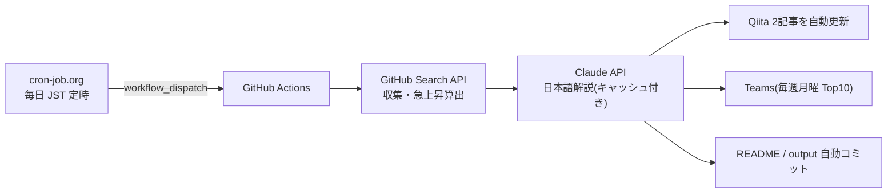

# Claude Code向けMCPツール候補ランキング

GitHub Search APIを使って、Claude Code周辺で活用候補になりそうなMCP関連リポジトリを定期収集するリポジトリです。

> 注意: この一覧は「Claude Codeでの動作」を保証するものではありません。  
> GitHub上のリポジトリ名・説明文・READMEなどに含まれる情報をもとに、MCP関連ツール候補を探すための入口として利用します。

## 仕組み(定常自律運転)

このランキングは cron-job.org → GitHub Actions → Claude API → Qiita / Teams のパイプラインで、毎日無人更新されています。


```mermaid
flowchart LR
    A["cron-job.org<br>毎日 JST 定時"] -->|workflow_dispatch| B["GitHub Actions"]
    B --> C["GitHub Search API<br>収集・急上昇算出"]
    C --> D["Claude API<br>日本語解説(キャッシュ付き)"]
    D --> E["Qiita 2記事を自動更新"]
    D --> F["Teams(毎週月曜 Top10)"]
    D --> G["README / output 自動コミット"]
```

- 仕組みの詳細と**ライブ稼働ステータス**: [定常自律運転ページ](https://takanobusano.github.io/mcp-github-ranking/)
- 作り方の解説記事: [パイプライン編](https://qiita.com/4q_sano/items/913e93ee5cc2731561fc) / [cron-job.org 完全自動化編](https://qiita.com/4q_sano/items/1bc5e0669a8f0166936c)
<!-- MCP_REPOS_START -->
最終更新: **2026-09-08 08:17:11 JST**

MCP関連リポジトリに加え、Claude Code周辺で活用候補になりそうな関連ツールをGitHub Search APIで毎日自動収集してランキング化しています。

Stars / Forks の差分は、UTC基準の前日データ（2026-09-06）との差分です。
CSVには最大500件を保存し、本文では上位100件を表示しています。

> 注意: この一覧はClaude Codeでの動作を保証するものではありません。  
> MCP関連ツールまたはClaude Code関連ツール候補を探すための入口として利用してください。

# 注目MCP・関連ツール候補ランキング

## 1位 [public-apis/public-apis](https://github.com/public-apis/public-apis)

A collective list of free APIs

⭐ **477,008 Stars**（+531）　🍴 **52,653 Forks**（+44）　/　🟢 **1,899 Open Issues**　/　Python

Topics: `api` / `apis` / `dataset` / `development` / `free` / `list` / `lists` / `open-source`

## 2位 [openclaw/openclaw](https://github.com/openclaw/openclaw)

The AI that really does things. Any OS. Any Platform. The lobster way. 🦞

⭐ **389,138 Stars**（前日なし）　🍴 **81,772 Forks**（前日なし）　/　🟢 **6,308 Open Issues**　/　TypeScript

Topics: `ai` / `assistant` / `crustacean` / `molty` / `openclaw` / `own-your-data` / `personal`

## 3位 [obra/superpowers](https://github.com/obra/superpowers)

An agentic skills framework & software development methodology that works.

⭐ **282,821 Stars**（+427）　🍴 **25,347 Forks**（+40）　/　🟢 **339 Open Issues**　/　Shell

Topics: `ai` / `brainstorming` / `coding` / `obra` / `sdlc` / `skills` / `subagent-driven-development` / `superpowers`

## 4位 [mattpocock/skills](https://github.com/mattpocock/skills)

Skills for Real Engineers. Straight from my .agents directory.

⭐ **256,051 Stars**（+1,586）　🍴 **21,563 Forks**（+103）　/　🟢 **471 Open Issues**　/　Shell

Topics: `topicなし`

## 5位 [affaan-m/ECC](https://github.com/affaan-m/ECC)

The agent harness performance optimization system. Skills, instincts, memory, security, and research-first development for Claude Code, Codex, Opencode, Cursor and beyond.

⭐ **252,789 Stars**（+1,541）　🍴 **37,921 Forks**（+150）　/　🟢 **167 Open Issues**　/　JavaScript

Topics: `ai-agents` / `anthropic` / `claude` / `claude-code` / `developer-tools` / `llm` / `mcp` / `productivity`

## 6位 [NousResearch/hermes-agent](https://github.com/NousResearch/hermes-agent)

The agent that grows with you

⭐ **243,039 Stars**（+519）　🍴 **50,033 Forks**（+159）　/　🟢 **40,557 Open Issues**　/　Python

Topics: `ai` / `ai-agent` / `ai-agents` / `anthropic` / `chatgpt` / `claude` / `claude-code` / `codex`

## 7位 [multica-ai/andrej-karpathy-skills](https://github.com/multica-ai/andrej-karpathy-skills)

A single CLAUDE.md file to improve Claude Code behavior, derived from Andrej Karpathy's observations on LLM coding pitfalls.

⭐ **210,898 Stars**（+300）　🍴 **21,437 Forks**（+27）　/　🟢 **129 Open Issues**　/　不明

Topics: `topicなし`

## 8位 [ultraworkers/claw-code](https://github.com/ultraworkers/claw-code)

An agent-managed museum exhibit, built in Rust with Gajae-Code / LazyCodex — developed and maintained with no human intervention.

⭐ **195,189 Stars**（+1）　🍴 **108,664 Forks**（-21）　/　🟢 **41 Open Issues**　/　Rust

Topics: `topicなし`

## 9位 [ollama/ollama](https://github.com/ollama/ollama)

Get up and running with Kimi-K2.6, GLM-5.2, MiniMax, DeepSeek, gpt-oss, Qwen, Gemma and other models.

⭐ **180,414 Stars**（+109）　🍴 **17,754 Forks**（+25）　/　🟢 **3,923 Open Issues**　/　Go

Topics: `deepseek` / `gemma` / `gemma3` / `glm` / `go` / `golang` / `gpt-oss` / `llama`

## 10位 [firecrawl/firecrawl](https://github.com/firecrawl/firecrawl)

The context API to search, scrape, and interact with the web at scale. 🔥

⭐ **177,639 Stars**（+373）　🍴 **9,695 Forks**（+13）　/　🟢 **606 Open Issues**　/　TypeScript

Topics: `ai` / `ai-agents` / `ai-crawler` / `ai-scraping` / `ai-search` / `crawler` / `data-extraction` / `html-to-markdown`

## 11位 [anthropics/skills](https://github.com/anthropics/skills)

Public repository for Agent Skills

⭐ **175,034 Stars**（+184）　🍴 **20,723 Forks**（+21）　/　🟢 **1,219 Open Issues**　/　Python

Topics: `agent-skills`

## 12位 [langflow-ai/langflow](https://github.com/langflow-ai/langflow)

Langflow is a powerful tool for building and deploying AI-powered agents and workflows.

⭐ **154,406 Stars**（+60）　🍴 **10,045 Forks**（+13）　/　🟢 **1,064 Open Issues**　/　Python

Topics: `agents` / `chatgpt` / `generative-ai` / `large-language-models` / `multiagent` / `react-flow`

## 13位 [msitarzewski/agency-agents](https://github.com/msitarzewski/agency-agents)

A complete AI agency at your fingertips - From frontend wizards to Reddit community ninjas, from whimsy injectors to reality checkers. Each agent is a specialized expert with personality, processes, and proven deliverables.

⭐ **150,760 Stars**（+297）　🍴 **24,285 Forks**（+31）　/　🟢 **144 Open Issues**　/　Shell

Topics: `topicなし`

## 14位 [anthropics/claude-code](https://github.com/anthropics/claude-code)

Claude Code is an agentic coding tool that lives in your terminal, understands your codebase, and helps you code faster by executing routine tasks, explaining complex code, and handling git workflows - all through natural language commands.

⭐ **144,366 Stars**（+102）　🍴 **23,061 Forks**（+16）　/　🟢 **12,840 Open Issues**　/　Python

Topics: `topicなし`

## 15位 [x1xhlol/system-prompts-and-models-of-ai-tools](https://github.com/x1xhlol/system-prompts-and-models-of-ai-tools)

FULL Augment Code, Claude Code, Cluely, CodeBuddy, Comet, Cursor, Devin AI, Junie, Kiro, Leap.new, Lovable, Manus, NotionAI, Orchids.app, Perplexity, Poke, Qoder, Replit, Same.dev, Trae, Traycer AI, VSCode Agent, Warp.dev, Windsurf, Xcode, Z.ai Code, Dia & v0. (And other Open Sourced) System Prompts, Internal Tools & AI Models

⭐ **143,433 Stars**（+21）　🍴 **34,821 Forks**（-6）　/　🟢 **161 Open Issues**　/　不明

Topics: `ai` / `bolt` / `cluely` / `copilot` / `cursor` / `cursorai` / `devin` / `github-copilot`

## 16位 [garrytan/gstack](https://github.com/garrytan/gstack)

Use Garry Tan's exact Claude Code setup: 23 opinionated tools that serve as CEO, Designer, Eng Manager, Release Manager, Doc Engineer, and QA

⭐ **131,970 Stars**（+181）　🍴 **19,764 Forks**（+20）　/　🟢 **865 Open Issues**　/　TypeScript

Topics: `topicなし`

## 17位 [farion1231/cc-switch](https://github.com/farion1231/cc-switch)

A cross-platform desktop All-in-One assistant for Claude Code, Codex, OpenCode, OpenClaw, Grok Build & Hermes Agent. Only official website: ccswitch.io

⭐ **131,539 Stars**（+180）　🍴 **9,057 Forks**（+8）　/　🟢 **2,592 Open Issues**　/　Rust

Topics: `ai-tools` / `claude-code` / `codex` / `desktop-app` / `grok` / `grokbuild` / `hermes` / `hermes-agent`

## 18位 [DietrichGebert/ponytail](https://github.com/DietrichGebert/ponytail)

Makes your AI agent think like the laziest senior dev in the room. The best code is the code you never wrote.

⭐ **130,908 Stars**（+1,621）　🍴 **7,013 Forks**（+88）　/　🟢 **228 Open Issues**　/　JavaScript

Topics: `agent-skills` / `ai-agents` / `claude` / `claude-code` / `claude-code-plugin` / `cursor-rules` / `developer-tools` / `llm`

## 19位 [nextlevelbuilder/ui-ux-pro-max-skill](https://github.com/nextlevelbuilder/ui-ux-pro-max-skill)

An AI skill that provides design intelligence for building professional UI/UX across multiple platforms.

⭐ **125,805 Stars**（+291）　🍴 **13,455 Forks**（+22）　/　🟢 **83 Open Issues**　/　Python

Topics: `ai-skills` / `antigravity` / `claude` / `claude-code` / `codex` / `command-line` / `copilot` / `cursor-ai`

## 20位 [harry0703/MoneyPrinterTurbo](https://github.com/harry0703/MoneyPrinterTurbo)

利用 AI 大模型和自动化工作流，根据主题或关键词一键生成高清短视频。Generate HD short videos from a topic or keyword with an automated AI workflow.

⭐ **121,348 Stars**（+227）　🍴 **18,712 Forks**（+60）　/　🟢 **25 Open Issues**　/　Python

Topics: `ai-video-generator` / `content-creation` / `ffmpeg` / `instagram-reels` / `llm` / `python` / `short-video` / `subtitles`

## 21位 [Graphify-Labs/graphify](https://github.com/Graphify-Labs/graphify)

Turn any codebase, with its docs, SQL schemas, configs, and PDFs, into a queryable knowledge graph. A /graphify skill for Claude Code, Cursor, Codex, and Gemini CLI: local deterministic AST parsing, every edge explained, no vector store.

⭐ **115,687 Stars**（+343）　🍴 **11,225 Forks**（+21）　/　🟢 **1,262 Open Issues**　/　Python

Topics: `ai-agents` / `antigravity` / `ast` / `claude-code` / `code-analysis` / `code-search` / `codex` / `cursor`

## 22位 [browser-use/browser-use](https://github.com/browser-use/browser-use)

🌐 Make websites accessible for AI agents. Automate tasks online with ease.

⭐ **112,938 Stars**（+248）　🍴 **12,457 Forks**（+39）　/　🟢 **401 Open Issues**　/　Python

Topics: `ai-agents` / `ai-tools` / `browser-automation` / `browser-use` / `llm` / `playwright` / `python`

## 23位 [google-gemini/gemini-cli](https://github.com/google-gemini/gemini-cli)

An open-source AI agent that brings the power of Gemini directly into your terminal.

⭐ **106,851 Stars**（+13）　🍴 **14,540 Forks**（+5）　/　🟢 **841 Open Issues**　/　TypeScript

Topics: `ai` / `ai-agents` / `cli` / `gemini` / `gemini-api` / `mcp-client` / `mcp-server`

## 24位 [JuliusBrussee/caveman](https://github.com/JuliusBrussee/caveman)

🪨 why use many token when few token do trick — Claude Code skill that cuts 65% of tokens by talking like caveman

⭐ **104,144 Stars**（+213）　🍴 **6,044 Forks**（+22）　/　🟢 **105 Open Issues**　/　Go

Topics: `ai` / `anthropic` / `caveman` / `claude` / `claude-code` / `llm` / `meme` / `prompt-engineering`

## 25位 [TauricResearch/TradingAgents](https://github.com/TauricResearch/TradingAgents)

TradingAgents: Multi-Agents LLM Financial Trading Framework

⭐ **102,901 Stars**（+165）　🍴 **19,857 Forks**（+44）　/　🟢 **363 Open Issues**　/　Python

Topics: `agent` / `finance` / `llm` / `multiagent` / `trading`

## 26位 [microsoft/playwright](https://github.com/microsoft/playwright)

Playwright is a framework for Web Testing and Automation. It allows testing Chromium, Firefox and WebKit with a single API.

⭐ **95,780 Stars**（+53）　🍴 **6,397 Forks**（+2）　/　🟢 **184 Open Issues**　/　TypeScript

Topics: `automation` / `chrome` / `chromium` / `e2e-testing` / `electron` / `end-to-end-testing` / `firefox` / `javascript`

## 27位 [puppeteer/puppeteer](https://github.com/puppeteer/puppeteer)

JavaScript API for Chrome and Firefox

⭐ **95,565 Stars**（+5）　🍴 **9,576 Forks**（-3）　/　🟢 **259 Open Issues**　/　TypeScript

Topics: `automation` / `chrome` / `chromium` / `developer-tools` / `firefox` / `headless-chrome` / `node-module` / `testing`

## 28位 [nexu-io/open-design](https://github.com/nexu-io/open-design)

🎨 Best DeepSeek Harness Design Plugin. The open-source Claude Design alternative. 🖥️ Local-first desktop app. 🖼️ Your coding agent becomes the design engine: pr...

⭐ **94,681 Stars**（+222）　🍴 **10,951 Forks**（+37）　/　🟢 **971 Open Issues**　/　TypeScript

Topics: `agent-skills` / `ai-design` / `byok` / `claude-code-for-design` / `claude-design` / `codex-design` / `coding-agents` / `cursor-design`

## 29位 [thedotmack/claude-mem](https://github.com/thedotmack/claude-mem)

Persistent Context Across Sessions for Every Agent –  Captures everything your agent does during sessions, compresses it with AI, and injects relevant context back into future sessions. Works with Claude Code, OpenClaw, Codex, Gemini, Hermes, Copilot, OpenCode + More

⭐ **93,415 Stars**（+70）　🍴 **8,207 Forks**（+11）　/　🟢 **337 Open Issues**　/　JavaScript

Topics: `ai` / `ai-agents` / `ai-memory` / `anthropic` / `artificial-intelligence` / `chromadb` / `claude` / `claude-agent-sdk`

## 30位 [addyosmani/agent-skills](https://github.com/addyosmani/agent-skills)

Production-grade engineering skills for AI coding agents.

⭐ **92,812 Stars**（+234）　🍴 **9,891 Forks**（+17）　/　🟢 **137 Open Issues**　/　JavaScript

Topics: `agent-skills` / `antigravity` / `claude-code` / `codex` / `cursor` / `skills`

## 31位 [modelcontextprotocol/servers](https://github.com/modelcontextprotocol/servers)

Model Context Protocol Servers

⭐ **90,141 Stars**（+32）　🍴 **11,587 Forks**（+11）　/　🟢 **497 Open Issues**　/　TypeScript

Topics: `topicなし`

## 32位 [OpenCut-app/OpenCut](https://github.com/OpenCut-app/OpenCut)

The open-source CapCut alternative

⭐ **88,921 Stars**（+91）　🍴 **8,769 Forks**（+10）　/　🟢 **378 Open Issues**　/　TypeScript

Topics: `editor` / `oss` / `videoeditor`

## 33位 [ChatGPTNextWeb/NextChat](https://github.com/ChatGPTNextWeb/NextChat)

✨ Zero-config AI chat assistant. No API key needed — sign up and instantly chat with GPT-5, Claude 4, Gemini 2.5, DeepSeek & 100+ top models. Pay-as-you-go save...

⭐ **88,718 Stars**（+3）　🍴 **59,128 Forks**（-4）　/　🟢 **859 Open Issues**　/　TypeScript

Topics: `calclaude` / `chatgpt` / `claude` / `cross-platform` / `desktop` / `fe` / `gemini` / `gemini-pro`

## 34位 [OpenHands/OpenHands](https://github.com/OpenHands/OpenHands)

🙌 OpenHands: AI-Driven Development

⭐ **86,647 Stars**（+275）　🍴 **11,361 Forks**（+26）　/　🟢 **676 Open Issues**　/　TypeScript

Topics: `agent` / `artificial-intelligence` / `chatgpt` / `claude-ai` / `cli` / `developer-tools` / `gpt` / `llm`

## 35位 [koala73/worldmonitor](https://github.com/koala73/worldmonitor)

Real-time global intelligence dashboard. AI-powered news aggregation, geopolitical monitoring, and infrastructure tracking in a unified situational awareness interface

⭐ **85,784 Stars**（+79）　🍴 **12,955 Forks**（+17）　/　🟢 **297 Open Issues**　/　TypeScript

Topics: `agent` / `ai` / `dashboard` / `geopolitics` / `mcp` / `mcp-server` / `monitoring` / `news`

## 36位 [Leonxlnx/taste-skill](https://github.com/Leonxlnx/taste-skill)

Taste-Skill - gives your AI good taste. stops the AI from generating boring, generic slop

⭐ **85,141 Stars**（+266）　🍴 **5,833 Forks**（+18）　/　🟢 **60 Open Issues**　/　JavaScript

Topics: `agent` / `ai` / `claude` / `claude-code` / `codex` / `coding` / `design` / `frontend`

## 37位 [laravel/laravel](https://github.com/laravel/laravel)

Laravel is a web application framework with expressive, elegant syntax. We’ve already laid the foundation for your next big idea — freeing you to create without sweating the small things.

⭐ **84,933 Stars**（-3）　🍴 **24,888 Forks**（-2）　/　🟢 **32 Open Issues**　/　Blade

Topics: `framework` / `laravel` / `php`

## 38位 [lobehub/lobehub](https://github.com/lobehub/lobehub)

🤯 LobeHub is your Chief Agent Operator, organizing your agents into 7×24 operations by hiring, scheduling, and reporting on your entire AI team.

⭐ **82,295 Stars**（+22）　🍴 **15,862 Forks**（+2）　/　🟢 **898 Open Issues**　/　TypeScript

Topics: `agent` / `agent-collaboration` / `agent-harness` / `ai` / `cao` / `chatgpt` / `chief-agent-operator` / `claude`

## 39位 [unclecode/crawl4ai](https://github.com/unclecode/crawl4ai)

🚀🤖 Crawl4AI: Open-source LLM Friendly Web Crawler & Scraper. Don't be shy, join here:

⭐ **81,909 Stars**（+93）　🍴 **8,445 Forks**（+9）　/　🟢 **177 Open Issues**　/　Python

Topics: `topicなし`

## 40位 [bytedance/deer-flow](https://github.com/bytedance/deer-flow)

An open-source long-horizon SuperAgent harness that researches, codes, and creates. With the help of sandboxes, memories, tools, skill, subagents and message gateway, it handles different levels of tasks that could take minutes to hours.

⭐ **81,832 Stars**（+237）　🍴 **11,290 Forks**（+23）　/　🟢 **899 Open Issues**　/　Python

Topics: `agent` / `agentic` / `agentic-framework` / `agentic-workflow` / `ai` / `ai-agents` / `deep-research` / `harness`

## 41位 [Egonex-AI/Understand-Anything](https://github.com/Egonex-AI/Understand-Anything)

Graphs that teach > graphs that impress. Turn any code into an interactive knowledge graph you can explore, search, and ask questions about. Works with Claude Code, Codex, Cursor, Copilot, Gemini CLI, and more.

⭐ **81,746 Stars**（+78）　🍴 **6,878 Forks**（+7）　/　🟢 **303 Open Issues**　/　TypeScript

Topics: `antigravity-skills` / `business-knowledge` / `claude-code` / `claude-skills` / `codebase-analysis` / `codex` / `codex-skills` / `developer-tools-ai-agent`

## 42位 [paperclipai/paperclip](https://github.com/paperclipai/paperclip)

The open-source app everyone uses to manage agents at work

⭐ **80,187 Stars**（+72）　🍴 **14,718 Forks**（+9）　/　🟢 **5,387 Open Issues**　/　TypeScript

Topics: `topicなし`

## 43位 [opendatalab/MinerU](https://github.com/opendatalab/MinerU)

Transforms complex documents like PDFs and Office docs into LLM-ready markdown/JSON for your Agentic workflows.

⭐ **79,404 Stars**（+80）　🍴 **6,644 Forks**（+4）　/　🟢 **106 Open Issues**　/　Python

Topics: `ai4science` / `document-analysis` / `docx` / `extract-data` / `layout-analysis` / `ocr` / `parser` / `pdf`

## 44位 [rtk-ai/rtk](https://github.com/rtk-ai/rtk)

CLI proxy that reduces LLM token consumption by 60-90% on common dev commands. Single Rust binary, zero dependencies

⭐ **79,306 Stars**（+193）　🍴 **5,015 Forks**（+7）　/　🟢 **1,835 Open Issues**　/　Rust

Topics: `agentic-coding` / `ai-coding` / `anthropic` / `claude-code` / `cli` / `command-line-tool` / `cost-reduction` / `developer-tools`

## 45位 [D4Vinci/Scrapling](https://github.com/D4Vinci/Scrapling)

🕷️ An adaptive Web Scraping framework that handles everything from a single request to a full-scale crawl!

⭐ **79,116 Stars**（+362）　🍴 **7,960 Forks**（+26）　/　🟢 **15 Open Issues**　/　Python

Topics: `ai` / `ai-scraping` / `automation` / `crawler` / `crawling` / `crawling-python` / `data` / `data-extraction`

## 46位 [Panniantong/Agent-Reach](https://github.com/Panniantong/Agent-Reach)

Give your AI agent eyes to see the entire internet. Read & search Twitter, Reddit, YouTube, GitHub, Bilibili, XiaoHongShu — one CLI, zero API fees.

⭐ **78,616 Stars**（+176）　🍴 **6,770 Forks**（+12）　/　🟢 **125 Open Issues**　/　Python

Topics: `agent-infrastructure` / `ai-agent` / `ai-search` / `automation` / `bilibili` / `claude-code` / `cli` / `cursor`

## 47位 [abi/screenshot-to-code](https://github.com/abi/screenshot-to-code)

Drop in a screenshot and convert it to clean code (HTML/Tailwind/React/Vue)

⭐ **78,159 Stars**（+111）　🍴 **9,503 Forks**（+13）　/　🟢 **143 Open Issues**　/　Python

Topics: `topicなし`

## 48位 [shareAI-lab/learn-claude-code](https://github.com/shareAI-lab/learn-claude-code)

Bash is all you need -  A nano claude code–like 「agent harness」, built from 0 to 1

⭐ **76,274 Stars**（+98）　🍴 **12,270 Forks**（+11）　/　🟢 **36 Open Issues**　/　Python

Topics: `agent` / `agent-development` / `ai-agent` / `claude` / `claude-code` / `educational` / `llm` / `python`

## 49位 [unslothai/unsloth](https://github.com/unslothai/unsloth)

Local UI to run and train LLMs and diffusion models. Supports GGUF, MLX, Qwen3.8, DeepSeek-V4, MiniMax-H3, Gemma 4, FLUX and more.

⭐ **75,775 Stars**（+45）　🍴 **6,898 Forks**（+6）　/　🟢 **1,360 Open Issues**　/　Python

Topics: `agent` / `ai` / `chatgpt` / `deepseek` / `fine-tuning` / `gemma` / `image-generation` / `llama`

## 50位 [Eugeny/tabby](https://github.com/Eugeny/tabby)

A terminal for a more modern age

⭐ **74,382 Stars**（+20）　🍴 **4,243 Forks**（+1）　/　🟢 **2,884 Open Issues**　/　TypeScript

Topics: `serial` / `ssh-client` / `telnet-client` / `terminal` / `terminal-emulators`

## 51位 [thedaviddias/Front-End-Checklist](https://github.com/thedaviddias/Front-End-Checklist)

🗂 The essential checklist for modern web development, for humans and AI agents

⭐ **74,064 Stars**（+16）　🍴 **6,732 Forks**（+1）　/　🟢 **9 Open Issues**　/　MDX

Topics: `ai-agent` / `ai-agents` / `checklist` / `css` / `front-end-developer-tool` / `front-end-development` / `frontend` / `guidelines`

## 52位 [OpenBB-finance/OpenBB](https://github.com/OpenBB-finance/OpenBB)

Open Data Platform for analysts, quants and AI agents.

⭐ **72,755 Stars**（+37）　🍴 **7,514 Forks**（+2）　/　🟢 **117 Open Issues**　/　Python

Topics: `ai` / `crypto` / `derivatives` / `economics` / `equity` / `finance` / `fixed-income` / `machine-learning`

## 53位 [daytonaio/daytona](https://github.com/daytonaio/daytona)

Daytona is a Secure and Elastic Infrastructure for Running AI-Generated Code

⭐ **71,765 Stars**（-16）　🍴 **5,646 Forks**（±0）　/　🟢 **454 Open Issues**　/　不明

Topics: `agentic-workflow` / `ai` / `ai-agents` / `ai-runtime` / `ai-sandboxes` / `code-execution` / `code-interpreter` / `developer-tools`

## 54位 [ruvnet/ruflo](https://github.com/ruvnet/ruflo)

🌊 The original agent meta-harness. Deploy intelligent multi-player swarms, coordinate autonomous workflows, and build conversational AI systems. Features adapti...

⭐ **71,373 Stars**（+405）　🍴 **8,458 Forks**（+22）　/　🟢 **945 Open Issues**　/　TypeScript

Topics: `agentic-ai` / `agentic-framework` / `agentic-workflow` / `agents` / `ai-agents` / `ai-assistant` / `ai-skills` / `autonomous-agents`

## 55位 [headroomlabs-ai/headroom](https://github.com/headroomlabs-ai/headroom)

Compress tool outputs, logs, files, and RAG chunks before they reach the LLM. 20% fewer tokens for coding agents, 60-95% fewer tokens for JSON, same answers. Library, proxy, MCP server.

⭐ **70,050 Stars**（+913）　🍴 **5,393 Forks**（+34）　/　🟢 **657 Open Issues**　/　Python

Topics: `agent` / `ai` / `anthropic` / `claude-code` / `compression` / `context-engineering` / `context-window` / `cursor`

## 56位 [colbymchenry/codegraph](https://github.com/colbymchenry/codegraph)

Pre-indexed code knowledge graph, auto syncs on code changes, for Claude Code, Codex, Gemini, Cursor, OpenCode, AntiGravity, Kiro, CoPilot, and Hermes Agent — fewer tokens, fewer tool calls, 100% local

⭐ **69,957 Stars**（+117）　🍴 **4,465 Forks**（+6）　/　🟢 **534 Open Issues**　/　C

Topics: `topicなし`

## 57位 [code-yeongyu/oh-my-openagent](https://github.com/code-yeongyu/oh-my-openagent)

OmO: Drop your tokens. Ultrawork. Done.

⭐ **68,793 Stars**（+32）　🍴 **5,650 Forks**（+1）　/　🟢 **957 Open Issues**　/　TypeScript

Topics: `ai` / `ai-agents` / `anthropic` / `chatgpt` / `claude` / `claude-skills` / `codex` / `cursor`

## 58位 [openinterpreter/openinterpreter](https://github.com/openinterpreter/openinterpreter)

A coding agent for open models like Kimi K3 and GLM 5.3

⭐ **68,265 Stars**（+12）　🍴 **5,885 Forks**（+2）　/　🟢 **2 Open Issues**　/　Rust

Topics: `acp` / `coding-agent` / `deepseek` / `kimi` / `qwen` / `rust`

## 59位 [cline/cline](https://github.com/cline/cline)

Autonomous coding agent as an SDK, IDE extension, or CLI assistant.

⭐ **67,643 Stars**（+59）　🍴 **7,301 Forks**（+9）　/　🟢 **1,269 Open Issues**　/　TypeScript

Topics: `topicなし`

## 60位 [Fission-AI/OpenSpec](https://github.com/Fission-AI/OpenSpec)

Spec-driven development (SDD) for AI coding assistants.

⭐ **67,557 Stars**（+109）　🍴 **4,646 Forks**（+5）　/　🟢 **238 Open Issues**　/　TypeScript

Topics: `ai` / `context-engineering` / `engineering` / `planning` / `prd` / `sdd` / `sdlc` / `spec`

## 61位 [bradtraversy/design-resources-for-developers](https://github.com/bradtraversy/design-resources-for-developers)

Curated list of design and UI resources from stock photos, web templates, CSS frameworks, UI libraries, tools and much more

⭐ **66,857 Stars**（+11）　🍴 **12,177 Forks**（+1）　/　🟢 **115 Open Issues**　/　不明

Topics: `topicなし`

## 62位 [xtekky/gpt4free](https://github.com/xtekky/gpt4free)

The official gpt4free repository \| various collection of powerful language models \| opus 4.6 gpt 5.3 kimi 2.5 deepseek v3.2 gemini 3

⭐ **66,660 Stars**（+13）　🍴 **13,514 Forks**（+3）　/　🟢 **2 Open Issues**　/　Python

Topics: `chatbot` / `chatbots` / `chatgpt` / `chatgpt-4` / `chatgpt-api` / `chatgpt-free` / `chatgpt4` / `deepseek`

## 63位 [pbakaus/impeccable](https://github.com/pbakaus/impeccable)

The design language that makes your AI harness better at design.

⭐ **66,338 Stars**（+288）　🍴 **4,081 Forks**（+23）　/　🟢 **16 Open Issues**　/　JavaScript

Topics: `topicなし`

## 64位 [docling-project/docling](https://github.com/docling-project/docling)

Get your documents ready for gen AI

⭐ **66,124 Stars**（+53）　🍴 **4,757 Forks**（+2）　/　🟢 **899 Open Issues**　/　Python

Topics: `ai` / `convert` / `document-parser` / `document-parsing` / `documents` / `docx` / `html` / `markdown`

## 65位 [shanraisshan/claude-code-best-practice](https://github.com/shanraisshan/claude-code-best-practice)

from vibe coding to agentic engineering - practice makes claude perfect

⭐ **65,732 Stars**（+46）　🍴 **6,530 Forks**（-1）　/　🟢 **23 Open Issues**　/　HTML

Topics: `agentic-ai` / `agentic-coding` / `agentic-engineering` / `agentic-workflow` / `ai` / `ai-agents` / `anthropic` / `best-practices`

## 66位 [mem0ai/mem0](https://github.com/mem0ai/mem0)

The Memory Layer for AI Agents - Drop-in memory infrastructure for AI agents and apps. Context that persists. Built for production.

⭐ **64,861 Stars**（+63）　🍴 **7,600 Forks**（+13）　/　🟢 **732 Open Issues**　/　Python

Topics: `agentic-memory` / `agentic-memory-system` / `agents` / `ai` / `ai-agents` / `chatgpt` / `genai` / `llm`

## 67位 [warpdotdev/warp](https://github.com/warpdotdev/warp)

Warp is an agentic development environment, born out of the terminal.

⭐ **64,856 Stars**（+19）　🍴 **5,513 Forks**（+6）　/　🟢 **5,211 Open Issues**　/　Rust

Topics: `bash` / `linux` / `macos` / `rust` / `shell` / `terminal` / `wasm` / `zsh`

## 68位 [NanmiCoder/MediaCrawler](https://github.com/NanmiCoder/MediaCrawler)

小红书笔记 \| 评论爬虫、抖音视频 \| 评论爬虫、快手视频 \| 评论爬虫、B 站视频 ｜ 评论爬虫、微博帖子 ｜ 评论爬虫、百度贴吧帖子 ｜ 百度贴吧评论回复爬虫  \| 知乎问答文章｜评论爬虫

⭐ **64,577 Stars**（+61）　🍴 **12,533 Forks**（+10）　/　🟢 **192 Open Issues**　/　Python

Topics: `topicなし`

## 69位 [asgeirtj/system_prompts_leaks](https://github.com/asgeirtj/system_prompts_leaks)

Extracted system prompts from Anthropic - Claude Fable 5.1, Opus 5, Claude Design, Claude Code. OpenAI - ChatGPT GPT-6-Astra, Codex. Google - Gemini 3.8 Flash, 3.1 Pro, Antigravity. xAI - Grok, Grok Bot, Cursor, Kimi and more! Updated regularly.

⭐ **64,349 Stars**（+65）　🍴 **10,559 Forks**（+17）　/　🟢 **50 Open Issues**　/　JavaScript

Topics: `ai` / `ai-agents` / `ai-prompts` / `anthropic` / `chatbot` / `chatgpt` / `claude` / `claude-code`

## 70位 [stablyai/orca](https://github.com/stablyai/orca)

Orca is the ADE for working with a fleet of parallel agents. Run any coding agent with your own subscription. Available on desktop, mobile and remote runtime.

⭐ **63,513 Stars**（+760）　🍴 **4,226 Forks**（+44）　/　🟢 **5,481 Open Issues**　/　TypeScript

Topics: `ade` / `agent-ide` / `ai-agents` / `claude-code` / `cli` / `codex` / `cursor-agent` / `devtools`

## 71位 [diegosouzapw/OmniRoute](https://github.com/diegosouzapw/OmniRoute)

Never stop coding. Free MIT AI gateway: one endpoint, 352 providers (150+ free), 1200+ models Kimi, Claude, GPT, Gemini, GLM, DeepSeek, MiniMax. Works with Claude Code, Codex, Cursor, OpenCode, Cline & Copilot. Quota-aware auto-fallback, RTK+Caveman compression saves 15-95% tokens, MCP/A2A, Desktop/PWA. Built by 550+ contributors

⭐ **62,499 Stars**（+468）　🍴 **8,738 Forks**（+78）　/　🟢 **488 Open Issues**　/　TypeScript

Topics: `a2a` / `ai-agents` / `ai-gateway` / `anthropic` / `claude` / `claude-code` / `cline` / `codex`

## 72位 [sansan0/TrendRadar](https://github.com/sansan0/TrendRadar)

⭐AI-driven public opinion & trend monitor with multi-platform aggregation, RSS, and smart alerts.🎯 告别信息过载，你的 AI 舆情监控助手与热点筛选工具！聚合多平台热点 +  RSS 订阅，支持关键词精准筛选。AI 智能筛...

⭐ **62,099 Stars**（+27）　🍴 **24,888 Forks**（-6）　/　🟢 **59 Open Issues**　/　Python

Topics: `ai` / `bark` / `data-analysis` / `docker` / `hot-news` / `llm` / `mail` / `mcp`

## 73位 [upstash/context7](https://github.com/upstash/context7)

Context7 Platform -- Up-to-date code documentation for LLMs and AI code editors

⭐ **61,748 Stars**（+41）　🍴 **2,977 Forks**（+4）　/　🟢 **73 Open Issues**　/　TypeScript

Topics: `llm` / `mcp` / `mcp-server` / `vibe-coding`

## 74位 [coollabsio/coolify](https://github.com/coollabsio/coolify)

An open-source, self-hostable PaaS alternative to Vercel, Heroku & Netlify that lets you easily deploy static sites, databases, full-stack applications and 280+ one-click services on your own servers.

⭐ **61,535 Stars**（+44）　🍴 **5,423 Forks**（+4）　/　🟢 **661 Open Issues**　/　PHP

Topics: `coolify` / `databases` / `deployment` / `docker` / `docker-compose` / `inertiajs` / `laravel` / `mariadb`

## 75位 [mvanhorn/last30days-skill](https://github.com/mvanhorn/last30days-skill)

AI agent skill that researches any topic across Reddit, X, YouTube, HN, Polymarket, and the web - then synthesizes a grounded summary

⭐ **61,523 Stars**（+81）　🍴 **5,377 Forks**（+7）　/　🟢 **178 Open Issues**　/　Python

Topics: `ai-prompts` / `ai-skill` / `bluesky` / `claude` / `claude-code` / `clawhub` / `deep-research` / `hackernews`

## 76位 [tw93/Pake](https://github.com/tw93/Pake)

🤱🏻 Turn any webpage into a desktop app with one command.

⭐ **61,330 Stars**（+13）　🍴 **12,630 Forks**（+9）　/　🟢 **1 Open Issues**　/　Rust

Topics: `chatgpt` / `claude` / `desktop` / `gemini` / `hight-performance` / `linux` / `macos` / `no-electron`

## 77位 [1c7/chinese-independent-developer](https://github.com/1c7/chinese-independent-developer)

👩🏿‍💻👨🏾‍💻👩🏼‍💻👨🏽‍💻👩🏻‍💻中国独立开发者项目列表 -- 分享大家都在做什么

⭐ **61,284 Stars**（+14）　🍴 **5,366 Forks**（+2）　/　🟢 **1 Open Issues**　/　Python

Topics: `china` / `indie` / `indie-developer`

## 78位 [usestrix/strix](https://github.com/usestrix/strix)

Open-source AI penetration testing tool to find and fix your app’s vulnerabilities.

⭐ **61,114 Stars**（+174）　🍴 **6,688 Forks**（+20）　/　🟢 **358 Open Issues**　/　Python

Topics: `agents` / `ai-hacking` / `ai-penetration-testing` / `ai-pentesting` / `ai-security` / `artificial-intelligence` / `bug-bounty` / `code-quality`

## 79位 [microsoft/autogen](https://github.com/microsoft/autogen)

A programming framework for agentic AI

⭐ **60,861 Stars**（+22）　🍴 **9,192 Forks**（+5）　/　🟢 **1,055 Open Issues**　/　Python

Topics: `agentic` / `agentic-agi` / `agents` / `ai` / `autogen` / `autogen-ecosystem` / `chatgpt` / `framework`

## 80位 [penpot/penpot](https://github.com/penpot/penpot)

Penpot: The open-source design platform for Product teams that need scalable collaboration.

⭐ **59,728 Stars**（+60）　🍴 **4,075 Forks**（+5）　/　🟢 **760 Open Issues**　/　Clojure

Topics: `clojure` / `clojurescript` / `design` / `prototyping` / `ui` / `ux-design` / `ux-experience`

## 81位 [meilisearch/meilisearch](https://github.com/meilisearch/meilisearch)

A lightning-fast search engine API bringing AI-powered hybrid search to your sites and applications.

⭐ **59,209 Stars**（+10）　🍴 **2,700 Forks**（±0）　/　🟢 **319 Open Issues**　/　Rust

Topics: `ai` / `api` / `app-search` / `database` / `enterprise-search` / `faceting` / `full-text-search` / `fuzzy-search`

## 82位 [MemPalace/mempalace](https://github.com/MemPalace/mempalace)

The best-benchmarked open-source AI memory system. And it's free.

⭐ **58,905 Stars**（+20）　🍴 **7,549 Forks**（+3）　/　🟢 **771 Open Issues**　/　Python

Topics: `ai` / `chromadb` / `llm` / `mcp` / `memory` / `python`

## 83位 [FoundationAgents/OpenManus](https://github.com/FoundationAgents/OpenManus)

No fortress, purely open ground.  OpenManus is Coming.

⭐ **58,228 Stars**（+13）　🍴 **10,107 Forks**（+2）　/　🟢 **464 Open Issues**　/　Python

Topics: `topicなし`

## 84位 [BerriAI/litellm](https://github.com/BerriAI/litellm)

The fastest, litest AI Gateway. Rust core with Python SDK. Call 100+ LLM APIs in OpenAI (or native) format with cost tracking, guardrails, load balancing, and logging [Bedrock, Azure, OpenAI, Anthropic, OpenAI, VertexAI, vLLM, Nvidia NIM]

⭐ **58,227 Stars**（+58）　🍴 **11,250 Forks**（+32）　/　🟢 **4,946 Open Issues**　/　Python

Topics: `ai-gateway` / `anthropic` / `azure-openai` / `bedrock` / `gateway` / `langchain` / `litellm` / `llm`

## 85位 [crewAIInc/crewAI](https://github.com/crewAIInc/crewAI)

Framework for orchestrating role-playing, autonomous AI agents. By fostering collaborative intelligence, CrewAI empowers agents to work together seamlessly, tackling complex tasks.

⭐ **58,206 Stars**（+45）　🍴 **8,374 Forks**（+14）　/　🟢 **751 Open Issues**　/　Python

Topics: `agents` / `ai` / `ai-agents` / `aiagentframework` / `llms`

## 86位 [zylon-ai/private-gpt](https://github.com/zylon-ai/private-gpt)

Complete API layer for private AI applications on local models: RAG, skills, tools, MCP, text-to-sql, and more. Works with any OpenAI-compatible inference server.

⭐ **57,497 Stars**（+3）　🍴 **7,616 Forks**（+2）　/　🟢 **8 Open Issues**　/　Python

Topics: `ai` / `ai-tools` / `on-premise`

## 87位 [calesthio/OpenMontage](https://github.com/calesthio/OpenMontage)

World's first open-source, agentic video production system. 12 production pipelines, 100+ tools, 700+ agent skill and production-knowledge files. Turn your AI coding assistant into a full video production studio.

⭐ **56,573 Stars**（+179）　🍴 **7,112 Forks**（+31）　/　🟢 **315 Open Issues**　/　Python

Topics: `agent` / `agentic-ai` / `ai` / `claude` / `copilot` / `cursor` / `elevenlabs` / `ffmpeg`

## 88位 [aaif-goose/goose](https://github.com/aaif-goose/goose)

an open source, extensible AI agent that goes beyond code suggestions - install, execute, edit, and test with any LLM

⭐ **54,010 Stars**（+38）　🍴 **6,203 Forks**（+9）　/　🟢 **325 Open Issues**　/　Rust

Topics: `acp` / `ai` / `ai-agents` / `mcp`

## 89位 [Alishahryar1/free-claude-code](https://github.com/Alishahryar1/free-claude-code)

Use Claude Code, Codex, Pi, and OpenCode and more for free (1.3B+ free tokens) from your terminal, app, IDE, or phone like OpenClaw (voice supported + ToS friendly)

⭐ **53,725 Stars**（+205）　🍴 **8,617 Forks**（+30）　/　🟢 **380 Open Issues**　/　Python

Topics: `topicなし`

## 90位 [tt-a1i/archify](https://github.com/tt-a1i/archify)

Agent skill for beautiful, verifiable architecture, workflow, sequence, data-flow, and lifecycle diagrams—self-contained HTML with motion and crisp export.

⭐ **52,814 Stars**（+2,088）　🍴 **3,451 Forks**（+150）　/　🟢 **131 Open Issues**　/　JavaScript

Topics: `agent-skills` / `architecture-as-code` / `architecture-diagram` / `claude-skill` / `code-visualization` / `codex` / `coding-agents` / `data-flow-diagram`

## 91位 [rohitg00/ai-engineering-from-scratch](https://github.com/rohitg00/ai-engineering-from-scratch)

Learn it. Build it. Ship it for others.

⭐ **52,786 Stars**（+198）　🍴 **9,212 Forks**（+45）　/　🟢 **104 Open Issues**　/　Python

Topics: `agents` / `ai` / `ai-agents` / `ai-engineering` / `computer-vision` / `course` / `deep-learning` / `from-scratch`

## 92位 [hugohe3/ppt-master](https://github.com/hugohe3/ppt-master)

AI turns documents or topics into real, native PowerPoint decks—with native shapes, transitions and animations, data-backed charts and tables on demand, audio narration from speaker notes, and support for your own .pptx templates. · by Hugo He

⭐ **52,785 Stars**（+349）　🍴 **4,217 Forks**（+22）　/　🟢 **3 Open Issues**　/　Python

Topics: `ai-agent` / `aippt` / `office` / `powerpoint` / `powerpoint-generation` / `ppt` / `pptx` / `presentation`

## 93位 [bmad-code-org/BMAD-METHOD](https://github.com/bmad-code-org/BMAD-METHOD)

Breakthrough Method for Agile Ai Driven Development

⭐ **52,765 Stars**（+34）　🍴 **5,977 Forks**（-3）　/　🟢 **33 Open Issues**　/　Python

Topics: `topicなし`

## 94位 [jamiepine/voicebox](https://github.com/jamiepine/voicebox)

The open-source AI voice studio. Clone, dictate, create.

⭐ **52,537 Stars**（+105）　🍴 **6,549 Forks**（+10）　/　🟢 **678 Open Issues**　/　TypeScript

Topics: `ai` / `cuda` / `mlx` / `qwen3-tts` / `qwen3-tts-ui` / `voice-ai` / `voice-clone` / `whisper`

## 95位 [CherryHQ/cherry-studio](https://github.com/CherryHQ/cherry-studio)

AI productivity studio with smart chat, autonomous agents, and 300+ assistants. Unified access to frontier LLMs

⭐ **51,553 Stars**（+34）　🍴 **4,932 Forks**（+5）　/　🟢 **1,518 Open Issues**　/　TypeScript

Topics: `agent-skills` / `ai-agent` / `claude-code` / `codex` / `deepseek` / `deepseek-harness` / `hermes-agent` / `skills`

## 96位 [charlax/professional-programming](https://github.com/charlax/professional-programming)

A collection of learning resources for curious software engineers

⭐ **51,495 Stars**（+3）　🍴 **4,017 Forks**（-2）　/　🟢 **7 Open Issues**　/　Python

Topics: `architecture` / `computer-science` / `concepts` / `documentation` / `engineer` / `learning` / `lessons-learned` / `professional`

## 97位 [ChromeDevTools/chrome-devtools-mcp](https://github.com/ChromeDevTools/chrome-devtools-mcp)

Chrome DevTools for coding agents

⭐ **51,288 Stars**（+132）　🍴 **3,607 Forks**（+18）　/　🟢 **100 Open Issues**　/　TypeScript

Topics: `browser` / `chrome` / `chrome-devtools` / `debugging` / `devtools` / `mcp` / `mcp-server` / `puppeteer`

## 98位 [router-for-me/CLIProxyAPI](https://github.com/router-for-me/CLIProxyAPI)

Wrap Antigravity, ChatGPT Codex, Claude Code, Grok Build as an OpenAI/Gemini/Claude/Codex compatible API service, allowing you to enjoy the free Gemini 3.1 Pro, GPT 5.6 Series, Grok 4.5, Claude model through API

⭐ **50,864 Stars**（+187）　🍴 **7,725 Forks**（+16）　/　🟢 **568 Open Issues**　/　Go

Topics: `antigravity` / `claude-code` / `cluade` / `codex` / `gemini` / `openai`

## 99位 [multica-ai/multica](https://github.com/multica-ai/multica)

Make humans and AI agents work as one team — open-source and self-hostable.

⭐ **49,149 Stars**（+96）　🍴 **6,356 Forks**（+19）　/　🟢 **1,507 Open Issues**　/　Go

Topics: `topicなし`

## 100位 [HKUDS/CLI-Anything](https://github.com/HKUDS/CLI-Anything)

"CLI-Anything: Making ALL Software Agent-Native" -- CLI-Hub:

⭐ **49,113 Stars**（+40）　🍴 **4,550 Forks**（+2）　/　🟢 **85 Open Issues**　/　Python

Topics: `topicなし`

# 最近プッシュされたMCP・関連ツール候補

スター数ランキングとは別に、最近コードがプッシュされたリポジトリを表示します。古いスター数だけではなく、現在も開発が動いていそうな候補を探すための一覧です。

## プッシュ順 1位 [lidge-jun/opencodex](https://github.com/lidge-jun/opencodex)

Universal provider proxy for OpenAI Codex & Claude Code — use any LLM (Claude, Gemini, Grok, DeepSeek, Ollama…) with Codex CLI, App, SDK, and Claude Code

⭐ **13,803 Stars**（+164）　🍴 **1,042 Forks**（+18）　/　TypeScript　/　最終プッシュ: 2026-09-07

Topics: `ai-gateway` / `ai-tools` / `anthropic` / `chatgpt` / `claude` / `claude-code` / `codex` / `codex-cli`

## プッシュ順 2位 [PostHog/posthog](https://github.com/PostHog/posthog)

:hedgehog: PostHog is the leading platform for building self-driving products. Our developer tools – AI observability, analytics, session replay, flags, experiments, error tracking, logs, and more – capture all the context agents need to diagnose problems, uncover opportunities, and ship fixes. Steer it all from Slack, web, desktop, or the MCP.

⭐ **39,650 Stars**（+37）　🍴 **3,352 Forks**（+13）　/　Python　/　最終プッシュ: 2026-09-07

Topics: `ab-testing` / `ai-analytics` / `analytics` / `cdp` / `data-warehouse` / `experiments` / `feature-flags` / `javascript`

## プッシュ順 3位 [screenpipe/screenpipe](https://github.com/screenpipe/screenpipe)

YC (S26) \| Open Computer History \| Record your screen continuously locally and provide context to your agents (Claude, Codex, Openclaw, Hermes, Runner...)

⭐ **21,472 Stars**（+28）　🍴 **2,185 Forks**（+1）　/　Rust　/　最終プッシュ: 2026-09-07

Topics: `agents` / `agi` / `ai` / `ai-memory` / `audio-recording` / `computer-vision` / `hermes` / `hermes-agent`

## プッシュ順 4位 [openclaw/openclaw](https://github.com/openclaw/openclaw)

The AI that really does things. Any OS. Any Platform. The lobster way. 🦞

⭐ **389,138 Stars**（前日なし）　🍴 **81,772 Forks**（前日なし）　/　TypeScript　/　最終プッシュ: 2026-09-07

Topics: `ai` / `assistant` / `crustacean` / `molty` / `openclaw` / `own-your-data` / `personal`

## プッシュ順 5位 [tursodatabase/turso](https://github.com/tursodatabase/turso)

A SQL database in Rust: SQLite-compatible, now also speaking Postgres (experimental). The LLVM of databases.

⭐ **24,202 Stars**（+9）　🍴 **1,316 Forks**（+3）　/　Rust　/　最終プッシュ: 2026-09-07

Topics: `database` / `embedded-database` / `sql` / `sqlite3` / `webassembly`

## プッシュ順 6位 [stefan-jansen/machine-learning-for-trading](https://github.com/stefan-jansen/machine-learning-for-trading)

Code for Machine Learning for Trading, 3rd edition — from data sourcing to live execution.

⭐ **20,820 Stars**（+15）　🍴 **5,592 Forks**（±0）　/　Jupyter Notebook　/　最終プッシュ: 2026-09-07

Topics: `algorithmic-trading` / `artificial-intelligence` / `backtesting` / `data-science` / `deep-learning` / `finance` / `investment` / `investment-strategies`

## プッシュ順 7位 [MemPalace/mempalace](https://github.com/MemPalace/mempalace)

The best-benchmarked open-source AI memory system. And it's free.

⭐ **58,905 Stars**（+20）　🍴 **7,549 Forks**（+3）　/　Python　/　最終プッシュ: 2026-09-07

Topics: `ai` / `chromadb` / `llm` / `mcp` / `memory` / `python`

## プッシュ順 8位 [paperclipai/paperclip](https://github.com/paperclipai/paperclip)

The open-source app everyone uses to manage agents at work

⭐ **80,187 Stars**（+72）　🍴 **14,718 Forks**（+9）　/　TypeScript　/　最終プッシュ: 2026-09-07

Topics: `topicなし`

## プッシュ順 9位 [NVIDIA/NemoClaw](https://github.com/NVIDIA/NemoClaw)

Run agents like Hermes, LangChain Deep Agents, and OpenClaw more securely inside NVIDIA OpenShell with managed inference

⭐ **22,398 Stars**（+12）　🍴 **3,068 Forks**（±0）　/　TypeScript　/　最終プッシュ: 2026-09-07

Topics: `ai-agents` / `deep-agents` / `hermes` / `nvidia` / `openclaw` / `openshell` / `sandboxing` / `typescript`

## プッシュ順 10位 [zeroclaw-labs/zeroclaw](https://github.com/zeroclaw-labs/zeroclaw)

Fast, small, and fully autonomous AI personal assistant infrastructure, any OS, any platform — deploy anywhere, swap anything 🦀

⭐ **32,738 Stars**（+1）　🍴 **4,931 Forks**（-3）　/　Rust　/　最終プッシュ: 2026-09-07

Topics: `agent` / `agentic` / `ai` / `infra` / `ml` / `openclaw` / `os` / `zeroclaw`

## プッシュ順 11位 [ccusage/ccusage](https://github.com/ccusage/ccusage)

npx ccusage

⭐ **18,408 Stars**（+13）　🍴 **818 Forks**（±0）　/　Rust　/　最終プッシュ: 2026-09-07

Topics: `topicなし`

## プッシュ順 12位 [stablyai/orca](https://github.com/stablyai/orca)

Orca is the ADE for working with a fleet of parallel agents. Run any coding agent with your own subscription. Available on desktop, mobile and remote runtime.

⭐ **63,513 Stars**（+760）　🍴 **4,226 Forks**（+44）　/　TypeScript　/　最終プッシュ: 2026-09-07

Topics: `ade` / `agent-ide` / `ai-agents` / `claude-code` / `cli` / `codex` / `cursor-agent` / `devtools`

## プッシュ順 13位 [BerriAI/litellm](https://github.com/BerriAI/litellm)

The fastest, litest AI Gateway. Rust core with Python SDK. Call 100+ LLM APIs in OpenAI (or native) format with cost tracking, guardrails, load balancing, and logging [Bedrock, Azure, OpenAI, Anthropic, OpenAI, VertexAI, vLLM, Nvidia NIM]

⭐ **58,227 Stars**（+58）　🍴 **11,250 Forks**（+32）　/　Python　/　最終プッシュ: 2026-09-07

Topics: `ai-gateway` / `anthropic` / `azure-openai` / `bedrock` / `gateway` / `langchain` / `litellm` / `llm`

## プッシュ順 14位 [warpdotdev/warp](https://github.com/warpdotdev/warp)

Warp is an agentic development environment, born out of the terminal.

⭐ **64,856 Stars**（+19）　🍴 **5,513 Forks**（+6）　/　Rust　/　最終プッシュ: 2026-09-07

Topics: `bash` / `linux` / `macos` / `rust` / `shell` / `terminal` / `wasm` / `zsh`

## プッシュ順 15位 [code-yeongyu/oh-my-openagent](https://github.com/code-yeongyu/oh-my-openagent)

OmO: Drop your tokens. Ultrawork. Done.

⭐ **68,793 Stars**（+32）　🍴 **5,650 Forks**（+1）　/　TypeScript　/　最終プッシュ: 2026-09-07

Topics: `ai` / `ai-agents` / `anthropic` / `chatgpt` / `claude` / `claude-skills` / `codex` / `cursor`

## プッシュ順 16位 [QwenLM/qwen-code](https://github.com/QwenLM/qwen-code)

An open-source AI coding agent that lives in your terminal.

⭐ **27,699 Stars**（+13）　🍴 **3,003 Forks**（+1）　/　TypeScript　/　最終プッシュ: 2026-09-07

Topics: `agentic` / `ai` / `ai-agent` / `ai-coding` / `cli` / `coding-agent` / `developer-tools` / `llm`

## プッシュ順 17位 [ag-grid/ag-grid](https://github.com/ag-grid/ag-grid)

The best JavaScript Data Table for building Enterprise Applications. Supports React / Angular / Vue / Plain JavaScript.

⭐ **15,586 Stars**（±0）　🍴 **2,080 Forks**（-1）　/　TypeScript　/　最終プッシュ: 2026-09-07

Topics: `angular` / `angular-grid` / `angular-table` / `charting` / `datagrid` / `datatable` / `excel` / `filtering`

## プッシュ順 18位 [pbakaus/impeccable](https://github.com/pbakaus/impeccable)

The design language that makes your AI harness better at design.

⭐ **66,338 Stars**（+288）　🍴 **4,081 Forks**（+23）　/　JavaScript　/　最終プッシュ: 2026-09-07

Topics: `topicなし`

## プッシュ順 19位 [BasedHardware/omi](https://github.com/BasedHardware/omi)

AI that sees your screen, listens to your conversations and tells you what to do

⭐ **13,429 Stars**（+8）　🍴 **2,264 Forks**（+20）　/　Python　/　最終プッシュ: 2026-09-07

Topics: `ai` / `app` / `bci` / `c` / `flutter` / `friend` / `mobile` / `necklace`

## プッシュ順 20位 [datahub-project/datahub](https://github.com/datahub-project/datahub)

The Context Platform for your Data and AI Stack

⭐ **12,644 Stars**（+3）　🍴 **3,684 Forks**（-1）　/　Python　/　最終プッシュ: 2026-09-07

Topics: `agent-platform` / `context-management` / `data-catalog` / `data-discovery` / `data-governance` / `data-observability` / `datahub` / `metadata`

## プッシュ順 21位 [coleam00/Archon](https://github.com/coleam00/Archon)

The first open-source harness builder for AI coding. Make AI coding deterministic and repeatable.

⭐ **23,397 Stars**（+5）　🍴 **3,465 Forks**（±0）　/　TypeScript　/　最終プッシュ: 2026-09-07

Topics: `ai` / `automation` / `bun` / `claude` / `cli` / `coding-assistant` / `developer-tools` / `typescript`

## プッシュ順 22位 [danny-avila/LibreChat](https://github.com/danny-avila/LibreChat)

Enhanced ChatGPT Clone: Features Agents, MCP, Skills, DeepSeek, Anthropic, AWS, OpenAI, Responses API, Azure, Groq, o1, GPT-5, Mistral, OpenRouter, Vertex AI, Gemini, Artifacts, AI model switching, message search, Code Interpreter, langchain, DALL-E-3, OpenAPI Actions, Functions, Secure Multi-User Auth, Presets, open-source for self-hosting. Active

⭐ **42,899 Stars**（+29）　🍴 **8,891 Forks**（+14）　/　TypeScript　/　最終プッシュ: 2026-09-07

Topics: `ai` / `anthropic` / `artifacts` / `aws` / `azure` / `chatgpt` / `chatgpt-clone` / `claude`

## プッシュ順 23位 [Nagi-ovo/voyager](https://github.com/Nagi-ovo/voyager)

Enhancement suite for Gemini, AI Studio, Claude & ChatGPT — plus a prompt manager for any web UI, DeepSeek Harness included. / 面向 Gemini、AI Studio、Claude 与 Chat...

⭐ **19,984 Stars**（+16）　🍴 **662 Forks**（-1）　/　TypeScript　/　最終プッシュ: 2026-09-07

Topics: `ai-studio` / `browser-extension` / `bun` / `chat-management` / `chatgpt` / `chrome-extension` / `claude-ai` / `dsh`

## プッシュ順 24位 [unslothai/unsloth](https://github.com/unslothai/unsloth)

Local UI to run and train LLMs and diffusion models. Supports GGUF, MLX, Qwen3.8, DeepSeek-V4, MiniMax-H3, Gemma 4, FLUX and more.

⭐ **75,775 Stars**（+45）　🍴 **6,898 Forks**（+6）　/　Python　/　最終プッシュ: 2026-09-07

Topics: `agent` / `ai` / `chatgpt` / `deepseek` / `fine-tuning` / `gemma` / `image-generation` / `llama`

## プッシュ順 25位 [spree/spree](https://github.com/spree/spree)

Open Source eCommerce Platform for B2B, Marketplace, and Enterprise. REST API, TypeScript SDK, and production-ready Next.js storefront. Self-host it. Own your stack. No vendor lock-in. Zero platform fees.

⭐ **15,672 Stars**（+1）　🍴 **5,295 Forks**（±0）　/　Ruby　/　最終プッシュ: 2026-09-07

Topics: `b2b-commerce` / `e-commerce` / `ecommerce` / `ecommerce-api` / `ecommerce-framework` / `ecommerce-platform` / `headless` / `headless-commerce`

## プッシュ順 26位 [ruvnet/ruflo](https://github.com/ruvnet/ruflo)

🌊 The original agent meta-harness. Deploy intelligent multi-player swarms, coordinate autonomous workflows, and build conversational AI systems. Features adapti...

⭐ **71,373 Stars**（+405）　🍴 **8,458 Forks**（+22）　/　TypeScript　/　最終プッシュ: 2026-09-07

Topics: `agentic-ai` / `agentic-framework` / `agentic-workflow` / `agents` / `ai-agents` / `ai-assistant` / `ai-skills` / `autonomous-agents`

## プッシュ順 27位 [sgl-project/sglang](https://github.com/sgl-project/sglang)

SGLang is a high-performance serving framework for large language models and multimodal models.

⭐ **35,602 Stars**（+67）　🍴 **8,635 Forks**（+38）　/　Python　/　最終プッシュ: 2026-09-07

Topics: `attention` / `blackwell` / `cuda` / `deepseek` / `diffusion` / `glm` / `gpt-oss` / `inference`

## プッシュ順 28位 [abhigyanpatwari/GitNexus](https://github.com/abhigyanpatwari/GitNexus)

GitNexus: The Zero-Server Code Intelligence Engine -       GitNexus is a client-side knowledge graph creator that runs entirely in your browser. Drop in a git repository (Github, Gitlab, Azure, Local) or ZIP file, and get an interactive knowledge graph with a built in Graph RAG Agent. Perfect for code exploration

⭐ **47,120 Stars**（+35）　🍴 **5,157 Forks**（+2）　/　TypeScript　/　最終プッシュ: 2026-09-07

Topics: `topicなし`

## プッシュ順 29位 [NousResearch/hermes-agent](https://github.com/NousResearch/hermes-agent)

The agent that grows with you

⭐ **243,039 Stars**（+519）　🍴 **50,033 Forks**（+159）　/　Python　/　最終プッシュ: 2026-09-07

Topics: `ai` / `ai-agent` / `ai-agents` / `anthropic` / `chatgpt` / `claude` / `claude-code` / `codex`

## プッシュ順 30位 [MetaMask/metamask-extension](https://github.com/MetaMask/metamask-extension)

:globe_with_meridians: :electric_plug: The MetaMask browser extension enables browsing Ethereum blockchain enabled websites

⭐ **13,208 Stars**（±0）　🍴 **5,580 Forks**（+1）　/　TypeScript　/　最終プッシュ: 2026-09-07

Topics: `brave` / `chrome` / `dapp` / `dapp-developers` / `edge` / `ethereum` / `extension` / `firefox`

# 検索条件

以下の検索条件でGitHubリポジトリを収集しています。

- "model context protocol" in:name,description,readme stars:>10
- "mcp server" in:name,description,readme stars:>10
- "mcp" "claude" in:name,description,readme stars:>10
- "claude" "mcp" in:name,description,readme stars:>10
- "modelcontextprotocol" in:name,description,readme stars:>10
- "claude code" in:name,description,readme stars:>10
- "claude" "plugin" in:name,description,readme stars:>10
- "claude" "memory" in:name,description,readme stars:>10

<!-- MCP_REPOS_END -->

## 仕組み

```text
GitHub Search API
  ↓
MCP / Claude Code / Model Context Protocol 関連リポジトリを検索
  ↓
スター数・更新日・Fork数・説明文を取得
  ↓
Markdown / CSV を生成
  ↓
GitHub Actionsで毎日自動実行
  ↓
READMEを自動更新
