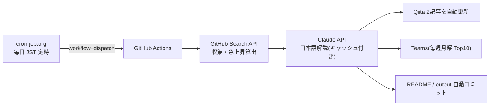

# Claude Code向けMCPツール候補ランキング

GitHub Search APIを使って、Claude Code周辺で活用候補になりそうなMCP関連リポジトリを定期収集するリポジトリです。

> 注意: この一覧は「Claude Codeでの動作」を保証するものではありません。  
> GitHub上のリポジトリ名・説明文・READMEなどに含まれる情報をもとに、MCP関連ツール候補を探すための入口として利用します。

## 仕組み(定常自律運転)

このランキングは cron-job.org → GitHub Actions → Claude API → Qiita / Teams のパイプラインで、毎日無人更新されています。


```mermaid
flowchart LR
    A["cron-job.org<br>毎日 JST 定時"] -->|workflow_dispatch| B["GitHub Actions"]
    B --> C["GitHub Search API<br>収集・急上昇算出"]
    C --> D["Claude API<br>日本語解説(キャッシュ付き)"]
    D --> E["Qiita 2記事を自動更新"]
    D --> F["Teams(毎週月曜 Top10)"]
    D --> G["README / output 自動コミット"]
```

- 仕組みの詳細と**ライブ稼働ステータス**: [定常自律運転ページ](https://takanobusano.github.io/mcp-github-ranking/)
- 作り方の解説記事: [パイプライン編](https://qiita.com/4q_sano/items/913e93ee5cc2731561fc) / [cron-job.org 完全自動化編](https://qiita.com/4q_sano/items/1bc5e0669a8f0166936c)
<!-- MCP_REPOS_START -->
最終更新: **2026-09-22 08:17:17 JST**

MCP関連リポジトリに加え、Claude Code周辺で活用候補になりそうな関連ツールをGitHub Search APIで毎日自動収集してランキング化しています。

Stars / Forks の差分は、UTC基準の前日データ（2026-09-20）との差分です。
CSVには最大500件を保存し、本文では上位100件を表示しています。

> 注意: この一覧はClaude Codeでの動作を保証するものではありません。  
> MCP関連ツールまたはClaude Code関連ツール候補を探すための入口として利用してください。

# 注目MCP・関連ツール候補ランキング

## 1位 [public-apis/public-apis](https://github.com/public-apis/public-apis)

A collective list of free APIs

⭐ **482,083 Stars**（+190）　🍴 **53,233 Forks**（+19）　/　🟢 **1,915 Open Issues**　/　Python

Topics: `api` / `apis` / `dataset` / `development` / `free` / `list` / `lists` / `open-source`

## 2位 [openclaw/openclaw](https://github.com/openclaw/openclaw)

The AI that really does things. Any OS. Any Platform. The lobster way. 🦞

⭐ **390,219 Stars**（+60）　🍴 **82,085 Forks**（+35）　/　🟢 **8,328 Open Issues**　/　TypeScript

Topics: `ai` / `assistant` / `crustacean` / `molty` / `openclaw` / `own-your-data` / `personal`

## 3位 [obra/superpowers](https://github.com/obra/superpowers)

An agentic skills framework & software development methodology that works.

⭐ **289,712 Stars**（+464）　🍴 **25,929 Forks**（+45）　/　🟢 **389 Open Issues**　/　Shell

Topics: `ai` / `brainstorming` / `coding` / `obra` / `sdlc` / `skills` / `subagent-driven-development` / `superpowers`

## 4位 [mattpocock/skills](https://github.com/mattpocock/skills)

Skills for Real Engineers. Straight from my .agents directory.

⭐ **267,134 Stars**（+694）　🍴 **22,558 Forks**（+62）　/　🟢 **513 Open Issues**　/　Shell

Topics: `topicなし`

## 5位 [affaan-m/ECC](https://github.com/affaan-m/ECC)

The agent harness performance optimization system. Skills, instincts, memory, security, and research-first development for Claude Code, Codex, Opencode, Cursor and beyond.

⭐ **264,730 Stars**（+1,036）　🍴 **39,561 Forks**（+108）　/　🟢 **208 Open Issues**　/　JavaScript

Topics: `ai-agents` / `anthropic` / `claude` / `claude-code` / `developer-tools` / `llm` / `mcp` / `productivity`

## 6位 [NousResearch/hermes-agent](https://github.com/NousResearch/hermes-agent)

The agent that grows with you

⭐ **247,773 Stars**（+310）　🍴 **52,185 Forks**（+135）　/　🟢 **43,472 Open Issues**　/　Python

Topics: `ai` / `ai-agent` / `ai-agents` / `anthropic` / `chatgpt` / `claude` / `claude-code` / `codex`

## 7位 [multica-ai/andrej-karpathy-skills](https://github.com/multica-ai/andrej-karpathy-skills)

A single CLAUDE.md file to improve Claude Code behavior, derived from Andrej Karpathy's observations on LLM coding pitfalls.

⭐ **214,511 Stars**（+167）　🍴 **21,684 Forks**（+15）　/　🟢 **130 Open Issues**　/　不明

Topics: `topicなし`

## 8位 [ultraworkers/claw-code](https://github.com/ultraworkers/claw-code)

An agent-managed museum exhibit, built in Rust with Gajae-Code / LazyCodex — developed and maintained with no human intervention.

⭐ **195,281 Stars**（+11）　🍴 **108,464 Forks**（-16）　/　🟢 **45 Open Issues**　/　Rust

Topics: `topicなし`

## 9位 [firecrawl/firecrawl](https://github.com/firecrawl/firecrawl)

The web data API to search, scrape, and interact at scale. 🔥

⭐ **182,965 Stars**（+385）　🍴 **9,878 Forks**（+13）　/　🟢 **642 Open Issues**　/　TypeScript

Topics: `ai` / `ai-agents` / `ai-crawler` / `ai-scraping` / `ai-search` / `crawler` / `data-extraction` / `html-to-markdown`

## 10位 [ollama/ollama](https://github.com/ollama/ollama)

Get up and running with Kimi, GLM, MiniMax, DeepSeek, gpt-oss, Qwen, Gemma and other models.

⭐ **181,401 Stars**（+73）　🍴 **17,962 Forks**（+17）　/　🟢 **4,051 Open Issues**　/　Go

Topics: `deepseek` / `gemma` / `gemma3` / `glm` / `go` / `golang` / `gpt-oss` / `llama`

## 11位 [anthropics/skills](https://github.com/anthropics/skills)

Public repository for Agent Skills

⭐ **177,476 Stars**（+163）　🍴 **21,026 Forks**（+20）　/　🟢 **1,264 Open Issues**　/　Python

Topics: `agent-skills`

## 12位 [langgenius/dify](https://github.com/langgenius/dify)

Build Agentic workflows, RAG pipelines, with rich AI model and tool support on one collaborative workspace. Deploy on cloud, VPC, or self-hosted, so teams move from prototype to production without rebuilding the stack.

⭐ **156,764 Stars**（+138）　🍴 **24,717 Forks**（+20）　/　🟢 **1,094 Open Issues**　/　TypeScript

Topics: `agent` / `agentic-ai` / `agentic-framework` / `agentic-workflow` / `ai` / `automation` / `claude` / `deepseek`

## 13位 [langflow-ai/langflow](https://github.com/langflow-ai/langflow)

Langflow is a powerful tool for building and deploying AI-powered agents and workflows.

⭐ **155,105 Stars**（+49）　🍴 **10,122 Forks**（+2）　/　🟢 **1,102 Open Issues**　/　Python

Topics: `agents` / `chatgpt` / `generative-ai` / `large-language-models` / `multiagent` / `react-flow`

## 14位 [msitarzewski/agency-agents](https://github.com/msitarzewski/agency-agents)

A complete AI agency at your fingertips - From frontend wizards to Reddit community ninjas, from whimsy injectors to reality checkers. Each agent is a specialized expert with personality, processes, and proven deliverables.

⭐ **153,980 Stars**（+218）　🍴 **24,845 Forks**（+39）　/　🟢 **156 Open Issues**　/　Shell

Topics: `topicなし`

## 15位 [anthropics/claude-code](https://github.com/anthropics/claude-code)

Claude Code is an agentic coding tool that lives in your terminal, understands your codebase, and helps you code faster by executing routine tasks, explaining complex code, and handling git workflows - all through natural language commands.

⭐ **147,463 Stars**（+370）　🍴 **24,113 Forks**（+63）　/　🟢 **12,158 Open Issues**　/　TypeScript

Topics: `topicなし`

## 16位 [x1xhlol/system-prompts-and-models-of-ai-tools](https://github.com/x1xhlol/system-prompts-and-models-of-ai-tools)

FULL Augment Code, Claude Code, Cluely, CodeBuddy, Comet, Cursor, Devin AI, Junie, Kiro, Leap.new, Lovable, Manus, NotionAI, Orchids.app, Perplexity, Poke, Qoder, Replit, Same.dev, Trae, Traycer AI, VSCode Agent, Warp.dev, Windsurf, Xcode, Z.ai Code, Dia & v0. (And other Open Sourced) System Prompts, Internal Tools & AI Models

⭐ **143,775 Stars**（+20）　🍴 **34,809 Forks**（-3）　/　🟢 **162 Open Issues**　/　不明

Topics: `ai` / `bolt` / `cluely` / `copilot` / `cursor` / `cursorai` / `devin` / `github-copilot`

## 17位 [DietrichGebert/ponytail](https://github.com/DietrichGebert/ponytail)

Makes your AI agent think like the laziest senior dev in the room. The best code is the code you never wrote.

⭐ **143,713 Stars**（+677）　🍴 **7,697 Forks**（+25）　/　🟢 **294 Open Issues**　/　JavaScript

Topics: `agent-skills` / `ai-agents` / `claude` / `claude-code` / `claude-code-plugin` / `cursor-rules` / `developer-tools` / `llm`

## 18位 [farion1231/cc-switch](https://github.com/farion1231/cc-switch)

A cross-platform desktop All-in-One assistant for Claude Code, Codex, OpenCode, OpenClaw, Grok Build & Hermes Agent. Only official website: ccswitch.io

⭐ **133,972 Stars**（+144）　🍴 **9,251 Forks**（+16）　/　🟢 **2,836 Open Issues**　/　Rust

Topics: `ai-tools` / `claude-code` / `codex` / `desktop-app` / `grok` / `grokbuild` / `hermes` / `hermes-agent`

## 19位 [garrytan/gstack](https://github.com/garrytan/gstack)

Use Garry Tan's exact Claude Code setup: 23 opinionated tools that serve as CEO, Designer, Eng Manager, Release Manager, Doc Engineer, and QA

⭐ **133,865 Stars**（+70）　🍴 **19,946 Forks**（+10）　/　🟢 **933 Open Issues**　/　TypeScript

Topics: `topicなし`

## 20位 [nextlevelbuilder/ui-ux-pro-max-skill](https://github.com/nextlevelbuilder/ui-ux-pro-max-skill)

An AI skill that provides design intelligence for building professional UI/UX across multiple platforms.

⭐ **129,592 Stars**（+266）　🍴 **13,802 Forks**（+20）　/　🟢 **82 Open Issues**　/　Python

Topics: `ai-skills` / `antigravity` / `claude` / `claude-code` / `codex` / `command-line` / `copilot` / `cursor-ai`

## 21位 [harry0703/MoneyPrinterTurbo](https://github.com/harry0703/MoneyPrinterTurbo)

利用 AI 大模型和自动化工作流，根据主题或关键词一键生成高清短视频。Generate HD short videos from a topic or keyword with an automated AI workflow.

⭐ **124,970 Stars**（+112）　🍴 **19,374 Forks**（+26）　/　🟢 **29 Open Issues**　/　Python

Topics: `ai-video-generator` / `content-creation` / `ffmpeg` / `instagram-reels` / `llm` / `python` / `short-video` / `subtitles`

## 22位 [Graphify-Labs/graphify](https://github.com/Graphify-Labs/graphify)

Turn any codebase, with its docs, SQL schemas, configs, and PDFs, into a queryable knowledge graph. A /graphify skill for Claude Code, Cursor, Codex, and Gemini CLI: local deterministic AST parsing, every edge explained, no vector store.

⭐ **120,189 Stars**（+310）　🍴 **11,605 Forks**（+13）　/　🟢 **1,424 Open Issues**　/　Python

Topics: `ai-agents` / `antigravity` / `ast` / `claude-code` / `code-analysis` / `code-search` / `codex` / `cursor`

## 23位 [browser-use/browser-use](https://github.com/browser-use/browser-use)

Agents that use the browser.

⭐ **115,772 Stars**（+224）　🍴 **12,741 Forks**（+28）　/　🟢 **477 Open Issues**　/　Python

Topics: `ai-agents` / `ai-tools` / `browser-automation` / `browser-use` / `llm` / `playwright` / `python`

## 24位 [TauricResearch/TradingAgents](https://github.com/TauricResearch/TradingAgents)

TradingAgents: Multi-Agents LLM Financial Trading Framework

⭐ **107,961 Stars**（+170）　🍴 **20,668 Forks**（+41）　/　🟢 **171 Open Issues**　/　Python

Topics: `agent` / `finance` / `llm` / `multiagent` / `trading`

## 25位 [JuliusBrussee/caveman](https://github.com/JuliusBrussee/caveman)

🪨 why use many token when few token do trick. Viral skill + proxy for coding agents that cuts 65% of tokens by talking like a caveman.

⭐ **107,165 Stars**（+197）　🍴 **6,207 Forks**（+15）　/　🟢 **126 Open Issues**　/　Go

Topics: `ai` / `anthropic` / `caveman` / `claude` / `claude-code` / `llm` / `meme` / `prompt-engineering`

## 26位 [google-gemini/gemini-cli](https://github.com/google-gemini/gemini-cli)

An open-source AI agent that brings the power of Gemini directly into your terminal.

⭐ **107,118 Stars**（+18）　🍴 **14,608 Forks**（+1）　/　🟢 **833 Open Issues**　/　TypeScript

Topics: `ai` / `ai-agents` / `cli` / `gemini` / `gemini-api` / `mcp-client` / `mcp-server`

## 27位 [addyosmani/agent-skills](https://github.com/addyosmani/agent-skills)

Production-grade engineering skills for AI coding agents.

⭐ **98,127 Stars**（+474）　🍴 **10,317 Forks**（+24）　/　🟢 **115 Open Issues**　/　JavaScript

Topics: `agent-skills` / `antigravity` / `claude-code` / `codex` / `cursor` / `skills`

## 28位 [nexu-io/open-design](https://github.com/nexu-io/open-design)

🎨 Best DeepSeek Harness Design Plugin. The open-source Claude Design alternative. 🖥️ Local-first desktop app. 🖼️ Your coding agent becomes the design engine: pr...

⭐ **97,467 Stars**（+174）　🍴 **11,316 Forks**（+17）　/　🟢 **1,102 Open Issues**　/　TypeScript

Topics: `agent-skills` / `ai-design` / `byok` / `claude-code-for-design` / `claude-design` / `codex-design` / `coding-agents` / `cursor-design`

## 29位 [microsoft/playwright](https://github.com/microsoft/playwright)

Playwright is a framework for Web Testing and Automation. It allows testing Chromium, Firefox and WebKit with a single API.

⭐ **96,472 Stars**（+58）　🍴 **6,478 Forks**（+6）　/　🟢 **207 Open Issues**　/　TypeScript

Topics: `automation` / `chrome` / `chromium` / `e2e-testing` / `electron` / `end-to-end-testing` / `firefox` / `javascript`

## 30位 [puppeteer/puppeteer](https://github.com/puppeteer/puppeteer)

JavaScript API for Chrome and Firefox

⭐ **95,607 Stars**（+9）　🍴 **9,579 Forks**（-1）　/　🟢 **264 Open Issues**　/　TypeScript

Topics: `automation` / `chrome` / `chromium` / `developer-tools` / `firefox` / `headless-chrome` / `node-module` / `testing`

## 31位 [thedotmack/claude-mem](https://github.com/thedotmack/claude-mem)

Persistent Context Across Sessions for Every Agent –  Captures everything your agent does during sessions, compresses it with AI, and injects relevant context back into future sessions. Works with Claude Code, OpenClaw, Codex, Gemini, Hermes, Copilot, OpenCode + More

⭐ **94,414 Stars**（+77）　🍴 **8,342 Forks**（+11）　/　🟢 **254 Open Issues**　/　TypeScript

Topics: `ai` / `ai-agents` / `ai-memory` / `anthropic` / `artificial-intelligence` / `chromadb` / `claude` / `claude-agent-sdk`

## 32位 [modelcontextprotocol/servers](https://github.com/modelcontextprotocol/servers)

Model Context Protocol Servers

⭐ **90,534 Stars**（+33）　🍴 **11,673 Forks**（+4）　/　🟢 **551 Open Issues**　/　TypeScript

Topics: `topicなし`

## 33位 [OpenCut-app/OpenCut](https://github.com/OpenCut-app/OpenCut)

The open-source CapCut alternative

⭐ **90,329 Stars**（+298）　🍴 **8,922 Forks**（+28）　/　🟢 **378 Open Issues**　/　TypeScript

Topics: `editor` / `oss` / `videoeditor`

## 34位 [Leonxlnx/taste-skill](https://github.com/Leonxlnx/taste-skill)

Taste-Skill - gives your AI good taste. stops the AI from generating boring, generic slop

⭐ **89,046 Stars**（+248）　🍴 **6,064 Forks**（+19）　/　🟢 **70 Open Issues**　/　JavaScript

Topics: `agent` / `ai` / `claude` / `claude-code` / `codex` / `coding` / `design` / `frontend`

## 35位 [ChatGPTNextWeb/NextChat](https://github.com/ChatGPTNextWeb/NextChat)

✨ Zero-config AI chat assistant. No API key needed — sign up and instantly chat with GPT-5, Claude 4, Gemini 2.5, DeepSeek & 100+ top models. Pay-as-you-go save...

⭐ **88,799 Stars**（+6）　🍴 **59,015 Forks**（-10）　/　🟢 **865 Open Issues**　/　TypeScript

Topics: `calclaude` / `chatgpt` / `claude` / `cross-platform` / `desktop` / `fe` / `gemini` / `gemini-pro`

## 36位 [OpenHands/OpenHands](https://github.com/OpenHands/OpenHands)

🙌 OpenHands: AI-Driven Development

⭐ **88,742 Stars**（+93）　🍴 **11,675 Forks**（+12）　/　🟢 **873 Open Issues**　/　TypeScript

Topics: `agent` / `artificial-intelligence` / `chatgpt` / `claude-ai` / `cli` / `developer-tools` / `gpt` / `llm`

## 37位 [koala73/worldmonitor](https://github.com/koala73/worldmonitor)

Real-time global intelligence dashboard. AI-powered news aggregation, geopolitical monitoring, and infrastructure tracking in a unified situational awareness interface

⭐ **87,165 Stars**（+74）　🍴 **13,257 Forks**（+22）　/　🟢 **396 Open Issues**　/　TypeScript

Topics: `agent` / `ai` / `dashboard` / `geopolitics` / `mcp` / `mcp-server` / `monitoring` / `news`

## 38位 [laravel/laravel](https://github.com/laravel/laravel)

Laravel is a web application framework with expressive, elegant syntax. We’ve already laid the foundation for your next big idea — freeing you to create without sweating the small things.

⭐ **84,987 Stars**（-1）　🍴 **25,598 Forks**（+38）　/　🟢 **31 Open Issues**　/　Blade

Topics: `framework` / `laravel` / `php`

## 39位 [Panniantong/Agent-Reach](https://github.com/Panniantong/Agent-Reach)

Give your AI agent eyes to see the entire internet. Read & search Twitter, Reddit, YouTube, GitHub, Bilibili, XiaoHongShu — one CLI, zero API fees.

⭐ **84,354 Stars**（+528）　🍴 **7,408 Forks**（+62）　/　🟢 **155 Open Issues**　/　Python

Topics: `agent-infrastructure` / `ai-agent` / `ai-search` / `automation` / `bilibili` / `claude-code` / `cli` / `cursor`

## 40位 [unclecode/crawl4ai](https://github.com/unclecode/crawl4ai)

🚀🤖 Crawl4AI: Open-source LLM Friendly Web Crawler & Scraper. Don't be shy, join here:

⭐ **84,037 Stars**（+63）　🍴 **8,688 Forks**（±0）　/　🟢 **201 Open Issues**　/　Python

Topics: `topicなし`

## 41位 [Egonex-AI/Understand-Anything](https://github.com/Egonex-AI/Understand-Anything)

Graphs that teach > graphs that impress. Turn any code into an interactive knowledge graph you can explore, search, and ask questions about. Works with Claude Code, Codex, Cursor, Copilot, Gemini CLI, and more.

⭐ **83,567 Stars**（+128）　🍴 **7,047 Forks**（+6）　/　🟢 **304 Open Issues**　/　TypeScript

Topics: `antigravity-skills` / `business-knowledge` / `claude-code` / `claude-skills` / `codebase-analysis` / `codex` / `codex-skills` / `developer-tools-ai-agent`

## 42位 [D4Vinci/Scrapling](https://github.com/D4Vinci/Scrapling)

🕷️ An adaptive Web Scraping framework that handles everything from a single request to a full-scale crawl! Don't be shy, join here:

⭐ **82,823 Stars**（+196）　🍴 **8,436 Forks**（+17）　/　🟢 **0 Open Issues**　/　Python

Topics: `ai` / `ai-scraping` / `automation` / `crawler` / `crawling` / `crawling-python` / `data` / `data-extraction`

## 43位 [bytedance/deer-flow](https://github.com/bytedance/deer-flow)

An open-source long-horizon SuperAgent harness that researches, codes, and creates. With the help of sandboxes, memories, tools, skill, subagents and message gateway, it handles different levels of tasks that could take minutes to hours.

⭐ **82,816 Stars**（+59）　🍴 **11,448 Forks**（+15）　/　🟢 **911 Open Issues**　/　Python

Topics: `agent` / `agentic` / `agentic-framework` / `agentic-workflow` / `ai` / `ai-agents` / `deep-research` / `harness`

## 44位 [lobehub/lobehub](https://github.com/lobehub/lobehub)

🤯 LobeHub is your Chief Agent Operator, organizing your agents into 7×24 operations by hiring, scheduling, and reporting on your entire AI team.

⭐ **82,732 Stars**（+50）　🍴 **15,907 Forks**（+7）　/　🟢 **945 Open Issues**　/　TypeScript

Topics: `agent` / `agent-collaboration` / `agent-harness` / `ai` / `cao` / `chatgpt` / `chief-agent-operator` / `claude`

## 45位 [rtk-ai/rtk](https://github.com/rtk-ai/rtk)

CLI proxy that reduces LLM token consumption by 60-90% on common dev commands. Single Rust binary, zero dependencies

⭐ **81,317 Stars**（+167）　🍴 **5,152 Forks**（+8）　/　🟢 **1,553 Open Issues**　/　Rust

Topics: `agentic-coding` / `ai-coding` / `anthropic` / `claude-code` / `cli` / `command-line-tool` / `cost-reduction` / `developer-tools`

## 46位 [paperclipai/paperclip](https://github.com/paperclipai/paperclip)

The open-source app everyone uses to manage agents at work

⭐ **81,212 Stars**（+75）　🍴 **14,926 Forks**（+13）　/　🟢 **5,600 Open Issues**　/　TypeScript

Topics: `topicなし`

## 47位 [abi/screenshot-to-code](https://github.com/abi/screenshot-to-code)

Drop in a screenshot and convert it to clean code (HTML/Tailwind/React/Vue)

⭐ **79,486 Stars**（+77）　🍴 **9,711 Forks**（+8）　/　🟢 **146 Open Issues**　/　Python

Topics: `topicなし`

## 48位 [shareAI-lab/learn-claude-code](https://github.com/shareAI-lab/learn-claude-code)

Bash is all you need -  A nano claude code–like 「agent harness」, built from 0 to 1

⭐ **77,362 Stars**（+92）　🍴 **12,446 Forks**（+14）　/　🟢 **53 Open Issues**　/　Python

Topics: `agent` / `agent-development` / `ai-agent` / `claude` / `claude-code` / `educational` / `llm` / `python`

## 49位 [unslothai/unsloth](https://github.com/unslothai/unsloth)

Local UI to run and train LLMs and diffusion models. Supports GGUF, MLX, Qwen3.8, DeepSeek-V4, MiniMax-H3, Gemma 4, FLUX and more.

⭐ **76,544 Stars**（+47）　🍴 **6,996 Forks**（+4）　/　🟢 **1,227 Open Issues**　/　Python

Topics: `agent` / `ai` / `chatgpt` / `deepseek` / `fine-tuning` / `gemma` / `image-generation` / `llama`

## 50位 [stablyai/orca](https://github.com/stablyai/orca)

Orca is the ADE for working with a fleet of parallel agents. Run any coding agent with your own subscription. Available on desktop, mobile and remote runtime.

⭐ **74,645 Stars**（+1,103）　🍴 **4,880 Forks**（+62）　/　🟢 **6,410 Open Issues**　/　TypeScript

Topics: `ade` / `agent-ide` / `ai-agents` / `claude-code` / `cli` / `codex` / `cursor-agent` / `devtools`

## 51位 [Eugeny/tabby](https://github.com/Eugeny/tabby)

A terminal for a more modern age

⭐ **74,624 Stars**（+15）　🍴 **4,257 Forks**（±0）　/　🟢 **2,838 Open Issues**　/　TypeScript

Topics: `serial` / `ssh-client` / `telnet-client` / `terminal` / `terminal-emulators`

## 52位 [thedaviddias/Front-End-Checklist](https://github.com/thedaviddias/Front-End-Checklist)

🗂 The essential checklist for modern web development, for humans and AI agents

⭐ **74,225 Stars**（+12）　🍴 **6,742 Forks**（-1）　/　🟢 **11 Open Issues**　/　MDX

Topics: `ai-agent` / `ai-agents` / `checklist` / `css` / `front-end-developer-tool` / `front-end-development` / `frontend` / `guidelines`

## 53位 [headroomlabs-ai/headroom](https://github.com/headroomlabs-ai/headroom)

Compress tool outputs, logs, files, and RAG chunks before they reach the LLM. 20% fewer tokens for coding agents, 60-95% fewer tokens for JSON, same answers. Library, proxy, MCP server.

⭐ **73,414 Stars**（+155）　🍴 **5,656 Forks**（+22）　/　🟢 **704 Open Issues**　/　Python

Topics: `agent` / `ai` / `anthropic` / `claude-code` / `compression` / `context-engineering` / `context-window` / `cursor`

## 54位 [OpenBB-finance/OpenBB](https://github.com/OpenBB-finance/OpenBB)

Open Data Platform for analysts, quants and AI agents.

⭐ **73,347 Stars**（+41）　🍴 **7,589 Forks**（+3）　/　🟢 **114 Open Issues**　/　Python

Topics: `ai` / `crypto` / `derivatives` / `economics` / `equity` / `finance` / `fixed-income` / `machine-learning`

## 55位 [ruvnet/ruflo](https://github.com/ruvnet/ruflo)

🌊 The original agent harness. Deploy intelligent multi-player swarms, coordinate autonomous workflows, and build conversational AI systems. Features adaptive me...

⭐ **73,002 Stars**（+73）　🍴 **8,666 Forks**（+7）　/　🟢 **1,009 Open Issues**　/　TypeScript

Topics: `agentic-ai` / `agentic-framework` / `agentic-workflow` / `agents` / `ai-agents` / `ai-assistant` / `ai-skills` / `autonomous-agents`

## 56位 [daytonaio/daytona](https://github.com/daytonaio/daytona)

Daytona is a Secure and Elastic Infrastructure for Running AI-Generated Code

⭐ **71,740 Stars**（-2）　🍴 **5,647 Forks**（+3）　/　🟢 **457 Open Issues**　/　不明

Topics: `agentic-workflow` / `ai` / `ai-agents` / `ai-runtime` / `ai-sandboxes` / `code-execution` / `code-interpreter` / `developer-tools`

## 57位 [colbymchenry/codegraph](https://github.com/colbymchenry/codegraph)

Pre-indexed code knowledge graph, auto syncs on code changes, for Claude Code, Codex, Gemini, Cursor, OpenCode, AntiGravity, Kiro, CoPilot, and Hermes Agent — fewer tokens, fewer tool calls, 100% local

⭐ **71,725 Stars**（+127）　🍴 **4,605 Forks**（+3）　/　🟢 **528 Open Issues**　/　C

Topics: `topicなし`

## 58位 [pbakaus/impeccable](https://github.com/pbakaus/impeccable)

The design language that makes your AI harness better at design.

⭐ **69,617 Stars**（+231）　🍴 **4,241 Forks**（+4）　/　🟢 **45 Open Issues**　/　JavaScript

Topics: `topicなし`

## 59位 [code-yeongyu/oh-my-openagent](https://github.com/code-yeongyu/oh-my-openagent)

OmO: Just type "mass ulw" keyword with your prompt. Now you are the master of graph engineering.

⭐ **69,262 Stars**（+34）　🍴 **5,705 Forks**（-2）　/　🟢 **1,017 Open Issues**　/　TypeScript

Topics: `ai` / `ai-agents` / `anthropic` / `chatgpt` / `claude` / `claude-skills` / `codex` / `cursor`

## 60位 [tt-a1i/archify](https://github.com/tt-a1i/archify)

Agent skill for beautiful, verifiable architecture, workflow, sequence, data-flow, and lifecycle diagrams—self-contained HTML with motion and crisp export.

⭐ **69,090 Stars**（+858）　🍴 **4,635 Forks**（+73）　/　🟢 **144 Open Issues**　/　JavaScript

Topics: `agent-skills` / `architecture-as-code` / `architecture-diagram` / `claude-skill` / `code-visualization` / `codex` / `coding-agents` / `data-flow-diagram`

## 61位 [cline/cline](https://github.com/cline/cline)

Autonomous coding agent as an SDK, IDE extension, or CLI assistant.

⭐ **68,972 Stars**（+85）　🍴 **7,473 Forks**（+11）　/　🟢 **1,392 Open Issues**　/　TypeScript

Topics: `topicなし`

## 62位 [diegosouzapw/OmniRoute](https://github.com/diegosouzapw/OmniRoute)

Never stop coding. Free MIT AI gateway: one endpoint, 359 providers (150+ free), 1200+ models Kimi, Claude, GPT, Gemini, GLM, DeepSeek, MiniMax. Works with Claude Code, Codex, Cursor, OpenCode, Cline & Copilot. Quota-aware auto-fallback, RTK+Caveman compression saves 15-95% tokens, MCP/A2A, Desktop/PWA. Built by hundreds of contributors

⭐ **68,948 Stars**（+354）　🍴 **9,766 Forks**（+60）　/　🟢 **588 Open Issues**　/　TypeScript

Topics: `a2a` / `ai-agents` / `ai-gateway` / `anthropic` / `claude` / `claude-code` / `cline` / `codex`

## 63位 [openinterpreter/openinterpreter](https://github.com/openinterpreter/openinterpreter)

A coding agent for open models like Kimi K3 and GLM 5.3

⭐ **68,397 Stars**（+2）　🍴 **5,884 Forks**（±0）　/　🟢 **3 Open Issues**　/　Rust

Topics: `acp` / `coding-agent` / `deepseek` / `kimi` / `python` / `qwen` / `rust`

## 64位 [asgeirtj/system_prompts_leaks](https://github.com/asgeirtj/system_prompts_leaks)

Extracted system prompts from Anthropic - Claude Fable 5.1, Opus 5, Claude Design, Claude Code. OpenAI - ChatGPT GPT-6-Astra, Codex. Google - Gemini 3.8 Flash, 3.1 Pro, Antigravity. xAI - Grok, Grok Bot, Cursor, Kimi and more! Updated regularly.

⭐ **68,002 Stars**（+130）　🍴 **11,045 Forks**（+15）　/　🟢 **55 Open Issues**　/　JavaScript

Topics: `ai` / `ai-agents` / `ai-prompts` / `anthropic` / `chatbot` / `chatgpt` / `claude` / `claude-code`

## 65位 [docling-project/docling](https://github.com/docling-project/docling)

Get your documents ready for gen AI

⭐ **67,531 Stars**（+109）　🍴 **4,876 Forks**（+13）　/　🟢 **929 Open Issues**　/　Python

Topics: `ai` / `convert` / `document-parser` / `document-parsing` / `documents` / `docx` / `html` / `markdown`

## 66位 [bradtraversy/design-resources-for-developers](https://github.com/bradtraversy/design-resources-for-developers)

Curated list of design and UI resources from stock photos, web templates, CSS frameworks, UI libraries, tools and much more

⭐ **66,998 Stars**（+3）　🍴 **12,195 Forks**（+3）　/　🟢 **138 Open Issues**　/　不明

Topics: `topicなし`

## 67位 [xtekky/gpt4free](https://github.com/xtekky/gpt4free)

The official gpt4free repository \| various collection of powerful language models \| opus 4.6 gpt 5.3 kimi 2.5 deepseek v3.2 gemini 3

⭐ **66,714 Stars**（+11）　🍴 **13,506 Forks**（-1）　/　🟢 **1 Open Issues**　/　Python

Topics: `chatbot` / `chatbots` / `chatgpt` / `chatgpt-4` / `chatgpt-api` / `chatgpt-free` / `chatgpt4` / `deepseek`

## 68位 [shanraisshan/claude-code-best-practice](https://github.com/shanraisshan/claude-code-best-practice)

from vibe coding to agentic engineering - practice makes claude perfect

⭐ **66,188 Stars**（+58）　🍴 **6,571 Forks**（+6）　/　🟢 **38 Open Issues**　/　HTML

Topics: `agentic-ai` / `agentic-coding` / `agentic-engineering` / `agentic-workflow` / `ai` / `ai-agents` / `anthropic` / `best-practices`

## 69位 [mem0ai/mem0](https://github.com/mem0ai/mem0)

The Memory Layer for AI Agents - Drop-in memory infrastructure for AI agents and apps. Context that persists. Built for production.

⭐ **65,790 Stars**（+72）　🍴 **7,726 Forks**（+8）　/　🟢 **767 Open Issues**　/　Python

Topics: `agentic-memory` / `agentic-memory-system` / `agents` / `ai` / `ai-agents` / `chatgpt` / `genai` / `llm`

## 70位 [NanmiCoder/MediaCrawler](https://github.com/NanmiCoder/MediaCrawler)

小红书笔记 \| 评论爬虫、抖音视频 \| 评论爬虫、快手视频 \| 评论爬虫、B 站视频 ｜ 评论爬虫、微博帖子 ｜ 评论爬虫、百度贴吧帖子 ｜ 百度贴吧评论回复爬虫  \| 知乎问答文章｜评论爬虫

⭐ **65,472 Stars**（+94）　🍴 **12,650 Forks**（+11）　/　🟢 **209 Open Issues**　/　Python

Topics: `topicなし`

## 71位 [warpdotdev/warp](https://github.com/warpdotdev/warp)

Warp is an agentic development environment, born out of the terminal.

⭐ **65,119 Stars**（+5）　🍴 **5,570 Forks**（-2）　/　🟢 **5,288 Open Issues**　/　Rust

Topics: `bash` / `linux` / `macos` / `rust` / `shell` / `terminal` / `wasm` / `zsh`

## 72位 [usestrix/strix](https://github.com/usestrix/strix)

Open-source AI penetration testing tool to find and fix your app’s vulnerabilities.

⭐ **64,037 Stars**（+170）　🍴 **6,998 Forks**（+14）　/　🟢 **401 Open Issues**　/　Python

Topics: `agents` / `ai-hacking` / `ai-penetration-testing` / `ai-pentesting` / `ai-security` / `artificial-intelligence` / `bug-bounty` / `code-quality`

## 73位 [mvanhorn/last30days-skill](https://github.com/mvanhorn/last30days-skill)

AI agent skill that researches any topic across Reddit, X, YouTube, HN, Polymarket, and the web - then synthesizes a grounded summary

⭐ **62,560 Stars**（+119）　🍴 **5,448 Forks**（+7）　/　🟢 **115 Open Issues**　/　Python

Topics: `ai-prompts` / `ai-skill` / `bluesky` / `claude` / `claude-code` / `clawhub` / `deep-research` / `hackernews`

## 74位 [sansan0/TrendRadar](https://github.com/sansan0/TrendRadar)

⭐AI-driven public opinion & trend monitor with multi-platform aggregation, RSS, and smart alerts.🎯 告别信息过载，你的 AI 舆情监控助手与热点筛选工具！聚合多平台热点 +  RSS 订阅，支持关键词精准筛选。AI 智能筛...

⭐ **62,459 Stars**（+19）　🍴 **24,875 Forks**（-1）　/　🟢 **66 Open Issues**　/　Python

Topics: `ai` / `bark` / `data-analysis` / `docker` / `hot-news` / `llm` / `mail` / `mcp`

## 75位 [upstash/context7](https://github.com/upstash/context7)

Context7 Platform -- Up-to-date code documentation for LLMs and AI code editors

⭐ **62,286 Stars**（+31）　🍴 **3,017 Forks**（+2）　/　🟢 **67 Open Issues**　/　TypeScript

Topics: `llm` / `mcp` / `mcp-server` / `vibe-coding`

## 76位 [coollabsio/coolify](https://github.com/coollabsio/coolify)

An open-source, self-hostable PaaS alternative to Vercel, Heroku & Netlify that lets you easily deploy static sites, databases, full-stack applications and 280+ one-click services on your own servers.

⭐ **62,125 Stars**（+40）　🍴 **5,516 Forks**（+10）　/　🟢 **724 Open Issues**　/　PHP

Topics: `coolify` / `databases` / `deployment` / `docker` / `docker-compose` / `inertiajs` / `laravel` / `mariadb`

## 77位 [tw93/Pake](https://github.com/tw93/Pake)

🤱🏻 Turn any webpage into a desktop app with one command.

⭐ **61,583 Stars**（+25）　🍴 **12,693 Forks**（+4）　/　🟢 **5 Open Issues**　/　Rust

Topics: `chatgpt` / `claude` / `desktop` / `gemini` / `hight-performance` / `linux` / `macos` / `no-electron`

## 78位 [1c7/chinese-independent-developer](https://github.com/1c7/chinese-independent-developer)

👩🏿‍💻👨🏾‍💻👩🏼‍💻👨🏽‍💻👩🏻‍💻中国独立开发者项目列表 -- 分享大家都在做什么

⭐ **61,524 Stars**（+16）　🍴 **5,408 Forks**（+2）　/　🟢 **5 Open Issues**　/　不明

Topics: `china` / `indie` / `indie-developer`

## 79位 [microsoft/autogen](https://github.com/microsoft/autogen)

A programming framework for agentic AI

⭐ **61,099 Stars**（+20）　🍴 **9,239 Forks**（+1）　/　🟢 **1,089 Open Issues**　/　Python

Topics: `agentic` / `agentic-agi` / `agents` / `ai` / `autogen` / `autogen-ecosystem` / `chatgpt` / `framework`

## 80位 [calesthio/OpenMontage](https://github.com/calesthio/OpenMontage)

World's first open-source, agentic video production system. 12 production pipelines, 100+ tools, 700+ agent skill and production-knowledge files. Turn your AI coding assistant into a full video production studio.

⭐ **60,711 Stars**（+280）　🍴 **7,713 Forks**（+52）　/　🟢 **330 Open Issues**　/　Python

Topics: `agent` / `agentic-ai` / `ai` / `claude` / `copilot` / `cursor` / `elevenlabs` / `ffmpeg`

## 81位 [penpot/penpot](https://github.com/penpot/penpot)

Penpot: The open-source design platform for Product teams that need scalable collaboration.

⭐ **60,230 Stars**（+35）　🍴 **4,121 Forks**（+2）　/　🟢 **827 Open Issues**　/　Clojure

Topics: `clojure` / `clojurescript` / `design` / `prototyping` / `ui` / `ux-design` / `ux-experience`

## 82位 [meilisearch/meilisearch](https://github.com/meilisearch/meilisearch)

A lightning-fast search engine API bringing AI-powered hybrid search to your sites and applications.

⭐ **59,363 Stars**（+13）　🍴 **2,712 Forks**（±0）　/　🟢 **309 Open Issues**　/　Rust

Topics: `ai` / `api` / `app-search` / `database` / `enterprise-search` / `faceting` / `full-text-search` / `fuzzy-search`

## 83位 [BerriAI/litellm](https://github.com/BerriAI/litellm)

The fastest, litest AI Gateway. Rust core with Python SDK. Call 100+ LLM APIs in OpenAI (or native) format with cost tracking, guardrails, load balancing, and logging [Bedrock, Azure, OpenAI, Anthropic, OpenAI, VertexAI, vLLM, Nvidia NIM]

⭐ **59,346 Stars**（+105）　🍴 **11,648 Forks**（+28）　/　🟢 **5,229 Open Issues**　/　Python

Topics: `ai-gateway` / `anthropic` / `azure-openai` / `bedrock` / `gateway` / `langchain` / `litellm` / `llm`

## 84位 [MemPalace/mempalace](https://github.com/MemPalace/mempalace)

The best-benchmarked open-source AI memory system. And it's free.

⭐ **59,206 Stars**（+28）　🍴 **7,563 Forks**（±0）　/　🟢 **745 Open Issues**　/　Python

Topics: `ai` / `chromadb` / `llm` / `mcp` / `memory` / `python`

## 85位 [crewAIInc/crewAI](https://github.com/crewAIInc/crewAI)

Framework for orchestrating role-playing, autonomous AI agents. By fostering collaborative intelligence, CrewAI empowers agents to work together seamlessly, tackling complex tasks.

⭐ **58,875 Stars**（+49）　🍴 **8,534 Forks**（+8）　/　🟢 **449 Open Issues**　/　Python

Topics: `agents` / `ai` / `ai-agents` / `aiagentframework` / `llms`

## 86位 [FoundationAgents/OpenManus](https://github.com/FoundationAgents/OpenManus)

No fortress, purely open ground.  OpenManus is Coming.

⭐ **58,371 Stars**（+9）　🍴 **10,127 Forks**（-3）　/　🟢 **455 Open Issues**　/　Python

Topics: `topicなし`

## 87位 [zylon-ai/private-gpt](https://github.com/zylon-ai/private-gpt)

Complete API layer for private AI applications on local models: RAG, skills, tools, MCP, text-to-sql, and more. Works with any OpenAI-compatible inference server.

⭐ **57,523 Stars**（+4）　🍴 **7,617 Forks**（-2）　/　🟢 **16 Open Issues**　/　Python

Topics: `ai` / `ai-tools` / `on-premise`

## 88位 [twentyhq/twenty](https://github.com/twentyhq/twenty)

The open alternative to Salesforce, designed for AI.

⭐ **57,225 Stars**（+59）　🍴 **9,221 Forks**（+10）　/　🟢 **205 Open Issues**　/　TypeScript

Topics: `crm` / `crm-system` / `customer` / `good-first-issue` / `graphql` / `hacktoberfest` / `javascript` / `marketing`

## 89位 [hugohe3/ppt-master](https://github.com/hugohe3/ppt-master)

AI turns documents or topics into real, native PowerPoint decks—with native shapes, transitions and animations, data-backed charts and tables on demand, audio narration from speaker notes, and support for your own .pptx templates. · by Hugo He

⭐ **55,777 Stars**（+219）　🍴 **4,422 Forks**（+17）　/　🟢 **2 Open Issues**　/　Python

Topics: `ai-agent` / `aippt` / `office` / `powerpoint` / `powerpoint-generation` / `ppt` / `pptx` / `presentation`

## 90位 [Alishahryar1/free-claude-code](https://github.com/Alishahryar1/free-claude-code)

Use Claude Code, Codex, Pi, and OpenCode (and 6 other harnesses) for free (1.3B+ free tokens) from your terminal, app, IDE, or phone, and now from the browser with native browser sessions (multi-harness + multi-model) like OpenClaw (voice supported + ToS friendly)

⭐ **55,616 Stars**（+98）　🍴 **8,894 Forks**（+18）　/　🟢 **398 Open Issues**　/　Python

Topics: `topicなし`

## 91位 [jamiepine/voicebox](https://github.com/jamiepine/voicebox)

The open-source AI voice studio. Clone, dictate, create.

⭐ **55,389 Stars**（+106）　🍴 **6,907 Forks**（+10）　/　🟢 **703 Open Issues**　/　TypeScript

Topics: `ai` / `cuda` / `mlx` / `qwen3-tts` / `qwen3-tts-ui` / `voice-ai` / `voice-clone` / `whisper`

## 92位 [rohitg00/ai-engineering-from-scratch](https://github.com/rohitg00/ai-engineering-from-scratch)

Learn it. Build it. Ship it for others.

⭐ **55,164 Stars**（+72）　🍴 **9,710 Forks**（+16）　/　🟢 **116 Open Issues**　/　Python

Topics: `agents` / `ai` / `ai-agents` / `ai-engineering` / `computer-vision` / `course` / `deep-learning` / `from-scratch`

## 93位 [aaif-goose/goose](https://github.com/aaif-goose/goose)

an open source, extensible AI agent that goes beyond code suggestions - install, execute, edit, and test with any LLM

⭐ **54,540 Stars**（+39）　🍴 **6,290 Forks**（+8）　/　🟢 **388 Open Issues**　/　Rust

Topics: `acp` / `ai` / `ai-agents` / `mcp`

## 94位 [bmad-code-org/BMAD-METHOD](https://github.com/bmad-code-org/BMAD-METHOD)

Breakthrough Method for Agile Ai Driven Development

⭐ **53,318 Stars**（+39）　🍴 **6,006 Forks**（-2）　/　🟢 **60 Open Issues**　/　Python

Topics: `agile` / `ai` / `context-engineering` / `sdlc` / `spec-driven-development`

## 95位 [router-for-me/CLIProxyAPI](https://github.com/router-for-me/CLIProxyAPI)

Wrap Antigravity, ChatGPT Codex, Claude Code, Grok Build, Muse Code, Davin as an OpenAI/Gemini/Claude/Codex compatible API service, allowing you to enjoy the free Gemini Series, GPT Series, Grok Series, Claude model through API

⭐ **52,753 Stars**（+128）　🍴 **7,963 Forks**（+13）　/　🟢 **613 Open Issues**　/　Go

Topics: `antigravity` / `claude-code` / `cluade` / `codex` / `devin` / `gemini` / `muse` / `openai`

## 96位 [ChromeDevTools/chrome-devtools-mcp](https://github.com/ChromeDevTools/chrome-devtools-mcp)

Chrome DevTools for coding agents

⭐ **52,437 Stars**（+60）　🍴 **4,389 Forks**（+41）　/　🟢 **119 Open Issues**　/　TypeScript

Topics: `browser` / `chrome` / `chrome-devtools` / `debugging` / `devtools` / `mcp` / `mcp-server` / `puppeteer`

## 97位 [heygen-com/hyperframes](https://github.com/heygen-com/hyperframes)

Write HTML. Render video. Built for agents.

⭐ **52,164 Stars**（+216）　🍴 **4,759 Forks**（+30）　/　🟢 **193 Open Issues**　/　TypeScript

Topics: `ai` / `animation` / `ffmpeg` / `framework` / `gsap` / `html` / `mcp` / `puppeteer`

## 98位 [CherryHQ/cherry-studio](https://github.com/CherryHQ/cherry-studio)

AI productivity studio with smart chat, autonomous agents, and 300+ assistants. Unified access to frontier LLMs

⭐ **52,052 Stars**（+24）　🍴 **4,991 Forks**（+7）　/　🟢 **1,627 Open Issues**　/　TypeScript

Topics: `agent-skills` / `ai-agent` / `claude-code` / `codex` / `deepseek` / `hermes-agent` / `open-code-review` / `skills`

## 99位 [charlax/professional-programming](https://github.com/charlax/professional-programming)

A collection of learning resources for curious software engineers

⭐ **51,558 Stars**（+23）　🍴 **4,020 Forks**（+2）　/　🟢 **11 Open Issues**　/　Python

Topics: `architecture` / `computer-science` / `concepts` / `documentation` / `engineer` / `learning` / `lessons-learned` / `professional`

## 100位 [coreyhaines31/marketingskills](https://github.com/coreyhaines31/marketingskills)

Marketing skills for Claude Code and AI agents. CRO, copywriting, SEO, analytics, and growth engineering.

⭐ **51,097 Stars**（+103）　🍴 **7,738 Forks**（+12）　/　🟢 **115 Open Issues**　/　JavaScript

Topics: `claude` / `codex` / `marketing`

# 最近プッシュされたMCP・関連ツール候補

スター数ランキングとは別に、最近コードがプッシュされたリポジトリを表示します。古いスター数だけではなく、現在も開発が動いていそうな候補を探すための一覧です。

## プッシュ順 1位 [manaflow-ai/cmux](https://github.com/manaflow-ai/cmux)

Open source Ghostty-based macOS terminal with vertical tabs and notifications for AI coding agents. Built for multitasking, organization, and programmability.

⭐ **27,306 Stars**（+15）　🍴 **2,386 Forks**（+6）　/　Swift　/　最終プッシュ: 2026-09-21

Topics: `amp` / `claude-code` / `cli` / `codex` / `coding-agents` / `gemini` / `ghostty` / `macos`

## プッシュ順 2位 [diegosouzapw/OmniRoute](https://github.com/diegosouzapw/OmniRoute)

Never stop coding. Free MIT AI gateway: one endpoint, 359 providers (150+ free), 1200+ models Kimi, Claude, GPT, Gemini, GLM, DeepSeek, MiniMax. Works with Claude Code, Codex, Cursor, OpenCode, Cline & Copilot. Quota-aware auto-fallback, RTK+Caveman compression saves 15-95% tokens, MCP/A2A, Desktop/PWA. Built by hundreds of contributors

⭐ **68,948 Stars**（+354）　🍴 **9,766 Forks**（+60）　/　TypeScript　/　最終プッシュ: 2026-09-21

Topics: `a2a` / `ai-agents` / `ai-gateway` / `anthropic` / `claude` / `claude-code` / `cline` / `codex`

## プッシュ順 3位 [PostHog/posthog](https://github.com/PostHog/posthog)

:hedgehog: PostHog is the leading platform for building self-driving products. Our developer tools – AI observability, analytics, session replay, flags, experiments, error tracking, logs, and more – capture all the context agents need to diagnose problems, uncover opportunities, and ship fixes. Steer it all from Slack, web, desktop, or the MCP.

⭐ **39,890 Stars**（+15）　🍴 **3,408 Forks**（+2）　/　Python　/　最終プッシュ: 2026-09-21

Topics: `ab-testing` / `ai-analytics` / `analytics` / `cdp` / `data-warehouse` / `experiments` / `feature-flags` / `javascript`

## プッシュ順 4位 [datahub-project/datahub](https://github.com/datahub-project/datahub)

The Context Platform for your Data and AI Stack

⭐ **12,745 Stars**（+5）　🍴 **3,697 Forks**（+2）　/　Python　/　最終プッシュ: 2026-09-21

Topics: `agent-platform` / `context-management` / `data-catalog` / `data-discovery` / `data-governance` / `data-observability` / `datahub` / `metadata`

## プッシュ順 5位 [pingdotgg/t3code](https://github.com/pingdotgg/t3code)

説明なし

⭐ **23,246 Stars**（+74）　🍴 **5,949 Forks**（+28）　/　TypeScript　/　最終プッシュ: 2026-09-21

Topics: `topicなし`

## プッシュ順 6位 [sgl-project/sglang](https://github.com/sgl-project/sglang)

SGLang is a high-performance serving framework for large language models and multimodal models.

⭐ **36,271 Stars**（+56）　🍴 **9,038 Forks**（+16）　/　Python　/　最終プッシュ: 2026-09-21

Topics: `attention` / `blackwell` / `cuda` / `deepseek` / `diffusion` / `glm` / `gpt-oss` / `inference`

## プッシュ順 7位 [openclaw/openclaw](https://github.com/openclaw/openclaw)

The AI that really does things. Any OS. Any Platform. The lobster way. 🦞

⭐ **390,219 Stars**（+60）　🍴 **82,085 Forks**（+35）　/　TypeScript　/　最終プッシュ: 2026-09-21

Topics: `ai` / `assistant` / `crustacean` / `molty` / `openclaw` / `own-your-data` / `personal`

## プッシュ順 8位 [screenpipe/screenpipe](https://github.com/screenpipe/screenpipe)

YC (S26) \| Open Computer History \| Record your screen continuously locally and provide context to your agents (Claude, Codex, Openclaw, Hermes, Runner...)

⭐ **21,657 Stars**（+15）　🍴 **2,208 Forks**（+3）　/　Rust　/　最終プッシュ: 2026-09-21

Topics: `agents` / `agi` / `ai` / `ai-memory` / `audio-recording` / `computer-vision` / `hermes` / `hermes-agent`

## プッシュ順 9位 [cline/cline](https://github.com/cline/cline)

Autonomous coding agent as an SDK, IDE extension, or CLI assistant.

⭐ **68,972 Stars**（+85）　🍴 **7,473 Forks**（+11）　/　TypeScript　/　最終プッシュ: 2026-09-21

Topics: `topicなし`

## プッシュ順 10位 [pydantic/pydantic-ai](https://github.com/pydantic/pydantic-ai)

How Python does AI. Agents, realtime voice, image generation, embeddings. Every model, every interface, typed end to end.

⭐ **20,105 Stars**（+31）　🍴 **2,750 Forks**（+3）　/　Python　/　最終プッシュ: 2026-09-21

Topics: `agent-framework` / `genai` / `harness` / `harness-engineering` / `llm` / `pydantic` / `python`

## プッシュ順 11位 [conductor-oss/conductor](https://github.com/conductor-oss/conductor)

Conductor is an event driven agentic workflow engine providing durable and highly resilient execution engine for applications and AI Agents

⭐ **32,217 Stars**（+5）　🍴 **1,012 Forks**（-1）　/　Java　/　最終プッシュ: 2026-09-21

Topics: `distributed-systems` / `durable-execution` / `grpc` / `java` / `javascript` / `microservice-orchestration` / `orchestration-engine` / `orchestrator`

## プッシュ順 12位 [stablyai/orca](https://github.com/stablyai/orca)

Orca is the ADE for working with a fleet of parallel agents. Run any coding agent with your own subscription. Available on desktop, mobile and remote runtime.

⭐ **74,645 Stars**（+1,103）　🍴 **4,880 Forks**（+62）　/　TypeScript　/　最終プッシュ: 2026-09-21

Topics: `ade` / `agent-ide` / `ai-agents` / `claude-code` / `cli` / `codex` / `cursor-agent` / `devtools`

## プッシュ順 13位 [langchain-ai/openwiki](https://github.com/langchain-ai/openwiki)

OpenWiki is a CLI that writes and maintains agent documentation for your codebase.

⭐ **16,696 Stars**（+29）　🍴 **1,211 Forks**（+2）　/　TypeScript　/　最終プッシュ: 2026-09-21

Topics: `topicなし`

## プッシュ順 14位 [QwenLM/qwen-code](https://github.com/QwenLM/qwen-code)

An open-source AI coding agent that lives in your terminal.

⭐ **28,047 Stars**（+23）　🍴 **3,076 Forks**（-2）　/　TypeScript　/　最終プッシュ: 2026-09-21

Topics: `agentic` / `ai` / `ai-agent` / `ai-coding` / `cli` / `coding-agent` / `developer-tools` / `llm`

## プッシュ順 15位 [ccusage/ccusage](https://github.com/ccusage/ccusage)

npx ccusage

⭐ **18,673 Stars**（+17）　🍴 **844 Forks**（±0）　/　Rust　/　最終プッシュ: 2026-09-21

Topics: `topicなし`

## プッシュ順 16位 [unslothai/unsloth](https://github.com/unslothai/unsloth)

Local UI to run and train LLMs and diffusion models. Supports GGUF, MLX, Qwen3.8, DeepSeek-V4, MiniMax-H3, Gemma 4, FLUX and more.

⭐ **76,544 Stars**（+47）　🍴 **6,996 Forks**（+4）　/　Python　/　最終プッシュ: 2026-09-21

Topics: `agent` / `ai` / `chatgpt` / `deepseek` / `fine-tuning` / `gemma` / `image-generation` / `llama`

## プッシュ順 17位 [heygen-com/hyperframes](https://github.com/heygen-com/hyperframes)

Write HTML. Render video. Built for agents.

⭐ **52,164 Stars**（+216）　🍴 **4,759 Forks**（+30）　/　TypeScript　/　最終プッシュ: 2026-09-21

Topics: `ai` / `animation` / `ffmpeg` / `framework` / `gsap` / `html` / `mcp` / `puppeteer`

## プッシュ順 18位 [nexu-io/open-design](https://github.com/nexu-io/open-design)

🎨 Best DeepSeek Harness Design Plugin. The open-source Claude Design alternative. 🖥️ Local-first desktop app. 🖼️ Your coding agent becomes the design engine: pr...

⭐ **97,467 Stars**（+174）　🍴 **11,316 Forks**（+17）　/　TypeScript　/　最終プッシュ: 2026-09-21

Topics: `agent-skills` / `ai-design` / `byok` / `claude-code-for-design` / `claude-design` / `codex-design` / `coding-agents` / `cursor-design`

## プッシュ順 19位 [block/buzz](https://github.com/block/buzz)

A hive mind communication platform

⭐ **33,847 Stars**（+90）　🍴 **4,456 Forks**（+22）　/　Rust　/　最終プッシュ: 2026-09-21

Topics: `topicなし`

## プッシュ順 20位 [BerriAI/litellm](https://github.com/BerriAI/litellm)

The fastest, litest AI Gateway. Rust core with Python SDK. Call 100+ LLM APIs in OpenAI (or native) format with cost tracking, guardrails, load balancing, and logging [Bedrock, Azure, OpenAI, Anthropic, OpenAI, VertexAI, vLLM, Nvidia NIM]

⭐ **59,346 Stars**（+105）　🍴 **11,648 Forks**（+28）　/　Python　/　最終プッシュ: 2026-09-21

Topics: `ai-gateway` / `anthropic` / `azure-openai` / `bedrock` / `gateway` / `langchain` / `litellm` / `llm`

## プッシュ順 21位 [thedotmack/claude-mem](https://github.com/thedotmack/claude-mem)

Persistent Context Across Sessions for Every Agent –  Captures everything your agent does during sessions, compresses it with AI, and injects relevant context back into future sessions. Works with Claude Code, OpenClaw, Codex, Gemini, Hermes, Copilot, OpenCode + More

⭐ **94,414 Stars**（+77）　🍴 **8,342 Forks**（+11）　/　TypeScript　/　最終プッシュ: 2026-09-21

Topics: `ai` / `ai-agents` / `ai-memory` / `anthropic` / `artificial-intelligence` / `chromadb` / `claude` / `claude-agent-sdk`

## プッシュ順 22位 [headroomlabs-ai/headroom](https://github.com/headroomlabs-ai/headroom)

Compress tool outputs, logs, files, and RAG chunks before they reach the LLM. 20% fewer tokens for coding agents, 60-95% fewer tokens for JSON, same answers. Library, proxy, MCP server.

⭐ **73,414 Stars**（+155）　🍴 **5,656 Forks**（+22）　/　Python　/　最終プッシュ: 2026-09-21

Topics: `agent` / `ai` / `anthropic` / `claude-code` / `compression` / `context-engineering` / `context-window` / `cursor`

## プッシュ順 23位 [langgenius/dify](https://github.com/langgenius/dify)

Build Agentic workflows, RAG pipelines, with rich AI model and tool support on one collaborative workspace. Deploy on cloud, VPC, or self-hosted, so teams move from prototype to production without rebuilding the stack.

⭐ **156,764 Stars**（+138）　🍴 **24,717 Forks**（+20）　/　TypeScript　/　最終プッシュ: 2026-09-21

Topics: `agent` / `agentic-ai` / `agentic-framework` / `agentic-workflow` / `ai` / `automation` / `claude` / `deepseek`

## プッシュ順 24位 [paperclipai/paperclip](https://github.com/paperclipai/paperclip)

The open-source app everyone uses to manage agents at work

⭐ **81,212 Stars**（+75）　🍴 **14,926 Forks**（+13）　/　TypeScript　/　最終プッシュ: 2026-09-21

Topics: `topicなし`

## プッシュ順 25位 [open-metadata/OpenMetadata](https://github.com/open-metadata/OpenMetadata)

The Open Context Layer for Data and AI ,  OpenMetadata is the open platform for building trusted data context and business semantics for humans, AI assistants, and agents.

⭐ **15,280 Stars**（+8）　🍴 **2,396 Forks**（+5）　/　TypeScript　/　最終プッシュ: 2026-09-21

Topics: `context` / `context-layer` / `data-catalog` / `data-collaboration` / `data-contracts` / `data-discovery` / `data-governance` / `data-lineage`

## プッシュ順 26位 [firecrawl/firecrawl](https://github.com/firecrawl/firecrawl)

The web data API to search, scrape, and interact at scale. 🔥

⭐ **182,965 Stars**（+385）　🍴 **9,878 Forks**（+13）　/　TypeScript　/　最終プッシュ: 2026-09-21

Topics: `ai` / `ai-agents` / `ai-crawler` / `ai-scraping` / `ai-search` / `crawler` / `data-extraction` / `html-to-markdown`

## プッシュ順 27位 [CherryHQ/cherry-studio](https://github.com/CherryHQ/cherry-studio)

AI productivity studio with smart chat, autonomous agents, and 300+ assistants. Unified access to frontier LLMs

⭐ **52,052 Stars**（+24）　🍴 **4,991 Forks**（+7）　/　TypeScript　/　最終プッシュ: 2026-09-21

Topics: `agent-skills` / `ai-agent` / `claude-code` / `codex` / `deepseek` / `hermes-agent` / `open-code-review` / `skills`

## プッシュ順 28位 [activepieces/activepieces](https://github.com/activepieces/activepieces)

AI Agents & MCPs & AI Workflow Automation • (~400 MCP servers for AI agents) • AI Automation / AI Agent with MCPs • AI Workflows & AI Agents • MCPs for AI Agents

⭐ **24,642 Stars**（+25）　🍴 **4,229 Forks**（+8）　/　TypeScript　/　最終プッシュ: 2026-09-21

Topics: `ai-agent` / `ai-agent-tools` / `ai-agents` / `ai-agents-framework` / `mcp` / `mcp-server` / `mcp-tools` / `mcps`

## プッシュ順 29位 [PrefectHQ/fastmcp](https://github.com/PrefectHQ/fastmcp)

🚀 The fast, Pythonic way to build MCP servers and clients.

⭐ **27,846 Stars**（+43）　🍴 **2,382 Forks**（+8）　/　Python　/　最終プッシュ: 2026-09-21

Topics: `agents` / `fastmcp` / `llms` / `mcp` / `mcp-clients` / `mcp-servers` / `mcp-tools` / `model-context-protocol`

## プッシュ順 30位 [NVIDIA/NemoClaw](https://github.com/NVIDIA/NemoClaw)

Run agents like Hermes, LangChain Deep Agents, and OpenClaw more securely inside NVIDIA OpenShell with managed inference

⭐ **22,513 Stars**（+11）　🍴 **3,102 Forks**（+2）　/　TypeScript　/　最終プッシュ: 2026-09-21

Topics: `ai-agents` / `deep-agents` / `hermes` / `nvidia` / `openclaw` / `openshell` / `sandboxing` / `typescript`

# 検索条件

以下の検索条件でGitHubリポジトリを収集しています。

- "model context protocol" in:name,description,readme stars:>10
- "mcp server" in:name,description,readme stars:>10
- "mcp" "claude" in:name,description,readme stars:>10
- "claude" "mcp" in:name,description,readme stars:>10
- "modelcontextprotocol" in:name,description,readme stars:>10
- "claude code" in:name,description,readme stars:>10
- "claude" "plugin" in:name,description,readme stars:>10
- "claude" "memory" in:name,description,readme stars:>10

<!-- MCP_REPOS_END -->

## 仕組み

```text
GitHub Search API
  ↓
MCP / Claude Code / Model Context Protocol 関連リポジトリを検索
  ↓
スター数・更新日・Fork数・説明文を取得
  ↓
Markdown / CSV を生成
  ↓
GitHub Actionsで毎日自動実行
  ↓
READMEを自動更新
