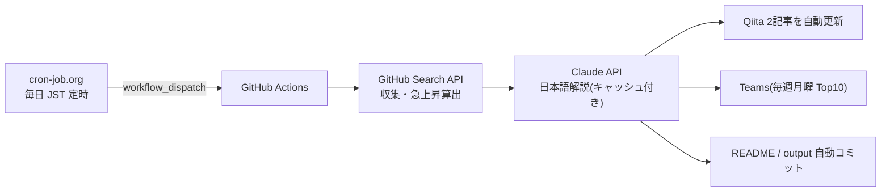

# Claude Code向けMCPツール候補ランキング

GitHub Search APIを使って、Claude Code周辺で活用候補になりそうなMCP関連リポジトリを定期収集するリポジトリです。

> 注意: この一覧は「Claude Codeでの動作」を保証するものではありません。  
> GitHub上のリポジトリ名・説明文・READMEなどに含まれる情報をもとに、MCP関連ツール候補を探すための入口として利用します。

## 仕組み(定常自律運転)

このランキングは cron-job.org → GitHub Actions → Claude API → Qiita / Teams のパイプラインで、毎日無人更新されています。


```mermaid
flowchart LR
    A["cron-job.org<br>毎日 JST 定時"] -->|workflow_dispatch| B["GitHub Actions"]
    B --> C["GitHub Search API<br>収集・急上昇算出"]
    C --> D["Claude API<br>日本語解説(キャッシュ付き)"]
    D --> E["Qiita 2記事を自動更新"]
    D --> F["Teams(毎週月曜 Top10)"]
    D --> G["README / output 自動コミット"]
```

- 仕組みの詳細と**ライブ稼働ステータス**: [定常自律運転ページ](https://takanobusano.github.io/mcp-github-ranking/)
- 作り方の解説記事: [パイプライン編](https://qiita.com/4q_sano/items/913e93ee5cc2731561fc) / [cron-job.org 完全自動化編](https://qiita.com/4q_sano/items/1bc5e0669a8f0166936c)
<!-- MCP_REPOS_START -->
最終更新: **2026-07-29 08:17:13 JST**

MCP関連リポジトリに加え、Claude Code周辺で活用候補になりそうな関連ツールをGitHub Search APIで毎日自動収集してランキング化しています。

Stars / Forks の差分は、UTC基準の前日データ（2026-07-27）との差分です。
CSVには最大500件を保存し、本文では上位100件を表示しています。

> 注意: この一覧はClaude Codeでの動作を保証するものではありません。  
> MCP関連ツールまたはClaude Code関連ツール候補を探すための入口として利用してください。

# 注目MCP・関連ツール候補ランキング

## 1位 [public-apis/public-apis](https://github.com/public-apis/public-apis)

A collective list of free APIs

⭐ **453,125 Stars**（+230）　🍴 **49,896 Forks**（+23）　/　🟢 **1,606 Open Issues**　/　Python

Topics: `api` / `apis` / `dataset` / `development` / `free` / `list` / `lists` / `open-source`

## 2位 [openclaw/openclaw](https://github.com/openclaw/openclaw)

Your own personal AI assistant. Any OS. Any Platform. The lobster way. 🦞

⭐ **384,437 Stars**（+86）　🍴 **80,773 Forks**（+28）　/　🟢 **6,521 Open Issues**　/　TypeScript

Topics: `ai` / `assistant` / `crustacean` / `molty` / `openclaw` / `own-your-data` / `personal`

## 3位 [obra/superpowers](https://github.com/obra/superpowers)

An agentic skills framework & software development methodology that works.

⭐ **262,682 Stars**（+567）　🍴 **23,458 Forks**（+56）　/　🟢 **328 Open Issues**　/　Shell

Topics: `ai` / `brainstorming` / `coding` / `obra` / `sdlc` / `skills` / `subagent-driven-development` / `superpowers`

## 4位 [affaan-m/ECC](https://github.com/affaan-m/ECC)

The agent harness performance optimization system. Skills, instincts, memory, security, and research-first development for Claude Code, Codex, Opencode, Cursor and beyond.

⭐ **234,762 Stars**（+619）　🍴 **35,772 Forks**（+91）　/　🟢 **100 Open Issues**　/　JavaScript

Topics: `ai-agents` / `anthropic` / `claude` / `claude-code` / `developer-tools` / `llm` / `mcp` / `productivity`

## 5位 [NousResearch/hermes-agent](https://github.com/NousResearch/hermes-agent)

The agent that grows with you

⭐ **221,885 Stars**（+481）　🍴 **42,456 Forks**（+175）　/　🟢 **26,140 Open Issues**　/　Python

Topics: `ai` / `ai-agent` / `ai-agents` / `anthropic` / `chatgpt` / `claude` / `claude-code` / `clawdbot`

## 6位 [multica-ai/andrej-karpathy-skills](https://github.com/multica-ai/andrej-karpathy-skills)

A single CLAUDE.md file to improve Claude Code behavior, derived from Andrej Karpathy's observations on LLM coding pitfalls.

⭐ **197,216 Stars**（+369）　🍴 **20,292 Forks**（+29）　/　🟢 **126 Open Issues**　/　不明

Topics: `topicなし`

## 7位 [ultraworkers/claw-code](https://github.com/ultraworkers/claw-code)

An agent-managed museum exhibit, built in Rust with Gajae-Code / LazyCodex — developed and maintained with no human intervention.

⭐ **194,941 Stars**（+12）　🍴 **109,432 Forks**（-21）　/　🟢 **34 Open Issues**　/　Rust

Topics: `topicなし`

## 8位 [mattpocock/skills](https://github.com/mattpocock/skills)

Skills for Real Engineers. Straight from my .agents directory.

⭐ **192,875 Stars**（+1,576）　🍴 **16,581 Forks**（+149）　/　🟢 **240 Open Issues**　/　Shell

Topics: `topicなし`

## 9位 [ollama/ollama](https://github.com/ollama/ollama)

Get up and running with Kimi-K2.6, GLM-5.2, MiniMax, DeepSeek, gpt-oss, Qwen, Gemma and other models.

⭐ **177,131 Stars**（+104）　🍴 **17,163 Forks**（+27）　/　🟢 **3,552 Open Issues**　/　Go

Topics: `deepseek` / `gemma` / `gemma3` / `glm` / `go` / `golang` / `gpt-oss` / `llama`

## 10位 [anthropics/skills](https://github.com/anthropics/skills)

Public repository for Agent Skills

⭐ **164,808 Stars**（+223）　🍴 **19,583 Forks**（+29）　/　🟢 **1,067 Open Issues**　/　Python

Topics: `agent-skills`

## 11位 [firecrawl/firecrawl](https://github.com/firecrawl/firecrawl)

The API to search, scrape, and interact with the web at scale. 🔥

⭐ **157,507 Stars**（+508）　🍴 **8,952 Forks**（+26）　/　🟢 **451 Open Issues**　/　TypeScript

Topics: `ai` / `ai-agents` / `ai-crawler` / `ai-scraping` / `ai-search` / `crawler` / `data-extraction` / `html-to-markdown`

## 12位 [langflow-ai/langflow](https://github.com/langflow-ai/langflow)

Langflow is a powerful tool for building and deploying AI-powered agents and workflows.

⭐ **152,541 Stars**（+39）　🍴 **9,677 Forks**（+5）　/　🟢 **997 Open Issues**　/　Python

Topics: `agents` / `chatgpt` / `generative-ai` / `large-language-models` / `multiagent` / `react-flow`

## 13位 [x1xhlol/system-prompts-and-models-of-ai-tools](https://github.com/x1xhlol/system-prompts-and-models-of-ai-tools)

FULL Augment Code, Claude Code, Cluely, CodeBuddy, Comet, Cursor, Devin AI, Junie, Kiro, Leap.new, Lovable, Manus, NotionAI, Orchids.app, Perplexity, Poke, Qoder, Replit, Same.dev, Trae, Traycer AI, VSCode Agent, Warp.dev, Windsurf, Xcode, Z.ai Code, Dia & v0. (And other Open Sourced) System Prompts, Internal Tools & AI Models

⭐ **142,387 Stars**（+29）　🍴 **34,815 Forks**（+1）　/　🟢 **160 Open Issues**　/　不明

Topics: `ai` / `bolt` / `cluely` / `copilot` / `cursor` / `cursorai` / `devin` / `github-copilot`

## 14位 [anthropics/claude-code](https://github.com/anthropics/claude-code)

Claude Code is an agentic coding tool that lives in your terminal, understands your codebase, and helps you code faster by executing routine tasks, explaining complex code, and handling git workflows - all through natural language commands.

⭐ **139,413 Stars**（+90）　🍴 **22,388 Forks**（+2）　/　🟢 **13,650 Open Issues**　/　Python

Topics: `topicなし`

## 15位 [msitarzewski/agency-agents](https://github.com/msitarzewski/agency-agents)

A complete AI agency at your fingertips - From frontend wizards to Reddit community ninjas, from whimsy injectors to reality checkers. Each agent is a specialized expert with personality, processes, and proven deliverables.

⭐ **137,282 Stars**（+196）　🍴 **22,394 Forks**（+39）　/　🟢 **101 Open Issues**　/　Shell

Topics: `topicなし`

## 16位 [garrytan/gstack](https://github.com/garrytan/gstack)

Use Garry Tan's exact Claude Code setup: 23 opinionated tools that serve as CEO, Designer, Eng Manager, Release Manager, Doc Engineer, and QA

⭐ **124,993 Stars**（+180）　🍴 **18,730 Forks**（+38）　/　🟢 **819 Open Issues**　/　TypeScript

Topics: `topicなし`

## 17位 [farion1231/cc-switch](https://github.com/farion1231/cc-switch)

A cross-platform desktop All-in-One assistant for Claude Code, Codex, OpenCode, OpenClaw, Grok Build & Hermes Agent. Only official website: ccswitch.io

⭐ **121,996 Stars**（+285）　🍴 **8,222 Forks**（+33）　/　🟢 **2,154 Open Issues**　/　Rust

Topics: `ai-tools` / `claude-code` / `codex` / `desktop-app` / `grok` / `grokbuild` / `hermes` / `hermes-agent`

## 18位 [nextlevelbuilder/ui-ux-pro-max-skill](https://github.com/nextlevelbuilder/ui-ux-pro-max-skill)

An AI SKILL that provide design intelligence for building professional UI/UX multiple platforms

⭐ **111,134 Stars**（+361）　🍴 **11,858 Forks**（+47）　/　🟢 **125 Open Issues**　/　Python

Topics: `ai-skills` / `antigravity` / `claude` / `claude-code` / `codex` / `command-line` / `copilot` / `cursor-ai`

## 19位 [browser-use/browser-use](https://github.com/browser-use/browser-use)

🌐 Make websites accessible for AI agents. Automate tasks online with ease.

⭐ **107,127 Stars**（+104）　🍴 **11,785 Forks**（+20）　/　🟢 **338 Open Issues**　/　Python

Topics: `ai-agents` / `ai-tools` / `browser-automation` / `browser-use` / `llm` / `playwright` / `python`

## 20位 [google-gemini/gemini-cli](https://github.com/google-gemini/gemini-cli)

An open-source AI agent that brings the power of Gemini directly into your terminal.

⭐ **106,228 Stars**（+19）　🍴 **14,333 Forks**（+7）　/　🟢 **1,065 Open Issues**　/　TypeScript

Topics: `ai` / `ai-agents` / `cli` / `gemini` / `gemini-api` / `mcp-client` / `mcp-server`

## 21位 [harry0703/MoneyPrinterTurbo](https://github.com/harry0703/MoneyPrinterTurbo)

利用 AI 大模型和自动化工作流，根据主题或关键词一键生成高清短视频。Generate HD short videos from a topic or keyword with an automated AI workflow.

⭐ **99,747 Stars**（+189）　🍴 **14,817 Forks**（+37）　/　🟢 **8 Open Issues**　/　Python

Topics: `ai-video-generator` / `content-creation` / `ffmpeg` / `instagram-reels` / `llm` / `python` / `short-video` / `subtitles`

## 22位 [Graphify-Labs/graphify](https://github.com/Graphify-Labs/graphify)

Turn any codebase, with its docs, SQL schemas, configs, and PDFs, into a queryable knowledge graph. A /graphify skill for Claude Code, Cursor, Codex, and Gemini CLI: local deterministic AST parsing, every edge explained, no vector store.

⭐ **97,750 Stars**（+615）　🍴 **9,476 Forks**（+70）　/　🟢 **688 Open Issues**　/　Python

Topics: `ai-agents` / `antigravity` / `ast` / `claude-code` / `code-analysis` / `code-search` / `codex` / `cursor`

## 23位 [puppeteer/puppeteer](https://github.com/puppeteer/puppeteer)

JavaScript API for Chrome and Firefox

⭐ **95,370 Stars**（+3）　🍴 **9,558 Forks**（-3）　/　🟢 **262 Open Issues**　/　TypeScript

Topics: `automation` / `chrome` / `chromium` / `developer-tools` / `firefox` / `headless-chrome` / `node-module` / `testing`

## 24位 [TauricResearch/TradingAgents](https://github.com/TauricResearch/TradingAgents)

TradingAgents: Multi-Agents LLM Financial Trading Framework

⭐ **94,882 Stars**（+127）　🍴 **18,331 Forks**（+18）　/　🟢 **315 Open Issues**　/　Python

Topics: `agent` / `finance` / `llm` / `multiagent` / `trading`

## 25位 [JuliusBrussee/caveman](https://github.com/JuliusBrussee/caveman)

🪨 why use many token when few token do trick — Claude Code skill that cuts 65% of tokens by talking like caveman

⭐ **93,918 Stars**（+391）　🍴 **5,366 Forks**（+21）　/　🟢 **434 Open Issues**　/　JavaScript

Topics: `ai` / `anthropic` / `caveman` / `claude` / `claude-code` / `llm` / `meme` / `prompt-engineering`

## 26位 [microsoft/playwright](https://github.com/microsoft/playwright)

Playwright is a framework for Web Testing and Automation. It allows testing Chromium, Firefox and WebKit with a single API.

⭐ **93,612 Stars**（+54）　🍴 **6,170 Forks**（+10）　/　🟢 **154 Open Issues**　/　TypeScript

Topics: `automation` / `chrome` / `chromium` / `e2e-testing` / `electron` / `end-to-end-testing` / `firefox` / `javascript`

## 27位 [DietrichGebert/ponytail](https://github.com/DietrichGebert/ponytail)

Makes your AI agent think like the laziest senior dev in the room. The best code is the code you never wrote.

⭐ **90,925 Stars**（+578）　🍴 **5,014 Forks**（+41）　/　🟢 **107 Open Issues**　/　JavaScript

Topics: `agent-skills` / `ai-agents` / `claude` / `claude-code` / `claude-code-plugin` / `cursor-rules` / `developer-tools` / `llm`

## 28位 [modelcontextprotocol/servers](https://github.com/modelcontextprotocol/servers)

Model Context Protocol Servers

⭐ **88,996 Stars**（+37）　🍴 **11,311 Forks**（+9）　/　🟢 **693 Open Issues**　/　TypeScript

Topics: `topicなし`

## 29位 [thedotmack/claude-mem](https://github.com/thedotmack/claude-mem)

Persistent Context Across Sessions for Every Agent –  Captures everything your agent does during sessions, compresses it with AI, and injects relevant context back into future sessions. Works with Claude Code, OpenClaw, Codex, Gemini, Hermes, Copilot, OpenCode + More

⭐ **88,872 Stars**（+122）　🍴 **7,730 Forks**（+19）　/　🟢 **305 Open Issues**　/　JavaScript

Topics: `ai` / `ai-agents` / `ai-memory` / `anthropic` / `artificial-intelligence` / `chromadb` / `claude` / `claude-agent-sdk`

## 30位 [ChatGPTNextWeb/NextChat](https://github.com/ChatGPTNextWeb/NextChat)

✨ Light and Fast AI Assistant. Support: Web \| iOS \| MacOS \| Android \|  Linux \| Windows

⭐ **88,565 Stars**（+4）　🍴 **59,367 Forks**（-5）　/　🟢 **846 Open Issues**　/　TypeScript

Topics: `calclaude` / `chatgpt` / `claude` / `cross-platform` / `desktop` / `fe` / `gemini` / `gemini-pro`

## 31位 [laravel/laravel](https://github.com/laravel/laravel)

Laravel is a web application framework with expressive, elegant syntax. We’ve already laid the foundation for your next big idea — freeing you to create without sweating the small things.

⭐ **84,700 Stars**（+7）　🍴 **24,814 Forks**（-5）　/　🟢 **31 Open Issues**　/　Blade

Topics: `framework` / `laravel` / `php`

## 32位 [OpenHands/OpenHands](https://github.com/OpenHands/OpenHands)

🙌 OpenHands: AI-Driven Development

⭐ **82,426 Stars**（+100）　🍴 **10,570 Forks**（+30）　/　🟢 **246 Open Issues**　/　TypeScript

Topics: `agent` / `artificial-intelligence` / `chatgpt` / `claude-ai` / `cli` / `developer-tools` / `gpt` / `llm`

## 33位 [nexu-io/open-design](https://github.com/nexu-io/open-design)

🎨 The open-source Claude Design alternative. 🖥️ Local-first desktop app. 🖼️ Your coding agent becomes the design engine: prototypes, landing pages, dashboards,...

⭐ **82,260 Stars**（+304）　🍴 **9,515 Forks**（+38）　/　🟢 **717 Open Issues**　/　TypeScript

Topics: `agent-skills` / `ai-agents` / `ai-design` / `byok` / `claude-code-for-design` / `claude-design` / `codex-design` / `coding-agents`

## 34位 [lobehub/lobehub](https://github.com/lobehub/lobehub)

🤯 LobeHub is your Chief Agent Operator, organizing your agents into 7×24 operations by hiring, scheduling, and reporting on your entire AI team.

⭐ **80,937 Stars**（+53）　🍴 **15,725 Forks**（+8）　/　🟢 **696 Open Issues**　/　TypeScript

Topics: `agent` / `agent-collaboration` / `agent-harness` / `ai` / `cao` / `chatgpt` / `chief-agent-operator` / `claude`

## 35位 [addyosmani/agent-skills](https://github.com/addyosmani/agent-skills)

Production-grade engineering skills for AI coding agents.

⭐ **80,779 Stars**（+140）　🍴 **8,713 Forks**（+18）　/　🟢 **128 Open Issues**　/　JavaScript

Topics: `agent-skills` / `antigravity` / `claude-code` / `codex` / `cursor` / `skills`

## 36位 [OpenCut-app/OpenCut](https://github.com/OpenCut-app/OpenCut)

The open-source CapCut alternative

⭐ **79,508 Stars**（+234）　🍴 **7,926 Forks**（+19）　/　🟢 **363 Open Issues**　/　TypeScript

Topics: `editor` / `oss` / `videoeditor`

## 37位 [bytedance/deer-flow](https://github.com/bytedance/deer-flow)

An open-source long-horizon SuperAgent harness that researches, codes, and creates. With the help of sandboxes, memories, tools, skill, subagents and message gateway, it handles different levels of tasks that could take minutes to hours.

⭐ **78,079 Stars**（+101）　🍴 **10,652 Forks**（+14）　/　🟢 **974 Open Issues**　/　Python

Topics: `agent` / `agentic` / `agentic-framework` / `agentic-workflow` / `ai` / `ai-agents` / `deep-research` / `harness`

## 38位 [Egonex-AI/Understand-Anything](https://github.com/Egonex-AI/Understand-Anything)

Graphs that teach > graphs that impress. Turn any code into an interactive knowledge graph you can explore, search, and ask questions about. Works with Claude Code, Codex, Cursor, Copilot, Gemini CLI, and more.

⭐ **76,583 Stars**（+166）　🍴 **6,403 Forks**（+12）　/　🟢 **260 Open Issues**　/　TypeScript

Topics: `antigravity-skills` / `business-knowledge` / `claude-code` / `claude-skills` / `codebase-analysis` / `codex` / `codex-skills` / `developer-tools-ai-agent`

## 39位 [opendatalab/MinerU](https://github.com/opendatalab/MinerU)

Transforms complex documents like PDFs and Office docs into LLM-ready markdown/JSON for your Agentic workflows.

⭐ **76,020 Stars**（+133）　🍴 **6,385 Forks**（+14）　/　🟢 **69 Open Issues**　/　Python

Topics: `ai4science` / `document-analysis` / `docx` / `extract-data` / `layout-analysis` / `ocr` / `parser` / `pdf`

## 40位 [koala73/worldmonitor](https://github.com/koala73/worldmonitor)

Real-time global intelligence dashboard. AI-powered news aggregation, geopolitical monitoring, and infrastructure tracking in a unified situational awareness interface

⭐ **75,915 Stars**（+598）　🍴 **11,357 Forks**（+57）　/　🟢 **286 Open Issues**　/　TypeScript

Topics: `agent` / `ai` / `dashboard` / `geopolitics` / `mcp` / `mcp-server` / `monitoring` / `news`

## 41位 [unclecode/crawl4ai](https://github.com/unclecode/crawl4ai)

🚀🤖 Crawl4AI: Open-source LLM Friendly Web Crawler & Scraper. Don't be shy, join here:

⭐ **75,426 Stars**（+141）　🍴 **7,793 Forks**（+17）　/　🟢 **121 Open Issues**　/　Python

Topics: `topicなし`

## 42位 [paperclipai/paperclip](https://github.com/paperclipai/paperclip)

The open-source app everyone uses to manage agents at work

⭐ **75,007 Stars**（+103）　🍴 **13,966 Forks**（+8）　/　🟢 **4,971 Open Issues**　/　TypeScript

Topics: `topicなし`

## 43位 [rtk-ai/rtk](https://github.com/rtk-ai/rtk)

CLI proxy that reduces LLM token consumption by 60-90% on common dev commands. Single Rust binary, zero dependencies

⭐ **73,678 Stars**（+134）　🍴 **4,611 Forks**（+13）　/　🟢 **1,765 Open Issues**　/　Rust

Topics: `agentic-coding` / `ai-coding` / `anthropic` / `claude-code` / `cli` / `command-line-tool` / `cost-reduction` / `developer-tools`

## 44位 [abi/screenshot-to-code](https://github.com/abi/screenshot-to-code)

Drop in a screenshot and convert it to clean code (HTML/Tailwind/React/Vue)

⭐ **73,605 Stars**（+33）　🍴 **9,054 Forks**（+6）　/　🟢 **124 Open Issues**　/　Python

Topics: `topicなし`

## 45位 [Eugeny/tabby](https://github.com/Eugeny/tabby)

A terminal for a more modern age

⭐ **73,569 Stars**（+21）　🍴 **4,184 Forks**（+1）　/　🟢 **2,811 Open Issues**　/　TypeScript

Topics: `serial` / `ssh-client` / `telnet-client` / `terminal` / `terminal-emulators`

## 46位 [thedaviddias/Front-End-Checklist](https://github.com/thedaviddias/Front-End-Checklist)

🗂 The essential checklist for modern web development, for humans and AI agents

⭐ **73,350 Stars**（+9）　🍴 **6,657 Forks**（+1）　/　🟢 **4 Open Issues**　/　MDX

Topics: `ai-agent` / `ai-agents` / `checklist` / `css` / `front-end-developer-tool` / `front-end-development` / `frontend` / `guidelines`

## 47位 [shareAI-lab/learn-claude-code](https://github.com/shareAI-lab/learn-claude-code)

Bash is all you need -  A nano claude code–like 「agent harness」, built from 0 to 1

⭐ **72,505 Stars**（+109）　🍴 **11,763 Forks**（+23）　/　🟢 **60 Open Issues**　/　Python

Topics: `agent` / `agent-development` / `ai-agent` / `claude` / `claude-code` / `educational` / `llm` / `python`

## 48位 [daytonaio/daytona](https://github.com/daytonaio/daytona)

Daytona is a Secure and Elastic Infrastructure for Running AI-Generated Code

⭐ **72,117 Stars**（-26）　🍴 **5,652 Forks**（-1）　/　🟢 **443 Open Issues**　/　不明

Topics: `agentic-workflow` / `ai` / `ai-agents` / `ai-runtime` / `ai-sandboxes` / `code-execution` / `code-interpreter` / `developer-tools`

## 49位 [D4Vinci/Scrapling](https://github.com/D4Vinci/Scrapling)

🕷️ An adaptive Web Scraping framework that handles everything from a single request to a full-scale crawl!

⭐ **71,632 Stars**（+148）　🍴 **7,107 Forks**（+13）　/　🟢 **2 Open Issues**　/　Python

Topics: `ai` / `ai-scraping` / `automation` / `crawler` / `crawling` / `crawling-python` / `data` / `data-extraction`

## 50位 [OpenBB-finance/OpenBB](https://github.com/OpenBB-finance/OpenBB)

Open Data Platform for analysts, quants and AI agents.

⭐ **71,131 Stars**（+42）　🍴 **7,252 Forks**（+9）　/　🟢 **86 Open Issues**　/　Python

Topics: `ai` / `crypto` / `derivatives` / `economics` / `equity` / `finance` / `fixed-income` / `machine-learning`

## 51位 [unslothai/unsloth](https://github.com/unslothai/unsloth)

Unsloth is a local UI for training and running Gemma 4, Qwen3.6, DeepSeek, Kimi, GLM and other models.

⭐ **69,030 Stars**（+49）　🍴 **6,213 Forks**（+2）　/　🟢 **988 Open Issues**　/　Python

Topics: `agent` / `deepseek` / `fine-tuning` / `gemma` / `gemma3` / `gpt-oss` / `llama` / `llama3`

## 52位 [Leonxlnx/taste-skill](https://github.com/Leonxlnx/taste-skill)

Taste-Skill - gives your AI good taste. stops the AI from generating boring, generic slop

⭐ **68,609 Stars**（+340）　🍴 **4,741 Forks**（+22）　/　🟢 **51 Open Issues**　/　JavaScript

Topics: `agent` / `ai` / `claude` / `claude-code` / `codex` / `coding` / `design` / `frontend`

## 53位 [openinterpreter/openinterpreter](https://github.com/openinterpreter/openinterpreter)

A coding agent for open models like Kimi K3

⭐ **67,384 Stars**（+38）　🍴 **5,792 Forks**（+8）　/　🟢 **0 Open Issues**　/　Rust

Topics: `acp` / `coding-agent` / `deepseek` / `kimi` / `qwen` / `rust`

## 54位 [code-yeongyu/oh-my-openagent](https://github.com/code-yeongyu/oh-my-openagent)

omo/lazycodex: The coding agent for tokenmaxxers;the one and only agent harness for complex codebases. For your Codex, for your OpenCode

⭐ **66,727 Stars**（+51）　🍴 **5,444 Forks**（+11）　/　🟢 **944 Open Issues**　/　TypeScript

Topics: `ai` / `ai-agents` / `anthropic` / `chatgpt` / `claude` / `claude-skills` / `codex` / `cursor`

## 55位 [bradtraversy/design-resources-for-developers](https://github.com/bradtraversy/design-resources-for-developers)

Curated list of design and UI resources from stock photos, web templates, CSS frameworks, UI libraries, tools and much more

⭐ **66,524 Stars**（+9）　🍴 **12,118 Forks**（±0）　/　🟢 **65 Open Issues**　/　不明

Topics: `topicなし`

## 56位 [xtekky/gpt4free](https://github.com/xtekky/gpt4free)

The official gpt4free repository \| various collection of powerful language models \| opus 4.6 gpt 5.3 kimi 2.5 deepseek v3.2 gemini 3

⭐ **66,500 Stars**（+6）　🍴 **13,531 Forks**（±0）　/　🟢 **7 Open Issues**　/　Python

Topics: `chatbot` / `chatbots` / `chatgpt` / `chatgpt-4` / `chatgpt-api` / `chatgpt-free` / `chatgpt4` / `deepseek`

## 57位 [ruvnet/ruflo](https://github.com/ruvnet/ruflo)

🌊 The leading agent meta-harness. Deploy intelligent multi-player swarms, coordinate autonomous workflows, and build conversational AI systems. Features adaptiv...

⭐ **66,402 Stars**（+127）　🍴 **7,913 Forks**（+21）　/　🟢 **852 Open Issues**　/　TypeScript

Topics: `agentic-ai` / `agentic-framework` / `agentic-workflow` / `agents` / `ai-agents` / `ai-assistant` / `ai-coding` / `ai-skills`

## 58位 [cline/cline](https://github.com/cline/cline)

Autonomous coding agent as an SDK, IDE extension, or CLI assistant.

⭐ **65,139 Stars**（+29）　🍴 **6,999 Forks**（+7）　/　🟢 **1,090 Open Issues**　/　TypeScript

Topics: `topicなし`

## 59位 [docling-project/docling](https://github.com/docling-project/docling)

Get your documents ready for gen AI

⭐ **63,910 Stars**（+53）　🍴 **4,540 Forks**（+5）　/　🟢 **971 Open Issues**　/　Python

Topics: `ai` / `convert` / `document-parser` / `document-parsing` / `documents` / `docx` / `html` / `markdown`

## 60位 [warpdotdev/warp](https://github.com/warpdotdev/warp)

Warp is an agentic development environment, born out of the terminal.

⭐ **63,742 Stars**（+23）　🍴 **5,348 Forks**（+6）　/　🟢 **4,784 Open Issues**　/　Rust

Topics: `bash` / `linux` / `macos` / `rust` / `shell` / `terminal` / `wasm` / `zsh`

## 61位 [shanraisshan/claude-code-best-practice](https://github.com/shanraisshan/claude-code-best-practice)

from vibe coding to agentic engineering - practice makes claude perfect

⭐ **63,659 Stars**（+62）　🍴 **6,340 Forks**（+7）　/　🟢 **20 Open Issues**　/　HTML

Topics: `agentic-ai` / `agentic-coding` / `agentic-engineering` / `agentic-workflow` / `ai` / `ai-agents` / `anthropic` / `best-practices`

## 62位 [colbymchenry/codegraph](https://github.com/colbymchenry/codegraph)

Pre-indexed code knowledge graph, auto syncs on code changes, for Claude Code, Codex, Gemini, Cursor, OpenCode, AntiGravity, Kiro, and Hermes Agent — fewer tokens, fewer tool calls, 100% local

⭐ **63,112 Stars**（+308）　🍴 **3,965 Forks**（+21）　/　🟢 **369 Open Issues**　/　C

Topics: `topicなし`

## 63位 [headroomlabs-ai/headroom](https://github.com/headroomlabs-ai/headroom)

Compress tool outputs, logs, files, and RAG chunks before they reach the LLM. 20% fewer tokens for coding agents, 60-95% fewer tokens for JSON, same answers. Library, proxy, MCP server.

⭐ **62,952 Stars**（+170）　🍴 **4,772 Forks**（+18）　/　🟢 **580 Open Issues**　/　Python

Topics: `agent` / `ai` / `anthropic` / `claude-code` / `compression` / `context-engineering` / `context-window` / `cursor`

## 64位 [Fission-AI/OpenSpec](https://github.com/Fission-AI/OpenSpec)

Spec-driven development (SDD) for AI coding assistants.

⭐ **62,949 Stars**（+148）　🍴 **4,351 Forks**（+6）　/　🟢 **328 Open Issues**　/　TypeScript

Topics: `ai` / `context-engineering` / `engineering` / `planning` / `prd` / `sdd` / `sdlc` / `spec`

## 65位 [mem0ai/mem0](https://github.com/mem0ai/mem0)

Universal memory layer for AI Agents

⭐ **61,947 Stars**（+87）　🍴 **7,224 Forks**（+15）　/　🟢 **755 Open Issues**　/　TypeScript

Topics: `agents` / `ai` / `ai-agents` / `application` / `chatbots` / `chatgpt` / `genai` / `llm`

## 66位 [Panniantong/Agent-Reach](https://github.com/Panniantong/Agent-Reach)

Give your AI agent eyes to see the entire internet. Read & search Twitter, Reddit, YouTube, GitHub, Bilibili, XiaoHongShu — one CLI, zero API fees.

⭐ **61,749 Stars**（+495）　🍴 **4,992 Forks**（+24）　/　🟢 **173 Open Issues**　/　Python

Topics: `agent-infrastructure` / `ai-agent` / `ai-search` / `automation` / `bilibili` / `claude-code` / `cli` / `cursor`

## 67位 [asgeirtj/system_prompts_leaks](https://github.com/asgeirtj/system_prompts_leaks)

Extracted system prompts from Anthropic - Claude Fable 5, Opus 5, Claude Design, Claude Code. OpenAI - ChatGPT GPT-5.6-Sol, Codex. Google - Gemini 3.5 Flash, 3.1 Pro, Antigravity. xAI - Grok, Cursor, Copilot, VS Code, Perplexity, and more. Updated regularly.

⭐ **61,166 Stars**（+218）　🍴 **9,981 Forks**（+15）　/　🟢 **48 Open Issues**　/　JavaScript

Topics: `ai` / `ai-agents` / `ai-prompts` / `anthropic` / `chatbot` / `chatgpt` / `claude` / `claude-code`

## 68位 [sansan0/TrendRadar](https://github.com/sansan0/TrendRadar)

⭐AI-driven public opinion & trend monitor with multi-platform aggregation, RSS, and smart alerts.🎯 告别信息过载，你的 AI 舆情监控助手与热点筛选工具！聚合多平台热点 +  RSS 订阅，支持关键词精准筛选。AI 智能筛...

⭐ **60,972 Stars**（+33）　🍴 **24,822 Forks**（-1）　/　🟢 **50 Open Issues**　/　Python

Topics: `ai` / `bark` / `data-analysis` / `docker` / `hot-news` / `llm` / `mail` / `mcp`

## 69位 [tw93/Pake](https://github.com/tw93/Pake)

🤱🏻 Turn any webpage into a desktop app with one command.

⭐ **60,279 Stars**（+21）　🍴 **12,253 Forks**（+14）　/　🟢 **5 Open Issues**　/　Rust

Topics: `chatgpt` / `claude` / `desktop` / `gemini` / `hight-performance` / `linux` / `macos` / `no-electron`

## 70位 [microsoft/autogen](https://github.com/microsoft/autogen)

A programming framework for agentic AI

⭐ **60,064 Stars**（+28）　🍴 **9,047 Forks**（+10）　/　🟢 **976 Open Issues**　/　Python

Topics: `agentic` / `agentic-agi` / `agents` / `ai` / `autogen` / `autogen-ecosystem` / `chatgpt` / `framework`

## 71位 [1c7/chinese-independent-developer](https://github.com/1c7/chinese-independent-developer)

👩🏿‍💻👨🏾‍💻👩🏼‍💻👨🏽‍💻👩🏻‍💻中国独立开发者项目列表 -- 分享大家都在做什么

⭐ **59,975 Stars**（+67）　🍴 **5,205 Forks**（+18）　/　🟢 **2 Open Issues**　/　Python

Topics: `china` / `indie` / `indie-developer`

## 72位 [upstash/context7](https://github.com/upstash/context7)

Context7 Platform -- Up-to-date code documentation for LLMs and AI code editors

⭐ **59,917 Stars**（+68）　🍴 **2,868 Forks**（+1）　/　🟢 **25 Open Issues**　/　TypeScript

Topics: `llm` / `mcp` / `mcp-server` / `vibe-coding`

## 73位 [coollabsio/coolify](https://github.com/coollabsio/coolify)

An open-source, self-hostable PaaS alternative to Vercel, Heroku & Netlify that lets you easily deploy static sites, databases, full-stack applications and 280+ one-click services on your own servers.

⭐ **59,766 Stars**（+60）　🍴 **5,176 Forks**（+6）　/　🟢 **828 Open Issues**　/　PHP

Topics: `coolify` / `databases` / `deployment` / `docker` / `docker-compose` / `inertiajs` / `laravel` / `mariadb`

## 74位 [NanmiCoder/MediaCrawler](https://github.com/NanmiCoder/MediaCrawler)

小红书笔记 \| 评论爬虫、抖音视频 \| 评论爬虫、快手视频 \| 评论爬虫、B 站视频 ｜ 评论爬虫、微博帖子 ｜ 评论爬虫、百度贴吧帖子 ｜ 百度贴吧评论回复爬虫  \| 知乎问答文章｜评论爬虫

⭐ **58,822 Stars**（+679）　🍴 **11,653 Forks**（+73）　/　🟢 **183 Open Issues**　/　Python

Topics: `topicなし`

## 75位 [meilisearch/meilisearch](https://github.com/meilisearch/meilisearch)

A lightning-fast search engine API bringing AI-powered hybrid search to your sites and applications.

⭐ **58,769 Stars**（+15）　🍴 **2,642 Forks**（+2）　/　🟢 **303 Open Issues**　/　Rust

Topics: `ai` / `api` / `app-search` / `database` / `enterprise-search` / `faceting` / `full-text-search` / `fuzzy-search`

## 76位 [MemPalace/mempalace](https://github.com/MemPalace/mempalace)

The best-benchmarked open-source AI memory system. And it's free.

⭐ **57,835 Stars**（+32）　🍴 **7,443 Forks**（+5）　/　🟢 **665 Open Issues**　/　Python

Topics: `ai` / `chromadb` / `llm` / `mcp` / `memory` / `python`

## 77位 [penpot/penpot](https://github.com/penpot/penpot)

Penpot: The open-source design platform for Product teams that need scalable collaboration.

⭐ **57,615 Stars**（+109）　🍴 **3,831 Forks**（+11）　/　🟢 **746 Open Issues**　/　Clojure

Topics: `clojure` / `clojurescript` / `design` / `prototyping` / `ui` / `ux-design` / `ux-experience`

## 78位 [zylon-ai/private-gpt](https://github.com/zylon-ai/private-gpt)

Complete API layer for private AI applications on local models: RAG, skills, tools, MCP, text-to-sql, and more. Works with any OpenAI-compatible inference server.

⭐ **57,379 Stars**（-2）　🍴 **7,599 Forks**（-1）　/　🟢 **6 Open Issues**　/　Python

Topics: `ai` / `ai-tools` / `on-premise`

## 79位 [crewAIInc/crewAI](https://github.com/crewAIInc/crewAI)

Framework for orchestrating role-playing, autonomous AI agents. By fostering collaborative intelligence, CrewAI empowers agents to work together seamlessly, tackling complex tasks.

⭐ **56,285 Stars**（+49）　🍴 **7,999 Forks**（+12）　/　🟢 **703 Open Issues**　/　Python

Topics: `agents` / `ai` / `ai-agents` / `aiagentframework` / `llms`

## 80位 [BerriAI/litellm](https://github.com/BerriAI/litellm)

The fastest, litest AI Gateway. Rust core with Python SDK. Call 100+ LLM APIs in OpenAI (or native) format with cost tracking, guardrails, load balancing, and logging [Bedrock, Azure, OpenAI, Anthropic, OpenAI, VertexAI, vLLM, Nvidia NIM]

⭐ **54,939 Stars**（+82）　🍴 **10,163 Forks**（+35）　/　🟢 **4,437 Open Issues**　/　Python

Topics: `ai-gateway` / `anthropic` / `azure-openai` / `bedrock` / `gateway` / `langchain` / `litellm` / `llm`

## 81位 [mvanhorn/last30days-skill](https://github.com/mvanhorn/last30days-skill)

AI agent skill that researches any topic across Reddit, X, YouTube, HN, Polymarket, and the web - then synthesizes a grounded summary

⭐ **54,552 Stars**（+407）　🍴 **4,713 Forks**（+16）　/　🟢 **76 Open Issues**　/　Python

Topics: `ai-prompts` / `ai-skill` / `bluesky` / `claude` / `claude-code` / `clawhub` / `deep-research` / `hackernews`

## 82位 [pbakaus/impeccable](https://github.com/pbakaus/impeccable)

The design language that makes your AI harness better at design.

⭐ **52,225 Stars**（+723）　🍴 **3,071 Forks**（+32）　/　🟢 **42 Open Issues**　/　JavaScript

Topics: `topicなし`

## 83位 [aaif-goose/goose](https://github.com/aaif-goose/goose)

an open source, extensible AI agent that goes beyond code suggestions - install, execute, edit, and test with any LLM

⭐ **51,863 Stars**（+43）　🍴 **5,768 Forks**（+14）　/　🟢 **424 Open Issues**　/　Rust

Topics: `acp` / `ai` / `ai-agents` / `mcp`

## 84位 [charlax/professional-programming](https://github.com/charlax/professional-programming)

A collection of learning resources for curious software engineers

⭐ **51,304 Stars**（+3）　🍴 **4,006 Forks**（+1）　/　🟢 **6 Open Issues**　/　Python

Topics: `architecture` / `computer-science` / `concepts` / `documentation` / `engineer` / `learning` / `lessons-learned` / `professional`

## 85位 [bmad-code-org/BMAD-METHOD](https://github.com/bmad-code-org/BMAD-METHOD)

Breakthrough Method for Agile Ai Driven Development

⭐ **51,218 Stars**（+34）　🍴 **5,878 Forks**（+6）　/　🟢 **119 Open Issues**　/　JavaScript

Topics: `topicなし`

## 86位 [mudler/LocalAI](https://github.com/mudler/LocalAI)

LocalAI is the open-source AI engine. Run any model - LLMs, vision, voice, image, video - on any hardware. No GPU required.

⭐ **47,965 Stars**（+25）　🍴 **4,298 Forks**（+4）　/　🟢 **187 Open Issues**　/　Go

Topics: `agents` / `ai` / `api` / `audio-generation` / `decentralized` / `distributed` / `image-generation` / `libp2p`

## 87位 [ChromeDevTools/chrome-devtools-mcp](https://github.com/ChromeDevTools/chrome-devtools-mcp)

Chrome DevTools for coding agents

⭐ **47,750 Stars**（+48）　🍴 **3,224 Forks**（-3）　/　🟢 **117 Open Issues**　/　TypeScript

Topics: `browser` / `chrome` / `chrome-devtools` / `debugging` / `devtools` / `mcp` / `mcp-server` / `puppeteer`

## 88位 [oobabooga/textgen](https://github.com/oobabooga/textgen)

Open-source desktop app for local LLMs. Text, vision, tool-calling, OpenAI/Anthropic-compatible API. 100% private.

⭐ **47,505 Stars**（+2）　🍴 **5,985 Forks**（+1）　/　🟢 **832 Open Issues**　/　Python

Topics: `topicなし`

## 89位 [prisma/prisma](https://github.com/prisma/prisma)

Next-generation ORM for Node.js & TypeScript \| PostgreSQL, MySQL, MariaDB, SQL Server, SQLite, MongoDB and CockroachDB

⭐ **47,411 Stars**（+1）　🍴 **2,447 Forks**（-6）　/　🟢 **2,512 Open Issues**　/　TypeScript

Topics: `cockroachdb` / `database` / `javascript` / `mariadb` / `mongo` / `mongodb` / `mongodb-orm` / `mssql`

## 90位 [GitHubDaily/GitHubDaily](https://github.com/GitHubDaily/GitHubDaily)

坚持分享 GitHub 上高质量、有趣实用的开源技术教程、开发者工具、编程网站、技术资讯。A list cool, interesting projects of GitHub.

⭐ **47,278 Stars**（+25）　🍴 **4,660 Forks**（+4）　/　🟢 **732 Open Issues**　/　不明

Topics: `ai` / `algorithms-and-data-structures` / `backend` / `developer-tools` / `development` / `frontend` / `github` / `java`

## 91位 [jamiepine/voicebox](https://github.com/jamiepine/voicebox)

The open-source AI voice studio. Clone, dictate, create.

⭐ **47,248 Stars**（+185）　🍴 **5,797 Forks**（+22）　/　🟢 **565 Open Issues**　/　TypeScript

Topics: `ai` / `cuda` / `mlx` / `qwen3-tts` / `qwen3-tts-ui` / `voice-ai` / `voice-clone` / `whisper`

## 92位 [jeecgboot/JeecgBoot](https://github.com/jeecgboot/JeecgBoot)

【低代码迈入v2.0时代，一句话即可生成整个系统】企业级AI低代码平台，一键生成前后端代码甚至整个系统。 AI Skills 一句话画流程、设计表单、生成报表、大屏。内置 AI应用平台涵盖：AI聊天、知识库、流程编排、MCP插件等，兼容主流大模型。引领AI低代码「Skills 生成 → 在线配置 → 代码生成 → 手工...

⭐ **47,194 Stars**（+1）　🍴 **16,117 Forks**（+2）　/　🟢 **35 Open Issues**　/　Java

Topics: `activiti` / `agent` / `ai` / `antd` / `claude-code` / `cli` / `codegenerator` / `codex`

## 93位 [exo-explore/exo](https://github.com/exo-explore/exo)

Run frontier AI locally.

⭐ **46,508 Stars**（+12）　🍴 **3,388 Forks**（+3）　/　🟢 **312 Open Issues**　/　Python

Topics: `topicなし`

## 94位 [apache/airflow](https://github.com/apache/airflow)

Apache Airflow - A platform to programmatically author, schedule, and monitor workflows

⭐ **46,292 Stars**（+10）　🍴 **17,475 Forks**（+13）　/　🟢 **1,816 Open Issues**　/　Python

Topics: `airflow` / `apache` / `apache-airflow` / `automation` / `dag` / `data-engineering` / `data-integration` / `data-orchestrator`

## 95位 [HKUDS/CLI-Anything](https://github.com/HKUDS/CLI-Anything)

"CLI-Anything: Making ALL Software Agent-Native" -- CLI-Hub:

⭐ **46,243 Stars**（+54）　🍴 **4,307 Forks**（+1）　/　🟢 **89 Open Issues**　/　Python

Topics: `topicなし`

## 96位 [KeygraphHQ/shannon](https://github.com/KeygraphHQ/shannon)

Shannon is an autonomous, white-box AI pentester for web applications and APIs. It analyzes your source code, identifies attack vectors, and executes real exploits to prove vulnerabilities before they reach production.

⭐ **46,229 Stars**（+21）　🍴 **5,344 Forks**（+1）　/　🟢 **24 Open Issues**　/　TypeScript

Topics: `penetration-testing` / `pentesting` / `security-audit` / `security-automation` / `security-tools`

## 97位 [zhayujie/CowAgent](https://github.com/zhayujie/CowAgent)

Open-source super AI assistant & Agent Harness. Plans tasks, runs tools and skills, self-evolves with memory and knowledge. Multi-model, multi-channel. Lightweight, extensible, one-line install. (formerly chatgpt-on-wechat)

⭐ **46,176 Stars**（+17）　🍴 **10,285 Forks**（±0）　/　🟢 **28 Open Issues**　/　Python

Topics: `ai` / `ai-agent` / `ai-agents` / `chatgpt-on-wechat` / `claude` / `claude-code` / `codex` / `cowagent`

## 98位 [router-for-me/CLIProxyAPI](https://github.com/router-for-me/CLIProxyAPI)

Wrap Antigravity, ChatGPT Codex, Claude Code, Grok Build as an OpenAI/Gemini/Claude/Codex compatible API service, allowing you to enjoy the free Gemini 3.1 Pro, GPT 5.5, Grok 4.3, Claude model through API

⭐ **45,365 Stars**（+162）　🍴 **7,050 Forks**（+11）　/　🟢 **347 Open Issues**　/　Go

Topics: `antigravity` / `claude-code` / `cluade` / `codex` / `gemini` / `openai`

## 99位 [abhigyanpatwari/GitNexus](https://github.com/abhigyanpatwari/GitNexus)

GitNexus: The Zero-Server Code Intelligence Engine -       GitNexus is a client-side knowledge graph creator that runs entirely in your browser. Drop in a git repository (Github, Gitlab, Azure, Local) or ZIP file, and get an interactive knowledge graph with a built in Graph RAG Agent. Perfect for code exploration

⭐ **44,750 Stars**（+53）　🍴 **4,960 Forks**（+3）　/　🟢 **275 Open Issues**　/　TypeScript

Topics: `topicなし`

## 100位 [rohitg00/ai-engineering-from-scratch](https://github.com/rohitg00/ai-engineering-from-scratch)

Learn it. Build it. Ship it for others.

⭐ **44,603 Stars**（+376）　🍴 **7,555 Forks**（+98）　/　🟢 **101 Open Issues**　/　Python

Topics: `agents` / `ai` / `ai-agents` / `ai-engineering` / `computer-vision` / `course` / `deep-learning` / `from-scratch`

# 最近プッシュされたMCP・関連ツール候補

スター数ランキングとは別に、最近コードがプッシュされたリポジトリを表示します。古いスター数だけではなく、現在も開発が動いていそうな候補を探すための一覧です。

## プッシュ順 1位 [cline/cline](https://github.com/cline/cline)

Autonomous coding agent as an SDK, IDE extension, or CLI assistant.

⭐ **65,139 Stars**（+29）　🍴 **6,999 Forks**（+7）　/　TypeScript　/　最終プッシュ: 2026-07-28

Topics: `topicなし`

## プッシュ順 2位 [manaflow-ai/cmux](https://github.com/manaflow-ai/cmux)

Open source Ghostty-based macOS terminal with vertical tabs and notifications for AI coding agents. Built for multitasking, organization, and programmability.

⭐ **25,275 Stars**（+64）　🍴 **2,098 Forks**（+12）　/　Swift　/　最終プッシュ: 2026-07-28

Topics: `amp` / `claude-code` / `cli` / `codex` / `coding-agents` / `gemini` / `ghostty` / `macos`

## プッシュ順 3位 [superset-sh/superset](https://github.com/superset-sh/superset)

Code Editor for the AI Agents Era - Run an army of Claude Code, Codex, etc. on your machine

⭐ **12,641 Stars**（+8）　🍴 **1,133 Forks**（+4）　/　TypeScript　/　最終プッシュ: 2026-07-28

Topics: `agentic-ai` / `ai-agents` / `claude-code` / `cli` / `codex` / `coding-agents` / `cursor-agent` / `desktop-app`

## プッシュ順 4位 [trycua/cua](https://github.com/trycua/cua)

Scale computer-use 2.0 with open-source drivers, cross-OS fleets, and benchmarks for training, evaluation, and data generation.

⭐ **20,730 Stars**（+25）　🍴 **1,388 Forks**（+3）　/　HTML　/　最終プッシュ: 2026-07-28

Topics: `agent` / `ai-agent` / `apple` / `computer-use` / `computer-use-agent` / `containerization` / `cua` / `desktop-automation`

## プッシュ順 5位 [unslothai/unsloth](https://github.com/unslothai/unsloth)

Unsloth is a local UI for training and running Gemma 4, Qwen3.6, DeepSeek, Kimi, GLM and other models.

⭐ **69,030 Stars**（+49）　🍴 **6,213 Forks**（+2）　/　Python　/　最終プッシュ: 2026-07-28

Topics: `agent` / `deepseek` / `fine-tuning` / `gemma` / `gemma3` / `gpt-oss` / `llama` / `llama3`

## プッシュ順 6位 [sgl-project/sglang](https://github.com/sgl-project/sglang)

SGLang is a high-performance serving framework for large language models and multimodal models.

⭐ **30,872 Stars**（+68）　🍴 **7,471 Forks**（+36）　/　Python　/　最終プッシュ: 2026-07-28

Topics: `attention` / `blackwell` / `cuda` / `deepseek` / `diffusion` / `glm` / `gpt-oss` / `inference`

## プッシュ順 7位 [MetaMask/metamask-extension](https://github.com/MetaMask/metamask-extension)

:globe_with_meridians: :electric_plug: The MetaMask browser extension enables browsing Ethereum blockchain enabled websites

⭐ **13,183 Stars**（-3）　🍴 **5,565 Forks**（-1）　/　TypeScript　/　最終プッシュ: 2026-07-28

Topics: `brave` / `chrome` / `dapp` / `dapp-developers` / `edge` / `ethereum` / `extension` / `firefox`

## プッシュ順 8位 [windmill-labs/windmill](https://github.com/windmill-labs/windmill)

Open-source developer platform to power your entire infra and turn scripts into webhooks, workflows and UIs. Fastest workflow engine (13x vs Airflow). Open-source alternative to Retool and Temporal.

⭐ **17,351 Stars**（+22）　🍴 **1,050 Forks**（±0）　/　Rust　/　最終プッシュ: 2026-07-28

Topics: `low-code` / `open-source` / `platform` / `postgresql` / `python` / `self-hostable` / `typescript`

## プッシュ順 9位 [pbakaus/impeccable](https://github.com/pbakaus/impeccable)

The design language that makes your AI harness better at design.

⭐ **52,225 Stars**（+723）　🍴 **3,071 Forks**（+32）　/　JavaScript　/　最終プッシュ: 2026-07-28

Topics: `topicなし`

## プッシュ順 10位 [pingdotgg/t3code](https://github.com/pingdotgg/t3code)

説明なし

⭐ **15,455 Stars**（+163）　🍴 **3,385 Forks**（+46）　/　TypeScript　/　最終プッシュ: 2026-07-28

Topics: `topicなし`

## プッシュ順 11位 [openclaw/openclaw](https://github.com/openclaw/openclaw)

Your own personal AI assistant. Any OS. Any Platform. The lobster way. 🦞

⭐ **384,437 Stars**（+86）　🍴 **80,773 Forks**（+28）　/　TypeScript　/　最終プッシュ: 2026-07-28

Topics: `ai` / `assistant` / `crustacean` / `molty` / `openclaw` / `own-your-data` / `personal`

## プッシュ順 12位 [CopilotKit/CopilotKit](https://github.com/CopilotKit/CopilotKit)

The Frontend Stack for Agents & Generative UI. React, Angular, Mobile, Slack, and more.  Makers of the AG-UI Protocol

⭐ **36,343 Stars**（+23）　🍴 **4,486 Forks**（+2）　/　TypeScript　/　最終プッシュ: 2026-07-28

Topics: `agent` / `agent-native` / `agentic-ai` / `agents` / `ai` / `ai-agent` / `ai-assistant` / `assistant`

## プッシュ順 13位 [kortix-ai/suna](https://github.com/kortix-ai/suna)

The Company AI Command Center

⭐ **20,041 Stars**（-1）　🍴 **3,431 Forks**（±0）　/　TypeScript　/　最終プッシュ: 2026-07-28

Topics: `ai` / `ai-agents` / `llm`

## プッシュ順 14位 [PostHog/posthog](https://github.com/PostHog/posthog)

:hedgehog: PostHog is the leading platform for building self-driving products. Our developer tools – AI observability, analytics, session replay, flags, experiments, error tracking, logs, and more – capture all the context agents need to diagnose problems, uncover opportunities, and ship fixes. Steer it all from Slack, web, desktop, or the MCP.

⭐ **37,352 Stars**（+9）　🍴 **3,103 Forks**（+6）　/　Python　/　最終プッシュ: 2026-07-28

Topics: `ab-testing` / `ai-analytics` / `analytics` / `cdp` / `data-warehouse` / `experiments` / `feature-flags` / `javascript`

## プッシュ順 15位 [Arize-ai/phoenix](https://github.com/Arize-ai/phoenix)

AI Observability & Evaluation

⭐ **10,786 Stars**（+18）　🍴 **1,016 Forks**（+2）　/　Python　/　最終プッシュ: 2026-07-28

Topics: `agents` / `ai-monitoring` / `ai-observability` / `aiengineering` / `anthropic` / `datasets` / `evals` / `langchain`

## プッシュ順 16位 [BerriAI/litellm](https://github.com/BerriAI/litellm)

The fastest, litest AI Gateway. Rust core with Python SDK. Call 100+ LLM APIs in OpenAI (or native) format with cost tracking, guardrails, load balancing, and logging [Bedrock, Azure, OpenAI, Anthropic, OpenAI, VertexAI, vLLM, Nvidia NIM]

⭐ **54,939 Stars**（+82）　🍴 **10,163 Forks**（+35）　/　Python　/　最終プッシュ: 2026-07-28

Topics: `ai-gateway` / `anthropic` / `azure-openai` / `bedrock` / `gateway` / `langchain` / `litellm` / `llm`

## プッシュ順 17位 [headroomlabs-ai/headroom](https://github.com/headroomlabs-ai/headroom)

Compress tool outputs, logs, files, and RAG chunks before they reach the LLM. 20% fewer tokens for coding agents, 60-95% fewer tokens for JSON, same answers. Library, proxy, MCP server.

⭐ **62,952 Stars**（+170）　🍴 **4,772 Forks**（+18）　/　Python　/　最終プッシュ: 2026-07-28

Topics: `agent` / `ai` / `anthropic` / `claude-code` / `compression` / `context-engineering` / `context-window` / `cursor`

## プッシュ順 18位 [DayuanJiang/next-ai-draw-io](https://github.com/DayuanJiang/next-ai-draw-io)

A next.js web application that integrates AI capabilities with draw.io diagrams. This app allows you to create, modify, and enhance diagrams through natural language commands and AI-assisted visualization.

⭐ **33,927 Stars**（+33）　🍴 **3,582 Forks**（-1）　/　TypeScript　/　最終プッシュ: 2026-07-28

Topics: `ai` / `diagrams` / `productivity`

## プッシュ順 19位 [OpenHands/OpenHands](https://github.com/OpenHands/OpenHands)

🙌 OpenHands: AI-Driven Development

⭐ **82,426 Stars**（+100）　🍴 **10,570 Forks**（+30）　/　TypeScript　/　最終プッシュ: 2026-07-28

Topics: `agent` / `artificial-intelligence` / `chatgpt` / `claude-ai` / `cli` / `developer-tools` / `gpt` / `llm`

## プッシュ順 20位 [agno-agi/agno](https://github.com/agno-agi/agno)

Build, run, and manage agent platforms.

⭐ **41,474 Stars**（+23）　🍴 **5,713 Forks**（+14）　/　Python　/　最終プッシュ: 2026-07-28

Topics: `agents` / `ai` / `ai-agents` / `developer-tools` / `python`

## プッシュ順 21位 [mastra-ai/mastra](https://github.com/mastra-ai/mastra)

Mastra is the modern TypeScript framework for AI-powered applications and agents.

⭐ **26,662 Stars**（+47）　🍴 **2,522 Forks**（+1）　/　TypeScript　/　最終プッシュ: 2026-07-28

Topics: `agents` / `ai` / `chatbots` / `evals` / `javascript` / `llm` / `mcp` / `nextjs`

## プッシュ順 22位 [directus/directus](https://github.com/directus/directus)

The flexible backend for all your projects 🐰 Turn your DB into a headless CMS, admin panels, or apps with a custom UI, instant APIs, auth & more.

⭐ **36,918 Stars**（+7）　🍴 **4,862 Forks**（±0）　/　TypeScript　/　最終プッシュ: 2026-07-28

Topics: `api` / `app` / `cms` / `composable` / `data-visualization` / `database` / `directus` / `graphql`

## プッシュ順 23位 [semaphoreui/semaphore](https://github.com/semaphoreui/semaphore)

Modern UI and powerful API for Ansible, Terraform/OpenTofu/Terragrunt, PowerShell and other DevOps tools.

⭐ **13,931 Stars**（+5）　🍴 **1,282 Forks**（±0）　/　Go　/　最終プッシュ: 2026-07-28

Topics: `ansible` / `awx` / `ci` / `cicd` / `devops` / `docker` / `docker-ui` / `go`

## プッシュ順 24位 [NVIDIA/NemoClaw](https://github.com/NVIDIA/NemoClaw)

Run agents like Hermes, LangChain Deep Agents, and OpenClaw more securely inside NVIDIA OpenShell with managed inference

⭐ **21,961 Stars**（+1）　🍴 **2,984 Forks**（+6）　/　TypeScript　/　最終プッシュ: 2026-07-28

Topics: `ai-agents` / `hermes` / `nvidia` / `openclaw` / `openshell` / `sandboxing` / `typescript`

## プッシュ順 25位 [pydantic/pydantic-ai](https://github.com/pydantic/pydantic-ai)

AI Agent Framework, the Pydantic way

⭐ **18,868 Stars**（+25）　🍴 **2,437 Forks**（+12）　/　Python　/　最終プッシュ: 2026-07-28

Topics: `agent-framework` / `genai` / `llm` / `pydantic` / `python`

## プッシュ順 26位 [different-ai/openwork](https://github.com/different-ai/openwork)

The open-source alternative to Claude Cowork (powered by opencode)

⭐ **17,377 Stars**（+72）　🍴 **1,821 Forks**（+10）　/　TypeScript　/　最終プッシュ: 2026-07-28

Topics: `topicなし`

## プッシュ順 27位 [heygen-com/hyperframes](https://github.com/heygen-com/hyperframes)

Write HTML. Render video. Built for agents.

⭐ **38,388 Stars**（+310）　🍴 **3,619 Forks**（+27）　/　TypeScript　/　最終プッシュ: 2026-07-28

Topics: `ai` / `animation` / `ffmpeg` / `framework` / `gsap` / `html` / `mcp` / `puppeteer`

## プッシュ順 28位 [aaif-goose/goose](https://github.com/aaif-goose/goose)

an open source, extensible AI agent that goes beyond code suggestions - install, execute, edit, and test with any LLM

⭐ **51,863 Stars**（+43）　🍴 **5,768 Forks**（+14）　/　Rust　/　最終プッシュ: 2026-07-28

Topics: `acp` / `ai` / `ai-agents` / `mcp`

## プッシュ順 29位 [livekit/agents](https://github.com/livekit/agents)

A framework for building realtime voice AI agents 🤖🎙️📹

⭐ **11,542 Stars**（+18）　🍴 **3,410 Forks**（+15）　/　Python　/　最終プッシュ: 2026-07-28

Topics: `agents` / `ai` / `openai` / `real-time` / `video` / `voice`

## プッシュ順 30位 [warpdotdev/warp](https://github.com/warpdotdev/warp)

Warp is an agentic development environment, born out of the terminal.

⭐ **63,742 Stars**（+23）　🍴 **5,348 Forks**（+6）　/　Rust　/　最終プッシュ: 2026-07-28

Topics: `bash` / `linux` / `macos` / `rust` / `shell` / `terminal` / `wasm` / `zsh`

# 検索条件

以下の検索条件でGitHubリポジトリを収集しています。

- "model context protocol" in:name,description,readme stars:>10
- "mcp server" in:name,description,readme stars:>10
- "mcp" "claude" in:name,description,readme stars:>10
- "claude" "mcp" in:name,description,readme stars:>10
- "modelcontextprotocol" in:name,description,readme stars:>10
- "claude code" in:name,description,readme stars:>10
- "claude" "plugin" in:name,description,readme stars:>10
- "claude" "memory" in:name,description,readme stars:>10

<!-- MCP_REPOS_END -->

## 仕組み

```text
GitHub Search API
  ↓
MCP / Claude Code / Model Context Protocol 関連リポジトリを検索
  ↓
スター数・更新日・Fork数・説明文を取得
  ↓
Markdown / CSV を生成
  ↓
GitHub Actionsで毎日自動実行
  ↓
READMEを自動更新
