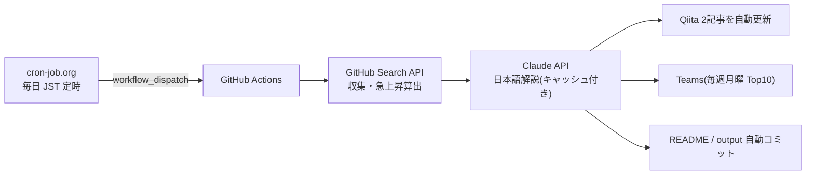

# Claude Code向けMCPツール候補ランキング

GitHub Search APIを使って、Claude Code周辺で活用候補になりそうなMCP関連リポジトリを定期収集するリポジトリです。

> 注意: この一覧は「Claude Codeでの動作」を保証するものではありません。  
> GitHub上のリポジトリ名・説明文・READMEなどに含まれる情報をもとに、MCP関連ツール候補を探すための入口として利用します。

## 仕組み(定常自律運転)

このランキングは cron-job.org → GitHub Actions → Claude API → Qiita / Teams のパイプラインで、毎日無人更新されています。


```mermaid
flowchart LR
    A["cron-job.org<br>毎日 JST 定時"] -->|workflow_dispatch| B["GitHub Actions"]
    B --> C["GitHub Search API<br>収集・急上昇算出"]
    C --> D["Claude API<br>日本語解説(キャッシュ付き)"]
    D --> E["Qiita 2記事を自動更新"]
    D --> F["Teams(毎週月曜 Top10)"]
    D --> G["README / output 自動コミット"]
```

- 仕組みの詳細と**ライブ稼働ステータス**: [定常自律運転ページ](https://takanobusano.github.io/mcp-github-ranking/)
- 作り方の解説記事: [パイプライン編](https://qiita.com/4q_sano/items/913e93ee5cc2731561fc) / [cron-job.org 完全自動化編](https://qiita.com/4q_sano/items/1bc5e0669a8f0166936c)
<!-- MCP_REPOS_START -->
最終更新: **2026-08-27 08:17:18 JST**

MCP関連リポジトリに加え、Claude Code周辺で活用候補になりそうな関連ツールをGitHub Search APIで毎日自動収集してランキング化しています。

Stars / Forks の差分は、UTC基準の前日データ（2026-08-25）との差分です。
CSVには最大500件を保存し、本文では上位100件を表示しています。

> 注意: この一覧はClaude Codeでの動作を保証するものではありません。  
> MCP関連ツールまたはClaude Code関連ツール候補を探すための入口として利用してください。

# 注目MCP・関連ツール候補ランキング

## 1位 [public-apis/public-apis](https://github.com/public-apis/public-apis)

A collective list of free APIs

⭐ **471,031 Stars**（+583）　🍴 **51,943 Forks**（+71）　/　🟢 **1,779 Open Issues**　/　Python

Topics: `api` / `apis` / `dataset` / `development` / `free` / `list` / `lists` / `open-source`

## 2位 [obra/superpowers](https://github.com/obra/superpowers)

An agentic skills framework & software development methodology that works.

⭐ **278,087 Stars**（+534）　🍴 **24,884 Forks**（+59）　/　🟢 **319 Open Issues**　/　Shell

Topics: `ai` / `brainstorming` / `coding` / `obra` / `sdlc` / `skills` / `subagent-driven-development` / `superpowers`

## 3位 [affaan-m/ECC](https://github.com/affaan-m/ECC)

The agent harness performance optimization system. Skills, instincts, memory, security, and research-first development for Claude Code, Codex, Opencode, Cursor and beyond.

⭐ **243,508 Stars**（+313）　🍴 **36,829 Forks**（+39）　/　🟢 **184 Open Issues**　/　JavaScript

Topics: `ai-agents` / `anthropic` / `claude` / `claude-code` / `developer-tools` / `llm` / `mcp` / `productivity`

## 4位 [mattpocock/skills](https://github.com/mattpocock/skills)

Skills for Real Engineers. Straight from my .agents directory.

⭐ **237,909 Stars**（+1,233）　🍴 **20,243 Forks**（+99）　/　🟢 **415 Open Issues**　/　Shell

Topics: `topicなし`

## 5位 [NousResearch/hermes-agent](https://github.com/NousResearch/hermes-agent)

The agent that grows with you

⭐ **236,884 Stars**（+487）　🍴 **47,906 Forks**（+175）　/　🟢 **36,225 Open Issues**　/　Python

Topics: `ai` / `ai-agent` / `ai-agents` / `anthropic` / `chatgpt` / `claude` / `claude-code` / `codex`

## 6位 [multica-ai/andrej-karpathy-skills](https://github.com/multica-ai/andrej-karpathy-skills)

A single CLAUDE.md file to improve Claude Code behavior, derived from Andrej Karpathy's observations on LLM coding pitfalls.

⭐ **207,693 Stars**（+526）　🍴 **21,170 Forks**（+30）　/　🟢 **129 Open Issues**　/　不明

Topics: `topicなし`

## 7位 [ultraworkers/claw-code](https://github.com/ultraworkers/claw-code)

An agent-managed museum exhibit, built in Rust with Gajae-Code / LazyCodex — developed and maintained with no human intervention.

⭐ **195,117 Stars**（+4）　🍴 **108,901 Forks**（-19）　/　🟢 **44 Open Issues**　/　Rust

Topics: `topicなし`

## 8位 [ollama/ollama](https://github.com/ollama/ollama)

Get up and running with Kimi-K2.6, GLM-5.2, MiniMax, DeepSeek, gpt-oss, Qwen, Gemma and other models.

⭐ **179,521 Stars**（+94）　🍴 **17,574 Forks**（+14）　/　🟢 **3,798 Open Issues**　/　Go

Topics: `deepseek` / `gemma` / `gemma3` / `glm` / `go` / `golang` / `gpt-oss` / `llama`

## 9位 [firecrawl/firecrawl](https://github.com/firecrawl/firecrawl)

The context API to search, scrape, and interact with the web at scale. 🔥

⭐ **172,795 Stars**（+468）　🍴 **9,538 Forks**（+16）　/　🟢 **554 Open Issues**　/　TypeScript

Topics: `ai` / `ai-agents` / `ai-crawler` / `ai-scraping` / `ai-search` / `crawler` / `data-extraction` / `html-to-markdown`

## 10位 [anthropics/skills](https://github.com/anthropics/skills)

Public repository for Agent Skills

⭐ **171,822 Stars**（+248）　🍴 **20,424 Forks**（+42）　/　🟢 **1,178 Open Issues**　/　Python

Topics: `agent-skills`

## 11位 [langflow-ai/langflow](https://github.com/langflow-ai/langflow)

Langflow is a powerful tool for building and deploying AI-powered agents and workflows.

⭐ **153,718 Stars**（+38）　🍴 **9,938 Forks**（+6）　/　🟢 **979 Open Issues**　/　Python

Topics: `agents` / `chatgpt` / `generative-ai` / `large-language-models` / `multiagent` / `react-flow`

## 12位 [msitarzewski/agency-agents](https://github.com/msitarzewski/agency-agents)

A complete AI agency at your fingertips - From frontend wizards to Reddit community ninjas, from whimsy injectors to reality checkers. Each agent is a specialized expert with personality, processes, and proven deliverables.

⭐ **148,218 Stars**（+205）　🍴 **23,921 Forks**（+32）　/　🟢 **146 Open Issues**　/　Shell

Topics: `topicなし`

## 13位 [x1xhlol/system-prompts-and-models-of-ai-tools](https://github.com/x1xhlol/system-prompts-and-models-of-ai-tools)

FULL Augment Code, Claude Code, Cluely, CodeBuddy, Comet, Cursor, Devin AI, Junie, Kiro, Leap.new, Lovable, Manus, NotionAI, Orchids.app, Perplexity, Poke, Qoder, Replit, Same.dev, Trae, Traycer AI, VSCode Agent, Warp.dev, Windsurf, Xcode, Z.ai Code, Dia & v0. (And other Open Sourced) System Prompts, Internal Tools & AI Models

⭐ **143,155 Stars**（+36）　🍴 **34,849 Forks**（+9）　/　🟢 **161 Open Issues**　/　不明

Topics: `ai` / `bolt` / `cluely` / `copilot` / `cursor` / `cursorai` / `devin` / `github-copilot`

## 14位 [anthropics/claude-code](https://github.com/anthropics/claude-code)

Claude Code is an agentic coding tool that lives in your terminal, understands your codebase, and helps you code faster by executing routine tasks, explaining complex code, and handling git workflows - all through natural language commands.

⭐ **143,089 Stars**（+92）　🍴 **22,893 Forks**（+13）　/　🟢 **15,032 Open Issues**　/　Python

Topics: `topicなし`

## 15位 [garrytan/gstack](https://github.com/garrytan/gstack)

Use Garry Tan's exact Claude Code setup: 23 opinionated tools that serve as CEO, Designer, Eng Manager, Release Manager, Doc Engineer, and QA

⭐ **129,862 Stars**（+206）　🍴 **19,545 Forks**（+26）　/　🟢 **801 Open Issues**　/　TypeScript

Topics: `topicなし`

## 16位 [farion1231/cc-switch](https://github.com/farion1231/cc-switch)

A cross-platform desktop All-in-One assistant for Claude Code, Codex, OpenCode, OpenClaw, Grok Build & Hermes Agent. Only official website: ccswitch.io

⭐ **129,568 Stars**（+202）　🍴 **8,884 Forks**（+12）　/　🟢 **2,446 Open Issues**　/　Rust

Topics: `ai-tools` / `claude-code` / `codex` / `desktop-app` / `grok` / `grokbuild` / `hermes` / `hermes-agent`

## 17位 [nextlevelbuilder/ui-ux-pro-max-skill](https://github.com/nextlevelbuilder/ui-ux-pro-max-skill)

An AI skill that provides design intelligence for building professional UI/UX across multiple platforms.

⭐ **121,351 Stars**（+440）　🍴 **13,024 Forks**（+47）　/　🟢 **91 Open Issues**　/　Python

Topics: `ai-skills` / `antigravity` / `claude` / `claude-code` / `codex` / `command-line` / `copilot` / `cursor-ai`

## 18位 [harry0703/MoneyPrinterTurbo](https://github.com/harry0703/MoneyPrinterTurbo)

利用 AI 大模型和自动化工作流，根据主题或关键词一键生成高清短视频。Generate HD short videos from a topic or keyword with an automated AI workflow.

⭐ **116,900 Stars**（+459）　🍴 **17,785 Forks**（+75）　/　🟢 **12 Open Issues**　/　Python

Topics: `ai-video-generator` / `content-creation` / `ffmpeg` / `instagram-reels` / `llm` / `python` / `short-video` / `subtitles`

## 19位 [DietrichGebert/ponytail](https://github.com/DietrichGebert/ponytail)

Makes your AI agent think like the laziest senior dev in the room. The best code is the code you never wrote.

⭐ **112,509 Stars**（+1,564）　🍴 **6,162 Forks**（+65）　/　🟢 **174 Open Issues**　/　JavaScript

Topics: `agent-skills` / `ai-agents` / `claude` / `claude-code` / `claude-code-plugin` / `cursor-rules` / `developer-tools` / `llm`

## 20位 [Graphify-Labs/graphify](https://github.com/Graphify-Labs/graphify)

Turn any codebase, with its docs, SQL schemas, configs, and PDFs, into a queryable knowledge graph. A /graphify skill for Claude Code, Cursor, Codex, and Gemini CLI: local deterministic AST parsing, every edge explained, no vector store.

⭐ **111,065 Stars**（+585）　🍴 **10,798 Forks**（+41）　/　🟢 **1,134 Open Issues**　/　Python

Topics: `ai-agents` / `antigravity` / `ast` / `claude-code` / `code-analysis` / `code-search` / `codex` / `cursor`

## 21位 [browser-use/browser-use](https://github.com/browser-use/browser-use)

🌐 Make websites accessible for AI agents. Automate tasks online with ease.

⭐ **110,946 Stars**（+433）　🍴 **12,184 Forks**（+24）　/　🟢 **383 Open Issues**　/　Python

Topics: `ai-agents` / `ai-tools` / `browser-automation` / `browser-use` / `llm` / `playwright` / `python`

## 22位 [google-gemini/gemini-cli](https://github.com/google-gemini/gemini-cli)

An open-source AI agent that brings the power of Gemini directly into your terminal.

⭐ **106,695 Stars**（+13）　🍴 **14,491 Forks**（+7）　/　🟢 **869 Open Issues**　/　TypeScript

Topics: `ai` / `ai-agents` / `cli` / `gemini` / `gemini-api` / `mcp-client` / `mcp-server`

## 23位 [JuliusBrussee/caveman](https://github.com/JuliusBrussee/caveman)

🪨 why use many token when few token do trick — Claude Code skill that cuts 65% of tokens by talking like caveman

⭐ **101,185 Stars**（+243）　🍴 **5,871 Forks**（+11）　/　🟢 **375 Open Issues**　/　Go

Topics: `ai` / `anthropic` / `caveman` / `claude` / `claude-code` / `llm` / `meme` / `prompt-engineering`

## 24位 [TauricResearch/TradingAgents](https://github.com/TauricResearch/TradingAgents)

TradingAgents: Multi-Agents LLM Financial Trading Framework

⭐ **100,737 Stars**（+538）　🍴 **19,413 Forks**（+64）　/　🟢 **381 Open Issues**　/　Python

Topics: `agent` / `finance` / `llm` / `multiagent` / `trading`

## 25位 [puppeteer/puppeteer](https://github.com/puppeteer/puppeteer)

JavaScript API for Chrome and Firefox

⭐ **95,497 Stars**（+1）　🍴 **9,567 Forks**（-3）　/　🟢 **264 Open Issues**　/　TypeScript

Topics: `automation` / `chrome` / `chromium` / `developer-tools` / `firefox` / `headless-chrome` / `node-module` / `testing`

## 26位 [microsoft/playwright](https://github.com/microsoft/playwright)

Playwright is a framework for Web Testing and Automation. It allows testing Chromium, Firefox and WebKit with a single API.

⭐ **95,181 Stars**（+58）　🍴 **6,345 Forks**（+4）　/　🟢 **178 Open Issues**　/　TypeScript

Topics: `automation` / `chrome` / `chromium` / `e2e-testing` / `electron` / `end-to-end-testing` / `firefox` / `javascript`

## 27位 [thedotmack/claude-mem](https://github.com/thedotmack/claude-mem)

Persistent Context Across Sessions for Every Agent –  Captures everything your agent does during sessions, compresses it with AI, and injects relevant context back into future sessions. Works with Claude Code, OpenClaw, Codex, Gemini, Hermes, Copilot, OpenCode + More

⭐ **91,950 Stars**（+115）　🍴 **8,085 Forks**（+21）　/　🟢 **288 Open Issues**　/　JavaScript

Topics: `ai` / `ai-agents` / `ai-memory` / `anthropic` / `artificial-intelligence` / `chromadb` / `claude` / `claude-agent-sdk`

## 28位 [nexu-io/open-design](https://github.com/nexu-io/open-design)

🎨 Best DeepSeek Harness Design Plugin. The open-source Claude Design alternative. 🖥️ Local-first desktop app. 🖼️ Your coding agent becomes the design engine: pr...

⭐ **91,782 Stars**（+312）　🍴 **10,563 Forks**（+30）　/　🟢 **876 Open Issues**　/　TypeScript

Topics: `agent-skills` / `ai-design` / `byok` / `claude-code-for-design` / `claude-design` / `codex-design` / `coding-agents` / `cursor-design`

## 29位 [addyosmani/agent-skills](https://github.com/addyosmani/agent-skills)

Production-grade engineering skills for AI coding agents.

⭐ **90,029 Stars**（+277）　🍴 **9,630 Forks**（+20）　/　🟢 **120 Open Issues**　/　JavaScript

Topics: `agent-skills` / `antigravity` / `claude-code` / `codex` / `cursor` / `skills`

## 30位 [modelcontextprotocol/servers](https://github.com/modelcontextprotocol/servers)

Model Context Protocol Servers

⭐ **89,890 Stars**（+29）　🍴 **11,512 Forks**（+2）　/　🟢 **549 Open Issues**　/　TypeScript

Topics: `topicなし`

## 31位 [ChatGPTNextWeb/NextChat](https://github.com/ChatGPTNextWeb/NextChat)

✨ Light and Fast AI Assistant. Support: Web \| iOS \| MacOS \| Android \|  Linux \| Windows

⭐ **88,649 Stars**（-3）　🍴 **59,200 Forks**（-1）　/　🟢 **852 Open Issues**　/　TypeScript

Topics: `calclaude` / `chatgpt` / `claude` / `cross-platform` / `desktop` / `fe` / `gemini` / `gemini-pro`

## 32位 [OpenCut-app/OpenCut](https://github.com/OpenCut-app/OpenCut)

The open-source CapCut alternative

⭐ **86,937 Stars**（+892）　🍴 **8,585 Forks**（+97）　/　🟢 **371 Open Issues**　/　TypeScript

Topics: `editor` / `oss` / `videoeditor`

## 33位 [OpenHands/OpenHands](https://github.com/OpenHands/OpenHands)

🙌 OpenHands: AI-Driven Development

⭐ **85,196 Stars**（+101）　🍴 **11,137 Forks**（+15）　/　🟢 **570 Open Issues**　/　TypeScript

Topics: `agent` / `artificial-intelligence` / `chatgpt` / `claude-ai` / `cli` / `developer-tools` / `gpt` / `llm`

## 34位 [laravel/laravel](https://github.com/laravel/laravel)

Laravel is a web application framework with expressive, elegant syntax. We’ve already laid the foundation for your next big idea — freeing you to create without sweating the small things.

⭐ **84,878 Stars**（+10）　🍴 **24,890 Forks**（+2）　/　🟢 **31 Open Issues**　/　Blade

Topics: `framework` / `laravel` / `php`

## 35位 [koala73/worldmonitor](https://github.com/koala73/worldmonitor)

Real-time global intelligence dashboard. AI-powered news aggregation, geopolitical monitoring, and infrastructure tracking in a unified situational awareness interface

⭐ **84,338 Stars**（+199）　🍴 **12,658 Forks**（+51）　/　🟢 **390 Open Issues**　/　TypeScript

Topics: `agent` / `ai` / `dashboard` / `geopolitics` / `mcp` / `mcp-server` / `monitoring` / `news`

## 36位 [lobehub/lobehub](https://github.com/lobehub/lobehub)

🤯 LobeHub is your Chief Agent Operator, organizing your agents into 7×24 operations by hiring, scheduling, and reporting on your entire AI team.

⭐ **82,022 Stars**（+33）　🍴 **15,836 Forks**（+2）　/　🟢 **818 Open Issues**　/　TypeScript

Topics: `agent` / `agent-collaboration` / `agent-harness` / `ai` / `cao` / `chatgpt` / `chief-agent-operator` / `claude`

## 37位 [Leonxlnx/taste-skill](https://github.com/Leonxlnx/taste-skill)

Taste-Skill - gives your AI good taste. stops the AI from generating boring, generic slop

⭐ **81,016 Stars**（+482）　🍴 **5,553 Forks**（+34）　/　🟢 **58 Open Issues**　/　JavaScript

Topics: `agent` / `ai` / `claude` / `claude-code` / `codex` / `coding` / `design` / `frontend`

## 38位 [bytedance/deer-flow](https://github.com/bytedance/deer-flow)

An open-source long-horizon SuperAgent harness that researches, codes, and creates. With the help of sandboxes, memories, tools, skill, subagents and message gateway, it handles different levels of tasks that could take minutes to hours.

⭐ **80,956 Stars**（+82）　🍴 **11,142 Forks**（+12）　/　🟢 **912 Open Issues**　/　Python

Topics: `agent` / `agentic` / `agentic-framework` / `agentic-workflow` / `ai` / `ai-agents` / `deep-research` / `harness`

## 39位 [Egonex-AI/Understand-Anything](https://github.com/Egonex-AI/Understand-Anything)

Graphs that teach > graphs that impress. Turn any code into an interactive knowledge graph you can explore, search, and ask questions about. Works with Claude Code, Codex, Cursor, Copilot, Gemini CLI, and more.

⭐ **80,609 Stars**（+126）　🍴 **6,780 Forks**（+9）　/　🟢 **290 Open Issues**　/　TypeScript

Topics: `antigravity-skills` / `business-knowledge` / `claude-code` / `claude-skills` / `codebase-analysis` / `codex` / `codex-skills` / `developer-tools-ai-agent`

## 40位 [unclecode/crawl4ai](https://github.com/unclecode/crawl4ai)

🚀🤖 Crawl4AI: Open-source LLM Friendly Web Crawler & Scraper. Don't be shy, join here:

⭐ **79,468 Stars**（+59）　🍴 **8,233 Forks**（+4）　/　🟢 **164 Open Issues**　/　Python

Topics: `topicなし`

## 41位 [paperclipai/paperclip](https://github.com/paperclipai/paperclip)

The open-source app everyone uses to manage agents at work

⭐ **79,437 Stars**（+66）　🍴 **14,572 Forks**（+12）　/　🟢 **5,377 Open Issues**　/　TypeScript

Topics: `topicなし`

## 42位 [opendatalab/MinerU](https://github.com/opendatalab/MinerU)

Transforms complex documents like PDFs and Office docs into LLM-ready markdown/JSON for your Agentic workflows.

⭐ **78,554 Stars**（+83）　🍴 **6,604 Forks**（+5）　/　🟢 **102 Open Issues**　/　Python

Topics: `ai4science` / `document-analysis` / `docx` / `extract-data` / `layout-analysis` / `ocr` / `parser` / `pdf`

## 43位 [rtk-ai/rtk](https://github.com/rtk-ai/rtk)

CLI proxy that reduces LLM token consumption by 60-90% on common dev commands. Single Rust binary, zero dependencies

⭐ **77,528 Stars**（+131）　🍴 **4,875 Forks**（+6）　/　🟢 **2,061 Open Issues**　/　Rust

Topics: `agentic-coding` / `ai-coding` / `anthropic` / `claude-code` / `cli` / `command-line-tool` / `cost-reduction` / `developer-tools`

## 44位 [D4Vinci/Scrapling](https://github.com/D4Vinci/Scrapling)

🕷️ An adaptive Web Scraping framework that handles everything from a single request to a full-scale crawl!

⭐ **76,653 Stars**（+166）　🍴 **7,663 Forks**（+13）　/　🟢 **0 Open Issues**　/　Python

Topics: `ai` / `ai-scraping` / `automation` / `crawler` / `crawling` / `crawling-python` / `data` / `data-extraction`

## 45位 [Panniantong/Agent-Reach](https://github.com/Panniantong/Agent-Reach)

Give your AI agent eyes to see the entire internet. Read & search Twitter, Reddit, YouTube, GitHub, Bilibili, XiaoHongShu — one CLI, zero API fees.

⭐ **75,623 Stars**（+354）　🍴 **6,461 Forks**（+41）　/　🟢 **100 Open Issues**　/　Python

Topics: `agent-infrastructure` / `ai-agent` / `ai-search` / `automation` / `bilibili` / `claude-code` / `cli` / `cursor`

## 46位 [shareAI-lab/learn-claude-code](https://github.com/shareAI-lab/learn-claude-code)

Bash is all you need -  A nano claude code–like 「agent harness」, built from 0 to 1

⭐ **75,377 Stars**（+87）　🍴 **12,165 Forks**（+15）　/　🟢 **27 Open Issues**　/　Python

Topics: `agent` / `agent-development` / `ai-agent` / `claude` / `claude-code` / `educational` / `llm` / `python`

## 47位 [unslothai/unsloth](https://github.com/unslothai/unsloth)

Local UI to run and train LLMs and diffusion models, including Qwen3.8, Kimi K3, MiniMax-H3, Gemma 4, DeepSeek-V4, FLUX and more.

⭐ **74,876 Stars**（+150）　🍴 **6,779 Forks**（+15）　/　🟢 **1,401 Open Issues**　/　Python

Topics: `agent` / `ai` / `chatgpt` / `deepseek` / `fine-tuning` / `gemma` / `image-generation` / `llama`

## 48位 [abi/screenshot-to-code](https://github.com/abi/screenshot-to-code)

Drop in a screenshot and convert it to clean code (HTML/Tailwind/React/Vue)

⭐ **74,659 Stars**（+166）　🍴 **9,144 Forks**（+15）　/　🟢 **130 Open Issues**　/　Python

Topics: `topicなし`

## 49位 [Eugeny/tabby](https://github.com/Eugeny/tabby)

A terminal for a more modern age

⭐ **74,161 Stars**（+29）　🍴 **4,223 Forks**（+2）　/　🟢 **2,867 Open Issues**　/　TypeScript

Topics: `serial` / `ssh-client` / `telnet-client` / `terminal` / `terminal-emulators`

## 50位 [thedaviddias/Front-End-Checklist](https://github.com/thedaviddias/Front-End-Checklist)

🗂 The essential checklist for modern web development, for humans and AI agents

⭐ **73,885 Stars**（+37）　🍴 **6,710 Forks**（+3）　/　🟢 **7 Open Issues**　/　MDX

Topics: `ai-agent` / `ai-agents` / `checklist` / `css` / `front-end-developer-tool` / `front-end-development` / `frontend` / `guidelines`

## 51位 [OpenBB-finance/OpenBB](https://github.com/OpenBB-finance/OpenBB)

Open Data Platform for analysts, quants and AI agents.

⭐ **72,336 Stars**（+52）　🍴 **7,459 Forks**（+10）　/　🟢 **110 Open Issues**　/　Python

Topics: `ai` / `crypto` / `derivatives` / `economics` / `equity` / `finance` / `fixed-income` / `machine-learning`

## 52位 [daytonaio/daytona](https://github.com/daytonaio/daytona)

Daytona is a Secure and Elastic Infrastructure for Running AI-Generated Code

⭐ **71,868 Stars**（-4）　🍴 **5,646 Forks**（+3）　/　🟢 **447 Open Issues**　/　不明

Topics: `agentic-workflow` / `ai` / `ai-agents` / `ai-runtime` / `ai-sandboxes` / `code-execution` / `code-interpreter` / `developer-tools`

## 53位 [ruvnet/ruflo](https://github.com/ruvnet/ruflo)

🌊 The original agent meta-harness. Deploy intelligent multi-player swarms, coordinate autonomous workflows, and build conversational AI systems. Features adapti...

⭐ **69,485 Stars**（+83）　🍴 **8,306 Forks**（+5）　/　🟢 **848 Open Issues**　/　TypeScript

Topics: `agentic-ai` / `agentic-framework` / `agentic-workflow` / `agents` / `ai-agents` / `ai-assistant` / `ai-skills` / `autonomous-agents`

## 54位 [code-yeongyu/oh-my-openagent](https://github.com/code-yeongyu/oh-my-openagent)

omo/lazycodex: The coding agent for tokenmaxxers;the one and only agent harness for complex codebases. For your Codex, for your OpenCode

⭐ **68,402 Stars**（+38）　🍴 **5,597 Forks**（+2）　/　🟢 **984 Open Issues**　/　TypeScript

Topics: `ai` / `ai-agents` / `anthropic` / `chatgpt` / `claude` / `claude-skills` / `codex` / `cursor`

## 55位 [colbymchenry/codegraph](https://github.com/colbymchenry/codegraph)

Pre-indexed code knowledge graph, auto syncs on code changes, for Claude Code, Codex, Gemini, Cursor, OpenCode, AntiGravity, Kiro, and Hermes Agent — fewer tokens, fewer tool calls, 100% local

⭐ **68,250 Stars**（+163）　🍴 **4,342 Forks**（+6）　/　🟢 **436 Open Issues**　/　C

Topics: `topicなし`

## 56位 [openinterpreter/openinterpreter](https://github.com/openinterpreter/openinterpreter)

A coding agent for open models like Kimi K3

⭐ **68,160 Stars**（+12）　🍴 **5,866 Forks**（+3）　/　🟢 **6 Open Issues**　/　Rust

Topics: `acp` / `coding-agent` / `deepseek` / `kimi` / `qwen` / `rust`

## 57位 [headroomlabs-ai/headroom](https://github.com/headroomlabs-ai/headroom)

Compress tool outputs, logs, files, and RAG chunks before they reach the LLM. 20% fewer tokens for coding agents, 60-95% fewer tokens for JSON, same answers. Library, proxy, MCP server.

⭐ **67,702 Stars**（+125）　🍴 **5,227 Forks**（+20）　/　🟢 **548 Open Issues**　/　Python

Topics: `agent` / `ai` / `anthropic` / `claude-code` / `compression` / `context-engineering` / `context-window` / `cursor`

## 58位 [cline/cline](https://github.com/cline/cline)

Autonomous coding agent as an SDK, IDE extension, or CLI assistant.

⭐ **66,915 Stars**（+76）　🍴 **7,230 Forks**（+13）　/　🟢 **1,115 Open Issues**　/　TypeScript

Topics: `topicなし`

## 59位 [bradtraversy/design-resources-for-developers](https://github.com/bradtraversy/design-resources-for-developers)

Curated list of design and UI resources from stock photos, web templates, CSS frameworks, UI libraries, tools and much more

⭐ **66,752 Stars**（+5）　🍴 **12,153 Forks**（+3）　/　🟢 **99 Open Issues**　/　不明

Topics: `topicなし`

## 60位 [xtekky/gpt4free](https://github.com/xtekky/gpt4free)

The official gpt4free repository \| various collection of powerful language models \| opus 4.6 gpt 5.3 kimi 2.5 deepseek v3.2 gemini 3

⭐ **66,605 Stars**（-1）　🍴 **13,514 Forks**（+1）　/　🟢 **1 Open Issues**　/　Python

Topics: `chatbot` / `chatbots` / `chatgpt` / `chatgpt-4` / `chatgpt-api` / `chatgpt-free` / `chatgpt4` / `deepseek`

## 61位 [Fission-AI/OpenSpec](https://github.com/Fission-AI/OpenSpec)

Spec-driven development (SDD) for AI coding assistants.

⭐ **66,351 Stars**（+118）　🍴 **4,568 Forks**（+12）　/　🟢 **190 Open Issues**　/　TypeScript

Topics: `ai` / `context-engineering` / `engineering` / `planning` / `prd` / `sdd` / `sdlc` / `spec`

## 62位 [docling-project/docling](https://github.com/docling-project/docling)

Get your documents ready for gen AI

⭐ **65,602 Stars**（+44）　🍴 **4,697 Forks**（+4）　/　🟢 **968 Open Issues**　/　Python

Topics: `ai` / `convert` / `document-parser` / `document-parsing` / `documents` / `docx` / `html` / `markdown`

## 63位 [shanraisshan/claude-code-best-practice](https://github.com/shanraisshan/claude-code-best-practice)

from vibe coding to agentic engineering - practice makes claude perfect

⭐ **65,189 Stars**（+170）　🍴 **6,490 Forks**（+23）　/　🟢 **43 Open Issues**　/　HTML

Topics: `agentic-ai` / `agentic-coding` / `agentic-engineering` / `agentic-workflow` / `ai` / `ai-agents` / `anthropic` / `best-practices`

## 64位 [warpdotdev/warp](https://github.com/warpdotdev/warp)

Warp is an agentic development environment, born out of the terminal.

⭐ **64,547 Stars**（+23）　🍴 **5,471 Forks**（+5）　/　🟢 **5,112 Open Issues**　/　Rust

Topics: `bash` / `linux` / `macos` / `rust` / `shell` / `terminal` / `wasm` / `zsh`

## 65位 [mem0ai/mem0](https://github.com/mem0ai/mem0)

Universal memory layer for AI Agents

⭐ **64,115 Stars**（+87）　🍴 **7,504 Forks**（+14）　/　🟢 **693 Open Issues**　/　Python

Topics: `agents` / `ai` / `ai-agents` / `application` / `chatbots` / `chatgpt` / `genai` / `llm`

## 66位 [NanmiCoder/MediaCrawler](https://github.com/NanmiCoder/MediaCrawler)

小红书笔记 \| 评论爬虫、抖音视频 \| 评论爬虫、快手视频 \| 评论爬虫、B 站视频 ｜ 评论爬虫、微博帖子 ｜ 评论爬虫、百度贴吧帖子 ｜ 百度贴吧评论回复爬虫  \| 知乎问答文章｜评论爬虫

⭐ **63,823 Stars**（+76）　🍴 **12,418 Forks**（+10）　/　🟢 **191 Open Issues**　/　Python

Topics: `topicなし`

## 67位 [asgeirtj/system_prompts_leaks](https://github.com/asgeirtj/system_prompts_leaks)

Extracted system prompts from Anthropic - Claude Fable 5, Opus 5, Claude Design, Claude Code. OpenAI - ChatGPT GPT-5.6-Sol, Codex. Google - Gemini 3.5 Flash, 3.1 Pro, Antigravity. xAI - Grok, Cursor, Copilot, VS Code, Perplexity, and more. Updated regularly.

⭐ **63,620 Stars**（+60）　🍴 **10,419 Forks**（+8）　/　🟢 **49 Open Issues**　/　JavaScript

Topics: `ai` / `ai-agents` / `ai-prompts` / `anthropic` / `chatbot` / `chatgpt` / `claude` / `claude-code`

## 68位 [pbakaus/impeccable](https://github.com/pbakaus/impeccable)

The design language that makes your AI harness better at design.

⭐ **62,934 Stars**（+361）　🍴 **3,847 Forks**（+19）　/　🟢 **58 Open Issues**　/　JavaScript

Topics: `topicなし`

## 69位 [sansan0/TrendRadar](https://github.com/sansan0/TrendRadar)

⭐AI-driven public opinion & trend monitor with multi-platform aggregation, RSS, and smart alerts.🎯 告别信息过载，你的 AI 舆情监控助手与热点筛选工具！聚合多平台热点 +  RSS 订阅，支持关键词精准筛选。AI 智能筛...

⭐ **61,855 Stars**（+27）　🍴 **24,873 Forks**（-4）　/　🟢 **61 Open Issues**　/　Python

Topics: `ai` / `bark` / `data-analysis` / `docker` / `hot-news` / `llm` / `mail` / `mcp`

## 70位 [upstash/context7](https://github.com/upstash/context7)

Context7 Platform -- Up-to-date code documentation for LLMs and AI code editors

⭐ **61,264 Stars**（+52）　🍴 **2,953 Forks**（+7）　/　🟢 **56 Open Issues**　/　TypeScript

Topics: `llm` / `mcp` / `mcp-server` / `vibe-coding`

## 71位 [tw93/Pake](https://github.com/tw93/Pake)

🤱🏻 Turn any webpage into a desktop app with one command.

⭐ **61,087 Stars**（+4）　🍴 **12,549 Forks**（+15）　/　🟢 **4 Open Issues**　/　Rust

Topics: `chatgpt` / `claude` / `desktop` / `gemini` / `hight-performance` / `linux` / `macos` / `no-electron`

## 72位 [coollabsio/coolify](https://github.com/coollabsio/coolify)

An open-source, self-hostable PaaS alternative to Vercel, Heroku & Netlify that lets you easily deploy static sites, databases, full-stack applications and 280+ one-click services on your own servers.

⭐ **61,083 Stars**（+49）　🍴 **5,358 Forks**（+10）　/　🟢 **641 Open Issues**　/　PHP

Topics: `coolify` / `databases` / `deployment` / `docker` / `docker-compose` / `inertiajs` / `laravel` / `mariadb`

## 73位 [1c7/chinese-independent-developer](https://github.com/1c7/chinese-independent-developer)

👩🏿‍💻👨🏾‍💻👩🏼‍💻👨🏽‍💻👩🏻‍💻中国独立开发者项目列表 -- 分享大家都在做什么

⭐ **61,020 Stars**（+38）　🍴 **5,323 Forks**（+6）　/　🟢 **1 Open Issues**　/　Python

Topics: `china` / `indie` / `indie-developer`

## 74位 [microsoft/autogen](https://github.com/microsoft/autogen)

A programming framework for agentic AI

⭐ **60,642 Stars**（+15）　🍴 **9,154 Forks**（+4）　/　🟢 **1,004 Open Issues**　/　Python

Topics: `agentic` / `agentic-agi` / `agents` / `ai` / `autogen` / `autogen-ecosystem` / `chatgpt` / `framework`

## 75位 [mvanhorn/last30days-skill](https://github.com/mvanhorn/last30days-skill)

AI agent skill that researches any topic across Reddit, X, YouTube, HN, Polymarket, and the web - then synthesizes a grounded summary

⭐ **59,340 Stars**（+83）　🍴 **5,189 Forks**（+5）　/　🟢 **164 Open Issues**　/　Python

Topics: `ai-prompts` / `ai-skill` / `bluesky` / `claude` / `claude-code` / `clawhub` / `deep-research` / `hackernews`

## 76位 [penpot/penpot](https://github.com/penpot/penpot)

Penpot: The open-source design platform for Product teams that need scalable collaboration.

⭐ **59,218 Stars**（+36）　🍴 **4,003 Forks**（+6）　/　🟢 **772 Open Issues**　/　Clojure

Topics: `clojure` / `clojurescript` / `design` / `prototyping` / `ui` / `ux-design` / `ux-experience`

## 77位 [meilisearch/meilisearch](https://github.com/meilisearch/meilisearch)

A lightning-fast search engine API bringing AI-powered hybrid search to your sites and applications.

⭐ **59,101 Stars**（+10）　🍴 **2,684 Forks**（+2）　/　🟢 **318 Open Issues**　/　Rust

Topics: `ai` / `api` / `app-search` / `database` / `enterprise-search` / `faceting` / `full-text-search` / `fuzzy-search`

## 78位 [MemPalace/mempalace](https://github.com/MemPalace/mempalace)

The best-benchmarked open-source AI memory system. And it's free.

⭐ **58,664 Stars**（+31）　🍴 **7,523 Forks**（+3）　/　🟢 **723 Open Issues**　/　Python

Topics: `ai` / `chromadb` / `llm` / `mcp` / `memory` / `python`

## 79位 [usestrix/strix](https://github.com/usestrix/strix)

Open-source AI penetration testing tool to find and fix your app’s vulnerabilities.

⭐ **58,552 Stars**（+372）　🍴 **6,381 Forks**（+60）　/　🟢 **319 Open Issues**　/　Python

Topics: `agents` / `ai-hacking` / `ai-penetration-testing` / `ai-pentesting` / `ai-security` / `artificial-intelligence` / `bug-bounty` / `code-quality`

## 80位 [FoundationAgents/OpenManus](https://github.com/FoundationAgents/OpenManus)

No fortress, purely open ground.  OpenManus is Coming.

⭐ **58,084 Stars**（+12）　🍴 **10,087 Forks**（+4）　/　🟢 **468 Open Issues**　/　Python

Topics: `topicなし`

## 81位 [crewAIInc/crewAI](https://github.com/crewAIInc/crewAI)

Framework for orchestrating role-playing, autonomous AI agents. By fostering collaborative intelligence, CrewAI empowers agents to work together seamlessly, tackling complex tasks.

⭐ **57,648 Stars**（+38）　🍴 **8,259 Forks**（+13）　/　🟢 **791 Open Issues**　/　Python

Topics: `agents` / `ai` / `ai-agents` / `aiagentframework` / `llms`

## 82位 [zylon-ai/private-gpt](https://github.com/zylon-ai/private-gpt)

Complete API layer for private AI applications on local models: RAG, skills, tools, MCP, text-to-sql, and more. Works with any OpenAI-compatible inference server.

⭐ **57,471 Stars**（+5）　🍴 **7,611 Forks**（+1）　/　🟢 **7 Open Issues**　/　Python

Topics: `ai` / `ai-tools` / `on-premise`

## 83位 [BerriAI/litellm](https://github.com/BerriAI/litellm)

The fastest, litest AI Gateway. Rust core with Python SDK. Call 100+ LLM APIs in OpenAI (or native) format with cost tracking, guardrails, load balancing, and logging [Bedrock, Azure, OpenAI, Anthropic, OpenAI, VertexAI, vLLM, Nvidia NIM]

⭐ **57,337 Stars**（+77）　🍴 **10,916 Forks**（+20）　/　🟢 **4,899 Open Issues**　/　Python

Topics: `ai-gateway` / `anthropic` / `azure-openai` / `bedrock` / `gateway` / `langchain` / `litellm` / `llm`

## 84位 [diegosouzapw/OmniRoute](https://github.com/diegosouzapw/OmniRoute)

Never stop coding. Free MIT AI gateway: one endpoint, 350 providers (90+ free), 1200+ models Kimi, Claude, GPT, Gemini, GLM, DeepSeek, MiniMax. Works with Claude Code, Codex, Cursor, OpenCode, Cline & Copilot. Quota-aware auto-fallback, RTK+Caveman compression saves 15-95% tokens, MCP/A2A, Desktop/PWA. Built by 450+ contributors

⭐ **56,199 Stars**（+1,036）　🍴 **7,727 Forks**（+156）　/　🟢 **116 Open Issues**　/　TypeScript

Topics: `a2a` / `ai-agents` / `ai-gateway` / `anthropic` / `claude` / `claude-code` / `cline` / `codex`

## 85位 [stablyai/orca](https://github.com/stablyai/orca)

Orca is the ADE for working with a fleet of parallel agents. Run any coding agent with your own subscription. Available on desktop, mobile and VPS.

⭐ **54,280 Stars**（+687）　🍴 **3,733 Forks**（+36）　/　🟢 **4,623 Open Issues**　/　TypeScript

Topics: `ade` / `agent-ide` / `ai-agents` / `claude-code` / `cli` / `codex` / `cursor-agent` / `devtools`

## 86位 [aaif-goose/goose](https://github.com/aaif-goose/goose)

an open source, extensible AI agent that goes beyond code suggestions - install, execute, edit, and test with any LLM

⭐ **53,530 Stars**（+68）　🍴 **6,117 Forks**（+16）　/　🟢 **192 Open Issues**　/　Rust

Topics: `acp` / `ai` / `ai-agents` / `mcp`

## 87位 [jamiepine/voicebox](https://github.com/jamiepine/voicebox)

The open-source AI voice studio. Clone, dictate, create.

⭐ **51,545 Stars**（+88）　🍴 **6,429 Forks**（+12）　/　🟢 **660 Open Issues**　/　TypeScript

Topics: `ai` / `cuda` / `mlx` / `qwen3-tts` / `qwen3-tts-ui` / `voice-ai` / `voice-clone` / `whisper`

## 88位 [charlax/professional-programming](https://github.com/charlax/professional-programming)

A collection of learning resources for curious software engineers

⭐ **51,449 Stars**（+3）　🍴 **4,018 Forks**（-1）　/　🟢 **6 Open Issues**　/　Python

Topics: `architecture` / `computer-science` / `concepts` / `documentation` / `engineer` / `learning` / `lessons-learned` / `professional`

## 89位 [calesthio/OpenMontage](https://github.com/calesthio/OpenMontage)

World's first open-source, agentic video production system. 12 production pipelines, 100+ tools, 700+ agent skill and production-knowledge files. Turn your AI coding assistant into a full video production studio.

⭐ **51,237 Stars**（+966）　🍴 **6,446 Forks**（+108）　/　🟢 **247 Open Issues**　/　Python

Topics: `agent` / `agentic-ai` / `ai` / `claude` / `copilot` / `cursor` / `elevenlabs` / `ffmpeg`

## 90位 [CherryHQ/cherry-studio](https://github.com/CherryHQ/cherry-studio)

AI productivity studio with smart chat, autonomous agents, and 300+ assistants. Unified access to frontier LLMs

⭐ **51,102 Stars**（+41）　🍴 **4,878 Forks**（+9）　/　🟢 **1,452 Open Issues**　/　TypeScript

Topics: `agent-skills` / `ai-agent` / `claude-code` / `codex` / `deepseek` / `deepseek-harness` / `hermes-agent` / `skills`

## 91位 [Alishahryar1/free-claude-code](https://github.com/Alishahryar1/free-claude-code)

Use Claude Code, Codex, Pi, and OpenCode for free (1.3B+ free tokens) from your terminal, app, IDE, or phone like OpenClaw (voice supported + ToS friendly)

⭐ **50,352 Stars**（+581）　🍴 **8,159 Forks**（+66）　/　🟢 **357 Open Issues**　/　Python

Topics: `topicなし`

## 92位 [ChromeDevTools/chrome-devtools-mcp](https://github.com/ChromeDevTools/chrome-devtools-mcp)

Chrome DevTools for coding agents

⭐ **49,757 Stars**（+51）　🍴 **3,486 Forks**（+4）　/　🟢 **95 Open Issues**　/　TypeScript

Topics: `browser` / `chrome` / `chrome-devtools` / `debugging` / `devtools` / `mcp` / `mcp-server` / `puppeteer`

## 93位 [hugohe3/ppt-master](https://github.com/hugohe3/ppt-master)

AI turns documents or topics into real, native PowerPoint decks—with native shapes, transitions and animations, data-backed charts and tables on demand, audio narration from speaker notes, and support for your own .pptx templates. · by Hugo He

⭐ **49,602 Stars**（+289）　🍴 **3,996 Forks**（+22）　/　🟢 **7 Open Issues**　/　Python

Topics: `ai-agent` / `aippt` / `office` / `powerpoint` / `powerpoint-generation` / `ppt` / `pptx` / `presentation`

## 94位 [rohitg00/ai-engineering-from-scratch](https://github.com/rohitg00/ai-engineering-from-scratch)

Learn it. Build it. Ship it for others.

⭐ **49,564 Stars**（+648）　🍴 **8,628 Forks**（+67）　/　🟢 **97 Open Issues**　/　Python

Topics: `agents` / `ai` / `ai-agents` / `ai-engineering` / `computer-vision` / `course` / `deep-learning` / `from-scratch`

## 95位 [router-for-me/CLIProxyAPI](https://github.com/router-for-me/CLIProxyAPI)

Wrap Antigravity, ChatGPT Codex, Claude Code, Grok Build as an OpenAI/Gemini/Claude/Codex compatible API service, allowing you to enjoy the free Gemini 3.1 Pro, GPT 5.6 Series, Grok 4.5, Claude model through API

⭐ **48,886 Stars**（+138）　🍴 **7,516 Forks**（+12）　/　🟢 **470 Open Issues**　/　Go

Topics: `antigravity` / `claude-code` / `cluade` / `codex` / `gemini` / `openai`

## 96位 [mudler/LocalAI](https://github.com/mudler/LocalAI)

LocalAI is the open-source AI engine. Run any model - LLMs, vision, voice, image, video - on any hardware. No GPU required.

⭐ **48,696 Stars**（+19）　🍴 **4,393 Forks**（+5）　/　🟢 **216 Open Issues**　/　Go

Topics: `agents` / `ai` / `api` / `audio-generation` / `decentralized` / `distributed` / `image-generation` / `libp2p`

## 97位 [HKUDS/CLI-Anything](https://github.com/HKUDS/CLI-Anything)

"CLI-Anything: Making ALL Software Agent-Native" -- CLI-Hub:

⭐ **48,305 Stars**（+86）　🍴 **4,489 Forks**（+3）　/　🟢 **83 Open Issues**　/　Python

Topics: `topicなし`

## 98位 [multica-ai/multica](https://github.com/multica-ai/multica)

Make humans and AI agents work as one team — open-source and self-hostable.

⭐ **47,842 Stars**（+173）　🍴 **6,139 Forks**（+19）　/　🟢 **1,327 Open Issues**　/　Go

Topics: `topicなし`

## 99位 [GitHubDaily/GitHubDaily](https://github.com/GitHubDaily/GitHubDaily)

坚持分享 GitHub 上高质量、有趣实用的开源技术教程、开发者工具、编程网站、技术资讯。A list cool, interesting projects of GitHub.

⭐ **47,713 Stars**（+54）　🍴 **4,690 Forks**（+5）　/　🟢 **789 Open Issues**　/　不明

Topics: `ai` / `algorithms-and-data-structures` / `backend` / `developer-tools` / `development` / `frontend` / `github` / `java`

## 100位 [oobabooga/textgen](https://github.com/oobabooga/textgen)

Open-source desktop app for local LLMs. Text, vision, tool-calling, OpenAI/Anthropic-compatible API. 100% private.

⭐ **47,585 Stars**（+8）　🍴 **5,983 Forks**（+3）　/　🟢 **837 Open Issues**　/　Python

Topics: `topicなし`

# 最近プッシュされたMCP・関連ツール候補

スター数ランキングとは別に、最近コードがプッシュされたリポジトリを表示します。古いスター数だけではなく、現在も開発が動いていそうな候補を探すための一覧です。

## プッシュ順 1位 [paperclipai/paperclip](https://github.com/paperclipai/paperclip)

The open-source app everyone uses to manage agents at work

⭐ **79,437 Stars**（+66）　🍴 **14,572 Forks**（+12）　/　TypeScript　/　最終プッシュ: 2026-08-26

Topics: `topicなし`

## プッシュ順 2位 [QwenLM/qwen-code](https://github.com/QwenLM/qwen-code)

An open-source AI coding agent that lives in your terminal.

⭐ **27,405 Stars**（+36）　🍴 **2,947 Forks**（+12）　/　TypeScript　/　最終プッシュ: 2026-08-26

Topics: `agentic` / `ai` / `ai-agent` / `ai-coding` / `cli` / `coding-agent` / `developer-tools` / `llm`

## プッシュ順 3位 [langchain-ai/openwiki](https://github.com/langchain-ai/openwiki)

OpenWiki is a CLI that writes and maintains agent documentation for your codebase.

⭐ **15,708 Stars**（+74）　🍴 **1,142 Forks**（+5）　/　TypeScript　/　最終プッシュ: 2026-08-26

Topics: `topicなし`

## プッシュ順 4位 [elizaOS/eliza](https://github.com/elizaOS/eliza)

Open source agentic operating system

⭐ **19,175 Stars**（+8）　🍴 **5,698 Forks**（+4）　/　TypeScript　/　最終プッシュ: 2026-08-26

Topics: `agent` / `agentic` / `ai` / `autonomous` / `chatbot` / `crypto` / `discord` / `eliza`

## プッシュ順 5位 [PostHog/posthog](https://github.com/PostHog/posthog)

:hedgehog: PostHog is the leading platform for building self-driving products. Our developer tools – AI observability, analytics, session replay, flags, experiments, error tracking, logs, and more – capture all the context agents need to diagnose problems, uncover opportunities, and ship fixes. Steer it all from Slack, web, desktop, or the MCP.

⭐ **39,248 Stars**（+94）　🍴 **3,291 Forks**（+4）　/　Python　/　最終プッシュ: 2026-08-26

Topics: `ab-testing` / `ai-analytics` / `analytics` / `cdp` / `data-warehouse` / `experiments` / `feature-flags` / `javascript`

## プッシュ順 6位 [stablyai/orca](https://github.com/stablyai/orca)

Orca is the ADE for working with a fleet of parallel agents. Run any coding agent with your own subscription. Available on desktop, mobile and VPS.

⭐ **54,280 Stars**（+687）　🍴 **3,733 Forks**（+36）　/　TypeScript　/　最終プッシュ: 2026-08-26

Topics: `ade` / `agent-ide` / `ai-agents` / `claude-code` / `cli` / `codex` / `cursor-agent` / `devtools`

## プッシュ順 7位 [manaflow-ai/cmux](https://github.com/manaflow-ai/cmux)

Open source Ghostty-based macOS terminal with vertical tabs and notifications for AI coding agents. Built for multitasking, organization, and programmability.

⭐ **26,502 Stars**（+37）　🍴 **2,263 Forks**（+6）　/　Swift　/　最終プッシュ: 2026-08-26

Topics: `amp` / `claude-code` / `cli` / `codex` / `coding-agents` / `gemini` / `ghostty` / `macos`

## プッシュ順 8位 [MetaMask/metamask-extension](https://github.com/MetaMask/metamask-extension)

:globe_with_meridians: :electric_plug: The MetaMask browser extension enables browsing Ethereum blockchain enabled websites

⭐ **13,204 Stars**（-1）　🍴 **5,575 Forks**（±0）　/　TypeScript　/　最終プッシュ: 2026-08-26

Topics: `brave` / `chrome` / `dapp` / `dapp-developers` / `edge` / `ethereum` / `extension` / `firefox`

## プッシュ順 9位 [NVIDIA/NemoClaw](https://github.com/NVIDIA/NemoClaw)

Run agents like Hermes, LangChain Deep Agents, and OpenClaw more securely inside NVIDIA OpenShell with managed inference

⭐ **22,287 Stars**（+12）　🍴 **3,052 Forks**（+6）　/　TypeScript　/　最終プッシュ: 2026-08-26

Topics: `ai-agents` / `hermes` / `nvidia` / `openclaw` / `openshell` / `sandboxing` / `typescript`

## プッシュ順 10位 [langchain-ai/deepagents](https://github.com/langchain-ai/deepagents)

The batteries-included agent harness.

⭐ **28,558 Stars**（+90）　🍴 **3,999 Forks**（+15）　/　Python　/　最終プッシュ: 2026-08-26

Topics: `ai` / `deepagents` / `langchain` / `langgraph` / `python` / `typescript`

## プッシュ順 11位 [NousResearch/hermes-agent](https://github.com/NousResearch/hermes-agent)

The agent that grows with you

⭐ **236,884 Stars**（+487）　🍴 **47,906 Forks**（+175）　/　Python　/　最終プッシュ: 2026-08-26

Topics: `ai` / `ai-agent` / `ai-agents` / `anthropic` / `chatgpt` / `claude` / `claude-code` / `codex`

## プッシュ順 12位 [coder/coder](https://github.com/coder/coder)

Secure environments for developers and their agents

⭐ **14,260 Stars**（+12）　🍴 **1,454 Forks**（+2）　/　Go　/　最終プッシュ: 2026-08-26

Topics: `agents` / `dev-tools` / `development-environment` / `go` / `golang` / `ide` / `jetbrains` / `remote-development`

## プッシュ順 13位 [warpdotdev/warp](https://github.com/warpdotdev/warp)

Warp is an agentic development environment, born out of the terminal.

⭐ **64,547 Stars**（+23）　🍴 **5,471 Forks**（+5）　/　Rust　/　最終プッシュ: 2026-08-26

Topics: `bash` / `linux` / `macos` / `rust` / `shell` / `terminal` / `wasm` / `zsh`

## プッシュ順 14位 [sgl-project/sglang](https://github.com/sgl-project/sglang)

SGLang is a high-performance serving framework for large language models and multimodal models.

⭐ **32,503 Stars**（+62）　🍴 **8,237 Forks**（+35）　/　Python　/　最終プッシュ: 2026-08-26

Topics: `attention` / `blackwell` / `cuda` / `deepseek` / `diffusion` / `glm` / `gpt-oss` / `inference`

## プッシュ順 15位 [unslothai/unsloth](https://github.com/unslothai/unsloth)

Local UI to run and train LLMs and diffusion models, including Qwen3.8, Kimi K3, MiniMax-H3, Gemma 4, DeepSeek-V4, FLUX and more.

⭐ **74,876 Stars**（+150）　🍴 **6,779 Forks**（+15）　/　Python　/　最終プッシュ: 2026-08-26

Topics: `agent` / `ai` / `chatgpt` / `deepseek` / `fine-tuning` / `gemma` / `image-generation` / `llama`

## プッシュ順 16位 [danny-avila/LibreChat](https://github.com/danny-avila/LibreChat)

Enhanced ChatGPT Clone: Features Agents, MCP, Skills, DeepSeek, Anthropic, AWS, OpenAI, Responses API, Azure, Groq, o1, GPT-5, Mistral, OpenRouter, Vertex AI, Gemini, Artifacts, AI model switching, message search, Code Interpreter, langchain, DALL-E-3, OpenAPI Actions, Functions, Secure Multi-User Auth, Presets, open-source for self-hosting. Active

⭐ **42,487 Stars**（+37）　🍴 **8,812 Forks**（+7）　/　TypeScript　/　最終プッシュ: 2026-08-26

Topics: `ai` / `anthropic` / `artifacts` / `aws` / `azure` / `chatgpt` / `chatgpt-clone` / `claude`

## プッシュ順 17位 [pydantic/pydantic-ai](https://github.com/pydantic/pydantic-ai)

How Python does AI: agents, realtime voice, image generation, embeddings. Every model, every interface, typed end to end.

⭐ **19,518 Stars**（+26）　🍴 **2,598 Forks**（+9）　/　Python　/　最終プッシュ: 2026-08-26

Topics: `agent-framework` / `genai` / `harness` / `harness-engineering` / `llm` / `pydantic` / `python`

## プッシュ順 18位 [heygen-com/hyperframes](https://github.com/heygen-com/hyperframes)

Write HTML. Render video. Built for agents.

⭐ **42,739 Stars**（+152）　🍴 **4,115 Forks**（+22）　/　TypeScript　/　最終プッシュ: 2026-08-26

Topics: `ai` / `animation` / `ffmpeg` / `framework` / `gsap` / `html` / `mcp` / `puppeteer`

## プッシュ順 19位 [activepieces/activepieces](https://github.com/activepieces/activepieces)

AI Agents & MCPs & AI Workflow Automation • (~400 MCP servers for AI agents) • AI Automation / AI Agent with MCPs • AI Workflows & AI Agents • MCPs for AI Agents

⭐ **24,050 Stars**（+16）　🍴 **4,103 Forks**（+3）　/　TypeScript　/　最終プッシュ: 2026-08-26

Topics: `ai-agent` / `ai-agent-tools` / `ai-agents` / `ai-agents-framework` / `mcp` / `mcp-server` / `mcp-tools` / `mcps`

## プッシュ順 20位 [vercel/ai](https://github.com/vercel/ai)

The AI Toolkit for TypeScript. From the creators of Next.js, the AI SDK is a free open-source library for building AI-powered applications and agents

⭐ **26,432 Stars**（+21）　🍴 **5,025 Forks**（+1）　/　TypeScript　/　最終プッシュ: 2026-08-26

Topics: `anthropic` / `artificial-intelligence` / `gemini` / `generative-ai` / `generative-ui` / `javascript` / `language-model` / `llm`

## プッシュ順 21位 [block/buzz](https://github.com/block/buzz)

A hive mind communication platform

⭐ **30,898 Stars**（+213）　🍴 **3,933 Forks**（+40）　/　Rust　/　最終プッシュ: 2026-08-26

Topics: `topicなし`

## プッシュ順 22位 [googleapis/mcp-toolbox](https://github.com/googleapis/mcp-toolbox)

MCP Toolbox for Databases is an open source MCP server for databases.

⭐ **16,262 Stars**（+6）　🍴 **1,698 Forks**（+2）　/　Go　/　最終プッシュ: 2026-08-26

Topics: `agent` / `agents` / `ai` / `bigquery` / `clickhouse` / `cockroachdb` / `database` / `elasticsearch`

## プッシュ順 23位 [EveryInc/compound-engineering-plugin](https://github.com/EveryInc/compound-engineering-plugin)

Official Compound Engineering plugin for Claude Code, Codex, Cursor, and more

⭐ **24,577 Stars**（+39）　🍴 **2,018 Forks**（+2）　/　TypeScript　/　最終プッシュ: 2026-08-26

Topics: `compound` / `engineering`

## プッシュ順 24位 [datahub-project/datahub](https://github.com/datahub-project/datahub)

The Context Platform for your Data and AI Stack

⭐ **12,586 Stars**（+8）　🍴 **3,675 Forks**（+2）　/　Python　/　最終プッシュ: 2026-08-26

Topics: `agent-platform` / `context-management` / `data-catalog` / `data-discovery` / `data-governance` / `data-observability` / `datahub` / `metadata`

## プッシュ順 25位 [Kilo-Org/kilocode](https://github.com/Kilo-Org/kilocode)

Kilo is the all-in-one agentic engineering platform. Build, ship, and iterate faster with the most popular open source coding agent.

⭐ **27,032 Stars**（+14）　🍴 **3,092 Forks**（+5）　/　TypeScript　/　最終プッシュ: 2026-08-26

Topics: `ai` / `ai-age` / `ai-coding` / `ai-developer-tools` / `chatgpt` / `claude` / `cli` / `gemini`

## プッシュ順 26位 [mastra-ai/mastra](https://github.com/mastra-ai/mastra)

Mastra is the modern TypeScript framework for AI-powered applications and agents.

⭐ **27,494 Stars**（+28）　🍴 **2,697 Forks**（+6）　/　TypeScript　/　最終プッシュ: 2026-08-26

Topics: `agents` / `ai` / `chatbots` / `evals` / `javascript` / `llm` / `mcp` / `nextjs`

## プッシュ順 27位 [cline/cline](https://github.com/cline/cline)

Autonomous coding agent as an SDK, IDE extension, or CLI assistant.

⭐ **66,915 Stars**（+76）　🍴 **7,230 Forks**（+13）　/　TypeScript　/　最終プッシュ: 2026-08-26

Topics: `topicなし`

## プッシュ順 28位 [bytebase/bytebase](https://github.com/bytebase/bytebase)

Database governance built for humans and agents — controlling changes and access across every major database.

⭐ **14,419 Stars**（+5）　🍴 **973 Forks**（±0）　/　Go　/　最終プッシュ: 2026-08-26

Topics: `cicd` / `data-governance` / `data-masking` / `data-security` / `database-access` / `database-governance` / `devops` / `devsecops`

## プッシュ順 29位 [Hmbown/CodeWhale](https://github.com/Hmbown/CodeWhale)

Open-source coding agent for your terminal, built in Rust and on a journey of continuous community improvement. Issues and PRs welcome.

⭐ **40,865 Stars**（+15）　🍴 **3,538 Forks**（+5）　/　Rust　/　最終プッシュ: 2026-08-26

Topics: `agent-orchestration` / `ai-agent` / `cli` / `coding-agent` / `local-first` / `mcp` / `multi-agent` / `multi-model`

## プッシュ順 30位 [PrefectHQ/fastmcp](https://github.com/PrefectHQ/fastmcp)

🚀 The fast, Pythonic way to build MCP servers and clients.

⭐ **27,398 Stars**（+22）　🍴 **2,274 Forks**（+7）　/　Python　/　最終プッシュ: 2026-08-26

Topics: `agents` / `fastmcp` / `llms` / `mcp` / `mcp-clients` / `mcp-servers` / `mcp-tools` / `model-context-protocol`

# 検索条件

以下の検索条件でGitHubリポジトリを収集しています。

- "model context protocol" in:name,description,readme stars:>10
- "mcp server" in:name,description,readme stars:>10
- "mcp" "claude" in:name,description,readme stars:>10
- "claude" "mcp" in:name,description,readme stars:>10
- "modelcontextprotocol" in:name,description,readme stars:>10
- "claude code" in:name,description,readme stars:>10
- "claude" "plugin" in:name,description,readme stars:>10
- "claude" "memory" in:name,description,readme stars:>10

<!-- MCP_REPOS_END -->

## 仕組み

```text
GitHub Search API
  ↓
MCP / Claude Code / Model Context Protocol 関連リポジトリを検索
  ↓
スター数・更新日・Fork数・説明文を取得
  ↓
Markdown / CSV を生成
  ↓
GitHub Actionsで毎日自動実行
  ↓
READMEを自動更新
