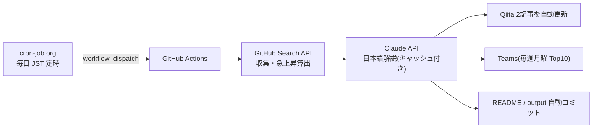

# Claude Code向けMCPツール候補ランキング

GitHub Search APIを使って、Claude Code周辺で活用候補になりそうなMCP関連リポジトリを定期収集するリポジトリです。

> 注意: この一覧は「Claude Codeでの動作」を保証するものではありません。  
> GitHub上のリポジトリ名・説明文・READMEなどに含まれる情報をもとに、MCP関連ツール候補を探すための入口として利用します。

## 仕組み(定常自律運転)

このランキングは cron-job.org → GitHub Actions → Claude API → Qiita / Teams のパイプラインで、毎日無人更新されています。


```mermaid
flowchart LR
    A["cron-job.org<br>毎日 JST 定時"] -->|workflow_dispatch| B["GitHub Actions"]
    B --> C["GitHub Search API<br>収集・急上昇算出"]
    C --> D["Claude API<br>日本語解説(キャッシュ付き)"]
    D --> E["Qiita 2記事を自動更新"]
    D --> F["Teams(毎週月曜 Top10)"]
    D --> G["README / output 自動コミット"]
```

- 仕組みの詳細と**ライブ稼働ステータス**: [定常自律運転ページ](https://takanobusano.github.io/mcp-github-ranking/)
- 作り方の解説記事: [パイプライン編](https://qiita.com/4q_sano/items/913e93ee5cc2731561fc) / [cron-job.org 完全自動化編](https://qiita.com/4q_sano/items/1bc5e0669a8f0166936c)
<!-- MCP_REPOS_START -->
最終更新: **2026-09-07 08:17:13 JST**

MCP関連リポジトリに加え、Claude Code周辺で活用候補になりそうな関連ツールをGitHub Search APIで毎日自動収集してランキング化しています。

Stars / Forks の差分は、UTC基準の前日データ（2026-09-05）との差分です。
CSVには最大500件を保存し、本文では上位100件を表示しています。

> 注意: この一覧はClaude Codeでの動作を保証するものではありません。  
> MCP関連ツールまたはClaude Code関連ツール候補を探すための入口として利用してください。

# 注目MCP・関連ツール候補ランキング

## 1位 [public-apis/public-apis](https://github.com/public-apis/public-apis)

A collective list of free APIs

⭐ **476,477 Stars**（+604）　🍴 **52,609 Forks**（+42）　/　🟢 **1,896 Open Issues**　/　Python

Topics: `api` / `apis` / `dataset` / `development` / `free` / `list` / `lists` / `open-source`

## 2位 [obra/superpowers](https://github.com/obra/superpowers)

An agentic skills framework & software development methodology that works.

⭐ **282,394 Stars**（+305）　🍴 **25,307 Forks**（+44）　/　🟢 **339 Open Issues**　/　Shell

Topics: `ai` / `brainstorming` / `coding` / `obra` / `sdlc` / `skills` / `subagent-driven-development` / `superpowers`

## 3位 [mattpocock/skills](https://github.com/mattpocock/skills)

Skills for Real Engineers. Straight from my .agents directory.

⭐ **254,465 Stars**（+1,929）　🍴 **21,460 Forks**（+147）　/　🟢 **469 Open Issues**　/　Shell

Topics: `topicなし`

## 4位 [affaan-m/ECC](https://github.com/affaan-m/ECC)

The agent harness performance optimization system. Skills, instincts, memory, security, and research-first development for Claude Code, Codex, Opencode, Cursor and beyond.

⭐ **251,248 Stars**（+1,411）　🍴 **37,771 Forks**（+162）　/　🟢 **170 Open Issues**　/　JavaScript

Topics: `ai-agents` / `anthropic` / `claude` / `claude-code` / `developer-tools` / `llm` / `mcp` / `productivity`

## 5位 [NousResearch/hermes-agent](https://github.com/NousResearch/hermes-agent)

The agent that grows with you

⭐ **242,520 Stars**（+539）　🍴 **49,874 Forks**（+161）　/　🟢 **40,347 Open Issues**　/　Python

Topics: `ai` / `ai-agent` / `ai-agents` / `anthropic` / `chatgpt` / `claude` / `claude-code` / `codex`

## 6位 [multica-ai/andrej-karpathy-skills](https://github.com/multica-ai/andrej-karpathy-skills)

A single CLAUDE.md file to improve Claude Code behavior, derived from Andrej Karpathy's observations on LLM coding pitfalls.

⭐ **210,598 Stars**（+215）　🍴 **21,410 Forks**（+22）　/　🟢 **129 Open Issues**　/　不明

Topics: `topicなし`

## 7位 [ultraworkers/claw-code](https://github.com/ultraworkers/claw-code)

An agent-managed museum exhibit, built in Rust with Gajae-Code / LazyCodex — developed and maintained with no human intervention.

⭐ **195,188 Stars**（+14）　🍴 **108,685 Forks**（-10）　/　🟢 **41 Open Issues**　/　Rust

Topics: `topicなし`

## 8位 [ollama/ollama](https://github.com/ollama/ollama)

Get up and running with Kimi-K2.6, GLM-5.2, MiniMax, DeepSeek, gpt-oss, Qwen, Gemma and other models.

⭐ **180,305 Stars**（+53）　🍴 **17,729 Forks**（+15）　/　🟢 **3,915 Open Issues**　/　Go

Topics: `deepseek` / `gemma` / `gemma3` / `glm` / `go` / `golang` / `gpt-oss` / `llama`

## 9位 [firecrawl/firecrawl](https://github.com/firecrawl/firecrawl)

The context API to search, scrape, and interact with the web at scale. 🔥

⭐ **177,266 Stars**（+372）　🍴 **9,682 Forks**（+11）　/　🟢 **598 Open Issues**　/　TypeScript

Topics: `ai` / `ai-agents` / `ai-crawler` / `ai-scraping` / `ai-search` / `crawler` / `data-extraction` / `html-to-markdown`

## 10位 [anthropics/skills](https://github.com/anthropics/skills)

Public repository for Agent Skills

⭐ **174,850 Stars**（+308）　🍴 **20,702 Forks**（+32）　/　🟢 **1,214 Open Issues**　/　Python

Topics: `agent-skills`

## 11位 [langflow-ai/langflow](https://github.com/langflow-ai/langflow)

Langflow is a powerful tool for building and deploying AI-powered agents and workflows.

⭐ **154,346 Stars**（+47）　🍴 **10,032 Forks**（+5）　/　🟢 **1,057 Open Issues**　/　Python

Topics: `agents` / `chatgpt` / `generative-ai` / `large-language-models` / `multiagent` / `react-flow`

## 12位 [msitarzewski/agency-agents](https://github.com/msitarzewski/agency-agents)

A complete AI agency at your fingertips - From frontend wizards to Reddit community ninjas, from whimsy injectors to reality checkers. Each agent is a specialized expert with personality, processes, and proven deliverables.

⭐ **150,463 Stars**（+225）　🍴 **24,254 Forks**（+37）　/　🟢 **142 Open Issues**　/　Shell

Topics: `topicなし`

## 13位 [anthropics/claude-code](https://github.com/anthropics/claude-code)

Claude Code is an agentic coding tool that lives in your terminal, understands your codebase, and helps you code faster by executing routine tasks, explaining complex code, and handling git workflows - all through natural language commands.

⭐ **144,264 Stars**（+89）　🍴 **23,045 Forks**（+15）　/　🟢 **13,134 Open Issues**　/　Python

Topics: `topicなし`

## 14位 [x1xhlol/system-prompts-and-models-of-ai-tools](https://github.com/x1xhlol/system-prompts-and-models-of-ai-tools)

FULL Augment Code, Claude Code, Cluely, CodeBuddy, Comet, Cursor, Devin AI, Junie, Kiro, Leap.new, Lovable, Manus, NotionAI, Orchids.app, Perplexity, Poke, Qoder, Replit, Same.dev, Trae, Traycer AI, VSCode Agent, Warp.dev, Windsurf, Xcode, Z.ai Code, Dia & v0. (And other Open Sourced) System Prompts, Internal Tools & AI Models

⭐ **143,412 Stars**（+29）　🍴 **34,827 Forks**（+1）　/　🟢 **161 Open Issues**　/　不明

Topics: `ai` / `bolt` / `cluely` / `copilot` / `cursor` / `cursorai` / `devin` / `github-copilot`

## 15位 [garrytan/gstack](https://github.com/garrytan/gstack)

Use Garry Tan's exact Claude Code setup: 23 opinionated tools that serve as CEO, Designer, Eng Manager, Release Manager, Doc Engineer, and QA

⭐ **131,789 Stars**（+235）　🍴 **19,744 Forks**（+23）　/　🟢 **860 Open Issues**　/　TypeScript

Topics: `topicなし`

## 16位 [farion1231/cc-switch](https://github.com/farion1231/cc-switch)

A cross-platform desktop All-in-One assistant for Claude Code, Codex, OpenCode, OpenClaw, Grok Build & Hermes Agent. Only official website: ccswitch.io

⭐ **131,359 Stars**（+150）　🍴 **9,049 Forks**（+21）　/　🟢 **2,609 Open Issues**　/　Rust

Topics: `ai-tools` / `claude-code` / `codex` / `desktop-app` / `grok` / `grokbuild` / `hermes` / `hermes-agent`

## 17位 [DietrichGebert/ponytail](https://github.com/DietrichGebert/ponytail)

Makes your AI agent think like the laziest senior dev in the room. The best code is the code you never wrote.

⭐ **129,287 Stars**（+1,398）　🍴 **6,925 Forks**（+84）　/　🟢 **225 Open Issues**　/　JavaScript

Topics: `agent-skills` / `ai-agents` / `claude` / `claude-code` / `claude-code-plugin` / `cursor-rules` / `developer-tools` / `llm`

## 18位 [nextlevelbuilder/ui-ux-pro-max-skill](https://github.com/nextlevelbuilder/ui-ux-pro-max-skill)

An AI skill that provides design intelligence for building professional UI/UX across multiple platforms.

⭐ **125,514 Stars**（+237）　🍴 **13,433 Forks**（+25）　/　🟢 **84 Open Issues**　/　Python

Topics: `ai-skills` / `antigravity` / `claude` / `claude-code` / `codex` / `command-line` / `copilot` / `cursor-ai`

## 19位 [harry0703/MoneyPrinterTurbo](https://github.com/harry0703/MoneyPrinterTurbo)

利用 AI 大模型和自动化工作流，根据主题或关键词一键生成高清短视频。Generate HD short videos from a topic or keyword with an automated AI workflow.

⭐ **121,121 Stars**（+271）　🍴 **18,652 Forks**（+88）　/　🟢 **22 Open Issues**　/　Python

Topics: `ai-video-generator` / `content-creation` / `ffmpeg` / `instagram-reels` / `llm` / `python` / `short-video` / `subtitles`

## 20位 [Graphify-Labs/graphify](https://github.com/Graphify-Labs/graphify)

Turn any codebase, with its docs, SQL schemas, configs, and PDFs, into a queryable knowledge graph. A /graphify skill for Claude Code, Cursor, Codex, and Gemini CLI: local deterministic AST parsing, every edge explained, no vector store.

⭐ **115,344 Stars**（+279）　🍴 **11,204 Forks**（+34）　/　🟢 **1,254 Open Issues**　/　Python

Topics: `ai-agents` / `antigravity` / `ast` / `claude-code` / `code-analysis` / `code-search` / `codex` / `cursor`

## 21位 [browser-use/browser-use](https://github.com/browser-use/browser-use)

🌐 Make websites accessible for AI agents. Automate tasks online with ease.

⭐ **112,690 Stars**（+294）　🍴 **12,418 Forks**（+47）　/　🟢 **397 Open Issues**　/　Python

Topics: `ai-agents` / `ai-tools` / `browser-automation` / `browser-use` / `llm` / `playwright` / `python`

## 22位 [google-gemini/gemini-cli](https://github.com/google-gemini/gemini-cli)

An open-source AI agent that brings the power of Gemini directly into your terminal.

⭐ **106,838 Stars**（+18）　🍴 **14,535 Forks**（+4）　/　🟢 **845 Open Issues**　/　TypeScript

Topics: `ai` / `ai-agents` / `cli` / `gemini` / `gemini-api` / `mcp-client` / `mcp-server`

## 23位 [JuliusBrussee/caveman](https://github.com/JuliusBrussee/caveman)

🪨 why use many token when few token do trick — Claude Code skill that cuts 65% of tokens by talking like caveman

⭐ **103,931 Stars**（+133）　🍴 **6,022 Forks**（+12）　/　🟢 **115 Open Issues**　/　Go

Topics: `ai` / `anthropic` / `caveman` / `claude` / `claude-code` / `llm` / `meme` / `prompt-engineering`

## 24位 [TauricResearch/TradingAgents](https://github.com/TauricResearch/TradingAgents)

TradingAgents: Multi-Agents LLM Financial Trading Framework

⭐ **102,736 Stars**（+123）　🍴 **19,813 Forks**（+30）　/　🟢 **364 Open Issues**　/　Python

Topics: `agent` / `finance` / `llm` / `multiagent` / `trading`

## 25位 [microsoft/playwright](https://github.com/microsoft/playwright)

Playwright is a framework for Web Testing and Automation. It allows testing Chromium, Firefox and WebKit with a single API.

⭐ **95,727 Stars**（+50）　🍴 **6,395 Forks**（+9）　/　🟢 **188 Open Issues**　/　TypeScript

Topics: `automation` / `chrome` / `chromium` / `e2e-testing` / `electron` / `end-to-end-testing` / `firefox` / `javascript`

## 26位 [puppeteer/puppeteer](https://github.com/puppeteer/puppeteer)

JavaScript API for Chrome and Firefox

⭐ **95,560 Stars**（+10）　🍴 **9,579 Forks**（±0）　/　🟢 **263 Open Issues**　/　TypeScript

Topics: `automation` / `chrome` / `chromium` / `developer-tools` / `firefox` / `headless-chrome` / `node-module` / `testing`

## 27位 [nexu-io/open-design](https://github.com/nexu-io/open-design)

🎨 Best DeepSeek Harness Design Plugin. The open-source Claude Design alternative. 🖥️ Local-first desktop app. 🖼️ Your coding agent becomes the design engine: pr...

⭐ **94,459 Stars**（+178）　🍴 **10,914 Forks**（+30）　/　🟢 **964 Open Issues**　/　TypeScript

Topics: `agent-skills` / `ai-design` / `byok` / `claude-code-for-design` / `claude-design` / `codex-design` / `coding-agents` / `cursor-design`

## 28位 [thedotmack/claude-mem](https://github.com/thedotmack/claude-mem)

Persistent Context Across Sessions for Every Agent –  Captures everything your agent does during sessions, compresses it with AI, and injects relevant context back into future sessions. Works with Claude Code, OpenClaw, Codex, Gemini, Hermes, Copilot, OpenCode + More

⭐ **93,345 Stars**（+50）　🍴 **8,196 Forks**（+3）　/　🟢 **326 Open Issues**　/　JavaScript

Topics: `ai` / `ai-agents` / `ai-memory` / `anthropic` / `artificial-intelligence` / `chromadb` / `claude` / `claude-agent-sdk`

## 29位 [addyosmani/agent-skills](https://github.com/addyosmani/agent-skills)

Production-grade engineering skills for AI coding agents.

⭐ **92,578 Stars**（+136）　🍴 **9,874 Forks**（+22）　/　🟢 **135 Open Issues**　/　JavaScript

Topics: `agent-skills` / `antigravity` / `claude-code` / `codex` / `cursor` / `skills`

## 30位 [modelcontextprotocol/servers](https://github.com/modelcontextprotocol/servers)

Model Context Protocol Servers

⭐ **90,109 Stars**（+8）　🍴 **11,576 Forks**（+10）　/　🟢 **493 Open Issues**　/　TypeScript

Topics: `topicなし`

## 31位 [OpenCut-app/OpenCut](https://github.com/OpenCut-app/OpenCut)

The open-source CapCut alternative

⭐ **88,830 Stars**（+75）　🍴 **8,759 Forks**（+6）　/　🟢 **378 Open Issues**　/　TypeScript

Topics: `editor` / `oss` / `videoeditor`

## 32位 [ChatGPTNextWeb/NextChat](https://github.com/ChatGPTNextWeb/NextChat)

✨ Zero-config AI chat assistant. No API key needed — sign up and instantly chat with GPT-5, Claude 4, Gemini 2.5, DeepSeek & 100+ top models. Pay-as-you-go save...

⭐ **88,715 Stars**（+1）　🍴 **59,132 Forks**（±0）　/　🟢 **858 Open Issues**　/　TypeScript

Topics: `calclaude` / `chatgpt` / `claude` / `cross-platform` / `desktop` / `fe` / `gemini` / `gemini-pro`

## 33位 [OpenHands/OpenHands](https://github.com/OpenHands/OpenHands)

🙌 OpenHands: AI-Driven Development

⭐ **86,372 Stars**（+100）　🍴 **11,335 Forks**（+15）　/　🟢 **668 Open Issues**　/　TypeScript

Topics: `agent` / `artificial-intelligence` / `chatgpt` / `claude-ai` / `cli` / `developer-tools` / `gpt` / `llm`

## 34位 [koala73/worldmonitor](https://github.com/koala73/worldmonitor)

Real-time global intelligence dashboard. AI-powered news aggregation, geopolitical monitoring, and infrastructure tracking in a unified situational awareness interface

⭐ **85,705 Stars**（+83）　🍴 **12,938 Forks**（+12）　/　🟢 **288 Open Issues**　/　TypeScript

Topics: `agent` / `ai` / `dashboard` / `geopolitics` / `mcp` / `mcp-server` / `monitoring` / `news`

## 35位 [laravel/laravel](https://github.com/laravel/laravel)

Laravel is a web application framework with expressive, elegant syntax. We’ve already laid the foundation for your next big idea — freeing you to create without sweating the small things.

⭐ **84,936 Stars**（±0）　🍴 **24,890 Forks**（±0）　/　🟢 **31 Open Issues**　/　Blade

Topics: `framework` / `laravel` / `php`

## 36位 [Leonxlnx/taste-skill](https://github.com/Leonxlnx/taste-skill)

Taste-Skill - gives your AI good taste. stops the AI from generating boring, generic slop

⭐ **84,875 Stars**（+270）　🍴 **5,815 Forks**（+26）　/　🟢 **60 Open Issues**　/　JavaScript

Topics: `agent` / `ai` / `claude` / `claude-code` / `codex` / `coding` / `design` / `frontend`

## 37位 [lobehub/lobehub](https://github.com/lobehub/lobehub)

🤯 LobeHub is your Chief Agent Operator, organizing your agents into 7×24 operations by hiring, scheduling, and reporting on your entire AI team.

⭐ **82,273 Stars**（+23）　🍴 **15,860 Forks**（+1）　/　🟢 **885 Open Issues**　/　TypeScript

Topics: `agent` / `agent-collaboration` / `agent-harness` / `ai` / `cao` / `chatgpt` / `chief-agent-operator` / `claude`

## 38位 [unclecode/crawl4ai](https://github.com/unclecode/crawl4ai)

🚀🤖 Crawl4AI: Open-source LLM Friendly Web Crawler & Scraper. Don't be shy, join here:

⭐ **81,816 Stars**（+232）　🍴 **8,436 Forks**（+22）　/　🟢 **175 Open Issues**　/　Python

Topics: `topicなし`

## 39位 [Egonex-AI/Understand-Anything](https://github.com/Egonex-AI/Understand-Anything)

Graphs that teach > graphs that impress. Turn any code into an interactive knowledge graph you can explore, search, and ask questions about. Works with Claude Code, Codex, Cursor, Copilot, Gemini CLI, and more.

⭐ **81,668 Stars**（+65）　🍴 **6,871 Forks**（+8）　/　🟢 **301 Open Issues**　/　TypeScript

Topics: `antigravity-skills` / `business-knowledge` / `claude-code` / `claude-skills` / `codebase-analysis` / `codex` / `codex-skills` / `developer-tools-ai-agent`

## 40位 [bytedance/deer-flow](https://github.com/bytedance/deer-flow)

An open-source long-horizon SuperAgent harness that researches, codes, and creates. With the help of sandboxes, memories, tools, skill, subagents and message gateway, it handles different levels of tasks that could take minutes to hours.

⭐ **81,595 Stars**（+172）　🍴 **11,267 Forks**（+38）　/　🟢 **886 Open Issues**　/　Python

Topics: `agent` / `agentic` / `agentic-framework` / `agentic-workflow` / `ai` / `ai-agents` / `deep-research` / `harness`

## 41位 [paperclipai/paperclip](https://github.com/paperclipai/paperclip)

The open-source app everyone uses to manage agents at work

⭐ **80,115 Stars**（+47）　🍴 **14,709 Forks**（+10）　/　🟢 **5,347 Open Issues**　/　TypeScript

Topics: `topicなし`

## 42位 [opendatalab/MinerU](https://github.com/opendatalab/MinerU)

Transforms complex documents like PDFs and Office docs into LLM-ready markdown/JSON for your Agentic workflows.

⭐ **79,324 Stars**（+57）　🍴 **6,640 Forks**（+2）　/　🟢 **105 Open Issues**　/　Python

Topics: `ai4science` / `document-analysis` / `docx` / `extract-data` / `layout-analysis` / `ocr` / `parser` / `pdf`

## 43位 [rtk-ai/rtk](https://github.com/rtk-ai/rtk)

CLI proxy that reduces LLM token consumption by 60-90% on common dev commands. Single Rust binary, zero dependencies

⭐ **79,113 Stars**（+200）　🍴 **5,008 Forks**（+18）　/　🟢 **1,949 Open Issues**　/　Rust

Topics: `agentic-coding` / `ai-coding` / `anthropic` / `claude-code` / `cli` / `command-line-tool` / `cost-reduction` / `developer-tools`

## 44位 [D4Vinci/Scrapling](https://github.com/D4Vinci/Scrapling)

🕷️ An adaptive Web Scraping framework that handles everything from a single request to a full-scale crawl!

⭐ **78,754 Stars**（+193）　🍴 **7,934 Forks**（+26）　/　🟢 **14 Open Issues**　/　Python

Topics: `ai` / `ai-scraping` / `automation` / `crawler` / `crawling` / `crawling-python` / `data` / `data-extraction`

## 45位 [Panniantong/Agent-Reach](https://github.com/Panniantong/Agent-Reach)

Give your AI agent eyes to see the entire internet. Read & search Twitter, Reddit, YouTube, GitHub, Bilibili, XiaoHongShu — one CLI, zero API fees.

⭐ **78,440 Stars**（+204）　🍴 **6,758 Forks**（+11）　/　🟢 **124 Open Issues**　/　Python

Topics: `agent-infrastructure` / `ai-agent` / `ai-search` / `automation` / `bilibili` / `claude-code` / `cli` / `cursor`

## 46位 [abi/screenshot-to-code](https://github.com/abi/screenshot-to-code)

Drop in a screenshot and convert it to clean code (HTML/Tailwind/React/Vue)

⭐ **78,048 Stars**（+155）　🍴 **9,490 Forks**（+17）　/　🟢 **143 Open Issues**　/　Python

Topics: `topicなし`

## 47位 [shareAI-lab/learn-claude-code](https://github.com/shareAI-lab/learn-claude-code)

Bash is all you need -  A nano claude code–like 「agent harness」, built from 0 to 1

⭐ **76,176 Stars**（+51）　🍴 **12,259 Forks**（+2）　/　🟢 **36 Open Issues**　/　Python

Topics: `agent` / `agent-development` / `ai-agent` / `claude` / `claude-code` / `educational` / `llm` / `python`

## 48位 [unslothai/unsloth](https://github.com/unslothai/unsloth)

Local UI to run and train LLMs and diffusion models. Supports GGUF, MLX, Qwen3.8, DeepSeek-V4, MiniMax-H3, Gemma 4, FLUX and more.

⭐ **75,730 Stars**（+54）　🍴 **6,892 Forks**（+12）　/　🟢 **1,347 Open Issues**　/　Python

Topics: `agent` / `ai` / `chatgpt` / `deepseek` / `fine-tuning` / `gemma` / `image-generation` / `llama`

## 49位 [Eugeny/tabby](https://github.com/Eugeny/tabby)

A terminal for a more modern age

⭐ **74,362 Stars**（+18）　🍴 **4,242 Forks**（+6）　/　🟢 **2,879 Open Issues**　/　TypeScript

Topics: `serial` / `ssh-client` / `telnet-client` / `terminal` / `terminal-emulators`

## 50位 [thedaviddias/Front-End-Checklist](https://github.com/thedaviddias/Front-End-Checklist)

🗂 The essential checklist for modern web development, for humans and AI agents

⭐ **74,048 Stars**（+10）　🍴 **6,731 Forks**（+2）　/　🟢 **9 Open Issues**　/　MDX

Topics: `ai-agent` / `ai-agents` / `checklist` / `css` / `front-end-developer-tool` / `front-end-development` / `frontend` / `guidelines`

## 51位 [OpenBB-finance/OpenBB](https://github.com/OpenBB-finance/OpenBB)

Open Data Platform for analysts, quants and AI agents.

⭐ **72,718 Stars**（+19）　🍴 **7,512 Forks**（+2）　/　🟢 **118 Open Issues**　/　Python

Topics: `ai` / `crypto` / `derivatives` / `economics` / `equity` / `finance` / `fixed-income` / `machine-learning`

## 52位 [daytonaio/daytona](https://github.com/daytonaio/daytona)

Daytona is a Secure and Elastic Infrastructure for Running AI-Generated Code

⭐ **71,781 Stars**（-5）　🍴 **5,646 Forks**（±0）　/　🟢 **455 Open Issues**　/　不明

Topics: `agentic-workflow` / `ai` / `ai-agents` / `ai-runtime` / `ai-sandboxes` / `code-execution` / `code-interpreter` / `developer-tools`

## 53位 [ruvnet/ruflo](https://github.com/ruvnet/ruflo)

🌊 The original agent meta-harness. Deploy intelligent multi-player swarms, coordinate autonomous workflows, and build conversational AI systems. Features adapti...

⭐ **70,968 Stars**（+285）　🍴 **8,436 Forks**（+23）　/　🟢 **937 Open Issues**　/　TypeScript

Topics: `agentic-ai` / `agentic-framework` / `agentic-workflow` / `agents` / `ai-agents` / `ai-assistant` / `ai-skills` / `autonomous-agents`

## 54位 [colbymchenry/codegraph](https://github.com/colbymchenry/codegraph)

Pre-indexed code knowledge graph, auto syncs on code changes, for Claude Code, Codex, Gemini, Cursor, OpenCode, AntiGravity, Kiro, CoPilot, and Hermes Agent — fewer tokens, fewer tool calls, 100% local

⭐ **69,840 Stars**（+98）　🍴 **4,459 Forks**（+9）　/　🟢 **519 Open Issues**　/　C

Topics: `topicなし`

## 55位 [headroomlabs-ai/headroom](https://github.com/headroomlabs-ai/headroom)

Compress tool outputs, logs, files, and RAG chunks before they reach the LLM. 20% fewer tokens for coding agents, 60-95% fewer tokens for JSON, same answers. Library, proxy, MCP server.

⭐ **69,137 Stars**（+101）　🍴 **5,359 Forks**（+4）　/　🟢 **642 Open Issues**　/　Python

Topics: `agent` / `ai` / `anthropic` / `claude-code` / `compression` / `context-engineering` / `context-window` / `cursor`

## 56位 [code-yeongyu/oh-my-openagent](https://github.com/code-yeongyu/oh-my-openagent)

OmO: Drop your tokens. Ultrawork. Done.

⭐ **68,761 Stars**（+32）　🍴 **5,649 Forks**（+6）　/　🟢 **940 Open Issues**　/　TypeScript

Topics: `ai` / `ai-agents` / `anthropic` / `chatgpt` / `claude` / `claude-skills` / `codex` / `cursor`

## 57位 [openinterpreter/openinterpreter](https://github.com/openinterpreter/openinterpreter)

A coding agent for open models like Kimi K3 and GLM 5.3

⭐ **68,253 Stars**（+8）　🍴 **5,883 Forks**（+3）　/　🟢 **1 Open Issues**　/　Rust

Topics: `acp` / `coding-agent` / `deepseek` / `kimi` / `qwen` / `rust`

## 58位 [cline/cline](https://github.com/cline/cline)

Autonomous coding agent as an SDK, IDE extension, or CLI assistant.

⭐ **67,584 Stars**（+58）　🍴 **7,292 Forks**（+3）　/　🟢 **1,249 Open Issues**　/　TypeScript

Topics: `topicなし`

## 59位 [Fission-AI/OpenSpec](https://github.com/Fission-AI/OpenSpec)

Spec-driven development (SDD) for AI coding assistants.

⭐ **67,448 Stars**（+56）　🍴 **4,641 Forks**（+4）　/　🟢 **234 Open Issues**　/　TypeScript

Topics: `ai` / `context-engineering` / `engineering` / `planning` / `prd` / `sdd` / `sdlc` / `spec`

## 60位 [bradtraversy/design-resources-for-developers](https://github.com/bradtraversy/design-resources-for-developers)

Curated list of design and UI resources from stock photos, web templates, CSS frameworks, UI libraries, tools and much more

⭐ **66,846 Stars**（+13）　🍴 **12,176 Forks**（+3）　/　🟢 **114 Open Issues**　/　不明

Topics: `topicなし`

## 61位 [xtekky/gpt4free](https://github.com/xtekky/gpt4free)

The official gpt4free repository \| various collection of powerful language models \| opus 4.6 gpt 5.3 kimi 2.5 deepseek v3.2 gemini 3

⭐ **66,647 Stars**（+7）　🍴 **13,511 Forks**（+1）　/　🟢 **3 Open Issues**　/　Python

Topics: `chatbot` / `chatbots` / `chatgpt` / `chatgpt-4` / `chatgpt-api` / `chatgpt-free` / `chatgpt4` / `deepseek`

## 62位 [docling-project/docling](https://github.com/docling-project/docling)

Get your documents ready for gen AI

⭐ **66,071 Stars**（+26）　🍴 **4,755 Forks**（+2）　/　🟢 **900 Open Issues**　/　Python

Topics: `ai` / `convert` / `document-parser` / `document-parsing` / `documents` / `docx` / `html` / `markdown`

## 63位 [pbakaus/impeccable](https://github.com/pbakaus/impeccable)

The design language that makes your AI harness better at design.

⭐ **66,050 Stars**（+215）　🍴 **4,058 Forks**（+14）　/　🟢 **18 Open Issues**　/　JavaScript

Topics: `topicなし`

## 64位 [shanraisshan/claude-code-best-practice](https://github.com/shanraisshan/claude-code-best-practice)

from vibe coding to agentic engineering - practice makes claude perfect

⭐ **65,686 Stars**（+57）　🍴 **6,531 Forks**（±0）　/　🟢 **22 Open Issues**　/　HTML

Topics: `agentic-ai` / `agentic-coding` / `agentic-engineering` / `agentic-workflow` / `ai` / `ai-agents` / `anthropic` / `best-practices`

## 65位 [warpdotdev/warp](https://github.com/warpdotdev/warp)

Warp is an agentic development environment, born out of the terminal.

⭐ **64,837 Stars**（+16）　🍴 **5,507 Forks**（-3）　/　🟢 **5,207 Open Issues**　/　Rust

Topics: `bash` / `linux` / `macos` / `rust` / `shell` / `terminal` / `wasm` / `zsh`

## 66位 [mem0ai/mem0](https://github.com/mem0ai/mem0)

The Memory Layer for AI Agents - Drop-in memory infrastructure for AI agents and apps. Context that persists. Built for production.

⭐ **64,798 Stars**（+51）　🍴 **7,587 Forks**（+5）　/　🟢 **732 Open Issues**　/　Python

Topics: `agentic-memory` / `agentic-memory-system` / `agents` / `ai` / `ai-agents` / `chatgpt` / `genai` / `llm`

## 67位 [NanmiCoder/MediaCrawler](https://github.com/NanmiCoder/MediaCrawler)

小红书笔记 \| 评论爬虫、抖音视频 \| 评论爬虫、快手视频 \| 评论爬虫、B 站视频 ｜ 评论爬虫、微博帖子 ｜ 评论爬虫、百度贴吧帖子 ｜ 百度贴吧评论回复爬虫  \| 知乎问答文章｜评论爬虫

⭐ **64,516 Stars**（+35）　🍴 **12,523 Forks**（+6）　/　🟢 **192 Open Issues**　/　Python

Topics: `topicなし`

## 68位 [asgeirtj/system_prompts_leaks](https://github.com/asgeirtj/system_prompts_leaks)

Extracted system prompts from Anthropic - Claude Fable 5.1, Opus 5, Claude Design, Claude Code. OpenAI - ChatGPT GPT-6-Astra, Codex. Google - Gemini 3.8 Flash, 3.1 Pro, Antigravity. xAI - Grok, Grok Bot, Cursor, Kimi and more! Updated regularly.

⭐ **64,284 Stars**（+55）　🍴 **10,542 Forks**（+4）　/　🟢 **50 Open Issues**　/　JavaScript

Topics: `ai` / `ai-agents` / `ai-prompts` / `anthropic` / `chatbot` / `chatgpt` / `claude` / `claude-code`

## 69位 [stablyai/orca](https://github.com/stablyai/orca)

Orca is the ADE for working with a fleet of parallel agents. Run any coding agent with your own subscription. Available on desktop, mobile and remote runtime.

⭐ **62,753 Stars**（+531）　🍴 **4,182 Forks**（+33）　/　🟢 **5,407 Open Issues**　/　TypeScript

Topics: `ade` / `agent-ide` / `ai-agents` / `claude-code` / `cli` / `codex` / `cursor-agent` / `devtools`

## 70位 [sansan0/TrendRadar](https://github.com/sansan0/TrendRadar)

⭐AI-driven public opinion & trend monitor with multi-platform aggregation, RSS, and smart alerts.🎯 告别信息过载，你的 AI 舆情监控助手与热点筛选工具！聚合多平台热点 +  RSS 订阅，支持关键词精准筛选。AI 智能筛...

⭐ **62,072 Stars**（+24）　🍴 **24,894 Forks**（+3）　/　🟢 **58 Open Issues**　/　Python

Topics: `ai` / `bark` / `data-analysis` / `docker` / `hot-news` / `llm` / `mail` / `mcp`

## 71位 [diegosouzapw/OmniRoute](https://github.com/diegosouzapw/OmniRoute)

Never stop coding. Free MIT AI gateway: one endpoint, 352 providers (150+ free), 1200+ models Kimi, Claude, GPT, Gemini, GLM, DeepSeek, MiniMax. Works with Claude Code, Codex, Cursor, OpenCode, Cline & Copilot. Quota-aware auto-fallback, RTK+Caveman compression saves 15-95% tokens, MCP/A2A, Desktop/PWA. Built by 550+ contributors

⭐ **62,031 Stars**（+416）　🍴 **8,660 Forks**（+77）　/　🟢 **411 Open Issues**　/　TypeScript

Topics: `a2a` / `ai-agents` / `ai-gateway` / `anthropic` / `claude` / `claude-code` / `cline` / `codex`

## 72位 [upstash/context7](https://github.com/upstash/context7)

Context7 Platform -- Up-to-date code documentation for LLMs and AI code editors

⭐ **61,707 Stars**（+38）　🍴 **2,973 Forks**（±0）　/　🟢 **73 Open Issues**　/　TypeScript

Topics: `llm` / `mcp` / `mcp-server` / `vibe-coding`

## 73位 [coollabsio/coolify](https://github.com/coollabsio/coolify)

An open-source, self-hostable PaaS alternative to Vercel, Heroku & Netlify that lets you easily deploy static sites, databases, full-stack applications and 280+ one-click services on your own servers.

⭐ **61,491 Stars**（+33）　🍴 **5,419 Forks**（+5）　/　🟢 **656 Open Issues**　/　PHP

Topics: `coolify` / `databases` / `deployment` / `docker` / `docker-compose` / `inertiajs` / `laravel` / `mariadb`

## 74位 [mvanhorn/last30days-skill](https://github.com/mvanhorn/last30days-skill)

AI agent skill that researches any topic across Reddit, X, YouTube, HN, Polymarket, and the web - then synthesizes a grounded summary

⭐ **61,442 Stars**（+119）　🍴 **5,370 Forks**（+13）　/　🟢 **176 Open Issues**　/　Python

Topics: `ai-prompts` / `ai-skill` / `bluesky` / `claude` / `claude-code` / `clawhub` / `deep-research` / `hackernews`

## 75位 [tw93/Pake](https://github.com/tw93/Pake)

🤱🏻 Turn any webpage into a desktop app with one command.

⭐ **61,317 Stars**（+15）　🍴 **12,621 Forks**（+6）　/　🟢 **0 Open Issues**　/　Rust

Topics: `chatgpt` / `claude` / `desktop` / `gemini` / `hight-performance` / `linux` / `macos` / `no-electron`

## 76位 [1c7/chinese-independent-developer](https://github.com/1c7/chinese-independent-developer)

👩🏿‍💻👨🏾‍💻👩🏼‍💻👨🏽‍💻👩🏻‍💻中国独立开发者项目列表 -- 分享大家都在做什么

⭐ **61,270 Stars**（+18）　🍴 **5,364 Forks**（+4）　/　🟢 **1 Open Issues**　/　Python

Topics: `china` / `indie` / `indie-developer`

## 77位 [usestrix/strix](https://github.com/usestrix/strix)

Open-source AI penetration testing tool to find and fix your app’s vulnerabilities.

⭐ **60,940 Stars**（+205）　🍴 **6,668 Forks**（+27）　/　🟢 **358 Open Issues**　/　Python

Topics: `agents` / `ai-hacking` / `ai-penetration-testing` / `ai-pentesting` / `ai-security` / `artificial-intelligence` / `bug-bounty` / `code-quality`

## 78位 [microsoft/autogen](https://github.com/microsoft/autogen)

A programming framework for agentic AI

⭐ **60,839 Stars**（+17）　🍴 **9,187 Forks**（+5）　/　🟢 **1,050 Open Issues**　/　Python

Topics: `agentic` / `agentic-agi` / `agents` / `ai` / `autogen` / `autogen-ecosystem` / `chatgpt` / `framework`

## 79位 [penpot/penpot](https://github.com/penpot/penpot)

Penpot: The open-source design platform for Product teams that need scalable collaboration.

⭐ **59,668 Stars**（+32）　🍴 **4,070 Forks**（+3）　/　🟢 **781 Open Issues**　/　Clojure

Topics: `clojure` / `clojurescript` / `design` / `prototyping` / `ui` / `ux-design` / `ux-experience`

## 80位 [meilisearch/meilisearch](https://github.com/meilisearch/meilisearch)

A lightning-fast search engine API bringing AI-powered hybrid search to your sites and applications.

⭐ **59,199 Stars**（+9）　🍴 **2,700 Forks**（+2）　/　🟢 **320 Open Issues**　/　Rust

Topics: `ai` / `api` / `app-search` / `database` / `enterprise-search` / `faceting` / `full-text-search` / `fuzzy-search`

## 81位 [MemPalace/mempalace](https://github.com/MemPalace/mempalace)

The best-benchmarked open-source AI memory system. And it's free.

⭐ **58,885 Stars**（+28）　🍴 **7,546 Forks**（+1）　/　🟢 **762 Open Issues**　/　Python

Topics: `ai` / `chromadb` / `llm` / `mcp` / `memory` / `python`

## 82位 [FoundationAgents/OpenManus](https://github.com/FoundationAgents/OpenManus)

No fortress, purely open ground.  OpenManus is Coming.

⭐ **58,215 Stars**（+11）　🍴 **10,105 Forks**（+2）　/　🟢 **464 Open Issues**　/　Python

Topics: `topicなし`

## 83位 [BerriAI/litellm](https://github.com/BerriAI/litellm)

The fastest, litest AI Gateway. Rust core with Python SDK. Call 100+ LLM APIs in OpenAI (or native) format with cost tracking, guardrails, load balancing, and logging [Bedrock, Azure, OpenAI, Anthropic, OpenAI, VertexAI, vLLM, Nvidia NIM]

⭐ **58,169 Stars**（+51）　🍴 **11,218 Forks**（+18）　/　🟢 **4,927 Open Issues**　/　Python

Topics: `ai-gateway` / `anthropic` / `azure-openai` / `bedrock` / `gateway` / `langchain` / `litellm` / `llm`

## 84位 [crewAIInc/crewAI](https://github.com/crewAIInc/crewAI)

Framework for orchestrating role-playing, autonomous AI agents. By fostering collaborative intelligence, CrewAI empowers agents to work together seamlessly, tackling complex tasks.

⭐ **58,161 Stars**（+39）　🍴 **8,360 Forks**（+8）　/　🟢 **747 Open Issues**　/　Python

Topics: `agents` / `ai` / `ai-agents` / `aiagentframework` / `llms`

## 85位 [zylon-ai/private-gpt](https://github.com/zylon-ai/private-gpt)

Complete API layer for private AI applications on local models: RAG, skills, tools, MCP, text-to-sql, and more. Works with any OpenAI-compatible inference server.

⭐ **57,494 Stars**（+2）　🍴 **7,614 Forks**（+3）　/　🟢 **7 Open Issues**　/　Python

Topics: `ai` / `ai-tools` / `on-premise`

## 86位 [calesthio/OpenMontage](https://github.com/calesthio/OpenMontage)

World's first open-source, agentic video production system. 12 production pipelines, 100+ tools, 700+ agent skill and production-knowledge files. Turn your AI coding assistant into a full video production studio.

⭐ **56,394 Stars**（+137）　🍴 **7,081 Forks**（+22）　/　🟢 **312 Open Issues**　/　Python

Topics: `agent` / `agentic-ai` / `ai` / `claude` / `copilot` / `cursor` / `elevenlabs` / `ffmpeg`

## 87位 [aaif-goose/goose](https://github.com/aaif-goose/goose)

an open source, extensible AI agent that goes beyond code suggestions - install, execute, edit, and test with any LLM

⭐ **53,972 Stars**（+30）　🍴 **6,194 Forks**（+10）　/　🟢 **312 Open Issues**　/　Rust

Topics: `acp` / `ai` / `ai-agents` / `mcp`

## 88位 [Alishahryar1/free-claude-code](https://github.com/Alishahryar1/free-claude-code)

Use Claude Code, Codex, Pi, and OpenCode and more for free (1.3B+ free tokens) from your terminal, app, IDE, or phone like OpenClaw (voice supported + ToS friendly)

⭐ **53,520 Stars**（+149）　🍴 **8,587 Forks**（+24）　/　🟢 **375 Open Issues**　/　Python

Topics: `topicなし`

## 89位 [bmad-code-org/BMAD-METHOD](https://github.com/bmad-code-org/BMAD-METHOD)

Breakthrough Method for Agile Ai Driven Development

⭐ **52,731 Stars**（+23）　🍴 **5,980 Forks**（-1）　/　🟢 **30 Open Issues**　/　Python

Topics: `topicなし`

## 90位 [rohitg00/ai-engineering-from-scratch](https://github.com/rohitg00/ai-engineering-from-scratch)

Learn it. Build it. Ship it for others.

⭐ **52,588 Stars**（+108）　🍴 **9,167 Forks**（+35）　/　🟢 **104 Open Issues**　/　Python

Topics: `agents` / `ai` / `ai-agents` / `ai-engineering` / `computer-vision` / `course` / `deep-learning` / `from-scratch`

## 91位 [hugohe3/ppt-master](https://github.com/hugohe3/ppt-master)

AI turns documents or topics into real, native PowerPoint decks—with native shapes, transitions and animations, data-backed charts and tables on demand, audio narration from speaker notes, and support for your own .pptx templates. · by Hugo He

⭐ **52,436 Stars**（+227）　🍴 **4,195 Forks**（+15）　/　🟢 **3 Open Issues**　/　Python

Topics: `ai-agent` / `aippt` / `office` / `powerpoint` / `powerpoint-generation` / `ppt` / `pptx` / `presentation`

## 92位 [jamiepine/voicebox](https://github.com/jamiepine/voicebox)

The open-source AI voice studio. Clone, dictate, create.

⭐ **52,432 Stars**（+56）　🍴 **6,539 Forks**（+11）　/　🟢 **675 Open Issues**　/　TypeScript

Topics: `ai` / `cuda` / `mlx` / `qwen3-tts` / `qwen3-tts-ui` / `voice-ai` / `voice-clone` / `whisper`

## 93位 [CherryHQ/cherry-studio](https://github.com/CherryHQ/cherry-studio)

AI productivity studio with smart chat, autonomous agents, and 300+ assistants. Unified access to frontier LLMs

⭐ **51,519 Stars**（+41）　🍴 **4,927 Forks**（+4）　/　🟢 **1,515 Open Issues**　/　TypeScript

Topics: `agent-skills` / `ai-agent` / `claude-code` / `codex` / `deepseek` / `deepseek-harness` / `hermes-agent` / `skills`

## 94位 [charlax/professional-programming](https://github.com/charlax/professional-programming)

A collection of learning resources for curious software engineers

⭐ **51,492 Stars**（+6）　🍴 **4,019 Forks**（+1）　/　🟢 **7 Open Issues**　/　Python

Topics: `architecture` / `computer-science` / `concepts` / `documentation` / `engineer` / `learning` / `lessons-learned` / `professional`

## 95位 [ChromeDevTools/chrome-devtools-mcp](https://github.com/ChromeDevTools/chrome-devtools-mcp)

Chrome DevTools for coding agents

⭐ **51,156 Stars**（+99）　🍴 **3,589 Forks**（+11）　/　🟢 **97 Open Issues**　/　TypeScript

Topics: `browser` / `chrome` / `chrome-devtools` / `debugging` / `devtools` / `mcp` / `mcp-server` / `puppeteer`

## 96位 [tt-a1i/archify](https://github.com/tt-a1i/archify)

Agent skill for beautiful, verifiable architecture, workflow, sequence, data-flow, and lifecycle diagrams—self-contained HTML with motion and crisp export.

⭐ **50,726 Stars**（+1,351）　🍴 **3,301 Forks**（+97）　/　🟢 **123 Open Issues**　/　JavaScript

Topics: `agent-skills` / `architecture-as-code` / `architecture-diagram` / `claude-skill` / `code-visualization` / `codex` / `coding-agents` / `data-flow-diagram`

## 97位 [router-for-me/CLIProxyAPI](https://github.com/router-for-me/CLIProxyAPI)

Wrap Antigravity, ChatGPT Codex, Claude Code, Grok Build as an OpenAI/Gemini/Claude/Codex compatible API service, allowing you to enjoy the free Gemini 3.1 Pro, GPT 5.6 Series, Grok 4.5, Claude model through API

⭐ **50,677 Stars**（+93）　🍴 **7,709 Forks**（+17）　/　🟢 **584 Open Issues**　/　Go

Topics: `antigravity` / `claude-code` / `cluade` / `codex` / `gemini` / `openai`

## 98位 [HKUDS/CLI-Anything](https://github.com/HKUDS/CLI-Anything)

"CLI-Anything: Making ALL Software Agent-Native" -- CLI-Hub:

⭐ **49,073 Stars**（+46）　🍴 **4,548 Forks**（±0）　/　🟢 **86 Open Issues**　/　Python

Topics: `topicなし`

## 99位 [multica-ai/multica](https://github.com/multica-ai/multica)

Make humans and AI agents work as one team — open-source and self-hostable.

⭐ **49,053 Stars**（+54）　🍴 **6,337 Forks**（+7）　/　🟢 **1,512 Open Issues**　/　Go

Topics: `topicなし`

## 100位 [mudler/LocalAI](https://github.com/mudler/LocalAI)

LocalAI is the open-source AI engine. Run any model - LLMs, vision, voice, image, video - on any hardware. No GPU required.

⭐ **48,935 Stars**（+51）　🍴 **4,427 Forks**（+8）　/　🟢 **180 Open Issues**　/　Go

Topics: `agents` / `ai` / `api` / `audio-generation` / `decentralized` / `distributed` / `image-generation` / `libp2p`

# 最近プッシュされたMCP・関連ツール候補

スター数ランキングとは別に、最近コードがプッシュされたリポジトリを表示します。古いスター数だけではなく、現在も開発が動いていそうな候補を探すための一覧です。

## プッシュ順 1位 [different-ai/openwork](https://github.com/different-ai/openwork)

The open-source alternative to Claude Cowork (powered by opencode)

⭐ **23,369 Stars**（+15）　🍴 **2,329 Forks**（+1）　/　TypeScript　/　最終プッシュ: 2026-09-06

Topics: `topicなし`

## プッシュ順 2位 [unslothai/unsloth](https://github.com/unslothai/unsloth)

Local UI to run and train LLMs and diffusion models. Supports GGUF, MLX, Qwen3.8, DeepSeek-V4, MiniMax-H3, Gemma 4, FLUX and more.

⭐ **75,730 Stars**（+54）　🍴 **6,892 Forks**（+12）　/　Python　/　最終プッシュ: 2026-09-06

Topics: `agent` / `ai` / `chatgpt` / `deepseek` / `fine-tuning` / `gemma` / `image-generation` / `llama`

## プッシュ順 3位 [stablyai/orca](https://github.com/stablyai/orca)

Orca is the ADE for working with a fleet of parallel agents. Run any coding agent with your own subscription. Available on desktop, mobile and remote runtime.

⭐ **62,753 Stars**（+531）　🍴 **4,182 Forks**（+33）　/　TypeScript　/　最終プッシュ: 2026-09-06

Topics: `ade` / `agent-ide` / `ai-agents` / `claude-code` / `cli` / `codex` / `cursor-agent` / `devtools`

## プッシュ順 4位 [trycua/cua](https://github.com/trycua/cua)

Scale computer-use 2.0 with open-source drivers, cross-OS fleets, and benchmarks for training, evaluation, and data generation.

⭐ **22,266 Stars**（+28）　🍴 **1,537 Forks**（+3）　/　HTML　/　最終プッシュ: 2026-09-06

Topics: `agent` / `ai-agent` / `apple` / `computer-use` / `computer-use-agent` / `containerization` / `cua` / `desktop-automation`

## プッシュ順 5位 [questdb/questdb](https://github.com/questdb/questdb)

QuestDB is a high performance, open-source, time-series database

⭐ **17,308 Stars**（+3）　🍴 **1,647 Forks**（±0）　/　Java　/　最終プッシュ: 2026-09-06

Topics: `apache-arrow` / `capital-markets` / `database` / `historian` / `kdb` / `low-latency` / `market-data` / `parquet`

## プッシュ順 6位 [NVIDIA/NemoClaw](https://github.com/NVIDIA/NemoClaw)

Run agents like Hermes, LangChain Deep Agents, and OpenClaw more securely inside NVIDIA OpenShell with managed inference

⭐ **22,386 Stars**（+8）　🍴 **3,068 Forks**（+1）　/　TypeScript　/　最終プッシュ: 2026-09-06

Topics: `ai-agents` / `deep-agents` / `hermes` / `nvidia` / `openclaw` / `openshell` / `sandboxing` / `typescript`

## プッシュ順 7位 [Nagi-ovo/voyager](https://github.com/Nagi-ovo/voyager)

Enhancement suite for Gemini, AI Studio, Claude & ChatGPT — plus a prompt manager for any web UI, DeepSeek Harness included. / 面向 Gemini、AI Studio、Claude 与 Chat...

⭐ **19,968 Stars**（+16）　🍴 **663 Forks**（+1）　/　TypeScript　/　最終プッシュ: 2026-09-06

Topics: `ai-studio` / `browser-extension` / `bun` / `chat-management` / `chatgpt` / `chrome-extension` / `claude-ai` / `dsh`

## プッシュ順 8位 [DeusData/codebase-memory-mcp](https://github.com/DeusData/codebase-memory-mcp)

High-performance code intelligence MCP server. Indexes codebases into a persistent knowledge graph — average repo in milliseconds. 158 languages, sub-ms queries, 99% fewer tokens. Single static binary, zero dependencies.

⭐ **42,450 Stars**（+107）　🍴 **3,465 Forks**（+7）　/　C　/　最終プッシュ: 2026-09-06

Topics: `aider` / `ast` / `claude-code` / `code-analysis` / `code-intelligence` / `codex` / `cursor` / `cypher`

## プッシュ順 9位 [manaflow-ai/cmux](https://github.com/manaflow-ai/cmux)

Open source Ghostty-based macOS terminal with vertical tabs and notifications for AI coding agents. Built for multitasking, organization, and programmability.

⭐ **26,844 Stars**（+24）　🍴 **2,319 Forks**（+3）　/　Swift　/　最終プッシュ: 2026-09-06

Topics: `amp` / `claude-code` / `cli` / `codex` / `coding-agents` / `gemini` / `ghostty` / `macos`

## プッシュ順 10位 [screenpipe/screenpipe](https://github.com/screenpipe/screenpipe)

YC (S26) \| Open Computer History \| Record your screen continuously locally and provide context to your agents (Claude, Codex, Openclaw, Hermes, Runner...)

⭐ **21,444 Stars**（+17）　🍴 **2,184 Forks**（+4）　/　Rust　/　最終プッシュ: 2026-09-06

Topics: `agents` / `agi` / `ai` / `ai-memory` / `audio-recording` / `computer-vision` / `hermes` / `hermes-agent`

## プッシュ順 11位 [livekit/agents](https://github.com/livekit/agents)

A framework for building realtime voice AI agents 🤖🎙️📹

⭐ **14,037 Stars**（+12）　🍴 **3,694 Forks**（+2）　/　Python　/　最終プッシュ: 2026-09-06

Topics: `agents` / `ai` / `openai` / `real-time` / `video` / `voice`

## プッシュ順 12位 [CherryHQ/cherry-studio](https://github.com/CherryHQ/cherry-studio)

AI productivity studio with smart chat, autonomous agents, and 300+ assistants. Unified access to frontier LLMs

⭐ **51,519 Stars**（+41）　🍴 **4,927 Forks**（+4）　/　TypeScript　/　最終プッシュ: 2026-09-06

Topics: `agent-skills` / `ai-agent` / `claude-code` / `codex` / `deepseek` / `deepseek-harness` / `hermes-agent` / `skills`

## プッシュ順 13位 [kortix-ai/suna](https://github.com/kortix-ai/suna)

The open-source AI Management System

⭐ **20,178 Stars**（+3）　🍴 **3,436 Forks**（±0）　/　TypeScript　/　最終プッシュ: 2026-09-06

Topics: `ai` / `ai-agents` / `llm`

## プッシュ順 14位 [lidge-jun/opencodex](https://github.com/lidge-jun/opencodex)

Universal provider proxy for OpenAI Codex & Claude Code — use any LLM (Claude, Gemini, Grok, DeepSeek, Ollama…) with Codex CLI, App, SDK, and Claude Code

⭐ **13,639 Stars**（+156）　🍴 **1,024 Forks**（+12）　/　TypeScript　/　最終プッシュ: 2026-09-06

Topics: `ai-gateway` / `ai-tools` / `anthropic` / `chatgpt` / `claude` / `claude-code` / `codex` / `codex-cli`

## プッシュ順 15位 [paperclipai/paperclip](https://github.com/paperclipai/paperclip)

The open-source app everyone uses to manage agents at work

⭐ **80,115 Stars**（+47）　🍴 **14,709 Forks**（+10）　/　TypeScript　/　最終プッシュ: 2026-09-06

Topics: `topicなし`

## プッシュ順 16位 [coder/coder](https://github.com/coder/coder)

Secure environments for developers and their agents

⭐ **14,385 Stars**（+6）　🍴 **1,461 Forks**（-1）　/　Go　/　最終プッシュ: 2026-09-06

Topics: `agents` / `dev-tools` / `development-environment` / `go` / `golang` / `ide` / `jetbrains` / `remote-development`

## プッシュ順 17位 [elizaOS/eliza](https://github.com/elizaOS/eliza)

Open source agentic operating system

⭐ **19,271 Stars**（+13）　🍴 **5,709 Forks**（±0）　/　TypeScript　/　最終プッシュ: 2026-09-06

Topics: `agent` / `agentic` / `ai` / `autonomous` / `chatbot` / `crypto` / `discord` / `eliza`

## プッシュ順 18位 [pingdotgg/t3code](https://github.com/pingdotgg/t3code)

説明なし

⭐ **21,845 Stars**（+69）　🍴 **5,372 Forks**（+33）　/　TypeScript　/　最終プッシュ: 2026-09-06

Topics: `topicなし`

## プッシュ順 19位 [koala73/worldmonitor](https://github.com/koala73/worldmonitor)

Real-time global intelligence dashboard. AI-powered news aggregation, geopolitical monitoring, and infrastructure tracking in a unified situational awareness interface

⭐ **85,705 Stars**（+83）　🍴 **12,938 Forks**（+12）　/　TypeScript　/　最終プッシュ: 2026-09-06

Topics: `agent` / `ai` / `dashboard` / `geopolitics` / `mcp` / `mcp-server` / `monitoring` / `news`

## プッシュ順 20位 [danny-avila/LibreChat](https://github.com/danny-avila/LibreChat)

Enhanced ChatGPT Clone: Features Agents, MCP, Skills, DeepSeek, Anthropic, AWS, OpenAI, Responses API, Azure, Groq, o1, GPT-5, Mistral, OpenRouter, Vertex AI, Gemini, Artifacts, AI model switching, message search, Code Interpreter, langchain, DALL-E-3, OpenAPI Actions, Functions, Secure Multi-User Auth, Presets, open-source for self-hosting. Active

⭐ **42,870 Stars**（+25）　🍴 **8,877 Forks**（+6）　/　TypeScript　/　最終プッシュ: 2026-09-06

Topics: `ai` / `anthropic` / `artifacts` / `aws` / `azure` / `chatgpt` / `chatgpt-clone` / `claude`

## プッシュ順 21位 [Hmbown/Codewhale](https://github.com/Hmbown/Codewhale)

Open-source coding agent for your terminal, built in Rust and on a journey of continuous community improvement. Issues and PRs welcome.

⭐ **40,915 Stars**（-1）　🍴 **3,545 Forks**（±0）　/　Rust　/　最終プッシュ: 2026-09-06

Topics: `agent-orchestration` / `ai-agent` / `cli` / `coding-agent` / `local-first` / `mcp` / `multi-agent` / `multi-model`

## プッシュ順 22位 [BerriAI/litellm](https://github.com/BerriAI/litellm)

The fastest, litest AI Gateway. Rust core with Python SDK. Call 100+ LLM APIs in OpenAI (or native) format with cost tracking, guardrails, load balancing, and logging [Bedrock, Azure, OpenAI, Anthropic, OpenAI, VertexAI, vLLM, Nvidia NIM]

⭐ **58,169 Stars**（+51）　🍴 **11,218 Forks**（+18）　/　Python　/　最終プッシュ: 2026-09-06

Topics: `ai-gateway` / `anthropic` / `azure-openai` / `bedrock` / `gateway` / `langchain` / `litellm` / `llm`

## プッシュ順 23位 [PostHog/posthog](https://github.com/PostHog/posthog)

:hedgehog: PostHog is the leading platform for building self-driving products. Our developer tools – AI observability, analytics, session replay, flags, experiments, error tracking, logs, and more – capture all the context agents need to diagnose problems, uncover opportunities, and ship fixes. Steer it all from Slack, web, desktop, or the MCP.

⭐ **39,613 Stars**（+13）　🍴 **3,339 Forks**（+1）　/　Python　/　最終プッシュ: 2026-09-06

Topics: `ab-testing` / `ai-analytics` / `analytics` / `cdp` / `data-warehouse` / `experiments` / `feature-flags` / `javascript`

## プッシュ順 24位 [BasedHardware/omi](https://github.com/BasedHardware/omi)

AI that sees your screen, listens to your conversations and tells you what to do

⭐ **13,421 Stars**（+11）　🍴 **2,244 Forks**（+3）　/　Python　/　最終プッシュ: 2026-09-06

Topics: `ai` / `app` / `bci` / `c` / `flutter` / `friend` / `mobile` / `necklace`

## プッシュ順 25位 [pbakaus/impeccable](https://github.com/pbakaus/impeccable)

The design language that makes your AI harness better at design.

⭐ **66,050 Stars**（+215）　🍴 **4,058 Forks**（+14）　/　JavaScript　/　最終プッシュ: 2026-09-06

Topics: `topicなし`

## プッシュ順 26位 [slopus/happy](https://github.com/slopus/happy)

Mobile and Web client for Codex and Claude Code, with realtime voice, encryption and fully featured

⭐ **23,665 Stars**（+16）　🍴 **1,999 Forks**（-1）　/　TypeScript　/　最終プッシュ: 2026-09-06

Topics: `claude-code` / `claude-desktop` / `claude-mobile` / `codex` / `codex-cli` / `hacktoberfest`

## プッシュ順 27位 [budtmo/docker-android](https://github.com/budtmo/docker-android)

Android in docker solution with noVNC supported, video recording and mcp server

⭐ **15,833 Stars**（+6）　🍴 **1,750 Forks**（±0）　/　Python　/　最終プッシュ: 2026-09-06

Topics: `android` / `android-emulator` / `aws` / `azure` / `cloud` / `docker` / `docker-android` / `emulator`

## プッシュ順 28位 [mlflow/mlflow](https://github.com/mlflow/mlflow)

The open source AI engineering platform for agents, LLMs, and ML models. MLflow enables teams of all sizes to debug, evaluate, monitor, and optimize production-quality AI applications while controlling costs and managing access to models and data.

⭐ **27,837 Stars**（+16）　🍴 **6,256 Forks**（±0）　/　Python　/　最終プッシュ: 2026-09-06

Topics: `agentops` / `agents` / `ai` / `ai-governance` / `apache-spark` / `evaluation` / `langchain` / `llm-evaluation`

## プッシュ順 29位 [langflow-ai/langflow](https://github.com/langflow-ai/langflow)

Langflow is a powerful tool for building and deploying AI-powered agents and workflows.

⭐ **154,346 Stars**（+47）　🍴 **10,032 Forks**（+5）　/　Python　/　最終プッシュ: 2026-09-06

Topics: `agents` / `chatgpt` / `generative-ai` / `large-language-models` / `multiagent` / `react-flow`

## プッシュ順 30位 [SimplifyJobs/New-Grad-Positions](https://github.com/SimplifyJobs/New-Grad-Positions)

A collection of full time roles in SWE, Quant, and PM for new grads.

⭐ **17,904 Stars**（+12）　🍴 **1,308 Forks**（±0）　/　不明　/　最終プッシュ: 2026-09-06

Topics: `applications` / `coderquad` / `college` / `fulltime` / `hacktoberfest` / `jobs` / `newgrad` / `position`

# 検索条件

以下の検索条件でGitHubリポジトリを収集しています。

- "model context protocol" in:name,description,readme stars:>10
- "mcp server" in:name,description,readme stars:>10
- "mcp" "claude" in:name,description,readme stars:>10
- "claude" "mcp" in:name,description,readme stars:>10
- "modelcontextprotocol" in:name,description,readme stars:>10
- "claude code" in:name,description,readme stars:>10
- "claude" "plugin" in:name,description,readme stars:>10
- "claude" "memory" in:name,description,readme stars:>10

<!-- MCP_REPOS_END -->

## 仕組み

```text
GitHub Search API
  ↓
MCP / Claude Code / Model Context Protocol 関連リポジトリを検索
  ↓
スター数・更新日・Fork数・説明文を取得
  ↓
Markdown / CSV を生成
  ↓
GitHub Actionsで毎日自動実行
  ↓
READMEを自動更新
