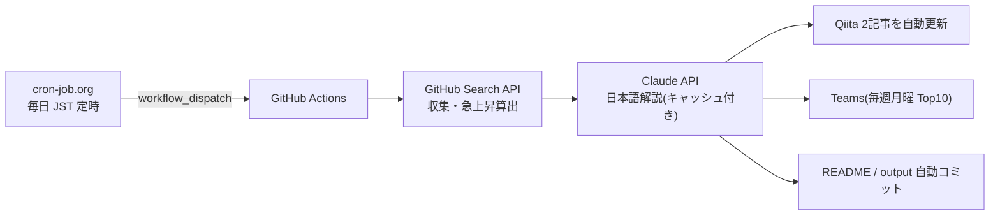

# Claude Code向けMCPツール候補ランキング

GitHub Search APIを使って、Claude Code周辺で活用候補になりそうなMCP関連リポジトリを定期収集するリポジトリです。

> 注意: この一覧は「Claude Codeでの動作」を保証するものではありません。  
> GitHub上のリポジトリ名・説明文・READMEなどに含まれる情報をもとに、MCP関連ツール候補を探すための入口として利用します。

## 仕組み(定常自律運転)

このランキングは cron-job.org → GitHub Actions → Claude API → Qiita / Teams のパイプラインで、毎日無人更新されています。


```mermaid
flowchart LR
    A["cron-job.org<br>毎日 JST 定時"] -->|workflow_dispatch| B["GitHub Actions"]
    B --> C["GitHub Search API<br>収集・急上昇算出"]
    C --> D["Claude API<br>日本語解説(キャッシュ付き)"]
    D --> E["Qiita 2記事を自動更新"]
    D --> F["Teams(毎週月曜 Top10)"]
    D --> G["README / output 自動コミット"]
```

- 仕組みの詳細と**ライブ稼働ステータス**: [定常自律運転ページ](https://takanobusano.github.io/mcp-github-ranking/)
- 作り方の解説記事: [パイプライン編](https://qiita.com/4q_sano/items/913e93ee5cc2731561fc) / [cron-job.org 完全自動化編](https://qiita.com/4q_sano/items/1bc5e0669a8f0166936c)
<!-- MCP_REPOS_START -->
最終更新: **2026-07-25 08:17:10 JST**

MCP関連リポジトリに加え、Claude Code周辺で活用候補になりそうな関連ツールをGitHub Search APIで毎日自動収集してランキング化しています。

Stars / Forks の差分は、UTC基準の前日データ（2026-07-23）との差分です。
CSVには最大500件を保存し、本文では上位100件を表示しています。

> 注意: この一覧はClaude Codeでの動作を保証するものではありません。  
> MCP関連ツールまたはClaude Code関連ツール候補を探すための入口として利用してください。

# 注目MCP・関連ツール候補ランキング

## 1位 [public-apis/public-apis](https://github.com/public-apis/public-apis)

A collective list of free APIs

⭐ **452,384 Stars**（+179）　🍴 **49,812 Forks**（+23）　/　🟢 **1,584 Open Issues**　/　Python

Topics: `api` / `apis` / `dataset` / `development` / `free` / `list` / `lists` / `open-source`

## 2位 [obra/superpowers](https://github.com/obra/superpowers)

An agentic skills framework & software development methodology that works.

⭐ **260,587 Stars**（+550）　🍴 **23,243 Forks**（+60）　/　🟢 **319 Open Issues**　/　Shell

Topics: `ai` / `brainstorming` / `coding` / `obra` / `sdlc` / `skills` / `subagent-driven-development` / `superpowers`

## 3位 [affaan-m/ECC](https://github.com/affaan-m/ECC)

The agent harness performance optimization system. Skills, instincts, memory, security, and research-first development for Claude Code, Codex, Opencode, Cursor and beyond.

⭐ **232,898 Stars**（+330）　🍴 **35,494 Forks**（+51）　/　🟢 **96 Open Issues**　/　JavaScript

Topics: `ai-agents` / `anthropic` / `claude` / `claude-code` / `developer-tools` / `llm` / `mcp` / `productivity`

## 4位 [NousResearch/hermes-agent](https://github.com/NousResearch/hermes-agent)

The agent that grows with you

⭐ **220,006 Stars**（+509）　🍴 **41,815 Forks**（+160）　/　🟢 **25,038 Open Issues**　/　Python

Topics: `ai` / `ai-agent` / `ai-agents` / `anthropic` / `chatgpt` / `claude` / `claude-code` / `clawdbot`

## 5位 [multica-ai/andrej-karpathy-skills](https://github.com/multica-ai/andrej-karpathy-skills)

A single CLAUDE.md file to improve Claude Code behavior, derived from Andrej Karpathy's observations on LLM coding pitfalls.

⭐ **196,023 Stars**（+318）　🍴 **20,181 Forks**（+34）　/　🟢 **124 Open Issues**　/　不明

Topics: `topicなし`

## 6位 [ultraworkers/claw-code](https://github.com/ultraworkers/claw-code)

An agent-managed museum exhibit, built in Rust with Gajae-Code / LazyCodex — developed and maintained with no human intervention.

⭐ **194,888 Stars**（+8）　🍴 **109,504 Forks**（-10）　/　🟢 **33 Open Issues**　/　Rust

Topics: `topicなし`

## 7位 [mattpocock/skills](https://github.com/mattpocock/skills)

Skills for Real Engineers. Straight from my .agents directory.

⭐ **186,638 Stars**（+2,189）　🍴 **16,011 Forks**（+221）　/　🟢 **227 Open Issues**　/　Shell

Topics: `topicなし`

## 8位 [ollama/ollama](https://github.com/ollama/ollama)

Get up and running with Kimi-K2.6, GLM-5.2, MiniMax, DeepSeek, gpt-oss, Qwen, Gemma and other models.

⭐ **176,803 Stars**（+70）　🍴 **17,094 Forks**（+16）　/　🟢 **3,516 Open Issues**　/　Go

Topics: `deepseek` / `gemma` / `gemma3` / `glm` / `go` / `golang` / `gpt-oss` / `llama`

## 9位 [anthropics/skills](https://github.com/anthropics/skills)

Public repository for Agent Skills

⭐ **163,948 Stars**（+229）　🍴 **19,460 Forks**（+34）　/　🟢 **1,049 Open Issues**　/　Python

Topics: `agent-skills`

## 10位 [firecrawl/firecrawl](https://github.com/firecrawl/firecrawl)

The API to search, scrape, and interact with the web at scale. 🔥

⭐ **155,571 Stars**（+471）　🍴 **8,854 Forks**（+22）　/　🟢 **438 Open Issues**　/　TypeScript

Topics: `ai` / `ai-agents` / `ai-crawler` / `ai-scraping` / `ai-search` / `crawler` / `data-extraction` / `html-to-markdown`

## 11位 [langflow-ai/langflow](https://github.com/langflow-ai/langflow)

Langflow is a powerful tool for building and deploying AI-powered agents and workflows.

⭐ **152,345 Stars**（+56）　🍴 **9,644 Forks**（+8）　/　🟢 **990 Open Issues**　/　Python

Topics: `agents` / `chatgpt` / `generative-ai` / `large-language-models` / `multiagent` / `react-flow`

## 12位 [x1xhlol/system-prompts-and-models-of-ai-tools](https://github.com/x1xhlol/system-prompts-and-models-of-ai-tools)

FULL Augment Code, Claude Code, Cluely, CodeBuddy, Comet, Cursor, Devin AI, Junie, Kiro, Leap.new, Lovable, Manus, NotionAI, Orchids.app, Perplexity, Poke, Qoder, Replit, Same.dev, Trae, Traycer AI, VSCode Agent, Warp.dev, Windsurf, Xcode, Z.ai Code, Dia & v0. (And other Open Sourced) System Prompts, Internal Tools & AI Models

⭐ **142,246 Stars**（+17）　🍴 **34,822 Forks**（+1）　/　🟢 **158 Open Issues**　/　不明

Topics: `ai` / `bolt` / `cluely` / `copilot` / `cursor` / `cursorai` / `devin` / `github-copilot`

## 13位 [anthropics/claude-code](https://github.com/anthropics/claude-code)

Claude Code is an agentic coding tool that lives in your terminal, understands your codebase, and helps you code faster by executing routine tasks, explaining complex code, and handling git workflows - all through natural language commands.

⭐ **138,969 Stars**（+115）　🍴 **22,300 Forks**（+19）　/　🟢 **13,226 Open Issues**　/　Python

Topics: `topicなし`

## 14位 [msitarzewski/agency-agents](https://github.com/msitarzewski/agency-agents)

A complete AI agency at your fingertips - From frontend wizards to Reddit community ninjas, from whimsy injectors to reality checkers. Each agent is a specialized expert with personality, processes, and proven deliverables.

⭐ **136,426 Stars**（+257）　🍴 **22,225 Forks**（+58）　/　🟢 **99 Open Issues**　/　Shell

Topics: `topicなし`

## 15位 [garrytan/gstack](https://github.com/garrytan/gstack)

Use Garry Tan's exact Claude Code setup: 23 opinionated tools that serve as CEO, Designer, Eng Manager, Release Manager, Doc Engineer, and QA

⭐ **124,150 Stars**（+207）　🍴 **18,596 Forks**（+33）　/　🟢 **786 Open Issues**　/　TypeScript

Topics: `topicなし`

## 16位 [farion1231/cc-switch](https://github.com/farion1231/cc-switch)

A cross-platform desktop All-in-One assistant for Claude Code, Codex, OpenCode, OpenClaw, Grok Build & Hermes Agent. Only official website: ccswitch.io

⭐ **120,915 Stars**（+398）　🍴 **8,121 Forks**（+32）　/　🟢 **2,077 Open Issues**　/　Rust

Topics: `ai-tools` / `claude-code` / `codex` / `desktop-app` / `grok` / `grokbuild` / `hermes` / `hermes-agent`

## 17位 [nextlevelbuilder/ui-ux-pro-max-skill](https://github.com/nextlevelbuilder/ui-ux-pro-max-skill)

An AI SKILL that provide design intelligence for building professional UI/UX multiple platforms

⭐ **109,786 Stars**（+368）　🍴 **11,707 Forks**（+40）　/　🟢 **123 Open Issues**　/　Python

Topics: `ai-skills` / `antigravity` / `claude` / `claude-code` / `codex` / `command-line` / `copilot` / `cursor-ai`

## 18位 [browser-use/browser-use](https://github.com/browser-use/browser-use)

🌐 Make websites accessible for AI agents. Automate tasks online with ease.

⭐ **106,614 Stars**（+234）　🍴 **11,722 Forks**（+23）　/　🟢 **331 Open Issues**　/　Python

Topics: `ai-agents` / `ai-tools` / `browser-automation` / `browser-use` / `llm` / `playwright` / `python`

## 19位 [google-gemini/gemini-cli](https://github.com/google-gemini/gemini-cli)

An open-source AI agent that brings the power of Gemini directly into your terminal.

⭐ **106,156 Stars**（+11）　🍴 **14,311 Forks**（+7）　/　🟢 **1,166 Open Issues**　/　TypeScript

Topics: `ai` / `ai-agents` / `cli` / `gemini` / `gemini-api` / `mcp-client` / `mcp-server`

## 20位 [harry0703/MoneyPrinterTurbo](https://github.com/harry0703/MoneyPrinterTurbo)

利用 AI 大模型和自动化工作流，根据主题或关键词一键生成高清短视频。Generate HD short videos from a topic or keyword with an automated AI workflow.

⭐ **99,126 Stars**（+218）　🍴 **14,677 Forks**（+39）　/　🟢 **3 Open Issues**　/　Python

Topics: `ai-video-generator` / `content-creation` / `ffmpeg` / `instagram-reels` / `llm` / `python` / `short-video` / `subtitles`

## 21位 [puppeteer/puppeteer](https://github.com/puppeteer/puppeteer)

JavaScript API for Chrome and Firefox

⭐ **95,340 Stars**（+4）　🍴 **9,540 Forks**（-1）　/　🟢 **277 Open Issues**　/　TypeScript

Topics: `automation` / `chrome` / `chromium` / `developer-tools` / `firefox` / `headless-chrome` / `node-module` / `testing`

## 22位 [Graphify-Labs/graphify](https://github.com/Graphify-Labs/graphify)

Turn any codebase, with its docs, SQL schemas, configs, and PDFs, into a queryable knowledge graph. A /graphify skill for Claude Code, Cursor, Codex, and Gemini CLI: local deterministic AST parsing, every edge explained, no vector store.

⭐ **95,245 Stars**（+658）　🍴 **9,225 Forks**（+67）　/　🟢 **653 Open Issues**　/　Python

Topics: `ai-agents` / `antigravity` / `ast` / `claude-code` / `code-analysis` / `code-search` / `codex` / `cursor`

## 23位 [TauricResearch/TradingAgents](https://github.com/TauricResearch/TradingAgents)

TradingAgents: Multi-Agents LLM Financial Trading Framework

⭐ **94,422 Stars**（+117）　🍴 **18,248 Forks**（+30）　/　🟢 **302 Open Issues**　/　Python

Topics: `agent` / `finance` / `llm` / `multiagent` / `trading`

## 24位 [microsoft/playwright](https://github.com/microsoft/playwright)

Playwright is a framework for Web Testing and Automation. It allows testing Chromium, Firefox and WebKit with a single API.

⭐ **93,402 Stars**（+65）　🍴 **6,145 Forks**（+6）　/　🟢 **154 Open Issues**　/　TypeScript

Topics: `automation` / `chrome` / `chromium` / `e2e-testing` / `electron` / `end-to-end-testing` / `firefox` / `javascript`

## 25位 [JuliusBrussee/caveman](https://github.com/JuliusBrussee/caveman)

🪨 why use many token when few token do trick — Claude Code skill that cuts 65% of tokens by talking like caveman

⭐ **92,751 Stars**（+326）　🍴 **5,259 Forks**（+19）　/　🟢 **424 Open Issues**　/　JavaScript

Topics: `ai` / `anthropic` / `caveman` / `claude` / `claude-code` / `llm` / `meme` / `prompt-engineering`

## 26位 [DietrichGebert/ponytail](https://github.com/DietrichGebert/ponytail)

Makes your AI agent think like the laziest senior dev in the room. The best code is the code you never wrote.

⭐ **88,970 Stars**（+573）　🍴 **4,876 Forks**（+39）　/　🟢 **101 Open Issues**　/　JavaScript

Topics: `agent-skills` / `ai-agents` / `claude` / `claude-code` / `claude-code-plugin` / `cursor-rules` / `developer-tools` / `llm`

## 27位 [modelcontextprotocol/servers](https://github.com/modelcontextprotocol/servers)

Model Context Protocol Servers

⭐ **88,854 Stars**（+38）　🍴 **11,282 Forks**（+5）　/　🟢 **680 Open Issues**　/　TypeScript

Topics: `topicなし`

## 28位 [ChatGPTNextWeb/NextChat](https://github.com/ChatGPTNextWeb/NextChat)

✨ Light and Fast AI Assistant. Support: Web \| iOS \| MacOS \| Android \|  Linux \| Windows

⭐ **88,545 Stars**（+7）　🍴 **59,376 Forks**（-3）　/　🟢 **845 Open Issues**　/　TypeScript

Topics: `calclaude` / `chatgpt` / `claude` / `cross-platform` / `desktop` / `fe` / `gemini` / `gemini-pro`

## 29位 [thedotmack/claude-mem](https://github.com/thedotmack/claude-mem)

Persistent Context Across Sessions for Every Agent –  Captures everything your agent does during sessions, compresses it with AI, and injects relevant context back into future sessions. Works with Claude Code, OpenClaw, Codex, Gemini, Hermes, Copilot, OpenCode + More

⭐ **88,477 Stars**（+111）　🍴 **7,680 Forks**（+7）　/　🟢 **274 Open Issues**　/　JavaScript

Topics: `ai` / `ai-agents` / `ai-memory` / `anthropic` / `artificial-intelligence` / `chromadb` / `claude` / `claude-agent-sdk`

## 30位 [laravel/laravel](https://github.com/laravel/laravel)

Laravel is a web application framework with expressive, elegant syntax. We’ve already laid the foundation for your next big idea — freeing you to create without sweating the small things.

⭐ **84,669 Stars**（+6）　🍴 **24,795 Forks**（+4）　/　🟢 **31 Open Issues**　/　Blade

Topics: `framework` / `laravel` / `php`

## 31位 [OpenHands/OpenHands](https://github.com/OpenHands/OpenHands)

🙌 OpenHands: AI-Driven Development

⭐ **81,990 Stars**（+123）　🍴 **10,494 Forks**（+28）　/　🟢 **369 Open Issues**　/　Python

Topics: `agent` / `artificial-intelligence` / `chatgpt` / `claude-ai` / `cli` / `developer-tools` / `gpt` / `llm`

## 32位 [nexu-io/open-design](https://github.com/nexu-io/open-design)

🎨 The open-source Claude Design alternative. 🖥️ Local-first desktop app. 🖼️ Your coding agent becomes the design engine: prototypes, landing pages, dashboards,...

⭐ **81,323 Stars**（+303）　🍴 **9,403 Forks**（+41）　/　🟢 **672 Open Issues**　/　TypeScript

Topics: `agent-skills` / `ai-agents` / `ai-design` / `byok` / `claude-code-for-design` / `claude-design` / `codex-design` / `coding-agents`

## 33位 [lobehub/lobehub](https://github.com/lobehub/lobehub)

🤯 LobeHub is your Chief Agent Operator, organizing your agents into 7×24 operations by hiring, scheduling, and reporting on your entire AI team.

⭐ **80,775 Stars**（前日なし）　🍴 **15,693 Forks**（前日なし）　/　🟢 **674 Open Issues**　/　TypeScript

Topics: `agent` / `agent-collaboration` / `agent-harness` / `ai` / `cao` / `chatgpt` / `chief-agent-operator` / `claude`

## 34位 [addyosmani/agent-skills](https://github.com/addyosmani/agent-skills)

Production-grade engineering skills for AI coding agents.

⭐ **80,218 Stars**（+165）　🍴 **8,648 Forks**（+23）　/　🟢 **127 Open Issues**　/　JavaScript

Topics: `agent-skills` / `antigravity` / `claude-code` / `codex` / `cursor` / `skills`

## 35位 [OpenCut-app/OpenCut](https://github.com/OpenCut-app/OpenCut)

The open-source CapCut alternative

⭐ **78,404 Stars**（+317）　🍴 **7,830 Forks**（+34）　/　🟢 **361 Open Issues**　/　TypeScript

Topics: `editor` / `oss` / `videoeditor`

## 36位 [bytedance/deer-flow](https://github.com/bytedance/deer-flow)

An open-source long-horizon SuperAgent harness that researches, codes, and creates. With the help of sandboxes, memories, tools, skill, subagents and message gateway, it handles different levels of tasks that could take minutes to hours.

⭐ **77,791 Stars**（+86）　🍴 **10,611 Forks**（+24）　/　🟢 **991 Open Issues**　/　Python

Topics: `agent` / `agentic` / `agentic-framework` / `agentic-workflow` / `ai` / `ai-agents` / `deep-research` / `harness`

## 37位 [Egonex-AI/Understand-Anything](https://github.com/Egonex-AI/Understand-Anything)

Graphs that teach > graphs that impress. Turn any code into an interactive knowledge graph you can explore, search, and ask questions about. Works with Claude Code, Codex, Cursor, Copilot, Gemini CLI, and more.

⭐ **75,982 Stars**（+166）　🍴 **6,341 Forks**（+22）　/　🟢 **260 Open Issues**　/　TypeScript

Topics: `antigravity-skills` / `business-knowledge` / `claude-code` / `claude-skills` / `codebase-analysis` / `codex` / `codex-skills` / `developer-tools-ai-agent`

## 38位 [opendatalab/MinerU](https://github.com/opendatalab/MinerU)

Transforms complex documents like PDFs and Office docs into LLM-ready markdown/JSON for your Agentic workflows.

⭐ **75,638 Stars**（+80）　🍴 **6,355 Forks**（+7）　/　🟢 **63 Open Issues**　/　Python

Topics: `ai4science` / `document-analysis` / `docx` / `extract-data` / `layout-analysis` / `ocr` / `parser` / `pdf`

## 39位 [unclecode/crawl4ai](https://github.com/unclecode/crawl4ai)

🚀🤖 Crawl4AI: Open-source LLM Friendly Web Crawler & Scraper. Don't be shy, join here:

⭐ **74,871 Stars**（+250）　🍴 **7,719 Forks**（+34）　/　🟢 **118 Open Issues**　/　Python

Topics: `topicなし`

## 40位 [paperclipai/paperclip](https://github.com/paperclipai/paperclip)

The open-source app everyone uses to manage agents at work

⭐ **74,666 Stars**（+66）　🍴 **13,905 Forks**（+18）　/　🟢 **4,910 Open Issues**　/　TypeScript

Topics: `topicなし`

## 41位 [Eugeny/tabby](https://github.com/Eugeny/tabby)

A terminal for a more modern age

⭐ **73,469 Stars**（+27）　🍴 **4,174 Forks**（+7）　/　🟢 **2,799 Open Issues**　/　TypeScript

Topics: `serial` / `ssh-client` / `telnet-client` / `terminal` / `terminal-emulators`

## 42位 [abi/screenshot-to-code](https://github.com/abi/screenshot-to-code)

Drop in a screenshot and convert it to clean code (HTML/Tailwind/React/Vue)

⭐ **73,441 Stars**（+13）　🍴 **9,032 Forks**（+1）　/　🟢 **122 Open Issues**　/　Python

Topics: `topicなし`

## 43位 [thedaviddias/Front-End-Checklist](https://github.com/thedaviddias/Front-End-Checklist)

🗂 The essential checklist for modern web development, for humans and AI agents

⭐ **73,303 Stars**（+15）　🍴 **6,655 Forks**（+1）　/　🟢 **4 Open Issues**　/　MDX

Topics: `ai-agent` / `ai-agents` / `checklist` / `css` / `front-end-developer-tool` / `front-end-development` / `frontend` / `guidelines`

## 44位 [koala73/worldmonitor](https://github.com/koala73/worldmonitor)

Real-time global intelligence dashboard. AI-powered news aggregation, geopolitical monitoring, and infrastructure tracking in a unified situational awareness interface

⭐ **73,223 Stars**（+1,727）　🍴 **10,980 Forks**（+188）　/　🟢 **254 Open Issues**　/　TypeScript

Topics: `agent` / `ai` / `dashboard` / `geopolitics` / `mcp` / `mcp-server` / `monitoring` / `news`

## 45位 [rtk-ai/rtk](https://github.com/rtk-ai/rtk)

CLI proxy that reduces LLM token consumption by 60-90% on common dev commands. Single Rust binary, zero dependencies

⭐ **73,103 Stars**（+255）　🍴 **4,561 Forks**（+16）　/　🟢 **1,716 Open Issues**　/　Rust

Topics: `agentic-coding` / `ai-coding` / `anthropic` / `claude-code` / `cli` / `command-line-tool` / `cost-reduction` / `developer-tools`

## 46位 [daytonaio/daytona](https://github.com/daytonaio/daytona)

Daytona is a Secure and Elastic Infrastructure for Running AI-Generated Code

⭐ **72,172 Stars**（-6）　🍴 **5,665 Forks**（-4）　/　🟢 **442 Open Issues**　/　不明

Topics: `agentic-workflow` / `ai` / `ai-agents` / `ai-runtime` / `ai-sandboxes` / `code-execution` / `code-interpreter` / `developer-tools`

## 47位 [shareAI-lab/learn-claude-code](https://github.com/shareAI-lab/learn-claude-code)

Bash is all you need -  A nano claude code–like 「agent harness」, built from 0 to 1

⭐ **72,151 Stars**（+76）　🍴 **11,696 Forks**（+15）　/　🟢 **72 Open Issues**　/　Python

Topics: `agent` / `agent-development` / `ai-agent` / `claude` / `claude-code` / `educational` / `llm` / `python`

## 48位 [D4Vinci/Scrapling](https://github.com/D4Vinci/Scrapling)

🕷️ An adaptive Web Scraping framework that handles everything from a single request to a full-scale crawl!

⭐ **71,136 Stars**（+161）　🍴 **7,061 Forks**（+20）　/　🟢 **7 Open Issues**　/　Python

Topics: `ai` / `ai-scraping` / `automation` / `crawler` / `crawling` / `crawling-python` / `data` / `data-extraction`

## 49位 [OpenBB-finance/OpenBB](https://github.com/OpenBB-finance/OpenBB)

Open Data Platform for analysts, quants and AI agents.

⭐ **70,979 Stars**（+45）　🍴 **7,223 Forks**（+9）　/　🟢 **79 Open Issues**　/　Python

Topics: `ai` / `crypto` / `derivatives` / `economics` / `equity` / `finance` / `fixed-income` / `machine-learning`

## 50位 [unslothai/unsloth](https://github.com/unslothai/unsloth)

Unsloth is a local UI for training and running Gemma 4, Qwen3.6, DeepSeek, Kimi, GLM and other models.

⭐ **68,849 Stars**（+48）　🍴 **6,199 Forks**（+12）　/　🟢 **988 Open Issues**　/　Python

Topics: `agent` / `deepseek` / `fine-tuning` / `gemma` / `gemma3` / `gpt-oss` / `llama` / `llama3`

## 51位 [Leonxlnx/taste-skill](https://github.com/Leonxlnx/taste-skill)

Taste-Skill - gives your AI good taste. stops the AI from generating boring, generic slop

⭐ **67,257 Stars**（+420）　🍴 **4,625 Forks**（+26）　/　🟢 **51 Open Issues**　/　JavaScript

Topics: `agent` / `ai` / `claude` / `claude-code` / `codex` / `coding` / `design` / `frontend`

## 52位 [openinterpreter/openinterpreter](https://github.com/openinterpreter/openinterpreter)

A coding agent for open models like Kimi K3

⭐ **67,250 Stars**（+43）　🍴 **5,776 Forks**（+5）　/　🟢 **292 Open Issues**　/　Rust

Topics: `acp` / `coding-agent` / `deepseek` / `kimi` / `qwen` / `rust`

## 53位 [code-yeongyu/oh-my-openagent](https://github.com/code-yeongyu/oh-my-openagent)

omo/lazycodex: The coding agent for tokenmaxxers;the one and only agent harness for complex codebases. For your Codex, for your OpenCode

⭐ **66,539 Stars**（+70）　🍴 **5,422 Forks**（+5）　/　🟢 **910 Open Issues**　/　TypeScript

Topics: `ai` / `ai-agents` / `anthropic` / `chatgpt` / `claude` / `claude-skills` / `codex` / `cursor`

## 54位 [bradtraversy/design-resources-for-developers](https://github.com/bradtraversy/design-resources-for-developers)

Curated list of design and UI resources from stock photos, web templates, CSS frameworks, UI libraries, tools and much more

⭐ **66,492 Stars**（+7）　🍴 **12,118 Forks**（-1）　/　🟢 **61 Open Issues**　/　不明

Topics: `topicなし`

## 55位 [xtekky/gpt4free](https://github.com/xtekky/gpt4free)

The official gpt4free repository \| various collection of powerful language models \| opus 4.6 gpt 5.3 kimi 2.5 deepseek v3.2 gemini 3

⭐ **66,489 Stars**（+9）　🍴 **13,530 Forks**（±0）　/　🟢 **8 Open Issues**　/　Python

Topics: `chatbot` / `chatbots` / `chatgpt` / `chatgpt-4` / `chatgpt-api` / `chatgpt-free` / `chatgpt4` / `deepseek`

## 56位 [ruvnet/ruflo](https://github.com/ruvnet/ruflo)

🌊 The leading agent meta-harness. Deploy intelligent multi-player swarms, coordinate autonomous workflows, and build conversational AI systems. Features adaptiv...

⭐ **65,830 Stars**（+116）　🍴 **7,822 Forks**（+16）　/　🟢 **829 Open Issues**　/　TypeScript

Topics: `agentic-ai` / `agentic-framework` / `agentic-workflow` / `agents` / `ai-agents` / `ai-assistant` / `ai-coding` / `ai-skills`

## 57位 [cline/cline](https://github.com/cline/cline)

Autonomous coding agent as an SDK, IDE extension, or CLI assistant.

⭐ **65,024 Stars**（+45）　🍴 **6,980 Forks**（+4）　/　🟢 **1,097 Open Issues**　/　TypeScript

Topics: `topicなし`

## 58位 [docling-project/docling](https://github.com/docling-project/docling)

Get your documents ready for gen AI

⭐ **63,739 Stars**（+53）　🍴 **4,518 Forks**（+4）　/　🟢 **943 Open Issues**　/　Python

Topics: `ai` / `convert` / `document-parser` / `document-parsing` / `documents` / `docx` / `html` / `markdown`

## 59位 [warpdotdev/warp](https://github.com/warpdotdev/warp)

Warp is an agentic development environment, born out of the terminal.

⭐ **63,634 Stars**（+32）　🍴 **5,324 Forks**（+1）　/　🟢 **4,722 Open Issues**　/　Rust

Topics: `bash` / `linux` / `macos` / `rust` / `shell` / `terminal` / `wasm` / `zsh`

## 60位 [shanraisshan/claude-code-best-practice](https://github.com/shanraisshan/claude-code-best-practice)

from vibe coding to agentic engineering - practice makes claude perfect

⭐ **63,437 Stars**（+52）　🍴 **6,331 Forks**（+6）　/　🟢 **18 Open Issues**　/　HTML

Topics: `agentic-ai` / `agentic-coding` / `agentic-engineering` / `agentic-workflow` / `ai` / `ai-agents` / `anthropic` / `best-practices`

## 61位 [Fission-AI/OpenSpec](https://github.com/Fission-AI/OpenSpec)

Spec-driven development (SDD) for AI coding assistants.

⭐ **62,466 Stars**（+151）　🍴 **4,321 Forks**（+6）　/　🟢 **374 Open Issues**　/　TypeScript

Topics: `ai` / `context-engineering` / `engineering` / `planning` / `prd` / `sdd` / `sdlc` / `spec`

## 62位 [colbymchenry/codegraph](https://github.com/colbymchenry/codegraph)

Pre-indexed code knowledge graph, auto syncs on code changes, for Claude Code, Codex, Gemini, Cursor, OpenCode, AntiGravity, Kiro, and Hermes Agent — fewer tokens, fewer tool calls, 100% local

⭐ **62,263 Stars**（+303）　🍴 **3,897 Forks**（+14）　/　🟢 **352 Open Issues**　/　C

Topics: `topicなし`

## 63位 [headroomlabs-ai/headroom](https://github.com/headroomlabs-ai/headroom)

Compress tool outputs, logs, files, and RAG chunks before they reach the LLM. 20% fewer tokens for coding agents, 60-95% fewer tokens for JSON, same answers. Library, proxy, MCP server.

⭐ **62,188 Stars**（+474）　🍴 **4,688 Forks**（+39）　/　🟢 **528 Open Issues**　/　Python

Topics: `agent` / `ai` / `anthropic` / `claude-code` / `compression` / `context-engineering` / `context-window` / `cursor`

## 64位 [mem0ai/mem0](https://github.com/mem0ai/mem0)

Universal memory layer for AI Agents

⭐ **61,630 Stars**（+77）　🍴 **7,185 Forks**（+12）　/　🟢 **704 Open Issues**　/　TypeScript

Topics: `agents` / `ai` / `ai-agents` / `application` / `chatbots` / `chatgpt` / `genai` / `llm`

## 65位 [sansan0/TrendRadar](https://github.com/sansan0/TrendRadar)

⭐AI-driven public opinion & trend monitor with multi-platform aggregation, RSS, and smart alerts.🎯 告别信息过载，你的 AI 舆情监控助手与热点筛选工具！聚合多平台热点 +  RSS 订阅，支持关键词精准筛选。AI 智能筛...

⭐ **60,860 Stars**（+28）　🍴 **24,809 Forks**（±0）　/　🟢 **50 Open Issues**　/　Python

Topics: `ai` / `bark` / `data-analysis` / `docker` / `hot-news` / `llm` / `mail` / `mcp`

## 66位 [Panniantong/Agent-Reach](https://github.com/Panniantong/Agent-Reach)

Give your AI agent eyes to see the entire internet. Read & search Twitter, Reddit, YouTube, GitHub, Bilibili, XiaoHongShu — one CLI, zero API fees.

⭐ **60,604 Stars**（+443）　🍴 **4,876 Forks**（+44）　/　🟢 **167 Open Issues**　/　Python

Topics: `agent-infrastructure` / `ai-agent` / `ai-search` / `automation` / `bilibili` / `claude-code` / `cli` / `cursor`

## 67位 [asgeirtj/system_prompts_leaks](https://github.com/asgeirtj/system_prompts_leaks)

Extracted system prompts from Anthropic - Claude Fable 5, Opus 4.8, Claude Code, Claude Design. OpenAI - ChatGPT GPT-5.6, Codex GPT-5.6, GPT-5.5. Google - Gemini 3.5 Flash, 3.1 Pro, Antigravity. xAI - Grok, Cursor, Copilot, VS Code, Perplexity, and more. Updated regularly.

⭐ **60,301 Stars**（+287）　🍴 **9,828 Forks**（+50）　/　🟢 **43 Open Issues**　/　JavaScript

Topics: `ai` / `ai-agents` / `ai-prompts` / `anthropic` / `chatbot` / `chatgpt` / `claude` / `claude-code`

## 68位 [tw93/Pake](https://github.com/tw93/Pake)

🤱🏻 Turn any webpage into a desktop app with one command.

⭐ **60,188 Stars**（+28）　🍴 **12,200 Forks**（+17）　/　🟢 **4 Open Issues**　/　Rust

Topics: `chatgpt` / `claude` / `desktop` / `gemini` / `hight-performance` / `linux` / `macos` / `no-electron`

## 69位 [microsoft/autogen](https://github.com/microsoft/autogen)

A programming framework for agentic AI

⭐ **59,950 Stars**（+28）　🍴 **9,024 Forks**（+4）　/　🟢 **971 Open Issues**　/　Python

Topics: `agentic` / `agentic-agi` / `agents` / `ai` / `autogen` / `autogen-ecosystem` / `chatgpt` / `framework`

## 70位 [upstash/context7](https://github.com/upstash/context7)

Context7 Platform -- Up-to-date code documentation for LLMs and AI code editors

⭐ **59,706 Stars**（+52）　🍴 **2,860 Forks**（+3）　/　🟢 **26 Open Issues**　/　TypeScript

Topics: `llm` / `mcp` / `mcp-server` / `vibe-coding`

## 71位 [1c7/chinese-independent-developer](https://github.com/1c7/chinese-independent-developer)

👩🏿‍💻👨🏾‍💻👩🏼‍💻👨🏽‍💻👩🏻‍💻中国独立开发者项目列表 -- 分享大家都在做什么

⭐ **59,641 Stars**（+124）　🍴 **5,151 Forks**（+16）　/　🟢 **1 Open Issues**　/　Python

Topics: `china` / `indie` / `indie-developer`

## 72位 [coollabsio/coolify](https://github.com/coollabsio/coolify)

An open-source, self-hostable PaaS alternative to Vercel, Heroku & Netlify that lets you easily deploy static sites, databases, full-stack applications and 280+ one-click services on your own servers.

⭐ **59,455 Stars**（+80）　🍴 **5,134 Forks**（+8）　/　🟢 **808 Open Issues**　/　PHP

Topics: `coolify` / `databases` / `deployment` / `docker` / `docker-compose` / `inertiajs` / `laravel` / `mariadb`

## 73位 [meilisearch/meilisearch](https://github.com/meilisearch/meilisearch)

A lightning-fast search engine API bringing AI-powered hybrid search to your sites and applications.

⭐ **58,721 Stars**（+15）　🍴 **2,636 Forks**（+1）　/　🟢 **303 Open Issues**　/　Rust

Topics: `ai` / `api` / `app-search` / `database` / `enterprise-search` / `faceting` / `full-text-search` / `fuzzy-search`

## 74位 [MemPalace/mempalace](https://github.com/MemPalace/mempalace)

The best-benchmarked open-source AI memory system. And it's free.

⭐ **57,700 Stars**（+40）　🍴 **7,432 Forks**（+3）　/　🟢 **651 Open Issues**　/　Python

Topics: `ai` / `chromadb` / `llm` / `mcp` / `memory` / `python`

## 75位 [zylon-ai/private-gpt](https://github.com/zylon-ai/private-gpt)

Complete API layer for private AI applications on local models: RAG, skills, tools, MCP, text-to-sql, and more. Works with any OpenAI-compatible inference server.

⭐ **57,366 Stars**（+11）　🍴 **7,604 Forks**（-2）　/　🟢 **6 Open Issues**　/　Python

Topics: `ai` / `ai-tools` / `on-premise`

## 76位 [penpot/penpot](https://github.com/penpot/penpot)

Penpot: The open-source design platform for Product teams that need scalable collaboration.

⭐ **57,303 Stars**（+55）　🍴 **3,798 Forks**（+7）　/　🟢 **716 Open Issues**　/　Clojure

Topics: `clojure` / `clojurescript` / `design` / `prototyping` / `ui` / `ux-design` / `ux-experience`

## 77位 [NanmiCoder/MediaCrawler](https://github.com/NanmiCoder/MediaCrawler)

小红书笔记 \| 评论爬虫、抖音视频 \| 评论爬虫、快手视频 \| 评论爬虫、B 站视频 ｜ 评论爬虫、微博帖子 ｜ 评论爬虫、百度贴吧帖子 ｜ 百度贴吧评论回复爬虫  \| 知乎问答文章｜评论爬虫

⭐ **57,242 Stars**（+57）　🍴 **11,447 Forks**（+16）　/　🟢 **179 Open Issues**　/　Python

Topics: `topicなし`

## 78位 [crewAIInc/crewAI](https://github.com/crewAIInc/crewAI)

Framework for orchestrating role-playing, autonomous AI agents. By fostering collaborative intelligence, CrewAI empowers agents to work together seamlessly, tackling complex tasks.

⭐ **56,083 Stars**（+47）　🍴 **7,945 Forks**（+18）　/　🟢 **665 Open Issues**　/　Python

Topics: `agents` / `ai` / `ai-agents` / `aiagentframework` / `llms`

## 79位 [BerriAI/litellm](https://github.com/BerriAI/litellm)

The fastest, litest AI Gateway. Rust core with Python SDK. Call 100+ LLM APIs in OpenAI (or native) format with cost tracking, guardrails, load balancing, and logging [Bedrock, Azure, OpenAI, Anthropic, OpenAI, VertexAI, vLLM, Nvidia NIM]

⭐ **54,625 Stars**（+114）　🍴 **10,047 Forks**（+27）　/　🟢 **4,249 Open Issues**　/　Python

Topics: `ai-gateway` / `anthropic` / `azure-openai` / `bedrock` / `gateway` / `langchain` / `litellm` / `llm`

## 80位 [mvanhorn/last30days-skill](https://github.com/mvanhorn/last30days-skill)

AI agent skill that researches any topic across Reddit, X, YouTube, HN, Polymarket, and the web - then synthesizes a grounded summary

⭐ **53,449 Stars**（+181）　🍴 **4,620 Forks**（+10）　/　🟢 **80 Open Issues**　/　Python

Topics: `ai-prompts` / `ai-skill` / `bluesky` / `claude` / `claude-code` / `clawhub` / `deep-research` / `hackernews`

## 81位 [aaif-goose/goose](https://github.com/aaif-goose/goose)

an open source, extensible AI agent that goes beyond code suggestions - install, execute, edit, and test with any LLM

⭐ **51,628 Stars**（+82）　🍴 **5,688 Forks**（+14）　/　🟢 **382 Open Issues**　/　Rust

Topics: `acp` / `ai` / `ai-agents` / `mcp`

## 82位 [charlax/professional-programming](https://github.com/charlax/professional-programming)

A collection of learning resources for curious software engineers

⭐ **51,296 Stars**（+7）　🍴 **4,007 Forks**（+1）　/　🟢 **6 Open Issues**　/　Python

Topics: `architecture` / `computer-science` / `concepts` / `documentation` / `engineer` / `learning` / `lessons-learned` / `professional`

## 83位 [bmad-code-org/BMAD-METHOD](https://github.com/bmad-code-org/BMAD-METHOD)

Breakthrough Method for Agile Ai Driven Development

⭐ **51,081 Stars**（+48）　🍴 **5,867 Forks**（+5）　/　🟢 **111 Open Issues**　/　JavaScript

Topics: `topicなし`

## 84位 [pbakaus/impeccable](https://github.com/pbakaus/impeccable)

The design language that makes your AI harness better at design.

⭐ **49,654 Stars**（+535）　🍴 **2,907 Forks**（+45）　/　🟢 **40 Open Issues**　/　JavaScript

Topics: `topicなし`

## 85位 [mudler/LocalAI](https://github.com/mudler/LocalAI)

LocalAI is the open-source AI engine. Run any model - LLMs, vision, voice, image, video - on any hardware. No GPU required.

⭐ **47,817 Stars**（+39）　🍴 **4,282 Forks**（+5）　/　🟢 **205 Open Issues**　/　Go

Topics: `agents` / `ai` / `api` / `audio-generation` / `decentralized` / `distributed` / `image-generation` / `libp2p`

## 86位 [ChromeDevTools/chrome-devtools-mcp](https://github.com/ChromeDevTools/chrome-devtools-mcp)

Chrome DevTools for coding agents

⭐ **47,539 Stars**（+59）　🍴 **3,182 Forks**（+4）　/　🟢 **111 Open Issues**　/　TypeScript

Topics: `browser` / `chrome` / `chrome-devtools` / `debugging` / `devtools` / `mcp` / `mcp-server` / `puppeteer`

## 87位 [oobabooga/textgen](https://github.com/oobabooga/textgen)

Open-source desktop app for local LLMs. Text, vision, tool-calling, OpenAI/Anthropic-compatible API. 100% private.

⭐ **47,486 Stars**（+3）　🍴 **5,983 Forks**（+2）　/　🟢 **836 Open Issues**　/　Python

Topics: `topicなし`

## 88位 [prisma/prisma](https://github.com/prisma/prisma)

Next-generation ORM for Node.js & TypeScript \| PostgreSQL, MySQL, MariaDB, SQL Server, SQLite, MongoDB and CockroachDB

⭐ **47,380 Stars**（+2）　🍴 **2,404 Forks**（+1）　/　🟢 **2,515 Open Issues**　/　TypeScript

Topics: `cockroachdb` / `database` / `javascript` / `mariadb` / `mongo` / `mongodb` / `mongodb-orm` / `mssql`

## 89位 [GitHubDaily/GitHubDaily](https://github.com/GitHubDaily/GitHubDaily)

坚持分享 GitHub 上高质量、有趣实用的开源技术教程、开发者工具、编程网站、技术资讯。A list cool, interesting projects of GitHub.

⭐ **47,209 Stars**（+11）　🍴 **4,653 Forks**（±0）　/　🟢 **723 Open Issues**　/　不明

Topics: `ai` / `algorithms-and-data-structures` / `backend` / `developer-tools` / `development` / `frontend` / `github` / `java`

## 90位 [jeecgboot/JeecgBoot](https://github.com/jeecgboot/JeecgBoot)

【低代码迈入v2.0时代，一句话即可生成整个系统】企业级AI低代码平台，一键生成前后端代码甚至整个系统。 AI Skills 一句话画流程、设计表单、生成报表、大屏。内置 AI应用平台涵盖：AI聊天、知识库、流程编排、MCP插件等，兼容主流大模型。引领AI低代码「Skills 生成 → 在线配置 → 代码生成 → 手工...

⭐ **47,175 Stars**（+6）　🍴 **16,114 Forks**（+2）　/　🟢 **35 Open Issues**　/　Java

Topics: `activiti` / `agent` / `ai` / `antd` / `claude-code` / `cli` / `codegenerator` / `codex`

## 91位 [jamiepine/voicebox](https://github.com/jamiepine/voicebox)

The open-source AI voice studio. Clone, dictate, create.

⭐ **46,484 Stars**（+213）　🍴 **5,690 Forks**（+29）　/　🟢 **589 Open Issues**　/　TypeScript

Topics: `ai` / `cuda` / `mlx` / `qwen3-tts` / `qwen3-tts-ui` / `voice-ai` / `voice-clone` / `whisper`

## 92位 [exo-explore/exo](https://github.com/exo-explore/exo)

Run frontier AI locally.

⭐ **46,454 Stars**（+10）　🍴 **3,380 Forks**（+3）　/　🟢 **319 Open Issues**　/　Python

Topics: `topicなし`

## 93位 [apache/airflow](https://github.com/apache/airflow)

Apache Airflow - A platform to programmatically author, schedule, and monitor workflows

⭐ **46,239 Stars**（+15）　🍴 **17,439 Forks**（+8）　/　🟢 **1,795 Open Issues**　/　Python

Topics: `airflow` / `apache` / `apache-airflow` / `automation` / `dag` / `data-engineering` / `data-integration` / `data-orchestrator`

## 94位 [KeygraphHQ/shannon](https://github.com/KeygraphHQ/shannon)

Shannon is an autonomous, white-box AI pentester for web applications and APIs. It analyzes your source code, identifies attack vectors, and executes real exploits to prove vulnerabilities before they reach production.

⭐ **46,137 Stars**（+35）　🍴 **5,334 Forks**（+3）　/　🟢 **23 Open Issues**　/　TypeScript

Topics: `penetration-testing` / `pentesting` / `security-audit` / `security-automation` / `security-tools`

## 95位 [zhayujie/CowAgent](https://github.com/zhayujie/CowAgent)

Open-source super AI assistant & Agent Harness. Plans tasks, runs tools and skills, self-evolves with memory and knowledge. Multi-model, multi-channel. Lightweight, extensible, one-line install. (formerly chatgpt-on-wechat)

⭐ **46,112 Stars**（+14）　🍴 **10,274 Forks**（+2）　/　🟢 **39 Open Issues**　/　Python

Topics: `ai` / `ai-agent` / `ai-agents` / `chatgpt-on-wechat` / `claude` / `claude-code` / `codex` / `cowagent`

## 96位 [HKUDS/CLI-Anything](https://github.com/HKUDS/CLI-Anything)

"CLI-Anything: Making ALL Software Agent-Native" -- CLI-Hub:

⭐ **46,010 Stars**（+58）　🍴 **4,296 Forks**（+3）　/　🟢 **88 Open Issues**　/　Python

Topics: `topicなし`

## 97位 [router-for-me/CLIProxyAPI](https://github.com/router-for-me/CLIProxyAPI)

Wrap Antigravity, ChatGPT Codex, Claude Code, Grok Build as an OpenAI/Gemini/Claude/Codex compatible API service, allowing you to enjoy the free Gemini 3.1 Pro, GPT 5.5, Grok 4.3, Claude model through API

⭐ **44,683 Stars**（+192）　🍴 **6,991 Forks**（+25）　/　🟢 **376 Open Issues**　/　Go

Topics: `antigravity` / `claude-code` / `cluade` / `codex` / `gemini` / `openai`

## 98位 [abhigyanpatwari/GitNexus](https://github.com/abhigyanpatwari/GitNexus)

GitNexus: The Zero-Server Code Intelligence Engine -       GitNexus is a client-side knowledge graph creator that runs entirely in your browser. Drop in a git repository (Github, Gitlab, Azure, Local) or ZIP file, and get an interactive knowledge graph with a built in Graph RAG Agent. Perfect for code exploration

⭐ **44,621 Stars**（+55）　🍴 **4,947 Forks**（+1）　/　🟢 **281 Open Issues**　/　TypeScript

Topics: `topicなし`

## 99位 [janhq/jan](https://github.com/janhq/jan)

Jan is an open source alternative to ChatGPT that runs 100% offline on your computer.

⭐ **43,691 Stars**（+9）　🍴 **2,916 Forks**（+2）　/　🟢 **414 Open Issues**　/　TypeScript

Topics: `chatgpt` / `gpt` / `llamacpp` / `llm` / `localai` / `open-source` / `self-hosted` / `tauri`

## 100位 [ccxt/ccxt](https://github.com/ccxt/ccxt)

A unified trading API with more than 100 crypto exchanges and prediction markets in JavaScript / TypeScript / Python / C# / PHP / Go / Java

⭐ **43,389 Stars**（+9）　🍴 **8,756 Forks**（+2）　/　🟢 **1,208 Open Issues**　/　Python

Topics: `altcoin` / `api` / `arbitrage` / `bitcoin` / `bot` / `btc` / `crypto` / `cryptocurrencies`

# 最近プッシュされたMCP・関連ツール候補

スター数ランキングとは別に、最近コードがプッシュされたリポジトリを表示します。古いスター数だけではなく、現在も開発が動いていそうな候補を探すための一覧です。

## プッシュ順 1位 [can1357/oh-my-pi](https://github.com/can1357/oh-my-pi)

⌥  AI Coding agent for the terminal — hash-anchored edits, optimized tool harness, LSP, Python, browser, subagents, and more

⭐ **19,589 Stars**（+194）　🍴 **1,836 Forks**（+25）　/　TypeScript　/　最終プッシュ: 2026-07-24

Topics: `ai-agent` / `ai-coding-agent` / `anthropic` / `bun` / `claude` / `cli` / `coding-assistant` / `llm`

## プッシュ順 2位 [NVIDIA/NemoClaw](https://github.com/NVIDIA/NemoClaw)

Run agents like Hermes, LangChain Deep Agents, and OpenClaw more securely inside NVIDIA OpenShell with managed inference

⭐ **21,910 Stars**（+14）　🍴 **2,974 Forks**（+7）　/　TypeScript　/　最終プッシュ: 2026-07-24

Topics: `ai-agents` / `hermes` / `nvidia` / `openclaw` / `openshell` / `sandboxing` / `typescript`

## プッシュ順 3位 [different-ai/openwork](https://github.com/different-ai/openwork)

The open-source alternative to Claude Cowork (powered by opencode)

⭐ **17,128 Stars**（+77）　🍴 **1,783 Forks**（+12）　/　TypeScript　/　最終プッシュ: 2026-07-24

Topics: `topicなし`

## プッシュ順 4位 [pbakaus/impeccable](https://github.com/pbakaus/impeccable)

The design language that makes your AI harness better at design.

⭐ **49,654 Stars**（+535）　🍴 **2,907 Forks**（+45）　/　JavaScript　/　最終プッシュ: 2026-07-24

Topics: `topicなし`

## プッシュ順 5位 [CopilotKit/CopilotKit](https://github.com/CopilotKit/CopilotKit)

The Frontend Stack for Agents & Generative UI. React, Angular, Mobile, Slack, and more.  Makers of the AG-UI Protocol

⭐ **36,258 Stars**（+21）　🍴 **4,475 Forks**（+2）　/　TypeScript　/　最終プッシュ: 2026-07-24

Topics: `agent` / `agent-native` / `agentic-ai` / `agents` / `ai` / `ai-agent` / `ai-assistant` / `assistant`

## プッシュ順 6位 [manaflow-ai/cmux](https://github.com/manaflow-ai/cmux)

Open source Ghostty-based macOS terminal with vertical tabs and notifications for AI coding agents. Built for multitasking, organization, and programmability.

⭐ **25,082 Stars**（+61）　🍴 **2,069 Forks**（+8）　/　Swift　/　最終プッシュ: 2026-07-24

Topics: `amp` / `claude-code` / `cli` / `codex` / `coding-agents` / `gemini` / `ghostty` / `macos`

## プッシュ順 7位 [sgl-project/sglang](https://github.com/sgl-project/sglang)

SGLang is a high-performance serving framework for large language models and multimodal models.

⭐ **30,711 Stars**（+35）　🍴 **7,383 Forks**（+23）　/　Python　/　最終プッシュ: 2026-07-24

Topics: `attention` / `blackwell` / `cuda` / `deepseek` / `diffusion` / `glm` / `gpt-oss` / `inference`

## プッシュ順 8位 [superset-sh/superset](https://github.com/superset-sh/superset)

Code Editor for the AI Agents Era - Run an army of Claude Code, Codex, etc. on your machine

⭐ **12,587 Stars**（+15）　🍴 **1,116 Forks**（+1）　/　TypeScript　/　最終プッシュ: 2026-07-24

Topics: `agentic-ai` / `ai-agents` / `claude-code` / `cli` / `codex` / `coding-agents` / `cursor-agent` / `desktop-app`

## プッシュ順 9位 [charmbracelet/crush](https://github.com/charmbracelet/crush)

Glamourous agentic coding for all 💘

⭐ **26,827 Stars**（+41）　🍴 **2,062 Forks**（+9）　/　Go　/　最終プッシュ: 2026-07-24

Topics: `agentic-ai` / `ai` / `llms` / `ravishing`

## プッシュ順 10位 [BerriAI/litellm](https://github.com/BerriAI/litellm)

The fastest, litest AI Gateway. Rust core with Python SDK. Call 100+ LLM APIs in OpenAI (or native) format with cost tracking, guardrails, load balancing, and logging [Bedrock, Azure, OpenAI, Anthropic, OpenAI, VertexAI, vLLM, Nvidia NIM]

⭐ **54,625 Stars**（+114）　🍴 **10,047 Forks**（+27）　/　Python　/　最終プッシュ: 2026-07-24

Topics: `ai-gateway` / `anthropic` / `azure-openai` / `bedrock` / `gateway` / `langchain` / `litellm` / `llm`

## プッシュ順 11位 [Skyvern-AI/skyvern](https://github.com/Skyvern-AI/skyvern)

Automate browser based workflows with AI

⭐ **22,583 Stars**（+11）　🍴 **2,115 Forks**（+3）　/　Python　/　最終プッシュ: 2026-07-24

Topics: `ai` / `api` / `automation` / `browser` / `browser-automation` / `computer` / `gpt` / `llm`

## プッシュ順 12位 [warpdotdev/warp](https://github.com/warpdotdev/warp)

Warp is an agentic development environment, born out of the terminal.

⭐ **63,634 Stars**（+32）　🍴 **5,324 Forks**（+1）　/　Rust　/　最終プッシュ: 2026-07-24

Topics: `bash` / `linux` / `macos` / `rust` / `shell` / `terminal` / `wasm` / `zsh`

## プッシュ順 13位 [kortix-ai/suna](https://github.com/kortix-ai/suna)

The Company AI Command Center

⭐ **20,034 Stars**（+9）　🍴 **3,431 Forks**（±0）　/　TypeScript　/　最終プッシュ: 2026-07-24

Topics: `ai` / `ai-agents` / `llm`

## プッシュ順 14位 [cline/cline](https://github.com/cline/cline)

Autonomous coding agent as an SDK, IDE extension, or CLI assistant.

⭐ **65,024 Stars**（+45）　🍴 **6,980 Forks**（+4）　/　TypeScript　/　最終プッシュ: 2026-07-24

Topics: `topicなし`

## プッシュ順 15位 [MODSetter/SurfSense](https://github.com/MODSetter/SurfSense)

Open-source NotebookLM alternative. Research the open web with live data(Reddit, YT, IG, TikTok, Google Search, Maps etc) through one platform, API or MCP server. Join our Discord:

⭐ **15,431 Stars**（+129）　🍴 **1,478 Forks**（+5）　/　Python　/　最終プッシュ: 2026-07-24

Topics: `agent` / `agents` / `ai` / `fastapi` / `langchain` / `langgraph` / `nextjs` / `notebooklm`

## プッシュ順 16位 [yamadashy/repomix](https://github.com/yamadashy/repomix)

📦 Repomix is a powerful tool that packs your entire repository into a single, AI-friendly file. Perfect for when you need to feed your codebase to Large Languag...

⭐ **27,389 Stars**（+25）　🍴 **1,453 Forks**（+3）　/　TypeScript　/　最終プッシュ: 2026-07-24

Topics: `ai` / `anthropic` / `artificial-intelligence` / `chatbot` / `chatgpt` / `claude` / `deepseek` / `developer-tools`

## プッシュ順 17位 [mudler/LocalAI](https://github.com/mudler/LocalAI)

LocalAI is the open-source AI engine. Run any model - LLMs, vision, voice, image, video - on any hardware. No GPU required.

⭐ **47,817 Stars**（+39）　🍴 **4,282 Forks**（+5）　/　Go　/　最終プッシュ: 2026-07-24

Topics: `agents` / `ai` / `api` / `audio-generation` / `decentralized` / `distributed` / `image-generation` / `libp2p`

## プッシュ順 18位 [spmallick/learnopencv](https://github.com/spmallick/learnopencv)

Learn OpenCV  : C++ and Python Examples

⭐ **23,039 Stars**（-2）　🍴 **11,678 Forks**（-1）　/　Jupyter Notebook　/　最終プッシュ: 2026-07-24

Topics: `ai` / `computer-vision` / `computervision` / `deep-learning` / `deep-neural-networks` / `deeplearning` / `machine-learning` / `opencv`

## プッシュ順 19位 [modelcontextprotocol/inspector](https://github.com/modelcontextprotocol/inspector)

Visual testing tool for MCP servers

⭐ **10,462 Stars**（+12）　🍴 **1,438 Forks**（+1）　/　TypeScript　/　最終プッシュ: 2026-07-24

Topics: `topicなし`

## プッシュ順 20位 [apollographql/apollo-client](https://github.com/apollographql/apollo-client)

The industry-leading GraphQL client for TypeScript, JavaScript, React, Vue, Angular, and more. Apollo Client delivers powerful caching, intuitive APIs, and comprehensive developer tools to accelerate your app development.

⭐ **19,800 Stars**（±0）　🍴 **2,753 Forks**（+1）　/　TypeScript　/　最終プッシュ: 2026-07-24

Topics: `apollo-client` / `apollographql` / `graphql` / `graphql-client` / `typescript`

## プッシュ順 21位 [windmill-labs/windmill](https://github.com/windmill-labs/windmill)

Open-source developer platform to power your entire infra and turn scripts into webhooks, workflows and UIs. Fastest workflow engine (13x vs Airflow). Open-source alternative to Retool and Temporal.

⭐ **17,267 Stars**（+27）　🍴 **1,042 Forks**（±0）　/　Rust　/　最終プッシュ: 2026-07-24

Topics: `low-code` / `open-source` / `platform` / `postgresql` / `python` / `self-hostable` / `typescript`

## プッシュ順 22位 [mcp-use/mcp-use](https://github.com/mcp-use/mcp-use)

The fullstack MCP framework to develop MCP Apps for ChatGPT / Claude & MCP Servers for AI Agents.

⭐ **10,350 Stars**（+3）　🍴 **1,377 Forks**（-1）　/　TypeScript　/　最終プッシュ: 2026-07-24

Topics: `agentic-framework` / `ai` / `apps-sdk` / `chatgpt` / `claude-code` / `claude-connectors` / `llms` / `mcp`

## プッシュ順 23位 [BasedHardware/omi](https://github.com/BasedHardware/omi)

AI that sees your screen, listens to your conversations and tells you what to do

⭐ **13,058 Stars**（+5）　🍴 **2,136 Forks**（+3）　/　Dart　/　最終プッシュ: 2026-07-24

Topics: `ai` / `app` / `bci` / `c` / `flutter` / `friend` / `mobile` / `necklace`

## プッシュ順 24位 [datahub-project/datahub](https://github.com/datahub-project/datahub)

The Context Platform for your Data and AI Stack

⭐ **12,334 Stars**（+5）　🍴 **3,574 Forks**（+3）　/　Python　/　最終プッシュ: 2026-07-24

Topics: `agent-platform` / `context-management` / `data-catalog` / `data-discovery` / `data-governance` / `data-observability` / `datahub` / `metadata`

## プッシュ順 25位 [trycua/cua](https://github.com/trycua/cua)

Scale computer-use 2.0 with open-source drivers, cross-OS fleets, and benchmarks for training, evaluation, and data generation.

⭐ **20,549 Stars**（+32）　🍴 **1,371 Forks**（+2）　/　HTML　/　最終プッシュ: 2026-07-24

Topics: `agent` / `ai-agent` / `apple` / `computer-use` / `computer-use-agent` / `containerization` / `cua` / `desktop-automation`

## プッシュ順 26位 [PostHog/posthog](https://github.com/PostHog/posthog)

:hedgehog: PostHog is the leading platform for building self-driving products. Our developer tools – AI observability, analytics, session replay, flags, experiments, error tracking, logs, and more – capture all the context agents need to diagnose problems, uncover opportunities, and ship fixes. Steer it all from Slack, web, desktop, or the MCP.

⭐ **37,291 Stars**（+27）　🍴 **3,089 Forks**（+3）　/　Python　/　最終プッシュ: 2026-07-24

Topics: `ab-testing` / `ai-analytics` / `analytics` / `cdp` / `data-warehouse` / `experiments` / `feature-flags` / `javascript`

## プッシュ順 27位 [gradio-app/gradio](https://github.com/gradio-app/gradio)

Build and share delightful machine learning apps, all in Python. 🌟 Star to support our work!

⭐ **43,202 Stars**（+12）　🍴 **3,559 Forks**（+1）　/　Python　/　最終プッシュ: 2026-07-24

Topics: `data-analysis` / `data-science` / `data-visualization` / `deep-learning` / `deploy` / `gradio` / `gradio-interface` / `interface`

## プッシュ順 28位 [MetaMask/metamask-extension](https://github.com/MetaMask/metamask-extension)

:globe_with_meridians: :electric_plug: The MetaMask browser extension enables browsing Ethereum blockchain enabled websites

⭐ **13,183 Stars**（±0）　🍴 **5,562 Forks**（±0）　/　TypeScript　/　最終プッシュ: 2026-07-24

Topics: `brave` / `chrome` / `dapp` / `dapp-developers` / `edge` / `ethereum` / `extension` / `firefox`

## プッシュ順 29位 [paperclipai/paperclip](https://github.com/paperclipai/paperclip)

The open-source app everyone uses to manage agents at work

⭐ **74,666 Stars**（+66）　🍴 **13,905 Forks**（+18）　/　TypeScript　/　最終プッシュ: 2026-07-24

Topics: `topicなし`

## プッシュ順 30位 [nearai/ironclaw](https://github.com/nearai/ironclaw)

IronClaw is an Agent OS focused on privacy, security and extensibility

⭐ **12,555 Stars**（+4）　🍴 **1,488 Forks**（+1）　/　Rust　/　最終プッシュ: 2026-07-24

Topics: `codeact` / `openclaw` / `rlm` / `rust` / `wasm`

# 検索条件

以下の検索条件でGitHubリポジトリを収集しています。

- "model context protocol" in:name,description,readme stars:>10
- "mcp server" in:name,description,readme stars:>10
- "mcp" "claude" in:name,description,readme stars:>10
- "claude" "mcp" in:name,description,readme stars:>10
- "modelcontextprotocol" in:name,description,readme stars:>10
- "claude code" in:name,description,readme stars:>10
- "claude" "plugin" in:name,description,readme stars:>10
- "claude" "memory" in:name,description,readme stars:>10

<!-- MCP_REPOS_END -->

## 仕組み

```text
GitHub Search API
  ↓
MCP / Claude Code / Model Context Protocol 関連リポジトリを検索
  ↓
スター数・更新日・Fork数・説明文を取得
  ↓
Markdown / CSV を生成
  ↓
GitHub Actionsで毎日自動実行
  ↓
READMEを自動更新
