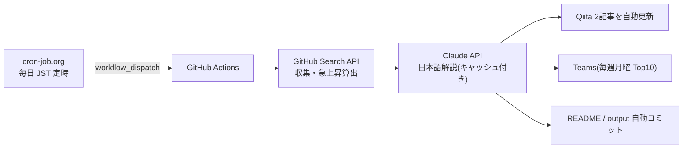

# Claude Code向けMCPツール候補ランキング

GitHub Search APIを使って、Claude Code周辺で活用候補になりそうなMCP関連リポジトリを定期収集するリポジトリです。

> 注意: この一覧は「Claude Codeでの動作」を保証するものではありません。  
> GitHub上のリポジトリ名・説明文・READMEなどに含まれる情報をもとに、MCP関連ツール候補を探すための入口として利用します。

## 仕組み(定常自律運転)

このランキングは cron-job.org → GitHub Actions → Claude API → Qiita / Teams のパイプラインで、毎日無人更新されています。


```mermaid
flowchart LR
    A["cron-job.org<br>毎日 JST 定時"] -->|workflow_dispatch| B["GitHub Actions"]
    B --> C["GitHub Search API<br>収集・急上昇算出"]
    C --> D["Claude API<br>日本語解説(キャッシュ付き)"]
    D --> E["Qiita 2記事を自動更新"]
    D --> F["Teams(毎週月曜 Top10)"]
    D --> G["README / output 自動コミット"]
```

- 仕組みの詳細と**ライブ稼働ステータス**: [定常自律運転ページ](https://takanobusano.github.io/mcp-github-ranking/)
- 作り方の解説記事: [パイプライン編](https://qiita.com/4q_sano/items/913e93ee5cc2731561fc) / [cron-job.org 完全自動化編](https://qiita.com/4q_sano/items/1bc5e0669a8f0166936c)
<!-- MCP_REPOS_START -->
最終更新: **2026-09-05 08:17:14 JST**

MCP関連リポジトリに加え、Claude Code周辺で活用候補になりそうな関連ツールをGitHub Search APIで毎日自動収集してランキング化しています。

Stars / Forks の差分は、UTC基準の前日データ（2026-09-03）との差分です。
CSVには最大500件を保存し、本文では上位100件を表示しています。

> 注意: この一覧はClaude Codeでの動作を保証するものではありません。  
> MCP関連ツールまたはClaude Code関連ツール候補を探すための入口として利用してください。

# 注目MCP・関連ツール候補ランキング

## 1位 [public-apis/public-apis](https://github.com/public-apis/public-apis)

A collective list of free APIs

⭐ **475,314 Stars**（+364）　🍴 **52,513 Forks**（+40）　/　🟢 **1,897 Open Issues**　/　Python

Topics: `api` / `apis` / `dataset` / `development` / `free` / `list` / `lists` / `open-source`

## 2位 [obra/superpowers](https://github.com/obra/superpowers)

An agentic skills framework & software development methodology that works.

⭐ **281,795 Stars**（+478）　🍴 **25,238 Forks**（+36）　/　🟢 **332 Open Issues**　/　Shell

Topics: `ai` / `brainstorming` / `coding` / `obra` / `sdlc` / `skills` / `subagent-driven-development` / `superpowers`

## 3位 [mattpocock/skills](https://github.com/mattpocock/skills)

Skills for Real Engineers. Straight from my .agents directory.

⭐ **250,286 Stars**（+2,999）　🍴 **21,151 Forks**（+186）　/　🟢 **464 Open Issues**　/　Shell

Topics: `topicなし`

## 4位 [affaan-m/ECC](https://github.com/affaan-m/ECC)

The agent harness performance optimization system. Skills, instincts, memory, security, and research-first development for Claude Code, Codex, Opencode, Cursor and beyond.

⭐ **248,468 Stars**（+1,340）　🍴 **37,444 Forks**（+206）　/　🟢 **143 Open Issues**　/　JavaScript

Topics: `ai-agents` / `anthropic` / `claude` / `claude-code` / `developer-tools` / `llm` / `mcp` / `productivity`

## 5位 [NousResearch/hermes-agent](https://github.com/NousResearch/hermes-agent)

The agent that grows with you

⭐ **241,462 Stars**（+647）　🍴 **49,549 Forks**（+212）　/　🟢 **39,685 Open Issues**　/　Python

Topics: `ai` / `ai-agent` / `ai-agents` / `anthropic` / `chatgpt` / `claude` / `claude-code` / `codex`

## 6位 [multica-ai/andrej-karpathy-skills](https://github.com/multica-ai/andrej-karpathy-skills)

A single CLAUDE.md file to improve Claude Code behavior, derived from Andrej Karpathy's observations on LLM coding pitfalls.

⭐ **210,161 Stars**（+260）　🍴 **21,368 Forks**（+26）　/　🟢 **129 Open Issues**　/　不明

Topics: `topicなし`

## 7位 [ultraworkers/claw-code](https://github.com/ultraworkers/claw-code)

An agent-managed museum exhibit, built in Rust with Gajae-Code / LazyCodex — developed and maintained with no human intervention.

⭐ **195,165 Stars**（+1）　🍴 **108,710 Forks**（-28）　/　🟢 **41 Open Issues**　/　Rust

Topics: `topicなし`

## 8位 [ollama/ollama](https://github.com/ollama/ollama)

Get up and running with Kimi-K2.6, GLM-5.2, MiniMax, DeepSeek, gpt-oss, Qwen, Gemma and other models.

⭐ **180,161 Stars**（+86）　🍴 **17,694 Forks**（+24）　/　🟢 **3,903 Open Issues**　/　Go

Topics: `deepseek` / `gemma` / `gemma3` / `glm` / `go` / `golang` / `gpt-oss` / `llama`

## 9位 [firecrawl/firecrawl](https://github.com/firecrawl/firecrawl)

The context API to search, scrape, and interact with the web at scale. 🔥

⭐ **176,511 Stars**（+370）　🍴 **9,658 Forks**（+17）　/　🟢 **596 Open Issues**　/　TypeScript

Topics: `ai` / `ai-agents` / `ai-crawler` / `ai-scraping` / `ai-search` / `crawler` / `data-extraction` / `html-to-markdown`

## 10位 [anthropics/skills](https://github.com/anthropics/skills)

Public repository for Agent Skills

⭐ **174,114 Stars**（+483）　🍴 **20,639 Forks**（+38）　/　🟢 **1,208 Open Issues**　/　Python

Topics: `agent-skills`

## 11位 [langflow-ai/langflow](https://github.com/langflow-ai/langflow)

Langflow is a powerful tool for building and deploying AI-powered agents and workflows.

⭐ **154,259 Stars**（+42）　🍴 **10,023 Forks**（+9）　/　🟢 **1,031 Open Issues**　/　Python

Topics: `agents` / `chatgpt` / `generative-ai` / `large-language-models` / `multiagent` / `react-flow`

## 12位 [msitarzewski/agency-agents](https://github.com/msitarzewski/agency-agents)

A complete AI agency at your fingertips - From frontend wizards to Reddit community ninjas, from whimsy injectors to reality checkers. Each agent is a specialized expert with personality, processes, and proven deliverables.

⭐ **150,083 Stars**（+179）　🍴 **24,175 Forks**（+23）　/　🟢 **147 Open Issues**　/　Shell

Topics: `topicなし`

## 13位 [anthropics/claude-code](https://github.com/anthropics/claude-code)

Claude Code is an agentic coding tool that lives in your terminal, understands your codebase, and helps you code faster by executing routine tasks, explaining complex code, and handling git workflows - all through natural language commands.

⭐ **144,088 Stars**（+137）　🍴 **23,017 Forks**（+12）　/　🟢 **14,098 Open Issues**　/　Python

Topics: `topicなし`

## 14位 [x1xhlol/system-prompts-and-models-of-ai-tools](https://github.com/x1xhlol/system-prompts-and-models-of-ai-tools)

FULL Augment Code, Claude Code, Cluely, CodeBuddy, Comet, Cursor, Devin AI, Junie, Kiro, Leap.new, Lovable, Manus, NotionAI, Orchids.app, Perplexity, Poke, Qoder, Replit, Same.dev, Trae, Traycer AI, VSCode Agent, Warp.dev, Windsurf, Xcode, Z.ai Code, Dia & v0. (And other Open Sourced) System Prompts, Internal Tools & AI Models

⭐ **143,359 Stars**（+30）　🍴 **34,825 Forks**（-4）　/　🟢 **161 Open Issues**　/　不明

Topics: `ai` / `bolt` / `cluely` / `copilot` / `cursor` / `cursorai` / `devin` / `github-copilot`

## 15位 [garrytan/gstack](https://github.com/garrytan/gstack)

Use Garry Tan's exact Claude Code setup: 23 opinionated tools that serve as CEO, Designer, Eng Manager, Release Manager, Doc Engineer, and QA

⭐ **131,367 Stars**（+196）　🍴 **19,710 Forks**（+14）　/　🟢 **848 Open Issues**　/　TypeScript

Topics: `topicなし`

## 16位 [farion1231/cc-switch](https://github.com/farion1231/cc-switch)

A cross-platform desktop All-in-One assistant for Claude Code, Codex, OpenCode, OpenClaw, Grok Build & Hermes Agent. Only official website: ccswitch.io

⭐ **131,082 Stars**（+142）　🍴 **9,015 Forks**（+16）　/　🟢 **2,587 Open Issues**　/　Rust

Topics: `ai-tools` / `claude-code` / `codex` / `desktop-app` / `grok` / `grokbuild` / `hermes` / `hermes-agent`

## 17位 [DietrichGebert/ponytail](https://github.com/DietrichGebert/ponytail)

Makes your AI agent think like the laziest senior dev in the room. The best code is the code you never wrote.

⭐ **125,880 Stars**（+2,536）　🍴 **6,761 Forks**（+96）　/　🟢 **210 Open Issues**　/　JavaScript

Topics: `agent-skills` / `ai-agents` / `claude` / `claude-code` / `claude-code-plugin` / `cursor-rules` / `developer-tools` / `llm`

## 18位 [nextlevelbuilder/ui-ux-pro-max-skill](https://github.com/nextlevelbuilder/ui-ux-pro-max-skill)

An AI skill that provides design intelligence for building professional UI/UX across multiple platforms.

⭐ **125,026 Stars**（+351）　🍴 **13,393 Forks**（+51）　/　🟢 **87 Open Issues**　/　Python

Topics: `ai-skills` / `antigravity` / `claude` / `claude-code` / `codex` / `command-line` / `copilot` / `cursor-ai`

## 19位 [harry0703/MoneyPrinterTurbo](https://github.com/harry0703/MoneyPrinterTurbo)

利用 AI 大模型和自动化工作流，根据主题或关键词一键生成高清短视频。Generate HD short videos from a topic or keyword with an automated AI workflow.

⭐ **120,581 Stars**（+350）　🍴 **18,496 Forks**（+70）　/　🟢 **19 Open Issues**　/　Python

Topics: `ai-video-generator` / `content-creation` / `ffmpeg` / `instagram-reels` / `llm` / `python` / `short-video` / `subtitles`

## 20位 [Graphify-Labs/graphify](https://github.com/Graphify-Labs/graphify)

Turn any codebase, with its docs, SQL schemas, configs, and PDFs, into a queryable knowledge graph. A /graphify skill for Claude Code, Cursor, Codex, and Gemini CLI: local deterministic AST parsing, every edge explained, no vector store.

⭐ **114,756 Stars**（+350）　🍴 **11,143 Forks**（+29）　/　🟢 **1,258 Open Issues**　/　Python

Topics: `ai-agents` / `antigravity` / `ast` / `claude-code` / `code-analysis` / `code-search` / `codex` / `cursor`

## 21位 [browser-use/browser-use](https://github.com/browser-use/browser-use)

🌐 Make websites accessible for AI agents. Automate tasks online with ease.

⭐ **112,288 Stars**（+97）　🍴 **12,354 Forks**（+15）　/　🟢 **394 Open Issues**　/　Python

Topics: `ai-agents` / `ai-tools` / `browser-automation` / `browser-use` / `llm` / `playwright` / `python`

## 22位 [google-gemini/gemini-cli](https://github.com/google-gemini/gemini-cli)

An open-source AI agent that brings the power of Gemini directly into your terminal.

⭐ **106,815 Stars**（+12）　🍴 **14,528 Forks**（+2）　/　🟢 **860 Open Issues**　/　TypeScript

Topics: `ai` / `ai-agents` / `cli` / `gemini` / `gemini-api` / `mcp-client` / `mcp-server`

## 23位 [JuliusBrussee/caveman](https://github.com/JuliusBrussee/caveman)

🪨 why use many token when few token do trick — Claude Code skill that cuts 65% of tokens by talking like caveman

⭐ **103,559 Stars**（+485）　🍴 **6,007 Forks**（+13）　/　🟢 **107 Open Issues**　/　Go

Topics: `ai` / `anthropic` / `caveman` / `claude` / `claude-code` / `llm` / `meme` / `prompt-engineering`

## 24位 [TauricResearch/TradingAgents](https://github.com/TauricResearch/TradingAgents)

TradingAgents: Multi-Agents LLM Financial Trading Framework

⭐ **102,507 Stars**（+87）　🍴 **19,734 Forks**（+18）　/　🟢 **360 Open Issues**　/　Python

Topics: `agent` / `finance` / `llm` / `multiagent` / `trading`

## 25位 [microsoft/playwright](https://github.com/microsoft/playwright)

Playwright is a framework for Web Testing and Automation. It allows testing Chromium, Firefox and WebKit with a single API.

⭐ **95,640 Stars**（+54）　🍴 **6,385 Forks**（+2）　/　🟢 **177 Open Issues**　/　TypeScript

Topics: `automation` / `chrome` / `chromium` / `e2e-testing` / `electron` / `end-to-end-testing` / `firefox` / `javascript`

## 26位 [puppeteer/puppeteer](https://github.com/puppeteer/puppeteer)

JavaScript API for Chrome and Firefox

⭐ **95,545 Stars**（+7）　🍴 **9,578 Forks**（+3）　/　🟢 **259 Open Issues**　/　TypeScript

Topics: `automation` / `chrome` / `chromium` / `developer-tools` / `firefox` / `headless-chrome` / `node-module` / `testing`

## 27位 [nexu-io/open-design](https://github.com/nexu-io/open-design)

🎨 Best DeepSeek Harness Design Plugin. The open-source Claude Design alternative. 🖥️ Local-first desktop app. 🖼️ Your coding agent becomes the design engine: pr...

⭐ **94,082 Stars**（+202）　🍴 **10,862 Forks**（+37）　/　🟢 **939 Open Issues**　/　TypeScript

Topics: `agent-skills` / `ai-design` / `byok` / `claude-code-for-design` / `claude-design` / `codex-design` / `coding-agents` / `cursor-design`

## 28位 [thedotmack/claude-mem](https://github.com/thedotmack/claude-mem)

Persistent Context Across Sessions for Every Agent –  Captures everything your agent does during sessions, compresses it with AI, and injects relevant context back into future sessions. Works with Claude Code, OpenClaw, Codex, Gemini, Hermes, Copilot, OpenCode + More

⭐ **93,198 Stars**（+94）　🍴 **8,189 Forks**（+8）　/　🟢 **318 Open Issues**　/　JavaScript

Topics: `ai` / `ai-agents` / `ai-memory` / `anthropic` / `artificial-intelligence` / `chromadb` / `claude` / `claude-agent-sdk`

## 29位 [addyosmani/agent-skills](https://github.com/addyosmani/agent-skills)

Production-grade engineering skills for AI coding agents.

⭐ **92,272 Stars**（+254）　🍴 **9,834 Forks**（+24）　/　🟢 **130 Open Issues**　/　JavaScript

Topics: `agent-skills` / `antigravity` / `claude-code` / `codex` / `cursor` / `skills`

## 30位 [modelcontextprotocol/servers](https://github.com/modelcontextprotocol/servers)

Model Context Protocol Servers

⭐ **90,081 Stars**（+20）　🍴 **11,558 Forks**（+6）　/　🟢 **484 Open Issues**　/　TypeScript

Topics: `topicなし`

## 31位 [ChatGPTNextWeb/NextChat](https://github.com/ChatGPTNextWeb/NextChat)

✨ Zero-config AI chat assistant. No API key needed — sign up and instantly chat with GPT-5, Claude 4, Gemini 2.5, DeepSeek & 100+ top models. Pay-as-you-go save...

⭐ **88,710 Stars**（+13）　🍴 **59,133 Forks**（-7）　/　🟢 **857 Open Issues**　/　TypeScript

Topics: `calclaude` / `chatgpt` / `claude` / `cross-platform` / `desktop` / `fe` / `gemini` / `gemini-pro`

## 32位 [OpenCut-app/OpenCut](https://github.com/OpenCut-app/OpenCut)

The open-source CapCut alternative

⭐ **88,679 Stars**（+76）　🍴 **8,743 Forks**（+4）　/　🟢 **378 Open Issues**　/　TypeScript

Topics: `editor` / `oss` / `videoeditor`

## 33位 [OpenHands/OpenHands](https://github.com/OpenHands/OpenHands)

🙌 OpenHands: AI-Driven Development

⭐ **86,182 Stars**（+84）　🍴 **11,305 Forks**（+15）　/　🟢 **650 Open Issues**　/　TypeScript

Topics: `agent` / `artificial-intelligence` / `chatgpt` / `claude-ai` / `cli` / `developer-tools` / `gpt` / `llm`

## 34位 [koala73/worldmonitor](https://github.com/koala73/worldmonitor)

Real-time global intelligence dashboard. AI-powered news aggregation, geopolitical monitoring, and infrastructure tracking in a unified situational awareness interface

⭐ **85,569 Stars**（+84）　🍴 **12,916 Forks**（+27）　/　🟢 **299 Open Issues**　/　TypeScript

Topics: `agent` / `ai` / `dashboard` / `geopolitics` / `mcp` / `mcp-server` / `monitoring` / `news`

## 35位 [laravel/laravel](https://github.com/laravel/laravel)

Laravel is a web application framework with expressive, elegant syntax. We’ve already laid the foundation for your next big idea — freeing you to create without sweating the small things.

⭐ **84,934 Stars**（+6）　🍴 **24,890 Forks**（-3）　/　🟢 **31 Open Issues**　/　Blade

Topics: `framework` / `laravel` / `php`

## 36位 [Leonxlnx/taste-skill](https://github.com/Leonxlnx/taste-skill)

Taste-Skill - gives your AI good taste. stops the AI from generating boring, generic slop

⭐ **84,347 Stars**（+304）　🍴 **5,772 Forks**（+27）　/　🟢 **60 Open Issues**　/　JavaScript

Topics: `agent` / `ai` / `claude` / `claude-code` / `codex` / `coding` / `design` / `frontend`

## 37位 [lobehub/lobehub](https://github.com/lobehub/lobehub)

🤯 LobeHub is your Chief Agent Operator, organizing your agents into 7×24 operations by hiring, scheduling, and reporting on your entire AI team.

⭐ **82,241 Stars**（+35）　🍴 **15,855 Forks**（-1）　/　🟢 **879 Open Issues**　/　TypeScript

Topics: `agent` / `agent-collaboration` / `agent-harness` / `ai` / `cao` / `chatgpt` / `chief-agent-operator` / `claude`

## 38位 [Egonex-AI/Understand-Anything](https://github.com/Egonex-AI/Understand-Anything)

Graphs that teach > graphs that impress. Turn any code into an interactive knowledge graph you can explore, search, and ask questions about. Works with Claude Code, Codex, Cursor, Copilot, Gemini CLI, and more.

⭐ **81,500 Stars**（+100）　🍴 **6,854 Forks**（+11）　/　🟢 **302 Open Issues**　/　TypeScript

Topics: `antigravity-skills` / `business-knowledge` / `claude-code` / `claude-skills` / `codebase-analysis` / `codex` / `codex-skills` / `developer-tools-ai-agent`

## 39位 [bytedance/deer-flow](https://github.com/bytedance/deer-flow)

An open-source long-horizon SuperAgent harness that researches, codes, and creates. With the help of sandboxes, memories, tools, skill, subagents and message gateway, it handles different levels of tasks that could take minutes to hours.

⭐ **81,367 Stars**（+47）　🍴 **11,223 Forks**（+13）　/　🟢 **874 Open Issues**　/　Python

Topics: `agent` / `agentic` / `agentic-framework` / `agentic-workflow` / `ai` / `ai-agents` / `deep-research` / `harness`

## 40位 [unclecode/crawl4ai](https://github.com/unclecode/crawl4ai)

🚀🤖 Crawl4AI: Open-source LLM Friendly Web Crawler & Scraper. Don't be shy, join here:

⭐ **81,296 Stars**（+87）　🍴 **8,379 Forks**（+6）　/　🟢 **172 Open Issues**　/　Python

Topics: `topicなし`

## 41位 [paperclipai/paperclip](https://github.com/paperclipai/paperclip)

The open-source app everyone uses to manage agents at work

⭐ **80,019 Stars**（+59）　🍴 **14,690 Forks**（+10）　/　🟢 **5,326 Open Issues**　/　TypeScript

Topics: `topicなし`

## 42位 [opendatalab/MinerU](https://github.com/opendatalab/MinerU)

Transforms complex documents like PDFs and Office docs into LLM-ready markdown/JSON for your Agentic workflows.

⭐ **79,165 Stars**（+66）　🍴 **6,632 Forks**（+4）　/　🟢 **106 Open Issues**　/　Python

Topics: `ai4science` / `document-analysis` / `docx` / `extract-data` / `layout-analysis` / `ocr` / `parser` / `pdf`

## 43位 [rtk-ai/rtk](https://github.com/rtk-ai/rtk)

CLI proxy that reduces LLM token consumption by 60-90% on common dev commands. Single Rust binary, zero dependencies

⭐ **78,592 Stars**（+133）　🍴 **4,966 Forks**（+5）　/　🟢 **2,088 Open Issues**　/　Rust

Topics: `agentic-coding` / `ai-coding` / `anthropic` / `claude-code` / `cli` / `command-line-tool` / `cost-reduction` / `developer-tools`

## 44位 [D4Vinci/Scrapling](https://github.com/D4Vinci/Scrapling)

🕷️ An adaptive Web Scraping framework that handles everything from a single request to a full-scale crawl!

⭐ **78,431 Stars**（+154）　🍴 **7,892 Forks**（+21）　/　🟢 **13 Open Issues**　/　Python

Topics: `ai` / `ai-scraping` / `automation` / `crawler` / `crawling` / `crawling-python` / `data` / `data-extraction`

## 45位 [Panniantong/Agent-Reach](https://github.com/Panniantong/Agent-Reach)

Give your AI agent eyes to see the entire internet. Read & search Twitter, Reddit, YouTube, GitHub, Bilibili, XiaoHongShu — one CLI, zero API fees.

⭐ **78,026 Stars**（+220）　🍴 **6,720 Forks**（+42）　/　🟢 **122 Open Issues**　/　Python

Topics: `agent-infrastructure` / `ai-agent` / `ai-search` / `automation` / `bilibili` / `claude-code` / `cli` / `cursor`

## 46位 [abi/screenshot-to-code](https://github.com/abi/screenshot-to-code)

Drop in a screenshot and convert it to clean code (HTML/Tailwind/React/Vue)

⭐ **77,679 Stars**（+263）　🍴 **9,454 Forks**（+23）　/　🟢 **141 Open Issues**　/　Python

Topics: `topicなし`

## 47位 [shareAI-lab/learn-claude-code](https://github.com/shareAI-lab/learn-claude-code)

Bash is all you need -  A nano claude code–like 「agent harness」, built from 0 to 1

⭐ **76,065 Stars**（+73）　🍴 **12,251 Forks**（+16）　/　🟢 **34 Open Issues**　/　Python

Topics: `agent` / `agent-development` / `ai-agent` / `claude` / `claude-code` / `educational` / `llm` / `python`

## 48位 [unslothai/unsloth](https://github.com/unslothai/unsloth)

Local UI to run and train LLMs and diffusion models. Supports GGUF, MLX, Qwen3.8, DeepSeek-V4, MiniMax-H3, Gemma 4, FLUX and more.

⭐ **75,625 Stars**（+58）　🍴 **6,872 Forks**（+9）　/　🟢 **1,416 Open Issues**　/　Python

Topics: `agent` / `ai` / `chatgpt` / `deepseek` / `fine-tuning` / `gemma` / `image-generation` / `llama`

## 49位 [Eugeny/tabby](https://github.com/Eugeny/tabby)

A terminal for a more modern age

⭐ **74,328 Stars**（+21）　🍴 **4,236 Forks**（+2）　/　🟢 **2,876 Open Issues**　/　TypeScript

Topics: `serial` / `ssh-client` / `telnet-client` / `terminal` / `terminal-emulators`

## 50位 [thedaviddias/Front-End-Checklist](https://github.com/thedaviddias/Front-End-Checklist)

🗂 The essential checklist for modern web development, for humans and AI agents

⭐ **74,035 Stars**（+10）　🍴 **6,729 Forks**（-1）　/　🟢 **7 Open Issues**　/　MDX

Topics: `ai-agent` / `ai-agents` / `checklist` / `css` / `front-end-developer-tool` / `front-end-development` / `frontend` / `guidelines`

## 51位 [OpenBB-finance/OpenBB](https://github.com/OpenBB-finance/OpenBB)

Open Data Platform for analysts, quants and AI agents.

⭐ **72,672 Stars**（+25）　🍴 **7,506 Forks**（+6）　/　🟢 **115 Open Issues**　/　Python

Topics: `ai` / `crypto` / `derivatives` / `economics` / `equity` / `finance` / `fixed-income` / `machine-learning`

## 52位 [daytonaio/daytona](https://github.com/daytonaio/daytona)

Daytona is a Secure and Elastic Infrastructure for Running AI-Generated Code

⭐ **71,803 Stars**（-16）　🍴 **5,647 Forks**（-2）　/　🟢 **453 Open Issues**　/　不明

Topics: `agentic-workflow` / `ai` / `ai-agents` / `ai-runtime` / `ai-sandboxes` / `code-execution` / `code-interpreter` / `developer-tools`

## 53位 [ruvnet/ruflo](https://github.com/ruvnet/ruflo)

🌊 The original agent meta-harness. Deploy intelligent multi-player swarms, coordinate autonomous workflows, and build conversational AI systems. Features adapti...

⭐ **70,491 Stars**（+141）　🍴 **8,401 Forks**（+19）　/　🟢 **908 Open Issues**　/　TypeScript

Topics: `agentic-ai` / `agentic-framework` / `agentic-workflow` / `agents` / `ai-agents` / `ai-assistant` / `ai-skills` / `autonomous-agents`

## 54位 [colbymchenry/codegraph](https://github.com/colbymchenry/codegraph)

Pre-indexed code knowledge graph, auto syncs on code changes, for Claude Code, Codex, Gemini, Cursor, OpenCode, AntiGravity, Kiro, CoPilot, and Hermes Agent — fewer tokens, fewer tool calls, 100% local

⭐ **69,631 Stars**（+168）　🍴 **4,445 Forks**（+15）　/　🟢 **479 Open Issues**　/　C

Topics: `topicなし`

## 55位 [headroomlabs-ai/headroom](https://github.com/headroomlabs-ai/headroom)

Compress tool outputs, logs, files, and RAG chunks before they reach the LLM. 20% fewer tokens for coding agents, 60-95% fewer tokens for JSON, same answers. Library, proxy, MCP server.

⭐ **68,944 Stars**（+132）　🍴 **5,344 Forks**（+12）　/　🟢 **636 Open Issues**　/　Python

Topics: `agent` / `ai` / `anthropic` / `claude-code` / `compression` / `context-engineering` / `context-window` / `cursor`

## 56位 [code-yeongyu/oh-my-openagent](https://github.com/code-yeongyu/oh-my-openagent)

OmO: Drop your tokens. Ultrawork. Done.

⭐ **68,698 Stars**（+36）　🍴 **5,640 Forks**（+1）　/　🟢 **920 Open Issues**　/　TypeScript

Topics: `ai` / `ai-agents` / `anthropic` / `chatgpt` / `claude` / `claude-skills` / `codex` / `cursor`

## 57位 [openinterpreter/openinterpreter](https://github.com/openinterpreter/openinterpreter)

A coding agent for open models like Kimi K3

⭐ **68,240 Stars**（+10）　🍴 **5,875 Forks**（+2）　/　🟢 **11 Open Issues**　/　Rust

Topics: `acp` / `coding-agent` / `deepseek` / `kimi` / `qwen` / `rust`

## 58位 [cline/cline](https://github.com/cline/cline)

Autonomous coding agent as an SDK, IDE extension, or CLI assistant.

⭐ **67,481 Stars**（+52）　🍴 **7,282 Forks**（+3）　/　🟢 **1,228 Open Issues**　/　TypeScript

Topics: `topicなし`

## 59位 [Fission-AI/OpenSpec](https://github.com/Fission-AI/OpenSpec)

Spec-driven development (SDD) for AI coding assistants.

⭐ **67,318 Stars**（+139）　🍴 **4,629 Forks**（+8）　/　🟢 **217 Open Issues**　/　TypeScript

Topics: `ai` / `context-engineering` / `engineering` / `planning` / `prd` / `sdd` / `sdlc` / `spec`

## 60位 [bradtraversy/design-resources-for-developers](https://github.com/bradtraversy/design-resources-for-developers)

Curated list of design and UI resources from stock photos, web templates, CSS frameworks, UI libraries, tools and much more

⭐ **66,831 Stars**（+9）　🍴 **12,171 Forks**（±0）　/　🟢 **112 Open Issues**　/　不明

Topics: `topicなし`

## 61位 [xtekky/gpt4free](https://github.com/xtekky/gpt4free)

The official gpt4free repository \| various collection of powerful language models \| opus 4.6 gpt 5.3 kimi 2.5 deepseek v3.2 gemini 3

⭐ **66,639 Stars**（±0）　🍴 **13,508 Forks**（-1）　/　🟢 **2 Open Issues**　/　Python

Topics: `chatbot` / `chatbots` / `chatgpt` / `chatgpt-4` / `chatgpt-api` / `chatgpt-free` / `chatgpt4` / `deepseek`

## 62位 [docling-project/docling](https://github.com/docling-project/docling)

Get your documents ready for gen AI

⭐ **66,006 Stars**（+47）　🍴 **4,753 Forks**（+9）　/　🟢 **889 Open Issues**　/　Python

Topics: `ai` / `convert` / `document-parser` / `document-parsing` / `documents` / `docx` / `html` / `markdown`

## 63位 [shanraisshan/claude-code-best-practice](https://github.com/shanraisshan/claude-code-best-practice)

from vibe coding to agentic engineering - practice makes claude perfect

⭐ **65,614 Stars**（+25）　🍴 **6,530 Forks**（+3）　/　🟢 **20 Open Issues**　/　HTML

Topics: `agentic-ai` / `agentic-coding` / `agentic-engineering` / `agentic-workflow` / `ai` / `ai-agents` / `anthropic` / `best-practices`

## 64位 [pbakaus/impeccable](https://github.com/pbakaus/impeccable)

The design language that makes your AI harness better at design.

⭐ **65,608 Stars**（+276）　🍴 **4,036 Forks**（+17）　/　🟢 **22 Open Issues**　/　JavaScript

Topics: `topicなし`

## 65位 [warpdotdev/warp](https://github.com/warpdotdev/warp)

Warp is an agentic development environment, born out of the terminal.

⭐ **64,802 Stars**（+18）　🍴 **5,506 Forks**（+1）　/　🟢 **5,199 Open Issues**　/　Rust

Topics: `bash` / `linux` / `macos` / `rust` / `shell` / `terminal` / `wasm` / `zsh`

## 66位 [mem0ai/mem0](https://github.com/mem0ai/mem0)

The Memory Layer for AI Agents - Drop-in memory infrastructure for AI agents and apps. Context that persists. Built for production.

⭐ **64,709 Stars**（+44）　🍴 **7,578 Forks**（+3）　/　🟢 **726 Open Issues**　/　Python

Topics: `agentic-memory` / `agentic-memory-system` / `agents` / `ai` / `ai-agents` / `chatgpt` / `genai` / `llm`

## 67位 [NanmiCoder/MediaCrawler](https://github.com/NanmiCoder/MediaCrawler)

小红书笔记 \| 评论爬虫、抖音视频 \| 评论爬虫、快手视频 \| 评论爬虫、B 站视频 ｜ 评论爬虫、微博帖子 ｜ 评论爬虫、百度贴吧帖子 ｜ 百度贴吧评论回复爬虫  \| 知乎问答文章｜评论爬虫

⭐ **64,433 Stars**（+66）　🍴 **12,509 Forks**（+7）　/　🟢 **192 Open Issues**　/　Python

Topics: `topicなし`

## 68位 [asgeirtj/system_prompts_leaks](https://github.com/asgeirtj/system_prompts_leaks)

Extracted system prompts from Anthropic - Claude Fable 5, Opus 5, Claude Design, Claude Code. OpenAI - ChatGPT GPT-5.6-Sol, Codex. Google - Gemini 3.5 Flash, 3.1 Pro, Antigravity. xAI - Grok, Cursor, Copilot, VS Code, Perplexity, and more. Updated regularly.

⭐ **64,176 Stars**（+57）　🍴 **10,529 Forks**（+8）　/　🟢 **51 Open Issues**　/　JavaScript

Topics: `ai` / `ai-agents` / `ai-prompts` / `anthropic` / `chatbot` / `chatgpt` / `claude` / `claude-code`

## 69位 [sansan0/TrendRadar](https://github.com/sansan0/TrendRadar)

⭐AI-driven public opinion & trend monitor with multi-platform aggregation, RSS, and smart alerts.🎯 告别信息过载，你的 AI 舆情监控助手与热点筛选工具！聚合多平台热点 +  RSS 订阅，支持关键词精准筛选。AI 智能筛...

⭐ **62,037 Stars**（+17）　🍴 **24,887 Forks**（+9）　/　🟢 **57 Open Issues**　/　Python

Topics: `ai` / `bark` / `data-analysis` / `docker` / `hot-news` / `llm` / `mail` / `mcp`

## 70位 [stablyai/orca](https://github.com/stablyai/orca)

Orca is the ADE for working with a fleet of parallel agents. Run any coding agent with your own subscription. Available on desktop, mobile and VPS.

⭐ **61,710 Stars**（+787）　🍴 **4,131 Forks**（+39）　/　🟢 **5,271 Open Issues**　/　TypeScript

Topics: `ade` / `agent-ide` / `ai-agents` / `claude-code` / `cli` / `codex` / `cursor-agent` / `devtools`

## 71位 [upstash/context7](https://github.com/upstash/context7)

Context7 Platform -- Up-to-date code documentation for LLMs and AI code editors

⭐ **61,628 Stars**（+38）　🍴 **2,971 Forks**（+4）　/　🟢 **69 Open Issues**　/　TypeScript

Topics: `llm` / `mcp` / `mcp-server` / `vibe-coding`

## 72位 [coollabsio/coolify](https://github.com/coollabsio/coolify)

An open-source, self-hostable PaaS alternative to Vercel, Heroku & Netlify that lets you easily deploy static sites, databases, full-stack applications and 280+ one-click services on your own servers.

⭐ **61,418 Stars**（+51）　🍴 **5,408 Forks**（+6）　/　🟢 **665 Open Issues**　/　PHP

Topics: `coolify` / `databases` / `deployment` / `docker` / `docker-compose` / `inertiajs` / `laravel` / `mariadb`

## 73位 [tw93/Pake](https://github.com/tw93/Pake)

🤱🏻 Turn any webpage into a desktop app with one command.

⭐ **61,284 Stars**（+18）　🍴 **12,606 Forks**（+2）　/　🟢 **2 Open Issues**　/　Rust

Topics: `chatgpt` / `claude` / `desktop` / `gemini` / `hight-performance` / `linux` / `macos` / `no-electron`

## 74位 [mvanhorn/last30days-skill](https://github.com/mvanhorn/last30days-skill)

AI agent skill that researches any topic across Reddit, X, YouTube, HN, Polymarket, and the web - then synthesizes a grounded summary

⭐ **61,251 Stars**（+100）　🍴 **5,349 Forks**（+8）　/　🟢 **171 Open Issues**　/　Python

Topics: `ai-prompts` / `ai-skill` / `bluesky` / `claude` / `claude-code` / `clawhub` / `deep-research` / `hackernews`

## 75位 [diegosouzapw/OmniRoute](https://github.com/diegosouzapw/OmniRoute)

Never stop coding. Free MIT AI gateway: one endpoint, 352 providers (150+ free), 1200+ models Kimi, Claude, GPT, Gemini, GLM, DeepSeek, MiniMax. Works with Claude Code, Codex, Cursor, OpenCode, Cline & Copilot. Quota-aware auto-fallback, RTK+Caveman compression saves 15-95% tokens, MCP/A2A, Desktop/PWA. Built by 550+ contributors

⭐ **61,248 Stars**（+369）　🍴 **8,527 Forks**（+75）　/　🟢 **328 Open Issues**　/　TypeScript

Topics: `a2a` / `ai-agents` / `ai-gateway` / `anthropic` / `claude` / `claude-code` / `cline` / `codex`

## 76位 [1c7/chinese-independent-developer](https://github.com/1c7/chinese-independent-developer)

👩🏿‍💻👨🏾‍💻👩🏼‍💻👨🏽‍💻👩🏻‍💻中国独立开发者项目列表 -- 分享大家都在做什么

⭐ **61,244 Stars**（+9）　🍴 **5,359 Forks**（±0）　/　🟢 **3 Open Issues**　/　Python

Topics: `china` / `indie` / `indie-developer`

## 77位 [microsoft/autogen](https://github.com/microsoft/autogen)

A programming framework for agentic AI

⭐ **60,800 Stars**（+10）　🍴 **9,179 Forks**（+1）　/　🟢 **1,046 Open Issues**　/　Python

Topics: `agentic` / `agentic-agi` / `agents` / `ai` / `autogen` / `autogen-ecosystem` / `chatgpt` / `framework`

## 78位 [usestrix/strix](https://github.com/usestrix/strix)

Open-source AI penetration testing tool to find and fix your app’s vulnerabilities.

⭐ **60,577 Stars**（+187）　🍴 **6,625 Forks**（+24）　/　🟢 **364 Open Issues**　/　Python

Topics: `agents` / `ai-hacking` / `ai-penetration-testing` / `ai-pentesting` / `ai-security` / `artificial-intelligence` / `bug-bounty` / `code-quality`

## 79位 [penpot/penpot](https://github.com/penpot/penpot)

Penpot: The open-source design platform for Product teams that need scalable collaboration.

⭐ **59,586 Stars**（+35）　🍴 **4,054 Forks**（+7）　/　🟢 **777 Open Issues**　/　Clojure

Topics: `clojure` / `clojurescript` / `design` / `prototyping` / `ui` / `ux-design` / `ux-experience`

## 80位 [meilisearch/meilisearch](https://github.com/meilisearch/meilisearch)

A lightning-fast search engine API bringing AI-powered hybrid search to your sites and applications.

⭐ **59,176 Stars**（+2）　🍴 **2,694 Forks**（±0）　/　🟢 **315 Open Issues**　/　Rust

Topics: `ai` / `api` / `app-search` / `database` / `enterprise-search` / `faceting` / `full-text-search` / `fuzzy-search`

## 81位 [MemPalace/mempalace](https://github.com/MemPalace/mempalace)

The best-benchmarked open-source AI memory system. And it's free.

⭐ **58,843 Stars**（+10）　🍴 **7,547 Forks**（-1）　/　🟢 **757 Open Issues**　/　Python

Topics: `ai` / `chromadb` / `llm` / `mcp` / `memory` / `python`

## 82位 [FoundationAgents/OpenManus](https://github.com/FoundationAgents/OpenManus)

No fortress, purely open ground.  OpenManus is Coming.

⭐ **58,185 Stars**（+5）　🍴 **10,098 Forks**（-4）　/　🟢 **464 Open Issues**　/　Python

Topics: `topicなし`

## 83位 [crewAIInc/crewAI](https://github.com/crewAIInc/crewAI)

Framework for orchestrating role-playing, autonomous AI agents. By fostering collaborative intelligence, CrewAI empowers agents to work together seamlessly, tackling complex tasks.

⭐ **58,091 Stars**（+32）　🍴 **8,339 Forks**（+8）　/　🟢 **727 Open Issues**　/　Python

Topics: `agents` / `ai` / `ai-agents` / `aiagentframework` / `llms`

## 84位 [BerriAI/litellm](https://github.com/BerriAI/litellm)

The fastest, litest AI Gateway. Rust core with Python SDK. Call 100+ LLM APIs in OpenAI (or native) format with cost tracking, guardrails, load balancing, and logging [Bedrock, Azure, OpenAI, Anthropic, OpenAI, VertexAI, vLLM, Nvidia NIM]

⭐ **58,052 Stars**（+83）　🍴 **11,176 Forks**（+28）　/　🟢 **4,931 Open Issues**　/　Python

Topics: `ai-gateway` / `anthropic` / `azure-openai` / `bedrock` / `gateway` / `langchain` / `litellm` / `llm`

## 85位 [zylon-ai/private-gpt](https://github.com/zylon-ai/private-gpt)

Complete API layer for private AI applications on local models: RAG, skills, tools, MCP, text-to-sql, and more. Works with any OpenAI-compatible inference server.

⭐ **57,491 Stars**（+3）　🍴 **7,612 Forks**（-1）　/　🟢 **5 Open Issues**　/　Python

Topics: `ai` / `ai-tools` / `on-premise`

## 86位 [calesthio/OpenMontage](https://github.com/calesthio/OpenMontage)

World's first open-source, agentic video production system. 12 production pipelines, 100+ tools, 700+ agent skill and production-knowledge files. Turn your AI coding assistant into a full video production studio.

⭐ **56,148 Stars**（+180）　🍴 **7,022 Forks**（+33）　/　🟢 **305 Open Issues**　/　Python

Topics: `agent` / `agentic-ai` / `ai` / `claude` / `copilot` / `cursor` / `elevenlabs` / `ffmpeg`

## 87位 [aaif-goose/goose](https://github.com/aaif-goose/goose)

an open source, extensible AI agent that goes beyond code suggestions - install, execute, edit, and test with any LLM

⭐ **53,915 Stars**（+25）　🍴 **6,172 Forks**（+11）　/　🟢 **298 Open Issues**　/　Rust

Topics: `acp` / `ai` / `ai-agents` / `mcp`

## 88位 [Alishahryar1/free-claude-code](https://github.com/Alishahryar1/free-claude-code)

Use Claude Code, Codex, Pi, and OpenCode and more for free (1.3B+ free tokens) from your terminal, app, IDE, or phone like OpenClaw (voice supported + ToS friendly)

⭐ **53,135 Stars**（+162）　🍴 **8,537 Forks**（+38）　/　🟢 **369 Open Issues**　/　Python

Topics: `topicなし`

## 89位 [rohitg00/ai-engineering-from-scratch](https://github.com/rohitg00/ai-engineering-from-scratch)

Learn it. Build it. Ship it for others.

⭐ **52,409 Stars**（+139）　🍴 **9,105 Forks**（+53）　/　🟢 **102 Open Issues**　/　Python

Topics: `agents` / `ai` / `ai-agents` / `ai-engineering` / `computer-vision` / `course` / `deep-learning` / `from-scratch`

## 90位 [jamiepine/voicebox](https://github.com/jamiepine/voicebox)

The open-source AI voice studio. Clone, dictate, create.

⭐ **52,325 Stars**（+85）　🍴 **6,519 Forks**（+15）　/　🟢 **671 Open Issues**　/　TypeScript

Topics: `ai` / `cuda` / `mlx` / `qwen3-tts` / `qwen3-tts-ui` / `voice-ai` / `voice-clone` / `whisper`

## 91位 [hugohe3/ppt-master](https://github.com/hugohe3/ppt-master)

AI turns documents or topics into real, native PowerPoint decks—with native shapes, transitions and animations, data-backed charts and tables on demand, audio narration from speaker notes, and support for your own .pptx templates. · by Hugo He

⭐ **52,019 Stars**（+237）　🍴 **4,166 Forks**（+17）　/　🟢 **5 Open Issues**　/　Python

Topics: `ai-agent` / `aippt` / `office` / `powerpoint` / `powerpoint-generation` / `ppt` / `pptx` / `presentation`

## 92位 [charlax/professional-programming](https://github.com/charlax/professional-programming)

A collection of learning resources for curious software engineers

⭐ **51,488 Stars**（+3）　🍴 **4,018 Forks**（+1）　/　🟢 **7 Open Issues**　/　Python

Topics: `architecture` / `computer-science` / `concepts` / `documentation` / `engineer` / `learning` / `lessons-learned` / `professional`

## 93位 [CherryHQ/cherry-studio](https://github.com/CherryHQ/cherry-studio)

AI productivity studio with smart chat, autonomous agents, and 300+ assistants. Unified access to frontier LLMs

⭐ **51,438 Stars**（+32）　🍴 **4,914 Forks**（+5）　/　🟢 **1,478 Open Issues**　/　TypeScript

Topics: `agent-skills` / `ai-agent` / `claude-code` / `codex` / `deepseek` / `deepseek-harness` / `hermes-agent` / `skills`

## 94位 [ChromeDevTools/chrome-devtools-mcp](https://github.com/ChromeDevTools/chrome-devtools-mcp)

Chrome DevTools for coding agents

⭐ **50,929 Stars**（+93）　🍴 **3,572 Forks**（+7）　/　🟢 **92 Open Issues**　/　TypeScript

Topics: `browser` / `chrome` / `chrome-devtools` / `debugging` / `devtools` / `mcp` / `mcp-server` / `puppeteer`

## 95位 [router-for-me/CLIProxyAPI](https://github.com/router-for-me/CLIProxyAPI)

Wrap Antigravity, ChatGPT Codex, Claude Code, Grok Build as an OpenAI/Gemini/Claude/Codex compatible API service, allowing you to enjoy the free Gemini 3.1 Pro, GPT 5.6 Series, Grok 4.5, Claude model through API

⭐ **50,442 Stars**（+269）　🍴 **7,681 Forks**（+25）　/　🟢 **553 Open Issues**　/　Go

Topics: `antigravity` / `claude-code` / `cluade` / `codex` / `gemini` / `openai`

## 96位 [HKUDS/CLI-Anything](https://github.com/HKUDS/CLI-Anything)

"CLI-Anything: Making ALL Software Agent-Native" -- CLI-Hub:

⭐ **48,981 Stars**（+49）　🍴 **4,545 Forks**（+5）　/　🟢 **86 Open Issues**　/　Python

Topics: `topicなし`

## 97位 [multica-ai/multica](https://github.com/multica-ai/multica)

Make humans and AI agents work as one team — open-source and self-hostable.

⭐ **48,891 Stars**（+129）　🍴 **6,312 Forks**（+20）　/　🟢 **1,484 Open Issues**　/　Go

Topics: `topicなし`

## 98位 [mudler/LocalAI](https://github.com/mudler/LocalAI)

LocalAI is the open-source AI engine. Run any model - LLMs, vision, voice, image, video - on any hardware. No GPU required.

⭐ **48,863 Stars**（+16）　🍴 **4,414 Forks**（+2）　/　🟢 **212 Open Issues**　/　Go

Topics: `agents` / `ai` / `api` / `audio-generation` / `decentralized` / `distributed` / `image-generation` / `libp2p`

## 99位 [tt-a1i/archify](https://github.com/tt-a1i/archify)

Agent skill for beautiful, verifiable architecture, workflow, sequence, data-flow, and lifecycle diagrams—self-contained HTML with motion and crisp export.

⭐ **48,017 Stars**（+2,308）　🍴 **3,099 Forks**（+167）　/　🟢 **112 Open Issues**　/　JavaScript

Topics: `agent-skills` / `architecture-as-code` / `architecture-diagram` / `claude-skill` / `code-visualization` / `codex` / `coding-agents` / `data-flow-diagram`

## 100位 [kepano/obsidian-skills](https://github.com/kepano/obsidian-skills)

Agent skills for Obsidian. Teach your agent to use Obsidian CLI and open formats including Markdown, Bases, JSON Canvas.

⭐ **47,865 Stars**（+61）　🍴 **3,425 Forks**（±0）　/　🟢 **68 Open Issues**　/　不明

Topics: `agents` / `agentskills` / `bases` / `claude` / `clawdbot` / `cli` / `codex` / `defuddle`

# 最近プッシュされたMCP・関連ツール候補

スター数ランキングとは別に、最近コードがプッシュされたリポジトリを表示します。古いスター数だけではなく、現在も開発が動いていそうな候補を探すための一覧です。

## プッシュ順 1位 [paperclipai/paperclip](https://github.com/paperclipai/paperclip)

The open-source app everyone uses to manage agents at work

⭐ **80,019 Stars**（+59）　🍴 **14,690 Forks**（+10）　/　TypeScript　/　最終プッシュ: 2026-09-04

Topics: `topicなし`

## プッシュ順 2位 [earthtojake/text-to-cad](https://github.com/earthtojake/text-to-cad)

A library of agent skills for CAD, CAE and CAM

⭐ **14,337 Stars**（+83）　🍴 **1,520 Forks**（+3）　/　Python　/　最終プッシュ: 2026-09-04

Topics: `agents` / `ai-agents` / `cad` / `mechanical-engineering` / `robotics` / `step` / `stl` / `stp`

## プッシュ順 3位 [QwenLM/qwen-code](https://github.com/QwenLM/qwen-code)

An open-source AI coding agent that lives in your terminal.

⭐ **27,657 Stars**（+32）　🍴 **2,989 Forks**（+7）　/　TypeScript　/　最終プッシュ: 2026-09-04

Topics: `agentic` / `ai` / `ai-agent` / `ai-coding` / `cli` / `coding-agent` / `developer-tools` / `llm`

## プッシュ順 4位 [different-ai/openwork](https://github.com/different-ai/openwork)

The open-source alternative to Claude Cowork (powered by opencode)

⭐ **23,332 Stars**（+25）　🍴 **2,327 Forks**（+5）　/　TypeScript　/　最終プッシュ: 2026-09-04

Topics: `topicなし`

## プッシュ順 5位 [heygen-com/hyperframes](https://github.com/heygen-com/hyperframes)

Write HTML. Render video. Built for agents.

⭐ **43,986 Stars**（+146）　🍴 **4,210 Forks**（+5）　/　TypeScript　/　最終プッシュ: 2026-09-04

Topics: `ai` / `animation` / `ffmpeg` / `framework` / `gsap` / `html` / `mcp` / `puppeteer`

## プッシュ順 6位 [pingdotgg/t3code](https://github.com/pingdotgg/t3code)

説明なし

⭐ **21,702 Stars**（+89）　🍴 **5,297 Forks**（+51）　/　TypeScript　/　最終プッシュ: 2026-09-04

Topics: `topicなし`

## プッシュ順 7位 [h4ckf0r0day/obscura](https://github.com/h4ckf0r0day/obscura)

The headless browser for AI agents and web scraping

⭐ **24,923 Stars**（+408）　🍴 **1,827 Forks**（+40）　/　Rust　/　最終プッシュ: 2026-09-04

Topics: `antidetect` / `antidetect-browser` / `browser` / `browser-automation` / `cdp` / `headless` / `playwright` / `puppeteer`

## プッシュ順 8位 [PostHog/posthog](https://github.com/PostHog/posthog)

:hedgehog: PostHog is the leading platform for building self-driving products. Our developer tools – AI observability, analytics, session replay, flags, experiments, error tracking, logs, and more – capture all the context agents need to diagnose problems, uncover opportunities, and ship fixes. Steer it all from Slack, web, desktop, or the MCP.

⭐ **39,589 Stars**（+11）　🍴 **3,336 Forks**（+4）　/　Python　/　最終プッシュ: 2026-09-04

Topics: `ab-testing` / `ai-analytics` / `analytics` / `cdp` / `data-warehouse` / `experiments` / `feature-flags` / `javascript`

## プッシュ順 9位 [sgl-project/sglang](https://github.com/sgl-project/sglang)

SGLang is a high-performance serving framework for large language models and multimodal models.

⭐ **35,476 Stars**（+1,403）　🍴 **8,558 Forks**（+35）　/　Python　/　最終プッシュ: 2026-09-04

Topics: `attention` / `blackwell` / `cuda` / `deepseek` / `diffusion` / `glm` / `gpt-oss` / `inference`

## プッシュ順 10位 [manaflow-ai/cmux](https://github.com/manaflow-ai/cmux)

Open source Ghostty-based macOS terminal with vertical tabs and notifications for AI coding agents. Built for multitasking, organization, and programmability.

⭐ **26,790 Stars**（+36）　🍴 **2,312 Forks**（+6）　/　Swift　/　最終プッシュ: 2026-09-04

Topics: `amp` / `claude-code` / `cli` / `codex` / `coding-agents` / `gemini` / `ghostty` / `macos`

## プッシュ順 11位 [warpdotdev/warp](https://github.com/warpdotdev/warp)

Warp is an agentic development environment, born out of the terminal.

⭐ **64,802 Stars**（+18）　🍴 **5,506 Forks**（+1）　/　Rust　/　最終プッシュ: 2026-09-04

Topics: `bash` / `linux` / `macos` / `rust` / `shell` / `terminal` / `wasm` / `zsh`

## プッシュ順 12位 [stablyai/orca](https://github.com/stablyai/orca)

Orca is the ADE for working with a fleet of parallel agents. Run any coding agent with your own subscription. Available on desktop, mobile and VPS.

⭐ **61,710 Stars**（+787）　🍴 **4,131 Forks**（+39）　/　TypeScript　/　最終プッシュ: 2026-09-04

Topics: `ade` / `agent-ide` / `ai-agents` / `claude-code` / `cli` / `codex` / `cursor-agent` / `devtools`

## プッシュ順 13位 [superset-sh/superset](https://github.com/superset-sh/superset)

Superset is an agentic IDE to orchestrate 100+ coding agents in parallel. Run any agent with your own subscription.

⭐ **13,752 Stars**（+37）　🍴 **1,247 Forks**（+4）　/　TypeScript　/　最終プッシュ: 2026-09-04

Topics: `ade` / `agent` / `agent-orchestration` / `ai-agents` / `ai-coding` / `claude-code` / `cli` / `codex`

## プッシュ順 14位 [ccusage/ccusage](https://github.com/ccusage/ccusage)

npx ccusage

⭐ **18,366 Stars**（+37）　🍴 **818 Forks**（-1）　/　Rust　/　最終プッシュ: 2026-09-04

Topics: `topicなし`

## プッシュ順 15位 [lidge-jun/opencodex](https://github.com/lidge-jun/opencodex)

Universal provider proxy for OpenAI Codex & Claude Code — use any LLM (Claude, Gemini, Grok, DeepSeek, Ollama…) with Codex CLI, App, SDK, and Claude Code

⭐ **13,331 Stars**（+150）　🍴 **991 Forks**（+13）　/　TypeScript　/　最終プッシュ: 2026-09-04

Topics: `ai-gateway` / `ai-tools` / `anthropic` / `chatgpt` / `claude` / `claude-code` / `codex` / `codex-cli`

## プッシュ順 16位 [NVIDIA/NemoClaw](https://github.com/NVIDIA/NemoClaw)

Run agents like Hermes, LangChain Deep Agents, and OpenClaw more securely inside NVIDIA OpenShell with managed inference

⭐ **22,371 Stars**（+12）　🍴 **3,066 Forks**（+1）　/　TypeScript　/　最終プッシュ: 2026-09-04

Topics: `ai-agents` / `deep-agents` / `hermes` / `nvidia` / `openclaw` / `openshell` / `sandboxing` / `typescript`

## プッシュ順 17位 [BerriAI/litellm](https://github.com/BerriAI/litellm)

The fastest, litest AI Gateway. Rust core with Python SDK. Call 100+ LLM APIs in OpenAI (or native) format with cost tracking, guardrails, load balancing, and logging [Bedrock, Azure, OpenAI, Anthropic, OpenAI, VertexAI, vLLM, Nvidia NIM]

⭐ **58,052 Stars**（+83）　🍴 **11,176 Forks**（+28）　/　Python　/　最終プッシュ: 2026-09-04

Topics: `ai-gateway` / `anthropic` / `azure-openai` / `bedrock` / `gateway` / `langchain` / `litellm` / `llm`

## プッシュ順 18位 [mastra-ai/mastra](https://github.com/mastra-ai/mastra)

Mastra is the modern TypeScript framework for AI-powered applications and agents.

⭐ **27,706 Stars**（+29）　🍴 **2,732 Forks**（+8）　/　TypeScript　/　最終プッシュ: 2026-09-04

Topics: `agents` / `ai` / `chatbots` / `evals` / `javascript` / `llm` / `mcp` / `nextjs`

## プッシュ順 19位 [farhanashrafdev/90DaysOfCyberSecurity](https://github.com/farhanashrafdev/90DaysOfCyberSecurity)

This repository contains a 90-day cybersecurity study plan, along with resources and materials for learning various cybersecurity concepts and technologies. The plan is organized into daily tasks, covering topics such as Network+, Security+, Linux, Python, Traffic Analysis, Git, ELK, AWS, Azure, and Hacking. The repository also includes a `LEARN.md

⭐ **19,043 Stars**（前日なし）　🍴 **2,167 Forks**（前日なし）　/　不明　/　最終プッシュ: 2026-09-04

Topics: `communityexchange` / `cybersecurity` / `ethical-hacking` / `hacktoberfest` / `learn`

## プッシュ順 20位 [steipete/CodexBar](https://github.com/steipete/CodexBar)

Show usage stats for OpenAI Codex and Claude Code, without having to login.

⭐ **20,933 Stars**（+41）　🍴 **1,843 Forks**（+7）　/　Swift　/　最終プッシュ: 2026-09-04

Topics: `ai` / `claude-code` / `codex` / `swift`

## プッシュ順 21位 [modelcontextprotocol/python-sdk](https://github.com/modelcontextprotocol/python-sdk)

The official Python SDK for Model Context Protocol servers and clients

⭐ **24,204 Stars**（+12）　🍴 **3,872 Forks**（+7）　/　Python　/　最終プッシュ: 2026-09-04

Topics: `mcp` / `mcp-client` / `mcp-server` / `python`

## プッシュ順 22位 [MetaMask/metamask-extension](https://github.com/MetaMask/metamask-extension)

:globe_with_meridians: :electric_plug: The MetaMask browser extension enables browsing Ethereum blockchain enabled websites

⭐ **13,208 Stars**（+1）　🍴 **5,574 Forks**（+2）　/　TypeScript　/　最終プッシュ: 2026-09-04

Topics: `brave` / `chrome` / `dapp` / `dapp-developers` / `edge` / `ethereum` / `extension` / `firefox`

## プッシュ順 23位 [stefan-jansen/machine-learning-for-trading](https://github.com/stefan-jansen/machine-learning-for-trading)

Code for Machine Learning for Trading, 3rd edition — from data sourcing to live execution.

⭐ **20,779 Stars**（+6）　🍴 **5,587 Forks**（+4）　/　Jupyter Notebook　/　最終プッシュ: 2026-09-04

Topics: `algorithmic-trading` / `artificial-intelligence` / `backtesting` / `data-science` / `deep-learning` / `finance` / `investment` / `investment-strategies`

## プッシュ順 24位 [koala73/worldmonitor](https://github.com/koala73/worldmonitor)

Real-time global intelligence dashboard. AI-powered news aggregation, geopolitical monitoring, and infrastructure tracking in a unified situational awareness interface

⭐ **85,569 Stars**（+84）　🍴 **12,916 Forks**（+27）　/　TypeScript　/　最終プッシュ: 2026-09-04

Topics: `agent` / `ai` / `dashboard` / `geopolitics` / `mcp` / `mcp-server` / `monitoring` / `news`

## プッシュ順 25位 [unslothai/unsloth](https://github.com/unslothai/unsloth)

Local UI to run and train LLMs and diffusion models. Supports GGUF, MLX, Qwen3.8, DeepSeek-V4, MiniMax-H3, Gemma 4, FLUX and more.

⭐ **75,625 Stars**（+58）　🍴 **6,872 Forks**（+9）　/　Python　/　最終プッシュ: 2026-09-04

Topics: `agent` / `ai` / `chatgpt` / `deepseek` / `fine-tuning` / `gemma` / `image-generation` / `llama`

## プッシュ順 26位 [tashfeenahmed/freellmapi](https://github.com/tashfeenahmed/freellmapi)

7.4 billion tokens per month. 34 free LLM providers. 635 free model endpoints. All behind one /v1 endpoint, plus any custom OpenAI-compatible endpoint. Smart routing, automatic failover, encrypted keys. Personal experimentation only.

⭐ **24,277 Stars**（+178）　🍴 **3,309 Forks**（+28）　/　TypeScript　/　最終プッシュ: 2026-09-04

Topics: `topicなし`

## プッシュ順 27位 [elizaOS/eliza](https://github.com/elizaOS/eliza)

Open source agentic operating system

⭐ **19,252 Stars**（+11）　🍴 **5,708 Forks**（+2）　/　TypeScript　/　最終プッシュ: 2026-09-04

Topics: `agent` / `agentic` / `ai` / `autonomous` / `chatbot` / `crypto` / `discord` / `eliza`

## プッシュ順 28位 [can1357/oh-my-pi](https://github.com/can1357/oh-my-pi)

⌥ Coding agent with the IDE wired in

⭐ **29,503 Stars**（+206）　🍴 **2,989 Forks**（+33）　/　TypeScript　/　最終プッシュ: 2026-09-04

Topics: `ai-agent` / `ai-coding-agent` / `anthropic` / `bun` / `claude` / `cli` / `coding-assistant` / `llm`

## プッシュ順 29位 [pydantic/pydantic-ai](https://github.com/pydantic/pydantic-ai)

How Python does AI. Agents, realtime voice, image generation, embeddings. Every model, every interface, typed end to end.

⭐ **19,729 Stars**（+25）　🍴 **2,643 Forks**（+6）　/　Python　/　最終プッシュ: 2026-09-04

Topics: `agent-framework` / `genai` / `harness` / `harness-engineering` / `llm` / `pydantic` / `python`

## プッシュ順 30位 [block/buzz](https://github.com/block/buzz)

A hive mind communication platform

⭐ **32,149 Stars**（+81）　🍴 **4,154 Forks**（+12）　/　Rust　/　最終プッシュ: 2026-09-04

Topics: `topicなし`

# 検索条件

以下の検索条件でGitHubリポジトリを収集しています。

- "model context protocol" in:name,description,readme stars:>10
- "mcp server" in:name,description,readme stars:>10
- "mcp" "claude" in:name,description,readme stars:>10
- "claude" "mcp" in:name,description,readme stars:>10
- "modelcontextprotocol" in:name,description,readme stars:>10
- "claude code" in:name,description,readme stars:>10
- "claude" "plugin" in:name,description,readme stars:>10
- "claude" "memory" in:name,description,readme stars:>10

<!-- MCP_REPOS_END -->

## 仕組み

```text
GitHub Search API
  ↓
MCP / Claude Code / Model Context Protocol 関連リポジトリを検索
  ↓
スター数・更新日・Fork数・説明文を取得
  ↓
Markdown / CSV を生成
  ↓
GitHub Actionsで毎日自動実行
  ↓
READMEを自動更新
