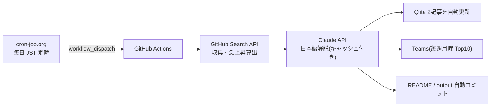

# Claude Code向けMCPツール候補ランキング

GitHub Search APIを使って、Claude Code周辺で活用候補になりそうなMCP関連リポジトリを定期収集するリポジトリです。

> 注意: この一覧は「Claude Codeでの動作」を保証するものではありません。  
> GitHub上のリポジトリ名・説明文・READMEなどに含まれる情報をもとに、MCP関連ツール候補を探すための入口として利用します。

## 仕組み(定常自律運転)

このランキングは cron-job.org → GitHub Actions → Claude API → Qiita / Teams のパイプラインで、毎日無人更新されています。


```mermaid
flowchart LR
    A["cron-job.org<br>毎日 JST 定時"] -->|workflow_dispatch| B["GitHub Actions"]
    B --> C["GitHub Search API<br>収集・急上昇算出"]
    C --> D["Claude API<br>日本語解説(キャッシュ付き)"]
    D --> E["Qiita 2記事を自動更新"]
    D --> F["Teams(毎週月曜 Top10)"]
    D --> G["README / output 自動コミット"]
```

- 仕組みの詳細と**ライブ稼働ステータス**: [定常自律運転ページ](https://takanobusano.github.io/mcp-github-ranking/)
- 作り方の解説記事: [パイプライン編](https://qiita.com/4q_sano/items/913e93ee5cc2731561fc) / [cron-job.org 完全自動化編](https://qiita.com/4q_sano/items/1bc5e0669a8f0166936c)
<!-- MCP_REPOS_START -->
最終更新: **2026-08-31 08:17:16 JST**

MCP関連リポジトリに加え、Claude Code周辺で活用候補になりそうな関連ツールをGitHub Search APIで毎日自動収集してランキング化しています。

Stars / Forks の差分は、UTC基準の前日データ（2026-08-29）との差分です。
CSVには最大500件を保存し、本文では上位100件を表示しています。

> 注意: この一覧はClaude Codeでの動作を保証するものではありません。  
> MCP関連ツールまたはClaude Code関連ツール候補を探すための入口として利用してください。

# 注目MCP・関連ツール候補ランキング

## 1位 [public-apis/public-apis](https://github.com/public-apis/public-apis)

A collective list of free APIs

⭐ **473,293 Stars**（+515）　🍴 **52,251 Forks**（+66）　/　🟢 **1,826 Open Issues**　/　Python

Topics: `api` / `apis` / `dataset` / `development` / `free` / `list` / `lists` / `open-source`

## 2位 [obra/superpowers](https://github.com/obra/superpowers)

An agentic skills framework & software development methodology that works.

⭐ **279,669 Stars**（+299）　🍴 **25,069 Forks**（+49）　/　🟢 **338 Open Issues**　/　Shell

Topics: `ai` / `brainstorming` / `coding` / `obra` / `sdlc` / `skills` / `subagent-driven-development` / `superpowers`

## 3位 [affaan-m/ECC](https://github.com/affaan-m/ECC)

The agent harness performance optimization system. Skills, instincts, memory, security, and research-first development for Claude Code, Codex, Opencode, Cursor and beyond.

⭐ **244,701 Stars**（+473）　🍴 **36,986 Forks**（+56）　/　🟢 **120 Open Issues**　/　JavaScript

Topics: `ai-agents` / `anthropic` / `claude` / `claude-code` / `developer-tools` / `llm` / `mcp` / `productivity`

## 4位 [mattpocock/skills](https://github.com/mattpocock/skills)

Skills for Real Engineers. Straight from my .agents directory.

⭐ **241,815 Stars**（+825）　🍴 **20,565 Forks**（+67）　/　🟢 **442 Open Issues**　/　Shell

Topics: `topicなし`

## 5位 [NousResearch/hermes-agent](https://github.com/NousResearch/hermes-agent)

The agent that grows with you

⭐ **238,488 Stars**（+367）　🍴 **48,564 Forks**（+139）　/　🟢 **37,900 Open Issues**　/　Python

Topics: `ai` / `ai-agent` / `ai-agents` / `anthropic` / `chatgpt` / `claude` / `claude-code` / `codex`

## 6位 [multica-ai/andrej-karpathy-skills](https://github.com/multica-ai/andrej-karpathy-skills)

A single CLAUDE.md file to improve Claude Code behavior, derived from Andrej Karpathy's observations on LLM coding pitfalls.

⭐ **208,882 Stars**（+230）　🍴 **21,272 Forks**（+21）　/　🟢 **128 Open Issues**　/　不明

Topics: `topicなし`

## 7位 [ultraworkers/claw-code](https://github.com/ultraworkers/claw-code)

An agent-managed museum exhibit, built in Rust with Gajae-Code / LazyCodex — developed and maintained with no human intervention.

⭐ **195,159 Stars**（+9）　🍴 **108,830 Forks**（-10）　/　🟢 **41 Open Issues**　/　Rust

Topics: `topicなし`

## 8位 [ollama/ollama](https://github.com/ollama/ollama)

Get up and running with Kimi-K2.6, GLM-5.2, MiniMax, DeepSeek, gpt-oss, Qwen, Gemma and other models.

⭐ **179,792 Stars**（+50）　🍴 **17,621 Forks**（+15）　/　🟢 **3,853 Open Issues**　/　Go

Topics: `deepseek` / `gemma` / `gemma3` / `glm` / `go` / `golang` / `gpt-oss` / `llama`

## 9位 [firecrawl/firecrawl](https://github.com/firecrawl/firecrawl)

The context API to search, scrape, and interact with the web at scale. 🔥

⭐ **174,444 Stars**（+388）　🍴 **9,589 Forks**（+15）　/　🟢 **571 Open Issues**　/　TypeScript

Topics: `ai` / `ai-agents` / `ai-crawler` / `ai-scraping` / `ai-search` / `crawler` / `data-extraction` / `html-to-markdown`

## 10位 [anthropics/skills](https://github.com/anthropics/skills)

Public repository for Agent Skills

⭐ **172,643 Stars**（+180）　🍴 **20,509 Forks**（+17）　/　🟢 **1,190 Open Issues**　/　Python

Topics: `agent-skills`

## 11位 [langflow-ai/langflow](https://github.com/langflow-ai/langflow)

Langflow is a powerful tool for building and deploying AI-powered agents and workflows.

⭐ **153,919 Stars**（+51）　🍴 **9,969 Forks**（+8）　/　🟢 **995 Open Issues**　/　Python

Topics: `agents` / `chatgpt` / `generative-ai` / `large-language-models` / `multiagent` / `react-flow`

## 12位 [msitarzewski/agency-agents](https://github.com/msitarzewski/agency-agents)

A complete AI agency at your fingertips - From frontend wizards to Reddit community ninjas, from whimsy injectors to reality checkers. Each agent is a specialized expert with personality, processes, and proven deliverables.

⭐ **149,044 Stars**（+205）　🍴 **24,031 Forks**（+28）　/　🟢 **149 Open Issues**　/　Shell

Topics: `topicなし`

## 13位 [anthropics/claude-code](https://github.com/anthropics/claude-code)

Claude Code is an agentic coding tool that lives in your terminal, understands your codebase, and helps you code faster by executing routine tasks, explaining complex code, and handling git workflows - all through natural language commands.

⭐ **143,473 Stars**（+81）　🍴 **22,947 Forks**（+16）　/　🟢 **15,484 Open Issues**　/　Python

Topics: `topicなし`

## 14位 [x1xhlol/system-prompts-and-models-of-ai-tools](https://github.com/x1xhlol/system-prompts-and-models-of-ai-tools)

FULL Augment Code, Claude Code, Cluely, CodeBuddy, Comet, Cursor, Devin AI, Junie, Kiro, Leap.new, Lovable, Manus, NotionAI, Orchids.app, Perplexity, Poke, Qoder, Replit, Same.dev, Trae, Traycer AI, VSCode Agent, Warp.dev, Windsurf, Xcode, Z.ai Code, Dia & v0. (And other Open Sourced) System Prompts, Internal Tools & AI Models

⭐ **143,243 Stars**（+22）　🍴 **34,847 Forks**（-2）　/　🟢 **160 Open Issues**　/　不明

Topics: `ai` / `bolt` / `cluely` / `copilot` / `cursor` / `cursorai` / `devin` / `github-copilot`

## 15位 [garrytan/gstack](https://github.com/garrytan/gstack)

Use Garry Tan's exact Claude Code setup: 23 opinionated tools that serve as CEO, Designer, Eng Manager, Release Manager, Doc Engineer, and QA

⭐ **130,475 Stars**（+136）　🍴 **19,619 Forks**（+17）　/　🟢 **825 Open Issues**　/　TypeScript

Topics: `topicなし`

## 16位 [farion1231/cc-switch](https://github.com/farion1231/cc-switch)

A cross-platform desktop All-in-One assistant for Claude Code, Codex, OpenCode, OpenClaw, Grok Build & Hermes Agent. Only official website: ccswitch.io

⭐ **130,215 Stars**（+129）　🍴 **8,935 Forks**（+13）　/　🟢 **2,549 Open Issues**　/　Rust

Topics: `ai-tools` / `claude-code` / `codex` / `desktop-app` / `grok` / `grokbuild` / `hermes` / `hermes-agent`

## 17位 [nextlevelbuilder/ui-ux-pro-max-skill](https://github.com/nextlevelbuilder/ui-ux-pro-max-skill)

An AI skill that provides design intelligence for building professional UI/UX across multiple platforms.

⭐ **123,216 Stars**（+282）　🍴 **13,191 Forks**（+21）　/　🟢 **93 Open Issues**　/　Python

Topics: `ai-skills` / `antigravity` / `claude` / `claude-code` / `codex` / `command-line` / `copilot` / `cursor-ai`

## 18位 [harry0703/MoneyPrinterTurbo](https://github.com/harry0703/MoneyPrinterTurbo)

利用 AI 大模型和自动化工作流，根据主题或关键词一键生成高清短视频。Generate HD short videos from a topic or keyword with an automated AI workflow.

⭐ **118,820 Stars**（+339）　🍴 **18,166 Forks**（+77）　/　🟢 **15 Open Issues**　/　Python

Topics: `ai-video-generator` / `content-creation` / `ffmpeg` / `instagram-reels` / `llm` / `python` / `short-video` / `subtitles`

## 19位 [DietrichGebert/ponytail](https://github.com/DietrichGebert/ponytail)

Makes your AI agent think like the laziest senior dev in the room. The best code is the code you never wrote.

⭐ **117,142 Stars**（+776）　🍴 **6,397 Forks**（+44）　/　🟢 **185 Open Issues**　/　JavaScript

Topics: `agent-skills` / `ai-agents` / `claude` / `claude-code` / `claude-code-plugin` / `cursor-rules` / `developer-tools` / `llm`

## 20位 [Graphify-Labs/graphify](https://github.com/Graphify-Labs/graphify)

Turn any codebase, with its docs, SQL schemas, configs, and PDFs, into a queryable knowledge graph. A /graphify skill for Claude Code, Cursor, Codex, and Gemini CLI: local deterministic AST parsing, every edge explained, no vector store.

⭐ **112,645 Stars**（+348）　🍴 **10,962 Forks**（+31）　/　🟢 **1,149 Open Issues**　/　Python

Topics: `ai-agents` / `antigravity` / `ast` / `claude-code` / `code-analysis` / `code-search` / `codex` / `cursor`

## 21位 [browser-use/browser-use](https://github.com/browser-use/browser-use)

🌐 Make websites accessible for AI agents. Automate tasks online with ease.

⭐ **111,737 Stars**（+73）　🍴 **12,264 Forks**（+13）　/　🟢 **394 Open Issues**　/　Python

Topics: `ai-agents` / `ai-tools` / `browser-automation` / `browser-use` / `llm` / `playwright` / `python`

## 22位 [google-gemini/gemini-cli](https://github.com/google-gemini/gemini-cli)

An open-source AI agent that brings the power of Gemini directly into your terminal.

⭐ **106,754 Stars**（+14）　🍴 **14,505 Forks**（+1）　/　🟢 **871 Open Issues**　/　TypeScript

Topics: `ai` / `ai-agents` / `cli` / `gemini` / `gemini-api` / `mcp-client` / `mcp-server`

## 23位 [JuliusBrussee/caveman](https://github.com/JuliusBrussee/caveman)

🪨 why use many token when few token do trick — Claude Code skill that cuts 65% of tokens by talking like caveman

⭐ **101,872 Stars**（+115）　🍴 **5,930 Forks**（+13）　/　🟢 **108 Open Issues**　/　Go

Topics: `ai` / `anthropic` / `caveman` / `claude` / `claude-code` / `llm` / `meme` / `prompt-engineering`

## 24位 [TauricResearch/TradingAgents](https://github.com/TauricResearch/TradingAgents)

TradingAgents: Multi-Agents LLM Financial Trading Framework

⭐ **101,872 Stars**（+163）　🍴 **19,591 Forks**（+45）　/　🟢 **377 Open Issues**　/　Python

Topics: `agent` / `finance` / `llm` / `multiagent` / `trading`

## 25位 [puppeteer/puppeteer](https://github.com/puppeteer/puppeteer)

JavaScript API for Chrome and Firefox

⭐ **95,527 Stars**（+4）　🍴 **9,574 Forks**（±0）　/　🟢 **267 Open Issues**　/　TypeScript

Topics: `automation` / `chrome` / `chromium` / `developer-tools` / `firefox` / `headless-chrome` / `node-module` / `testing`

## 26位 [microsoft/playwright](https://github.com/microsoft/playwright)

Playwright is a framework for Web Testing and Automation. It allows testing Chromium, Firefox and WebKit with a single API.

⭐ **95,392 Stars**（+45）　🍴 **6,359 Forks**（+4）　/　🟢 **177 Open Issues**　/　TypeScript

Topics: `automation` / `chrome` / `chromium` / `e2e-testing` / `electron` / `end-to-end-testing` / `firefox` / `javascript`

## 27位 [nexu-io/open-design](https://github.com/nexu-io/open-design)

🎨 Best DeepSeek Harness Design Plugin. The open-source Claude Design alternative. 🖥️ Local-first desktop app. 🖼️ Your coding agent becomes the design engine: pr...

⭐ **92,832 Stars**（+216）　🍴 **10,706 Forks**（+34）　/　🟢 **923 Open Issues**　/　不明

Topics: `agent-skills` / `ai-design` / `byok` / `claude-code-for-design` / `claude-design` / `codex-design` / `coding-agents` / `cursor-design`

## 28位 [thedotmack/claude-mem](https://github.com/thedotmack/claude-mem)

Persistent Context Across Sessions for Every Agent –  Captures everything your agent does during sessions, compresses it with AI, and injects relevant context back into future sessions. Works with Claude Code, OpenClaw, Codex, Gemini, Hermes, Copilot, OpenCode + More

⭐ **92,661 Stars**（+79）　🍴 **8,155 Forks**（+13）　/　🟢 **273 Open Issues**　/　JavaScript

Topics: `ai` / `ai-agents` / `ai-memory` / `anthropic` / `artificial-intelligence` / `chromadb` / `claude` / `claude-agent-sdk`

## 29位 [addyosmani/agent-skills](https://github.com/addyosmani/agent-skills)

Production-grade engineering skills for AI coding agents.

⭐ **90,928 Stars**（+225）　🍴 **9,718 Forks**（+10）　/　🟢 **124 Open Issues**　/　JavaScript

Topics: `agent-skills` / `antigravity` / `claude-code` / `codex` / `cursor` / `skills`

## 30位 [modelcontextprotocol/servers](https://github.com/modelcontextprotocol/servers)

Model Context Protocol Servers

⭐ **89,973 Stars**（+13）　🍴 **11,539 Forks**（+6）　/　🟢 **512 Open Issues**　/　TypeScript

Topics: `topicなし`

## 31位 [ChatGPTNextWeb/NextChat](https://github.com/ChatGPTNextWeb/NextChat)

✨ Light and Fast AI Assistant. Support: Web \| iOS \| MacOS \| Android \|  Linux \| Windows

⭐ **88,668 Stars**（+1）　🍴 **59,169 Forks**（-2）　/　🟢 **853 Open Issues**　/　TypeScript

Topics: `calclaude` / `chatgpt` / `claude` / `cross-platform` / `desktop` / `fe` / `gemini` / `gemini-pro`

## 32位 [OpenCut-app/OpenCut](https://github.com/OpenCut-app/OpenCut)

The open-source CapCut alternative

⭐ **88,009 Stars**（+114）　🍴 **8,677 Forks**（+11）　/　🟢 **377 Open Issues**　/　TypeScript

Topics: `editor` / `oss` / `videoeditor`

## 33位 [OpenHands/OpenHands](https://github.com/OpenHands/OpenHands)

🙌 OpenHands: AI-Driven Development

⭐ **85,669 Stars**（+99）　🍴 **11,225 Forks**（+21）　/　🟢 **608 Open Issues**　/　TypeScript

Topics: `agent` / `artificial-intelligence` / `chatgpt` / `claude-ai` / `cli` / `developer-tools` / `gpt` / `llm`

## 34位 [koala73/worldmonitor](https://github.com/koala73/worldmonitor)

Real-time global intelligence dashboard. AI-powered news aggregation, geopolitical monitoring, and infrastructure tracking in a unified situational awareness interface

⭐ **85,068 Stars**（+174）　🍴 **12,803 Forks**（+46）　/　🟢 **330 Open Issues**　/　TypeScript

Topics: `agent` / `ai` / `dashboard` / `geopolitics` / `mcp` / `mcp-server` / `monitoring` / `news`

## 35位 [laravel/laravel](https://github.com/laravel/laravel)

Laravel is a web application framework with expressive, elegant syntax. We’ve already laid the foundation for your next big idea — freeing you to create without sweating the small things.

⭐ **84,899 Stars**（+6）　🍴 **24,897 Forks**（+7）　/　🟢 **32 Open Issues**　/　Blade

Topics: `framework` / `laravel` / `php`

## 36位 [Leonxlnx/taste-skill](https://github.com/Leonxlnx/taste-skill)

Taste-Skill - gives your AI good taste. stops the AI from generating boring, generic slop

⭐ **82,472 Stars**（+295）　🍴 **5,648 Forks**（+21）　/　🟢 **58 Open Issues**　/　JavaScript

Topics: `agent` / `ai` / `claude` / `claude-code` / `codex` / `coding` / `design` / `frontend`

## 37位 [lobehub/lobehub](https://github.com/lobehub/lobehub)

🤯 LobeHub is your Chief Agent Operator, organizing your agents into 7×24 operations by hiring, scheduling, and reporting on your entire AI team.

⭐ **82,104 Stars**（+11）　🍴 **15,840 Forks**（+3）　/　🟢 **864 Open Issues**　/　TypeScript

Topics: `agent` / `agent-collaboration` / `agent-harness` / `ai` / `cao` / `chatgpt` / `chief-agent-operator` / `claude`

## 38位 [bytedance/deer-flow](https://github.com/bytedance/deer-flow)

An open-source long-horizon SuperAgent harness that researches, codes, and creates. With the help of sandboxes, memories, tools, skill, subagents and message gateway, it handles different levels of tasks that could take minutes to hours.

⭐ **81,135 Stars**（+31）　🍴 **11,178 Forks**（+7）　/　🟢 **900 Open Issues**　/　Python

Topics: `agent` / `agentic` / `agentic-framework` / `agentic-workflow` / `ai` / `ai-agents` / `deep-research` / `harness`

## 39位 [Egonex-AI/Understand-Anything](https://github.com/Egonex-AI/Understand-Anything)

Graphs that teach > graphs that impress. Turn any code into an interactive knowledge graph you can explore, search, and ask questions about. Works with Claude Code, Codex, Cursor, Copilot, Gemini CLI, and more.

⭐ **81,097 Stars**（+100）　🍴 **6,819 Forks**（+6）　/　🟢 **296 Open Issues**　/　TypeScript

Topics: `antigravity-skills` / `business-knowledge` / `claude-code` / `claude-skills` / `codebase-analysis` / `codex` / `codex-skills` / `developer-tools-ai-agent`

## 40位 [unclecode/crawl4ai](https://github.com/unclecode/crawl4ai)

🚀🤖 Crawl4AI: Open-source LLM Friendly Web Crawler & Scraper. Don't be shy, join here:

⭐ **80,213 Stars**（+281）　🍴 **8,303 Forks**（+17）　/　🟢 **176 Open Issues**　/　Python

Topics: `topicなし`

## 41位 [paperclipai/paperclip](https://github.com/paperclipai/paperclip)

The open-source app everyone uses to manage agents at work

⭐ **79,705 Stars**（+67）　🍴 **14,621 Forks**（+18）　/　🟢 **5,420 Open Issues**　/　TypeScript

Topics: `topicなし`

## 42位 [opendatalab/MinerU](https://github.com/opendatalab/MinerU)

Transforms complex documents like PDFs and Office docs into LLM-ready markdown/JSON for your Agentic workflows.

⭐ **78,811 Stars**（+63）　🍴 **6,620 Forks**（-1）　/　🟢 **102 Open Issues**　/　Python

Topics: `ai4science` / `document-analysis` / `docx` / `extract-data` / `layout-analysis` / `ocr` / `parser` / `pdf`

## 43位 [rtk-ai/rtk](https://github.com/rtk-ai/rtk)

CLI proxy that reduces LLM token consumption by 60-90% on common dev commands. Single Rust binary, zero dependencies

⭐ **77,937 Stars**（+112）　🍴 **4,909 Forks**（+3）　/　🟢 **2,068 Open Issues**　/　Rust

Topics: `agentic-coding` / `ai-coding` / `anthropic` / `claude-code` / `cli` / `command-line-tool` / `cost-reduction` / `developer-tools`

## 44位 [D4Vinci/Scrapling](https://github.com/D4Vinci/Scrapling)

🕷️ An adaptive Web Scraping framework that handles everything from a single request to a full-scale crawl!

⭐ **77,364 Stars**（+192）　🍴 **7,753 Forks**（+16）　/　🟢 **5 Open Issues**　/　Python

Topics: `ai` / `ai-scraping` / `automation` / `crawler` / `crawling` / `crawling-python` / `data` / `data-extraction`

## 45位 [Panniantong/Agent-Reach](https://github.com/Panniantong/Agent-Reach)

Give your AI agent eyes to see the entire internet. Read & search Twitter, Reddit, YouTube, GitHub, Bilibili, XiaoHongShu — one CLI, zero API fees.

⭐ **76,770 Stars**（+225）　🍴 **6,573 Forks**（+27）　/　🟢 **110 Open Issues**　/　Python

Topics: `agent-infrastructure` / `ai-agent` / `ai-search` / `automation` / `bilibili` / `claude-code` / `cli` / `cursor`

## 46位 [abi/screenshot-to-code](https://github.com/abi/screenshot-to-code)

Drop in a screenshot and convert it to clean code (HTML/Tailwind/React/Vue)

⭐ **76,376 Stars**（+351）　🍴 **9,296 Forks**（+36）　/　🟢 **134 Open Issues**　/　Python

Topics: `topicなし`

## 47位 [shareAI-lab/learn-claude-code](https://github.com/shareAI-lab/learn-claude-code)

Bash is all you need -  A nano claude code–like 「agent harness」, built from 0 to 1

⭐ **75,674 Stars**（+63）　🍴 **12,199 Forks**（+7）　/　🟢 **31 Open Issues**　/　Python

Topics: `agent` / `agent-development` / `ai-agent` / `claude` / `claude-code` / `educational` / `llm` / `python`

## 48位 [unslothai/unsloth](https://github.com/unslothai/unsloth)

Local UI to run and train LLMs and diffusion models. Supports GGUF, MLX, Qwen3.8, Kimi K3, MiniMax-H3, Gemma 4, FLUX and more.

⭐ **75,265 Stars**（+86）　🍴 **6,828 Forks**（+6）　/　🟢 **1,421 Open Issues**　/　Python

Topics: `agent` / `ai` / `chatgpt` / `deepseek` / `fine-tuning` / `gemma` / `image-generation` / `llama`

## 49位 [Eugeny/tabby](https://github.com/Eugeny/tabby)

A terminal for a more modern age

⭐ **74,234 Stars**（+8）　🍴 **4,229 Forks**（+2）　/　🟢 **2,870 Open Issues**　/　TypeScript

Topics: `serial` / `ssh-client` / `telnet-client` / `terminal` / `terminal-emulators`

## 50位 [thedaviddias/Front-End-Checklist](https://github.com/thedaviddias/Front-End-Checklist)

🗂 The essential checklist for modern web development, for humans and AI agents

⭐ **73,966 Stars**（+26）　🍴 **6,723 Forks**（+4）　/　🟢 **7 Open Issues**　/　MDX

Topics: `ai-agent` / `ai-agents` / `checklist` / `css` / `front-end-developer-tool` / `front-end-development` / `frontend` / `guidelines`

## 51位 [OpenBB-finance/OpenBB](https://github.com/OpenBB-finance/OpenBB)

Open Data Platform for analysts, quants and AI agents.

⭐ **72,508 Stars**（+57）　🍴 **7,482 Forks**（+8）　/　🟢 **110 Open Issues**　/　Python

Topics: `ai` / `crypto` / `derivatives` / `economics` / `equity` / `finance` / `fixed-income` / `machine-learning`

## 52位 [daytonaio/daytona](https://github.com/daytonaio/daytona)

Daytona is a Secure and Elastic Infrastructure for Running AI-Generated Code

⭐ **71,859 Stars**（+2）　🍴 **5,649 Forks**（+1）　/　🟢 **449 Open Issues**　/　不明

Topics: `agentic-workflow` / `ai` / `ai-agents` / `ai-runtime` / `ai-sandboxes` / `code-execution` / `code-interpreter` / `developer-tools`

## 53位 [ruvnet/ruflo](https://github.com/ruvnet/ruflo)

🌊 The original agent meta-harness. Deploy intelligent multi-player swarms, coordinate autonomous workflows, and build conversational AI systems. Features adapti...

⭐ **69,835 Stars**（+114）　🍴 **8,348 Forks**（+7）　/　🟢 **870 Open Issues**　/　TypeScript

Topics: `agentic-ai` / `agentic-framework` / `agentic-workflow` / `agents` / `ai-agents` / `ai-assistant` / `ai-skills` / `autonomous-agents`

## 54位 [colbymchenry/codegraph](https://github.com/colbymchenry/codegraph)

Pre-indexed code knowledge graph, auto syncs on code changes, for Claude Code, Codex, Gemini, Cursor, OpenCode, AntiGravity, Kiro, CoPilot, and Hermes Agent — fewer tokens, fewer tool calls, 100% local

⭐ **68,690 Stars**（+88）　🍴 **4,385 Forks**（+8）　/　🟢 **460 Open Issues**　/　C

Topics: `topicなし`

## 55位 [code-yeongyu/oh-my-openagent](https://github.com/code-yeongyu/oh-my-openagent)

omo/lazycodex: The coding agent for tokenmaxxers;the one and only agent harness for complex codebases. For your Codex, for your OpenCode

⭐ **68,528 Stars**（+20）　🍴 **5,615 Forks**（+2）　/　🟢 **994 Open Issues**　/　TypeScript

Topics: `ai` / `ai-agents` / `anthropic` / `chatgpt` / `claude` / `claude-skills` / `codex` / `cursor`

## 56位 [openinterpreter/openinterpreter](https://github.com/openinterpreter/openinterpreter)

A coding agent for open models like Kimi K3

⭐ **68,208 Stars**（+20）　🍴 **5,870 Forks**（+1）　/　🟢 **9 Open Issues**　/　Rust

Topics: `acp` / `coding-agent` / `deepseek` / `kimi` / `qwen` / `rust`

## 57位 [headroomlabs-ai/headroom](https://github.com/headroomlabs-ai/headroom)

Compress tool outputs, logs, files, and RAG chunks before they reach the LLM. 20% fewer tokens for coding agents, 60-95% fewer tokens for JSON, same answers. Library, proxy, MCP server.

⭐ **68,109 Stars**（+100）　🍴 **5,279 Forks**（+14）　/　🟢 **589 Open Issues**　/　Python

Topics: `agent` / `ai` / `anthropic` / `claude-code` / `compression` / `context-engineering` / `context-window` / `cursor`

## 58位 [cline/cline](https://github.com/cline/cline)

Autonomous coding agent as an SDK, IDE extension, or CLI assistant.

⭐ **67,187 Stars**（+54）　🍴 **7,253 Forks**（+4）　/　🟢 **1,152 Open Issues**　/　TypeScript

Topics: `topicなし`

## 59位 [bradtraversy/design-resources-for-developers](https://github.com/bradtraversy/design-resources-for-developers)

Curated list of design and UI resources from stock photos, web templates, CSS frameworks, UI libraries, tools and much more

⭐ **66,780 Stars**（+6）　🍴 **12,157 Forks**（-1）　/　🟢 **106 Open Issues**　/　不明

Topics: `topicなし`

## 60位 [Fission-AI/OpenSpec](https://github.com/Fission-AI/OpenSpec)

Spec-driven development (SDD) for AI coding assistants.

⭐ **66,719 Stars**（+77）　🍴 **4,594 Forks**（+6）　/　🟢 **203 Open Issues**　/　TypeScript

Topics: `ai` / `context-engineering` / `engineering` / `planning` / `prd` / `sdd` / `sdlc` / `spec`

## 61位 [xtekky/gpt4free](https://github.com/xtekky/gpt4free)

The official gpt4free repository \| various collection of powerful language models \| opus 4.6 gpt 5.3 kimi 2.5 deepseek v3.2 gemini 3

⭐ **66,619 Stars**（+5）　🍴 **13,514 Forks**（-1）　/　🟢 **2 Open Issues**　/　Python

Topics: `chatbot` / `chatbots` / `chatgpt` / `chatgpt-4` / `chatgpt-api` / `chatgpt-free` / `chatgpt4` / `deepseek`

## 62位 [docling-project/docling](https://github.com/docling-project/docling)

Get your documents ready for gen AI

⭐ **65,765 Stars**（+39）　🍴 **4,723 Forks**（+3）　/　🟢 **993 Open Issues**　/　Python

Topics: `ai` / `convert` / `document-parser` / `document-parsing` / `documents` / `docx` / `html` / `markdown`

## 63位 [shanraisshan/claude-code-best-practice](https://github.com/shanraisshan/claude-code-best-practice)

from vibe coding to agentic engineering - practice makes claude perfect

⭐ **65,395 Stars**（+39）　🍴 **6,515 Forks**（±0）　/　🟢 **47 Open Issues**　/　HTML

Topics: `agentic-ai` / `agentic-coding` / `agentic-engineering` / `agentic-workflow` / `ai` / `ai-agents` / `anthropic` / `best-practices`

## 64位 [warpdotdev/warp](https://github.com/warpdotdev/warp)

Warp is an agentic development environment, born out of the terminal.

⭐ **64,665 Stars**（+30）　🍴 **5,491 Forks**（+2）　/　🟢 **5,139 Open Issues**　/　Rust

Topics: `bash` / `linux` / `macos` / `rust` / `shell` / `terminal` / `wasm` / `zsh`

## 65位 [mem0ai/mem0](https://github.com/mem0ai/mem0)

Universal memory layer for AI Agents

⭐ **64,372 Stars**（+53）　🍴 **7,547 Forks**（+14）　/　🟢 **704 Open Issues**　/　Python

Topics: `agents` / `ai` / `ai-agents` / `application` / `chatbots` / `chatgpt` / `genai` / `llm`

## 66位 [NanmiCoder/MediaCrawler](https://github.com/NanmiCoder/MediaCrawler)

小红书笔记 \| 评论爬虫、抖音视频 \| 评论爬虫、快手视频 \| 评论爬虫、B 站视频 ｜ 评论爬虫、微博帖子 ｜ 评论爬虫、百度贴吧帖子 ｜ 百度贴吧评论回复爬虫  \| 知乎问答文章｜评论爬虫

⭐ **64,098 Stars**（+60）　🍴 **12,463 Forks**（+13）　/　🟢 **191 Open Issues**　/　Python

Topics: `topicなし`

## 67位 [pbakaus/impeccable](https://github.com/pbakaus/impeccable)

The design language that makes your AI harness better at design.

⭐ **64,062 Stars**（+265）　🍴 **3,943 Forks**（+38）　/　🟢 **56 Open Issues**　/　JavaScript

Topics: `topicなし`

## 68位 [asgeirtj/system_prompts_leaks](https://github.com/asgeirtj/system_prompts_leaks)

Extracted system prompts from Anthropic - Claude Fable 5, Opus 5, Claude Design, Claude Code. OpenAI - ChatGPT GPT-5.6-Sol, Codex. Google - Gemini 3.5 Flash, 3.1 Pro, Antigravity. xAI - Grok, Cursor, Copilot, VS Code, Perplexity, and more. Updated regularly.

⭐ **63,844 Stars**（+45）　🍴 **10,479 Forks**（+15）　/　🟢 **49 Open Issues**　/　JavaScript

Topics: `ai` / `ai-agents` / `ai-prompts` / `anthropic` / `chatbot` / `chatgpt` / `claude` / `claude-code`

## 69位 [sansan0/TrendRadar](https://github.com/sansan0/TrendRadar)

⭐AI-driven public opinion & trend monitor with multi-platform aggregation, RSS, and smart alerts.🎯 告别信息过载，你的 AI 舆情监控助手与热点筛选工具！聚合多平台热点 +  RSS 订阅，支持关键词精准筛选。AI 智能筛...

⭐ **61,943 Stars**（+26）　🍴 **24,876 Forks**（-2）　/　🟢 **60 Open Issues**　/　Python

Topics: `ai` / `bark` / `data-analysis` / `docker` / `hot-news` / `llm` / `mail` / `mcp`

## 70位 [upstash/context7](https://github.com/upstash/context7)

Context7 Platform -- Up-to-date code documentation for LLMs and AI code editors

⭐ **61,422 Stars**（+29）　🍴 **2,957 Forks**（±0）　/　🟢 **65 Open Issues**　/　TypeScript

Topics: `llm` / `mcp` / `mcp-server` / `vibe-coding`

## 71位 [coollabsio/coolify](https://github.com/coollabsio/coolify)

An open-source, self-hostable PaaS alternative to Vercel, Heroku & Netlify that lets you easily deploy static sites, databases, full-stack applications and 280+ one-click services on your own servers.

⭐ **61,227 Stars**（+42）　🍴 **5,381 Forks**（+5）　/　🟢 **669 Open Issues**　/　PHP

Topics: `coolify` / `databases` / `deployment` / `docker` / `docker-compose` / `inertiajs` / `laravel` / `mariadb`

## 72位 [tw93/Pake](https://github.com/tw93/Pake)

🤱🏻 Turn any webpage into a desktop app with one command.

⭐ **61,174 Stars**（+37）　🍴 **12,572 Forks**（+10）　/　🟢 **1 Open Issues**　/　Rust

Topics: `chatgpt` / `claude` / `desktop` / `gemini` / `hight-performance` / `linux` / `macos` / `no-electron`

## 73位 [1c7/chinese-independent-developer](https://github.com/1c7/chinese-independent-developer)

👩🏿‍💻👨🏾‍💻👩🏼‍💻👨🏽‍💻👩🏻‍💻中国独立开发者项目列表 -- 分享大家都在做什么

⭐ **61,156 Stars**（+39）　🍴 **5,338 Forks**（+4）　/　🟢 **2 Open Issues**　/　Python

Topics: `china` / `indie` / `indie-developer`

## 74位 [microsoft/autogen](https://github.com/microsoft/autogen)

A programming framework for agentic AI

⭐ **60,703 Stars**（+5）　🍴 **9,163 Forks**（-3）　/　🟢 **1,000 Open Issues**　/　Python

Topics: `agentic` / `agentic-agi` / `agents` / `ai` / `autogen` / `autogen-ecosystem` / `chatgpt` / `framework`

## 75位 [mvanhorn/last30days-skill](https://github.com/mvanhorn/last30days-skill)

AI agent skill that researches any topic across Reddit, X, YouTube, HN, Polymarket, and the web - then synthesizes a grounded summary

⭐ **60,486 Stars**（+290）　🍴 **5,296 Forks**（+20）　/　🟢 **183 Open Issues**　/　Python

Topics: `ai-prompts` / `ai-skill` / `bluesky` / `claude` / `claude-code` / `clawhub` / `deep-research` / `hackernews`

## 76位 [usestrix/strix](https://github.com/usestrix/strix)

Open-source AI penetration testing tool to find and fix your app’s vulnerabilities.

⭐ **59,501 Stars**（+206）　🍴 **6,502 Forks**（+28）　/　🟢 **331 Open Issues**　/　Python

Topics: `agents` / `ai-hacking` / `ai-penetration-testing` / `ai-pentesting` / `ai-security` / `artificial-intelligence` / `bug-bounty` / `code-quality`

## 77位 [penpot/penpot](https://github.com/penpot/penpot)

Penpot: The open-source design platform for Product teams that need scalable collaboration.

⭐ **59,394 Stars**（+21）　🍴 **4,024 Forks**（+5）　/　🟢 **797 Open Issues**　/　Clojure

Topics: `clojure` / `clojurescript` / `design` / `prototyping` / `ui` / `ux-design` / `ux-experience`

## 78位 [meilisearch/meilisearch](https://github.com/meilisearch/meilisearch)

A lightning-fast search engine API bringing AI-powered hybrid search to your sites and applications.

⭐ **59,139 Stars**（+14）　🍴 **2,692 Forks**（+2）　/　🟢 **319 Open Issues**　/　Rust

Topics: `ai` / `api` / `app-search` / `database` / `enterprise-search` / `faceting` / `full-text-search` / `fuzzy-search`

## 79位 [MemPalace/mempalace](https://github.com/MemPalace/mempalace)

The best-benchmarked open-source AI memory system. And it's free.

⭐ **58,743 Stars**（+17）　🍴 **7,541 Forks**（+3）　/　🟢 **737 Open Issues**　/　Python

Topics: `ai` / `chromadb` / `llm` / `mcp` / `memory` / `python`

## 80位 [diegosouzapw/OmniRoute](https://github.com/diegosouzapw/OmniRoute)

Never stop coding. Free MIT AI gateway: one endpoint, 350 providers (90+ free), 1200+ models Kimi, Claude, GPT, Gemini, GLM, DeepSeek, MiniMax. Works with Claude Code, Codex, Cursor, OpenCode, Cline & Copilot. Quota-aware auto-fallback, RTK+Caveman compression saves 15-95% tokens, MCP/A2A, Desktop/PWA. Built by 450+ contributors

⭐ **58,635 Stars**（+559）　🍴 **8,128 Forks**（+115）　/　🟢 **165 Open Issues**　/　TypeScript

Topics: `a2a` / `ai-agents` / `ai-gateway` / `anthropic` / `claude` / `claude-code` / `cline` / `codex`

## 81位 [FoundationAgents/OpenManus](https://github.com/FoundationAgents/OpenManus)

No fortress, purely open ground.  OpenManus is Coming.

⭐ **58,123 Stars**（+10）　🍴 **10,097 Forks**（+6）　/　🟢 **465 Open Issues**　/　Python

Topics: `topicなし`

## 82位 [crewAIInc/crewAI](https://github.com/crewAIInc/crewAI)

Framework for orchestrating role-playing, autonomous AI agents. By fostering collaborative intelligence, CrewAI empowers agents to work together seamlessly, tackling complex tasks.

⭐ **57,834 Stars**（+38）　🍴 **8,284 Forks**（+1）　/　🟢 **768 Open Issues**　/　Python

Topics: `agents` / `ai` / `ai-agents` / `aiagentframework` / `llms`

## 83位 [BerriAI/litellm](https://github.com/BerriAI/litellm)

The fastest, litest AI Gateway. Rust core with Python SDK. Call 100+ LLM APIs in OpenAI (or native) format with cost tracking, guardrails, load balancing, and logging [Bedrock, Azure, OpenAI, Anthropic, OpenAI, VertexAI, vLLM, Nvidia NIM]

⭐ **57,613 Stars**（+63）　🍴 **11,028 Forks**（+17）　/　🟢 **4,901 Open Issues**　/　Python

Topics: `ai-gateway` / `anthropic` / `azure-openai` / `bedrock` / `gateway` / `langchain` / `litellm` / `llm`

## 84位 [zylon-ai/private-gpt](https://github.com/zylon-ai/private-gpt)

Complete API layer for private AI applications on local models: RAG, skills, tools, MCP, text-to-sql, and more. Works with any OpenAI-compatible inference server.

⭐ **57,491 Stars**（+4）　🍴 **7,612 Forks**（+1）　/　🟢 **6 Open Issues**　/　Python

Topics: `ai` / `ai-tools` / `on-premise`

## 85位 [stablyai/orca](https://github.com/stablyai/orca)

Orca is the ADE for working with a fleet of parallel agents. Run any coding agent with your own subscription. Available on desktop, mobile and VPS.

⭐ **57,353 Stars**（+575）　🍴 **3,910 Forks**（+43）　/　🟢 **4,958 Open Issues**　/　TypeScript

Topics: `ade` / `agent-ide` / `ai-agents` / `claude-code` / `cli` / `codex` / `cursor-agent` / `devtools`

## 86位 [calesthio/OpenMontage](https://github.com/calesthio/OpenMontage)

World's first open-source, agentic video production system. 12 production pipelines, 100+ tools, 700+ agent skill and production-knowledge files. Turn your AI coding assistant into a full video production studio.

⭐ **54,621 Stars**（+579）　🍴 **6,796 Forks**（+85）　/　🟢 **272 Open Issues**　/　Python

Topics: `agent` / `agentic-ai` / `ai` / `claude` / `copilot` / `cursor` / `elevenlabs` / `ffmpeg`

## 87位 [aaif-goose/goose](https://github.com/aaif-goose/goose)

an open source, extensible AI agent that goes beyond code suggestions - install, execute, edit, and test with any LLM

⭐ **53,705 Stars**（+41）　🍴 **6,151 Forks**（+16）　/　🟢 **234 Open Issues**　/　Rust

Topics: `acp` / `ai` / `ai-agents` / `mcp`

## 88位 [Alishahryar1/free-claude-code](https://github.com/Alishahryar1/free-claude-code)

Use Claude Code, Codex, Pi, and OpenCode and more for free (1.3B+ free tokens) from your terminal, app, IDE, or phone like OpenClaw (voice supported + ToS friendly)

⭐ **51,916 Stars**（+505）　🍴 **8,359 Forks**（+77）　/　🟢 **366 Open Issues**　/　Python

Topics: `topicなし`

## 89位 [jamiepine/voicebox](https://github.com/jamiepine/voicebox)

The open-source AI voice studio. Clone, dictate, create.

⭐ **51,897 Stars**（+97）　🍴 **6,465 Forks**（+15）　/　🟢 **666 Open Issues**　/　TypeScript

Topics: `ai` / `cuda` / `mlx` / `qwen3-tts` / `qwen3-tts-ui` / `voice-ai` / `voice-clone` / `whisper`

## 90位 [charlax/professional-programming](https://github.com/charlax/professional-programming)

A collection of learning resources for curious software engineers

⭐ **51,462 Stars**（+4）　🍴 **4,017 Forks**（±0）　/　🟢 **7 Open Issues**　/　Python

Topics: `architecture` / `computer-science` / `concepts` / `documentation` / `engineer` / `learning` / `lessons-learned` / `professional`

## 91位 [CherryHQ/cherry-studio](https://github.com/CherryHQ/cherry-studio)

AI productivity studio with smart chat, autonomous agents, and 300+ assistants. Unified access to frontier LLMs

⭐ **51,265 Stars**（+32）　🍴 **4,896 Forks**（+4）　/　🟢 **1,477 Open Issues**　/　TypeScript

Topics: `agent-skills` / `ai-agent` / `claude-code` / `codex` / `deepseek` / `deepseek-harness` / `hermes-agent` / `skills`

## 92位 [rohitg00/ai-engineering-from-scratch](https://github.com/rohitg00/ai-engineering-from-scratch)

Learn it. Build it. Ship it for others.

⭐ **51,263 Stars**（+307）　🍴 **8,881 Forks**（+61）　/　🟢 **97 Open Issues**　/　Python

Topics: `agents` / `ai` / `ai-agents` / `ai-engineering` / `computer-vision` / `course` / `deep-learning` / `from-scratch`

## 93位 [hugohe3/ppt-master](https://github.com/hugohe3/ppt-master)

AI turns documents or topics into real, native PowerPoint decks—with native shapes, transitions and animations, data-backed charts and tables on demand, audio narration from speaker notes, and support for your own .pptx templates. · by Hugo He

⭐ **50,378 Stars**（+180）　🍴 **4,054 Forks**（+9）　/　🟢 **6 Open Issues**　/　Python

Topics: `ai-agent` / `aippt` / `office` / `powerpoint` / `powerpoint-generation` / `ppt` / `pptx` / `presentation`

## 94位 [ChromeDevTools/chrome-devtools-mcp](https://github.com/ChromeDevTools/chrome-devtools-mcp)

Chrome DevTools for coding agents

⭐ **50,217 Stars**（+60）　🍴 **3,529 Forks**（+11）　/　🟢 **97 Open Issues**　/　TypeScript

Topics: `browser` / `chrome` / `chrome-devtools` / `debugging` / `devtools` / `mcp` / `mcp-server` / `puppeteer`

## 95位 [router-for-me/CLIProxyAPI](https://github.com/router-for-me/CLIProxyAPI)

Wrap Antigravity, ChatGPT Codex, Claude Code, Grok Build as an OpenAI/Gemini/Claude/Codex compatible API service, allowing you to enjoy the free Gemini 3.1 Pro, GPT 5.6 Series, Grok 4.5, Claude model through API

⭐ **49,440 Stars**（+206）　🍴 **7,570 Forks**（+16）　/　🟢 **484 Open Issues**　/　Go

Topics: `antigravity` / `claude-code` / `cluade` / `codex` / `gemini` / `openai`

## 96位 [mudler/LocalAI](https://github.com/mudler/LocalAI)

LocalAI is the open-source AI engine. Run any model - LLMs, vision, voice, image, video - on any hardware. No GPU required.

⭐ **48,772 Stars**（+22）　🍴 **4,400 Forks**（+1）　/　🟢 **171 Open Issues**　/　Go

Topics: `agents` / `ai` / `api` / `audio-generation` / `decentralized` / `distributed` / `image-generation` / `libp2p`

## 97位 [HKUDS/CLI-Anything](https://github.com/HKUDS/CLI-Anything)

"CLI-Anything: Making ALL Software Agent-Native" -- CLI-Hub:

⭐ **48,678 Stars**（+73）　🍴 **4,516 Forks**（+8）　/　🟢 **84 Open Issues**　/　Python

Topics: `topicなし`

## 98位 [multica-ai/multica](https://github.com/multica-ai/multica)

Make humans and AI agents work as one team — open-source and self-hostable.

⭐ **48,289 Stars**（+55）　🍴 **6,202 Forks**（+2）　/　🟢 **1,437 Open Issues**　/　Go

Topics: `topicなし`

## 99位 [GitHubDaily/GitHubDaily](https://github.com/GitHubDaily/GitHubDaily)

坚持分享 GitHub 上高质量、有趣实用的开源技术教程、开发者工具、编程网站、技术资讯。A list cool, interesting projects of GitHub.

⭐ **47,765 Stars**（+8）　🍴 **4,690 Forks**（-1）　/　🟢 **798 Open Issues**　/　不明

Topics: `ai` / `algorithms-and-data-structures` / `backend` / `developer-tools` / `development` / `frontend` / `github` / `java`

## 100位 [oobabooga/textgen](https://github.com/oobabooga/textgen)

Open-source desktop app for local LLMs. Text, vision, tool-calling, OpenAI/Anthropic-compatible API. 100% private.

⭐ **47,597 Stars**（+4）　🍴 **5,982 Forks**（±0）　/　🟢 **840 Open Issues**　/　Python

Topics: `topicなし`

# 最近プッシュされたMCP・関連ツール候補

スター数ランキングとは別に、最近コードがプッシュされたリポジトリを表示します。古いスター数だけではなく、現在も開発が動いていそうな候補を探すための一覧です。

## プッシュ順 1位 [danny-avila/LibreChat](https://github.com/danny-avila/LibreChat)

Enhanced ChatGPT Clone: Features Agents, MCP, Skills, DeepSeek, Anthropic, AWS, OpenAI, Responses API, Azure, Groq, o1, GPT-5, Mistral, OpenRouter, Vertex AI, Gemini, Artifacts, AI model switching, message search, Code Interpreter, langchain, DALL-E-3, OpenAPI Actions, Functions, Secure Multi-User Auth, Presets, open-source for self-hosting. Active

⭐ **42,627 Stars**（+26）　🍴 **8,823 Forks**（+5）　/　TypeScript　/　最終プッシュ: 2026-08-30

Topics: `ai` / `anthropic` / `artifacts` / `aws` / `azure` / `chatgpt` / `chatgpt-clone` / `claude`

## プッシュ順 2位 [millionco/react-doctor](https://github.com/millionco/react-doctor)

Your agent writes bad React. This catches it

⭐ **14,660 Stars**（+5）　🍴 **469 Forks**（±0）　/　TypeScript　/　最終プッシュ: 2026-08-30

Topics: `agents` / `code-review` / `doctor` / `react` / `skill`

## プッシュ順 3位 [stablyai/orca](https://github.com/stablyai/orca)

Orca is the ADE for working with a fleet of parallel agents. Run any coding agent with your own subscription. Available on desktop, mobile and VPS.

⭐ **57,353 Stars**（+575）　🍴 **3,910 Forks**（+43）　/　TypeScript　/　最終プッシュ: 2026-08-30

Topics: `ade` / `agent-ide` / `ai-agents` / `claude-code` / `cli` / `codex` / `cursor-agent` / `devtools`

## プッシュ順 4位 [superset-sh/superset](https://github.com/superset-sh/superset)

Superset is an agentic IDE to orchestrate 100+ coding agents in parallel. Run any agent with your own subscription.

⭐ **13,536 Stars**（+43）　🍴 **1,230 Forks**（+2）　/　TypeScript　/　最終プッシュ: 2026-08-30

Topics: `ade` / `agent` / `agent-orchestration` / `ai-agents` / `ai-coding` / `claude-code` / `cli` / `codex`

## プッシュ順 5位 [paperclipai/paperclip](https://github.com/paperclipai/paperclip)

The open-source app everyone uses to manage agents at work

⭐ **79,705 Stars**（+67）　🍴 **14,621 Forks**（+18）　/　TypeScript　/　最終プッシュ: 2026-08-30

Topics: `topicなし`

## プッシュ順 6位 [rtk-ai/rtk](https://github.com/rtk-ai/rtk)

CLI proxy that reduces LLM token consumption by 60-90% on common dev commands. Single Rust binary, zero dependencies

⭐ **77,937 Stars**（+112）　🍴 **4,909 Forks**（+3）　/　Rust　/　最終プッシュ: 2026-08-30

Topics: `agentic-coding` / `ai-coding` / `anthropic` / `claude-code` / `cli` / `command-line-tool` / `cost-reduction` / `developer-tools`

## プッシュ順 7位 [CherryHQ/cherry-studio](https://github.com/CherryHQ/cherry-studio)

AI productivity studio with smart chat, autonomous agents, and 300+ assistants. Unified access to frontier LLMs

⭐ **51,265 Stars**（+32）　🍴 **4,896 Forks**（+4）　/　TypeScript　/　最終プッシュ: 2026-08-30

Topics: `agent-skills` / `ai-agent` / `claude-code` / `codex` / `deepseek` / `deepseek-harness` / `hermes-agent` / `skills`

## プッシュ順 8位 [windmill-labs/windmill](https://github.com/windmill-labs/windmill)

Open-source developer platform to power your entire infra and turn scripts into webhooks, workflows and UIs. Fastest workflow engine (13x vs Airflow). Open-source alternative to Retool and Temporal.

⭐ **17,727 Stars**（+11）　🍴 **1,089 Forks**（±0）　/　Rust　/　最終プッシュ: 2026-08-30

Topics: `low-code` / `open-source` / `platform` / `postgresql` / `python` / `self-hostable` / `typescript`

## プッシュ順 9位 [elizaOS/eliza](https://github.com/elizaOS/eliza)

Open source agentic operating system

⭐ **19,215 Stars**（+5）　🍴 **5,708 Forks**（+1）　/　TypeScript　/　最終プッシュ: 2026-08-30

Topics: `agent` / `agentic` / `ai` / `autonomous` / `chatbot` / `crypto` / `discord` / `eliza`

## プッシュ順 10位 [different-ai/openwork](https://github.com/different-ai/openwork)

The open-source alternative to Claude Cowork (powered by opencode)

⭐ **23,214 Stars**（+19）　🍴 **2,302 Forks**（+2）　/　TypeScript　/　最終プッシュ: 2026-08-30

Topics: `topicなし`

## プッシュ順 11位 [earthtojake/text-to-cad](https://github.com/earthtojake/text-to-cad)

A library of agent skills for CAD, CAE and CAM

⭐ **14,049 Stars**（+33）　🍴 **1,494 Forks**（+1）　/　Python　/　最終プッシュ: 2026-08-30

Topics: `agents` / `ai-agents` / `cad` / `mechanical-engineering` / `robotics` / `step` / `stl` / `stp`

## プッシュ順 12位 [livekit/agents](https://github.com/livekit/agents)

A framework for building realtime voice AI agents 🤖🎙️📹

⭐ **13,740 Stars**（+182）　🍴 **3,655 Forks**（+9）　/　Python　/　最終プッシュ: 2026-08-30

Topics: `agents` / `ai` / `openai` / `real-time` / `video` / `voice`

## プッシュ順 13位 [NVIDIA/NemoClaw](https://github.com/NVIDIA/NemoClaw)

Run agents like Hermes, LangChain Deep Agents, and OpenClaw more securely inside NVIDIA OpenShell with managed inference

⭐ **22,321 Stars**（+12）　🍴 **3,056 Forks**（+1）　/　TypeScript　/　最終プッシュ: 2026-08-30

Topics: `ai-agents` / `hermes` / `nvidia` / `openclaw` / `openshell` / `sandboxing` / `typescript`

## プッシュ順 14位 [manaflow-ai/cmux](https://github.com/manaflow-ai/cmux)

Open source Ghostty-based macOS terminal with vertical tabs and notifications for AI coding agents. Built for multitasking, organization, and programmability.

⭐ **26,610 Stars**（+29）　🍴 **2,283 Forks**（+4）　/　Swift　/　最終プッシュ: 2026-08-30

Topics: `amp` / `claude-code` / `cli` / `codex` / `coding-agents` / `gemini` / `ghostty` / `macos`

## プッシュ順 15位 [pingdotgg/t3code](https://github.com/pingdotgg/t3code)

説明なし

⭐ **21,079 Stars**（+103）　🍴 **5,065 Forks**（+38）　/　TypeScript　/　最終プッシュ: 2026-08-30

Topics: `topicなし`

## プッシュ順 16位 [Hmbown/CodeWhale](https://github.com/Hmbown/CodeWhale)

Open-source coding agent for your terminal, built in Rust and on a journey of continuous community improvement. Issues and PRs welcome.

⭐ **40,871 Stars**（+8）　🍴 **3,536 Forks**（-3）　/　Rust　/　最終プッシュ: 2026-08-30

Topics: `agent-orchestration` / `ai-agent` / `cli` / `coding-agent` / `local-first` / `mcp` / `multi-agent` / `multi-model`

## プッシュ順 17位 [abhigyanpatwari/GitNexus](https://github.com/abhigyanpatwari/GitNexus)

GitNexus: The Zero-Server Code Intelligence Engine -       GitNexus is a client-side knowledge graph creator that runs entirely in your browser. Drop in a git repository (Github, Gitlab, Azure, Local) or ZIP file, and get an interactive knowledge graph with a built in Graph RAG Agent. Perfect for code exploration

⭐ **46,554 Stars**（+165）　🍴 **5,127 Forks**（+12）　/　TypeScript　/　最終プッシュ: 2026-08-30

Topics: `topicなし`

## プッシュ順 18位 [steipete/CodexBar](https://github.com/steipete/CodexBar)

Show usage stats for OpenAI Codex and Claude Code, without having to login.

⭐ **20,739 Stars**（+33）　🍴 **1,808 Forks**（+11）　/　Swift　/　最終プッシュ: 2026-08-30

Topics: `ai` / `claude-code` / `codex` / `swift`

## プッシュ順 19位 [stefan-jansen/machine-learning-for-trading](https://github.com/stefan-jansen/machine-learning-for-trading)

Code for Machine Learning for Trading, 3rd edition — from data sourcing to live execution.

⭐ **20,738 Stars**（+17）　🍴 **5,576 Forks**（+2）　/　Jupyter Notebook　/　最終プッシュ: 2026-08-30

Topics: `algorithmic-trading` / `artificial-intelligence` / `backtesting` / `data-science` / `deep-learning` / `finance` / `investment` / `investment-strategies`

## プッシュ順 20位 [activepieces/activepieces](https://github.com/activepieces/activepieces)

AI Agents & MCPs & AI Workflow Automation • (~400 MCP servers for AI agents) • AI Automation / AI Agent with MCPs • AI Workflows & AI Agents • MCPs for AI Agents

⭐ **24,131 Stars**（+37）　🍴 **4,118 Forks**（+2）　/　TypeScript　/　最終プッシュ: 2026-08-30

Topics: `ai-agent` / `ai-agent-tools` / `ai-agents` / `ai-agents-framework` / `mcp` / `mcp-server` / `mcp-tools` / `mcps`

## プッシュ順 21位 [unslothai/unsloth](https://github.com/unslothai/unsloth)

Local UI to run and train LLMs and diffusion models. Supports GGUF, MLX, Qwen3.8, Kimi K3, MiniMax-H3, Gemma 4, FLUX and more.

⭐ **75,265 Stars**（+86）　🍴 **6,828 Forks**（+6）　/　Python　/　最終プッシュ: 2026-08-30

Topics: `agent` / `ai` / `chatgpt` / `deepseek` / `fine-tuning` / `gemma` / `image-generation` / `llama`

## プッシュ順 22位 [langfuse/langfuse](https://github.com/langfuse/langfuse)

🪢 Open source AI engineering platform: LLM evals, observability, metrics, prompt management, playground, datasets. Integrates with OpenTelemetry, LangChain, Ope...

⭐ **33,938 Stars**（+28）　🍴 **3,666 Forks**（+1）　/　TypeScript　/　最終プッシュ: 2026-08-30

Topics: `analytics` / `autogen` / `evaluation` / `langchain` / `large-language-models` / `llama-index` / `llm` / `llm-evaluation`

## プッシュ順 23位 [vercel-labs/agent-browser](https://github.com/vercel-labs/agent-browser)

Browser automation CLI for AI agents

⭐ **41,584 Stars**（+32）　🍴 **2,760 Forks**（+4）　/　Rust　/　最終プッシュ: 2026-08-30

Topics: `topicなし`

## プッシュ順 24位 [PostHog/posthog](https://github.com/PostHog/posthog)

:hedgehog: PostHog is the leading platform for building self-driving products. Our developer tools – AI observability, analytics, session replay, flags, experiments, error tracking, logs, and more – capture all the context agents need to diagnose problems, uncover opportunities, and ship fixes. Steer it all from Slack, web, desktop, or the MCP.

⭐ **39,486 Stars**（+17）　🍴 **3,320 Forks**（+9）　/　Python　/　最終プッシュ: 2026-08-30

Topics: `ab-testing` / `ai-analytics` / `analytics` / `cdp` / `data-warehouse` / `experiments` / `feature-flags` / `javascript`

## プッシュ順 25位 [mlflow/mlflow](https://github.com/mlflow/mlflow)

The open source AI engineering platform for agents, LLMs, and ML models. MLflow enables teams of all sizes to debug, evaluate, monitor, and optimize production-quality AI applications while controlling costs and managing access to models and data.

⭐ **27,739 Stars**（+11）　🍴 **6,234 Forks**（+2）　/　Python　/　最終プッシュ: 2026-08-30

Topics: `agentops` / `agents` / `ai` / `ai-governance` / `apache-spark` / `evaluation` / `langchain` / `llm-evaluation`

## プッシュ順 26位 [langflow-ai/langflow](https://github.com/langflow-ai/langflow)

Langflow is a powerful tool for building and deploying AI-powered agents and workflows.

⭐ **153,919 Stars**（+51）　🍴 **9,969 Forks**（+8）　/　Python　/　最終プッシュ: 2026-08-30

Topics: `agents` / `chatgpt` / `generative-ai` / `large-language-models` / `multiagent` / `react-flow`

## プッシュ順 27位 [SimplifyJobs/New-Grad-Positions](https://github.com/SimplifyJobs/New-Grad-Positions)

A collection of full time roles in SWE, Quant, and PM for new grads.

⭐ **17,807 Stars**（+8）　🍴 **1,307 Forks**（±0）　/　不明　/　最終プッシュ: 2026-08-30

Topics: `applications` / `coderquad` / `college` / `fulltime` / `hacktoberfest` / `jobs` / `newgrad` / `position`

## プッシュ順 28位 [vercel/ai](https://github.com/vercel/ai)

The AI Toolkit for TypeScript. From the creators of Next.js, the AI SDK is a free open-source library for building AI-powered applications and agents

⭐ **26,502 Stars**（+12）　🍴 **5,046 Forks**（-1）　/　TypeScript　/　最終プッシュ: 2026-08-30

Topics: `anthropic` / `artificial-intelligence` / `gemini` / `generative-ai` / `generative-ui` / `javascript` / `language-model` / `llm`

## プッシュ順 29位 [Kilo-Org/kilocode](https://github.com/Kilo-Org/kilocode)

Kilo is the all-in-one agentic engineering platform. Build, ship, and iterate faster with the most popular open source coding agent.

⭐ **27,088 Stars**（+22）　🍴 **3,103 Forks**（+6）　/　TypeScript　/　最終プッシュ: 2026-08-30

Topics: `ai` / `ai-age` / `ai-coding` / `ai-developer-tools` / `chatgpt` / `claude` / `cli` / `gemini`

## プッシュ順 30位 [can1357/oh-my-pi](https://github.com/can1357/oh-my-pi)

⌥ Coding agent with the IDE wired in

⭐ **28,490 Stars**（+193）　🍴 **2,847 Forks**（+22）　/　TypeScript　/　最終プッシュ: 2026-08-30

Topics: `ai-agent` / `ai-coding-agent` / `anthropic` / `bun` / `claude` / `cli` / `coding-assistant` / `llm`

# 検索条件

以下の検索条件でGitHubリポジトリを収集しています。

- "model context protocol" in:name,description,readme stars:>10
- "mcp server" in:name,description,readme stars:>10
- "mcp" "claude" in:name,description,readme stars:>10
- "claude" "mcp" in:name,description,readme stars:>10
- "modelcontextprotocol" in:name,description,readme stars:>10
- "claude code" in:name,description,readme stars:>10
- "claude" "plugin" in:name,description,readme stars:>10
- "claude" "memory" in:name,description,readme stars:>10

<!-- MCP_REPOS_END -->

## 仕組み

```text
GitHub Search API
  ↓
MCP / Claude Code / Model Context Protocol 関連リポジトリを検索
  ↓
スター数・更新日・Fork数・説明文を取得
  ↓
Markdown / CSV を生成
  ↓
GitHub Actionsで毎日自動実行
  ↓
READMEを自動更新
