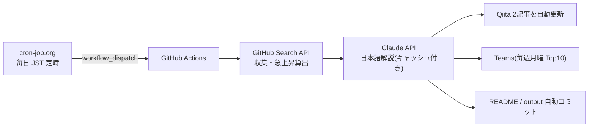

# Claude Code向けMCPツール候補ランキング

GitHub Search APIを使って、Claude Code周辺で活用候補になりそうなMCP関連リポジトリを定期収集するリポジトリです。

> 注意: この一覧は「Claude Codeでの動作」を保証するものではありません。  
> GitHub上のリポジトリ名・説明文・READMEなどに含まれる情報をもとに、MCP関連ツール候補を探すための入口として利用します。

## 仕組み(定常自律運転)

このランキングは cron-job.org → GitHub Actions → Claude API → Qiita / Teams のパイプラインで、毎日無人更新されています。


```mermaid
flowchart LR
    A["cron-job.org<br>毎日 JST 定時"] -->|workflow_dispatch| B["GitHub Actions"]
    B --> C["GitHub Search API<br>収集・急上昇算出"]
    C --> D["Claude API<br>日本語解説(キャッシュ付き)"]
    D --> E["Qiita 2記事を自動更新"]
    D --> F["Teams(毎週月曜 Top10)"]
    D --> G["README / output 自動コミット"]
```

- 仕組みの詳細と**ライブ稼働ステータス**: [定常自律運転ページ](https://takanobusano.github.io/mcp-github-ranking/)
- 作り方の解説記事: [パイプライン編](https://qiita.com/4q_sano/items/913e93ee5cc2731561fc) / [cron-job.org 完全自動化編](https://qiita.com/4q_sano/items/1bc5e0669a8f0166936c)
<!-- MCP_REPOS_START -->
最終更新: **2026-09-03 08:17:11 JST**

MCP関連リポジトリに加え、Claude Code周辺で活用候補になりそうな関連ツールをGitHub Search APIで毎日自動収集してランキング化しています。

Stars / Forks の差分は、UTC基準の前日データ（2026-09-01）との差分です。
CSVには最大500件を保存し、本文では上位100件を表示しています。

> 注意: この一覧はClaude Codeでの動作を保証するものではありません。  
> MCP関連ツールまたはClaude Code関連ツール候補を探すための入口として利用してください。

# 注目MCP・関連ツール候補ランキング

## 1位 [public-apis/public-apis](https://github.com/public-apis/public-apis)

A collective list of free APIs

⭐ **474,602 Stars**（+364）　🍴 **52,415 Forks**（+49）　/　🟢 **1,855 Open Issues**　/　Python

Topics: `api` / `apis` / `dataset` / `development` / `free` / `list` / `lists` / `open-source`

## 2位 [obra/superpowers](https://github.com/obra/superpowers)

An agentic skills framework & software development methodology that works.

⭐ **280,824 Stars**（+388）　🍴 **25,172 Forks**（+52）　/　🟢 **353 Open Issues**　/　Shell

Topics: `ai` / `brainstorming` / `coding` / `obra` / `sdlc` / `skills` / `subagent-driven-development` / `superpowers`

## 3位 [affaan-m/ECC](https://github.com/affaan-m/ECC)

The agent harness performance optimization system. Skills, instincts, memory, security, and research-first development for Claude Code, Codex, Opencode, Cursor and beyond.

⭐ **246,290 Stars**（+547）　🍴 **37,144 Forks**（+58）　/　🟢 **135 Open Issues**　/　JavaScript

Topics: `ai-agents` / `anthropic` / `claude` / `claude-code` / `developer-tools` / `llm` / `mcp` / `productivity`

## 4位 [mattpocock/skills](https://github.com/mattpocock/skills)

Skills for Real Engineers. Straight from my .agents directory.

⭐ **245,181 Stars**（+1,257）　🍴 **20,845 Forks**（+111）　/　🟢 **450 Open Issues**　/　Shell

Topics: `topicなし`

## 5位 [NousResearch/hermes-agent](https://github.com/NousResearch/hermes-agent)

The agent that grows with you

⭐ **240,098 Stars**（+597）　🍴 **49,121 Forks**（+193）　/　🟢 **38,538 Open Issues**　/　Python

Topics: `ai` / `ai-agent` / `ai-agents` / `anthropic` / `chatgpt` / `claude` / `claude-code` / `codex`

## 6位 [multica-ai/andrej-karpathy-skills](https://github.com/multica-ai/andrej-karpathy-skills)

A single CLAUDE.md file to improve Claude Code behavior, derived from Andrej Karpathy's observations on LLM coding pitfalls.

⭐ **209,653 Stars**（+273）　🍴 **21,332 Forks**（+25）　/　🟢 **129 Open Issues**　/　不明

Topics: `topicなし`

## 7位 [ultraworkers/claw-code](https://github.com/ultraworkers/claw-code)

An agent-managed museum exhibit, built in Rust with Gajae-Code / LazyCodex — developed and maintained with no human intervention.

⭐ **195,159 Stars**（-4）　🍴 **108,755 Forks**（-33）　/　🟢 **41 Open Issues**　/　Rust

Topics: `topicなし`

## 8位 [ollama/ollama](https://github.com/ollama/ollama)

Get up and running with Kimi-K2.6, GLM-5.2, MiniMax, DeepSeek, gpt-oss, Qwen, Gemma and other models.

⭐ **179,999 Stars**（+82）　🍴 **17,665 Forks**（+15）　/　🟢 **3,882 Open Issues**　/　Go

Topics: `deepseek` / `gemma` / `gemma3` / `glm` / `go` / `golang` / `gpt-oss` / `llama`

## 9位 [firecrawl/firecrawl](https://github.com/firecrawl/firecrawl)

The context API to search, scrape, and interact with the web at scale. 🔥

⭐ **175,730 Stars**（+441）　🍴 **9,629 Forks**（+9）　/　🟢 **585 Open Issues**　/　TypeScript

Topics: `ai` / `ai-agents` / `ai-crawler` / `ai-scraping` / `ai-search` / `crawler` / `data-extraction` / `html-to-markdown`

## 10位 [anthropics/skills](https://github.com/anthropics/skills)

Public repository for Agent Skills

⭐ **173,253 Stars**（+236）　🍴 **20,564 Forks**（+24）　/　🟢 **1,202 Open Issues**　/　Python

Topics: `agent-skills`

## 11位 [langflow-ai/langflow](https://github.com/langflow-ai/langflow)

Langflow is a powerful tool for building and deploying AI-powered agents and workflows.

⭐ **154,126 Stars**（+80）　🍴 **10,003 Forks**（+7）　/　🟢 **1,024 Open Issues**　/　Python

Topics: `agents` / `chatgpt` / `generative-ai` / `large-language-models` / `multiagent` / `react-flow`

## 12位 [msitarzewski/agency-agents](https://github.com/msitarzewski/agency-agents)

A complete AI agency at your fingertips - From frontend wizards to Reddit community ninjas, from whimsy injectors to reality checkers. Each agent is a specialized expert with personality, processes, and proven deliverables.

⭐ **149,742 Stars**（+231）　🍴 **24,136 Forks**（+29）　/　🟢 **156 Open Issues**　/　Shell

Topics: `topicなし`

## 13位 [anthropics/claude-code](https://github.com/anthropics/claude-code)

Claude Code is an agentic coding tool that lives in your terminal, understands your codebase, and helps you code faster by executing routine tasks, explaining complex code, and handling git workflows - all through natural language commands.

⭐ **143,809 Stars**（+111）　🍴 **22,992 Forks**（+11）　/　🟢 **14,885 Open Issues**　/　Python

Topics: `topicなし`

## 14位 [x1xhlol/system-prompts-and-models-of-ai-tools](https://github.com/x1xhlol/system-prompts-and-models-of-ai-tools)

FULL Augment Code, Claude Code, Cluely, CodeBuddy, Comet, Cursor, Devin AI, Junie, Kiro, Leap.new, Lovable, Manus, NotionAI, Orchids.app, Perplexity, Poke, Qoder, Replit, Same.dev, Trae, Traycer AI, VSCode Agent, Warp.dev, Windsurf, Xcode, Z.ai Code, Dia & v0. (And other Open Sourced) System Prompts, Internal Tools & AI Models

⭐ **143,298 Stars**（+15）　🍴 **34,830 Forks**（-7）　/　🟢 **161 Open Issues**　/　不明

Topics: `ai` / `bolt` / `cluely` / `copilot` / `cursor` / `cursorai` / `devin` / `github-copilot`

## 15位 [garrytan/gstack](https://github.com/garrytan/gstack)

Use Garry Tan's exact Claude Code setup: 23 opinionated tools that serve as CEO, Designer, Eng Manager, Release Manager, Doc Engineer, and QA

⭐ **130,929 Stars**（-18）　🍴 **19,677 Forks**（+21）　/　🟢 **842 Open Issues**　/　TypeScript

Topics: `topicなし`

## 16位 [farion1231/cc-switch](https://github.com/farion1231/cc-switch)

A cross-platform desktop All-in-One assistant for Claude Code, Codex, OpenCode, OpenClaw, Grok Build & Hermes Agent. Only official website: ccswitch.io

⭐ **130,733 Stars**（+175）　🍴 **8,984 Forks**（+19）　/　🟢 **2,590 Open Issues**　/　Rust

Topics: `ai-tools` / `claude-code` / `codex` / `desktop-app` / `grok` / `grokbuild` / `hermes` / `hermes-agent`

## 17位 [nextlevelbuilder/ui-ux-pro-max-skill](https://github.com/nextlevelbuilder/ui-ux-pro-max-skill)

An AI skill that provides design intelligence for building professional UI/UX across multiple platforms.

⭐ **124,319 Stars**（+442）　🍴 **13,307 Forks**（+52）　/　🟢 **87 Open Issues**　/　Python

Topics: `ai-skills` / `antigravity` / `claude` / `claude-code` / `codex` / `command-line` / `copilot` / `cursor-ai`

## 18位 [DietrichGebert/ponytail](https://github.com/DietrichGebert/ponytail)

Makes your AI agent think like the laziest senior dev in the room. The best code is the code you never wrote.

⭐ **121,428 Stars**（+1,527）　🍴 **6,567 Forks**（+65）　/　🟢 **201 Open Issues**　/　JavaScript

Topics: `agent-skills` / `ai-agents` / `claude` / `claude-code` / `claude-code-plugin` / `cursor-rules` / `developer-tools` / `llm`

## 19位 [harry0703/MoneyPrinterTurbo](https://github.com/harry0703/MoneyPrinterTurbo)

利用 AI 大模型和自动化工作流，根据主题或关键词一键生成高清短视频。Generate HD short videos from a topic or keyword with an automated AI workflow.

⭐ **119,911 Stars**（+515）　🍴 **18,366 Forks**（+93）　/　🟢 **21 Open Issues**　/　Python

Topics: `ai-video-generator` / `content-creation` / `ffmpeg` / `instagram-reels` / `llm` / `python` / `short-video` / `subtitles`

## 20位 [Graphify-Labs/graphify](https://github.com/Graphify-Labs/graphify)

Turn any codebase, with its docs, SQL schemas, configs, and PDFs, into a queryable knowledge graph. A /graphify skill for Claude Code, Cursor, Codex, and Gemini CLI: local deterministic AST parsing, every edge explained, no vector store.

⭐ **113,998 Stars**（+589）　🍴 **11,082 Forks**（+43）　/　🟢 **1,221 Open Issues**　/　Python

Topics: `ai-agents` / `antigravity` / `ast` / `claude-code` / `code-analysis` / `code-search` / `codex` / `cursor`

## 21位 [browser-use/browser-use](https://github.com/browser-use/browser-use)

🌐 Make websites accessible for AI agents. Automate tasks online with ease.

⭐ **112,083 Stars**（+109）　🍴 **12,329 Forks**（+21）　/　🟢 **399 Open Issues**　/　Python

Topics: `ai-agents` / `ai-tools` / `browser-automation` / `browser-use` / `llm` / `playwright` / `python`

## 22位 [google-gemini/gemini-cli](https://github.com/google-gemini/gemini-cli)

An open-source AI agent that brings the power of Gemini directly into your terminal.

⭐ **106,777 Stars**（+16）　🍴 **14,520 Forks**（+4）　/　🟢 **862 Open Issues**　/　TypeScript

Topics: `ai` / `ai-agents` / `cli` / `gemini` / `gemini-api` / `mcp-client` / `mcp-server`

## 23位 [JuliusBrussee/caveman](https://github.com/JuliusBrussee/caveman)

🪨 why use many token when few token do trick — Claude Code skill that cuts 65% of tokens by talking like caveman

⭐ **102,608 Stars**（+346）　🍴 **5,970 Forks**（+15）　/　🟢 **101 Open Issues**　/　Go

Topics: `ai` / `anthropic` / `caveman` / `claude` / `claude-code` / `llm` / `meme` / `prompt-engineering`

## 24位 [TauricResearch/TradingAgents](https://github.com/TauricResearch/TradingAgents)

TradingAgents: Multi-Agents LLM Financial Trading Framework

⭐ **102,315 Stars**（+112）　🍴 **19,688 Forks**（+23）　/　🟢 **363 Open Issues**　/　Python

Topics: `agent` / `finance` / `llm` / `multiagent` / `trading`

## 25位 [microsoft/playwright](https://github.com/microsoft/playwright)

Playwright is a framework for Web Testing and Automation. It allows testing Chromium, Firefox and WebKit with a single API.

⭐ **95,539 Stars**（+48）　🍴 **6,377 Forks**（+3）　/　🟢 **185 Open Issues**　/　TypeScript

Topics: `automation` / `chrome` / `chromium` / `e2e-testing` / `electron` / `end-to-end-testing` / `firefox` / `javascript`

## 26位 [puppeteer/puppeteer](https://github.com/puppeteer/puppeteer)

JavaScript API for Chrome and Firefox

⭐ **95,537 Stars**（+3）　🍴 **9,575 Forks**（+1）　/　🟢 **262 Open Issues**　/　TypeScript

Topics: `automation` / `chrome` / `chromium` / `developer-tools` / `firefox` / `headless-chrome` / `node-module` / `testing`

## 27位 [nexu-io/open-design](https://github.com/nexu-io/open-design)

🎨 Best DeepSeek Harness Design Plugin. The open-source Claude Design alternative. 🖥️ Local-first desktop app. 🖼️ Your coding agent becomes the design engine: pr...

⭐ **93,621 Stars**（+269）　🍴 **10,795 Forks**（+22）　/　🟢 **924 Open Issues**　/　不明

Topics: `agent-skills` / `ai-design` / `byok` / `claude-code-for-design` / `claude-design` / `codex-design` / `coding-agents` / `cursor-design`

## 28位 [thedotmack/claude-mem](https://github.com/thedotmack/claude-mem)

Persistent Context Across Sessions for Every Agent –  Captures everything your agent does during sessions, compresses it with AI, and injects relevant context back into future sessions. Works with Claude Code, OpenClaw, Codex, Gemini, Hermes, Copilot, OpenCode + More

⭐ **93,028 Stars**（+127）　🍴 **8,179 Forks**（+10）　/　🟢 **298 Open Issues**　/　JavaScript

Topics: `ai` / `ai-agents` / `ai-memory` / `anthropic` / `artificial-intelligence` / `chromadb` / `claude` / `claude-agent-sdk`

## 29位 [addyosmani/agent-skills](https://github.com/addyosmani/agent-skills)

Production-grade engineering skills for AI coding agents.

⭐ **91,714 Stars**（+255）　🍴 **9,793 Forks**（+26）　/　🟢 **134 Open Issues**　/　JavaScript

Topics: `agent-skills` / `antigravity` / `claude-code` / `codex` / `cursor` / `skills`

## 30位 [modelcontextprotocol/servers](https://github.com/modelcontextprotocol/servers)

Model Context Protocol Servers

⭐ **90,034 Stars**（+28）　🍴 **11,543 Forks**（+6）　/　🟢 **508 Open Issues**　/　TypeScript

Topics: `topicなし`

## 31位 [ChatGPTNextWeb/NextChat](https://github.com/ChatGPTNextWeb/NextChat)

✨ Light and Fast AI Assistant. Support: Web \| iOS \| MacOS \| Android \|  Linux \| Windows

⭐ **88,688 Stars**（+6）　🍴 **59,154 Forks**（-9）　/　🟢 **855 Open Issues**　/　TypeScript

Topics: `calclaude` / `chatgpt` / `claude` / `cross-platform` / `desktop` / `fe` / `gemini` / `gemini-pro`

## 32位 [OpenCut-app/OpenCut](https://github.com/OpenCut-app/OpenCut)

The open-source CapCut alternative

⭐ **88,495 Stars**（+157）　🍴 **8,727 Forks**（+18）　/　🟢 **378 Open Issues**　/　TypeScript

Topics: `editor` / `oss` / `videoeditor`

## 33位 [OpenHands/OpenHands](https://github.com/OpenHands/OpenHands)

🙌 OpenHands: AI-Driven Development

⭐ **85,983 Stars**（+101）　🍴 **11,279 Forks**（+16）　/　🟢 **641 Open Issues**　/　TypeScript

Topics: `agent` / `artificial-intelligence` / `chatgpt` / `claude-ai` / `cli` / `developer-tools` / `gpt` / `llm`

## 34位 [koala73/worldmonitor](https://github.com/koala73/worldmonitor)

Real-time global intelligence dashboard. AI-powered news aggregation, geopolitical monitoring, and infrastructure tracking in a unified situational awareness interface

⭐ **85,403 Stars**（+74）　🍴 **12,874 Forks**（+26）　/　🟢 **290 Open Issues**　/　TypeScript

Topics: `agent` / `ai` / `dashboard` / `geopolitics` / `mcp` / `mcp-server` / `monitoring` / `news`

## 35位 [laravel/laravel](https://github.com/laravel/laravel)

Laravel is a web application framework with expressive, elegant syntax. We’ve already laid the foundation for your next big idea — freeing you to create without sweating the small things.

⭐ **84,922 Stars**（+5）　🍴 **24,896 Forks**（+4）　/　🟢 **31 Open Issues**　/　Blade

Topics: `framework` / `laravel` / `php`

## 36位 [Leonxlnx/taste-skill](https://github.com/Leonxlnx/taste-skill)

Taste-Skill - gives your AI good taste. stops the AI from generating boring, generic slop

⭐ **83,696 Stars**（+388）　🍴 **5,727 Forks**（+26）　/　🟢 **59 Open Issues**　/　JavaScript

Topics: `agent` / `ai` / `claude` / `claude-code` / `codex` / `coding` / `design` / `frontend`

## 37位 [lobehub/lobehub](https://github.com/lobehub/lobehub)

🤯 LobeHub is your Chief Agent Operator, organizing your agents into 7×24 operations by hiring, scheduling, and reporting on your entire AI team.

⭐ **82,173 Stars**（+25）　🍴 **15,848 Forks**（+4）　/　🟢 **872 Open Issues**　/　TypeScript

Topics: `agent` / `agent-collaboration` / `agent-harness` / `ai` / `cao` / `chatgpt` / `chief-agent-operator` / `claude`

## 38位 [Egonex-AI/Understand-Anything](https://github.com/Egonex-AI/Understand-Anything)

Graphs that teach > graphs that impress. Turn any code into an interactive knowledge graph you can explore, search, and ask questions about. Works with Claude Code, Codex, Cursor, Copilot, Gemini CLI, and more.

⭐ **81,342 Stars**（+81）　🍴 **6,841 Forks**（+9）　/　🟢 **303 Open Issues**　/　TypeScript

Topics: `antigravity-skills` / `business-knowledge` / `claude-code` / `claude-skills` / `codebase-analysis` / `codex` / `codex-skills` / `developer-tools-ai-agent`

## 39位 [bytedance/deer-flow](https://github.com/bytedance/deer-flow)

An open-source long-horizon SuperAgent harness that researches, codes, and creates. With the help of sandboxes, memories, tools, skill, subagents and message gateway, it handles different levels of tasks that could take minutes to hours.

⭐ **81,276 Stars**（+43）　🍴 **11,205 Forks**（+12）　/　🟢 **875 Open Issues**　/　Python

Topics: `agent` / `agentic` / `agentic-framework` / `agentic-workflow` / `ai` / `ai-agents` / `deep-research` / `harness`

## 40位 [unclecode/crawl4ai](https://github.com/unclecode/crawl4ai)

🚀🤖 Crawl4AI: Open-source LLM Friendly Web Crawler & Scraper. Don't be shy, join here:

⭐ **81,123 Stars**（+292）　🍴 **8,370 Forks**（+14）　/　🟢 **172 Open Issues**　/　Python

Topics: `topicなし`

## 41位 [paperclipai/paperclip](https://github.com/paperclipai/paperclip)

The open-source app everyone uses to manage agents at work

⭐ **79,887 Stars**（+57）　🍴 **14,664 Forks**（+11）　/　🟢 **5,352 Open Issues**　/　TypeScript

Topics: `topicなし`

## 42位 [opendatalab/MinerU](https://github.com/opendatalab/MinerU)

Transforms complex documents like PDFs and Office docs into LLM-ready markdown/JSON for your Agentic workflows.

⭐ **79,032 Stars**（+79）　🍴 **6,627 Forks**（+4）　/　🟢 **108 Open Issues**　/　Python

Topics: `ai4science` / `document-analysis` / `docx` / `extract-data` / `layout-analysis` / `ocr` / `parser` / `pdf`

## 43位 [rtk-ai/rtk](https://github.com/rtk-ai/rtk)

CLI proxy that reduces LLM token consumption by 60-90% on common dev commands. Single Rust binary, zero dependencies

⭐ **78,344 Stars**（+123）　🍴 **4,943 Forks**（+12）　/　🟢 **2,079 Open Issues**　/　Rust

Topics: `agentic-coding` / `ai-coding` / `anthropic` / `claude-code` / `cli` / `command-line-tool` / `cost-reduction` / `developer-tools`

## 44位 [D4Vinci/Scrapling](https://github.com/D4Vinci/Scrapling)

🕷️ An adaptive Web Scraping framework that handles everything from a single request to a full-scale crawl!

⭐ **78,077 Stars**（+310）　🍴 **7,847 Forks**（+41）　/　🟢 **10 Open Issues**　/　Python

Topics: `ai` / `ai-scraping` / `automation` / `crawler` / `crawling` / `crawling-python` / `data` / `data-extraction`

## 45位 [Panniantong/Agent-Reach](https://github.com/Panniantong/Agent-Reach)

Give your AI agent eyes to see the entire internet. Read & search Twitter, Reddit, YouTube, GitHub, Bilibili, XiaoHongShu — one CLI, zero API fees.

⭐ **77,604 Stars**（+233）　🍴 **6,654 Forks**（+29）　/　🟢 **114 Open Issues**　/　Python

Topics: `agent-infrastructure` / `ai-agent` / `ai-search` / `automation` / `bilibili` / `claude-code` / `cli` / `cursor`

## 46位 [abi/screenshot-to-code](https://github.com/abi/screenshot-to-code)

Drop in a screenshot and convert it to clean code (HTML/Tailwind/React/Vue)

⭐ **77,187 Stars**（+205）　🍴 **9,403 Forks**（+21）　/　🟢 **140 Open Issues**　/　Python

Topics: `topicなし`

## 47位 [shareAI-lab/learn-claude-code](https://github.com/shareAI-lab/learn-claude-code)

Bash is all you need -  A nano claude code–like 「agent harness」, built from 0 to 1

⭐ **75,915 Stars**（+81）　🍴 **12,228 Forks**（+5）　/　🟢 **32 Open Issues**　/　Python

Topics: `agent` / `agent-development` / `ai-agent` / `claude` / `claude-code` / `educational` / `llm` / `python`

## 48位 [unslothai/unsloth](https://github.com/unslothai/unsloth)

Local UI to run and train LLMs and diffusion models. Supports GGUF, MLX, Qwen3.8, DeepSeek-V4, MiniMax-H3, Gemma 4, FLUX and more.

⭐ **75,501 Stars**（+62）　🍴 **6,857 Forks**（+6）　/　🟢 **1,387 Open Issues**　/　Python

Topics: `agent` / `ai` / `chatgpt` / `deepseek` / `fine-tuning` / `gemma` / `image-generation` / `llama`

## 49位 [Eugeny/tabby](https://github.com/Eugeny/tabby)

A terminal for a more modern age

⭐ **74,292 Stars**（+21）　🍴 **4,231 Forks**（+2）　/　🟢 **2,877 Open Issues**　/　TypeScript

Topics: `serial` / `ssh-client` / `telnet-client` / `terminal` / `terminal-emulators`

## 50位 [thedaviddias/Front-End-Checklist](https://github.com/thedaviddias/Front-End-Checklist)

🗂 The essential checklist for modern web development, for humans and AI agents

⭐ **74,016 Stars**（+8）　🍴 **6,731 Forks**（+3）　/　🟢 **7 Open Issues**　/　MDX

Topics: `ai-agent` / `ai-agents` / `checklist` / `css` / `front-end-developer-tool` / `front-end-development` / `frontend` / `guidelines`

## 51位 [OpenBB-finance/OpenBB](https://github.com/OpenBB-finance/OpenBB)

Open Data Platform for analysts, quants and AI agents.

⭐ **72,620 Stars**（+37）　🍴 **7,498 Forks**（+7）　/　🟢 **112 Open Issues**　/　Python

Topics: `ai` / `crypto` / `derivatives` / `economics` / `equity` / `finance` / `fixed-income` / `machine-learning`

## 52位 [daytonaio/daytona](https://github.com/daytonaio/daytona)

Daytona is a Secure and Elastic Infrastructure for Running AI-Generated Code

⭐ **71,835 Stars**（-11）　🍴 **5,651 Forks**（±0）　/　🟢 **450 Open Issues**　/　不明

Topics: `agentic-workflow` / `ai` / `ai-agents` / `ai-runtime` / `ai-sandboxes` / `code-execution` / `code-interpreter` / `developer-tools`

## 53位 [ruvnet/ruflo](https://github.com/ruvnet/ruflo)

🌊 The original agent meta-harness. Deploy intelligent multi-player swarms, coordinate autonomous workflows, and build conversational AI systems. Features adapti...

⭐ **70,250 Stars**（+112）　🍴 **8,381 Forks**（+11）　/　🟢 **897 Open Issues**　/　TypeScript

Topics: `agentic-ai` / `agentic-framework` / `agentic-workflow` / `agents` / `ai-agents` / `ai-assistant` / `ai-skills` / `autonomous-agents`

## 54位 [colbymchenry/codegraph](https://github.com/colbymchenry/codegraph)

Pre-indexed code knowledge graph, auto syncs on code changes, for Claude Code, Codex, Gemini, Cursor, OpenCode, AntiGravity, Kiro, CoPilot, and Hermes Agent — fewer tokens, fewer tool calls, 100% local

⭐ **69,281 Stars**（+208）　🍴 **4,419 Forks**（+4）　/　🟢 **479 Open Issues**　/　C

Topics: `topicなし`

## 55位 [code-yeongyu/oh-my-openagent](https://github.com/code-yeongyu/oh-my-openagent)

omo/lazycodex: The coding agent for tokenmaxxers;the one and only agent harness for complex codebases. For your Codex, for your OpenCode

⭐ **68,617 Stars**（+26）　🍴 **5,637 Forks**（+7）　/　🟢 **900 Open Issues**　/　TypeScript

Topics: `ai` / `ai-agents` / `anthropic` / `chatgpt` / `claude` / `claude-skills` / `codex` / `cursor`

## 56位 [headroomlabs-ai/headroom](https://github.com/headroomlabs-ai/headroom)

Compress tool outputs, logs, files, and RAG chunks before they reach the LLM. 20% fewer tokens for coding agents, 60-95% fewer tokens for JSON, same answers. Library, proxy, MCP server.

⭐ **68,590 Stars**（+264）　🍴 **5,313 Forks**（+14）　/　🟢 **615 Open Issues**　/　Python

Topics: `agent` / `ai` / `anthropic` / `claude-code` / `compression` / `context-engineering` / `context-window` / `cursor`

## 57位 [openinterpreter/openinterpreter](https://github.com/openinterpreter/openinterpreter)

A coding agent for open models like Kimi K3

⭐ **68,220 Stars**（±0）　🍴 **5,871 Forks**（+2）　/　🟢 **10 Open Issues**　/　Rust

Topics: `acp` / `coding-agent` / `deepseek` / `kimi` / `qwen` / `rust`

## 58位 [cline/cline](https://github.com/cline/cline)

Autonomous coding agent as an SDK, IDE extension, or CLI assistant.

⭐ **67,370 Stars**（+67）　🍴 **7,276 Forks**（+3）　/　🟢 **1,185 Open Issues**　/　TypeScript

Topics: `topicなし`

## 59位 [Fission-AI/OpenSpec](https://github.com/Fission-AI/OpenSpec)

Spec-driven development (SDD) for AI coding assistants.

⭐ **67,060 Stars**（+112）　🍴 **4,617 Forks**（+3）　/　🟢 **197 Open Issues**　/　TypeScript

Topics: `ai` / `context-engineering` / `engineering` / `planning` / `prd` / `sdd` / `sdlc` / `spec`

## 60位 [bradtraversy/design-resources-for-developers](https://github.com/bradtraversy/design-resources-for-developers)

Curated list of design and UI resources from stock photos, web templates, CSS frameworks, UI libraries, tools and much more

⭐ **66,808 Stars**（+8）　🍴 **12,163 Forks**（±0）　/　🟢 **108 Open Issues**　/　不明

Topics: `topicなし`

## 61位 [xtekky/gpt4free](https://github.com/xtekky/gpt4free)

The official gpt4free repository \| various collection of powerful language models \| opus 4.6 gpt 5.3 kimi 2.5 deepseek v3.2 gemini 3

⭐ **66,629 Stars**（+6）　🍴 **13,511 Forks**（±0）　/　🟢 **2 Open Issues**　/　Python

Topics: `chatbot` / `chatbots` / `chatgpt` / `chatgpt-4` / `chatgpt-api` / `chatgpt-free` / `chatgpt4` / `deepseek`

## 62位 [docling-project/docling](https://github.com/docling-project/docling)

Get your documents ready for gen AI

⭐ **65,906 Stars**（+47）　🍴 **4,739 Forks**（+7）　/　🟢 **885 Open Issues**　/　Python

Topics: `ai` / `convert` / `document-parser` / `document-parsing` / `documents` / `docx` / `html` / `markdown`

## 63位 [shanraisshan/claude-code-best-practice](https://github.com/shanraisshan/claude-code-best-practice)

from vibe coding to agentic engineering - practice makes claude perfect

⭐ **65,556 Stars**（+49）　🍴 **6,523 Forks**（+1）　/　🟢 **18 Open Issues**　/　HTML

Topics: `agentic-ai` / `agentic-coding` / `agentic-engineering` / `agentic-workflow` / `ai` / `ai-agents` / `anthropic` / `best-practices`

## 64位 [pbakaus/impeccable](https://github.com/pbakaus/impeccable)

The design language that makes your AI harness better at design.

⭐ **64,988 Stars**（+319）　🍴 **4,004 Forks**（+21）　/　🟢 **29 Open Issues**　/　JavaScript

Topics: `topicなし`

## 65位 [warpdotdev/warp](https://github.com/warpdotdev/warp)

Warp is an agentic development environment, born out of the terminal.

⭐ **64,737 Stars**（+24）　🍴 **5,497 Forks**（+2）　/　🟢 **5,161 Open Issues**　/　Rust

Topics: `bash` / `linux` / `macos` / `rust` / `shell` / `terminal` / `wasm` / `zsh`

## 66位 [mem0ai/mem0](https://github.com/mem0ai/mem0)

The Memory Layer for AI Agents - Drop-in memory infrastructure for AI agents and apps. Context that persists. Built for production.

⭐ **64,590 Stars**（+56）　🍴 **7,570 Forks**（+11）　/　🟢 **720 Open Issues**　/　Python

Topics: `agentic-memory` / `agentic-memory-system` / `agents` / `ai` / `ai-agents` / `chatgpt` / `genai` / `llm`

## 67位 [NanmiCoder/MediaCrawler](https://github.com/NanmiCoder/MediaCrawler)

小红书笔记 \| 评论爬虫、抖音视频 \| 评论爬虫、快手视频 \| 评论爬虫、B 站视频 ｜ 评论爬虫、微博帖子 ｜ 评论爬虫、百度贴吧帖子 ｜ 百度贴吧评论回复爬虫  \| 知乎问答文章｜评论爬虫

⭐ **64,331 Stars**（+54）　🍴 **12,493 Forks**（+7）　/　🟢 **191 Open Issues**　/　Python

Topics: `topicなし`

## 68位 [asgeirtj/system_prompts_leaks](https://github.com/asgeirtj/system_prompts_leaks)

Extracted system prompts from Anthropic - Claude Fable 5, Opus 5, Claude Design, Claude Code. OpenAI - ChatGPT GPT-5.6-Sol, Codex. Google - Gemini 3.5 Flash, 3.1 Pro, Antigravity. xAI - Grok, Cursor, Copilot, VS Code, Perplexity, and more. Updated regularly.

⭐ **64,035 Stars**（+73）　🍴 **10,506 Forks**（+8）　/　🟢 **49 Open Issues**　/　JavaScript

Topics: `ai` / `ai-agents` / `ai-prompts` / `anthropic` / `chatbot` / `chatgpt` / `claude` / `claude-code`

## 69位 [sansan0/TrendRadar](https://github.com/sansan0/TrendRadar)

⭐AI-driven public opinion & trend monitor with multi-platform aggregation, RSS, and smart alerts.🎯 告别信息过载，你的 AI 舆情监控助手与热点筛选工具！聚合多平台热点 +  RSS 订阅，支持关键词精准筛选。AI 智能筛...

⭐ **61,998 Stars**（+14）　🍴 **24,881 Forks**（+6）　/　🟢 **59 Open Issues**　/　Python

Topics: `ai` / `bark` / `data-analysis` / `docker` / `hot-news` / `llm` / `mail` / `mcp`

## 70位 [upstash/context7](https://github.com/upstash/context7)

Context7 Platform -- Up-to-date code documentation for LLMs and AI code editors

⭐ **61,531 Stars**（+39）　🍴 **2,962 Forks**（-1）　/　🟢 **63 Open Issues**　/　TypeScript

Topics: `llm` / `mcp` / `mcp-server` / `vibe-coding`

## 71位 [coollabsio/coolify](https://github.com/coollabsio/coolify)

An open-source, self-hostable PaaS alternative to Vercel, Heroku & Netlify that lets you easily deploy static sites, databases, full-stack applications and 280+ one-click services on your own servers.

⭐ **61,317 Stars**（+20）　🍴 **5,394 Forks**（-4）　/　🟢 **672 Open Issues**　/　PHP

Topics: `coolify` / `databases` / `deployment` / `docker` / `docker-compose` / `inertiajs` / `laravel` / `mariadb`

## 72位 [1c7/chinese-independent-developer](https://github.com/1c7/chinese-independent-developer)

👩🏿‍💻👨🏾‍💻👩🏼‍💻👨🏽‍💻👩🏻‍💻中国独立开发者项目列表 -- 分享大家都在做什么

⭐ **61,229 Stars**（+25）　🍴 **5,356 Forks**（+7）　/　🟢 **1 Open Issues**　/　Python

Topics: `china` / `indie` / `indie-developer`

## 73位 [tw93/Pake](https://github.com/tw93/Pake)

🤱🏻 Turn any webpage into a desktop app with one command.

⭐ **61,227 Stars**（+20）　🍴 **12,586 Forks**（±0）　/　🟢 **2 Open Issues**　/　Rust

Topics: `chatgpt` / `claude` / `desktop` / `gemini` / `hight-performance` / `linux` / `macos` / `no-electron`

## 74位 [mvanhorn/last30days-skill](https://github.com/mvanhorn/last30days-skill)

AI agent skill that researches any topic across Reddit, X, YouTube, HN, Polymarket, and the web - then synthesizes a grounded summary

⭐ **61,011 Stars**（+118）　🍴 **5,331 Forks**（+10）　/　🟢 **167 Open Issues**　/　Python

Topics: `ai-prompts` / `ai-skill` / `bluesky` / `claude` / `claude-code` / `clawhub` / `deep-research` / `hackernews`

## 75位 [microsoft/autogen](https://github.com/microsoft/autogen)

A programming framework for agentic AI

⭐ **60,766 Stars**（+26）　🍴 **9,173 Forks**（+1）　/　🟢 **1,030 Open Issues**　/　Python

Topics: `agentic` / `agentic-agi` / `agents` / `ai` / `autogen` / `autogen-ecosystem` / `chatgpt` / `framework`

## 76位 [diegosouzapw/OmniRoute](https://github.com/diegosouzapw/OmniRoute)

Never stop coding. Free MIT AI gateway: one endpoint, 352 providers (150+ free), 1200+ models Kimi, Claude, GPT, Gemini, GLM, DeepSeek, MiniMax. Works with Claude Code, Codex, Cursor, OpenCode, Cline & Copilot. Quota-aware auto-fallback, RTK+Caveman compression saves 15-95% tokens, MCP/A2A, Desktop/PWA. Built by 550+ contributors

⭐ **60,380 Stars**（+550）　🍴 **8,388 Forks**（+77）　/　🟢 **256 Open Issues**　/　TypeScript

Topics: `a2a` / `ai-agents` / `ai-gateway` / `anthropic` / `claude` / `claude-code` / `cline` / `codex`

## 77位 [usestrix/strix](https://github.com/usestrix/strix)

Open-source AI penetration testing tool to find and fix your app’s vulnerabilities.

⭐ **60,174 Stars**（+213）　🍴 **6,581 Forks**（+28）　/　🟢 **339 Open Issues**　/　Python

Topics: `agents` / `ai-hacking` / `ai-penetration-testing` / `ai-pentesting` / `ai-security` / `artificial-intelligence` / `bug-bounty` / `code-quality`

## 78位 [stablyai/orca](https://github.com/stablyai/orca)

Orca is the ADE for working with a fleet of parallel agents. Run any coding agent with your own subscription. Available on desktop, mobile and VPS.

⭐ **59,982 Stars**（+768）　🍴 **4,043 Forks**（+37）　/　🟢 **5,058 Open Issues**　/　TypeScript

Topics: `ade` / `agent-ide` / `ai-agents` / `claude-code` / `cli` / `codex` / `cursor-agent` / `devtools`

## 79位 [penpot/penpot](https://github.com/penpot/penpot)

Penpot: The open-source design platform for Product teams that need scalable collaboration.

⭐ **59,510 Stars**（+46）　🍴 **4,044 Forks**（+4）　/　🟢 **773 Open Issues**　/　Clojure

Topics: `clojure` / `clojurescript` / `design` / `prototyping` / `ui` / `ux-design` / `ux-experience`

## 80位 [meilisearch/meilisearch](https://github.com/meilisearch/meilisearch)

A lightning-fast search engine API bringing AI-powered hybrid search to your sites and applications.

⭐ **59,170 Stars**（+3）　🍴 **2,694 Forks**（±0）　/　🟢 **317 Open Issues**　/　Rust

Topics: `ai` / `api` / `app-search` / `database` / `enterprise-search` / `faceting` / `full-text-search` / `fuzzy-search`

## 81位 [MemPalace/mempalace](https://github.com/MemPalace/mempalace)

The best-benchmarked open-source AI memory system. And it's free.

⭐ **58,804 Stars**（+26）　🍴 **7,544 Forks**（±0）　/　🟢 **751 Open Issues**　/　Python

Topics: `ai` / `chromadb` / `llm` / `mcp` / `memory` / `python`

## 82位 [FoundationAgents/OpenManus](https://github.com/FoundationAgents/OpenManus)

No fortress, purely open ground.  OpenManus is Coming.

⭐ **58,173 Stars**（+15）　🍴 **10,103 Forks**（+3）　/　🟢 **464 Open Issues**　/　Python

Topics: `topicなし`

## 83位 [crewAIInc/crewAI](https://github.com/crewAIInc/crewAI)

Framework for orchestrating role-playing, autonomous AI agents. By fostering collaborative intelligence, CrewAI empowers agents to work together seamlessly, tackling complex tasks.

⭐ **58,013 Stars**（+52）　🍴 **8,320 Forks**（+12）　/　🟢 **710 Open Issues**　/　Python

Topics: `agents` / `ai` / `ai-agents` / `aiagentframework` / `llms`

## 84位 [BerriAI/litellm](https://github.com/BerriAI/litellm)

The fastest, litest AI Gateway. Rust core with Python SDK. Call 100+ LLM APIs in OpenAI (or native) format with cost tracking, guardrails, load balancing, and logging [Bedrock, Azure, OpenAI, Anthropic, OpenAI, VertexAI, vLLM, Nvidia NIM]

⭐ **57,855 Stars**（+85）　🍴 **11,107 Forks**（+23）　/　🟢 **4,936 Open Issues**　/　Python

Topics: `ai-gateway` / `anthropic` / `azure-openai` / `bedrock` / `gateway` / `langchain` / `litellm` / `llm`

## 85位 [zylon-ai/private-gpt](https://github.com/zylon-ai/private-gpt)

Complete API layer for private AI applications on local models: RAG, skills, tools, MCP, text-to-sql, and more. Works with any OpenAI-compatible inference server.

⭐ **57,490 Stars**（+1）　🍴 **7,613 Forks**（+1）　/　🟢 **5 Open Issues**　/　Python

Topics: `ai` / `ai-tools` / `on-premise`

## 86位 [calesthio/OpenMontage](https://github.com/calesthio/OpenMontage)

World's first open-source, agentic video production system. 12 production pipelines, 100+ tools, 700+ agent skill and production-knowledge files. Turn your AI coding assistant into a full video production studio.

⭐ **55,667 Stars**（+313）　🍴 **6,955 Forks**（+47）　/　🟢 **290 Open Issues**　/　Python

Topics: `agent` / `agentic-ai` / `ai` / `claude` / `copilot` / `cursor` / `elevenlabs` / `ffmpeg`

## 87位 [aaif-goose/goose](https://github.com/aaif-goose/goose)

an open source, extensible AI agent that goes beyond code suggestions - install, execute, edit, and test with any LLM

⭐ **53,854 Stars**（+46）　🍴 **6,159 Forks**（±0）　/　🟢 **264 Open Issues**　/　Rust

Topics: `acp` / `ai` / `ai-agents` / `mcp`

## 88位 [Alishahryar1/free-claude-code](https://github.com/Alishahryar1/free-claude-code)

Use Claude Code, Codex, Pi, and OpenCode and more for free (1.3B+ free tokens) from your terminal, app, IDE, or phone like OpenClaw (voice supported + ToS friendly)

⭐ **52,823 Stars**（+212）　🍴 **8,479 Forks**（+36）　/　🟢 **368 Open Issues**　/　Python

Topics: `topicなし`

## 89位 [jamiepine/voicebox](https://github.com/jamiepine/voicebox)

The open-source AI voice studio. Clone, dictate, create.

⭐ **52,166 Stars**（+110）　🍴 **6,495 Forks**（+13）　/　🟢 **669 Open Issues**　/　TypeScript

Topics: `ai` / `cuda` / `mlx` / `qwen3-tts` / `qwen3-tts-ui` / `voice-ai` / `voice-clone` / `whisper`

## 90位 [rohitg00/ai-engineering-from-scratch](https://github.com/rohitg00/ai-engineering-from-scratch)

Learn it. Build it. Ship it for others.

⭐ **52,073 Stars**（+246）　🍴 **9,015 Forks**（+39）　/　🟢 **100 Open Issues**　/　Python

Topics: `agents` / `ai` / `ai-agents` / `ai-engineering` / `computer-vision` / `course` / `deep-learning` / `from-scratch`

## 91位 [charlax/professional-programming](https://github.com/charlax/professional-programming)

A collection of learning resources for curious software engineers

⭐ **51,482 Stars**（+14）　🍴 **4,016 Forks**（±0）　/　🟢 **7 Open Issues**　/　Python

Topics: `architecture` / `computer-science` / `concepts` / `documentation` / `engineer` / `learning` / `lessons-learned` / `professional`

## 92位 [hugohe3/ppt-master](https://github.com/hugohe3/ppt-master)

AI turns documents or topics into real, native PowerPoint decks—with native shapes, transitions and animations, data-backed charts and tables on demand, audio narration from speaker notes, and support for your own .pptx templates. · by Hugo He

⭐ **51,478 Stars**（+341）　🍴 **4,122 Forks**（+22）　/　🟢 **4 Open Issues**　/　Python

Topics: `ai-agent` / `aippt` / `office` / `powerpoint` / `powerpoint-generation` / `ppt` / `pptx` / `presentation`

## 93位 [CherryHQ/cherry-studio](https://github.com/CherryHQ/cherry-studio)

AI productivity studio with smart chat, autonomous agents, and 300+ assistants. Unified access to frontier LLMs

⭐ **51,372 Stars**（+30）　🍴 **4,907 Forks**（+2）　/　🟢 **1,488 Open Issues**　/　TypeScript

Topics: `agent-skills` / `ai-agent` / `claude-code` / `codex` / `deepseek` / `deepseek-harness` / `hermes-agent` / `skills`

## 94位 [ChromeDevTools/chrome-devtools-mcp](https://github.com/ChromeDevTools/chrome-devtools-mcp)

Chrome DevTools for coding agents

⭐ **50,620 Stars**（+213）　🍴 **3,553 Forks**（+5）　/　🟢 **87 Open Issues**　/　TypeScript

Topics: `browser` / `chrome` / `chrome-devtools` / `debugging` / `devtools` / `mcp` / `mcp-server` / `puppeteer`

## 95位 [router-for-me/CLIProxyAPI](https://github.com/router-for-me/CLIProxyAPI)

Wrap Antigravity, ChatGPT Codex, Claude Code, Grok Build as an OpenAI/Gemini/Claude/Codex compatible API service, allowing you to enjoy the free Gemini 3.1 Pro, GPT 5.6 Series, Grok 4.5, Claude model through API

⭐ **49,960 Stars**（+193）　🍴 **7,631 Forks**（+24）　/　🟢 **526 Open Issues**　/　Go

Topics: `antigravity` / `claude-code` / `cluade` / `codex` / `gemini` / `openai`

## 96位 [HKUDS/CLI-Anything](https://github.com/HKUDS/CLI-Anything)

"CLI-Anything: Making ALL Software Agent-Native" -- CLI-Hub:

⭐ **48,869 Stars**（+62）　🍴 **4,535 Forks**（+7）　/　🟢 **86 Open Issues**　/　Python

Topics: `topicなし`

## 97位 [mudler/LocalAI](https://github.com/mudler/LocalAI)

LocalAI is the open-source AI engine. Run any model - LLMs, vision, voice, image, video - on any hardware. No GPU required.

⭐ **48,830 Stars**（+22）　🍴 **4,411 Forks**（+4）　/　🟢 **205 Open Issues**　/　Go

Topics: `agents` / `ai` / `api` / `audio-generation` / `decentralized` / `distributed` / `image-generation` / `libp2p`

## 98位 [multica-ai/multica](https://github.com/multica-ai/multica)

Make humans and AI agents work as one team — open-source and self-hostable.

⭐ **48,637 Stars**（+99）　🍴 **6,266 Forks**（+17）　/　🟢 **1,464 Open Issues**　/　Go

Topics: `topicなし`

## 99位 [GitHubDaily/GitHubDaily](https://github.com/GitHubDaily/GitHubDaily)

坚持分享 GitHub 上高质量、有趣实用的开源技术教程、开发者工具、编程网站、技术资讯。A list cool, interesting projects of GitHub.

⭐ **47,808 Stars**（+10）　🍴 **4,692 Forks**（+2）　/　🟢 **802 Open Issues**　/　不明

Topics: `ai` / `algorithms-and-data-structures` / `backend` / `developer-tools` / `development` / `frontend` / `github` / `java`

## 100位 [kepano/obsidian-skills](https://github.com/kepano/obsidian-skills)

Agent skills for Obsidian. Teach your agent to use Obsidian CLI and open formats including Markdown, Bases, JSON Canvas.

⭐ **47,760 Stars**（+106）　🍴 **3,424 Forks**（+4）　/　🟢 **67 Open Issues**　/　不明

Topics: `agents` / `agentskills` / `bases` / `claude` / `clawdbot` / `cli` / `codex` / `defuddle`

# 最近プッシュされたMCP・関連ツール候補

スター数ランキングとは別に、最近コードがプッシュされたリポジトリを表示します。古いスター数だけではなく、現在も開発が動いていそうな候補を探すための一覧です。

## プッシュ順 1位 [huggingface/diffusers](https://github.com/huggingface/diffusers)

🤗 Diffusers: State-of-the-art diffusion models for image, video, and audio generation in PyTorch.

⭐ **34,430 Stars**（+11）　🍴 **7,292 Forks**（+2）　/　Python　/　最終プッシュ: 2026-09-02

Topics: `deep-learning` / `diffusion` / `flux` / `image-generation` / `image2image` / `image2video` / `latent-diffusion-models` / `pytorch`

## プッシュ順 2位 [langchain-ai/deepagents](https://github.com/langchain-ai/deepagents)

The batteries-included agent harness.

⭐ **28,848 Stars**（+22）　🍴 **4,054 Forks**（+5）　/　Python　/　最終プッシュ: 2026-09-02

Topics: `ai` / `deepagents` / `harness` / `harness-engineering` / `langchain` / `langgraph` / `python` / `typescript`

## プッシュ順 3位 [coder/coder](https://github.com/coder/coder)

Secure environments for developers and their agents

⭐ **14,339 Stars**（+12）　🍴 **1,457 Forks**（+1）　/　Go　/　最終プッシュ: 2026-09-02

Topics: `agents` / `dev-tools` / `development-environment` / `go` / `golang` / `ide` / `jetbrains` / `remote-development`

## プッシュ順 4位 [BerriAI/litellm](https://github.com/BerriAI/litellm)

The fastest, litest AI Gateway. Rust core with Python SDK. Call 100+ LLM APIs in OpenAI (or native) format with cost tracking, guardrails, load balancing, and logging [Bedrock, Azure, OpenAI, Anthropic, OpenAI, VertexAI, vLLM, Nvidia NIM]

⭐ **57,855 Stars**（+85）　🍴 **11,107 Forks**（+23）　/　Python　/　最終プッシュ: 2026-09-02

Topics: `ai-gateway` / `anthropic` / `azure-openai` / `bedrock` / `gateway` / `langchain` / `litellm` / `llm`

## プッシュ順 5位 [NVIDIA/NemoClaw](https://github.com/NVIDIA/NemoClaw)

Run agents like Hermes, LangChain Deep Agents, and OpenClaw more securely inside NVIDIA OpenShell with managed inference

⭐ **22,348 Stars**（+8）　🍴 **3,061 Forks**（-1）　/　TypeScript　/　最終プッシュ: 2026-09-02

Topics: `ai-agents` / `hermes` / `nvidia` / `openclaw` / `openshell` / `sandboxing` / `typescript`

## プッシュ順 6位 [cline/cline](https://github.com/cline/cline)

Autonomous coding agent as an SDK, IDE extension, or CLI assistant.

⭐ **67,370 Stars**（+67）　🍴 **7,276 Forks**（+3）　/　TypeScript　/　最終プッシュ: 2026-09-02

Topics: `topicなし`

## プッシュ順 7位 [PostHog/posthog](https://github.com/PostHog/posthog)

:hedgehog: PostHog is the leading platform for building self-driving products. Our developer tools – AI observability, analytics, session replay, flags, experiments, error tracking, logs, and more – capture all the context agents need to diagnose problems, uncover opportunities, and ship fixes. Steer it all from Slack, web, desktop, or the MCP.

⭐ **39,565 Stars**（+33）　🍴 **3,331 Forks**（+6）　/　Python　/　最終プッシュ: 2026-09-02

Topics: `ab-testing` / `ai-analytics` / `analytics` / `cdp` / `data-warehouse` / `experiments` / `feature-flags` / `javascript`

## プッシュ順 8位 [manaflow-ai/cmux](https://github.com/manaflow-ai/cmux)

Open source Ghostty-based macOS terminal with vertical tabs and notifications for AI coding agents. Built for multitasking, organization, and programmability.

⭐ **26,714 Stars**（+42）　🍴 **2,301 Forks**（+10）　/　Swift　/　最終プッシュ: 2026-09-02

Topics: `amp` / `claude-code` / `cli` / `codex` / `coding-agents` / `gemini` / `ghostty` / `macos`

## プッシュ順 9位 [pingdotgg/t3code](https://github.com/pingdotgg/t3code)

説明なし

⭐ **21,484 Stars**（+126）　🍴 **5,208 Forks**（+48）　/　TypeScript　/　最終プッシュ: 2026-09-02

Topics: `topicなし`

## プッシュ順 10位 [CopilotKit/CopilotKit](https://github.com/CopilotKit/CopilotKit)

The Frontend Stack for Agents & Generative UI. React, Angular, Mobile, Slack, and more.  Makers of the AG-UI Protocol

⭐ **37,166 Stars**（+15）　🍴 **4,600 Forks**（+6）　/　TypeScript　/　最終プッシュ: 2026-09-02

Topics: `agent` / `agent-native` / `agentic-ai` / `agents` / `ai` / `ai-agent` / `ai-assistant` / `assistant`

## プッシュ順 11位 [mastra-ai/mastra](https://github.com/mastra-ai/mastra)

Mastra is the modern TypeScript framework for AI-powered applications and agents.

⭐ **27,652 Stars**（+32）　🍴 **2,723 Forks**（+3）　/　TypeScript　/　最終プッシュ: 2026-09-02

Topics: `agents` / `ai` / `chatbots` / `evals` / `javascript` / `llm` / `mcp` / `nextjs`

## プッシュ順 12位 [NousResearch/hermes-agent](https://github.com/NousResearch/hermes-agent)

The agent that grows with you

⭐ **240,098 Stars**（+597）　🍴 **49,121 Forks**（+193）　/　Python　/　最終プッシュ: 2026-09-02

Topics: `ai` / `ai-agent` / `ai-agents` / `anthropic` / `chatgpt` / `claude` / `claude-code` / `codex`

## プッシュ順 13位 [OthmanAdi/planning-with-files](https://github.com/OthmanAdi/planning-with-files)

Persistent file-based planning for AI coding agents and long-running tasks. Crash-proof markdown plans, session recovery after /clear and compaction, per-turn re-injection against context rot, deterministic completion gate. Manus-style. Install from npm, the Claude Code plugin marketplace, or npx skills. Codex, Cursor, OpenCode, 60+ agents.

⭐ **26,587 Stars**（+25）　🍴 **2,219 Forks**（+2）　/　Shell　/　最終プッシュ: 2026-09-02

Topics: `agent-skills` / `autonomous-agents` / `claude` / `claude-code` / `claude-code-skills` / `claude-skills` / `codex` / `coding-agent`

## プッシュ順 14位 [sgl-project/sglang](https://github.com/sgl-project/sglang)

SGLang is a high-performance serving framework for large language models and multimodal models.

⭐ **33,523 Stars**（+465）　🍴 **8,486 Forks**（+35）　/　Python　/　最終プッシュ: 2026-09-02

Topics: `attention` / `blackwell` / `cuda` / `deepseek` / `diffusion` / `glm` / `gpt-oss` / `inference`

## プッシュ順 15位 [ccusage/ccusage](https://github.com/ccusage/ccusage)

npx ccusage

⭐ **18,299 Stars**（+18）　🍴 **818 Forks**（+1）　/　Rust　/　最終プッシュ: 2026-09-02

Topics: `topicなし`

## プッシュ順 16位 [spree/spree](https://github.com/spree/spree)

Open Source eCommerce Platform for B2B, Marketplace, and Enterprise. REST API, TypeScript SDK, and production-ready Next.js storefront. Self-host it. Own your stack. No vendor lock-in. Zero platform fees.

⭐ **15,661 Stars**（+3）　🍴 **5,295 Forks**（+3）　/　Ruby　/　最終プッシュ: 2026-09-02

Topics: `b2b-commerce` / `e-commerce` / `ecommerce` / `ecommerce-api` / `ecommerce-framework` / `ecommerce-platform` / `headless` / `headless-commerce`

## プッシュ順 17位 [feder-cr/AIHawk](https://github.com/feder-cr/AIHawk)

Born as an AI web agent that applied to jobs in bulk. Becoming a general one: an agent you point at the web and tell what to do.

⭐ **30,303 Stars**（前日なし）　🍴 **4,645 Forks**（前日なし）　/　Python　/　最終プッシュ: 2026-09-02

Topics: `anti-bot` / `anti-detect-browser` / `antidetect` / `automation` / `bot-detection` / `browser-automation` / `browser-fingerprinting` / `cloudflare`

## プッシュ順 18位 [pydantic/pydantic-ai](https://github.com/pydantic/pydantic-ai)

How Python does AI. Agents, realtime voice, image generation, embeddings. Every model, every interface, typed end to end.

⭐ **19,679 Stars**（+31）　🍴 **2,634 Forks**（+9）　/　Python　/　最終プッシュ: 2026-09-02

Topics: `agent-framework` / `genai` / `harness` / `harness-engineering` / `llm` / `pydantic` / `python`

## プッシュ順 19位 [ccxt/ccxt](https://github.com/ccxt/ccxt)

A unified trading API with more than 100 crypto exchanges and prediction markets in JavaScript / TypeScript / Python / C# / PHP / Go / Java

⭐ **43,841 Stars**（+8）　🍴 **8,814 Forks**（+3）　/　Python　/　最終プッシュ: 2026-09-02

Topics: `altcoin` / `api` / `arbitrage` / `bitcoin` / `bot` / `btc` / `crypto` / `cryptocurrencies`

## プッシュ順 20位 [affaan-m/ECC](https://github.com/affaan-m/ECC)

The agent harness performance optimization system. Skills, instincts, memory, security, and research-first development for Claude Code, Codex, Opencode, Cursor and beyond.

⭐ **246,290 Stars**（+547）　🍴 **37,144 Forks**（+58）　/　JavaScript　/　最終プッシュ: 2026-09-02

Topics: `ai-agents` / `anthropic` / `claude` / `claude-code` / `developer-tools` / `llm` / `mcp` / `productivity`

## プッシュ順 21位 [Fission-AI/OpenSpec](https://github.com/Fission-AI/OpenSpec)

Spec-driven development (SDD) for AI coding assistants.

⭐ **67,060 Stars**（+112）　🍴 **4,617 Forks**（+3）　/　TypeScript　/　最終プッシュ: 2026-09-02

Topics: `ai` / `context-engineering` / `engineering` / `planning` / `prd` / `sdd` / `sdlc` / `spec`

## プッシュ順 22位 [paperclipai/paperclip](https://github.com/paperclipai/paperclip)

The open-source app everyone uses to manage agents at work

⭐ **79,887 Stars**（+57）　🍴 **14,664 Forks**（+11）　/　TypeScript　/　最終プッシュ: 2026-09-02

Topics: `topicなし`

## プッシュ順 23位 [CoplayDev/unity-mcp](https://github.com/CoplayDev/unity-mcp)

Unity MCP acts as a bridge between AI assistants and your Unity Editor. Give your LLM tools to manage assets, control scenes, edit scripts, and automate tasks within Unity.

⭐ **13,846 Stars**（+29）　🍴 **1,464 Forks**（+3）　/　C#　/　最終プッシュ: 2026-09-02

Topics: `ai` / `ai-integration` / `anthropic` / `claude` / `copilot` / `cursor` / `game-development` / `gamedev`

## プッシュ順 24位 [anthropics/knowledge-work-plugins](https://github.com/anthropics/knowledge-work-plugins)

Open source repository of plugins primarily intended for knowledge workers to use in Claude Cowork

⭐ **23,830 Stars**（+26）　🍴 **2,873 Forks**（+1）　/　Python　/　最終プッシュ: 2026-09-02

Topics: `topicなし`

## プッシュ順 25位 [kortix-ai/suna](https://github.com/kortix-ai/suna)

The open-source AI Management System

⭐ **20,168 Stars**（+4）　🍴 **3,435 Forks**（±0）　/　TypeScript　/　最終プッシュ: 2026-09-02

Topics: `ai` / `ai-agents` / `llm`

## プッシュ順 26位 [lobehub/lobehub](https://github.com/lobehub/lobehub)

🤯 LobeHub is your Chief Agent Operator, organizing your agents into 7×24 operations by hiring, scheduling, and reporting on your entire AI team.

⭐ **82,173 Stars**（+25）　🍴 **15,848 Forks**（+4）　/　TypeScript　/　最終プッシュ: 2026-09-02

Topics: `agent` / `agent-collaboration` / `agent-harness` / `ai` / `cao` / `chatgpt` / `chief-agent-operator` / `claude`

## プッシュ順 27位 [conductor-oss/conductor](https://github.com/conductor-oss/conductor)

Conductor is an event driven agentic workflow engine providing durable and highly resilient execution engine for applications and AI Agents

⭐ **32,167 Stars**（+6）　🍴 **1,005 Forks**（+3）　/　Java　/　最終プッシュ: 2026-09-02

Topics: `distributed-systems` / `durable-execution` / `grpc` / `java` / `javascript` / `microservice-orchestration` / `orchestration-engine` / `orchestrator`

## プッシュ順 28位 [stablyai/orca](https://github.com/stablyai/orca)

Orca is the ADE for working with a fleet of parallel agents. Run any coding agent with your own subscription. Available on desktop, mobile and VPS.

⭐ **59,982 Stars**（+768）　🍴 **4,043 Forks**（+37）　/　TypeScript　/　最終プッシュ: 2026-09-02

Topics: `ade` / `agent-ide` / `ai-agents` / `claude-code` / `cli` / `codex` / `cursor-agent` / `devtools`

## プッシュ順 29位 [browser-use/browser-use](https://github.com/browser-use/browser-use)

🌐 Make websites accessible for AI agents. Automate tasks online with ease.

⭐ **112,083 Stars**（+109）　🍴 **12,329 Forks**（+21）　/　Python　/　最終プッシュ: 2026-09-02

Topics: `ai-agents` / `ai-tools` / `browser-automation` / `browser-use` / `llm` / `playwright` / `python`

## プッシュ順 30位 [lightpanda-io/browser](https://github.com/lightpanda-io/browser)

Lightpanda: the headless browser designed for AI and automation

⭐ **34,389 Stars**（+24）　🍴 **1,630 Forks**（±0）　/　Zig　/　最終プッシュ: 2026-09-02

Topics: `browser` / `browser-automation` / `cdp` / `headless` / `lightpanda` / `playwright` / `puppeteer` / `zig`

# 検索条件

以下の検索条件でGitHubリポジトリを収集しています。

- "model context protocol" in:name,description,readme stars:>10
- "mcp server" in:name,description,readme stars:>10
- "mcp" "claude" in:name,description,readme stars:>10
- "claude" "mcp" in:name,description,readme stars:>10
- "modelcontextprotocol" in:name,description,readme stars:>10
- "claude code" in:name,description,readme stars:>10
- "claude" "plugin" in:name,description,readme stars:>10
- "claude" "memory" in:name,description,readme stars:>10

<!-- MCP_REPOS_END -->

## 仕組み

```text
GitHub Search API
  ↓
MCP / Claude Code / Model Context Protocol 関連リポジトリを検索
  ↓
スター数・更新日・Fork数・説明文を取得
  ↓
Markdown / CSV を生成
  ↓
GitHub Actionsで毎日自動実行
  ↓
READMEを自動更新
