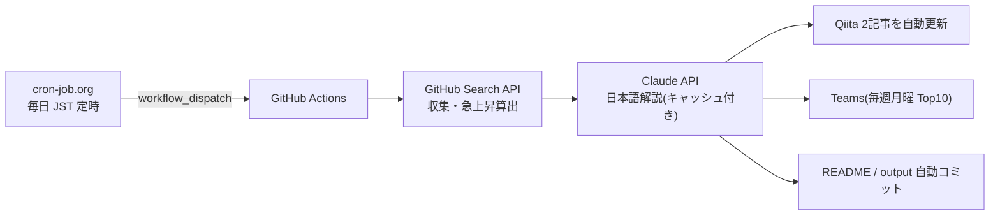

# Claude Code向けMCPツール候補ランキング

GitHub Search APIを使って、Claude Code周辺で活用候補になりそうなMCP関連リポジトリを定期収集するリポジトリです。

> 注意: この一覧は「Claude Codeでの動作」を保証するものではありません。  
> GitHub上のリポジトリ名・説明文・READMEなどに含まれる情報をもとに、MCP関連ツール候補を探すための入口として利用します。

## 仕組み(定常自律運転)

このランキングは cron-job.org → GitHub Actions → Claude API → Qiita / Teams のパイプラインで、毎日無人更新されています。


```mermaid
flowchart LR
    A["cron-job.org<br>毎日 JST 定時"] -->|workflow_dispatch| B["GitHub Actions"]
    B --> C["GitHub Search API<br>収集・急上昇算出"]
    C --> D["Claude API<br>日本語解説(キャッシュ付き)"]
    D --> E["Qiita 2記事を自動更新"]
    D --> F["Teams(毎週月曜 Top10)"]
    D --> G["README / output 自動コミット"]
```

- 仕組みの詳細と**ライブ稼働ステータス**: [定常自律運転ページ](https://takanobusano.github.io/mcp-github-ranking/)
- 作り方の解説記事: [パイプライン編](https://qiita.com/4q_sano/items/913e93ee5cc2731561fc) / [cron-job.org 完全自動化編](https://qiita.com/4q_sano/items/1bc5e0669a8f0166936c)
<!-- MCP_REPOS_START -->
最終更新: **2026-08-02 08:17:13 JST**

MCP関連リポジトリに加え、Claude Code周辺で活用候補になりそうな関連ツールをGitHub Search APIで毎日自動収集してランキング化しています。

Stars / Forks の差分は、UTC基準の前日データ（2026-07-31）との差分です。
CSVには最大500件を保存し、本文では上位100件を表示しています。

> 注意: この一覧はClaude Codeでの動作を保証するものではありません。  
> MCP関連ツールまたはClaude Code関連ツール候補を探すための入口として利用してください。

# 注目MCP・関連ツール候補ランキング

## 1位 [public-apis/public-apis](https://github.com/public-apis/public-apis)

A collective list of free APIs

⭐ **453,989 Stars**（前日なし）　🍴 **50,044 Forks**（前日なし）　/　🟢 **1,620 Open Issues**　/　Python

Topics: `api` / `apis` / `dataset` / `development` / `free` / `list` / `lists` / `open-source`

## 2位 [openclaw/openclaw](https://github.com/openclaw/openclaw)

Your own personal AI assistant. Any OS. Any Platform. The lobster way. 🦞

⭐ **384,842 Stars**（前日なし）　🍴 **80,871 Forks**（前日なし）　/　🟢 **5,658 Open Issues**　/　TypeScript

Topics: `ai` / `assistant` / `crustacean` / `molty` / `openclaw` / `own-your-data` / `personal`

## 3位 [obra/superpowers](https://github.com/obra/superpowers)

An agentic skills framework & software development methodology that works.

⭐ **264,790 Stars**（前日なし）　🍴 **23,641 Forks**（前日なし）　/　🟢 **317 Open Issues**　/　Shell

Topics: `ai` / `brainstorming` / `coding` / `obra` / `sdlc` / `skills` / `subagent-driven-development` / `superpowers`

## 4位 [affaan-m/ECC](https://github.com/affaan-m/ECC)

The agent harness performance optimization system. Skills, instincts, memory, security, and research-first development for Claude Code, Codex, Opencode, Cursor and beyond.

⭐ **236,832 Stars**（前日なし）　🍴 **36,003 Forks**（前日なし）　/　🟢 **117 Open Issues**　/　JavaScript

Topics: `ai-agents` / `anthropic` / `claude` / `claude-code` / `developer-tools` / `llm` / `mcp` / `productivity`

## 5位 [NousResearch/hermes-agent](https://github.com/NousResearch/hermes-agent)

The agent that grows with you

⭐ **223,826 Stars**（前日なし）　🍴 **43,191 Forks**（前日なし）　/　🟢 **26,529 Open Issues**　/　Python

Topics: `ai` / `ai-agent` / `ai-agents` / `anthropic` / `chatgpt` / `claude` / `claude-code` / `clawdbot`

## 6位 [mattpocock/skills](https://github.com/mattpocock/skills)

Skills for Real Engineers. Straight from my .agents directory.

⭐ **198,938 Stars**（前日なし）　🍴 **17,138 Forks**（前日なし）　/　🟢 **262 Open Issues**　/　Shell

Topics: `topicなし`

## 7位 [multica-ai/andrej-karpathy-skills](https://github.com/multica-ai/andrej-karpathy-skills)

A single CLAUDE.md file to improve Claude Code behavior, derived from Andrej Karpathy's observations on LLM coding pitfalls.

⭐ **198,509 Stars**（前日なし）　🍴 **20,412 Forks**（前日なし）　/　🟢 **126 Open Issues**　/　不明

Topics: `topicなし`

## 8位 [ultraworkers/claw-code](https://github.com/ultraworkers/claw-code)

An agent-managed museum exhibit, built in Rust with Gajae-Code / LazyCodex — developed and maintained with no human intervention.

⭐ **194,957 Stars**（前日なし）　🍴 **109,372 Forks**（前日なし）　/　🟢 **38 Open Issues**　/　Rust

Topics: `topicなし`

## 9位 [ollama/ollama](https://github.com/ollama/ollama)

Get up and running with Kimi-K2.6, GLM-5.2, MiniMax, DeepSeek, gpt-oss, Qwen, Gemma and other models.

⭐ **177,523 Stars**（前日なし）　🍴 **17,229 Forks**（前日なし）　/　🟢 **3,583 Open Issues**　/　Go

Topics: `deepseek` / `gemma` / `gemma3` / `glm` / `go` / `golang` / `gpt-oss` / `llama`

## 10位 [anthropics/skills](https://github.com/anthropics/skills)

Public repository for Agent Skills

⭐ **165,642 Stars**（前日なし）　🍴 **19,694 Forks**（前日なし）　/　🟢 **1,054 Open Issues**　/　Python

Topics: `agent-skills`

## 11位 [firecrawl/firecrawl](https://github.com/firecrawl/firecrawl)

The API to search, scrape, and interact with the web at scale. 🔥

⭐ **159,084 Stars**（前日なし）　🍴 **9,036 Forks**（前日なし）　/　🟢 **468 Open Issues**　/　TypeScript

Topics: `ai` / `ai-agents` / `ai-crawler` / `ai-scraping` / `ai-search` / `crawler` / `data-extraction` / `html-to-markdown`

## 12位 [langflow-ai/langflow](https://github.com/langflow-ai/langflow)

Langflow is a powerful tool for building and deploying AI-powered agents and workflows.

⭐ **152,718 Stars**（前日なし）　🍴 **9,746 Forks**（前日なし）　/　🟢 **972 Open Issues**　/　Python

Topics: `agents` / `chatgpt` / `generative-ai` / `large-language-models` / `multiagent` / `react-flow`

## 13位 [x1xhlol/system-prompts-and-models-of-ai-tools](https://github.com/x1xhlol/system-prompts-and-models-of-ai-tools)

FULL Augment Code, Claude Code, Cluely, CodeBuddy, Comet, Cursor, Devin AI, Junie, Kiro, Leap.new, Lovable, Manus, NotionAI, Orchids.app, Perplexity, Poke, Qoder, Replit, Same.dev, Trae, Traycer AI, VSCode Agent, Warp.dev, Windsurf, Xcode, Z.ai Code, Dia & v0. (And other Open Sourced) System Prompts, Internal Tools & AI Models

⭐ **142,499 Stars**（前日なし）　🍴 **34,823 Forks**（前日なし）　/　🟢 **157 Open Issues**　/　不明

Topics: `ai` / `bolt` / `cluely` / `copilot` / `cursor` / `cursorai` / `devin` / `github-copilot`

## 14位 [anthropics/claude-code](https://github.com/anthropics/claude-code)

Claude Code is an agentic coding tool that lives in your terminal, understands your codebase, and helps you code faster by executing routine tasks, explaining complex code, and handling git workflows - all through natural language commands.

⭐ **139,919 Stars**（前日なし）　🍴 **22,463 Forks**（前日なし）　/　🟢 **14,218 Open Issues**　/　Python

Topics: `topicなし`

## 15位 [msitarzewski/agency-agents](https://github.com/msitarzewski/agency-agents)

A complete AI agency at your fingertips - From frontend wizards to Reddit community ninjas, from whimsy injectors to reality checkers. Each agent is a specialized expert with personality, processes, and proven deliverables.

⭐ **138,045 Stars**（前日なし）　🍴 **22,538 Forks**（前日なし）　/　🟢 **103 Open Issues**　/　Shell

Topics: `topicなし`

## 16位 [garrytan/gstack](https://github.com/garrytan/gstack)

Use Garry Tan's exact Claude Code setup: 23 opinionated tools that serve as CEO, Designer, Eng Manager, Release Manager, Doc Engineer, and QA

⭐ **125,746 Stars**（前日なし）　🍴 **18,857 Forks**（前日なし）　/　🟢 **860 Open Issues**　/　TypeScript

Topics: `topicなし`

## 17位 [farion1231/cc-switch](https://github.com/farion1231/cc-switch)

A cross-platform desktop All-in-One assistant for Claude Code, Codex, OpenCode, OpenClaw, Grok Build & Hermes Agent. Only official website: ccswitch.io

⭐ **123,246 Stars**（前日なし）　🍴 **8,338 Forks**（前日なし）　/　🟢 **2,094 Open Issues**　/　Rust

Topics: `ai-tools` / `claude-code` / `codex` / `desktop-app` / `grok` / `grokbuild` / `hermes` / `hermes-agent`

## 18位 [nextlevelbuilder/ui-ux-pro-max-skill](https://github.com/nextlevelbuilder/ui-ux-pro-max-skill)

An AI SKILL that provide design intelligence for building professional UI/UX multiple platforms

⭐ **112,414 Stars**（前日なし）　🍴 **12,010 Forks**（前日なし）　/　🟢 **119 Open Issues**　/　Python

Topics: `ai-skills` / `antigravity` / `claude` / `claude-code` / `codex` / `command-line` / `copilot` / `cursor-ai`

## 19位 [browser-use/browser-use](https://github.com/browser-use/browser-use)

🌐 Make websites accessible for AI agents. Automate tasks online with ease.

⭐ **107,514 Stars**（前日なし）　🍴 **11,821 Forks**（前日なし）　/　🟢 **341 Open Issues**　/　Python

Topics: `ai-agents` / `ai-tools` / `browser-automation` / `browser-use` / `llm` / `playwright` / `python`

## 20位 [google-gemini/gemini-cli](https://github.com/google-gemini/gemini-cli)

An open-source AI agent that brings the power of Gemini directly into your terminal.

⭐ **106,295 Stars**（前日なし）　🍴 **14,367 Forks**（前日なし）　/　🟢 **995 Open Issues**　/　TypeScript

Topics: `ai` / `ai-agents` / `cli` / `gemini` / `gemini-api` / `mcp-client` / `mcp-server`

## 21位 [harry0703/MoneyPrinterTurbo](https://github.com/harry0703/MoneyPrinterTurbo)

利用 AI 大模型和自动化工作流，根据主题或关键词一键生成高清短视频。Generate HD short videos from a topic or keyword with an automated AI workflow.

⭐ **100,998 Stars**（前日なし）　🍴 **15,083 Forks**（前日なし）　/　🟢 **13 Open Issues**　/　Python

Topics: `ai-video-generator` / `content-creation` / `ffmpeg` / `instagram-reels` / `llm` / `python` / `short-video` / `subtitles`

## 22位 [Graphify-Labs/graphify](https://github.com/Graphify-Labs/graphify)

Turn any codebase, with its docs, SQL schemas, configs, and PDFs, into a queryable knowledge graph. A /graphify skill for Claude Code, Cursor, Codex, and Gemini CLI: local deterministic AST parsing, every edge explained, no vector store.

⭐ **100,237 Stars**（前日なし）　🍴 **9,730 Forks**（前日なし）　/　🟢 **730 Open Issues**　/　Python

Topics: `ai-agents` / `antigravity` / `ast` / `claude-code` / `code-analysis` / `code-search` / `codex` / `cursor`

## 23位 [puppeteer/puppeteer](https://github.com/puppeteer/puppeteer)

JavaScript API for Chrome and Firefox

⭐ **95,389 Stars**（前日なし）　🍴 **9,566 Forks**（前日なし）　/　🟢 **265 Open Issues**　/　TypeScript

Topics: `automation` / `chrome` / `chromium` / `developer-tools` / `firefox` / `headless-chrome` / `node-module` / `testing`

## 24位 [TauricResearch/TradingAgents](https://github.com/TauricResearch/TradingAgents)

TradingAgents: Multi-Agents LLM Financial Trading Framework

⭐ **95,252 Stars**（前日なし）　🍴 **18,412 Forks**（前日なし）　/　🟢 **327 Open Issues**　/　Python

Topics: `agent` / `finance` / `llm` / `multiagent` / `trading`

## 25位 [JuliusBrussee/caveman](https://github.com/JuliusBrussee/caveman)

🪨 why use many token when few token do trick — Claude Code skill that cuts 65% of tokens by talking like caveman

⭐ **95,097 Stars**（前日なし）　🍴 **5,454 Forks**（前日なし）　/　🟢 **451 Open Issues**　/　JavaScript

Topics: `ai` / `anthropic` / `caveman` / `claude` / `claude-code` / `llm` / `meme` / `prompt-engineering`

## 26位 [microsoft/playwright](https://github.com/microsoft/playwright)

Playwright is a framework for Web Testing and Automation. It allows testing Chromium, Firefox and WebKit with a single API.

⭐ **93,804 Stars**（前日なし）　🍴 **6,191 Forks**（前日なし）　/　🟢 **153 Open Issues**　/　TypeScript

Topics: `automation` / `chrome` / `chromium` / `e2e-testing` / `electron` / `end-to-end-testing` / `firefox` / `javascript`

## 27位 [DietrichGebert/ponytail](https://github.com/DietrichGebert/ponytail)

Makes your AI agent think like the laziest senior dev in the room. The best code is the code you never wrote.

⭐ **93,495 Stars**（前日なし）　🍴 **5,137 Forks**（前日なし）　/　🟢 **123 Open Issues**　/　JavaScript

Topics: `agent-skills` / `ai-agents` / `claude` / `claude-code` / `claude-code-plugin` / `cursor-rules` / `developer-tools` / `llm`

## 28位 [thedotmack/claude-mem](https://github.com/thedotmack/claude-mem)

Persistent Context Across Sessions for Every Agent –  Captures everything your agent does during sessions, compresses it with AI, and injects relevant context back into future sessions. Works with Claude Code, OpenClaw, Codex, Gemini, Hermes, Copilot, OpenCode + More

⭐ **89,259 Stars**（前日なし）　🍴 **7,771 Forks**（前日なし）　/　🟢 **342 Open Issues**　/　JavaScript

Topics: `ai` / `ai-agents` / `ai-memory` / `anthropic` / `artificial-intelligence` / `chromadb` / `claude` / `claude-agent-sdk`

## 29位 [modelcontextprotocol/servers](https://github.com/modelcontextprotocol/servers)

Model Context Protocol Servers

⭐ **89,125 Stars**（前日なし）　🍴 **11,346 Forks**（前日なし）　/　🟢 **480 Open Issues**　/　TypeScript

Topics: `topicなし`

## 30位 [ChatGPTNextWeb/NextChat](https://github.com/ChatGPTNextWeb/NextChat)

✨ Light and Fast AI Assistant. Support: Web \| iOS \| MacOS \| Android \|  Linux \| Windows

⭐ **88,574 Stars**（前日なし）　🍴 **59,348 Forks**（前日なし）　/　🟢 **848 Open Issues**　/　TypeScript

Topics: `calclaude` / `chatgpt` / `claude` / `cross-platform` / `desktop` / `fe` / `gemini` / `gemini-pro`

## 31位 [laravel/laravel](https://github.com/laravel/laravel)

Laravel is a web application framework with expressive, elegant syntax. We’ve already laid the foundation for your next big idea — freeing you to create without sweating the small things.

⭐ **84,735 Stars**（前日なし）　🍴 **24,841 Forks**（前日なし）　/　🟢 **31 Open Issues**　/　Blade

Topics: `framework` / `laravel` / `php`

## 32位 [nexu-io/open-design](https://github.com/nexu-io/open-design)

🎨 The open-source Claude Design alternative. 🖥️ Local-first desktop app. 🖼️ Your coding agent becomes the design engine: prototypes, landing pages, dashboards,...

⭐ **83,038 Stars**（前日なし）　🍴 **9,613 Forks**（前日なし）　/　🟢 **711 Open Issues**　/　TypeScript

Topics: `agent-skills` / `ai-agents` / `ai-design` / `byok` / `claude-code-for-design` / `claude-design` / `codex-design` / `coding-agents`

## 33位 [OpenHands/OpenHands](https://github.com/OpenHands/OpenHands)

🙌 OpenHands: AI-Driven Development

⭐ **82,798 Stars**（前日なし）　🍴 **10,661 Forks**（前日なし）　/　🟢 **283 Open Issues**　/　TypeScript

Topics: `agent` / `artificial-intelligence` / `chatgpt` / `claude-ai` / `cli` / `developer-tools` / `gpt` / `llm`

## 34位 [addyosmani/agent-skills](https://github.com/addyosmani/agent-skills)

Production-grade engineering skills for AI coding agents.

⭐ **81,243 Stars**（前日なし）　🍴 **8,759 Forks**（前日なし）　/　🟢 **140 Open Issues**　/　JavaScript

Topics: `agent-skills` / `antigravity` / `claude-code` / `codex` / `cursor` / `skills`

## 35位 [lobehub/lobehub](https://github.com/lobehub/lobehub)

🤯 LobeHub is your Chief Agent Operator, organizing your agents into 7×24 operations by hiring, scheduling, and reporting on your entire AI team.

⭐ **81,053 Stars**（前日なし）　🍴 **15,739 Forks**（前日なし）　/　🟢 **700 Open Issues**　/　TypeScript

Topics: `agent` / `agent-collaboration` / `agent-harness` / `ai` / `cao` / `chatgpt` / `chief-agent-operator` / `claude`

## 36位 [OpenCut-app/OpenCut](https://github.com/OpenCut-app/OpenCut)

The open-source CapCut alternative

⭐ **80,352 Stars**（前日なし）　🍴 **7,975 Forks**（前日なし）　/　🟢 **367 Open Issues**　/　TypeScript

Topics: `editor` / `oss` / `videoeditor`

## 37位 [bytedance/deer-flow](https://github.com/bytedance/deer-flow)

An open-source long-horizon SuperAgent harness that researches, codes, and creates. With the help of sandboxes, memories, tools, skill, subagents and message gateway, it handles different levels of tasks that could take minutes to hours.

⭐ **78,700 Stars**（前日なし）　🍴 **10,740 Forks**（前日なし）　/　🟢 **938 Open Issues**　/　Python

Topics: `agent` / `agentic` / `agentic-framework` / `agentic-workflow` / `ai` / `ai-agents` / `deep-research` / `harness`

## 38位 [koala73/worldmonitor](https://github.com/koala73/worldmonitor)

Real-time global intelligence dashboard. AI-powered news aggregation, geopolitical monitoring, and infrastructure tracking in a unified situational awareness interface

⭐ **77,782 Stars**（前日なし）　🍴 **11,620 Forks**（前日なし）　/　🟢 **318 Open Issues**　/　TypeScript

Topics: `agent` / `ai` / `dashboard` / `geopolitics` / `mcp` / `mcp-server` / `monitoring` / `news`

## 39位 [Egonex-AI/Understand-Anything](https://github.com/Egonex-AI/Understand-Anything)

Graphs that teach > graphs that impress. Turn any code into an interactive knowledge graph you can explore, search, and ask questions about. Works with Claude Code, Codex, Cursor, Copilot, Gemini CLI, and more.

⭐ **77,050 Stars**（前日なし）　🍴 **6,455 Forks**（前日なし）　/　🟢 **259 Open Issues**　/　TypeScript

Topics: `antigravity-skills` / `business-knowledge` / `claude-code` / `claude-skills` / `codebase-analysis` / `codex` / `codex-skills` / `developer-tools-ai-agent`

## 40位 [opendatalab/MinerU](https://github.com/opendatalab/MinerU)

Transforms complex documents like PDFs and Office docs into LLM-ready markdown/JSON for your Agentic workflows.

⭐ **76,468 Stars**（前日なし）　🍴 **6,421 Forks**（前日なし）　/　🟢 **73 Open Issues**　/　Python

Topics: `ai4science` / `document-analysis` / `docx` / `extract-data` / `layout-analysis` / `ocr` / `parser` / `pdf`

## 41位 [unclecode/crawl4ai](https://github.com/unclecode/crawl4ai)

🚀🤖 Crawl4AI: Open-source LLM Friendly Web Crawler & Scraper. Don't be shy, join here:

⭐ **75,783 Stars**（前日なし）　🍴 **7,834 Forks**（前日なし）　/　🟢 **130 Open Issues**　/　Python

Topics: `topicなし`

## 42位 [paperclipai/paperclip](https://github.com/paperclipai/paperclip)

The open-source app everyone uses to manage agents at work

⭐ **75,357 Stars**（前日なし）　🍴 **14,031 Forks**（前日なし）　/　🟢 **4,966 Open Issues**　/　TypeScript

Topics: `topicなし`

## 43位 [rtk-ai/rtk](https://github.com/rtk-ai/rtk)

CLI proxy that reduces LLM token consumption by 60-90% on common dev commands. Single Rust binary, zero dependencies

⭐ **74,271 Stars**（前日なし）　🍴 **4,652 Forks**（前日なし）　/　🟢 **1,806 Open Issues**　/　Rust

Topics: `agentic-coding` / `ai-coding` / `anthropic` / `claude-code` / `cli` / `command-line-tool` / `cost-reduction` / `developer-tools`

## 44位 [abi/screenshot-to-code](https://github.com/abi/screenshot-to-code)

Drop in a screenshot and convert it to clean code (HTML/Tailwind/React/Vue)

⭐ **73,792 Stars**（前日なし）　🍴 **9,067 Forks**（前日なし）　/　🟢 **126 Open Issues**　/　Python

Topics: `topicなし`

## 45位 [Eugeny/tabby](https://github.com/Eugeny/tabby)

A terminal for a more modern age

⭐ **73,667 Stars**（前日なし）　🍴 **4,191 Forks**（前日なし）　/　🟢 **2,824 Open Issues**　/　TypeScript

Topics: `serial` / `ssh-client` / `telnet-client` / `terminal` / `terminal-emulators`

## 46位 [thedaviddias/Front-End-Checklist](https://github.com/thedaviddias/Front-End-Checklist)

🗂 The essential checklist for modern web development, for humans and AI agents

⭐ **73,381 Stars**（前日なし）　🍴 **6,660 Forks**（前日なし）　/　🟢 **4 Open Issues**　/　MDX

Topics: `ai-agent` / `ai-agents` / `checklist` / `css` / `front-end-developer-tool` / `front-end-development` / `frontend` / `guidelines`

## 47位 [shareAI-lab/learn-claude-code](https://github.com/shareAI-lab/learn-claude-code)

Bash is all you need -  A nano claude code–like 「agent harness」, built from 0 to 1

⭐ **72,926 Stars**（前日なし）　🍴 **11,843 Forks**（前日なし）　/　🟢 **63 Open Issues**　/　Python

Topics: `agent` / `agent-development` / `ai-agent` / `claude` / `claude-code` / `educational` / `llm` / `python`

## 48位 [D4Vinci/Scrapling](https://github.com/D4Vinci/Scrapling)

🕷️ An adaptive Web Scraping framework that handles everything from a single request to a full-scale crawl!

⭐ **72,098 Stars**（前日なし）　🍴 **7,153 Forks**（前日なし）　/　🟢 **4 Open Issues**　/　Python

Topics: `ai` / `ai-scraping` / `automation` / `crawler` / `crawling` / `crawling-python` / `data` / `data-extraction`

## 49位 [daytonaio/daytona](https://github.com/daytonaio/daytona)

Daytona is a Secure and Elastic Infrastructure for Running AI-Generated Code

⭐ **72,074 Stars**（前日なし）　🍴 **5,657 Forks**（前日なし）　/　🟢 **441 Open Issues**　/　不明

Topics: `agentic-workflow` / `ai` / `ai-agents` / `ai-runtime` / `ai-sandboxes` / `code-execution` / `code-interpreter` / `developer-tools`

## 50位 [OpenBB-finance/OpenBB](https://github.com/OpenBB-finance/OpenBB)

Open Data Platform for analysts, quants and AI agents.

⭐ **71,263 Stars**（前日なし）　🍴 **7,276 Forks**（前日なし）　/　🟢 **93 Open Issues**　/　Python

Topics: `ai` / `crypto` / `derivatives` / `economics` / `equity` / `finance` / `fixed-income` / `machine-learning`

## 51位 [Leonxlnx/taste-skill](https://github.com/Leonxlnx/taste-skill)

Taste-Skill - gives your AI good taste. stops the AI from generating boring, generic slop

⭐ **70,012 Stars**（前日なし）　🍴 **4,829 Forks**（前日なし）　/　🟢 **53 Open Issues**　/　JavaScript

Topics: `agent` / `ai` / `claude` / `claude-code` / `codex` / `coding` / `design` / `frontend`

## 52位 [unslothai/unsloth](https://github.com/unslothai/unsloth)

Unsloth is a local UI for training and running Kimi K3, Gemma 4, Qwen3.6, DeepSeek-V4, GLM and other models.

⭐ **69,354 Stars**（前日なし）　🍴 **6,262 Forks**（前日なし）　/　🟢 **986 Open Issues**　/　Python

Topics: `agent` / `deepseek` / `fine-tuning` / `gemma` / `gemma3` / `gpt-oss` / `llama` / `llama3`

## 53位 [openinterpreter/openinterpreter](https://github.com/openinterpreter/openinterpreter)

A coding agent for open models like Kimi K3

⭐ **67,490 Stars**（前日なし）　🍴 **5,804 Forks**（前日なし）　/　🟢 **0 Open Issues**　/　Rust

Topics: `acp` / `coding-agent` / `deepseek` / `kimi` / `qwen` / `rust`

## 54位 [code-yeongyu/oh-my-openagent](https://github.com/code-yeongyu/oh-my-openagent)

omo/lazycodex: The coding agent for tokenmaxxers;the one and only agent harness for complex codebases. For your Codex, for your OpenCode

⭐ **67,006 Stars**（前日なし）　🍴 **5,467 Forks**（前日なし）　/　🟢 **956 Open Issues**　/　TypeScript

Topics: `ai` / `ai-agents` / `anthropic` / `chatgpt` / `claude` / `claude-skills` / `codex` / `cursor`

## 55位 [ruvnet/ruflo](https://github.com/ruvnet/ruflo)

🌊 The original agent meta-harness. Deploy intelligent multi-player swarms, coordinate autonomous workflows, and build conversational AI systems. Features adapti...

⭐ **66,773 Stars**（前日なし）　🍴 **7,962 Forks**（前日なし）　/　🟢 **761 Open Issues**　/　TypeScript

Topics: `agentic-ai` / `agentic-framework` / `agentic-workflow` / `agents` / `ai-agents` / `ai-assistant` / `ai-coding` / `ai-skills`

## 56位 [bradtraversy/design-resources-for-developers](https://github.com/bradtraversy/design-resources-for-developers)

Curated list of design and UI resources from stock photos, web templates, CSS frameworks, UI libraries, tools and much more

⭐ **66,551 Stars**（前日なし）　🍴 **12,126 Forks**（前日なし）　/　🟢 **74 Open Issues**　/　不明

Topics: `topicなし`

## 57位 [xtekky/gpt4free](https://github.com/xtekky/gpt4free)

The official gpt4free repository \| various collection of powerful language models \| opus 4.6 gpt 5.3 kimi 2.5 deepseek v3.2 gemini 3

⭐ **66,514 Stars**（前日なし）　🍴 **13,535 Forks**（前日なし）　/　🟢 **4 Open Issues**　/　Python

Topics: `chatbot` / `chatbots` / `chatgpt` / `chatgpt-4` / `chatgpt-api` / `chatgpt-free` / `chatgpt4` / `deepseek`

## 58位 [cline/cline](https://github.com/cline/cline)

Autonomous coding agent as an SDK, IDE extension, or CLI assistant.

⭐ **65,421 Stars**（前日なし）　🍴 **7,025 Forks**（前日なし）　/　🟢 **957 Open Issues**　/　TypeScript

Topics: `topicなし`

## 59位 [docling-project/docling](https://github.com/docling-project/docling)

Get your documents ready for gen AI

⭐ **64,101 Stars**（前日なし）　🍴 **4,549 Forks**（前日なし）　/　🟢 **955 Open Issues**　/　Python

Topics: `ai` / `convert` / `document-parser` / `document-parsing` / `documents` / `docx` / `html` / `markdown`

## 60位 [colbymchenry/codegraph](https://github.com/colbymchenry/codegraph)

Pre-indexed code knowledge graph, auto syncs on code changes, for Claude Code, Codex, Gemini, Cursor, OpenCode, AntiGravity, Kiro, and Hermes Agent — fewer tokens, fewer tool calls, 100% local

⭐ **63,986 Stars**（前日なし）　🍴 **4,021 Forks**（前日なし）　/　🟢 **380 Open Issues**　/　C

Topics: `topicなし`

## 61位 [Panniantong/Agent-Reach](https://github.com/Panniantong/Agent-Reach)

Give your AI agent eyes to see the entire internet. Read & search Twitter, Reddit, YouTube, GitHub, Bilibili, XiaoHongShu — one CLI, zero API fees.

⭐ **63,961 Stars**（前日なし）　🍴 **5,277 Forks**（前日なし）　/　🟢 **186 Open Issues**　/　Python

Topics: `agent-infrastructure` / `ai-agent` / `ai-search` / `automation` / `bilibili` / `claude-code` / `cli` / `cursor`

## 62位 [headroomlabs-ai/headroom](https://github.com/headroomlabs-ai/headroom)

Compress tool outputs, logs, files, and RAG chunks before they reach the LLM. 20% fewer tokens for coding agents, 60-95% fewer tokens for JSON, same answers. Library, proxy, MCP server.

⭐ **63,872 Stars**（前日なし）　🍴 **4,847 Forks**（前日なし）　/　🟢 **621 Open Issues**　/　Python

Topics: `agent` / `ai` / `anthropic` / `claude-code` / `compression` / `context-engineering` / `context-window` / `cursor`

## 63位 [warpdotdev/warp](https://github.com/warpdotdev/warp)

Warp is an agentic development environment, born out of the terminal.

⭐ **63,862 Stars**（前日なし）　🍴 **5,370 Forks**（前日なし）　/　🟢 **4,810 Open Issues**　/　Rust

Topics: `bash` / `linux` / `macos` / `rust` / `shell` / `terminal` / `wasm` / `zsh`

## 64位 [shanraisshan/claude-code-best-practice](https://github.com/shanraisshan/claude-code-best-practice)

from vibe coding to agentic engineering - practice makes claude perfect

⭐ **63,860 Stars**（前日なし）　🍴 **6,360 Forks**（前日なし）　/　🟢 **14 Open Issues**　/　HTML

Topics: `agentic-ai` / `agentic-coding` / `agentic-engineering` / `agentic-workflow` / `ai` / `ai-agents` / `anthropic` / `best-practices`

## 65位 [Fission-AI/OpenSpec](https://github.com/Fission-AI/OpenSpec)

Spec-driven development (SDD) for AI coding assistants.

⭐ **63,418 Stars**（前日なし）　🍴 **4,387 Forks**（前日なし）　/　🟢 **326 Open Issues**　/　TypeScript

Topics: `ai` / `context-engineering` / `engineering` / `planning` / `prd` / `sdd` / `sdlc` / `spec`

## 66位 [mem0ai/mem0](https://github.com/mem0ai/mem0)

Universal memory layer for AI Agents

⭐ **62,271 Stars**（前日なし）　🍴 **7,262 Forks**（前日なし）　/　🟢 **747 Open Issues**　/　Python

Topics: `agents` / `ai` / `ai-agents` / `application` / `chatbots` / `chatgpt` / `genai` / `llm`

## 67位 [asgeirtj/system_prompts_leaks](https://github.com/asgeirtj/system_prompts_leaks)

Extracted system prompts from Anthropic - Claude Fable 5, Opus 5, Claude Design, Claude Code. OpenAI - ChatGPT GPT-5.6-Sol, Codex. Google - Gemini 3.5 Flash, 3.1 Pro, Antigravity. xAI - Grok, Cursor, Copilot, VS Code, Perplexity, and more. Updated regularly.

⭐ **61,851 Stars**（前日なし）　🍴 **10,107 Forks**（前日なし）　/　🟢 **48 Open Issues**　/　JavaScript

Topics: `ai` / `ai-agents` / `ai-prompts` / `anthropic` / `chatbot` / `chatgpt` / `claude` / `claude-code`

## 68位 [sansan0/TrendRadar](https://github.com/sansan0/TrendRadar)

⭐AI-driven public opinion & trend monitor with multi-platform aggregation, RSS, and smart alerts.🎯 告别信息过载，你的 AI 舆情监控助手与热点筛选工具！聚合多平台热点 +  RSS 订阅，支持关键词精准筛选。AI 智能筛...

⭐ **61,069 Stars**（前日なし）　🍴 **24,837 Forks**（前日なし）　/　🟢 **52 Open Issues**　/　Python

Topics: `ai` / `bark` / `data-analysis` / `docker` / `hot-news` / `llm` / `mail` / `mcp`

## 69位 [tw93/Pake](https://github.com/tw93/Pake)

🤱🏻 Turn any webpage into a desktop app with one command.

⭐ **60,391 Stars**（前日なし）　🍴 **12,284 Forks**（前日なし）　/　🟢 **2 Open Issues**　/　Rust

Topics: `chatgpt` / `claude` / `desktop` / `gemini` / `hight-performance` / `linux` / `macos` / `no-electron`

## 70位 [1c7/chinese-independent-developer](https://github.com/1c7/chinese-independent-developer)

👩🏿‍💻👨🏾‍💻👩🏼‍💻👨🏽‍💻👩🏻‍💻中国独立开发者项目列表 -- 分享大家都在做什么

⭐ **60,342 Stars**（前日なし）　🍴 **5,235 Forks**（前日なし）　/　🟢 **2 Open Issues**　/　Python

Topics: `china` / `indie` / `indie-developer`

## 71位 [microsoft/autogen](https://github.com/microsoft/autogen)

A programming framework for agentic AI

⭐ **60,156 Stars**（前日なし）　🍴 **9,061 Forks**（前日なし）　/　🟢 **971 Open Issues**　/　Python

Topics: `agentic` / `agentic-agi` / `agents` / `ai` / `autogen` / `autogen-ecosystem` / `chatgpt` / `framework`

## 72位 [upstash/context7](https://github.com/upstash/context7)

Context7 Platform -- Up-to-date code documentation for LLMs and AI code editors

⭐ **60,124 Stars**（前日なし）　🍴 **2,878 Forks**（前日なし）　/　🟢 **39 Open Issues**　/　TypeScript

Topics: `llm` / `mcp` / `mcp-server` / `vibe-coding`

## 73位 [coollabsio/coolify](https://github.com/coollabsio/coolify)

An open-source, self-hostable PaaS alternative to Vercel, Heroku & Netlify that lets you easily deploy static sites, databases, full-stack applications and 280+ one-click services on your own servers.

⭐ **59,963 Stars**（前日なし）　🍴 **5,195 Forks**（前日なし）　/　🟢 **837 Open Issues**　/　PHP

Topics: `coolify` / `databases` / `deployment` / `docker` / `docker-compose` / `inertiajs` / `laravel` / `mariadb`

## 74位 [NanmiCoder/MediaCrawler](https://github.com/NanmiCoder/MediaCrawler)

小红书笔记 \| 评论爬虫、抖音视频 \| 评论爬虫、快手视频 \| 评论爬虫、B 站视频 ｜ 评论爬虫、微博帖子 ｜ 评论爬虫、百度贴吧帖子 ｜ 百度贴吧评论回复爬虫  \| 知乎问答文章｜评论爬虫

⭐ **59,575 Stars**（前日なし）　🍴 **11,729 Forks**（前日なし）　/　🟢 **185 Open Issues**　/　Python

Topics: `topicなし`

## 75位 [meilisearch/meilisearch](https://github.com/meilisearch/meilisearch)

A lightning-fast search engine API bringing AI-powered hybrid search to your sites and applications.

⭐ **58,818 Stars**（前日なし）　🍴 **2,651 Forks**（前日なし）　/　🟢 **312 Open Issues**　/　Rust

Topics: `ai` / `api` / `app-search` / `database` / `enterprise-search` / `faceting` / `full-text-search` / `fuzzy-search`

## 76位 [MemPalace/mempalace](https://github.com/MemPalace/mempalace)

The best-benchmarked open-source AI memory system. And it's free.

⭐ **57,946 Stars**（前日なし）　🍴 **7,450 Forks**（前日なし）　/　🟢 **691 Open Issues**　/　Python

Topics: `ai` / `chromadb` / `llm` / `mcp` / `memory` / `python`

## 77位 [penpot/penpot](https://github.com/penpot/penpot)

Penpot: The open-source design platform for Product teams that need scalable collaboration.

⭐ **57,932 Stars**（前日なし）　🍴 **3,870 Forks**（前日なし）　/　🟢 **725 Open Issues**　/　Clojure

Topics: `clojure` / `clojurescript` / `design` / `prototyping` / `ui` / `ux-design` / `ux-experience`

## 78位 [zylon-ai/private-gpt](https://github.com/zylon-ai/private-gpt)

Complete API layer for private AI applications on local models: RAG, skills, tools, MCP, text-to-sql, and more. Works with any OpenAI-compatible inference server.

⭐ **57,394 Stars**（前日なし）　🍴 **7,601 Forks**（前日なし）　/　🟢 **3 Open Issues**　/　Python

Topics: `ai` / `ai-tools` / `on-premise`

## 79位 [mvanhorn/last30days-skill](https://github.com/mvanhorn/last30days-skill)

AI agent skill that researches any topic across Reddit, X, YouTube, HN, Polymarket, and the web - then synthesizes a grounded summary

⭐ **56,597 Stars**（前日なし）　🍴 **4,943 Forks**（前日なし）　/　🟢 **83 Open Issues**　/　Python

Topics: `ai-prompts` / `ai-skill` / `bluesky` / `claude` / `claude-code` / `clawhub` / `deep-research` / `hackernews`

## 80位 [crewAIInc/crewAI](https://github.com/crewAIInc/crewAI)

Framework for orchestrating role-playing, autonomous AI agents. By fostering collaborative intelligence, CrewAI empowers agents to work together seamlessly, tackling complex tasks.

⭐ **56,474 Stars**（前日なし）　🍴 **8,030 Forks**（前日なし）　/　🟢 **735 Open Issues**　/　Python

Topics: `agents` / `ai` / `ai-agents` / `aiagentframework` / `llms`

## 81位 [BerriAI/litellm](https://github.com/BerriAI/litellm)

The fastest, litest AI Gateway. Rust core with Python SDK. Call 100+ LLM APIs in OpenAI (or native) format with cost tracking, guardrails, load balancing, and logging [Bedrock, Azure, OpenAI, Anthropic, OpenAI, VertexAI, vLLM, Nvidia NIM]

⭐ **55,289 Stars**（前日なし）　🍴 **10,251 Forks**（前日なし）　/　🟢 **4,670 Open Issues**　/　Python

Topics: `ai-gateway` / `anthropic` / `azure-openai` / `bedrock` / `gateway` / `langchain` / `litellm` / `llm`

## 82位 [pbakaus/impeccable](https://github.com/pbakaus/impeccable)

The design language that makes your AI harness better at design.

⭐ **53,709 Stars**（前日なし）　🍴 **3,197 Forks**（前日なし）　/　🟢 **41 Open Issues**　/　JavaScript

Topics: `topicなし`

## 83位 [aaif-goose/goose](https://github.com/aaif-goose/goose)

an open source, extensible AI agent that goes beyond code suggestions - install, execute, edit, and test with any LLM

⭐ **52,075 Stars**（前日なし）　🍴 **5,837 Forks**（前日なし）　/　🟢 **297 Open Issues**　/　Rust

Topics: `acp` / `ai` / `ai-agents` / `mcp`

## 84位 [charlax/professional-programming](https://github.com/charlax/professional-programming)

A collection of learning resources for curious software engineers

⭐ **51,317 Stars**（前日なし）　🍴 **4,006 Forks**（前日なし）　/　🟢 **6 Open Issues**　/　Python

Topics: `architecture` / `computer-science` / `concepts` / `documentation` / `engineer` / `learning` / `lessons-learned` / `professional`

## 85位 [ChromeDevTools/chrome-devtools-mcp](https://github.com/ChromeDevTools/chrome-devtools-mcp)

Chrome DevTools for coding agents

⭐ **48,336 Stars**（前日なし）　🍴 **3,293 Forks**（前日なし）　/　🟢 **107 Open Issues**　/　TypeScript

Topics: `browser` / `chrome` / `chrome-devtools` / `debugging` / `devtools` / `mcp` / `mcp-server` / `puppeteer`

## 86位 [mudler/LocalAI](https://github.com/mudler/LocalAI)

LocalAI is the open-source AI engine. Run any model - LLMs, vision, voice, image, video - on any hardware. No GPU required.

⭐ **48,105 Stars**（前日なし）　🍴 **4,332 Forks**（前日なし）　/　🟢 **142 Open Issues**　/　Go

Topics: `agents` / `ai` / `api` / `audio-generation` / `decentralized` / `distributed` / `image-generation` / `libp2p`

## 87位 [jamiepine/voicebox](https://github.com/jamiepine/voicebox)

The open-source AI voice studio. Clone, dictate, create.

⭐ **47,894 Stars**（前日なし）　🍴 **5,886 Forks**（前日なし）　/　🟢 **572 Open Issues**　/　TypeScript

Topics: `ai` / `cuda` / `mlx` / `qwen3-tts` / `qwen3-tts-ui` / `voice-ai` / `voice-clone` / `whisper`

## 88位 [oobabooga/textgen](https://github.com/oobabooga/textgen)

Open-source desktop app for local LLMs. Text, vision, tool-calling, OpenAI/Anthropic-compatible API. 100% private.

⭐ **47,512 Stars**（前日なし）　🍴 **5,984 Forks**（前日なし）　/　🟢 **833 Open Issues**　/　Python

Topics: `topicなし`

## 89位 [prisma/prisma](https://github.com/prisma/prisma)

Next-generation ORM for Node.js & TypeScript \| PostgreSQL, MySQL, MariaDB, SQL Server, SQLite, MongoDB and CockroachDB

⭐ **47,426 Stars**（前日なし）　🍴 **2,478 Forks**（前日なし）　/　🟢 **2,505 Open Issues**　/　TypeScript

Topics: `cockroachdb` / `database` / `javascript` / `mariadb` / `mongo` / `mongodb` / `mongodb-orm` / `mssql`

## 90位 [GitHubDaily/GitHubDaily](https://github.com/GitHubDaily/GitHubDaily)

坚持分享 GitHub 上高质量、有趣实用的开源技术教程、开发者工具、编程网站、技术资讯。A list cool, interesting projects of GitHub.

⭐ **47,325 Stars**（前日なし）　🍴 **4,662 Forks**（前日なし）　/　🟢 **744 Open Issues**　/　不明

Topics: `ai` / `algorithms-and-data-structures` / `backend` / `developer-tools` / `development` / `frontend` / `github` / `java`

## 91位 [jeecgboot/JeecgBoot](https://github.com/jeecgboot/JeecgBoot)

【低代码迈入v2.0时代，一句话即可生成整个系统】企业级AI低代码平台，一键生成前后端代码甚至整个系统。 AI Skills 一句话画流程、设计表单、生成报表、大屏。内置 AI应用平台涵盖：AI聊天、知识库、流程编排、MCP插件等，兼容主流大模型。引领AI低代码「Skills 生成 → 在线配置 → 代码生成 → 手工...

⭐ **47,229 Stars**（前日なし）　🍴 **16,126 Forks**（前日なし）　/　🟢 **39 Open Issues**　/　Java

Topics: `activiti` / `agent` / `ai` / `antd` / `claude-code` / `cli` / `codegenerator` / `codex`

## 92位 [exo-explore/exo](https://github.com/exo-explore/exo)

Run frontier AI locally.

⭐ **46,586 Stars**（前日なし）　🍴 **3,396 Forks**（前日なし）　/　🟢 **319 Open Issues**　/　Python

Topics: `topicなし`

## 93位 [HKUDS/CLI-Anything](https://github.com/HKUDS/CLI-Anything)

"CLI-Anything: Making ALL Software Agent-Native" -- CLI-Hub:

⭐ **46,477 Stars**（前日なし）　🍴 **4,323 Forks**（前日なし）　/　🟢 **92 Open Issues**　/　Python

Topics: `topicなし`

## 94位 [apache/airflow](https://github.com/apache/airflow)

Apache Airflow - A platform to programmatically author, schedule, and monitor workflows

⭐ **46,351 Stars**（前日なし）　🍴 **17,509 Forks**（前日なし）　/　🟢 **1,790 Open Issues**　/　Python

Topics: `airflow` / `apache` / `apache-airflow` / `automation` / `dag` / `data-engineering` / `data-integration` / `data-orchestrator`

## 95位 [KeygraphHQ/shannon](https://github.com/KeygraphHQ/shannon)

Shannon is an AI pentester for web applications and APIs. It analyzes your source code, identifies attack vectors, and executes real exploits to prove vulnerabilities before they reach production.

⭐ **46,335 Stars**（前日なし）　🍴 **5,351 Forks**（前日なし）　/　🟢 **29 Open Issues**　/　TypeScript

Topics: `agents` / `ai-penetration-testing` / `ai-security` / `cybersecurity` / `ethical-hacking` / `offensive-security` / `penetration-testing` / `pentesting`

## 96位 [zhayujie/CowAgent](https://github.com/zhayujie/CowAgent)

Open-source super AI assistant & Agent Harness. Plans tasks, runs tools and skills, self-evolves with memory and knowledge. Multi-model, multi-channel. Lightweight, extensible, one-line install. (formerly chatgpt-on-wechat)

⭐ **46,266 Stars**（前日なし）　🍴 **10,289 Forks**（前日なし）　/　🟢 **30 Open Issues**　/　Python

Topics: `ai` / `ai-agent` / `ai-agents` / `chatgpt-on-wechat` / `claude` / `claude-code` / `codex` / `cowagent`

## 97位 [router-for-me/CLIProxyAPI](https://github.com/router-for-me/CLIProxyAPI)

Wrap Antigravity, ChatGPT Codex, Claude Code, Grok Build as an OpenAI/Gemini/Claude/Codex compatible API service, allowing you to enjoy the free Gemini 3.1 Pro, GPT 5.6 Series, Grok 4.5, Claude model through API

⭐ **45,906 Stars**（前日なし）　🍴 **7,127 Forks**（前日なし）　/　🟢 **369 Open Issues**　/　Go

Topics: `antigravity` / `claude-code` / `cluade` / `codex` / `gemini` / `openai`

## 98位 [rohitg00/ai-engineering-from-scratch](https://github.com/rohitg00/ai-engineering-from-scratch)

Learn it. Build it. Ship it for others.

⭐ **45,434 Stars**（前日なし）　🍴 **7,782 Forks**（前日なし）　/　🟢 **107 Open Issues**　/　Python

Topics: `agents` / `ai` / `ai-agents` / `ai-engineering` / `computer-vision` / `course` / `deep-learning` / `from-scratch`

## 99位 [abhigyanpatwari/GitNexus](https://github.com/abhigyanpatwari/GitNexus)

GitNexus: The Zero-Server Code Intelligence Engine -       GitNexus is a client-side knowledge graph creator that runs entirely in your browser. Drop in a git repository (Github, Gitlab, Azure, Local) or ZIP file, and get an interactive knowledge graph with a built in Graph RAG Agent. Perfect for code exploration

⭐ **44,913 Stars**（前日なし）　🍴 **4,974 Forks**（前日なし）　/　🟢 **270 Open Issues**　/　TypeScript

Topics: `topicなし`

## 100位 [calesthio/OpenMontage](https://github.com/calesthio/OpenMontage)

World's first open-source, agentic video production system. 12 production pipelines, 100+ tools, 700+ agent skill and production-knowledge files. Turn your AI coding assistant into a full video production studio.

⭐ **44,511 Stars**（前日なし）　🍴 **5,404 Forks**（前日なし）　/　🟢 **224 Open Issues**　/　Python

Topics: `agent` / `agentic-ai` / `ai` / `claude` / `copilot` / `cursor` / `elevenlabs` / `ffmpeg`

# 最近プッシュされたMCP・関連ツール候補

スター数ランキングとは別に、最近コードがプッシュされたリポジトリを表示します。古いスター数だけではなく、現在も開発が動いていそうな候補を探すための一覧です。

## プッシュ順 1位 [openclaw/openclaw](https://github.com/openclaw/openclaw)

Your own personal AI assistant. Any OS. Any Platform. The lobster way. 🦞

⭐ **384,842 Stars**（前日なし）　🍴 **80,871 Forks**（前日なし）　/　TypeScript　/　最終プッシュ: 2026-08-01

Topics: `ai` / `assistant` / `crustacean` / `molty` / `openclaw` / `own-your-data` / `personal`

## プッシュ順 2位 [ccxt/ccxt](https://github.com/ccxt/ccxt)

A unified trading API with more than 100 crypto exchanges and prediction markets in JavaScript / TypeScript / Python / C# / PHP / Go / Java

⭐ **43,474 Stars**（前日なし）　🍴 **8,776 Forks**（前日なし）　/　Python　/　最終プッシュ: 2026-08-01

Topics: `altcoin` / `api` / `arbitrage` / `bitcoin` / `bot` / `btc` / `crypto` / `cryptocurrencies`

## プッシュ順 3位 [openinterpreter/openinterpreter](https://github.com/openinterpreter/openinterpreter)

A coding agent for open models like Kimi K3

⭐ **67,490 Stars**（前日なし）　🍴 **5,804 Forks**（前日なし）　/　Rust　/　最終プッシュ: 2026-08-01

Topics: `acp` / `coding-agent` / `deepseek` / `kimi` / `qwen` / `rust`

## プッシュ順 4位 [Skyvern-AI/skyvern](https://github.com/Skyvern-AI/skyvern)

Automate browser based workflows with AI

⭐ **22,648 Stars**（前日なし）　🍴 **2,133 Forks**（前日なし）　/　Python　/　最終プッシュ: 2026-08-01

Topics: `ai` / `api` / `automation` / `browser` / `browser-automation` / `computer` / `gpt` / `llm`

## プッシュ順 5位 [gastownhall/beads](https://github.com/gastownhall/beads)

Beads - A memory upgrade for your coding agent

⭐ **25,800 Stars**（前日なし）　🍴 **1,731 Forks**（前日なし）　/　Go　/　最終プッシュ: 2026-08-01

Topics: `agents` / `claude-code` / `coding`

## プッシュ順 6位 [langflow-ai/langflow](https://github.com/langflow-ai/langflow)

Langflow is a powerful tool for building and deploying AI-powered agents and workflows.

⭐ **152,718 Stars**（前日なし）　🍴 **9,746 Forks**（前日なし）　/　Python　/　最終プッシュ: 2026-08-01

Topics: `agents` / `chatgpt` / `generative-ai` / `large-language-models` / `multiagent` / `react-flow`

## プッシュ順 7位 [can1357/oh-my-pi](https://github.com/can1357/oh-my-pi)

⌥  AI Coding agent for the terminal — hash-anchored edits, optimized tool harness, LSP, Python, browser, subagents, and more

⭐ **21,060 Stars**（前日なし）　🍴 **2,006 Forks**（前日なし）　/　TypeScript　/　最終プッシュ: 2026-08-01

Topics: `ai-agent` / `ai-coding-agent` / `anthropic` / `bun` / `claude` / `cli` / `coding-assistant` / `llm`

## プッシュ順 8位 [sgl-project/sglang](https://github.com/sgl-project/sglang)

SGLang is a high-performance serving framework for large language models and multimodal models.

⭐ **31,056 Stars**（前日なし）　🍴 **7,577 Forks**（前日なし）　/　Python　/　最終プッシュ: 2026-08-01

Topics: `attention` / `blackwell` / `cuda` / `deepseek` / `diffusion` / `glm` / `gpt-oss` / `inference`

## プッシュ順 9位 [NousResearch/hermes-agent](https://github.com/NousResearch/hermes-agent)

The agent that grows with you

⭐ **223,826 Stars**（前日なし）　🍴 **43,191 Forks**（前日なし）　/　Python　/　最終プッシュ: 2026-08-01

Topics: `ai` / `ai-agent` / `ai-agents` / `anthropic` / `chatgpt` / `claude` / `claude-code` / `clawdbot`

## プッシュ順 10位 [kortix-ai/suna](https://github.com/kortix-ai/suna)

The open-source AI Management System

⭐ **20,055 Stars**（前日なし）　🍴 **3,433 Forks**（前日なし）　/　TypeScript　/　最終プッシュ: 2026-08-01

Topics: `ai` / `ai-agents` / `llm`

## プッシュ順 11位 [getpaseo/paseo](https://github.com/getpaseo/paseo)

Orchestrate multiple coding agents from desktop and mobile

⭐ **11,842 Stars**（前日なし）　🍴 **1,194 Forks**（前日なし）　/　TypeScript　/　最終プッシュ: 2026-08-01

Topics: `ade` / `agents` / `android` / `claude-code` / `codex` / `copilot` / `developer-tools` / `hermes`

## プッシュ順 12位 [palmier-io/palmier-pro](https://github.com/palmier-io/palmier-pro)

macOS video editor built for AI

⭐ **12,966 Stars**（前日なし）　🍴 **963 Forks**（前日なし）　/　Swift　/　最終プッシュ: 2026-08-01

Topics: `ai-video` / `claude` / `macos` / `mcp` / `seedance2` / `swift` / `video-editor`

## プッシュ順 13位 [mudler/LocalAI](https://github.com/mudler/LocalAI)

LocalAI is the open-source AI engine. Run any model - LLMs, vision, voice, image, video - on any hardware. No GPU required.

⭐ **48,105 Stars**（前日なし）　🍴 **4,332 Forks**（前日なし）　/　Go　/　最終プッシュ: 2026-08-01

Topics: `agents` / `ai` / `api` / `audio-generation` / `decentralized` / `distributed` / `image-generation` / `libp2p`

## プッシュ順 14位 [windmill-labs/windmill](https://github.com/windmill-labs/windmill)

Open-source developer platform to power your entire infra and turn scripts into webhooks, workflows and UIs. Fastest workflow engine (13x vs Airflow). Open-source alternative to Retool and Temporal.

⭐ **17,420 Stars**（前日なし）　🍴 **1,057 Forks**（前日なし）　/　Rust　/　最終プッシュ: 2026-08-01

Topics: `low-code` / `open-source` / `platform` / `postgresql` / `python` / `self-hostable` / `typescript`

## プッシュ順 15位 [garrytan/gbrain](https://github.com/garrytan/gbrain)

Garry's Opinionated OpenClaw/Hermes Agent Brain

⭐ **27,548 Stars**（前日なし）　🍴 **4,038 Forks**（前日なし）　/　TypeScript　/　最終プッシュ: 2026-08-01

Topics: `topicなし`

## プッシュ順 16位 [stablyai/orca](https://github.com/stablyai/orca)

Orca is the ADE for working with a fleet of parallel agents. Run any coding agent with your own subscription. Available on desktop, mobile and VPS.

⭐ **35,179 Stars**（前日なし）　🍴 **2,483 Forks**（前日なし）　/　TypeScript　/　最終プッシュ: 2026-08-01

Topics: `ade` / `agent-ide` / `ai-agents` / `claude-code` / `cli` / `codex` / `cursor-agent` / `devtools`

## プッシュ順 17位 [cline/cline](https://github.com/cline/cline)

Autonomous coding agent as an SDK, IDE extension, or CLI assistant.

⭐ **65,421 Stars**（前日なし）　🍴 **7,025 Forks**（前日なし）　/　TypeScript　/　最終プッシュ: 2026-08-01

Topics: `topicなし`

## プッシュ順 18位 [CopilotKit/CopilotKit](https://github.com/CopilotKit/CopilotKit)

The Frontend Stack for Agents & Generative UI. React, Angular, Mobile, Slack, and more.  Makers of the AG-UI Protocol

⭐ **36,399 Stars**（前日なし）　🍴 **4,495 Forks**（前日なし）　/　TypeScript　/　最終プッシュ: 2026-08-01

Topics: `agent` / `agent-native` / `agentic-ai` / `agents` / `ai` / `ai-agent` / `ai-assistant` / `assistant`

## プッシュ順 19位 [block/buzz](https://github.com/block/buzz)

A hive mind communication platform

⭐ **20,405 Stars**（前日なし）　🍴 **2,127 Forks**（前日なし）　/　Rust　/　最終プッシュ: 2026-08-01

Topics: `topicなし`

## プッシュ順 20位 [BerriAI/litellm](https://github.com/BerriAI/litellm)

The fastest, litest AI Gateway. Rust core with Python SDK. Call 100+ LLM APIs in OpenAI (or native) format with cost tracking, guardrails, load balancing, and logging [Bedrock, Azure, OpenAI, Anthropic, OpenAI, VertexAI, vLLM, Nvidia NIM]

⭐ **55,289 Stars**（前日なし）　🍴 **10,251 Forks**（前日なし）　/　Python　/　最終プッシュ: 2026-08-01

Topics: `ai-gateway` / `anthropic` / `azure-openai` / `bedrock` / `gateway` / `langchain` / `litellm` / `llm`

## プッシュ順 21位 [zhaoxuya520/reverse-skill](https://github.com/zhaoxuya520/reverse-skill)

Reverse Engineering / Authorized Penetration Testing / Security Research Skill Router Pack AI-powered routing + On-demand toolchain bootstrapping + Self-evolvin...

⭐ **11,855 Stars**（前日なし）　🍴 **1,795 Forks**（前日なし）　/　PowerShell　/　最終プッシュ: 2026-08-01

Topics: `topicなし`

## プッシュ順 22位 [unslothai/unsloth](https://github.com/unslothai/unsloth)

Unsloth is a local UI for training and running Kimi K3, Gemma 4, Qwen3.6, DeepSeek-V4, GLM and other models.

⭐ **69,354 Stars**（前日なし）　🍴 **6,262 Forks**（前日なし）　/　Python　/　最終プッシュ: 2026-08-01

Topics: `agent` / `deepseek` / `fine-tuning` / `gemma` / `gemma3` / `gpt-oss` / `llama` / `llama3`

## プッシュ順 23位 [BasedHardware/omi](https://github.com/BasedHardware/omi)

AI that sees your screen, listens to your conversations and tells you what to do

⭐ **13,099 Stars**（前日なし）　🍴 **2,156 Forks**（前日なし）　/　Python　/　最終プッシュ: 2026-08-01

Topics: `ai` / `app` / `bci` / `c` / `flutter` / `friend` / `mobile` / `necklace`

## プッシュ順 24位 [trycua/cua](https://github.com/trycua/cua)

Scale computer-use 2.0 with open-source drivers, cross-OS fleets, and benchmarks for training, evaluation, and data generation.

⭐ **20,835 Stars**（前日なし）　🍴 **1,402 Forks**（前日なし）　/　HTML　/　最終プッシュ: 2026-08-01

Topics: `agent` / `ai-agent` / `apple` / `computer-use` / `computer-use-agent` / `containerization` / `cua` / `desktop-automation`

## プッシュ順 25位 [PostHog/posthog](https://github.com/PostHog/posthog)

:hedgehog: PostHog is the leading platform for building self-driving products. Our developer tools – AI observability, analytics, session replay, flags, experiments, error tracking, logs, and more – capture all the context agents need to diagnose problems, uncover opportunities, and ship fixes. Steer it all from Slack, web, desktop, or the MCP.

⭐ **37,430 Stars**（前日なし）　🍴 **3,124 Forks**（前日なし）　/　Python　/　最終プッシュ: 2026-08-01

Topics: `ab-testing` / `ai-analytics` / `analytics` / `cdp` / `data-warehouse` / `experiments` / `feature-flags` / `javascript`

## プッシュ順 26位 [superset-sh/superset](https://github.com/superset-sh/superset)

Code Editor for the AI Agents Era - Run an army of Claude Code, Codex, etc. on your machine

⭐ **12,727 Stars**（前日なし）　🍴 **1,151 Forks**（前日なし）　/　TypeScript　/　最終プッシュ: 2026-08-01

Topics: `agentic-ai` / `ai-agents` / `claude-code` / `cli` / `codex` / `coding-agents` / `cursor-agent` / `desktop-app`

## プッシュ順 27位 [ixartz/Next-js-Boilerplate](https://github.com/ixartz/Next-js-Boilerplate)

🚀🎉📚 Nextjs Boilerplate and Starter with App Router and Page Router support, Tailwind CSS 4 and TypeScript ⚡️ Made with developer experience first: Next.js 16 +...

⭐ **13,032 Stars**（前日なし）　🍴 **2,403 Forks**（前日なし）　/　TypeScript　/　最終プッシュ: 2026-08-01

Topics: `boilerplate` / `boilerplate-code` / `jamstack` / `javascript` / `js-boilerplate` / `netlify-template` / `next-js` / `next-theme`

## プッシュ順 28位 [open-metadata/OpenMetadata](https://github.com/open-metadata/OpenMetadata)

The Open Context Layer for Data and AI ,  OpenMetadata is the open platform for building trusted data context and business semantics for humans, AI assistants, and agents.

⭐ **14,626 Stars**（前日なし）　🍴 **2,266 Forks**（前日なし）　/　TypeScript　/　最終プッシュ: 2026-08-01

Topics: `context` / `context-layer` / `data-catalog` / `data-collaboration` / `data-contracts` / `data-discovery` / `data-governance` / `data-lineage`

## プッシュ順 29位 [Gitlawb/openclaude](https://github.com/Gitlawb/openclaude)

runs anywhere. uses anything

⭐ **30,472 Stars**（前日なし）　🍴 **8,906 Forks**（前日なし）　/　TypeScript　/　最終プッシュ: 2026-08-01

Topics: `ai` / `ai-agent` / `ai-tools` / `cli` / `coding`

## プッシュ順 30位 [datahub-project/datahub](https://github.com/datahub-project/datahub)

The Context Platform for your Data and AI Stack

⭐ **12,424 Stars**（前日なし）　🍴 **3,597 Forks**（前日なし）　/　Python　/　最終プッシュ: 2026-08-01

Topics: `agent-platform` / `context-management` / `data-catalog` / `data-discovery` / `data-governance` / `data-observability` / `datahub` / `metadata`

# 検索条件

以下の検索条件でGitHubリポジトリを収集しています。

- "model context protocol" in:name,description,readme stars:>10
- "mcp server" in:name,description,readme stars:>10
- "mcp" "claude" in:name,description,readme stars:>10
- "claude" "mcp" in:name,description,readme stars:>10
- "modelcontextprotocol" in:name,description,readme stars:>10
- "claude code" in:name,description,readme stars:>10
- "claude" "plugin" in:name,description,readme stars:>10
- "claude" "memory" in:name,description,readme stars:>10

<!-- MCP_REPOS_END -->

## 仕組み

```text
GitHub Search API
  ↓
MCP / Claude Code / Model Context Protocol 関連リポジトリを検索
  ↓
スター数・更新日・Fork数・説明文を取得
  ↓
Markdown / CSV を生成
  ↓
GitHub Actionsで毎日自動実行
  ↓
READMEを自動更新
