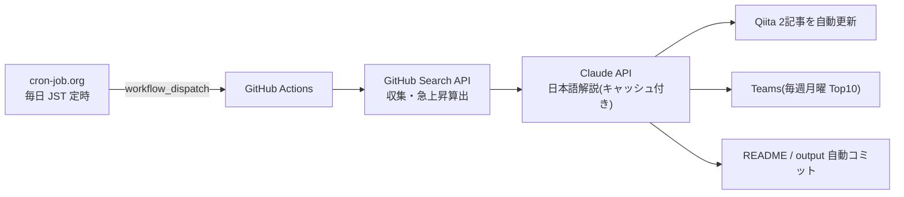

# Claude Code向けMCPツール候補ランキング

GitHub Search APIを使って、Claude Code周辺で活用候補になりそうなMCP関連リポジトリを定期収集するリポジトリです。

> 注意: この一覧は「Claude Codeでの動作」を保証するものではありません。  
> GitHub上のリポジトリ名・説明文・READMEなどに含まれる情報をもとに、MCP関連ツール候補を探すための入口として利用します。

## 仕組み(定常自律運転)

このランキングは cron-job.org → GitHub Actions → Claude API → Qiita / Teams のパイプラインで、毎日無人更新されています。


```mermaid
flowchart LR
    A["cron-job.org<br>毎日 JST 定時"] -->|workflow_dispatch| B["GitHub Actions"]
    B --> C["GitHub Search API<br>収集・急上昇算出"]
    C --> D["Claude API<br>日本語解説(キャッシュ付き)"]
    D --> E["Qiita 2記事を自動更新"]
    D --> F["Teams(毎週月曜 Top10)"]
    D --> G["README / output 自動コミット"]
```

- 仕組みの詳細と**ライブ稼働ステータス**: [定常自律運転ページ](https://takanobusano.github.io/mcp-github-ranking/)
- 作り方の解説記事: [パイプライン編](https://qiita.com/4q_sano/items/913e93ee5cc2731561fc) / [cron-job.org 完全自動化編](https://qiita.com/4q_sano/items/1bc5e0669a8f0166936c)
<!-- MCP_REPOS_START -->
最終更新: **2026-10-03 08:17:11 JST**

MCP関連リポジトリに加え、Claude Code周辺で活用候補になりそうな関連ツールをGitHub Search APIで毎日自動収集してランキング化しています。

Stars / Forks の差分は、UTC基準の前日データ（2026-10-01）との差分です。
CSVには最大500件を保存し、本文では上位100件を表示しています。

> 注意: この一覧はClaude Codeでの動作を保証するものではありません。  
> MCP関連ツールまたはClaude Code関連ツール候補を探すための入口として利用してください。

# 注目MCP・関連ツール候補ランキング

## 1位 [public-apis/public-apis](https://github.com/public-apis/public-apis)

A collective list of free APIs

⭐ **485,553 Stars**（+332）　🍴 **53,636 Forks**（+37）　/　🟢 **1,983 Open Issues**　/　Python

Topics: `api` / `apis` / `dataset` / `development` / `free` / `list` / `lists` / `open-source`

## 2位 [openclaw/openclaw](https://github.com/openclaw/openclaw)

The AI that really does things. Any OS. Any Platform. The lobster way. 🦞

⭐ **391,191 Stars**（+31）　🍴 **82,223 Forks**（-15）　/　🟢 **9,186 Open Issues**　/　TypeScript

Topics: `ai` / `assistant` / `crustacean` / `molty` / `openclaw` / `own-your-data` / `personal`

## 3位 [obra/superpowers](https://github.com/obra/superpowers)

An agentic skills framework & software development methodology that works.

⭐ **294,439 Stars**（+491）　🍴 **26,318 Forks**（+27）　/　🟢 **297 Open Issues**　/　Shell

Topics: `ai` / `brainstorming` / `coding` / `obra` / `sdlc` / `skills` / `subagent-driven-development` / `superpowers`

## 4位 [mattpocock/skills](https://github.com/mattpocock/skills)

Skills for Real Engineers. Straight from my .agents directory.

⭐ **274,676 Stars**（+816）　🍴 **23,060 Forks**（+70）　/　🟢 **544 Open Issues**　/　Shell

Topics: `topicなし`

## 5位 [affaan-m/ECC](https://github.com/affaan-m/ECC)

The agent harness performance optimization system. Skills, instincts, memory, security, and research-first development for Claude Code, Codex, Opencode, Cursor and beyond.

⭐ **271,288 Stars**（+600）　🍴 **40,526 Forks**（+60）　/　🟢 **339 Open Issues**　/　JavaScript

Topics: `ai-agents` / `anthropic` / `claude` / `claude-code` / `developer-tools` / `llm` / `mcp` / `productivity`

## 6位 [NousResearch/hermes-agent](https://github.com/NousResearch/hermes-agent)

The agent that grows with you

⭐ **250,761 Stars**（+159）　🍴 **53,730 Forks**（+96）　/　🟢 **48,095 Open Issues**　/　Python

Topics: `ai` / `ai-agent` / `ai-agents` / `anthropic` / `chatgpt` / `claude` / `claude-code` / `codex`

## 7位 [multica-ai/andrej-karpathy-skills](https://github.com/multica-ai/andrej-karpathy-skills)

A single CLAUDE.md file to improve Claude Code behavior, derived from Andrej Karpathy's observations on LLM coding pitfalls.

⭐ **216,576 Stars**（+400）　🍴 **21,805 Forks**（-3）　/　🟢 **130 Open Issues**　/　不明

Topics: `topicなし`

## 8位 [ultraworkers/claw-code](https://github.com/ultraworkers/claw-code)

An agent-managed museum exhibit, built in Rust with Gajae-Code / LazyCodex — developed and maintained with no human intervention.

⭐ **195,238 Stars**（-41）　🍴 **108,243 Forks**（-42）　/　🟢 **48 Open Issues**　/　Rust

Topics: `topicなし`

## 9位 [firecrawl/firecrawl](https://github.com/firecrawl/firecrawl)

🔥 Supercharge your AI agents with data from the web and beyond. A web data API to search, scrape, and access more sources.

⭐ **187,931 Stars**（+348）　🍴 **10,008 Forks**（+3）　/　🟢 **512 Open Issues**　/　TypeScript

Topics: `ai` / `ai-agents` / `ai-crawler` / `ai-scraping` / `ai-search` / `crawler` / `data-extraction` / `html-to-markdown`

## 10位 [ollama/ollama](https://github.com/ollama/ollama)

Get up and running with Kimi, GLM, MiniMax, DeepSeek, gpt-oss, Qwen, Gemma and other models.

⭐ **182,066 Stars**（+39）　🍴 **18,085 Forks**（+11）　/　🟢 **4,155 Open Issues**　/　Go

Topics: `deepseek` / `gemma` / `gemma3` / `glm` / `go` / `golang` / `gpt-oss` / `llama`

## 11位 [anthropics/skills](https://github.com/anthropics/skills)

Public repository for Agent Skills

⭐ **179,411 Stars**（+91）　🍴 **21,213 Forks**（+16）　/　🟢 **1,394 Open Issues**　/　Python

Topics: `agent-skills`

## 12位 [langgenius/dify](https://github.com/langgenius/dify)

Build Agentic workflows, RAG pipelines, with rich AI model and tool support on one collaborative workspace. Deploy on cloud, VPC, or self-hosted, so teams move from prototype to production without rebuilding the stack.

⭐ **157,730 Stars**（+38）　🍴 **24,890 Forks**（+15）　/　🟢 **975 Open Issues**　/　TypeScript

Topics: `agent` / `agentic-ai` / `agentic-framework` / `agentic-workflow` / `ai` / `automation` / `claude` / `deepseek`

## 13位 [msitarzewski/agency-agents](https://github.com/msitarzewski/agency-agents)

A complete AI agency at your fingertips - From frontend wizards to Reddit community ninjas, from whimsy injectors to reality checkers. Each agent is a specialized expert with personality, processes, and proven deliverables.

⭐ **155,817 Stars**（+190）　🍴 **25,137 Forks**（+8）　/　🟢 **188 Open Issues**　/　Shell

Topics: `topicなし`

## 14位 [langflow-ai/langflow](https://github.com/langflow-ai/langflow)

Langflow is a powerful tool for building and deploying AI-powered agents and workflows.

⭐ **155,453 Stars**（+13）　🍴 **10,167 Forks**（+7）　/　🟢 **1,204 Open Issues**　/　Python

Topics: `agents` / `chatgpt` / `generative-ai` / `large-language-models` / `multiagent` / `react-flow`

## 15位 [DietrichGebert/ponytail](https://github.com/DietrichGebert/ponytail)

Makes your AI agent think like the laziest senior dev in the room. The best code is the code you never wrote.

⭐ **151,745 Stars**（+1,298）　🍴 **8,139 Forks**（+62）　/　🟢 **310 Open Issues**　/　JavaScript

Topics: `agent-skills` / `ai-agents` / `claude` / `claude-code` / `claude-code-plugin` / `cursor-rules` / `developer-tools` / `llm`

## 16位 [anthropics/claude-code](https://github.com/anthropics/claude-code)

Claude Code is an agentic coding tool that lives in your terminal, understands your codebase, and helps you code faster by executing routine tasks, explaining complex code, and handling git workflows - all through natural language commands.

⭐ **148,971 Stars**（+110）　🍴 **25,247 Forks**（+113）　/　🟢 **14,045 Open Issues**　/　TypeScript

Topics: `topicなし`

## 17位 [x1xhlol/system-prompts-and-models-of-ai-tools](https://github.com/x1xhlol/system-prompts-and-models-of-ai-tools)

FULL Augment Code, Claude Code, Cluely, CodeBuddy, Comet, Cursor, Devin AI, Junie, Kiro, Leap.new, Lovable, Manus, NotionAI, Orchids.app, Perplexity, Poke, Qoder, Replit, Same.dev, Trae, Traycer AI, VSCode Agent, Warp.dev, Windsurf, Xcode, Z.ai Code, Dia & v0. (And other Open Sourced) System Prompts, Internal Tools & AI Models

⭐ **143,998 Stars**（-7）　🍴 **34,797 Forks**（-14）　/　🟢 **163 Open Issues**　/　不明

Topics: `ai` / `bolt` / `cluely` / `copilot` / `cursor` / `cursorai` / `devin` / `github-copilot`

## 18位 [farion1231/cc-switch](https://github.com/farion1231/cc-switch)

A cross-platform desktop All-in-One assistant for Claude Code, Codex, OpenCode, OpenClaw, Grok Build & Hermes Agent. Only official website: ccswitch.io

⭐ **139,554 Stars**（+182）　🍴 **9,402 Forks**（+3）　/　🟢 **2,950 Open Issues**　/　Rust

Topics: `ai-tools` / `claude-code` / `codex` / `desktop-app` / `grok` / `grokbuild` / `hermes` / `hermes-agent`

## 19位 [garrytan/gstack](https://github.com/garrytan/gstack)

Use Garry Tan's exact Claude Code setup: 23 opinionated tools that serve as CEO, Designer, Eng Manager, Release Manager, Doc Engineer, and QA

⭐ **134,791 Stars**（+82）　🍴 **20,060 Forks**（-1）　/　🟢 **827 Open Issues**　/　TypeScript

Topics: `topicなし`

## 20位 [nextlevelbuilder/ui-ux-pro-max-skill](https://github.com/nextlevelbuilder/ui-ux-pro-max-skill)

An AI skill that provides design intelligence for building professional UI/UX across multiple platforms.

⭐ **132,560 Stars**（+223）　🍴 **14,056 Forks**（+18）　/　🟢 **82 Open Issues**　/　Python

Topics: `ai-skills` / `antigravity` / `claude` / `claude-code` / `codex` / `command-line` / `copilot` / `cursor-ai`

## 21位 [harry0703/MoneyPrinterTurbo](https://github.com/harry0703/MoneyPrinterTurbo)

利用 AI 大模型和自动化工作流，根据主题或关键词一键生成高清短视频。Generate HD short videos from a topic or keyword with an automated AI workflow.

⭐ **128,082 Stars**（+130）　🍴 **20,033 Forks**（+15）　/　🟢 **63 Open Issues**　/　Python

Topics: `ai-video-generator` / `content-creation` / `ffmpeg` / `instagram-reels` / `llm` / `python` / `short-video` / `subtitles`

## 22位 [Graphify-Labs/graphify](https://github.com/Graphify-Labs/graphify)

Turn any codebase, with its docs, SQL schemas, configs, and PDFs, into a queryable knowledge graph. A /graphify skill for Claude Code, Cursor, Codex, and Gemini CLI: local deterministic AST parsing, every edge explained, no vector store.

⭐ **123,335 Stars**（+263）　🍴 **11,887 Forks**（+22）　/　🟢 **1,520 Open Issues**　/　Python

Topics: `ai-agents` / `antigravity` / `ast` / `claude-code` / `code-analysis` / `code-search` / `codex` / `cursor`

## 23位 [browser-use/browser-use](https://github.com/browser-use/browser-use)

Agents that use the browser.

⭐ **117,007 Stars**（+56）　🍴 **12,909 Forks**（+5）　/　🟢 **533 Open Issues**　/　Python

Topics: `ai-agents` / `ai-tools` / `browser-automation` / `browser-use` / `llm` / `playwright` / `python`

## 24位 [TauricResearch/TradingAgents](https://github.com/TauricResearch/TradingAgents)

TradingAgents: Multi-Agents LLM Financial Trading Framework

⭐ **109,522 Stars**（+58）　🍴 **21,043 Forks**（+1）　/　🟢 **109 Open Issues**　/　Python

Topics: `agent` / `finance` / `llm` / `multiagent` / `trading`

## 25位 [JuliusBrussee/caveman](https://github.com/JuliusBrussee/caveman)

🪨 why use many token when few token do trick. Viral skill + proxy for coding agents that cuts 65% of tokens by talking like a caveman.

⭐ **109,080 Stars**（+344）　🍴 **6,315 Forks**（+13）　/　🟢 **167 Open Issues**　/　Go

Topics: `ai` / `anthropic` / `caveman` / `claude` / `claude-code` / `llm` / `meme` / `prompt-engineering`

## 26位 [google-gemini/gemini-cli](https://github.com/google-gemini/gemini-cli)

An open-source AI agent that brings the power of Gemini directly into your terminal.

⭐ **107,213 Stars**（-3）　🍴 **14,685 Forks**（+10）　/　🟢 **799 Open Issues**　/　TypeScript

Topics: `ai` / `ai-agents` / `cli` / `gemini` / `gemini-api` / `mcp-client` / `mcp-server`

## 27位 [addyosmani/agent-skills](https://github.com/addyosmani/agent-skills)

Production-grade engineering skills for AI coding agents.

⭐ **100,517 Stars**（+177）　🍴 **10,559 Forks**（+19）　/　🟢 **120 Open Issues**　/　JavaScript

Topics: `agent-skills` / `antigravity` / `claude-code` / `codex` / `cursor` / `skills`

## 28位 [nexu-io/open-design](https://github.com/nexu-io/open-design)

🎨 Best DeepSeek Harness Design Plugin. The open-source Claude Design alternative. 🖥️ Local-first desktop app. 🖼️ Your coding agent becomes the design engine: pr...

⭐ **99,186 Stars**（+116）　🍴 **11,467 Forks**（+3）　/　🟢 **1,164 Open Issues**　/　TypeScript

Topics: `agent-skills` / `ai-design` / `byok` / `claude-code-for-design` / `claude-design` / `codex-design` / `coding-agents` / `cursor-design`

## 29位 [microsoft/playwright](https://github.com/microsoft/playwright)

Playwright is a framework for Web Testing and Automation. It allows testing Chromium, Firefox and WebKit with a single API.

⭐ **97,015 Stars**（+36）　🍴 **6,535 Forks**（+2）　/　🟢 **202 Open Issues**　/　TypeScript

Topics: `automation` / `chrome` / `chromium` / `e2e-testing` / `electron` / `end-to-end-testing` / `firefox` / `javascript`

## 30位 [paperclipai/paperclip](https://github.com/paperclipai/paperclip)

The open-source app everyone uses to manage agents at work

⭐ **96,280 Stars**（+458）　🍴 **16,307 Forks**（+60）　/　🟢 **6,266 Open Issues**　/　TypeScript

Topics: `topicなし`

## 31位 [puppeteer/puppeteer](https://github.com/puppeteer/puppeteer)

JavaScript API for Chrome and Firefox

⭐ **95,643 Stars**（-3）　🍴 **9,586 Forks**（+2）　/　🟢 **272 Open Issues**　/　TypeScript

Topics: `automation` / `chrome` / `chromium` / `developer-tools` / `firefox` / `headless-chrome` / `node-module` / `testing`

## 32位 [thedotmack/claude-mem](https://github.com/thedotmack/claude-mem)

Persistent Context Across Sessions for Every Agent –  Captures everything your agent does during sessions, compresses it with AI, and injects relevant context back into future sessions. Works with Claude Code, OpenClaw, Codex, Gemini, Hermes, Copilot, OpenCode + More

⭐ **95,197 Stars**（+74）　🍴 **8,433 Forks**（+10）　/　🟢 **107 Open Issues**　/　TypeScript

Topics: `ai` / `ai-agents` / `ai-memory` / `anthropic` / `artificial-intelligence` / `chromadb` / `claude` / `claude-agent-sdk`

## 33位 [Leonxlnx/taste-skill](https://github.com/Leonxlnx/taste-skill)

Taste-Skill - gives your AI good taste. stops the AI from generating boring, generic slop

⭐ **92,052 Stars**（+272）　🍴 **6,246 Forks**（+10）　/　🟢 **73 Open Issues**　/　JavaScript

Topics: `agent` / `ai` / `claude` / `claude-code` / `codex` / `coding` / `design` / `frontend`

## 34位 [OpenCut-app/OpenCut](https://github.com/OpenCut-app/OpenCut)

The open-source CapCut alternative

⭐ **91,249 Stars**（+184）　🍴 **9,026 Forks**（+21）　/　🟢 **374 Open Issues**　/　TypeScript

Topics: `editor` / `oss` / `videoeditor`

## 35位 [modelcontextprotocol/servers](https://github.com/modelcontextprotocol/servers)

Model Context Protocol Servers

⭐ **90,959 Stars**（+21）　🍴 **11,748 Forks**（+3）　/　🟢 **552 Open Issues**　/　TypeScript

Topics: `topicなし`

## 36位 [OpenHands/OpenHands](https://github.com/OpenHands/OpenHands)

🙌 OpenHands: AI-Driven Development

⭐ **89,822 Stars**（+78）　🍴 **11,864 Forks**（+15）　/　🟢 **866 Open Issues**　/　TypeScript

Topics: `agent` / `artificial-intelligence` / `chatgpt` / `claude-ai` / `cli` / `developer-tools` / `gpt` / `llm`

## 37位 [ChatGPTNextWeb/NextChat](https://github.com/ChatGPTNextWeb/NextChat)

✨ Zero-config AI chat assistant. No API key needed — sign up and instantly chat with GPT-5, Claude 4, Gemini 2.5, DeepSeek & 100+ top models. Pay-as-you-go save...

⭐ **88,819 Stars**（-13）　🍴 **58,936 Forks**（-13）　/　🟢 **850 Open Issues**　/　TypeScript

Topics: `calclaude` / `chatgpt` / `claude` / `cross-platform` / `desktop` / `fe` / `gemini` / `gemini-pro`

## 38位 [Panniantong/Agent-Reach](https://github.com/Panniantong/Agent-Reach)

Give your AI agent eyes to see the entire internet. Read & search Twitter, Reddit, YouTube, GitHub, Bilibili, XiaoHongShu — one CLI, zero API fees.

⭐ **88,566 Stars**（+1,121）　🍴 **7,796 Forks**（+90）　/　🟢 **191 Open Issues**　/　Python

Topics: `agent-infrastructure` / `ai-agent` / `ai-search` / `automation` / `bilibili` / `claude-code` / `cli` / `cursor`

## 39位 [koala73/worldmonitor](https://github.com/koala73/worldmonitor)

Real-time global intelligence dashboard. AI-powered news aggregation, geopolitical monitoring, and infrastructure tracking in a unified situational awareness interface

⭐ **87,668 Stars**（+5）　🍴 **13,359 Forks**（-12）　/　🟢 **347 Open Issues**　/　TypeScript

Topics: `agent` / `ai` / `dashboard` / `geopolitics` / `mcp` / `mcp-server` / `monitoring` / `news`

## 40位 [D4Vinci/Scrapling](https://github.com/D4Vinci/Scrapling)

🕷️ An adaptive Web Scraping framework that handles everything from a single request to a full-scale crawl! Don't be shy, join here:  and follow here for daily tips and tricks:

⭐ **85,233 Stars**（+221）　🍴 **8,731 Forks**（+26）　/　🟢 **13 Open Issues**　/　Python

Topics: `ai` / `ai-scraping` / `automation` / `crawler` / `crawling` / `crawling-python` / `data` / `data-extraction`

## 41位 [Egonex-AI/Understand-Anything](https://github.com/Egonex-AI/Understand-Anything)

Graphs that teach > graphs that impress. Turn any code into an interactive knowledge graph you can explore, search, and ask questions about. Works with Claude Code, Codex, Cursor, Copilot, Gemini CLI, and more.

⭐ **85,059 Stars**（+118）　🍴 **7,172 Forks**（+9）　/　🟢 **309 Open Issues**　/　TypeScript

Topics: `antigravity-skills` / `business-knowledge` / `claude-code` / `claude-skills` / `codebase-analysis` / `codex` / `codex-skills` / `developer-tools-ai-agent`

## 42位 [laravel/laravel](https://github.com/laravel/laravel)

Laravel is a web application framework with expressive, elegant syntax. We’ve already laid the foundation for your next big idea — freeing you to create without sweating the small things.

⭐ **85,045 Stars**（+6）　🍴 **26,564 Forks**（+110）　/　🟢 **31 Open Issues**　/　Blade

Topics: `framework` / `laravel` / `php`

## 43位 [unclecode/crawl4ai](https://github.com/unclecode/crawl4ai)

Open-source web crawler and scraper for LLMs and AI agents: any website into clean, LLM-ready Markdown. Run it yourself, or use Crawl4AI Cloud with one key.

⭐ **84,651 Stars**（+35）　🍴 **8,758 Forks**（+2）　/　🟢 **225 Open Issues**　/　Python

Topics: `ai` / `ai-agents` / `crawler` / `data-extraction` / `llm` / `markdown` / `mcp` / `open-source`

## 44位 [stablyai/orca](https://github.com/stablyai/orca)

Orca is the ADE for working with a fleet of parallel agents. Run any coding agent with your own subscription. Available on desktop, mobile and remote runtime.

⭐ **83,857 Stars**（+708）　🍴 **5,411 Forks**（+27）　/　🟢 **7,552 Open Issues**　/　TypeScript

Topics: `ade` / `agent-ide` / `ai-agents` / `claude-code` / `cli` / `codex` / `cursor-agent` / `devtools`

## 45位 [bytedance/deer-flow](https://github.com/bytedance/deer-flow)

An open-source long-horizon SuperAgent harness that researches, codes, and creates. With the help of sandboxes, memories, tools, skill, subagents and message gateway, it handles different levels of tasks that could take minutes to hours.

⭐ **83,335 Stars**（+19）　🍴 **11,558 Forks**（-5）　/　🟢 **903 Open Issues**　/　Python

Topics: `agent` / `agentic` / `agentic-framework` / `agentic-workflow` / `ai` / `ai-agents` / `deep-research` / `harness`

## 46位 [lobehub/lobehub](https://github.com/lobehub/lobehub)

🤯 LobeHub is your Chief Agent Operator, organizing your agents into 7×24 operations by hiring, scheduling, and reporting on your entire AI team.

⭐ **82,949 Stars**（-2）　🍴 **15,949 Forks**（-3）　/　🟢 **1,000 Open Issues**　/　TypeScript

Topics: `agent` / `agent-collaboration` / `agent-harness` / `ai` / `cao` / `chatgpt` / `chief-agent-operator` / `claude`

## 47位 [rtk-ai/rtk](https://github.com/rtk-ai/rtk)

CLI proxy that reduces LLM token consumption by 60-90% on common dev commands. Single Rust binary, zero dependencies

⭐ **82,251 Stars**（+72）　🍴 **5,220 Forks**（+7）　/　🟢 **1,579 Open Issues**　/　Rust

Topics: `agentic-coding` / `ai-coding` / `anthropic` / `claude-code` / `cli` / `command-line-tool` / `cost-reduction` / `developer-tools`

## 48位 [abi/screenshot-to-code](https://github.com/abi/screenshot-to-code)

Drop in a screenshot and convert it to clean code (HTML/Tailwind/React/Vue)

⭐ **79,930 Stars**（+19）　🍴 **9,765 Forks**（-2）　/　🟢 **148 Open Issues**　/　Python

Topics: `topicなし`

## 49位 [shareAI-lab/learn-claude-code](https://github.com/shareAI-lab/learn-claude-code)

Bash is all you need -  A nano claude code–like 「agent harness」, built from 0 to 1

⭐ **77,922 Stars**（+37）　🍴 **12,501 Forks**（+2）　/　🟢 **61 Open Issues**　/　Python

Topics: `agent` / `agent-development` / `ai-agent` / `claude` / `claude-code` / `educational` / `llm` / `python`

## 50位 [unslothai/unsloth](https://github.com/unslothai/unsloth)

Local UI to run and train LLMs and diffusion models. Supports GGUF, MLX, Qwen3.8, DeepSeek-V4, MiniMax-H3, Gemma 4, FLUX and more.

⭐ **77,141 Stars**（+21）　🍴 **7,091 Forks**（-5）　/　🟢 **1,113 Open Issues**　/　Python

Topics: `agent` / `ai` / `chatgpt` / `deepseek` / `fine-tuning` / `gemma` / `image-generation` / `llama`

## 51位 [tt-a1i/archify](https://github.com/tt-a1i/archify)

Agent skill for beautiful, verifiable architecture, workflow, sequence, data-flow, and lifecycle diagrams—self-contained HTML with motion and crisp export.

⭐ **76,260 Stars**（+453）　🍴 **5,129 Forks**（+34）　/　🟢 **183 Open Issues**　/　JavaScript

Topics: `agent-skills` / `architecture-as-code` / `architecture-diagram` / `claude-skill` / `code-visualization` / `codex` / `coding-agents` / `data-flow-diagram`

## 52位 [Eugeny/tabby](https://github.com/Eugeny/tabby)

A terminal for a more modern age

⭐ **74,782 Stars**（+7）　🍴 **4,271 Forks**（-2）　/　🟢 **2,823 Open Issues**　/　TypeScript

Topics: `serial` / `ssh-client` / `telnet-client` / `terminal` / `terminal-emulators`

## 53位 [thedaviddias/Front-End-Checklist](https://github.com/thedaviddias/Front-End-Checklist)

🗂 The essential checklist for modern web development, for humans and AI agents

⭐ **74,338 Stars**（+8）　🍴 **6,756 Forks**（+2）　/　🟢 **4 Open Issues**　/　MDX

Topics: `ai-agent` / `ai-agents` / `checklist` / `css` / `front-end-developer-tool` / `front-end-development` / `frontend` / `guidelines`

## 54位 [headroomlabs-ai/headroom](https://github.com/headroomlabs-ai/headroom)

Compress tool outputs, logs, files, and RAG chunks before they reach the LLM. 20% fewer tokens for coding agents, 60-95% fewer tokens for JSON, same answers. Library, proxy, MCP server.

⭐ **74,292 Stars**（+52）　🍴 **5,741 Forks**（-4）　/　🟢 **465 Open Issues**　/　Python

Topics: `agent` / `ai` / `anthropic` / `claude-code` / `compression` / `context-engineering` / `context-window` / `cursor`

## 55位 [pbakaus/impeccable](https://github.com/pbakaus/impeccable)

The design language that makes your AI harness better at design.

⭐ **74,292 Stars**（+654）　🍴 **4,478 Forks**（+41）　/　🟢 **58 Open Issues**　/　JavaScript

Topics: `topicなし`

## 56位 [openbq-org/OpenBB](https://github.com/openbq-org/OpenBB)

Open Data Platform for analysts, quants and AI agents.

⭐ **73,763 Stars**（+31）　🍴 **7,630 Forks**（-5）　/　🟢 **85 Open Issues**　/　Python

Topics: `ai` / `crypto` / `derivatives` / `economics` / `equity` / `finance` / `fixed-income` / `machine-learning`

## 57位 [ruvnet/ruflo](https://github.com/ruvnet/ruflo)

🌊 The original agent harness. Deploy intelligent multi-player swarms, coordinate autonomous workflows, and build conversational AI systems. Features adaptive me...

⭐ **73,731 Stars**（+66）　🍴 **8,761 Forks**（+9）　/　🟢 **1,052 Open Issues**　/　TypeScript

Topics: `agentic-ai` / `agentic-framework` / `agentic-workflow` / `agents` / `ai-agents` / `ai-assistant` / `ai-skills` / `autonomous-agents`

## 58位 [colbymchenry/codegraph](https://github.com/colbymchenry/codegraph)

Pre-indexed code knowledge graph, auto syncs on code changes, for Claude Code, Codex, Gemini, Cursor, OpenCode, AntiGravity, Kiro, CoPilot, and Hermes Agent — fewer tokens, fewer tool calls, 100% local

⭐ **72,944 Stars**（+175）　🍴 **4,682 Forks**（+7）　/　🟢 **506 Open Issues**　/　C

Topics: `topicなし`

## 59位 [diegosouzapw/OmniRoute](https://github.com/diegosouzapw/OmniRoute)

Never stop coding. Free MIT AI gateway: one endpoint, 359 providers (150+ free), 1200+ models Kimi, Claude, GPT, Gemini, GLM, DeepSeek, MiniMax. Works with Claude Code, Codex, Cursor, OpenCode, Cline & Copilot. Quota-aware auto-fallback, RTK+Caveman compression saves 15-95% tokens, MCP/A2A, Desktop/PWA. Built by hundreds of contributors

⭐ **72,373 Stars**（+301）　🍴 **10,334 Forks**（+39）　/　🟢 **557 Open Issues**　/　TypeScript

Topics: `a2a` / `ai-agents` / `ai-gateway` / `anthropic` / `claude` / `claude-code` / `cline` / `codex`

## 60位 [daytonaio/daytona](https://github.com/daytonaio/daytona)

Daytona is a Secure and Elastic Infrastructure for Running AI-Generated Code

⭐ **71,673 Stars**（-1）　🍴 **5,649 Forks**（+1）　/　🟢 **458 Open Issues**　/　不明

Topics: `agentic-workflow` / `ai` / `ai-agents` / `ai-runtime` / `ai-sandboxes` / `code-execution` / `code-interpreter` / `developer-tools`

## 61位 [code-yeongyu/oh-my-openagent](https://github.com/code-yeongyu/oh-my-openagent)

OmO: Just type "mass ulw" keyword with your prompt. Now you are the master of graph engineering.

⭐ **69,760 Stars**（+19）　🍴 **5,739 Forks**（-2）　/　🟢 **1,112 Open Issues**　/　TypeScript

Topics: `ai` / `ai-agents` / `anthropic` / `chatgpt` / `claude` / `claude-skills` / `codex` / `cursor`

## 62位 [cline/cline](https://github.com/cline/cline)

Autonomous coding agent as an SDK, IDE extension, or CLI assistant.

⭐ **69,734 Stars**（+57）　🍴 **7,588 Forks**（+5）　/　🟢 **1,569 Open Issues**　/　TypeScript

Topics: `topicなし`

## 63位 [asgeirtj/system_prompts_leaks](https://github.com/asgeirtj/system_prompts_leaks)

Documented system prompts from Anthropic - Claude Fable 5.1, Opus 5.5, Claude Design, Claude Code. OpenAI - ChatGPT GPT-6-Astra, Codex. Google - Gemini 3.8 Flash, 3.1 Pro, Antigravity. xAI - Grok, Grok Bot, Cursor, Kimi and more! Updated regularly.

⭐ **68,772 Stars**（+47）　🍴 **11,172 Forks**（+4）　/　🟢 **57 Open Issues**　/　JavaScript

Topics: `ai` / `ai-agents` / `ai-prompts` / `anthropic` / `chatbot` / `chatgpt` / `claude` / `claude-code`

## 64位 [openinterpreter/openinterpreter](https://github.com/openinterpreter/openinterpreter)

A coding agent for open models like Kimi K3 and GLM 5.3

⭐ **68,490 Stars**（+7）　🍴 **5,886 Forks**（-1）　/　🟢 **11 Open Issues**　/　Rust

Topics: `acp` / `coding-agent` / `deepseek` / `kimi` / `python` / `qwen` / `rust`

## 65位 [docling-project/docling](https://github.com/docling-project/docling)

Get your documents ready for gen AI

⭐ **68,313 Stars**（+39）　🍴 **4,984 Forks**（+3）　/　🟢 **982 Open Issues**　/　Python

Topics: `ai` / `convert` / `document-parser` / `document-parsing` / `documents` / `docx` / `html` / `markdown`

## 66位 [bradtraversy/design-resources-for-developers](https://github.com/bradtraversy/design-resources-for-developers)

Curated list of design and UI resources from stock photos, web templates, CSS frameworks, UI libraries, tools and much more

⭐ **67,073 Stars**（-1）　🍴 **12,204 Forks**（±0）　/　🟢 **156 Open Issues**　/　不明

Topics: `topicなし`

## 67位 [shanraisshan/claude-code-best-practice](https://github.com/shanraisshan/claude-code-best-practice)

from vibe coding to agentic engineering - practice makes claude perfect

⭐ **67,011 Stars**（+62）　🍴 **6,699 Forks**（+6）　/　🟢 **50 Open Issues**　/　HTML

Topics: `agentic-ai` / `agentic-coding` / `agentic-engineering` / `agentic-workflow` / `ai` / `ai-agents` / `anthropic` / `best-practices`

## 68位 [xtekky/gpt4free](https://github.com/xtekky/gpt4free)

The official gpt4free repository \| various collection of powerful language models \| opus 4.6 gpt 5.3 kimi 2.5 deepseek v3.2 gemini 3

⭐ **66,756 Stars**（+18）　🍴 **13,489 Forks**（-5）　/　🟢 **6 Open Issues**　/　Python

Topics: `chatbot` / `chatbots` / `chatgpt` / `chatgpt-4` / `chatgpt-api` / `chatgpt-free` / `chatgpt4` / `deepseek`

## 69位 [mem0ai/mem0](https://github.com/mem0ai/mem0)

The Memory Layer for AI Agents - Drop-in memory infrastructure for AI agents and apps. Context that persists. Built for production.

⭐ **66,489 Stars**（+52）　🍴 **7,834 Forks**（+7）　/　🟢 **780 Open Issues**　/　Python

Topics: `agentic-memory` / `agentic-memory-system` / `agents` / `ai` / `ai-agents` / `chatgpt` / `genai` / `llm`

## 70位 [usestrix/strix](https://github.com/usestrix/strix)

Open-source AI penetration testing tool to find and fix your app’s vulnerabilities.

⭐ **66,175 Stars**（+234）　🍴 **7,247 Forks**（+20）　/　🟢 **435 Open Issues**　/　Python

Topics: `agents` / `ai-hacking` / `ai-penetration-testing` / `ai-pentesting` / `ai-security` / `artificial-intelligence` / `bug-bounty` / `code-quality`

## 71位 [NanmiCoder/MediaCrawler](https://github.com/NanmiCoder/MediaCrawler)

小红书笔记 \| 评论爬虫、抖音视频 \| 评论爬虫、快手视频 \| 评论爬虫、B 站视频 ｜ 评论爬虫、微博帖子 ｜ 评论爬虫、百度贴吧帖子 ｜ 百度贴吧评论回复爬虫  \| 知乎问答文章｜评论爬虫

⭐ **66,101 Stars**（+27）　🍴 **12,703 Forks**（-12）　/　🟢 **213 Open Issues**　/　Python

Topics: `topicなし`

## 72位 [warpdotdev/warp](https://github.com/warpdotdev/warp)

Warp is an agentic development environment, born out of the terminal.

⭐ **65,345 Stars**（+14）　🍴 **5,606 Forks**（+4）　/　🟢 **5,327 Open Issues**　/　Rust

Topics: `bash` / `linux` / `macos` / `rust` / `shell` / `terminal` / `wasm` / `zsh`

## 73位 [mvanhorn/last30days-skill](https://github.com/mvanhorn/last30days-skill)

AI agent skill that researches any topic across Reddit, X, YouTube, HN, Polymarket, and the web - then synthesizes a grounded summary

⭐ **63,381 Stars**（+33）　🍴 **5,514 Forks**（-2）　/　🟢 **141 Open Issues**　/　Python

Topics: `ai-prompts` / `ai-skill` / `bluesky` / `claude` / `claude-code` / `clawhub` / `deep-research` / `hackernews`

## 74位 [rohitg00/ai-engineering-from-scratch](https://github.com/rohitg00/ai-engineering-from-scratch)

Learn it. Build it. Ship it for others.

⭐ **62,690 Stars**（+275）　🍴 **10,714 Forks**（+34）　/　🟢 **65 Open Issues**　/　Python

Topics: `agents` / `ai` / `ai-agents` / `ai-engineering` / `computer-vision` / `course` / `deep-learning` / `from-scratch`

## 75位 [sansan0/TrendRadar](https://github.com/sansan0/TrendRadar)

⭐AI-driven public opinion & trend monitor with multi-platform aggregation, RSS, and smart alerts.🎯 告别信息过载，你的 AI 舆情监控助手与热点筛选工具！聚合多平台热点 +  RSS 订阅，支持关键词精准筛选。AI 智能筛...

⭐ **62,643 Stars**（-4）　🍴 **24,885 Forks**（-13）　/　🟢 **68 Open Issues**　/　Python

Topics: `ai` / `bark` / `data-analysis` / `docker` / `hot-news` / `llm` / `mail` / `mcp`

## 76位 [upstash/context7](https://github.com/upstash/context7)

Context7 Platform -- Up-to-date code documentation for LLMs and AI code editors

⭐ **62,612 Stars**（+25）　🍴 **3,043 Forks**（±0）　/　🟢 **90 Open Issues**　/　TypeScript

Topics: `llm` / `mcp` / `mcp-server` / `vibe-coding`

## 77位 [coollabsio/coolify](https://github.com/coollabsio/coolify)

An open-source, self-hostable PaaS alternative to Vercel, Heroku & Netlify that lets you easily deploy static sites, databases, full-stack applications and 280+ one-click services on your own servers.

⭐ **62,518 Stars**（+33）　🍴 **5,578 Forks**（±0）　/　🟢 **740 Open Issues**　/　PHP

Topics: `coolify` / `databases` / `deployment` / `docker` / `docker-compose` / `inertiajs` / `laravel` / `mariadb`

## 78位 [calesthio/OpenMontage](https://github.com/calesthio/OpenMontage)

World's first open-source, agentic video production system. 12 production pipelines, 100+ tools, 700+ agent skill and production-knowledge files. Turn your AI coding assistant into a full video production studio.

⭐ **62,447 Stars**（+307）　🍴 **7,968 Forks**（+43）　/　🟢 **342 Open Issues**　/　Python

Topics: `agent` / `agentic-ai` / `ai` / `claude` / `copilot` / `cursor` / `elevenlabs` / `ffmpeg`

## 79位 [tw93/Pake](https://github.com/tw93/Pake)

🤱🏻 Turn any webpage into a desktop app with one command.

⭐ **61,877 Stars**（+15）　🍴 **12,735 Forks**（±0）　/　🟢 **14 Open Issues**　/　Rust

Topics: `chatgpt` / `claude` / `desktop` / `gemini` / `hight-performance` / `linux` / `macos` / `no-electron`

## 80位 [1c7/chinese-independent-developer](https://github.com/1c7/chinese-independent-developer)

👩🏿‍💻👨🏾‍💻👩🏼‍💻👨🏽‍💻👩🏻‍💻中国独立开发者项目列表 -- 分享大家都在做什么

⭐ **61,624 Stars**（-8）　🍴 **5,421 Forks**（-6）　/　🟢 **1 Open Issues**　/　不明

Topics: `china` / `indie` / `indie-developer`

## 81位 [microsoft/autogen](https://github.com/microsoft/autogen)

A programming framework for agentic AI

⭐ **61,248 Stars**（-4）　🍴 **9,275 Forks**（-5）　/　🟢 **1,109 Open Issues**　/　Python

Topics: `agentic` / `agentic-agi` / `agents` / `ai` / `autogen` / `autogen-ecosystem` / `chatgpt` / `framework`

## 82位 [penpot/penpot](https://github.com/penpot/penpot)

Penpot: The open-source design platform for Product teams that need scalable collaboration.

⭐ **60,621 Stars**（+34）　🍴 **4,164 Forks**（-4）　/　🟢 **795 Open Issues**　/　Clojure

Topics: `clojure` / `clojurescript` / `design` / `prototyping` / `ui` / `ux-design` / `ux-experience`

## 83位 [BerriAI/litellm](https://github.com/BerriAI/litellm)

The fastest, litest AI Gateway. Rust core with Python SDK. Call 100+ LLM APIs in OpenAI (or native) format with cost tracking, guardrails, load balancing, and logging [Bedrock, Azure, OpenAI, Anthropic, OpenAI, VertexAI, vLLM, Nvidia NIM]

⭐ **60,061 Stars**（+53）　🍴 **11,980 Forks**（+18）　/　🟢 **5,566 Open Issues**　/　Python

Topics: `ai-gateway` / `anthropic` / `azure-openai` / `bedrock` / `gateway` / `langchain` / `litellm` / `llm`

## 84位 [meilisearch/meilisearch](https://github.com/meilisearch/meilisearch)

A lightning-fast search engine API bringing AI-powered hybrid search to your sites and applications.

⭐ **59,468 Stars**（+10）　🍴 **2,719 Forks**（-1）　/　🟢 **323 Open Issues**　/　Rust

Topics: `ai` / `api` / `app-search` / `database` / `enterprise-search` / `faceting` / `full-text-search` / `fuzzy-search`

## 85位 [MemPalace/mempalace](https://github.com/MemPalace/mempalace)

The best-benchmarked open-source AI memory system. And it's free.

⭐ **59,386 Stars**（+1）　🍴 **7,563 Forks**（±0）　/　🟢 **781 Open Issues**　/　Python

Topics: `ai` / `chromadb` / `llm` / `mcp` / `memory` / `python`

## 86位 [crewAIInc/crewAI](https://github.com/crewAIInc/crewAI)

Framework for orchestrating role-playing, autonomous AI agents. By fostering collaborative intelligence, CrewAI empowers agents to work together seamlessly, tackling complex tasks.

⭐ **59,291 Stars**（+20）　🍴 **8,621 Forks**（+1）　/　🟢 **523 Open Issues**　/　Python

Topics: `agents` / `ai` / `ai-agents` / `aiagentframework` / `llms`

## 87位 [FoundationAgents/OpenManus](https://github.com/FoundationAgents/OpenManus)

No fortress, purely open ground.  OpenManus is Coming.

⭐ **58,453 Stars**（-2）　🍴 **10,140 Forks**（-3）　/　🟢 **458 Open Issues**　/　Python

Topics: `topicなし`

## 88位 [twentyhq/twenty](https://github.com/twentyhq/twenty)

The open alternative to Salesforce, designed for AI.

⭐ **57,833 Stars**（+30）　🍴 **9,395 Forks**（+4）　/　🟢 **169 Open Issues**　/　TypeScript

Topics: `crm` / `crm-system` / `customer` / `good-first-issue` / `graphql` / `hacktoberfest` / `javascript` / `marketing`

## 89位 [zylon-ai/private-gpt](https://github.com/zylon-ai/private-gpt)

Complete API layer for private AI applications on local models: RAG, skills, tools, MCP, text-to-sql, and more. Works with any OpenAI-compatible inference server.

⭐ **57,556 Stars**（-4）　🍴 **7,622 Forks**（±0）　/　🟢 **18 Open Issues**　/　Python

Topics: `ai` / `ai-tools` / `on-premise`

## 90位 [appwrite/appwrite](https://github.com/appwrite/appwrite)

Appwrite® - complete cloud infrastructure for your web, mobile and AI apps. Including Auth, Databases, Storage, Functions, Messaging, Hosting, Realtime and more

⭐ **57,546 Stars**（+12）　🍴 **5,756 Forks**（±0）　/　🟢 **682 Open Issues**　/　PHP

Topics: `android` / `appwrite` / `backend` / `backend-as-a-service` / `docker` / `firebase` / `flutter` / `hosting`

## 91位 [hugohe3/ppt-master](https://github.com/hugohe3/ppt-master)

AI turns documents or topics into real, native PowerPoint decks—with native shapes, transitions and animations, data-backed charts and tables on demand, audio narration from speaker notes, and support for your own .pptx templates. · by Hugo He

⭐ **57,384 Stars**（+115）　🍴 **4,531 Forks**（+4）　/　🟢 **5 Open Issues**　/　Python

Topics: `ai-agent` / `aippt` / `office` / `powerpoint` / `powerpoint-generation` / `ppt` / `pptx` / `presentation`

## 92位 [Alishahryar1/free-claude-code](https://github.com/Alishahryar1/free-claude-code)

Use Claude Code, Codex, VSCode, Pi, and OpenCode (and 6 other harnesses) for free (1.3B+ free tokens) from your terminal, app, IDE, or phone, and now from the browser with native browser sessions (multi-harness + multi-model) like OpenClaw (voice supported + ToS friendly)

⭐ **56,394 Stars**（+38）　🍴 **9,014 Forks**（+4）　/　🟢 **300 Open Issues**　/　Python

Topics: `topicなし`

## 93位 [jamiepine/voicebox](https://github.com/jamiepine/voicebox)

The open-source AI voice studio. Clone, dictate, create.

⭐ **56,167 Stars**（+54）　🍴 **6,995 Forks**（-9）　/　🟢 **711 Open Issues**　/　TypeScript

Topics: `ai` / `cuda` / `mlx` / `qwen3-tts` / `qwen3-tts-ui` / `voice-ai` / `voice-clone` / `whisper`

## 94位 [heygen-com/hyperframes](https://github.com/heygen-com/hyperframes)

Write HTML. Render video. Built for agents.

⭐ **55,869 Stars**（+556）　🍴 **5,037 Forks**（+20）　/　🟢 **140 Open Issues**　/　TypeScript

Topics: `ai` / `animation` / `ffmpeg` / `framework` / `gsap` / `html` / `mcp` / `puppeteer`

## 95位 [aaif-goose/goose](https://github.com/aaif-goose/goose)

an open source, extensible AI agent that goes beyond code suggestions - install, execute, edit, and test with any LLM

⭐ **54,877 Stars**（+23）　🍴 **6,351 Forks**（-3）　/　🟢 **417 Open Issues**　/　Rust

Topics: `acp` / `ai` / `ai-agents` / `mcp`

## 96位 [router-for-me/CLIProxyAPI](https://github.com/router-for-me/CLIProxyAPI)

Wrap Antigravity, ChatGPT Codex, Claude Code, Grok Build, Muse Code, Davin as an OpenAI/Gemini/Claude/Codex compatible API service, allowing you to enjoy the free Gemini Series, GPT Series, Grok Series, Claude model through API

⭐ **53,896 Stars**（+186）　🍴 **8,157 Forks**（+60）　/　🟢 **653 Open Issues**　/　Go

Topics: `antigravity` / `claude-code` / `cluade` / `codex` / `devin` / `gemini` / `muse` / `openai`

## 97位 [bmad-code-org/BMAD-METHOD](https://github.com/bmad-code-org/BMAD-METHOD)

Breakthrough Method for Agile Ai Driven Development

⭐ **53,740 Stars**（+30）　🍴 **6,052 Forks**（-2）　/　🟢 **51 Open Issues**　/　Python

Topics: `agile` / `ai` / `context-engineering` / `sdlc` / `spec-driven-development`

## 98位 [blader/humanizer](https://github.com/blader/humanizer)

Agent skill that removes signs of AI-generated writing from text

⭐ **53,598 Stars**（+215）　🍴 **4,270 Forks**（+13）　/　🟢 **4 Open Issues**　/　Python

Topics: `agent-skills` / `ai-humanizer` / `ai-writing` / `chatgpt` / `claude` / `claude-code` / `codex` / `cursor`

## 99位 [ayghri/i-have-adhd](https://github.com/ayghri/i-have-adhd)

A skill to stop your coding agent from burying the answer. ADHD-friendly output.

⭐ **52,936 Stars**（+227）　🍴 **3,046 Forks**（+12）　/　🟢 **79 Open Issues**　/　Python

Topics: `adhd` / `claude-` / `claude-code-plugin` / `claude-skills` / `developer-tools` / `productivity`

## 100位 [ChromeDevTools/chrome-devtools-mcp](https://github.com/ChromeDevTools/chrome-devtools-mcp)

Chrome DevTools for coding agents

⭐ **52,891 Stars**（+28）　🍴 **5,385 Forks**（+105）　/　🟢 **102 Open Issues**　/　TypeScript

Topics: `browser` / `chrome` / `chrome-devtools` / `debugging` / `devtools` / `mcp` / `mcp-server` / `puppeteer`

# 最近プッシュされたMCP・関連ツール候補

スター数ランキングとは別に、最近コードがプッシュされたリポジトリを表示します。古いスター数だけではなく、現在も開発が動いていそうな候補を探すための一覧です。

## プッシュ順 1位 [appwrite/appwrite](https://github.com/appwrite/appwrite)

Appwrite® - complete cloud infrastructure for your web, mobile and AI apps. Including Auth, Databases, Storage, Functions, Messaging, Hosting, Realtime and more

⭐ **57,546 Stars**（+12）　🍴 **5,756 Forks**（±0）　/　PHP　/　最終プッシュ: 2026-10-02

Topics: `android` / `appwrite` / `backend` / `backend-as-a-service` / `docker` / `firebase` / `flutter` / `hosting`

## プッシュ順 2位 [ruvnet/ruflo](https://github.com/ruvnet/ruflo)

🌊 The original agent harness. Deploy intelligent multi-player swarms, coordinate autonomous workflows, and build conversational AI systems. Features adaptive me...

⭐ **73,731 Stars**（+66）　🍴 **8,761 Forks**（+9）　/　TypeScript　/　最終プッシュ: 2026-10-02

Topics: `agentic-ai` / `agentic-framework` / `agentic-workflow` / `agents` / `ai-agents` / `ai-assistant` / `ai-skills` / `autonomous-agents`

## プッシュ順 3位 [pydantic/pydantic-ai](https://github.com/pydantic/pydantic-ai)

How Python does AI. Agents, realtime voice, image generation, embeddings. Every model, every interface, typed end to end.

⭐ **20,363 Stars**（+31）　🍴 **2,848 Forks**（+7）　/　Python　/　最終プッシュ: 2026-10-02

Topics: `agent-framework` / `genai` / `harness` / `harness-engineering` / `llm` / `pydantic` / `python`

## プッシュ順 4位 [vercel/ai](https://github.com/vercel/ai)

The AI Toolkit for TypeScript. From the creators of Next.js, the AI SDK is a free open-source library for building AI-powered applications and agents

⭐ **27,088 Stars**（+9）　🍴 **5,240 Forks**（+4）　/　TypeScript　/　最終プッシュ: 2026-10-02

Topics: `anthropic` / `artificial-intelligence` / `gemini` / `generative-ai` / `generative-ui` / `javascript` / `language-model` / `llm`

## プッシュ順 5位 [questdb/questdb](https://github.com/questdb/questdb)

QuestDB is a high performance, open-source, time-series database

⭐ **17,408 Stars**（+3）　🍴 **1,658 Forks**（-2）　/　Java　/　最終プッシュ: 2026-10-02

Topics: `apache-arrow` / `capital-markets` / `database` / `historian` / `kdb` / `low-latency` / `market-data` / `parquet`

## プッシュ順 6位 [coder/coder](https://github.com/coder/coder)

Secure environments for developers and their agents

⭐ **16,813 Stars**（+11）　🍴 **1,605 Forks**（+2）　/　Go　/　最終プッシュ: 2026-10-02

Topics: `agents` / `dev-tools` / `development-environment` / `go` / `golang` / `ide` / `jetbrains` / `remote-development`

## プッシュ順 7位 [openclaw/openclaw](https://github.com/openclaw/openclaw)

The AI that really does things. Any OS. Any Platform. The lobster way. 🦞

⭐ **391,191 Stars**（+31）　🍴 **82,223 Forks**（-15）　/　TypeScript　/　最終プッシュ: 2026-10-02

Topics: `ai` / `assistant` / `crustacean` / `molty` / `openclaw` / `own-your-data` / `personal`

## プッシュ順 8位 [manaflow-ai/cmux](https://github.com/manaflow-ai/cmux)

Open source Ghostty-based macOS terminal with vertical tabs and notifications for AI coding agents. Built for multitasking, organization, and programmability.

⭐ **27,582 Stars**（+25）　🍴 **2,431 Forks**（+2）　/　Swift　/　最終プッシュ: 2026-10-02

Topics: `amp` / `claude-code` / `cli` / `codex` / `coding-agents` / `gemini` / `ghostty` / `macos`

## プッシュ順 9位 [sgl-project/sglang](https://github.com/sgl-project/sglang)

SGLang is a high-performance serving framework for large language models and multimodal models.

⭐ **36,725 Stars**（+23）　🍴 **9,281 Forks**（+21）　/　Python　/　最終プッシュ: 2026-10-02

Topics: `attention` / `blackwell` / `cuda` / `deepseek` / `diffusion` / `glm` / `gpt-oss` / `inference`

## プッシュ順 10位 [heygen-com/hyperframes](https://github.com/heygen-com/hyperframes)

Write HTML. Render video. Built for agents.

⭐ **55,869 Stars**（+556）　🍴 **5,037 Forks**（+20）　/　TypeScript　/　最終プッシュ: 2026-10-02

Topics: `ai` / `animation` / `ffmpeg` / `framework` / `gsap` / `html` / `mcp` / `puppeteer`

## プッシュ順 11位 [browserbase/stagehand](https://github.com/browserbase/stagehand)

The SDK to extract data and interact with any site on the web. Get started with Claude Code, Codex, Eve, Mastra, and more.

⭐ **25,517 Stars**（+4）　🍴 **1,751 Forks**（-2）　/　TypeScript　/　最終プッシュ: 2026-10-02

Topics: `agents` / `ai` / `ai-agents` / `browser-agent` / `browser-automation` / `cdp` / `cloud-browser` / `data-extraction`

## プッシュ順 12位 [ccusage/ccusage](https://github.com/ccusage/ccusage)

npx ccusage

⭐ **18,846 Stars**（+14）　🍴 **860 Forks**（+3）　/　Rust　/　最終プッシュ: 2026-10-02

Topics: `topicなし`

## プッシュ順 13位 [PostHog/posthog](https://github.com/PostHog/posthog)

:hedgehog: PostHog is the leading platform for building self-driving products. Our developer tools – AI observability, analytics, session replay, flags, experiments, error tracking, logs, and more – capture all the context agents need to diagnose problems, uncover opportunities, and ship fixes. Steer it all from Slack, web, desktop, or the MCP.

⭐ **40,111 Stars**（+30）　🍴 **3,467 Forks**（+2）　/　Python　/　最終プッシュ: 2026-10-02

Topics: `ab-testing` / `ai-analytics` / `analytics` / `cdp` / `data-warehouse` / `experiments` / `feature-flags` / `javascript`

## プッシュ順 14位 [BerriAI/litellm](https://github.com/BerriAI/litellm)

The fastest, litest AI Gateway. Rust core with Python SDK. Call 100+ LLM APIs in OpenAI (or native) format with cost tracking, guardrails, load balancing, and logging [Bedrock, Azure, OpenAI, Anthropic, OpenAI, VertexAI, vLLM, Nvidia NIM]

⭐ **60,061 Stars**（+53）　🍴 **11,980 Forks**（+18）　/　Python　/　最終プッシュ: 2026-10-02

Topics: `ai-gateway` / `anthropic` / `azure-openai` / `bedrock` / `gateway` / `langchain` / `litellm` / `llm`

## プッシュ順 15位 [debpalash/VoiceStudio](https://github.com/debpalash/VoiceStudio)

VoiceStudio is the open-source, fully-local ElevenLabs alternative — voice cloning, voice design, video dubbing, dictation, transcription & audiobook creation in 646 languages.

⭐ **51,870 Stars**（+522）　🍴 **5,770 Forks**（+65）　/　Python　/　最終プッシュ: 2026-10-02

Topics: `ai` / `audiobook` / `cuda` / `dubbing` / `elevenlabs-alternative` / `huggingface` / `local-first` / `mlx`

## プッシュ順 16位 [superset-sh/superset](https://github.com/superset-sh/superset)

Superset is an agentic IDE to orchestrate 100+ coding agents in parallel. Run any agent with your own subscription.

⭐ **14,825 Stars**（+18）　🍴 **1,319 Forks**（-1）　/　TypeScript　/　最終プッシュ: 2026-10-02

Topics: `ade` / `agent` / `agent-orchestration` / `ai-agents` / `ai-coding` / `claude-code` / `cli` / `codex`

## プッシュ順 17位 [block/buzz](https://github.com/block/buzz)

A hive mind communication platform

⭐ **35,425 Stars**（+30）　🍴 **4,665 Forks**（+1）　/　Rust　/　最終プッシュ: 2026-10-02

Topics: `topicなし`

## プッシュ順 18位 [different-ai/openwork](https://github.com/different-ai/openwork)

The open-source alternative to Claude Cowork (powered by opencode)

⭐ **23,824 Stars**（+5）　🍴 **2,398 Forks**（-2）　/　TypeScript　/　最終プッシュ: 2026-10-02

Topics: `topicなし`

## プッシュ順 19位 [browseros-ai/BrowserOS](https://github.com/browseros-ai/BrowserOS)

🌐 The open-source Agentic browser; alternative to ChatGPT Atlas, Perplexity Comet, Dia.

⭐ **13,799 Stars**（+7）　🍴 **1,470 Forks**（+2）　/　TypeScript　/　最終プッシュ: 2026-10-02

Topics: `agent` / `ai-agents` / `automation` / `browser` / `browser-automation` / `browseros` / `chromium` / `claude`

## プッシュ順 20位 [NVIDIA/NemoClaw](https://github.com/NVIDIA/NemoClaw)

Run agents like Hermes, LangChain Deep Agents, and OpenClaw more securely inside NVIDIA OpenShell with managed inference

⭐ **22,638 Stars**（+5）　🍴 **3,125 Forks**（-2）　/　TypeScript　/　最終プッシュ: 2026-10-02

Topics: `ai-agents` / `deep-agents` / `hermes` / `nvidia` / `openclaw` / `openshell` / `sandboxing` / `typescript`

## プッシュ順 21位 [stablyai/orca](https://github.com/stablyai/orca)

Orca is the ADE for working with a fleet of parallel agents. Run any coding agent with your own subscription. Available on desktop, mobile and remote runtime.

⭐ **83,857 Stars**（+708）　🍴 **5,411 Forks**（+27）　/　TypeScript　/　最終プッシュ: 2026-10-02

Topics: `ade` / `agent-ide` / `ai-agents` / `claude-code` / `cli` / `codex` / `cursor-agent` / `devtools`

## プッシュ順 22位 [mastra-ai/mastra](https://github.com/mastra-ai/mastra)

Mastra is the modern TypeScript framework for AI-powered applications and agents.

⭐ **28,518 Stars**（+33）　🍴 **2,911 Forks**（+5）　/　TypeScript　/　最終プッシュ: 2026-10-02

Topics: `agents` / `ai` / `chatbots` / `evals` / `javascript` / `llm` / `mcp` / `nextjs`

## プッシュ順 23位 [t8y2/dbx](https://github.com/t8y2/dbx)

25 MB lightweight cross-platform database client for 100+ databases, including MySQL, PostgreSQL, SQLite, Redis, MongoDB, DuckDB, SQL Server, and Dameng. Built-...

⭐ **23,955 Stars**（+243）　🍴 **2,192 Forks**（+14）　/　Rust　/　最終プッシュ: 2026-10-02

Topics: `ai` / `cli` / `clickhouse` / `database` / `database-client` / `database-management` / `docker` / `gui`

## プッシュ順 24位 [screenpipe/screenpipe](https://github.com/screenpipe/screenpipe)

YC (S26) \| Open Computer History \| Continuously record your company computer work, map your workflows, help you find work worth automating, and power your agents' context

⭐ **21,794 Stars**（-1）　🍴 **2,226 Forks**（+1）　/　Rust　/　最終プッシュ: 2026-10-02

Topics: `agents` / `agi` / `ai` / `ai-memory` / `audio-recording` / `computer-vision` / `hermes` / `hermes-agent`

## プッシュ順 25位 [spree/spree](https://github.com/spree/spree)

Open Source Platform for DTC, B2B Commerce, Marketplaces & Omnichannel. REST APIs, TypeScript SDKs, and production-ready Next.js storefront. Self-host it. Own your data. No vendor lock-in. Zero platform fees.

⭐ **15,738 Stars**（±0）　🍴 **5,306 Forks**（-1）　/　Ruby　/　最終プッシュ: 2026-10-02

Topics: `b2b-commerce` / `e-commerce` / `ecommerce` / `ecommerce-api` / `ecommerce-framework` / `ecommerce-platform` / `headless` / `headless-commerce`

## プッシュ順 26位 [kortix-ai/suna](https://github.com/kortix-ai/suna)

The open-source AI Management System

⭐ **20,241 Stars**（+2）　🍴 **3,434 Forks**（-1）　/　TypeScript　/　最終プッシュ: 2026-10-02

Topics: `ai` / `ai-agents` / `llm`

## プッシュ順 27位 [NousResearch/hermes-agent](https://github.com/NousResearch/hermes-agent)

The agent that grows with you

⭐ **250,761 Stars**（+159）　🍴 **53,730 Forks**（+96）　/　Python　/　最終プッシュ: 2026-10-02

Topics: `ai` / `ai-agent` / `ai-agents` / `anthropic` / `chatgpt` / `claude` / `claude-code` / `codex`

## プッシュ順 28位 [langflow-ai/langflow](https://github.com/langflow-ai/langflow)

Langflow is a powerful tool for building and deploying AI-powered agents and workflows.

⭐ **155,453 Stars**（+13）　🍴 **10,167 Forks**（+7）　/　Python　/　最終プッシュ: 2026-10-02

Topics: `agents` / `chatgpt` / `generative-ai` / `large-language-models` / `multiagent` / `react-flow`

## プッシュ順 29位 [earthtojake/text-to-cad](https://github.com/earthtojake/text-to-cad)

Give your agent CAD superpowers.

⭐ **16,541 Stars**（+10）　🍴 **1,717 Forks**（+1）　/　Python　/　最終プッシュ: 2026-10-02

Topics: `agents` / `ai-agents` / `cad` / `mechanical-engineering` / `robotics` / `step` / `stl` / `stp`

## プッシュ順 30位 [paperclipai/paperclip](https://github.com/paperclipai/paperclip)

The open-source app everyone uses to manage agents at work

⭐ **96,280 Stars**（+458）　🍴 **16,307 Forks**（+60）　/　TypeScript　/　最終プッシュ: 2026-10-02

Topics: `topicなし`

# 検索条件

以下の検索条件でGitHubリポジトリを収集しています。

- "model context protocol" in:name,description,readme stars:>10
- "mcp server" in:name,description,readme stars:>10
- "mcp" "claude" in:name,description,readme stars:>10
- "claude" "mcp" in:name,description,readme stars:>10
- "modelcontextprotocol" in:name,description,readme stars:>10
- "claude code" in:name,description,readme stars:>10
- "claude" "plugin" in:name,description,readme stars:>10
- "claude" "memory" in:name,description,readme stars:>10

<!-- MCP_REPOS_END -->

## 仕組み

```text
GitHub Search API
  ↓
MCP / Claude Code / Model Context Protocol 関連リポジトリを検索
  ↓
スター数・更新日・Fork数・説明文を取得
  ↓
Markdown / CSV を生成
  ↓
GitHub Actionsで毎日自動実行
  ↓
READMEを自動更新
