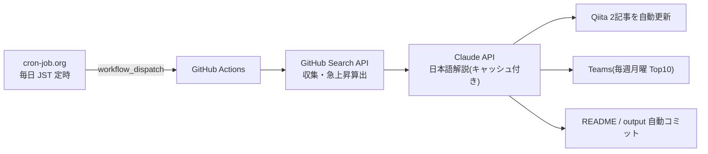

# Claude Code向けMCPツール候補ランキング

GitHub Search APIを使って、Claude Code周辺で活用候補になりそうなMCP関連リポジトリを定期収集するリポジトリです。

> 注意: この一覧は「Claude Codeでの動作」を保証するものではありません。  
> GitHub上のリポジトリ名・説明文・READMEなどに含まれる情報をもとに、MCP関連ツール候補を探すための入口として利用します。

## 仕組み(定常自律運転)

このランキングは cron-job.org → GitHub Actions → Claude API → Qiita / Teams のパイプラインで、毎日無人更新されています。


```mermaid
flowchart LR
    A["cron-job.org<br>毎日 JST 定時"] -->|workflow_dispatch| B["GitHub Actions"]
    B --> C["GitHub Search API<br>収集・急上昇算出"]
    C --> D["Claude API<br>日本語解説(キャッシュ付き)"]
    D --> E["Qiita 2記事を自動更新"]
    D --> F["Teams(毎週月曜 Top10)"]
    D --> G["README / output 自動コミット"]
```

- 仕組みの詳細と**ライブ稼働ステータス**: [定常自律運転ページ](https://takanobusano.github.io/mcp-github-ranking/)
- 作り方の解説記事: [パイプライン編](https://qiita.com/4q_sano/items/913e93ee5cc2731561fc) / [cron-job.org 完全自動化編](https://qiita.com/4q_sano/items/1bc5e0669a8f0166936c)
<!-- MCP_REPOS_START -->
最終更新: **2026-09-27 08:17:15 JST**

MCP関連リポジトリに加え、Claude Code周辺で活用候補になりそうな関連ツールをGitHub Search APIで毎日自動収集してランキング化しています。

Stars / Forks の差分は、UTC基準の前日データ（2026-09-25）との差分です。
CSVには最大500件を保存し、本文では上位100件を表示しています。

> 注意: この一覧はClaude Codeでの動作を保証するものではありません。  
> MCP関連ツールまたはClaude Code関連ツール候補を探すための入口として利用してください。

# 注目MCP・関連ツール候補ランキング

## 1位 [public-apis/public-apis](https://github.com/public-apis/public-apis)

A collective list of free APIs

⭐ **483,559 Stars**（+324）　🍴 **53,411 Forks**（+34）　/　🟢 **1,937 Open Issues**　/　Python

Topics: `api` / `apis` / `dataset` / `development` / `free` / `list` / `lists` / `open-source`

## 2位 [openclaw/openclaw](https://github.com/openclaw/openclaw)

The AI that really does things. Any OS. Any Platform. The lobster way. 🦞

⭐ **390,585 Stars**（+72）　🍴 **82,157 Forks**（+1）　/　🟢 **8,716 Open Issues**　/　TypeScript

Topics: `ai` / `assistant` / `crustacean` / `molty` / `openclaw` / `own-your-data` / `personal`

## 3位 [obra/superpowers](https://github.com/obra/superpowers)

An agentic skills framework & software development methodology that works.

⭐ **291,948 Stars**（+306）　🍴 **26,129 Forks**（+21）　/　🟢 **310 Open Issues**　/　Shell

Topics: `ai` / `brainstorming` / `coding` / `obra` / `sdlc` / `skills` / `subagent-driven-development` / `superpowers`

## 4位 [mattpocock/skills](https://github.com/mattpocock/skills)

Skills for Real Engineers. Straight from my .agents directory.

⭐ **270,255 Stars**（+554）　🍴 **22,761 Forks**（+35）　/　🟢 **531 Open Issues**　/　Shell

Topics: `topicなし`

## 5位 [affaan-m/ECC](https://github.com/affaan-m/ECC)

The agent harness performance optimization system. Skills, instincts, memory, security, and research-first development for Claude Code, Codex, Opencode, Cursor and beyond.

⭐ **267,943 Stars**（+475）　🍴 **40,025 Forks**（+71）　/　🟢 **236 Open Issues**　/　JavaScript

Topics: `ai-agents` / `anthropic` / `claude` / `claude-code` / `developer-tools` / `llm` / `mcp` / `productivity`

## 6位 [NousResearch/hermes-agent](https://github.com/NousResearch/hermes-agent)

The agent that grows with you

⭐ **249,234 Stars**（+266）　🍴 **52,914 Forks**（+127）　/　🟢 **44,092 Open Issues**　/　Python

Topics: `ai` / `ai-agent` / `ai-agents` / `anthropic` / `chatgpt` / `claude` / `claude-code` / `codex`

## 7位 [multica-ai/andrej-karpathy-skills](https://github.com/multica-ai/andrej-karpathy-skills)

A single CLAUDE.md file to improve Claude Code behavior, derived from Andrej Karpathy's observations on LLM coding pitfalls.

⭐ **215,367 Stars**（+210）　🍴 **21,743 Forks**（+9）　/　🟢 **130 Open Issues**　/　不明

Topics: `topicなし`

## 8位 [ultraworkers/claw-code](https://github.com/ultraworkers/claw-code)

An agent-managed museum exhibit, built in Rust with Gajae-Code / LazyCodex — developed and maintained with no human intervention.

⭐ **195,290 Stars**（-2）　🍴 **108,364 Forks**（-17）　/　🟢 **48 Open Issues**　/　Rust

Topics: `topicなし`

## 9位 [firecrawl/firecrawl](https://github.com/firecrawl/firecrawl)

The web data API to search, scrape, and interact at scale. 🔥

⭐ **185,118 Stars**（+396）　🍴 **9,931 Forks**（+8）　/　🟢 **651 Open Issues**　/　TypeScript

Topics: `ai` / `ai-agents` / `ai-crawler` / `ai-scraping` / `ai-search` / `crawler` / `data-extraction` / `html-to-markdown`

## 10位 [ollama/ollama](https://github.com/ollama/ollama)

Get up and running with Kimi, GLM, MiniMax, DeepSeek, gpt-oss, Qwen, Gemma and other models.

⭐ **181,777 Stars**（+49）　🍴 **18,012 Forks**（+7）　/　🟢 **4,105 Open Issues**　/　Go

Topics: `deepseek` / `gemma` / `gemma3` / `glm` / `go` / `golang` / `gpt-oss` / `llama`

## 11位 [anthropics/skills](https://github.com/anthropics/skills)

Public repository for Agent Skills

⭐ **178,555 Stars**（+269）　🍴 **21,132 Forks**（+24）　/　🟢 **1,334 Open Issues**　/　Python

Topics: `agent-skills`

## 12位 [langgenius/dify](https://github.com/langgenius/dify)

Build Agentic workflows, RAG pipelines, with rich AI model and tool support on one collaborative workspace. Deploy on cloud, VPC, or self-hosted, so teams move from prototype to production without rebuilding the stack.

⭐ **157,284 Stars**（+66）　🍴 **24,792 Forks**（+11）　/　🟢 **1,127 Open Issues**　/　TypeScript

Topics: `agent` / `agentic-ai` / `agentic-framework` / `agentic-workflow` / `ai` / `automation` / `claude` / `deepseek`

## 13位 [langflow-ai/langflow](https://github.com/langflow-ai/langflow)

Langflow is a powerful tool for building and deploying AI-powered agents and workflows.

⭐ **155,284 Stars**（+27）　🍴 **10,149 Forks**（+2）　/　🟢 **1,189 Open Issues**　/　Python

Topics: `agents` / `chatgpt` / `generative-ai` / `large-language-models` / `multiagent` / `react-flow`

## 14位 [msitarzewski/agency-agents](https://github.com/msitarzewski/agency-agents)

A complete AI agency at your fingertips - From frontend wizards to Reddit community ninjas, from whimsy injectors to reality checkers. Each agent is a specialized expert with personality, processes, and proven deliverables.

⭐ **154,762 Stars**（+129）　🍴 **24,960 Forks**（+12）　/　🟢 **148 Open Issues**　/　Shell

Topics: `topicなし`

## 15位 [anthropics/claude-code](https://github.com/anthropics/claude-code)

Claude Code is an agentic coding tool that lives in your terminal, understands your codebase, and helps you code faster by executing routine tasks, explaining complex code, and handling git workflows - all through natural language commands.

⭐ **148,207 Stars**（+114）　🍴 **24,738 Forks**（+168）　/　🟢 **13,240 Open Issues**　/　TypeScript

Topics: `topicなし`

## 16位 [DietrichGebert/ponytail](https://github.com/DietrichGebert/ponytail)

Makes your AI agent think like the laziest senior dev in the room. The best code is the code you never wrote.

⭐ **146,473 Stars**（+491）　🍴 **7,871 Forks**（+42）　/　🟢 **309 Open Issues**　/　JavaScript

Topics: `agent-skills` / `ai-agents` / `claude` / `claude-code` / `claude-code-plugin` / `cursor-rules` / `developer-tools` / `llm`

## 17位 [x1xhlol/system-prompts-and-models-of-ai-tools](https://github.com/x1xhlol/system-prompts-and-models-of-ai-tools)

FULL Augment Code, Claude Code, Cluely, CodeBuddy, Comet, Cursor, Devin AI, Junie, Kiro, Leap.new, Lovable, Manus, NotionAI, Orchids.app, Perplexity, Poke, Qoder, Replit, Same.dev, Trae, Traycer AI, VSCode Agent, Warp.dev, Windsurf, Xcode, Z.ai Code, Dia & v0. (And other Open Sourced) System Prompts, Internal Tools & AI Models

⭐ **143,886 Stars**（+16）　🍴 **34,810 Forks**（-1）　/　🟢 **163 Open Issues**　/　不明

Topics: `ai` / `bolt` / `cluely` / `copilot` / `cursor` / `cursorai` / `devin` / `github-copilot`

## 18位 [farion1231/cc-switch](https://github.com/farion1231/cc-switch)

A cross-platform desktop All-in-One assistant for Claude Code, Codex, OpenCode, OpenClaw, Grok Build & Hermes Agent. Only official website: ccswitch.io

⭐ **137,163 Stars**（+327）　🍴 **9,338 Forks**（+15）　/　🟢 **2,893 Open Issues**　/　Rust

Topics: `ai-tools` / `claude-code` / `codex` / `desktop-app` / `grok` / `grokbuild` / `hermes` / `hermes-agent`

## 19位 [garrytan/gstack](https://github.com/garrytan/gstack)

Use Garry Tan's exact Claude Code setup: 23 opinionated tools that serve as CEO, Designer, Eng Manager, Release Manager, Doc Engineer, and QA

⭐ **134,270 Stars**（+55）　🍴 **20,006 Forks**（+8）　/　🟢 **941 Open Issues**　/　TypeScript

Topics: `topicなし`

## 20位 [nextlevelbuilder/ui-ux-pro-max-skill](https://github.com/nextlevelbuilder/ui-ux-pro-max-skill)

An AI skill that provides design intelligence for building professional UI/UX across multiple platforms.

⭐ **130,842 Stars**（+194）　🍴 **13,906 Forks**（+17）　/　🟢 **82 Open Issues**　/　Python

Topics: `ai-skills` / `antigravity` / `claude` / `claude-code` / `codex` / `command-line` / `copilot` / `cursor-ai`

## 21位 [harry0703/MoneyPrinterTurbo](https://github.com/harry0703/MoneyPrinterTurbo)

利用 AI 大模型和自动化工作流，根据主题或关键词一键生成高清短视频。Generate HD short videos from a topic or keyword with an automated AI workflow.

⭐ **126,105 Stars**（+258）　🍴 **19,663 Forks**（+59）　/　🟢 **36 Open Issues**　/　Python

Topics: `ai-video-generator` / `content-creation` / `ffmpeg` / `instagram-reels` / `llm` / `python` / `short-video` / `subtitles`

## 22位 [Graphify-Labs/graphify](https://github.com/Graphify-Labs/graphify)

Turn any codebase, with its docs, SQL schemas, configs, and PDFs, into a queryable knowledge graph. A /graphify skill for Claude Code, Cursor, Codex, and Gemini CLI: local deterministic AST parsing, every edge explained, no vector store.

⭐ **121,670 Stars**（+222）　🍴 **11,712 Forks**（+9）　/　🟢 **1,476 Open Issues**　/　Python

Topics: `ai-agents` / `antigravity` / `ast` / `claude-code` / `code-analysis` / `code-search` / `codex` / `cursor`

## 23位 [browser-use/browser-use](https://github.com/browser-use/browser-use)

Agents that use the browser.

⭐ **116,407 Stars**（+119）　🍴 **12,820 Forks**（+17）　/　🟢 **516 Open Issues**　/　Python

Topics: `ai-agents` / `ai-tools` / `browser-automation` / `browser-use` / `llm` / `playwright` / `python`

## 24位 [TauricResearch/TradingAgents](https://github.com/TauricResearch/TradingAgents)

TradingAgents: Multi-Agents LLM Financial Trading Framework

⭐ **108,770 Stars**（+141）　🍴 **20,851 Forks**（+37）　/　🟢 **79 Open Issues**　/　Python

Topics: `agent` / `finance` / `llm` / `multiagent` / `trading`

## 25位 [JuliusBrussee/caveman](https://github.com/JuliusBrussee/caveman)

🪨 why use many token when few token do trick. Viral skill + proxy for coding agents that cuts 65% of tokens by talking like a caveman.

⭐ **107,954 Stars**（+102）　🍴 **6,257 Forks**（+9）　/　🟢 **139 Open Issues**　/　Go

Topics: `ai` / `anthropic` / `caveman` / `claude` / `claude-code` / `llm` / `meme` / `prompt-engineering`

## 26位 [google-gemini/gemini-cli](https://github.com/google-gemini/gemini-cli)

An open-source AI agent that brings the power of Gemini directly into your terminal.

⭐ **107,164 Stars**（-2）　🍴 **14,627 Forks**（-1）　/　🟢 **814 Open Issues**　/　TypeScript

Topics: `ai` / `ai-agents` / `cli` / `gemini` / `gemini-api` / `mcp-client` / `mcp-server`

## 27位 [addyosmani/agent-skills](https://github.com/addyosmani/agent-skills)

Production-grade engineering skills for AI coding agents.

⭐ **99,278 Stars**（+214）　🍴 **10,424 Forks**（+22）　/　🟢 **116 Open Issues**　/　JavaScript

Topics: `agent-skills` / `antigravity` / `claude-code` / `codex` / `cursor` / `skills`

## 28位 [nexu-io/open-design](https://github.com/nexu-io/open-design)

🎨 Best DeepSeek Harness Design Plugin. The open-source Claude Design alternative. 🖥️ Local-first desktop app. 🖼️ Your coding agent becomes the design engine: pr...

⭐ **98,199 Stars**（+111）　🍴 **11,392 Forks**（+10）　/　🟢 **1,130 Open Issues**　/　TypeScript

Topics: `agent-skills` / `ai-design` / `byok` / `claude-code-for-design` / `claude-design` / `codex-design` / `coding-agents` / `cursor-design`

## 29位 [microsoft/playwright](https://github.com/microsoft/playwright)

Playwright is a framework for Web Testing and Automation. It allows testing Chromium, Firefox and WebKit with a single API.

⭐ **96,709 Stars**（+31）　🍴 **6,506 Forks**（+3）　/　🟢 **186 Open Issues**　/　TypeScript

Topics: `automation` / `chrome` / `chromium` / `e2e-testing` / `electron` / `end-to-end-testing` / `firefox` / `javascript`

## 30位 [puppeteer/puppeteer](https://github.com/puppeteer/puppeteer)

JavaScript API for Chrome and Firefox

⭐ **95,623 Stars**（+1）　🍴 **9,583 Forks**（+4）　/　🟢 **269 Open Issues**　/　TypeScript

Topics: `automation` / `chrome` / `chromium` / `developer-tools` / `firefox` / `headless-chrome` / `node-module` / `testing`

## 31位 [thedotmack/claude-mem](https://github.com/thedotmack/claude-mem)

Persistent Context Across Sessions for Every Agent –  Captures everything your agent does during sessions, compresses it with AI, and injects relevant context back into future sessions. Works with Claude Code, OpenClaw, Codex, Gemini, Hermes, Copilot, OpenCode + More

⭐ **94,742 Stars**（+43）　🍴 **8,379 Forks**（+6）　/　🟢 **309 Open Issues**　/　TypeScript

Topics: `ai` / `ai-agents` / `ai-memory` / `anthropic` / `artificial-intelligence` / `chromadb` / `claude` / `claude-agent-sdk`

## 32位 [OpenCut-app/OpenCut](https://github.com/OpenCut-app/OpenCut)

The open-source CapCut alternative

⭐ **90,718 Stars**（+49）　🍴 **8,967 Forks**（+4）　/　🟢 **378 Open Issues**　/　TypeScript

Topics: `editor` / `oss` / `videoeditor`

## 33位 [modelcontextprotocol/servers](https://github.com/modelcontextprotocol/servers)

Model Context Protocol Servers

⭐ **90,611 Stars**（+14）　🍴 **11,691 Forks**（+2）　/　🟢 **561 Open Issues**　/　TypeScript

Topics: `topicなし`

## 34位 [Leonxlnx/taste-skill](https://github.com/Leonxlnx/taste-skill)

Taste-Skill - gives your AI good taste. stops the AI from generating boring, generic slop

⭐ **90,364 Stars**（+232）　🍴 **6,155 Forks**（+16）　/　🟢 **71 Open Issues**　/　JavaScript

Topics: `agent` / `ai` / `claude` / `claude-code` / `codex` / `coding` / `design` / `frontend`

## 35位 [OpenHands/OpenHands](https://github.com/OpenHands/OpenHands)

🙌 OpenHands: AI-Driven Development

⭐ **89,231 Stars**（+64）　🍴 **11,753 Forks**（+12）　/　🟢 **853 Open Issues**　/　TypeScript

Topics: `agent` / `artificial-intelligence` / `chatgpt` / `claude-ai` / `cli` / `developer-tools` / `gpt` / `llm`

## 36位 [ChatGPTNextWeb/NextChat](https://github.com/ChatGPTNextWeb/NextChat)

✨ Zero-config AI chat assistant. No API key needed — sign up and instantly chat with GPT-5, Claude 4, Gemini 2.5, DeepSeek & 100+ top models. Pay-as-you-go save...

⭐ **88,815 Stars**（+2）　🍴 **58,973 Forks**（-12）　/　🟢 **864 Open Issues**　/　TypeScript

Topics: `calclaude` / `chatgpt` / `claude` / `cross-platform` / `desktop` / `fe` / `gemini` / `gemini-pro`

## 37位 [koala73/worldmonitor](https://github.com/koala73/worldmonitor)

Real-time global intelligence dashboard. AI-powered news aggregation, geopolitical monitoring, and infrastructure tracking in a unified situational awareness interface

⭐ **87,429 Stars**（+46）　🍴 **13,325 Forks**（+12）　/　🟢 **348 Open Issues**　/　TypeScript

Topics: `agent` / `ai` / `dashboard` / `geopolitics` / `mcp` / `mcp-server` / `monitoring` / `news`

## 38位 [paperclipai/paperclip](https://github.com/paperclipai/paperclip)

The open-source app everyone uses to manage agents at work

⭐ **87,201 Stars**（+2,373）　🍴 **15,418 Forks**（+194）　/　🟢 **5,741 Open Issues**　/　TypeScript

Topics: `topicなし`

## 39位 [Panniantong/Agent-Reach](https://github.com/Panniantong/Agent-Reach)

Give your AI agent eyes to see the entire internet. Read & search Twitter, Reddit, YouTube, GitHub, Bilibili, XiaoHongShu — one CLI, zero API fees.

⭐ **85,597 Stars**（+146）　🍴 **7,524 Forks**（+20）　/　🟢 **161 Open Issues**　/　Python

Topics: `agent-infrastructure` / `ai-agent` / `ai-search` / `automation` / `bilibili` / `claude-code` / `cli` / `cursor`

## 40位 [laravel/laravel](https://github.com/laravel/laravel)

Laravel is a web application framework with expressive, elegant syntax. We’ve already laid the foundation for your next big idea — freeing you to create without sweating the small things.

⭐ **85,018 Stars**（+7）　🍴 **26,114 Forks**（+185）　/　🟢 **31 Open Issues**　/　Blade

Topics: `framework` / `laravel` / `php`

## 41位 [unclecode/crawl4ai](https://github.com/unclecode/crawl4ai)

Open-source web crawler and scraper for LLMs and AI agents: any website into clean, LLM-ready Markdown. Run it yourself, or use Crawl4AI Cloud with one key.

⭐ **84,310 Stars**（+45）　🍴 **8,718 Forks**（+1）　/　🟢 **202 Open Issues**　/　Python

Topics: `ai` / `ai-agents` / `crawler` / `data-extraction` / `llm` / `markdown` / `mcp` / `open-source`

## 42位 [Egonex-AI/Understand-Anything](https://github.com/Egonex-AI/Understand-Anything)

Graphs that teach > graphs that impress. Turn any code into an interactive knowledge graph you can explore, search, and ask questions about. Works with Claude Code, Codex, Cursor, Copilot, Gemini CLI, and more.

⭐ **84,280 Stars**（+89）　🍴 **7,107 Forks**（+1）　/　🟢 **306 Open Issues**　/　TypeScript

Topics: `antigravity-skills` / `business-knowledge` / `claude-code` / `claude-skills` / `codebase-analysis` / `codex` / `codex-skills` / `developer-tools-ai-agent`

## 43位 [D4Vinci/Scrapling](https://github.com/D4Vinci/Scrapling)

🕷️ An adaptive Web Scraping framework that handles everything from a single request to a full-scale crawl! Don't be shy, join here:  and follow here for daily tips and tricks:

⭐ **83,884 Stars**（+174）　🍴 **8,569 Forks**（+16）　/　🟢 **1 Open Issues**　/　Python

Topics: `ai` / `ai-scraping` / `automation` / `crawler` / `crawling` / `crawling-python` / `data` / `data-extraction`

## 44位 [bytedance/deer-flow](https://github.com/bytedance/deer-flow)

An open-source long-horizon SuperAgent harness that researches, codes, and creates. With the help of sandboxes, memories, tools, skill, subagents and message gateway, it handles different levels of tasks that could take minutes to hours.

⭐ **83,005 Stars**（+29）　🍴 **11,494 Forks**（+7）　/　🟢 **899 Open Issues**　/　Python

Topics: `agent` / `agentic` / `agentic-framework` / `agentic-workflow` / `ai` / `ai-agents` / `deep-research` / `harness`

## 45位 [lobehub/lobehub](https://github.com/lobehub/lobehub)

🤯 LobeHub is your Chief Agent Operator, organizing your agents into 7×24 operations by hiring, scheduling, and reporting on your entire AI team.

⭐ **82,839 Stars**（+11）　🍴 **15,924 Forks**（+2）　/　🟢 **952 Open Issues**　/　TypeScript

Topics: `agent` / `agent-collaboration` / `agent-harness` / `ai` / `cao` / `chatgpt` / `chief-agent-operator` / `claude`

## 46位 [rtk-ai/rtk](https://github.com/rtk-ai/rtk)

CLI proxy that reduces LLM token consumption by 60-90% on common dev commands. Single Rust binary, zero dependencies

⭐ **81,773 Stars**（+53）　🍴 **5,184 Forks**（+10）　/　🟢 **1,544 Open Issues**　/　Rust

Topics: `agentic-coding` / `ai-coding` / `anthropic` / `claude-code` / `cli` / `command-line-tool` / `cost-reduction` / `developer-tools`

## 47位 [abi/screenshot-to-code](https://github.com/abi/screenshot-to-code)

Drop in a screenshot and convert it to clean code (HTML/Tailwind/React/Vue)

⭐ **79,724 Stars**（+32）　🍴 **9,743 Forks**（+7）　/　🟢 **147 Open Issues**　/　Python

Topics: `topicなし`

## 48位 [stablyai/orca](https://github.com/stablyai/orca)

Orca is the ADE for working with a fleet of parallel agents. Run any coding agent with your own subscription. Available on desktop, mobile and remote runtime.

⭐ **78,897 Stars**（+621）　🍴 **5,170 Forks**（+49）　/　🟢 **6,953 Open Issues**　/　TypeScript

Topics: `ade` / `agent-ide` / `ai-agents` / `claude-code` / `cli` / `codex` / `cursor-agent` / `devtools`

## 49位 [shareAI-lab/learn-claude-code](https://github.com/shareAI-lab/learn-claude-code)

Bash is all you need -  A nano claude code–like 「agent harness」, built from 0 to 1

⭐ **77,635 Stars**（+26）　🍴 **12,479 Forks**（+4）　/　🟢 **58 Open Issues**　/　Python

Topics: `agent` / `agent-development` / `ai-agent` / `claude` / `claude-code` / `educational` / `llm` / `python`

## 50位 [unslothai/unsloth](https://github.com/unslothai/unsloth)

Local UI to run and train LLMs and diffusion models. Supports GGUF, MLX, Qwen3.8, DeepSeek-V4, MiniMax-H3, Gemma 4, FLUX and more.

⭐ **76,835 Stars**（+50）　🍴 **7,052 Forks**（+9）　/　🟢 **1,258 Open Issues**　/　Python

Topics: `agent` / `ai` / `chatgpt` / `deepseek` / `fine-tuning` / `gemma` / `image-generation` / `llama`

## 51位 [Eugeny/tabby](https://github.com/Eugeny/tabby)

A terminal for a more modern age

⭐ **74,683 Stars**（+4）　🍴 **4,269 Forks**（+3）　/　🟢 **2,811 Open Issues**　/　TypeScript

Topics: `serial` / `ssh-client` / `telnet-client` / `terminal` / `terminal-emulators`

## 52位 [thedaviddias/Front-End-Checklist](https://github.com/thedaviddias/Front-End-Checklist)

🗂 The essential checklist for modern web development, for humans and AI agents

⭐ **74,280 Stars**（+9）　🍴 **6,750 Forks**（+1）　/　🟢 **11 Open Issues**　/　MDX

Topics: `ai-agent` / `ai-agents` / `checklist` / `css` / `front-end-developer-tool` / `front-end-development` / `frontend` / `guidelines`

## 53位 [headroomlabs-ai/headroom](https://github.com/headroomlabs-ai/headroom)

Compress tool outputs, logs, files, and RAG chunks before they reach the LLM. 20% fewer tokens for coding agents, 60-95% fewer tokens for JSON, same answers. Library, proxy, MCP server.

⭐ **73,881 Stars**（+67）　🍴 **5,702 Forks**（+7）　/　🟢 **540 Open Issues**　/　Python

Topics: `agent` / `ai` / `anthropic` / `claude-code` / `compression` / `context-engineering` / `context-window` / `cursor`

## 54位 [OpenBB-finance/OpenBB](https://github.com/OpenBB-finance/OpenBB)

Open Data Platform for analysts, quants and AI agents.

⭐ **73,488 Stars**（+24）　🍴 **7,613 Forks**（+7）　/　🟢 **97 Open Issues**　/　Python

Topics: `ai` / `crypto` / `derivatives` / `economics` / `equity` / `finance` / `fixed-income` / `machine-learning`

## 55位 [ruvnet/ruflo](https://github.com/ruvnet/ruflo)

🌊 The original agent harness. Deploy intelligent multi-player swarms, coordinate autonomous workflows, and build conversational AI systems. Features adaptive me...

⭐ **73,325 Stars**（+48）　🍴 **8,705 Forks**（+6）　/　🟢 **986 Open Issues**　/　TypeScript

Topics: `agentic-ai` / `agentic-framework` / `agentic-workflow` / `agents` / `ai-agents` / `ai-assistant` / `ai-skills` / `autonomous-agents`

## 56位 [tt-a1i/archify](https://github.com/tt-a1i/archify)

Agent skill for beautiful, verifiable architecture, workflow, sequence, data-flow, and lifecycle diagrams—self-contained HTML with motion and crisp export.

⭐ **72,261 Stars**（+559）　🍴 **4,873 Forks**（+47）　/　🟢 **174 Open Issues**　/　JavaScript

Topics: `agent-skills` / `architecture-as-code` / `architecture-diagram` / `claude-skill` / `code-visualization` / `codex` / `coding-agents` / `data-flow-diagram`

## 57位 [colbymchenry/codegraph](https://github.com/colbymchenry/codegraph)

Pre-indexed code knowledge graph, auto syncs on code changes, for Claude Code, Codex, Gemini, Cursor, OpenCode, AntiGravity, Kiro, CoPilot, and Hermes Agent — fewer tokens, fewer tool calls, 100% local

⭐ **72,131 Stars**（+43）　🍴 **4,630 Forks**（+5）　/　🟢 **601 Open Issues**　/　C

Topics: `topicなし`

## 58位 [daytonaio/daytona](https://github.com/daytonaio/daytona)

Daytona is a Secure and Elastic Infrastructure for Running AI-Generated Code

⭐ **71,708 Stars**（-8）　🍴 **5,644 Forks**（-2）　/　🟢 **457 Open Issues**　/　不明

Topics: `agentic-workflow` / `ai` / `ai-agents` / `ai-runtime` / `ai-sandboxes` / `code-execution` / `code-interpreter` / `developer-tools`

## 59位 [pbakaus/impeccable](https://github.com/pbakaus/impeccable)

The design language that makes your AI harness better at design.

⭐ **71,556 Stars**（+385）　🍴 **4,328 Forks**（+18）　/　🟢 **52 Open Issues**　/　JavaScript

Topics: `topicなし`

## 60位 [diegosouzapw/OmniRoute](https://github.com/diegosouzapw/OmniRoute)

Never stop coding. Free MIT AI gateway: one endpoint, 359 providers (150+ free), 1200+ models Kimi, Claude, GPT, Gemini, GLM, DeepSeek, MiniMax. Works with Claude Code, Codex, Cursor, OpenCode, Cline & Copilot. Quota-aware auto-fallback, RTK+Caveman compression saves 15-95% tokens, MCP/A2A, Desktop/PWA. Built by hundreds of contributors

⭐ **70,488 Stars**（+293）　🍴 **10,017 Forks**（+45）　/　🟢 **570 Open Issues**　/　TypeScript

Topics: `a2a` / `ai-agents` / `ai-gateway` / `anthropic` / `claude` / `claude-code` / `cline` / `codex`

## 61位 [code-yeongyu/oh-my-openagent](https://github.com/code-yeongyu/oh-my-openagent)

OmO: Just type "mass ulw" keyword with your prompt. Now you are the master of graph engineering.

⭐ **69,476 Stars**（+47）　🍴 **5,721 Forks**（+4）　/　🟢 **1,066 Open Issues**　/　TypeScript

Topics: `ai` / `ai-agents` / `anthropic` / `chatgpt` / `claude` / `claude-skills` / `codex` / `cursor`

## 62位 [cline/cline](https://github.com/cline/cline)

Autonomous coding agent as an SDK, IDE extension, or CLI assistant.

⭐ **69,392 Stars**（+72）　🍴 **7,529 Forks**（+12）　/　🟢 **1,471 Open Issues**　/　TypeScript

Topics: `topicなし`

## 63位 [openinterpreter/openinterpreter](https://github.com/openinterpreter/openinterpreter)

A coding agent for open models like Kimi K3 and GLM 5.3

⭐ **68,451 Stars**（+9）　🍴 **5,881 Forks**（±0）　/　🟢 **4 Open Issues**　/　Rust

Topics: `acp` / `coding-agent` / `deepseek` / `kimi` / `python` / `qwen` / `rust`

## 64位 [asgeirtj/system_prompts_leaks](https://github.com/asgeirtj/system_prompts_leaks)

Documented system prompts from Anthropic - Claude Fable 5.1, Opus 5.5, Claude Design, Claude Code. OpenAI - ChatGPT GPT-6-Astra, Codex. Google - Gemini 3.8 Flash, 3.1 Pro, Antigravity. xAI - Grok, Grok Bot, Cursor, Kimi and more! Updated regularly.

⭐ **68,401 Stars**（+43）　🍴 **11,110 Forks**（-4）　/　🟢 **56 Open Issues**　/　JavaScript

Topics: `ai` / `ai-agents` / `ai-prompts` / `anthropic` / `chatbot` / `chatgpt` / `claude` / `claude-code`

## 65位 [docling-project/docling](https://github.com/docling-project/docling)

Get your documents ready for gen AI

⭐ **68,000 Stars**（+41）　🍴 **4,934 Forks**（+8）　/　🟢 **944 Open Issues**　/　Python

Topics: `ai` / `convert` / `document-parser` / `document-parsing` / `documents` / `docx` / `html` / `markdown`

## 66位 [bradtraversy/design-resources-for-developers](https://github.com/bradtraversy/design-resources-for-developers)

Curated list of design and UI resources from stock photos, web templates, CSS frameworks, UI libraries, tools and much more

⭐ **67,036 Stars**（+7）　🍴 **12,198 Forks**（-2）　/　🟢 **149 Open Issues**　/　不明

Topics: `topicなし`

## 67位 [xtekky/gpt4free](https://github.com/xtekky/gpt4free)

The official gpt4free repository \| various collection of powerful language models \| opus 4.6 gpt 5.3 kimi 2.5 deepseek v3.2 gemini 3

⭐ **66,737 Stars**（±0）　🍴 **13,498 Forks**（+1）　/　🟢 **4 Open Issues**　/　Python

Topics: `chatbot` / `chatbots` / `chatgpt` / `chatgpt-4` / `chatgpt-api` / `chatgpt-free` / `chatgpt4` / `deepseek`

## 68位 [shanraisshan/claude-code-best-practice](https://github.com/shanraisshan/claude-code-best-practice)

from vibe coding to agentic engineering - practice makes claude perfect

⭐ **66,385 Stars**（+31）　🍴 **6,604 Forks**（+3）　/　🟢 **44 Open Issues**　/　HTML

Topics: `agentic-ai` / `agentic-coding` / `agentic-engineering` / `agentic-workflow` / `ai` / `ai-agents` / `anthropic` / `best-practices`

## 69位 [mem0ai/mem0](https://github.com/mem0ai/mem0)

The Memory Layer for AI Agents - Drop-in memory infrastructure for AI agents and apps. Context that persists. Built for production.

⭐ **66,031 Stars**（+22）　🍴 **7,763 Forks**（+2）　/　🟢 **751 Open Issues**　/　Python

Topics: `agentic-memory` / `agentic-memory-system` / `agents` / `ai` / `ai-agents` / `chatgpt` / `genai` / `llm`

## 70位 [NanmiCoder/MediaCrawler](https://github.com/NanmiCoder/MediaCrawler)

小红书笔记 \| 评论爬虫、抖音视频 \| 评论爬虫、快手视频 \| 评论爬虫、B 站视频 ｜ 评论爬虫、微博帖子 ｜ 评论爬虫、百度贴吧帖子 ｜ 百度贴吧评论回复爬虫  \| 知乎问答文章｜评论爬虫

⭐ **65,766 Stars**（+52）　🍴 **12,683 Forks**（+6）　/　🟢 **210 Open Issues**　/　Python

Topics: `topicなし`

## 71位 [warpdotdev/warp](https://github.com/warpdotdev/warp)

Warp is an agentic development environment, born out of the terminal.

⭐ **65,177 Stars**（+16）　🍴 **5,586 Forks**（+2）　/　🟢 **5,310 Open Issues**　/　Rust

Topics: `bash` / `linux` / `macos` / `rust` / `shell` / `terminal` / `wasm` / `zsh`

## 72位 [usestrix/strix](https://github.com/usestrix/strix)

Open-source AI penetration testing tool to find and fix your app’s vulnerabilities.

⭐ **65,033 Stars**（+196）　🍴 **7,139 Forks**（+39）　/　🟢 **415 Open Issues**　/　Python

Topics: `agents` / `ai-hacking` / `ai-penetration-testing` / `ai-pentesting` / `ai-security` / `artificial-intelligence` / `bug-bounty` / `code-quality`

## 73位 [mvanhorn/last30days-skill](https://github.com/mvanhorn/last30days-skill)

AI agent skill that researches any topic across Reddit, X, YouTube, HN, Polymarket, and the web - then synthesizes a grounded summary

⭐ **62,945 Stars**（+133）　🍴 **5,480 Forks**（+18）　/　🟢 **121 Open Issues**　/　Python

Topics: `ai-prompts` / `ai-skill` / `bluesky` / `claude` / `claude-code` / `clawhub` / `deep-research` / `hackernews`

## 74位 [sansan0/TrendRadar](https://github.com/sansan0/TrendRadar)

⭐AI-driven public opinion & trend monitor with multi-platform aggregation, RSS, and smart alerts.🎯 告别信息过载，你的 AI 舆情监控助手与热点筛选工具！聚合多平台热点 +  RSS 订阅，支持关键词精准筛选。AI 智能筛...

⭐ **62,549 Stars**（+16）　🍴 **24,888 Forks**（+4）　/　🟢 **67 Open Issues**　/　Python

Topics: `ai` / `bark` / `data-analysis` / `docker` / `hot-news` / `llm` / `mail` / `mcp`

## 75位 [upstash/context7](https://github.com/upstash/context7)

Context7 Platform -- Up-to-date code documentation for LLMs and AI code editors

⭐ **62,452 Stars**（+25）　🍴 **3,033 Forks**（+1）　/　🟢 **69 Open Issues**　/　TypeScript

Topics: `llm` / `mcp` / `mcp-server` / `vibe-coding`

## 76位 [coollabsio/coolify](https://github.com/coollabsio/coolify)

An open-source, self-hostable PaaS alternative to Vercel, Heroku & Netlify that lets you easily deploy static sites, databases, full-stack applications and 280+ one-click services on your own servers.

⭐ **62,290 Stars**（+18）　🍴 **5,559 Forks**（+10）　/　🟢 **761 Open Issues**　/　PHP

Topics: `coolify` / `databases` / `deployment` / `docker` / `docker-compose` / `inertiajs` / `laravel` / `mariadb`

## 77位 [tw93/Pake](https://github.com/tw93/Pake)

🤱🏻 Turn any webpage into a desktop app with one command.

⭐ **61,743 Stars**（+11）　🍴 **12,713 Forks**（-1）　/　🟢 **8 Open Issues**　/　Rust

Topics: `chatgpt` / `claude` / `desktop` / `gemini` / `hight-performance` / `linux` / `macos` / `no-electron`

## 78位 [1c7/chinese-independent-developer](https://github.com/1c7/chinese-independent-developer)

👩🏿‍💻👨🏾‍💻👩🏼‍💻👨🏽‍💻👩🏻‍💻中国独立开发者项目列表 -- 分享大家都在做什么

⭐ **61,552 Stars**（-2）　🍴 **5,413 Forks**（±0）　/　🟢 **2 Open Issues**　/　不明

Topics: `china` / `indie` / `indie-developer`

## 79位 [calesthio/OpenMontage](https://github.com/calesthio/OpenMontage)

World's first open-source, agentic video production system. 12 production pipelines, 100+ tools, 700+ agent skill and production-knowledge files. Turn your AI coding assistant into a full video production studio.

⭐ **61,411 Stars**（+124）　🍴 **7,814 Forks**（+12）　/　🟢 **329 Open Issues**　/　Python

Topics: `agent` / `agentic-ai` / `ai` / `claude` / `copilot` / `cursor` / `elevenlabs` / `ffmpeg`

## 80位 [microsoft/autogen](https://github.com/microsoft/autogen)

A programming framework for agentic AI

⭐ **61,179 Stars**（+14）　🍴 **9,256 Forks**（+5）　/　🟢 **1,104 Open Issues**　/　Python

Topics: `agentic` / `agentic-agi` / `agents` / `ai` / `autogen` / `autogen-ecosystem` / `chatgpt` / `framework`

## 81位 [penpot/penpot](https://github.com/penpot/penpot)

Penpot: The open-source design platform for Product teams that need scalable collaboration.

⭐ **60,421 Stars**（+37）　🍴 **4,142 Forks**（+6）　/　🟢 **754 Open Issues**　/　Clojure

Topics: `clojure` / `clojurescript` / `design` / `prototyping` / `ui` / `ux-design` / `ux-experience`

## 82位 [BerriAI/litellm](https://github.com/BerriAI/litellm)

The fastest, litest AI Gateway. Rust core with Python SDK. Call 100+ LLM APIs in OpenAI (or native) format with cost tracking, guardrails, load balancing, and logging [Bedrock, Azure, OpenAI, Anthropic, OpenAI, VertexAI, vLLM, Nvidia NIM]

⭐ **59,672 Stars**（+42）　🍴 **11,802 Forks**（+19）　/　🟢 **5,314 Open Issues**　/　Python

Topics: `ai-gateway` / `anthropic` / `azure-openai` / `bedrock` / `gateway` / `langchain` / `litellm` / `llm`

## 83位 [meilisearch/meilisearch](https://github.com/meilisearch/meilisearch)

A lightning-fast search engine API bringing AI-powered hybrid search to your sites and applications.

⭐ **59,416 Stars**（+9）　🍴 **2,719 Forks**（+3）　/　🟢 **314 Open Issues**　/　Rust

Topics: `ai` / `api` / `app-search` / `database` / `enterprise-search` / `faceting` / `full-text-search` / `fuzzy-search`

## 84位 [MemPalace/mempalace](https://github.com/MemPalace/mempalace)

The best-benchmarked open-source AI memory system. And it's free.

⭐ **59,293 Stars**（+12）　🍴 **7,565 Forks**（-1）　/　🟢 **759 Open Issues**　/　Python

Topics: `ai` / `chromadb` / `llm` / `mcp` / `memory` / `python`

## 85位 [crewAIInc/crewAI](https://github.com/crewAIInc/crewAI)

Framework for orchestrating role-playing, autonomous AI agents. By fostering collaborative intelligence, CrewAI empowers agents to work together seamlessly, tackling complex tasks.

⭐ **59,066 Stars**（+38）　🍴 **8,583 Forks**（+10）　/　🟢 **499 Open Issues**　/　Python

Topics: `agents` / `ai` / `ai-agents` / `aiagentframework` / `llms`

## 86位 [FoundationAgents/OpenManus](https://github.com/FoundationAgents/OpenManus)

No fortress, purely open ground.  OpenManus is Coming.

⭐ **58,420 Stars**（+11）　🍴 **10,130 Forks**（-2）　/　🟢 **452 Open Issues**　/　Python

Topics: `topicなし`

## 87位 [rohitg00/ai-engineering-from-scratch](https://github.com/rohitg00/ai-engineering-from-scratch)

Learn it. Build it. Ship it for others.

⭐ **58,338 Stars**（+894）　🍴 **10,118 Forks**（+102）　/　🟢 **47 Open Issues**　/　Python

Topics: `agents` / `ai` / `ai-agents` / `ai-engineering` / `computer-vision` / `course` / `deep-learning` / `from-scratch`

## 88位 [zylon-ai/private-gpt](https://github.com/zylon-ai/private-gpt)

Complete API layer for private AI applications on local models: RAG, skills, tools, MCP, text-to-sql, and more. Works with any OpenAI-compatible inference server.

⭐ **57,544 Stars**（+6）　🍴 **7,617 Forks**（+1）　/　🟢 **21 Open Issues**　/　Python

Topics: `ai` / `ai-tools` / `on-premise`

## 89位 [twentyhq/twenty](https://github.com/twentyhq/twenty)

The open alternative to Salesforce, designed for AI.

⭐ **57,540 Stars**（+39）　🍴 **9,305 Forks**（+14）　/　🟢 **124 Open Issues**　/　TypeScript

Topics: `crm` / `crm-system` / `customer` / `good-first-issue` / `graphql` / `hacktoberfest` / `javascript` / `marketing`

## 90位 [appwrite/appwrite](https://github.com/appwrite/appwrite)

Appwrite® - complete cloud infrastructure for your web, mobile and AI apps. Including Auth, Databases, Storage, Functions, Messaging, Hosting, Realtime and more

⭐ **57,483 Stars**（+8）　🍴 **5,752 Forks**（+7）　/　🟢 **695 Open Issues**　/　PHP

Topics: `android` / `appwrite` / `backend` / `backend-as-a-service` / `docker` / `firebase` / `flutter` / `hosting`

## 91位 [hugohe3/ppt-master](https://github.com/hugohe3/ppt-master)

AI turns documents or topics into real, native PowerPoint decks—with native shapes, transitions and animations, data-backed charts and tables on demand, audio narration from speaker notes, and support for your own .pptx templates. · by Hugo He

⭐ **56,502 Stars**（+118）　🍴 **4,482 Forks**（+10）　/　🟢 **2 Open Issues**　/　Python

Topics: `ai-agent` / `aippt` / `office` / `powerpoint` / `powerpoint-generation` / `ppt` / `pptx` / `presentation`

## 92位 [Alishahryar1/free-claude-code](https://github.com/Alishahryar1/free-claude-code)

Use Claude Code, Codex, Pi, and OpenCode (and 6 other harnesses) for free (1.3B+ free tokens) from your terminal, app, IDE, or phone, and now from the browser with native browser sessions (multi-harness + multi-model) like OpenClaw (voice supported + ToS friendly)

⭐ **56,001 Stars**（+53）　🍴 **8,959 Forks**（+6）　/　🟢 **402 Open Issues**　/　Python

Topics: `topicなし`

## 93位 [jamiepine/voicebox](https://github.com/jamiepine/voicebox)

The open-source AI voice studio. Clone, dictate, create.

⭐ **55,777 Stars**（+75）　🍴 **6,950 Forks**（+10）　/　🟢 **706 Open Issues**　/　TypeScript

Topics: `ai` / `cuda` / `mlx` / `qwen3-tts` / `qwen3-tts-ui` / `voice-ai` / `voice-clone` / `whisper`

## 94位 [aaif-goose/goose](https://github.com/aaif-goose/goose)

an open source, extensible AI agent that goes beyond code suggestions - install, execute, edit, and test with any LLM

⭐ **54,689 Stars**（+31）　🍴 **6,318 Forks**（±0）　/　🟢 **437 Open Issues**　/　Rust

Topics: `acp` / `ai` / `ai-agents` / `mcp`

## 95位 [bmad-code-org/BMAD-METHOD](https://github.com/bmad-code-org/BMAD-METHOD)

Breakthrough Method for Agile Ai Driven Development

⭐ **53,508 Stars**（+46）　🍴 **6,025 Forks**（+7）　/　🟢 **46 Open Issues**　/　Python

Topics: `agile` / `ai` / `context-engineering` / `sdlc` / `spec-driven-development`

## 96位 [heygen-com/hyperframes](https://github.com/heygen-com/hyperframes)

Write HTML. Render video. Built for agents.

⭐ **53,328 Stars**（+253）　🍴 **4,865 Forks**（+25）　/　🟢 **218 Open Issues**　/　TypeScript

Topics: `ai` / `animation` / `ffmpeg` / `framework` / `gsap` / `html` / `mcp` / `puppeteer`

## 97位 [router-for-me/CLIProxyAPI](https://github.com/router-for-me/CLIProxyAPI)

Wrap Antigravity, ChatGPT Codex, Claude Code, Grok Build, Muse Code, Davin as an OpenAI/Gemini/Claude/Codex compatible API service, allowing you to enjoy the free Gemini Series, GPT Series, Grok Series, Claude model through API

⭐ **53,267 Stars**（+65）　🍴 **8,033 Forks**（+5）　/　🟢 **629 Open Issues**　/　Go

Topics: `antigravity` / `claude-code` / `cluade` / `codex` / `devin` / `gemini` / `muse` / `openai`

## 98位 [ChromeDevTools/chrome-devtools-mcp](https://github.com/ChromeDevTools/chrome-devtools-mcp)

Chrome DevTools for coding agents

⭐ **52,638 Stars**（+31）　🍴 **4,909 Forks**（+166）　/　🟢 **116 Open Issues**　/　TypeScript

Topics: `browser` / `chrome` / `chrome-devtools` / `debugging` / `devtools` / `mcp` / `mcp-server` / `puppeteer`

## 99位 [blader/humanizer](https://github.com/blader/humanizer)

Agent skill that removes signs of AI-generated writing from text

⭐ **52,171 Stars**（+156）　🍴 **4,171 Forks**（+10）　/　🟢 **25 Open Issues**　/　Python

Topics: `agent-skills` / `ai-writing` / `claude-code` / `codex` / `cursor` / `prompt-engineering` / `writing-tools`

## 100位 [CherryHQ/cherry-studio](https://github.com/CherryHQ/cherry-studio)

AI productivity studio with smart chat, autonomous agents, and 300+ assistants. Unified access to frontier LLMs

⭐ **52,164 Stars**（+12）　🍴 **5,012 Forks**（+3）　/　🟢 **1,671 Open Issues**　/　TypeScript

Topics: `agent-skills` / `ai-agent` / `claude-code` / `codex` / `deepseek` / `hermes-agent` / `open-code-review` / `skills`

# 最近プッシュされたMCP・関連ツール候補

スター数ランキングとは別に、最近コードがプッシュされたリポジトリを表示します。古いスター数だけではなく、現在も開発が動いていそうな候補を探すための一覧です。

## プッシュ順 1位 [openclaw/openclaw](https://github.com/openclaw/openclaw)

The AI that really does things. Any OS. Any Platform. The lobster way. 🦞

⭐ **390,585 Stars**（+72）　🍴 **82,157 Forks**（+1）　/　TypeScript　/　最終プッシュ: 2026-09-26

Topics: `ai` / `assistant` / `crustacean` / `molty` / `openclaw` / `own-your-data` / `personal`

## プッシュ順 2位 [lidge-jun/opencodex](https://github.com/lidge-jun/opencodex)

Universal provider proxy for OpenAI Codex & Claude Code — use any LLM (Claude, Gemini, Grok, DeepSeek, Ollama…) with Codex CLI, App, SDK, and Claude Code

⭐ **16,325 Stars**（+57）　🍴 **1,231 Forks**（+5）　/　TypeScript　/　最終プッシュ: 2026-09-26

Topics: `ai-gateway` / `ai-tools` / `anthropic` / `chatgpt` / `claude` / `claude-code` / `codex` / `codex-cli`

## プッシュ順 3位 [can1357/oh-my-pi](https://github.com/can1357/oh-my-pi)

⌥ Coding agent with the IDE wired in. Built by Stencil Labs.

⭐ **33,402 Stars**（+100）　🍴 **3,558 Forks**（+18）　/　TypeScript　/　最終プッシュ: 2026-09-26

Topics: `ai-agent` / `ai-coding-agent` / `anthropic` / `bun` / `claude` / `cli` / `coding-assistant` / `llm`

## プッシュ順 4位 [OpenHands/OpenHands](https://github.com/OpenHands/OpenHands)

🙌 OpenHands: AI-Driven Development

⭐ **89,231 Stars**（+64）　🍴 **11,753 Forks**（+12）　/　TypeScript　/　最終プッシュ: 2026-09-26

Topics: `agent` / `artificial-intelligence` / `chatgpt` / `claude-ai` / `cli` / `developer-tools` / `gpt` / `llm`

## プッシュ順 5位 [heygen-com/hyperframes](https://github.com/heygen-com/hyperframes)

Write HTML. Render video. Built for agents.

⭐ **53,328 Stars**（+253）　🍴 **4,865 Forks**（+25）　/　TypeScript　/　最終プッシュ: 2026-09-26

Topics: `ai` / `animation` / `ffmpeg` / `framework` / `gsap` / `html` / `mcp` / `puppeteer`

## プッシュ順 6位 [debpalash/VoiceStudio](https://github.com/debpalash/VoiceStudio)

VoiceStudio is the open-source, fully-local ElevenLabs alternative — voice cloning, voice design, video dubbing, dictation, transcription & audiobook creation in 646 languages.

⭐ **36,706 Stars**（+1,211）　🍴 **4,317 Forks**（+148）　/　Python　/　最終プッシュ: 2026-09-26

Topics: `ai` / `audiobook` / `cuda` / `dubbing` / `elevenlabs-alternative` / `huggingface` / `local-first` / `mlx`

## プッシュ順 7位 [NousResearch/hermes-agent](https://github.com/NousResearch/hermes-agent)

The agent that grows with you

⭐ **249,234 Stars**（+266）　🍴 **52,914 Forks**（+127）　/　Python　/　最終プッシュ: 2026-09-26

Topics: `ai` / `ai-agent` / `ai-agents` / `anthropic` / `chatgpt` / `claude` / `claude-code` / `codex`

## プッシュ順 8位 [BerriAI/litellm](https://github.com/BerriAI/litellm)

The fastest, litest AI Gateway. Rust core with Python SDK. Call 100+ LLM APIs in OpenAI (or native) format with cost tracking, guardrails, load balancing, and logging [Bedrock, Azure, OpenAI, Anthropic, OpenAI, VertexAI, vLLM, Nvidia NIM]

⭐ **59,672 Stars**（+42）　🍴 **11,802 Forks**（+19）　/　Python　/　最終プッシュ: 2026-09-26

Topics: `ai-gateway` / `anthropic` / `azure-openai` / `bedrock` / `gateway` / `langchain` / `litellm` / `llm`

## プッシュ順 9位 [unslothai/unsloth](https://github.com/unslothai/unsloth)

Local UI to run and train LLMs and diffusion models. Supports GGUF, MLX, Qwen3.8, DeepSeek-V4, MiniMax-H3, Gemma 4, FLUX and more.

⭐ **76,835 Stars**（+50）　🍴 **7,052 Forks**（+9）　/　Python　/　最終プッシュ: 2026-09-26

Topics: `agent` / `ai` / `chatgpt` / `deepseek` / `fine-tuning` / `gemma` / `image-generation` / `llama`

## プッシュ順 10位 [CherryHQ/cherry-studio](https://github.com/CherryHQ/cherry-studio)

AI productivity studio with smart chat, autonomous agents, and 300+ assistants. Unified access to frontier LLMs

⭐ **52,164 Stars**（+12）　🍴 **5,012 Forks**（+3）　/　TypeScript　/　最終プッシュ: 2026-09-26

Topics: `agent-skills` / `ai-agent` / `claude-code` / `codex` / `deepseek` / `hermes-agent` / `open-code-review` / `skills`

## プッシュ順 11位 [ccusage/ccusage](https://github.com/ccusage/ccusage)

npx ccusage

⭐ **18,746 Stars**（+4）　🍴 **849 Forks**（-2）　/　Rust　/　最終プッシュ: 2026-09-26

Topics: `topicなし`

## プッシュ順 12位 [windmill-labs/windmill](https://github.com/windmill-labs/windmill)

Open-source developer platform to power your entire infra and turn scripts into webhooks, workflows and UIs. Fastest workflow engine (13x vs Airflow). Open-source alternative to Retool and Temporal.

⭐ **18,035 Stars**（+2）　🍴 **1,099 Forks**（±0）　/　Rust　/　最終プッシュ: 2026-09-26

Topics: `low-code` / `open-source` / `platform` / `postgresql` / `python` / `self-hostable` / `typescript`

## プッシュ順 13位 [open-metadata/OpenMetadata](https://github.com/open-metadata/OpenMetadata)

The Open Context Layer for Data and AI ,  OpenMetadata is the open platform for building trusted data context and business semantics for humans, AI assistants, and agents.

⭐ **15,336 Stars**（+1）　🍴 **2,412 Forks**（+2）　/　TypeScript　/　最終プッシュ: 2026-09-26

Topics: `context` / `context-layer` / `data-catalog` / `data-collaboration` / `data-contracts` / `data-discovery` / `data-governance` / `data-lineage`

## プッシュ順 14位 [yc-software/qm](https://github.com/yc-software/qm)

Multiplayer agent harness for work.

⭐ **15,258 Stars**（+7）　🍴 **1,867 Forks**（-1）　/　TypeScript　/　最終プッシュ: 2026-09-26

Topics: `ai` / `assistant` / `harness` / `qm`

## プッシュ順 15位 [tinyhumansai/openhuman](https://github.com/tinyhumansai/openhuman)

OpenHuman is the fastest, cheapest, most efficient open-source agent harness. Written in Rust

⭐ **40,123 Stars**（+10）　🍴 **3,958 Forks**（+3）　/　Rust　/　最終プッシュ: 2026-09-26

Topics: `agent-orchestration` / `ai-agents` / `ai-assistant` / `desktop` / `llm` / `local-first` / `mcp` / `personal-ai`

## プッシュ順 16位 [kortix-ai/suna](https://github.com/kortix-ai/suna)

The open-source AI Management System

⭐ **20,237 Stars**（±0）　🍴 **3,434 Forks**（+1）　/　TypeScript　/　最終プッシュ: 2026-09-26

Topics: `ai` / `ai-agents` / `llm`

## プッシュ順 17位 [twentyhq/twenty](https://github.com/twentyhq/twenty)

The open alternative to Salesforce, designed for AI.

⭐ **57,540 Stars**（+39）　🍴 **9,305 Forks**（+14）　/　TypeScript　/　最終プッシュ: 2026-09-26

Topics: `crm` / `crm-system` / `customer` / `good-first-issue` / `graphql` / `hacktoberfest` / `javascript` / `marketing`

## プッシュ順 18位 [modelcontextprotocol/servers](https://github.com/modelcontextprotocol/servers)

Model Context Protocol Servers

⭐ **90,611 Stars**（+14）　🍴 **11,691 Forks**（+2）　/　TypeScript　/　最終プッシュ: 2026-09-26

Topics: `topicなし`

## プッシュ順 19位 [PostHog/posthog](https://github.com/PostHog/posthog)

:hedgehog: PostHog is the leading platform for building self-driving products. Our developer tools – AI observability, analytics, session replay, flags, experiments, error tracking, logs, and more – capture all the context agents need to diagnose problems, uncover opportunities, and ship fixes. Steer it all from Slack, web, desktop, or the MCP.

⭐ **39,946 Stars**（+7）　🍴 **3,425 Forks**（+6）　/　Python　/　最終プッシュ: 2026-09-26

Topics: `ab-testing` / `ai-analytics` / `analytics` / `cdp` / `data-warehouse` / `experiments` / `feature-flags` / `javascript`

## プッシュ順 20位 [lightpanda-io/browser](https://github.com/lightpanda-io/browser)

Lightpanda: the headless browser designed for AI and automation

⭐ **35,591 Stars**（+17）　🍴 **1,689 Forks**（+1）　/　Zig　/　最終プッシュ: 2026-09-26

Topics: `browser` / `browser-automation` / `cdp` / `headless` / `lightpanda` / `playwright` / `puppeteer` / `zig`

## プッシュ順 21位 [trycua/cua](https://github.com/trycua/cua)

Scale computer-use 2.0 with open-source drivers, cross-OS fleets, and benchmarks for training, evaluation, and data generation.

⭐ **26,559 Stars**（+145）　🍴 **1,840 Forks**（+9）　/　HTML　/　最終プッシュ: 2026-09-26

Topics: `agent` / `ai-agent` / `apple` / `computer-use` / `computer-use-agent` / `containerization` / `cua` / `desktop-automation`

## プッシュ順 22位 [block/buzz](https://github.com/block/buzz)

A hive mind communication platform

⭐ **34,818 Stars**（+305）　🍴 **4,594 Forks**（+22）　/　Rust　/　最終プッシュ: 2026-09-26

Topics: `topicなし`

## プッシュ順 23位 [charmbracelet/crush](https://github.com/charmbracelet/crush)

Glamourous agentic coding for all 💘

⭐ **28,318 Stars**（+12）　🍴 **2,288 Forks**（+2）　/　Go　/　最終プッシュ: 2026-09-26

Topics: `agentic-ai` / `ai` / `llms` / `ravishing`

## プッシュ順 24位 [QwenLM/qwen-code](https://github.com/QwenLM/qwen-code)

An open-source AI coding agent that lives in your terminal.

⭐ **28,143 Stars**（+7）　🍴 **3,113 Forks**（+2）　/　TypeScript　/　最終プッシュ: 2026-09-26

Topics: `agentic` / `ai` / `ai-agent` / `ai-coding` / `cli` / `coding-agent` / `developer-tools` / `llm`

## プッシュ順 25位 [nukeop/nuclear](https://github.com/nukeop/nuclear)

Streaming music player that finds free music for you

⭐ **18,531 Stars**（+9）　🍴 **1,328 Forks**（±0）　/　TypeScript　/　最終プッシュ: 2026-09-26

Topics: `agent` / `ai` / `desktop-app` / `linux` / `mac` / `mcp` / `mcp-server` / `music`

## プッシュ順 26位 [onyx-dot-app/onyx](https://github.com/onyx-dot-app/onyx)

Open Source AI Platform - AI Chat with advanced features that works with every LLM

⭐ **32,258 Stars**（+5）　🍴 **4,505 Forks**（-1）　/　Python　/　最終プッシュ: 2026-09-26

Topics: `ai` / `ai-chat` / `chatgpt` / `chatui` / `enterprise-search` / `gen-ai` / `information-retrieval` / `llm`

## プッシュ順 27位 [Skyvern-AI/skyvern](https://github.com/Skyvern-AI/skyvern)

Automate browser based workflows with AI

⭐ **23,080 Stars**（+13）　🍴 **2,178 Forks**（+1）　/　Python　/　最終プッシュ: 2026-09-26

Topics: `ai` / `api` / `automation` / `browser` / `browser-automation` / `computer` / `gpt` / `llm`

## プッシュ順 28位 [langbot-app/LangBot](https://github.com/langbot-app/LangBot)

Production-grade platform for building agentic IM bots - 生产级多平台智能机器人开发平台/ Agent、知识库编排、插件系统 / Bots for Discord / Slack / LINE / Telegram / WeChat(企业微信, 企微智能机器人,...

⭐ **17,965 Stars**（+1）　🍴 **1,610 Forks**（±0）　/　Python　/　最終プッシュ: 2026-09-26

Topics: `agent` / `coze` / `deepseek` / `dify` / `dingtalk` / `discord` / `feishu` / `kook`

## プッシュ順 29位 [1jehuang/jcode](https://github.com/1jehuang/jcode)

The most RAM efficient harness

⭐ **20,148 Stars**（+19）　🍴 **2,337 Forks**（+4）　/　Rust　/　最終プッシュ: 2026-09-26

Topics: `ai` / `ai-agent` / `ai-coding-agent` / `claude` / `cli` / `coding-agent` / `llm` / `mcp`

## プッシュ順 30位 [zeroclaw-labs/zeroclaw](https://github.com/zeroclaw-labs/zeroclaw)

Fast, small, and fully autonomous AI personal assistant infrastructure, any OS, any platform — deploy anywhere, swap anything 🦀

⭐ **32,893 Stars**（+11）　🍴 **4,954 Forks**（+2）　/　Rust　/　最終プッシュ: 2026-09-26

Topics: `agent` / `agentic` / `ai` / `infra` / `ml` / `openclaw` / `os` / `zeroclaw`

# 検索条件

以下の検索条件でGitHubリポジトリを収集しています。

- "model context protocol" in:name,description,readme stars:>10
- "mcp server" in:name,description,readme stars:>10
- "mcp" "claude" in:name,description,readme stars:>10
- "claude" "mcp" in:name,description,readme stars:>10
- "modelcontextprotocol" in:name,description,readme stars:>10
- "claude code" in:name,description,readme stars:>10
- "claude" "plugin" in:name,description,readme stars:>10
- "claude" "memory" in:name,description,readme stars:>10

<!-- MCP_REPOS_END -->

## 仕組み

```text
GitHub Search API
  ↓
MCP / Claude Code / Model Context Protocol 関連リポジトリを検索
  ↓
スター数・更新日・Fork数・説明文を取得
  ↓
Markdown / CSV を生成
  ↓
GitHub Actionsで毎日自動実行
  ↓
READMEを自動更新
