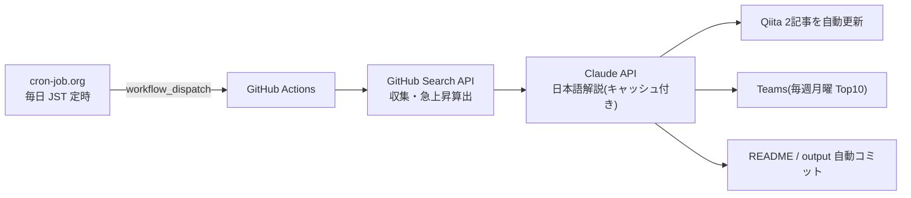

# Claude Code向けMCPツール候補ランキング

GitHub Search APIを使って、Claude Code周辺で活用候補になりそうなMCP関連リポジトリを定期収集するリポジトリです。

> 注意: この一覧は「Claude Codeでの動作」を保証するものではありません。  
> GitHub上のリポジトリ名・説明文・READMEなどに含まれる情報をもとに、MCP関連ツール候補を探すための入口として利用します。

## 仕組み(定常自律運転)

このランキングは cron-job.org → GitHub Actions → Claude API → Qiita / Teams のパイプラインで、毎日無人更新されています。


```mermaid
flowchart LR
    A["cron-job.org<br>毎日 JST 定時"] -->|workflow_dispatch| B["GitHub Actions"]
    B --> C["GitHub Search API<br>収集・急上昇算出"]
    C --> D["Claude API<br>日本語解説(キャッシュ付き)"]
    D --> E["Qiita 2記事を自動更新"]
    D --> F["Teams(毎週月曜 Top10)"]
    D --> G["README / output 自動コミット"]
```

- 仕組みの詳細と**ライブ稼働ステータス**: [定常自律運転ページ](https://takanobusano.github.io/mcp-github-ranking/)
- 作り方の解説記事: [パイプライン編](https://qiita.com/4q_sano/items/913e93ee5cc2731561fc) / [cron-job.org 完全自動化編](https://qiita.com/4q_sano/items/1bc5e0669a8f0166936c)
<!-- MCP_REPOS_START -->
最終更新: **2026-09-28 08:17:14 JST**

MCP関連リポジトリに加え、Claude Code周辺で活用候補になりそうな関連ツールをGitHub Search APIで毎日自動収集してランキング化しています。

Stars / Forks の差分は、UTC基準の前日データ（2026-09-26）との差分です。
CSVには最大500件を保存し、本文では上位100件を表示しています。

> 注意: この一覧はClaude Codeでの動作を保証するものではありません。  
> MCP関連ツールまたはClaude Code関連ツール候補を探すための入口として利用してください。

# 注目MCP・関連ツール候補ランキング

## 1位 [public-apis/public-apis](https://github.com/public-apis/public-apis)

A collective list of free APIs

⭐ **483,819 Stars**（+260）　🍴 **53,446 Forks**（+35）　/　🟢 **1,946 Open Issues**　/　Python

Topics: `api` / `apis` / `dataset` / `development` / `free` / `list` / `lists` / `open-source`

## 2位 [openclaw/openclaw](https://github.com/openclaw/openclaw)

The AI that really does things. Any OS. Any Platform. The lobster way. 🦞

⭐ **390,658 Stars**（+73）　🍴 **82,161 Forks**（+4）　/　🟢 **8,798 Open Issues**　/　TypeScript

Topics: `ai` / `assistant` / `crustacean` / `molty` / `openclaw` / `own-your-data` / `personal`

## 3位 [obra/superpowers](https://github.com/obra/superpowers)

An agentic skills framework & software development methodology that works.

⭐ **292,180 Stars**（+232）　🍴 **26,149 Forks**（+20）　/　🟢 **268 Open Issues**　/　Shell

Topics: `ai` / `brainstorming` / `coding` / `obra` / `sdlc` / `skills` / `subagent-driven-development` / `superpowers`

## 4位 [mattpocock/skills](https://github.com/mattpocock/skills)

Skills for Real Engineers. Straight from my .agents directory.

⭐ **270,680 Stars**（+425）　🍴 **22,798 Forks**（+37）　/　🟢 **531 Open Issues**　/　Shell

Topics: `topicなし`

## 5位 [affaan-m/ECC](https://github.com/affaan-m/ECC)

The agent harness performance optimization system. Skills, instincts, memory, security, and research-first development for Claude Code, Codex, Opencode, Cursor and beyond.

⭐ **268,385 Stars**（+442）　🍴 **40,100 Forks**（+75）　/　🟢 **238 Open Issues**　/　JavaScript

Topics: `ai-agents` / `anthropic` / `claude` / `claude-code` / `developer-tools` / `llm` / `mcp` / `productivity`

## 6位 [NousResearch/hermes-agent](https://github.com/NousResearch/hermes-agent)

The agent that grows with you

⭐ **249,489 Stars**（+255）　🍴 **53,055 Forks**（+141）　/　🟢 **44,521 Open Issues**　/　Python

Topics: `ai` / `ai-agent` / `ai-agents` / `anthropic` / `chatgpt` / `claude` / `claude-code` / `codex`

## 7位 [multica-ai/andrej-karpathy-skills](https://github.com/multica-ai/andrej-karpathy-skills)

A single CLAUDE.md file to improve Claude Code behavior, derived from Andrej Karpathy's observations on LLM coding pitfalls.

⭐ **215,539 Stars**（+172）　🍴 **21,759 Forks**（+16）　/　🟢 **130 Open Issues**　/　不明

Topics: `topicなし`

## 8位 [ultraworkers/claw-code](https://github.com/ultraworkers/claw-code)

An agent-managed museum exhibit, built in Rust with Gajae-Code / LazyCodex — developed and maintained with no human intervention.

⭐ **195,294 Stars**（+4）　🍴 **108,355 Forks**（-9）　/　🟢 **48 Open Issues**　/　Rust

Topics: `topicなし`

## 9位 [firecrawl/firecrawl](https://github.com/firecrawl/firecrawl)

The web data API to search, scrape, and interact at scale. 🔥

⭐ **185,531 Stars**（+413）　🍴 **9,948 Forks**（+17）　/　🟢 **655 Open Issues**　/　TypeScript

Topics: `ai` / `ai-agents` / `ai-crawler` / `ai-scraping` / `ai-search` / `crawler` / `data-extraction` / `html-to-markdown`

## 10位 [ollama/ollama](https://github.com/ollama/ollama)

Get up and running with Kimi, GLM, MiniMax, DeepSeek, gpt-oss, Qwen, Gemma and other models.

⭐ **181,815 Stars**（+38）　🍴 **18,025 Forks**（+13）　/　🟢 **4,115 Open Issues**　/　Go

Topics: `deepseek` / `gemma` / `gemma3` / `glm` / `go` / `golang` / `gpt-oss` / `llama`

## 11位 [anthropics/skills](https://github.com/anthropics/skills)

Public repository for Agent Skills

⭐ **178,660 Stars**（+105）　🍴 **21,141 Forks**（+9）　/　🟢 **1,350 Open Issues**　/　Python

Topics: `agent-skills`

## 12位 [langgenius/dify](https://github.com/langgenius/dify)

Build Agentic workflows, RAG pipelines, with rich AI model and tool support on one collaborative workspace. Deploy on cloud, VPC, or self-hosted, so teams move from prototype to production without rebuilding the stack.

⭐ **157,339 Stars**（+55）　🍴 **24,798 Forks**（+6）　/　🟢 **1,135 Open Issues**　/　TypeScript

Topics: `agent` / `agentic-ai` / `agentic-framework` / `agentic-workflow` / `ai` / `automation` / `claude` / `deepseek`

## 13位 [langflow-ai/langflow](https://github.com/langflow-ai/langflow)

Langflow is a powerful tool for building and deploying AI-powered agents and workflows.

⭐ **155,309 Stars**（+25）　🍴 **10,148 Forks**（-1）　/　🟢 **1,189 Open Issues**　/　Python

Topics: `agents` / `chatgpt` / `generative-ai` / `large-language-models` / `multiagent` / `react-flow`

## 14位 [msitarzewski/agency-agents](https://github.com/msitarzewski/agency-agents)

A complete AI agency at your fingertips - From frontend wizards to Reddit community ninjas, from whimsy injectors to reality checkers. Each agent is a specialized expert with personality, processes, and proven deliverables.

⭐ **154,913 Stars**（+151）　🍴 **24,980 Forks**（+20）　/　🟢 **152 Open Issues**　/　Shell

Topics: `topicなし`

## 15位 [anthropics/claude-code](https://github.com/anthropics/claude-code)

Claude Code is an agentic coding tool that lives in your terminal, understands your codebase, and helps you code faster by executing routine tasks, explaining complex code, and handling git workflows - all through natural language commands.

⭐ **148,342 Stars**（+135）　🍴 **24,856 Forks**（+118）　/　🟢 **13,343 Open Issues**　/　TypeScript

Topics: `topicなし`

## 16位 [DietrichGebert/ponytail](https://github.com/DietrichGebert/ponytail)

Makes your AI agent think like the laziest senior dev in the room. The best code is the code you never wrote.

⭐ **146,907 Stars**（+434）　🍴 **7,894 Forks**（+23）　/　🟢 **309 Open Issues**　/　JavaScript

Topics: `agent-skills` / `ai-agents` / `claude` / `claude-code` / `claude-code-plugin` / `cursor-rules` / `developer-tools` / `llm`

## 17位 [x1xhlol/system-prompts-and-models-of-ai-tools](https://github.com/x1xhlol/system-prompts-and-models-of-ai-tools)

FULL Augment Code, Claude Code, Cluely, CodeBuddy, Comet, Cursor, Devin AI, Junie, Kiro, Leap.new, Lovable, Manus, NotionAI, Orchids.app, Perplexity, Poke, Qoder, Replit, Same.dev, Trae, Traycer AI, VSCode Agent, Warp.dev, Windsurf, Xcode, Z.ai Code, Dia & v0. (And other Open Sourced) System Prompts, Internal Tools & AI Models

⭐ **143,907 Stars**（+21）　🍴 **34,805 Forks**（-5）　/　🟢 **163 Open Issues**　/　不明

Topics: `ai` / `bolt` / `cluely` / `copilot` / `cursor` / `cursorai` / `devin` / `github-copilot`

## 18位 [farion1231/cc-switch](https://github.com/farion1231/cc-switch)

A cross-platform desktop All-in-One assistant for Claude Code, Codex, OpenCode, OpenClaw, Grok Build & Hermes Agent. Only official website: ccswitch.io

⭐ **137,481 Stars**（+318）　🍴 **9,344 Forks**（+6）　/　🟢 **2,908 Open Issues**　/　Rust

Topics: `ai-tools` / `claude-code` / `codex` / `desktop-app` / `grok` / `grokbuild` / `hermes` / `hermes-agent`

## 19位 [garrytan/gstack](https://github.com/garrytan/gstack)

Use Garry Tan's exact Claude Code setup: 23 opinionated tools that serve as CEO, Designer, Eng Manager, Release Manager, Doc Engineer, and QA

⭐ **134,341 Stars**（+71）　🍴 **20,012 Forks**（+6）　/　🟢 **941 Open Issues**　/　TypeScript

Topics: `topicなし`

## 20位 [nextlevelbuilder/ui-ux-pro-max-skill](https://github.com/nextlevelbuilder/ui-ux-pro-max-skill)

An AI skill that provides design intelligence for building professional UI/UX across multiple platforms.

⭐ **131,029 Stars**（+187）　🍴 **13,930 Forks**（+24）　/　🟢 **81 Open Issues**　/　Python

Topics: `ai-skills` / `antigravity` / `claude` / `claude-code` / `codex` / `command-line` / `copilot` / `cursor-ai`

## 21位 [harry0703/MoneyPrinterTurbo](https://github.com/harry0703/MoneyPrinterTurbo)

利用 AI 大模型和自动化工作流，根据主题或关键词一键生成高清短视频。Generate HD short videos from a topic or keyword with an automated AI workflow.

⭐ **126,308 Stars**（+203）　🍴 **19,717 Forks**（+54）　/　🟢 **37 Open Issues**　/　Python

Topics: `ai-video-generator` / `content-creation` / `ffmpeg` / `instagram-reels` / `llm` / `python` / `short-video` / `subtitles`

## 22位 [Graphify-Labs/graphify](https://github.com/Graphify-Labs/graphify)

Turn any codebase, with its docs, SQL schemas, configs, and PDFs, into a queryable knowledge graph. A /graphify skill for Claude Code, Cursor, Codex, and Gemini CLI: local deterministic AST parsing, every edge explained, no vector store.

⭐ **121,870 Stars**（+200）　🍴 **11,739 Forks**（+27）　/　🟢 **1,479 Open Issues**　/　Python

Topics: `ai-agents` / `antigravity` / `ast` / `claude-code` / `code-analysis` / `code-search` / `codex` / `cursor`

## 23位 [browser-use/browser-use](https://github.com/browser-use/browser-use)

Agents that use the browser.

⭐ **116,513 Stars**（+106）　🍴 **12,838 Forks**（+18）　/　🟢 **514 Open Issues**　/　Python

Topics: `ai-agents` / `ai-tools` / `browser-automation` / `browser-use` / `llm` / `playwright` / `python`

## 24位 [TauricResearch/TradingAgents](https://github.com/TauricResearch/TradingAgents)

TradingAgents: Multi-Agents LLM Financial Trading Framework

⭐ **108,909 Stars**（+139）　🍴 **20,892 Forks**（+41）　/　🟢 **89 Open Issues**　/　Python

Topics: `agent` / `finance` / `llm` / `multiagent` / `trading`

## 25位 [JuliusBrussee/caveman](https://github.com/JuliusBrussee/caveman)

🪨 why use many token when few token do trick. Viral skill + proxy for coding agents that cuts 65% of tokens by talking like a caveman.

⭐ **108,067 Stars**（+113）　🍴 **6,268 Forks**（+11）　/　🟢 **140 Open Issues**　/　Go

Topics: `ai` / `anthropic` / `caveman` / `claude` / `claude-code` / `llm` / `meme` / `prompt-engineering`

## 26位 [google-gemini/gemini-cli](https://github.com/google-gemini/gemini-cli)

An open-source AI agent that brings the power of Gemini directly into your terminal.

⭐ **107,166 Stars**（+2）　🍴 **14,640 Forks**（+13）　/　🟢 **813 Open Issues**　/　TypeScript

Topics: `ai` / `ai-agents` / `cli` / `gemini` / `gemini-api` / `mcp-client` / `mcp-server`

## 27位 [addyosmani/agent-skills](https://github.com/addyosmani/agent-skills)

Production-grade engineering skills for AI coding agents.

⭐ **99,486 Stars**（+208）　🍴 **10,449 Forks**（+25）　/　🟢 **117 Open Issues**　/　JavaScript

Topics: `agent-skills` / `antigravity` / `claude-code` / `codex` / `cursor` / `skills`

## 28位 [nexu-io/open-design](https://github.com/nexu-io/open-design)

🎨 Best DeepSeek Harness Design Plugin. The open-source Claude Design alternative. 🖥️ Local-first desktop app. 🖼️ Your coding agent becomes the design engine: pr...

⭐ **98,325 Stars**（+126）　🍴 **11,404 Forks**（+12）　/　🟢 **1,132 Open Issues**　/　TypeScript

Topics: `agent-skills` / `ai-design` / `byok` / `claude-code-for-design` / `claude-design` / `codex-design` / `coding-agents` / `cursor-design`

## 29位 [microsoft/playwright](https://github.com/microsoft/playwright)

Playwright is a framework for Web Testing and Automation. It allows testing Chromium, Firefox and WebKit with a single API.

⭐ **96,760 Stars**（+51）　🍴 **6,510 Forks**（+4）　/　🟢 **192 Open Issues**　/　TypeScript

Topics: `automation` / `chrome` / `chromium` / `e2e-testing` / `electron` / `end-to-end-testing` / `firefox` / `javascript`

## 30位 [puppeteer/puppeteer](https://github.com/puppeteer/puppeteer)

JavaScript API for Chrome and Firefox

⭐ **95,625 Stars**（+2）　🍴 **9,584 Forks**（+1）　/　🟢 **274 Open Issues**　/　TypeScript

Topics: `automation` / `chrome` / `chromium` / `developer-tools` / `firefox` / `headless-chrome` / `node-module` / `testing`

## 31位 [thedotmack/claude-mem](https://github.com/thedotmack/claude-mem)

Persistent Context Across Sessions for Every Agent –  Captures everything your agent does during sessions, compresses it with AI, and injects relevant context back into future sessions. Works with Claude Code, OpenClaw, Codex, Gemini, Hermes, Copilot, OpenCode + More

⭐ **94,799 Stars**（+57）　🍴 **8,385 Forks**（+6）　/　🟢 **321 Open Issues**　/　TypeScript

Topics: `ai` / `ai-agents` / `ai-memory` / `anthropic` / `artificial-intelligence` / `chromadb` / `claude` / `claude-agent-sdk`

## 32位 [OpenCut-app/OpenCut](https://github.com/OpenCut-app/OpenCut)

The open-source CapCut alternative

⭐ **90,799 Stars**（+81）　🍴 **8,983 Forks**（+16）　/　🟢 **375 Open Issues**　/　TypeScript

Topics: `editor` / `oss` / `videoeditor`

## 33位 [Leonxlnx/taste-skill](https://github.com/Leonxlnx/taste-skill)

Taste-Skill - gives your AI good taste. stops the AI from generating boring, generic slop

⭐ **90,636 Stars**（+272）　🍴 **6,169 Forks**（+14）　/　🟢 **71 Open Issues**　/　JavaScript

Topics: `agent` / `ai` / `claude` / `claude-code` / `codex` / `coding` / `design` / `frontend`

## 34位 [modelcontextprotocol/servers](https://github.com/modelcontextprotocol/servers)

Model Context Protocol Servers

⭐ **90,629 Stars**（+18）　🍴 **11,697 Forks**（+6）　/　🟢 **584 Open Issues**　/　TypeScript

Topics: `topicなし`

## 35位 [paperclipai/paperclip](https://github.com/paperclipai/paperclip)

The open-source app everyone uses to manage agents at work

⭐ **89,730 Stars**（+2,529）　🍴 **15,647 Forks**（+229）　/　🟢 **5,848 Open Issues**　/　TypeScript

Topics: `topicなし`

## 36位 [OpenHands/OpenHands](https://github.com/OpenHands/OpenHands)

🙌 OpenHands: AI-Driven Development

⭐ **89,312 Stars**（+81）　🍴 **11,772 Forks**（+19）　/　🟢 **863 Open Issues**　/　TypeScript

Topics: `agent` / `artificial-intelligence` / `chatgpt` / `claude-ai` / `cli` / `developer-tools` / `gpt` / `llm`

## 37位 [ChatGPTNextWeb/NextChat](https://github.com/ChatGPTNextWeb/NextChat)

✨ Zero-config AI chat assistant. No API key needed — sign up and instantly chat with GPT-5, Claude 4, Gemini 2.5, DeepSeek & 100+ top models. Pay-as-you-go save...

⭐ **88,819 Stars**（+4）　🍴 **58,970 Forks**（-3）　/　🟢 **863 Open Issues**　/　TypeScript

Topics: `calclaude` / `chatgpt` / `claude` / `cross-platform` / `desktop` / `fe` / `gemini` / `gemini-pro`

## 38位 [koala73/worldmonitor](https://github.com/koala73/worldmonitor)

Real-time global intelligence dashboard. AI-powered news aggregation, geopolitical monitoring, and infrastructure tracking in a unified situational awareness interface

⭐ **87,474 Stars**（+45）　🍴 **13,335 Forks**（+10）　/　🟢 **350 Open Issues**　/　TypeScript

Topics: `agent` / `ai` / `dashboard` / `geopolitics` / `mcp` / `mcp-server` / `monitoring` / `news`

## 39位 [Panniantong/Agent-Reach](https://github.com/Panniantong/Agent-Reach)

Give your AI agent eyes to see the entire internet. Read & search Twitter, Reddit, YouTube, GitHub, Bilibili, XiaoHongShu — one CLI, zero API fees.

⭐ **85,787 Stars**（+190）　🍴 **7,540 Forks**（+16）　/　🟢 **162 Open Issues**　/　Python

Topics: `agent-infrastructure` / `ai-agent` / `ai-search` / `automation` / `bilibili` / `claude-code` / `cli` / `cursor`

## 40位 [laravel/laravel](https://github.com/laravel/laravel)

Laravel is a web application framework with expressive, elegant syntax. We’ve already laid the foundation for your next big idea — freeing you to create without sweating the small things.

⭐ **85,022 Stars**（+4）　🍴 **26,241 Forks**（+127）　/　🟢 **31 Open Issues**　/　Blade

Topics: `framework` / `laravel` / `php`

## 41位 [unclecode/crawl4ai](https://github.com/unclecode/crawl4ai)

Open-source web crawler and scraper for LLMs and AI agents: any website into clean, LLM-ready Markdown. Run it yourself, or use Crawl4AI Cloud with one key.

⭐ **84,362 Stars**（+52）　🍴 **8,726 Forks**（+8）　/　🟢 **207 Open Issues**　/　Python

Topics: `ai` / `ai-agents` / `crawler` / `data-extraction` / `llm` / `markdown` / `mcp` / `open-source`

## 42位 [Egonex-AI/Understand-Anything](https://github.com/Egonex-AI/Understand-Anything)

Graphs that teach > graphs that impress. Turn any code into an interactive knowledge graph you can explore, search, and ask questions about. Works with Claude Code, Codex, Cursor, Copilot, Gemini CLI, and more.

⭐ **84,341 Stars**（+61）　🍴 **7,111 Forks**（+4）　/　🟢 **308 Open Issues**　/　TypeScript

Topics: `antigravity-skills` / `business-knowledge` / `claude-code` / `claude-skills` / `codebase-analysis` / `codex` / `codex-skills` / `developer-tools-ai-agent`

## 43位 [D4Vinci/Scrapling](https://github.com/D4Vinci/Scrapling)

🕷️ An adaptive Web Scraping framework that handles everything from a single request to a full-scale crawl! Don't be shy, join here:  and follow here for daily tips and tricks:

⭐ **84,051 Stars**（+167）　🍴 **8,596 Forks**（+27）　/　🟢 **2 Open Issues**　/　Python

Topics: `ai` / `ai-scraping` / `automation` / `crawler` / `crawling` / `crawling-python` / `data` / `data-extraction`

## 44位 [bytedance/deer-flow](https://github.com/bytedance/deer-flow)

An open-source long-horizon SuperAgent harness that researches, codes, and creates. With the help of sandboxes, memories, tools, skill, subagents and message gateway, it handles different levels of tasks that could take minutes to hours.

⭐ **83,055 Stars**（+50）　🍴 **11,509 Forks**（+15）　/　🟢 **906 Open Issues**　/　Python

Topics: `agent` / `agentic` / `agentic-framework` / `agentic-workflow` / `ai` / `ai-agents` / `deep-research` / `harness`

## 45位 [lobehub/lobehub](https://github.com/lobehub/lobehub)

🤯 LobeHub is your Chief Agent Operator, organizing your agents into 7×24 operations by hiring, scheduling, and reporting on your entire AI team.

⭐ **82,857 Stars**（+18）　🍴 **15,925 Forks**（+1）　/　🟢 **977 Open Issues**　/　TypeScript

Topics: `agent` / `agent-collaboration` / `agent-harness` / `ai` / `cao` / `chatgpt` / `chief-agent-operator` / `claude`

## 46位 [rtk-ai/rtk](https://github.com/rtk-ai/rtk)

CLI proxy that reduces LLM token consumption by 60-90% on common dev commands. Single Rust binary, zero dependencies

⭐ **81,834 Stars**（+61）　🍴 **5,190 Forks**（+6）　/　🟢 **1,544 Open Issues**　/　Rust

Topics: `agentic-coding` / `ai-coding` / `anthropic` / `claude-code` / `cli` / `command-line-tool` / `cost-reduction` / `developer-tools`

## 47位 [abi/screenshot-to-code](https://github.com/abi/screenshot-to-code)

Drop in a screenshot and convert it to clean code (HTML/Tailwind/React/Vue)

⭐ **79,781 Stars**（+57）　🍴 **9,750 Forks**（+7）　/　🟢 **147 Open Issues**　/　Python

Topics: `topicなし`

## 48位 [stablyai/orca](https://github.com/stablyai/orca)

Orca is the ADE for working with a fleet of parallel agents. Run any coding agent with your own subscription. Available on desktop, mobile and remote runtime.

⭐ **79,525 Stars**（+628）　🍴 **5,205 Forks**（+35）　/　🟢 **6,911 Open Issues**　/　TypeScript

Topics: `ade` / `agent-ide` / `ai-agents` / `claude-code` / `cli` / `codex` / `cursor-agent` / `devtools`

## 49位 [shareAI-lab/learn-claude-code](https://github.com/shareAI-lab/learn-claude-code)

Bash is all you need -  A nano claude code–like 「agent harness」, built from 0 to 1

⭐ **77,678 Stars**（+43）　🍴 **12,484 Forks**（+5）　/　🟢 **58 Open Issues**　/　Python

Topics: `agent` / `agent-development` / `ai-agent` / `claude` / `claude-code` / `educational` / `llm` / `python`

## 50位 [unslothai/unsloth](https://github.com/unslothai/unsloth)

Local UI to run and train LLMs and diffusion models. Supports GGUF, MLX, Qwen3.8, DeepSeek-V4, MiniMax-H3, Gemma 4, FLUX and more.

⭐ **76,876 Stars**（+41）　🍴 **7,056 Forks**（+4）　/　🟢 **1,263 Open Issues**　/　Python

Topics: `agent` / `ai` / `chatgpt` / `deepseek` / `fine-tuning` / `gemma` / `image-generation` / `llama`

## 51位 [Eugeny/tabby](https://github.com/Eugeny/tabby)

A terminal for a more modern age

⭐ **74,702 Stars**（+19）　🍴 **4,269 Forks**（±0）　/　🟢 **2,813 Open Issues**　/　TypeScript

Topics: `serial` / `ssh-client` / `telnet-client` / `terminal` / `terminal-emulators`

## 52位 [thedaviddias/Front-End-Checklist](https://github.com/thedaviddias/Front-End-Checklist)

🗂 The essential checklist for modern web development, for humans and AI agents

⭐ **74,288 Stars**（+8）　🍴 **6,752 Forks**（+2）　/　🟢 **11 Open Issues**　/　MDX

Topics: `ai-agent` / `ai-agents` / `checklist` / `css` / `front-end-developer-tool` / `front-end-development` / `frontend` / `guidelines`

## 53位 [headroomlabs-ai/headroom](https://github.com/headroomlabs-ai/headroom)

Compress tool outputs, logs, files, and RAG chunks before they reach the LLM. 20% fewer tokens for coding agents, 60-95% fewer tokens for JSON, same answers. Library, proxy, MCP server.

⭐ **73,957 Stars**（+76）　🍴 **5,713 Forks**（+11）　/　🟢 **554 Open Issues**　/　Python

Topics: `agent` / `ai` / `anthropic` / `claude-code` / `compression` / `context-engineering` / `context-window` / `cursor`

## 54位 [OpenBB-finance/OpenBB](https://github.com/OpenBB-finance/OpenBB)

Open Data Platform for analysts, quants and AI agents.

⭐ **73,543 Stars**（+55）　🍴 **7,616 Forks**（+3）　/　🟢 **94 Open Issues**　/　Python

Topics: `ai` / `crypto` / `derivatives` / `economics` / `equity` / `finance` / `fixed-income` / `machine-learning`

## 55位 [ruvnet/ruflo](https://github.com/ruvnet/ruflo)

🌊 The original agent harness. Deploy intelligent multi-player swarms, coordinate autonomous workflows, and build conversational AI systems. Features adaptive me...

⭐ **73,398 Stars**（+73）　🍴 **8,714 Forks**（+9）　/　🟢 **996 Open Issues**　/　TypeScript

Topics: `agentic-ai` / `agentic-framework` / `agentic-workflow` / `agents` / `ai-agents` / `ai-assistant` / `ai-skills` / `autonomous-agents`

## 56位 [tt-a1i/archify](https://github.com/tt-a1i/archify)

Agent skill for beautiful, verifiable architecture, workflow, sequence, data-flow, and lifecycle diagrams—self-contained HTML with motion and crisp export.

⭐ **72,755 Stars**（+494）　🍴 **4,912 Forks**（+39）　/　🟢 **179 Open Issues**　/　JavaScript

Topics: `agent-skills` / `architecture-as-code` / `architecture-diagram` / `claude-skill` / `code-visualization` / `codex` / `coding-agents` / `data-flow-diagram`

## 57位 [colbymchenry/codegraph](https://github.com/colbymchenry/codegraph)

Pre-indexed code knowledge graph, auto syncs on code changes, for Claude Code, Codex, Gemini, Cursor, OpenCode, AntiGravity, Kiro, CoPilot, and Hermes Agent — fewer tokens, fewer tool calls, 100% local

⭐ **72,185 Stars**（+54）　🍴 **4,631 Forks**（+1）　/　🟢 **496 Open Issues**　/　C

Topics: `topicなし`

## 58位 [pbakaus/impeccable](https://github.com/pbakaus/impeccable)

The design language that makes your AI harness better at design.

⭐ **71,808 Stars**（+252）　🍴 **4,342 Forks**（+14）　/　🟢 **59 Open Issues**　/　JavaScript

Topics: `topicなし`

## 59位 [daytonaio/daytona](https://github.com/daytonaio/daytona)

Daytona is a Secure and Elastic Infrastructure for Running AI-Generated Code

⭐ **71,700 Stars**（-8）　🍴 **5,643 Forks**（-1）　/　🟢 **457 Open Issues**　/　不明

Topics: `agentic-workflow` / `ai` / `ai-agents` / `ai-runtime` / `ai-sandboxes` / `code-execution` / `code-interpreter` / `developer-tools`

## 60位 [diegosouzapw/OmniRoute](https://github.com/diegosouzapw/OmniRoute)

Never stop coding. Free MIT AI gateway: one endpoint, 359 providers (150+ free), 1200+ models Kimi, Claude, GPT, Gemini, GLM, DeepSeek, MiniMax. Works with Claude Code, Codex, Cursor, OpenCode, Cline & Copilot. Quota-aware auto-fallback, RTK+Caveman compression saves 15-95% tokens, MCP/A2A, Desktop/PWA. Built by hundreds of contributors

⭐ **70,775 Stars**（+287）　🍴 **10,072 Forks**（+55）　/　🟢 **622 Open Issues**　/　TypeScript

Topics: `a2a` / `ai-agents` / `ai-gateway` / `anthropic` / `claude` / `claude-code` / `cline` / `codex`

## 61位 [code-yeongyu/oh-my-openagent](https://github.com/code-yeongyu/oh-my-openagent)

OmO: Just type "mass ulw" keyword with your prompt. Now you are the master of graph engineering.

⭐ **69,601 Stars**（+125）　🍴 **5,727 Forks**（+6）　/　🟢 **1,091 Open Issues**　/　TypeScript

Topics: `ai` / `ai-agents` / `anthropic` / `chatgpt` / `claude` / `claude-skills` / `codex` / `cursor`

## 62位 [cline/cline](https://github.com/cline/cline)

Autonomous coding agent as an SDK, IDE extension, or CLI assistant.

⭐ **69,448 Stars**（+56）　🍴 **7,533 Forks**（+4）　/　🟢 **1,478 Open Issues**　/　TypeScript

Topics: `topicなし`

## 63位 [asgeirtj/system_prompts_leaks](https://github.com/asgeirtj/system_prompts_leaks)

Documented system prompts from Anthropic - Claude Fable 5.1, Opus 5.5, Claude Design, Claude Code. OpenAI - ChatGPT GPT-6-Astra, Codex. Google - Gemini 3.8 Flash, 3.1 Pro, Antigravity. xAI - Grok, Grok Bot, Cursor, Kimi and more! Updated regularly.

⭐ **68,469 Stars**（+68）　🍴 **11,126 Forks**（+16）　/　🟢 **56 Open Issues**　/　JavaScript

Topics: `ai` / `ai-agents` / `ai-prompts` / `anthropic` / `chatbot` / `chatgpt` / `claude` / `claude-code`

## 64位 [openinterpreter/openinterpreter](https://github.com/openinterpreter/openinterpreter)

A coding agent for open models like Kimi K3 and GLM 5.3

⭐ **68,457 Stars**（+6）　🍴 **5,880 Forks**（-1）　/　🟢 **4 Open Issues**　/　Rust

Topics: `acp` / `coding-agent` / `deepseek` / `kimi` / `python` / `qwen` / `rust`

## 65位 [docling-project/docling](https://github.com/docling-project/docling)

Get your documents ready for gen AI

⭐ **68,072 Stars**（+72）　🍴 **4,939 Forks**（+5）　/　🟢 **956 Open Issues**　/　Python

Topics: `ai` / `convert` / `document-parser` / `document-parsing` / `documents` / `docx` / `html` / `markdown`

## 66位 [bradtraversy/design-resources-for-developers](https://github.com/bradtraversy/design-resources-for-developers)

Curated list of design and UI resources from stock photos, web templates, CSS frameworks, UI libraries, tools and much more

⭐ **67,038 Stars**（+2）　🍴 **12,198 Forks**（±0）　/　🟢 **150 Open Issues**　/　不明

Topics: `topicなし`

## 67位 [xtekky/gpt4free](https://github.com/xtekky/gpt4free)

The official gpt4free repository \| various collection of powerful language models \| opus 4.6 gpt 5.3 kimi 2.5 deepseek v3.2 gemini 3

⭐ **66,739 Stars**（+2）　🍴 **13,496 Forks**（-2）　/　🟢 **4 Open Issues**　/　Python

Topics: `chatbot` / `chatbots` / `chatgpt` / `chatgpt-4` / `chatgpt-api` / `chatgpt-free` / `chatgpt4` / `deepseek`

## 68位 [shanraisshan/claude-code-best-practice](https://github.com/shanraisshan/claude-code-best-practice)

from vibe coding to agentic engineering - practice makes claude perfect

⭐ **66,458 Stars**（+73）　🍴 **6,613 Forks**（+9）　/　🟢 **45 Open Issues**　/　HTML

Topics: `agentic-ai` / `agentic-coding` / `agentic-engineering` / `agentic-workflow` / `ai` / `ai-agents` / `anthropic` / `best-practices`

## 69位 [mem0ai/mem0](https://github.com/mem0ai/mem0)

The Memory Layer for AI Agents - Drop-in memory infrastructure for AI agents and apps. Context that persists. Built for production.

⭐ **66,091 Stars**（+60）　🍴 **7,773 Forks**（+10）　/　🟢 **752 Open Issues**　/　Python

Topics: `agentic-memory` / `agentic-memory-system` / `agents` / `ai` / `ai-agents` / `chatgpt` / `genai` / `llm`

## 70位 [NanmiCoder/MediaCrawler](https://github.com/NanmiCoder/MediaCrawler)

小红书笔记 \| 评论爬虫、抖音视频 \| 评论爬虫、快手视频 \| 评论爬虫、B 站视频 ｜ 评论爬虫、微博帖子 ｜ 评论爬虫、百度贴吧帖子 ｜ 百度贴吧评论回复爬虫  \| 知乎问答文章｜评论爬虫

⭐ **65,825 Stars**（+59）　🍴 **12,689 Forks**（+6）　/　🟢 **211 Open Issues**　/　Python

Topics: `topicなし`

## 71位 [usestrix/strix](https://github.com/usestrix/strix)

Open-source AI penetration testing tool to find and fix your app’s vulnerabilities.

⭐ **65,214 Stars**（+181）　🍴 **7,161 Forks**（+22）　/　🟢 **415 Open Issues**　/　Python

Topics: `agents` / `ai-hacking` / `ai-penetration-testing` / `ai-pentesting` / `ai-security` / `artificial-intelligence` / `bug-bounty` / `code-quality`

## 72位 [warpdotdev/warp](https://github.com/warpdotdev/warp)

Warp is an agentic development environment, born out of the terminal.

⭐ **65,206 Stars**（+29）　🍴 **5,587 Forks**（+1）　/　🟢 **5,309 Open Issues**　/　Rust

Topics: `bash` / `linux` / `macos` / `rust` / `shell` / `terminal` / `wasm` / `zsh`

## 73位 [mvanhorn/last30days-skill](https://github.com/mvanhorn/last30days-skill)

AI agent skill that researches any topic across Reddit, X, YouTube, HN, Polymarket, and the web - then synthesizes a grounded summary

⭐ **63,018 Stars**（+73）　🍴 **5,484 Forks**（+4）　/　🟢 **126 Open Issues**　/　Python

Topics: `ai-prompts` / `ai-skill` / `bluesky` / `claude` / `claude-code` / `clawhub` / `deep-research` / `hackernews`

## 74位 [sansan0/TrendRadar](https://github.com/sansan0/TrendRadar)

⭐AI-driven public opinion & trend monitor with multi-platform aggregation, RSS, and smart alerts.🎯 告别信息过载，你的 AI 舆情监控助手与热点筛选工具！聚合多平台热点 +  RSS 订阅，支持关键词精准筛选。AI 智能筛...

⭐ **62,566 Stars**（+17）　🍴 **24,888 Forks**（±0）　/　🟢 **67 Open Issues**　/　Python

Topics: `ai` / `bark` / `data-analysis` / `docker` / `hot-news` / `llm` / `mail` / `mcp`

## 75位 [upstash/context7](https://github.com/upstash/context7)

Context7 Platform -- Up-to-date code documentation for LLMs and AI code editors

⭐ **62,481 Stars**（+29）　🍴 **3,033 Forks**（±0）　/　🟢 **70 Open Issues**　/　TypeScript

Topics: `llm` / `mcp` / `mcp-server` / `vibe-coding`

## 76位 [coollabsio/coolify](https://github.com/coollabsio/coolify)

An open-source, self-hostable PaaS alternative to Vercel, Heroku & Netlify that lets you easily deploy static sites, databases, full-stack applications and 280+ one-click services on your own servers.

⭐ **62,319 Stars**（+29）　🍴 **5,563 Forks**（+4）　/　🟢 **746 Open Issues**　/　PHP

Topics: `coolify` / `databases` / `deployment` / `docker` / `docker-compose` / `inertiajs` / `laravel` / `mariadb`

## 77位 [tw93/Pake](https://github.com/tw93/Pake)

🤱🏻 Turn any webpage into a desktop app with one command.

⭐ **61,760 Stars**（+17）　🍴 **12,717 Forks**（+4）　/　🟢 **8 Open Issues**　/　Rust

Topics: `chatgpt` / `claude` / `desktop` / `gemini` / `hight-performance` / `linux` / `macos` / `no-electron`

## 78位 [1c7/chinese-independent-developer](https://github.com/1c7/chinese-independent-developer)

👩🏿‍💻👨🏾‍💻👩🏼‍💻👨🏽‍💻👩🏻‍💻中国独立开发者项目列表 -- 分享大家都在做什么

⭐ **61,556 Stars**（+4）　🍴 **5,415 Forks**（+2）　/　🟢 **1 Open Issues**　/　不明

Topics: `china` / `indie` / `indie-developer`

## 79位 [calesthio/OpenMontage](https://github.com/calesthio/OpenMontage)

World's first open-source, agentic video production system. 12 production pipelines, 100+ tools, 700+ agent skill and production-knowledge files. Turn your AI coding assistant into a full video production studio.

⭐ **61,551 Stars**（+140）　🍴 **7,836 Forks**（+22）　/　🟢 **334 Open Issues**　/　Python

Topics: `agent` / `agentic-ai` / `ai` / `claude` / `copilot` / `cursor` / `elevenlabs` / `ffmpeg`

## 80位 [microsoft/autogen](https://github.com/microsoft/autogen)

A programming framework for agentic AI

⭐ **61,190 Stars**（+11）　🍴 **9,257 Forks**（+1）　/　🟢 **1,105 Open Issues**　/　Python

Topics: `agentic` / `agentic-agi` / `agents` / `ai` / `autogen` / `autogen-ecosystem` / `chatgpt` / `framework`

## 81位 [penpot/penpot](https://github.com/penpot/penpot)

Penpot: The open-source design platform for Product teams that need scalable collaboration.

⭐ **60,446 Stars**（+25）　🍴 **4,149 Forks**（+7）　/　🟢 **754 Open Issues**　/　Clojure

Topics: `clojure` / `clojurescript` / `design` / `prototyping` / `ui` / `ux-design` / `ux-experience`

## 82位 [BerriAI/litellm](https://github.com/BerriAI/litellm)

The fastest, litest AI Gateway. Rust core with Python SDK. Call 100+ LLM APIs in OpenAI (or native) format with cost tracking, guardrails, load balancing, and logging [Bedrock, Azure, OpenAI, Anthropic, OpenAI, VertexAI, vLLM, Nvidia NIM]

⭐ **59,732 Stars**（+60）　🍴 **11,829 Forks**（+27）　/　🟢 **5,362 Open Issues**　/　Python

Topics: `ai-gateway` / `anthropic` / `azure-openai` / `bedrock` / `gateway` / `langchain` / `litellm` / `llm`

## 83位 [meilisearch/meilisearch](https://github.com/meilisearch/meilisearch)

A lightning-fast search engine API bringing AI-powered hybrid search to your sites and applications.

⭐ **59,423 Stars**（+7）　🍴 **2,719 Forks**（±0）　/　🟢 **316 Open Issues**　/　Rust

Topics: `ai` / `api` / `app-search` / `database` / `enterprise-search` / `faceting` / `full-text-search` / `fuzzy-search`

## 84位 [MemPalace/mempalace](https://github.com/MemPalace/mempalace)

The best-benchmarked open-source AI memory system. And it's free.

⭐ **59,319 Stars**（+26）　🍴 **7,564 Forks**（-1）　/　🟢 **764 Open Issues**　/　Python

Topics: `ai` / `chromadb` / `llm` / `mcp` / `memory` / `python`

## 85位 [rohitg00/ai-engineering-from-scratch](https://github.com/rohitg00/ai-engineering-from-scratch)

Learn it. Build it. Ship it for others.

⭐ **59,228 Stars**（+890）　🍴 **10,224 Forks**（+106）　/　🟢 **44 Open Issues**　/　Python

Topics: `agents` / `ai` / `ai-agents` / `ai-engineering` / `computer-vision` / `course` / `deep-learning` / `from-scratch`

## 86位 [crewAIInc/crewAI](https://github.com/crewAIInc/crewAI)

Framework for orchestrating role-playing, autonomous AI agents. By fostering collaborative intelligence, CrewAI empowers agents to work together seamlessly, tackling complex tasks.

⭐ **59,103 Stars**（+37）　🍴 **8,585 Forks**（+2）　/　🟢 **505 Open Issues**　/　Python

Topics: `agents` / `ai` / `ai-agents` / `aiagentframework` / `llms`

## 87位 [FoundationAgents/OpenManus](https://github.com/FoundationAgents/OpenManus)

No fortress, purely open ground.  OpenManus is Coming.

⭐ **58,428 Stars**（+8）　🍴 **10,135 Forks**（+5）　/　🟢 **457 Open Issues**　/　Python

Topics: `topicなし`

## 88位 [twentyhq/twenty](https://github.com/twentyhq/twenty)

The open alternative to Salesforce, designed for AI.

⭐ **57,576 Stars**（+36）　🍴 **9,326 Forks**（+21）　/　🟢 **133 Open Issues**　/　TypeScript

Topics: `crm` / `crm-system` / `customer` / `good-first-issue` / `graphql` / `hacktoberfest` / `javascript` / `marketing`

## 89位 [zylon-ai/private-gpt](https://github.com/zylon-ai/private-gpt)

Complete API layer for private AI applications on local models: RAG, skills, tools, MCP, text-to-sql, and more. Works with any OpenAI-compatible inference server.

⭐ **57,547 Stars**（+3）　🍴 **7,617 Forks**（±0）　/　🟢 **21 Open Issues**　/　Python

Topics: `ai` / `ai-tools` / `on-premise`

## 90位 [appwrite/appwrite](https://github.com/appwrite/appwrite)

Appwrite® - complete cloud infrastructure for your web, mobile and AI apps. Including Auth, Databases, Storage, Functions, Messaging, Hosting, Realtime and more

⭐ **57,494 Stars**（+11）　🍴 **5,751 Forks**（-1）　/　🟢 **687 Open Issues**　/　PHP

Topics: `android` / `appwrite` / `backend` / `backend-as-a-service` / `docker` / `firebase` / `flutter` / `hosting`

## 91位 [hugohe3/ppt-master](https://github.com/hugohe3/ppt-master)

AI turns documents or topics into real, native PowerPoint decks—with native shapes, transitions and animations, data-backed charts and tables on demand, audio narration from speaker notes, and support for your own .pptx templates. · by Hugo He

⭐ **56,649 Stars**（+147）　🍴 **4,488 Forks**（+6）　/　🟢 **2 Open Issues**　/　Python

Topics: `ai-agent` / `aippt` / `office` / `powerpoint` / `powerpoint-generation` / `ppt` / `pptx` / `presentation`

## 92位 [Alishahryar1/free-claude-code](https://github.com/Alishahryar1/free-claude-code)

Use Claude Code, Codex, VSCode, Pi, and OpenCode (and 6 other harnesses) for free (1.3B+ free tokens) from your terminal, app, IDE, or phone, and now from the browser with native browser sessions (multi-harness + multi-model) like OpenClaw (voice supported + ToS friendly)

⭐ **56,048 Stars**（+47）　🍴 **8,970 Forks**（+11）　/　🟢 **395 Open Issues**　/　Python

Topics: `topicなし`

## 93位 [jamiepine/voicebox](https://github.com/jamiepine/voicebox)

The open-source AI voice studio. Clone, dictate, create.

⭐ **55,853 Stars**（+76）　🍴 **6,958 Forks**（+8）　/　🟢 **706 Open Issues**　/　TypeScript

Topics: `ai` / `cuda` / `mlx` / `qwen3-tts` / `qwen3-tts-ui` / `voice-ai` / `voice-clone` / `whisper`

## 94位 [aaif-goose/goose](https://github.com/aaif-goose/goose)

an open source, extensible AI agent that goes beyond code suggestions - install, execute, edit, and test with any LLM

⭐ **54,715 Stars**（+26）　🍴 **6,328 Forks**（+10）　/　🟢 **442 Open Issues**　/　Rust

Topics: `acp` / `ai` / `ai-agents` / `mcp`

## 95位 [heygen-com/hyperframes](https://github.com/heygen-com/hyperframes)

Write HTML. Render video. Built for agents.

⭐ **53,639 Stars**（+311）　🍴 **4,888 Forks**（+23）　/　🟢 **246 Open Issues**　/　TypeScript

Topics: `ai` / `animation` / `ffmpeg` / `framework` / `gsap` / `html` / `mcp` / `puppeteer`

## 96位 [bmad-code-org/BMAD-METHOD](https://github.com/bmad-code-org/BMAD-METHOD)

Breakthrough Method for Agile Ai Driven Development

⭐ **53,554 Stars**（+46）　🍴 **6,029 Forks**（+4）　/　🟢 **54 Open Issues**　/　Python

Topics: `agile` / `ai` / `context-engineering` / `sdlc` / `spec-driven-development`

## 97位 [router-for-me/CLIProxyAPI](https://github.com/router-for-me/CLIProxyAPI)

Wrap Antigravity, ChatGPT Codex, Claude Code, Grok Build, Muse Code, Davin as an OpenAI/Gemini/Claude/Codex compatible API service, allowing you to enjoy the free Gemini Series, GPT Series, Grok Series, Claude model through API

⭐ **53,344 Stars**（+77）　🍴 **8,044 Forks**（+11）　/　🟢 **636 Open Issues**　/　Go

Topics: `antigravity` / `claude-code` / `cluade` / `codex` / `devin` / `gemini` / `muse` / `openai`

## 98位 [ChromeDevTools/chrome-devtools-mcp](https://github.com/ChromeDevTools/chrome-devtools-mcp)

Chrome DevTools for coding agents

⭐ **52,670 Stars**（+32）　🍴 **5,063 Forks**（+154）　/　🟢 **118 Open Issues**　/　TypeScript

Topics: `browser` / `chrome` / `chrome-devtools` / `debugging` / `devtools` / `mcp` / `mcp-server` / `puppeteer`

## 99位 [blader/humanizer](https://github.com/blader/humanizer)

Agent skill that removes signs of AI-generated writing from text

⭐ **52,340 Stars**（+169）　🍴 **4,184 Forks**（+13）　/　🟢 **26 Open Issues**　/　Python

Topics: `agent-skills` / `ai-writing` / `claude-code` / `codex` / `cursor` / `prompt-engineering` / `writing-tools`

## 100位 [CherryHQ/cherry-studio](https://github.com/CherryHQ/cherry-studio)

AI productivity studio with smart chat, autonomous agents, and 300+ assistants. Unified access to frontier LLMs

⭐ **52,190 Stars**（+26）　🍴 **5,015 Forks**（+3）　/　🟢 **1,682 Open Issues**　/　TypeScript

Topics: `agent-skills` / `ai-agent` / `claude-code` / `codex` / `deepseek` / `hermes-agent` / `open-code-review` / `skills`

# 最近プッシュされたMCP・関連ツール候補

スター数ランキングとは別に、最近コードがプッシュされたリポジトリを表示します。古いスター数だけではなく、現在も開発が動いていそうな候補を探すための一覧です。

## プッシュ順 1位 [manaflow-ai/cmux](https://github.com/manaflow-ai/cmux)

Open source Ghostty-based macOS terminal with vertical tabs and notifications for AI coding agents. Built for multitasking, organization, and programmability.

⭐ **27,447 Stars**（+23）　🍴 **2,416 Forks**（+3）　/　Swift　/　最終プッシュ: 2026-09-27

Topics: `amp` / `claude-code` / `cli` / `codex` / `coding-agents` / `gemini` / `ghostty` / `macos`

## プッシュ順 2位 [PostHog/posthog](https://github.com/PostHog/posthog)

:hedgehog: PostHog is the leading platform for building self-driving products. Our developer tools – AI observability, analytics, session replay, flags, experiments, error tracking, logs, and more – capture all the context agents need to diagnose problems, uncover opportunities, and ship fixes. Steer it all from Slack, web, desktop, or the MCP.

⭐ **39,976 Stars**（+30）　🍴 **3,430 Forks**（+5）　/　Python　/　最終プッシュ: 2026-09-27

Topics: `ab-testing` / `ai-analytics` / `analytics` / `cdp` / `data-warehouse` / `experiments` / `feature-flags` / `javascript`

## プッシュ順 3位 [kortix-ai/suna](https://github.com/kortix-ai/suna)

The open-source AI Management System

⭐ **20,236 Stars**（-1）　🍴 **3,435 Forks**（+1）　/　TypeScript　/　最終プッシュ: 2026-09-27

Topics: `ai` / `ai-agents` / `llm`

## プッシュ順 4位 [openclaw/openclaw](https://github.com/openclaw/openclaw)

The AI that really does things. Any OS. Any Platform. The lobster way. 🦞

⭐ **390,658 Stars**（+73）　🍴 **82,161 Forks**（+4）　/　TypeScript　/　最終プッシュ: 2026-09-27

Topics: `ai` / `assistant` / `crustacean` / `molty` / `openclaw` / `own-your-data` / `personal`

## プッシュ順 5位 [block/buzz](https://github.com/block/buzz)

A hive mind communication platform

⭐ **35,058 Stars**（+240）　🍴 **4,612 Forks**（+18）　/　Rust　/　最終プッシュ: 2026-09-27

Topics: `topicなし`

## プッシュ順 6位 [paperclipai/paperclip](https://github.com/paperclipai/paperclip)

The open-source app everyone uses to manage agents at work

⭐ **89,730 Stars**（+2,529）　🍴 **15,647 Forks**（+229）　/　TypeScript　/　最終プッシュ: 2026-09-27

Topics: `topicなし`

## プッシュ順 7位 [stablyai/orca](https://github.com/stablyai/orca)

Orca is the ADE for working with a fleet of parallel agents. Run any coding agent with your own subscription. Available on desktop, mobile and remote runtime.

⭐ **79,525 Stars**（+628）　🍴 **5,205 Forks**（+35）　/　TypeScript　/　最終プッシュ: 2026-09-27

Topics: `ade` / `agent-ide` / `ai-agents` / `claude-code` / `cli` / `codex` / `cursor-agent` / `devtools`

## プッシュ順 8位 [heygen-com/hyperframes](https://github.com/heygen-com/hyperframes)

Write HTML. Render video. Built for agents.

⭐ **53,639 Stars**（+311）　🍴 **4,888 Forks**（+23）　/　TypeScript　/　最終プッシュ: 2026-09-27

Topics: `ai` / `animation` / `ffmpeg` / `framework` / `gsap` / `html` / `mcp` / `puppeteer`

## プッシュ順 9位 [Yeachan-Heo/oh-my-claudecode](https://github.com/Yeachan-Heo/oh-my-claudecode)

Teams-first Multi-agent orchestration for Claude Code

⭐ **39,376 Stars**（+13）　🍴 **3,520 Forks**（+4）　/　TypeScript　/　最終プッシュ: 2026-09-27

Topics: `agentic-coding` / `ai-agents` / `automation` / `claude` / `claude-code` / `multi-agent-systems` / `oh-my-opencode` / `opencode`

## プッシュ順 10位 [NVIDIA/NemoClaw](https://github.com/NVIDIA/NemoClaw)

Run agents like Hermes, LangChain Deep Agents, and OpenClaw more securely inside NVIDIA OpenShell with managed inference

⭐ **22,553 Stars**（+8）　🍴 **3,116 Forks**（+3）　/　TypeScript　/　最終プッシュ: 2026-09-27

Topics: `ai-agents` / `deep-agents` / `hermes` / `nvidia` / `openclaw` / `openshell` / `sandboxing` / `typescript`

## プッシュ順 11位 [ccusage/ccusage](https://github.com/ccusage/ccusage)

npx ccusage

⭐ **18,768 Stars**（+22）　🍴 **851 Forks**（+2）　/　Rust　/　最終プッシュ: 2026-09-27

Topics: `topicなし`

## プッシュ順 12位 [NousResearch/hermes-agent](https://github.com/NousResearch/hermes-agent)

The agent that grows with you

⭐ **249,489 Stars**（+255）　🍴 **53,055 Forks**（+141）　/　Python　/　最終プッシュ: 2026-09-27

Topics: `ai` / `ai-agent` / `ai-agents` / `anthropic` / `chatgpt` / `claude` / `claude-code` / `codex`

## プッシュ順 13位 [pingdotgg/t3code](https://github.com/pingdotgg/t3code)

説明なし

⭐ **23,712 Stars**（+76）　🍴 **6,159 Forks**（+28）　/　TypeScript　/　最終プッシュ: 2026-09-27

Topics: `topicなし`

## プッシュ順 14位 [mudler/LocalAI](https://github.com/mudler/LocalAI)

LocalAI is the open-source AI engine. Run any model - LLMs, vision, voice, image, video - on any hardware. No GPU required.

⭐ **49,299 Stars**（+14）　🍴 **4,473 Forks**（-1）　/　Go　/　最終プッシュ: 2026-09-27

Topics: `agents` / `ai` / `api` / `audio-generation` / `decentralized` / `distributed` / `image-generation` / `libp2p`

## プッシュ順 15位 [coollabsio/coolify](https://github.com/coollabsio/coolify)

An open-source, self-hostable PaaS alternative to Vercel, Heroku & Netlify that lets you easily deploy static sites, databases, full-stack applications and 280+ one-click services on your own servers.

⭐ **62,319 Stars**（+29）　🍴 **5,563 Forks**（+4）　/　PHP　/　最終プッシュ: 2026-09-27

Topics: `coolify` / `databases` / `deployment` / `docker` / `docker-compose` / `inertiajs` / `laravel` / `mariadb`

## プッシュ順 16位 [pascalorg/editor](https://github.com/pascalorg/editor)

Open-source 3D architectural editor with a local CLI, MCP tools, and practical workflows for humans and AI agents.

⭐ **24,336 Stars**（+10）　🍴 **3,016 Forks**（+3）　/　TypeScript　/　最終プッシュ: 2026-09-27

Topics: `3d` / `agent-skills` / `ai-agents` / `architecture` / `bim` / `cad` / `editor` / `floorplan`

## プッシュ順 17位 [CherryHQ/cherry-studio](https://github.com/CherryHQ/cherry-studio)

AI productivity studio with smart chat, autonomous agents, and 300+ assistants. Unified access to frontier LLMs

⭐ **52,190 Stars**（+26）　🍴 **5,015 Forks**（+3）　/　TypeScript　/　最終プッシュ: 2026-09-27

Topics: `agent-skills` / `ai-agent` / `claude-code` / `codex` / `deepseek` / `hermes-agent` / `open-code-review` / `skills`

## プッシュ順 18位 [amir20/dozzle](https://github.com/amir20/dozzle)

Realtime log viewer for containers.  Supports Docker, Swarm and K8s.

⭐ **14,493 Stars**（+7）　🍴 **624 Forks**（+1）　/　Go　/　最終プッシュ: 2026-09-27

Topics: `docker` / `docker-container` / `golang` / `k8s` / `log` / `logging` / `logging-server` / `real-time`

## プッシュ順 19位 [sgl-project/sglang](https://github.com/sgl-project/sglang)

SGLang is a high-performance serving framework for large language models and multimodal models.

⭐ **36,490 Stars**（+34）　🍴 **9,182 Forks**（+24）　/　Python　/　最終プッシュ: 2026-09-27

Topics: `attention` / `blackwell` / `cuda` / `deepseek` / `diffusion` / `glm` / `gpt-oss` / `inference`

## プッシュ順 20位 [mastra-ai/mastra](https://github.com/mastra-ai/mastra)

Mastra is the modern TypeScript framework for AI-powered applications and agents.

⭐ **28,374 Stars**（+24）　🍴 **2,869 Forks**（+7）　/　TypeScript　/　最終プッシュ: 2026-09-27

Topics: `agents` / `ai` / `chatbots` / `evals` / `javascript` / `llm` / `mcp` / `nextjs`

## プッシュ順 21位 [DeusData/codebase-memory-mcp](https://github.com/DeusData/codebase-memory-mcp)

High-performance code intelligence MCP server. Indexes codebases into a persistent knowledge graph — average repo in milliseconds. 158 languages, sub-ms queries, 99% fewer tokens. Single static binary, zero dependencies.

⭐ **45,058 Stars**（+69）　🍴 **3,695 Forks**（+13）　/　C　/　最終プッシュ: 2026-09-27

Topics: `aider` / `ast` / `claude-code` / `code-analysis` / `code-intelligence` / `codex` / `cursor` / `cypher`

## プッシュ順 22位 [code-yeongyu/oh-my-openagent](https://github.com/code-yeongyu/oh-my-openagent)

OmO: Just type "mass ulw" keyword with your prompt. Now you are the master of graph engineering.

⭐ **69,601 Stars**（+125）　🍴 **5,727 Forks**（+6）　/　TypeScript　/　最終プッシュ: 2026-09-27

Topics: `ai` / `ai-agents` / `anthropic` / `chatgpt` / `claude` / `claude-skills` / `codex` / `cursor`

## プッシュ順 23位 [ollama/ollama](https://github.com/ollama/ollama)

Get up and running with Kimi, GLM, MiniMax, DeepSeek, gpt-oss, Qwen, Gemma and other models.

⭐ **181,815 Stars**（+38）　🍴 **18,025 Forks**（+13）　/　Go　/　最終プッシュ: 2026-09-27

Topics: `deepseek` / `gemma` / `gemma3` / `glm` / `go` / `golang` / `gpt-oss` / `llama`

## プッシュ順 24位 [coder/coder](https://github.com/coder/coder)

Secure environments for developers and their agents

⭐ **16,724 Stars**（+15）　🍴 **1,591 Forks**（+1）　/　Go　/　最終プッシュ: 2026-09-27

Topics: `agents` / `dev-tools` / `development-environment` / `go` / `golang` / `ide` / `jetbrains` / `remote-development`

## プッシュ順 25位 [lightpanda-io/browser](https://github.com/lightpanda-io/browser)

Lightpanda: the headless browser designed for AI and automation

⭐ **35,610 Stars**（+19）　🍴 **1,690 Forks**（+1）　/　Zig　/　最終プッシュ: 2026-09-27

Topics: `browser` / `browser-automation` / `cdp` / `headless` / `lightpanda` / `playwright` / `puppeteer` / `zig`

## プッシュ順 26位 [twentyhq/twenty](https://github.com/twentyhq/twenty)

The open alternative to Salesforce, designed for AI.

⭐ **57,576 Stars**（+36）　🍴 **9,326 Forks**（+21）　/　TypeScript　/　最終プッシュ: 2026-09-27

Topics: `crm` / `crm-system` / `customer` / `good-first-issue` / `graphql` / `hacktoberfest` / `javascript` / `marketing`

## プッシュ順 27位 [lidge-jun/opencodex](https://github.com/lidge-jun/opencodex)

Universal provider proxy for OpenAI Codex & Claude Code — use any LLM (Claude, Gemini, Grok, DeepSeek, Ollama…) with Codex CLI, App, SDK, and Claude Code

⭐ **16,463 Stars**（+138）　🍴 **1,238 Forks**（+7）　/　TypeScript　/　最終プッシュ: 2026-09-27

Topics: `ai-gateway` / `ai-tools` / `anthropic` / `chatgpt` / `claude` / `claude-code` / `codex` / `codex-cli`

## プッシュ順 28位 [superset-sh/superset](https://github.com/superset-sh/superset)

Superset is an agentic IDE to orchestrate 100+ coding agents in parallel. Run any agent with your own subscription.

⭐ **14,684 Stars**（+20）　🍴 **1,307 Forks**（+2）　/　TypeScript　/　最終プッシュ: 2026-09-27

Topics: `ade` / `agent` / `agent-orchestration` / `ai-agents` / `ai-coding` / `claude-code` / `cli` / `codex`

## プッシュ順 29位 [BerriAI/litellm](https://github.com/BerriAI/litellm)

The fastest, litest AI Gateway. Rust core with Python SDK. Call 100+ LLM APIs in OpenAI (or native) format with cost tracking, guardrails, load balancing, and logging [Bedrock, Azure, OpenAI, Anthropic, OpenAI, VertexAI, vLLM, Nvidia NIM]

⭐ **59,732 Stars**（+60）　🍴 **11,829 Forks**（+27）　/　Python　/　最終プッシュ: 2026-09-27

Topics: `ai-gateway` / `anthropic` / `azure-openai` / `bedrock` / `gateway` / `langchain` / `litellm` / `llm`

## プッシュ順 30位 [questdb/questdb](https://github.com/questdb/questdb)

QuestDB is a high performance, open-source, time-series database

⭐ **17,358 Stars**（+7）　🍴 **1,652 Forks**（-1）　/　Java　/　最終プッシュ: 2026-09-27

Topics: `apache-arrow` / `capital-markets` / `database` / `historian` / `kdb` / `low-latency` / `market-data` / `parquet`

# 検索条件

以下の検索条件でGitHubリポジトリを収集しています。

- "model context protocol" in:name,description,readme stars:>10
- "mcp server" in:name,description,readme stars:>10
- "mcp" "claude" in:name,description,readme stars:>10
- "claude" "mcp" in:name,description,readme stars:>10
- "modelcontextprotocol" in:name,description,readme stars:>10
- "claude code" in:name,description,readme stars:>10
- "claude" "plugin" in:name,description,readme stars:>10
- "claude" "memory" in:name,description,readme stars:>10

<!-- MCP_REPOS_END -->

## 仕組み

```text
GitHub Search API
  ↓
MCP / Claude Code / Model Context Protocol 関連リポジトリを検索
  ↓
スター数・更新日・Fork数・説明文を取得
  ↓
Markdown / CSV を生成
  ↓
GitHub Actionsで毎日自動実行
  ↓
READMEを自動更新
