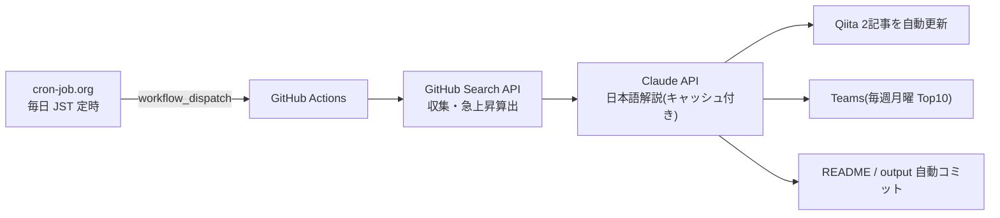

# Claude Code向けMCPツール候補ランキング

GitHub Search APIを使って、Claude Code周辺で活用候補になりそうなMCP関連リポジトリを定期収集するリポジトリです。

> 注意: この一覧は「Claude Codeでの動作」を保証するものではありません。  
> GitHub上のリポジトリ名・説明文・READMEなどに含まれる情報をもとに、MCP関連ツール候補を探すための入口として利用します。

## 仕組み(定常自律運転)

このランキングは cron-job.org → GitHub Actions → Claude API → Qiita / Teams のパイプラインで、毎日無人更新されています。


```mermaid
flowchart LR
    A["cron-job.org<br>毎日 JST 定時"] -->|workflow_dispatch| B["GitHub Actions"]
    B --> C["GitHub Search API<br>収集・急上昇算出"]
    C --> D["Claude API<br>日本語解説(キャッシュ付き)"]
    D --> E["Qiita 2記事を自動更新"]
    D --> F["Teams(毎週月曜 Top10)"]
    D --> G["README / output 自動コミット"]
```

- 仕組みの詳細と**ライブ稼働ステータス**: [定常自律運転ページ](https://takanobusano.github.io/mcp-github-ranking/)
- 作り方の解説記事: [パイプライン編](https://qiita.com/4q_sano/items/913e93ee5cc2731561fc) / [cron-job.org 完全自動化編](https://qiita.com/4q_sano/items/1bc5e0669a8f0166936c)
<!-- MCP_REPOS_START -->
最終更新: **2026-10-06 08:17:16 JST**

MCP関連リポジトリに加え、Claude Code周辺で活用候補になりそうな関連ツールをGitHub Search APIで毎日自動収集してランキング化しています。

Stars / Forks の差分は、UTC基準の前日データ（2026-10-04）との差分です。
CSVには最大500件を保存し、本文では上位100件を表示しています。

> 注意: この一覧はClaude Codeでの動作を保証するものではありません。  
> MCP関連ツールまたはClaude Code関連ツール候補を探すための入口として利用してください。

# 注目MCP・関連ツール候補ランキング

## 1位 [public-apis/public-apis](https://github.com/public-apis/public-apis)

A collective list of free APIs

⭐ **486,317 Stars**（+232）　🍴 **53,772 Forks**（+49）　/　🟢 **2,015 Open Issues**　/　Python

Topics: `api` / `apis` / `dataset` / `development` / `free` / `list` / `lists` / `open-source`

## 2位 [openclaw/openclaw](https://github.com/openclaw/openclaw)

The AI that really does things. Any OS. Any Platform. The lobster way. 🦞

⭐ **391,443 Stars**（+124）　🍴 **82,281 Forks**（+15）　/　🟢 **9,401 Open Issues**　/　TypeScript

Topics: `ai` / `assistant` / `crustacean` / `molty` / `openclaw` / `own-your-data` / `personal`

## 3位 [obra/superpowers](https://github.com/obra/superpowers)

An agentic skills framework & software development methodology that works.

⭐ **295,645 Stars**（+366）　🍴 **26,402 Forks**（+14）　/　🟢 **310 Open Issues**　/　Shell

Topics: `ai` / `brainstorming` / `coding` / `obra` / `sdlc` / `skills` / `subagent-driven-development` / `superpowers`

## 4位 [mattpocock/skills](https://github.com/mattpocock/skills)

Skills for Real Engineers. Straight from my .agents directory.

⭐ **277,066 Stars**（+919）　🍴 **23,208 Forks**（+57）　/　🟢 **552 Open Issues**　/　Shell

Topics: `topicなし`

## 5位 [affaan-m/ECC](https://github.com/affaan-m/ECC)

The agent harness performance optimization system. Skills, instincts, memory, security, and research-first development for Claude Code, Codex, Opencode, Cursor and beyond.

⭐ **273,623 Stars**（+683）　🍴 **40,826 Forks**（+86）　/　🟢 **350 Open Issues**　/　JavaScript

Topics: `ai-agents` / `anthropic` / `claude` / `claude-code` / `developer-tools` / `llm` / `mcp` / `productivity`

## 6位 [NousResearch/hermes-agent](https://github.com/NousResearch/hermes-agent)

The agent that grows with you

⭐ **251,430 Stars**（+212）　🍴 **53,997 Forks**（+76）　/　🟢 **48,079 Open Issues**　/　Python

Topics: `ai` / `ai-agent` / `ai-agents` / `anthropic` / `chatgpt` / `claude` / `claude-code` / `codex`

## 7位 [multica-ai/andrej-karpathy-skills](https://github.com/multica-ai/andrej-karpathy-skills)

A single CLAUDE.md file to improve Claude Code behavior, derived from Andrej Karpathy's observations on LLM coding pitfalls.

⭐ **217,058 Stars**（+196）　🍴 **21,854 Forks**（+15）　/　🟢 **131 Open Issues**　/　不明

Topics: `topicなし`

## 8位 [ultraworkers/claw-code](https://github.com/ultraworkers/claw-code)

An agent-managed museum exhibit, built in Rust with Gajae-Code / LazyCodex — developed and maintained with no human intervention.

⭐ **195,220 Stars**（+1）　🍴 **108,199 Forks**（-18）　/　🟢 **48 Open Issues**　/　Rust

Topics: `topicなし`

## 9位 [firecrawl/firecrawl](https://github.com/firecrawl/firecrawl)

Supercharge your AI agents with data from the web and beyond. Building the library for superintelligence. 🔥

⭐ **188,898 Stars**（+300）　🍴 **10,029 Forks**（+7）　/　🟢 **530 Open Issues**　/　TypeScript

Topics: `ai` / `ai-agents` / `ai-crawler` / `ai-scraping` / `ai-search` / `crawler` / `data-extraction` / `html-to-markdown`

## 10位 [ollama/ollama](https://github.com/ollama/ollama)

Get up and running with Kimi, GLM, MiniMax, DeepSeek, gpt-oss, Qwen, Gemma and other models.

⭐ **182,261 Stars**（+64）　🍴 **18,107 Forks**（+8）　/　🟢 **4,179 Open Issues**　/　Go

Topics: `deepseek` / `gemma` / `gemma3` / `glm` / `go` / `golang` / `gpt-oss` / `llama`

## 11位 [anthropics/skills](https://github.com/anthropics/skills)

Public repository for Agent Skills

⭐ **179,787 Stars**（+138）　🍴 **21,250 Forks**（+5）　/　🟢 **1,382 Open Issues**　/　Python

Topics: `agent-skills`

## 12位 [langgenius/dify](https://github.com/langgenius/dify)

Build Agentic workflows, RAG pipelines, with rich AI model and tool support on one collaborative workspace. Deploy on cloud, VPC, or self-hosted, so teams move from prototype to production without rebuilding the stack.

⭐ **157,897 Stars**（+48）　🍴 **24,914 Forks**（+8）　/　🟢 **1,072 Open Issues**　/　TypeScript

Topics: `agent` / `agentic-ai` / `agentic-framework` / `agentic-workflow` / `ai` / `automation` / `claude` / `deepseek`

## 13位 [msitarzewski/agency-agents](https://github.com/msitarzewski/agency-agents)

A complete AI agency at your fingertips - From frontend wizards to Reddit community ninjas, from whimsy injectors to reality checkers. Each agent is a specialized expert with personality, processes, and proven deliverables.

⭐ **157,230 Stars**（+643）　🍴 **25,366 Forks**（+105）　/　🟢 **181 Open Issues**　/　Shell

Topics: `topicなし`

## 14位 [DietrichGebert/ponytail](https://github.com/DietrichGebert/ponytail)

Makes your AI agent think like the laziest senior dev in the room. The best code is the code you never wrote.

⭐ **155,960 Stars**（+1,144）　🍴 **8,375 Forks**（+55）　/　🟢 **3 Open Issues**　/　JavaScript

Topics: `agent-skills` / `ai-agents` / `claude` / `claude-code` / `claude-code-plugin` / `cursor-rules` / `developer-tools` / `llm`

## 15位 [langflow-ai/langflow](https://github.com/langflow-ai/langflow)

Langflow is a powerful tool for building and deploying AI-powered agents and workflows.

⭐ **155,513 Stars**（+10）　🍴 **10,184 Forks**（+6）　/　🟢 **1,204 Open Issues**　/　Python

Topics: `agents` / `chatgpt` / `generative-ai` / `large-language-models` / `multiagent` / `react-flow`

## 16位 [anthropics/claude-code](https://github.com/anthropics/claude-code)

Claude Code is an agentic coding tool that lives in your terminal, understands your codebase, and helps you code faster by executing routine tasks, explaining complex code, and handling git workflows - all through natural language commands.

⭐ **149,523 Stars**（+104）　🍴 **25,575 Forks**（+87）　/　🟢 **14,282 Open Issues**　/　TypeScript

Topics: `topicなし`

## 17位 [x1xhlol/system-prompts-and-models-of-ai-tools](https://github.com/x1xhlol/system-prompts-and-models-of-ai-tools)

FULL Augment Code, Claude Code, Cluely, CodeBuddy, Comet, Cursor, Devin AI, Junie, Kiro, Leap.new, Lovable, Manus, NotionAI, Orchids.app, Perplexity, Poke, Qoder, Replit, Same.dev, Trae, Traycer AI, VSCode Agent, Warp.dev, Windsurf, Xcode, Z.ai Code, Dia & v0. (And other Open Sourced) System Prompts, Internal Tools & AI Models

⭐ **144,034 Stars**（+12）　🍴 **34,791 Forks**（-4）　/　🟢 **163 Open Issues**　/　不明

Topics: `ai` / `bolt` / `cluely` / `copilot` / `cursor` / `cursorai` / `devin` / `github-copilot`

## 18位 [farion1231/cc-switch](https://github.com/farion1231/cc-switch)

A cross-platform desktop All-in-One assistant for Claude Code, Codex, OpenCode, OpenClaw, Grok Build & Hermes Agent. Only official website: ccswitch.io

⭐ **140,268 Stars**（+275）　🍴 **9,425 Forks**（+8）　/　🟢 **2,946 Open Issues**　/　Rust

Topics: `ai-tools` / `claude-code` / `codex` / `desktop-app` / `grok` / `grokbuild` / `hermes` / `hermes-agent`

## 19位 [garrytan/gstack](https://github.com/garrytan/gstack)

Use Garry Tan's exact Claude Code setup: 23 opinionated tools that serve as CEO, Designer, Eng Manager, Release Manager, Doc Engineer, and QA

⭐ **135,361 Stars**（+208）　🍴 **20,103 Forks**（+11）　/　🟢 **456 Open Issues**　/　TypeScript

Topics: `topicなし`

## 20位 [nextlevelbuilder/ui-ux-pro-max-skill](https://github.com/nextlevelbuilder/ui-ux-pro-max-skill)

An AI skill that provides design intelligence for building professional UI/UX across multiple platforms.

⭐ **133,338 Stars**（+302）　🍴 **14,130 Forks**（+37）　/　🟢 **82 Open Issues**　/　Python

Topics: `ai-skills` / `antigravity` / `claude` / `claude-code` / `codex` / `command-line` / `copilot` / `cursor-ai`

## 21位 [harry0703/MoneyPrinterTurbo](https://github.com/harry0703/MoneyPrinterTurbo)

利用 AI 大模型和自动化工作流，根据主题或关键词一键生成高清短视频。Generate HD short videos from a topic or keyword with an automated AI workflow.

⭐ **128,638 Stars**（+187）　🍴 **20,114 Forks**（+25）　/　🟢 **48 Open Issues**　/　Python

Topics: `ai-video-generator` / `content-creation` / `ffmpeg` / `instagram-reels` / `llm` / `python` / `short-video` / `subtitles`

## 22位 [Graphify-Labs/graphify](https://github.com/Graphify-Labs/graphify)

Turn any codebase, with its docs, SQL schemas, configs, and PDFs, into a queryable knowledge graph. A /graphify skill for Claude Code, Cursor, Codex, and Gemini CLI: local deterministic AST parsing, every edge explained, no vector store.

⭐ **124,054 Stars**（+271）　🍴 **11,972 Forks**（+36）　/　🟢 **1,496 Open Issues**　/　Python

Topics: `ai-agents` / `antigravity` / `ast` / `claude-code` / `code-analysis` / `code-search` / `codex` / `cursor`

## 23位 [browser-use/browser-use](https://github.com/browser-use/browser-use)

Agents that use the browser.

⭐ **117,207 Stars**（+69）　🍴 **12,938 Forks**（+11）　/　🟢 **540 Open Issues**　/　Python

Topics: `ai-agents` / `ai-tools` / `browser-automation` / `browser-use` / `llm` / `playwright` / `python`

## 24位 [JuliusBrussee/caveman](https://github.com/JuliusBrussee/caveman)

🪨 why use many token when few token do trick. Viral skill + proxy for coding agents that cuts 65% of tokens by talking like a caveman.

⭐ **109,998 Stars**（+190）　🍴 **6,364 Forks**（+12）　/　🟢 **120 Open Issues**　/　Go

Topics: `ai` / `anthropic` / `caveman` / `claude` / `claude-code` / `llm` / `meme` / `prompt-engineering`

## 25位 [TauricResearch/TradingAgents](https://github.com/TauricResearch/TradingAgents)

TradingAgents: Multi-Agents LLM Financial Trading Framework

⭐ **109,877 Stars**（+102）　🍴 **21,122 Forks**（+20）　/　🟢 **89 Open Issues**　/　Python

Topics: `agent` / `finance` / `llm` / `multiagent` / `trading`

## 26位 [google-gemini/gemini-cli](https://github.com/google-gemini/gemini-cli)

An open-source AI agent that brings the power of Gemini directly into your terminal.

⭐ **107,238 Stars**（-1）　🍴 **14,696 Forks**（+2）　/　🟢 **787 Open Issues**　/　TypeScript

Topics: `ai` / `ai-agents` / `cli` / `gemini` / `gemini-api` / `mcp-client` / `mcp-server`

## 27位 [addyosmani/agent-skills](https://github.com/addyosmani/agent-skills)

Production-grade engineering skills for AI coding agents.

⭐ **101,539 Stars**（+339）　🍴 **10,645 Forks**（+29）　/　🟢 **125 Open Issues**　/　JavaScript

Topics: `agent-skills` / `antigravity` / `claude-code` / `codex` / `cursor` / `skills`

## 28位 [nexu-io/open-design](https://github.com/nexu-io/open-design)

🎨 Best DeepSeek Harness Design Plugin. The open-source Claude Design alternative. 🖥️ Local-first desktop app. 🖼️ Your coding agent becomes the design engine: pr...

⭐ **99,562 Stars**（+141）　🍴 **11,507 Forks**（+3）　/　🟢 **1,154 Open Issues**　/　TypeScript

Topics: `agent-skills` / `ai-design` / `byok` / `claude-code-for-design` / `claude-design` / `codex-design` / `coding-agents` / `cursor-design`

## 29位 [paperclipai/paperclip](https://github.com/paperclipai/paperclip)

The open-source app everyone uses to manage agents at work

⭐ **97,639 Stars**（+467）　🍴 **16,502 Forks**（+65）　/　🟢 **6,489 Open Issues**　/　TypeScript

Topics: `topicなし`

## 30位 [microsoft/playwright](https://github.com/microsoft/playwright)

Playwright is a framework for Web Testing and Automation. It allows testing Chromium, Firefox and WebKit with a single API.

⭐ **97,137 Stars**（+45）　🍴 **6,552 Forks**（+11）　/　🟢 **183 Open Issues**　/　TypeScript

Topics: `automation` / `chrome` / `chromium` / `e2e-testing` / `electron` / `end-to-end-testing` / `firefox` / `javascript`

## 31位 [thedotmack/claude-mem](https://github.com/thedotmack/claude-mem)

Persistent Context Across Sessions for Every Agent –  Captures everything your agent does during sessions, compresses it with AI, and injects relevant context back into future sessions. Works with Claude Code, OpenClaw, Codex, Gemini, Hermes, Copilot, OpenCode + More

⭐ **96,612 Stars**（+504）　🍴 **8,520 Forks**（+34）　/　🟢 **139 Open Issues**　/　TypeScript

Topics: `ai` / `ai-agents` / `ai-memory` / `anthropic` / `artificial-intelligence` / `chromadb` / `claude` / `claude-agent-sdk`

## 32位 [puppeteer/puppeteer](https://github.com/puppeteer/puppeteer)

JavaScript API for Chrome and Firefox

⭐ **95,657 Stars**（+3）　🍴 **9,585 Forks**（-2）　/　🟢 **278 Open Issues**　/　TypeScript

Topics: `automation` / `chrome` / `chromium` / `developer-tools` / `firefox` / `headless-chrome` / `node-module` / `testing`

## 33位 [Leonxlnx/taste-skill](https://github.com/Leonxlnx/taste-skill)

Taste-Skill - gives your AI good taste. stops the AI from generating boring, generic slop

⭐ **92,839 Stars**（+247）　🍴 **6,299 Forks**（+19）　/　🟢 **73 Open Issues**　/　JavaScript

Topics: `agent` / `ai` / `claude` / `claude-code` / `codex` / `coding` / `design` / `frontend`

## 34位 [OpenCut-app/OpenCut](https://github.com/OpenCut-app/OpenCut)

The open-source CapCut alternative

⭐ **92,631 Stars**（+510）　🍴 **9,108 Forks**（+26）　/　🟢 **374 Open Issues**　/　TypeScript

Topics: `editor` / `oss` / `videoeditor`

## 35位 [Panniantong/Agent-Reach](https://github.com/Panniantong/Agent-Reach)

Give your AI agent eyes to see the entire internet. Read & search Twitter, Reddit, YouTube, GitHub, Bilibili, XiaoHongShu — one CLI, zero API fees.

⭐ **91,849 Stars**（+1,018）　🍴 **8,062 Forks**（+80）　/　🟢 **213 Open Issues**　/　Python

Topics: `agent-infrastructure` / `ai-agent` / `ai-search` / `automation` / `bilibili` / `claude-code` / `cli` / `cursor`

## 36位 [modelcontextprotocol/servers](https://github.com/modelcontextprotocol/servers)

Model Context Protocol Servers

⭐ **91,025 Stars**（+20）　🍴 **11,756 Forks**（+3）　/　🟢 **491 Open Issues**　/　TypeScript

Topics: `topicなし`

## 37位 [OpenHands/OpenHands](https://github.com/OpenHands/OpenHands)

🙌 OpenHands: AI-Driven Development

⭐ **90,054 Stars**（+62）　🍴 **11,910 Forks**（+19）　/　🟢 **966 Open Issues**　/　TypeScript

Topics: `agent` / `artificial-intelligence` / `chatgpt` / `claude-ai` / `cli` / `developer-tools` / `gpt` / `llm`

## 38位 [ChatGPTNextWeb/NextChat](https://github.com/ChatGPTNextWeb/NextChat)

✨ Zero-config AI chat assistant. No API key needed — sign up and instantly chat with GPT-5, Claude 4, Gemini 2.5, DeepSeek & 100+ top models. Pay-as-you-go save...

⭐ **88,828 Stars**（-4）　🍴 **58,922 Forks**（-7）　/　🟢 **852 Open Issues**　/　TypeScript

Topics: `calclaude` / `chatgpt` / `claude` / `cross-platform` / `desktop` / `fe` / `gemini` / `gemini-pro`

## 39位 [koala73/worldmonitor](https://github.com/koala73/worldmonitor)

Real-time global intelligence dashboard. AI-powered news aggregation, geopolitical monitoring, and infrastructure tracking in a unified situational awareness interface

⭐ **87,833 Stars**（+60）　🍴 **13,391 Forks**（+3）　/　🟢 **347 Open Issues**　/　TypeScript

Topics: `agent` / `ai` / `dashboard` / `geopolitics` / `mcp` / `mcp-server` / `monitoring` / `news`

## 40位 [D4Vinci/Scrapling](https://github.com/D4Vinci/Scrapling)

🕷️ An adaptive Web Scraping framework that handles everything from a single request to a full-scale crawl! Don't be shy, join here:  and follow here for daily tips and tricks:

⭐ **85,844 Stars**（+168）　🍴 **8,792 Forks**（+16）　/　🟢 **15 Open Issues**　/　Python

Topics: `ai` / `ai-scraping` / `automation` / `crawler` / `crawling` / `crawling-python` / `data` / `data-extraction`

## 41位 [stablyai/orca](https://github.com/stablyai/orca)

Orca is the ADE for working with a fleet of parallel agents. Run any coding agent with your own subscription. Available on desktop, mobile and remote runtime.

⭐ **85,810 Stars**（+844）　🍴 **5,510 Forks**（+30）　/　🟢 **7,721 Open Issues**　/　TypeScript

Topics: `ade` / `agent-ide` / `ai-agents` / `claude-code` / `cli` / `codex` / `cursor-agent` / `devtools`

## 42位 [Egonex-AI/Understand-Anything](https://github.com/Egonex-AI/Understand-Anything)

Graphs that teach > graphs that impress. Turn any code into an interactive knowledge graph you can explore, search, and ask questions about. Works with Claude Code, Codex, Cursor, Copilot, Gemini CLI, and more.

⭐ **85,360 Stars**（+84）　🍴 **7,189 Forks**（+2）　/　🟢 **312 Open Issues**　/　TypeScript

Topics: `antigravity-skills` / `business-knowledge` / `claude-code` / `claude-skills` / `codebase-analysis` / `codex` / `codex-skills` / `developer-tools-ai-agent`

## 43位 [laravel/laravel](https://github.com/laravel/laravel)

Laravel is a web application framework with expressive, elegant syntax. We’ve already laid the foundation for your next big idea — freeing you to create without sweating the small things.

⭐ **85,053 Stars**（-3）　🍴 **26,815 Forks**（+65）　/　🟢 **31 Open Issues**　/　Blade

Topics: `framework` / `laravel` / `php`

## 44位 [unclecode/crawl4ai](https://github.com/unclecode/crawl4ai)

Open-source web crawler and scraper for LLMs and AI agents: any website into clean, LLM-ready Markdown. Run it yourself, or use Crawl4AI Cloud with one key.

⭐ **84,794 Stars**（+36）　🍴 **8,783 Forks**（+6）　/　🟢 **233 Open Issues**　/　Python

Topics: `ai` / `ai-agents` / `crawler` / `data-extraction` / `llm` / `markdown` / `mcp` / `open-source`

## 45位 [bytedance/deer-flow](https://github.com/bytedance/deer-flow)

An open-source long-horizon SuperAgent harness that researches, codes, and creates. With the help of sandboxes, memories, tools, skill, subagents and message gateway, it handles different levels of tasks that could take minutes to hours.

⭐ **83,413 Stars**（+23）　🍴 **11,589 Forks**（+9）　/　🟢 **896 Open Issues**　/　Python

Topics: `agent` / `agentic` / `agentic-framework` / `agentic-workflow` / `ai` / `ai-agents` / `deep-research` / `harness`

## 46位 [lobehub/lobehub](https://github.com/lobehub/lobehub)

🤯 LobeHub is your Chief Agent Operator, organizing your agents into 7×24 operations by hiring, scheduling, and reporting on your entire AI team.

⭐ **82,995 Stars**（+7）　🍴 **15,959 Forks**（±0）　/　🟢 **1,028 Open Issues**　/　TypeScript

Topics: `agent` / `agent-collaboration` / `agent-harness` / `ai` / `cao` / `chatgpt` / `chief-agent-operator` / `claude`

## 47位 [rtk-ai/rtk](https://github.com/rtk-ai/rtk)

CLI proxy that reduces LLM token consumption by 60-90% on common dev commands. Single Rust binary, zero dependencies

⭐ **82,454 Stars**（+82）　🍴 **5,249 Forks**（+8）　/　🟢 **1,504 Open Issues**　/　Rust

Topics: `agentic-coding` / `ai-coding` / `anthropic` / `claude-code` / `cli` / `command-line-tool` / `cost-reduction` / `developer-tools`

## 48位 [abi/screenshot-to-code](https://github.com/abi/screenshot-to-code)

Drop in a screenshot and convert it to clean code (HTML/Tailwind/React/Vue)

⭐ **80,000 Stars**（+7）　🍴 **9,776 Forks**（-1）　/　🟢 **148 Open Issues**　/　Python

Topics: `topicなし`

## 49位 [tt-a1i/archify](https://github.com/tt-a1i/archify)

Turn any idea, plan, or codebase into a beautiful interactive diagram. An agent skill for Claude Code, Codex, and more.

⭐ **78,098 Stars**（+680）　🍴 **5,245 Forks**（+34）　/　🟢 **206 Open Issues**　/　JavaScript

Topics: `agent-skills` / `ai-agents` / `architecture-diagram` / `claude-code` / `claude-skills` / `codex` / `coding-agents` / `deepseek-harness`

## 50位 [shareAI-lab/learn-claude-code](https://github.com/shareAI-lab/learn-claude-code)

Bash is all you need -  A nano claude code–like 「agent harness」, built from 0 to 1

⭐ **78,035 Stars**（+37）　🍴 **12,515 Forks**（+5）　/　🟢 **61 Open Issues**　/　Python

Topics: `agent` / `agent-development` / `ai-agent` / `claude` / `claude-code` / `educational` / `llm` / `python`

## 51位 [unslothai/unsloth](https://github.com/unslothai/unsloth)

Local UI to run and train LLMs and diffusion models. Supports GGUF, MLX, Qwen3.8, DeepSeek-V4, MiniMax-H3, Gemma 4, FLUX and more.

⭐ **77,237 Stars**（+32）　🍴 **7,114 Forks**（+5）　/　🟢 **902 Open Issues**　/　Python

Topics: `agent` / `ai` / `chatgpt` / `deepseek` / `fine-tuning` / `gemma` / `image-generation` / `llama`

## 52位 [pbakaus/impeccable](https://github.com/pbakaus/impeccable)

The design language that makes your AI harness better at design.

⭐ **77,054 Stars**（+800）　🍴 **4,590 Forks**（+43）　/　🟢 **62 Open Issues**　/　JavaScript

Topics: `topicなし`

## 53位 [Eugeny/tabby](https://github.com/Eugeny/tabby)

A terminal for a more modern age

⭐ **74,828 Stars**（+18）　🍴 **4,276 Forks**（-1）　/　🟢 **2,830 Open Issues**　/　TypeScript

Topics: `serial` / `ssh-client` / `telnet-client` / `terminal` / `terminal-emulators`

## 54位 [headroomlabs-ai/headroom](https://github.com/headroomlabs-ai/headroom)

Compress tool outputs, logs, files, and RAG chunks before they reach the LLM. 20% fewer tokens for coding agents, 60-95% fewer tokens for JSON, same answers. Library, proxy, MCP server.

⭐ **74,457 Stars**（+36）　🍴 **5,763 Forks**（+7）　/　🟢 **409 Open Issues**　/　Python

Topics: `agent` / `ai` / `anthropic` / `claude-code` / `compression` / `context-engineering` / `context-window` / `cursor`

## 55位 [thedaviddias/Front-End-Checklist](https://github.com/thedaviddias/Front-End-Checklist)

🗂 The essential checklist for modern web development, for humans and AI agents

⭐ **74,373 Stars**（+16）　🍴 **6,760 Forks**（+3）　/　🟢 **5 Open Issues**　/　MDX

Topics: `ai-agent` / `ai-agents` / `checklist` / `css` / `front-end-developer-tool` / `front-end-development` / `frontend` / `guidelines`

## 56位 [ruvnet/ruflo](https://github.com/ruvnet/ruflo)

🌊 The original agent harness. Deploy intelligent multi-player swarms, coordinate autonomous workflows, and build conversational AI systems. Features adaptive me...

⭐ **73,937 Stars**（+69）　🍴 **8,794 Forks**（+16）　/　🟢 **1,117 Open Issues**　/　TypeScript

Topics: `agentic-ai` / `agentic-framework` / `agentic-workflow` / `agents` / `ai-agents` / `ai-assistant` / `ai-skills` / `autonomous-agents`

## 57位 [openbq-org/OpenBB](https://github.com/openbq-org/OpenBB)

Open Data Platform for analysts, quants and AI agents.

⭐ **73,874 Stars**（+24）　🍴 **7,637 Forks**（-2）　/　🟢 **86 Open Issues**　/　Python

Topics: `ai` / `crypto` / `derivatives` / `economics` / `equity` / `finance` / `fixed-income` / `machine-learning`

## 58位 [diegosouzapw/OmniRoute](https://github.com/diegosouzapw/OmniRoute)

Never stop coding. Free MIT AI gateway: one endpoint, 359 providers (150+ free), 1200+ models Kimi, Claude, GPT, Gemini, GLM, DeepSeek, MiniMax. Works with Claude Code, Codex, Cursor, OpenCode, Cline & Copilot. Quota-aware auto-fallback, RTK+Caveman compression saves 15-95% tokens, MCP/A2A, Desktop/PWA. Built by hundreds of contributors

⭐ **73,337 Stars**（+366）　🍴 **10,526 Forks**（+69）　/　🟢 **740 Open Issues**　/　TypeScript

Topics: `a2a` / `ai-agents` / `ai-gateway` / `anthropic` / `claude` / `claude-code` / `cline` / `codex`

## 59位 [colbymchenry/codegraph](https://github.com/colbymchenry/codegraph)

Pre-indexed code knowledge graph, auto syncs on code changes, for Claude Code, Codex, Gemini, Cursor, OpenCode, AntiGravity, Kiro, CoPilot, and Hermes Agent — fewer tokens, fewer tool calls, 100% local

⭐ **73,269 Stars**（+75）　🍴 **4,708 Forks**（+8）　/　🟢 **497 Open Issues**　/　C

Topics: `topicなし`

## 60位 [cline/cline](https://github.com/cline/cline)

Autonomous coding agent as an SDK, IDE extension, or CLI assistant.

⭐ **69,897 Stars**（+43）　🍴 **7,607 Forks**（+4）　/　🟢 **1,601 Open Issues**　/　TypeScript

Topics: `topicなし`

## 61位 [code-yeongyu/oh-my-openagent](https://github.com/code-yeongyu/oh-my-openagent)

OmO: Just type "mass ulw" keyword with your prompt. Now you are the master of graph engineering.

⭐ **69,828 Stars**（+30）　🍴 **5,742 Forks**（-4）　/　🟢 **1,142 Open Issues**　/　TypeScript

Topics: `ai` / `ai-agents` / `anthropic` / `chatgpt` / `claude` / `claude-skills` / `codex` / `cursor`

## 62位 [asgeirtj/system_prompts_leaks](https://github.com/asgeirtj/system_prompts_leaks)

Documented system prompts from Anthropic - Claude Fable 5.1, Opus 5.5, Claude Design, Claude Code. OpenAI - ChatGPT GPT-6-Astra, Codex. Google - Gemini 3.8 Flash, 3.1 Pro, Antigravity. xAI - Grok, Grok Bot, Cursor, Kimi and more! Updated regularly.

⭐ **68,972 Stars**（+67）　🍴 **11,204 Forks**（+13）　/　🟢 **56 Open Issues**　/　Python

Topics: `ai` / `ai-agents` / `ai-prompts` / `anthropic` / `chatbot` / `chatgpt` / `claude` / `claude-code`

## 63位 [openinterpreter/openinterpreter](https://github.com/openinterpreter/openinterpreter)

A coding agent for open models like Kimi K3 and GLM 5.3

⭐ **68,510 Stars**（±0）　🍴 **5,886 Forks**（-1）　/　🟢 **12 Open Issues**　/　Rust

Topics: `acp` / `coding-agent` / `deepseek` / `kimi` / `python` / `qwen` / `rust`

## 64位 [docling-project/docling](https://github.com/docling-project/docling)

Get your documents ready for gen AI

⭐ **68,415 Stars**（+36）　🍴 **5,003 Forks**（+6）　/　🟢 **1,009 Open Issues**　/　Python

Topics: `ai` / `convert` / `document-parser` / `document-parsing` / `documents` / `docx` / `html` / `markdown`

## 65位 [shanraisshan/claude-code-best-practice](https://github.com/shanraisshan/claude-code-best-practice)

from vibe coding to agentic engineering - practice makes claude perfect

⭐ **67,134 Stars**（+49）　🍴 **6,706 Forks**（+1）　/　🟢 **54 Open Issues**　/　HTML

Topics: `agentic-ai` / `agentic-coding` / `agentic-engineering` / `agentic-workflow` / `ai` / `ai-agents` / `anthropic` / `best-practices`

## 66位 [bradtraversy/design-resources-for-developers](https://github.com/bradtraversy/design-resources-for-developers)

Curated list of design and UI resources from stock photos, web templates, CSS frameworks, UI libraries, tools and much more

⭐ **67,084 Stars**（-3）　🍴 **12,212 Forks**（+1）　/　🟢 **11 Open Issues**　/　不明

Topics: `topicなし`

## 67位 [xtekky/gpt4free](https://github.com/xtekky/gpt4free)

The official gpt4free repository \| various collection of powerful language models \| opus 4.6 gpt 5.3 kimi 2.5 deepseek v3.2 gemini 3

⭐ **66,754 Stars**（-2）　🍴 **13,483 Forks**（-4）　/　🟢 **5 Open Issues**　/　Python

Topics: `chatbot` / `chatbots` / `chatgpt` / `chatgpt-4` / `chatgpt-api` / `chatgpt-free` / `chatgpt4` / `deepseek`

## 68位 [usestrix/strix](https://github.com/usestrix/strix)

Open-source AI penetration testing tool to find and fix your app’s vulnerabilities.

⭐ **66,684 Stars**（+182）　🍴 **7,313 Forks**（+15）　/　🟢 **442 Open Issues**　/　Python

Topics: `agents` / `ai-hacking` / `ai-penetration-testing` / `ai-pentesting` / `ai-security` / `artificial-intelligence` / `bug-bounty` / `code-quality`

## 69位 [mem0ai/mem0](https://github.com/mem0ai/mem0)

The Memory Layer for AI Agents - Drop-in memory infrastructure for AI agents and apps. Context that persists. Built for production.

⭐ **66,614 Stars**（+42）　🍴 **7,852 Forks**（+5）　/　🟢 **786 Open Issues**　/　Python

Topics: `agentic-memory` / `agentic-memory-system` / `agents` / `ai` / `ai-agents` / `chatgpt` / `genai` / `llm`

## 70位 [NanmiCoder/MediaCrawler](https://github.com/NanmiCoder/MediaCrawler)

小红书笔记 \| 评论爬虫、抖音视频 \| 评论爬虫、快手视频 \| 评论爬虫、B 站视频 ｜ 评论爬虫、微博帖子 ｜ 评论爬虫、百度贴吧帖子 ｜ 百度贴吧评论回复爬虫  \| 知乎问答文章｜评论爬虫

⭐ **66,243 Stars**（+52）　🍴 **12,705 Forks**（+2）　/　🟢 **213 Open Issues**　/　Python

Topics: `topicなし`

## 71位 [warpdotdev/warp](https://github.com/warpdotdev/warp)

Warp is an agentic development environment, born out of the terminal.

⭐ **65,362 Stars**（±0）　🍴 **5,623 Forks**（+4）　/　🟢 **5,348 Open Issues**　/　Rust

Topics: `bash` / `linux` / `macos` / `rust` / `shell` / `terminal` / `wasm` / `zsh`

## 72位 [rohitg00/ai-engineering-from-scratch](https://github.com/rohitg00/ai-engineering-from-scratch)

Learn it. Build it. Ship it for others.

⭐ **64,741 Stars**（+843）　🍴 **11,134 Forks**（+204）　/　🟢 **70 Open Issues**　/　Python

Topics: `agents` / `ai` / `ai-agents` / `ai-engineering` / `computer-vision` / `course` / `deep-learning` / `from-scratch`

## 73位 [calesthio/OpenMontage](https://github.com/calesthio/OpenMontage)

World's first open-source, agentic video production system. 12 production pipelines, 100+ tools, 700+ agent skill and production-knowledge files. Turn your AI coding assistant into a full video production studio.

⭐ **63,992 Stars**（+808）　🍴 **8,124 Forks**（+65）　/　🟢 **355 Open Issues**　/　Python

Topics: `agent` / `agentic-ai` / `ai` / `claude` / `copilot` / `cursor` / `elevenlabs` / `ffmpeg`

## 74位 [mvanhorn/last30days-skill](https://github.com/mvanhorn/last30days-skill)

AI agent skill that researches any topic across Reddit, X, YouTube, HN, Polymarket, and the web - then synthesizes a grounded summary

⭐ **63,582 Stars**（+69）　🍴 **5,532 Forks**（-2）　/　🟢 **164 Open Issues**　/　Python

Topics: `ai-prompts` / `ai-skill` / `bluesky` / `claude` / `claude-code` / `clawhub` / `deep-research` / `hackernews`

## 75位 [upstash/context7](https://github.com/upstash/context7)

Context7 Platform -- Up-to-date code documentation for LLMs and AI code editors

⭐ **62,717 Stars**（+38）　🍴 **3,050 Forks**（±0）　/　🟢 **50 Open Issues**　/　TypeScript

Topics: `llm` / `mcp` / `mcp-server` / `vibe-coding`

## 76位 [sansan0/TrendRadar](https://github.com/sansan0/TrendRadar)

⭐AI-driven public opinion & trend monitor with multi-platform aggregation, RSS, and smart alerts.🎯 告别信息过载，你的 AI 舆情监控助手与热点筛选工具！聚合多平台热点 +  RSS 订阅，支持关键词精准筛选。AI 智能筛...

⭐ **62,683 Stars**（+11）　🍴 **24,882 Forks**（±0）　/　🟢 **68 Open Issues**　/　Python

Topics: `ai` / `bark` / `data-analysis` / `docker` / `hot-news` / `llm` / `mail` / `mcp`

## 77位 [coollabsio/coolify](https://github.com/coollabsio/coolify)

An open-source, self-hostable PaaS alternative to Vercel, Heroku & Netlify that lets you easily deploy static sites, databases, full-stack applications and 280+ one-click services on your own servers.

⭐ **62,620 Stars**（+29）　🍴 **5,590 Forks**（+1）　/　🟢 **740 Open Issues**　/　PHP

Topics: `coolify` / `databases` / `deployment` / `docker` / `docker-compose` / `inertiajs` / `laravel` / `mariadb`

## 78位 [tw93/Pake](https://github.com/tw93/Pake)

🤱🏻 Turn any webpage into a desktop app with one command.

⭐ **61,917 Stars**（+4）　🍴 **12,745 Forks**（+7）　/　🟢 **0 Open Issues**　/　Rust

Topics: `chatgpt` / `claude` / `desktop` / `gemini` / `hight-performance` / `linux` / `macos` / `no-electron`

## 79位 [1c7/chinese-independent-developer](https://github.com/1c7/chinese-independent-developer)

👩🏿‍💻👨🏾‍💻👩🏼‍💻👨🏽‍💻👩🏻‍💻中国独立开发者项目列表 -- 分享大家都在做什么

⭐ **61,649 Stars**（+4）　🍴 **5,428 Forks**（+2）　/　🟢 **1 Open Issues**　/　不明

Topics: `china` / `indie` / `indie-developer`

## 80位 [microsoft/autogen](https://github.com/microsoft/autogen)

A programming framework for agentic AI

⭐ **61,266 Stars**（+5）　🍴 **9,274 Forks**（-7）　/　🟢 **1,102 Open Issues**　/　Python

Topics: `agentic` / `agentic-agi` / `agents` / `ai` / `autogen` / `autogen-ecosystem` / `chatgpt` / `framework`

## 81位 [penpot/penpot](https://github.com/penpot/penpot)

Penpot: The open-source design platform for Product teams that need scalable collaboration.

⭐ **60,725 Stars**（+25）　🍴 **4,178 Forks**（+5）　/　🟢 **806 Open Issues**　/　Clojure

Topics: `clojure` / `clojurescript` / `design` / `prototyping` / `ui` / `ux-design` / `ux-experience`

## 82位 [BerriAI/litellm](https://github.com/BerriAI/litellm)

The fastest, litest AI Gateway. Rust core with Python SDK. Call 100+ LLM APIs in OpenAI (or native) format with cost tracking, guardrails, load balancing, and logging [Bedrock, Azure, OpenAI, Anthropic, OpenAI, VertexAI, vLLM, Nvidia NIM]

⭐ **60,169 Stars**（+38）　🍴 **12,042 Forks**（+27）　/　🟢 **5,161 Open Issues**　/　Python

Topics: `ai-gateway` / `anthropic` / `azure-openai` / `bedrock` / `gateway` / `langchain` / `litellm` / `llm`

## 83位 [meilisearch/meilisearch](https://github.com/meilisearch/meilisearch)

A lightning-fast search engine API bringing AI-powered hybrid search to your sites and applications.

⭐ **59,493 Stars**（+4）　🍴 **2,722 Forks**（+4）　/　🟢 **322 Open Issues**　/　Rust

Topics: `ai` / `api` / `app-search` / `database` / `enterprise-search` / `faceting` / `full-text-search` / `fuzzy-search`

## 84位 [MemPalace/mempalace](https://github.com/MemPalace/mempalace)

The best-benchmarked open-source AI memory system. And it's free.

⭐ **59,415 Stars**（+4）　🍴 **7,561 Forks**（±0）　/　🟢 **785 Open Issues**　/　Python

Topics: `ai` / `chromadb` / `llm` / `mcp` / `memory` / `python`

## 85位 [crewAIInc/crewAI](https://github.com/crewAIInc/crewAI)

Framework for orchestrating role-playing, autonomous AI agents. By fostering collaborative intelligence, CrewAI empowers agents to work together seamlessly, tackling complex tasks.

⭐ **59,374 Stars**（+25）　🍴 **8,653 Forks**（+10）　/　🟢 **565 Open Issues**　/　Python

Topics: `agents` / `ai` / `ai-agents` / `aiagentframework` / `llms`

## 86位 [FoundationAgents/OpenManus](https://github.com/FoundationAgents/OpenManus)

No fortress, purely open ground.  OpenManus is Coming.

⭐ **58,469 Stars**（+10）　🍴 **10,137 Forks**（-1）　/　🟢 **457 Open Issues**　/　Python

Topics: `topicなし`

## 87位 [twentyhq/twenty](https://github.com/twentyhq/twenty)

The open alternative to Salesforce, designed for AI.

⭐ **57,941 Stars**（+31）　🍴 **9,425 Forks**（+5）　/　🟢 **193 Open Issues**　/　TypeScript

Topics: `crm` / `crm-system` / `customer` / `good-first-issue` / `graphql` / `hacktoberfest` / `javascript` / `marketing`

## 88位 [hugohe3/ppt-master](https://github.com/hugohe3/ppt-master)

AI turns documents or topics into real, native PowerPoint decks—with native shapes, transitions and animations, data-backed charts and tables on demand, audio narration from speaker notes, and support for your own .pptx templates. · by Hugo He

⭐ **57,742 Stars**（+134）　🍴 **4,561 Forks**（+7）　/　🟢 **5 Open Issues**　/　Python

Topics: `ai-agent` / `aippt` / `office` / `powerpoint` / `powerpoint-generation` / `ppt` / `pptx` / `presentation`

## 89位 [appwrite/appwrite](https://github.com/appwrite/appwrite)

Appwrite® - complete cloud infrastructure for your web, mobile and AI apps. Including Auth, Databases, Storage, Functions, Messaging, Hosting, Realtime and more

⭐ **57,574 Stars**（+7）　🍴 **5,762 Forks**（+2）　/　🟢 **724 Open Issues**　/　PHP

Topics: `android` / `appwrite` / `backend` / `backend-as-a-service` / `docker` / `firebase` / `flutter` / `hosting`

## 90位 [zylon-ai/private-gpt](https://github.com/zylon-ai/private-gpt)

Complete API layer for private AI applications on local models: RAG, skills, tools, MCP, text-to-sql, and more. Works with any OpenAI-compatible inference server.

⭐ **57,552 Stars**（-5）　🍴 **7,620 Forks**（-2）　/　🟢 **15 Open Issues**　/　Python

Topics: `ai` / `ai-tools` / `on-premise`

## 91位 [heygen-com/hyperframes](https://github.com/heygen-com/hyperframes)

Write HTML. Render video. Built for agents.

⭐ **57,297 Stars**（+550）　🍴 **5,130 Forks**（+39）　/　🟢 **175 Open Issues**　/　TypeScript

Topics: `ai` / `animation` / `ffmpeg` / `framework` / `gsap` / `html` / `mcp` / `puppeteer`

## 92位 [Alishahryar1/free-claude-code](https://github.com/Alishahryar1/free-claude-code)

Use Claude Code, Codex, VSCode, Pi, and OpenCode (and 6 other harnesses) for free (1.3B+ free tokens) from your terminal, app, IDE, or phone, and now from the browser with native browser sessions (multi-harness + multi-model) like OpenClaw (voice supported + ToS friendly)

⭐ **56,743 Stars**（+81）　🍴 **9,060 Forks**（+3）　/　🟢 **313 Open Issues**　/　Python

Topics: `topicなし`

## 93位 [jamiepine/voicebox](https://github.com/jamiepine/voicebox)

The open-source AI voice studio. Clone, dictate, create.

⭐ **56,440 Stars**（+64）　🍴 **7,032 Forks**（+11）　/　🟢 **673 Open Issues**　/　TypeScript

Topics: `ai` / `cuda` / `mlx` / `qwen3-tts` / `qwen3-tts-ui` / `voice-ai` / `voice-clone` / `whisper`

## 94位 [aaif-goose/goose](https://github.com/aaif-goose/goose)

an open source, extensible AI agent that goes beyond code suggestions - install, execute, edit, and test with any LLM

⭐ **54,968 Stars**（+24）　🍴 **6,361 Forks**（+1）　/　🟢 **434 Open Issues**　/　Rust

Topics: `acp` / `ai` / `ai-agents` / `mcp`

## 95位 [router-for-me/CLIProxyAPI](https://github.com/router-for-me/CLIProxyAPI)

Wrap Antigravity, ChatGPT Codex, Claude Code, Grok Build, Muse Code, Devin as an OpenAI/Gemini/Claude/Codex compatible API service, allowing you to enjoy the free Gemini Series, GPT Series, Grok Series, Claude model through API

⭐ **54,236 Stars**（+85）　🍴 **8,255 Forks**（+32）　/　🟢 **643 Open Issues**　/　Go

Topics: `antigravity` / `claude-code` / `cluade` / `codex` / `devin` / `gemini` / `muse` / `openai`

## 96位 [blader/humanizer](https://github.com/blader/humanizer)

Agent skill that removes signs of AI-generated writing from text

⭐ **54,185 Stars**（+222）　🍴 **4,304 Forks**（+16）　/　🟢 **4 Open Issues**　/　Python

Topics: `agent-skills` / `ai-humanizer` / `ai-writing` / `chatgpt` / `claude` / `claude-code` / `codex` / `cursor`

## 97位 [ayghri/i-have-adhd](https://github.com/ayghri/i-have-adhd)

A skill to stop your coding agent from burying the answer. ADHD-friendly output.

⭐ **53,919 Stars**（+345）　🍴 **3,093 Forks**（+21）　/　🟢 **81 Open Issues**　/　Python

Topics: `adhd` / `claude-` / `claude-code-plugin` / `claude-skills` / `developer-tools` / `productivity`

## 98位 [bmad-code-org/BMAD-METHOD](https://github.com/bmad-code-org/BMAD-METHOD)

Breakthrough Method for Agile Ai Driven Development

⭐ **53,813 Stars**（+28）　🍴 **6,059 Forks**（+4）　/　🟢 **61 Open Issues**　/　Python

Topics: `agile` / `ai` / `context-engineering` / `sdlc` / `spec-driven-development`

## 99位 [debpalash/VoiceStudio](https://github.com/debpalash/VoiceStudio)

VoiceStudio is the open-source, fully-local ElevenLabs alternative — voice cloning, voice design, video dubbing, dictation, transcription & audiobook creation in 646 languages.

⭐ **53,739 Stars**（+596）　🍴 **5,996 Forks**（+76）　/　🟢 **63 Open Issues**　/　Python

Topics: `ai` / `audiobook` / `cuda` / `dubbing` / `elevenlabs-alternative` / `huggingface` / `local-first` / `mlx`

## 100位 [coreyhaines31/marketingskills](https://github.com/coreyhaines31/marketingskills)

Marketing skills for Claude Code and AI agents. CRO, copywriting, SEO, analytics, and growth engineering.

⭐ **53,363 Stars**（+324）　🍴 **7,937 Forks**（+22）　/　🟢 **116 Open Issues**　/　JavaScript

Topics: `claude` / `codex` / `marketing`

# 最近プッシュされたMCP・関連ツール候補

スター数ランキングとは別に、最近コードがプッシュされたリポジトリを表示します。古いスター数だけではなく、現在も開発が動いていそうな候補を探すための一覧です。

## プッシュ順 1位 [ruvnet/ruflo](https://github.com/ruvnet/ruflo)

🌊 The original agent harness. Deploy intelligent multi-player swarms, coordinate autonomous workflows, and build conversational AI systems. Features adaptive me...

⭐ **73,937 Stars**（+69）　🍴 **8,794 Forks**（+16）　/　TypeScript　/　最終プッシュ: 2026-10-05

Topics: `agentic-ai` / `agentic-framework` / `agentic-workflow` / `agents` / `ai-agents` / `ai-assistant` / `ai-skills` / `autonomous-agents`

## プッシュ順 2位 [thedotmack/claude-mem](https://github.com/thedotmack/claude-mem)

Persistent Context Across Sessions for Every Agent –  Captures everything your agent does during sessions, compresses it with AI, and injects relevant context back into future sessions. Works with Claude Code, OpenClaw, Codex, Gemini, Hermes, Copilot, OpenCode + More

⭐ **96,612 Stars**（+504）　🍴 **8,520 Forks**（+34）　/　TypeScript　/　最終プッシュ: 2026-10-05

Topics: `ai` / `ai-agents` / `ai-memory` / `anthropic` / `artificial-intelligence` / `chromadb` / `claude` / `claude-agent-sdk`

## プッシュ順 3位 [manaflow-ai/cmux](https://github.com/manaflow-ai/cmux)

Open source Ghostty-based macOS terminal with vertical tabs and notifications for AI coding agents. Built for multitasking, organization, and programmability.

⭐ **27,641 Stars**（+41）　🍴 **2,443 Forks**（+2）　/　Swift　/　最終プッシュ: 2026-10-05

Topics: `amp` / `claude-code` / `cli` / `codex` / `coding-agents` / `gemini` / `ghostty` / `macos`

## プッシュ順 4位 [QwenLM/qwen-code](https://github.com/QwenLM/qwen-code)

An open-source AI coding agent that lives in your terminal.

⭐ **28,321 Stars**（+14）　🍴 **3,162 Forks**（+1）　/　TypeScript　/　最終プッシュ: 2026-10-05

Topics: `agentic` / `ai` / `ai-agent` / `ai-coding` / `cli` / `coding-agent` / `developer-tools` / `llm`

## プッシュ順 5位 [millionco/react-doctor](https://github.com/millionco/react-doctor)

Your agent writes bad React. This catches it

⭐ **14,958 Stars**（+3）　🍴 **487 Forks**（±0）　/　TypeScript　/　最終プッシュ: 2026-10-05

Topics: `agents` / `code-review` / `doctor` / `react` / `skill`

## プッシュ順 6位 [PostHog/posthog](https://github.com/PostHog/posthog)

:hedgehog: PostHog is the leading platform for building self-driving products. Our developer tools – AI observability, analytics, session replay, flags, experiments, error tracking, logs, and more – capture all the context agents need to diagnose problems, uncover opportunities, and ship fixes. Steer it all from Slack, web, desktop, or the MCP.

⭐ **40,154 Stars**（+15）　🍴 **3,475 Forks**（+2）　/　Python　/　最終プッシュ: 2026-10-05

Topics: `ab-testing` / `ai-analytics` / `analytics` / `cdp` / `data-warehouse` / `experiments` / `feature-flags` / `javascript`

## プッシュ順 7位 [stablyai/orca](https://github.com/stablyai/orca)

Orca is the ADE for working with a fleet of parallel agents. Run any coding agent with your own subscription. Available on desktop, mobile and remote runtime.

⭐ **85,810 Stars**（+844）　🍴 **5,510 Forks**（+30）　/　TypeScript　/　最終プッシュ: 2026-10-05

Topics: `ade` / `agent-ide` / `ai-agents` / `claude-code` / `cli` / `codex` / `cursor-agent` / `devtools`

## プッシュ順 8位 [bytedance/deer-flow](https://github.com/bytedance/deer-flow)

An open-source long-horizon SuperAgent harness that researches, codes, and creates. With the help of sandboxes, memories, tools, skill, subagents and message gateway, it handles different levels of tasks that could take minutes to hours.

⭐ **83,413 Stars**（+23）　🍴 **11,589 Forks**（+9）　/　Python　/　最終プッシュ: 2026-10-05

Topics: `agent` / `agentic` / `agentic-framework` / `agentic-workflow` / `ai` / `ai-agents` / `deep-research` / `harness`

## プッシュ順 9位 [mastra-ai/mastra](https://github.com/mastra-ai/mastra)

Mastra is the modern TypeScript framework for AI-powered applications and agents.

⭐ **28,575 Stars**（+14）　🍴 **2,916 Forks**（±0）　/　TypeScript　/　最終プッシュ: 2026-10-05

Topics: `agents` / `ai` / `chatbots` / `evals` / `javascript` / `llm` / `mcp` / `nextjs`

## プッシュ順 10位 [NousResearch/hermes-agent](https://github.com/NousResearch/hermes-agent)

The agent that grows with you

⭐ **251,430 Stars**（+212）　🍴 **53,997 Forks**（+76）　/　Python　/　最終プッシュ: 2026-10-05

Topics: `ai` / `ai-agent` / `ai-agents` / `anthropic` / `chatgpt` / `claude` / `claude-code` / `codex`

## プッシュ順 11位 [topoteretes/cognee](https://github.com/topoteretes/cognee)

Cognee is the open-source AI memory platform for agents. Give your AI agents persistent long-term memory with small models for free

⭐ **31,408 Stars**（+49）　🍴 **3,213 Forks**（+41）　/　Python　/　最終プッシュ: 2026-10-05

Topics: `agent-memory` / `agent-skills` / `ai` / `ai-agents` / `ai-memory` / `cognitive-architecture` / `cognitive-memory` / `context-engineering`

## プッシュ順 12位 [openclaw/openclaw](https://github.com/openclaw/openclaw)

The AI that really does things. Any OS. Any Platform. The lobster way. 🦞

⭐ **391,443 Stars**（+124）　🍴 **82,281 Forks**（+15）　/　TypeScript　/　最終プッシュ: 2026-10-05

Topics: `ai` / `assistant` / `crustacean` / `molty` / `openclaw` / `own-your-data` / `personal`

## プッシュ順 13位 [paperclipai/paperclip](https://github.com/paperclipai/paperclip)

The open-source app everyone uses to manage agents at work

⭐ **97,639 Stars**（+467）　🍴 **16,502 Forks**（+65）　/　TypeScript　/　最終プッシュ: 2026-10-05

Topics: `topicなし`

## プッシュ順 14位 [pingdotgg/t3code](https://github.com/pingdotgg/t3code)

説明なし

⭐ **25,590 Stars**（+450）　🍴 **6,593 Forks**（+84）　/　TypeScript　/　最終プッシュ: 2026-10-05

Topics: `topicなし`

## プッシュ順 15位 [rocketride-org/rocketride-server](https://github.com/rocketride-org/rocketride-server)

High-performance AI pipeline engine with a C++ core and 50+ Python-extensible nodes. Build, debug, and scale LLM workflows with 13+ model providers, 8+ vector databases, and agent orchestration, all from your IDE. Includes VS Code extension, TypeScript/Python SDKs, and Docker deployment.

⭐ **17,881 Stars**（-24）　🍴 **7,641 Forks**（-15）　/　Python　/　最終プッシュ: 2026-10-05

Topics: `ai` / `cpp` / `data-pipeline` / `data-processing` / `machine-learning` / `mcp` / `python` / `sdk`

## プッシュ順 16位 [BerriAI/litellm](https://github.com/BerriAI/litellm)

The fastest, litest AI Gateway. Rust core with Python SDK. Call 100+ LLM APIs in OpenAI (or native) format with cost tracking, guardrails, load balancing, and logging [Bedrock, Azure, OpenAI, Anthropic, OpenAI, VertexAI, vLLM, Nvidia NIM]

⭐ **60,169 Stars**（+38）　🍴 **12,042 Forks**（+27）　/　Python　/　最終プッシュ: 2026-10-05

Topics: `ai-gateway` / `anthropic` / `azure-openai` / `bedrock` / `gateway` / `langchain` / `litellm` / `llm`

## プッシュ順 17位 [activepieces/activepieces](https://github.com/activepieces/activepieces)

AI Agents & MCPs & AI Workflow Automation • (~400 MCP servers for AI agents) • AI Automation / AI Agent with MCPs • AI Workflows & AI Agents • MCPs for AI Agents

⭐ **24,912 Stars**（+10）　🍴 **4,300 Forks**（+4）　/　TypeScript　/　最終プッシュ: 2026-10-05

Topics: `ai-agent` / `ai-agent-tools` / `ai-agents` / `ai-agents-framework` / `mcp` / `mcp-server` / `mcp-tools` / `mcps`

## プッシュ順 18位 [coleam00/Archon](https://github.com/coleam00/Archon)

The first open-source harness builder for AI coding. Make AI coding deterministic and repeatable.

⭐ **23,624 Stars**（+8）　🍴 **3,495 Forks**（-2）　/　TypeScript　/　最終プッシュ: 2026-10-05

Topics: `ai` / `automation` / `bun` / `claude` / `cli` / `coding-assistant` / `developer-tools` / `typescript`

## プッシュ順 19位 [vorssaint/vorssaint-utils](https://github.com/vorssaint/vorssaint-utils)

Free and open-source macOS menu bar toolkit.

⭐ **24,004 Stars**（+303）　🍴 **995 Forks**（+24）　/　Swift　/　最終プッシュ: 2026-10-05

Topics: `alt-tab` / `app-uninstaller` / `appkit` / `finder` / `free` / `keep-awake` / `mac-os` / `menu-bar`

## プッシュ順 20位 [NVIDIA/NemoClaw](https://github.com/NVIDIA/NemoClaw)

Run agents like Hermes, LangChain Deep Agents, and OpenClaw more securely inside NVIDIA OpenShell with managed inference

⭐ **22,662 Stars**（+2）　🍴 **3,131 Forks**（+2）　/　TypeScript　/　最終プッシュ: 2026-10-05

Topics: `ai-agents` / `deep-agents` / `hermes` / `nvidia` / `openclaw` / `openshell` / `sandboxing` / `typescript`

## プッシュ順 21位 [browserbase/stagehand](https://github.com/browserbase/stagehand)

The SDK to extract data and interact with any site on the web. Get started with Claude Code, Codex, Eve, Mastra, and more.

⭐ **25,538 Stars**（+5）　🍴 **1,753 Forks**（+1）　/　TypeScript　/　最終プッシュ: 2026-10-05

Topics: `agents` / `ai` / `ai-agents` / `browser-agent` / `browser-automation` / `cdp` / `cloud-browser` / `data-extraction`

## プッシュ順 22位 [onyx-dot-app/onyx](https://github.com/onyx-dot-app/onyx)

Open Source AI Platform - AI Chat with advanced features that works with every LLM

⭐ **32,328 Stars**（+2）　🍴 **4,527 Forks**（+5）　/　Python　/　最終プッシュ: 2026-10-05

Topics: `ai` / `ai-chat` / `chatgpt` / `chatui` / `enterprise-search` / `gen-ai` / `information-retrieval` / `llm`

## プッシュ順 23位 [unslothai/unsloth](https://github.com/unslothai/unsloth)

Local UI to run and train LLMs and diffusion models. Supports GGUF, MLX, Qwen3.8, DeepSeek-V4, MiniMax-H3, Gemma 4, FLUX and more.

⭐ **77,237 Stars**（+32）　🍴 **7,114 Forks**（+5）　/　Python　/　最終プッシュ: 2026-10-05

Topics: `agent` / `ai` / `chatgpt` / `deepseek` / `fine-tuning` / `gemma` / `image-generation` / `llama`

## プッシュ順 24位 [charmbracelet/crush](https://github.com/charmbracelet/crush)

Glamourous agentic coding for all 💘

⭐ **28,497 Stars**（+9）　🍴 **2,315 Forks**（-1）　/　Go　/　最終プッシュ: 2026-10-05

Topics: `agentic-ai` / `ai` / `llms` / `ravishing`

## プッシュ順 25位 [DayuanJiang/next-ai-draw-io](https://github.com/DayuanJiang/next-ai-draw-io)

A next.js web application that integrates AI capabilities with draw.io diagrams. This app allows you to create, modify, and enhance diagrams through natural language commands and AI-assisted visualization.

⭐ **36,110 Stars**（+5）　🍴 **3,843 Forks**（-8）　/　TypeScript　/　最終プッシュ: 2026-10-05

Topics: `ai` / `diagrams` / `productivity`

## プッシュ順 26位 [garrytan/gbrain](https://github.com/garrytan/gbrain)

Garry's Opinionated OpenClaw/Hermes Agent Brain

⭐ **30,571 Stars**（+16）　🍴 **4,585 Forks**（+1）　/　TypeScript　/　最終プッシュ: 2026-10-05

Topics: `topicなし`

## プッシュ順 27位 [heygen-com/hyperframes](https://github.com/heygen-com/hyperframes)

Write HTML. Render video. Built for agents.

⭐ **57,297 Stars**（+550）　🍴 **5,130 Forks**（+39）　/　TypeScript　/　最終プッシュ: 2026-10-05

Topics: `ai` / `animation` / `ffmpeg` / `framework` / `gsap` / `html` / `mcp` / `puppeteer`

## プッシュ順 28位 [supermemoryai/supermemory](https://github.com/supermemoryai/supermemory)

Memory and context engine + app that is extremely fast, scalable, and can be run fully locally. The Memory API for the AI era.

⭐ **31,090 Stars**（+15）　🍴 **2,734 Forks**（±0）　/　TypeScript　/　最終プッシュ: 2026-10-05

Topics: `agent-memory` / `ai-memory` / `cloudflare-kv` / `cloudflare-pages` / `cloudflare-workers` / `drizzle-orm` / `memory` / `postgres`

## プッシュ順 29位 [arc53/DocsGPT](https://github.com/arc53/DocsGPT)

Private AI platform for agents, assistants and enterprise search. Built-in Agent Builder, Deep research, Document analysis, Multi-model support, and API connectivity for agents.

⭐ **18,313 Stars**（-2）　🍴 **2,183 Forks**（+2）　/　Python　/　最終プッシュ: 2026-10-05

Topics: `agent-builder` / `agents` / `ai` / `chatgpt` / `docsgpt` / `hacktoberfest` / `hacktoberfest-swag` / `hacktoberfest2026`

## プッシュ順 30位 [cline/cline](https://github.com/cline/cline)

Autonomous coding agent as an SDK, IDE extension, or CLI assistant.

⭐ **69,897 Stars**（+43）　🍴 **7,607 Forks**（+4）　/　TypeScript　/　最終プッシュ: 2026-10-05

Topics: `topicなし`

# 検索条件

以下の検索条件でGitHubリポジトリを収集しています。

- "model context protocol" in:name,description,readme stars:>10
- "mcp server" in:name,description,readme stars:>10
- "mcp" "claude" in:name,description,readme stars:>10
- "claude" "mcp" in:name,description,readme stars:>10
- "modelcontextprotocol" in:name,description,readme stars:>10
- "claude code" in:name,description,readme stars:>10
- "claude" "plugin" in:name,description,readme stars:>10
- "claude" "memory" in:name,description,readme stars:>10

<!-- MCP_REPOS_END -->

## 仕組み

```text
GitHub Search API
  ↓
MCP / Claude Code / Model Context Protocol 関連リポジトリを検索
  ↓
スター数・更新日・Fork数・説明文を取得
  ↓
Markdown / CSV を生成
  ↓
GitHub Actionsで毎日自動実行
  ↓
READMEを自動更新
