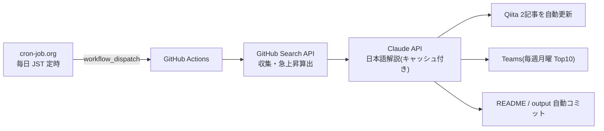

# Claude Code向けMCPツール候補ランキング

GitHub Search APIを使って、Claude Code周辺で活用候補になりそうなMCP関連リポジトリを定期収集するリポジトリです。

> 注意: この一覧は「Claude Codeでの動作」を保証するものではありません。  
> GitHub上のリポジトリ名・説明文・READMEなどに含まれる情報をもとに、MCP関連ツール候補を探すための入口として利用します。

## 仕組み(定常自律運転)

このランキングは cron-job.org → GitHub Actions → Claude API → Qiita / Teams のパイプラインで、毎日無人更新されています。


```mermaid
flowchart LR
    A["cron-job.org<br>毎日 JST 定時"] -->|workflow_dispatch| B["GitHub Actions"]
    B --> C["GitHub Search API<br>収集・急上昇算出"]
    C --> D["Claude API<br>日本語解説(キャッシュ付き)"]
    D --> E["Qiita 2記事を自動更新"]
    D --> F["Teams(毎週月曜 Top10)"]
    D --> G["README / output 自動コミット"]
```

- 仕組みの詳細と**ライブ稼働ステータス**: [定常自律運転ページ](https://takanobusano.github.io/mcp-github-ranking/)
- 作り方の解説記事: [パイプライン編](https://qiita.com/4q_sano/items/913e93ee5cc2731561fc) / [cron-job.org 完全自動化編](https://qiita.com/4q_sano/items/1bc5e0669a8f0166936c)
<!-- MCP_REPOS_START -->
最終更新: **2026-10-11 08:17:13 JST**

MCP関連リポジトリに加え、Claude Code周辺で活用候補になりそうな関連ツールをGitHub Search APIで毎日自動収集してランキング化しています。

Stars / Forks の差分は、UTC基準の前日データ（2026-10-09）との差分です。
CSVには最大500件を保存し、本文では上位100件を表示しています。

> 注意: この一覧はClaude Codeでの動作を保証するものではありません。  
> MCP関連ツールまたはClaude Code関連ツール候補を探すための入口として利用してください。

# 注目MCP・関連ツール候補ランキング

## 1位 [public-apis/public-apis](https://github.com/public-apis/public-apis)

A collective list of free APIs

⭐ **487,278 Stars**（+278）　🍴 **53,971 Forks**（+42）　/　🟢 **2,107 Open Issues**　/　Python

Topics: `api` / `apis` / `dataset` / `development` / `free` / `list` / `lists` / `open-source`

## 2位 [openclaw/openclaw](https://github.com/openclaw/openclaw)

The AI that really does things. Any OS. Any Platform. The lobster way. 🦞

⭐ **391,616 Stars**（+87）　🍴 **82,326 Forks**（+35）　/　🟢 **9,449 Open Issues**　/　TypeScript

Topics: `ai` / `assistant` / `crustacean` / `molty` / `openclaw` / `own-your-data` / `personal`

## 3位 [obra/superpowers](https://github.com/obra/superpowers)

An agentic skills framework & software development methodology that works.

⭐ **297,222 Stars**（+342）　🍴 **26,534 Forks**（+22）　/　🟢 **327 Open Issues**　/　Shell

Topics: `ai` / `brainstorming` / `coding` / `obra` / `sdlc` / `skills` / `subagent-driven-development` / `superpowers`

## 4位 [mattpocock/skills](https://github.com/mattpocock/skills)

Skills for Real Engineers. Straight from my .agents directory.

⭐ **284,406 Stars**（+1,798）　🍴 **23,808 Forks**（+132）　/　🟢 **164 Open Issues**　/　Shell

Topics: `topicなし`

## 5位 [affaan-m/ECC](https://github.com/affaan-m/ECC)

The agent harness performance optimization system. Skills, instincts, memory, security, and research-first development for Claude Code, Codex, Opencode, Cursor and beyond.

⭐ **276,494 Stars**（+542）　🍴 **41,238 Forks**（+64）　/　🟢 **231 Open Issues**　/　JavaScript

Topics: `ai-agents` / `anthropic` / `claude` / `claude-code` / `developer-tools` / `llm` / `mcp` / `productivity`

## 6位 [NousResearch/hermes-agent](https://github.com/NousResearch/hermes-agent)

The agent that grows with you

⭐ **252,539 Stars**（+256）　🍴 **54,597 Forks**（+107）　/　🟢 **47,865 Open Issues**　/　Python

Topics: `ai` / `ai-agent` / `ai-agents` / `anthropic` / `chatgpt` / `claude` / `claude-code` / `codex`

## 7位 [multica-ai/andrej-karpathy-skills](https://github.com/multica-ai/andrej-karpathy-skills)

A single CLAUDE.md file to improve Claude Code behavior, derived from Andrej Karpathy's observations on LLM coding pitfalls.

⭐ **218,229 Stars**（+494）　🍴 **21,979 Forks**（+37）　/　🟢 **132 Open Issues**　/　不明

Topics: `topicなし`

## 8位 [ultraworkers/claw-code](https://github.com/ultraworkers/claw-code)

An agent-managed museum exhibit, built in Rust with Gajae-Code / LazyCodex — developed and maintained with no human intervention.

⭐ **194,977 Stars**（+4）　🍴 **108,083 Forks**（-16）　/　🟢 **47 Open Issues**　/　Rust

Topics: `topicなし`

## 9位 [firecrawl/firecrawl](https://github.com/firecrawl/firecrawl)

Supercharge your AI agents with data from the web and beyond. Building the library for superintelligence. 🔥

⭐ **190,216 Stars**（+300）　🍴 **10,088 Forks**（+17）　/　🟢 **563 Open Issues**　/　TypeScript

Topics: `ai` / `ai-agents` / `ai-crawler` / `ai-scraping` / `ai-search` / `crawler` / `data-extraction` / `html-to-markdown`

## 10位 [ollama/ollama](https://github.com/ollama/ollama)

Get up and running with Kimi, GLM, MiniMax, DeepSeek, gpt-oss, Qwen, Gemma and other models.

⭐ **182,659 Stars**（+122）　🍴 **18,192 Forks**（+17）　/　🟢 **4,243 Open Issues**　/　Go

Topics: `deepseek` / `gemma` / `gemma3` / `glm` / `go` / `golang` / `gpt-oss` / `llama`

## 11位 [anthropics/skills](https://github.com/anthropics/skills)

Public repository for Agent Skills

⭐ **180,338 Stars**（+179）　🍴 **21,342 Forks**（+18）　/　🟢 **1,396 Open Issues**　/　Python

Topics: `agent-skills`

## 12位 [DietrichGebert/ponytail](https://github.com/DietrichGebert/ponytail)

Makes your AI agent think like the laziest senior dev in the room. The best code is the code you never wrote.

⭐ **160,427 Stars**（+828）　🍴 **8,625 Forks**（+41）　/　🟢 **48 Open Issues**　/　JavaScript

Topics: `agent-skills` / `ai-agents` / `claude` / `claude-code` / `claude-code-plugin` / `cursor-rules` / `developer-tools` / `llm`

## 13位 [msitarzewski/agency-agents](https://github.com/msitarzewski/agency-agents)

A complete AI agency at your fingertips - From frontend wizards to Reddit community ninjas, from whimsy injectors to reality checkers. Each agent is a specialized expert with personality, processes, and proven deliverables.

⭐ **158,767 Stars**（+244）　🍴 **25,626 Forks**（+48）　/　🟢 **224 Open Issues**　/　Shell

Topics: `topicなし`

## 14位 [langgenius/dify](https://github.com/langgenius/dify)

Build Agentic workflows, RAG pipelines, with rich AI model and tool support on one collaborative workspace. Deploy on cloud, VPC, or self-hosted, so teams move from prototype to production without rebuilding the stack.

⭐ **158,099 Stars**（+87）　🍴 **24,962 Forks**（+16）　/　🟢 **1,102 Open Issues**　/　TypeScript

Topics: `agent` / `agentic-ai` / `agentic-framework` / `agentic-workflow` / `ai` / `automation` / `claude` / `deepseek`

## 15位 [langflow-ai/langflow](https://github.com/langflow-ai/langflow)

Langflow is a powerful tool for building and deploying AI-powered agents and workflows.

⭐ **155,481 Stars**（+39）　🍴 **10,198 Forks**（+6）　/　🟢 **1,145 Open Issues**　/　Python

Topics: `agents` / `chatgpt` / `generative-ai` / `large-language-models` / `multiagent` / `react-flow`

## 16位 [anthropics/claude-code](https://github.com/anthropics/claude-code)

Claude Code is an agentic coding tool that lives in your terminal, understands your codebase, and helps you code faster by executing routine tasks, explaining complex code, and handling git workflows - all through natural language commands.

⭐ **150,063 Stars**（+198）　🍴 **26,100 Forks**（+175）　/　🟢 **14,633 Open Issues**　/　TypeScript

Topics: `topicなし`

## 17位 [x1xhlol/system-prompts-and-models-of-ai-tools](https://github.com/x1xhlol/system-prompts-and-models-of-ai-tools)

FULL Augment Code, Claude Code, Cluely, CodeBuddy, Comet, Cursor, Devin AI, Junie, Kiro, Leap.new, Lovable, Manus, NotionAI, Orchids.app, Perplexity, Poke, Qoder, Replit, Same.dev, Trae, Traycer AI, VSCode Agent, Warp.dev, Windsurf, Xcode, Z.ai Code, Dia & v0. (And other Open Sourced) System Prompts, Internal Tools & AI Models

⭐ **143,946 Stars**（+19）　🍴 **34,763 Forks**（-4）　/　🟢 **164 Open Issues**　/　不明

Topics: `ai` / `bolt` / `cluely` / `copilot` / `cursor` / `cursorai` / `devin` / `github-copilot`

## 18位 [farion1231/cc-switch](https://github.com/farion1231/cc-switch)

A cross-platform desktop All-in-One assistant for Claude Code, Codex, OpenCode, OpenClaw, Grok Build & Hermes Agent. Only official website: ccswitch.io

⭐ **142,435 Stars**（+536）　🍴 **9,501 Forks**（+23）　/　🟢 **1,969 Open Issues**　/　Rust

Topics: `ai-tools` / `claude-code` / `codex` / `desktop-app` / `grok` / `grokbuild` / `hermes` / `hermes-agent`

## 19位 [garrytan/gstack](https://github.com/garrytan/gstack)

Use Garry Tan's exact Claude Code setup: 23 opinionated tools that serve as CEO, Designer, Eng Manager, Release Manager, Doc Engineer, and QA

⭐ **135,834 Stars**（+103）　🍴 **20,168 Forks**（+8）　/　🟢 **190 Open Issues**　/　TypeScript

Topics: `topicなし`

## 20位 [nextlevelbuilder/ui-ux-pro-max-skill](https://github.com/nextlevelbuilder/ui-ux-pro-max-skill)

An AI skill that provides design intelligence for building professional UI/UX across multiple platforms.

⭐ **134,511 Stars**（+285）　🍴 **14,295 Forks**（+33）　/　🟢 **89 Open Issues**　/　Python

Topics: `ai-skills` / `antigravity` / `claude` / `claude-code` / `codex` / `command-line` / `copilot` / `cursor-ai`

## 21位 [harry0703/MoneyPrinterTurbo](https://github.com/harry0703/MoneyPrinterTurbo)

利用 AI 大模型和自动化工作流，根据主题或关键词一键生成高清短视频。Generate HD short videos from a topic or keyword with an automated AI workflow.

⭐ **129,478 Stars**（+144）　🍴 **20,289 Forks**（+25）　/　🟢 **91 Open Issues**　/　Python

Topics: `ai-video-generator` / `content-creation` / `ffmpeg` / `instagram-reels` / `llm` / `python` / `short-video` / `subtitles`

## 22位 [Graphify-Labs/graphify](https://github.com/Graphify-Labs/graphify)

Turn any codebase, with its docs, SQL schemas, configs, and PDFs, into a queryable knowledge graph. A /graphify skill for Claude Code, Cursor, Codex, and Gemini CLI: local deterministic AST parsing, every edge explained, no vector store.

⭐ **125,299 Stars**（+276）　🍴 **12,097 Forks**（+28）　/　🟢 **1,535 Open Issues**　/　Python

Topics: `ai-agents` / `antigravity` / `ast` / `claude-code` / `code-analysis` / `code-search` / `codex` / `cursor`

## 23位 [browser-use/browser-use](https://github.com/browser-use/browser-use)

Agents that use the browser.

⭐ **117,570 Stars**（+146）　🍴 **13,005 Forks**（+13）　/　🟢 **522 Open Issues**　/　Python

Topics: `ai-agents` / `ai-tools` / `browser-automation` / `browser-use` / `llm` / `playwright` / `python`

## 24位 [JuliusBrussee/caveman](https://github.com/JuliusBrussee/caveman)

🪨 why use many token when few token do trick. Viral skill + proxy for coding agents that cuts 65% of tokens by talking like a caveman.

⭐ **110,928 Stars**（+155）　🍴 **6,424 Forks**（+8）　/　🟢 **58 Open Issues**　/　Go

Topics: `ai` / `anthropic` / `caveman` / `claude` / `claude-code` / `llm` / `meme` / `prompt-engineering`

## 25位 [TauricResearch/TradingAgents](https://github.com/TauricResearch/TradingAgents)

TradingAgents: Multi-Agents LLM Financial Trading Framework

⭐ **110,516 Stars**（+129）　🍴 **21,280 Forks**（+35）　/　🟢 **104 Open Issues**　/　Python

Topics: `agent` / `finance` / `llm` / `multiagent` / `trading`

## 26位 [google-gemini/gemini-cli](https://github.com/google-gemini/gemini-cli)

An open-source AI agent that brings the power of Gemini directly into your terminal.

⭐ **107,275 Stars**（+12）　🍴 **14,702 Forks**（+2）　/　🟢 **764 Open Issues**　/　TypeScript

Topics: `ai` / `ai-agents` / `cli` / `gemini` / `gemini-api` / `mcp-client` / `mcp-server`

## 27位 [addyosmani/agent-skills](https://github.com/addyosmani/agent-skills)

Production-grade engineering skills for AI coding agents.

⭐ **104,497 Stars**（+538）　🍴 **10,908 Forks**（+40）　/　🟢 **126 Open Issues**　/　JavaScript

Topics: `agent-skills` / `antigravity` / `claude-code` / `codex` / `cursor` / `skills`

## 28位 [nexu-io/open-design](https://github.com/nexu-io/open-design)

🎨 Best DeepSeek Harness Design Plugin. The open-source Claude Design alternative. 🖥️ Local-first desktop app. 🖼️ Your coding agent becomes the design engine: pr...

⭐ **100,401 Stars**（+191）　🍴 **11,573 Forks**（+14）　/　🟢 **1,165 Open Issues**　/　TypeScript

Topics: `agent-skills` / `ai-design` / `byok` / `claude-code-for-design` / `claude-design` / `codex-design` / `coding-agents` / `cursor-design`

## 29位 [paperclipai/paperclip](https://github.com/paperclipai/paperclip)

The open-source app everyone uses to manage agents at work

⭐ **99,703 Stars**（+490）　🍴 **16,820 Forks**（+74）　/　🟢 **5,868 Open Issues**　/　TypeScript

Topics: `topicなし`

## 30位 [thedotmack/claude-mem](https://github.com/thedotmack/claude-mem)

Persistent Context Across Sessions for Every Agent –  Captures everything your agent does during sessions, compresses it with AI, and injects relevant context back into future sessions. Works with Claude Code, OpenClaw, Codex, Gemini, Hermes, Copilot, OpenCode + More

⭐ **99,219 Stars**（+245）　🍴 **8,692 Forks**（+23）　/　🟢 **189 Open Issues**　/　TypeScript

Topics: `ai` / `ai-agents` / `ai-memory` / `anthropic` / `artificial-intelligence` / `chromadb` / `claude` / `claude-agent-sdk`

## 31位 [microsoft/playwright](https://github.com/microsoft/playwright)

Playwright is a framework for Web Testing and Automation. It allows testing Chromium, Firefox and WebKit with a single API.

⭐ **97,443 Stars**（+72）　🍴 **6,580 Forks**（+7）　/　🟢 **183 Open Issues**　/　TypeScript

Topics: `automation` / `chrome` / `chromium` / `e2e-testing` / `electron` / `end-to-end-testing` / `firefox` / `javascript`

## 32位 [puppeteer/puppeteer](https://github.com/puppeteer/puppeteer)

JavaScript API for Chrome and Firefox

⭐ **95,676 Stars**（+5）　🍴 **9,590 Forks**（±0）　/　🟢 **272 Open Issues**　/　TypeScript

Topics: `automation` / `chrome` / `chromium` / `developer-tools` / `firefox` / `headless-chrome` / `node-module` / `testing`

## 33位 [Panniantong/Agent-Reach](https://github.com/Panniantong/Agent-Reach)

Give your AI agent eyes to see the entire internet. Read & search Twitter, Reddit, YouTube, GitHub, Bilibili, XiaoHongShu — one CLI, zero API fees.

⭐ **95,477 Stars**（+620）　🍴 **8,355 Forks**（+61）　/　🟢 **206 Open Issues**　/　Python

Topics: `agent-infrastructure` / `ai-agent` / `ai-search` / `automation` / `bilibili` / `claude-code` / `cli` / `cursor`

## 34位 [Leonxlnx/taste-skill](https://github.com/Leonxlnx/taste-skill)

Taste-Skill - gives your AI good taste. stops the AI from generating boring, generic slop

⭐ **94,412 Stars**（+316）　🍴 **6,422 Forks**（+17）　/　🟢 **78 Open Issues**　/　JavaScript

Topics: `agent` / `ai` / `claude` / `claude-code` / `codex` / `coding` / `design` / `frontend`

## 35位 [OpenCut-app/OpenCut](https://github.com/OpenCut-app/OpenCut)

The open-source CapCut alternative

⭐ **93,483 Stars**（+138）　🍴 **9,177 Forks**（+12）　/　🟢 **375 Open Issues**　/　TypeScript

Topics: `editor` / `oss` / `videoeditor`

## 36位 [modelcontextprotocol/servers](https://github.com/modelcontextprotocol/servers)

Model Context Protocol Servers

⭐ **91,129 Stars**（+37）　🍴 **11,774 Forks**（+4）　/　🟢 **494 Open Issues**　/　TypeScript

Topics: `topicなし`

## 37位 [OpenHands/OpenHands](https://github.com/OpenHands/OpenHands)

🙌 OpenHands: AI-Driven Development

⭐ **90,518 Stars**（+110）　🍴 **11,984 Forks**（+24）　/　🟢 **965 Open Issues**　/　TypeScript

Topics: `agent` / `artificial-intelligence` / `chatgpt` / `claude-ai` / `cli` / `developer-tools` / `gpt` / `llm`

## 38位 [stablyai/orca](https://github.com/stablyai/orca)

Orca is the ADE for working with a fleet of parallel agents. Run any coding agent with your own subscription. Available on desktop, mobile and remote runtime.

⭐ **89,158 Stars**（+573）　🍴 **5,700 Forks**（+32）　/　🟢 **8,317 Open Issues**　/　TypeScript

Topics: `ade` / `agent-ide` / `ai-agents` / `claude-code` / `cli` / `codex` / `cursor-agent` / `devtools`

## 39位 [ChatGPTNextWeb/NextChat](https://github.com/ChatGPTNextWeb/NextChat)

✨ Zero-config AI chat assistant. No API key needed — sign up and instantly chat with GPT-5, Claude 4, Gemini 2.5, DeepSeek & 100+ top models. Pay-as-you-go save...

⭐ **88,840 Stars**（+6）　🍴 **58,874 Forks**（-20）　/　🟢 **852 Open Issues**　/　TypeScript

Topics: `calclaude` / `claude` / `cross-platform` / `desktop` / `fe` / `gemini` / `gemini-pro` / `gemini-server`

## 40位 [koala73/worldmonitor](https://github.com/koala73/worldmonitor)

Real-time global intelligence dashboard. AI-powered news aggregation, geopolitical monitoring, and infrastructure tracking in a unified situational awareness interface

⭐ **88,181 Stars**（+40）　🍴 **13,465 Forks**（+13）　/　🟢 **340 Open Issues**　/　TypeScript

Topics: `agent` / `ai` / `dashboard` / `geopolitics` / `mcp` / `mcp-server` / `monitoring` / `news`

## 41位 [D4Vinci/Scrapling](https://github.com/D4Vinci/Scrapling)

🕷️ An adaptive Web Scraping framework that handles everything from a single request to a full-scale crawl! Don't be shy, join here:  and follow here for daily tips and tricks:

⭐ **86,693 Stars**（+167）　🍴 **8,881 Forks**（+15）　/　🟢 **14 Open Issues**　/　Python

Topics: `ai` / `ai-scraping` / `automation` / `crawler` / `crawling` / `crawling-python` / `data` / `data-extraction`

## 42位 [Egonex-AI/Understand-Anything](https://github.com/Egonex-AI/Understand-Anything)

Graphs that teach > graphs that impress. Turn any code into an interactive knowledge graph you can explore, search, and ask questions about. Works with Claude Code, Codex, Cursor, Copilot, Gemini CLI, and more.

⭐ **85,847 Stars**（+88）　🍴 **7,226 Forks**（+10）　/　🟢 **317 Open Issues**　/　TypeScript

Topics: `antigravity-skills` / `business-knowledge` / `claude-code` / `claude-skills` / `codebase-analysis` / `codex` / `codex-skills` / `developer-tools-ai-agent`

## 43位 [unclecode/crawl4ai](https://github.com/unclecode/crawl4ai)

Open-source web crawler and scraper for LLMs and AI agents: any website into clean, LLM-ready Markdown. Run it yourself, or use Crawl4AI Cloud with one key.

⭐ **85,161 Stars**（+67）　🍴 **8,835 Forks**（+11）　/　🟢 **237 Open Issues**　/　Python

Topics: `ai` / `ai-agents` / `crawler` / `data-extraction` / `llm` / `markdown` / `mcp` / `open-source`

## 44位 [laravel/laravel](https://github.com/laravel/laravel)

Laravel is a web application framework with expressive, elegant syntax. We’ve already laid the foundation for your next big idea — freeing you to create without sweating the small things.

⭐ **85,062 Stars**（+5）　🍴 **27,260 Forks**（+173）　/　🟢 **31 Open Issues**　/　Blade

Topics: `framework` / `laravel` / `php`

## 45位 [bytedance/deer-flow](https://github.com/bytedance/deer-flow)

An open-source long-horizon SuperAgent harness that researches, codes, and creates. With the help of sandboxes, memories, tools, skill, subagents and message gateway, it handles different levels of tasks that could take minutes to hours.

⭐ **83,665 Stars**（+87）　🍴 **11,636 Forks**（+19）　/　🟢 **907 Open Issues**　/　Python

Topics: `agent` / `agentic` / `agentic-framework` / `agentic-workflow` / `ai` / `ai-agents` / `deep-research` / `harness`

## 46位 [lobehub/lobehub](https://github.com/lobehub/lobehub)

🤯 LobeHub is your Chief Agent Operator, organizing your agents into 7×24 operations by hiring, scheduling, and reporting on your entire AI team.

⭐ **83,111 Stars**（+28）　🍴 **15,971 Forks**（+10）　/　🟢 **1,093 Open Issues**　/　TypeScript

Topics: `agent` / `agent-collaboration` / `agent-harness` / `ai` / `cao` / `chatgpt` / `chief-agent-operator` / `claude`

## 47位 [rtk-ai/rtk](https://github.com/rtk-ai/rtk)

CLI proxy that reduces LLM token consumption by 60-90% on common dev commands. Single Rust binary, zero dependencies

⭐ **82,872 Stars**（+88）　🍴 **5,258 Forks**（+2）　/　🟢 **1,512 Open Issues**　/　Rust

Topics: `agentic-coding` / `ai-coding` / `anthropic` / `claude-code` / `cli` / `command-line-tool` / `cost-reduction` / `developer-tools`

## 48位 [tt-a1i/archify](https://github.com/tt-a1i/archify)

Turn any idea, plan, or codebase into a beautiful interactive diagram. An agent skill for Claude Code, Codex, and more.

⭐ **81,651 Stars**（+485）　🍴 **5,515 Forks**（+38）　/　🟢 **252 Open Issues**　/　JavaScript

Topics: `agent-skills` / `ai-agents` / `architecture-diagram` / `claude-code` / `claude-skills` / `codex` / `coding-agents` / `deepseek-harness`

## 49位 [abi/screenshot-to-code](https://github.com/abi/screenshot-to-code)

Drop in a screenshot and convert it to clean code (HTML/Tailwind/React/Vue)

⭐ **80,183 Stars**（+53）　🍴 **9,795 Forks**（+3）　/　🟢 **147 Open Issues**　/　Python

Topics: `topicなし`

## 50位 [pbakaus/impeccable](https://github.com/pbakaus/impeccable)

The design language that makes your AI harness better at design.

⭐ **79,390 Stars**（+389）　🍴 **4,724 Forks**（+24）　/　🟢 **69 Open Issues**　/　JavaScript

Topics: `topicなし`

## 51位 [shareAI-lab/learn-claude-code](https://github.com/shareAI-lab/learn-claude-code)

Bash is all you need -  A nano claude code–like 「agent harness」, built from 0 to 1

⭐ **78,316 Stars**（+69）　🍴 **12,546 Forks**（+5）　/　🟢 **61 Open Issues**　/　Python

Topics: `agent` / `agent-development` / `ai-agent` / `claude` / `claude-code` / `educational` / `llm` / `python`

## 52位 [unslothai/unsloth](https://github.com/unslothai/unsloth)

Local UI to run and train LLMs and diffusion models. Supports GGUF, MLX, Qwen3.8, DeepSeek-V4, MiniMax-H3, Gemma 4, FLUX and more.

⭐ **77,719 Stars**（+71）　🍴 **7,176 Forks**（+12）　/　🟢 **617 Open Issues**　/　Python

Topics: `agent` / `ai` / `chatgpt` / `deepseek` / `fine-tuning` / `gemma` / `image-generation` / `llama`

## 53位 [diegosouzapw/OmniRoute](https://github.com/diegosouzapw/OmniRoute)

Never stop coding. Free MIT AI gateway: one endpoint, 359 providers (150+ free), 1200+ models Kimi, Claude, GPT, Gemini, GLM, DeepSeek, MiniMax. Works with Claude Code, Codex, Cursor, OpenCode, Cline & Copilot. Quota-aware auto-fallback, RTK+Caveman compression saves 15-95% tokens, MCP/A2A, Desktop/PWA. Built by hundreds of contributors

⭐ **74,970 Stars**（+301）　🍴 **10,835 Forks**（+59）　/　🟢 **268 Open Issues**　/　TypeScript

Topics: `a2a` / `ai-agents` / `ai-gateway` / `anthropic` / `claude` / `claude-code` / `cline` / `codex`

## 54位 [headroomlabs-ai/headroom](https://github.com/headroomlabs-ai/headroom)

Compress tool outputs, logs, files, and RAG chunks before they reach the LLM. 20% fewer tokens for coding agents, 60-95% fewer tokens for JSON, same answers. Library, proxy, MCP server.

⭐ **74,923 Stars**（+83）　🍴 **5,809 Forks**（+7）　/　🟢 **411 Open Issues**　/　Python

Topics: `agent` / `ai` / `anthropic` / `claude-code` / `compression` / `context-engineering` / `context-window` / `cursor`

## 55位 [Eugeny/tabby](https://github.com/Eugeny/tabby)

A terminal for a more modern age

⭐ **74,906 Stars**（+26）　🍴 **4,286 Forks**（+1）　/　🟢 **2,828 Open Issues**　/　TypeScript

Topics: `serial` / `ssh-client` / `telnet-client` / `terminal` / `terminal-emulators`

## 56位 [thedaviddias/Front-End-Checklist](https://github.com/thedaviddias/Front-End-Checklist)

🗂 The essential checklist for modern web development, for humans and AI agents

⭐ **74,422 Stars**（+7）　🍴 **6,760 Forks**（+1）　/　🟢 **7 Open Issues**　/　MDX

Topics: `ai-agent` / `ai-agents` / `checklist` / `css` / `front-end-developer-tool` / `front-end-development` / `frontend` / `guidelines`

## 57位 [ruvnet/ruflo](https://github.com/ruvnet/ruflo)

🌊 The original agent harness. Deploy intelligent multi-player swarms, coordinate autonomous workflows, and build conversational AI systems. Features adaptive me...

⭐ **74,286 Stars**（+86）　🍴 **8,837 Forks**（+20）　/　🟢 **1,067 Open Issues**　/　TypeScript

Topics: `agentic-ai` / `agentic-framework` / `agentic-workflow` / `agents` / `ai-agents` / `ai-assistant` / `ai-skills` / `autonomous-agents`

## 58位 [openbq-org/OpenBB](https://github.com/openbq-org/OpenBB)

Open Data Platform for analysts, quants and AI agents.

⭐ **74,084 Stars**（+55）　🍴 **7,649 Forks**（+9）　/　🟢 **103 Open Issues**　/　Python

Topics: `ai` / `crypto` / `derivatives` / `economics` / `equity` / `finance` / `fixed-income` / `machine-learning`

## 59位 [colbymchenry/codegraph](https://github.com/colbymchenry/codegraph)

Pre-indexed code knowledge graph, auto syncs on code changes, for Claude Code, Codex, Gemini, Cursor, OpenCode, AntiGravity, Kiro, CoPilot, and Hermes Agent — fewer tokens, fewer tool calls, 100% local

⭐ **73,680 Stars**（+75）　🍴 **4,746 Forks**（+7）　/　🟢 **534 Open Issues**　/　C

Topics: `topicなし`

## 60位 [morluto/rea](https://github.com/morluto/rea)

Reverse engineer anything with agents, from app behavior down to native binaries.

⭐ **71,329 Stars**（+26,590）　🍴 **14,954 Forks**（+7,905）　/　🟢 **127 Open Issues**　/　TypeScript

Topics: `agent-skills` / `ai-agents` / `binary-analysis` / `claude-code` / `cli` / `codex` / `cordis` / `ctf`

## 61位 [cline/cline](https://github.com/cline/cline)

Autonomous coding agent as an SDK, IDE extension, or CLI assistant.

⭐ **70,126 Stars**（+47）　🍴 **7,633 Forks**（+7）　/　🟢 **1,650 Open Issues**　/　TypeScript

Topics: `topicなし`

## 62位 [code-yeongyu/oh-my-openagent](https://github.com/code-yeongyu/oh-my-openagent)

OmO: Just type "mass ulw" keyword with your prompt. Now you are the master of graph engineering.

⭐ **69,942 Stars**（+24）　🍴 **5,746 Forks**（+3）　/　🟢 **1,208 Open Issues**　/　TypeScript

Topics: `ai` / `ai-agents` / `anthropic` / `chatgpt` / `claude` / `claude-skills` / `codex` / `cursor`

## 63位 [asgeirtj/system_prompts_leaks](https://github.com/asgeirtj/system_prompts_leaks)

Documented system prompts from Anthropic - Claude Fable 5.1, Opus 5.5, Claude Design, Claude Code. OpenAI - ChatGPT GPT-6-Astra, Codex. Google - Gemini 3.8 Flash, 3.1 Pro, Antigravity. xAI - Grok, Grok Bot, Cursor, Kimi and more! Updated regularly.

⭐ **69,340 Stars**（+86）　🍴 **11,273 Forks**（+21）　/　🟢 **56 Open Issues**　/　Python

Topics: `ai` / `ai-agents` / `ai-prompts` / `anthropic` / `chatbot` / `chatgpt` / `claude` / `claude-code`

## 64位 [docling-project/docling](https://github.com/docling-project/docling)

Get your documents ready for gen AI

⭐ **68,647 Stars**（+40）　🍴 **5,038 Forks**（+8）　/　🟢 **1,041 Open Issues**　/　Python

Topics: `ai` / `convert` / `document-parser` / `document-parsing` / `documents` / `docx` / `html` / `markdown`

## 65位 [openinterpreter/openinterpreter](https://github.com/openinterpreter/openinterpreter)

A coding agent for open models like Kimi K3 and GLM 5.3

⭐ **68,540 Stars**（+7）　🍴 **5,889 Forks**（+1）　/　🟢 **13 Open Issues**　/　Rust

Topics: `acp` / `coding-agent` / `deepseek` / `kimi` / `python` / `qwen` / `rust`

## 66位 [usestrix/strix](https://github.com/usestrix/strix)

Open-source AI penetration testing tool to find and fix your app’s vulnerabilities.

⭐ **67,766 Stars**（+217）　🍴 **7,498 Forks**（+49）　/　🟢 **462 Open Issues**　/　Python

Topics: `agents` / `ai-hacking` / `ai-penetration-testing` / `ai-pentesting` / `ai-security` / `artificial-intelligence` / `bug-bounty` / `code-quality`

## 67位 [shanraisshan/claude-code-best-practice](https://github.com/shanraisshan/claude-code-best-practice)

from vibe coding to agentic engineering - practice makes claude perfect

⭐ **67,358 Stars**（+51）　🍴 **6,728 Forks**（+5）　/　🟢 **60 Open Issues**　/　HTML

Topics: `agentic-ai` / `agentic-coding` / `agentic-engineering` / `agentic-workflow` / `ai` / `ai-agents` / `anthropic` / `best-practices`

## 68位 [bradtraversy/design-resources-for-developers](https://github.com/bradtraversy/design-resources-for-developers)

Curated list of design and UI resources from stock photos, web templates, CSS frameworks, UI libraries, tools and much more

⭐ **67,131 Stars**（+11）　🍴 **12,240 Forks**（+9）　/　🟢 **21 Open Issues**　/　不明

Topics: `topicなし`

## 69位 [mem0ai/mem0](https://github.com/mem0ai/mem0)

The Memory Layer for AI Agents - Drop-in memory infrastructure for AI agents and apps. Context that persists. Built for production.

⭐ **66,955 Stars**（+56）　🍴 **7,871 Forks**（+2）　/　🟢 **814 Open Issues**　/　Python

Topics: `agentic-memory` / `agentic-memory-system` / `agents` / `ai` / `ai-agents` / `chatgpt` / `genai` / `llm`

## 70位 [xtekky/gpt4free](https://github.com/xtekky/gpt4free)

The official gpt4free repository \| various collection of powerful language models \| opus 4.6 gpt 5.3 kimi 2.5 deepseek v3.2 gemini 3

⭐ **66,784 Stars**（+12）　🍴 **13,475 Forks**（+1）　/　🟢 **5 Open Issues**　/　Python

Topics: `chatbot` / `chatbots` / `chatgpt` / `chatgpt-4` / `chatgpt-api` / `chatgpt-free` / `chatgpt4` / `deepseek`

## 71位 [rohitg00/ai-engineering-from-scratch](https://github.com/rohitg00/ai-engineering-from-scratch)

Learn AI Engineering! Learn it. Build it. Ship it for others.

⭐ **66,760 Stars**（+559）　🍴 **11,694 Forks**（+206）　/　🟢 **66 Open Issues**　/　Python

Topics: `agents` / `ai` / `ai-agents` / `ai-engineering` / `computer-vision` / `course` / `deep-learning` / `from-scratch`

## 72位 [NanmiCoder/MediaCrawler](https://github.com/NanmiCoder/MediaCrawler)

小红书笔记 \| 评论爬虫、抖音视频 \| 评论爬虫、快手视频 \| 评论爬虫、B 站视频 ｜ 评论爬虫、微博帖子 ｜ 评论爬虫、百度贴吧帖子 ｜ 百度贴吧评论回复爬虫  \| 知乎问答文章｜评论爬虫

⭐ **66,605 Stars**（+79）　🍴 **12,765 Forks**（+12）　/　🟢 **216 Open Issues**　/　Python

Topics: `topicなし`

## 73位 [calesthio/OpenMontage](https://github.com/calesthio/OpenMontage)

World's first open-source, agentic video production system. 12 production pipelines, 100+ tools, 700+ agent skill and production-knowledge files. Turn your AI coding assistant into a full video production studio.

⭐ **66,138 Stars**（+300）　🍴 **8,421 Forks**（+56）　/　🟢 **389 Open Issues**　/　Python

Topics: `agent` / `agentic-ai` / `ai` / `claude` / `copilot` / `cursor` / `elevenlabs` / `ffmpeg`

## 74位 [warpdotdev/warp](https://github.com/warpdotdev/warp)

Warp is an agentic development environment, born out of the terminal.

⭐ **65,412 Stars**（+13）　🍴 **5,629 Forks**（+1）　/　🟢 **5,377 Open Issues**　/　Rust

Topics: `bash` / `linux` / `macos` / `rust` / `shell` / `terminal` / `wasm` / `zsh`

## 75位 [mvanhorn/last30days-skill](https://github.com/mvanhorn/last30days-skill)

AI agent skill that researches any topic across Reddit, X, YouTube, HN, Polymarket, and the web - then synthesizes a grounded summary

⭐ **63,906 Stars**（+56）　🍴 **5,569 Forks**（+6）　/　🟢 **33 Open Issues**　/　Python

Topics: `ai-prompts` / `ai-skill` / `bluesky` / `claude` / `claude-code` / `clawhub` / `deep-research` / `hackernews`

## 76位 [upstash/context7](https://github.com/upstash/context7)

Context7 Platform -- Up-to-date code documentation for LLMs and AI code editors

⭐ **62,875 Stars**（+36）　🍴 **3,062 Forks**（+1）　/　🟢 **30 Open Issues**　/　TypeScript

Topics: `llm` / `mcp` / `mcp-server` / `vibe-coding`

## 77位 [coollabsio/coolify](https://github.com/coollabsio/coolify)

An open-source, self-hostable PaaS alternative to Vercel, Heroku & Netlify that lets you easily deploy static sites, databases, full-stack applications and 280+ one-click services on your own servers.

⭐ **62,834 Stars**（+48）　🍴 **5,628 Forks**（+7）　/　🟢 **732 Open Issues**　/　PHP

Topics: `coolify` / `databases` / `deployment` / `docker` / `docker-compose` / `inertiajs` / `laravel` / `mariadb`

## 78位 [sansan0/TrendRadar](https://github.com/sansan0/TrendRadar)

⭐AI-driven public opinion & trend monitor with multi-platform aggregation, RSS, and smart alerts.🎯 告别信息过载，你的 AI 舆情监控助手与热点筛选工具！聚合多平台热点 +  RSS 订阅，支持关键词精准筛选。AI 智能筛...

⭐ **62,786 Stars**（+25）　🍴 **24,897 Forks**（+10）　/　🟢 **71 Open Issues**　/　Python

Topics: `ai` / `bark` / `data-analysis` / `docker` / `hot-news` / `llm` / `mail` / `mcp`

## 79位 [tw93/Pake](https://github.com/tw93/Pake)

🤱🏻 Turn any website into a tiny, fast desktop app.

⭐ **61,987 Stars**（+30）　🍴 **12,765 Forks**（-2）　/　🟢 **0 Open Issues**　/　Rust

Topics: `chatgpt` / `claude` / `desktop` / `gemini` / `hight-performance` / `linux` / `macos` / `no-electron`

## 80位 [1c7/chinese-independent-developer](https://github.com/1c7/chinese-independent-developer)

👩🏿‍💻👨🏾‍💻👩🏼‍💻👨🏽‍💻👩🏻‍💻中国独立开发者项目列表 -- 分享大家都在做什么

⭐ **61,743 Stars**（+27）　🍴 **5,441 Forks**（+3）　/　🟢 **1 Open Issues**　/　不明

Topics: `china` / `indie` / `indie-developer`

## 81位 [microsoft/autogen](https://github.com/microsoft/autogen)

A programming framework for agentic AI

⭐ **61,343 Stars**（+14）　🍴 **9,274 Forks**（±0）　/　🟢 **1,100 Open Issues**　/　Python

Topics: `agentic` / `agentic-agi` / `agents` / `ai` / `autogen` / `autogen-ecosystem` / `chatgpt` / `framework`

## 82位 [BerriAI/litellm](https://github.com/BerriAI/litellm)

The fastest, litest AI Gateway. Rust core with Python SDK. Call 100+ LLM APIs in OpenAI (or native) format with cost tracking, guardrails, load balancing, and logging [Bedrock, Azure, OpenAI, Anthropic, OpenAI, VertexAI, vLLM, Nvidia NIM]

⭐ **60,907 Stars**（+272）　🍴 **12,216 Forks**（+31）　/　🟢 **5,430 Open Issues**　/　Python

Topics: `ai-gateway` / `anthropic` / `azure-openai` / `bedrock` / `gateway` / `langchain` / `litellm` / `llm`

## 83位 [penpot/penpot](https://github.com/penpot/penpot)

Penpot: The open-source design platform for Product teams that need scalable collaboration.

⭐ **60,883 Stars**（+22）　🍴 **4,197 Forks**（+6）　/　🟢 **808 Open Issues**　/　Clojure

Topics: `clojure` / `clojurescript` / `design` / `prototyping` / `ui` / `ux-design` / `ux-experience`

## 84位 [heygen-com/hyperframes](https://github.com/heygen-com/hyperframes)

Write HTML. Render video. Built for agents.

⭐ **60,341 Stars**（+579）　🍴 **5,389 Forks**（+55）　/　🟢 **248 Open Issues**　/　TypeScript

Topics: `ai` / `animation` / `ffmpeg` / `framework` / `gsap` / `html` / `mcp` / `puppeteer`

## 85位 [meilisearch/meilisearch](https://github.com/meilisearch/meilisearch)

A lightning-fast search engine API bringing AI-powered hybrid search to your sites and applications.

⭐ **59,541 Stars**（+10）　🍴 **2,725 Forks**（+2）　/　🟢 **321 Open Issues**　/　Rust

Topics: `ai` / `api` / `app-search` / `database` / `enterprise-search` / `faceting` / `full-text-search` / `fuzzy-search`

## 86位 [crewAIInc/crewAI](https://github.com/crewAIInc/crewAI)

Framework for orchestrating role-playing, autonomous AI agents. By fostering collaborative intelligence, CrewAI empowers agents to work together seamlessly, tackling complex tasks.

⭐ **59,540 Stars**（+32）　🍴 **8,683 Forks**（+11）　/　🟢 **622 Open Issues**　/　Python

Topics: `agents` / `ai` / `ai-agents` / `aiagentframework` / `llms`

## 87位 [MemPalace/mempalace](https://github.com/MemPalace/mempalace)

The best-benchmarked open-source AI memory system. And it's free.

⭐ **59,497 Stars**（+12）　🍴 **7,562 Forks**（±0）　/　🟢 **790 Open Issues**　/　Python

Topics: `ai` / `chromadb` / `llm` / `mcp` / `memory` / `python`

## 88位 [hugohe3/ppt-master](https://github.com/hugohe3/ppt-master)

AI turns documents or topics into real, native PowerPoint decks—with native shapes, transitions and animations, data-backed charts and tables on demand, audio narration from speaker notes, and support for your own .pptx templates. · by Hugo He

⭐ **59,389 Stars**（+675）　🍴 **4,677 Forks**（+52）　/　🟢 **6 Open Issues**　/　Python

Topics: `ai-agent` / `aippt` / `office` / `powerpoint` / `powerpoint-generation` / `ppt` / `pptx` / `presentation`

## 89位 [eternity4719/HowToLiveBetter](https://github.com/eternity4719/HowToLiveBetter)

高性价比人生指南: 长寿防病、急救、省钱理财、法律红线、失业与工伤、医保社保、恋爱婚育、怀孕育儿、创业与做平台合规、出国与技能。每条写明成本、收益、证据等级和原始出处，只引期刊论文与官方文件。

⭐ **58,767 Stars**（+1,814）　🍴 **4,859 Forks**（+175）　/　🟢 **14 Open Issues**　/　HTML

Topics: `topicなし`

## 90位 [FoundationAgents/OpenManus](https://github.com/FoundationAgents/OpenManus)

No fortress, purely open ground.  OpenManus is Coming.

⭐ **58,602 Stars**（+24）　🍴 **10,163 Forks**（+2）　/　🟢 **451 Open Issues**　/　Python

Topics: `topicなし`

## 91位 [twentyhq/twenty](https://github.com/twentyhq/twenty)

The open alternative to Salesforce, designed for AI.

⭐ **58,182 Stars**（+43）　🍴 **9,490 Forks**（+3）　/　🟢 **88 Open Issues**　/　TypeScript

Topics: `crm` / `crm-system` / `customer` / `good-first-issue` / `graphql` / `hacktoberfest` / `javascript` / `marketing`

## 92位 [appwrite/appwrite](https://github.com/appwrite/appwrite)

The open-source cloud for agents & devs. Including Auth, Databases, Storage, Functions, Messaging, Hosting, Realtime, WAF and more

⭐ **57,627 Stars**（+10）　🍴 **5,776 Forks**（±0）　/　🟢 **779 Open Issues**　/　TypeScript

Topics: `android` / `appwrite` / `backend` / `backend-as-a-service` / `docker` / `firebase` / `firewall` / `flutter`

## 93位 [zylon-ai/private-gpt](https://github.com/zylon-ai/private-gpt)

Complete API layer for private AI applications on local models: RAG, skills, tools, MCP, text-to-sql, and more. Works with any OpenAI-compatible inference server.

⭐ **57,566 Stars**（-1）　🍴 **7,619 Forks**（±0）　/　🟢 **12 Open Issues**　/　Python

Topics: `ai` / `ai-tools` / `on-premise`

## 94位 [Alishahryar1/free-claude-code](https://github.com/Alishahryar1/free-claude-code)

Use Claude Code, Codex, VSCode, Pi, and OpenCode (and 6 other harnesses) for free (1.3B+ free tokens) from your terminal, app, IDE, or phone, and now from the browser with native browser sessions (multi-harness + multi-model) like OpenClaw (voice supported + ToS friendly)

⭐ **57,441 Stars**（+350）　🍴 **9,165 Forks**（+47）　/　🟢 **300 Open Issues**　/　Python

Topics: `topicなし`

## 95位 [debpalash/VoiceStudio](https://github.com/debpalash/VoiceStudio)

VoiceStudio is the open-source, fully-local ElevenLabs alternative — voice cloning, voice design, video dubbing, dictation, transcription & audiobook creation in 646 languages.

⭐ **57,272 Stars**（+1,038）　🍴 **6,415 Forks**（+107）　/　🟢 **59 Open Issues**　/　Python

Topics: `ai` / `audiobook` / `cuda` / `dubbing` / `elevenlabs-alternative` / `huggingface` / `local-first` / `mlx`

## 96位 [jamiepine/voicebox](https://github.com/jamiepine/voicebox)

The open-source AI voice studio. Clone, dictate, create.

⭐ **56,817 Stars**（+68）　🍴 **7,080 Forks**（+6）　/　🟢 **496 Open Issues**　/　Python

Topics: `ai` / `cuda` / `mlx` / `qwen3-tts` / `qwen3-tts-ui` / `voice-ai` / `voice-clone` / `whisper`

## 97位 [ayghri/i-have-adhd](https://github.com/ayghri/i-have-adhd)

A skill to stop your coding agent from burying the answer. ADHD-friendly output.

⭐ **56,300 Stars**（+186）　🍴 **3,218 Forks**（+19）　/　🟢 **66 Open Issues**　/　Python

Topics: `adhd` / `claude-` / `claude-code-plugin` / `claude-skills` / `developer-tools` / `productivity`

## 98位 [blader/humanizer](https://github.com/blader/humanizer)

Agent skill that removes signs of AI-generated writing from text

⭐ **55,445 Stars**（+237）　🍴 **4,371 Forks**（+10）　/　🟢 **3 Open Issues**　/　Python

Topics: `agent-skills` / `ai-humanizer` / `ai-writing` / `chatgpt` / `claude` / `claude-code` / `codex` / `cursor`

## 99位 [aaif-goose/goose](https://github.com/aaif-goose/goose)

an open source, extensible AI agent that goes beyond code suggestions - install, execute, edit, and test with any LLM

⭐ **55,138 Stars**（+31）　🍴 **6,404 Forks**（+7）　/　🟢 **490 Open Issues**　/　Rust

Topics: `acp` / `ai` / `ai-agents` / `mcp`

## 100位 [router-for-me/CLIProxyAPI](https://github.com/router-for-me/CLIProxyAPI)

Wrap Antigravity, ChatGPT Codex, Claude Code, Grok Build, Muse Code, Devin as an OpenAI/Gemini/Claude/Codex compatible API service, allowing you to enjoy the free Gemini Series, GPT Series, Grok Series, Claude model through API

⭐ **54,747 Stars**（+103）　🍴 **8,355 Forks**（+24）　/　🟢 **646 Open Issues**　/　Go

Topics: `antigravity` / `claude-code` / `cluade` / `codex` / `devin` / `gemini` / `muse` / `openai`

# 最近プッシュされたMCP・関連ツール候補

スター数ランキングとは別に、最近コードがプッシュされたリポジトリを表示します。古いスター数だけではなく、現在も開発が動いていそうな候補を探すための一覧です。

## プッシュ順 1位 [manaflow-ai/cmux](https://github.com/manaflow-ai/cmux)

Open source Ghostty-based macOS terminal with vertical tabs and notifications for AI coding agents. Built for multitasking, organization, and programmability.

⭐ **28,086 Stars**（+20）　🍴 **2,485 Forks**（+7）　/　Swift　/　最終プッシュ: 2026-10-10

Topics: `amp` / `claude-code` / `cli` / `codex` / `coding-agents` / `gemini` / `ghostty` / `macos`

## プッシュ順 2位 [trycua/cua](https://github.com/trycua/cua)

Scale computer-use 2.0 with open-source drivers, cross-OS fleets, and benchmarks for training, evaluation, and data generation.

⭐ **29,294 Stars**（+114）　🍴 **2,074 Forks**（+13）　/　Rust　/　最終プッシュ: 2026-10-10

Topics: `agent` / `ai-agent` / `apple` / `computer-use` / `computer-use-agent` / `containerization` / `cua` / `desktop-automation`

## プッシュ順 3位 [stablyai/orca](https://github.com/stablyai/orca)

Orca is the ADE for working with a fleet of parallel agents. Run any coding agent with your own subscription. Available on desktop, mobile and remote runtime.

⭐ **89,158 Stars**（+573）　🍴 **5,700 Forks**（+32）　/　TypeScript　/　最終プッシュ: 2026-10-10

Topics: `ade` / `agent-ide` / `ai-agents` / `claude-code` / `cli` / `codex` / `cursor-agent` / `devtools`

## プッシュ順 4位 [BerriAI/litellm](https://github.com/BerriAI/litellm)

The fastest, litest AI Gateway. Rust core with Python SDK. Call 100+ LLM APIs in OpenAI (or native) format with cost tracking, guardrails, load balancing, and logging [Bedrock, Azure, OpenAI, Anthropic, OpenAI, VertexAI, vLLM, Nvidia NIM]

⭐ **60,907 Stars**（+272）　🍴 **12,216 Forks**（+31）　/　Python　/　最終プッシュ: 2026-10-10

Topics: `ai-gateway` / `anthropic` / `azure-openai` / `bedrock` / `gateway` / `langchain` / `litellm` / `llm`

## プッシュ順 5位 [kortix-ai/suna](https://github.com/kortix-ai/suna)

The open-source AI Operating System

⭐ **20,263 Stars**（+1）　🍴 **3,436 Forks**（±0）　/　TypeScript　/　最終プッシュ: 2026-10-10

Topics: `ai` / `ai-agents` / `ai-operating-system` / `ai-os` / `llm` / `open-source` / `self-hosted`

## プッシュ順 6位 [vercel/ai](https://github.com/vercel/ai)

The AI Toolkit for TypeScript. From the creators of Next.js, the AI SDK is a free open-source library for building AI-powered applications and agents

⭐ **27,230 Stars**（+18）　🍴 **5,302 Forks**（+8）　/　TypeScript　/　最終プッシュ: 2026-10-10

Topics: `anthropic` / `artificial-intelligence` / `gemini` / `generative-ai` / `generative-ui` / `javascript` / `language-model` / `llm`

## プッシュ順 7位 [openclaw/openclaw](https://github.com/openclaw/openclaw)

The AI that really does things. Any OS. Any Platform. The lobster way. 🦞

⭐ **391,616 Stars**（+87）　🍴 **82,326 Forks**（+35）　/　TypeScript　/　最終プッシュ: 2026-10-10

Topics: `ai` / `assistant` / `crustacean` / `molty` / `openclaw` / `own-your-data` / `personal`

## プッシュ順 8位 [pingdotgg/t3code](https://github.com/pingdotgg/t3code)

説明なし

⭐ **26,809 Stars**（+192）　🍴 **7,026 Forks**（+79）　/　TypeScript　/　最終プッシュ: 2026-10-10

Topics: `topicなし`

## プッシュ順 9位 [LibreChat-AI/LibreChat](https://github.com/LibreChat-AI/LibreChat)

Enhanced ChatGPT Clone: Features Agents, MCP, Skills, DeepSeek, Anthropic, AWS, OpenAI, Responses API, Azure, Groq, o1, GPT-5, Mistral, OpenRouter, Vertex AI, Gemini, Artifacts, AI model switching, message search, Code Interpreter, langchain, DALL-E-3, OpenAPI Actions, Functions, Secure Multi-User Auth, Presets, open-source for self-hosting. Active

⭐ **45,489 Stars**（+28）　🍴 **9,344 Forks**（+11）　/　TypeScript　/　最終プッシュ: 2026-10-10

Topics: `ai` / `anthropic` / `artifacts` / `aws` / `azure` / `chatgpt` / `chatgpt-clone` / `claude`

## プッシュ順 10位 [heygen-com/hyperframes](https://github.com/heygen-com/hyperframes)

Write HTML. Render video. Built for agents.

⭐ **60,341 Stars**（+579）　🍴 **5,389 Forks**（+55）　/　TypeScript　/　最終プッシュ: 2026-10-10

Topics: `ai` / `animation` / `ffmpeg` / `framework` / `gsap` / `html` / `mcp` / `puppeteer`

## プッシュ順 11位 [mastra-ai/mastra](https://github.com/mastra-ai/mastra)

Mastra is the modern TypeScript framework for AI-powered applications and agents.

⭐ **28,694 Stars**（+21）　🍴 **2,947 Forks**（±0）　/　TypeScript　/　最終プッシュ: 2026-10-10

Topics: `agents` / `ai` / `chatbots` / `evals` / `javascript` / `llm` / `mcp` / `nextjs`

## プッシュ順 12位 [langgenius/dify](https://github.com/langgenius/dify)

Build Agentic workflows, RAG pipelines, with rich AI model and tool support on one collaborative workspace. Deploy on cloud, VPC, or self-hosted, so teams move from prototype to production without rebuilding the stack.

⭐ **158,099 Stars**（+87）　🍴 **24,962 Forks**（+16）　/　TypeScript　/　最終プッシュ: 2026-10-10

Topics: `agent` / `agentic-ai` / `agentic-framework` / `agentic-workflow` / `ai` / `automation` / `claude` / `deepseek`

## プッシュ順 13位 [QwenLM/qwen-code](https://github.com/QwenLM/qwen-code)

An open-source AI coding agent that lives in your terminal.

⭐ **28,407 Stars**（+24）　🍴 **3,183 Forks**（+9）　/　TypeScript　/　最終プッシュ: 2026-10-10

Topics: `agentic` / `ai` / `ai-agent` / `ai-coding` / `cli` / `coding-agent` / `developer-tools` / `llm`

## プッシュ順 14位 [refactoringhq/tolaria](https://github.com/refactoringhq/tolaria)

Desktop app to manage markdown knowledge bases

⭐ **20,031 Stars**（+9）　🍴 **1,381 Forks**（+2）　/　TypeScript　/　最終プッシュ: 2026-10-10

Topics: `topicなし`

## プッシュ順 15位 [garrytan/gbrain](https://github.com/garrytan/gbrain)

Garry's Opinionated OpenClaw/Hermes Agent Brain

⭐ **30,747 Stars**（+24）　🍴 **4,611 Forks**（+8）　/　TypeScript　/　最終プッシュ: 2026-10-10

Topics: `topicなし`

## プッシュ順 16位 [NousResearch/hermes-agent](https://github.com/NousResearch/hermes-agent)

The agent that grows with you

⭐ **252,539 Stars**（+256）　🍴 **54,597 Forks**（+107）　/　Python　/　最終プッシュ: 2026-10-10

Topics: `ai` / `ai-agent` / `ai-agents` / `anthropic` / `chatgpt` / `claude` / `claude-code` / `codex`

## プッシュ順 17位 [storytold/photocraft](https://github.com/storytold/photocraft)

An open-source, clean-room reimplementation of Adobe Photoshop in pure Rust

⭐ **41,864 Stars**（+6,900）　🍴 **6,260 Forks**（+1,273）　/　Rust　/　最終プッシュ: 2026-10-10

Topics: `adobe` / `adobe-photoshop-2026` / `adobe-photoshop-2026-ai` / `art` / `image-editing` / `image-editing-software` / `image-editor` / `images`

## プッシュ順 18位 [diegosouzapw/OmniRoute](https://github.com/diegosouzapw/OmniRoute)

Never stop coding. Free MIT AI gateway: one endpoint, 359 providers (150+ free), 1200+ models Kimi, Claude, GPT, Gemini, GLM, DeepSeek, MiniMax. Works with Claude Code, Codex, Cursor, OpenCode, Cline & Copilot. Quota-aware auto-fallback, RTK+Caveman compression saves 15-95% tokens, MCP/A2A, Desktop/PWA. Built by hundreds of contributors

⭐ **74,970 Stars**（+301）　🍴 **10,835 Forks**（+59）　/　TypeScript　/　最終プッシュ: 2026-10-10

Topics: `a2a` / `ai-agents` / `ai-gateway` / `anthropic` / `claude` / `claude-code` / `cline` / `codex`

## プッシュ順 19位 [NVIDIA/NemoClaw](https://github.com/NVIDIA/NemoClaw)

Run agents like Hermes, LangChain Deep Agents, and OpenClaw more securely inside NVIDIA OpenShell with managed inference

⭐ **22,703 Stars**（+15）　🍴 **3,135 Forks**（+2）　/　TypeScript　/　最終プッシュ: 2026-10-10

Topics: `ai-agents` / `deep-agents` / `hermes` / `nvidia` / `openclaw` / `openshell` / `sandboxing` / `typescript`

## プッシュ順 20位 [yc-software/qm](https://github.com/yc-software/qm)

Multiplayer agent harness for work.

⭐ **15,379 Stars**（+9）　🍴 **1,905 Forks**（+1）　/　TypeScript　/　最終プッシュ: 2026-10-10

Topics: `ai` / `assistant` / `harness` / `qm`

## プッシュ順 21位 [superset-sh/superset](https://github.com/superset-sh/superset)

Superset is an agentic IDE to orchestrate 100+ coding agents in parallel. Run any agent with your own subscription.

⭐ **15,053 Stars**（+19）　🍴 **1,344 Forks**（+4）　/　TypeScript　/　最終プッシュ: 2026-10-10

Topics: `ade` / `agent` / `agent-orchestration` / `ai-agents` / `ai-coding` / `claude-code` / `cli` / `codex`

## プッシュ順 22位 [morluto/rea](https://github.com/morluto/rea)

Reverse engineer anything with agents, from app behavior down to native binaries.

⭐ **71,329 Stars**（+26,590）　🍴 **14,954 Forks**（+7,905）　/　TypeScript　/　最終プッシュ: 2026-10-10

Topics: `agent-skills` / `ai-agents` / `binary-analysis` / `claude-code` / `cli` / `codex` / `cordis` / `ctf`

## プッシュ順 23位 [langfuse/langfuse](https://github.com/langfuse/langfuse)

🪢 Open source agent evals & observability: Trace, evaluate, and improve LLM applications with one open platform.

⭐ **35,616 Stars**（+38）　🍴 **3,962 Forks**（+5）　/　TypeScript　/　最終プッシュ: 2026-10-10

Topics: `analytics` / `autogen` / `evaluation` / `langchain` / `large-language-models` / `llama-index` / `llm` / `llm-evaluation`

## プッシュ順 24位 [lobehub/lobehub](https://github.com/lobehub/lobehub)

🤯 LobeHub is your Chief Agent Operator, organizing your agents into 7×24 operations by hiring, scheduling, and reporting on your entire AI team.

⭐ **83,111 Stars**（+28）　🍴 **15,971 Forks**（+10）　/　TypeScript　/　最終プッシュ: 2026-10-10

Topics: `agent` / `agent-collaboration` / `agent-harness` / `ai` / `cao` / `chatgpt` / `chief-agent-operator` / `claude`

## プッシュ順 25位 [open-metadata/OpenMetadata](https://github.com/open-metadata/OpenMetadata)

The Open Context Layer for Data and AI ,  OpenMetadata is the open platform for building trusted data context and business semantics for humans, AI assistants, and agents.

⭐ **15,436 Stars**（+8）　🍴 **2,441 Forks**（+1）　/　TypeScript　/　最終プッシュ: 2026-10-10

Topics: `context` / `context-layer` / `data-catalog` / `data-collaboration` / `data-contracts` / `data-discovery` / `data-governance` / `data-lineage`

## プッシュ順 26位 [code-yeongyu/oh-my-openagent](https://github.com/code-yeongyu/oh-my-openagent)

OmO: Just type "mass ulw" keyword with your prompt. Now you are the master of graph engineering.

⭐ **69,942 Stars**（+24）　🍴 **5,746 Forks**（+3）　/　TypeScript　/　最終プッシュ: 2026-10-10

Topics: `ai` / `ai-agents` / `anthropic` / `chatgpt` / `claude` / `claude-skills` / `codex` / `cursor`

## プッシュ順 27位 [ccusage/ccusage](https://github.com/ccusage/ccusage)

npx ccusage

⭐ **18,952 Stars**（+17）　🍴 **871 Forks**（+1）　/　Rust　/　最終プッシュ: 2026-10-10

Topics: `topicなし`

## プッシュ順 28位 [BasedHardware/omi](https://github.com/BasedHardware/omi)

AI that sees your screen, listens to your conversations and tells you what to do

⭐ **13,683 Stars**（+10）　🍴 **2,589 Forks**（+2）　/　Python　/　最終プッシュ: 2026-10-10

Topics: `ai` / `app` / `bci` / `c` / `flutter` / `friend` / `mobile` / `necklace`

## プッシュ順 29位 [CherryHQ/cherry-studio](https://github.com/CherryHQ/cherry-studio)

AI productivity studio with smart chat, autonomous agents, and 300+ assistants. Unified access to frontier LLMs

⭐ **52,526 Stars**（+34）　🍴 **5,059 Forks**（+6）　/　TypeScript　/　最終プッシュ: 2026-10-10

Topics: `agent-skills` / `ai-agent` / `claude-code` / `codex` / `deepseek` / `hermes-agent` / `open-code-review` / `skills`

## プッシュ順 30位 [firecrawl/firecrawl](https://github.com/firecrawl/firecrawl)

Supercharge your AI agents with data from the web and beyond. Building the library for superintelligence. 🔥

⭐ **190,216 Stars**（+300）　🍴 **10,088 Forks**（+17）　/　TypeScript　/　最終プッシュ: 2026-10-10

Topics: `ai` / `ai-agents` / `ai-crawler` / `ai-scraping` / `ai-search` / `crawler` / `data-extraction` / `html-to-markdown`

# 検索条件

以下の検索条件でGitHubリポジトリを収集しています。

- "model context protocol" in:name,description,readme stars:>10
- "mcp server" in:name,description,readme stars:>10
- "mcp" "claude" in:name,description,readme stars:>10
- "claude" "mcp" in:name,description,readme stars:>10
- "modelcontextprotocol" in:name,description,readme stars:>10
- "claude code" in:name,description,readme stars:>10
- "claude" "plugin" in:name,description,readme stars:>10
- "claude" "memory" in:name,description,readme stars:>10

<!-- MCP_REPOS_END -->

## 仕組み

```text
GitHub Search API
  ↓
MCP / Claude Code / Model Context Protocol 関連リポジトリを検索
  ↓
スター数・更新日・Fork数・説明文を取得
  ↓
Markdown / CSV を生成
  ↓
GitHub Actionsで毎日自動実行
  ↓
READMEを自動更新
