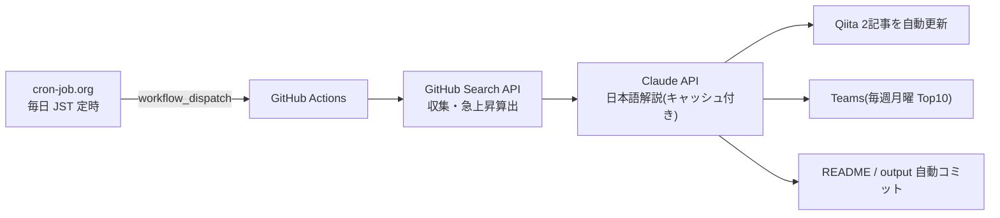

# Claude Code向けMCPツール候補ランキング

GitHub Search APIを使って、Claude Code周辺で活用候補になりそうなMCP関連リポジトリを定期収集するリポジトリです。

> 注意: この一覧は「Claude Codeでの動作」を保証するものではありません。  
> GitHub上のリポジトリ名・説明文・READMEなどに含まれる情報をもとに、MCP関連ツール候補を探すための入口として利用します。

## 仕組み(定常自律運転)

このランキングは cron-job.org → GitHub Actions → Claude API → Qiita / Teams のパイプラインで、毎日無人更新されています。


```mermaid
flowchart LR
    A["cron-job.org<br>毎日 JST 定時"] -->|workflow_dispatch| B["GitHub Actions"]
    B --> C["GitHub Search API<br>収集・急上昇算出"]
    C --> D["Claude API<br>日本語解説(キャッシュ付き)"]
    D --> E["Qiita 2記事を自動更新"]
    D --> F["Teams(毎週月曜 Top10)"]
    D --> G["README / output 自動コミット"]
```

- 仕組みの詳細と**ライブ稼働ステータス**: [定常自律運転ページ](https://takanobusano.github.io/mcp-github-ranking/)
- 作り方の解説記事: [パイプライン編](https://qiita.com/4q_sano/items/913e93ee5cc2731561fc) / [cron-job.org 完全自動化編](https://qiita.com/4q_sano/items/1bc5e0669a8f0166936c)
<!-- MCP_REPOS_START -->
最終更新: **2026-10-09 08:17:15 JST**

MCP関連リポジトリに加え、Claude Code周辺で活用候補になりそうな関連ツールをGitHub Search APIで毎日自動収集してランキング化しています。

Stars / Forks の差分は、UTC基準の前日データ（2026-10-07）との差分です。
CSVには最大500件を保存し、本文では上位100件を表示しています。

> 注意: この一覧はClaude Codeでの動作を保証するものではありません。  
> MCP関連ツールまたはClaude Code関連ツール候補を探すための入口として利用してください。

# 注目MCP・関連ツール候補ランキング

## 1位 [public-apis/public-apis](https://github.com/public-apis/public-apis)

A collective list of free APIs

⭐ **486,783 Stars**（+29）　🍴 **53,888 Forks**（+45）　/　🟢 **2,087 Open Issues**　/　Python

Topics: `api` / `apis` / `dataset` / `development` / `free` / `list` / `lists` / `open-source`

## 2位 [openclaw/openclaw](https://github.com/openclaw/openclaw)

The AI that really does things. Any OS. Any Platform. The lobster way. 🦞

⭐ **391,475 Stars**（-124）　🍴 **82,297 Forks**（+11）　/　🟢 **9,572 Open Issues**　/　TypeScript

Topics: `ai` / `assistant` / `crustacean` / `molty` / `openclaw` / `own-your-data` / `personal`

## 3位 [obra/superpowers](https://github.com/obra/superpowers)

An agentic skills framework & software development methodology that works.

⭐ **296,555 Stars**（+176）　🍴 **26,486 Forks**（+30）　/　🟢 **324 Open Issues**　/　Shell

Topics: `ai` / `brainstorming` / `coding` / `obra` / `sdlc` / `skills` / `subagent-driven-development` / `superpowers`

## 4位 [mattpocock/skills](https://github.com/mattpocock/skills)

Skills for Real Engineers. Straight from my .agents directory.

⭐ **281,013 Stars**（+1,480）　🍴 **23,555 Forks**（+135）　/　🟢 **164 Open Issues**　/　Shell

Topics: `topicなし`

## 5位 [affaan-m/ECC](https://github.com/affaan-m/ECC)

The agent harness performance optimization system. Skills, instincts, memory, security, and research-first development for Claude Code, Codex, Opencode, Cursor and beyond.

⭐ **275,371 Stars**（+454）　🍴 **41,101 Forks**（+91）　/　🟢 **263 Open Issues**　/　JavaScript

Topics: `ai-agents` / `anthropic` / `claude` / `claude-code` / `developer-tools` / `llm` / `mcp` / `productivity`

## 6位 [NousResearch/hermes-agent](https://github.com/NousResearch/hermes-agent)

The agent that grows with you

⭐ **252,032 Stars**（+99）　🍴 **54,379 Forks**（+125）　/　🟢 **47,812 Open Issues**　/　Python

Topics: `ai` / `ai-agent` / `ai-agents` / `anthropic` / `chatgpt` / `claude` / `claude-code` / `codex`

## 7位 [multica-ai/andrej-karpathy-skills](https://github.com/multica-ai/andrej-karpathy-skills)

A single CLAUDE.md file to improve Claude Code behavior, derived from Andrej Karpathy's observations on LLM coding pitfalls.

⭐ **217,435 Stars**（-2）　🍴 **21,904 Forks**（+15）　/　🟢 **131 Open Issues**　/　不明

Topics: `topicなし`

## 8位 [ultraworkers/claw-code](https://github.com/ultraworkers/claw-code)

An agent-managed museum exhibit, built in Rust with Gajae-Code / LazyCodex — developed and maintained with no human intervention.

⭐ **194,990 Stars**（-207）　🍴 **108,129 Forks**（-21）　/　🟢 **47 Open Issues**　/　Rust

Topics: `topicなし`

## 9位 [firecrawl/firecrawl](https://github.com/firecrawl/firecrawl)

Supercharge your AI agents with data from the web and beyond. Building the library for superintelligence. 🔥

⭐ **189,616 Stars**（+132）　🍴 **10,059 Forks**（+15）　/　🟢 **534 Open Issues**　/　TypeScript

Topics: `ai` / `ai-agents` / `ai-crawler` / `ai-scraping` / `ai-search` / `crawler` / `data-extraction` / `html-to-markdown`

## 10位 [ollama/ollama](https://github.com/ollama/ollama)

Get up and running with Kimi, GLM, MiniMax, DeepSeek, gpt-oss, Qwen, Gemma and other models.

⭐ **182,406 Stars**（-88）　🍴 **18,165 Forks**（+26）　/　🟢 **4,213 Open Issues**　/　Go

Topics: `deepseek` / `gemma` / `gemma3` / `glm` / `go` / `golang` / `gpt-oss` / `llama`

## 11位 [anthropics/skills](https://github.com/anthropics/skills)

Public repository for Agent Skills

⭐ **179,990 Stars**（-65）　🍴 **21,316 Forks**（+14）　/　🟢 **1,395 Open Issues**　/　Python

Topics: `agent-skills`

## 12位 [DietrichGebert/ponytail](https://github.com/DietrichGebert/ponytail)

Makes your AI agent think like the laziest senior dev in the room. The best code is the code you never wrote.

⭐ **158,482 Stars**（+924）　🍴 **8,526 Forks**（+61）　/　🟢 **24 Open Issues**　/　JavaScript

Topics: `agent-skills` / `ai-agents` / `claude` / `claude-code` / `claude-code-plugin` / `cursor-rules` / `developer-tools` / `llm`

## 13位 [msitarzewski/agency-agents](https://github.com/msitarzewski/agency-agents)

A complete AI agency at your fingertips - From frontend wizards to Reddit community ninjas, from whimsy injectors to reality checkers. Each agent is a specialized expert with personality, processes, and proven deliverables.

⭐ **158,330 Stars**（+82）　🍴 **25,542 Forks**（+41）　/　🟢 **180 Open Issues**　/　Shell

Topics: `topicなし`

## 14位 [langgenius/dify](https://github.com/langgenius/dify)

Build Agentic workflows, RAG pipelines, with rich AI model and tool support on one collaborative workspace. Deploy on cloud, VPC, or self-hosted, so teams move from prototype to production without rebuilding the stack.

⭐ **157,926 Stars**（-113）　🍴 **24,944 Forks**（+9）　/　🟢 **1,112 Open Issues**　/　TypeScript

Topics: `agent` / `agentic-ai` / `agentic-framework` / `agentic-workflow` / `ai` / `automation` / `claude` / `deepseek`

## 15位 [langflow-ai/langflow](https://github.com/langflow-ai/langflow)

Langflow is a powerful tool for building and deploying AI-powered agents and workflows.

⭐ **155,401 Stars**（-168）　🍴 **10,190 Forks**（-3）　/　🟢 **1,140 Open Issues**　/　Python

Topics: `agents` / `chatgpt` / `generative-ai` / `large-language-models` / `multiagent` / `react-flow`

## 16位 [anthropics/claude-code](https://github.com/anthropics/claude-code)

Claude Code is an agentic coding tool that lives in your terminal, understands your codebase, and helps you code faster by executing routine tasks, explaining complex code, and handling git workflows - all through natural language commands.

⭐ **149,715 Stars**（-57）　🍴 **25,762 Forks**（+43）　/　🟢 **14,559 Open Issues**　/　TypeScript

Topics: `topicなし`

## 17位 [x1xhlol/system-prompts-and-models-of-ai-tools](https://github.com/x1xhlol/system-prompts-and-models-of-ai-tools)

FULL Augment Code, Claude Code, Cluely, CodeBuddy, Comet, Cursor, Devin AI, Junie, Kiro, Leap.new, Lovable, Manus, NotionAI, Orchids.app, Perplexity, Poke, Qoder, Replit, Same.dev, Trae, Traycer AI, VSCode Agent, Warp.dev, Windsurf, Xcode, Z.ai Code, Dia & v0. (And other Open Sourced) System Prompts, Internal Tools & AI Models

⭐ **143,909 Stars**（-170）　🍴 **34,775 Forks**（-7）　/　🟢 **163 Open Issues**　/　不明

Topics: `ai` / `bolt` / `cluely` / `copilot` / `cursor` / `cursorai` / `devin` / `github-copilot`

## 18位 [farion1231/cc-switch](https://github.com/farion1231/cc-switch)

A cross-platform desktop All-in-One assistant for Claude Code, Codex, OpenCode, OpenClaw, Grok Build & Hermes Agent. Only official website: ccswitch.io

⭐ **141,341 Stars**（+570）　🍴 **9,466 Forks**（+22）　/　🟢 **2,952 Open Issues**　/　Rust

Topics: `ai-tools` / `claude-code` / `codex` / `desktop-app` / `grok` / `grokbuild` / `hermes` / `hermes-agent`

## 19位 [garrytan/gstack](https://github.com/garrytan/gstack)

Use Garry Tan's exact Claude Code setup: 23 opinionated tools that serve as CEO, Designer, Eng Manager, Release Manager, Doc Engineer, and QA

⭐ **135,637 Stars**（-57）　🍴 **20,148 Forks**（+14）　/　🟢 **170 Open Issues**　/　TypeScript

Topics: `topicなし`

## 20位 [nextlevelbuilder/ui-ux-pro-max-skill](https://github.com/nextlevelbuilder/ui-ux-pro-max-skill)

An AI skill that provides design intelligence for building professional UI/UX across multiple platforms.

⭐ **133,898 Stars**（+72）　🍴 **14,224 Forks**（+38）　/　🟢 **89 Open Issues**　/　Python

Topics: `ai-skills` / `antigravity` / `claude` / `claude-code` / `codex` / `command-line` / `copilot` / `cursor-ai`

## 21位 [harry0703/MoneyPrinterTurbo](https://github.com/harry0703/MoneyPrinterTurbo)

利用 AI 大模型和自动化工作流，根据主题或关键词一键生成高清短视频。Generate HD short videos from a topic or keyword with an automated AI workflow.

⭐ **129,187 Stars**（+69）　🍴 **20,247 Forks**（+39）　/　🟢 **52 Open Issues**　/　Python

Topics: `ai-video-generator` / `content-creation` / `ffmpeg` / `instagram-reels` / `llm` / `python` / `short-video` / `subtitles`

## 22位 [Graphify-Labs/graphify](https://github.com/Graphify-Labs/graphify)

Turn any codebase, with its docs, SQL schemas, configs, and PDFs, into a queryable knowledge graph. A /graphify skill for Claude Code, Cursor, Codex, and Gemini CLI: local deterministic AST parsing, every edge explained, no vector store.

⭐ **124,749 Stars**（+78）　🍴 **12,047 Forks**（+30）　/　🟢 **1,553 Open Issues**　/　Python

Topics: `ai-agents` / `antigravity` / `ast` / `claude-code` / `code-analysis` / `code-search` / `codex` / `cursor`

## 23位 [browser-use/browser-use](https://github.com/browser-use/browser-use)

Agents that use the browser.

⭐ **117,318 Stars**（-75）　🍴 **12,980 Forks**（+19）　/　🟢 **532 Open Issues**　/　Python

Topics: `ai-agents` / `ai-tools` / `browser-automation` / `browser-use` / `llm` / `playwright` / `python`

## 24位 [JuliusBrussee/caveman](https://github.com/JuliusBrussee/caveman)

🪨 why use many token when few token do trick. Viral skill + proxy for coding agents that cuts 65% of tokens by talking like a caveman.

⭐ **110,584 Stars**（+177）　🍴 **6,404 Forks**（+16）　/　🟢 **47 Open Issues**　/　Go

Topics: `ai` / `anthropic` / `caveman` / `claude` / `claude-code` / `llm` / `meme` / `prompt-engineering`

## 25位 [TauricResearch/TradingAgents](https://github.com/TauricResearch/TradingAgents)

TradingAgents: Multi-Agents LLM Financial Trading Framework

⭐ **110,281 Stars**（+147）　🍴 **21,207 Forks**（+29）　/　🟢 **95 Open Issues**　/　Python

Topics: `agent` / `finance` / `llm` / `multiagent` / `trading`

## 26位 [google-gemini/gemini-cli](https://github.com/google-gemini/gemini-cli)

An open-source AI agent that brings the power of Gemini directly into your terminal.

⭐ **107,257 Stars**（+7）　🍴 **14,705 Forks**（-5）　/　🟢 **769 Open Issues**　/　TypeScript

Topics: `ai` / `ai-agents` / `cli` / `gemini` / `gemini-api` / `mcp-client` / `mcp-server`

## 27位 [addyosmani/agent-skills](https://github.com/addyosmani/agent-skills)

Production-grade engineering skills for AI coding agents.

⭐ **103,377 Stars**（+604）　🍴 **10,819 Forks**（+52）　/　🟢 **138 Open Issues**　/　JavaScript

Topics: `agent-skills` / `antigravity` / `claude-code` / `codex` / `cursor` / `skills`

## 28位 [nexu-io/open-design](https://github.com/nexu-io/open-design)

🎨 Best DeepSeek Harness Design Plugin. The open-source Claude Design alternative. 🖥️ Local-first desktop app. 🖼️ Your coding agent becomes the design engine: pr...

⭐ **100,043 Stars**（+178）　🍴 **11,542 Forks**（+11）　/　🟢 **1,156 Open Issues**　/　TypeScript

Topics: `agent-skills` / `ai-design` / `byok` / `claude-code-for-design` / `claude-design` / `codex-design` / `coding-agents` / `cursor-design`

## 29位 [paperclipai/paperclip](https://github.com/paperclipai/paperclip)

The open-source app everyone uses to manage agents at work

⭐ **98,833 Stars**（+393）　🍴 **16,692 Forks**（+58）　/　🟢 **6,231 Open Issues**　/　TypeScript

Topics: `topicなし`

## 30位 [thedotmack/claude-mem](https://github.com/thedotmack/claude-mem)

Persistent Context Across Sessions for Every Agent –  Captures everything your agent does during sessions, compresses it with AI, and injects relevant context back into future sessions. Works with Claude Code, OpenClaw, Codex, Gemini, Hermes, Copilot, OpenCode + More

⭐ **98,424 Stars**（+738）　🍴 **8,633 Forks**（+32）　/　🟢 **108 Open Issues**　/　TypeScript

Topics: `ai` / `ai-agents` / `ai-memory` / `anthropic` / `artificial-intelligence` / `chromadb` / `claude` / `claude-agent-sdk`

## 31位 [microsoft/playwright](https://github.com/microsoft/playwright)

Playwright is a framework for Web Testing and Automation. It allows testing Chromium, Firefox and WebKit with a single API.

⭐ **97,315 Stars**（+78）　🍴 **6,562 Forks**（+3）　/　🟢 **171 Open Issues**　/　TypeScript

Topics: `automation` / `chrome` / `chromium` / `e2e-testing` / `electron` / `end-to-end-testing` / `firefox` / `javascript`

## 32位 [puppeteer/puppeteer](https://github.com/puppeteer/puppeteer)

JavaScript API for Chrome and Firefox

⭐ **95,670 Stars**（±0）　🍴 **9,587 Forks**（-1）　/　🟢 **267 Open Issues**　/　TypeScript

Topics: `automation` / `chrome` / `chromium` / `developer-tools` / `firefox` / `headless-chrome` / `node-module` / `testing`

## 33位 [Panniantong/Agent-Reach](https://github.com/Panniantong/Agent-Reach)

Give your AI agent eyes to see the entire internet. Read & search Twitter, Reddit, YouTube, GitHub, Bilibili, XiaoHongShu — one CLI, zero API fees.

⭐ **94,114 Stars**（+911）　🍴 **8,231 Forks**（+67）　/　🟢 **202 Open Issues**　/　Python

Topics: `agent-infrastructure` / `ai-agent` / `ai-search` / `automation` / `bilibili` / `claude-code` / `cli` / `cursor`

## 34位 [Leonxlnx/taste-skill](https://github.com/Leonxlnx/taste-skill)

Taste-Skill - gives your AI good taste. stops the AI from generating boring, generic slop

⭐ **93,811 Stars**（+306）　🍴 **6,369 Forks**（+25）　/　🟢 **78 Open Issues**　/　JavaScript

Topics: `agent` / `ai` / `claude` / `claude-code` / `codex` / `coding` / `design` / `frontend`

## 35位 [OpenCut-app/OpenCut](https://github.com/OpenCut-app/OpenCut)

The open-source CapCut alternative

⭐ **93,234 Stars**（+124）　🍴 **9,151 Forks**（+13）　/　🟢 **375 Open Issues**　/　TypeScript

Topics: `editor` / `oss` / `videoeditor`

## 36位 [modelcontextprotocol/servers](https://github.com/modelcontextprotocol/servers)

Model Context Protocol Servers

⭐ **91,081 Stars**（+13）　🍴 **11,767 Forks**（+6）　/　🟢 **495 Open Issues**　/　TypeScript

Topics: `topicなし`

## 37位 [OpenHands/OpenHands](https://github.com/OpenHands/OpenHands)

🙌 OpenHands: AI-Driven Development

⭐ **90,300 Stars**（+93）　🍴 **11,950 Forks**（+12）　/　🟢 **956 Open Issues**　/　TypeScript

Topics: `agent` / `artificial-intelligence` / `chatgpt` / `claude-ai` / `cli` / `developer-tools` / `gpt` / `llm`

## 38位 [ChatGPTNextWeb/NextChat](https://github.com/ChatGPTNextWeb/NextChat)

✨ Zero-config AI chat assistant. No API key needed — sign up and instantly chat with GPT-5, Claude 4, Gemini 2.5, DeepSeek & 100+ top models. Pay-as-you-go save...

⭐ **88,835 Stars**（-2）　🍴 **58,905 Forks**（-12）　/　🟢 **852 Open Issues**　/　TypeScript

Topics: `calclaude` / `claude` / `cross-platform` / `desktop` / `fe` / `gemini` / `gemini-pro` / `gemini-server`

## 39位 [koala73/worldmonitor](https://github.com/koala73/worldmonitor)

Real-time global intelligence dashboard. AI-powered news aggregation, geopolitical monitoring, and infrastructure tracking in a unified situational awareness interface

⭐ **88,065 Stars**（+76）　🍴 **13,437 Forks**（+15）　/　🟢 **350 Open Issues**　/　TypeScript

Topics: `agent` / `ai` / `dashboard` / `geopolitics` / `mcp` / `mcp-server` / `monitoring` / `news`

## 40位 [stablyai/orca](https://github.com/stablyai/orca)

Orca is the ADE for working with a fleet of parallel agents. Run any coding agent with your own subscription. Available on desktop, mobile and remote runtime.

⭐ **87,900 Stars**（+803）　🍴 **5,625 Forks**（+40）　/　🟢 **8,222 Open Issues**　/　TypeScript

Topics: `ade` / `agent-ide` / `ai-agents` / `claude-code` / `cli` / `codex` / `cursor-agent` / `devtools`

## 41位 [D4Vinci/Scrapling](https://github.com/D4Vinci/Scrapling)

🕷️ An adaptive Web Scraping framework that handles everything from a single request to a full-scale crawl! Don't be shy, join here:  and follow here for daily tips and tricks:

⭐ **86,372 Stars**（+205）　🍴 **8,858 Forks**（+23）　/　🟢 **9 Open Issues**　/　Python

Topics: `ai` / `ai-scraping` / `automation` / `crawler` / `crawling` / `crawling-python` / `data` / `data-extraction`

## 42位 [Egonex-AI/Understand-Anything](https://github.com/Egonex-AI/Understand-Anything)

Graphs that teach > graphs that impress. Turn any code into an interactive knowledge graph you can explore, search, and ask questions about. Works with Claude Code, Codex, Cursor, Copilot, Gemini CLI, and more.

⭐ **85,640 Stars**（+113）　🍴 **7,198 Forks**（±0）　/　🟢 **318 Open Issues**　/　TypeScript

Topics: `antigravity-skills` / `business-knowledge` / `claude-code` / `claude-skills` / `codebase-analysis` / `codex` / `codex-skills` / `developer-tools-ai-agent`

## 43位 [laravel/laravel](https://github.com/laravel/laravel)

Laravel is a web application framework with expressive, elegant syntax. We’ve already laid the foundation for your next big idea — freeing you to create without sweating the small things.

⭐ **85,052 Stars**（±0）　🍴 **26,944 Forks**（+24）　/　🟢 **31 Open Issues**　/　Blade

Topics: `framework` / `laravel` / `php`

## 44位 [unclecode/crawl4ai](https://github.com/unclecode/crawl4ai)

Open-source web crawler and scraper for LLMs and AI agents: any website into clean, LLM-ready Markdown. Run it yourself, or use Crawl4AI Cloud with one key.

⭐ **85,022 Stars**（+108）　🍴 **8,820 Forks**（+19）　/　🟢 **232 Open Issues**　/　Python

Topics: `ai` / `ai-agents` / `crawler` / `data-extraction` / `llm` / `markdown` / `mcp` / `open-source`

## 45位 [bytedance/deer-flow](https://github.com/bytedance/deer-flow)

An open-source long-horizon SuperAgent harness that researches, codes, and creates. With the help of sandboxes, memories, tools, skill, subagents and message gateway, it handles different levels of tasks that could take minutes to hours.

⭐ **83,532 Stars**（+59）　🍴 **11,604 Forks**（+9）　/　🟢 **899 Open Issues**　/　Python

Topics: `agent` / `agentic` / `agentic-framework` / `agentic-workflow` / `ai` / `ai-agents` / `deep-research` / `harness`

## 46位 [lobehub/lobehub](https://github.com/lobehub/lobehub)

🤯 LobeHub is your Chief Agent Operator, organizing your agents into 7×24 operations by hiring, scheduling, and reporting on your entire AI team.

⭐ **83,064 Stars**（+22）　🍴 **15,959 Forks**（+1）　/　🟢 **1,062 Open Issues**　/　TypeScript

Topics: `agent` / `agent-collaboration` / `agent-harness` / `ai` / `cao` / `chatgpt` / `chief-agent-operator` / `claude`

## 47位 [rtk-ai/rtk](https://github.com/rtk-ai/rtk)

CLI proxy that reduces LLM token consumption by 60-90% on common dev commands. Single Rust binary, zero dependencies

⭐ **82,717 Stars**（+79）　🍴 **5,252 Forks**（+2）　/　🟢 **1,514 Open Issues**　/　Rust

Topics: `agentic-coding` / `ai-coding` / `anthropic` / `claude-code` / `cli` / `command-line-tool` / `cost-reduction` / `developer-tools`

## 48位 [abi/screenshot-to-code](https://github.com/abi/screenshot-to-code)

Drop in a screenshot and convert it to clean code (HTML/Tailwind/React/Vue)

⭐ **80,094 Stars**（+31）　🍴 **9,786 Forks**（±0）　/　🟢 **147 Open Issues**　/　Python

Topics: `topicなし`

## 49位 [tt-a1i/archify](https://github.com/tt-a1i/archify)

Turn any idea, plan, or codebase into a beautiful interactive diagram. An agent skill for Claude Code, Codex, and more.

⭐ **79,961 Stars**（+760）　🍴 **5,362 Forks**（+48）　/　🟢 **218 Open Issues**　/　JavaScript

Topics: `agent-skills` / `ai-agents` / `architecture-diagram` / `claude-code` / `claude-skills` / `codex` / `coding-agents` / `deepseek-harness`

## 50位 [pbakaus/impeccable](https://github.com/pbakaus/impeccable)

The design language that makes your AI harness better at design.

⭐ **78,641 Stars**（+416）　🍴 **4,672 Forks**（+27）　/　🟢 **60 Open Issues**　/　JavaScript

Topics: `topicなし`

## 51位 [shareAI-lab/learn-claude-code](https://github.com/shareAI-lab/learn-claude-code)

Bash is all you need -  A nano claude code–like 「agent harness」, built from 0 to 1

⭐ **78,183 Stars**（+67）　🍴 **12,527 Forks**（+1）　/　🟢 **61 Open Issues**　/　Python

Topics: `agent` / `agent-development` / `ai-agent` / `claude` / `claude-code` / `educational` / `llm` / `python`

## 52位 [unslothai/unsloth](https://github.com/unslothai/unsloth)

Local UI to run and train LLMs and diffusion models. Supports GGUF, MLX, Qwen3.8, DeepSeek-V4, MiniMax-H3, Gemma 4, FLUX and more.

⭐ **77,522 Stars**（+152）　🍴 **7,147 Forks**（+12）　/　🟢 **764 Open Issues**　/　Python

Topics: `agent` / `ai` / `chatgpt` / `deepseek` / `fine-tuning` / `gemma` / `image-generation` / `llama`

## 53位 [Eugeny/tabby](https://github.com/Eugeny/tabby)

A terminal for a more modern age

⭐ **74,871 Stars**（+19）　🍴 **4,280 Forks**（+3）　/　🟢 **2,825 Open Issues**　/　TypeScript

Topics: `serial` / `ssh-client` / `telnet-client` / `terminal` / `terminal-emulators`

## 54位 [headroomlabs-ai/headroom](https://github.com/headroomlabs-ai/headroom)

Compress tool outputs, logs, files, and RAG chunks before they reach the LLM. 20% fewer tokens for coding agents, 60-95% fewer tokens for JSON, same answers. Library, proxy, MCP server.

⭐ **74,754 Stars**（+161）　🍴 **5,786 Forks**（+11）　/　🟢 **379 Open Issues**　/　Python

Topics: `agent` / `ai` / `anthropic` / `claude-code` / `compression` / `context-engineering` / `context-window` / `cursor`

## 55位 [thedaviddias/Front-End-Checklist](https://github.com/thedaviddias/Front-End-Checklist)

🗂 The essential checklist for modern web development, for humans and AI agents

⭐ **74,408 Stars**（+12）　🍴 **6,757 Forks**（±0）　/　🟢 **5 Open Issues**　/　MDX

Topics: `ai-agent` / `ai-agents` / `checklist` / `css` / `front-end-developer-tool` / `front-end-development` / `frontend` / `guidelines`

## 56位 [diegosouzapw/OmniRoute](https://github.com/diegosouzapw/OmniRoute)

Never stop coding. Free MIT AI gateway: one endpoint, 359 providers (150+ free), 1200+ models Kimi, Claude, GPT, Gemini, GLM, DeepSeek, MiniMax. Works with Claude Code, Codex, Cursor, OpenCode, Cline & Copilot. Quota-aware auto-fallback, RTK+Caveman compression saves 15-95% tokens, MCP/A2A, Desktop/PWA. Built by hundreds of contributors

⭐ **74,300 Stars**（+367）　🍴 **10,698 Forks**（+58）　/　🟢 **400 Open Issues**　/　TypeScript

Topics: `a2a` / `ai-agents` / `ai-gateway` / `anthropic` / `claude` / `claude-code` / `cline` / `codex`

## 57位 [ruvnet/ruflo](https://github.com/ruvnet/ruflo)

🌊 The original agent harness. Deploy intelligent multi-player swarms, coordinate autonomous workflows, and build conversational AI systems. Features adaptive me...

⭐ **74,142 Stars**（+73）　🍴 **8,811 Forks**（+4）　/　🟢 **1,014 Open Issues**　/　TypeScript

Topics: `agentic-ai` / `agentic-framework` / `agentic-workflow` / `agents` / `ai-agents` / `ai-assistant` / `ai-skills` / `autonomous-agents`

## 58位 [openbq-org/OpenBB](https://github.com/openbq-org/OpenBB)

Open Data Platform for analysts, quants and AI agents.

⭐ **73,985 Stars**（+33）　🍴 **7,640 Forks**（±0）　/　🟢 **88 Open Issues**　/　Python

Topics: `ai` / `crypto` / `derivatives` / `economics` / `equity` / `finance` / `fixed-income` / `machine-learning`

## 59位 [colbymchenry/codegraph](https://github.com/colbymchenry/codegraph)

Pre-indexed code knowledge graph, auto syncs on code changes, for Claude Code, Codex, Gemini, Cursor, OpenCode, AntiGravity, Kiro, CoPilot, and Hermes Agent — fewer tokens, fewer tool calls, 100% local

⭐ **73,497 Stars**（+95）　🍴 **4,729 Forks**（+11）　/　🟢 **526 Open Issues**　/　C

Topics: `topicなし`

## 60位 [cline/cline](https://github.com/cline/cline)

Autonomous coding agent as an SDK, IDE extension, or CLI assistant.

⭐ **70,034 Stars**（+41）　🍴 **7,621 Forks**（+2）　/　🟢 **1,628 Open Issues**　/　TypeScript

Topics: `topicなし`

## 61位 [code-yeongyu/oh-my-openagent](https://github.com/code-yeongyu/oh-my-openagent)

OmO: Just type "mass ulw" keyword with your prompt. Now you are the master of graph engineering.

⭐ **69,896 Stars**（+20）　🍴 **5,743 Forks**（+1）　/　🟢 **1,171 Open Issues**　/　TypeScript

Topics: `ai` / `ai-agents` / `anthropic` / `chatgpt` / `claude` / `claude-skills` / `codex` / `cursor`

## 62位 [asgeirtj/system_prompts_leaks](https://github.com/asgeirtj/system_prompts_leaks)

Documented system prompts from Anthropic - Claude Fable 5.1, Opus 5.5, Claude Design, Claude Code. OpenAI - ChatGPT GPT-6-Astra, Codex. Google - Gemini 3.8 Flash, 3.1 Pro, Antigravity. xAI - Grok, Grok Bot, Cursor, Kimi and more! Updated regularly.

⭐ **69,155 Stars**（+73）　🍴 **11,237 Forks**（+17）　/　🟢 **56 Open Issues**　/　Python

Topics: `ai` / `ai-agents` / `ai-prompts` / `anthropic` / `chatbot` / `chatgpt` / `claude` / `claude-code`

## 63位 [docling-project/docling](https://github.com/docling-project/docling)

Get your documents ready for gen AI

⭐ **68,555 Stars**（+53）　🍴 **5,027 Forks**（+8）　/　🟢 **1,024 Open Issues**　/　Python

Topics: `ai` / `convert` / `document-parser` / `document-parsing` / `documents` / `docx` / `html` / `markdown`

## 64位 [openinterpreter/openinterpreter](https://github.com/openinterpreter/openinterpreter)

A coding agent for open models like Kimi K3 and GLM 5.3

⭐ **68,529 Stars**（+9）　🍴 **5,888 Forks**（-1）　/　🟢 **11 Open Issues**　/　Rust

Topics: `acp` / `coding-agent` / `deepseek` / `kimi` / `python` / `qwen` / `rust`

## 65位 [usestrix/strix](https://github.com/usestrix/strix)

Open-source AI penetration testing tool to find and fix your app’s vulnerabilities.

⭐ **67,308 Stars**（+208）　🍴 **7,393 Forks**（+30）　/　🟢 **452 Open Issues**　/　Python

Topics: `agents` / `ai-hacking` / `ai-penetration-testing` / `ai-pentesting` / `ai-security` / `artificial-intelligence` / `bug-bounty` / `code-quality`

## 66位 [shanraisshan/claude-code-best-practice](https://github.com/shanraisshan/claude-code-best-practice)

from vibe coding to agentic engineering - practice makes claude perfect

⭐ **67,280 Stars**（+41）　🍴 **6,720 Forks**（+3）　/　🟢 **58 Open Issues**　/　HTML

Topics: `agentic-ai` / `agentic-coding` / `agentic-engineering` / `agentic-workflow` / `ai` / `ai-agents` / `anthropic` / `best-practices`

## 67位 [bradtraversy/design-resources-for-developers](https://github.com/bradtraversy/design-resources-for-developers)

Curated list of design and UI resources from stock photos, web templates, CSS frameworks, UI libraries, tools and much more

⭐ **67,109 Stars**（+5）　🍴 **12,222 Forks**（-1）　/　🟢 **13 Open Issues**　/　不明

Topics: `topicなし`

## 68位 [mem0ai/mem0](https://github.com/mem0ai/mem0)

The Memory Layer for AI Agents - Drop-in memory infrastructure for AI agents and apps. Context that persists. Built for production.

⭐ **66,839 Stars**（+63）　🍴 **7,866 Forks**（+7）　/　🟢 **802 Open Issues**　/　Python

Topics: `agentic-memory` / `agentic-memory-system` / `agents` / `ai` / `ai-agents` / `chatgpt` / `genai` / `llm`

## 69位 [xtekky/gpt4free](https://github.com/xtekky/gpt4free)

The official gpt4free repository \| various collection of powerful language models \| opus 4.6 gpt 5.3 kimi 2.5 deepseek v3.2 gemini 3

⭐ **66,770 Stars**（+3）　🍴 **13,476 Forks**（-3）　/　🟢 **5 Open Issues**　/　Python

Topics: `chatbot` / `chatbots` / `chatgpt` / `chatgpt-4` / `chatgpt-api` / `chatgpt-free` / `chatgpt4` / `deepseek`

## 70位 [NanmiCoder/MediaCrawler](https://github.com/NanmiCoder/MediaCrawler)

小红书笔记 \| 评论爬虫、抖音视频 \| 评论爬虫、快手视频 \| 评论爬虫、B 站视频 ｜ 评论爬虫、微博帖子 ｜ 评论爬虫、百度贴吧帖子 ｜ 百度贴吧评论回复爬虫  \| 知乎问答文章｜评论爬虫

⭐ **66,457 Stars**（+67）　🍴 **12,735 Forks**（+13）　/　🟢 **214 Open Issues**　/　Python

Topics: `topicなし`

## 71位 [rohitg00/ai-engineering-from-scratch](https://github.com/rohitg00/ai-engineering-from-scratch)

Learn it. Build it. Ship it for others.

⭐ **65,861 Stars**（+282）　🍴 **11,410 Forks**（+84）　/　🟢 **65 Open Issues**　/　Python

Topics: `agents` / `ai` / `ai-agents` / `ai-engineering` / `computer-vision` / `course` / `deep-learning` / `from-scratch`

## 72位 [calesthio/OpenMontage](https://github.com/calesthio/OpenMontage)

World's first open-source, agentic video production system. 12 production pipelines, 100+ tools, 700+ agent skill and production-knowledge files. Turn your AI coding assistant into a full video production studio.

⭐ **65,476 Stars**（+460）　🍴 **8,306 Forks**（+60）　/　🟢 **389 Open Issues**　/　Python

Topics: `agent` / `agentic-ai` / `ai` / `claude` / `copilot` / `cursor` / `elevenlabs` / `ffmpeg`

## 73位 [warpdotdev/warp](https://github.com/warpdotdev/warp)

Warp is an agentic development environment, born out of the terminal.

⭐ **65,397 Stars**（±0）　🍴 **5,624 Forks**（-1）　/　🟢 **5,369 Open Issues**　/　Rust

Topics: `bash` / `linux` / `macos` / `rust` / `shell` / `terminal` / `wasm` / `zsh`

## 74位 [mvanhorn/last30days-skill](https://github.com/mvanhorn/last30days-skill)

AI agent skill that researches any topic across Reddit, X, YouTube, HN, Polymarket, and the web - then synthesizes a grounded summary

⭐ **63,765 Stars**（+71）　🍴 **5,561 Forks**（+9）　/　🟢 **33 Open Issues**　/　Python

Topics: `ai-prompts` / `ai-skill` / `bluesky` / `claude` / `claude-code` / `clawhub` / `deep-research` / `hackernews`

## 75位 [upstash/context7](https://github.com/upstash/context7)

Context7 Platform -- Up-to-date code documentation for LLMs and AI code editors

⭐ **62,807 Stars**（+29）　🍴 **3,058 Forks**（+4）　/　🟢 **49 Open Issues**　/　TypeScript

Topics: `llm` / `mcp` / `mcp-server` / `vibe-coding`

## 76位 [sansan0/TrendRadar](https://github.com/sansan0/TrendRadar)

⭐AI-driven public opinion & trend monitor with multi-platform aggregation, RSS, and smart alerts.🎯 告别信息过载，你的 AI 舆情监控助手与热点筛选工具！聚合多平台热点 +  RSS 订阅，支持关键词精准筛选。AI 智能筛...

⭐ **62,744 Stars**（+25）　🍴 **24,888 Forks**（+6）　/　🟢 **68 Open Issues**　/　Python

Topics: `ai` / `bark` / `data-analysis` / `docker` / `hot-news` / `llm` / `mail` / `mcp`

## 77位 [coollabsio/coolify](https://github.com/coollabsio/coolify)

An open-source, self-hostable PaaS alternative to Vercel, Heroku & Netlify that lets you easily deploy static sites, databases, full-stack applications and 280+ one-click services on your own servers.

⭐ **62,733 Stars**（+38）　🍴 **5,616 Forks**（+8）　/　🟢 **735 Open Issues**　/　PHP

Topics: `coolify` / `databases` / `deployment` / `docker` / `docker-compose` / `inertiajs` / `laravel` / `mariadb`

## 78位 [tw93/Pake](https://github.com/tw93/Pake)

🤱🏻 Turn any webpage into a desktop app with one command.

⭐ **61,944 Stars**（+12）　🍴 **12,757 Forks**（+2）　/　🟢 **2 Open Issues**　/　Rust

Topics: `chatgpt` / `claude` / `desktop` / `gemini` / `hight-performance` / `linux` / `macos` / `no-electron`

## 79位 [1c7/chinese-independent-developer](https://github.com/1c7/chinese-independent-developer)

👩🏿‍💻👨🏾‍💻👩🏼‍💻👨🏽‍💻👩🏻‍💻中国独立开发者项目列表 -- 分享大家都在做什么

⭐ **61,696 Stars**（+19）　🍴 **5,432 Forks**（+1）　/　🟢 **1 Open Issues**　/　不明

Topics: `china` / `indie` / `indie-developer`

## 80位 [microsoft/autogen](https://github.com/microsoft/autogen)

A programming framework for agentic AI

⭐ **61,312 Stars**（+27）　🍴 **9,275 Forks**（±0）　/　🟢 **1,100 Open Issues**　/　Python

Topics: `agentic` / `agentic-agi` / `agents` / `ai` / `autogen` / `autogen-ecosystem` / `chatgpt` / `framework`

## 81位 [penpot/penpot](https://github.com/penpot/penpot)

Penpot: The open-source design platform for Product teams that need scalable collaboration.

⭐ **60,826 Stars**（+35）　🍴 **4,192 Forks**（+6）　/　🟢 **812 Open Issues**　/　Clojure

Topics: `clojure` / `clojurescript` / `design` / `prototyping` / `ui` / `ux-design` / `ux-experience`

## 82位 [BerriAI/litellm](https://github.com/BerriAI/litellm)

The fastest, litest AI Gateway. Rust core with Python SDK. Call 100+ LLM APIs in OpenAI (or native) format with cost tracking, guardrails, load balancing, and logging [Bedrock, Azure, OpenAI, Anthropic, OpenAI, VertexAI, vLLM, Nvidia NIM]

⭐ **60,390 Stars**（+87）　🍴 **12,155 Forks**（+45）　/　🟢 **5,345 Open Issues**　/　Python

Topics: `ai-gateway` / `anthropic` / `azure-openai` / `bedrock` / `gateway` / `langchain` / `litellm` / `llm`

## 83位 [meilisearch/meilisearch](https://github.com/meilisearch/meilisearch)

A lightning-fast search engine API bringing AI-powered hybrid search to your sites and applications.

⭐ **59,522 Stars**（+13）　🍴 **2,726 Forks**（+2）　/　🟢 **321 Open Issues**　/　Rust

Topics: `ai` / `api` / `app-search` / `database` / `enterprise-search` / `faceting` / `full-text-search` / `fuzzy-search`

## 84位 [MemPalace/mempalace](https://github.com/MemPalace/mempalace)

The best-benchmarked open-source AI memory system. And it's free.

⭐ **59,481 Stars**（+27）　🍴 **7,562 Forks**（+1）　/　🟢 **807 Open Issues**　/　Python

Topics: `ai` / `chromadb` / `llm` / `mcp` / `memory` / `python`

## 85位 [crewAIInc/crewAI](https://github.com/crewAIInc/crewAI)

Framework for orchestrating role-playing, autonomous AI agents. By fostering collaborative intelligence, CrewAI empowers agents to work together seamlessly, tackling complex tasks.

⭐ **59,472 Stars**（+45）　🍴 **8,663 Forks**（+5）　/　🟢 **574 Open Issues**　/　Python

Topics: `agents` / `ai` / `ai-agents` / `aiagentframework` / `llms`

## 86位 [heygen-com/hyperframes](https://github.com/heygen-com/hyperframes)

Write HTML. Render video. Built for agents.

⭐ **59,166 Stars**（+658）　🍴 **5,273 Forks**（+66）　/　🟢 **177 Open Issues**　/　TypeScript

Topics: `ai` / `animation` / `ffmpeg` / `framework` / `gsap` / `html` / `mcp` / `puppeteer`

## 87位 [FoundationAgents/OpenManus](https://github.com/FoundationAgents/OpenManus)

No fortress, purely open ground.  OpenManus is Coming.

⭐ **58,573 Stars**（+25）　🍴 **10,158 Forks**（+9）　/　🟢 **455 Open Issues**　/　Python

Topics: `topicなし`

## 88位 [hugohe3/ppt-master](https://github.com/hugohe3/ppt-master)

AI turns documents or topics into real, native PowerPoint decks—with native shapes, transitions and animations, data-backed charts and tables on demand, audio narration from speaker notes, and support for your own .pptx templates. · by Hugo He

⭐ **58,315 Stars**（+249）　🍴 **4,588 Forks**（+13）　/　🟢 **6 Open Issues**　/　Python

Topics: `ai-agent` / `aippt` / `office` / `powerpoint` / `powerpoint-generation` / `ppt` / `pptx` / `presentation`

## 89位 [twentyhq/twenty](https://github.com/twentyhq/twenty)

The open alternative to Salesforce, designed for AI.

⭐ **58,100 Stars**（+56）　🍴 **9,479 Forks**（+11）　/　🟢 **139 Open Issues**　/　TypeScript

Topics: `crm` / `crm-system` / `customer` / `good-first-issue` / `graphql` / `hacktoberfest` / `javascript` / `marketing`

## 90位 [appwrite/appwrite](https://github.com/appwrite/appwrite)

Appwrite® - complete cloud infrastructure for your web, mobile and AI apps. Including Auth, Databases, Storage, Functions, Messaging, Hosting, Realtime and more

⭐ **57,600 Stars**（+9）　🍴 **5,768 Forks**（+3）　/　🟢 **755 Open Issues**　/　TypeScript

Topics: `android` / `appwrite` / `backend` / `backend-as-a-service` / `docker` / `firebase` / `flutter` / `hosting`

## 91位 [zylon-ai/private-gpt](https://github.com/zylon-ai/private-gpt)

Complete API layer for private AI applications on local models: RAG, skills, tools, MCP, text-to-sql, and more. Works with any OpenAI-compatible inference server.

⭐ **57,561 Stars**（+2）　🍴 **7,621 Forks**（+1）　/　🟢 **17 Open Issues**　/　Python

Topics: `ai` / `ai-tools` / `on-premise`

## 92位 [Alishahryar1/free-claude-code](https://github.com/Alishahryar1/free-claude-code)

Use Claude Code, Codex, VSCode, Pi, and OpenCode (and 6 other harnesses) for free (1.3B+ free tokens) from your terminal, app, IDE, or phone, and now from the browser with native browser sessions (multi-harness + multi-model) like OpenClaw (voice supported + ToS friendly)

⭐ **56,989 Stars**（+89）　🍴 **9,094 Forks**（+20）　/　🟢 **302 Open Issues**　/　Python

Topics: `topicなし`

## 93位 [jamiepine/voicebox](https://github.com/jamiepine/voicebox)

The open-source AI voice studio. Clone, dictate, create.

⭐ **56,670 Stars**（+75）　🍴 **7,065 Forks**（+11）　/　🟢 **492 Open Issues**　/　Python

Topics: `ai` / `cuda` / `mlx` / `qwen3-tts` / `qwen3-tts-ui` / `voice-ai` / `voice-clone` / `whisper`

## 94位 [ayghri/i-have-adhd](https://github.com/ayghri/i-have-adhd)

A skill to stop your coding agent from burying the answer. ADHD-friendly output.

⭐ **55,783 Stars**（+709）　🍴 **3,186 Forks**（+28）　/　🟢 **66 Open Issues**　/　Python

Topics: `adhd` / `claude-` / `claude-code-plugin` / `claude-skills` / `developer-tools` / `productivity`

## 95位 [debpalash/VoiceStudio](https://github.com/debpalash/VoiceStudio)

VoiceStudio is the open-source, fully-local ElevenLabs alternative — voice cloning, voice design, video dubbing, dictation, transcription & audiobook creation in 646 languages.

⭐ **55,267 Stars**（+596）　🍴 **6,186 Forks**（+51）　/　🟢 **45 Open Issues**　/　Python

Topics: `ai` / `audiobook` / `cuda` / `dubbing` / `elevenlabs-alternative` / `huggingface` / `local-first` / `mlx`

## 96位 [aaif-goose/goose](https://github.com/aaif-goose/goose)

an open source, extensible AI agent that goes beyond code suggestions - install, execute, edit, and test with any LLM

⭐ **55,088 Stars**（+44）　🍴 **6,388 Forks**（+10）　/　🟢 **485 Open Issues**　/　Rust

Topics: `acp` / `ai` / `ai-agents` / `mcp`

## 97位 [blader/humanizer](https://github.com/blader/humanizer)

Agent skill that removes signs of AI-generated writing from text

⭐ **54,939 Stars**（+297）　🍴 **4,348 Forks**（+18）　/　🟢 **4 Open Issues**　/　Python

Topics: `agent-skills` / `ai-humanizer` / `ai-writing` / `chatgpt` / `claude` / `claude-code` / `codex` / `cursor`

## 98位 [router-for-me/CLIProxyAPI](https://github.com/router-for-me/CLIProxyAPI)

Wrap Antigravity, ChatGPT Codex, Claude Code, Grok Build, Muse Code, Devin as an OpenAI/Gemini/Claude/Codex compatible API service, allowing you to enjoy the free Gemini Series, GPT Series, Grok Series, Claude model through API

⭐ **54,512 Stars**（+85）　🍴 **8,299 Forks**（+19）　/　🟢 **647 Open Issues**　/　Go

Topics: `antigravity` / `claude-code` / `cluade` / `codex` / `devin` / `gemini` / `muse` / `openai`

## 99位 [eternity4719/HowToLiveBetter](https://github.com/eternity4719/HowToLiveBetter)

高性价比人生指南: 长寿防病、急救、省钱理财、法律红线、失业与工伤、医保社保、恋爱婚育、怀孕育儿、创业与做平台合规、出国与技能。每条写明成本、收益、证据等级和原始出处，只引期刊论文与官方文件。

⭐ **54,439 Stars**（+4,228）　🍴 **4,448 Forks**（+429）　/　🟢 **16 Open Issues**　/　HTML

Topics: `topicなし`

## 100位 [bmad-code-org/BMAD-METHOD](https://github.com/bmad-code-org/BMAD-METHOD)

Breakthrough Method for Agile Ai Driven Development

⭐ **53,952 Stars**（+48）　🍴 **6,074 Forks**（+4）　/　🟢 **69 Open Issues**　/　Python

Topics: `agile` / `ai` / `context-engineering` / `sdlc` / `spec-driven-development`

# 最近プッシュされたMCP・関連ツール候補

スター数ランキングとは別に、最近コードがプッシュされたリポジトリを表示します。古いスター数だけではなく、現在も開発が動いていそうな候補を探すための一覧です。

## プッシュ順 1位 [ccusage/ccusage](https://github.com/ccusage/ccusage)

npx ccusage

⭐ **18,926 Stars**（+18）　🍴 **869 Forks**（+5）　/　Rust　/　最終プッシュ: 2026-10-08

Topics: `topicなし`

## プッシュ順 2位 [manaflow-ai/cmux](https://github.com/manaflow-ai/cmux)

Open source Ghostty-based macOS terminal with vertical tabs and notifications for AI coding agents. Built for multitasking, organization, and programmability.

⭐ **28,028 Stars**（+202）　🍴 **2,471 Forks**（+11）　/　Swift　/　最終プッシュ: 2026-10-08

Topics: `amp` / `claude-code` / `cli` / `codex` / `coding-agents` / `gemini` / `ghostty` / `macos`

## プッシュ順 3位 [paperclipai/paperclip](https://github.com/paperclipai/paperclip)

The open-source app everyone uses to manage agents at work

⭐ **98,833 Stars**（+393）　🍴 **16,692 Forks**（+58）　/　TypeScript　/　最終プッシュ: 2026-10-08

Topics: `topicなし`

## プッシュ順 4位 [BerriAI/litellm](https://github.com/BerriAI/litellm)

The fastest, litest AI Gateway. Rust core with Python SDK. Call 100+ LLM APIs in OpenAI (or native) format with cost tracking, guardrails, load balancing, and logging [Bedrock, Azure, OpenAI, Anthropic, OpenAI, VertexAI, vLLM, Nvidia NIM]

⭐ **60,390 Stars**（+87）　🍴 **12,155 Forks**（+45）　/　Python　/　最終プッシュ: 2026-10-08

Topics: `ai-gateway` / `anthropic` / `azure-openai` / `bedrock` / `gateway` / `langchain` / `litellm` / `llm`

## プッシュ順 5位 [pingdotgg/t3code](https://github.com/pingdotgg/t3code)

説明なし

⭐ **26,398 Stars**（+250）　🍴 **6,863 Forks**（+86）　/　TypeScript　/　最終プッシュ: 2026-10-08

Topics: `topicなし`

## プッシュ順 6位 [trycua/cua](https://github.com/trycua/cua)

Scale computer-use 2.0 with open-source drivers, cross-OS fleets, and benchmarks for training, evaluation, and data generation.

⭐ **29,040 Stars**（+318）　🍴 **2,050 Forks**（+12）　/　Rust　/　最終プッシュ: 2026-10-08

Topics: `agent` / `ai-agent` / `apple` / `computer-use` / `computer-use-agent` / `containerization` / `cua` / `desktop-automation`

## プッシュ順 7位 [openclaw/openclaw](https://github.com/openclaw/openclaw)

The AI that really does things. Any OS. Any Platform. The lobster way. 🦞

⭐ **391,475 Stars**（-124）　🍴 **82,297 Forks**（+11）　/　TypeScript　/　最終プッシュ: 2026-10-08

Topics: `ai` / `assistant` / `crustacean` / `molty` / `openclaw` / `own-your-data` / `personal`

## プッシュ順 8位 [morluto/rea](https://github.com/morluto/rea)

Reverse engineer anything with agents, from app behavior down to native binaries.

⭐ **25,472 Stars**（+10,687）　🍴 **2,847 Forks**（+1,302）　/　TypeScript　/　最終プッシュ: 2026-10-08

Topics: `agent-skills` / `ai-agents` / `binary-analysis` / `claude-code` / `cli` / `codex` / `cordis` / `ctf`

## プッシュ順 9位 [appwrite/appwrite](https://github.com/appwrite/appwrite)

Appwrite® - complete cloud infrastructure for your web, mobile and AI apps. Including Auth, Databases, Storage, Functions, Messaging, Hosting, Realtime and more

⭐ **57,600 Stars**（+9）　🍴 **5,768 Forks**（+3）　/　TypeScript　/　最終プッシュ: 2026-10-08

Topics: `android` / `appwrite` / `backend` / `backend-as-a-service` / `docker` / `firebase` / `flutter` / `hosting`

## プッシュ順 10位 [PostHog/posthog](https://github.com/PostHog/posthog)

:hedgehog: PostHog is the leading platform for building self-driving products. Our developer tools – AI observability, analytics, session replay, flags, experiments, error tracking, logs, and more – capture all the context agents need to diagnose problems, uncover opportunities, and ship fixes. Steer it all from Slack, web, desktop, or the MCP.

⭐ **40,191 Stars**（+9）　🍴 **3,486 Forks**（+8）　/　Python　/　最終プッシュ: 2026-10-08

Topics: `ab-testing` / `ai-analytics` / `analytics` / `cdp` / `data-warehouse` / `experiments` / `feature-flags` / `javascript`

## プッシュ順 11位 [stablyai/orca](https://github.com/stablyai/orca)

Orca is the ADE for working with a fleet of parallel agents. Run any coding agent with your own subscription. Available on desktop, mobile and remote runtime.

⭐ **87,900 Stars**（+803）　🍴 **5,625 Forks**（+40）　/　TypeScript　/　最終プッシュ: 2026-10-08

Topics: `ade` / `agent-ide` / `ai-agents` / `claude-code` / `cli` / `codex` / `cursor-agent` / `devtools`

## プッシュ順 12位 [onyx-dot-app/onyx](https://github.com/onyx-dot-app/onyx)

Open Source AI Platform - AI Chat with advanced features that works with every LLM

⭐ **32,361 Stars**（+9）　🍴 **4,533 Forks**（+4）　/　Python　/　最終プッシュ: 2026-10-08

Topics: `ai` / `ai-chat` / `chatgpt` / `chatui` / `enterprise-search` / `gen-ai` / `information-retrieval` / `llm`

## プッシュ順 13位 [cline/cline](https://github.com/cline/cline)

Autonomous coding agent as an SDK, IDE extension, or CLI assistant.

⭐ **70,034 Stars**（+41）　🍴 **7,621 Forks**（+2）　/　TypeScript　/　最終プッシュ: 2026-10-08

Topics: `topicなし`

## プッシュ順 14位 [different-ai/openwork](https://github.com/different-ai/openwork)

The open-source alternative to Claude Cowork (powered by opencode)

⭐ **23,961 Stars**（+23）　🍴 **2,412 Forks**（±0）　/　TypeScript　/　最終プッシュ: 2026-10-08

Topics: `topicなし`

## プッシュ順 15位 [storytold/photocraft](https://github.com/storytold/photocraft)

An open-source, clean-room reimplementation of Adobe Photoshop in pure Rust

⭐ **26,546 Stars**（+9,861）　🍴 **3,611 Forks**（+1,419）　/　Rust　/　最終プッシュ: 2026-10-08

Topics: `adobe` / `adobe-photoshop-2026` / `adobe-photoshop-2026-ai` / `art` / `image-editing` / `image-editing-software` / `image-editor` / `images`

## プッシュ順 16位 [NousResearch/hermes-agent](https://github.com/NousResearch/hermes-agent)

The agent that grows with you

⭐ **252,032 Stars**（+99）　🍴 **54,379 Forks**（+125）　/　Python　/　最終プッシュ: 2026-10-08

Topics: `ai` / `ai-agent` / `ai-agents` / `anthropic` / `chatgpt` / `claude` / `claude-code` / `codex`

## プッシュ順 17位 [supermemoryai/supermemory](https://github.com/supermemoryai/supermemory)

Memory and context engine + app that is extremely fast, scalable, and can be run fully locally. The Memory API for the AI era.

⭐ **31,164 Stars**（+18）　🍴 **2,741 Forks**（+2）　/　TypeScript　/　最終プッシュ: 2026-10-08

Topics: `agent-memory` / `ai-memory` / `cloudflare-kv` / `cloudflare-pages` / `cloudflare-workers` / `drizzle-orm` / `memory` / `postgres`

## プッシュ順 18位 [NVIDIA/NemoClaw](https://github.com/NVIDIA/NemoClaw)

Run agents like Hermes, LangChain Deep Agents, and OpenClaw more securely inside NVIDIA OpenShell with managed inference

⭐ **22,684 Stars**（+9）　🍴 **3,132 Forks**（±0）　/　TypeScript　/　最終プッシュ: 2026-10-08

Topics: `ai-agents` / `deep-agents` / `hermes` / `nvidia` / `openclaw` / `openshell` / `sandboxing` / `typescript`

## プッシュ順 19位 [koala73/worldmonitor](https://github.com/koala73/worldmonitor)

Real-time global intelligence dashboard. AI-powered news aggregation, geopolitical monitoring, and infrastructure tracking in a unified situational awareness interface

⭐ **88,065 Stars**（+76）　🍴 **13,437 Forks**（+15）　/　TypeScript　/　最終プッシュ: 2026-10-08

Topics: `agent` / `ai` / `dashboard` / `geopolitics` / `mcp` / `mcp-server` / `monitoring` / `news`

## プッシュ順 20位 [rocketride-org/rocketride-server](https://github.com/rocketride-org/rocketride-server)

High-performance AI pipeline engine with a C++ core and 50+ Python-extensible nodes. Build, debug, and scale LLM workflows with 13+ model providers, 8+ vector databases, and agent orchestration, all from your IDE. Includes VS Code extension, TypeScript/Python SDKs, and Docker deployment.

⭐ **17,817 Stars**（-21）　🍴 **7,605 Forks**（-14）　/　Python　/　最終プッシュ: 2026-10-08

Topics: `ai` / `cpp` / `data-pipeline` / `data-processing` / `machine-learning` / `mcp` / `python` / `sdk`

## プッシュ順 21位 [garrytan/gbrain](https://github.com/garrytan/gbrain)

Garry's Opinionated OpenClaw/Hermes Agent Brain

⭐ **30,693 Stars**（+39）　🍴 **4,601 Forks**（+5）　/　TypeScript　/　最終プッシュ: 2026-10-08

Topics: `topicなし`

## プッシュ順 22位 [heygen-com/hyperframes](https://github.com/heygen-com/hyperframes)

Write HTML. Render video. Built for agents.

⭐ **59,166 Stars**（+658）　🍴 **5,273 Forks**（+66）　/　TypeScript　/　最終プッシュ: 2026-10-08

Topics: `ai` / `animation` / `ffmpeg` / `framework` / `gsap` / `html` / `mcp` / `puppeteer`

## プッシュ順 23位 [mastra-ai/mastra](https://github.com/mastra-ai/mastra)

Mastra is the modern TypeScript framework for AI-powered applications and agents.

⭐ **28,647 Stars**（+23）　🍴 **2,941 Forks**（+11）　/　TypeScript　/　最終プッシュ: 2026-10-08

Topics: `agents` / `ai` / `chatbots` / `evals` / `javascript` / `llm` / `mcp` / `nextjs`

## プッシュ順 24位 [prisma/orm](https://github.com/prisma/orm)

Next-generation ORM for Node.js & TypeScript \| PostgreSQL, MySQL, MariaDB, SQL Server, SQLite, MongoDB and CockroachDB

⭐ **47,696 Stars**（+1）　🍴 **2,542 Forks**（+1）　/　TypeScript　/　最終プッシュ: 2026-10-08

Topics: `cockroachdb` / `database` / `javascript` / `loggy-core` / `loggy-terminal` / `mariadb` / `mongodb` / `mssql`

## プッシュ順 25位 [superset-sh/superset](https://github.com/superset-sh/superset)

Superset is an agentic IDE to orchestrate 100+ coding agents in parallel. Run any agent with your own subscription.

⭐ **15,006 Stars**（+37）　🍴 **1,336 Forks**（+5）　/　TypeScript　/　最終プッシュ: 2026-10-08

Topics: `ade` / `agent` / `agent-orchestration` / `ai-agents` / `ai-coding` / `claude-code` / `cli` / `codex`

## プッシュ順 26位 [lidge-jun/opencodex](https://github.com/lidge-jun/opencodex)

Universal provider proxy for OpenAI Codex & Claude Code — use any LLM (Claude, Gemini, Grok, DeepSeek, Ollama…) with Codex CLI, App, SDK, and Claude Code

⭐ **17,125 Stars**（+61）　🍴 **1,294 Forks**（+6）　/　TypeScript　/　最終プッシュ: 2026-10-08

Topics: `ai-gateway` / `ai-tools` / `anthropic` / `chatgpt` / `claude` / `claude-code` / `codex` / `codex-cli`

## プッシュ順 27位 [steipete/CodexBar](https://github.com/steipete/CodexBar)

Show usage stats for OpenAI Codex and Claude Code, without having to login.

⭐ **22,320 Stars**（+31）　🍴 **2,079 Forks**（+4）　/　Swift　/　最終プッシュ: 2026-10-08

Topics: `ai` / `claude-code` / `codex` / `swift`

## プッシュ順 28位 [ollama/ollama](https://github.com/ollama/ollama)

Get up and running with Kimi, GLM, MiniMax, DeepSeek, gpt-oss, Qwen, Gemma and other models.

⭐ **182,406 Stars**（-88）　🍴 **18,165 Forks**（+26）　/　Go　/　最終プッシュ: 2026-10-08

Topics: `deepseek` / `gemma` / `gemma3` / `glm` / `go` / `golang` / `gpt-oss` / `llama`

## プッシュ順 29位 [pbakaus/impeccable](https://github.com/pbakaus/impeccable)

The design language that makes your AI harness better at design.

⭐ **78,641 Stars**（+416）　🍴 **4,672 Forks**（+27）　/　JavaScript　/　最終プッシュ: 2026-10-08

Topics: `topicなし`

## プッシュ順 30位 [coder/coder](https://github.com/coder/coder)

Secure environments for developers and their agents

⭐ **16,907 Stars**（+25）　🍴 **1,613 Forks**（+3）　/　Go　/　最終プッシュ: 2026-10-08

Topics: `agents` / `dev-tools` / `development-environment` / `go` / `golang` / `ide` / `jetbrains` / `remote-development`

# 検索条件

以下の検索条件でGitHubリポジトリを収集しています。

- "model context protocol" in:name,description,readme stars:>10
- "mcp server" in:name,description,readme stars:>10
- "mcp" "claude" in:name,description,readme stars:>10
- "claude" "mcp" in:name,description,readme stars:>10
- "modelcontextprotocol" in:name,description,readme stars:>10
- "claude code" in:name,description,readme stars:>10
- "claude" "plugin" in:name,description,readme stars:>10
- "claude" "memory" in:name,description,readme stars:>10

<!-- MCP_REPOS_END -->

## 仕組み

```text
GitHub Search API
  ↓
MCP / Claude Code / Model Context Protocol 関連リポジトリを検索
  ↓
スター数・更新日・Fork数・説明文を取得
  ↓
Markdown / CSV を生成
  ↓
GitHub Actionsで毎日自動実行
  ↓
READMEを自動更新
